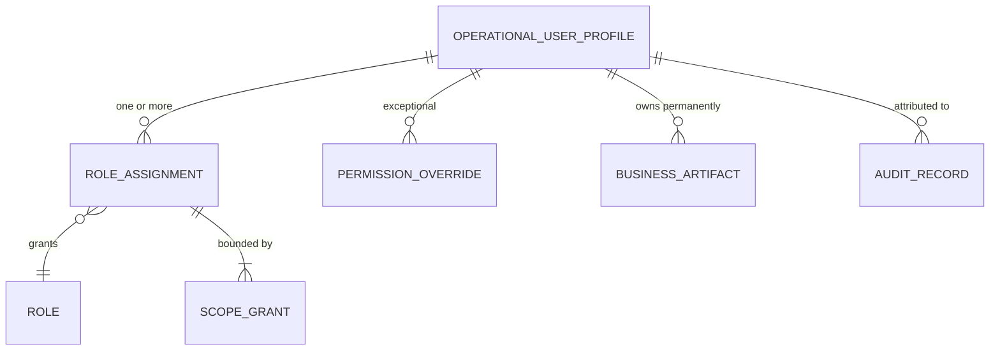

# Access Governance Architecture

**Owner:** Trioloo Technology · **Module:** Permission · **Status:** Canonical
**Version:** 1.2.0 · **Ratified:** 2026-08-08 · **Amended:** 2026-08-16 (**`AGV-042` — initial Owner bootstrap; `GAP-120` closed**) · **Amended:** 2026-08-10 (Owner designation — `BD-485`, §13.6) · **Rule prefix:** `AGV-`

---

## Document Control

**Source of truth:** [`BUSINESS_DISCOVERY.md`](BUSINESS_DISCOVERY.md) §24, `BD-369` – `BD-379`, with the reconciliation recorded at [`PERMISSION_ARCHITECTURE.md`](PERMISSION_ARCHITECTURE.md) §12 – §13, [`DOMAIN_MODEL.md`](DOMAIN_MODEL.md) v3.4.0 – v3.5.0, and [`STATE_MACHINE_ARCHITECTURE.md`](STATE_MACHINE_ARCHITECTURE.md) §24.

**References:** `DOMAIN_MODEL.md` `E-077`, `E-078` · `STATE_MACHINE_ARCHITECTURE.md` `SM-17` · [`AUDIT_ARCHITECTURE.md`](AUDIT_ARCHITECTURE.md) · [`SYSTEM_ARCHITECTURE.md`](SYSTEM_ARCHITECTURE.md) §0, §15 · [`NOTIFICATION_ARCHITECTURE.md`](NOTIFICATION_ARCHITECTURE.md) · [`DESIGN_CONSTITUTION.md`](DESIGN_CONSTITUTION.md) for all presentation.

## ⚠ Ownership boundary with `PERMISSION_ARCHITECTURE.md` — read before using either document

> **AGV-000 — This document and `PERMISSION_ARCHITECTURE.md` divide the access domain along one line: *what authority is* versus *who holds it and how it is governed over time*.** Neither restates the other.

| | `PERMISSION_ARCHITECTURE.md` — `PRM-` | **This document — `AGV-`** |
|---|---|---|
| **Owns** | The **authorisation decision model** — permission structure, authority magnitude, segregation of duties, enforcement obligations on every module, standard role definitions | **Operational identity · attribution · the composition of effective authority · override governance · scope governance · access review · self-administration · the access governance surfaces** |
| **Answers** | *"May this action, on this subject, at this magnitude, be permitted?"* | *"Who is this actor, what do they hold, why do they hold it, and is it still appropriate?"* |
| **Rule status** | **Canonical and unchanged.** `PRM-001` – `PRM-068` remain the ratified rule set | **Canonical for governance.** Every `AGV-` rule cites its `PRM-`, `BD-`, `DM-`, `INV-` or `SMA-` source |

**`DOC-005` is satisfied because these are different questions**, in the same way §4.1 of `MASTER_DOCUMENTATION_INDEX.md` distinguishes data ownership from documentation ownership. **No `PRM-` rule is duplicated here; each is referenced.**

> ⚠ **This boundary is an architectural documentation decision, not a business rule, and it should be ratified explicitly.** It is recorded as `DOC-055` in the index. **`PERMISSION_ARCHITECTURE.md` is not demoted** — its rules remain the source this document consolidates against.

> **This document consolidates confirmed decisions only.** No business rule is introduced, no entity or lifecycle is invented, and no gap is solved. Unresolved items are carried in §17.

> Contains no code, schema, API contract, or user interface specification. Authentication mechanisms, credential storage and session transport remain **engineering deliverables** constrained by `PRM §2.2` and `SYS-076`.

---

# 1. Purpose

To define **who acts in the ERP**, what they may do, why they may do it, and how that remains correct over time.

Two things make this domain load-bearing rather than administrative.

**Attribution is the foundation of the audit model, and it cannot be retrofitted.** `BD-371` states it as an absolute: **no ERP action may exist without an attributable Operational User Profile.** Every audit rule, every reconstruction requirement (`AUD-013`, `AUD-014`) and every reason-capture instance depends on that holding without exception.

**The record eleven modules read is infrastructure, not an HR artefact.** User management, roles, chat assignment, task assignment, branch/warehouse/shop scope, notifications, audit, activity history and workflow assignment all read the Operational User Profile. **That is why its ownership runs opposite to the conventional arrangement** (§4.4) — and why deferring it would have removed the foundation the rest of the ERP stands on.

---

# 2. Scope

## 2.1 In scope

The Operational User Profile and its seven components · identity permanence and non-reuse · attribution across every actor type · the composition of effective authority · roles and responsibilities as distinct concepts · scope dimensions and their governance · permission overrides and their lifecycle · access review, both event-driven and periodic · administrative authority and self-administration · the four access governance surfaces.

## 2.2 Out of scope — owned elsewhere

| Topic | Owner |
|---|---|
| **Permission structure, authority magnitude, segregation constraints, enforcement obligations** | `PERMISSION_ARCHITECTURE.md` (`AGV-000`) |
| Authentication, credential storage, encryption, session transport, MFA implementation | Engineering (`PRM §2.2`, `SYS-076`) |
| **Audit record structure and immutability** | `AUDIT_ARCHITECTURE.md` |
| **Notification delivery of review and governance alerts** | `NOTIFICATION_ARCHITECTURE.md` |
| Payroll processing, attendance, leave, appraisal, benefits | `HR_PAYROLL_ARCHITECTURE.md` ⬜ — deferred (`SYS-093`, `GAP-083`) |
| Entity structure and invariants | `DOMAIN_MODEL.md` `E-077`, `E-078` |
| Machine structure | `STATE_MACHINE_ARCHITECTURE.md` `SM-17` |

---

# 3. Architectural Principles

## 3.1 P1 — No action without an attributable identity

> **AGV-001 — No ERP action may exist without an attributable Operational User Profile** (`BD-371`, `INV-77.1`, `PRM-005`).

**`PRM-005` scoped named identities to system processes; `BD-371` makes it universal.** *"The system did it"* was already unacceptable to an auditor. **It is now unrepresentable.**

**This is an absolute rule under `CP-8`'s irreversibility axis** — attribution cannot be added afterwards, because the action has already happened.

## 3.2 P2 — Identity is permanent; authority is not

> **AGV-002 — Identity is permanent. Responsibilities and permissions change around it** (`BD-369`, `BD-372`, `PRM-055`).

**A permission change must never rewrite what someone was permitted to do at the time.** An action taken last year under authority since removed was **validly authorised then**, and the audit record must continue to say so (`DB-003`).

## 3.3 P3 — Enforce where a mistake cannot be undone

> **AGV-003 — `CP-8` governs this domain on both of its axes** (`BD-360`, `BD-376`, `BD-378`, `BD-402`).

| Axis | Applied here |
|---|---|
| **Judgement** | Whether an override remains *appropriate* is a human decision — hence review, not automatic revocation (`AGV-021`) |
| **Irreversibility** | Whether unconfirmed authority may **act** meanwhile is not a judgement — hence suspension (`AGV-022`) |
| **Feasibility** | A control that cannot be staffed is not a control (`AGV-030`) |
| **Certainty** | The system enforces where identity is deterministic and defers where it must infer |

## 3.4 P4 — Governance requires explanation, not only enforcement

> **AGV-004 — A layered authority model is unauditable unless its derivation can be shown** (`BD-374`, `PRM-059`).

**The two-sources-of-truth cost of a hybrid model is real, and this is what pays it.**

## 3.5 P5 — Four surfaces, one area

> **AGV-005 — Permission derivation, the override review queue, self-administration reporting and access review are four views of one thing and must be registered as one administrative area** (`PRM-058`, `PRM-059`, `PRM-063`, `PRM-067`, `GAP-099`).

Same subject, same audience, same data source. **Building them separately is how a seven-person business acquires four modules it did not need** (`CP-3`).

---

# 4. Operational User Profile

## 4.1 Definition

> **AGV-006 — The Operational User Profile is the operational identity of every authenticated actor in the ERP** (`BD-369`, `BD-371`, `E-077`).

| | |
|---|---|
| **Actor types** | **Human · System · Integration · Automation · AI Service** *(future)* |
| **Lifecycle** | `SYS §7.1` master record — `DRAFT → ACTIVE → SUSPENDED → ARCHIVED` |
| **Authoritative** | **Regardless of whether HR & Payroll is ever implemented** |

## 4.2 Seven components

> **AGV-007 — The profile has seven components, all required in V1; employment applies where relevant** (`BD-369`).

| Component | Carries |
|---|---|
| **Identity Information** | Name, employee ID, contact |
| **Employment Information** *(where applicable)* | Designation, department, joining date, **salary reference**, working hours, reporting manager |
| **Responsibilities** | What the user does |
| **Permissions** | What the user may do |
| **Scope Assignments** | **Branch · warehouse · marketplace shops** |
| **Activity Information** | Latest login, login history, last activity, active sessions |
| **Security Information** | Account status, password history, 2FA status |

**The seven components organise `BD-370`'s twenty-three fields.** Nothing recorded there is lost; it is structured.

> **AGV-008 — Non-human actors require no separate identity class.** A system identity needs Identity, Permissions, Scope, Activity and Security — **and no employment component at all.** *"Where applicable"* accommodates that within the same seven components (`BD-369`).

## 4.3 Four concepts remain independent

> **AGV-009 — User Identity, Employment Information, Responsibilities and Permissions are related but independent business concepts, and the system must not assume a one-to-one relationship between a user and a responsibility** (`BD-369`).

| Rule | |
|---|---|
| **One user may perform multiple responsibilities** | Confirmed |
| **Multiple users may perform the same responsibility** | Confirmed |
| **Responsibilities may change without changing identity** | `AGV-002` |

## 4.4 ⚠ Ownership runs opposite to the conventional arrangement

> **AGV-010 — HR & Payroll extends the Employment Information component. It does not own, replace, or become authoritative for the profile** (`BD-369`, `INV-77.6`, `SYS-093` as clarified).

| | Owns | Role |
|---|---|---|
| **Operational User Profile** | **Authoritative** | The record every module reads |
| **HR & Payroll** ⬜ | **Extends one component** | Payroll, attendance, leave, appraisal, benefits |

**This is `SYS-004` and `SYS-005` applied deliberately** — one owning module writes; others consume.

> **Had HR owned this record, `SYS-093`'s deferral would have removed the foundation eleven modules stand on** — and `PRM-009` would have had **nothing to bound roles with**, since branch, warehouse and marketplace-shop assignment all live here. **The corrected reading is the only one under which V1 user management works at all.**

**What `SYS-093` defers is the HR module's *functions*, not the operational record.**

## 4.5 Account creation

> **AGV-011 — There is no public registration. Accounts are created only by an authorized Owner or Administrator, and customers hold no ERP identity** (`BD-370`, `PRM-056`, `INV-77.5`, closing `PRMU-6`).

User creation, activation, suspension, credential reset and account management are **administrative functions performed only by authorized users.**

## 4.6 Salary is a sensitive class

> **AGV-012 — `Salary Reference` is present in V1 and requires `PRM-011` sensitive-class treatment** (`BD-369`, `PRM-011` as strengthened).

**A user profile is otherwise widely readable**, which is what makes this the strongest case `PRM-011` has. **Separately grantable is not a refinement here — it is the only thing preventing routine profile access from disclosing pay.**

***"Salary Reference"* is the business's own wording and is precise**: a reference figure visible for operational purposes, **distinct from payroll processing**, which `SYS-093` defers.

---

# 5. Identity Permanence

> **AGV-013 — An Operational User Profile is never transferred, shared, or reused between different people. Every authenticated actor has one permanent operational identity** (`BD-372`, `INV-77.2`, `PRM-019` as amended).

| On departure | |
|---|---|
| The account is | **Suspended or archived** |
| The profile is | **Retained permanently** |
| Historical actions | **Continue to reference the original profile** |
| The identity is | **Never reassigned** |

**A new joiner receives a new profile.** Identity permanence is **independent of employment status**, and applies equally to human users, integrations, automation and future AI service identities.

## 5.1 This is `DB-006` applied to actors

| Never reused | Rule |
|---|---|
| Internal identifiers | `DB-006` |
| Retired SKUs | `DB-012`, `PRD-013` |
| **Operational User Profiles** | **`AGV-013`** |

**In each case the identifier outlives the thing it names** — a SKU on a warranty claim, a profile on an audit record.

## 5.2 *"Never shared"* gives `PRM-002` its enforcement

`PRM-002` warns that *"staff who cannot do their jobs share accounts, and shared accounts destroy attribution entirely — a worse outcome than the permission being granted properly in the first place."*

**That was a design argument. It is now backed by an absolute prohibition**, and the two work together: **the rule forbids sharing; `PRM-002` removes the reason anyone would.**

## 5.3 ⚠ Why reuse is worse than deletion

> **A reused identity silently re-attributes years of one person's actions to another — and the record still looks complete.** `PRM-021` (user records are never deleted) is confirmed exactly, and now has the stronger companion rule that they are never *reused* either.

**This forecloses the shortcut a small team is most likely to take.** Reusing a departed colleague's login is the classic economy — the account exists, permissions are already right. `CP-3` makes it **more** tempting here, not less.

---

# 6. Operational Attribution

> **AGV-014 — An Operational User Profile owns every business artifact created by that identity, and that ownership never changes when the profile becomes inactive, suspended, archived or otherwise unavailable** (`BD-373`, `INV-77.3`).

**Sixteen artifact types are confirmed:** orders · purchases · inventory transactions · accounting transactions · approvals · customer conversations · internal notes · attachments · warranty cases · return cases · exchange cases · repair cases · tasks · notifications · audit records · activity history.

## 6.1 Two independent concepts

> **AGV-015 — Operational responsibility for ongoing work may be reassigned. Historical ownership and audit attribution always remain with the original profile. The two must never overwrite each other** (`BD-373`, `INV-77.4`, `DM-070`).

| | Reassignable |
|---|---|
| **Operational responsibility** — who is handling it now | **Yes** |
| **Historical ownership and audit attribution** — who did what | **Never** |

**Practically: when someone leaves, their in-flight work moves and their completed work does not.**

**This is the fifth instance of *relate, never collapse*.** It qualifies because these are **two representations of the same work**, and the rule governs which is authoritative — the same shape as `SYS-010`.

**Conversation ownership (`E-074`) was this rule discovered early in one domain**, and the Action Queue (`E-079`) applies it to work items.

## 6.2 Three rules form one guarantee

| Rule | Supplies |
|---|---|
| `AGV-001` | Every action **must** be attributable |
| `AGV-013` | The identity it attributes to is **permanent and never reused** |
| `AGV-014`, `AGV-015` | The attribution itself **never changes**, even when the identity goes inactive |

**Each closes a hole the previous one leaves.** Without permanence, attribution could be reassigned to a new joiner; without ownership stability, it could be overwritten at handover. **Together they mean *"who did this?"* has a correct answer forever** — which is what `AUD-013` and `AUD-014` reconstruction depend on.

## 6.3 Integration and automation actors

> **AGV-016 — Integration identities carry scope, and are bounded exactly as a person is** (`BD-371`, `BD-377`, `PRM-009`).

**A Shop 1 adapter cannot read or write Shop 2's data.** The seven Daraz adapters are **seven scoped actors, not one actor holding seven credentials.**

**AI gets no special treatment** — consistent with `BD-322`'s guardrail: AI suggests, a person approves.

**System identities accumulate and are never cleaned up.** Replacing a connector does not remove the identity that performed two years of syncs (`BD-372`, `BD-338`).

---

# 7. Roles & Responsibilities

> **AGV-017 — Role *groups* operational responsibilities; it is not a synonym for one** (`BD-374`, closing `SYS-016`).

| Concept | Definition |
|---|---|
| **Responsibility** | What a user **does** — the atom |
| **Role** | **Groups** operational responsibilities — the container |
| **Permission** | What a user is **allowed to perform** |
| **Scope** | **Where** those permissions are effective |

**`BD-369`'s many-to-many responsibilities and the role model were never in conflict.** The gap flagged at `BD-371` was **definitional, and is closed rather than traded off.**

**Designation is a third, separate thing** — a job title. `BD-370` states that *"responsibilities and job titles are not always the same."*

**Standard role definitions remain owned by `PERMISSION_ARCHITECTURE.md` §6.1.**

---

# 8. Effective Authority

> **AGV-018 — Effective authority is a four-part composition** (`BD-374`, `PRM-057`).

> **Operational User Profile + Assigned Roles + Scope Assignments + Permission Overrides**

**Permissions primarily belong to roles**; roles define the **default authority** required to perform a business responsibility. **Overrides exist for exceptional situations only and are never the primary administration method.**

| Component | Contribution |
|---|---|
| **Profile** | Who the actor is — `AGV-006` |
| **Roles** | Default authority |
| **Scope** | **Where it applies** — bounds, never grants (`AGV-024`) |
| **Overrides** | Exceptional adjustment, grant or revoke |

> **Role assignment is the unit of *role-derived* access, not of authority as a whole** (`PRM §6`, as narrowed).

---

# 9. Permission Derivation

> **AGV-019 — The ERP must always be able to explain why a user holds a particular permission, by showing Assigned Roles, Scope Assignments and User-Specific Overrides** (`BD-374`, `PRM-059`).

**This is a V1 capability the architecture did not previously have.** `PRM-028` provides an **access review** across the population — *who holds which roles*. **This requires a per-user, per-permission derivation view:** *this permission, for this user, comes from this role, bounded by this scope, adjusted by this override.*

> **A hybrid model without it becomes unauditable within a year** — precisely the failure `PRM-028` was written to catch and cannot catch alone.

**The same layered shape recurs for notification delivery** (`NOT-029`), where an explanation view is recorded as **proportionate advice rather than an obligation** — a wrong permission is a security incident; a missed notification is a support question.

---

# 10. Scope

> **AGV-020 — Ten scope dimensions are declared, and scope is enforced on read and on write** (`BD-377`, `PRM-009`, `PRM-064`).

| Dimension | Status |
|---|---|
| Company | *Future* |
| **Branch** | Active |
| **Warehouse** | Active |
| **Marketplace Shop** | Active |
| **Website** | Active |
| **Facebook Page** | Active |
| **WhatsApp Account / Number** | Active |
| **Sales Channel** | Active |
| **Department** | Active |
| Business Unit | *Future* |

**Each instance is an independent scope.** A user may hold WhatsApp Account 1 but not Account 2; Facebook Pages 1 and 3 but not 2; selected marketplace shops or websites only; or **all instances where required.**

## 10.1 Scope bounds; it never grants

> **AGV-021 — Permissions define *what* a user can do. Scope defines *where* that permission applies** (`BD-377`, `PRM-065`).

**A user with no permission gains nothing from wide scope; a user with permission and no scope acts nowhere. The two are multiplicative, not additive.**

## 10.2 ⚠ Dimension-extensibility is the binding constraint — `GAP-098`

**The business requires growth *"without changing the authorization model"*.** Because it chose **explicit per-channel dimensions** over a generic channel-instance dimension:

| Approach | Adding a new marketplace later means |
|---|---|
| A generic *Channel Instance* dimension | **A new value** — configuration |
| **Explicit per-channel dimensions** *(chosen)* | **A new dimension** |

> **Every future channel this business adds is a new scope dimension — and this business adds channels regularly.** A design enumerating the ten in fixed structure satisfies V1 and then forces exactly the authorization-model change the requirement forbids. **`GAP-098`, carried.**

## 10.3 ⚠ Scope is designed for growth and is not active today

> **`BD-377` states that most operational users currently work across all business channels**, because the business operates as one integrated organization.

**This is deliberate, not a discrepancy.** `PRM-051` recorded the model as *"richer than current practice"*; the business states that intent directly. **The fine-grained model is correct to exist and correct not to be enforced yet** (`CP-10`, `PRM-014`).

**One consequence is recorded in `NOTIFICATION_ARCHITECTURE.md` §13.2:** scope is the right control on notification volume and **is not the live one today.**

---

# 11. Permission Overrides

## 11.1 Two declared types

> **AGV-022 — Every override declares its type at creation: Permanent or Temporary** (`BD-375`, `PRM-061`, `INV-78.1`).

| Type | Behaviour |
|---|---|
| **Permanent** | Active until **explicitly reviewed, modified or removed**. ***"Permanent" names the absence of an expiry condition, not exemption from review*** |
| **Temporary** | Requires a **validity period *or expiry condition***; **automatically becomes inactive** on expiry |

***"Expiry condition"* is not a late synonym for a date.** A date passes on its own; a condition must be observed — *"until the supplier dispute is resolved"*. **`E-073` Business Case is the natural carrier** for that form.

> **Automatic expiry is an action no human performs**, and it works only because `AGV-001` gives Automation actors their own profiles. **Without that, this single rule would produce exactly what `PRM-005` forbids.**

## 11.2 Recorded fields

**Permission · Override Type · Business Reason · Granted By · Granted Date · Effective Date · Expiry Date *(temporary)* · Review Status · Review History.**

Every review records **Reviewed By · Review Date · Decision · Review Reason**.

## 11.3 Grant and revoke

> **AGV-023 — Overrides may grant *or revoke*, and the revoke direction is what prevents role proliferation** (`BD-374`, `PRM-060`).

| Case | Without a revoke override |
|---|---|
| *"Sales, but may also approve refunds"* | A new role |
| *"Sales, but this one person may not issue refunds"* | **A role defined by what it lacks** |

**`CP-3` makes this practical: a seven-person business should not maintain fifteen roles to express three exceptions.**

## 11.4 ⚠ An override may never carry a magnitude

> **AGV-024 — An override may control *whether* a user performs an action; it may never carry a percentage or amount** (`BD-275`, `PRM-052`, `INV-78.4`).

**`BD-275` prohibits per-user discount limits as an explicit build prohibition** — *"must not be built"*. **A grant/revoke mechanism is precisely the shape that prohibition could return through**, as *"just an override on the discount permission"*.

**`BD-052`'s structural claim — permissions configurable *"per user or role"* — is confirmed as the general model, while its discount-ceiling claim stays withdrawn.** The mechanism is ratified; one specific use of it remains prohibited.

## 11.5 Override lifecycle — `SM-17`

`ACTIVE → REVIEW_REQUIRED → { ACTIVE · REMOVED }`, with `EXPIRED` as a separate terminal condition.

> **AGV-025 — A role change suspends every override into `Review Required`. No suspended override becomes active again without explicit administrative approval** (`BD-376`, `PRM-062`, `INV-78.2`, `SM-17`).

**`PRM-036` ends prior role assignments automatically because the new role supplies what is needed. Overrides cannot be treated the same way** — auto-revoking breaks legitimate standing authority mid-work; auto-keeping is the silent accumulation `PRM-036` exists to prevent. **Review is the only correct third option.**

**The suspension is enforced, and `AGV-003` explains why:** whether an override remains *appropriate* is a judgement — hence review rather than revocation. **But whether unconfirmed authority may act meanwhile is not a judgement at all**, and an action taken with a permission that should have been withdrawn **cannot be undone**.

| Closed back door | |
|---|---|
| **Expired temporary overrides remain inactive through review** | Review is not a resurrection route (`INV-78.3`) |
| **No auto-reactivation** | No timeout, no silent resumption, no default-to-previous |

> **AGV-026 — The ERP must clearly highlight users whose overrides await review** (`BD-376`, `PRM-063`). **Suspension is safe only if the queue is visible** — an invisible review queue converts a safety mechanism into an outage.

**Third instance of the stall-plus-visibility pairing** (`SMA-066`), alongside `SM-15` inventory blocking and `E-073` unclaimed property.

---

# 12. Access Review

> **AGV-027 — Access is reviewed on a configurable cycle, defaulting to 12 months, and different permission types may use different intervals** (`BD-379`, `PRM-028` as respecified).

## 12.1 What is surfaced

**Overdue access reviews · stale permission overrides · dormant user accounts · long-unused privileged permissions · who holds which roles and scopes · accepted segregation conflicts** (`PRM-014`).

> ⚠ **`PRM-028`'s *"delegations that should have expired"* clause is withdrawn as stale** — `PRM-048` and `PRM-049` concluded delegation machinery is unnecessary, and a review cycle cannot inspect what does not exist.

> ⚠ **`PRM-028` names *override frequency by actor* as its most useful signal; `BD-379` does not mention it. Recorded as unaddressed, not as dropped** (`GAP-100`).

## 12.2 Notify, never revoke

> **AGV-028 — The ERP identifies records due or overdue for review and notifies administrators. It never revokes a permission because a review has become overdue** (`BD-379`, `PRM-058`).

**Two triggers behave in opposite ways, and the distinction is not inconsistency:**

> **An event carries information; a date does not.**

A role change is **evidence the basis for an override has actually moved**. A review falling due is **only the calendar advancing.** And **auto-revocation would punish the user for the administrator's inaction** — an admin backlog would become an operational outage.

## 12.3 Both mechanisms are required

| Mechanism | Catches | Blind to |
|---|---|---|
| **Event-driven** — role change, responsibility change, departure | Something changed | **Nothing changing for years** |
| **Periodic** — the configured cycle | Time passing | **Change between cycles** |

**Neither alone is sufficient**, which is why `BD-379` states they complement rather than replace.

## 12.4 ⚠ Long-unused permissions come from audit, not from the permission model

> **AGV-029 — Identifying long-unused privileged permissions requires knowing which permissions were actually *exercised*, which lives in audit history** (`BD-379`).

**`PRM-027` already records denials as well as successes, so the data exists** — but **this surface is derived from audit, not from role assignments**, and is easy to build against the wrong source.

## 12.5 What the review records

**Reviewed By · Review Date · Review Decision · Review Reason · Next Review Date.** Access reviews become part of the **permanent audit history** (`BD-338`).

**The decision to retain, modify or remove access always belongs to an authorized administrator.**

---

# 13. Administration & Self-Administration

## 13.1 Authority levels

> **AGV-030 — AMENDED 2026-08-10 (`BD-485` §8). Each active Owner holds the defined ultimate authority, and one or more Owners may exist simultaneously. One or more Administrators may manage users, roles, permissions and operational configuration** (`BD-378`, `BD-460`, `BD-473`, `BD-485`).
>
> ⚠ ~~*The Owner holds ultimate authority.*~~ **The singular form is superseded and retained under `DOC-009`.** **It was always a statement about ultimate authority rather than headcount** — `PRM-051` already said *“owners and administrators”*, plural — but **`BD-460` recorded the wording as a risk on 2026-08-10 and deliberately left it unamended under `DOC-023`.** **`BD-485` §2 and §8 supply the authorising decision** (`DOC-048`). ⚠ **No hierarchy among Owners is created** (`BD-485` §8, §9).

The business may operate with **a single administrator or several**, depending on organizational size. Authorized administrators may **create, modify, review, activate, suspend and remove** permission overrides.

## 13.2 Transparency replaces mandatory dual approval

> **AGV-031 — Where organizational size makes segregation impossible, transparency replaces mandatory dual approval** (`BD-378`, `PRM-066`).

**Mandating dual approval in a one-administrator business does not produce dual approval.** It produces one of two outcomes:

| Outcome | Consequence |
|---|---|
| The business is **blocked** | Permission administration stops |
| Someone **shares the owner's account** | ***Exactly*** `PRM-002`'s named failure — attribution destroyed |

**The second is the realistic one, and it is worse than the control's absence** — it destroys what `AGV-001`, `AGV-013` and `AGV-014` were built to guarantee. **Transparency is therefore not the weaker choice; it is the only one that does not degrade into something worse.**

**Where segregation is not possible the ERP records: the action · who performed it · when · the business reason.**

> **`PRM-006` is narrowed on staffability, not on principle.** Acting within authority one already holds is **not self-approval** — no approval step is involved. What changes is that **dual approval for administrative actions is configurable, not mandatory, and cannot be assumed staffable.**

## 13.3 Self-administration is bounded

> **AGV-032 — Administrators may modify their own permissions only where they already possess the authority in question. Every self-administration action is permanently recorded and specially flagged** (`BD-378`, `PRM-067`).

| Situation | Permitted |
|---|---|
| Administrator holds authority X, adjusts their own X | **Yes** |
| Administrator lacks authority Y, grants themselves Y | **No — escalation, and it is closed** |
| **Owner** does either | **Yes** — ultimate authority, recorded |

**Without this line, *"administrators may modify their own permissions"* would make every administrator an owner in one step.**

## 13.4 Administrator is a role, not a mode

> **AGV-033 — The ERP must never allow a user to bypass permission validation simply because they are an administrator** (`BD-378`, `PRM-068`).

**This closes the `is_admin → skip validation` branch, the most common structural hole in permission systems.**

**The Owner clause is not an exception.** *"May perform any administrative action"* means the Owner **holds** every authority, so every check passes on its merits.

> **The outcome looks identical and the audit trail is completely different** — a bypass records nothing to evaluate; a passed check records which authority was exercised, on what subject, and why.

**`PRM-023` already denies administrators power over audit records; this generalises the same instinct to validation itself.**

## 13.5 Optional dual approval

> **AGV-034 — Where multiple administrators exist, the business may optionally require dual approval for selected sensitive administrative actions. Dual approval is a configurable business policy, not a mandatory requirement** (`BD-378`).

⚠ **Build scope is undecided — `GAP-100`.** `PRM-048`/`PRM-049` found approval-workflow machinery unnecessary, but that concerned **business** approvals (`BD-109`); this concerns **administrative** ones. **Documented position: the policy must be expressible and the model must not preclude it, but building the mechanism is not justified while one administrator exists** (`CP-3`).

---

## 13.6 Owner designation — 2026-08-10

> **AGV-037 — Owner is an authority designation carried on the Operational User Profile. It is not a role in the role catalogue, not a permission override, and not a scope grant** (`BD-485` §6, §7, `E-077`, `INV-77.7`).

**Its entire effect is that every authority check passes on its merits** — which **`AGV-033` already stated**: *“the Owner **holds** every authority.”* **`AGV-018`'s four-part composition is unchanged: Owner saturates the composition rather than joining it as a fifth term.**

| Concept | Is |
|---|---|
| **Operational User Profile** | **The permanent actor identity** (`AGV-006`, `AGV-013`) |
| **Owner** | **An authority designation attached to that actor** |
| **Administrator** | **An ordinary permission-governed administrative role** (`AGV-033`, `PRM-068`) |

⚠ **Owner and Administrator are never collapsed** (`BD-485` §7). **No second identity or profile type is created** (`CP-9`).

> **AGV-038 — Owner status is granted only by an existing authorised Owner, and revoked only by an existing authorised Owner. An Administrator may do neither** (`BD-485` §1, §2, §4, §5).
>
> **An Administrator may create users and manage roles and permissions within their authority** — **Owner is above Administrator and is not reachable through ordinary Administrator permission management.**

> **AGV-039 — The Owner designation is not reachable through role assignment, scope grant or permission override** (`BD-485` §1, §6, `AGV-023`).
>
> 🔴 **This is what makes `AGV-038` enforceable rather than merely stated.** **`AGV-023` permits overrides to grant as well as revoke.** ⚠ **Were *grant Owner status* an ordinary permission, an Owner could override-grant it to an Administrator — circumventing `AGV-038` without breaking any rule.** **The designation is conferred only by the designation act itself.**

> **AGV-040 — Revoking Owner authority changes the designation and nothing else** (`BD-485` §3, `AGV-002`, `INV-77.2` – `INV-77.4`).
>
> **The profile is not deleted · historical actions are not erased · ownership of historical records does not transfer · audit attribution is not removed.** **The profile remains the same permanent operational identity.**
>
> ✅ **`AGV-002` stated by the business** — *identity is permanent; responsibilities and permissions change around it* — **applied to the highest authority in the system.**

> **AGV-042 — ✅ THE INITIAL OWNER BOOTSTRAP. Ratified 2026-08-16, closing `GAP-120`.**
>
> **`AGV-038` grants Owner status only through an existing Owner, and `AGV-011` creates accounts only through an authorised Owner or Administrator.** ⚠ **Neither can produce the FIRST one, and that is not an oversight in those rules — it is the one case they cannot express.** ✅ **This rule is the single, explicit exception, and it is bounded so tightly that it can occur once.**
>
> **a.** ✅ **THE OWNER DESIGNATION IS PERSISTED ON THE OPERATIONAL USER PROFILE** (`AGV-037`). 🔴 **It is not a role, not a permission override, not a scope grant, and it is never derived from a username, a role, row order or an environment variable** (`AGV-039`).
> **b.** ✅ **OWNER AUTHORITY IS INTRINSIC AND DYNAMIC.** **An Owner's effective authority IS the entire current permission catalogue** (`AGV-033`), **read at resolution time.** 🔴 **IT IS NEVER MATERIALISED AS OVERRIDE ROWS.** ⚠ **Were it materialised, Owner authority would be reachable and revocable through ordinary permission administration — exactly what `AGV-039` forbids — and it would drift the moment a new permission was defined.** ✅ **A permission introduced by a later migration is held immediately, with no backfill.**
> **c.** 🔴 **THE FIRST OWNER IS CREATED BY A SERVER-SIDE, OPERATOR-INVOKED APPLICATION COMMAND, AND BY NOTHING ELSE.** **It requires shell access to the host.**
> **d.** 🔴 **NO PUBLIC BOOTSTRAP ENDPOINT EXISTS, AND NONE MAY BE ADDED.** ⚠ **A `/setup`, `/bootstrap`, `/install` or `/create-owner` route would let the internet create the highest authority in the system.**
> **e.** 🔴 **ORDINARY APPLICATION STARTUP CREATES NO USER.** **Zero Owners remains zero until an operator explicitly asks otherwise.**
> **f.** 🔴 **NO MIGRATION SEEDS AN OWNER, A CREDENTIAL OR A ROLE**, and no default credential exists anywhere in the system.
> **g.** 🔴 **NO MANUAL SQL.** **The command executes application logic and reuses the application's own credential hashing; the database is an implementation detail** (`PRJ-031`).
> **h.** ✅ **IT IS TRANSACTIONAL AND CONCURRENCY-SAFE.** **Profile, credential and designation commit together or not at all**, and **at most one profile may ever carry the bootstrap origin — enforced by the single authoritative database** (`TEC-002`), **not by an external lock service** (`TEC-065`).
> **i.** 🔴 **IT REFUSES ONCE ANY OWNER EXISTS.** **No second bootstrap, no replacement, no elevation, no password reset, no mutation of the existing Owner.**
> **j.** 🔴 **PROVENANCE IS TRUTHFUL** (`AGV-041`). **The first Owner records the origin `INITIAL_BOOTSTRAP` and NAMES NO DESIGNATING OWNER, because none existed.** ⚠ **Recording a self-designation would place a grant in the audit record that never occurred.** ✅ **Every later Owner carries `OWNER_GRANT` and MUST name the granting Owner.**
> **k.** ✅ **EVERYTHING AFTER THE FIRST OWNER IS UNCHANGED** and remains governed by `AGV-038`–`AGV-041`. ⚠ **The bootstrap is not an administration mechanism; it is the act that makes administration possible.**

> **AGV-041 — Every grant and revocation of Owner status is an explicit administrative act and is fully auditable** (`BD-485` §4, `AGV-032`, `PRM-039`, `AUD-012`).
>
> **Preserved:** affected user/profile · previous Owner status · new authority state · actor performing the grant or revocation · timestamp · reason/note where recorded.

> ✅ **What this closes.** **`AGV-032`'s §13.3 row *“Owner does either — Yes, ultimate authority, recorded”* was correct but rested on an undefined predicate.** **`AGV-038` defines it, so the row is now enforceable.** **`PRM-046` is confirmed from both directions**: a non-Owner cannot grant Owner, and an Owner granting Owner already holds it — **self-elevation to Owner is closed.** **Three authority bindings that could not previously be evaluated now can**: **write-off** (`ACC-067`), **payroll deduction waiver** (`PRM-073`) and **Employee Loan authorisation and pause** (`PRM-076`, `PRM-077`).

> 🔴 **What this does NOT close — carried, not solved.**
>
> | Item | |
> |---|---|
> | **`GAP-120`** | ✅ **CLOSED 2026-08-16 by `AGV-042`.** ~~**First-Owner bootstrap.**~~ `AGV-038` assumes at least one Owner already exists; `AGV-011` cannot create the first account. **A deployment/bootstrap concern, deliberately excluded** (`BD-485` §10) |
> | **`GAP-121`** | **Nothing constrains granting *another* user an authority the granting actor does not hold.** `PRM-046` and `AGV-032` are **self-only**. **Closed for the Owner predicate; open for every other authority** |
> | **`GAP-122`** | **Self-revocation is undefined, and the last-Owner case rests on that silence.** ⚠ **Zero Owners is currently unreachable — but by silence, not by design.** **If self-revocation is later permitted, the last Owner could remove themselves and `AGV-038` would make it unrecoverable** |

---

# 14. Access Governance Surfaces

> **AGV-035 — Four surfaces constitute one access governance area** (`AGV-005`, closing `GAP-099`).

| Surface | Answers | Source |
|---|---|---|
| **Permission derivation** | *Why does this user hold this?* | `AGV-019` |
| **Override review queue** | *What is suspended awaiting review?* | `AGV-026` |
| **Self-administration reporting** | *What did administrators do to their own access?* | `AGV-032` |
| **Access review dashboard** | *What is overdue, stale, dormant, or unused?* | `AGV-027` |

**Same subject, same audience, same data source.** Layout and interaction are governed by `DESIGN_CONSTITUTION.md`; **notification delivery of governance alerts is owned by `NOTIFICATION_ARCHITECTURE.md`.**

---

# 15. Entity & State Machine References

| Entity | ID | Canonical definition |
|---|---|---|
| **Operational User Profile** | **`E-077`** | `DOMAIN_MODEL.md` — supersedes `E-006` Employee |
| **Permission Override** | **`E-078`** | `DOMAIN_MODEL.md` |
| Role, Role Assignment, Scope Grant, Segregation Constraint | — | `PERMISSION_ARCHITECTURE.md` §6 |

| Machine | Subject | Documented |
|---|---|---|
| **`SM-17`** | **Permission Override** | `STATE_MACHINE_ARCHITECTURE.md` §24.1 |

**No entity or machine is defined here.**

---

# 16. Audit Requirements

| Auditable | Rule |
|---|---|
| **Every action, attributed to a profile** | `AGV-001`, `AUD-004`, `AUD-007` |
| Permission and role changes, with before and after values | `PRM-039` |
| **Every override — the highest-value audit target, being by definition the exceptions** | `PRM-040`, `AGV-022` |
| **Self-administration, specially flagged** | `AGV-032` |
| Access reviews, permanently retained | `AGV-027`, `BD-338` |
| **Denials as well as successes** | `PRM-027` — *"recording only successes makes both invisible"* |

> **AGV-036 — Overrides remain part of permanent audit history after becoming inactive** (`BD-375`, `INV-78.5`, `BD-338`).

**Administrators hold no power over audit records** (`PRM-023`, `AUD-006`) — unqualified, since `BD-341` established there is no deletion capability at all.

---

# 17. Open GAP References

**Carried, not solved.**

| GAP | Severity | Bearing |
|---|---|---|
| **`GAP-098`** | 🔴 High | **Scope dimensions must be addable as configuration, not structure** (§10.2). Every future channel is a new dimension |
| **`GAP-100`** | 🟢 Low | **Dual-approval build scope** (§13.5); whether `PRM-033`'s controlled vocabulary governs override reasons; whether *override frequency by actor* survives (§12.1) |
| **`GAP-097`** | 🟢 Low | **The actor typology is implied but never enumerated.** The profile's components apply *"depending on the user type"*, and five actor types are named — but whether system identities are formally one of those types is **not stated**. `AGV-008` is recorded as the reading that makes `PRM-005` and the seven-component profile consistent, **not as an asserted rule** |
| **`GAP-057` / `DMU-10`** | 🟡 Medium | **Branch is confirmed as a real scope dimension** from three independent signals, **but `SYS §5.6` still does not define it as a scope level.** Branch-level P&L remains a separate question requiring that hierarchy to be amended first |
| **`GAP-083`** | 🟢 Low | **HR & Payroll is not registered as a planned document**, despite now demonstrably *extending* a V1 record rather than owning it |
| **`GAP-099`** | — | ✅ **Closed by this document** (`AGV-035`) |
| **`GAP-001`** | 🔴 Critical | Nine module documents remain unwritten |

---

# 18. Traceability

## 18.1 Business Decisions consumed

| BD | Contributes |
|---|---|
| `BD-369` | Ten user types · **many-to-many responsibilities** · four independent concepts · seven components · **HR extends, does not own** |
| `BD-370` | No public registration · twenty-three fields · account status · administrative creation |
| `BD-371` | **Every actor type** · no action without attribution |
| `BD-372` | **Identity permanence and non-reuse** |
| `BD-373` | **Artifact ownership versus operational responsibility** — sixteen artifact types |
| `BD-374` | **Hybrid model** · explainability · **`SYS-016` closed** |
| `BD-375` | Permanent and Temporary overrides · nine recorded fields |
| `BD-376` | **Suspension into `Review Required`** · highlight requirement |
| `BD-377` | **Ten scope dimensions** · dimension-extensibility · integration scope |
| `BD-378` | Owner and Administrators · **transparency replaces dual approval** · self-administration |
| `BD-379` | **12-month configurable review cycle** · notify, never revoke |

**Supporting:** `BD-052`, `BD-107`, `BD-109`, `BD-112`, `BD-113`, `BD-275`, `BD-322`, `BD-338`, `BD-341`, `BD-360`, `BD-402`.

## 18.2 Rules inherited, not restated

| Rule | Document |
|---|---|
| `PRM-002`, `PRM-005`, `PRM-006`, `PRM-009`, `PRM-011` – `PRM-014`, `PRM-019`, `PRM-021`, `PRM-023`, `PRM-027`, `PRM-028`, `PRM-033`, `PRM-036`, `PRM-039`, `PRM-040`, `PRM-048` – `PRM-052`, `PRM-054` – `PRM-068` | `PERMISSION_ARCHITECTURE.md` |
| `INV-77.1` – `INV-77.6`, `INV-78.1` – `INV-78.5`, `DM-068` – `DM-071` | `DOMAIN_MODEL.md` |
| `SMA-064` – `SMA-066` | `STATE_MACHINE_ARCHITECTURE.md` |
| `AUD-004`, `AUD-006`, `AUD-007`, `AUD-013`, `AUD-014`, `AUD-042` | `AUDIT_ARCHITECTURE.md` |
| `SYS-004`, `SYS-005`, `SYS-016`, `SYS-024`, `SYS-076`, `SYS-093`, `SYS §7.1` | `SYSTEM_ARCHITECTURE.md` |
| `DB-003`, `DB-006`, `DB-012`, `DB-028`, `DB-068` | `DATABASE_ARCHITECTURE.md` |
| `NOT-029` | `NOTIFICATION_ARCHITECTURE.md` |
| `CP-3`, `CP-8`, `CP-10`, `CP-12` | `SYSTEM_ARCHITECTURE.md` §0 |

## 18.3 Items closed by the reconciliation this document consolidates

| Closed | By |
|---|---|
| **`SYS-016`** Responsibility versus Role | `AGV-017` |
| `PRMU-1` headcount per function | `AGV-009` — answered better than by headcount |
| `PRMU-6` customer self-service | `AGV-011` |
| `GAP-031` `E-006` ownership | `E-077` supersession |
| **`GAP-099`** four surfaces without an owner | **`AGV-035`** |
| `PRM-028` delegation clause | Withdrawn as stale (§12.1) |

## 18.4 Corrections carried from reconciliation

| Correction | Record |
|---|---|
| **`E-006` Employee superseded** — the every-user-is-an-employee assumption is denied | `DM-068` |
| **`SYS-093` clarified** — HR *functions* are deferred, not the operational record; ownership runs opposite | `AGV-010` |
| **`PRM-019` amended** — one *actor*, not one human | §5 |
| **`PRM-005` generalised** — from system processes to every actor | `AGV-001` |
| **`PRM-011` strengthened** — salary is present in V1 | `AGV-012` |
| **`PRM-021` confirmed, not narrowed** — a misattribution during discovery was corrected at reconciliation | §5.3 |

---

# 19. Version History

| Version | Date | Change |
|---|---|---|
| **1.2.0** | **2026-08-16** | ✅ **`AGV-042` — THE INITIAL OWNER BOOTSTRAP, closing `GAP-120`.** **`AGV-038` and `AGV-011` between them cannot create the first Owner; this is the single bounded exception.** ✅ **The designation is PERSISTED on `E-077` and Owner authority is INTRINSIC AND DYNAMIC — the entire catalogue, read at resolution time, never materialised as override rows.** 🔴 **Server-side command only · no public endpoint · no startup bootstrap · no seeded Owner · no manual SQL · transactional · concurrency-safe · refuses once any Owner exists.** 🔴 **Provenance is TRUTHFUL: the first Owner names no designating Owner, because none existed.** ⚠ **`AGV-037`–`AGV-041` are unchanged; everything after the first Owner is governed exactly as before.** |
| **1.1.0** | **2026-08-10** | ✅ **Owner designation — `AGV-037` – `AGV-041` added, `AGV-030` AMENDED. Source `BD-485`. Post-Freeze amendment under `DOC-067`.** **`AGV-037`: Owner is an authority DESIGNATION on the Operational User Profile — not a role, not an override, not a scope grant** — **its entire effect is that every check passes on its merits, which `AGV-033` already stated**, so **`AGV-018`'s four-part composition is unchanged: Owner SATURATES it rather than joining it.** **`AGV-038`: granted and revoked only by an existing Owner; an Administrator may do neither.** 🔴 **`AGV-039` is what makes that enforceable** — **`AGV-023` lets overrides GRANT, so were *grant Owner status* an ordinary permission an Owner could override-grant it to an Administrator and circumvent `AGV-038` without breaking a rule.** **`AGV-040`: revocation changes the designation and NOTHING else** — profile, history, record ownership and attribution all intact — **`AGV-002` stated by the business.** **`AGV-041`: six preserved facts.** **`AGV-030` AMENDED** — ~~*The Owner*~~ → **each active Owner** — **`BD-460` raised the singular wording on 2026-08-10 and left it unamended under `DOC-023`; `BD-485` §8 supplies the authorising decision** (`DOC-048`), **original retained under `DOC-009`, no hierarchy among Owners created.** ✅ **CLOSES the Owner-definition gap**: `AGV-032`'s *Owner does either* row rested on an undefined predicate and is now enforceable; `PRM-046` is confirmed from both directions; **write-off, payroll deduction waiver and Employee Loan authority all become evaluable.** 🔴 **CARRIED, NOT SOLVED**: `GAP-120` bootstrap · `GAP-121` granting another user an authority the grantor lacks · `GAP-122` self-revocation and the last-Owner case, **safe by silence rather than by design.** Source: [`BUSINESS_DISCOVERY.md`](BUSINESS_DISCOVERY.md) §42 |
| **1.0.0** | **2026-08-08** | **Initial ratification.** Consolidates `BUSINESS_DISCOVERY.md` §24 (`BD-369` – `BD-379`) with the reconciliation at `PERMISSION_ARCHITECTURE.md` §12 – §13, `DOMAIN_MODEL.md` v3.4.0 – v3.5.0 and `STATE_MACHINE_ARCHITECTURE.md` §24. **36 rules, all traceable; no new business rule, entity or lifecycle introduced.** `E-077`, `E-078` and `SM-17` referenced, none defined here. **`AGV-000` records the ownership boundary with `PERMISSION_ARCHITECTURE.md`, which is retained unchanged.** **`GAP-099` closed**; six gaps carried |

**Amendment procedure.** Proposals state the business problem, the affected sections and rules, the proposed change, alternatives considered, and the operational impact. **Business rules are never silently altered** — a changed rule is a changed contract with the operation.

---

*This document specifies access governance business architecture only. It contains no code, schema, API contract, or user interface specification, and assumes no technology.*
