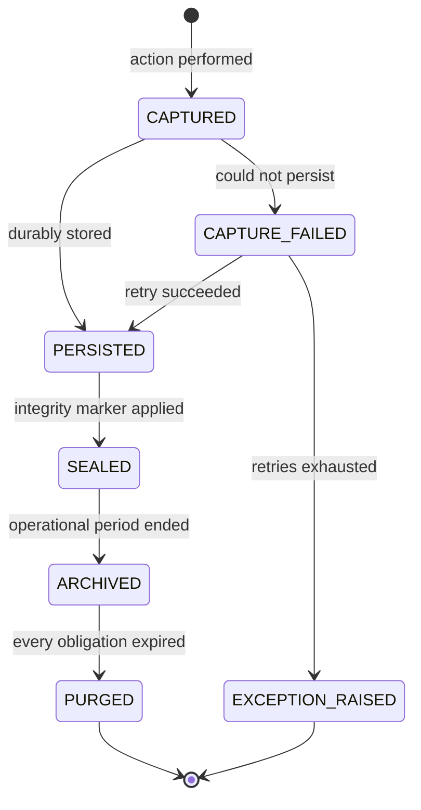

# Audit Architecture

**Owner:** Trioloo Technology · **Module:** Audit · **Status:** Canonical
**Version:** 1.6.0 · **Ratified:** 2026-08-04 · **Amended:** 2026-08-08 (Sales reconciliation; immutability; serial policy `BD-242`; discount policy `BD-255`; Warranty §21) · **Rule prefix:** `AUD-`

---

## Document Control

**Inherits:** [`SYSTEM_ARCHITECTURE.md`](SYSTEM_ARCHITECTURE.md) §14 — system-level audit obligations.
**Generalises:** [`ORDER_MANAGEMENT_ARCHITECTURE.md`](ORDER_MANAGEMENT_ARCHITECTURE.md) §15 (activity log) and §16 (audit log), which define the model for orders. **This document does not restate those definitions** (SYS-016); it extends them to every module and specifies the audit module itself.
**References:** [`PERMISSION_ARCHITECTURE.md`](PERMISSION_ARCHITECTURE.md), [`DATABASE_ARCHITECTURE.md`](DATABASE_ARCHITECTURE.md) §18.

> Contains no code, schema, API, or UI specification.

---

# 1. Purpose

To make the ERP **provable**.

Every figure this system reports — stock on hand, money owed, margin earned — is the result of a chain of human and automated decisions. Audit is the mechanism by which that chain is preserved, attributed, and shown to be complete and unaltered.

Its purpose is not compliance paperwork. It is that when a marketplace disputes a deduction, a courier disputes a delivery, a customer disputes a warranty claim, a tax authority questions a return, or management asks why margin moved, the answer exists, is specific, and is defensible.

---

# 2. Scope

## 2.1 In scope

The activity log and audit log as system-wide facilities · what every module must record · required content of a record · tamper evidence · retention · access · evidence production · reconstruction of state.

## 2.2 Out of scope

Storage technology, cryptographic mechanisms, log shipping, and archival media. These are engineering deliverables constrained by §9 but not specified here (SYS-076). Operational system telemetry — performance metrics, errors, diagnostics — is engineering monitoring and is **not** business audit; the two must not be conflated (§3.3).

---

# 3. Core Concepts

## 3.1 Two logs, one already defined

`ORDER_MANAGEMENT_ARCHITECTURE.md` §15.2 defines the distinction between the **activity log** (operational narrative, for staff) and the **audit log** (formal proof, for auditors and investigators), and BR-057 establishes that both exist and neither substitutes for the other.

> **AUD-001 — That distinction applies to every module, not only to orders.** Every module produces activity history for operational understanding and audit history for proof.

## 3.2 What audit is for

| Question | Answered by |
|---|---|
| "What has been happening with this order?" | Activity log |
| "Who changed this price, when, and why?" | Audit log |
| "Prove this unit was dispatched to this customer on this date." | Audit log + serial history |
| "Why is this month's margin different from last month's?" | Audit log + configuration versions |
| "Has anyone altered this record since it was posted?" | Tamper evidence (§6) |
| "Who has been overriding this control, and how often?" | Audit log + override analysis |

## 3.3 What audit is not

> **AUD-002 — Business audit and technical monitoring are separate facilities and are never merged.**

| Business audit | Technical monitoring |
|---|---|
| Records business decisions and changes | Records system behaviour |
| Retained for years (SYS-062) | Retained for days or weeks |
| Immutable and tamper-evident | Rotated and discarded |
| Read by auditors and managers | Read by engineers |
| A missing entry is a control failure | A missing entry is an inconvenience |

Merging them produces a store that is too large to retain for years and too noisy to audit — failing at both jobs.

## 3.4 Coverage principle

> **AUD-003 — Audit coverage is defined by business consequence, not by data change.**

Not every field change matters; every consequential decision does. A corrected spelling of a customer's name is activity. A changed credit limit is audit. The test is: *if this were wrong or malicious, would the business need to prove who did it?*

---

# 4. Business Goals

| # | Goal | Expression |
|---|---|---|
| AG-1 | Every consequential action is attributable | Mandatory attribution (SYS-058) |
| AG-2 | History cannot be quietly rewritten | Tamper evidence (§6) |
| AG-3 | Disputes are winnable with evidence | Evidence production (§10) |
| AG-4 | Past states are reconstructible | Reconstruction (§8) |
| AG-5 | Controls are demonstrably operating | Override and denial analysis (§11) |
| AG-6 | Obligations outliving the business record are met | Retention (§9) |
| AG-7 | Audit does not impede operations | Non-blocking capture (AUD-011) |

---

# 5. Architecture Principles

## 5.1 P1 — Audit is a system obligation, not a module feature

> **AUD-004 — A module that does not produce audit history is incomplete, regardless of functional correctness** (SYS-064).

## 5.2 P2 — Audit is produced by the actor's module, stored by Audit

> **AUD-005 — The module performing an action produces the audit record, because only it knows the business meaning. Audit owns storage, integrity, retention, and access.**

Audit contains no business logic (SYS-015). It does not decide what may happen; it records what did.

## 5.3 P3 — Write-once

> **AUD-006 — Audit records are append-only and are never edited or deleted by any actor at any authority level** (SYS-060, PRM-023).

## 5.4 P4 — Attribution is never absent

> **AUD-007 — Every record identifies a named actor — a human user or a named system identity** (SYS-058, PRM-005). "System" alone is not an actor.

## 5.5 P5 — Audit outlives its subject

> **AUD-008 — Audit records survive the archival and purge of the records they describe** (DB-054).

Purging a business record at the end of its retention does not purge the evidence that it existed, what it contained, and that it was purged.

## 5.6 P6 — Evidence includes what was received

> **AUD-009 — Data received from external parties is retained as received, unaltered** (SYS-046, DB-046).

When a marketplace disputes a deduction or a courier disputes a delivery event, the defensible position is the original message as it arrived — not Trioloo's interpretation of it.

---

# 6. Tamper Evidence

> **AUD-010 — Alteration of audit history must be detectable.**

| Requirement | Purpose |
|---|---|
| Sequence integrity | A removed record is detectable as a gap |
| Content integrity | A modified record is detectable as a mismatch |
| Chain integrity | Records are linked such that altering one invalidates what follows |
| Independent verification | Integrity is checkable without trusting the operational system |
| Verification is itself audited | An integrity check and its result are recorded |

> **AUD-011 — Tamper evidence proves detection, not prevention.** The architectural claim is not that alteration is impossible — it is that alteration cannot occur *unnoticed*. That is the achievable and auditable property.

---

# 7. Entities

| Entity | Purpose |
|---|---|
| **Activity Record** | Operational narrative entry, per `ORDER_MANAGEMENT_ARCHITECTURE.md` §15.4 |
| **Audit Record** | Formal proof entry (§7.1) |
| **Evidence Artefact** | External data retained as received (AUD-009) |
| **Integrity Check** | A verification run and its result (§6) |
| **Retention Policy** | Rules determining record lifespan (§9) |
| **Access Record** | A record of who read sensitive audit or personal data |
| **Reconstruction Request** | A point-in-time state query and its result (§8) |

## 7.1 Required content of an audit record

Extends `ORDER_MANAGEMENT_ARCHITECTURE.md` §15.4 with proof-specific requirements:

| Field | Purpose |
|---|---|
| Event time and record time | Both retained (DB-017) |
| Actor and actor type | Human or named system identity (AUD-007) |
| Authority | The permission or override under which the actor acted (PRM-018) |
| Approver | Where the action was escalated (PRM-016) |
| Company scope | Which entity's records were affected (SYS-018) |
| Action | Canonical business action name (PRM-007) |
| Subject | Which record, at which version |
| Before and after | For any changed value |
| Reason | From a controlled vocabulary where required (SYS-043) |
| Source | Interactive, integration, or automated (BR-030) |
| Correlation | Link to the triggering event and related records |
| Integrity marker | Supporting §6 |

> **AUD-012 — An audit record without actor, action, subject, and time is not an audit record.** These four are mandatory and never nullable.

---

# 8. Reconstruction

> **AUD-013 — The system can reconstruct the state of any business record as at any past moment within its retention period.**

This is the practical test of the whole model. It requires: movements rather than mutable balances (DB-001), immutability with compensating corrections (DB-002), configuration versioning (DB-022), snapshots at commitment (DB-023), and complete change history (DB-025).

| Reconstruction | Required for |
|---|---|
| Stock on hand at a date | Inventory valuation, audit, insurance claims |
| Receivable position at a date | Financial statements, ageing |
| Order state at a date | Dispute resolution |
| Configuration in force at a date | Explaining historical margin |
| Serial location and ownership at a date | Warranty, RMA, theft investigation |
| Permissions held by an actor at a date | Investigating a past action |

> **AUD-014 — Reconstruction includes the permission state.** Investigating a past action requires knowing what that actor was permitted to do *at that time*, not what they are permitted to do now.

---

# 9. Retention

> **AUD-015 — RESTATED (`BD-338`, v1.5.0). Retention is governed by the longest obligation attached to the subject — as a *minimum accessibility floor*, not as a disposal schedule** (SYS-044, DB-052).
>
> **`BD-338` removed the schedule this rule was written to govern.** No business record is ever deleted, automatically or manually; the only end-of-life lifecycle is **archival**. `AUD-015` and `AUD-017` are **not wrong — they now have no deletion to schedule.**
>
> | | Status |
> |---|---|
> | Records remain **accessible and recoverable when required** | **Binding** |
> | Records are **never deleted** | **Binding** |
> | *Real-time search over archived data* | **Not a business rule** — expressly excluded |
> | *Retrieval method, latency, storage tier* | **Infrastructure design, deferred** |
>
> **`DB-054`'s purge clause never fires.** It provides that audit survives the archival *and purge* of records it describes. Archival still happens; **purge does not** — half the rule is now unreachable, recorded so it is not read as implying purge exists.
>
> **`DB-057` redaction is now more load-bearing.** With hard delete excluded entirely, **redaction preserving the transaction is the only route** by which any data can be made unreadable (`AUDU-5`).

| Driver | Applies to |
|---|---|
| Statutory and tax | Financial transactions — **unknown AUDU-1** |
| Warranty | Serial and delivery records, from delivery date |
| Marketplace and courier dispute windows | Settlement and tracking evidence |
| Employment and control | Permission and override history |
| Operational | Activity narrative |

| Rule | Statement |
|---|---|
| AUD-016 | Activity and audit records may have different retention; audit is always the longer |
| AUD-017 | Retention is calculated from the end of the obligation, not the date of the record |
| AUD-018 | An open dispute, claim, or investigation suspends purging of related records |
| AUD-019 | Purging is itself audited (DB-053) and requires explicit authority |
| AUD-020 | Records remain readable and interpretable for their full retention (`ORDER_MANAGEMENT_ARCHITECTURE.md` BR-064) |

**On AUD-017.** A serial's warranty obligation starts at delivery, which may be months after the record was created. Retention counted from record creation would expire the evidence while the warranty is still live.

**On AUD-020.** Records that can only be interpreted by the version of the system that wrote them are not durable evidence. Audit history must carry enough context — canonical action names, resolved actor identities, decoded reason codes — to be read a decade later.

---

# 10. Evidence Production

> **AUD-021 — The system can produce a complete, coherent evidence package for any business subject.**

| Dispute | Evidence package |
|---|---|
| Marketplace deduction disputed | Order, dispatch, delivery confirmation, expected vs actual settlement (SYS-055), settlement report as received |
| Courier claims delivered, customer denies | Dispatch record, serials, tracking events with source (BR-030), proof of delivery, contact history |
| Customer warranty claim | Serial history, order, delivery date, prior returns and exchanges |
| Return fraud suspected | Dispatched serial vs returned serial (BR-047), QC record, packing record |
| Internal investigation | All actions by an actor in a period, with authority held at the time (AUD-014) |
| Tax or statutory audit | Transactions in period, supporting documents, configuration in force |
| Stock loss | Movement history, count records, attribution (BR-055), access records |

> **AUD-022 — An evidence package identifies what is included, the period covered, when it was produced, and by whom** — and its production is itself audited.

---

# 11. Control Monitoring

Audit data is not only for retrospective investigation; it is the evidence that controls are working.

| Signal | What it indicates |
|---|---|
| **Override frequency by actor and rule** | A bound set wrong, or a control being routinely bypassed (PRM-028) |
| **Denial frequency** | Mis-scoped roles, or attempted overreach (PRM-027) |
| **Manual adjustment volume** | Data quality problems upstream |
| **Actions outside working patterns** | Worth review, not proof of anything |
| **Accepted segregation conflicts** | Residual risk requiring compensating review (PRM-014) |
| **Reconciliation discrepancy rates** | Integration or process defects (DB-062) |
| **Records with no audit trail** | A control failure requiring correction |

> **AUD-023 — A control that is routinely overridden is not functioning as a control.** The correct response is to fix the bound, not to normalise the bypass.

---

# 12. Business Rules

| Rule | Statement |
|---|---|
| AUD-001 | The activity/audit distinction applies to every module |
| AUD-002 | Business audit and technical monitoring are separate facilities |
| AUD-003 | Coverage is defined by business consequence, not data change |
| AUD-004 | A module without audit history is incomplete |
| AUD-005 | The acting module produces records; Audit owns storage and integrity |
| AUD-006 | Records are append-only; never edited or deleted by anyone |
| AUD-007 | Every record names an actor; "system" alone is insufficient |
| AUD-008 | Audit outlives the records it describes |
| AUD-009 | External data is retained as received |
| AUD-010 | Alteration must be detectable |
| AUD-011 | Tamper evidence proves detection, not prevention |
| AUD-012 | Actor, action, subject, and time are mandatory |
| AUD-013 | Any past state is reconstructible within retention |
| AUD-014 | Reconstruction includes permission state |
| AUD-015 | Retention follows the longest applicable obligation |
| AUD-016 | Audit retention is always at least activity retention |
| AUD-017 | Retention is calculated from obligation end, not record date |
| AUD-018 | Open disputes suspend purging |
| AUD-019 | Purging is audited and requires authority |
| AUD-020 | Records remain interpretable for their full retention |
| AUD-021 | Complete evidence packages are producible |
| AUD-022 | Evidence production is itself audited |
| AUD-023 | A routinely overridden control is not a control |
| AUD-024 | Audit capture never blocks a business operation |
| AUD-025 | Failure to capture audit is itself an auditable exception |
| AUD-026 | Reading sensitive audit or personal data is recorded |
| AUD-027 | Audit records carry company scope (SYS-018) |
| AUD-028 | Bulk operations produce one audit record per affected record |

**On AUD-024 and AUD-025.** These are in tension and the resolution matters. Audit must not block operations — a warehouse cannot stop picking because an audit store is slow. But a silently dropped audit record is a control failure. The resolution: capture is non-blocking, guaranteed to be durable, and any failure to persist raises an exception (SYS-022) that is itself recorded. Neither "block the business" nor "lose the evidence" is acceptable.

**On AUD-028.** A bulk status change across 50 orders produces 50 audit records, not one. Investigating a single order must surface what happened to it, regardless of how the action was initiated (SYS-033, PRM-025).

---

# 13. Validation Rules

| Rule | Statement |
|---|---|
| AUD-029 | Mandatory fields present (AUD-012); a record failing validation is an exception, never silently discarded |
| AUD-030 | Reason codes drawn from controlled vocabularies (SYS-043) |
| AUD-031 | Before and after values present for every changed value |
| AUD-032 | Actor resolvable to a real identity (PRM-021) |
| AUD-033 | Timestamps unambiguous and orderable (DB-019, DB-020) |
| AUD-034 | Subject reference resolvable for the record's full retention |

---

# 14. Lifecycle

| State | Meaning |
|---|---|
| `CAPTURED` | Recorded by the acting module |
| `PERSISTED` | Durably stored |
| `SEALED` | Integrity marker applied; alteration now detectable (§6) |
| `ARCHIVED` | Beyond operational use; retained and readable (AUD-020) |
| `PURGED` | Removed after all obligations expired (AUD-019) |
| `CAPTURE_FAILED` / `EXCEPTION_RAISED` | AUD-025 |

---

# 15. Module Responsibilities

| Module | Responsibility |
|---|---|
| **Audit** | Storage, integrity, retention, access control, reconstruction, evidence production. **No business logic** (SYS-015) |
| **Every other module** | Produces records for its own consequential actions with correct business meaning (AUD-005) |
| **Permission** | Supplies actor identity, authority, and approver; consumes override and denial analysis |
| **Reporting** | Presents control monitoring (§11); never becomes a second audit store (DB-067) |
| **Notification** | Delivers alerts for integrity failures and control anomalies |

---

# 16. Integration Points

| Integration | Audit obligation |
|---|---|
| Channel adapters | Every inbound and outbound exchange auditable; raw payload retained (AUD-009) |
| Courier adapters | Tracking events append-only with source (BR-030, BR-031) |
| Settlement and remittance | Reports retained as received; reconciliation decisions audited |
| Accounting export | Exported figures traceable to source transactions (DB-066) |
| Future integrations | Same obligations; no exemption for integration convenience |
| Frontend | Audit history is presented per `DESIGN_CONSTITUTION.md`; this document specifies content, not presentation (SYS-047) |

---

# 17. Events

| Event | Purpose |
|---|---|
| `Audit.RecordSealed` | Integrity marker applied |
| `Audit.CaptureFailed` | Control failure requiring attention (AUD-025) |
| `Audit.IntegrityCheckCompleted` | Verification run and result |
| `Audit.IntegrityViolationDetected` | **Highest-severity system event** |
| `Audit.EvidencePackageProduced` | Evidence produced, by whom, for what |
| `Audit.RetentionExpired` | Records eligible for purge |
| `Audit.PurgeExecuted` | Purge performed under authority |
| `Audit.SensitiveAccessRecorded` | Sensitive data was read (AUD-026) |

> **AUD-035 — An integrity violation is the highest-severity event the system can raise.** It means the record of what happened can no longer be trusted, which invalidates every other assurance the system offers. It is escalated immediately to management, never queued as routine work.

---

# 18. Permissions

| Action | Authority |
|---|---|
| View audit for records within scope | Most operational roles, scoped (PRM-009) |
| View audit across all scopes | Auditor, Administrator, management |
| View sensitive-class audit detail | Explicit grant (PRM-011) |
| Run an integrity check | Auditor, Administrator |
| Produce an evidence package | Auditor, management; audited (AUD-022) |
| Execute a purge | Administrator with management approval (AUD-019) |
| **Alter or delete audit records** | **Nobody, at any authority level** (AUD-006, PRM-023) |

> **AUD-036 — The prohibition on altering audit records has no exception, no override, and no administrative bypass.** A permission model in which the highest authority can rewrite history provides no assurance to anyone, because every record becomes conditional on the trustworthiness of one account.

---

# 19. Error Scenarios

| Scenario | Required behaviour |
|---|---|
| Audit store unavailable | Operations continue (AUD-024); records queued durably; exception if unresolved |
| Record fails validation | Exception raised; never silently discarded (AUD-029) |
| Integrity check fails | `Audit.IntegrityViolationDetected`; escalated immediately (AUD-035) |
| Actor identity unresolvable | Capture refused as invalid; the attempted action is investigated (AUD-032) |
| Purge attempted with an open dispute | Blocked (AUD-018) |
| Evidence requested for purged records | Reports precisely what was purged, when, and under whose authority (AUD-008) |
| Reconstruction requested beyond retention | Reports the limit rather than returning a partial answer presented as complete |
| Bulk operation produces a single record | Defect; one record per affected record required (AUD-028) |
| Module ships without audit coverage | Incomplete (AUD-004); a release defect |
| External party disputes a figure | Evidence package from data as received (AUD-009, AUD-021) |

---

# 20. Future Extensibility

| Scenario | Absorption | Core change? |
|---|---|---|
| New modules | Declare their auditable actions; obligations already universal | No |
| **Multi-company** | Company scope already on every record (AUD-027) | No |
| External audit-system export | Records already self-describing (AUD-020) | No |
| Statutory reporting obligations | Evidence production already generalised (AUD-021) | No |
| Longer retention | Policy configuration (SYS-013) | No |
| Real-time control monitoring | Analysis over existing records (§11) | No |
| Independent integrity verification | Already required (§6) | No |

## 20.1 Requires amendment

| Change | Why |
|---|---|
| Permitting audit alteration | Reverses AUD-006 and AUD-036; the model's foundation |
| Merging audit with technical monitoring | Reverses AUD-002; both facilities fail |
| Making audit blocking | Reverses AUD-024; audit becomes an availability risk to the business |
| Sampling rather than recording every consequential action | Sampled audit cannot answer a specific dispute |

---

# 21. Unknowns

| # | Unknown | Impact | Assumption |
|---|---|---|---|
| AUDU-1 | Statutory retention in the operating jurisdiction (SYS U-3) | Sets retention floors (AUD-015) | **`BD-008` gives 5 years as a *business preference*. The statutory floor is still unknown** |
| AUDU-2 | Marketplace and courier dispute windows | Sets evidence retention for settlement and tracking | Retained well beyond commercial closure. **`BD-063` gives a 7-day Daraz settlement cycle** — the dispute window is still unstated |
| **AUDU-3** | **Standard warranty terms by product category (OM Q-5)** | Sets serial-record retention (AUD-017) | **⚠ ANSWERED AND IN CONFLICT — `BD-091`, `BD-092`. Terms reach 12 years against a 5-year retention policy. See `AUD-037`** |
| AUDU-4 | Is external audit-system integration required? | Affects export design | Native, with export capability |
| AUDU-5 | Are there personal-data obligations conflicting with retention? | May require redaction rather than retention (DB-057) | Redaction preserving the transaction |
| AUDU-6 | Expected audit volume | Engineering sizing, not architecture | Not architecture-determining |
| ~~**AUDU-7**~~ | ~~Is a reason captured for every exceptional action, or only some?~~ | — | **CLOSED 2026-08-06 — `BD-275`. Reason is a required field for discounts, as it already was for write-offs (`BD-110`) and stock adjustments (`BD-111`).** See `AUD-042` |

---

# 22. Discovery Reconciliation — 2026-08-06

## 22.1 The retention conflict

> ## ✅ AUD-037 — **RESOLVED, 2026-08-08 (`BD-338`).** The conflict dissolved; it was never a trade-off
>
> **`BD-338` establishes permanent retention: no business record is ever deleted, automatically or manually.** With nothing expiring, a 12-year warranty and a 5-year guideline are not in tension at all.
>
> **The premise was wrong, and the misreading was mine.** `BD-008` said *"5-year retention, archive not delete"*; I read the five years as a **disposal horizon**. **It was always a minimum, never an expiry.** `AUD-017`'s rule — retention runs from the end of the obligation — still holds and is now trivially satisfied.
>
> **`AUDU-3` closes with it.** `BR-084` and `DB-052` resolve on the same basis. See `AUD-015` as restated, and `AUD-043`.
>
> *Original finding retained below for traceability.*
>
> ## ⚠ AUD-037 — A 12-year warranty against a 5-year retention policy *(superseded)*
>
> | Source | Statement |
> |---|---|
> | `BD-008` | Records are retained **5 years**, stated as a business preference; archive rather than delete |
> | `BD-091` | Warranty terms extend to **12 years** on some products |
>
> `AUD-017` calculates retention **from the end of the obligation, not the date of the record** — and §14's own note explains why: *"retention counted from record creation would expire the evidence while the warranty is still live."* That is exactly what a 5-year policy does to a 12-year warranty.
>
> The same conflict falls on `DB-052` and `INV-51.1`.
>
> **A claim in year 9 would find the supporting records already disposed of** — including the as-built record that `PRD-044` requires to attribute the claim to a component, and the serial history `AUD-021` treats as evidence.
>
> **No retention period is changed here.** Whether the fix is a longer retention floor or a shorter warranty is a business decision, not an architectural one. **`BD-144` (priority) asks.**

## 22.2 Alignment confirmed

> **AUD-038 — §12.2's register of auditable actions substantially matches the business's own list of approval-gated decisions** (`BD-107`). Price change after order creation, discount beyond authority, refund issued, write-off, manual stock adjustment, cancellation after dispatch, amendment after release, and override all appear in both.
>
> Three business items are **not** in the register and should be added when this document is next revised: **exchange price adjustments**, **warranty decisions outside policy**, and **changes to return or replacement policy**.
>
> `BD-111` is the closest alignment recorded anywhere in this reconciliation — stock adjustments are described as carrying reason, approval details **and audit history**, unprompted.

## 22.3 Where the model is now load-bearing

> ## ✅ AUD-042 — Reason capture is confirmed consistent. `AUD-039` resolved
>
> **`BD-275`, 2026-08-06.** *"Reason for the discount"* is a required recorded field, closing the gap `AUD-039` identified and answering `AUDU-7`.
>
> | Action | Reason captured? | Source |
> |---|---|---|
> | Stock adjustment | **Yes** | `BD-111` |
> | Write-off | **Yes** | `BD-110` |
> | **Discount** | **Yes** | `BD-275` |
>
> The pattern `AUD-039` described — *"corrections yes, commercial concessions unstated"* — does not hold. The concession case had simply not been described yet. **Reason capture is the norm.**
>
> **`AUD-012` required content is satisfied for discount more fully than for most actions**: original value, reduction, final value, actor, approver, and reason. §12.2's registration of *"discount beyond authority"* stands, with one clarification — **"beyond authority" now means "applied by an unpermissioned user"**, not "above a numeric threshold" (`PRM-052`).
>
> **`AUD-041` and `AUD-042` together leave one residual risk**: `BD-263`, whether anyone reads the trail. `AUD-023` control monitoring has no named operator.

> **AUD-039 — Reason capture is inconsistent, and the audit trail is the only control.** *(Superseded in part by `AUD-042` — the inconsistency is resolved; the sole-control finding stands.)*
>
> `PRM-049`, `PRM-050` and `PRM-052` together establish that exceptional actions have **no preventive control**: the decision is made off-system (`BD-109`), by one person (`BD-112`), with no enforced ceiling (`BD-108`, `BD-275`). The trail is not a supplement to prevention — it *is* the control.
>
> Against that, reason capture is uneven:
>
> | Action | Reason captured? | Source |
> |---|---|---|
> | Stock adjustment | **Yes** — reason, approval, audit history | `BD-111` |
> | Write-off | **Yes** — reason and approval details | `BD-110` |
> | Discount, refund, cancellation, warranty exception | **Not stated** | `BD-107` – `BD-109` |
>
> Both actions with explicit reason capture are **corrections to a recorded position**. The ones without are **commercial concessions**. Whether that distinction is deliberate is unknown — `BD-256` asks. Recorded as `AUDU-7`.
>
> `BD-263` asks the related question of whether anyone reviews these actions after the fact. If not, the trail is written but never read, and `AUD-023` control monitoring has no operator.

> **AUD-041 — `AUD-017` retention cannot be driven by serial, because most items have none** (`BD-265`). `AUD-017` calculates retention from the end of the obligation and §14 illustrates this with *"a serial's warranty obligation starts at delivery"*.
>
> **The rule is correct; its illustration is not representative.** Retention is driven by the **warranty obligation attached to the order line**, which exists whether or not a serial does. Where a serial exists it identifies the unit; it was never what created the obligation.
>
> `AUD-021`'s warranty evidence package likewise stands, with serial history as **one component among several** rather than the anchor — consistent with `BD-094`, which lists serial *"where applicable"* alongside order, invoice, customer information and warranty records.
>
> **This does not affect `AUD-037`.** The 12-year-warranty-against-5-year-retention conflict is independent of serialization and remains open on `BD-144`.

> ## ✅ AUD-040 — RESOLVED 2026-08-06. `AUD-006` is confirmed by the business
>
> `BD-107` listed *"manual changes to completed orders or financial records"* among approvable decisions, which appeared to permit editing the trail that constrains the editor. Combined with `PRM-049` – `PRM-051` — approval off-system, one person, no ceilings — this was the sharpest risk in the reconciliation: **the audit trail is the only control that exists**, and this seemed to say it could be altered.
>
> **`BD-254` resolves it in favour of the architecture.** The confirmed decision states:
>
> | | Confirmed rule |
> |---|---|
> | 1 | Completed business and financial transactions **cannot be edited directly** |
> | 2 | **Original records always remain unchanged** |
> | 3 | Corrections must be made using **linked adjustment records** |
> | 6 | **Audit history is always immutable** |
>
> Point 6 is a direct, unprompted restatement of `AUD-006`. **`AUD-006` stands unchanged, and is now confirmed rather than assumed.**
>
> The "manual change" language in `BD-107` meant *posting a linked correction*, not editing an original. `AUD-023` control monitoring therefore has something durable to read, and `AUD-013`/`AUD-014` reconstruction remains achievable.
>
> **What remains open is narrower and unaffected by this**: whether a **reason** accompanies every exceptional action (`AUD-039`, `AUDU-7`, `BD-256`) and whether anyone reviews them afterwards (`BD-263`). An immutable trail that records *what* but not *why* is still a weak control — but it is no longer an alterable one.

---

## 22.4 Manual reservation release — 2026-08-09

> **AUD-044 — A manual reservation release is an auditable inventory action, recording reason, performer and approver** (`BD-437`, `IVN-049`, `IVN-050`).

**Ten facts are recorded** — order · product/variant · warehouse where applicable · quantity released · **reason** · **performer** · **approver where approval was required** · date and time · **previous reserved quantity** · **remaining reserved quantity**. `AUD-012`'s mandatory content is satisfied, and **`AUD-042`'s finding that reason capture is the norm holds for a fifth action.**

> ✅ **This is the first action to close the collapse case, and it strengthens `AUD-004`.** `BD-110`, `BD-111`, `BD-275` and `BD-282` each separate **who authorised** from **who acted**. **`BD-437` requires both to be recorded *even where one authorised person is entitled to be both*.** **`PRM-050` already accepted that overlap as structural in a small team** — recording both facts **makes it visible in the trail rather than erased by it.**

> ⚠ **A citation defect found while registering this — recorded, not fixed here.**
>
> **`AUD §12.2` is cited as *the register of auditable actions* by nine documents** — `PRODUCT_ARCHITECTURE.md`, `EVENT_ARCHITECTURE.md`, `STATE_MACHINE_ARCHITECTURE.md`, `WAREHOUSE_ARCHITECTURE.md`, `REPORTING_ARCHITECTURE.md`, `API_ARCHITECTURE.md`, `BUSINESS_DISCOVERY.md`, and **`AUD-038` in this document** — **and this document has no §12.2.** §12 is a flat rule table with no subsections.
>
> **The register the citations describe does exist in substance** — `AUD-024` – `AUD-028`, `AUD-012` and the `BD-107` alignment at `§22.2` between them carry it. **What is wrong is the address, in twenty-odd places.** **Registered as `GAP-113`**; fixing it is a documentation pass, not an A2 matter, and **no rule depends on the outcome.**

---

# Appendix — Rule Index

AUD-001–003 concepts · AUD-004–009 principles · AUD-010–011 tamper evidence · AUD-012 record content · AUD-013–014 reconstruction · AUD-015–020 retention · AUD-021–022 evidence · AUD-023 control monitoring · AUD-024–028 business rules · AUD-029–034 validation · AUD-035–036 events and permissions · **AUD-037–040 discovery reconciliation (§22)** · AUD-041–043 later reconciliations · **AUD-044 manual reservation release (§22.4)**.

**Amendment record**

| Version | Date | Change |
|---|---|---|
| 1.0.0 | 2026-08-04 | Initial ratification |
| **1.1.0** | **2026-08-06** | **Sales discovery reconciliation (§22).** Retention-vs-warranty conflict recorded (`AUD-037`); §12.2 register confirmed against business practice (`AUD-038`); reason-capture inconsistency and the audit trail's status as sole control recorded (`AUD-039`); the immutability question raised against `AUD-006` (`AUD-040`). `AUDU-3` answered and in conflict; `AUDU-7` opened. Source: [`BUSINESS_DISCOVERY.md`](BUSINESS_DISCOVERY.md) |
| **1.2.0** | **2026-08-06** | **`AUD-040` RESOLVED by `BD-254`.** `AUD-006` **confirmed unchanged** — audit history is immutable, and completed records are corrected only by linked adjustment. The sole-control risk recorded at `AUD-039` is materially reduced: the trail cannot be altered, though reason capture (`AUDU-7`) remains open |
| **1.3.0** | **2026-08-06** | **Serial number policy (`BD-242` resolved).** `AUD-041` added — `AUD-017` retention is driven by the warranty obligation on the order line, not by serial. `AUD-021` evidence package stands with serial as one component among several |
| **1.4.0** | **2026-08-06** | **Discount policy (`BD-255` resolved).** `AUD-042` — reason capture confirmed consistent across discounts, write-offs and stock adjustments; `AUD-039`'s inconsistency finding superseded; `AUDU-7` closed. "Beyond authority" reinterpreted as "applied by an unpermissioned user" |
| **1.6.0** | **2026-08-09** | ✅ **`AUD-044` added (§22.4) — `BD-437`, pre-freeze blocker A2. Manual reservation release registered as an auditable inventory action**, recording **reason, performer and approver** across ten facts. **`AUD-012` satisfied; `AUD-042`'s reason-capture finding holds for a fifth action.** ✅ **This is the first action to close the collapse case** — `BD-110`, `BD-111`, `BD-275` and `BD-282` each separate authoriser from actor, and **`BD-437` requires both *even where one authorised person is entitled to be both*.** **`PRM-050` already accepted that overlap as structural**; recording both **makes it visible in the trail rather than erased by it**, strengthening `AUD-004`. ⚠ **A citation defect found while registering this and recorded, not fixed: `AUD §12.2` is cited as *the register of auditable actions* by nine documents — including `AUD-038` here — and this document has no §12.2**; §12 is a flat rule table with no subsections. **The register exists in substance across `AUD-024` – `AUD-028`, `AUD-012` and §22.2's `BD-107` alignment — what is wrong is the address.** **Registered as `GAP-113`; no rule depends on it** |
| **1.5.0** | **2026-08-08** | **Warranty reconciliation (§21).** **`AUD-037` RESOLVED and `AUDU-3` closed** — the retention-versus-warranty conflict **dissolved** under `BD-338`'s permanent retention; the premise was a misreading of `BD-008`, which always set a minimum rather than an expiry. **`AUD-015` and `AUD-017` RESTATED** as minimum accessibility floors, not disposal schedules. `AUD-043` — **reason capture confirmed in a sixth context** (warranty resolution). Recorded: `DB-054`'s purge clause is now unreachable, and **`DB-057` redaction is the only remaining route to making data unreadable**. Source: [`BUSINESS_DISCOVERY.md`](BUSINESS_DISCOVERY.md) §21 |

---

*This document specifies audit architecture only. Storage technology, cryptographic mechanisms, and archival media are engineering deliverables constrained by §6 and §9.*
