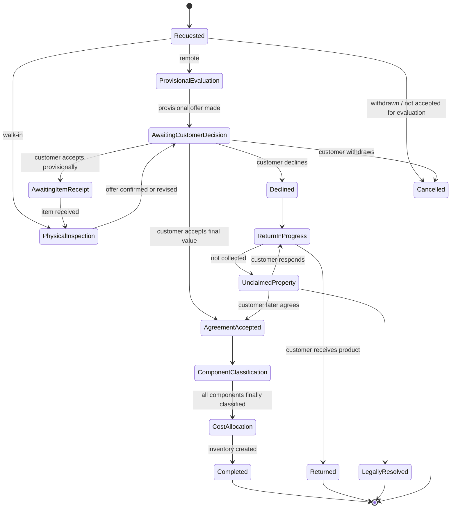
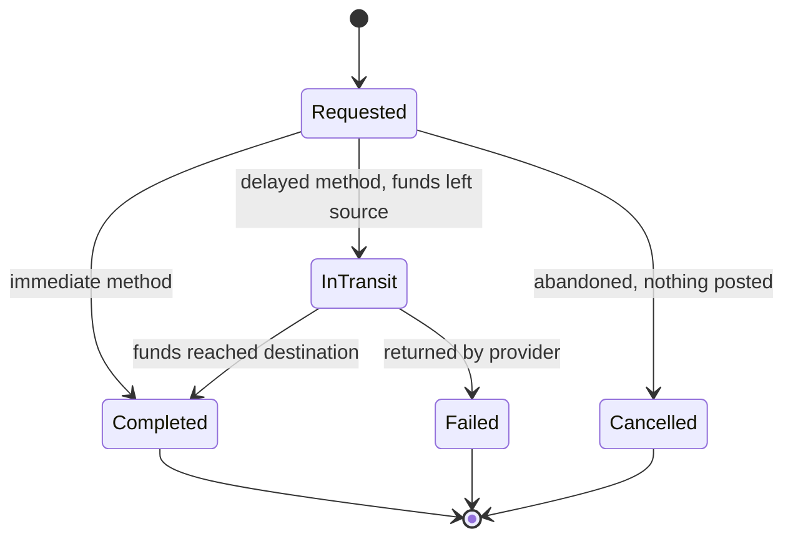

# Business Discovery — Questions

**Owner:** Trioloo Technology · **Type:** Discovery log · **Status:** In progress
**Started:** 2026-08-05 · **Last updated:** 2026-08-10 · **47 sections complete — 347 of 347 answered** · **§43 – §48 CLOSED for minimal V1** · ✅ **Order attribution amendment DELIVERED — `BR-163` – `BR-167`** · **Latest:** §48 Leave Management · **§41 HR & Payroll RESUMED 2026-08-10** · **Question prefix:** `BD-`
*✅ **All domains discovered.** 🔴 **CORRECTED 2026-08-10** — this read *“Not started: HR & Payroll — deferred past V1, never registered”*. **HR & Payroll is discovered (§41, §43 – §46) and written** (`DOC-072`). Original retained under `DOC-009`.*

---

## Purpose

To understand the Trioloo business before implementation begins.

This document contains **questions only**. It records no answers until they are given, proposes no workflows, and makes no assumptions.

## Rules of engagement

| Rule | |
|---|---|
| **One question at a time** | Asked in conversation, answered, recorded, then the next |
| **No assumptions** | Where the answer is not known, the question stays open |
| **No suggested workflows** | Discovery describes what the business does, not what it should do |
| **No design** | No database, no APIs, no code, no screens |
| **Answers are recorded verbatim** | In the Answer field, in the business's own words |
| **Follow-ups are added as they arise** | A question may spawn others |

## Question status

| Status | Meaning |
|---|---|
| ⬜ **Open** | Not yet asked |
| 🔵 **Asked** | Put to the business; awaiting answer |
| ✅ **Answered** | Answer recorded |
| ⏸️ **Deferred** | Not relevant yet; revisit later |
| ❌ **Not applicable** | Business confirms it does not apply |

## Why these questions

Many are drawn from unknowns already recorded during architecture work — `GAP-nnn` findings, `DMU-nn` domain unknowns, and `OM Q-n` order-management questions. Where a question closes one, it is cited. **The citation is traceability, not an assumption about the answer.**

## Sections — Sales domain

| § | Section | Questions | Answered |
|---|---|---|---|
| 1 | Company Information ✅ | 11 | 11 |
| 2 | Sales Channels ✅ | 9 | 9 |
| 3 | Order Sources ✅ | 7 | 7 |
| 4 | Customer Types ✅ | 7 | 7 |
| 5 | Order Verification ✅ | 11 | 11 |
| 6 | Pricing Rules ✅ | 8 | 8 |
| 7 | Discount Rules ✅ | 6 | 6 |
| 8 | Payment Rules ✅ | 10 | 10 |
| 9 | Delivery Rules ✅ | 9 | 9 |
| 10 | Return Rules ✅ | 9 | 9 |
| 11 | Exchange Rules ✅ | 6 | 6 |
| 12 | Warranty Rules ✅ | 7 | 7 |
| 13 | Inventory Rules ✅ | 9 | 9 |
| 14 | Approval Rules | 7 | 7 |
| 15 | Serial Number Policy *(focused)* ✅ | 10 | 10 |
| 16 | Discount Policy *(focused)* ✅ | 3 | 3 |
| 17 | Warehouse & Assembly ✅ | 15 | 15 |
| 18 | Purchase & Supplier ✅ | 11 | 11 |
| 19 | Accounting ✅ | 11 | 11 |
| 20 | Marketplace Integration ✅ | 12 | 12 |
| 21 | Warranty ✅ | 12 | 12 |
| 22 | Return & Exchange ✅ | 12 | 12 |
| — | *Ratified concepts* — `BD-354` · `BD-367` · `BD-368` Business Case | 3 | 3 |
| 23 | Chat Integration ✅ | 12 | 12 |
| 24 | People, Roles & Access | ✅ | 11 |
| 25 | Notifications | ✅ | 8 |
| 26 | Trade-In | ✅ | 10 |
| 27 | Fund Transfers | ✅ | 7 |
| 28 | Courier Commercial Model ✅ | 11 | 11 |
| 29 | Delivery Workflow ✅ | 5 | 5 |
| 30 | Customer Identity, Credit and Blacklist ✅ | 3 | 3 |
| 31 | Warranty & Repair Cross-Module Reactions ✅ | 4 | 4 |
| 32 | Trade-In Cross-Module Reactions ✅ | 4 | 4 |
| 33 | Build Job Cross-Module Reactions ✅ | 1 | 1 |
| | **Total** | **281** | **281** |

✅ **Domains not yet started: none.** 🔴 **CORRECTED 2026-08-10** — this read *“HR & Payroll … deferred past V1, never registered”*; **that domain is discovered and written** (`DOC-072`). Original retained under `DOC-009`.

*Trade-In was previously listed here as never discovered; it was discovered as §26 (`BD-388` – `BD-397`) and the stale entry is corrected.*

---

# 1. Company Information

### BD-001 ✅
**How many legal companies does Trioloo Technology operate, and do they keep separate books?**
*Closes: `SYS U-1`, `SYS U-5`, `DMU-18`*

**Answer** *(2026-08-05)*

One primary legal entity: **TRIOLOO**.

TRIOLOO owns and manages multiple independent **sales brands**:

| Brand |
|---|
| Friday PC |
| Zeon Tech |
| Zeon Mart |
| Sony Pro Bangladesh |
| Ryzen Builder |
| Tech Links |

Each brand has its own marketplace shops, Facebook pages, and websites.

All brands share the same warehouse, inventory, operations, and ERP system.

TRIOLOO is responsible for managing the shared business operations.

*Recorded as stated. Nothing inferred.*

### BD-002 ✅
**How many physical locations does the business have, and what happens at each one?**
*Closes: `GAP-057`, `DMU-10`*

**Answer** *(2026-08-05)*

The business currently operates from one physical location.

**Location 1**
- **Name:** TRIOLOO
- **City:** Dhaka

This location currently performs the following business functions:

- Sales
- Customer Service
- Warehouse
- Accounts
- Office Operations
- Customer Pickup
- Service

*Recorded as stated. Nothing inferred.*

**Raised by this answer** — BD-119, BD-120, BD-121.

### BD-003 ✅ — covered by BD-002
**Which locations hold stock, and which only handle customers or paperwork?**

**Answer** *(2026-08-05)* — Covered by BD-002. Not asked separately.

### BD-004 ✅
**How many people work in the business, and what does each group do?**
*Closes: `PRMU-1`*

**Answer** *(2026-08-05)*

The business currently has approximately **6 employees**.

Employees are cross-functional rather than belonging to a single department. One employee may perform multiple responsibilities depending on business needs.

Current business functions include:

- Sales
- Customer Service
- Warranty
- Accounting
- Purchasing

The owner is also actively involved in the day-to-day operations and performs multiple business functions.

*Recorded as stated. Nothing inferred.*

**Raised by this answer** — BD-122, BD-123, BD-124.

### BD-005 ✅
**Is the HR and payroll function meant to be part of this ERP, or handled elsewhere?**
*Closes: `GAP-031`, `DMU-11`*

**Answer** *(2026-08-05)*

HR and Payroll will be part of this ERP.

The ERP will include the following HR functions:

- Employee Profile
- Attendance
- Leave Management
- Payroll / Salary
- Advance Salary
- Employee Loan
- Incentive / Commission
- Overtime
- Performance Review

Employee salaries will be generated and managed within the ERP.

Employees are paid a fixed monthly salary.

The payroll system must support **additional earnings**, including:

- Commission
- Bonus
- Performance Bonus

The payroll system must also support **salary deductions**, including:

- Late Attendance
- Absent
- Leave Without Pay
- Advance Salary Recovery
- Loan Installment
- Damage / Loss
- Tax
- Provident Fund

*Recorded as stated. Nothing inferred.*

> **Documentation conflict noted.** `SYSTEM_ARCHITECTURE.md` §2.2 currently lists "Human resources and payroll" as **out of scope for the system**. This answer contradicts that exclusion. Recorded as a fact about the documentation, not as a change — no architecture work is being done.

**Raised by this answer** — BD-125, BD-126, BD-127, BD-128, BD-129.

*(BD-005A was asked and answered separately on 2026-08-05; its content has been consolidated into this answer and it is no longer tracked as a separate question.)*

### BD-006 ✅
**Is TRIOLOO registered for VAT with the tax authority?**
*(Narrowed from the original two-part question. The tax-documents half is now tracked as BD-006B.)*
*Closes part of: `GAP-003`, `DMU-3`*

**Answer** *(2026-08-05)*

Yes. TRIOLOO is registered for VAT with the tax authority.

*Recorded as stated. Nothing inferred.*

*(BD-130 — "in what situations is VAT required?" — remains open and is the outstanding question on this topic.)*

### BD-006B ✅
**What tax documents must the business issue, and to whom?**
*Closes part of: `GAP-003`, `DMU-3`*

**Answer** *(2026-08-05)*

The business currently issues the following business and financial documents as required:

**Customer Documents**
- Quotation
- Proforma Invoice
- Sales Invoice
- Tax Invoice (when required)
- VAT Invoice (when required)
- Money Receipt
- Delivery Challan

**Supplier Documents**
- Purchase Order

**Supplier / Accounts Documents**
- Purchase Invoice

**Accounting Documents**
- Payment Voucher
- Receipt Voucher
- Journal Voucher

*Recorded as stated. Nothing inferred.*

> **Documentation note.** Of the 13 document types listed, only *Invoice* and *Purchase Order* appear anywhere in the existing architecture documentation. Recorded as a fact about coverage, not as a change.

**Raised by this answer** — BD-133, BD-134, BD-135, BD-136.

### BD-006A ✅
**Who is allowed to apply VAT to a customer invoice?**

**Answer** *(2026-08-05)*

Any user with sales responsibilities can manually enable VAT on a customer invoice.

VAT is optional and is not applied by default. It is only enabled when required.

*Recorded as stated. Nothing inferred.*

**Raised by this answer** — BD-130, BD-131, BD-132.

### BD-007 ✅
**What systems or tools hold your business data today?**
*(Narrowed from the original two-part question.)*
*Closes: `SYS U-6`, `DBU-4`*

**Answer** *(2026-08-05)*

Laravel ERP.

*Recorded as stated. Nothing inferred.*

**Raised by this answer** — BD-140, BD-141, BD-142.

### BD-007A ✅
**Which data must be migrated from each existing system?**

**Answer** *(2026-08-05)*

The business intends to migrate all relevant business data from the existing systems into the new ERP, where available.

This includes, but is not limited to:

- Products
- Customers
- Orders
- Inventory
- Suppliers
- Accounts
- Employees
- Attachments
- Images
- Warranty Records
- Payment History

*Recorded as stated. Nothing inferred.*

**Raised by this answer** — BD-137, BD-138, BD-139.

### BD-008 ✅
**How long must the business keep records, and is that driven by law, by a partner agreement, or by preference?**
*Closes: `SYS U-3`, `AUDU-1`, `DBU-2`*

**Answer** *(2026-08-05)*

Business records must be retained for **5 years**.

The retention period is based on **business preference**.

After 5 years, records will be **archived** rather than permanently deleted.

*Recorded as stated. Nothing inferred.*

**Raised by this answer** — BD-143, BD-144, BD-145.

---

> ### § 1 Company Information — complete
> 11 of 11 answered. 32 follow-up questions raised and queued.

---

# 2. Sales Channels

### BD-009 ✅
**How many Daraz shops does the business run, and why more than one?**

**Answer** *(2026-08-05)*

The business currently operates **7 Daraz shops**:

- TRIOLOO
- Friday PC
- Zeon Tech
- Zeon Mart
- Sony Pro Bangladesh
- Ryzen Builder
- Tech Links

The business operates multiple Daraz shops as part of its marketing strategy. Each shop has its own brand identity and marketplace presence.

*Recorded as stated. Nothing inferred.*

**Raised by this answer** — BD-146, BD-147.

### BD-010 ✅
**How many websites does the business run, and what is different between them?**

**Answer** *(2026-08-05)*

The business operates **7 websites**.

Each website represents a different sales brand. The primary difference between them is their branding and marketing strategy.

*Recorded as stated. Nothing inferred.*

**Raised by this answer** — BD-148, BD-149.

### BD-011 ✅
**Which channel brings in the most orders, and which brings in the most money?**

**Answer** *(2026-08-05)*

Trioloo, Friday PC, Zeon Tech.

*Recorded as stated. Nothing inferred.*

*(The answer names three brands. It does not separate "most orders" from "most money", and does not rank them. BD-150 carries the outstanding part.)*

**Raised by this answer** — BD-150.

### BD-012 ✅
**Are there marketplaces other than Daraz in use or planned?**

**Answer** *(2026-08-05)*

Currently, the business sells through Daraz.

The business plans to support additional marketplaces in the future, including:

- CartUp
- Facebook Marketplace
- Bikroy
- Other marketplaces as required by the business.

*Recorded as stated. Nothing inferred.*

**Raised by this answer** — BD-151, BD-152.

### BD-013 ✅
**Does each Daraz shop have its own commission arrangement, or are they the same?**

**Answer** *(2026-08-05)*

Each has its own commission.

*Recorded as stated. Nothing inferred.*

**Raised by this answer** — BD-153, BD-154.

### BD-014 ✅
**Are the same products sold on every channel, or does each channel carry a different range?**

**First response** *(2026-08-05)* — recorded exactly as given, meaning unclear:

> "defferent reange same renge but ype of product"

**Clarified answer** *(2026-08-05)*

Each brand sells a different set of products — little or no overlap.

*Recorded as stated. Nothing inferred.*

**Raised by this answer** — BD-155. *(BD-116 — whether two brands can list the same product on the same marketplace — becomes sharper in light of "little or no overlap" and remains open.)*

### BD-015 ✅
**Is the same product sold at the same price on every channel?**
*Closes part of `GAP-015`, `DMU-7`*

**First response** *(2026-08-05)* — recorded exactly as given:

> "Price can defferent mostly same product but can be defferent version"

**Clarified answer** *(2026-08-05)*

Price can be different.

Different brands sell similar but not identical products — for example one brand sells a 16GB PC, another sells a 32GB version of a similar build.

*Recorded as stated. Nothing inferred.*

### BD-016 ✅
**Who decides what gets listed on which channel, and how often does that change?**

**Answer** *(2026-08-05)*

Users with the appropriate permissions decide which products are listed on each sales channel.

Product listings are reviewed and updated monthly, or whenever business requirements require a change.

*Recorded as stated. Nothing inferred.*

**Raised by this answer** — BD-156.

### BD-017 ✅
**Is there a sales channel used today that has not been mentioned yet?**

**Answer** *(2026-08-05)*

Yes.

In addition to Daraz and the company websites, the business also receives sales through:

- Facebook
- Facebook Messenger
- WhatsApp
- Phone calls
- Walk-in customers

No other sales channels are currently in use.

*Recorded as stated. Nothing inferred.*

*(Facebook now appears in three forms across answers: Facebook, Facebook Messenger, and — as a future marketplace — Facebook Marketplace. BD-151 carries the question of whether these are separate order routes.)*

---

> ### § 2 Sales Channels — complete
> 9 of 9 answered.

---

# 3. Order Sources

### BD-018 ✅
**Walk me through what happens from the moment a customer places an order on Daraz until the business first sees it.**

**Answer** *(2026-08-05)*

When a customer places an order on Daraz:

1. The order is created in Daraz Seller Center.
2. Daraz sends an order notification.
3. The ERP automatically imports new orders from Daraz through the API at approximately 5-minute intervals.
4. The imported order is created in the ERP with the status **Pending Verification**.
5. The Sales team first sees the order in the **Pending Verification** queue.

*Recorded as stated. Nothing inferred.*

**Raised by this answer** — BD-157, BD-158, BD-159.

### BD-019 ✅
**Walk me through the same for a website order — from the customer placing it to the business first seeing it.**

**Answer** *(2026-08-05)*

When a customer places an order on a company website:

1. The customer completes the checkout process and submits the order.
2. The website immediately records the order.
3. The website automatically sends the order to the ERP through the integration.
4. The ERP creates the order with the status **Pending Verification**.
5. The Sales team first sees the order in the **Pending Verification** queue.

*Recorded as stated. Nothing inferred.*

**Raised by this answer** — BD-160.

### BD-020 ✅
**How does a Facebook or WhatsApp enquiry become an order?**

**Answer** *(2026-08-05)*

When a customer contacts the business through Facebook or WhatsApp:

1. The Sales team receives the enquiry.
2. The customer's phone number is collected.
3. The conversation is moved to WhatsApp whenever possible.
4. If WhatsApp is not available, the Sales team contacts the customer by phone.
5. If the customer cannot be reached by phone, follow-up is attempted through messages.
6. The product, price, delivery details, and customer confirmation are obtained.
7. After the customer confirms the order, a Sales user manually creates the order in the ERP.
8. The order is created with the status **Pending Verification**.

*Recorded as stated. Nothing inferred.*

**Raised by this answer** — BD-161, BD-162.

### BD-021 ✅
**How does a phone order get taken, and by whom?**

**Answer** *(2026-08-05)*

When a customer places an order by phone:

1. A Sales user receives the call.
2. The customer's product requirements are discussed.
3. The product, price, and delivery details are confirmed.
4. The customer's name, phone number, and delivery address are collected.
5. After the customer confirms the order, the Sales user manually creates the order in the ERP.
6. The order is created with the status **Pending Verification**.

*Recorded as stated. Nothing inferred.*

*(BD-161 — what Pending Verification checks that the conversation did not — applies equally to phone orders.)*

### BD-022 ✅
**What happens when a customer walks into the location and buys something?**

**Answer** *(2026-08-05)*

When a customer visits a business location to make a purchase:

1. A Sales user assists the customer and confirms the required product.
2. The customer's details are collected.
3. If the product is available, the customer may pay and take the product immediately.
4. If the product is not available, an order is created for later fulfillment.
5. A Sales user creates the order in the ERP.
6. Walk-in orders use the same order workflow as all other sales channels. Since the customer is physically present, order verification is completed **automatically**, allowing the order to proceed immediately without entering the **Pending Verification** queue.

*Recorded as stated. Nothing inferred.*

*(Answer revised by the business on 2026-08-05; the corrected wording above is authoritative. An earlier draft said verification was "completed immediately... without waiting for a separate verification call" — the business corrected this to "completed automatically... without entering the Pending Verification queue".)*

*(First channel recorded where an order does not enter the Pending Verification queue at all. Bears on BD-161.)*

**Raised by this answer** — BD-163, BD-164.

### BD-023 ✅
**Does anyone type orders into the system by hand today, and in what situations?**

**Answer** *(2026-08-05)*

Yes.

Sales users manually create orders in the ERP in the following situations:

- Facebook orders
- WhatsApp orders
- Phone orders
- Walk-in customer purchases
- Corporate orders
- Courier re-entry
- Marketplace integration or synchronization failures that prevent automatic order import

For manual order entry, entering an existing customer's phone number automatically retrieves the customer's saved information, such as name, phone number, address, previous orders, and other available customer records. The Sales user can reuse or update the information before creating the new order.

Orders from integrated sales channels, such as Daraz and the company websites, are created automatically when the integrations are operating normally.

*Recorded as stated. Nothing inferred.*

*(This answer also resolves BD-162 — phone number is the lookup key for an existing customer. "Corporate orders" appears here for the first time and will be picked up in §4 BD-026.)*

**Raised by this answer** — BD-165.

### BD-024 ✅
**When a marketplace order arrives, is any of its information ever wrong or missing?**

**Answer** *(2026-08-05)*

Yes.

Marketplace orders may contain incorrect, incomplete, or outdated information. Common issues include:

- Incorrect or incomplete delivery address
- Incorrect or unreachable phone number
- Customer requests changes after placing the order
- Duplicate orders
- Fake or non-genuine orders
- Marketplace product information that requires review or matching with the correct inventory item

For these reasons, every marketplace order is reviewed during the verification process before it proceeds further.

*Recorded as stated. Nothing inferred.*

*(This gives substance to what verification checks on marketplace orders, and bears on BD-161.)*

**Raised by this answer** — BD-166.

---

> ### § 3 Order Sources — complete
> 7 of 7 answered.

---

# 4. Customer Types

### BD-025 ✅
**What different kinds of customer does the business sell to?**

**Answer** *(2026-08-05)*

The business sells to the following types of customers:

- Individual customers (B2C)
- Corporate customers (B2B)
- Resellers

*Recorded as stated. Nothing inferred.*

*(First definition of "B2C" from the business: individual customers. Whether the "B2C Pending" tab on the orders list means the same thing is still to be confirmed — BD-027.)*

**Raised by this answer** — BD-167.

### BD-026 ✅
**Does the business sell to corporate customers and resellers on different terms from individuals — and if so, what differs?**
*Closes: `OM Q-10`, `PRMU-6`*

**Answer** *(2026-08-05)*

Yes.

The business sells to both corporate customers and resellers.

Pricing may differ from standard B2C pricing depending on the customer and the order. Standard B2C pricing may also be used when appropriate.

Corporate customers may be offered credit payment terms, subject to business approval.

Resellers do not have separate credit terms or mandatory purchase order requirements. Their sales are handled using the normal sales process unless a specific business arrangement is made.

*Recorded as stated. Nothing inferred.*

*(Confirms B2B selling exists today. Bears on BD-028, which asks about buying on credit.)*

**Raised by this answer** — BD-168, BD-169.

### BD-027 ✅
**On the orders list there is a tab labelled "B2C Pending". What does that tab show?**
*Closes: `GAP-022`, `OM Q-2`, `DMU-15`*

**Answer** *(2026-08-05)*

In the new ERP, this will be replaced by **Pending Verification**.

The Pending Verification queue contains all newly created orders that require verification before they can proceed, regardless of whether they are B2C, B2B, or Reseller orders.

Users can filter the queue by customer type when required.

*Recorded as stated. Nothing inferred.*

> **Note on the nature of this answer.** This describes a decision about the **new** ERP, not the meaning of the tab in the current system. The current meaning of "B2C Pending" remains undescribed, which may matter for migrating existing orders (BD-170).

> **Documentation conflict noted.** `design-reference/02-orders-list.png` is a binding reference image and `DESIGN_CONSTITUTION.md` RULE 0.1 freezes the existing orders-list tab bar, which includes "B2C Pending". This answer changes that tab. Recorded as a fact about the documentation, not as a change — no design or architecture work is being done.

**Raised by this answer** — BD-170.

### BD-028 ✅
**Does anyone buy on credit — take goods now and pay later?**

**Answer** *(2026-08-05)*

Yes.

The business allows credit sales and installment sales for selected customers, subject to business approval.

Credit and installment facilities are primarily provided to approved corporate customers or other customers authorized by the business.

Regular B2C customers do not receive credit or installment facilities by default. Any exception requires approval from an authorized user.

*Recorded as stated. Nothing inferred.*

*(**Installment sales** appears here for the first time — not mentioned in any earlier answer.)*

**Raised by this answer** — BD-171, BD-172.

### BD-029 ✅
**Do you keep a record of individual customers, or only of orders?**

**Answer** *(2026-08-05)*

The business maintains both customer records and order records.

Each customer has a dedicated customer profile that stores available information such as name, phone number, addresses, order history, payment history, warranty records, notes, and other related information.

When creating a new manual order, entering an existing customer's phone number automatically retrieves the customer's profile, allowing the Sales user to reuse or update the information before creating the new order.

*Recorded as stated. Nothing inferred.*

**Raised by this answer** — BD-173.

### BD-030 ✅
**Can you contact a Daraz customer directly, or does Daraz restrict that?**

**Answer** *(2026-08-05)*

Yes.

The business contacts Daraz customers directly by phone when necessary for legitimate order-related purposes, such as order verification, delivery coordination, or resolving customer issues.

The business follows the communication methods permitted for fulfilling customer orders.

*Recorded as stated. Nothing inferred.*

> **Documentation conflict noted.** `ORDER_MANAGEMENT_ARCHITECTURE.md` §3.4 records direct customer contact on marketplace channels as *"only within marketplace policy; often prohibited"*, and §7.8 assumes marketplace orders are auto-confirmed **without customer contact** (`AUTO_CONFIRMED`, reason `MARKETPLACE_VERIFIED`). This answer, together with BD-024, indicates Daraz orders **are** verified by direct phone contact. Recorded as a fact about the documentation, not as a change.

*(Bears directly on BD-038, which asks whether Daraz orders are checked the same way as website orders.)*

### BD-031 ✅
**Do you have customers who buy repeatedly, and are they treated differently?**

**Answer** *(2026-08-05)*

Yes.

The business has many repeat customers.

Repeat customers may receive different pricing, priority service, or other benefits depending on their purchase history and the business relationship. Any special treatment is decided on a case-by-case basis and may require business approval.

*Recorded as stated. Nothing inferred.*

*(Third situation recorded where price may vary from standard: B2B/reseller (BD-026), channel (BD-015), and repeat customers. All described as case-by-case.)*

**Raised by this answer** — BD-174.

---

> ### § 4 Customer Types — complete
> 7 of 7 answered.

---

# 5. Order Verification

### BD-032 ✅
**The orders list shows 193 orders, of which 173 are cancelled. Is that pattern normal for this business?**
*Closes: `OM Q-8`*

**Answer** *(2026-08-05)*

No.

The figures shown in the previous system are not representative of the normal business.

Marketplace orders, particularly from Daraz, may be cancelled for various reasons, including customer actions and marketplace processes. Some cancelled marketplace orders can later be verified and restored to the normal order workflow.

Therefore, the cancelled order count in the previous system should not be treated as a normal business pattern or used as a basis for the new ERP design.

*Recorded as stated. Nothing inferred.*

> **Documentation impact — the assumption was used as a reasoning basis in several places.** `OM Q-8` recorded this figure as "treated as directionally real", and it was then cited to justify conclusions in:
>
> | Document | Where | What it was used to argue |
> |---|---|---|
> | `ORDER_MANAGEMENT_ARCHITECTURE.md` | §2.3 "Observed baseline" | That verification, not fulfillment, is the module's economic centre of gravity |
> | `ORDER_MANAGEMENT_ARCHITECTURE.md` | `BR-053` rationale | Why stock is reserved at release rather than at order capture |
> | `ORDER_MANAGEMENT_ARCHITECTURE.md` | §7.1 | The commercial weight placed on verification |
> | `DOMAIN_MODEL.md` | `E-033`, `INV-27.1` | Same two arguments, restated |
> | `GAP_ANALYSIS.md` | `GAP-004`, summary | Severity assessments referencing a ~90% cancellation rate |
>
> The business states this figure must **not** be used as a basis for the new ERP. Recorded as a fact about the documentation, not as a change — no architecture work is being done.

**Raised by this answer** — BD-175, BD-176.

### BD-033 ✅
**What happens to an order between it arriving and goods being set aside for it?**

**Answer** *(2026-08-05)*

After an order arrives in the ERP, it enters the appropriate initial workflow based on its source.

**For remote orders** (such as Daraz, websites, Facebook, WhatsApp, and phone orders):

1. The order is created with the status **Pending Verification**.
2. The Sales team reviews and verifies the order with the customer.
3. During verification, the order may be edited if required, and a quotation or proforma invoice may be generated.
4. If the customer confirms the order, it is moved to **Ready To Ship (RTS)**.
5. When the order reaches **RTS**, the required inventory is reserved automatically.

**For walk-in orders:**

1. The order is created by the Sales user.
2. Order verification is completed automatically because the customer is physically present.
3. The order proceeds directly to the next stage without entering the **Pending Verification** queue.
4. Inventory is reserved when the order reaches **Ready To Ship (RTS)**.

*Recorded as stated. Nothing inferred.*

> **Documentation conflict noted — two distinct differences.**
>
> **1. "Ready To Ship" means something different.** `ORDER_MANAGEMENT_ARCHITECTURE.md` §6.2 defines `READY_TO_SHIP` as *"Packed, awaiting carrier handover"* — a physical state reached **after** picking and packing. In this answer, RTS is reached **immediately after verification**, before any picking. The same term denotes two different points in the process.
>
> **2. There is no separate release step.** The architecture places a distinct **release** gate between confirmation and fulfillment, and reserves inventory at that point — `BR-017`, `BR-018`, `BR-019`, `BR-053`, and the whole of §8.2. This answer describes reservation happening **at RTS**, with no release gate described. This bears directly on `GAP-021` and BD-039, which ask what "NOT RELEASED" means.
>
> Recorded as facts about the documentation, not as changes — no architecture work is being done.

**Raised by this answer** — BD-177, BD-178.

### BD-034 ✅
**Who contacts the customer during verification, and what do they ask?**

**Answer** *(2026-08-05)*

A Sales user with the appropriate permissions contacts the customer during the verification process.

The purpose of the verification is to confirm:

- Customer name
- Phone number
- Delivery address
- Area / Zone
- Landmark (if required)
- Ordered product
- Product configuration
- Quantity
- Selling price
- Delivery charge
- Payment method
- Preferred delivery date (if applicable)
- That the customer still wishes to proceed with the order

If necessary, the Sales user may also update the delivery address, product details, or other order information before the order proceeds to the next stage.

*Recorded as stated. Nothing inferred.*

> **Documentation note.** `ORDER_MANAGEMENT_ARCHITECTURE.md` §7.3 models verification as **five dimensions** — customer, address, product, quantity, delivery. The business's 13 items are more granular and include two things the five dimensions do not name explicitly: **selling price** and **product configuration**. Recorded as a fact about the documentation, not as a change.

**Raised by this answer** — BD-179.

### BD-035 ✅
**What are the most common reasons an order does not go ahead?**
*Closes part of `GAP-063`; gives substance to `BR-016`'s controlled vocabulary*

**Answer** *(2026-08-05)*

The most common reasons an order does not proceed are:

- The customer cannot be contacted.
- The customer requests cancellation.
- The customer changes their mind.
- The delivery address is incorrect or incomplete.
- The phone number is incorrect or unreachable.
- The ordered product is unavailable or temporarily out of stock.
- The customer requests changes that cannot be fulfilled.
- The order is identified as a duplicate.
- The marketplace cancels the order.

*Recorded as stated. Nothing inferred.*

*(This is the first stated list of cancellation reasons. `BR-016` requires reasons to come from a controlled vocabulary; `GAP-063` recorded that no values existed anywhere.)*

**Raised by this answer** — BD-180.

### BD-036 ✅
**How many times do you try to reach a customer before giving up, and over how long?**
*Closes: `GAP-063`*

**Answer** *(2026-08-05)*

The business normally attempts to contact the customer up to **three times**.

If the customer cannot be reached, the order is moved to the **Callback** queue instead of being cancelled immediately.

Orders may remain in the Callback queue for up to **7 days**, during which the Sales team may continue to contact the customer whenever appropriate.

If the customer cannot be reached after the callback period, the order may be cancelled.

*Recorded as stated. Nothing inferred.*

*(First concrete values for `BR-015`, which requires attempt limits and contact windows to be configurable: **3 attempts, then a 7-day callback window.**)*

> **Documentation note.** `ORDER_MANAGEMENT_ARCHITECTURE.md` §7.4 defines `UNREACHABLE` and `CALLBACK_SCHEDULED` as **separate** states, with `CALLBACK_SCHEDULED` meaning *the customer asked to be contacted at a specific time*. Here, the Callback queue is where orders go when the customer **cannot be reached**. BD-037 will establish whether customer-requested callbacks use the same queue.

### BD-037 ✅
**What happens if a customer asks to be called back later?**

**Answer** *(2026-08-05)*

If a customer requests a callback, the order is moved to the **Callback** queue.

The Sales team records the callback request and contacts the customer again at an appropriate time.

The order remains in the Callback queue for up to **7 days**.

If the customer confirms the order during the callback period, the order returns to **Pending Verification** and continues through the normal verification process.

If the customer cannot be contacted or does not proceed with the order after the callback period, the order may be cancelled.

*Recorded as stated. Nothing inferred.*

*(Resolves the note on BD-036: there is **one** Callback queue, serving both situations — customer unreachable after 3 attempts, and customer-requested callback. Both carry a 7-day window. The architecture models these as two separate states, `UNREACHABLE` and `CALLBACK_SCHEDULED`.)*

*(Also records a loop back: Callback → **Pending Verification** → verification → RTS, rather than Callback → RTS directly.)*

**Raised by this answer** — BD-181.

### BD-038 ✅
**Are Daraz orders checked the same way as website orders?**

**Answer** *(2026-08-05)*

Yes.

Daraz orders and website orders follow the same verification workflow.

Both types of orders:

- Enter the ERP with the status **Pending Verification**.
- Are reviewed by the Sales team.
- Require customer verification before proceeding.
- May be edited during verification if necessary.
- Move to **Ready To Ship (RTS)** only after successful verification.

*Recorded as stated. Nothing inferred.*

> **Documentation conflict — now confirmed from three separate answers.** `ORDER_MANAGEMENT_ARCHITECTURE.md` §7.2 and §7.8 model marketplace orders as receiving **reduced, policy-driven verification**, typically `AUTO_CONFIRMED` with reason `MARKETPLACE_VERIFIED` and **without customer contact**. The business states the opposite:
>
> | Answer | What it establishes |
> |---|---|
> | BD-024 | Every marketplace order is reviewed during verification |
> | BD-030 | Daraz customers **are** contacted directly by phone |
> | BD-038 | Daraz orders follow the **same** verification workflow as website orders |
>
> Recorded as a fact about the documentation, not as a change — no architecture work is being done.

### BD-039 ✅
**The orders list shows a "NOT RELEASED" marker and a filter for it. What does "released" mean in this business?**
*Closes: `GAP-021`, `OM Q-1`, `DMU-14`*

**Answer** *(2026-08-05)*

The "Not Released" concept from the previous system will not be used in the new ERP.

In the new ERP, the order lifecycle is managed using explicit workflow statuses, including:

- Pending Verification
- Callback
- Ready To Ship (RTS)
- Shipped
- Delivered
- Cancelled

Each status clearly represents the current stage of the order, making a separate "Released / Not Released" indicator unnecessary.

*Recorded as stated. Nothing inferred.*

> **Note on the nature of this answer.** As with BD-027, this describes a decision about the **new** ERP. It does not state what "Not Released" meant in the current system, which may still matter for migration (BD-170 covers the equivalent question for "B2C Pending").

> **Documentation impact.** `ORDER_MANAGEMENT_ARCHITECTURE.md` builds a distinct **release gate** on the assumption that release is a real business step — `Order:RELEASED` as a state (§6.2), `BR-017`, `BR-018`, `BR-019`, `BR-053`, and the whole of §8.2. Combined with BD-033, which described reservation happening at RTS with no release step, this indicates the release gate does not correspond to how the business works. `OM Q-1` had recorded the release-gate reading as an **assumption requiring confirmation**; it is now contradicted. Recorded as a fact about the documentation, not as a change.

**Raised by this answer** — BD-182.

### BD-040 ✅
**Who decides that an order can go to the warehouse, and what do they check first?**
*Closes part of `GAP-019`*

**Answer** *(2026-08-05)*

A user with the appropriate permissions decides when an order is ready to proceed to the next fulfillment stage.

Currently, business owners and administrators perform this role because they handle most operational activities. As the business grows, any user with the required permissions may perform the same task.

Before the order is released, the following are checked:

- Customer verification has been completed.
- Customer has confirmed the order.
- Product and configuration are correct.
- Delivery address has been verified.
- Required order changes have been completed.

After these checks are complete, the order is moved to **Ready To Ship (RTS)** and released to the appropriate fulfillment process.

*Recorded as stated. Nothing inferred.*

*(Closes part of `GAP-019`, which recorded that no document says whether release is a **manual** or **automatic** step. `EVENT_ARCHITECTURE.md` marked `EVT-005 Order.Released` as `UNDECIDED` for this reason. This answer states it is **manual**, performed by a permissioned user — currently owners and administrators.)*

*(**Note on wording.** BD-039 said the "Not Released" **indicator** will not be used. This answer uses "released" to describe the **act** of moving an order to RTS. So the release decision exists as a human step; what is dropped is the separate status marker, not the act.)*

**Raised by this answer** — BD-183.

### BD-041 ✅
**Can a customer change their order after placing it, and up to what point?**

**Answer** *(2026-08-05)*

Yes.

Customers may request changes to their orders after placing them.

Order changes are permitted while the order is in any of the following stages:

- Pending Verification
- Callback
- Ready To Ship (RTS)
- Courier Booked

If the requested changes are accepted, the order is updated and continues through the normal workflow.

Once the order has been shipped, order changes are no longer permitted. Any further request is handled through the normal return or exchange process after delivery.

*Recorded as stated. Nothing inferred.*

> **A seventh status appears here.** **Courier Booked** was not in the six statuses listed at BD-039. Known statuses are now: Pending Verification · Callback · Ready To Ship (RTS) · **Courier Booked** · Shipped · Delivered · Cancelled. This reinforces BD-182 — the BD-039 list is not complete.

*(**Consistent with existing documentation.** `ORDER_MANAGEMENT_ARCHITECTURE.md` `BR-011` states that after dispatch the instrument is a **return**, not an amendment or cancellation. This answer matches that rule.)*

### BD-042 ✅
**Has Daraz ever cancelled an order and then brought it back? What did you do?**

**Answer** *(2026-08-05)*

Yes.

This can happen with Daraz marketplace orders.

When a cancelled order becomes active again or is eligible to proceed, the business reviews and verifies the order with the customer.

If the customer still wishes to proceed, the order is restored to the normal order workflow and continues through the standard verification process.

The order remains editable during this stage if updates are required.

*Recorded as stated. Nothing inferred.*

*(**Consistent with existing documentation.** `ORDER_MANAGEMENT_ARCHITECTURE.md` `BR-012` states that a restored order **re-enters verification and never resumes at its prior stage**. This answer matches. `BR-012` also requires a **stock re-check** on restoration, which this answer does not mention — BD-184 asks about it.)*

**Raised by this answer** — BD-184.

---

> ### § 5 Order Verification — complete
> 11 of 11 answered. The largest and most consequential section: closed `GAP-021` and `GAP-063`, corrected the cancellation-rate assumption, and surfaced four differences between the business workflow and the documented one.

---

# 6. Pricing Rules

### BD-043 ✅
**How is the selling price of a product decided?**
*Closes part of `GAP-015`, `DMU-7`*

**Answer** *(2026-08-05)*

The selling price is determined by considering multiple business factors, including:

- Purchase cost
- Target profit margin
- Competitor pricing
- Marketplace commission (for marketplace sales, typically around 15%)
- Advertising cost
- Courier costs, including delivery charges and COD charges
- Sales channel
- Manual pricing decisions made by an authorized user

Different sales channels may have different selling prices for the same product.

The final selling price is determined by the business after considering all applicable factors.

*Recorded as stated. Nothing inferred. Answer expanded by the business on 2026-08-05 to add the commission rate and to separate delivery charges from COD charges; the version above is authoritative.*

*(**Advertising cost** appears here for the first time as a business input. It is not mentioned in any architecture document.)*

*(**First concrete rate given anywhere in discovery:** marketplace commission typically **around 15%**. Note BD-013 established that each Daraz shop has its **own** commission, so this appears to be a typical figure rather than a single rate — BD-153 and BD-154 remain open on how rates vary and whether history is kept.)*

*(**Courier cost has two components** — delivery charges and **COD charges**. COD charges have not appeared in any earlier answer or architecture document as a distinct cost.)*

*(Marketplace commission and courier cost are inputs to the **selling price**, meaning price is set to absorb channel costs. This sits alongside `BR-038`, which requires expected and actual settlement to be retained separately so deductions can be checked against what was assumed.)*

**Raised by this answer** — BD-185, BD-186.

### BD-044 ✅
**Who is allowed to set or change a price?**

**Answer** *(2026-08-05)*

Users with the appropriate pricing permissions are allowed to set or change product prices.

At present, pricing is primarily managed by the business owners and administrators, who perform most operational activities.

As the business grows, pricing responsibilities may be assigned to other users through the ERP's permission system.

*Recorded as stated. Nothing inferred.*

*(Same pattern as BD-040: a permissioned action, currently performed by owners and administrators because of the small team, intended to be delegated as headcount grows.)*

**Raised by this answer** — BD-187.

### BD-045 ✅
**How often do prices change, and what usually causes a change?**

**Answer** *(2026-08-05)*

Product prices are updated whenever required based on business conditions. There is no fixed schedule for price changes.

Common reasons for changing a price include:

- Changes in purchase cost
- Changes in supplier pricing
- Competitor pricing
- Marketplace campaigns
- Business promotions or special offers
- Stock clearance
- Changes in market demand
- Manual pricing decisions made by an authorized user

*Recorded as stated. Nothing inferred.*

*(**Stock clearance** appears here for the first time as a pricing reason — a price reduction driven by stock age or overstock rather than by cost or competition.)*

**Raised by this answer** — BD-188.

### BD-046 ✅
**When a price changes, does it affect orders already placed?**

**Answer** *(2026-08-05)*

No.

A selling price change does not automatically affect orders that have already been placed. Each order retains the selling price that was confirmed when the order was created.

However, the product cost used for profit calculation may be updated automatically until the order reaches the **Ready To Ship (RTS)** stage.

An authorized user may manually change the selling price of an existing order when necessary. Selling prices are never updated automatically for existing orders.

*Recorded as stated. Nothing inferred.*

> **Two different freeze points.** This answer distinguishes them explicitly:
>
> | Value | Frozen at | Can change after? |
> |---|---|---|
> | **Selling price** | Order creation | Only by manual action of an authorised user |
> | **Product cost** | **RTS** | Updates automatically until RTS |

*(**Consistent with existing documentation** on price: `DB-023` requires the agreed price to be snapshotted at commitment so a later price change cannot rewrite past margin. This answer matches.)*

> **Documentation difference on cost.** `DB-023` lists cost of goods as snapshotted at **dispatch**, with the stated reason that *"margin must not move when replacement stock costs more"*. This answer freezes cost **earlier**, at RTS. In the business's workflow RTS is reached shortly after verification (BD-033), well before goods are picked, built or dispatched. Recorded as a fact about the documentation, not as a change.

**Raised by this answer** — BD-189.

### BD-047 ✅
**Is the price on Daraz the same as the price on your website?**

**Answer** *(2026-08-05)*

Not necessarily.

The same product may have different selling prices on different sales channels.

Pricing varies depending on business factors such as marketplace commissions, courier charges, COD charges, promotional campaigns, advertising costs, and channel-specific pricing strategies.

Each sales channel maintains its own selling price, allowing the business to optimize pricing for that channel.

*Recorded as stated. Nothing inferred.*

*(**Consistent with existing documentation.** `PRODUCT_ARCHITECTURE.md` `PRD-029` states that channel-specific price is an attribute of the **Channel Listing**, not of the Sellable Product, precisely because one price on the product could not express per-channel variation. "Each sales channel maintains its own selling price" matches that.)*

*(Confirms and extends BD-015.)*

### BD-048 ✅
**Does the price a customer sees include delivery, or is delivery charged separately?**

**Answer** *(2026-08-05)*

Delivery charges are generally applied separately from the product price.

The delivery charge depends on the sales channel, delivery location, courier, and delivery method.

For marketplace orders, delivery charges are handled according to the marketplace's pricing and shipping rules.

For direct sales channels, such as the website, Facebook, WhatsApp, and phone orders, the applicable delivery charge is added separately to the order when required.

*Recorded as stated. Nothing inferred.*

> **Three different amounts are now in play and should not be conflated.** Discovery has surfaced all three, but their relationship is not yet stated:
>
> | Amount | Direction | Where it appeared |
> |---|---|---|
> | **Delivery charge to the customer** | Money in | This answer |
> | **Courier cost to Trioloo** (delivery + COD charges) | Money out | BD-043 |
> | **Marketplace deduction from settlement** | Reduces money received | Observed order data: `Sale ৳48 · Charges 30 · Received ৳18` |

**Raised by this answer** — BD-190, BD-191.

### BD-049 ✅
**Does the price include tax, or is tax added on top?**
*Relates to: `GAP-003`, `DMU-3`*

**Answer** *(2026-08-05)*

By default, product prices do not include VAT or tax.

If VAT is applicable, it is added separately to the order by an authorized user during the sales process.

The ERP supports both VAT-inclusive and VAT-exclusive transactions, but VAT is disabled by default.

*Recorded as stated. Nothing inferred.*

*(Consistent with BD-006A: VAT is off by default and enabled per order by a sales user. This answer adds that **both VAT-inclusive and VAT-exclusive transactions** are supported.)*

*(**BD-130 remains the outstanding question on tax** — "in what situations is VAT required?". Four answers now describe *how* VAT is applied (BD-006, BD-006A, BD-006B, BD-049) but none states *when* it must be.)*

### BD-050 ✅
**Are prices ever negotiated with a customer, and on which channels?**

**Answer** *(2026-08-05)*

Yes.

Prices may be negotiated depending on the sales channel and the type of customer.

Price negotiation is generally available for:

- Facebook
- WhatsApp
- Phone orders
- Walk-in customers
- Corporate (B2B) customers
- Resellers

Marketplace orders, such as Daraz, normally use the listed marketplace price. Website orders normally use the published selling price unless an authorized user approves a different price.

*Recorded as stated. Nothing inferred.*

*(A consistent pattern across the section: price is negotiable where an order is taken through **human conversation**, and fixed where the **channel publishes a price**. Website sits between the two — published price, overridable with authority.)*

**Raised by this answer** — BD-192.

---

> ### § 6 Pricing Rules — complete
> 8 of 8 answered. Pricing is judgement-based rather than calculated, held per sales channel, negotiable on direct channels, VAT-exclusive by default. Selling price freezes at order creation; **cost freezes at RTS**, which differs from `DB-023`.

---

# 7. Discount Rules

### BD-051 ✅
**What kinds of discount does the business give?**

**Answer** *(2026-08-05)*

The business may offer different types of discounts depending on the customer, sales channel, and promotional campaigns.

The supported discount types include:

- Fixed amount discount
- Percentage discount
- Manual discount
- Promotional discount
- Corporate (B2B) discount
- Reseller discount
- Free delivery (when applicable)

Discounts are applied only when approved according to the business's pricing and sales policies.

*Recorded as stated. Nothing inferred.*

*(**Free delivery** is listed here as a discount type. This bears on BD-191, which asks when delivery is not charged.)*

**Raised by this answer** — BD-193.

### BD-052 ✅
**Who is allowed to give a discount, and how much can each person give?**
*Closes: `PRMU-5`*

**Answer** *(2026-08-05)*

Users with the appropriate discount permissions are allowed to apply discounts.

The maximum discount a user can give is controlled by the ERP permission system and can be configured separately for each user or role.

At present, business owners and administrators have full discount authority. As the business grows, discount limits may be assigned to other users according to their permissions.

*Recorded as stated. Nothing inferred.*

*(**Consistent with existing documentation.** `PERMISSION_ARCHITECTURE.md` `PRM-008` requires commercially significant actions to carry an **enforced magnitude bound**, not merely a yes/no right, and names discounting as the first example. This answer matches that model.)*

*(One nuance: the business describes the limit as configurable **per user or per role**. `PRM-008` and `PRM-011` model authority through role assignment. Per-user bounds are the more granular of the two.)*

**Raised by this answer** — BD-194.

### BD-053 ✅
**What happens when someone wants to give a bigger discount than they are allowed?**

**Answer** *(2026-08-05)*

The ERP does not apply any discount by default.

Discounts are always applied manually by a user with the appropriate permissions.

Each user may have a configurable discount limit defined by the business.

If a user attempts to apply a discount greater than their permitted limit, the ERP prevents the discount from being applied. An authorized user with sufficient discount permissions must apply or approve the discount before the order can proceed.

*Recorded as stated. Nothing inferred. Answer revised by the business on 2026-08-05; the version above is authoritative. The revision makes the blocking behaviour explicit and adds that the order cannot proceed until resolved.*

*(**Consistent with existing documentation** on the block itself: `PRM-008` requires magnitude bounds to be **enforced**, not advisory.)*

*(**Two resolution paths remain described**: the authorised user either **approves** the discount, or **applies** it themselves. `PERMISSION_ARCHITECTURE.md` §5.7 models only escalation, and `PRM-016` requires escalation to preserve **both** identities — requester and approver. The "applies it themselves" path would leave no record that anyone asked. BD-195 asks about this.)*

**Raised by this answer** — BD-195.

### BD-054 ✅
**When Daraz runs a promotion, who pays for the discount — Daraz or TRIOLOO?**

**Answer** *(2026-08-05)*

For Daraz promotional campaigns, the discount is funded by Daraz according to the campaign terms.

TRIOLOO determines its own selling price before the promotion. Any Daraz-funded discount is applied by the marketplace and does not reduce the selling price set by TRIOLOO unless the business voluntarily participates in a seller-funded campaign.

The ERP should distinguish between business discounts and marketplace-funded discounts for accurate reporting.

*Recorded as stated. Nothing inferred.*

*(**Consistent with existing documentation.** `ORDER_MANAGEMENT_ARCHITECTURE.md` §11.6 lists **"Voucher and promotion — discounts funded wholly or partly by the seller"** as a marketplace settlement deduction category. This answer draws the same line: a Daraz-funded discount does not reduce Trioloo's revenue, whereas a **seller-funded** campaign does — and would appear as a settlement deduction.)*

*(The business's own requirement — that the ERP distinguish business discounts from marketplace-funded ones — is what `BR-038` enables, by retaining **expected** and **actual** settlement separately so deductions can be identified rather than absorbed.)*

**Raised by this answer** — BD-196.

### BD-055 ✅
**Are there discounts that apply automatically, without anyone deciding?**

**Answer** *(2026-08-05)*

No.

The ERP does not apply any business discount automatically.

All business discounts are applied manually by an authorized user according to the business's pricing policy.

Marketplace promotions, such as Daraz-funded discounts, are managed by the marketplace and are not treated as automatic business discounts within the ERP.

*Recorded as stated. Nothing inferred.*

*(Consistent with BD-053 — "the ERP does not apply any discount by default" — and with BD-054, which keeps marketplace-funded promotions outside the business's own discount accounting.)*

### BD-056 ✅
**Is a discount ever given after an order is placed — for example, to keep a customer who wants to cancel?**

**Answer** *(2026-08-05)*

Yes.

In some cases, a discount may be offered after an order has been placed in order to retain the customer or complete the sale.

Any such discount is applied manually by an authorized user and is subject to the business's discount permission rules.

No discount is applied automatically after an order is placed.

*Recorded as stated. Nothing inferred.*

*(Connects two earlier answers: BD-041 permits order changes up to **Courier Booked**, and BD-046 states an authorised user may manually change the selling price on an existing order. A retention discount is that change, bounded by the discount permission rules of BD-052 and BD-053.)*

**Raised by this answer** — BD-197.

---

> ### § 7 Discount Rules — complete
> 6 of 6 answered. No discount is ever automatic; every one is a deliberate, permission-bounded human act. Marketplace-funded promotions are kept separate from business-funded discounts. Closed `PRMU-5`.

---

# 8. Payment Rules

### BD-057 ✅
**What ways can a customer pay?**

**Answer** *(2026-08-05)*

The business supports multiple payment methods, including:

- Cash
- Cash on Delivery (COD)
- Bank Transfer
- Mobile Banking
- Debit / Credit Card
- Online Payment Gateway
- Bank Cheque
- Installment
- Partial / Advance Payment
- Credit Payment (for approved customers)

The available payment methods may vary depending on the sales channel and customer type.

*Recorded as stated. Nothing inferred.*

> **Three dimensions appear in one list** — the same pattern noted for discounts at BD-193:
>
> | Dimension | Items |
> |---|---|
> | **Instrument** — what the money moves as | Cash · Bank Transfer · Mobile Banking · Card · Bank Cheque · Online Gateway |
> | **Collection arrangement** — who collects and when | COD |
> | **Timing / structure** — when and in how many parts | Installment · Partial / Advance · Credit |
>
> `ORDER_MANAGEMENT_ARCHITECTURE.md` §11.2 models seven **collection modes**, organised by *who collects the money and when it reaches Trioloo* rather than by instrument. The two lists describe different things and are not directly comparable.

*(**Online Payment Gateway** is listed as a supported method. `GAP-055` recorded that no payment gateway model is documented anywhere.)*

**Raised by this answer** — BD-198, BD-199.

### BD-058 ✅
**What proportion of orders are cash on delivery?**

**Answer** *(2026-08-05)*

Approximately **100%** of customer orders are processed as **Cash on Delivery (COD)**.

In some cases, the business may collect an advance payment, such as a delivery charge or a partial advance payment, before dispatching the order.

For COD orders, payment is normally collected by the courier or marketplace and later settled with the business.

*Recorded as stated. Nothing inferred.*

> **This is a defining property of the business.** If essentially every order is COD, then on essentially every order the money is **collected by a third party and reaches Trioloo later**. The following existing rules therefore apply to the whole order book rather than to a subset:
>
> | Rule | What it requires |
> |---|---|
> | `BR-035` | Collection and settlement are separate and must never be conflated — money collected by a courier is **not** money received |
> | `BR-036` | Unremitted COD is tracked and **aged per courier**; money held beyond terms is an exception requiring action |
> | `BR-041` | A refund is initiated only after money has actually been received |
> | `INV-40.1` | An order marked "paid" at delivery would be a false statement |
>
> `ORDER_MANAGEMENT_ARCHITECTURE.md` §11.1 states that the gap between collection and settlement "is where revenue leakage occurs". At ~100% COD, that gap covers the entire business.

*(Also notable against BD-057: ten payment methods are supported, but in practice one accounts for approximately all orders. BD-200 asks where the others are actually used.)*

**Raised by this answer** — BD-200.

### BD-059 ✅
**On a COD order, who physically collects the money from the customer?**

**Answer** *(2026-08-05)*

For Cash on Delivery (COD) orders, the payment is physically collected from the customer by the delivery partner.

Depending on the sales channel and delivery method, this may be:

- The courier company (such as Steadfast)
- The marketplace logistics partner (for example, Daraz Logistics for Daraz orders)

After collection, the courier or marketplace settles the payment with the business according to their settlement process.

*Recorded as stated. Nothing inferred.*

*(**Two distinct settlement paths confirmed**, matching the two entities already modelled: `E-042` **Remittance Batch** for courier-collected COD, and `E-043` **Marketplace Settlement** for marketplace-collected COD.)*

> **Bears on a known gap.** `GAP-027` identified **Courier Remittance** as a lifecycle that was never specified — `SM-6` covers Marketplace Settlement, but no equivalent machine exists for courier remittance, leaving the COD cash-in-transit exposure of `BR-036` with no states to age against. This answer confirms courier remittance is a real and distinct process, not a variant of marketplace settlement. Recorded as a fact; `SMU-10` remains open.

*(**Daraz Logistics** is named here for the first time.)*

**Raised by this answer** — BD-201.

### BD-060 ✅
**How and when does that money reach TRIOLOO?**

**Answer** *(2026-08-05)*

For COD orders, the customer pays the delivery partner at the time of delivery.

The collected money is then settled to TRIOLOO by the courier company or the marketplace according to their settlement schedule.

Settlement may be received through:

- Bank transfer
- Cash withdrawal (where supported by the courier)

A single settlement may contain payments for multiple customer orders.

Where API integration is available (for example, Daraz API or Steadfast API), the ERP should automatically reconcile settlement payments with the related orders. If API integration is unavailable, settlements are recorded and reconciled manually.

*Recorded as stated. Nothing inferred.*

*(**Consistent with existing documentation on three points:**)*

| What the business said | Matching rule |
|---|---|
| A single settlement covers **multiple orders** | `E-042` Remittance Batch and `E-043` Marketplace Settlement are both modelled as **batches**, with `E-044` Settlement Line as the per-order granularity |
| Settlements are reconciled **against the related orders** | `OM` §11.5 step 5 requires matching **line by line**, never in aggregate — `INV-42.1` |
| Where no API exists, settlements are **recorded and reconciled manually** | `SYS-012` and `BR-029` make the manual path a **permanent** capability, never a temporary workaround |

*(**Cash withdrawal** from a courier is recorded here for the first time as a settlement route.)*

**Raised by this answer** — BD-202.

### BD-061 ✅
**How do you check that the money received matches what was owed?**

**Answer** *(2026-08-05)*

The business reconciles each courier or marketplace settlement against the corresponding customer orders.

The settlement amount is compared with the total amount expected from all orders included in that settlement.

If API integration is available (such as Daraz API or Steadfast API), the ERP automatically matches settlement payments with the related orders.

If API integration is unavailable, the settlement is reconciled manually by comparing the settlement report with the corresponding orders before it is marked as completed.

*Recorded as stated. Nothing inferred.*

> **Two readings are possible and the answer does not settle which.** One sentence describes comparing *"the settlement amount"* with *"the total amount expected from all orders"* — an **aggregate** comparison. Others describe matching *"with the related orders"* and *"comparing the settlement report with the corresponding orders"* — which reads as **per-order**.
>
> The distinction matters: `OM` §11.5 step 5 and `INV-42.1` require settlements to be **matched line by line, never in aggregate**, because two orders wrong in opposite directions produce a correct-looking total. `BR-038` depends on the same thing — retaining expected and actual **per order** is what makes a deduction error visible.
>
> Recorded as an ambiguity in the answer, not as a defect. BD-203 asks it directly.

**Raised by this answer** — BD-203.

### BD-062 ✅
**Has a courier ever remitted less than expected, or late? What did you do?**

**Answer** *(2026-08-05)*

Yes.

On some occasions, settlement amounts may be lower than expected or delayed.

When this happens, the business compares the courier settlement with the related customer orders and settlement records.

Any differences are investigated by reviewing the courier's settlement report. If necessary, the business contacts the courier to resolve the discrepancy before the settlement is marked as reconciled.

*Recorded as stated. Nothing inferred.*

*(**Consistent with existing documentation.** `OM` §11.5 step 6 states that matched orders move to `RECONCILED` while **mismatches move to `SHORT_SETTLED` and are pursued with the carrier**. `SM-6` models the same path — `VARIANCE_DETECTED → DISPUTED → RECONCILED` or `CLOSED_WITH_VARIANCE`. The business's sequence — investigate, contact the courier, and only then mark reconciled — matches that.)*

**Raised by this answer** — BD-204.

### BD-063 ✅
**How long after a Daraz order is delivered does Daraz pay you?**

**Answer** *(2026-08-05)*

Daraz settles payments according to its official settlement schedule.

Settlement statements are generally generated on a **7-day settlement cycle**, and payment is normally received within the following settlement period.

In practice, the actual payment may be received before the settlement status in Daraz Seller Center is updated. Therefore, the payment status shown by Daraz and the actual payment received by the business may not always change at the same time.

The ERP records the actual payment received and reconciles it with the corresponding Daraz settlement and customer orders.

*Recorded as stated. Nothing inferred.*

*(**First concrete settlement timing given:** Daraz statements on a **7-day cycle**, payment normally within the following period. This is the figure `BR-036` needs in order to age unremitted amounts.)*

*(**Consistent with a core principle.** `SYS-011` and `BR-004` state that **Trioloo is always authoritative for its own money position**, whatever an external party reports. The business's approach — record the **actual payment received** rather than relying on the marketplace's status — is that principle applied.)*

> **A nuance worth noting against `SYS-026`.** That rule states a mirror diverging from its source is **always an exception**, never silently reconciled. Here, Daraz's reported payment status and the money actually received routinely differ **in timing** — a normal condition, not an error. Recorded as a fact; whether this counts as divergence or as expected lag is a distinction the documentation does not currently draw.

**Raised by this answer** — BD-205.

### BD-064 ✅
**What does Daraz deduct before paying you?**

**Answer** *(2026-08-05)*

Before settling payment, Daraz provides a settlement statement showing all applicable deductions for the related orders.

These deductions may include:

- Marketplace commission
- Shipping and logistics charges
- Payment processing charges
- Promotional adjustments
- Other applicable marketplace fees

The exact deductions are determined by Daraz and are shown in the official settlement statement.

Where supported, the ERP imports the settlement details through the Daraz API and records the actual deductions provided by Daraz rather than calculating them manually.

*Recorded as stated. Nothing inferred.*

**Mapping against the documented deduction categories** (`OM` §11.6):

| Business term | Documented category | |
|---|---|---|
| Marketplace commission | Commission | ✅ |
| Shipping and logistics charges | Shipping charge | ✅ |
| Payment processing charges | Payment fee | ✅ |
| Promotional adjustments | Voucher and promotion | ✅ |
| "Other applicable marketplace fees" | Penalty · Return cost · Prior-period adjustment | ⚠ not named separately |

*(**Consistent with existing documentation** on recording actual deductions: `BR-038` requires the **actual** settlement to be retained, and `SYS-046`/`AUD-009` require the report to be kept **as received**.)*

> **One thread this raises.** `BR-038` retains **both** expected and actual, because *"the difference is the reconciliation variance, and it is the primary instrument for detecting marketplace deduction errors"*. This answer describes recording the actual figures *"rather than calculating them manually"*. Whether an expected figure is also held — which is what makes an over-deduction visible — is not stated. BD-206 asks it.

**Raised by this answer** — BD-206, BD-207.

### BD-065 ✅
**Have you ever disputed a Daraz deduction? How did that work?**

**Answer** *(2026-08-05)*

Yes.

In some cases, the business submits a claim to Daraz, particularly when a returned product is received in a damaged condition or when a settlement requires review.

The claim is submitted through Daraz's claim process together with the required supporting information.

Settlement payments may sometimes be delayed, but they are generally received according to Daraz's settlement process after the claim or review is completed.

*Recorded as stated. Nothing inferred.*

> **A difference in emphasis worth noting.** `OM` §11.6 step 5 frames marketplace disputes as **financial** variances — a deduction higher than agreed, an unexpected deduction category, an order missing from settlement, a penalty applied. This answer says the most common claim trigger is a **returned product arriving damaged** — a physical-goods dispute that then has a financial consequence. Recorded as a fact; the documentation does not currently model damaged-return claims as a settlement dispute route.

*(**Consistent with existing documentation** on evidence: `AUD-021` lists "marketplace deduction disputed" among the disputes that must be answerable with an evidence package, and `E-054` Attachment covers the supporting material. The business's "required supporting information" is that.)*

**Raised by this answer** — BD-208.

### BD-066 ✅
**The New Sale screen has "Paid Amount" and "Outstanding" fields. When is money taken before delivery?**
*Closes: `GAP-035`*

**Answer** *(2026-08-05)*

Most customer orders are fulfilled using Cash on Delivery (COD), so payment is normally collected after delivery.

However, payment may be collected before delivery in specific situations, including:

- Advance payment requested by the business
- Delivery charge collected in advance
- Partial payment before dispatch
- Installment purchases
- Corporate or other approved payment arrangements

The ERP records any amount received before delivery as **Paid Amount**, with the remaining balance shown as **Outstanding** until the order is fully paid.

*Recorded as stated. Nothing inferred.*

> **A state the payment model does not currently represent.** `OM` §11.3 begins the payment lifecycle at `NOT_DUE`, defined as *"goods not yet delivered"*, and `BR-033`/`INV-40.3` state that **payment obligation follows delivered goods**. `SM-5` moves `NOT_DUE → DUE` only on delivery.
>
> This answer describes money **received while the goods are still undelivered** — an order that is simultaneously `NOT_DUE` and part-paid. There is no documented state or transition for that. Recorded as a fact about the documentation, not as a change.

**Raised by this answer** — BD-209.

---

> ### § 8 Payment Rules — complete
> 10 of 10 answered. **~100% COD**, making the collection/settlement gap the whole business. Two settlement paths (courier remittance, marketplace settlement). Daraz on a 7-day cycle. Batch settlements reconciled against orders. Disputes arise mainly from damaged returns. Closed `GAP-035`.

---

# 9. Delivery Rules

### BD-067 ✅
**Which couriers do you use, and how do you choose between them?**
*Closes: `OM Q-7`, `SYS U-4`*

**Answer** *(2026-08-05)*

The business uses **Steadfast** as its default and primary courier service for all courier deliveries.

All eligible orders are assigned to **Steadfast** by default.

At present, the courier is not selected manually and no alternative courier is used in the normal order fulfillment process.

*Recorded as stated. Nothing inferred.*

> **Corrects a standing assumption.** `OM Q-7` and `SYS U-4` both recorded the courier question as unconfirmed, with the working assumption **"multi-courier from the outset"**. The answer is the opposite: **one courier, assigned automatically, with no selection step**.
>
> `OM` §9.3 specifies a courier-assignment decision weighing coverage, channel constraint, COD capability, declared-value limit, fragility handling, cost and past performance. **None of that is exercised today** — there is no choice being made.
>
> This does not invalidate `BR-028` ("adding a courier requires no lifecycle change"), which remains sound preparation. It does mean the selection logic is currently unused. Recorded as a fact about the documentation, not as a change.

*(The wording "all **courier** deliveries" and "all **eligible** orders" implies other delivery routes exist alongside — consistent with BD-059, where Daraz orders are collected by Daraz Logistics. BD-210 confirms the split.)*

**Raised by this answer** — BD-210.

### BD-068 ✅
**Do you ever deliver with your own vehicle and staff?**
*Closes: `OM Q-3`*

**Answer** *(2026-08-05)*

Yes.

Although most deliveries are handled through **Steadfast**, the business also delivers orders using its own staff when required.

Own-staff delivery is typically used for local deliveries, urgent deliveries, special customer requests, or other business requirements.

*Recorded as stated. Nothing inferred.*

*(**Closes `OM Q-3` with a yes.** `OM` §8.8 specifies `OWN_DELIVERY` as an available fulfillment method; that question recorded it as unconfirmed. It is real.)*

*(Slight difference in emphasis: `OM` §8.8 anticipated own delivery being used for **large televisions, high-value orders, and orders requiring installation or demonstration at handover**. The business gives **local, urgent, and special requests**. "Local" overlaps; the others are not mentioned.)*

> **This implies a third money path.** BD-059 established two — courier remittance (Steadfast) and marketplace settlement (Daraz). On an own-staff delivery the COD cash is collected by **Trioloo's own people**, which `OM` §11.2 models as `COD_OWN_DELIVERY` with same-day settlement to the cash office rather than an intermediary holding it. BD-211 confirms how this works in practice.

**Raised by this answer** — BD-211.

### BD-069 ✅
**Can a customer collect from you instead of having it delivered?**

**Answer** *(2026-08-05)*

Yes.

Customers may choose to collect their orders directly from the business instead of using a delivery service.

Self-collection is available once the order has been verified and is ready for handover.

The ERP records the order as a customer collection instead of a courier delivery.

*Recorded as stated. Nothing inferred.*

*(**Consistent with existing documentation.** `OM` §8.8 lists `SELF_PICKUP` as a fulfillment method, and `SMA-013` states that the fulfillment method determines whether a Shipment lifecycle exists at all — **self-pickup produces no shipment**. Recording the order as a collection "instead of a courier delivery" matches that.)*

*(**Partly answers BD-120**, which asked whether a walk-in purchase and a collection of a previously placed order are the same situation. This confirms they are **different**: self-collection applies to an order already placed and verified.)*

**Raised by this answer** — BD-212.

### BD-070 ✅
**One order was addressed to a "Daraz Digibox" at a metro station. What is that, and how does delivery there work?**

**Answer** *(2026-08-05)*

The business does not currently use or process orders delivered through Daraz Digibox.

The standard delivery process uses the normal customer delivery address provided through Daraz.

*Recorded as stated. Nothing inferred.*

> **This conflicts with the observed data.** The binding reference image `design-reference/02-orders-list.png` shows a live order whose delivery address reads **"Daraz Digibox Shewrapara Metro Rail Station (MRT)-Gate C, Gate-C, Me"**. The business states Digibox is not used.
>
> Both are recorded. No reading has been chosen between them — possibilities include a historic or one-off order, data from the previous system that is not representative (as with the cancellation figures at BD-032), or a Daraz-assigned address rather than a Trioloo choice. BD-213 asks directly.

> **Bears on a rule written from that observation.** `BR-026` states that **collection-point delivery completes Trioloo's obligation at the point, not at the customer's hands**, and cites the Digibox address as its worked example — the concern being false delivery-failure attribution against couriers. If collection-point delivery does not occur, that rule has no current application, though it may still hold for any future collection-point arrangement. Recorded as a fact about the documentation, not as a change.

**Raised by this answer** — BD-213.

### BD-071 ✅
**What happens when a delivery fails?**

**Answer** *(2026-08-05)*

If a delivery cannot be completed, the courier or marketplace starts the **Return to Seller (RTS)** process.

The returned product may take several days to reach the business. In practice, the return period typically ranges from **4–7 days**, although it may take up to **one month** in some cases.

Once the returned product is received, it is manually inspected.

- If the product is in good condition, it is marked as **Return Received** and returned to inventory.
- If the product is damaged or has missing components, a **Damage** or **Missing Item** claim is submitted to the courier or marketplace as applicable.

For desktop computers and other products containing multiple components, returned items may be classified as either:

- **Partial Scrap** – Only the damaged or missing components are scrapped.
- **Full Scrap** – The entire product is scrapped when it cannot be recovered or resold.

*Recorded as stated. Nothing inferred.*

> ## ⚠ "RTS" means two different things in the business's own vocabulary
>
> | Use | Meaning | Where in the order lifecycle | Source |
> |---|---|---|---|
> | **RTS** | **Ready To Ship** | After verification, before dispatch | BD-033, BD-039, BD-041 |
> | **RTS** | **Return to Seller** | After a failed delivery | BD-071 |
>
> The same three letters denote **opposite ends of the order lifecycle** — one means the goods are about to go out, the other that they are coming back. This is not a documentation problem; it is present in the business's own language. BD-214 asks how staff currently tell them apart.
>
> The architecture uses **RTO (Return to Origin)** for the second meaning, and `BR-044` distinguishes it from a customer return on the grounds that an RTO never generated a receivable. Same concept, different abbreviation.

**Other findings in this answer:**

*(**First return timings given:** typically **4–7 days**, up to **one month**. `GAP-024` recorded that no state has a documented time expectation; this is the first.)*

*(**Consistent with `BR-046`** — returned goods are manually inspected before going back to inventory, not restocked on arrival.)*

*(**First condition-grading concepts given anywhere.** `GAP-047` and `DMU-5` recorded that no grade vocabulary exists. **Partial Scrap** and **Full Scrap** are the first. Partial Scrap is significant for the assembly model: a returned PC can be **partly recovered**, with only the damaged components written off.)*

**Raised by this answer** — BD-214, BD-215.

### BD-072 ✅
**How many delivery attempts are made before goods come back?**

**Answer** *(2026-08-05)*

The number of delivery attempts depends on the courier's delivery policy.

If delivery cannot be completed after the courier's delivery attempts, the shipment enters the **Return to Seller (RTS)** process and is returned to the business.

The ERP records the return only after the courier confirms that the delivery has failed and the return process has started.

*Recorded as stated. Nothing inferred.*

*(**Consistent with `SYS-010`** — the courier is the system of record for delivery outcome, and Trioloo records the return only once the courier confirms it. Trioloo follows rather than decides.)*

> **A difference from the documented flow.** `OM` §10.4 models failed delivery as an **active** process: the carrier reports failure, the order moves to `FAILED_DELIVERY` and enters the **Call Centre exception queue**, an agent contacts the customer to establish the cause, and a resolution is chosen — re-attempt at an agreed time, correct the address and re-attempt, or cancel. It states re-attempts are limited by *"carrier and Trioloo policy"*.
>
> This answer describes a **passive** process: attempts are governed entirely by the courier's policy, and the business acts once the outcome is confirmed. No customer-contact step between attempts is described. Recorded as a fact about the documentation, not as a change. BD-216 asks whether such a step exists in practice.

**Raised by this answer** — BD-216.

### BD-073 ✅
**What are the most common reasons a delivery fails?**
*Closes: `GAP-032`; gives substance to `BR-032`'s controlled vocabulary*

**Answer** *(2026-08-05)*

The most common reasons for delivery failure include:

- The customer does not answer phone calls.
- The customer refuses to accept the order.
- The customer requests cancellation before delivery.
- The delivery address is incorrect, incomplete, or cannot be located.
- The customer is unavailable at the delivery location.
- The customer requests a later delivery, but the delivery cannot be completed.
- The courier is unable to complete the delivery due to operational or service area limitations.

*Recorded as stated. Nothing inferred.*

*(**First concrete delivery-failure causes given.** `BR-032` requires every failed delivery to record a cause from a **controlled vocabulary** so failures can be analysed by area, courier, product and channel; `GAP-032` recorded that no values existed.)*

> **One cause the architecture names is absent here.** `OM` §10.4 lists *"customer cannot pay the COD amount"* among the common causes, and treats it as significant because a customer surprised at the door refuses the parcel and the business absorbs the round-trip cost. Given BD-058 established that **approximately all orders are COD**, this is a notable omission. It may be folded into "refuses to accept", or it may genuinely not occur. BD-217 asks.

*(Also noted: "the customer does not answer phone calls" appears as a **delivery** failure cause, implying the courier telephones ahead of delivering.)*

**Raised by this answer** — BD-217.

### BD-074 ✅
**Has a parcel ever been lost or damaged by a courier? What happened?**
*Relates to: `GAP-048`*

**Answer** *(2026-08-05)*

Yes.

On some occasions, parcels may be damaged during transportation or returned with missing components.

When this happens, the returned product is manually inspected after it is received.

- If damage or missing items are confirmed, the business submits a claim to the courier with the required supporting information.
- Depending on the condition of the returned product, it may be classified as **Partial Scrap** or **Full Scrap**.
- If compensation is approved, the claim is settled according to the courier's claim process.

*Recorded as stated. Nothing inferred.*

*(**Consistent with `BR-055`** — every inventory loss carries an attribution. A claim against the courier is that attribution, and it is what makes the loss recoverable rather than absorbed.)*

*(**Component-level checking is confirmed.** The business inspects returns for **missing components**, not merely whether the box came back. This is the checking `BR-047` and `PRD-036` were written for — on an assembled PC the fraud and loss vector is a missing or swapped part inside an intact case.)*

> **The question asked about lost *or* damaged; only damaged is covered.** This answer addresses parcels **damaged in transit** and **returned with missing components** — both cases where goods physically come back. It does not address a parcel that **never arrives at all**: neither delivered to the customer nor returned to the business.
>
> `GAP-048` recorded exactly this: no threshold is documented for when a stuck shipment becomes `LOST`, which means a claim may never be raised. BD-218 asks.

**Raised by this answer** — BD-218.

### BD-075 ✅
**How do you know where a parcel is — does the courier tell you, or do you check?**

**Answer** *(2026-08-05)*

The primary method of tracking parcel status is through the **Steadfast API**.

The ERP automatically receives shipment status updates from Steadfast and displays the latest tracking information for each order.

If API data is temporarily unavailable or additional verification is required, the business may check the Steadfast tracking system manually or contact the courier for confirmation.

*Recorded as stated. Nothing inferred.*

*(**Consistent with existing documentation.** `OM` §9.6 specifies **three permanent mechanisms** for tracking events — automated exchange, manual portal check, and human confirmation — and `BR-029` makes the manual path a **permanent first-class capability, never a temporary workaround**, precisely because carrier integration maturity varies. All three appear in this answer.)*

*(`BR-030` requires every tracking event to record **which** of those routes it came from, since a manually entered event carries different evidential weight from a carrier-reported one. With three routes in live use, that distinction applies today.)*

**Raised by this answer** — BD-219.

---

> ### § 9 Delivery Rules — complete
> 9 of 9 answered. Closed `GAP-032`, `OM Q-3`, `OM Q-7`/`SYS U-4`. **Single courier auto-assigned** — correcting the multi-courier assumption. Own delivery and self-collection both real. **"RTS" collision found.** Failed delivery handled passively rather than through a Call Centre loop. First return timings and first grading concepts (Partial/Full Scrap) recorded.

---

# 10. Return Rules

### BD-076 ✅
**In what situations can a customer return something?**
*Closes part of `GAP-064`, `DMU-8`*

**Answer** *(2026-08-05)*

A customer may request a return in the following situations:

- The wrong product was delivered.
- The product is damaged upon delivery.
- The product is defective or not functioning correctly.
- Items or accessories are missing.
- The delivered product does not match the confirmed specifications.

All return requests are subject to inspection and approval according to the business's return policy.

*Recorded as stated. Nothing inferred.*

> **Every situation listed is fault-based.** All five describe something having gone **wrong** with the order — wrong item, damaged, defective, incomplete, or not as specified. **No discretionary reason appears**: no change of mind, no "no longer wanted", no buyer's remorse.
>
> `OM` §12.2 models five reason categories, of which the first is **customer-driven** — *changed mind, ordered by mistake, found cheaper elsewhere, delivery too slow*. The business's five map onto the **Product** and **Quality** categories only.
>
> If discretionary returns genuinely are not accepted, that is a significant business rule with direct consequences for refund liability and return volume. BD-220 asks it directly rather than assuming either way.

*(**Ties verification to returns.** "Does not match the confirmed specifications" refers back to what was agreed during verification — BD-034 records that **product configuration** is one of the 13 things confirmed with the customer. A mismatch against that confirmation is a return ground.)*

**Raised by this answer** — BD-220.

### BD-077 ✅
**How long does a customer have to return something?**
*Closes: `GAP-064`, `DMU-8`*

**Answer** *(2026-08-05)*

The return or replacement period depends on the sales channel.

- **Daraz orders:** Customers may request a return or replacement within **14 days**, in accordance with Daraz's return policy.
- **All other sales channels:** The default replacement period is **7 days**.

The applicable return or replacement policy is automatically assigned based on the sales channel. If required, an authorized user may manually select a different return policy for a specific order.

*Recorded as stated. Nothing inferred.*

*(**Closes `GAP-064` and `DMU-8`** — the first concrete return windows given anywhere: **14 days** on Daraz, **7 days** elsewhere.)*

*(**Consistent with `OM` §3.4**, which states that on marketplace-owned channels the **marketplace's policy governs** the return window. Daraz's 14 days is that rule in practice.)*

> **The window belongs to the channel, not the product.** `DOMAIN_MODEL.md` `E-018` Category lists **return window** as a *category* attribute, and `PRODUCT_ARCHITECTURE.md` §7.2 states that the sellable category drives return windows. This answer assigns it by **sales channel** instead, automatically. BD-221 asks whether product ever affects it too.

*(**Terminology note:** this answer uses "return or replacement period" and "default **replacement** period" for what was asked as a return window. Whether returns and replacements share one clock is taken up in §11.)*

**Raised by this answer** — BD-221.

### BD-078 ✅
**Is the return rule different for Daraz orders in any way beyond the 14 days?**

**Answer** *(2026-08-05)*

Yes.

In addition to the 14-day return and replacement period, Daraz orders follow Daraz's own return process and policies.

When a return is approved, Daraz manages the return shipment through its logistics network. The returned product is delivered back to the business, where it is manually inspected.

If the returned product is found to be damaged or has missing components, the business submits a claim to Daraz according to Daraz's claim process.

For non-Daraz orders, returns and replacements are handled directly by the business according to its own return policy.

*Recorded as stated. Nothing inferred.*

*(**Consistent with existing documentation.** `OM` §3.4 places return-policy authority with the **marketplace** on marketplace-owned channels, and `SYS-010` makes the external party the system of record wherever it holds authority. Two return processes running in parallel — one Daraz-governed, one Trioloo-governed — is that model in practice.)*

> **An authority point worth pinning down.** This answer says *"when a return is approved, Daraz manages the return shipment"* — without saying **who approves**. `OM` §12.5 step 3 models the decision as Trioloo's: *"Approved or rejected. Rejection requires a reason communicated to the customer."* On a Daraz order that decision may sit with Daraz instead, which would mean Trioloo receives returns it did not agree to. BD-222 asks.

**Raised by this answer** — BD-222.

### BD-079 ✅
**What happens physically when returned goods arrive back?**

**Answer** *(2026-08-05)*

When returned goods arrive back at the business, they are received and manually inspected.

The inspection process includes:

- Verifying that the returned product matches the original order.
- Checking the physical condition of the product.
- Confirming that all components and accessories are present.
- Identifying any damage or missing items.

Based on the inspection results:

- If the product is in good condition, it is marked as **Return Received** and returned to inventory.
- If the product is damaged or has missing components, the appropriate claim process is initiated with the courier or marketplace.
- If the product cannot be fully recovered, it is classified as either **Partial Scrap** or **Full Scrap**, depending on its condition.

*Recorded as stated. Nothing inferred.*

**Comparison against the documented QC checks** (`OM` §12.5 step 6):

| Documented check | Present in this answer? |
|---|---|
| Completeness — accessories, cables, documentation | ✅ "all components and accessories are present" |
| Physical condition | ✅ |
| Damage identification | ✅ |
| **Serial verification** — the unit returned is the unit dispatched | ⚠ possibly covered by "matches the original order" — not explicit |
| **Functional test** — powers on and operates correctly | ❌ not mentioned |
| **Packaging** — original packaging present and intact | ❌ not mentioned |
| **Tampering** — seals intact, no component substitution | ❌ not mentioned |

> **Serial verification is the one that carries a hard rule.** `BR-047` makes it **mandatory** for serialized products, and `INV-49.1` states it as an invariant, on the grounds that *"without it a customer can return a different or older unit; on desktops and televisions this is the principal return-fraud vector."* On an assembled PC the risk is narrower still — the same case returned with a cheaper component inside — which is why `PRD-036` and the As-Built Record (`E-062`) capture component serials at build time.
>
> "Matches the original order" may already mean this. BD-223 asks directly rather than assuming either way.

*(A functional test also seems relevant given BD-076 lists **"defective or not functioning correctly"** as a return ground — establishing that would normally require testing the unit. BD-224 asks.)*

**Raised by this answer** — BD-223, BD-224.

### BD-080 ✅
**Who checks returned goods, and what qualifies them to judge?**
*Closes part of: `GAP-045`, `DMU-4`*

**Answer** *(2026-08-05)*

Returned goods are normally inspected by the **Dedicated Quality Control (QC) Team**.

Business owners and administrators have full authority to inspect and approve return decisions. Other authorized users, such as Sales team members, may also perform inspections if they have the appropriate permissions.

The inspection is carried out by personnel who are authorized and trained to assess the product's condition, verify completeness, and determine whether the product is acceptable, damaged, has missing components, or should be classified for further action.

*Recorded as stated. Nothing inferred.*

> **This is the first definition of QC anywhere in the project.** `GAP-045` recorded that **"QC" appears 62 times across the documentation and is never defined** — no performer, no qualification, no tolerances, no dispute path. It was the largest definitional gap found in the audit.
>
> | What `GAP-045` asked | Status after this answer |
> |---|---|
> | **Who performs QC** | ✅ A dedicated QC Team; also owners, administrators, and permissioned users such as Sales |
> | **What qualifies an inspector** | ✅ "Authorized and trained" to assess condition, verify completeness, and classify |
> | What tolerances apply | ⬜ Still undefined |
> | How a disputed outcome is resolved | ⬜ Still undefined — BD-226 |

*(**A question of scale, not correctness.** BD-004 recorded approximately **six employees**, cross-functional, with the owner performing multiple roles. A "dedicated QC team" alongside that is worth understanding as an actual staffing arrangement — BD-225.)*

*(**Segregation point.** The answer states owners and administrators may both **inspect and approve** return decisions. `PRM-006` states no actor approves their own decision, and `INV-49.4` that an inspector never resolves their own escalation. `PRM-014` already anticipates this: where a small team cannot segregate a pair, the conflict is **explicitly accepted and recorded**, not silently ignored. Recorded as a fact.)*

**Raised by this answer** — BD-225, BD-226.

### BD-081 ✅
**What do you do with a returned item that is fine, versus one that is damaged?**
*Closes part of: `GAP-047`, `DMU-5`*

**Answer** *(2026-08-05)*

Every returned item is manually inspected before any decision is made.

- If the returned item is in good condition and passes inspection, it is marked as **Return Received** and returned to available inventory.

- If the returned item is found to be damaged or has missing components, the business submits a claim to the courier or marketplace where applicable.

Depending on the inspection results:

- The item may be classified as **Partial Scrap** if only certain components are damaged or missing.
- The item may be classified as **Full Scrap** if it cannot be repaired, recovered, or resold.

All decisions are made after the physical inspection is completed.

*Recorded as stated. Nothing inferred.*

*(**Consistent with `BR-046` in effect.** That rule requires returned goods to pass QC **before** entering sellable stock, so an unchecked faulty unit is not resold. "Every returned item is manually inspected before any decision is made" achieves the same outcome.)*

> **One difference in mechanism.** `BR-046` and `INV-5.1` specify that returned goods are received into a **quarantine location** — physically separated and marked non-sellable — while awaiting inspection. `E-005` models Quarantine as a location type. This answer describes inspection then movement to available inventory, with no holding state in between. BD-227 asks where returns sit before they are inspected.

> **"Repaired" appears here for the first time.** Full Scrap is defined as an item that cannot be *"repaired, recovered, or resold"* — implying a **repair path** exists. No earlier answer has mentioned repair. This may connect to the **Service** function listed at BD-002, which BD-119 already asks about. BD-228 asks directly.

**Raised by this answer** — BD-227, BD-228.

### BD-082 ✅
**Has a customer ever returned something different from what you sent them?**

**Answer** *(2026-08-05)*

Yes, although such cases are uncommon.

For this reason, every returned product is physically inspected to verify that it matches the original order.

The inspection confirms:

- The returned product matches the original order.
- The correct serial number or identifying details (where applicable).
- All expected components and accessories are present.
- No items have been substituted or removed.

If any discrepancy is found, the return is flagged for further review before any claim or inventory action is taken.

*Recorded as stated. Nothing inferred.*

> **This answers BD-223 and closes two of the three gaps identified at BD-079.**
>
> | Documented check | Status after this answer |
> |---|---|
> | **Serial verification** | ✅ Confirmed — "the correct serial number or identifying details" |
> | **Tampering / substitution** | ✅ Confirmed — "no items have been substituted or removed" |
> | Functional test | ⬜ Still not mentioned — BD-224 |
> | Packaging condition | ⬜ Still not mentioned |

*(**Confirms three rules as live practice**, not just documented intent: `BR-047` makes serial verification mandatory at return QC; `INV-49.1` states it as an invariant; `PRD-036` captures component serials on the As-Built Record precisely so substitution inside an assembled PC can be detected. The business does all three.)*

*(**Matches the escalation path.** "Flagged for further review before any claim or inventory action" corresponds to `SM-11`'s `SERIAL_MISMATCH → ESCALATED` and to `OM` §12.5 step 7, which requires a mismatched unit to be escalated with the refund **withheld** pending investigation.)*

*(**"Where applicable" on serial numbers** implies not every product carries one. `OM Q-4` and `DMU-17` record serialization coverage as unconfirmed; BD-095 in §12 asks it directly.)*

### BD-083 ✅
**When does the customer get their money back, and who decides?**

**Answer** *(2026-08-05)*

A refund is considered only after the returned product has been received and successfully passed the inspection process.

The inspection confirms that the returned product complies with the applicable return policy.

Once the inspection is complete, an authorized business owner or administrator makes the final decision to approve the refund.

For marketplace orders, such as Daraz, refunds are processed according to the marketplace's refund procedure after the return process is completed.

*Recorded as stated. Nothing inferred.*

> **The refund model has two independent gates. This answer describes one of them.**
>
> `SM-10` (the Refund machine) was specified around exactly this, because `BR-040` and `BR-041` impose two conditions that clear **in either order**:
>
> | Gate | Requirement | Described here? |
> |---|---|---|
> | **Goods gate** | Returned item received and passed QC | ✅ Clearly and repeatedly |
> | **Money gate** | Payment for that order has **actually reached Trioloo** | ⬜ Not mentioned |
>
> `BR-041` states a refund is initiated **only after the money has been received**, because refunding unsettled money creates real cash exposure on an unrecovered receivable. This matters more here than in most businesses: BD-058 puts the business at **~100% COD**, and BD-063 gives Daraz a **7-day settlement cycle** with payment in the following period. A return can therefore arrive back **before** the money for that order has ever landed.
>
> `GAP-027` identified this as the reason Refund needed its own lifecycle: *"a refund approved but blocked pending goods receipt has no state to occupy."* The same applies in reverse. BD-229 asks directly.

*(**Segregation point, already noted at BD-080.** `PRM-012` separates approving a return from issuing its refund. Here an owner or administrator does both, and BD-080 recorded that the same roles also perform the inspection. `PRM-014` covers this: in a small team the conflict is **explicitly accepted and recorded**, not ignored.)*

**Raised by this answer** — BD-229.

### BD-084 ✅
**Is a return that never reached the customer treated differently from one they received and sent back?**

**Answer** *(2026-08-05)*

Yes.

These are treated as two different business processes.

- If the customer never receives the product, it is processed as a **Return to Seller (RTS)** after the courier or marketplace confirms that delivery has failed.

- If the customer receives the product and later returns it, the return is processed under the applicable return and replacement policy after the returned item is received and inspected.

Although both products are physically inspected when they arrive back at the business, the reason for the return, the business workflow, and any related claims or approvals are handled differently.

*Recorded as stated. Nothing inferred.*

> **A close match with `BR-044`.** That rule states: *"RTO and customer returns are distinguished throughout. They share the warehouse receipt and QC process but differ entirely in payment, margin, and analysis."*
>
> This answer says the same thing from the business side — both are physically inspected on arrival, but reason, workflow, claims and approvals differ. The reasoning behind `BR-044` was that **an RTO never generated a receivable and a customer return did**, so merging them corrupts both the return-rate metric and the refund liability. The business maintains the distinction.
>
> The only divergence is naming: the architecture calls it **RTO (Return to Origin)**; the business calls it **RTS (Return to Seller)** — which collides with *Ready To Ship*. BD-214 remains the priority item on that.

---

> ### § 10 Return Rules — complete
> 9 of 9 answered. Closed `GAP-064`/`DMU-8` (14-day Daraz, 7-day elsewhere) and substantially closed `GAP-045` — QC finally has a defined performer and qualification. **Serial verification and substitution checking confirmed as live practice**, validating `BR-047`, `INV-49.1` and `PRD-036`. `BR-044`'s RTO/customer-return distinction confirmed. Two priority questions open: whether discretionary returns are accepted (BD-220), and whether the **money gate** is checked before refunding (BD-229).

---

# 11. Exchange Rules

### BD-085 ✅
**When does a customer get an exchange rather than a refund?**

**Answer** *(2026-08-05)*

The outcome depends on the sales channel, the inspection results, and the nature of the issue.

- **Daraz orders:** Returns and refunds are handled according to Daraz's return policy. Once the returned product is received, the business performs a manual inspection. If the product is found to be damaged or has missing components, the appropriate claim is submitted to Daraz.

- **All other sales channels:** The business normally attempts to resolve the issue by providing the correct product or an exchange, particularly if the wrong product was delivered, the product was damaged during delivery, or a product issue is confirmed.

If an exchange is not possible or cannot be agreed with the customer, a refund may be approved after manual inspection.

The business also supports **Partial Refunds** and **Order Item Changes**, where appropriate, depending on the inspection results and the agreed resolution with the customer.

All exchange and refund decisions are made only after the returned product has been received and manually inspected.

*Recorded as stated. Nothing inferred.*

*(**Exchange-first on direct channels** — the business prefers to supply the correct product rather than refund, which keeps the sale. Recorded as a business preference.)*

**Two concepts appear here for the first time:**

> **1. "Order Item Change" may touch a hard rule.** `BR-048` states an exchange is *"a single linked transaction, not a return plus a sale"*, and `INV-50.3` states that **an exchange creates linked transactions and never modifies historical records**. `DB-002` makes posted records immutable, corrected only by compensating entries.
>
> If "Order Item Change" means **amending the original order after delivery** — swapping one item for another on the existing record — that would conflict with all three. If it means creating a linked adjustment, it matches. The answer does not say which. BD-230 asks.

> **2. Partial Refund.** Refunding part of an order rather than all of it. `OM` §10.5 and §12.6 both contemplate partial returns with proportional refunds, and `INV-63.4` covers partial refunds on bundles — so the concept fits. It has simply not been stated before.

*(**Exchange appears absent from the Daraz path.** The Daraz branch describes returns, refunds and claims only. Whether exchange is available on marketplace orders at all is not stated — BD-231.)*

**Raised by this answer** — BD-230, BD-231.

### BD-086 ✅
**Do you send the replacement before or after the original comes back?**

**Answer** *(2026-08-05)*

It depends on the business situation.

In many cases, the business may dispatch the replacement product **before** the original item is returned in order to provide faster customer service.

In such cases, the original item remains in a **Pending Return** status until it is physically received and inspected.

Once the original item is received, it is manually inspected and processed according to the business's return policy.

Returned items are not always sent back to the same customer. If the returned product passes inspection and is suitable for reuse, it may be used to fulfill another customer's exchange or replacement request, depending on business requirements and product availability.

*Recorded as stated. Nothing inferred.*

> **This is the "advance exchange" pattern, and it is the common case rather than the exception.** `OM` §13.4 models three sequencing options and rates advance exchange as the **higher-risk** one — *"Trioloo may never receive the original"* — reserved for *"trusted customers, clear Trioloo fault, high-value service commitments"*. The business says it happens **"in many cases"**, for speed of service.
>
> `BR-049` attaches two conditions to it: advance exchange **requires authority**, and requires **a defined recovery path** for the original, which *"remains an open obligation until received, and is aged and escalated like any other outstanding item"*.
>
> | `BR-049` condition | Status |
> |---|---|
> | A tracked open obligation for the original | ✅ **Pending Return** status does this |
> | Requires authority to dispatch in advance | ⬜ Not mentioned — BD-232 |
> | Aged and escalated if it never arrives | ⬜ Not mentioned |

> **A returned unit may go to a different customer.** This is new and has a disclosure dimension: a customer receiving a "replacement" may be receiving a **previously returned** unit. `GAP-047` and `DMU-5` record that no condition-grade vocabulary exists — the only grading concepts given so far are Partial and Full Scrap (BD-071). Whether a reused return is distinguishable from new stock is not stated. BD-233 asks.

**Raised by this answer** — BD-232, BD-233.

### BD-087 ✅
**What happens if the replacement costs more or less than the original?**

**Answer** *(2026-08-05)*

If the replacement product has a different price from the original item, the order is adjusted accordingly.

- If the replacement product costs more, the customer pays the price difference before the replacement is completed.
- If the replacement product costs less, the business may issue a **Partial Refund** for the price difference.
- The replacement product and the updated pricing are recorded as part of the same exchange process.

All price adjustments are confirmed and approved before the exchange is completed.

*Recorded as stated. Nothing inferred.*

> **One of the cleanest matches in the whole discovery.** Three separate rules line up:
>
> | What the business said | Matching rule |
> |---|---|
> | Costs more → customer pays the difference | `OM` §13.3 **Upgrade** — "customer pays the difference" |
> | Costs less → partial refund of the difference | `OM` §13.3 **Downgrade** — "Trioloo refunds the difference" |
> | Payable difference settled **before** the replacement completes | `OM` §13.6 step 8 — "payable difference collected before dispatch" |
> | Replacement and pricing recorded as **part of the same exchange process** | `BR-048` — "an exchange is a **single linked transaction**, not a return plus a sale" |
>
> The last of these also partly reassures on BD-230: the exchange is being treated as one linked process rather than as separate edits.

**Raised by this answer** — BD-234.

### BD-088 ✅
**Can a customer exchange for something completely different?**

**Answer** *(2026-08-05)*

Yes.

A customer may exchange the original product for a different product, subject to business approval and product availability.

When the replacement product is different from the original:

- The order is updated with the new product.
- Any price difference is adjusted accordingly.
- If the new product costs more, the customer pays the difference.
- If the new product costs less, a **Partial Refund** may be issued where applicable.

All product changes are confirmed before the exchange is completed.

*Recorded as stated. Nothing inferred.*

*(**Consistent with `OM` §13.3**, which lists **"different product — entirely different item, difference payable or refundable"** as a supported exchange type. Approval and availability gating also match `OM` §13.6 step 3, where an exchange is not approved against unavailable stock without the customer's agreement.)*

> **This sharpens BD-230 rather than raising a new question.** The phrase **"the order is updated with the new product"** reads as modifying the original order record. Three rules bear on that:
>
> | Rule | Requirement |
> |---|---|
> | `INV-50.3` | An exchange **creates linked transactions and never modifies historical records** |
> | `BR-050` | The original order is **not closed** by an exchange; it remains linked to it |
> | `DB-002` | Posted records are immutable, corrected only by compensating entries |
>
> BD-087 described the replacement as *"recorded as part of the same exchange process"*, which reads as **linked**. This answer says *"updated"*, which reads as **modified**. The two are different things, and the wording alone cannot settle which happens. **BD-230 remains the priority question**, and now covers both phrasings.

### BD-089 ✅
**What happens if the replacement is also faulty?**

**Answer** *(2026-08-05)*

If the replacement product is also found to be faulty, the business follows the same inspection and resolution process.

The replacement product is returned and manually inspected.

Depending on the inspection results and the customer's preference, the business may:

- Provide another replacement product.
- Offer a different product with the appropriate price adjustment.
- Approve a full or partial refund, where applicable.

Each case is handled individually and resolved according to the business's return, replacement, and warranty policies.

*Recorded as stated. Nothing inferred.*

*(**Resolution options match** `OM` §13.7, which lists another replacement, a different product, or conversion to a refund.)*

> **Two things `OM` §13.7 requires that are not mentioned.** That section states: *"Replacement also faulty → **new exchange linked to the same chain**; **repeated failure escalates**."*
>
> | Requirement | Status |
> |---|---|
> | Each exchange linked into one chain back to the original order (`BR-050`) | ⬜ Not mentioned |
> | Repeated failure triggers escalation | ⬜ Not mentioned |
>
> The reason both matter is pattern visibility: a customer on their third faulty unit is either hitting a genuine product-quality problem or something else, and neither is visible if each exchange is handled as an individual case. "Each case is handled individually" is exactly the condition under which a pattern goes unseen. BD-235 asks.

*(**First link between exchange and warranty.** This answer resolves cases according to *"return, replacement, and **warranty** policies"* — the first time warranty has entered a resolution path. §12 covers warranty directly.)*

**Raised by this answer** — BD-235.

### BD-090 ✅
**How often do exchanges happen compared to returns?**

**First response** *(2026-08-05)* — recorded in the business's own words:

> "Exchange অনেক বেশি হয়, Return খুব কম।"

**Answer** *(2026-08-05)* — provided by the business in English; authoritative:

Exchanges occur more frequently than refunds or completed returns.

Whenever possible, the business attempts to resolve customer issues by providing a replacement product, correcting the order, or exchanging the item.

Returns that result in a refund are less common and are generally approved only when an exchange or another suitable resolution is not possible.

*Recorded as stated. Nothing inferred. The English version is more precise than the auditor's rendering of the first response would have been — it distinguishes **completed returns and refunds** from returns in general.*

*("**Correcting the order**" appears again here as a resolution route, alongside replacement and exchange. This is the third answer to use that phrasing — see BD-085 and BD-088 — and it reinforces BD-230.)*

> **This changes the relative weight of two lifecycles.** The architecture models Return (`SM-8`) and Exchange (`SM-9`) as separate machines of comparable standing. If exchange is the dominant path and return is rare, then:
>
> | Consequence | |
> |---|---|
> | `SM-9` Exchange carries **most of the after-sales volume** | The exchange path deserves more attention than the return path, not less |
> | `BR-048` — an exchange is a **single linked transaction** — governs the common case | Not an edge case |
> | **BD-230 becomes more consequential** | Whether "the order is updated" modifies history or creates a linked record now applies to the majority of after-sales activity, not a minority |
> | `BR-049` advance-exchange conditions apply at volume | Authority and ageing of un-returned originals (BD-232) matter proportionally more |

*(Consistent with BD-085, where the business stated it **normally attempts an exchange first** on direct channels, and with BD-086, where advance exchange was described as happening "in many cases".)*

---

> ### § 11 Exchange Rules — complete
> 6 of 6 answered. **Exchange is the dominant after-sales path; returns are rare.** Price-difference handling matched `OM` §13.3 and §13.6 cleanly. Advance exchange is routine rather than exceptional. Two concepts surfaced that were not in any document — **Order Item Change** and **Partial Refund** — and BD-230, on whether an exchange modifies the original order or creates a linked record, is now the most consequential open question in the section.

---

# 12. Warranty Rules

### BD-091 ✅
**What warranty do you give on a smart TV?**
*Closes part of: `OM Q-5`, `DMU-9`*

**Answer** *(2026-08-05)*

Smart TVs are supplied with a warranty based on the specific product and sales order.

The warranty may include:

- **1 to 4 Years Panel Replacement Warranty**
- **10 to 12 Years Service Warranty**

The applicable warranty period is determined by the product model, sales agreement, or promotional offer and is recorded with the order and the product at the time of sale.

All warranty claims are handled according to the applicable warranty terms and conditions.

*Recorded as stated. Nothing inferred.*

> ## ⚠ A 12-year warranty against a 5-year retention policy
>
> **BD-008** recorded that business records are retained for **5 years**, based on **business preference**, after which they are archived.
>
> This answer records warranties running up to **12 years**.
>
> Three existing rules bear on this directly:
>
> | Rule | Requirement |
> |---|---|
> | `AUD-017` | Retention is calculated from **delivery plus warranty term**, not from record creation — *"counting from record creation would expire the evidence while the warranty is still live"* |
> | `DB-052` / `SYS-044` | Retention is governed by the **longest obligation** attached to the record |
> | `INV-51.1` / `BR-056` | A serial's history must remain complete for the life of the warranty, because it is what proves entitlement |
>
> If records are disposed of at 5 years while a warranty runs to 12, the business cannot prove entitlement for the remaining 7 years — nor recover from the supplier.
>
> **BD-144 already asked this as a hypothetical.** It is now live, and is raised to **priority**.

**Other findings:**

*(**Two distinct warranties on one product**, with different scopes and very different durations — Panel Replacement and Service. `E-051` Warranty models a single term per serial. BD-236 asks what each covers.)*

*(**Warranty is per-order, not only per-product** — determined by *"product model, sales agreement, or promotional offer"* and recorded **with the order and the product at the time of sale**. This matches `DB-023` snapshotting and `E-051`, which binds warranty to both serial and order.)*

**Raised by this answer** — BD-236; **BD-144 raised to priority**.

### BD-092 ✅
**What warranty do you give on a desktop computer you have assembled?**
*Closes: `PRDU-4`*

**Answer** *(2026-08-05)*

Custom-built desktop computers are supplied with a warranty based on the specific product, components, and sales agreement.

The warranty may include:

- **1 to 5 Years Service Warranty**
- **Replacement warranty for eligible components**, where applicable, according to the manufacturer's warranty and the product configuration.

The applicable warranty terms are determined at the time of sale and are recorded with the order.

Warranty coverage may vary depending on the components used, the selected warranty package, and any promotional offer.

*Recorded as stated. Nothing inferred.*

> **This confirms `PRD-043` precisely.** That rule states: *"An assembled product's warranty is **composite**: each component carries its manufacturer's term, and Trioloo may offer its own term on the build as a whole."*
>
> | Layer | This answer |
> |---|---|
> | **Trioloo's own term on the build** | 1 to 5 Years Service Warranty |
> | **Each component's manufacturer term** | Replacement warranty for eligible components, per the manufacturer's warranty |

> **And it makes the As-Built Record load-bearing for warranty, not just for fraud.** Warranty coverage *"may vary depending on the components used"* — which means honouring a claim requires knowing **which specific components went into that specific machine**.
>
> `PRD-044` states exactly this: *"Warranty claims on assembled products resolve to a component via the as-built record. Without it, the claim cannot be attributed and Trioloo cannot recover from the supplier."* `E-062` and `PRD-036` capture component serials at build time. BD-082 already confirmed those serials are checked on return; this answer gives them a second, independent purpose. BD-238 asks how the lookup works in practice.

*(**"Selected warranty package" is new.** It implies warranty is something a customer can **choose** — a level, or possibly a paid extension — rather than a fixed attribute of the product. No earlier answer or document describes a purchasable warranty. BD-237 asks.)*

*(**Retention.** At the top end, 5 years matches the retention period exactly and leaves no margin. The conflict flagged at BD-091 applies here too, though less severely. BD-144 remains priority.)*

**Raised by this answer** — BD-237, BD-238.

### BD-093 ✅
**If one part inside an assembled PC fails, whose warranty applies — yours or the part manufacturer's?**

**Answer** *(2026-08-05)*

The applicable warranty depends on the specific component and its warranty coverage.

TRIOLOO provides warranty service and acts as the customer's primary point of contact for all warranty claims.

If the failed component is covered by the original manufacturer's or distributor's warranty, the claim is processed under that warranty.

If the component is covered under TRIOLOO's own warranty policy, the business handles the warranty service directly.

The applicable warranty for each component is determined according to the product configuration and the warranty terms recorded at the time of sale.

*Recorded as stated. Nothing inferred.*

> **A two-layer model the documentation does not currently state.** `PRD-043` and `PRD-044` establish that an assembled product's warranty is composite and that claims resolve to a component. Neither says **who the customer deals with**. This answer adds it:
>
> | Layer | Who |
> |---|---|
> | **Customer-facing** | Always TRIOLOO — the single point of contact for all warranty claims |
> | **Behind it** | Routed to the manufacturer or distributor, **or** honoured by TRIOLOO directly, depending on the component |
>
> The customer never has to work out whose warranty applies. That is a meaningful commitment: TRIOLOO absorbs the routing complexity, which means the business needs to know per component which route applies — reinforcing `PRD-044` and the As-Built Record.

*(**"Distributor" appears for the first time.** Warranty may sit with the *"original manufacturer's **or distributor's**"* cover. This implies a supply chain of manufacturer → distributor → TRIOLOO, and means `E-025` Supplier may not be a single tier. Relevant when §Procurement is reached.)*

*(**Third answer to depend on component-level records** — after BD-082 (return verification) and BD-092 (warranty coverage), the applicable warranty is *"determined according to the product configuration and the warranty terms recorded at the time of sale"*.)*

**Raised by this answer** — BD-239.

### BD-094 ✅
**How do you prove a product came from you when someone claims warranty?**

**Answer** *(2026-08-05)*

The business verifies warranty eligibility using one or more of the following records:

- Sales order or invoice number
- Customer information
- Product serial number, where applicable
- Component serial number, where applicable
- Warranty card, if issued
- ERP sales and warranty records

The available information is used to confirm that the product was sold by the business and that the warranty is still valid before the warranty claim is processed.

*Recorded as stated. Nothing inferred.*

**Comparison against the documented warranty evidence package** (`AUD-021`):

| `AUD-021` requires | Present here? |
|---|---|
| Serial history | ✅ Product **and component** serial |
| Order | ✅ Sales order or invoice number |
| **Delivery date** | ⬜ Not listed |
| Prior returns and exchanges | ⬜ Not listed |

> **The missing delivery date matters more than it looks.** `INV-51.1` and `AUD-017` both state that a warranty runs from **delivery**, not from sale or invoice — and that retention must be calculated the same way. If delivery date is not part of the evidence, expiry cannot be computed from the rule as written. BD-240 asks which date the clock actually starts on.

*(**Component serial named explicitly as warranty evidence.** This is the fourth consecutive answer resting on component-level records — after BD-082, BD-092 and BD-093 — and the first to name it as **proof to the customer**. It is a direct validation of `E-062` As-Built Record and `PRD-036`.)*

*(**"Warranty card" is new.** A physical document issued at sale and held by the customer. No architecture document describes one; `E-054` Attachment covers business-held evidence, not customer-held artefacts. BD-241 asks.)*

*(**Reinforces BD-144.** "ERP sales and warranty records" are named as the evidence base. Those records are retained **5 years** (BD-008) against warranties of up to **12** (BD-091).)*

**Raised by this answer** — BD-240, BD-241.

### BD-095 ✅
**Do you record serial numbers today, and for which products?**
*Closes: `OM Q-4`, `DMU-17`*

**Answer** *(2026-08-05)*

Serial numbers are **not recorded for every sale** as part of the normal business process.

Warranty verification is primarily performed using:

- Sales Order Number
- Invoice Number
- Customer Phone Number
- ERP Sales Records

Where required, the ERP also supports recording serial numbers for products or components. However, serial number recording is optional and is used only when needed, depending on the product or business requirements.

*Recorded as stated. Nothing inferred.*

> ## ⚠ This corrects a foundational assumption
>
> `OM Q-4` and `DMU-17` recorded serialization coverage as unconfirmed, with the working assumption **"serialized by default, configurable per product"**. The answer is the reverse: **serial recording is optional and is the exception, not the rule.**
>
> Serialization is load-bearing for a substantial part of the existing architecture. Each of the following assumes a serial exists:
>
> | Rule | What it requires | Effect if serials are usually absent |
> |---|---|---|
> | `BR-047`, `INV-49.1` | Serial verification at return QC is **mandatory** — *"the principal return-fraud vector"* on desktops and televisions | Cannot be enforced |
> | `BR-021`, `BR-022` | Serials captured before packing; a serialized order **cannot reach RTS** without complete capture | Gate does not apply |
> | `BR-056`, `INV-21.1`, `DB-014` | A serial's history is **permanent and complete** for the unit's entire existence | No history to keep |
> | `PRD-036`, `E-062` | As-Built Record captures **actual component serials** at build time | Record has no serials to hold |
> | `PRD-044` | Warranty claims **resolve to a component via the as-built record** | Resolution must work another way |
> | `SM-11` | `SERIAL_MISMATCH` state and its fraud-escalation path | State unreachable |
> | `AUD-017` | Retention driven by serial + warranty term | Different basis needed |

> **An internal tension worth resolving.** Three earlier answers describe checks that appear to need a recorded serial:
>
> | Answer | What it said |
> |---|---|
> | **BD-082** | Return inspection confirms *"the correct serial number or identifying details"* and that *"no items have been substituted or removed"* |
> | **BD-092** | Warranty coverage *"may vary depending on the components used"* |
> | **BD-094** | Product **and component** serial listed as warranty proof |
>
> Each carried the qualifier *"where applicable"*, which this answer now explains. But if a serial was never captured at dispatch, there is nothing to compare a returned unit against — the substitution check would rest on something else. **BD-242 asks what that something else is.** This is not a contradiction in the answers; it is a question about mechanism.

**Raised by this answer** — BD-242 (**priority**), BD-243.

### BD-096 ✅
**What happens when a customer brings a faulty product back under warranty?**

**Answer** *(2026-08-05)*

When a customer brings back a product under warranty, the product is first received and registered for warranty inspection.

The product is then manually inspected to verify:

- The reported fault.
- Warranty eligibility.
- The overall condition of the product.

After the inspection, the business determines the appropriate resolution, which may include:

- Repairing the product.
- Replacing the faulty product or component.
- Exchanging the product for another item, where applicable.
- Approving a full or partial refund, if replacement or repair is not possible and the applicable warranty or return policy allows it.

All warranty claims are processed only after the inspection has been completed and the warranty eligibility has been confirmed.

*Recorded as stated. Nothing inferred.*

> **This is a third inbound-goods flow, and no document models it as one.**
>
> | Flow | Trigger | Where covered |
> |---|---|---|
> | **RTS / Return to Seller** | Delivery failed | §9, `SM-8` as RTO |
> | **Customer return** | Customer returns after receipt | §10, `SM-8` |
> | **Warranty claim** | Fault reported during the warranty period | §12 — **no lifecycle modelled anywhere** |
>
> `STATE_MACHINE_ARCHITECTURE.md` specifies eleven machines. **None is a warranty machine.** `E-051` Warranty models the *entitlement* — a term attached to a serial and order — but not the *claim process*. `OM` §12.6 acknowledges warranty only as an alternative assessment: *"return outside window but goods faulty → assessed under warranty rather than return policy."*
>
> This answer describes a full intake-to-resolution process: registered → inspected → fault, eligibility and condition verified → resolution chosen. That is a lifecycle. BD-244 asks whether it is tracked as its own record.

*(**Repair is confirmed as a real resolution.** It appeared only in passing at BD-081 — *"cannot be repaired, recovered, or resold"*. Here it is a first-class outcome. `E-049` and `OM` §12.5 step 7 mention repair as a QC disposition, but no repair process exists in any document. BD-228 already asks who performs it.)*

*(**Component-level replacement.** "Replacing the faulty product **or component**" — for an assembled PC, a single part can be replaced rather than the whole machine. This is the practical consequence of `PRD-043`'s composite warranty, and it depends on knowing which component is in the machine — see BD-238 and BD-242.)*

**Raised by this answer** — BD-244.

### BD-097 ✅
**Do you claim back from the supplier when a part fails under warranty?**

**Answer** *(2026-08-05)*

Yes, where applicable.

If a failed component is covered by the supplier's, distributor's, or manufacturer's warranty, the business submits a warranty claim through the appropriate warranty channel.

The claim process depends on the component and the warranty terms provided by the supplier or manufacturer.

If the component is not covered by a supplier or manufacturer warranty, the business handles the issue according to its own warranty policy and the terms agreed with the customer.

*Recorded as stated. Nothing inferred.*

*(**Confirms the rationale behind `PRD-044`**, which states that without component-level records *"the claim cannot be attributed and Trioloo cannot recover from the supplier"*. Recovery from upstream is a real activity, not a theoretical one.)*

> **Three upstream tiers are now named** — supplier, **distributor**, manufacturer. `E-025` Supplier is modelled as a single entity with a direct relationship to Trioloo. Warranty may sit with any of the three, which means the party Trioloo buys from and the party that honours the warranty are not always the same. Relevant when Procurement is reached.

> **This sharpens BD-242.** Recovering from a supplier normally requires identifying **which specific component** failed and **when it was bought** — which is what `PRD-044` and the As-Built Record exist to provide. BD-095 established that serials are **optional and usually not recorded**. BD-239 asks what suppliers require as evidence; BD-242 asks what the identification rests on instead. Together they determine whether upstream recovery is reliably possible.

---

> ### § 12 Warranty Rules — complete
> 7 of 7 answered. Closed `PRDU-4` and `OM Q-4`/`DMU-17`. **Composite warranty confirmed exactly as `PRD-043` predicted.** Three findings of consequence: a **12-year warranty against a 5-year retention policy** (BD-144, priority); **serial recording is optional, not default** (BD-242, priority), which eleven rules assume otherwise; and the **warranty claim is a third inbound flow with no lifecycle in any document**.

---

# 13. Inventory Rules

### BD-098 ✅
**When a customer orders a gaming PC, does that PC already exist, or is it built afterwards?**
*Closes: `PRDU-5`, `DMU-23`*

**Answer** *(2026-08-05)*

Both scenarios are supported.

Some gaming PCs are available as ready-built systems and can be dispatched immediately.

Others are assembled after the order is confirmed, based on the selected configuration and component availability.

The fulfillment method depends on stock availability, the customer's requested specifications, and business requirements.

*Recorded as stated. Nothing inferred.*

> **The architecture anticipated this and documented the answer in advance.** `PRODUCT_ARCHITECTURE.md` §11.10 states:
>
> *"**Build-to-order is assumed.** Whether Trioloo ever builds to stock — assembling units in advance of demand — is unresolved (`PRDU-5`). If it does, the assembled unit **becomes an Inventory Product** with its own stock, and the model accommodates this without structural change: the build's output is registered as a stockable item and `BR-054` applies normally to it."
>
> So the structural answer already exists: a ready-built PC is registered as a stockable item in its own right, and stock is deducted at dispatch as for any other product.

> **But one rule needs extending, not just applying.** `PRD-023` derives the availability of an `ASSEMBLED` product as *"the minimum, across all BOM lines, of (component available ÷ quantity required)"*. That formula assumes every unit must still be built.
>
> With both routes live, what can actually be sold is **ready-built units held in stock, plus units still buildable from components** — and the two must not be double-counted, since a ready-built PC has already consumed its components. BD-245 asks how this is worked out today.

*(Also note BD-099, the next question, asks whether PCs are built in advance. This answer largely covers it; it will be treated as covered unless it adds something.)*

**Raised by this answer** — BD-245, BD-246.

### BD-099 ✅ — covered by BD-098 and BD-100
**Do you ever build PCs in advance, before anyone orders them?**

**Answer** *(2026-08-05)* — Covered. BD-098 confirms both routes are supported; BD-100 states that PCs are **primarily** assembled from components rather than kept as finished products. Not asked separately.

### BD-100 ✅
**How do you know how many gaming PCs you can sell if the PC itself is not in stock?**

**Answer** *(2026-08-05)*

Gaming PCs are primarily assembled from individual components rather than being kept as finished products.

The number of gaming PCs that can be sold depends on the availability of the required components in inventory.

The business determines build availability by checking whether all essential components required for the selected configuration are available.

If sufficient components are in stock, the order can be accepted and the desktop computer is assembled after order confirmation. If one or more required components are unavailable, the configuration is updated, the customer is offered an alternative, or the order is delayed until the required components become available.

*Recorded as stated. Nothing inferred.*

> **This refines BD-098 in a useful direction.** BD-098 said both routes are supported; this says PCs are **primarily** assembled from components *"rather than being kept as finished products"*. So build-to-order is the **main** case and ready-built stock the exception — which means `PRD-023`'s derived-availability formula governs the normal path after all, with ready-built units as an addition to it rather than a replacement. BD-245 still applies, but the ready-built side is the smaller number.

*(**Directly confirms `PRD-023`.** *"The number of gaming PCs that can be sold depends on the availability of the required components"* is that rule stated from the business side: availability of an assembled product is **derived from its components**, never held as its own figure.)*

*(**"All essential components" implies optionality**, matching `PRD-033`: *"BOM lines may be optional — a gaming PC may be defined with an optional discrete graphics card; the base configuration is buildable without it."* BD-247 asks what makes a component essential.)*

> **Backorder appears for the first time as a real practice.** One of the three responses to a shortage is that *"the order is **delayed** until the required components become available"*. `GAP-016` recorded backorder as **referenced but never specified** — `OM` §8.2 names it as a release precondition without defining it. BD-180 already asks who decides to hold an order for stock; this confirms the practice exists.

**Raised by this answer** — BD-247.

### BD-101 ✅
**What do you tell Daraz your stock quantity is, and how do you work that number out?**

**Answer** *(2026-08-05)*

The stock quantity shown on Daraz is determined by the business and does not necessarily represent the number of finished desktop computers in stock.

For custom-built desktop computers, the available quantity is based on the business's ability to assemble and supply the product using available inventory and procurement capacity.

The business sets and updates the published stock quantity manually according to current inventory availability, component availability, and operational capacity to fulfill orders.

*Recorded as stated. Nothing inferred.*

> **This conflicts with two rules in `PRODUCT_ARCHITECTURE.md`.**
>
> | Rule | What it requires | This answer |
> |---|---|---|
> | `PRD-023` | Availability of a Sellable Product is **derived** and **never stored as a figure** | Published quantity is **set manually** |
> | `PRD-073` | Availability pushed to a channel is **the derived figure, computed at push time** | Based on judgement — inventory, component availability, **procurement capacity**, and **operational capacity** |
> | `PRD-079` | *"Over-publication is the failure to avoid… the safe direction is to publish **less** than derived, never more"* | Quantity may reflect **ability to procure**, not only stock on hand |
>
> The business's approach is a recognisable and defensible one in electronics retail — publishing against what can be **sourced and supplied**, not merely what is on the shelf, because component lead times are short and under-publishing loses sales. But it is the opposite of what `PRD-073` and `PRD-079` specify.

> **It also connects to a cancellation reason already recorded.** BD-035 lists *"the ordered product is unavailable or temporarily out of stock"* among the common reasons an order does not proceed. If published quantity can exceed what is currently buildable, some proportion of that cancellation reason is the cost of the publishing policy. BD-248 asks how often that happens and what it costs.

**Raised by this answer** — BD-248 (**priority**).

### BD-102 ✅
**What happens when a part runs out in the middle of building a PC?**

**Answer** *(2026-08-05)*

If a required component becomes unavailable during the assembly process, the build is temporarily paused.

The business then reviews the available options, which may include:

- Procuring the required component from a supplier.
- Offering the customer an equivalent or upgraded alternative component.
- Updating the PC configuration with the customer's approval.
- Delaying delivery until the required component becomes available.

No component is substituted without the customer's confirmation if the change affects the agreed product specification or price.

*Recorded as stated. Nothing inferred.*

> **The final sentence is `PRD-041` almost word for word.** That rule states: *"A substitution that changes the advertised specification requires **customer agreement** before dispatch."*
>
> Its stated reasoning was: *"A customer who ordered a PC advertised with a 512GB SSD and received a 256GB one has grounds for return, and the return will be attributed to Trioloo fault. **Silent downward substitution converts a stock problem into a return, a refund, and a reputational cost.**"* The business applies exactly that protection.

*(**The qualifier matches the model too.** "*If* the change affects the agreed specification or price" implies substitution **within** specification does not need confirmation — which is `PRD-038` and `PRD-039`: substitution within a defined equivalence group is permitted to a technician, outside it requires supervisor authority and a recorded reason.)*

*(**A paused build is a real state.** `E-065` Build Job models `ON_HOLD` in its lifecycle; "the build is temporarily paused" is that state in practice.)*

> **One thing not stated: whether the substitution is recorded.** `PRD-040` requires that **every substitution is recorded on the As-Built Record**, with intended and actual component. This matters more since BD-095 established serials are usually not captured — if neither the serial nor the substitution is recorded, the machine's actual contents are not reconstructable, which bears on warranty routing (BD-092, BD-093) and supplier recovery (BD-097). BD-249 asks.

**Raised by this answer** — BD-249.

### BD-103 ✅
**Can you swap a part for a different brand if the specified one is unavailable? Who decides?**
*Closes part of `PRDU-3`, `DMU-24`*

**Answer** *(2026-08-05)*

Yes.

If the specified component is unavailable, the business may offer an equivalent or upgraded component from a different brand.

Any substitution that changes the agreed specification, brand, or price is discussed with the customer and requires the customer's approval before the build is completed.

The final decision is made by an authorized business owner or administrator after considering product availability and the customer's agreement.

*Recorded as stated. Nothing inferred.*

> **The business is stricter than the architecture here, not looser.** `PRD-038` and `PRD-039` permit substitution **within a defined equivalence group** at technician level, without customer involvement; only substitution *outside* the group requires authority. `PRD-041` triggers customer agreement only when the **advertised specification** changes.
>
> This answer adds **brand** to the triggers. So swapping one 16GB DDR4 module for an identical-specification module from a different maker — which the architecture would treat as a silent within-group substitution — is discussed with the customer here.
>
> That is a more conservative practice than the model assumes. Recorded as a difference in the **safe** direction.

*(**Decision authority follows the established pattern** — owner or administrator, as with release (BD-040), pricing (BD-044), QC (BD-080) and refunds (BD-083).)*

> **This raises a question about `E-064` Substitution Group.** That entity exists to record which components are functionally interchangeable, so that within-group swaps can proceed without escalation. If **every** brand change goes to the customer regardless, the group's main purpose does not apply. BD-250 asks whether equivalence lists exist in practice or whether it is judged case by case.

**Raised by this answer** — BD-250.

### BD-104 ✅
**Do you tell the customer if you have swapped a part?**

**Answer** *(2026-08-05)*

Yes.

If a component needs to be replaced with a different brand or specification, the customer is informed before the change is made.

The business explains the proposed alternative, including any differences in brand, specifications, performance, or price.

The substitution is made only after the customer has agreed to the change.

*Recorded as stated. Nothing inferred.*

*(**Third consecutive answer confirming the same policy** — BD-102, BD-103 and BD-104 are consistent: no substitution affecting brand, specification or price happens without the customer's prior agreement. `PRD-041` is satisfied and exceeded — the rule requires **agreement**; the practice adds **explanation beforehand**, including performance differences.)*

> **One open thread: is the agreement itself recorded?** BD-249 asks whether the substituted **part** is recorded. This is the separate question of whether the **customer's consent** is. If a customer later disputes what they received — and BD-076 lists *"the delivered product does not match the confirmed specifications"* as a return ground — the evidence of agreement is what settles it. `AUD-021` requires disputes to be answerable with an evidence package, and `E-054` Attachment covers supporting material. BD-251 asks.

**Raised by this answer** — BD-251.

### BD-105 ✅
**At what point is a part no longer available to sell to someone else?**

**Answer** *(2026-08-05)*

A component remains available for sale until it is allocated to a confirmed customer order.

Once the component is allocated for an order, it is no longer available to be used for another order unless the original order is cancelled, modified, or the component is released back into available inventory by an authorized user.

*Recorded as stated. Nothing inferred.*

*(**Consistent with BD-033**, which stated that inventory is reserved automatically when an order reaches **RTS** — and RTS immediately follows customer confirmation. "Allocated to a confirmed customer order" describes the same moment.)*

*(**Consistent with `BR-052` and `INV-26.2`.** The component becomes *"no longer available to be used for another order"* — availability is reduced — but nothing here says stock is deducted. That is exactly the distinction the rule draws: **reservation reduces availability without reducing stock**. Confusing the two produces either overselling or phantom shortages.)*

*(**Release back to available stock is a permissioned action**, matching the pattern in every other answer — cancellation, modification, or explicit release by an authorised user.)*

> **One question not addressed: does an allocation expire?** `E-027` Stock Reservation carries an expiry attribute, and `BR-053` gives the reasoning — reservations are made at release rather than at capture *specifically* so that stock is not committed to orders that never complete. If an allocation has no time limit, components can sit locked against an order that has stalled. Timescales already recorded make this concrete: a Callback order may sit for **7 days** (BD-036), and a return may take **up to a month** to come back (BD-071). BD-252 asks.

**Raised by this answer** — BD-252.

### BD-106 ✅
**How do you know what a PC cost you to build?**
*Closes part of `GAP-046`, `DMU-6`, `DMU-22`*

**Answer** *(2026-08-05)*

The build cost of a desktop computer is calculated from the actual cost of the components used in that specific build.

The total build cost is based on the purchase cost of each component included in the final configuration.

If the configuration changes before assembly is completed, the build cost is updated to reflect the actual components used.

The build cost is used internally for pricing, profit analysis, and business reporting.

*Recorded as stated. Nothing inferred.*

> **This resolves BD-189 and clarifies BD-046.** Two earlier statements appeared to conflict:
>
> | Answer | What it said |
> |---|---|
> | **BD-046** | *"The product cost… may be updated automatically **until the order reaches RTS**"* |
> | **BD-106** | *"If the configuration changes **before assembly is completed**, the build cost is updated to reflect the actual components used"* |
>
> Assembly happens **after** RTS in the business's own flow (BD-033: verification → RTS → build → dispatch). BD-189 asked exactly this — how a cost frozen at RTS could reflect parts chosen later. **This answer resolves it in favour of accuracy**: cost follows the actual components, past RTS, until the build is complete. BD-106 is treated as the clarifying statement.

*(**Matches `PRD-042` on the principle**: *"the cost of an assembled unit is the sum of the actual costs of the components in its as-built record"*. Cost is per-build and actual, not standard or estimated.)*

> **One component of cost is absent: assembly labour.** `PRD-042` defines build cost as component costs **plus assembly cost**, and `PRDU-2`/`DMU-22` recorded *"is assembly labour and overhead costed into the product?"* as unknown. This answer describes cost as components only. That appears to answer it — **labour is not costed in** — which means the margin figure is a gross component margin rather than a fully-loaded one. BD-253 confirms.

> **This is the fifth answer resting on knowing the actual components of a specific machine**, after BD-082, BD-092, BD-093 and BD-097. Build cost *cannot* be computed as described without that record. **BD-249 — whether substituted parts are recorded — now underpins costing as well as warranty and fraud control.**

**Raised by this answer** — BD-253.

---

> ### § 13 Inventory Rules — complete
> 9 of 9 answered. Closed `PRDU-5`/`DMU-23` — **both build-to-stock and build-to-order**, with build-to-order primary. Confirmed `PRD-023` derived availability, `PRD-041` substitution consent (stricter than modelled), and `PRD-042` actual-cost basis. **Backorder confirmed as real practice.** One clear conflict: **published stock is set manually including procurement capacity**, against `PRD-023`/`PRD-073`/`PRD-079`.

---

# 14. Approval Rules

### BD-107 ✅
**What decisions in the business need someone senior to approve?**
*Closes part of `GAP-014`*

**Answer** *(2026-08-05)*

Certain business decisions require approval from an authorized business owner or administrator.

These include:

- Price changes outside normal pricing rules.
- Special discounts.
- Order cancellation after processing has started.
- Refund approvals.
- Exchange approvals involving price adjustments.
- Manual changes to return or replacement policies.
- Manual changes to completed orders or financial records.
- Warranty decisions outside the standard warranty policy.
- Approval of alternative products or component substitutions that change the agreed specifications or pricing.
- Inventory adjustments, write-offs, and scrap approvals.
- Any exceptional business decision outside the normal operating process.

Other users may perform these actions only if they have been granted the appropriate permissions.

*Recorded as stated. Nothing inferred.*

*(**Substantially matches `AUD` §12.2**, the register of auditable actions — price change after order creation, discount beyond authority, refund issued, write-off, manual stock adjustment, cancellation after dispatch, amendment after release, and override are all present. Three items go beyond that register: **exchange price adjustments**, **warranty decisions outside policy**, and **manual changes to return or replacement policies**.)*

> ## ⚠ "Manual changes to completed orders or financial records" — the immutability question, for the third time
>
> `DB-002` and `DM-008` state that **posted records are immutable**, and that a mistake is corrected by a **compensating entry**, never by editing the original. `DB-026` requires the compensating record to reference what it corrects, with **both remaining visible**. `AUD` §12.2 treats *"reopening a closed order"* and *"deletion or voiding of any record"* as auditable precisely because they are exceptional.
>
> This answer permits **manual changes to completed orders and financial records**, subject to approval. Whether that means *editing the original* or *posting a correction against it* is the difference between the two models.
>
> This is now the **third** answer touching the same theme:
>
> | Answer | Wording |
> |---|---|
> | BD-085 | *"Order Item Changes"* as a resolution |
> | BD-088 | *"the order is updated with the new product"* |
> | BD-107 | *"manual changes to completed orders or financial records"* |
>
> **BD-230 already asks this for exchanges. BD-254 asks it for completed orders and financial records**, which is the higher-stakes case — `AUD-006` makes audit records unalterable by anyone at any authority level, and `INV-53.1` states it as an invariant.

**Raised by this answer** — BD-254 (**priority**).

### BD-108 ✅
**Who approves a large discount?**

**Answer** *(2026-08-05)*

Large discounts are approved by an authorized business owner or administrator.

The business does not use fixed discount limits. Each discount request is reviewed based on the specific order, customer, and business circumstances.

Other authorized users may approve discounts only if they have been granted the appropriate permission.

*Recorded as stated. Nothing inferred.*

> ## ⚠ This contradicts BD-052 and BD-053
>
> | Answer | What it said |
> |---|---|
> | **BD-052** | *"The maximum discount a user can give is **controlled by the ERP permission system** and can be **configured separately for each user or role**."* |
> | **BD-053** | *"Each user may have a **configurable discount limit** defined by the business. If a user attempts to apply a discount greater than their permitted limit, **the ERP prevents the discount from being applied**."* |
> | **BD-108** | *"The business does **not use fixed discount limits**. Each discount request is reviewed based on the specific order, customer, and business circumstances."* |
>
> One describes **enforced numeric limits per user**; the other describes **no limits and case-by-case judgement**. These are different control models, not different wordings of the same one.
>
> A possible reconciliation is that BD-052/BD-053 describe what the **ERP should support** while BD-108 describes **current practice** — but that is a reading, not something either answer states. **BD-255 asks directly.**

> **Consequence for a closed unknown.** BD-052 was recorded as **closing `PRMU-5`** — "concrete authority bounds — discount %, refund and write-off ceilings". If no fixed limits exist, `PRMU-5` is **not** closed. It is reopened pending BD-255.
>
> `PRM-008` requires commercially significant actions to carry an **enforced magnitude bound** rather than a yes/no right, and names discounting as its first example. Under BD-108's description, that rule has nothing to enforce.

**Raised by this answer** — BD-255 (**priority**). **`PRMU-5` reopened.**

### BD-109 ✅
**When someone asks for approval, how do they ask — and how do they find out the answer?**

> *Question substituted at time of asking. The originally drafted BD-109, "Who approves a refund?", was already answered by **BD-107** — refund approvals are listed among the decisions requiring an authorized business owner or administrator. It is not re-asked.*

**Answer** *(2026-08-06)*

Approval requests are normally made directly to an authorized business owner or administrator.

The request may be made in person, by phone, or through internal business communication.

Once a decision is made, the authorized user updates the order or related record in the ERP to reflect the approved action.

Users with the appropriate permissions may also approve requests directly within the ERP without requiring further approval.

*Recorded as stated. Nothing inferred.*

> ## The approval conversation happens outside the ERP
>
> This answer describes **no in-system approval workflow**. There is no approval request record, no pending-approval queue, no notification, no approve/reject action. The request is verbal or by message; the ERP receives only the **outcome**.
>
> **One consequence is favourable for audit.** Because *"the authorized user updates the order"*, the person holding the authority is the person performing the action in the system. The ERP actor and the real approver are the same, which satisfies `AUD-004` — every recorded action attributable to a real identifiable person — without any delegation modelling.
>
> **Two things are not captured:**
>
> | Not captured | Why it matters |
> |---|---|
> | **Who requested it** | The ERP shows the owner applying a discount. It does not show that a salesperson asked for it on a customer's behalf. |
> | **Why it was approved** | The justification exists only in the conversation. `AUD` §12 treats exceptional actions as auditable so the reasoning survives; here the record survives but the reason does not. |
>
> **BD-256** asks whether any reason is written down. **BD-257** asks the integrity question — whether a staff member ever records a verbally approved action under their own login, which would break the alignment above.

> **State-machine note.** Because approval happens outside the system, **no order waits in an "awaiting approval" state**. Nothing in the sales flow blocks pending a decision — the record simply changes once the decision has been made elsewhere. This is consistent with `SM-1` as documented, which has no approval state, and settles one of the missing-machine candidates raised in `GAP-027`.

**Raised by this answer** — BD-256, BD-257 (**priority**). **Closes part of `GAP-014`** — the answer to "how are approvals requested and tracked" is *they are not, in the system*.

### BD-110 ✅
**Who approves writing off money that will never be collected?**

**Answer** *(2026-08-06)*

The decision to write off money that cannot be collected is made only by an authorized business owner or administrator.

Before a write-off is approved, the business reviews the customer's payment history, collection attempts, and the reason why the outstanding amount cannot be recovered.

Once approved, the write-off is recorded in the ERP with the appropriate reason and approval details.

*Recorded as stated. Nothing inferred.*

> ## This partially answers BD-256 — and shows reason capture is not uniform
>
> BD-109 described approvals as verbal, with only the outcome reaching the ERP. This answer states that a write-off **is recorded with the reason and approval details**.
>
> So justification capture is **not absent — it is inconsistent**:
>
> | Action | Reason captured? |
> |---|---|
> | Write-off | **Yes** — stated here |
> | Discount, refund, cancellation, warranty exception | **Not stated** — BD-109 mentions only the outcome |
>
> `AUD` §12.2 treats all of these as auditable financial actions of the same class. **BD-256 remains open**, narrowed to: is the write-off's reason capture the exception or the rule?

> **Alignment.** Write-off is named in `AUD` §12.2 as an auditable financial action, and `PRM-008` names write-off ceilings as a magnitude bound. Consistent with BD-108, **no ceiling is described here either** — the control is *who decides*, not *how much*. This reinforces the BD-255 conflict rather than resolving it.

> **A dependency this answer assumes.** The review considers *"payment history, collection attempts, and the reason"*. Payment history the ERP holds. **Collection attempts** — calls made, messages sent, dates, outcomes — have not appeared anywhere in discovery so far. **BD-258** asks whether these live in the system or in memory.

**Raised by this answer** — BD-258, BD-259, BD-260. **Narrows BD-256.**

### BD-111 ✅
**Who approves a stock adjustment when the count does not match?**

**Answer** *(2026-08-06)*

Stock adjustments resulting from inventory count differences must be approved by an authorized business owner or administrator.

Before approval, the difference is reviewed to identify the reason for the mismatch.

Users with the appropriate permissions may also approve stock adjustments directly within the ERP, provided they have been granted the required authorization.

All approved stock adjustments are recorded with the adjustment reason, approval details, and an audit history.

*Recorded as stated. Nothing inferred.*

> **Strong alignment.** `AUD` §12.2 names manual stock adjustment as an auditable inventory action; `AUD-002` requires the actor, and `AUD` §12 the reason. This answer supplies reason, approver and audit history explicitly — the closest fit between business practice and architecture recorded in discovery so far.

> ## The reason-capture pattern is now visible
>
> | Action | Reason captured? | Source |
> |---|---|---|
> | Stock adjustment | **Yes** — reason, approval, audit history | BD-111 |
> | Write-off | **Yes** — reason and approval details | BD-110 |
> | Discount, refund, cancellation, warranty exception | **Not stated** | BD-107, BD-108, BD-109 |
>
> Both actions that carry explicit reason capture are **corrections to a recorded position** — money owed, stock held. The actions with no stated reason capture are **commercial concessions**. **BD-256 is now sharper**: is that distinction deliberate, or has the discount case simply not been described yet?

> **Two consequences not addressed.** A stock adjustment has a **value**, not just a quantity — missing components cost what was paid for them (`BD-106` established cost is per build). And where stock is **serial-tracked**, an adjustment must say *which* units are gone, not merely how many. **BD-261** and **BD-262** ask these.

**Raised by this answer** — BD-261, BD-262. **Sharpens BD-256.**

### BD-112 ✅
**Does anything need two people to approve it?**

**Answer** *(2026-08-06)*

No.

The business does not currently require two-person approval for any business process.

An authorized business owner or administrator can approve actions independently.

Where appropriate, other users may also approve specific actions if they have been granted the necessary permissions.

*Recorded as stated. Nothing inferred.*

> **No conflict.** No architecture rule requires dual control, maker-checker, or segregation of duties. Nothing needs to change.

> ## What this places on the audit trail
>
> Combining three answers in this section:
>
> | | |
> |---|---|
> | BD-109 | Approval happens **outside the ERP** |
> | BD-112 | **One person** may both perform and approve |
> | BD-108 | **No enforced ceilings** |
>
> There is no preventive control on an exceptional action. The person with authority decides alone, off-system, without a numeric bound, and records the result. **The audit trail is therefore the only control that exists** — not a supplementary one.
>
> That raises the weight of two open questions rather than lowering it:
>
> - **BD-254** — if completed orders and financial records can be manually changed, the trail can be altered by the same person it is meant to constrain.
> - **BD-256** — a trail that records *what* but not *why* cannot be reviewed afterwards for reasonableness.
>
> **BD-263** asks whether any after-the-fact review takes place at all.

> *Recorded as a statement of present practice — the answer says "does not **currently** require".*

**Raised by this answer** — BD-263. **Raises the priority of BD-254 and BD-256.**

### BD-113 ✅
**What happens when the person who normally approves is unavailable?**

**Answer** *(2026-08-06)*

If the person who normally approves a request is unavailable, another authorized business owner or administrator may review and approve the request.

Where appropriate, users who have been granted the necessary permissions may also approve the request within their authorized responsibilities.

Business operations continue without interruption by ensuring that approval authority is not limited to a single individual.

*Recorded as stated. Nothing inferred.*

> **This simplifies the permission model.** Cover is provided by **standing authority held by more than one person**, not by delegation. Nothing is temporarily handed over and handed back, so no delegation record, no acting-on-behalf-of relationship, and no expiry are required. `PRM` needs no temporary-authority concept to satisfy this answer.
>
> Approvals also never queue — consistent with BD-109, where approval happens outside the ERP and nothing waits in a pending state. An unavailable approver blocks nothing, because there is nothing in the system to block.

> **BD-264** asks the one case this leaves open: whether authority is ever granted **temporarily**, which would reintroduce time-bounded permissions.

**Raised by this answer** — BD-264.

---

# ✅ Sales domain complete — 116 of 116

All fourteen Sales sections are answered.

| § | Section | Questions |
|---|---|---|
| 1 | Business Identity | 8 |
| 2 | Sales Channels | 12 |
| 3 | Customers | 9 |
| 4 | Products as Sold | 8 |
| 5 | Order Capture | 8 |
| 6 | Pricing & Discounts | 9 |
| 7 | Payment & Collection | 11 |
| 8 | Order Fulfilment | 10 |
| 9 | Delivery | 8 |
| 10 | Returns & Refunds | 4 |
| 11 | Exchange & Replacement | 6 |
| 12 | Warranty & Service | 6 |
| 13 | Inventory Rules | 10 |
| 14 | Approval Rules | 7 |
| | **Total** | **116** |

**Follow-up backlog: ~144 queued (BD-114 – BD-264), 14 marked priority.**

## The four largest unresolved themes

| Theme | Questions | Why it matters |
|---|---|---|
| **Record immutability** | BD-230, **BD-254** | Three answers describe "changing" completed orders or financial records; `DB-002`/`DM-008` permit only compensating entries. This decides whether history is rewritable. |
| **Discount control model** | **BD-255** | BD-052/BD-053 describe enforced per-user ceilings; BD-108 describes no limits and case-by-case judgement. `PRM-008` cannot be built until this is settled. |
| **Reason capture** | **BD-256**, BD-263 | Captured for stock adjustments and write-offs; unstated for discounts, refunds and cancellations. With no preventive controls, the trail is the only control. |
| **Actor integrity** | **BD-257** | Whether a verbally approved action is ever recorded under someone else's login. |

---

# § 15 — Serial Number Policy *(focused round — resolves `BD-242`)*

**Scope:** serial policy only. Warehouse, Inventory and Warranty discovery are **not** opened here.
**Budget:** 10 questions (`BD-265` – `BD-274`), maximum 15.
**Blocks:** `GAP-069`, `SYS U-10`, and 12 rules across 5 documents — `BR-021`, `BR-022`, `BR-047`, `BR-056`, `BR-063`, `INV-21.1`, `INV-49.1`, `DB-014`, `PRD-036`, `PRD-044`, `SM-11`, `AUD-017`.

**Already answered — not re-asked:** that serials are optional (`BD-095`) · primary warranty verification method (`BD-095`) · warranty evidence types (`BD-094`) · that return inspection checks serial *"where applicable"* (`BD-082`) · composite warranty (`BD-092`) · upstream recovery tiers (`BD-093`, `BD-097`).

| # | Question | Focus area |
|---|---|---|
| BD-265 | Which products get a serial today — rule or case by case? | Which categories |
| BD-266 | At what moment is it recorded? | When recorded |
| BD-267 | Is it ever mandatory, such that the ERP must refuse to proceed? | Optional vs mandatory |
| BD-268 | Without a serial, what is a returned unit checked against? | Return verification |
| BD-269 | How is component swapping detected on a returned PC? | Return verification |
| BD-270 | Does a supplier or distributor require a serial for an upstream claim? | Supplier warranty |
| BD-271 | What happens when they require one and it was never recorded? | Supplier warranty |
| BD-272 | Is the serial tied to the specific order and customer when recorded? | When recorded |
| BD-273 | Does a warranty card carry the serial? | Warranty verification |
| BD-274 | Are barcodes or QR codes planned? | Future support |

### BD-265 ✅ *(closes `BD-243`)*
**For which products do you record a serial number today? Is there a rule — a category like televisions, a value threshold, a particular customer type — or is it decided case by case at the time?**

**Answer** *(2026-08-06)*

Serial number recording is **optional, not mandatory**.

There is **no fixed rule** based on product category, value, or customer type.

By default, TRIOLOO **does not record serial numbers**, to keep operations fast.

Serial numbers are recorded only on a case-by-case basis when needed, such as:

- Smart TVs
- Products requiring manufacturer/supplier warranty
- High-value products
- Corporate/B2B orders
- Customer-requested serial recording

For most products — including **custom desktop PCs, components, accessories, and regular retail sales** — warranty and verification are performed using the **order number, invoice, customer phone number, and purchase history** instead of the serial number.

The ERP must support optional serial number fields at **both product and order-item level**, but **serial number entry must never be mandatory**.

*Recorded as stated. Nothing inferred.*

> ## ⚠ This closes `BD-267` and withdraws a ratified gate
>
> *"Serial number entry must never be mandatory"* answers `BD-267` directly and unconditionally. **`BD-267` is not re-asked.**
>
> It also makes one ratified rule unimplementable as written:
>
> | Rule | States | Status |
> |---|---|---|
> | **`BR-022`** | *"An order containing a serialized product **cannot reach `READY_TO_SHIP`** until every required serial is captured"* | **Cannot stand.** A blocking gate is mandatory capture by another name |
> | **`BR-021`** | Serial capture before packing | Conditional at best |
> | **`BR-047`** | Serial verification **mandatory** at return QC | Cannot be mandatory |
> | **`INV-49.1`** | Return QC verifies serial against dispatch | Only where one was recorded |
> | **`PRD-036`** | As-built captures **actual component serials** | See below |
>
> These are recorded here and amended in the architecture documents — not reinterpreted.

> ## ⚠ The assembled-product case is the sharp one
>
> **Custom desktop PCs are explicitly named as products that do NOT get serials.** That is the product line the component-traceability model was built for.
>
> `PRD-036`'s own stated rationale: *"a customer can return the **same case** with a **cheaper graphics card** substituted. Only a component-level as-built record detects that."*
>
> If component serials are not recorded on PCs, that detection does not exist. **`E-062` As-Built Record still holds which component *models* went in — that is not nothing** — but it cannot distinguish two units of the same model. **`BD-269` asks what the business actually does about this.**

> **A tension worth noting, not resolved.** The answer says there is *"no fixed rule based on product category"* and then names **Smart TVs** and **high-value products** as triggers. These read as **habitual triggers rather than enforced rules** — which is consistent with "case-by-case". Recorded as stated; no rule inferred.

> **Two concrete architecture requirements are stated outright**, which is unusual in discovery and is treated as binding:
> - Optional serial fields at **product level** (`E-020`) **and order-item level** (`E-032`)
> - Entry **never mandatory** — no validation rule, no state gate, no blocking check

**Closes** — `BD-243`, `BD-267`.

### BD-267 ✅ — **answered by BD-265**
**Is there any product or situation where recording a serial is mandatory — where the ERP should refuse to let the order proceed without one?**

**Answer** *(2026-08-06, via `BD-265`)* — **No. Serial number entry must never be mandatory.** There is no product and no situation in which the ERP refuses to proceed for want of a serial.

*Recorded as stated. Nothing inferred.*

### BD-266 ✅
**At what moment is a serial recorded? When the goods arrive from the supplier, when a PC is assembled, when the order is packed for dispatch, or at some other point?**

**Answer** *(2026-08-06)*

There is **no single mandatory point**.

Serial numbers may be recorded at any operational stage where it provides value.

Typical recording points are:

- During goods receiving from the supplier
- During PC assembly (for important components if needed)
- During packing before dispatch
- During warranty or service processing if it was not recorded earlier

The ERP should allow serial numbers to be added at any of these stages.

Once a serial number is recorded and the transaction is completed, it **must not be edited directly**. Any correction must follow the immutability rules through an adjustment process.

*Recorded as stated. Nothing inferred.*

> ## Serial capture is a capability spanning the whole lifecycle, not a step at one point
>
> This changes the shape of the requirement. `BR-021` places capture *before packing*; that is now **one of four points, not the rule**.
>
> | Capture point | Entity involved | Module |
> |---|---|---|
> | Goods receiving | `E-030` Goods Receipt | Procurement ⬜ |
> | PC assembly — *"important components if needed"* | `E-062` As-Built Record, `E-065` Build Job | Warehouse ⬜ |
> | Packing before dispatch | Fulfillment (`BR-021`) | Warehouse ⬜ |
> | **Warranty or service processing** | **No machine exists** — `SMA-018`, `SMU-13` | — |
>
> **The fourth point lands on the one flow with no lifecycle.** `BD-096` established that a warranty claim is a third inbound flow that no state machine models. It is now also a **serial capture point**, which strengthens the case for `SMA-018` rather than weakening it.

> ## ✅ The business applied the `BD-254` immutability decision itself, unprompted
>
> *"Once a serial number is recorded and the transaction is completed, it must not be edited directly. Any correction must follow the immutability rules through an adjustment process."*
>
> This was not asked. It confirms `DB-002`, `DB-077` and `DM-035` hold for serial data specifically, and is strong evidence the immutability decision is understood as general rather than confined to financial records.

> ## A distinction that refines `DB-077`
>
> Two different acts are separated here:
>
> | Act | Treatment |
> |---|---|
> | **Recording a serial that was absent** — even after the order completed | **Permitted.** Explicitly so: *"during warranty or service processing if it was not recorded earlier"* |
> | **Changing a serial already recorded on a completed transaction** | **Not permitted directly.** Adjustment process required |
>
> So **first capture is not an edit; correction is.** `DB-077` states that completed records are correctable only by linked adjustment — it did not address *filling a field that was never populated*. That gap is now closed by business statement rather than by inference.

> **One consequence worth stating plainly.** A serial first recorded at warranty time is whatever the customer presented. It cannot be checked against what was dispatched, because nothing was recorded at dispatch. It establishes identity **going forward**, not provenance. This is not a criticism of the practice — it is what determines whether `INV-49.1` and `BR-047` can rely on such a serial. `BD-268` and `BD-269` address the verification side.

> ## Clarified by the business *(2026-08-06)* — this is an operational decision, not a business rule
>
> *"There is no fixed stage. Serial numbers can be recorded at any stage when needed. The ERP should allow optional serial recording during receiving, assembly, packing, warranty, or service. **This is an operational decision, not a business rule.**"*
>
> **This classification is binding and consequential.** Capture timing must **not** be expressed as:
>
> - a business rule (`BR-`, `INV-`)
> - a state gate or transition guard in any machine
> - a validation rule
> - a precondition on any lifecycle step
>
> It is **operational latitude**: the capability exists at every stage, and when it is exercised is the operator's judgement. This is the cleanest possible resolution of `BR-021` — the rule does not need rewording so much as **reclassifying**. It was never a business rule; it was an assumption about sequence.

**Confirms** — `DB-002`, `DB-077`, `DM-035`. **Refines** — `DB-077`. **Strengthens** — `SMA-018`. **Reclassifies** — `BR-021`.

### BD-267 ⬜
**Is there any product or situation where recording a serial is mandatory — where the ERP should refuse to let the order proceed without one? Or is it always the operator's judgement?**
**Answer:**

## § 15 closed after 3 questions — the remaining 7 resolve by generalization

Per the standing instruction to ask only what materially affects architecture, `BD-268` – `BD-274` are **closed without being asked**. Each is answered by generalizing something already stated, or is not an architecture decision. **Nothing below is inferred beyond its cited source.**

### BD-268 ✅ — **generalized from `BD-095`, `BD-265`, `BD-082`**
**Without a serial, what is a returned unit checked against?**

**Resolution.** The fallback identifiers are already stated **three times**: *"order number, invoice, customer phone number, and purchase history"* (`BD-265`), *"Sales Order Number, Invoice Number, Customer Phone Number, ERP Sales Records"* (`BD-095`), and *"the correct serial number **or identifying details**"* (`BD-082`).

> **Generalized rule.** Where no serial was recorded, a return is verified against the **order linkage** — order/invoice number, customer identity, and purchase history — not against unit identity. Verification confirms *this customer bought this product from us*, **not** *this is the physical unit we shipped*.

### BD-269 ✅ — **generalized consequence of `BD-265` and `BD-082`**
**How is component swapping detected on a returned PC with no component serials?**

**Resolution.** `BD-265` states desktop PCs are not serialized. `BD-082` enumerates what return inspection checks and names no substitute mechanism. Detection therefore **does not exist** for non-serialized builds — this is a logical consequence of the policy, not a further business question.

> **Generalized rule.** Component-level substitution detection is available **only** where component serials were recorded. Where they were not, `E-062` As-Built Record still identifies which component **models** were fitted — sufficient to detect a *different model*, insufficient to detect a *different unit of the same model*.
>
> ⚠ **This is an accepted commercial exposure, recorded as such** (`GAP-073`). `PRD-036` was written on the reasoning that a returned case with a cheaper GPU is detectable only by component serial. Where no serial exists, it is not detectable. The business has chosen operational speed (`BD-265`) over this control. **That is a legitimate business trade-off and is documented, not challenged.**

### BD-270 ✅ · BD-271 ✅ — **generalized from `BD-265`, `BD-097`**
**Does upstream warranty require a serial, and what if none was recorded?**

**Resolution.** `BD-265` names *"products requiring manufacturer/supplier warranty"* as an explicit **trigger for recording a serial**. The mechanism is therefore already stated: where the upstream party needs a serial, one is recorded.

> **Generalized rule.** Supplier, distributor and manufacturer warranty requirements are a **recording trigger**, not a downstream problem. `BD-097`'s three-tier recovery works on serial where one exists and on Trioloo's own purchase documentation otherwise. No new entity or state is implied.

### BD-272 ✅ — **answered directly by `BD-265`**
**Is a recorded serial linked to the specific order and customer?**

**Resolution.** `BD-265` requires optional serial fields *"at both product and **order-item** level"*. Order-item level **is** the link to order and customer.

> **Generalized rule.** A recorded serial attaches to `E-032` Order Item, and through it to order and customer. `BR-056` unit traceability therefore holds **wherever a serial exists** — it is not lost, only conditional.

### BD-273 ✅ — **not architecture-material**
**Does a warranty card carry the serial?**

**Resolution.** The card is a printed customer-held artefact already recorded at `BD-094` and queried at `BD-241`. Whether it bears a serial changes no entity, state, or rule. Not asked.

### BD-274 ✅ — **not architecture-material**
**Are barcodes or QR codes planned?**

**Resolution.** A serial is a **value**; how it is keyed in is an input mechanism. Manual entry and scanning produce the same record and imply no model change. This is an engineering concern under `SYS-076`, and the original brief excluded implementation design.

> **Generalized rule.** Serial capture method is unconstrained by architecture. Scanning may be added at any time as an input affordance with **no business-architecture change** — it belongs in `SYS §18.2` (absorbed by configuration), not in the domain model.

---

# § 16 — Discount Policy *(focused round — resolves `BD-255`)*

**Scope:** discount policy only. Permissions, HR, finance and pricing strategy are **not** opened here.
**Budget:** 3 questions (`BD-275` – `BD-277`), maximum 10.
**Blocks:** `PRM-008`, `PRM-047`, `PRMU-5`, `AUD-039`.

## Already answered — not re-asked

| Focus area | Already established |
|---|---|
| **Who can give discounts** | Owners and administrators; other users only where permissioned. All discounts are **manual** — there are no automatic business discounts (`BD-044`, `BD-055`, `BD-108`) |
| **Approval requirements** | Special discounts are approval-gated (`BD-107`); approval happens **outside the ERP**, with the authorized user recording the outcome (`BD-109`); **no two-person approval** anywhere (`BD-112`) |
| **Audit requirements** | `AUD` §12.2 already registers *"discount beyond authority"* as an auditable financial action. What is **not** established is whether a **reason** accompanies it — that is `BD-277` |

## The contradiction to resolve

| Answer | Statement |
|---|---|
| `BD-052` | Maximum discount is **controlled by the ERP permission system**, configurable per user or role |
| `BD-053` | Each user has a **configurable limit**; over it, **the ERP prevents the discount from being applied** |
| **`BD-108`** | **The business does not use fixed discount limits.** Each request is reviewed on its circumstances |

### BD-275 ✅ — **`BD-255` RESOLVED · reading B**
**Does each user actually have a discount limit the ERP checks and blocks, or is there no numeric limit at all?**

**Answer** *(2026-08-06)* — **B**

There are **no fixed numeric discount limits**.

Discounts are decided **case by case** based on the business situation.

**Owner and Administrator have full authority to approve any discount.**

Other users may apply discounts only if they have the required permission. If they are not authorized, they must obtain approval from the Owner or Administrator **before** applying the discount.

**The ERP must not enforce per-user percentage or amount limits.**

The system should record:

- Original price
- Discount amount or percentage
- Final selling price
- User who applied the discount
- Approval by (if applicable)
- Reason for the discount

**Per-user discount limit capability is not required and should not be built.**

*Recorded as stated. Nothing inferred.*

> ## The contradiction is resolved — `BD-052` and `BD-053` are superseded
>
> | Answer | Status |
> |---|---|
> | `BD-052` — *"maximum discount controlled by the ERP permission system, configurable per user or role"* | **Superseded** |
> | `BD-053` — *"the ERP prevents the discount from being applied"* | **Superseded** — no blocking check exists |
> | `BD-108` — *"the business does not use fixed discount limits"* | **Confirmed and now definitive** |
>
> This is an explicit build instruction, not merely a description: *"Per-user discount limit capability is **not required and should not be built**."* **`PRMU-5` is closed by removal** — the question "what are the concrete authority bounds?" has the answer "there are none, and none should exist."

> ## Authority is binary plus approval routing, not magnitude-bounded
>
> `PRM-008` states that a commercially significant action *"carries a bound, and the bound is enforced"*, listing **"Apply discount — maximum percentage or amount"** as its first example. That model does not apply here.
>
> The real model has **two levels and no numbers**:
>
> | Actor | Authority |
> |---|---|
> | Owner / Administrator | **Full** — any discount, no ceiling |
> | Permissioned user | May apply discounts |
> | Unpermissioned user | Must obtain approval **before** applying |
>
> `PRM-008` is **amended for discount only**. `BD-110` and `BD-111` describe the same shape for write-offs and stock adjustments — *who decides*, not *how much* — but those were not asked in these terms and are **not** changed here.

> ## ✅ This closes `BD-277` and most of `BD-256`
>
> *"Reason for the discount"* is a required recorded field. **Reason capture for discounts is confirmed**, which was the open half of `BD-256`.
>
> The reason-capture picture is now consistent rather than patchy:
>
> | Action | Reason captured? |
> |---|---|
> | Stock adjustment | Yes (`BD-111`) |
> | Write-off | Yes (`BD-110`) |
> | **Discount** | **Yes** (`BD-275`) |

> ## ✅ This substantially closes `BD-257` — the actor-integrity question
>
> The required fields separate **"User who applied the discount"** from **"Approval by (if applicable)"**. Two distinct attributions on one transaction.
>
> `BD-257` asked whether a verbally approved action gets recorded under the wrong person's login. **The record structure prevents that**: the applier is the person who acted, the approver is named separately. `PRM-016` (preserve the requesting actor) is satisfied by design rather than by procedure.
>
> This also **refines `PRM-049` without contradicting it.** There is still no approval *workflow* — no request entity, no queue, no notification, no approve/reject action (`BD-109`). But there **is** an approval *attribution field* on the transaction. Approval happens off-system; its outcome is recorded on-system, attributed.

**Closes** — `BD-255`, `BD-277`, `PRMU-5`, `PRM-047`. **Substantially closes** — `BD-256`, `BD-257`. **Supersedes** — `BD-052`, `BD-053`.

### BD-276 ✅ — **generalized from `BD-275`**
**Is a price override a different thing from a discount?**

**Resolution.** `BD-275` states the required record: **original price · discount amount or percentage · final selling price**. All three are retained together, so the original is never lost regardless of how the reduction was entered.

> **Generalized rule.** Whether an operator enters a percentage, an amount, or a final selling price, the record is the same triple. **The distinction is an input affordance, not two mechanisms** — the same reasoning applied to serial capture method at `BR-091`. One model covers both; no separate "price override" concept is required.
>
> This also satisfies `DB-023`: the original price is preserved as the snapshot, and the discount is expressed against it rather than replacing it.

### BD-277 ✅ — **answered by `BD-275`**
**Is a reason recorded when a discount is given?**

**Answer** *(2026-08-06, via `BD-275`)* — **Yes.** *"Reason for the discount"* is a required recorded field.

*Recorded as stated. Nothing inferred.*

Added as they arise from answers. Queued, not yet asked.

### BD-114 ⬜ *(from BD-001)*
**You use the word "brand" for Friday PC, Zeon Tech, Sony Pro Bangladesh and the others. The product catalogue also uses "brand" for makers such as Samsung, Intel and MSI. Are these the same thing in your business language, or two different things?**
**Answer:**

### BD-115 ⬜ *(from BD-001)*
**Do you measure sales, cost, or profit separately for each brand?**
**Answer:**

### BD-116 ⬜ *(from BD-001)*
**Can two brands list the same product on the same marketplace at the same time?**
**Answer:**

### BD-117 ⬜ *(from BD-001)*
**Can a single customer order contain products sold under two different brands?**
**Answer:**

### BD-118 ⬜ *(from BD-001)*
**You said "one primary legal entity". Are there other legal entities, and if so what are they used for?**
**Answer:**

### BD-119 ⬜ *(from BD-002)*
**You listed "Service" as a function at the location. What work does Service do?**
**Answer:**

### BD-120 ⬜ *(from BD-002)*
**You listed "Customer Pickup" and "Sales" as separate functions. Is a customer who walks in and buys something the same as a customer who comes to collect an order placed earlier, or are those two different situations?**
**Answer:**

### BD-121 ⬜ *(from BD-002)*
**You said "currently" one location. Are more locations planned?**
**Answer:**

### BD-122 ⬜ *(from BD-002 and BD-004)*
**BD-002 listed "Service" as a function at the location. BD-004 listed "Warranty" as a business function. Are these the same work, or two different things?**
**Answer:**

### BD-123 ⬜ *(from BD-004)*
**Today, can the same person both record that money was received and decide that money owed will never be collected?**
**Answer:**

### BD-124 ⬜ *(from BD-004)*
**Today, does anyone check another person's work before money leaves the business, or before stock figures are changed?**
**Answer:**

### BD-125 ✅ — **CLOSED 2026-08-10 by `BD-497`** *(from BD-005)*
**You listed "Incentive / Commission" as an HR function. Is any of that calculated from sales results — for example, an amount per order, or a share of profit?**
**Answer:** ✅ **Yes — see `BD-497`, §46.** **A configurable FIXED monetary amount per eligible DELIVERED order** — ⚠ **not a percentage of order value, not profit or margin, not a target or tier.** **Open since 2026-08-05; carried through every HR & Payroll answer; closed here.**

### BD-126 ⬜ *(from BD-005)*
**Should HR and Payroll be worked through as its own discovery domain after Sales, or earlier?**
**Answer:**

### BD-127 ⬜ *(from BD-005)*
**You listed "Damage / Loss" as a salary deduction. When stock is damaged or goes missing and it is attributed to an employee, does that become a deduction from their salary?**
**Answer:**

### BD-128 ⬜ *(from BD-005)*
**Is Provident Fund a legal requirement for the business, or a company scheme you have chosen to run?**
**Answer:**

### BD-129 ⬜ *(from BD-005)*
**The deduction list includes "Tax". Is that income tax withheld from an employee's salary, and is it separate from any tax charged on sales?**
**Answer:**

### BD-130 ⬜ *(from BD-006A)*
**You said VAT is "only enabled when required". In what situations is it required?**
**Answer:**

### BD-131 ⬜ *(from BD-006A)*
**Is there one VAT rate, or does the rate differ by product or by customer?**
**Answer:**

### BD-132 ⬜ *(from BD-006A)*
**Once an invoice has been issued with VAT enabled, can that be changed afterwards, and by whom?**
**Answer:**

### BD-133 ⬜ *(from BD-006B)*
**You listed "Sales Invoice", "Tax Invoice" and "VAT Invoice" separately. Are these three different documents, or different names for the same document?**
**Answer:**

### BD-134 ⬜ *(from BD-006B)*
**What makes a sale need a Quotation or a Proforma Invoice, rather than going straight to a Sales Invoice?**
**Answer:**

### BD-135 ⬜ *(from BD-006B)*
**Is a "Money Receipt" different from a "Receipt Voucher"?**
**Answer:**

### BD-136 ⬜ *(from BD-006B)*
**Is a Delivery Challan issued for every delivery, or only in certain situations?**
**Answer:**

### BD-137 ⬜ *(from BD-007A)*
**How far back does the existing data go, and does all of it need to move across, or only recent records?**
**Answer:**

### BD-138 ⬜ *(from BD-007A)*
**Is the existing data considered accurate today, or are there known problems with it?**
**Answer:**

### BD-139 ⬜ *(from BD-007A)*
**Will the existing systems keep running after the new ERP goes live, or be switched off?**
**Answer:**

### BD-140 ⬜ *(from BD-007)*
**Is the Laravel ERP something built specifically for Trioloo, or a product you bought or subscribed to?**
**Answer:**

### BD-141 ⬜ *(from BD-007 and BD-007A)*
**BD-007A referred to "the existing systems" in the plural. Besides the Laravel ERP, is any business data held anywhere else — for example spreadsheets, Daraz Seller Centre, accounting software, or paper records?**
**Answer:**

### BD-142 ⬜ *(from BD-007)*
**Does the Laravel ERP cover all of the areas you listed in BD-007A, or only some of them?**
**Answer:**

### BD-143 ⬜ *(from BD-008)*
**You said the 5-year retention is based on business preference. Has that been checked against what the tax authority requires a VAT-registered business to keep, and for how long?**
**Answer:**

### BD-144 ⬜ *(from BD-008)* — **priority, escalated by BD-091**
**If a product's warranty runs longer than 5 years, would that product's records still be archived at 5 years?**

*No longer hypothetical: BD-091 records Service Warranties of **10 to 12 years** against a **5-year** retention policy. How would a warranty claim in year 9 be proven — the serial, the order, the customer, the warranty term?*
**Answer:**

### BD-145 ⬜ *(from BD-008)*
**What does "archived" mean in practice — still searchable by staff, or moved somewhere separate and only retrieved on request?**
**Answer:**

### BD-146 ⬜ *(from BD-001 and BD-009)*
**BD-001 listed six brands. BD-009 lists seven Daraz shops, the extra one being TRIOLOO itself. Is the TRIOLOO shop treated the same way as the brand shops, or is it different?**
**Answer:**

### BD-147 ⬜ *(from BD-009)*
**Does each Daraz shop have its own separate Daraz seller account and login, or do they sit under one account?**
**Answer:**

### BD-148 ⬜ *(from BD-010)*
**Are the 7 websites the same 7 brands as the 7 Daraz shops, or is the list different?**
**Answer:**

### BD-149 ⬜ *(from BD-010)*
**Do all 7 websites work the same way from your side — same admin, same way orders come through — or do some behave differently?**
**Answer:**

### BD-150 ⬜ *(from BD-011)*
**Of Trioloo, Friday PC and Zeon Tech — which brings in the most orders, and which brings in the most money? Are those the same brand or different ones?**
**Answer:**

### BD-151 ⬜ *(from BD-012)*
**Facebook already appears as a sales channel, and BD-001 says each brand has its own Facebook page. Is "Facebook Marketplace" the same route, or a separate one?**
**Answer:**

### BD-152 ⬜ *(from BD-012)*
**Do you expect the future marketplaces to work like Daraz — they take the order, collect the money, and pay you later — or do some of them work differently?**
**Answer:**

### BD-153 ⬜ *(from BD-013)*
**Within one Daraz shop, is it a single commission rate, or does the rate also change depending on the product or category?**
**Answer:**

### BD-154 ⬜ *(from BD-013)*
**Do commission rates change over time? If they do, how do you find out, and do you keep a record of what the rate was before?**
**Answer:**

### BD-155 ⬜ *(from BD-001 and BD-014)*
**The brands sell different products but share one warehouse and one inventory. Is stock ever set aside for a particular brand, or is it all one pool that any brand can sell from?**
**Answer:**

### BD-156 ⬜ *(from BD-016)*
**Of the six people in the business, who actually does the listing work today — deciding what goes on which channel and keeping it updated?**
**Answer:**

### BD-157 ⬜ *(from BD-018)*
**The orders list has a tab labelled "Pending". Is that the same thing as "Pending Verification", or are they two different states?**
**Answer:**

### BD-158 ⬜ *(from BD-018)*
**What happens if the automatic import fails, or Daraz cannot be reached? How would you find out, and what do you do?**
**Answer:**

### BD-159 ⬜ *(from BD-018)*
**You mentioned both a Daraz notification and a 5-minute import. Does the notification trigger anything on its own, or is the 5-minute import the only way orders actually arrive?**
**Answer:**

### BD-160 ⬜ *(from BD-019)*
**If a website order failed to reach the ERP, would you find out? How — and what would you do about it?**
**Answer:**

### BD-161 ⬜ *(from BD-020)*
**On a Facebook or WhatsApp order the customer has already confirmed product, price and delivery in the conversation before the order is created. What does the Pending Verification step then check that the conversation did not?**
**Answer:**

### BD-162 ✅ *(from BD-020; answered by BD-023)*
**Is the phone number how you recognise a customer you have dealt with before?**

**Answer** *(2026-08-05)* — Yes. Entering an existing customer's phone number retrieves their saved information: name, phone number, address, previous orders, and other available records. *(From BD-023.)*

### BD-163 ⬜ *(from BD-022)*
**When a walk-in customer pays and takes the product away immediately, is an order still created in the ERP, or is that sale recorded some other way?**
**Answer:**

### BD-164 ⬜ *(from BD-022)*
**Walk-in orders are verified automatically. Is that automatic verification recorded against the order — showing it was verified, by whom or by what, and why — or does the order simply start past that point?**
**Answer:**

### BD-165 ⬜ *(from BD-023)*
**You listed "courier re-entry" as a reason for manually creating an order. What is courier re-entry, and when does it happen?**
**Answer:**

### BD-166 ⬜ *(from BD-024)*
**When marketplace product information does not match an inventory item, what does the Sales user actually do? Is the match recorded so the same product matches automatically next time?**
**Answer:**

### BD-167 ⬜ *(from BD-025)*
**When an order arrives, how do you know whether the customer is an individual, a corporate customer, or a reseller — particularly on a marketplace order where you may not have dealt with them before?**
**Answer:**

### BD-168 ⬜ *(from BD-026)*
**When pricing differs for a corporate customer or reseller, is that price agreed fresh for each order, or is a price held against that customer and reused?**
**Answer:**

**BD-169** ✅ *(from BD-026 — answered in full at §30)*
**When a corporate customer is given credit terms, is a credit limit set for them? Who approves it, and what happens if they go over it?**
**Answer** *(2026-08-08)* — **recorded in full at §30.** A Credit Limit exists for approved Corporate/B2B customers and is **editable by authorised control**. It is **checked at order release**; exceeding it **warns and does not hard-block**; release continues **only with authorised approval**, and that approval **never silently changes the stored limit** — changing it is a separate authorised action. ⚠ **Who approves is not stated.**

### BD-170 ⬜ *(from BD-027)*
**When existing orders are migrated into the new ERP, what happens to orders that currently sit under "B2C Pending"? What did that tab mean in the current system?**
**Answer:**

### BD-171 ⬜ *(from BD-028)*
**What does an installment sale look like in practice — how many payments, over what period, and does the customer take the goods at the start or at the end?**
**Answer:**

### BD-172 ⬜ *(from BD-028)*
**If a customer stops paying their installments, what does the business do?**
**Answer:**

**BD-173** ✅ *(from BD-029 — answered in full at §30)*
**For a Daraz order, do you create a customer profile in your own system as well, or do you keep profiles only for customers you deal with directly?**
**Answer** *(2026-08-08)* — **recorded in full at §30.** **Marketplace Order → Customer Profile: YES.** Marketplace customers are never kept as Channel Identity alone; the **Channel Identity remains a separate preserved record**; and **Marketplace Identity → Automatic Cross-Channel Merge: NO** — reliable evidence is still required before linking identities across channels.

### BD-174 ⬜ *(from BD-031)*
**Is a repeat customer marked as such in the system — a tier, level or flag — or is it judged at the time from their history?**
**Answer:**

### BD-175 ⬜ *(from BD-032)*
**Roughly what proportion of orders does the business actually expect to be cancelled, in normal trading?**
**Answer:**

### BD-176 ⬜ *(from BD-032)*
**Why does the previous system show so many cancelled orders? Is that a recording issue, a Daraz process, or something else — and does it affect what should be migrated?**
**Answer:**

### BD-177 ⬜ *(from BD-033)*
**What does "Ready To Ship" mean to the business? In your description an order reaches RTS straight after verification, before anything is picked. Does RTS mean "approved and stock reserved", or "physically packed and waiting for the courier"?**
**Answer:**

### BD-178 ⬜ *(from BD-033)*
**After an order reaches RTS and stock is reserved, what happens next before it goes to the courier — who picks it, packs it, and how is that tracked?**
**Answer:**

### BD-179 ⬜ *(from BD-034)*
**You verify "product configuration". For an assembled PC, does that mean confirming the exact components — processor, memory, storage and so on — with the customer?**
**Answer:**

### BD-180 ⬜ *(from BD-035)*
**When a product is unavailable or out of stock, is the order always cancelled, or is it sometimes held until stock arrives? If it can be held, who decides?**
**Answer:**

### BD-181 ⬜ *(from BD-036 and BD-037)*
**Within the Callback queue, do you distinguish between an order that is there because the customer could not be reached, and one that is there because the customer asked to be called back? They are different situations commercially.**
**Answer:**

### BD-182 ⬜ *(from BD-039)*
**You listed six order statuses for the new ERP and said "including". Is that the complete list? The current orders list also shows Failed Delivery and Returned, and there may need to be a status for an order that is finished and fully settled.**
**Answer:**

### BD-183 ⬜ *(from BD-040)*
**You said the order is released "to the appropriate fulfillment process". Is there more than one fulfillment process — for example, one route for a PC that must be assembled and another for an item picked straight off the shelf?**
**Answer:**

### BD-184 ⬜ *(from BD-042)*
**When a cancelled Daraz order is restored, do you check that the stock is still available before confirming it again? The parts may have been sold to someone else in the meantime.**
**Answer:**

### BD-185 ⬜ *(from BD-043)*
**Is the selling price worked out by a calculation from those factors, or decided by judgement with the factors as reference? If there is a calculation, what is it?**
**Answer:**

### BD-186 ⬜ *(from BD-043)*
**You include advertising cost when setting a price. Is advertising spend tracked against individual products, or is it a general cost you allow for?**
**Answer:**

### BD-187 ⬜ *(from BD-044)*
**Is there any limit on the price a permissioned user can set — for example a minimum price, or a block on selling below cost? Or can they set any price they choose?**
**Answer:**

### BD-188 ⬜ *(from BD-045)*
**When a price is changed, do you keep a record of what it was before, when it changed, and who changed it? Would you ever need to look back and see what a product was priced at on a particular date?**
**Answer:**

### BD-189 ✅ *(from BD-046; answered by BD-106)*
**For an assembled PC, the actual components are chosen when it is built, which is after RTS. If cost is frozen at RTS, how does the recorded cost reflect the parts actually used — particularly if a component is substituted during assembly?**

**Answer** *(2026-08-05)* — Build cost follows the **actual components used**, and is updated if the configuration changes **before assembly is completed** — which is after RTS. Cost accuracy takes precedence over the RTS freeze point described at BD-046. *(From BD-106.)*

**BD-190** ✅ *(from BD-048 — answered in full at §28)*
**Is the delivery charge you add to a customer's order the same amount the courier charges you, or are they different figures? If they differ, does the business make or lose money on delivery?**
**Answer** *(2026-08-08)* — **recorded in full at §28.** Two completely separate values, not required to be equal; `Delivery Profit/Loss = Customer Delivery Charge − Actual Courier Charge`, yielding **Delivery Income** or **Delivery Subsidy**. Raised the `SYS-088` question settled at `BD-417`.

**BD-191** ✅ *(from BD-048 — answered in full at §28)*
**You said delivery is added "when required". When is it not charged — free delivery offers, certain areas, certain order values, or customer pickup?**
**Answer** *(2026-08-08)* — **recorded in full at §28.** Not charged on **Self Pickup**, a **Free Delivery Campaign or Promotional Offer**, or a **staff waiver**. A free delivery is a **deliberate zero** producing a Delivery Subsidy; **Self Pickup is an absence** and the metric is not applicable.

### BD-192 ⬜ *(from BD-050)*
**When a price is negotiated down, is that recorded as a discount off the standard price, or simply as a different selling price? It affects whether you can later see how much was given away.**
**Answer:**

### BD-193 ⬜ *(from BD-051)*
**Some items on your discount list describe **how** the discount is worked out — fixed amount, percentage — and others describe **why** it is given — promotional, corporate, reseller. Are these one list, or two separate things (a calculation method and a reason)?**
**Answer:**

### BD-194 ⬜ *(from BD-052)*
**Is a user's discount limit expressed as a percentage, a money amount, or both? And does it apply per order line, per order, or across a period?**
**Answer:**

### BD-195 ⬜ *(from BD-053)*
**When an authorised user enters the larger discount themselves rather than approving a request, is there any record that the first user asked for it? Would you later be able to see who wanted the discount and who allowed it?**
**Answer:**

### BD-196 ⬜ *(from BD-054)*
**When a Daraz settlement arrives, how do you tell whether a discount on an order was funded by Daraz or funded by you? Does the settlement report say, or do you work it out another way?**
**Answer:**

### BD-197 ⬜ *(from BD-056)*
**Is a discount given after the order was placed recorded any differently from one given at the start? Would you be able to see how much was given away specifically to retain customers?**
**Answer:**

### BD-198 ⬜ *(from BD-057)*
**Your payment list mixes three things: what the money moves as (cash, transfer, card), who collects it (COD), and when it is paid (installment, advance, credit). Are these separate choices on an order, or one single selection?**
**Answer:**

### BD-199 ⬜ *(from BD-057)*
**Which mobile banking services and which online payment gateway does the business use?**
**Answer:**

### BD-200 ⬜ *(from BD-057 and BD-058)*
**If approximately all orders are COD, when are the other payment methods actually used — bank transfer, card, gateway, cheque? Are they mainly for corporate customers, advance payments, or walk-in sales?**
**Answer:**

### BD-201 ⬜ *(from BD-059)*
**Do Steadfast and Daraz pay you on different schedules, and do they send the money in different ways — for example one as a lump sum with a report, the other order by order?**
**Answer:**

### BD-202 ⬜ *(from BD-060)*
**How long after delivery does the money normally arrive — from Steadfast, and from Daraz? At what point would you consider a settlement overdue and start chasing it?**
**Answer:**

### BD-203 ⬜ *(from BD-061)*
**When you reconcile a settlement, do you compare the settlement total against the expected total, or check each order in the settlement one by one? If two orders in the same settlement were both wrong — one paying too much, one too little — would you notice?**
**Answer:**

### BD-204 ⬜ *(from BD-062)*
**When a shortfall cannot be resolved and the courier will not pay the difference, what happens to that amount? Is it written off, and who decides that?**
**Answer:**

### BD-205 ⬜ *(from BD-063)*
**Since Daraz's payment status and the money actually arriving can differ in timing, which one does the business treat as the truth when deciding an order has been paid — the marketplace's status, or the money in the bank?**
**Answer:**

### BD-206 ⬜ *(from BD-064)*
**Alongside the deductions Daraz reports, do you also record what you expected those deductions to be? If Daraz deducted more than the agreed rate on an order, how would you find out?**
**Answer:**

### BD-207 ⬜ *(from BD-064)*
**Do you ever see penalties in the deductions — for example for late dispatch or cancellation — or charges relating to returned orders? Or are those covered by "other fees"?**
**Answer:**

### BD-208 ⬜ *(from BD-065)*
**When you claim for a damaged returned product, what supporting information does Daraz require — photographs, serial numbers, the original dispatch record? And how long do you have to raise the claim?**
**Answer:**

### BD-209 ⬜ *(from BD-066)*
**If a customer pays an advance and the order is then cancelled, what happens to that money? Is it refunded, held against a future order, or kept?**
**Answer:**

### BD-210 ⬜ *(from BD-059 and BD-067)*
**Does Steadfast handle only your direct-channel orders — website, Facebook, WhatsApp, phone — with Daraz orders collected by Daraz Logistics instead? Which orders count as "eligible" for Steadfast?**
**Answer:**

**BD-211** ✅ *(from BD-068 — answered in full at §29)*
**On an own-staff delivery, who collects the COD money from the customer, and how does it reach the business — handed in the same day, or held for a period? Is that recorded differently from courier-collected COD?**
**Answer** *(2026-08-08)* — **recorded in full at §29.** The delivery person collects; submitted same day or next working day; **no separate custody record exists today**; delivery completion and cash receipt are **two separate business events** and the business requires the separation preserved permanently.

**BD-212** ✅ *(from BD-069 — answered in full at §29)*
**When a customer collects an order in person, how do you confirm they are the right person — an order reference, ID, phone number? These are high-value items.**
**Answer** *(2026-08-08)* — **recorded in full at §29.** Verified on the **registered phone number** and order/invoice information; **no formal photo ID**; the customer signs the invoice or delivery copy. **The ERP does not require the collector to be the customer of record.**

**BD-213** ✅ *(from BD-070 — answered in full at §29)*
**The orders list in the reference screenshots shows an order delivered to a Daraz Digibox at Shewrapara Metro Rail Station. If Digibox is not used, what was that order — a one-off, old data, or an address Daraz assigned rather than one you chose?**
**Answer** *(2026-08-08)* — **recorded in full at §29.** A real Daraz order; **Daraz assigns the destination when the customer selects a collection point.** Trioloo does not operate, manage or offer Digibox. **Both records are true and describe different responsibilities** — the conflict resolved without a side being chosen (`DOC-050`).

### BD-214 ⬜ *(from BD-071)* — **priority**
**"RTS" is used for both *Ready To Ship* and *Return to Seller* — opposite ends of the order lifecycle. Is that deliberate, and how do staff tell them apart today? Would you want two different names in the new ERP?**
**Answer:**

### BD-215 ⬜ *(from BD-071)*
**On a Partial Scrap, what happens to the components that are still good — do they go back into stock as individual parts and become available to build another PC?**
**Answer:**

**BD-216** ✅ *(from BD-072 — answered in full at §29)*
**Between the courier's first failed attempt and the goods being returned, does anyone from your side contact the customer to try to save the order — correct the address, arrange a better time? Or do you wait for the courier's outcome?**
**Answer** *(2026-08-08)* — **recorded in full at §29.** **Active recovery** — sales/customer support contacts the customer whenever the failed attempt is **visible** — but visibility depends on tracking, and without it the business may only learn at the return. **`BD-072` and `OM §10.4` were describing different things and both stand.**

### BD-217 ⬜ *(from BD-073)*
**Does a customer ever refuse delivery because they cannot pay the COD amount at the door? If so, is that recorded separately from a general refusal? At close to 100% COD it would be a distinct and expensive failure.**
**Answer:**

**BD-218** ✅ *(from BD-074 — answered in full at §29)*
**What happens if a parcel never arrives at all — not delivered to the customer and not returned to you? How long do you wait before treating it as lost, and who notices?**
**Answer** *(2026-08-08)* — **recorded in full at §29.** **No elapsed-time threshold, by decision.** A shipment is LOST only on the **courier's confirmed final investigation outcome**; accounting and inventory-loss treatment follow only after the claim process concludes. **Second instance of `SMA-037`'s pattern** — the absence of a threshold is a stated business fact, not a gap.

### BD-219 ⬜ *(from BD-075)*
**Does Steadfast send tracking updates to the ERP as they happen, or does the ERP ask Steadfast periodically? (Same question as BD-159 asks for Daraz.)**
**Answer:**

### BD-220 ⬜ *(from BD-076)* — **priority**
**Can a customer return something simply because they changed their mind, with nothing wrong with the product? Every situation you listed involves a fault. Does the business accept discretionary returns at all — and does Daraz require you to?**
**Answer:**

### BD-221 ⬜ *(from BD-077)*
**Does the return period ever differ by product — a different window for a desktop PC than for an accessory or a TV — or is it decided purely by the sales channel?**
**Answer:**

### BD-222 ⬜ *(from BD-078)*
**On a Daraz return, who decides whether the return is accepted — Daraz or you? Can you refuse a Daraz return you believe is not justified, or do you receive it regardless and claim afterwards?**
**Answer:**

### BD-223 ✅ *(from BD-079; answered by BD-082)*
**When you verify that a returned product "matches the original order", do you check the serial number against the one you dispatched? For a PC, do you check the components inside are the ones you built it with?**

**Answer** *(2026-08-05)* — Yes. Inspection confirms the correct serial number or identifying details where applicable, and that no items have been substituted or removed. *(From BD-082.)*

### BD-224 ⬜ *(from BD-079)*
**Do you test that a returned product actually works — particularly when the customer says it is defective? Or is the inspection visual only?**
**Answer:**

### BD-225 ⬜ *(from BD-004 and BD-080)*
**With around six people in the business, is the QC Team a dedicated role or a function that people take on alongside other work? Who performs QC today?**
**Answer:**

### BD-226 ⬜ *(from BD-080)*
**If someone disagrees with a QC outcome — the customer, or Daraz — who decides? Is the inspection ever repeated or reviewed by someone else?**
**Answer:**

### BD-227 ⬜ *(from BD-081)*
**Between a return arriving and being inspected, where does it physically sit? Is it kept separate from sellable stock, and could it be picked for another order by mistake in the meantime?**
**Answer:**

### BD-228 ⬜ *(from BD-081)*
**You mention an item that cannot be "repaired". Do you repair returned items? Who does that, and does a repaired item go back into stock as normal or as something lesser?**
**Answer:**

### BD-229 ⬜ *(from BD-083)* — **priority**
**Before refunding a customer, do you check that you have actually been paid for that order? At close to 100% COD with a 7-day Daraz settlement cycle, a returned product could arrive back before the money for it has reached you. What happens then — refund anyway, or wait?**
**Answer:**

### BD-230 ✅ *(from BD-085)* — **priority · ANSWERED BY BD-254**
**What is an "Order Item Change"? Does it change the item on the original order after delivery, or does it create a new linked record while leaving the original order as it was? Would you still be able to see what was originally sold?**

**Answer** *(2026-08-06, via `BD-254` point 4)*

A delivered order exchange **keeps the original order unchanged**, **creates a linked return/exchange record**, and **records any item or price difference as an adjustment**.

So an "Order Item Change" is a **linked record, not an edit**. What was originally sold remains visible permanently.

*Recorded as stated. Nothing inferred.*

*(Confirms `BR-048`, `INV-50.3`, `BR-050` and `DB-002`. See `BD-254` for the full decision and the rules it settles.)*

### BD-231 ⬜ *(from BD-085)*
**On a Daraz order, is an exchange possible at all, or does Daraz only allow return and refund?**
**Answer:**

### BD-232 ⬜ *(from BD-086)*
**Does sending a replacement before the original comes back need approval, or can any permissioned user do it? And if the original never arrives, what happens — is anyone chased, or is it written off?**
**Answer:**

### BD-233 ⬜ *(from BD-086)*
**When a returned item is used to fulfil another customer's exchange, is it marked as previously returned, or does it go back as ordinary stock? Would the second customer know?**
**Answer:**

### BD-234 ⬜ *(from BD-087)*
**If a customer will not pay the price difference on an upgrade, what happens to the exchange — and to their original item if you have already received it back?**
**Answer:**

### BD-235 ⬜ *(from BD-089)*
**If a customer goes through two or three replacements on the same original order, can you see that as one connected history? Does repeated failure trigger anything — a review of the product, or a different decision for that customer?**
**Answer:**

### BD-236 ⬜ *(from BD-091)*
**What is the difference between a Panel Replacement Warranty and a Service Warranty — what does each one cover, and who honours it, you or the manufacturer?**
**Answer:**

### BD-237 ⬜ *(from BD-092)*
**What is a "warranty package"? Can a customer choose between warranty levels, or buy an extended warranty as an additional item on the order?**
**Answer:**

### BD-238 ⬜ *(from BD-092)*
**When a component inside a PC fails under warranty, how do you establish which manufacturer's warranty applies — do you look up which specific part went into that machine, and where is that recorded?**
**Answer:**

### BD-239 ⬜ *(from BD-093)*
**When you claim against a manufacturer or distributor for a failed component, what do they require — the component's serial, your purchase record, proof of when you bought it? How far back will they accept a claim?**
**Answer:**

### BD-240 ⬜ *(from BD-094)*
**Does the warranty period run from the delivery date, the invoice date, or the order date? How do you work out whether a warranty has expired?**
**Answer:**

### BD-241 ⬜ *(from BD-094)*
**What is a warranty card — a physical document given to the customer at sale? Is it always issued, and what happens if the customer loses it?**
**Answer:**

### BD-242 ⬜ *(from BD-082 and BD-095)* — **priority**
**If a serial was not recorded when the product went out, how do you confirm at return that the unit coming back is the one you sent — and that no component inside a PC has been swapped? BD-082 says you check this; what do you check it against?**
**Answer:**

### BD-243 ⬜ *(from BD-095)*
**For which products or situations do you actually record a serial today? Is there a rule — high value, certain categories, certain customers — or is it decided case by case?**
**Answer:**

### BD-244 ⬜ *(from BD-096)*
**Is a warranty claim tracked as its own record with its own status — registered, inspected, resolved — separately from a return? Could you see how many warranty claims are open right now, and how long each has been waiting?**
**Answer:**

### BD-245 ⬜ *(from BD-098)* — **priority**
**If you have three ready-built gaming PCs on the shelf and enough loose components to build four more, what number do you publish as available — three, four, or seven? How do you avoid counting the same components twice?**
**Answer:**

### BD-246 ⬜ *(from BD-098)*
**Who decides to build PCs in advance of orders, and how is the quantity chosen? Is it based on expected demand, spare capacity, or something else?**
**Answer:**

### BD-247 ⬜ *(from BD-100)*
**What makes a component "essential"? Can a PC be built and shipped without a component that is not essential — and if so, is the customer told?**
**Answer:**

### BD-248 ⬜ *(from BD-101)* — **priority**
**When the published quantity is higher than what you can currently build, and an order comes in for it, what happens? How often does that lead to a delay or a cancellation — and does Daraz penalise you for it?**
**Answer:**

### BD-249 ⬜ *(from BD-102)* — **priority**
**When a component is substituted during a build, is the part actually used recorded against that specific machine? If a customer comes back in two years with a fault, how would you know which parts are inside their PC?**
**Answer:**

### BD-250 ⬜ *(from BD-103)*
**Do you keep a list of which components count as equivalent to each other, or is that judged each time? Since any brand change goes to the customer anyway, is such a list useful to you?**
**Answer:**

### BD-251 ⬜ *(from BD-104)*
**Is the customer's agreement to a substitution recorded anywhere — a note on the order, a saved message? If they later said "this is not what I agreed to", what would you show them?**
**Answer:**

### BD-252 ⬜ *(from BD-105)*
**Does an allocation expire? If an order stalls — sitting in Callback for a week, or waiting on a customer decision — do the components stay locked to it indefinitely, or are they released after some time?**
**Answer:**

### BD-253 ⬜ *(from BD-106)*
**Is the cost of assembling a PC — the technician's time, testing, workshop overhead — included in the build cost, or is build cost only the components? If only components, is the margin you report a component margin rather than a full one?**
**Answer:**

### BD-264 ⬜ *(from BD-113)*
**Is approval authority ever given to someone temporarily — for example while an owner is travelling for a week — and then taken back afterwards? Or does anyone who can approve keep that ability permanently until it is removed?**
**Answer:**

### BD-263 ⬜ *(from BD-112)*
**Since one person can approve an exceptional action alone, does anyone look back at those actions afterwards — for example reviewing the discounts given or the stock adjusted over the past month — or is the decision at the moment the only check that ever happens?**
**Answer:**

### BD-261 ⬜ *(from BD-111)*
**When stock is adjusted down because items are missing, does the money value of those items show up anywhere — as a loss, a cost, something that affects profit — or is it only a change in quantity?**
**Answer:**

### BD-262 ⬜ *(from BD-111)*
**For items you track by serial number, does a stock adjustment identify which specific units are missing, or only that the count is short by a number?**
**Answer:**

### BD-258 ⬜ *(from BD-110)*
**Before a write-off you review "collection attempts". Are those attempts recorded in the ERP — who called, when, what the customer said — or is that knowledge held informally by the person chasing the money?**
**Answer:**

### BD-259 ⬜ *(from BD-110)* — **priority**
**After a write-off is approved, what does the customer's account show? Does the outstanding amount disappear, or does the record still show that the money was owed and then written off? If the customer came back next year, would you be able to see the history?**
**Answer:**

### BD-260 ⬜ *(from BD-110)*
**If a customer pays after their debt has already been written off, what happens? Is the write-off undone, or is the payment treated as something new?**
**Answer:**

### BD-256 ⬜ *(from BD-109)*
**When an owner approves something out of the ordinary — a discount, a refund, a write-off — and then records it in the ERP, is any note of the reason written down? If you opened that order a year later, would you be able to tell why it was approved, or only that it was?**
**Answer:**

### BD-257 ⬜ *(from BD-109)* — **priority**
**Is there ever a case where the owner approves something by phone and a staff member records it under their own login, rather than the owner recording it themselves? If so, the ERP would show the staff member as the person who took the action.**
**Answer:**

### BD-255 ⬜ *(from BD-108)* — **priority**
**BD-052 and BD-053 said each user has a configurable discount limit that the ERP enforces, blocking anything above it. BD-108 says the business does not use fixed discount limits and reviews each case individually. Which of these describes how discounts actually work today — and should the ERP enforce numeric per-user limits, or route every discount above some threshold to an approver for judgement?**
**Answer:**

### BD-254 ✅ *(from BD-107)* — **priority · RESOLVED**
**When a completed order or a financial record is "manually changed", what happens to the original figures? Are they overwritten, or is the original kept alongside a correction? If someone asked six months later what the order said before the change, could you show them?**

**Answer** *(2026-08-06)* — **the confirmed immutability decision**

1. Completed business and financial transactions **cannot be edited directly**.
2. **Original records always remain unchanged.**
3. Corrections must be made using **linked adjustment records**.
4. Delivered order exchanges must:
   - keep the original order unchanged
   - create a linked return/exchange record
   - record any item or price difference as an adjustment
5. Draft and in-progress records **remain editable** according to lifecycle rules.
6. **Audit history is always immutable.**

*Recorded as stated. Nothing inferred.*

> ## ✅ The architecture was right. Every implicated rule stands unchanged.
>
> This was the **most structural open question in the set** and it resolves in favour of the existing model. No rule is rewritten, weakened, or withdrawn.
>
> | Rule | Statement | Outcome |
> |---|---|---|
> | `DB-002` | Posted records are immutable | **Confirmed** by 1, 2 |
> | `DM-008` | Corrections are compensating entries, never edits | **Confirmed** by 3 |
> | `DB-026` | A correction references what it corrects; both remain visible | **Confirmed** by 3 |
> | `AUD-006` | Audit records never altered by any actor at any authority | **Confirmed** by 6 |
> | `BR-048` | Exchange creates a linked transaction | **Confirmed** by 4 |
> | `INV-50.3` | An exchange never rewrites the original order | **Confirmed** by 4 |
> | `DB-023` | Agreed values are snapshots, frozen at commitment | **Confirmed** by 2 |
>
> **Point 5 is the part that was genuinely unknown.** The architecture never stated where immutability begins. It now has a boundary: **immutability attaches at completion, not at creation.** Draft and in-progress records follow ordinary lifecycle rules. This is recorded as a new rule (`DB-077`) rather than assumed.

> ## This also closes BD-230 and resolves the wording in BD-085 and BD-088
>
> Three answers used language that appeared to describe editing history:
>
> | Answer | Wording | Now resolved as |
> |---|---|---|
> | `BD-085` | *"Order Item Change"* as a resolution | A **linked adjustment record**, not an edit |
> | `BD-088` | *"the order is updated with the new product"* | A **linked exchange record**; the original order is untouched |
> | `BD-107` | *"manual changes to completed orders or financial records"* | **Linked adjustment records**, never direct edits |
>
> The business's informal vocabulary said "change" and "update" where the mechanism is **linked correction**. That is a vocabulary difference, not a model difference — and it is exactly why this question was worth asking rather than assuming either reading.

**Closes** — `BD-254`, `BD-230`. **Resolves the wording ambiguity in** `BD-085`, `BD-088`, `BD-107`. **Unblocks** `SYS U-12`, `AUD-040`, `GAP` blocker #2.

---

# § 17 — Warehouse & Assembly

**Scope:** business rules affecting Sales, Purchase, Inventory, Assembly and Accounting.
**Excluded:** multi-warehouse, bin locations, wave picking, and other advanced warehouse features. No implementation or UI questions.
**Budget:** 15 questions (`BD-278` – `BD-292`), maximum 25.

## Already confirmed in Sales discovery — not re-asked

| Established | Source |
|---|---|
| Both **build-to-stock and build-to-order**, build-to-order primary | `BD-098`, `BD-100` |
| Build cost = **actual components used**, updated until assembly completes | `BD-106` |
| Substitution requires **customer confirmation** where specification, brand or price changes; build pauses meanwhile | `BD-102`, `BD-103`, `BD-104` |
| Stock **allocated at confirmed order** | `BD-105` |
| **QC performer and qualification** defined; serial and substitution checking are live practice | `BD-080`, `BD-082` |
| Return grading includes **Partial Scrap and Full Scrap**; repair is a real disposition | `BD-071`, `BD-081`, `BD-096` |
| **Serial recording optional**, PCs not serialized, capture at any stage is operational latitude | `BD-265`, `BD-266` |
| Stock adjustments: owner/admin approval, with **reason, approval details and audit history** | `BD-111` |
| **Backorder** is real practice | `BD-100` |

## Inferred from confirmed decisions — documented, not asked

> **Build interruption.** `BD-102` states a build pauses pending customer confirmation of a substitution; `BD-100` confirms backorder is real. Together these cover the missing-component case without a further question: **the build halts, a substitution is offered, and where none is acceptable the order backorders.** Consistent with `PRD §25`.

> **Assembly is single-level.** `PRD-034` limits builds to one level and nothing in `BD-098` – `BD-106` describes sub-assembly practice. Not re-asked; `PRDU-6` remains the open extension question.

> **Serial capture during assembly.** Already settled by `BD-266` — *"during PC assembly, for important components if needed"*, exercised by judgement. Not re-asked.

## The 15 questions

| # | Question | Affects |
|---|---|---|
| BD-278 | When is stock actually committed to an order? | Sales · Inventory |
| BD-279 | What happens to a commitment that is never fulfilled? | Sales · Inventory |
| BD-280 | Can published stock exceed what you physically hold? | Sales · Inventory |
| BD-281 | What stages does a build pass through? | Assembly |
| BD-282 | Is a substitution recorded against the build? | Assembly · Sales |
| BD-283 | Does a built unit get its own identity? | Assembly · Sales |
| BD-284 | Is component compatibility checked, and by whom? | Assembly |
| BD-285 | How does build-to-stock combine with component availability? | Sales · Inventory |
| BD-286 | Is assembly labour part of product cost? | Assembly · Accounting |
| BD-287 | What happens when goods arrive from a supplier? | Purchase · Inventory |
| BD-288 | What happens when a delivery is short, wrong or damaged? | Purchase · Accounting |
| BD-289 | Where do returned goods sit before QC decides? | Inventory |
| BD-290 | What happens on the repair path? | Inventory · Accounting |
| BD-291 | What do Partial Scrap and Full Scrap mean for stock and money? | Inventory · Accounting |
| BD-292 | How is physical stock accuracy checked? | Inventory |

---

### BD-278 ⬜ — **priority · resolves `BD-177`, `BD-178`, `BD-252`**
**At what exact point does stock stop being available to other customers?**

Three earlier statements give three different points, so this is asked directly:

| Source | Point |
|---|---|
| `BD-105` | At **confirmed order** |
| `BD-033` | At **RTS** — when packed |
| `BR-052` (architecture) | At **release** to the warehouse |

**Which is it — and is it the same for a television you hold in stock as for a PC that has to be built?**

**Answer** *(2026-08-06)*

The workflow is different.

**For stock products like Smart TVs, monitors, and accessories:**

- The product is already available in inventory.
- Once the order is confirmed, stock is **reserved** and then packed for dispatch.

**For custom-built desktop PCs:**

- The finished PC usually does not exist in stock.
- The order **reserves the required components**.
- The PC is **assembled after order confirmation**.
- **QC is performed after assembly.**
- The completed PC is then packed and dispatched.

The ERP must support **both workflows within the same order management system**.

*Recorded as stated. Nothing inferred.*

> ## ✅ The three-way conflict is resolved — reservation happens at order confirmation
>
> | Source | Claimed point | Outcome |
> |---|---|---|
> | **`BD-105`** | **At confirmed order** | ✅ **CORRECT** |
> | `BD-033` | At RTS — when packed | **Superseded.** Packing follows reservation; it is not the reservation point |
> | `BR-052` | At release to the warehouse | **Requires amendment** — the gate is confirmation, not release |
>
> The point is the **same for both workflows**. What differs is *what* is reserved: a **finished unit** for stock products, **components** for builds.

> ## ✅ This confirms `PRD-025` and `PRD-026` almost verbatim
>
> `PRD-025` states: *"An order line for an `ASSEMBLED` Sellable Product reserves each component named in its Build Template… It does not reserve the Sellable Product, because no such stock exists."*
>
> The business, independently: *"The finished PC usually does not exist in stock. The order reserves the required components."*
>
> This is a specification written ahead of confirmation and now validated by the business in its own words — including the reasoning, not just the mechanism.

> ## ⚠ A QC context the architecture does not model
>
> **"QC is performed after assembly."** Every prior QC reference in discovery was **return** QC — `BD-080` defined the performer, `BD-082` the checks, `GAP-045` tracked the definition. This is **outbound QC on a newly built unit**, which is a different check against a different reference: the build against its template, not a returned unit against what was dispatched.
>
> `SM-11` QC was shaped around the return case. **Whether one machine serves both contexts or they are distinct is not established** — the business named the step, not its states. `BD-281` asks for the build stages and will settle it. Recorded as `GAP-074`.

> ## Two fulfilment paths, one order system
>
> | | Stock path | Build path |
> |---|---|---|
> | Reserves | Finished unit | **Components** |
> | Between confirmation and packing | *(nothing)* | **Assembly → QC** |
> | Products | TVs, monitors, accessories | Desktop PCs |
>
> *"The ERP must support both workflows within the same order management system"* is an explicit architectural requirement: **one order lifecycle, a branch in fulfilment** — not two order types. This matches `SMA-013`'s existing pattern, where fulfilment method determines what happens downstream without branching the order itself.
>
> The branch belongs in **`SM-3` Fulfillment**, not `SM-1` Order. `E-065` Build Job is the entity that carries the assembly detour.

**Resolves** — `BD-177`, `BD-178`, `BD-252`. **Confirms** — `BD-105`, `PRD-025`, `PRD-026`. **Supersedes** — `BD-033`'s RTS statement. **Amends** — `BR-052`. **Opens** — `GAP-074`.

### BD-279 ✅ *(resolves `BD-252`)*
**If an order is confirmed but never gets fulfilled, does the stock stay held for it indefinitely?**

**Answer** *(2026-08-06)*

Stock is **not reserved indefinitely**.

If an order becomes inactive — for example, the customer stops responding, payment is not completed, or verification fails — the order is **eventually cancelled** according to the business workflow.

Once the order is cancelled, any reserved stock or components are **automatically released** and become available for other orders.

The ERP should reserve stock **only while the order is active**. Cancelled or expired orders must **never** continue holding inventory.

*Recorded as stated. Nothing inferred.*

> ## Reservation has no lifecycle of its own — it is derived from order state
>
> This is the important structural point, and it **simplifies the model**.
>
> There is **no independent reservation expiry clock**. A reservation is not aged, timed out, or swept separately. It exists exactly as long as the order is active, and ends when the order is cancelled. The thing that expires is the **order**; release is a consequence.
>
> | | |
> |---|---|
> | **Reservation begins** | Order confirmation (`BD-278`) |
> | **Reservation ends** | Order cancellation — **automatically** |
> | **Reservation's own lifecycle** | **None.** `E-027` Stock Reservation needs no state machine of its own |
>
> **`INV-` candidate invariant:** *stock is reserved only while its order is active; no cancelled or expired order holds inventory.* Stated by the business as a requirement, not inferred.

> **A manual/automatic split worth recording.** `GAP-019` tracks which transitions are manual and which automatic. Two now sit on opposite sides:
>
> | Transition | Mode |
> |---|---|
> | Order **release** to warehouse | **Manual** — a permissioned user decides (`BD-040`, `BR-081`) |
> | Reservation **release** on cancellation | **Automatic** — no decision, no queue |
>
> The vocabulary collision is unfortunate — "release" means opposite things in the two rows. Recorded so requirements written in business language are not mapped to the wrong mechanism.

> **Timing is configuration, not architecture — documented rather than asked.** *"Eventually cancelled according to the business workflow"* does not state a duration, and none is needed here. `BD-036` already supplies the verification path (three attempts, then a seven-day callback window) and `BD-035` the nine cancellation reasons. How long a stalled payment waits is a **configurable threshold** (`SYS-013`), not an architectural decision. `GAP-024`/`SMU-5` continue to track state ageing generally.

> ## Extended by the business *(2026-08-06)*
>
> *"It is a **deliberate business decision**. The business prioritizes maximizing sales opportunities and keeping inventory available rather than holding stock indefinitely for inactive orders. The ERP should help **reduce cancellations through follow-up reminders and order verification**, but it should not permanently block inventory for inactive orders. Once an order is cancelled **or expires** according to the business workflow, all reserved stock and components must be released automatically."*
>
> Three additions to the record:
>
> | Addition | Consequence |
> |---|---|
> | Releasing rather than holding is **deliberate policy**, not a default | The invariant at `BD-279` is a business choice, recorded as such |
> | **Expiry** is named alongside cancellation | Two termination routes lead to automatic release, not one |
> | **Follow-up reminders** should reduce cancellations | **A notification requirement** — the first stated in discovery. `NOTIFICATION_ARCHITECTURE.md` is `PLANNED` and unwritten (`GAP-001`), so this is recorded, not specified |
>
> The reminder requirement is **preventive**, aimed at keeping orders alive rather than at recovering stock afterwards. It does not change the reservation model.

**Resolves** — `BD-252`. **Extends** — the `BR-052` amendment: reserve at confirmation, release automatically at cancellation **or expiry**. **Raises** — a notification requirement for order follow-up.

### BD-280 ✅ — **priority · `BD-248` and `SYS U-11` RESOLVED**
**Can published stock exceed what you physically hold — deliberately, or should the system prevent it?**

**Answer** *(2026-08-06)*

The published quantity is a **business decision, not a direct reflection of physical stock**.

TRIOLOO may publish a quantity higher than the current physical inventory if there is reliable procurement capacity and the product can be replenished quickly.

For example:

| | |
|---|---|
| Physical stock | 3 |
| Reliable procurement capacity | 7 |
| **Published marketplace quantity** | **10** |

This is intentional and supports the build-to-order and fast-procurement business model.

The ERP must support **separate values** for:

- **Physical Stock**
- **Available Stock**
- **Published Marketplace Stock**

Marketplace stock is managed manually by the business and may exceed physical stock when procurement capacity is reliable. The ERP should allow this behavior and **must not automatically prevent it**.

*Recorded as stated. Nothing inferred.*

> ## ✅ The conflict dissolves once three quantities are separated
>
> The architecture and the business appeared to contradict each other because the architecture had **one** concept of availability. The business has **three**. Separated, both are right.
>
> | Quantity | Nature | Rule |
> |---|---|---|
> | **Physical Stock** | Derived from movements | `DB-001` — movements are the truth, balances are derived |
> | **Available Stock** | **Derived** — physical less reservations; for assembled products, the minimum across BOM lines | **`PRD-023` and `PRD-024` stand unchanged** |
> | **Published Marketplace Stock** | **Manually set business judgement.** May exceed the other two | **New. No existing rule covers it** |
>
> `PRD-023` was never wrong — it describes **Available Stock**, and remains exactly right for it. What was missing is that **the figure pushed to a channel is not that figure.**

> ## ⚠ Two rules require amendment, one is withdrawn
>
> | Rule | States | Outcome |
> |---|---|---|
> | `PRD-073` | *"Availability pushed to a channel is the **derived** figure, computed at push time"* | **AMEND** — what is pushed is Published Marketplace Stock, which is manually set |
> | `PRD-079` | *"Where derived availability cannot be recomputed in time, the safe direction is to publish **less** than derived, never more"* | **WITHDRAW** — directly contradicted. Publishing more is the deliberate model |
> | `PRD-078` | Component movement changes derived availability across every listing | **STANDS** for Available Stock; it no longer implies an automatic push |
>
> *"The ERP should allow this behavior and must not automatically prevent it"* is an **explicit build prohibition**, in the same terms as `BD-275`'s discount limits: no cap, no block, no automatic correction of the published figure toward the derived one.

> **What the separation buys.** Because the three values are distinct, the gap between Published and Available is **visible by construction** rather than hidden inside one ambiguous number. `BD-101` linked the practice to out-of-stock cancellations; the model now makes that exposure measurable. **No monitoring rule is specified here** — the business asked for the values, not for an alert (`DM-001`).

> **Consistency with `BD-100`.** Publishing 10 against 3 held means up to 7 orders rely on procurement or backorder. `BD-100` confirmed backorder as real practice and `GAP-016` tracks that it is unmodelled. The two answers describe the same commercial model from different ends.

**Resolves** — `BD-248`, `SYS U-11`. **Confirms** — `PRD-023`, `PRD-024`, `DB-001`. **Amends** — `PRD-073`. **Withdraws** — `PRD-079`. **Adds** — Published Marketplace Stock as a distinct quantity.

### BD-281 ✅ — **`DMU-20` RESOLVED · `E-065` Build Job lifecycle defined**
**What stages does a PC build pass through?**

**Answer** *(2026-08-06)*

A custom PC build passes through the following business stages:

1. **Waiting for Components** *(if any required component is unavailable)*
2. **Components Reserved**
3. **Assembly In Progress**
4. **QC Inspection**
5. **Rework Required** *(only if QC fails)*
6. **Ready for Packing**
7. **Packed**
8. **Ready to Ship**

Not every build passes through every stage. If all components are already available, the build starts directly from **Components Reserved**. If QC passes, it moves directly to **Ready for Packing**. **Rework Required** is only used when an issue is found during QC.

The ERP must support tracking the **current build stage** and **build history** for each custom PC.

*Recorded as stated. Nothing inferred.*

> ## ✅ This defines a twelfth state machine — `SM-12` Build Job
>
> `DMU-20` recorded that `E-065` Build Job was the one entity in the model with a stated purpose and **no lifecycle**. It now has one, given by the business rather than designed.
>
> Both conditional paths are stated explicitly — entry skips `Waiting for Components` when everything is on hand, and `QC Inspection` skips `Rework Required` on a pass. **`Rework Required` is a failure state with a recovery exit**, satisfying `SMA-004` and `SMA-015` without needing a rule added.
>
> **What is not stated: where `Rework Required` goes next.** The only coherent reading of "rework" is a return to assembly and re-entry to QC — recorded as the inferred loop, **not** as a business statement. It is a transition, not a state, so nothing is invented by naming it.

> ## ✅ `GAP-074` resolved — the two QC contexts are genuinely different
>
> `BD-278` raised that *"QC after assembly"* was a context `SM-11` did not model. The answer settles it:
>
> | Context | Where it lives | Checks |
> |---|---|---|
> | **Build QC** | **A stage of `SM-12`** — `QC Inspection` | A new build against its template |
> | **Return QC** | **`SM-11`**, its own machine | A returned unit against what was dispatched (`BD-080`, `BD-082`) |
>
> They are not one machine used twice. Build QC is a **state within the build's own lifecycle**; return QC is an independent process with its own dispositions, gradings, and fraud checks. `SM-11` needs no change.

> ## ⚠ Three stage names collide with existing order states
>
> `Ready for Packing`, `Packed` and `Ready to Ship` describe steps that `SM-1` Order and `SM-3` Fulfillment **already own**. `READY_TO_SHIP` is an existing order state.
>
> **This is a vocabulary overlap, not a business disagreement.** The business described one continuous operational flow, which is exactly what a technician sees. But `SYS-016` allows one owner per concept, and `GAP-026` already tracks state-name collisions across independent machines.
>
> **Architectural allocation — recorded as a decision, not as a business statement:**
>
> | Stage | Owner |
> |---|---|
> | 1 – 5 · Waiting for Components → Rework Required | **`SM-12` Build Job** |
> | **6 · Ready for Packing** | **`SM-12` terminal state** — the build is complete and hands off |
> | 7 – 8 · Packed, Ready to Ship | **`SM-3` Fulfillment / `SM-1` Order** — already modelled |
>
> The build job **ends when the unit is ready for packing**. Nothing is lost: the same physical steps are still tracked, by the machine that already owns them. This keeps `SM-12` independent and coupled by event, per `SMA-002`.

> **Confirms the `BD-279` inference.** `Waiting for Components` is the state that earlier reasoning predicted from `BD-102` and `BD-100` — the build halts when a component is missing. It now has a name.
>
> Note this is **distinct from the substitution pause** at `BD-102`, which waits on *customer approval* rather than on stock. `PRD §25` places that one on the order (`Order:ON_HOLD`), which remains correct — the two pauses have different owners and different exits.

> **`AUD` consequence.** *"Build history for each custom PC"* is a requirement for **transition history**, not merely current state. `AUD-013`/`AUD-014` reconstruction applies to `SM-12` as it does to every other machine.

**Resolves** — `DMU-20`, `GAP-074`. **Adds** — `SM-12` Build Job, twelfth machine. **Confirms** — `SMA-004`, `SMA-015`, and the `BD-279` build-halt inference. **Raises** — a state-name collision under `GAP-026`.

### BD-282 ✅ *(resolves `BD-249`; closes `BD-250` by generalization)*
**Is a substitution recorded against the build — planned, actual, and why?**

**Answer** *(2026-08-06)*

**Yes.**

The ERP must record **every approved component substitution** against the build.

For each substitution, it should record:

- Originally planned component
- Actually installed component
- Reason for substitution
- Approved by
- Date & time
- Person who performed the substitution

The customer must be informed **before any substitution** if the replacement changes the product **specification, performance, brand, or value**. No substitution should be made without customer approval in such cases.

Equivalent or better components may be substituted **only after approval**. Lower-specification components must **never** be substituted without the customer's explicit agreement.

The final build record must always reflect the **components actually installed**, not just the original planned configuration.

*Recorded as stated. Nothing inferred.*

> ## ✅ Confirms `PRD-035`, `PRD-036` and `PRD-040`
>
> `PRD-040` states: *"Every substitution is recorded on the as-built record with the intended and actual component."* The business, independently: **originally planned component** and **actually installed component**.
>
> *"The final build record must always reflect the components actually installed, not just the original planned configuration"* is `PRD-006`'s founding distinction — *a build template says what should go in; an as-built record says what did* — stated back in the business's own words.

> ## ⚠ The business is stricter than `PRD-038`, and this changes what `E-064` is for
>
> | | Architecture | Business |
> |---|---|---|
> | Within a substitution group | **Warehouse technician may substitute** (`PRD §24`, `PRD-038`) | *"Equivalent or better components may be substituted **only after approval**"* |
> | Outside a group | Supervisor, with reason (`PRD-039`) | Approval required — same |
>
> **Every substitution requires approval, regardless of group.** The technician autonomy in `PRD §24` is withdrawn.
>
> **This closes `BD-250` by generalization rather than by asking.** `BD-250` questioned whether `E-064` Substitution Group earns its place. It cannot be an **authority boundary**, because group membership no longer grants anyone the right to act. What remains is a useful **advisory list of known equivalents** — it tells a technician what *could* substitute, not what they *may* substitute without asking. `E-064` is retained with its purpose narrowed.

> ## `PRD-041` is confirmed, and broadened on two axes
>
> | | `PRD-041` | Business |
> |---|---|---|
> | **When** | Customer agreement **before dispatch** | Customer informed **before the substitution** |
> | **Trigger** | Changes the **advertised specification** | Changes **specification, performance, brand, or value** |
>
> **"Value" is a new trigger.** A substitution that leaves the specification identical but changes what the item is worth still requires customer approval. `PRD-041` as written would not catch it.
>
> *"Lower-specification components must never be substituted without the customer's explicit agreement"* is an absolute prohibition, stronger than anything currently in `PRD §11.7`.

> **The two-actor pattern appears a third time.** `Approved by` and `Person who performed the substitution` are separate fields — as `BD-275` requires for discounts and `BD-111` for stock adjustments. Across three unrelated actions the business consistently separates **who authorised** from **who acted**. This is now a general pattern rather than a per-case detail, and `PRM-053` should be read as applying beyond discount.

**Resolves** — `BD-249`. **Closes by generalization** — `BD-250`. **Confirms** — `PRD-006`, `PRD-035`, `PRD-036`, `PRD-040`. **Amends** — `PRD-038`, `PRD-041`, `PRD §24`. **Narrows** — `E-064` to advisory.

### BD-283 ✅ — **`PRDU-1` and `DMU-21` RESOLVED**
**Does an assembled PC get an identity of its own?**

**Answer** *(2026-08-06)*

**Yes.**

Every custom PC build should have its own unique **Build ID (Job Number)**.

The Build ID is used for **internal tracking** throughout the assembly process and remains **linked to the original order**.

The Build ID **may** also be printed as a QR code or label on the case if required, but this is **optional**.

The Build ID allows the business to track:

- Build progress
- QC history
- Component substitutions
- Technician
- Build completion date
- Future warranty/service history

The **customer-facing reference remains the Order Number and Invoice Number**. The Build ID is primarily for internal operations.

*Recorded as stated. Nothing inferred.*

> ## ✅ `PRDU-1` closed on both halves
>
> `PRD-037` recorded two open questions: *does an assembled unit carry a Trioloo-issued build serial, and is it physically affixed?*
>
> | | Answer |
> |---|---|
> | Trioloo-issued unit identity? | **Yes — mandatory. Every build has one** |
> | Physically affixed? | **Optional** — QR or label if required |
> | Customer-facing? | **No** — order and invoice numbers remain the customer's reference |
>
> `PRD-037` said the attribute was specified *"because return authentication and warranty require a unit-level identity"*. That reasoning is confirmed: warranty and service history are named uses.

> ## ⚠ An asymmetry worth stating plainly
>
> | | Recorded? |
> |---|---|
> | **Component serials** on a PC | **Usually not** (`BD-265`) |
> | **Build ID** for the assembled unit | **Always** (`BD-283`) |
>
> The unit has a guaranteed Trioloo identity even though its parts usually have none. **This partially mitigates `GAP-073`** — the accepted exposure that component substitution on a returned PC is undetectable.
>
> With a Build ID, a returned PC resolves to its as-built record, which lists the component **models** fitted. That detects a **different model** substituted in. It still cannot detect a **different unit of the same model**, so `GAP-073` is reduced, not closed.
>
> **The mitigation depends on the label.** Where the Build ID is not physically affixed — and affixing is optional — the unit can only be identified through its order. That is workable for a customer-initiated return, where the order is known, and weak for anything anonymous.

> ## This strengthens `PRD-109` materially
>
> `PRD-109` recorded that `PRD-044` — *warranty claims resolve to a component via the as-built record* — was **conditional** on serials existing. The Build ID changes that: the chain **Build ID → as-built record → component models** works with no serials at all.
>
> Warranty attribution on assembled products is therefore **structurally sound without serialization**, which was the open worry after `BD-265`. What serials would add is unit-level certainty, not the basic ability to attribute.

> **A new identifier class.** `DM §4` defines six identity classes and `DB §5.4` forbids conflating them. The Build ID is a **Trioloo-issued internal operational reference** — mandatory, permanent, linked to an order, human-usable as a Job Number, and explicitly **not** a customer-facing identifier. It is closest to the Inventory SKU class (readable and stable) rather than the opaque internal ID of `DB-011`. Registration required in `DOMAIN_MODEL.md` §4.

> **No new rule needed for the QR option.** `BR-091` already establishes that capture and marking method are unconstrained by architecture. Printing a Build ID as a QR code is an input and labelling affordance (`SYS-076`).

> **Clarified by the business** *(2026-08-06)* — **Build ID is mandatory only for custom-built desktop PCs.** Ready-made products — televisions, monitors, accessories — do not require one.
>
> Consistent with the answer as recorded: a Build ID exists because a *build* exists, and `SIMPLE` products are never built. The clarification makes the scope explicit rather than implied, so "mandatory" is not read as applying to every product. Applied at `PRD-116` and `DM-040`.

**Resolves** — `PRDU-1`, `DMU-21`. **Strengthens** — `PRD-109`, `PRD-044`. **Reduces** — `GAP-073`. **Adds** — Build ID as an identifier class, scoped to `ASSEMBLED` products.

### BD-284 ✅ — **`PRDU-3` and `PRD-089` RESOLVED**
**Is component compatibility checked, and against what?**

**Answer** *(2026-08-06)*

**Both.**

The **technician's knowledge is the primary decision-maker** during assembly.

However, the ERP should maintain a **compatibility database** for common compatibility rules, such as:

- Processor ↔ Motherboard socket/chipset
- RAM type ↔ Motherboard
- Power Supply capacity
- Storage interface compatibility
- Case form factor compatibility

The ERP should **warn about known incompatibilities but should not block the build**.

The final responsibility always remains with the **technician or assembly supervisor**.

The compatibility database is intended to reduce mistakes and speed up assembly, **not replace technical judgment**.

*Recorded as stated. Nothing inferred.*

> ## ✅ `PRD-089` resolved — warn, never prevent
>
> `PRD-089` stated: *"A template pairing an incompatible processor and motherboard would pass every rule above. **Whether the system should prevent this is an open decision.**"*
>
> **The decision is: do not prevent.** Warn, and leave the call with the technician or assembly supervisor.
>
> `PRD-020`'s reasoning is vindicated — it recorded compatibility *attributes* while declining to invent compatibility *rules*, on the grounds that *"recording the attributes makes future validation possible; inventing the rules would exceed this document's authority."* The attributes were the right thing to specify; the rules have now come from the business, and five concrete pairings are named.

> ## A compatibility rule set is new master data
>
> `PRD §8.4` places compatibility **attributes** on the Inventory Product — socket type, form factor, memory type, wattage, interface. What is new is a set of **rules relating those attributes across component classes**.
>
> | | |
> |---|---|
> | **Attributes** | On `E-020` Product Variant — already specified (`PRD §8.4`) |
> | **Rules** | **New.** Reference data owned by Product, consumed by Assembly |
> | **Enforcement** | **Advisory only** — produces a warning, never a refusal |
>
> Five rule categories are named. The business calls it a *database*; architecturally it is **versioned reference data** under `SYS-021`, not a business-rule engine.

> ## ⚠ A decision pattern across four independent answers
>
> This is the fourth time the business has chosen **advise over enforce**, in four unrelated domains:
>
> | Decision | Source |
> |---|---|
> | Serial entry must never be mandatory — no gate | `BD-265` |
> | No discount limit may be enforced | `BD-275` |
> | Published stock may exceed physical; must not be prevented | `BD-280` |
> | Compatibility warns, never blocks | `BD-284` |
>
> **The consistent principle: where a human has better information than the system, the system informs and does not obstruct.** Each of these is a case where the operator knows something the data does not — whether a serial matters, whether a discount is justified, whether stock can be procured, whether two parts will fit.
>
> **This is not a blanket rule that nothing blocks.** Structural integrity still holds — `BR-014`'s verification gate remains load-bearing (`SYS §18.3`), and validation rules on record completeness are unaffected. The pattern applies to **judgement calls**, not to structural correctness. Recorded as an observed pattern for `SYSTEM_ARCHITECTURE.md`, derived from four confirmed decisions rather than proposed.

> **No gate in `SM-12`.** A warning does not stop a transition, so `Assembly In Progress` carries no compatibility precondition. Consistent with `SMA-023`.

> **"Assembly supervisor" is a role not yet in the permission model.** `PRD §24` names a *warehouse supervisor*; this answer names an *assembly supervisor* as a final-responsibility holder. Whether they are the same role is not stated — recorded, not assumed.

**Resolves** — `PRDU-3`, `PRD-089`, `DMU-24`. **Confirms** — `PRD-020`. **Adds** — compatibility rule set as versioned reference data. **Raises** — the advise-over-enforce pattern for `SYSTEM_ARCHITECTURE.md`.

### BD-285 ✅ — **priority · `BD-245` RESOLVED**
**How do finished units and component-derived availability combine?**

**Answer** *(2026-08-06)*

The ERP should calculate the available quantity from **both sources**.

> **Available Quantity = Ready-built PCs + Buildable Quantity from available components**

For example:

| | |
|---|---|
| Ready-built PCs | 2 |
| Buildable from available components | 5 |
| **Available Quantity** | **7** |

However, the published marketplace quantity is **still a business decision** and may be adjusted manually based on procurement capacity, demand, or sales strategy.

The ERP should display all three values separately:

- **Ready-built Stock**
- **Buildable Quantity**
- **Published Marketplace Quantity**

*Recorded as stated. Nothing inferred.*

> ## ✅ `PRD-023` extends cleanly — the existing formula becomes one term of two
>
> `PRD-023` derives `ASSEMBLED` availability as *"the minimum, across all BOM lines, of (component available ÷ quantity required)"*. That is exactly **Buildable Quantity**. What was missing is the finished-goods term.
>
> | Quantity | Nature | Rule |
> |---|---|---|
> | **Ready-built Stock** | Physical finished units on hand | `DB-001` — derived from movements |
> | **Buildable Quantity** | **Derived** — min across BOM lines | **`PRD-023` unchanged, now named** |
> | **Available Quantity** | **Derived — the sum of the two** | **`PRD-023` amended to add the finished-goods term** |
> | **Published Marketplace Quantity** | Manual business judgement | `BD-280` — may differ from all of the above |
>
> **The formula generalizes correctly.** For a `SIMPLE` product such as a television, Buildable is not applicable and Available reduces to Ready-built — which is `PRD-023`'s `SIMPLE` case unchanged. One derivation covers both natures without a special case, which is what `PRD-008` requires.

> ## ✅ `PRD-101` confirmed — the structure did anticipate this
>
> When `BD-098` closed `PRDU-5` with *"both build-to-stock and build-to-order"*, `PRD-101` recorded that `PRD §11.10` had anticipated it structurally: a built-to-stock unit becomes an Inventory Product in its own right, and `BR-054` applies to it normally.
>
> This answer confirms that reading. **Ready-built PCs are stock like any other stock**; the only new thing is that a Sellable Product's availability draws on two sources rather than one.

> **`PRD-024` governs both terms, and prevents double counting.** Derived availability accounts for reservations, not merely stock on hand. Combined with `BD-278` — builds reserve components at order confirmation — this means:
>
> - Components already reserved for a confirmed build are **excluded from Buildable Quantity**
> - A ready-built PC already allocated to an order is **excluded from Ready-built Stock**
>
> Without this, a single set of components would be counted once as buildable and again as a committed build. `PRD-024` needs no change; it simply now applies to two terms.

> **Consistent with `BD-280`.** Both answers separate what the business *has* from what the business *publishes*. `BD-280` established that Published may exceed Available; this answer defines what Available actually is. The two together give the full quantity model.

**Resolves** — `BD-245`. **Amends** — `PRD-023` to add the finished-goods term. **Confirms** — `PRD-008`, `PRD-024`, `PRD-101`, `BR-054`, and `BD-280`'s separation of published from derived.

### BD-286 ✅ — **`BD-253` and `PRDU-2` RESOLVED**
**Is assembly labour part of product cost?**

**Answer** *(2026-08-06)*

The cost of a custom PC is **not limited to component costs**.

The ERP should support additional build costs, including:

- Assembly labor cost
- Workshop/production cost
- Packaging cost
- Other optional production expenses

By default, these additional costs **may be zero** if the business chooses not to use them.

The total build cost is calculated as:

> **Total Build Cost = Component Cost + Additional Build Costs**

The ERP should allow these costs to be **enabled or ignored without changing the core costing model**.

*Recorded as stated. Nothing inferred.*

> ## ⚠ This corrects an inference I recorded at `BD-106`
>
> At `BD-106` I noted that *"assembly labour appears to be excluded, making reported margin a component margin"*, and raised `BD-253` to confirm it. **That reading was wrong, and it is corrected here.**
>
> Labour is **not excluded from the model**. The model carries the term; the business may choose to populate it with zero. Those are different things:
>
> | | |
> |---|---|
> | **Excluded** *(what I inferred)* | The costing model has no place for labour. Adding it later would change the model |
> | **Supported, optionally zero** *(what is true)* | The term exists and is always part of the formula. Enabling it is configuration, not redesign |
>
> The correction matters because it changes what has to be built. `PRD-103` in `PRODUCT_ARCHITECTURE.md` carries the same wrong inference and requires amendment.

> ## ✅ `PRD-042` was right as written
>
> `PRD-042` states: *"The cost of an assembled unit is the sum of the actual costs of the components in its as-built record, **plus assembly cost**."*
>
> The *"plus assembly cost"* clause was already correct. `PRD §11.8` listed assembly labour and overhead as **Undefined (`PRDU-2`)**; it is now defined as **four optional categories**, one of them — packaging — not previously named anywhere in the set.

> ## A chosen zero is not an unknown — this does not violate `SYS-034`
>
> `SYS-034` and `BR-007` forbid treating an **unknown** cost as zero, because that produces margins that are confidently wrong. A reasonable worry here is that zeroed labour does the same thing.
>
> **It does not.** The business states these costs *"may be zero if the business chooses not to use them"* — a **deliberate, known value**, not a missing one. `DB-005` requires unknown to be distinguishable from zero; this is the case that distinction exists for.
>
> The commercial consequence is real and worth stating plainly: with additional costs set to zero, **reported margin is a component margin and will overstate true margin** by whatever labour and overhead actually cost. That is a costing-policy decision the business is entitled to make, and the architecture records it rather than resisting it. What matters architecturally is that the figure is a **chosen** zero, so it is not silently wrong — it is knowably incomplete.

> **Configuration, not architecture.** *"Enabled or ignored without changing the core costing model"* is `SYS-013` — the formula is fixed, the terms are configurable. This is the same shape as the advise-over-enforce pattern at `BD-284`: the capability exists, its use is a business choice.

> **Accounting consequence, recorded not pursued.** These are production costs and feed COGS. `GAP-002` records that Accounting is entirely undocumented, including the revenue recognition point. Not expanded here — Accounting is a separate domain.

**Resolves** — `BD-253`, `PRDU-2`, `DMU-22`. **Confirms** — `PRD-042`, `SYS-034`, `DB-005`. **Corrects** — `PRD-103` and my inference at `BD-106`. **Adds** — packaging cost as a new cost element.

### BD-287 ✅
**What happens when goods arrive from a supplier?**

**Answer** *(2026-08-06)*

Supplier deliveries **do not become sellable stock immediately**.

Every delivery must be **received and verified** before it is added to available inventory.

The receiving person — Owner, Administrator, Store/Warehouse staff, or another authorized user — checks:

- Quantity
- Product/model
- Visible physical condition
- Major defects or damage

If everything is acceptable, the goods are marked **Received** and become available for inventory.

If any issue is found, the affected items **remain pending** for supplier resolution or warranty/replacement and are **not added to sellable stock until approved**.

The ERP should support **partial receiving**, so accepted items become available immediately while problematic items remain pending.

*Recorded as stated. Nothing inferred.*

> ## `E-030` Goods Receipt gets a lifecycle, and it is line-level
>
> **Partial receiving is the structural requirement here.** One delivery splits into accepted and pending portions, so a goods receipt cannot be a document-level accept/reject — **acceptance is per line**, and the two parts have different fates.
>
> | Outcome | Stock effect |
> |---|---|
> | Accepted | Marked **Received** → enters available inventory immediately |
> | Issue found | **Pending** supplier resolution → physically held, **not sellable** |

> ## ⚠ A third "physically held but not available" condition
>
> The model now has three distinct ways stock can exist without being sellable:
>
> | Condition | Cause | Source |
> |---|---|---|
> | **Reserved** | Committed to a confirmed order | `BD-278`, `BD-279` |
> | **Pending supplier resolution** | Failed receipt verification | **`BD-287` — new** |
> | Awaiting return QC | Came back from a customer | `BR-046`, `INV-5.1` — `BD-289` asks |
>
> These are not the same thing and must not collapse into one flag. Reserved stock is *someone else's*; pending stock is *not yet ours to sell*; returned stock is *ours but unproven*. Each has a different exit and a different owner.
>
> `DB-001` holds throughout — each is a **position derived from movements**, not a status field mutated in place.

> ## This confirms the `BD-284` pattern rather than contradicting it
>
> `BD-284` established that the business prefers **advise over enforce**. Receiving is a genuine gate — goods are not sellable until verified — which might look like a counter-example. It is not.
>
> The distinction I recorded at `BD-284` holds exactly: **judgement calls warn; structural correctness gates.** Whether two components fit is a judgement the technician makes better than the system. Whether goods have physically arrived and been checked is a **fact about the world**, and stock that has not been verified is not stock. Nothing is being prevented — a state simply has not been reached yet.

> **The verification is visual and quantitative, not functional.** Quantity, model, visible condition, major damage. **Latent defects are not caught at receipt** and will surface later as warranty claims — which is consistent with `BD-092`, `BD-093` and `BD-097`, where recovery runs upstream to supplier, distributor or manufacturer. No functional testing at inbound is implied, and none is inferred.

> **Movement points are now complete for the inbound side.** Stock is **added at receipt acceptance**, **consumed at assembly** for components (`PRD-045`), and **deducted at dispatch** for finished goods (`BR-054`).

**Confirms** — `DB-001`, `PRD-045`, `BR-054`, and the `BD-284` judgement-versus-structure distinction. **Adds** — line-level partial receiving; a pending-supplier-resolution stock condition. **Gives** — `E-030` Goods Receipt its lifecycle.

### BD-288 ✅
**What happens when a delivery is short, wrong or damaged?**

**Answer** *(2026-08-06)*

If a supplier delivery has shortages, wrong items, or damaged goods, **only the accepted items are added to inventory**.

The ERP should support partial receiving.

**For accepted items:**

- Added to available stock
- **Included in the supplier payable**

**For rejected or pending items:**

- Not added to inventory
- Recorded as **shortage, wrong item, or damaged**
- Kept pending until the supplier **replaces**, **sends the missing quantity**, or **issues a credit/adjustment**

The business should **pay the supplier only for the accepted quantity** unless another agreement exists.

The ERP must keep the **purchase order open** until all pending supplier issues are resolved or officially closed.

*Recorded as stated. Nothing inferred.*

> ## The financial rule: payable follows acceptance, not delivery
>
> **What Trioloo owes is driven by what it accepted** — not by what the supplier shipped, and not by what the supplier invoiced. This is the purchase-side counterpart of a principle already established on the sales side: `BR-035`/`BR-041` separate *money expected* from *money arrived*; here the separation is between *goods sent* and *goods accepted*.
>
> `DB-001` applies unchanged — the payable is a **position derived from accepted-quantity movements**, never a balance adjusted in place.
>
> *"Unless another agreement exists"* makes payment-on-acceptance the **default rather than an absolute**, so supplier-specific terms remain expressible.

> ## ✅ Supplier credits fit the immutability model exactly
>
> The three resolution routes are **replacement**, **missing quantity sent**, and **credit/adjustment**. The third is the interesting one: a supplier credit is a **linked adjustment**, not an edit to the original purchase order or goods receipt.
>
> That is `DB-002`, `DB-077` and `DM-035` — confirmed on the **purchase side**, having previously been confirmed only for sales and financial records at `BD-254`. The immutability decision is now shown to be general across the business, not specific to customer transactions.

> ## `E-029` Purchase Order gains a lifecycle with a forced exit
>
> | | |
> |---|---|
> | **Stays open** | While any pending supplier issue is unresolved |
> | **Closes** | When all issues are resolved — **or officially closed** |
>
> *"Or officially closed"* is a **deliberate termination path for issues that will never resolve** — a supplier who never replaces the missing unit, a dispute abandoned as uneconomic. Without it, purchase orders would accumulate open forever.
>
> This is the same shape as the write-off decision at `BD-110`: an obligation that cannot be recovered is closed by an authorised decision rather than left dangling. **Whether it carries a reason and approver is not stated** — the pattern across `BD-110`, `BD-111`, `BD-275` and `BD-282` suggests it would, but that is not asserted here.

> **A discrepancy vocabulary of three values** — shortage, wrong item, damaged — joins the nine cancellation reasons (`BD-035`) as controlled vocabulary supplied by the business rather than invented. `SYS-021` versioning applies.

> **`E-066` Purchase Order Item is validated.** Line-level acceptance, line-level payable, and line-level pending status all require the line entity introduced in `DOMAIN_MODEL.md` v2.0.0. The entity was added ahead of confirmation and is now justified by business practice.

> **Accounting consequence recorded, not pursued.** Supplier payable, credits and adjustments belong to Accounting, which `GAP-002` records as entirely undocumented. Out of scope for this domain.

**Confirms** — `DB-001`, `DB-002`, `DB-077`, `DM-035`, `E-066`, and the `BD-287` partial-receiving requirement. **Adds** — payable-on-acceptance; a three-value discrepancy vocabulary; `E-029` lifecycle with a forced-close path.

### BD-289 ✅ — **`BD-227` and `SMU-15` RESOLVED**
**Where do returned goods sit while QC decides?**

**Answer** *(2026-08-06)*

Returned goods are placed in a temporary **QC Pending** area after they are received.

They are **not counted as sellable inventory** while QC is in progress.

After inspection, the item is classified into one of the following:

| Disposition | Effect |
|---|---|
| **Sellable** | Returned to available inventory |
| **Repair Required** | Moved to service/repair |
| **Supplier Claim** | Sent for supplier warranty or replacement |
| **Scrap/Damaged** | Removed from sellable inventory |

The ERP must keep all items under QC **separate from available stock** until a final inspection decision is made.

*Recorded as stated. Nothing inferred.*

> ## ✅ Quarantine is confirmed — `BR-046` and `INV-5.1` stand as written
>
> `BD-081` described disposition logic without naming a holding state, which I recorded as a gap (`BD-227`, `SMU-15`) rather than assuming the architecture was right. **It was right.** The business calls it a **QC Pending area**; `BR-046` and `INV-5.1` call it quarantine. Same concept, different vocabulary.
>
> `OM`'s glossary already defines quarantine as *"a non-sellable stock location holding returned goods pending QC"* — an exact match.

> ## The three non-available stock conditions are now complete and all confirmed
>
> | Condition | Cause | Confirmed by |
> |---|---|---|
> | **Reserved** | Committed to a confirmed order | `BD-278`, `BD-279` |
> | **Pending supplier resolution** | Failed inbound receipt verification | `BD-287` |
> | **QC Pending** | Returned from a customer, awaiting inspection | **`BD-289`** |
>
> All three are *physically present, not sellable*, and each has a different cause, exit and owner. The prediction recorded at `BD-287` — that these must not collapse into a single flag — is borne out: they now have three distinct sources and four distinct exits.

> ## Four dispositions, and two of them leave Inventory entirely
>
> | Disposition | Destination |
> |---|---|
> | Sellable | Back to available inventory — Inventory |
> | **Repair Required** | **Service/repair** — a process with no modelled lifecycle (`SMU-16`, `BD-290`) |
> | **Supplier Claim** | **Upstream recovery** — supplier, distributor or manufacturer (`BD-093`, `BD-097`) |
> | Scrap/Damaged | Removed from sellable inventory (`BD-291` asks the money consequence) |
>
> **Supplier Claim is a cross-module hand-off.** It connects the returns flow to the upstream recovery tiers confirmed at `BD-097`, and is the point where a customer return becomes a procurement matter. `BD-288` established that supplier resolution runs through replacement, missing quantity, or credit — the same three routes apply here.

> **Relationship to `BD-071`'s grading.** `BD-071` gave **Partial Scrap** and **Full Scrap** as real grades. Those sit **beneath** the Scrap/Damaged disposition rather than alongside these four. `BD-291` asks what each means for stock and money.

> **`SM-11` QC is unaffected structurally.** These four are **dispositions** — where the goods go — not QC outcomes. `SM-11`'s outcome states (pass, pass with condition, serial mismatch) determine *which* disposition applies. The two layers are distinct and both are needed.

**Resolves** — `BD-227`, `SMU-15`. **Confirms** — `BR-046`, `INV-5.1`, `OM` glossary, `BD-097`. **Completes** — the three non-available stock conditions.

### BD-290 ✅ — **`BD-228` and `SMU-16` RESOLVED**
**Who performs repairs, and is the cost recorded?**

**Answer** *(2026-08-06)*

Repairs may be performed by:

- **TRIOLOO's own technician**
- **An authorized service center**
- **The supplier/manufacturer**, depending on the product and warranty terms

The ERP should record every repair, including:

- Repair performed by
- Repair date
- **Repair status**
- Parts replaced (if any)
- **Repair cost**
- **Cost bearer** — TRIOLOO, Supplier, Manufacturer, or Customer
- Notes

**Recording repair cost is mandatory** for internal profitability and warranty tracking, **even if the customer is not charged**.

*Recorded as stated. Nothing inferred.*

> ## ✅ Cost bearer is the load-bearing field — one value, three accounting treatments
>
> | Cost bearer | Treatment |
> |---|---|
> | **TRIOLOO** | An **expense** — reduces realised margin on the original sale |
> | **Supplier / Manufacturer** | A **recoverable** — the upstream claim confirmed at `BD-097` |
> | **Customer** | **Revenue** — a chargeable service |
>
> A single field determines whether a repair costs Trioloo money, is owed to Trioloo by a third party, or earns Trioloo money. **Nothing else in the returns flow carries this much accounting weight in one attribute.**
>
> This also gives the **Supplier Claim** disposition from `BD-289` its financial expression — that disposition routes the goods, this field routes the money.

> ## ✅ "Mandatory even if the customer is not charged" is `SYS-034` in the business's own words
>
> `SYS-034` and `BR-007` forbid treating an unknown cost as zero, because it produces margins that are confidently wrong. A free-to-customer warranty repair is precisely the case where a real cost would otherwise vanish — nobody is billed, so nothing looks recordable.
>
> The business requires it recorded anyway, *"for internal profitability and warranty tracking"*. **This is the same discipline the architecture states as a principle, arrived at independently from operational need.**
>
> Note the contrast with `BD-286`, where additional build costs *may be zero by choice*. Here recording is **mandatory**. The difference is coherent: a chosen zero is a decision, a missing repair cost is an omission.

> ## ⚠ "Repair status" implies a lifecycle that has not been enumerated
>
> The field is named; its values are not. A repair that has a *status* is a **tracked process**, not an event — it can be in progress, awaiting parts, sent to a third party, completed, or abandoned.
>
> **No states are inferred here.** This joins `SMA-018` (warranty claim) as a flow the business performs and the architecture does not yet model. Both are inbound-adjacent processes with real lifecycles; neither has one specified. Recorded as a **remaining unknown for this domain**, not resolved.

> **A new stock consumption point.** *"Parts replaced (if any)"* means repair consumes components from inventory. The movement points are now: **added** at receipt acceptance (`BD-287`), **consumed** at assembly (`PRD-045`), **consumed** at repair (**new**), and **deducted** at dispatch (`BR-054`).

> **A third-party role not in the model.** *"Authorized service center"* is neither a supplier in the procurement sense (`E-025`) nor an employee. Whether it is a distinct party type or a supplier with a service role is **not stated and not assumed**.

**Resolves** — `BD-228`, `SMU-16`. **Confirms** — `SYS-034`, `BR-007`, `BD-097`, and the `BD-289` Supplier Claim disposition. **Raises** — repair lifecycle states, and a possible new party type.

### BD-291 ✅ — **`BD-261` RESOLVED**
**What do Partial Scrap and Full Scrap mean for stock and money?**

**Answer** *(2026-08-06)*

Partial Scrap and Full Scrap are different.

**Partial Scrap:**

- Only some components or parts are unusable.
- Reusable parts are **recovered and returned to inventory if they pass inspection**.
- Only the scrapped components are written off.

**Full Scrap:**

- The entire product or unit is unusable.
- Nothing is returned to sellable inventory.
- The entire item is written off.

**Scrapped inventory must not simply disappear from stock.**

The ERP must record:

- Scrap reason
- Approved by
- Date & time
- **Estimated loss value**
- Recoverable parts (for Partial Scrap)

**The value of scrapped items must be recorded as an inventory loss in Accounting, not just deducted from stock.**

*Recorded as stated. Nothing inferred.*

> ## ✅ "Must not simply disappear from stock" is `DB-001` in the business's own words
>
> `DB-001` states that every quantitative business figure is a **series of movements, not a mutable balance**, and warns that adjusting a balance in place *"makes a single missed or double-applied adjustment permanently invisible and unattributable."*
>
> The business states the same requirement operationally: scrap is a **recorded movement carrying a reason, an approver, a timestamp and a value** — never a silent decrement. This is the third principle (after `SYS-034` at `BD-290` and immutability at `BD-288`) that the business has arrived at independently.

> ## ✅ `BD-261` answered definitively — scrap hits the P&L
>
> `BD-261` asked whether the value of lost stock shows up as a loss or only as a quantity change. **It is an accounting loss**: *"recorded as an inventory loss in Accounting, not just deducted from stock."*
>
> **This is the first confirmed accounting posting required by an inventory event.** `GAP-002` records Accounting as entirely undocumented, and the revenue recognition point as undecided — but this obligation is now confirmed regardless of when that module is written. It is recorded as a **requirement on Accounting**, not specified here.

> ## Partial Scrap produces two movements from one event
>
> | Movement | Condition |
> |---|---|
> | **Write-off** of unusable components | Always |
> | **Recovery** of reusable components back to inventory | **Only if they pass inspection** |
>
> The recovery leg re-enters stock **through inspection**, which is the same `QC Pending` gate confirmed at `BD-289`. Recovered parts are not trusted straight back onto the shelf — they are proven first. The model needs no new mechanism for this; the existing quarantine path already serves it.

> ## ⚠ Partial Scrap of a PC requires the As-Built Record
>
> To recover components from a scrapped assembled unit, the business must know **what is inside it**. For a custom PC that information exists only in `E-062` As-Built Record, reachable via the Build ID (`BD-283`).
>
> This is a **fourth independent use** of the as-built record — after warranty attribution (`PRD-044`), return authentication (`PRD-036`), and cost roll-up (`PRD-042`). Each was specified separately; component recovery was not anticipated and is now supported by the same structure without change.

> **"Estimated" loss value is a deliberate word.** The business says *estimated*, not *actual*. That is consistent with `GAP-005`/`DMU-1` — the inventory valuation method remains undecided, so a scrap value cannot yet be exact. `BR-007` and `SYS-034` apply: an estimated value is a **known approximation**, not an unknown, and must not be recorded as zero.

> **Approval is required, consistent with `BD-110` and `BD-111`.** Scrap carries an approver, a reason and a timestamp — matching the write-off and stock-adjustment pattern and `AUD §12.2`, which registers write-off as an auditable financial action. **Only "Approved by" is named here**; whether the performer is separately recorded, as in `BD-275` and `BD-282`, is not stated and is not assumed.

**Resolves** — `BD-261`. **Confirms** — `DB-001`, `BR-007`, `SYS-034`, `AUD §12.2`, `BD-289`'s inspection gate. **Adds** — an inventory-loss posting obligation on Accounting; component recovery as a fourth use of `E-062`.

### BD-292 ✅ — **§17 complete**
**How is physical stock accuracy checked?**

**Answer** *(2026-08-06)*

There is **no mandatory periodic stock count**.

Stock is verified whenever required, for example:

- A stock mismatch is suspected
- Before purchasing
- Before large sales
- During management review
- At any time the business decides to perform a stock count

The ERP should support **both full and partial stock counts**.

If a physical count differs from the system, the difference must be recorded through a **stock adjustment** with:

- Actual quantity
- System quantity
- Difference
- Reason
- Approved by
- Date & time

**Stock figures must never be changed directly without a recorded adjustment.**

*Recorded as stated. Nothing inferred.*

> ## ✅ Immutability stated for the fourth time, now for stock
>
> *"Stock figures must never be changed directly without a recorded adjustment"* is `DB-001` and `DB-077` applied to inventory, and it closes the loop across every domain examined:
>
> | Domain | Statement | Source |
> |---|---|---|
> | Orders and financial records | Corrections are linked adjustments | `BD-254` |
> | Purchase | Supplier credit is a linked adjustment | `BD-288` |
> | Scrap | *"Must not simply disappear from stock"* | `BD-291` |
> | **Stock counts** | **Never changed directly without an adjustment** | **`BD-292`** |
>
> The business has now stated the same principle unprompted in four unrelated contexts. `DB-002`, `DB-077` and `DM-035` are as well confirmed as anything in the set.

> ## The adjustment record preserves the position it corrects
>
> Recording **actual quantity, system quantity and the difference** means the pre-adjustment figure survives inside the correction. That is `DB-026` — *a compensating record references the record it corrects, and both remain visible* — expressed as fields rather than as a principle.
>
> Combined with `BD-111`'s requirement for reason, approval and audit history, the stock-adjustment record is now **fully specified by the business** across two answers.

> ## ⚠ Stock Count is a concept the model does not have
>
> The ERP must support **full and partial** counts. A count is a distinct business event — it has a scope, a time, a performer, and it **produces** stock adjustments rather than being one.
>
> `DOMAIN_MODEL.md` has no such entity. `E-049` QC Inspection and `E-035` Pick Task are the nearest analogues in shape.
>
> **Its lifecycle is not specified and is not inferred.** The business described what a count produces, not the states it passes through. Recorded as a new entity requirement with an open lifecycle.

> ## A fifth instance of the judgement-driven pattern
>
> | Decision | Business position |
> |---|---|
> | Discount limits | No fixed numeric limits (`BD-108`, `BD-275`) |
> | Serial recording | Optional, never mandatory (`BD-265`) |
> | Published stock | Manual, may exceed physical (`BD-280`) |
> | Compatibility | Warn, never block (`BD-284`) |
> | **Stock counting** | **No mandatory schedule** (`BD-292`) |
>
> Five independent decisions, one consistent posture: **the business declines fixed thresholds, fixed schedules and automatic enforcement, and keeps the judgement with a person.** This is not indecision — each was stated as a deliberate choice with a reason. It is a coherent operating philosophy, and the architecture should reflect it rather than resist it.

> **Two triggers tie counting to other processes.** *"Before purchasing"* and *"before large sales"* verify stock **ahead of a commitment** — the same instinct behind verifying goods before they become sellable (`BD-287`). Operational practice, not a system rule; recorded, not specified.

> **Clarified by the business** *(2026-08-06)* — **Stock Count is not a daily operational entity. It is created only when the business starts a physical counting process.**
>
> This follows from the answer as recorded — no mandatory periodic count, counting triggered by circumstance — and fixes `E-067`'s classification: **episodic, low-volume event data**, closer to `E-049` QC Inspection than to a pick task or order line. Nothing polls it, nothing ages it, and its absence is the normal state. Applied at `DM-039`.

**Confirms** — `DB-001`, `DB-002`, `DB-026`, `DB-077`, `DM-035`, `BD-111`. **Adds** — Stock Count as an episodic entity with an unspecified lifecycle.

---

# ✅ §17 Warehouse & Assembly complete — 15 of 15

**Budget:** 15 of a permitted 25 questions. No implementation or UI questions asked; nothing re-asked from Sales discovery; three items closed by documented inference rather than by question (`BD-250`, build interruption, single-level assembly).

---

# § 18 — Purchase & Supplier

**Scope:** decisions affecting Purchase, Inventory, Supplier Payable, Accounting, Warranty and Build Cost.
**Excluded:** multi-level approvals, tendering, RFQ comparison, supplier scoring. No UI, database, API or implementation questions.
**Budget:** 11 questions (`BD-293` – `BD-303`), maximum 20.

## Already confirmed — not re-asked

| Topic | Established | Source |
|---|---|---|
| **Partial receiving** | Line-level; accepted lines enter stock immediately, problem lines stay pending | `BD-287`, `BD-288` |
| **Receiving checks** | Quantity, model, visible condition, major damage — visual and quantitative, not functional | `BD-287` |
| **Wrong / short / damaged** | Three-value discrepancy vocabulary; resolved by replacement, missing quantity, or credit/adjustment | `BD-288` |
| **Payable basis** | **Accepted quantity, not delivered quantity**, unless another agreement exists | `BD-288` |
| **PO closure** | Stays open until all pending issues resolved **or officially closed** | `BD-288` |
| **Supplier credit** | A **linked adjustment**, never an edit to the original PO or receipt | `BD-288` |
| **Upstream warranty tiers** | Supplier · distributor · manufacturer | `BD-093`, `BD-097` |
| **Supplier Claim disposition** | A route out of return QC | `BD-289` |
| **Repair cost bearer** | Includes Supplier and Manufacturer | `BD-290` |
| **Build cost basis** | Actual components used, plus optional additional costs | `BD-106`, `BD-286` |

## Inferred from confirmed decisions — documented, not asked

> **Excess delivery is not covered by the existing vocabulary.** `BD-288` names shortage, wrong item and damaged — over-delivery is absent. **Not inferred**; asked at `BD-296`.

> **No approval hierarchy.** `BD-112` confirms no two-person approval anywhere and `BD-113` that authority is standing rather than delegated. Purchase approval therefore follows the same shape as every other approval already recorded — Owner/Administrator, or a permissioned user. Not re-asked.

## The 11 questions

| # | Question | Topic |
|---|---|---|
| BD-293 | How is it decided that something needs buying? | 1 |
| BD-294 | Is there always a purchase order, or do direct purchases happen? | 2 |
| BD-295 | How is a supplier chosen for a given component? | 3 |
| BD-296 | What happens when a supplier delivers **more** than ordered? | 5 |
| BD-297 | What costs beyond the invoice price attach to purchased goods? | 6 |
| BD-298 | Which cost is used when the same component was bought at different prices? | 6, 12 |
| BD-299 | When does the supplier payable come into existence? | 7 |
| BD-300 | How are suppliers paid, and are partial payments normal? | 8 |
| BD-301 | Can goods go back to a supplier after they were accepted? | 9 |
| BD-302 | How does a supplier warranty claim work for goods already sold on? | 10 |
| BD-303 | Can a purchase order be changed or cancelled after it is issued? | 11 |

---

### BD-293 ✅
**How is it decided that something needs buying?**

**Answer** *(2026-08-06)*

Purchases can be triggered from **multiple sources**. The business decides to purchase when any of the following occurs:

- Physical stock becomes low.
- Components are insufficient to fulfill **confirmed customer orders**.
- Expected future demand requires replenishment.
- The Owner or Administrator decides to increase stock based on sales trends or promotions.
- A **specific customer order** requires products or components that are not currently available.

The ERP should support **both manual purchasing decisions and system-generated low-stock recommendations**.

The system **may recommend** purchases based on reorder levels, but the **final purchasing decision always belongs to the business**.

*Recorded as stated. Nothing inferred.*

> ## Purchase demand has two independent sources
>
> | Source | Driven by | Inputs |
> |---|---|---|
> | **Stock position** | Reorder level vs available stock | Triggers 1 and 3 |
> | **Committed demand** | The order book | **Triggers 2 and 5** |
>
> The second is the architecturally interesting one. *"Components insufficient to fulfil confirmed customer orders"* and *"a specific customer order requires products not currently available"* mean **purchase need is partly derived from the order book, not only from stock levels**.
>
> This works with what is already established: `BD-278` reserves components at order confirmation, and Available Stock already nets reservations (`PRD-024`). A shortfall against confirmed orders is therefore **already computable** — it is negative available stock against committed demand. No new mechanism is required.
>
> It also closes the loop with `BD-280`: published stock includes procurement capacity, those orders arrive, and the resulting shortfall drives the actual purchase. The two answers describe one cycle from opposite ends.

> ## A recommendation is a derived view, not an entity
>
> **Reorder level is a real attribute** — the business names it — and belongs on the stockable item (`E-020`).
>
> A low-stock **recommendation**, however, is computed from *available stock versus reorder level*. Nothing suggests it is stored, tracked, or has a lifecycle. Per `DB-001` and `DB-067`, it is a **derived position like availability**, not a record.
>
> **No entity is proposed.** Modelling a Purchase Recommendation with states would exceed what was stated (`DM-001`) and add machinery the business did not ask for.

> **Forecasting is not modelled.** *"Expected future demand"* and *"sales trends or promotions"* are human judgement inputs, not system capabilities. Nothing here implies demand forecasting, and none is inferred.

> ## A sixth instance of the advise-over-enforce pattern
>
> *"The system may recommend… but the final purchasing decision always belongs to the business."*
>
> | Decision | Position |
> |---|---|
> | Discount limits | No fixed numeric limits (`BD-275`) |
> | Serial recording | Optional, never mandatory (`BD-265`) |
> | Published stock | Manual, may exceed physical (`BD-280`) |
> | Compatibility | Warn, never block (`BD-284`) |
> | Stock counting | No mandatory schedule (`BD-292`) |
> | **Purchasing** | **System recommends, business decides** (`BD-293`) |
>
> Six independent decisions, one posture. This is now the most consistently repeated principle in the entire discovery, and the architecture should treat it as a design premise rather than a series of coincidences.

**Confirms** — `PRD-024`, `DB-001`, `DB-067`, and the `BD-280` procurement-capacity loop. **Adds** — reorder level as an attribute on `E-020`; purchase demand derived from stock position **and** committed demand.

### BD-294 ✅
**Is there always a purchase order, or do direct purchases happen?**

**Answer** *(2026-08-06)*

**Both methods are supported.**

For **planned purchases**, a Purchase Order should normally be created first.

For **urgent or emergency purchases**, the business may buy directly **without creating a Purchase Order in advance**.

However, **every purchase must be recorded in the ERP after the goods are received** so inventory, supplier payable, and accounting remain accurate.

The ERP should support both **Purchase Order** and **Direct Purchase** workflows.

*Recorded as stated. Nothing inferred.*

> ## ⚠ The goods receipt is the spine of purchasing, not the purchase order
>
> This inverts the conventional model, and it is the most consequential point in the answer.
>
> | | Purchase Order | Direct Purchase |
> |---|---|---|
> | Purchase Order | Created first | **Does not exist** |
> | Goods Receipt | Created on arrival | **Created on arrival** |
> | Inventory, payable, accounting | Driven by receipt | Driven by receipt |
>
> **`E-030` Goods Receipt is mandatory and universal. `E-029` Purchase Order is optional.**
>
> The structural consequence: **a goods receipt must be able to exist without a parent purchase order.** If receipts were modelled as children of purchase orders — the usual arrangement — the direct-purchase path would be unrepresentable, and staff would create fictitious retrospective POs to satisfy the model. That is the failure this rule prevents.

> ## This is consistent with what is already established
>
> `BD-288` states that **payable follows accepted quantity**, and acceptance happens at receipt. That rule was written before this answer and already pointed here: the payable was never anchored to the purchase order.
>
> Likewise `BD-287` — goods become sellable when **received and verified**, with no mention of a purchase order as a precondition. Both prior answers describe a receipt-centred model; this one names it.

> **Retrospective recording is not an edit.** A direct purchase is recorded *after* the goods arrive. `DB-077` already distinguishes **first capture of a record** from **correction of a completed one** — the same distinction the business drew unprompted for serials at `BD-266`. Recording a direct purchase after the fact is first capture, and needs no adjustment mechanism.

> **`BD-288`'s purchase-order rules apply only where a purchase order exists.** *"Stays open until resolved or officially closed"* is a rule about `E-029`, which a direct purchase does not have. Discrepancy handling — shortage, wrong item, damaged — attaches to the **receipt**, so it survives in both paths.

> **The same posture again, in a different guise.** *"Should normally be created first"* is a convention, not a gate. Nothing blocks a purchase that lacks a purchase order. This is the sixth-instance pattern from `BD-293` applied to process sequence rather than to a numeric limit.

**Confirms** — `BD-287`, `BD-288`, `DB-077`. **Adds** — Direct Purchase as a first-class path; `E-030` mandatory and parentless-capable; `E-029` optional.

### BD-295 ✅
**How is a supplier chosen for a given component?**

**Answer** *(2026-08-06)*

There is **no fixed supplier for most products**.

The supplier is selected **each time**, based on:

- Availability
- Price
- Product quality
- Delivery time
- Previous experience and reliability

The business prefers trusted suppliers, but the **final decision is made at the time of purchase** based on the current market situation.

The ERP should keep **supplier purchase history** to help future purchasing decisions, but it should **not force a default supplier**.

*Recorded as stated. Nothing inferred.*

> ## This removes a binding relationship rather than adding one
>
> **No supplier–product relationship is enforced.** There is no default supplier, no per-item sourcing record, no contracted price list, and no supplier product catalogue.
>
> `E-025` Supplier stays a **simple party record** — not extended with sourcing terms, per-product pricing, or a catalogue of what each supplier carries. A purchase names its supplier at the time; nothing is pre-bound.

> ## Clarified by the business *(2026-08-06)* — remembering is allowed, binding is not
>
> *"There is **no mandatory default supplier**. The ERP **may remember previously used or preferred suppliers for convenience**, but the user is **always free to select any supplier**."*
>
> This corrects one phrase above: I wrote *"no preferred supplier"*, which was too strong. A preferred supplier may exist — as a **hint, never a constraint**.
>
> | Concept | Status |
> |---|---|
> | **Previously used supplier** | **Derived from purchase history** — no new structure; already available from `E-029` and `E-030` |
> | **Preferred supplier** | **Optional convenience hint.** Non-binding, never restricting |
> | **Default supplier** | **Does not exist** — explicitly not mandatory |
>
> **The architectural point is unchanged and now sharper: a suggestion is not a relationship.** Whatever the ERP surfaces, selection remains free at the moment of purchase, so nothing constrains the transaction.
>
> **`PRD-056` is the established precedent.** For non-catalogued line mapping it states that reuse is *"a **suggestion requiring confirmation**, never automatic"* — exactly this shape. The supplier case follows the same rule, so no new pattern is introduced.
>
> This is also the **eighth instance** of advise-over-enforce, and it falls on the judgement side of the boundary confirmed at `BD-298`: which supplier to use is a commercial judgement, not a computation.

> ## Supplier purchase history needs no new structure
>
> *"Keep supplier purchase history"* is satisfied entirely by records that already exist — `E-030` Goods Receipt and `E-029` Purchase Order both carry a supplier reference, a date, items, quantities and prices.
>
> **History is a query over those records, not an entity.** The same reasoning applied to purchase recommendations at `BD-293`: a derived view, not stored state (`DB-001`, `DB-067`).

> ## The five factors are decision inputs, not a scoring model
>
> Availability, price, quality, delivery time, and previous experience are what a person weighs. **No supplier rating, score, or ranking is implied and none is modelled** — consistent with the domain's exclusion of supplier scoring.
>
> *"Previous experience and reliability"* is human memory supported by history, not a computed metric. Modelling it as a score would invent a mechanism the business does not use (`DM-001`).

> **Seventh instance of the same posture** — *"should not force a default supplier"* is another explicit prohibition on building enforcement, in the same terms as `BD-275` (*"should not be built"*) and `BD-280` (*"must not prevent"*).

> **One open thread, not pursued.** `BD-288` allowed payment terms *"unless another agreement exists"*, which implies some supplier-level terms may exist. Whether those are recorded against `E-025` is not established here and is **not assumed**. `BD-300` covers payment.

**Confirms** — `DB-001`, `DB-067`, `E-025` as a simple party record. **Removes** — any need for a supplier–product sourcing relationship, default supplier, or supplier scoring.

### BD-296 ✅
**What happens when a supplier delivers more than ordered?**

**Answer** *(2026-08-06)*

It depends on the business decision.

By default, the business **accepts only the quantity that was ordered**.

If the extra quantity is **useful and both parties agree**, the business may accept the additional items and **update the purchase accordingly**.

If the extra quantity is **not required, it is returned to the supplier**.

The ERP should support both accepted and rejected excess quantities, with supplier payable based only on the **finally accepted quantity**.

*Recorded as stated. Nothing inferred.*

> ## ✅ `BD-288`'s payable rule holds without qualification
>
> *"Payable based only on the finally accepted quantity"* is `BD-288` restated, and the word **finally** is the useful addition: acceptance is the settling point, whatever route the quantity took to get there. Over-delivery does not create an obligation; accepting it does.
>
> This makes acceptance the single pivot for the whole domain — stock (`BD-287`), payable (`BD-288`), and now excess all turn on it.

> ## ✅ The first real test of `DB-077`, and it passes
>
> *"Update the purchase accordingly"* looks at first glance like editing a record, which `DB-002` forbids. It is not.
>
> `DB-077` — added at `BD-254` — states that **immutability attaches at completion, not at creation**, and that in-progress records remain editable under ordinary lifecycle rules. A purchase order is explicitly **open until resolved or officially closed** (`BD-288`), so it is in-progress by definition.
>
> **Updating an open purchase order to reflect accepted excess is permitted.** Once closed, the same change would require a linked adjustment. This is the first case since `DB-077` was written where the boundary actually decides something, and the rule resolves it cleanly.

> ## A fourth discrepancy type, with a simpler shape
>
> | Discrepancy | Resolution routes |
> |---|---|
> | Shortage | Replace · send missing quantity · credit (`BD-288`) |
> | Wrong item | Replace · credit |
> | Damaged | Replace · credit |
> | **Excess** | **Accept** *(by agreement)* · **return** — two routes, no credit path |
>
> Excess is structurally simpler because **nothing was owed for it in the first place**. The other three involve goods Trioloo expected and did not properly get; excess involves goods it never asked for. There is no money to recover, only a decision whether to take them.

> **Rejected excess never enters stock.** Goods returned at this point were never accepted, so no inventory movement occurs and no reversal is needed — this is distinct from a post-acceptance return, which `BD-301` covers.

> **"Both parties agree" is a supplier-side condition the ERP does not enforce.** Whether the supplier consents to the revised quantity happens outside the system; the ERP records the outcome. Same shape as approval at `BD-109`.

**Confirms** — `BD-288`, `DB-002`, `DB-077`, `BD-287`. **Adds** — excess as a fourth discrepancy type with two resolution routes.

### BD-297 ✅ — **`GAP-046`, `PRDU-12` and `DMU-6` RESOLVED**
**What costs beyond the invoice price attach to purchased goods?**

**Answer** *(2026-08-06)*

**Most purchases only use the supplier invoice price.**

Other costs such as transport, freight, import duty, or clearing may occur, but they are **usually recorded as business expenses, not added to the product cost**.

If required in the future, the ERP **may** allow additional costs to be allocated to purchased items, but this is **not part of the standard workflow today**.

*Recorded as stated. Nothing inferred.*

> ## ✅ Landed cost is not used — `GAP-046` closes by removal
>
> `GAP-046` recorded landed cost composition as undefined, and `PRD-042` listed *"Landed cost allocation — Procurement ⬜ — **undefined**"* as an open component of assembled-product cost. **The answer is that there is no allocation.**
>
> > **Product cost = supplier invoice price.**
>
> This removes substantial machinery from the build: **no allocation engine, no apportionment basis** (by value, weight, quantity or volume), **no landed-cost adjustment on receipt**, and no revaluation of stock when a freight invoice arrives late. Each of those is a genuine source of complexity in ERP implementations, and none is required.

> ## Where those costs go instead
>
> Freight, duty, clearing and transport are **period business expenses**, hitting the profit and loss directly rather than being capitalised into inventory.
>
> **The commercial consequence, stated plainly:** product cost therefore **understates true acquisition cost**, and gross margin computed from it **overstates** by whatever those costs amount to.
>
> This is the same shape as `BD-286`, where additional build costs may be zero by choice. It is a **classification decision, not a missing value** — the costs are known, recorded, and deliberately placed elsewhere. `SYS-034` and `BR-007` are not violated: nothing unknown is being treated as zero. The figure is **knowably incomplete rather than silently wrong**, and the business is entitled to make that trade for simplicity.

> ## The extension path already exists structurally
>
> *"If required in the future, the ERP may allow additional costs to be allocated"* needs no new design to accommodate. `BD-286` established the shape:
>
> > **Total Build Cost = Component Cost + Additional Build Costs**, with terms optionally zero and *"enabled or ignored without changing the core costing model"*.
>
> Landed cost is another optional term of exactly that kind. Adding it later is **configuration within an existing formula**, not a redesign — so declining it today costs nothing tomorrow.

> **This does not resolve the valuation method.** Cost basis is now known to be the invoice price; *which* invoice price applies when the same component was bought repeatedly at different prices is `GAP-005`/`DMU-1`, asked next at `BD-298`. That question remains the larger of the two.

**Resolves** — `GAP-046`, `PRDU-12`, `DMU-6`. **Amends** — `PRD-042`'s cost-component table. **Confirms** — `SYS-034`, `BR-007`, `DB-005`, and `BD-286`'s optional-term structure.

### BD-298 ✅ — **priority · `GAP-005` and `DMU-1` RESOLVED**
**Which cost applies when the same component was bought at different prices?**

**Answer** *(2026-08-06)*

The ERP should use the **Weighted Average Cost** method.

When the same product is purchased at different prices, the system **automatically** calculates the average unit cost.

That average cost is used for:

- PC build costing
- Inventory valuation
- Profit calculation

The business **does not manually choose** between oldest or newest purchase prices.

*Recorded as stated. Nothing inferred.*

> ## ✅ One of the two decisions with permanent financial consequence
>
> `GAP_ANALYSIS.md` rates production readiness at **20%** on the grounds that *"two decisions with permanent financial consequence remain unmade: revenue recognition point (`GAP-002`) and inventory valuation method (`GAP-005`)."*
>
> **`GAP-005` is now made.** One of the two is settled; only the revenue recognition point remains, and that belongs to Accounting.

> ## ⚠ This settles a possibility `PRD §11.8` deliberately left open
>
> `PRD §11.8` records: *"Because the as-built record names the exact units used, and serialized components support **specific identification**, an assembled product's cost can **in principle be exact rather than averaged**. Whether it is depends on the valuation method, which remains undecided."*
>
> **It is averaged, not exact.** Specific identification is not used.
>
> **This is coherent with `BD-265`, not in tension with it.** Specific identification *requires* serials, and `BD-265` established that components on desktop PCs are usually not serialized. Weighted average is the only method that works without unit-level identity. Two answers given weeks apart, in different domains, fit together — the business could not have chosen specific identification even if it wanted to.

> ## Cost is derived from movements, and the past does not move
>
> A weighted average is **recomputed as each receipt arrives** — it is a position derived from purchase movements, never a stored figure adjusted in place. `DB-001` applies unchanged.
>
> **The cost captured on a build is the average at the moment of consumption.** `PRD-045` consumes components at assembly, so that is when the figure fixes. A later purchase at a different price changes the *current* average; it does **not** retroactively alter the cost of a build already completed. That is `DB-003` — the past does not move — and `DB-023`'s snapshot discipline applied to cost.
>
> This also reconciles `BD-046` and `BD-106`: cost accumulates while the build is open, using the then-current average per component, and fixes when assembly completes.

> ## ✅ The first clear counter-instance to advise-over-enforce — and it confirms the framing
>
> Six answers have now established that the business prefers the system to **advise, not enforce**. This one says the opposite: *"the system automatically calculates"* and *"the business does not manually choose."*
>
> **That is not an inconsistency — it is the distinction holding.** The line drawn at `BD-284` and `BD-287` was **judgement calls warn; correctness enforces.** Which supplier to use, how big a discount to give, whether two parts fit — those are judgements a person makes better. Which cost figure to apply is **not a judgement at all**; it is a computation that must be consistent, or inventory valuation and profit stop meaning anything.
>
> The business drew exactly that line unprompted. It is now safe to treat advise-over-enforce as a **design premise with a stated boundary**, rather than a pattern that might have exceptions nobody has articulated.

> **Scope of the average.** It governs **build costing, inventory valuation, and profit calculation** — the three places component cost surfaces. Combined with `BD-297`, the full basis is now: **weighted average of supplier invoice prices, excluding freight and duty.**

**Resolves** — `GAP-005`, `DMU-1`, `PRDU-11`. **Confirms** — `DB-001`, `DB-003`, `DB-023`, `PRD-045`, `BD-106`, and the judgement-versus-correctness boundary. **Settles** — `PRD §11.8`'s open possibility, against specific identification.

### BD-299 ✅
**When does the supplier payable come into existence?**

**Answer** *(2026-08-06)*

The supplier payable is created **when the goods are received and accepted**.

**Only accepted quantities create a supplier payable.**

Rejected, damaged, missing, or pending items **do not become payable** until they are accepted or otherwise resolved with the supplier.

The supplier invoice is used as the **financial reference document**, but the payable is based on the **accepted goods**, not simply on receiving the invoice.

*Recorded as stated. Nothing inferred.*

> ## ✅ The obligation arises from the event, not from the paperwork
>
> **The invoice is evidence, not the trigger.** Receiving a supplier invoice creates nothing; accepting goods creates the payable.
>
> This removes a step that is usually ceremony: there is **no invoice-posting process that brings a liability into existence**, and no three-way-match gate standing between receipt and payable. The invoice is attached as a reference and, per `AUD-009`, retained **as received, unaltered**.

> ## ✅ Symmetry with the customer side
>
> The same principle already governs money owed *to* Trioloo, and it is worth naming because both sides now match:
>
> | | Obligation arises from | Document's role |
> |---|---|---|
> | **Customer receivable** | Delivery and the commercial commitment (`BR-035`, `BR-041`) | The invoice evidences it |
> | **Supplier payable** | **Acceptance of goods** (`BD-299`) | The invoice evidences it |
>
> On both sides, **obligations arise from business and physical events; documents record them.** `BR-041` separates money *expected* from money *arrived*; this separates goods *accepted* from paperwork *received*. One principle, two directions.

> ## Where invoice and acceptance disagree, acceptance governs
>
> The rule is explicit — the payable is based on accepted goods, *"not simply on receiving the invoice."* A supplier invoice for more than was accepted therefore **does not raise the payable**; the difference is a variance to resolve, through the three routes already confirmed at `BD-288`: replacement, missing quantity, or credit.
>
> This follows directly from the stated rule rather than being an additional decision, so it is documented rather than asked.

> **Pending items carry no liability.** *"Rejected, damaged, missing, or pending items do not become payable until they are accepted or otherwise resolved"* aligns the payable with the **pending-supplier-resolution** stock condition from `BD-287` and `BR-104`. Goods held pending are neither sellable stock nor a liability — the two states stay consistent, which is what prevents a balance sheet carrying obligations for goods the business has not agreed to keep.

> **Acceptance is now the pivot for four things** — stock availability (`BD-287`), payable creation (`BD-299`), excess handling (`BD-296`), and cost entering the weighted average (`BD-298`). A single event drives the entire inbound model.

**Confirms** — `BD-287`, `BD-288`, `BD-296`, `BR-104`, `AUD-009`. **Adds** — the supplier invoice as a reference document with no liability-creating role.

### BD-300 ✅
**How are suppliers paid, and are partial payments normal?**

**Answer** *(2026-08-06)*

Suppliers may be paid in different ways **depending on the agreement**.

The ERP should support:

- **Advance payment** before goods arrive
- **Full payment** after goods are received
- **Partial payment**
- **Multiple payments** until the supplier balance is fully settled

The ERP must always show:

- Total purchase amount
- Total paid
- **Outstanding supplier balance**

*Recorded as stated. Nothing inferred.*

> ## Payment is a movement stream, not a status
>
> Multiple payments settle one purchase progressively, so **payment is many-to-one against the purchase**. The three required figures follow directly:
>
> | Figure | Nature |
> |---|---|
> | Total purchase amount | From accepted quantities (`BD-299`) |
> | Total paid | **Sum of payment movements** |
> | **Outstanding balance** | **Derived — amount less paid** |
>
> `DB-001` applies without qualification: the outstanding balance is a **position derived from movements**, never a stored figure decremented in place. This is the third time a required "show these values separately" answer has resolved to derived positions — after stock quantities (`BD-280`) and availability (`BD-285`).

> ## ⚠ Advance payment creates money paid against no liability
>
> `BD-299` establishes that the payable is created **at acceptance**. An advance payment happens **before goods arrive** — therefore before any payable exists.
>
> The result is a **prepayment**: money has left Trioloo, and there is nothing yet owed for it to settle. Until goods are accepted, the supplier holds Trioloo's money.
>
> **This is the exact mirror of a gap already recorded on the customer side.** `BD-066` found that customer advance payment produces a *paid-but-not-due* position `SM-5` cannot express, recorded as `SMA-019` and `SMU-14`.
>
> | Side | Situation |
> |---|---|
> | Customer | Paid before the amount is due (`BD-066`) |
> | **Supplier** | **Paid before the liability exists** (`BD-300`) |
>
> The same structural absence appears in both directions. Whatever resolves `SMU-14` should be checked against this case — a model that handles only the customer side would leave the supplier side unrepresentable, and prepayments would end up recorded as something they are not.

> **Payment method is not re-asked.** `BD-057` already gives ten payment methods as a controlled vocabulary. Nothing indicates the supplier side uses a different set, and inventing a second vocabulary would violate `SYS-016`. Documented, not asked.

> ## ⚠ "Depending on the agreement" — now the second occurrence
>
> `BD-288` allowed payment on acceptance *"unless another agreement exists"*; `BD-295` left supplier terms as an open thread; this answer makes payment mode depend on the agreement again.
>
> **Three answers now imply per-supplier commercial terms, and none states that those terms are recorded in the ERP.** Whether `E-025` Supplier carries payment terms, or whether the agreement lives outside the system and only its outcome is recorded — as approval does at `BD-109` — is **not established and is not assumed**. Recorded as a remaining blocker for this domain.

**Confirms** — `DB-001`, `BD-299`, `BD-057`. **Adds** — payment as a movement stream; outstanding balance as a derived position. **Raises** — supplier prepayment as the mirror of `SMU-14`; per-supplier terms as an open question.

### BD-301 ✅
**Can goods go back to a supplier after they were accepted?**

**Answer** *(2026-08-06)*

**Yes.**

After goods have been accepted into stock, they may still be returned or exchanged with the supplier.

For faulty or incorrect products, the business contacts the supplier and requests a **replacement**.

In most cases, the supplier provides:

- The **same product as a replacement**, or
- A **different agreed product** through exchange.

**Cash refunds are less common** and are used only when replacement or exchange is not possible.

The ERP should support:

- **Supplier Return**
- **Supplier Exchange**
- **Supplier Credit/Refund** *(when applicable)*

Inventory and supplier payable must be updated according to the **final settlement** with the supplier.

*Recorded as stated. Nothing inferred.*

> ## ✅ The supplier side mirrors the customer side, including the commercial preference
>
> This is the clearest structural symmetry found in the entire discovery.
>
> | | Customer side | Supplier side |
> |---|---|---|
> | Mechanisms | Return · Exchange · Refund | **Supplier Return · Supplier Exchange · Supplier Credit/Refund** |
> | Preferred route | **Exchange** — the dominant after-sales path (`BD-090`) | **Replacement or exchange** |
> | Least common | **Refund** (`BD-085`, `BD-090`) | **Cash refund** |
> | Machines | `SM-8`, `SM-9`, `SM-10` | *None yet* |
>
> The business applies the **same commercial instinct in both directions**: keep the value in goods, move money only when goods cannot resolve it. `BD-090` recorded that exchange dominates on the customer side; the same holds upstream.
>
> **Whether the supplier triad reuses `SM-8`/`SM-9`/`SM-10` or takes its own machines is an architecture decision, not a business one**, and is deferred to reconciliation. The counterparty and direction differ; the shape does not.

> ## ✅ This completes a chain that three earlier answers started
>
> | Step | Established by |
> |---|---|
> | A customer return reaches QC and is classified **Supplier Claim** | `BD-289` |
> | The cost bearer is recorded as **Supplier or Manufacturer** | `BD-290` |
> | Recovery runs through supplier, distributor or manufacturer tiers | `BD-093`, `BD-097` |
> | **The supplier settles by replacement, exchange, or credit** | **`BD-301`** |
>
> The upstream recovery path is now traceable end to end, from a customer's faulty unit to the supplier's settlement, without a gap.

> ## No new immutability question arises
>
> *"Inventory and supplier payable must be updated according to the final settlement"* is already governed. `BD-288` established that a supplier credit is a **linked adjustment**, never an edit to the original purchase order or receipt, and `DB-077` allows in-progress records to change while completed ones require adjustments.
>
> **Nothing here needs asking** — the mechanism was settled two answers ago and applies unchanged.

> **Post-acceptance return is a real stock movement, unlike rejected excess.** Goods returned under this flow **were** in stock, so returning them removes them. `BD-296`'s rejected excess never entered stock and required no reversal. The distinction recorded there now proves load-bearing.

> **`BD-302` is likely answerable without asking.** The next question — how a supplier warranty claim works for goods already sold on — may be fully covered by `BD-289`, `BD-290`, `BD-097` and this answer. It will be tested against them before being put.

**Confirms** — `BD-288`, `BD-289`, `BD-290`, `BD-296`, `BD-097`, `DB-077`. **Adds** — the supplier-side return/exchange/credit triad. **Completes** — the upstream recovery chain.

### BD-302 ✅ — **closed by generalization, not asked**
**How does a supplier warranty claim work for goods already sold on?**

**Resolution.** Every element is already established across four answers, and asking would re-tread all of them:

| Element | Established by |
|---|---|
| A customer return reaches QC and is classified **Supplier Claim** | `BD-289` |
| The **cost bearer** is recorded as Supplier or Manufacturer | `BD-290` |
| Recovery runs through **supplier, distributor or manufacturer** tiers | `BD-093`, `BD-097` |
| The supplier settles by **replacement, exchange, or credit** — refund least preferred | `BD-301` |
| The faulty unit physically returns to the supplier | `BD-301` (Supplier Return) |
| Warranty attribution to a component works via **Build ID → As-Built Record** | `BD-283`, `PRD-117` |

> **Generalized rule.** A supplier warranty claim on goods already sold is **the same mechanism as any post-acceptance supplier return**, entered from the return-QC `Supplier Claim` disposition rather than from a purchasing decision. It requires **no distinct process, entity, or settlement route** — only that the claim records its cost bearer and links to the originating customer return.

### BD-303 ✅ — **§18 complete**
**Can a purchase order be changed or cancelled after it is issued?**

**Answer** *(2026-08-06)*

**Yes.**

A Purchase Order may be **amended or cancelled before the supplier has delivered the goods or confirmed shipment**.

The decision is made by the **Owner or an authorized Administrator** after discussing it with the supplier.

If the supplier has already shipped the goods **or does not agree** to the change, the Purchase Order **cannot simply be cancelled**. It must be **resolved through agreement** with the supplier.

The ERP should keep a **complete history** of all Purchase Order amendments and cancellations.

*Recorded as stated. Nothing inferred.*

> ## ✅ External authority — the same pattern as marketplaces and couriers
>
> **Trioloo cannot unilaterally cancel a purchase order.** Amendability depends on two conditions Trioloo does not control: whether the supplier has shipped, and whether the supplier agrees.
>
> This is the **external authority** pattern the architecture already models explicitly:
>
> | Relationship | External party controls |
> |---|---|
> | Marketplace | Listing status; may suspend unilaterally (`PRD-030`, `SYS-010`) |
> | Courier | Delivery state, remittance timing (`OM §9`) |
> | **Supplier** | **Whether a purchase order may still be changed** |
>
> `SYS §4` requires external authority to be modelled explicitly rather than assumed away, and this is a third instance. The supplier's shipment state is **mirrored, not owned** — Trioloo records what the supplier reports.

> ## ✅ The change window closes when goods start moving — on both sides
>
> | | Change permitted until | Rule |
> |---|---|---|
> | **Customer order** | `COURIER_BOOKED` | `BD-041`, `BR-082` |
> | **Purchase order** | **Supplier ships or confirms shipment** | **`BD-303`** |
>
> The same principle governs both directions: **a commitment stops being freely amendable once goods are in motion.** Neither boundary is at the point of agreement or of payment — both are at physical movement. That consistency is worth preserving in the model rather than treating the two as unrelated rules.

> ## Editable does not mean untracked
>
> `DB-077` permits in-progress records to change, and `BD-296` confirmed an open purchase order may be updated for accepted excess. This answer adds the necessary counterpart: **a complete history of amendments and cancellations must be kept.**
>
> The two are not in tension. `DB-068` requires change history with before and after values, and `PRD-091` applies the same to products. **Permission to change and obligation to record the change are separate requirements**, and an open record satisfies both.

> **No new authority.** Owner or authorised Administrator, consistent with every approval recorded since `BD-107`. The discussion with the supplier happens off-system and its outcome is recorded — the same shape as `BD-109`.

**Confirms** — `SYS §4` external authority, `DB-068`, `DB-077`, `PRD-091`, `BR-082`. **Adds** — the supplier-controlled amendment window.

---

# ✅ §18 Purchase & Supplier complete — 11 of 11

**Budget:** 11 questions asked against a permitted 20; 10 put to the business, `BD-302` closed by generalization. No UI, database, API or implementation questions. Nothing re-asked from Sales or Warehouse discovery.

### BD-303 ⬜
**After a purchase order has been sent to a supplier, can it be changed or cancelled? Who decides that?**
**Answer:**

---

# § 19 — Accounting

**Scope:** owner visibility, automation, accurate records. Lightweight and business-focused.
**Excluded:** chart-of-accounts design, multi-company consolidation, budgeting, fixed assets, depreciation, advanced tax engines, enterprise approval workflows. No UI, database, API or implementation questions.
**Budget:** 11 questions (`BD-304` – `BD-314`), maximum 15.

## Already confirmed — not re-asked

| Topic | Established | Source |
|---|---|---|
| Collection mode | **~100% COD** | `BD-058` |
| Settlement paths | Courier remittance · marketplace settlement · **own-delivery cash** | `BD-059`, `BD-068` |
| Settlement mechanics | Batch settlement, line-by-line reconciliation, permanent manual fallback | `BD-060` |
| Daraz cycle | **7 days**; commission ~15% | `BD-063`, `BD-043` |
| Deduction categories | Five named | `BD-064` |
| Cost basis | **Weighted average of invoice prices**, no landed cost | `BD-297`, `BD-298` |
| Build cost | Components + optional additional costs | `BD-286` |
| Payable creation | **At acceptance**, not at invoice | `BD-299` |
| Scrap | **Must post as an inventory loss in Accounting** | `BD-291` |
| Repair | **Cost bearer** — Trioloo expense · supplier recoverable · customer revenue | `BD-290` |
| Write-off authority | Owner/Administrator, with reason and approval recorded | `BD-110` |
| VAT status | **Registered**; prices VAT-exclusive by default | `BD-006`, `BD-049` |

## Inferred from confirmed decisions — documented, not asked

> **Inventory loss timing.** `BD-291` requires scrap value to post as an inventory loss and `BD-292` requires adjustment-based correction. The posting therefore occurs **when the scrap or adjustment is approved** — that is the only recorded event. Not asked.

> **Repair cost treatment.** `BD-290` already resolves it completely: cost bearer determines expense, recoverable, or revenue. Nothing further is needed. Not asked.

## The 11 questions

| # | Question | Topic |
|---|---|---|
| BD-304 | When is a sale counted as revenue? | 1 |
| BD-305 | When is the cost of goods counted against it? | 2 |
| BD-306 | Are commission and courier charges an expense, or a reduction of revenue? | 5, 12 |
| BD-307 | Is VAT actually accounted for, or only shown on invoices? | 14 |
| BD-308 | Where does money sit, and is cash tracked separately from bank? | 6 |
| BD-309 | What business expenses are recorded, and how? | 7 |
| BD-310 | How is a refund treated, and must the money be in first? | 8 |
| BD-311 | What happens in the accounts when a debt is written off? | 9 |
| BD-312 | How are customer and supplier advances treated? | 3, 4 |
| BD-313 | What profit figure does the owner actually rely on? | 13 |
| BD-314 | What reports must exist on day one? | 15 |

---

### BD-304 ⬜ — **priority · resolves `GAP-002`, `DMU-2`**
**At what moment does a sale count as revenue in your books?**

Roughly 100% of orders are COD (`BD-058`), so money arrives days or weeks after the goods do — via courier remittance or a 7-day Daraz cycle (`BD-063`). That makes four candidate moments genuinely different:

| Moment | What it would mean |
|---|---|
| Order confirmed | Revenue before goods move |
| Dispatched | Revenue when goods leave |
| **Delivered** | Revenue when the customer has the goods and owes the money |
| **Money received** | Revenue only when cash actually reaches Trioloo |

**Which one does the business treat as the sale?**

**Answer** *(2026-08-06)*

A sale is recognized when the **order is successfully delivered to the customer**.

Order confirmation and dispatch **do not create revenue**.

Receiving the cash later — COD, courier remittance, or marketplace settlement — **settles the customer receivable but does not change the revenue recognition date**.

Therefore:

| Event | Effect |
|---|---|
| Order Confirmed | **No revenue** |
| Dispatched | **No revenue** |
| **Delivered** | **Revenue recognized** |
| Cash Received | **Receivable settled** |

*Recorded as stated. Nothing inferred.*

> ## ✅ `GAP-002` closed — both permanent-consequence decisions are now made
>
> `GAP_ANALYSIS.md` rates production readiness at **20%** on the grounds that *"two decisions with permanent financial consequence remain unmade: revenue recognition point (`GAP-002`) and inventory valuation method (`GAP-005`)."*
>
> `GAP-005` closed at `BD-298` with Weighted Average Cost. **`GAP-002` closes here.** Neither remains.

> ## ✅ This is the accounting counterpart of `BR-010`, and it confirms it exactly
>
> `BR-010` is described in `ORDER_MANAGEMENT_ARCHITECTURE.md` as *"the module's most commonly misunderstood rule and the one that protects revenue accuracy"*:
>
> > *"`CLOSED` is the only clean terminal state… **Delivery does not close an order. An order delivered but not yet settled remains open.**"*
>
> The answer supplies precisely the accounting model that rule was protecting:
>
> | | Creates | Clears |
> |---|---|---|
> | **Delivery** | **Revenue + receivable** | — |
> | **Settlement** | — | **The receivable** |
>
> **The receivable is the bridge between the two events**, and it is why an order stays open after delivery. `BR-010` was written before the recognition point was decided and turns out to describe it correctly.

> ## ✅ `BR-044` becomes automatically true rather than separately enforced
>
> `BR-044` distinguishes an RTO from a customer return on the grounds that *"an RTO never generated a receivable"*.
>
> With revenue recognized **at delivery**, that is no longer a rule requiring enforcement — it is a **consequence**. Goods that never reached the customer were never delivered, so no revenue and no receivable ever existed. A failed delivery or RTO cannot leave a phantom receivable behind, because none was created.
>
> This is the strongest kind of architectural agreement: a rule written to guard against an error, and a recognition point under which that error is **unrepresentable**.

> ## Collection and settlement are both receivable-clearing, neither is revenue
>
> `OM §11.1` separates **collection** (money leaving the customer) from **settlement** (money arriving at Trioloo), and `BR-035`/`BR-041` build on that. This answer places both **after** revenue:
>
> - Delivery → revenue and receivable
> - Customer pays the courier (**collection**) → receivable still outstanding against Trioloo
> - Courier or marketplace remits (**settlement**) → receivable cleared
>
> At ~100% COD (`BD-058`) with a 7-day Daraz cycle (`BD-063`), the gap between revenue and cash is **normal, not exceptional** — which is exactly why the reconciliation model at `BD-060` and `BD-061` exists.

> **Returns reverse recognized revenue by linked adjustment.** Goods delivered and later returned had revenue recognized at delivery; the reversal is a **linked adjustment**, never an edit to the original (`BD-254`, `DB-002`, `DB-077`). No new mechanism is required.

> **No conflict with `DB-023`.** The price is snapshotted at confirmation (`BD-046`) and revenue is recognized at delivery **using that snapshot**. Snapshot timing and recognition timing are different questions, and both are now settled.

> ## Extended by the business *(2026-08-06)* — the marketplace path
>
> *"Delivered → revenue is recognized. **Marketplace settlement processing does not create additional revenue.** Settlement statements are used for **reconciliation only**. When the marketplace sends a batch payment, the ERP **reduces Marketplace Receivable and increases Cash/Bank**. **Revenue is never recognized twice.**"*
>
> ### The debtor is the marketplace, not the customer
>
> **"Marketplace Receivable" names something the model had not made explicit.** On a Daraz COD order the customer pays Daraz's courier; Daraz collects and later remits. **Trioloo's receivable is therefore against Daraz, not against the end customer** — the customer's obligation was discharged at the door.
>
> This explains the two settlement paths at `BD-059` in accounting terms, and extends to the third at `BD-068`:
>
> | Path | Revenue at | Receivable owed by | Cleared by |
> |---|---|---|---|
> | Marketplace (Daraz) | Delivery | **The marketplace** | Batch settlement (`BD-063`) |
> | Courier COD | Delivery | **The courier** | Courier remittance |
> | **Own delivery** | Delivery | *Nobody — cash is in hand* | Immediate (`BD-068`) |
>
> The receivable **counterparty differs by fulfilment path**, and own-delivery may create no receivable at all. This is a real modelling requirement, not a labelling detail: a single "customer receivable" would name the wrong debtor on the majority of orders.
>
> ### Two explicit guards
>
> | Statement | Effect |
> |---|---|
> | *"Settlement statements are used for reconciliation only"* | A settlement statement is **evidence, not a posting source** — the same role `BD-299` gives the supplier invoice |
> | *"Revenue is never recognized twice"* | Settlement must not re-recognize what delivery already recognized |
>
> The second is worth stating as a rule rather than an assumption: delivery and settlement are separate events touching the same order, and a naive implementation could plausibly post revenue at both.

> ## Consolidated by the business *(2026-08-06)* — the rule is uniform across every channel
>
> *"For **all sales channels**, including website, direct sales, and marketplaces, revenue is recognized **only once — at successful delivery**. Payment received later through cash, courier remittance, or marketplace settlement does not create additional revenue; it only settles the outstanding amount. **Marketplace commissions, shipping charges, campaign deductions, and other adjustments are recorded separately and do not change the revenue recognition point.**"*
>
> ### ✅ No channel branches revenue recognition
>
> This is the decisive addition. One rule governs website, direct, walk-in and marketplace sales alike — **there is no channel-specific recognition treatment.**
>
> It satisfies `BR-001` and `SYS-009`, which prohibit channel identity from branching behaviour. Revenue recognition was a plausible place for that prohibition to break, since marketplace money arrives by an entirely different route. **It does not break**: the route differs, the recognition point does not.
>
> ### Deductions do not move the recognition point
>
> Commissions, shipping charges and campaign deductions are **recorded separately**, and none of them shifts when revenue is recognized. This settles a timing question that `BD-064`'s five deduction categories left open — deductions arrive with settlement, days after delivery, and could otherwise have been read as delaying recognition until the net amount was known.
>
> **This does not settle whether deductions reduce reported revenue or sit as expenses.** *"Recorded separately"* speaks to timing and to their being distinct records; it does not decide the expense-versus-contra-revenue question. That remains `DMU-16`, asked at `BD-306`.

**Resolves** — `GAP-002`, `DMU-2`. **Confirms** — `BR-010`, `BR-044`, `BR-035`, `BR-041`, `BR-001`, `SYS-009`, `OM §11.1`, `DB-023`, `BD-299`'s document-as-evidence pattern. **Adds** — Marketplace Receivable; receivable counterparty varies by fulfilment path; recognition uniform across all channels.

### BD-305 ✅
**When is COGS recognized?**

**Answer** *(2026-08-06)*

**Yes.**

The cost of goods sold (COGS) is recognized at **the same moment the sale is recognized**.

When a delivered order creates revenue, the ERP **also records the corresponding inventory cost automatically** using the **Weighted Average Cost** method.

This ensures that revenue, cost, and gross profit are calculated **consistently for the same business event**.

**Profit reports should not wait until payment is received.**

*Recorded as stated. Nothing inferred.*

> ## ✅ Matching, stated plainly
>
> Revenue and cost land on the same event. **Gross profit therefore exists at delivery**, computed from a known cost basis (`BD-298`), and does not wait on money.
>
> **Automatically** is the operative word, and it is another instance of the `CP-8` boundary: cost selection is arithmetic that must be consistent, so it is computed, not chosen (`BD-298`).

> ## ⚠ Two different margin figures now exist, and they must not be conflated
>
> `OM`'s glossary already defines **realised margin** as *"actual received, less actual cost and charges."* This answer establishes a second figure that is available much earlier:
>
> | Figure | Available at | Composition |
> |---|---|---|
> | **Gross profit** | **Delivery** | Revenue − weighted-average COGS |
> | **Realised margin** | **After settlement** | Actual received − cost − charges and deductions (`BD-064`) |
>
> Both are legitimate; they answer different questions. At ~100% COD with a 7-day Daraz cycle, they are separated by **days or weeks**, and gross profit will always be the more flattering of the two because commissions, courier charges and campaign deductions have not yet landed.
>
> **This bears directly on `GAP-004`**, which records that the dashboard's *"Total Margin"* KPI is undefined and warns it *"will be confidently wrong in a way nobody can detect from the screen."* The gap is now narrower and sharper: **the figure is computable — but any margin display must state which of the two it shows.** An unlabelled margin number is the exact failure `GAP-004` describes.

> ## ⚠ Physical consumption and cost recognition happen at different moments
>
> | Event | What moves |
> |---|---|
> | Assembly | **Components consumed from stock** (`PRD-045`) |
> | Dispatch | **Finished goods deducted** (`BR-054`) |
> | **Delivery** | **COGS recognized** (`BD-305`) |
>
> Between dispatch and delivery, goods are **out of stock but not yet cost of sale**. At ~100% COD this is not a rounding case: `BD-073` records seven delivery-failure causes, and every RTO spends time in exactly this condition.
>
> **Where that value sits in the interim is not established.** It is not inventory, and it is not COGS. `BD-304` makes the revenue side unambiguous — no delivery, no revenue — so the exposure is entirely on the cost side. **Recorded as a remaining blocker**, not inferred; naming an account for it would be inventing accounting policy.

> **`BR-007` and `SYS-034` are satisfied.** Gross profit is computed from a **known** cost — the weighted average — not from an assumed one. The caveat at `PRD-123` still applies: with additional build costs optionally zero (`PRD-119`) and freight and duty as period expenses (`PRD-121`), gross profit is **knowably incomplete**, overstating by a quantifiable amount.

**Confirms** — `BD-298`, `BD-304`, `PRD-045`, `BR-054`, `BR-007`, `SYS-034`, `CP-8`. **Sharpens** — `GAP-004`. **Raises** — dispatched-but-undelivered cost as an open question.

### BD-306 ✅ — **`DMU-16` RESOLVED**
**Are commission and courier charges an expense, or a reduction of revenue?**

**Answer** *(2026-08-06)*

Daraz commission, courier charges, COD charges, campaign costs, and other marketplace deductions are treated as **business expenses**.

**The sale amount remains the gross selling price.**

The ERP records marketplace deductions **separately, based on the official settlement statement**.

This keeps revenue, marketplace costs, and profitability **visible and accurate**.

*Recorded as stated. Nothing inferred.*

> ## ✅ `DMU-16` closed — expense, not contra-revenue
>
> `DMU-16` asked whether charges are *"Expense or contra-revenue"*. **Expense.** Revenue stays at the gross selling price and is never reduced by what the channel takes.

> ## The receivable is created gross and clears in two parts
>
> This is the structural consequence, and it is what makes line-by-line reconciliation necessary rather than merely tidy.
>
> | Step | Effect |
> |---|---|
> | Delivery | Revenue **gross** · Marketplace Receivable **gross** (`BR-119`) |
> | Settlement | Marketplace remits **net** |
> | Clearing | Receivable clears by **cash received + deductions recorded as expense** |
>
> **The receivable does not clear on cash alone.** At ~15% commission (`BD-043`), roughly a seventh of every marketplace receivable is discharged by recording an expense rather than by receiving money. A model that cleared receivables only against cash would leave a permanent unexplained residue on every marketplace order.
>
> This is exactly why `INV-42.1` requires **line-by-line** reconciliation and why `BD-061`'s ambiguity between aggregate and per-order matching mattered (`BD-203`). Deductions must be attributable **per order** to clear each receivable correctly.

> ## No conflict with `BR-121` — revenue and deductions have different sources
>
> `BR-121` states that a settlement statement is *"evidence, not a posting source"*. This answer records deductions *"based on the official settlement statement"*. Both hold, because they concern different figures:
>
> | Figure | Authoritative source | Why |
> |---|---|---|
> | **Revenue** | **Delivery** — a Trioloo event | The statement never creates revenue (`BR-120`) |
> | **Deduction amounts** | **The settlement statement** | Only the marketplace knows what it charged |
>
> This is `SYS-010`/`SYS-011` applied to money: **the channel is system of record for its own data.** Daraz is authoritative for Daraz's commission, and those amounts are **mirrored, not computed**. The statement is evidence for revenue and source for deductions — no contradiction.

> ## ⚠ Gross profit at delivery excludes marketplace cost entirely
>
> Combining the last three answers: revenue is **gross** at delivery, COGS is recognized at delivery, and marketplace deductions arrive **days later** with settlement.
>
> **Gross profit at delivery therefore contains none of the ~15% commission**, nor courier or COD charges, nor campaign costs. On a marketplace order it is not a slightly optimistic figure — it omits the single largest cost of selling through that channel.
>
> This sharpens `GAP-004` a third time. The dashboard margin figure must be explicit about **which margin** it shows, because on Daraz orders the two differ by roughly the whole commission.

> **The business reason is visibility, and it is sound.** Netting deductions into revenue would hide what each channel costs. Recording gross revenue against separate cost lines makes channel profitability answerable — which is why `BD-013` records that each Daraz shop has its own commission, and why that would be invisible under contra-revenue treatment.

> ## Extended by the business *(2026-08-06)* — detail is captured, accounting is aggregated
>
> *"The ERP records the **individual deductions** received from the official settlement statement — commission, delivery charge, payment fee, campaign, and other charges. For **accounting and profit calculation**, these are **automatically combined into a single 'Marketplace Charges' expense**. For courier orders, delivery charge and COD charge are combined into a single **'Courier Charges'** expense. This keeps accounting simple while **preserving the detailed settlement data** for reporting and reconciliation."*
>
> ### ✅ A two-layer model — and the layers serve different masters
>
> | Layer | Granularity | Purpose |
> |---|---|---|
> | **Settlement detail** | Individual deductions per order | **Reconciliation** (`INV-42.1`) and **reporting** |
> | **Accounting posting** | **Two expense categories** | Profit calculation |
>
> Only **two expense categories** are created — `Marketplace Charges` and `Courier Charges` — rather than one per deduction type. This is `CP-9` in practice: the chart of accounts stays small while nothing is lost, because the detail survives at source.
>
> ### This does not weaken line-by-line reconciliation
>
> Aggregation could look like it conflicts with `INV-42.1`'s requirement to reconcile **per order**. It does not. **Reconciliation runs on the detail layer; the posting is a summary of it.** The two coexist precisely because the detail is *"preserved for reporting and reconciliation"* rather than discarded on aggregation.
>
> This is `DB-063` – `DB-067` — operational and analytical separation — applied to money: the operational record keeps full granularity, the accounting posting is coarser, and neither is derived by throwing the other away.
>
> ### `BD-064`'s five deduction categories find their home
>
> `BD-064` recorded five deduction categories and mapped them onto `OM §11.6`'s seven. Those are now confirmed as **detail lines**, not accounts. The question of whether the two lists agreed matters less than it appeared: they describe the same settlement detail, and both roll into one expense either way.

**Resolves** — `DMU-16`. **Confirms** — `SYS-010`, `SYS-011`, `INV-42.1`, `BR-119`, `BR-120`, `BR-121`, `DB-063` – `DB-067`, `CP-9`. **Adds** — two expense categories with settlement detail preserved beneath them. **Sharpens** — `GAP-004`, `BD-203`. **Settles** — `BD-064`'s category-mapping question.

### BD-307 ✅ — **`GAP-003` narrowed, `DMU-3` and `PRDU-14` resolved for now**
**Is VAT accounted for, or only shown on invoices?**

**Answer** *(2026-08-06)*

VAT is **not currently tracked as a separate accounting balance**.

The business may **display VAT on invoices** where required, but the ERP does **not maintain VAT payable or VAT recoverable accounts** as part of the standard workflow.

The ERP should support VAT in the future if required by business or regulatory needs, but it is **not part of the current accounting model**.

*Recorded as stated. Nothing inferred.*

> ## VAT is a presentation concern, not an accounting one
>
> | | Status |
> |---|---|
> | VAT shown on an invoice | **Yes, where required** — a document field |
> | VAT payable account | **Not maintained** |
> | VAT recoverable account | **Not maintained** |
> | Tax engine, rates, classification | **Not built** |
>
> `GAP-003` recorded taxation as *"entirely undocumented — invoices already being generated"*, rated **critical**. It is now **documented as deliberately out of scope**, which is a different thing from unresolved. `DMU-3` (tax model) and `PRDU-14` (tax classification per sellable category) require nothing today, and `E-018` Category needs no tax attribute.

> ## Clarified by the business *(2026-08-06)* — VAT is not operationally in play at all
>
> *"VAT is **not currently part of TRIOLOO's operational accounting**. The business **does not currently charge VAT to customers or submit VAT returns**. Therefore the ERP does not maintain VAT payable or VAT recoverable accounts as part of the standard accounting workflow. If VAT registration and filing become part of the business in the future, **VAT accounting can be enabled without changing the core accounting architecture**."*
>
> **This corrects two things recorded above.**
>
> **First — the registration point is withdrawn.** I had noted that `BD-006` confirms VAT registration and that a registered business ordinarily carries reporting obligations. The business states it **does not charge VAT and does not file returns**. That is the operative fact, and it **refines `BD-006`**: whatever registration status exists, VAT is not operationally active. No obligation is inferred, and the observation is withdrawn rather than left standing.
>
> **Second — my "not a cheap extension" framing was overstated.** The business asserts VAT can be enabled *"without changing the core accounting architecture"*, and on the architecture that is correct:
>
> | Layer | Affected by adding VAT later? |
> |---|---|
> | Revenue recognition point (`BD-304`) | **No** |
> | Receivable and payable model (`BR-119`, `BD-299`) | **No** |
> | Cost basis — weighted average (`BD-298`) | **No** |
> | Expense treatment of deductions (`BD-306`) | **No** |
> | **Transaction line composition and reporting** | **Yes** — this is the real scope |
>
> The **core model is genuinely untouched**; what a later VAT introduction reaches is line composition and reporting output. That is broader than adding a single cost term, but it is not architectural rework, and the distinction matters.

> **Reversibility rests on retained invoice data.** Because VAT may be displayed on invoices, those amounts exist in invoice records even with no balance maintained. Under `AUD-009` and `DB-052`, a VAT position for past periods stays **reconstructible** (`AUD-013`, `AUD-014`). Recorded as a consequence, not a recommendation.

> **Consistent with `BD-049`.** Prices are VAT-exclusive by default with both treatments supported. That remains a **pricing presentation** rule and is unaffected — it describes how a price is quoted, not how a balance is kept.

**Narrows** — `GAP-003` from undocumented to deliberately deferred. **Resolves for now** — `DMU-3`, `PRDU-14`. **Confirms** — `BD-049`, `AUD-009`, `DB-052`. **Raises** — reversibility depends on invoice-record retention.

### BD-308 ✅
**Where does money sit, and is cash tracked separately from bank?**

**Answer** *(2026-08-06)*

The ERP must support **multiple cash and bank accounts**.

**Each payment or receipt is recorded against a specific account.**

Typical account types include:

- **Cash**
- **Bank Accounts**
- **Mobile Financial Services** — bKash, Nagad, Rocket, etc.

The ERP must always show both:

- **Individual account balances**
- **Total available cash across all accounts**

The business needs separate balances for each account as well as a **consolidated overall cash position**.

*Recorded as stated. Nothing inferred.*

> ## A Financial Account entity is required — the first new entity in this domain
>
> Nothing in `DOMAIN_MODEL.md` currently represents a place money sits. `E-042` and `E-044` model settlement; none of the 67 entities models an **account holding a balance**.
>
> **`E-068` Financial Account** is required, with **type as an attribute** — Cash, Bank, Mobile Financial Service — not as a class hierarchy. Three types today, more later, and none of them branches behaviour (`SYS-009`).

> ## ⚠ Payment method and financial account are different dimensions
>
> This distinction is easy to lose and expensive to recover.
>
> | Dimension | Question it answers | Source |
> |---|---|---|
> | **Payment method** | *How* did the money move? | `BD-057` — ten methods |
> | **Financial account** | ***Where* did it land?** | **`BD-308`** |
>
> A bKash payment is a *method*; it settles into a **specific bKash account**. Two receipts by the same method can land in different accounts, and one account can receive several methods.
>
> `BD-057` was recorded at the time as *"a list that mixes instrument, collection and timing dimensions"*. **Account is the dimension that was missing**, and separating it resolves part of that muddle — method describes the instrument, account describes the destination.

> ## Balances are derived, not stored — the fourth instance of this pattern
>
> | Figure | Derivation |
> |---|---|
> | Individual account balance | Sum of movements **against that account** |
> | **Total available cash** | Sum across all accounts |
>
> `DB-001` applies without qualification. This is now the fourth "show these values separately" answer that resolves to derived positions, after stock quantities (`BD-280`), availability (`BD-285`) and supplier balance (`BD-300`). **The business consistently asks for figures, and consistently those figures are movements summed — never counters maintained.**

> ## ⚠ Cash position is not the same as money owed, and at ~100% COD the gap is large
>
> **Total available cash answers *"what do I actually hold?"*** — it does **not** include the Marketplace and Courier Receivables created at delivery (`BR-119`).
>
> With ~100% COD (`BD-058`) and a 7-day Daraz cycle (`BD-063`), a material amount of money is permanently **owed but not held**. The two figures are both necessary and answer different questions:
>
> | Figure | Answers |
> |---|---|
> | **Total available cash** | What can be spent now |
> | **Outstanding receivables** | What is earned and still coming |
>
> Reporting them as one number, or showing only one, would misstate the business's position in opposite directions. `BD-313` and `BD-314` will settle which figures the owner actually relies on.

**Adds** — `E-068` Financial Account, with type as an attribute; account as a mandatory dimension on every money movement. **Confirms** — `DB-001`, `SYS-009`. **Clarifies** — `BD-057`'s mixed dimensions.

### BD-309 ✅
**What business expenses are recorded, and how?**

**Answer** *(2026-08-06)*

**Yes.** Business expenses are recorded under **simple categories**.

Typical categories include:

- Salary
- Office Rent
- Advertising & Marketing
- **Courier & Delivery Charges**
- **Marketplace Charges**
- Transport
- Utilities — electricity, internet, etc.
- Office Expenses
- Repair & Maintenance
- Miscellaneous Expenses

The ERP should allow **new expense categories to be added when needed without changing the accounting structure**.

*Recorded as stated. Nothing inferred.*

> ## ✅ Expense category is configuration, not architecture
>
> *"Without changing the accounting structure"* is `SYS-013` stated by the business: the **structure is fixed, the categories are configurable**. They are **versioned reference data** (`SYS-021`), exactly as the compatibility rule set is at `PRD-118`.
>
> This is what keeps the chart of accounts out of the architecture — no account hierarchy, no posting rules per category, no enterprise chart-of-accounts design. A category is a label on an expense, and adding one changes nothing structural.

> ## ✅ `BD-306`'s two expenses are ordinary categories, not special constructs
>
> **Courier & Delivery Charges** and **Marketplace Charges** appear in this list alongside rent and utilities.
>
> That settles something `BD-306` left implicit: the aggregated deduction expenses are **not a separate mechanism**. They are entries in the same expense category list as everything else, which means one expense model serves both **deductions withheld at settlement** and **bills the business pays directly**. No parallel structure is required.

> ## ✅ `BD-297`'s period expenses now have a home
>
> `BD-297` established that freight, transport, import duty and clearing are period expenses rather than landed cost. **Transport** is a listed category, and the extensibility rule covers duty and clearing if the business wants them separated.
>
> Note that **Transport is distinct from Courier & Delivery Charges** — inbound movement of purchased goods against outbound delivery to customers. Both are transport; they answer different questions, and the list already separates them.

> ## ⚠ One categorisation risk worth stating — product repair versus office maintenance
>
> **Repair & Maintenance** naturally reads as premises and equipment upkeep. But `BD-290` established a different kind of repair entirely: **product repair on returned or faulty units**, where Trioloo may be the cost bearer.
>
> `BD-290` requires that cost recorded *"for internal profitability and warranty tracking, even if the customer is not charged"*. **If product repair costs land in the same category as office air-conditioner repairs, that purpose is defeated** — the owner cannot see what warranty work actually costs.
>
> **No question is needed.** The extensibility rule already permits a separate category, and this is a configuration decision rather than an architectural one. Recorded so the distinction is made deliberately rather than discovered later in a report that mixes them.

> **Salary is the accounting touchpoint for an undocumented module.** HR and Payroll are **in scope** (`SYS-078`, `BD-002` – `BD-005`) and have no document and no discovery. This category is where that domain meets the accounts. Recorded, not pursued.

> **No approval workflow for expenses**, consistent with `BD-112` and `PRM-049` — nothing in the answer suggests one, and none is inferred.

**Confirms** — `SYS-013`, `SYS-021`, `BD-297`, `BD-306`, `BD-112`. **Adds** — expense category as versioned reference data. **Raises** — product-repair versus office-maintenance categorisation.

### BD-310 ✅ — **priority · `BD-229` RESOLVED**
**How is a refund treated, and must the money be in first?**

**Answer** *(2026-08-06)*

A refund is recorded **only when money is actually returned to the customer**.

If the business has already received the customer's payment, the refund is recorded **immediately**.

For COD or marketplace orders where payment has **not yet been received**, the business **normally does not issue a cash refund before receiving the money**.

Instead, the order is handled through **return, replacement, exchange, or marketplace settlement**.

If the marketplace or courier **deducts the refunded amount from a future settlement**, the ERP records that deduction **automatically as part of the settlement reconciliation**.

The ERP must maintain a **complete refund history** for every refunded order.

*Recorded as stated. Nothing inferred.*

> ## ✅ `BD-229` resolved — and the money gate turns out to be a definition, not a control
>
> `BD-083` established that refund is gated on **goods received and QC passed** but said nothing about money. At ~100% COD that mattered: refunding before settlement pays out cash never collected. `BD-229` was raised as priority to ask whether `BR-041`'s money gate was real.
>
> **The answer resolves it more cleanly than a gate would.** *"A refund is recorded only when money is actually returned to the customer"* — the refund record **follows the cash movement**, because that is what a refund is.
>
> There is therefore **nothing to enforce and nothing to block.** The ERP cannot record a refund that has not happened, in the same way it cannot recognize revenue before delivery (`BD-304`). Recognition follows the event in both cases.
>
> **`BR-041` is validated in substance** — refunds do not run ahead of money — **without needing a preventive control**, which keeps it consistent with `CP-8` and the eight advise-over-enforce decisions rather than becoming the exception to them.

> ## The marketplace path makes the question moot rather than answering it
>
> On a marketplace order, **Trioloo often never pays the customer at all**:
>
> | Step | Who does what |
> |---|---|
> | Customer is refunded | **By the marketplace** |
> | Trioloo's exposure | The marketplace **deducts the amount from a future settlement** |
> | ERP treatment | Recorded **automatically during settlement reconciliation** |
>
> So a marketplace refund reaches Trioloo as a **settlement deduction**, not as a cash payment — which is why the money gate never binds there. This connects `BD-078`'s two parallel return processes to the accounts: the **Daraz-governed** path settles through deductions, the **Trioloo-governed** path through actual cash.
>
> **A refund deduction is a new member of the deduction set** alongside commission, delivery, payment fee and campaign (`BD-306`). It flows through the same reconciliation and the same `Marketplace Charges` aggregation — **though whether a refund recovery belongs in a charges expense or against revenue is a distinction the current answer does not draw.** Recorded, not assumed.

> ## ✅ Exchange-over-refund, for the third time
>
> *"Instead, the order is handled through return, replacement, exchange…"*
>
> | Direction | Preference |
> |---|---|
> | Customer side | Exchange dominant, refunds less common (`BD-085`, `BD-090`) |
> | Supplier side | Replacement or exchange first, cash refund last (`BD-301`) |
> | **Refund timing** | **Exchange preferred over refunding before money arrives** (`BD-310`) |
>
> The same instinct in three separate contexts: **keep the value in goods; move money only when goods cannot resolve it.**

> **"Normally" is practice, not a prohibition.** The business says it *normally* does not refund before receiving money. Nothing states the ERP must prevent it, and none is inferred — the recording rule above makes a hard block unnecessary in any case.

> **Complete refund history is an audit requirement** (`AUD-012`, `DB-068`), consistent with the immutability model: a refund is a **linked adjustment** against a completed sale, never an edit to it (`BD-254`, `BR-118`).

**Resolves** — `BD-229`. **Confirms** — `BR-041`, `BD-083`, `BD-078`, `BD-304`, `BR-118`, `CP-8`. **Adds** — refund recovery as a settlement deduction type.

### BD-311 ✅
**What happens in the accounts when a debt is written off?**

**Answer** *(2026-08-06)*

Uncollectable customer balances are **expected to be rare**, because TRIOLOO primarily operates through COD and marketplace sales.

If an exceptional case occurs where a customer balance is officially written off:

- **The sale remains recognized as revenue.**
- The uncollectable amount is recorded as a **Bad Debt Expense (Loss)**.

A write-off requires an **authorized business decision**, a **mandatory reason**, and a **complete audit history**.

The ERP should support this as an **exceptional accounting action, not as part of the normal sales workflow**.

*Recorded as stated. Nothing inferred.*

> ## ✅ Revenue is not reversed — the immutability model applied to money owed
>
> **The sale stays recognized; the loss is posted separately.** The original revenue record is never unwound.
>
> This is `DB-002`, `DB-077` and `DM-035` in accounting form: a completed transaction is **corrected forward by a linked entry**, not edited backwards. `BD-254` established the principle for orders and financial records, `BD-288` confirmed it on the purchase side, and it holds here for revenue.
>
> It also matters for reporting. Reversing the sale would make historical revenue move — `DB-003`, *the past does not move*, would be violated, and last quarter's figures would silently change whenever an old debt went bad.

> **Bad Debt Expense joins the category list.** `BD-309` established expense categories as configurable reference data. Bad Debt is one more — **no new mechanism**, which is exactly what that extensibility rule exists to allow.

> ## ⚠ Where bad-debt risk actually sits is not where the question implies
>
> The answer is right that customer bad debt is rare, and `BR-119` explains why structurally: **on COD and marketplace orders the debtor is not the customer.** The customer is discharged at the door; the receivable is against the marketplace or courier.
>
> So the exposure divides:
>
> | Population | Debtor | Failure mode | Handled by |
> |---|---|---|---|
> | COD / marketplace — the vast majority | Marketplace or courier | **Non-remittance or shortfall** | Reconciliation and claims (`BD-062`, `BD-065`) |
> | **B2B credit and installment sales** | **The customer** | **Genuine bad debt** | **Write-off — this answer** |
>
> **Customer bad debt lives almost entirely in the credit and installment population** confirmed at `BD-026` and `BD-028` — the only place a real customer receivable exists. That is a small population today, which is why the business describes write-off as exceptional.
>
> **A courier or marketplace failing to remit is a different exposure with a different remedy**, and it is not what this answer covers. Nothing here is extended to it.

> **✅ Confirms `BD-110` and completes it.** `BD-110` established write-off authority, review of payment history and collection attempts, and recording with reason and approval. This adds **complete audit history** and the accounting treatment. Together the two answers specify the action fully.
>
> `BD-258` — whether collection attempts are actually recorded in the ERP or held informally — **remains open** and is the one input to that review still unaccounted for.

> **"Exceptional, not part of the normal sales workflow"** places write-off with the other approval-gated actions at `BD-107`, and consistent with `PRM-049` there is no workflow — an authorised person decides and records the outcome.

**Confirms** — `DB-002`, `DB-003`, `DB-077`, `DM-035`, `BD-110`, `BD-254`, `BD-309`, `PRM-049`. **Adds** — Bad Debt Expense category. **Locates** — customer bad-debt risk in the B2B credit and installment population.

### BD-312 ✅ — **`GAP-078`, `SMU-14` and `SMU-17` RESOLVED**
**How are customer and supplier advances treated?**

**Answer** *(2026-08-06)*

Money **received before delivery is not treated as revenue**.

Money **paid before receiving goods is not treated as an expense**.

Until the related goods are delivered or received, these amounts are recorded as **advance balances**.

- **Customer advances** are automatically applied when the **sale is completed**.
- **Supplier advances** are automatically applied when the **goods are received and the supplier payable is created**.

The ERP should manage these adjustments **automatically, without requiring manual accounting entries**.

*Recorded as stated. Nothing inferred.*

> ## ✅ The gap on both sides closes with one concept
>
> Three separate records tracked this as unresolved: `BD-066` on the customer side, `BD-300` on the supplier side, and `SMA-035` noting they were the same absence in opposite directions.
>
> **The answer is a single symmetric concept — the advance balance.**
>
> | | Customer advance | Supplier advance |
> |---|---|---|
> | Created when | Money received **before delivery** | Money paid **before goods arrive** |
> | Meanwhile it is | **Not revenue** | **Not expense** |
> | Applied at | **Sale completion** — delivery (`BD-304`) | **Goods acceptance** — payable creation (`BD-299`) |
>
> Each advance is consumed by **exactly the event that creates the obligation it prepaid.** Delivery creates revenue and consumes the customer advance; acceptance creates the payable and consumes the supplier advance. Nothing else needed inventing.

> ## ✅ `SM-5` needs no new state — the gap was mis-framed, and this corrects it
>
> `SMU-14` recorded that advance payment produces *"a paid-but-not-due position `SM-5` does not model"*, and I extended that reasoning to the supplier side at `SMA-035`. **The framing was wrong, and the answer shows why.**
>
> It is **not a state of the payment.** A payment against an advance balance is an ordinary, complete payment — nothing about it is pending or unusual. What was missing was **a balance for it to sit against**, not a state for it to occupy.
>
> **`SM-5` Payment therefore requires no change.** `SMU-14` and `SMU-17` close, and `SMA-035`'s proposed extension is withdrawn as unnecessary. Modelling this as a payment state would have added a state machine branch to represent something that is simply a different account.

> ## ✅ Recognition points hold — an advance never accelerates them
>
> This is the load-bearing consequence. An advance moves **cash**, not **recognition**:
>
> | | Unchanged by an advance |
> |---|---|
> | Revenue | Still at delivery (`BD-304`) |
> | COGS | Still at delivery (`BD-305`) |
> | Supplier payable | Still at acceptance (`BD-299`) |
>
> Money arriving early does not make a sale earlier, and money paid early does not make a cost earlier. **Cash timing and recognition timing are fully decoupled**, which is the same separation `BD-304` established between delivery and settlement — now extended to the opposite direction.

> **Automation is appropriate here and consistent with `CP-8`.** *"Without requiring manual accounting entries"* — applying an advance is **mechanical**: the trigger is a business event and the amount is known. No judgement is involved, so it is computed rather than decided (`BD-298`, `BD-305`).

> **`E-068` Financial Account is unaffected.** An advance changes what the money **means**, not where it **sits** (`BD-308`). Cash received in advance is in a real account and counts toward the cash position; the advance balance records the obligation attached to it.

**Resolves** — `GAP-078`, `SMU-14`, `SMU-17`. **Withdraws** — `SMA-035`'s proposed `SM-5` extension as unnecessary. **Confirms** — `BD-299`, `BD-304`, `BD-305`, `BD-308`, `CP-8`. **Adds** — advance balance as a symmetric position on both sides.

### BD-313 ✅
**What profit figure does the owner actually rely on?**

**Answer** *(2026-08-06)*

The primary figure the business looks at is **Net Profit**.

The ERP calculates Net Profit using:

- Sales Revenue
- Cost of Goods Sold (COGS)
- Marketplace Charges
- Courier Charges
- Business Expenses

The business needs profit visibility for multiple periods: **Today · This Week · This Month · Custom Date Range**.

The dashboard should always prioritize **today's and this month's** profit.

*Recorded as stated. Nothing inferred.*

> ## ✅ `GAP-004` substantially answered — the KPI now has a definition
>
> `GAP-004` recorded that the dashboard's four KPIs were undefined, and that *"`Total Margin` is the most dangerous"*. **Net Profit is now defined by five named components**, every one of which is already established:
>
> | Component | Source |
> |---|---|
> | Sales Revenue | Gross, at delivery (`BD-304`, `BD-306`) |
> | COGS | At delivery, weighted average (`BD-298`, `BD-305`) |
> | Marketplace Charges | Aggregated deduction expense (`BD-306`) |
> | Courier Charges | Aggregated deduction expense (`BD-306`) |
> | Business Expenses | Configurable categories (`BD-309`) |
>
> Note the business looks at **Net Profit, not gross margin** — a more honest figure, because it carries the channel cost that gross profit omits entirely.

> ## ⚠ Today's Net Profit is structurally incomplete, and the dashboard prioritises exactly that figure
>
> This is the sharpest form `GAP-004` has taken, and it follows unavoidably from decisions already made — none of which is wrong.
>
> | Component | Posts on |
> |---|---|
> | Revenue | **Delivery day** |
> | COGS | **Delivery day** |
> | **Marketplace Charges** | **Settlement day — up to 7 days later** (`BD-063`) |
> | **Courier Charges** | **Remittance day** |
>
> **Revenue and cost land today; the charges against them land next week.** So *today's* Net Profit contains today's full revenue and none of the marketplace or courier cost that will eventually attach to it.
>
> At ~15% commission (`BD-043`) plus courier and COD charges, **today's figure overstates by roughly the whole channel cost** on marketplace orders. By month end the same figure largely self-corrects, since most of the month's charges have landed — which is why *this month* is far sounder than *today*.
>
> **This is precisely what `GAP-004` warned of**: a number that *"will be confidently wrong in a way nobody can detect from the screen."* The dashboard is specified to prioritise the **least reliable** of the four periods.
>
> **No fix is proposed here.** Whether to accrue estimated charges at delivery, or to label the figure as pre-settlement, is an accounting-policy decision belonging to the business (`DM-001`). It is recorded as a **blocker for the reporting model**, because a Net Profit figure whose completeness varies by period needs its basis stated wherever it appears.

> **Period boundaries follow recognition dates.** Revenue and COGS fall in the **delivery** period; marketplace and courier charges in the **settlement** period; expenses in the period incurred. This is what produces the mismatch above, and it is correct accrual behaviour — the periods are right, the same order's revenue and channel cost simply fall in different ones.

> **Five components, and no more.** No VAT (`BD-307`), no landed cost (`BD-297`), no depreciation or fixed assets (excluded by scope). The figure is deliberately simple, consistent with `CP-9`.

> **Dashboard priority is a presentation decision.** *"Always prioritize today's and this month's profit"* is recorded as a business requirement; `DESIGN_CONSTITUTION.md` and `design-reference/` retain visual authority (`SYS-001`), and `RULE 0.1`'s freeze on existing surfaces is untouched.

**Answers** — `GAP-004` substantially. **Confirms** — `BD-298`, `BD-304`, `BD-305`, `BD-306`, `BD-309`, `CP-9`. **Raises** — period-completeness of Net Profit as a reporting blocker.

### BD-314 ✅ — **§19 complete**
**What reports must exist on day one?**

**Answer** *(2026-08-06)*

The ERP should provide **only the reports required to operate the business efficiently** from day one.

**Essential reports:** Sales · Profit · Expense · Collection · Customer Due · Supplier Due · **Supplier Ledger** · Purchase · Inventory Value · Stock Movement · Cash & Bank Balance.

**Most frequently used**, in order: Sales · Profit · Collection · Supplier Ledger · Customer Due · Supplier Due · Cash & Bank Balance.

The **Supplier Ledger** must provide complete transaction history: Purchase · Payment · Advance Payment · Supplier Return · Exchange · Credit Note/Adjustment · Outstanding Balance.

All reports support **Today · Yesterday · This Week · This Month · Last Month · Custom Date Range**.

*Recorded as stated. Nothing inferred.*

> ## ✅ Every report reads records the model already has — none requires a new entity
>
> | Report | Reads |
> |---|---|
> | Sales · Profit | Revenue at delivery, COGS, charges, expenses (`BD-304` – `BD-306`, `BD-309`, `BD-313`) |
> | Collection | Collection versus settlement (`OM §11.1`) |
> | Customer Due · Supplier Due | Receivables (`BR-119`) and payables (`BD-299`) |
> | **Supplier Ledger** | See below |
> | Purchase | `E-029`, `E-030` (`BD-294`) |
> | Inventory Value | Weighted average (`BD-298`) |
> | Stock Movement | `DB-001` movements |
> | Cash & Bank Balance | `E-068` Financial Account (`BD-308`) |
>
> `DB-067` holds throughout — **reporting owns no figure**. Every report is a view over a defined semantic layer, and nothing here requires a store of its own.

> ## ✅ The Supplier Ledger validates the whole purchase domain
>
> Its seven transaction types map **one to one** onto rules already confirmed, with nothing left over and nothing missing:
>
> | Ledger entry | Established by |
> |---|---|
> | Purchase | `BD-294` — PO and direct paths |
> | Payment | `BD-300` |
> | **Advance Payment** | **`BD-312`** — the advance balance |
> | Supplier Return · Exchange | `BD-301` |
> | Credit Note / Adjustment | `BD-288`, `BD-301` |
> | Outstanding Balance | `BD-300` — derived, not stored |
>
> A report requested independently, at the end of a different domain, turning out to need **exactly** the records already specified is the strongest available evidence that the purchase model is complete.

> ## The customer/supplier asymmetry is justified, not an oversight
>
> Suppliers get a **full transaction ledger**; customers get only a **Due report**. That asymmetry is correct for this business:
>
> At ~100% COD (`BD-058`), customers rarely carry a running balance — they are discharged at the door, and the receivable sits with the marketplace or courier (`BR-119`). `BD-311` located genuine customer receivables in the **B2B credit and installment population only**.
>
> **Suppliers, by contrast, always carry a running relationship** — advances, part payments, returns, credits. The ledger is needed where balances persist, and that is the supplier side. **Recorded as coherent; no customer ledger is proposed.**

> **A standard period vocabulary of six values** — Today, Yesterday, This Week, This Month, Last Month, Custom — applied uniformly across all reports. This extends `BD-313`'s four and should be treated as **one shared vocabulary** (`SYS-016`), not per-report options.

> **No statutory financial statements are requested.** There is no Trial Balance, General Ledger, Balance Sheet or formal Profit & Loss statement in the list. The model is **operational reporting, not statutory accounting** — consistent with `CP-9`, with `BD-307` (no VAT accounting), and with the exclusion of fixed assets and depreciation. Recorded as an observation about scope, not a deficiency.

> ⚠ **`BD-313`'s period-completeness caveat applies to the Profit Report.** Revenue and COGS post at delivery; marketplace and courier charges at settlement. **Today** and **Yesterday** are the least complete periods, and both are in the standard vocabulary. The basis needs stating wherever the figure appears.

**Confirms** — `DB-067`, `OM §11.1`, `BD-294`, `BD-298` – `BD-301`, `BD-308`, `BD-312`, `BR-119`, `CP-9`. **Validates** — the purchase model, via the Supplier Ledger.

### BD-315 ✅ — **Financial Account architecture confirmed and corrected**
**Should Financial Accounts represent actual money-holding accounts rather than generic types?**

**Answer** *(2026-08-06)*

**Yes.** The ERP must support **unlimited Financial Accounts**, each a real named account.

**Bank Accounts** — AIBL Corporate · City Bank · Islami Bank · IFIC Bank · Midland Bank
**Business Collection Accounts** — IFIC Bank (Arefin Collection) · Midland Bank (Mithun Collection)
**Future** — bKash Business · Nagad Business · Rocket Business · Office Cash · Petty Cash

Money may be received into **any registered Financial Account** depending on the business operation.

Every Collection and Payment must record **two independent pieces of information**:

| | Examples |
|---|---|
| **Collection Source** | Daraz Shop 1 · Daraz Shop 2 · Website · Facebook · Walk-in Customer · Courier |
| **Financial Account** | AIBL Corporate · City Bank · IFIC Bank (Arefin Collection) · Office Cash · bKash Business |

**Collection Source and Financial Account are completely independent concepts.**

*Recorded as stated. Nothing inferred.*

> ## ⚠ This corrects `DM-052`, which I recorded imprecisely
>
> At `BD-308` I wrote **`E-068` Financial Account | Cash · Bank · Mobile Financial Service** — presenting the *types* as though they were the accounts. **They are not.** The accounts are named instances; Cash, Bank and MFS are an attribute of each. `DM-052` is corrected.

> ## ✅ The two dimensions are genuinely independent — tested, not assumed
>
> The claim deserves a counter-example rather than agreement, and one exists:
>
> **A courier remittance covering thirty COD orders spanning Website and Facebook.** One receipt, one Collection Source (Courier), one Financial Account — but the underlying orders carry **different channels**. Collection Source is therefore **not derivable** from the orders it settles.
>
> The converse also holds: one channel's money can land in several accounts, and one account receives money from every channel. Neither dimension determines the other. **Two references on every money movement is the correct model.**

> ## ⚠ Recommendation — define Collection Source as *the party the money came from*
>
> The value list mixes two kinds of thing: **sales channels** (Daraz Shop, Website, Facebook, Walk-in) and a **settlement intermediary** (Courier). That is not wrong, but it is ambiguous in one common case, and ambiguity in a reporting dimension is expensive to fix later.
>
> **The case:** a website order paid COD and remitted by Steadfast. Is the Collection Source `Website` or `Courier`? Both appear in the list. Two operators will answer differently, and the field stops being reliable for reporting.
>
> **Recommended definition — Collection Source is the party from whom the money was received.** Under it every case resolves without judgement:
>
> | Situation | Collection Source |
> |---|---|
> | Daraz order, Daraz logistics remits | **Daraz Shop 1** |
> | Website or Facebook order, COD via courier | **Courier** |
> | Website order paid online at checkout | **Website** |
> | Walk-in, or own-staff delivery | **Walk-in Customer** |
>
> `Website` and `Facebook` remain valid sources — for **directly collected** payments — while COD money from those channels is attributed to the courier that actually remitted it.
>
> **Nothing is added.** The same field, the same value list, one sentence of definition. The order's channel is already recorded (`BR-002`), so *"how much did Website generate?"* stays answerable from the order side, and *"how much did Steadfast remit?"* becomes answerable from the receipt side. **They are different questions and both should be answerable.**

> ## Business Collection Accounts — an attribute, not a type
>
> `IFIC Bank (Arefin Collection)` is a **bank account** that happens to be designated for collection. It is architecturally identical to `IFIC Bank` — same type, same behaviour, same balance derivation.
>
> **It must not become a fourth account type.** Type answers *what kind of instrument*; designation answers *whose account it is*. Making the second a value of the first would repeat exactly the dimension-mixing that `BD-057` suffered and `BD-308` corrected.
>
> **Two orthogonal attributes:**
>
> | Attribute | Values |
> |---|---|
> | **Type** | Bank · Mobile Financial Service · Cash |
> | **Designation** | Business · **Collection account** |
>
> **This is what makes the arrangement auditable.** With a designation attribute, *"how much business money is currently held in collection accounts?"* is a one-line query. Without it, that money is indistinguishable from any other bank balance — and it is the figure most worth being able to see.

> ## Financial Account follows the master record lifecycle
>
> Accounts are unlimited and identifiers are permanent (`DB-006`), so a closed bank account must be **deactivatable but retained** — its historical movements remain valid forever.
>
> `SYS §7.1`'s master record lifecycle — `DRAFT → ACTIVE → SUSPENDED → ARCHIVED` — already provides this. **No new machinery**, and `SYS-024`/`DB-028` ensure an archived account cannot receive new movements while its history stays intact.

> ## Assessment against the four criteria
>
> | Criterion | Verdict |
> |---|---|
> | **Simple** | ✅ One entity, two attributes, two references on money movements. No hierarchy, no sub-accounts, no chart of accounts (`CP-9`) |
> | **Fully auditable** | ✅ Every movement names a real account and a real source. **Conditional on the designation attribute** — otherwise collection-account balances are invisible |
> | **Automation-friendly** | ✅ Balances derived from movements (`DB-001`); advances applied automatically (`BD-312`). Nothing requires manual entry |
> | **API-ready** | ✅ An account is a reference. No channel-specific logic, no branching (`SYS-009`, `CP-13`) |
> | **Scalable** | ✅ Unlimited instances of one entity. A new bank, a new MFS provider or a new collection account is **data, not schema** (`CP-10`) |
>
> **No cleaner architecture exists for the entity itself.** The only refinements worth making are the two above — defining Collection Source precisely, and holding designation as an attribute rather than a type. Both **reduce** ambiguity rather than adding structure.

**Corrects** — `DM-052`. **Confirms** — `DB-001`, `DB-006`, `SYS §7.1`, `SYS-009`, `SYS-024`, `CP-9`, `CP-10`, `CP-13`. **Recommends** — a precise Collection Source definition; designation as an attribute.

---

# ✅ §19 Accounting complete — 11 of 11

**Budget:** 11 questions against a permitted 15. No UI, database, API or implementation questions. Nothing re-asked from Sales, Warehouse or Purchase; two topics closed by documented inference (inventory-loss timing, repair cost bearer).

| Domain | Status |
|---|---|
| Procurement & Suppliers | ✅ Complete — §18 |
| Warehouse & Assembly | ✅ Complete — §17 |
| Accounting & Finance | ✅ Complete — §19 |
| **Marketplace Integration** | **🔵 In progress — §20** |
| Reporting & Management Information | ✅ Substantially covered by `BD-313`, `BD-314` |
| People, Roles & Access | ⏸️ Not started |
| **HR & Payroll** *(V1 module — `SYS-093` as amended)* | ✅ **Complete** — §41, §43 – §46 |
| Notifications & Customer Communication | ⏸️ Not started |

---

# § 20 — Marketplace Integration

**Scope:** the complete business workflow for marketplace operations. **Discovery and validation only** — no solution design, no architecture documents.
**Budget:** 12 questions (`BD-317` – `BD-328`).

## Already confirmed — not re-asked

| Area | Established | Source |
|---|---|---|
| **Structure** | **7 Daraz shops**, each with its own commission; Daraz the only live marketplace | `BD-009`, `BD-013`, `BD-012` |
| Planned | CartUp · Facebook Marketplace · Bikroy | `BD-012` |
| **Order sync** | Daraz API import, **~5 minutes**, lands as Pending Verification | `BD-018` |
| Verification | Daraz orders get **full verification with phone contact**, identical to website | `BD-030`, `BD-038`, `BR-071` |
| Data quality | Six recurring problems, including product matching | `BD-024` |
| **Product sync** | Listing by permissioned users, reviewed monthly; price differs per channel | `BD-016`, `BD-015`, `PRD-029` |
| Published stock | **Set manually, may exceed physical** | `BD-101`, `BD-280`, `PRD-112` |
| **Settlement** | **7-day cycle**, ~15% commission, batch with line-by-line reconciliation | `BD-063`, `BD-043`, `BD-060` |
| Deductions | Five categories → **`Marketplace Charges` expense**; revenue never netted | `BD-064`, `BD-306`, `BR-122` |
| Revenue | **At delivery**; settlement clears the receivable, never re-recognizes | `BD-304`, `BR-116` |
| Refunds | Reach Trioloo as **settlement deductions** | `BD-310`, `BR-126` |
| **Returns** | Two parallel processes — **Daraz-governed** and Trioloo-governed; 14-day window | `BD-078`, `BD-077` |
| Claims | Confirmed; main trigger is **damaged returns** | `BD-065` |
| External authority | Daraz owns listing status and may suspend unilaterally | `PRD-030`, `SYS-010` |

## Open threads this domain should close

`BD-203` reconciliation granularity · `BD-213` Digibox contradiction · `GAP-081` refund recovery classification.

## The 12 questions

| # | Question | Area |
|---|---|---|
| BD-317 | What is a "shop" — separate seller accounts, or one account with storefronts? | 1, 2 |
| BD-318 | Do the shops draw on one stock pool or separate ones? | 2 |
| BD-319 | What does Trioloo send *back* to Daraz, and when? | 3 |
| BD-320 | What happens when order sync fails, duplicates, or arrives late? | 3 |
| BD-321 | What product information is pushed, and what is never pushed? | 4 |
| BD-322 | What happens when Daraz changes something on its side? | 4 |
| BD-323 | How does the settlement statement arrive, and what if it disagrees? | 5 |
| BD-324 | What triggers a claim, what evidence, how long? | 6 |
| BD-325 | In a Daraz-governed return, what does Trioloo actually control? | 7 |
| BD-326 | What is marketplace chat used for, and who handles it? | 8 |
| BD-327 | Does chat need to live in the ERP, and linked to what? | 8 |
| BD-328 | What breaks most often in marketplace operations today? | all |

---

### BD-317 ✅
**What is a "shop" — separate seller accounts, or one account with storefronts?**

**Answer** *(2026-08-06)*

The business currently operates **seven independent Daraz seller accounts**.

Each seller account has its own:

- Login credentials
- **API credentials**
- Orders
- Products
- **Settlement**
- **Receivable**
- **Chat**
- Reports

Each shop is an **independent business channel** inside the ERP.

**A shop is not tied to a brand.** It is simply an independent marketplace seller account.

The ERP must support multiple marketplace accounts **generically**, so additional marketplaces — local or international — can be added in the future **without changing the architecture**.

*Recorded as stated. Nothing inferred.*

> ## ✅ The Channel Type / Channel Instance model was built for exactly this
>
> `OM §3.1` separates **Channel Type** from **Channel Instance**, and `PRD-004` makes a channel's representation of a product an entity rather than an attribute. This answer confirms both, and the distinction now does real work:
>
> | | Example | Adding one requires |
> |---|---|---|
> | **Channel Type** | Daraz · CartUp · Bikroy | **A new adapter** |
> | **Channel Instance** | Daraz Shop 1 … Shop 7 | **Configuration only** |
>
> **An eighth Daraz shop is data. A first CartUp account is an adapter.** That is precisely the boundary `CP-10` and `SYS-009` exist to hold, and *"without changing the architecture"* is satisfied because the model never branches on channel identity — only the adapter knows what Daraz is.

> ## ✅ `BR-002` and `BR-119` confirmed literally, and `BR-119` gets sharper
>
> `BR-002` requires order attribution at **channel instance** level *"because settlement arrives per shop."* That was reasoning from observation; it is now stated outright — **own settlement, own receivable.**
>
> **`BR-119` sharpens.** The Marketplace Receivable counterparty is **not "Daraz"** — it is a **specific Daraz seller account**. Seven independent receivables, seven settlement streams, reconciled separately.
>
> This bears directly on `BD-203`, the open question about reconciliation granularity: whatever is decided about per-order matching, **reconciliation is at minimum per-shop**, because the statements arrive that way.

> ## Credentials are instance-scoped configuration
>
> *"Its own API credentials"* places integration credentials at **channel instance**, not channel type. The adapter knows how to talk to Daraz; each instance supplies its own identity.
>
> `PRD-077` already confines channel-specific logic to the adapter, and `SYS-046`/`SYS-045` cover provenance and idempotency. **What is new is that a single adapter serves seven credentialed connections** — so an adapter is a *type-level* component with *instance-level* configuration. Nothing in the model resists this; it is worth stating because a design that assumed one credential per marketplace would fail on day one here.

> ## ⚠ Shops are not brand-scoped — websites are
>
> | Channel | Organising principle |
> |---|---|
> | **Websites** | **One per brand** (`BD-010`) |
> | **Daraz shops** | **Not brand-tied** (`BD-317`) |
>
> The two channel families are organised on **different principles**, and neither is wrong. Any assumption that a channel instance maps to a brand would hold for websites and break for shops. Recorded so that brand is never treated as a channel attribute.

> **"Its own products" means its own listings, not its own catalogue.** `PRD-028` already allows one Sellable Product to carry many Channel Listings, one per instance — which is what makes listing the same PC on several shops possible without duplicating the product. `BD-318` tests whether the **stock** behind them is shared.

> **"Own reports" requires shop scoping.** `BD-314`'s eleven reports must be filterable to a single shop as well as consolidated — the same both-levels pattern as `BD-308`'s account balances.

**Confirms** — `OM §3.1`, `PRD-004`, `PRD-005`, `PRD-028`, `PRD-077`, `BR-002`, `BR-119`, `SYS-009`, `CP-10`. **Sharpens** — `BR-119` to per-seller-account; `BD-203` to at-minimum-per-shop.

### BD-318 ✅
**Do the shops draw on one stock pool or separate ones?**

**Answer** *(2026-08-06)*

All marketplace shops use the **same shared physical inventory**.

**Stock is never reserved separately for an individual marketplace shop.**

If multiple shops list the same product, they all draw from the same inventory pool.

When stock changes because of a **sale, purchase, return, adjustment, or build completion**, the available quantity is **automatically updated for every marketplace** that lists the product.

Marketplace stock **publishing may remain different for each shop**, because published stock is a business decision — but the underlying physical inventory is **always shared**.

The ERP must maintain **one inventory source with multiple marketplace publication channels**.

*Recorded as stated. Nothing inferred.*

> ## ✅ `CP-12` stated in the business's own words
>
> *"One inventory source with multiple marketplace publication channels"* is **Single Source of Truth** exactly as `CP-12` and `SYS-004` define it: one owner of the figure, many consumers, and **no figure that could disagree with another**.

> ## ✅ The three-quantity model now carries its full weight
>
> `BD-280` separated three quantities and `BD-285` defined how availability derives. This answer places each one at its correct scope, and that scoping is the whole answer to the question:
>
> | Quantity | Scope | Nature |
> |---|---|---|
> | **Physical Stock** | **One, shared across all shops** | Derived from movements (`DB-001`) |
> | **Available Quantity** | **One, shared** — ready-built + buildable (`BD-285`) | **Derived, updates automatically** |
> | **Published Marketplace Stock** | **Per shop — seven independent values** | **Manual business decision** (`BD-280`) |
>
> **Published stock is therefore an attribute of the Channel Listing**, alongside channel-specific price (`PRD-029`) — not an attribute of the product. `E-059` carries external identifier, title, price, **published stock**, and sync state.

> ## ⚠ "Automatically updated" applies to available, not to published
>
> Read quickly, *"available quantity is automatically updated for every marketplace"* could be taken as automatic re-publishing. It is not, and the next sentence says so: **publishing remains a per-shop business decision.**
>
> | Figure | Behaviour |
> |---|---|
> | Available Quantity | **Automatic** — recomputed on every stock movement |
> | Published Marketplace Stock | **Manual** — set per shop, may exceed physical (`BD-280`, `PRD-112`) |
>
> Both hold together, and the distinction matters: a system that auto-clamped published stock to available would contradict `BD-280`'s deliberate over-publishing, while one that never recomputed available would break `PRD-078`.

> ## ✅ `PRD-078`'s fan-out is confirmed as real practice
>
> `PRD-078` states that component stock movement changes the availability of every assembled product whose BOM contains it, **across every channel it is listed on** — and warned this fan-out is *"inherent to the assembled model, not a design flaw."*
>
> The business describes the same behaviour independently. **Build completion is named as a stock-change trigger**, which also confirms `SM-12`'s terminal effect: a finished build raises ready-built stock, which raises Available, which propagates to all seven listings.

> ## What this removes from the build
>
> **No per-shop stock allocation.** No channel inventory buckets, no reserving stock to a shop, no rebalancing between shops, no per-channel safety stock. Channel-level inventory allocation is a standard ERP feature and it is **explicitly not required** (`CP-9`).

> ## ⚠ The over-publishing exposure compounds across seven shops
>
> `BD-280` established that published stock may deliberately exceed physical, and `BD-101` linked the practice to out-of-stock cancellations. **With one shared pool and seven independently published figures, that exposure multiplies rather than adds.**
>
> Seven shops each publishing ten units against five available can attract up to seventy orders for five items. The decision itself is settled and deliberate (`BD-248`, `PRD-112`) — **this is not a re-litigation**. It is recorded because the three-quantity model makes the gap **visible and measurable**, and with seven shops that visibility is worth considerably more than with one.

**Confirms** — `CP-12`, `SYS-004`, `DB-001`, `PRD-029`, `PRD-078`, `BD-280`, `BD-285`, `SM-12`. **Places** — published stock on `E-059` Channel Listing. **Removes** — per-shop stock allocation from scope.

### BD-319 ✅
**What does Trioloo send back to Daraz, and when?**

**Answer** *(2026-08-06)*

Orders are **automatically imported** from Daraz into the ERP.

**The ERP is the primary operational system after the order is imported.**

The ERP sends operational updates back to Daraz **whenever supported by the marketplace API**. Typical outbound updates:

- Order Status Updates
- **Tracking Number / AWB**
- Courier Information
- Shipment Confirmation

**The ERP should never require duplicate manual updates when the marketplace API supports synchronization.**

If a marketplace API **does not support** a particular operation, the ERP **records the action internally while allowing manual completion on the marketplace**.

The ERP remains the **operational source of truth**, while marketplace synchronization keeps both systems consistent **whenever API capabilities allow**.

*Recorded as stated. Nothing inferred.*

> ## ⚠ "Operational source of truth" is scoped, and the scope matters
>
> Read without qualification, *"the ERP remains the source of truth"* would contradict four ratified rules. Read as the answer states it — **operational** source of truth — it is exactly right. **Authority is split by data domain, not held wholesale by either side:**
>
> | Data | System of record | Direction |
> |---|---|---|
> | **Order fulfilment state** — picked, packed, shipped | **ERP** | **Push to Daraz** |
> | **Tracking / AWB, courier** | **ERP** | **Push** |
> | Listing status — active, suspended, rejected | **Daraz** (`PRD-030`, `SYS-010`) | **Mirror in** |
> | Settlement and deduction amounts | **Daraz** (`BR-125`) | **Mirror in** |
> | Order existence and unilateral cancellation | **Daraz** (`OM §6.5`, `BD-042`) | **Mirror in** |
> | Product definition, specification, cost | **Trioloo** (`PRD-007`) | **Push** |
>
> **Trioloo owns what it does; Daraz owns what it decides.** The ERP is authoritative for the work it performs on the order after import — which is what "operational" means here — and `SYS-010`/`SYS-011` remain intact for everything the marketplace decides for itself.

> ## ✅ Capability-dependent sync confirms four rules at once
>
> *"Whenever supported by the marketplace API"* and *"if a marketplace API does not support a particular operation"* describe **graceful degradation**, and the architecture already specifies it:
>
> | Rule | States |
> |---|---|
> | `SYS-025` | `MANUAL_REQUIRED` is **a normal state, not a failure** |
> | `SYS-012` | Every automated decision retains a manual equivalent |
> | `BR-029`, `PRD-076` | **Manual sync is a permanent capability**, not a fallback to be removed |
>
> The business independently requires the same behaviour: unsupported operation → **record internally, complete manually on the marketplace**. That is `MANUAL_REQUIRED` described operationally.

> ## What this adds — an adapter must declare its capabilities
>
> `PRD-077` confines channel-specific logic to the adapter, but assumes adapters differ only in **how** they translate. This answer establishes they also differ in **what they can do at all**.
>
> **An adapter is therefore not just a translator but a capability declaration**: this marketplace supports status push, that one does not. The ERP must know which operations are available per channel type in order to decide between automatic sync and manual completion — without that, it cannot tell a genuine sync failure from an unsupported operation.
>
> This is a **refinement of `PRD-077`, not a contradiction**, and it is what makes *"never require duplicate manual updates when the API supports it"* enforceable.

> **The anti-double-entry requirement is `CP-6` and `CP-2` together.** Where the API can carry an update, the operator acts **once**, in the ERP. Requiring the same action in both systems is the failure this rule exists to prevent — and at seven shops it would be seven times the waste.

> **No new entity.** Every outbound field already exists: order status is `SM-1`, tracking and AWB sit on the shipment, courier is Steadfast (`BD-067`), shipment confirmation is dispatch. Outbound sync **reads existing records**; it does not create new ones.

> ## Extended by the business *(2026-08-06)* — the inbound side, and a mandatory floor
>
> *"The ERP should synchronize all information available through the marketplace API — Order Status, AWB/Tracking Number, Courier Information, **Tracking Events**, Shipment Details, Delivery Updates, **Settlement Information**, and other supported data. If a particular data element is not available through the API, the ERP must **continue operating normally without it**. **Order Status synchronization is the minimum mandatory requirement.** All other marketplace information should be synchronized whenever the API makes it available, **without requiring changes to the core ERP architecture**."*
>
> ### ✅ A minimum viable adapter is now defined
>
> | Tier | Requirement |
> |---|---|
> | **Mandatory** | **Order Status synchronization** |
> | **Opportunistic** | Tracking, courier, tracking events, shipment details, delivery updates, settlement — **whenever the API offers them** |
>
> This is the most useful thing in the answer. **A new marketplace is viable with order status alone** — everything else is a bonus. Adding CartUp or Bikroy therefore has a **known minimum bar**, which is exactly what `CP-10` needs to be more than an aspiration.
>
> ### ⚠ Absent is not the same as empty
>
> *"Continue operating normally without it"* requires `DB-005` to be applied strictly: if a marketplace supplies no tracking events, the ERP holds **"not available"**, never **"no events"**. The two look identical on a screen and mean opposite things — one is silence from the source, the other is a positive statement that nothing happened.
>
> This is the same discipline `SYS-034` applies to cost and `BR-007` to margin: **unknown is a value, not a zero.**
>
> ### Tracking source varies by fulfilment path
>
> `OM §9` mirrors shipment state from the courier. Daraz may now also supply tracking events for its own logistics. **These are not competing sources — they are different paths:**
>
> | Path | Tracking supplied by |
> |---|---|
> | Daraz order, Daraz logistics | **Daraz** |
> | Website / Facebook order, own courier | **Steadfast** (`BD-067`) |
> | Own delivery | *None* (`BR-077`) |
>
> The same shape as `BR-119`'s receivable counterparty and `BD-059`'s two settlement paths — **the party varies, the model does not.**
>
> All of it is **mirrored data** (`SYS-010`, `SYS-011`), never locally authoritative.
>
> ### "Without changing the core architecture" is a real constraint, and it holds
>
> New synced elements must be absorbable at the **adapter**, mirroring into structures that already exist. Nothing in the list requires a new entity: tracking and AWB sit on the shipment, delivery updates drive `SM-4`, settlement information feeds `SM-6` and `BR-123`. **The sync surface widens; the model does not.**

**Confirms** — `SYS-010`, `SYS-011`, `SYS-012`, `SYS-025`, `SYS-034`, `BR-007`, `BR-029`, `DB-005`, `PRD-007`, `PRD-030`, `PRD-076`, `OM §6.5`, `CP-2`, `CP-6`, `CP-10`. **Refines** — `PRD-077`: adapters declare capabilities, not only translations. **Scopes** — ERP authority to the operational domain. **Defines** — Order Status as the minimum viable adapter.

### BD-320 ✅
**What happens when order sync fails, duplicates, or arrives late?**

**Answer** *(2026-08-06)*

**Current process.** The business **manually monitors** marketplace orders. If an expected order does not appear in the ERP, appears twice, or is significantly delayed, staff **compare the ERP with the marketplace seller center** and manually verify the difference. The missing or incorrect order is then manually synchronized or corrected.

**Future expectation.** The business expects **automatic detection**, **automatic retry where possible**, and **notification only when manual intervention is required**.

> *"The current answer describes how the business operates today, not how the future system should be implemented."*

*Recorded as stated. Nothing inferred.*

> **Current state and target state are recorded separately**, as the business asked. Neither is treated as the other: the manual process is a **fact about today**, the automation is a **stated requirement**, and no part of the current workflow is carried into the architecture as though it were a design decision.

> ## ✅ Duplicates already have a specified answer — idempotency
>
> Of the three failure modes, **duplication is the one the architecture already prevents rather than merely detects.**
>
> `SYS-045` and `PRD-075` require **every sync exchange to be idempotent**. An order arriving twice carries the same marketplace identifier, resolves to the same Channel Listing (`PRD-059`), and must produce **one order, not two**. Combined with `DB-013` — external identifiers stored with their issuing party — a re-delivered message is absorbed silently.
>
> **Duplicate detection is therefore not a feature to build; it is a property of doing sync correctly.** What remains is making sure the property is actually tested.

> ## ⚠ Detecting a *missing* order requires a different operation from polling
>
> This is the substantive finding, and it explains why the current process involves opening the seller center at all.
>
> | Operation | Answers | Sufficient for |
> |---|---|---|
> | **Incremental sync** — poll for new orders | *"What is new since last time?"* | Import |
> | **Completeness reconciliation** — compare order lists | *"Is anything missing?"* | **Detecting absence** |
>
> **An absent order is invisible from inside the ERP.** No amount of polling reveals an order that never arrived — only comparing against the marketplace's own list does. Staff are doing exactly that manually today.
>
> So the future requirement implies **two distinct sync operations**, not one made more reliable. Recorded as a consequence of the stated requirement, not as a design.

> **Distinguishing "late" from "missing" needs a threshold.** An order arriving hours late is delayed, not lost — but nothing distinguishes them without an expected-arrival window. `GAP-024` and `SMU-5` already record that **no state has a documented time expectation**; this is a concrete instance of that gap rather than a new one.

> ## The target behaviour maps onto rules that already exist
>
> | Requirement | Existing rule |
> |---|---|
> | Automatic retry | `SYS-045` idempotent retry; `SYS-054` failure isolation |
> | Escalate only when manual work is needed | **`SYS-025` — `MANUAL_REQUIRED` is a normal state, not a failure** |
> | Manual correction always possible | `SYS-012`, `BR-029`, `PRD-076` — manual sync is permanent |
> | Exception carries an owner | `SYS-022` |
>
> *"Notification only when manual intervention is required"* is `CP-2` and `CP-8` together: **automate the detection and the retry; escalate only the judgement.**

> ⚠ **This is the second notification requirement, and there is still no document to own them.** `BD-279` raised order follow-up reminders; this adds sync-exception alerts. `NOTIFICATION_ARCHITECTURE.md` is `PLANNED` and unwritten (`GAP-001`). Requirements are accumulating against an absent owner — recorded so they are not lost when it is written.

**Confirms** — `SYS-012`, `SYS-022`, `SYS-025`, `SYS-045`, `SYS-054`, `BR-029`, `PRD-059`, `PRD-075`, `PRD-076`, `DB-013`, `CP-2`, `CP-8`. **Raises** — completeness reconciliation as a distinct operation; a second unowned notification requirement.

### BD-321 ✅
**What product information is pushed, and what is never pushed?**

**Answer** *(2026-08-06)*

The ERP should become the **primary product management system**.

The business should be able to control **every product attribute from the ERP whenever the marketplace API supports it** — including price, available stock, title, description, images, status, variations, attributes, weight and dimensions, warranty information, and other marketplace-supported fields.

- **If the marketplace API supports updating a field, it is managed from the ERP.**
- **If the marketplace API does not support a field, that field remains managed directly on the marketplace.**

The ERP should automatically synchronize every supported product field while remaining compatible with marketplace API limitations.

*Recorded as stated. Nothing inferred.*

> ## ⚠ This contradicts `PRD-018`, which must be amended
>
> `PRD-018` states: *"**Channel listing titles are channel-owned** and may diverge from the Sellable Product name. They are **mirrored, never authoritative**. A marketplace that rewrites a title for search purposes has not changed the product."* `PRD §10.5` likewise records Daraz title and description as *"Daraz-side, may diverge."*
>
> **The business states the opposite direction of authority** for content fields. `PRD-018` as written cannot stand.
>
> **But its underlying reasoning survives, and the amendment should keep it.** Both facts are true at once:
>
> | | |
> |---|---|
> | **Trioloo authors the content and pushes it** | **New — `BD-321`** |
> | **Daraz may still rewrite it for search** | **`PRD-018`'s original observation, still true** |
> | A Daraz-side rewrite has **not changed the product** | `PRD-018`, unchanged |
> | A rewrite is therefore a **divergence to detect** | `PRD-030`, `PRD-066`, `SYS-026` |
>
> **Amended reading: Trioloo is authoritative for intent; the channel reports actual state; a difference between them is `DIVERGED`, never a silent overwrite in either direction.** That preserves what `PRD-018` was protecting — the product is not redefined by a marketplace's SEO — while giving the business the control it requires.

> ## ⚠ "Product Status" means two different things and must not be conflated
>
> The answer lists **Product Status** among ERP-managed fields. `PRD-030` and `SYS-010` state that **Daraz owns listing status and may suspend a listing unilaterally.** Read carelessly, these collide.
>
> They do not, because two distinct states are involved:
>
> | State | Owner | Meaning |
> |---|---|---|
> | **Publication intent** | **Trioloo** | *We want this listed / not listed* |
> | **Listing status** | **Daraz** | *Active · suspended · rejected* |
>
> Trioloo pushes intent; Daraz reports what actually happened. **A suspension by Daraz must never be overwritten by a push of Trioloo's intent** — that would erase the fact that the marketplace refused the listing. Where the two disagree, the sync state is `DIVERGED` and an exception is raised (`PRD-030`, `SYS-026`).
>
> This is the single most dangerous misreading available in this answer, which is why it is recorded explicitly.

> ## ✅ `PRD-007`'s split refines rather than breaks
>
> `PRD-007` divides system-of-record between Trioloo and the channel. That division survives — the **line moves**, it does not disappear:
>
> | Data | Before | After `BD-321` |
> |---|---|---|
> | Definition, specification, BOM, cost | Trioloo | **Trioloo** — unchanged |
> | **Title, description, images, attributes, variations** | **Channel** | **Trioloo** *(where the API allows)* |
> | **Listing identifier** | Channel | **Channel** — unchanged (`PRD-012`) |
> | **Listing status** | Channel | **Channel** — unchanged (`PRD-030`) |
>
> **What Trioloo authors, Trioloo owns. What the marketplace decides, the marketplace owns.** The identifier and the status are decisions Daraz makes; the content is authored by Trioloo.

> ## Capability-dependent management — the pattern's third appearance
>
> *"If the API supports it, manage from the ERP; if not, manage on the marketplace"* is the same rule already given for outbound order updates and inbound data (`BD-319`). **Three independent statements of one principle**, which strengthens the `PRD-077` refinement recorded at `BD-319`: an adapter must **declare its capabilities per field**, not merely per operation.
>
> Field-level capability is finer-grained than operation-level, and it is what makes *"remains managed directly on the marketplace"* a determinate rule rather than a judgement call.

> **Two fields need mapping decisions, not new concepts.** **Variations** are a listing-level construct on Daraz; `E-020` Product Variant is Trioloo's transaction-level granularity (`PRD-014`). **Warranty information** is display content derived from the composite warranty at `BD-092`. Both are adapter mappings — recorded, not designed.
>
> **Weight and dimensions already exist** on the Inventory Product (`PRD §8.3`), where they drive courier charges.

> ## Extended by the business *(2026-08-06)* — batch updates and bidirectional listing sync
>
> *"The ERP should support both **single-product and batch updates**. If a field cannot be updated through the API, it remains manually managed in Daraz Seller Center. The ERP should also **pull the latest listing data from Daraz when available** so differences and marketplace-side changes can be identified. **Detailed validation, approval flow, and sync-status design will be finalized during Marketplace Architecture, not during discovery.**"*
>
> ### ⚠ Batch update is a high-blast-radius operation
>
> Batch is an operational necessity — seven shops with many listings each cannot be maintained one product at a time (`CP-4`, `CP-6`). It also carries consequences the single-product case does not:
>
> | Rule | Requirement |
> |---|---|
> | `PRM-004` | Authorisation enforced on **every entry point — interactive, bulk, integration** |
> | `AUD §12.2` | **Bulk operation** is a registered auditable action |
> | `PRD-095` | Listing price changes are audited — **direct revenue impact** |
>
> A batch price push across seven shops is one action with the reach of hundreds. **The existing rules already cover it**; what matters is that batch is not treated as a convenience feature exempt from them.
>
> ### ✅ Detecting difference requires reading the other side — the second instance
>
> *"Pull the latest listing data so differences can be identified"* is the mechanism `PRD-030` and `PRD-066` need. **`DIVERGED` cannot be inferred from pushing alone** — a marketplace that silently rewrites a title produces no event; only comparison reveals it.
>
> This is the same finding as `BD-320`, in a different domain:
>
> | Detecting | Requires |
> |---|---|
> | A **missing order** (`BD-320`) | Comparing order lists against the marketplace |
> | A **diverged listing** (`BD-323`) | Comparing listing data against the marketplace |
>
> **Absence and silent alteration are both invisible from inside the ERP.** Push-and-forget detects neither. Recorded as a consistent principle rather than two separate observations.
>
> ### The design boundary is respected
>
> Validation, approval flow and sync-status design are **explicitly deferred to Marketplace Architecture**. That matches the instruction given when this domain opened — *discover and validate the business workflow, do not design solutions*. **No sync-status model, validation rule or approval flow is proposed here**, and the requirement is recorded without being elaborated into a design.

**Amends** — `PRD-018`, `PRD §10.5`. **Refines** — `PRD-007`, `PRD-077`. **Confirms** — `PRD-012`, `PRD-030`, `PRD-066`, `PRD-095`, `PRM-004`, `AUD §12.2`, `SYS-010`, `SYS-026`, `CP-4`, `CP-6`. **Raises** — publication intent versus listing status; batch as an audited bulk operation; difference detection requiring an inbound read.

### BD-322 ✅
**What happens when Daraz changes something on its side?**

**Answer** *(2026-08-06)*

The ERP should **automatically synchronize marketplace listing changes** whenever the API provides that information — listing suspension, rejection, deactivation, category changes, title changes, attribute changes, **policy violations**, and other listing updates.

If the API reports any listing issue or change, the ERP should **automatically record it and notify the responsible user**.

If the API does not provide a particular event, the business **currently discovers it through the marketplace seller center** during normal operations.

The ERP should maintain a **complete marketplace activity history for every listing**.

> *Future AI integration may assist in automatically analyzing marketplace issues and suggesting or generating corrected product content **for user approval before synchronization**.*

*Recorded as stated. Nothing inferred.*

> ## ✅ `PRD-030` confirmed, event for event
>
> `PRD-030` states: *"A marketplace may **suspend, reject, or alter** a listing without notice… The listing's sync state moves to `DIVERGED` and an exception is raised (`SYS-026`); **it is never silently reconciled in either direction.**"*
>
> The business names the same events independently — suspension, rejection, deactivation, title and category changes. **The rule was written from the external-authority principle and turns out to describe actual marketplace behaviour precisely.**
>
> Together with `BD-321`, the full picture is now coherent: **Trioloo pushes intent, Daraz acts, differences surface as `DIVERGED`, and neither side silently wins.**

> ## Marketplace activity history is an activity log, not an audit log
>
> `AUD-001` and `OM §15.2` distinguish the **activity log** — operational narrative, for staff — from the **audit log** — formal proof, for auditors. *"Complete marketplace activity history for every listing"* is squarely the first.
>
> It differs from `PRD-091` in a way worth noting. `PRD-091` audits **listing changes with before and after values** — that is Trioloo's own edits. This history must also carry **channel-originated events** that are not field changes at all:
>
> | Kind | Example | Shape |
> |---|---|---|
> | Change | Title updated, price changed | Before / after values (`DB-068`, `PRD-091`) |
> | **Event** | **Suspended · rejected · policy violation** | **An occurrence, with no "before"** |
>
> A listing's history is therefore **bidirectional and of two kinds**. Recording only field changes would lose exactly the events that matter most.

> **"Policy Violations" is a new concept.** Nothing in the documentation set models a marketplace flagging a listing for breaching its rules. It is a channel-originated event with real commercial consequence — a listing can be removed. **Recorded, not modelled**; `SYS-022`'s exception-with-an-owner already covers the handling.

> **Third notification requirement.** *"Notify the responsible user"* joins order follow-up reminders (`BD-279`) and sync exceptions (`BD-320`). **"Responsible user" implies assignment**, which `SYS-022` already requires — every exception carries an owner. `NOTIFICATION_ARCHITECTURE.md` remains unwritten (`GAP-001`) and now has three requirements waiting for it.

> ## The AI note — recorded for its guardrail, not designed
>
> AI assistance is stated as **future** and is not designed here. One element of it is architecturally significant now, because it constrains anything built later:
>
> > **"…suggesting or generating corrected product content for user approval before synchronization."**
>
> **AI output enters through the same approval path as human input.** It suggests; a person approves; only then does it sync. That is `PRD-056`'s established shape — *a suggestion requiring confirmation, never automatic* — and `CP-8` applied to a new kind of actor.
>
> **The consequence is that no new trust model is required.** Generated content is proposed content, subject to the same review as anything else. Had the business asked for AI to publish directly, that would have needed a genuine architectural answer about authority and attribution; as stated, it does not.
>
> This is the **ninth instance** of advise-over-enforce, and the first applied to automation rather than to a person.

> **Fourth appearance of capability-dependent behaviour** — API provides it, or staff find it in the seller center. Consistent with `BD-319`, `BD-320`, `BD-321`, and `SYS-025`'s `MANUAL_REQUIRED` as a normal state.

**Confirms** — `PRD-030`, `PRD-056`, `PRD-091`, `SYS-022`, `SYS-025`, `SYS-026`, `AUD-001`, `DB-068`, `CP-8`. **Raises** — channel-originated events as a distinct history kind; policy violation as a new concept; a third unowned notification requirement.

### BD-323 ✅
**How does the settlement statement arrive, and what if it disagrees?**

**Answer** *(2026-08-06)*

Settlement statements are obtained from Daraz **through the available API whenever possible**. If a particular settlement detail is not available through the API, it is **reviewed manually from the Daraz Seller Center**.

The ERP **compares the settlement with its own expected values**.

If differences are found, the ERP records them as **settlement reconciliation differences for user review**.

The business then verifies the discrepancy against the **official Daraz settlement** and resolves it accordingly.

**The ERP should never automatically modify financial records because of a settlement difference without user review and confirmation.**

*Recorded as stated. Nothing inferred.*

> ## ✅ The last sentence is the most consequential in this domain so far
>
> **A settlement difference never auto-posts an adjustment.** It raises a difference for review; a person decides; only then is a financial record corrected — and that correction is a **linked adjustment**, never an edit (`BD-254`, `DB-002`, `DB-077`).
>
> This is the **tenth instance of advise-over-enforce**, and it lands where automation would be most tempting: reconciling hundreds of statement lines a week across seven shops. **The business explicitly declines it for financial records.**
>
> It also sits exactly on the `BD-298` boundary. Computing the **comparison** is arithmetic and is automated. Deciding what a **difference means** — a legitimate deduction, a Daraz error, a missing order, a claim worth raising — is judgement, and stays with a person.

> ## Daraz is authoritative for what it paid; Trioloo decides what to do about it
>
> *"Verifies against the official Daraz settlement"* confirms `SYS-010` and `BR-125`: the channel is system of record for its own charges, and deduction amounts are **mirrored, not computed**.
>
> Authority over the **fact** does not transfer authority over the **response**:
>
> | | Owner |
> |---|---|
> | What Daraz actually paid and deducted | **Daraz** — mirrored |
> | Whether that is acceptable, disputed, or claimable | **Trioloo** — a business decision |
> | What is recorded in the accounts as a result | **Trioloo**, by linked adjustment after review |
>
> A settlement statement is **evidence**, exactly as `BR-121` states. It does not post itself.

> ## ✅ This effectively settles `BD-203` by structural necessity
>
> `BD-203` has been open since Sales discovery: is reconciliation **aggregate** or **per-order**? `BD-061` described it ambiguously and the question was never put directly.
>
> *"Compares the settlement with its own expected values"* requires the ERP to hold an expectation, and what it holds is the **gross receivable created per order at delivery** (`BR-116`, `BR-119`).
>
> **`BR-123` makes per-order matching structurally unavoidable**, not merely preferable: a receivable clears by **cash received plus deductions recorded as expense**, so each deduction must be attributable to the order whose receivable it discharges. **Aggregate matching cannot clear individual receivables** and would leave a residue on every marketplace order.
>
> `INV-42.1`'s line-by-line requirement is therefore **necessary rather than aspirational**. `BD-203` stays formally open for the business to state directly, but the architecture has no room for the aggregate answer.

> **A reconciliation difference is an exception, not a new entity.** A recorded item, owned by someone, awaiting resolution — precisely `SYS-022`, and `E-056` Exception already exists. **No new entity is proposed**; what is new is the difference *type*.

> **Fifth appearance of capability-dependent behaviour** — API where available, Seller Center otherwise. Consistent with `BD-319` – `BD-322` and `SYS-025`.

**Confirms** — `SYS-010`, `SYS-022`, `SYS-025`, `BR-116`, `BR-119`, `BR-121`, `BR-123`, `BR-125`, `INV-42.1`, `DB-002`, `DB-077`, `CP-8`. **Effectively settles** — `BD-203`, by structural necessity.

### BD-324 ✅
**What triggers a claim, what evidence is needed, and how long does it take?**

**Answer** *(2026-08-06)*

Claims are raised through the **Daraz Seller Center**.

The business provides all available supporting evidence: product photos · product videos · packaging photos · courier package photos · **unboxing evidence** · return inspection photos · other documents required by Daraz.

**The review time depends entirely on Daraz and cannot be predicted by the business.**

Status is monitored through the Seller Center and, **whenever supported**, through the API.

- **Approved** → the compensation amount is recorded in the ERP.
- **Rejected** → the ERP records the final result and reason **without automatically changing inventory or accounting records**.

The ERP should maintain a **complete claim history** — evidence, status changes, decisions, and compensation received.

*Recorded as stated. Nothing inferred.*

> ## ⚠ A claim has no expected duration, and that forecloses a feature
>
> *"Cannot be predicted by the business"* is a constraint, not an absence of information.
>
> `GAP-024` and `SMU-5` record that **no state in the system has a documented time expectation**. A claim is the first case where the business states positively that **no expectation exists** — the duration is Daraz's, not Trioloo's.
>
> **The consequence: a claim cannot be aged, escalated on a timer, or flagged overdue.** Any such logic would require a threshold the business has explicitly said it does not have, and inventing one would produce alerts that mean nothing (`DM-001`).
>
> This is worth recording precisely because "overdue claim" is a natural feature to reach for. It is **foreclosed by the business, not merely unspecified.**

> ## ✅ Rejection changes nothing automatically — the eleventh instance
>
> *"Records the final result and reason without automatically changing inventory or accounting records"* is the same rule as `BD-323`, one answer later and in a different context.
>
> A rejected claim means **Trioloo absorbs the loss** — but absorbing it is a **separate, authorised decision**, not a consequence the system applies. It routes to the mechanisms that already exist: a **write-off** (`BD-110`, `BD-311`) or **scrap** (`BD-291`), each requiring an authorised decision, a reason, and audit history.
>
> **The claim result is a fact; the accounting response is a decision.** Recorded, not conflated.

> ## ⚠ How compensation is classified is not established — and it pairs with `GAP-081`
>
> An approved claim brings **money in from Daraz that is not revenue**. `BD-306` established the settlement model for money flowing the other way, but this is the inbound counterpart and its treatment is unstated.
>
> It has the same shape as an open question already recorded:
>
> | Item | Direction | Question |
> |---|---|---|
> | **Refund recovery** (`GAP-081`) | Daraz deducts | A charge, or against revenue? |
> | **Claim compensation** (`BD-324`) | **Daraz pays** | **Recovery of a loss, or other income?** |
>
> Neither is a fee for a service, and both flow through settlement alongside genuine charges. **Recorded as open** — resolving one will likely resolve the other, and guessing either would misstate marketplace profitability.

> ## A Claim is an entity with an externally-driven lifecycle
>
> *"Evidence, status changes, decisions, and compensation received"* describes something richer than an exception: it carries **attachments, an external status, a decision, and an amount**.
>
> | Aspect | Treatment |
> |---|---|
> | Evidence | **`E-054` Attachment** — no new entity needed |
> | Status | **Mirrored from Daraz** — Trioloo does not decide it |
> | Decision and reason | Recorded as received |
> | Compensation | An amount, classification open (above) |
>
> **The lifecycle is owned by Daraz**, making this the fourth external-authority relationship after listing status (`PRD-030`), order cancellation (`OM §6.5`) and purchase-order amendment (`BR-114`). Trioloo raises and records; Daraz decides.
>
> **Modelling is left to architecture**, as the business directed at `BD-323`. What discovery establishes is that the entity exists, its states are external, and its duration is unbounded.

> **Asymmetric channel capability.** Claims are **raised manually** in Seller Center while **status may arrive by API** — outbound manual, inbound possibly automatic. Orders are API-capable in both directions. This confirms the `BD-319` refinement that adapter capability is **per operation and per direction**, not a single flag.

**Confirms** — `SYS-022`, `SYS-025`, `E-054`, `PRD-030`, `OM §6.5`, `BR-114`, `BD-110`, `BD-291`, `BD-311`, `CP-8`. **Raises** — compensation classification, paired with `GAP-081`; a claim entity with externally-owned states and no bounded duration.

### BD-325 ✅
**In a Daraz-governed return, what does Trioloo actually control?**

**Answer** *(2026-08-06)*

For Daraz-governed returns, **Daraz makes the final marketplace decision**. The business **cannot refuse a return that Daraz has approved**.

However, after the returned product is received, the business performs **its own inspection**, determining:

- Product Condition
- Missing Parts or Accessories
- Physical Damage
- **Functional Damage**
- **Incorrect Return**
- Other abnormalities

If any issue is found, the business may raise a **claim or dispute** through the Seller Center using supporting evidence.

The ERP should record **both**:

- **Daraz's marketplace decision**
- **The business's inspection result**

**These are independent records and must not overwrite each other.**

*Recorded as stated. Nothing inferred.*

> ## ✅ The disagreement between the two records *is* the mechanism
>
> *"Independent records… must not overwrite each other"* is the most important line, and its significance goes beyond record hygiene.
>
> **The gap between Daraz's decision and Trioloo's inspection is exactly what justifies a claim.** Daraz says the return is valid; Trioloo finds parts missing. Neither record is wrong — they are **two parties' findings about one physical object**, and the difference between them is the evidence.
>
> **If either overwrote the other, the basis for the claim would disappear.** Preserving both is not tidiness; it is what makes `BD-324`'s claim process possible at all.
>
> This is `SYS-010` and `PRD-030` applied to a decision rather than to data: **mirrored external judgements are never locally reconciled**, and a divergence is information, not an error to be cleaned up.

> ## ✅ The Daraz return chain is now complete end to end
>
> Four answers across three domains join up with nothing missing between them:
>
> | Step | Established by |
> |---|---|
> | Two parallel return processes exist | `BD-078` |
> | **Daraz approves the return; Trioloo cannot refuse** | **`BD-325`** |
> | Goods arrive and sit in QC Pending, then take one of four dispositions | `BD-289` |
> | **Trioloo inspects and may find a problem** | **`BD-325`** |
> | A claim is raised with evidence; Daraz decides | `BD-324` |
> | Refund reaches Trioloo as a settlement deduction | `BD-310`, `BR-126` |
>
> **`BD-289`'s QC applies to Daraz returns too.** What differs is not the inspection but the **governance of the decision to accept the return** — Daraz owns that; Trioloo owns what it finds afterwards.

> ## ✅ Functional damage is now explicit, closing a gap open since `BD-079`
>
> `BD-079` recorded that the business named four inspection checks against six documented, and flagged that **functional testing, packaging and tampering were absent**. `BD-082` then confirmed serial and substitution checking as live practice.
>
> **`Functional Damage` is now named directly**, which closes the functional half of that gap. The six findings here also sharpen a known limitation:
>
> | Finding | Detectable without serials? |
> |---|---|
> | Missing parts or accessories | **Yes** — completeness is observable |
> | **Incorrect return** — a different product entirely | **Yes** — the model differs |
> | **A substituted component of the same model** | **No** — `GAP-073` |
>
> `GAP-073` remains exactly as recorded: as-built records detect a *different model*, not a *different unit of the same model*. **Missing and wrong are caught; swapped-for-identical is not.**

> ## Authority is sequenced, not shared
>
> | Stage | Who decides |
> |---|---|
> | Whether the return is accepted | **Daraz** — Trioloo cannot refuse |
> | What condition the goods are actually in | **Trioloo** |
> | Whether a claim is raised | **Trioloo** |
> | Whether the claim succeeds | **Daraz** (`BD-324`) |
>
> **Neither party blocks the other; each records its own finding and escalates.** This is the same posture the business takes internally — nothing is prevented, everything is recorded, and disagreement routes to a decision rather than a block. Fifth external-authority relationship, and the first where Trioloo has **recourse** rather than only acceptance.

**Confirms** — `SYS-010`, `PRD-030`, `BD-078`, `BD-082`, `BD-289`, `BD-310`, `BD-324`, `BR-047`, `BR-126`, `GAP-073`. **Closes** — the functional-inspection half of `BD-079`. **Establishes** — dual independent records as the basis of the claim mechanism.

### BD-326 ✅
**What is marketplace chat used for, and who handles it?**

**Answer** *(2026-08-06)*

Daraz Chat is used for daily customer communication: **pre-sale product inquiries · product recommendations · order status questions · shipping and delivery questions · order issues · return and warranty inquiries · customer complaints · general customer support**.

Currently, **customer service staff** handle the conversations.

The business aims to respond **as quickly as possible**, because response speed directly affects **customer satisfaction and marketplace performance**.

In **Version 1**, the ERP should support **Daraz Chat**.

In the future, **Website Chat, WhatsApp and Messenger** will be integrated into the **same unified inbox without changing the core chat architecture**.

*Recorded as stated. Nothing inferred.*

> ## ✅ Chat is a channel capability, not a new abstraction
>
> The channels named for future integration are **already channels in the ERP**. `BD-017` confirmed Facebook, WhatsApp, phone and walk-in as manual sales channels; `BD-010` the websites; `BD-317` the seven Daraz accounts.
>
> **What differs is that only some of them carry chat:**
>
> | Channel | Sells | Chat |
> |---|---|---|
> | Daraz shops | ✅ | **✅ V1** |
> | Website | ✅ | Future |
> | WhatsApp · Messenger | ✅ (`BD-020`) | Future |
> | Walk-in · phone | ✅ | **Never** |
>
> **Chat is therefore a declared channel capability**, exactly like the per-field and per-operation capabilities established at `BD-319`, `BD-321` and `BD-324`. This is the **sixth appearance** of capability declaration, and it means the unified inbox needs no abstraction the model does not already have.

> ## ⚠ The unified inbox must consolidate across instances, not just channel types
>
> `BD-317` established that each of the seven Daraz seller accounts has **its own chat**. So even in Version 1, before any other channel is integrated:
>
> > **The unified inbox already spans seven independent conversation streams.**
>
> This is easy to miss when reading *"Version 1 supports Daraz Chat"* as a single integration. It is seven, and the future channels add to that rather than introducing consolidation for the first time. **Consolidation is a V1 requirement, not a future one.**

> **The "no core change" phrasing appears for the fourth time** — after generic marketplace support (`BD-317`), the costing model (`BD-286`) and expense categories (`BD-309`). It is `CP-10` stated by the business, and its consequence here is specific: **the chat model must be channel-agnostic from day one**, with Daraz as the first adapter rather than the design.

> ## ⚠ Response speed has commercial consequence, but no stated target
>
> *"Directly affects… marketplace performance"* means chat responsiveness is **an input to Daraz's own seller metrics**, not only a service quality matter. A slow response can affect standing on the platform.
>
> **No target is stated** — *"as quickly as possible"* is an intent, not a threshold. Whether Daraz **imposes** a response-time requirement is not established, and none is inferred (`DM-001`). This is the second case, after `BD-324`'s claim duration, where a timing expectation is externally owned rather than absent — but here the external requirement may be real and simply unstated. Recorded as an open point.

> **Chat spans pre-sale and post-sale.** *"Pre-sale product inquiries"* and *"product recommendations"* are selling activity, not support — and `BD-020` already established that Facebook and WhatsApp enquiries convert to orders manually. **A conversation may therefore precede an order, follow one, or relate to none.** That shapes what a conversation links to, which `BD-327` asks directly.

> **Customer service staff** already exist as an actor — `OM §17` names the Call Centre. No new role is implied.

**Confirms** — `BD-010`, `BD-017`, `BD-020`, `BD-317`, `OM §17`, `CP-10`, and the capability-declaration pattern. **Raises** — unified inbox as a V1 multi-instance requirement; externally-owned response-time expectations.

### BD-327 ✅
**Does chat need to live in the ERP, and linked to what?**

**Answer** *(2026-08-06)*

The business wants **all customer conversations managed inside the ERP**. Version 1 integrates **Daraz Chat**; future versions add Website Chat, WhatsApp, Messenger and other supported channels into the **same unified inbox**.

Every conversation should be **automatically linked whenever possible** to:

- **Marketplace**
- **Shop**
- **Customer**
- **Order** *(if available)*
- **Product** *(if applicable)*

If no order exists yet, the conversation should still be linked to the **customer and marketplace account**.

The ERP should provide a **complete customer conversation history across all supported channels**, without changing the core chat architecture.

*Recorded as stated. Nothing inferred.*

> ## The linkage model has a mandatory core and a conditional edge
>
> | Link | Availability |
> |---|---|
> | **Marketplace · Shop** | **Always** — the conversation arrives through a specific seller account (`BD-317`) |
> | **Customer** | **Always** — stated as the fallback anchor |
> | Order | **Conditional** — *if available* |
> | Product | **Conditional** — *if applicable* |
>
> **A conversation is always anchored to at least a channel instance and a customer.** That is a clean minimum, and it means no conversation is ever orphaned.
>
> The product link naturally resolves through the **Channel Listing** rather than directly to a Sellable Product — a customer asking about an item is looking at a Daraz listing, and `PRD-028` already resolves listing to product.

> ## ⚠ Cross-channel conversation history depends on customer identity resolution, which is not solved
>
> This is the substantive finding, and it does not bite in Version 1.
>
> *"Complete customer conversation history **across all supported channels**"* requires knowing that a Daraz chat identity and a WhatsApp number belong to **the same person**. Two established facts make that hard:
>
> | Fact | Source |
> |---|---|
> | The **marketplace owns the customer relationship**; Trioloo holds a mirror | `SYS-010`, `OM §11.2` |
> | **Phone number is the customer lookup key** | `BD-023` |
>
> **A pre-sale Daraz conversation has no order — and therefore may have no verified phone number.** Daraz commonly masks contact details until an order exists. So the very conversations most likely to lack an order are also the ones hardest to attribute to a known customer.
>
> | Scenario | Resolvable? |
> |---|---|
> | Daraz chat **with** an order | **Yes** — the order carries the customer |
> | Daraz chat **without** an order | **Only within Daraz** — a marketplace-scoped identity |
> | Same person later on WhatsApp | **Not reliably** — no shared key |
>
> **Version 1 is unaffected**, because a single channel needs no cross-channel resolution. **It becomes a real constraint the moment the second channel is integrated** — which is exactly when the unified inbox is supposed to pay off.
>
> **Recorded as a known limit, not a design.** Whether to attempt identity matching, and on what key, is a decision for the business when that integration is planned (`DM-001`).

> ## ⚠ Chat creates a customer population that has never transacted
>
> A pre-sale conversation links to a customer who may **never place an order**. `BD-029` describes customer profiles as holding order, payment and warranty history — a chat-only customer has none of that.
>
> This is not a problem, but it changes what "customer" counts mean. **Any report counting customers will include enquirers unless it distinguishes them** (`BD-314`), and at marketplace scale enquirers may substantially outnumber buyers.
>
> Recorded so the distinction is made deliberately rather than discovered in a report.

> **Fifth "no core change" statement**, and the requirement it implies is the same as at `BD-326`: the conversation model must be channel-agnostic from the start, with Daraz as the first adapter. Consistent with `CP-10` and with the capability-declaration pattern.

**Confirms** — `BD-023`, `BD-029`, `BD-317`, `PRD-028`, `SYS-010`, `OM §11.2`, `CP-10`. **Raises** — cross-channel customer identity resolution as a future constraint; chat-only customers as a distinct population.

### BD-328 ✅ — **§20 complete**
**What breaks most often in marketplace operations today?**

**Answer** *(2026-08-06)*

The biggest day-to-day operational challenges are:

- Managing **multiple Daraz seller accounts from different dashboards**
- **Manually checking** whether all orders have synchronized correctly
- Updating products **across multiple marketplace shops**
- Tracking settlement differences and marketplace deductions
- Handling returns and claims **across multiple shops**
- Managing customer conversations **from different platforms separately**
- **Repeating the same work in multiple systems**

The business wants the ERP to become the **single operational workspace** — users work inside the ERP, and the ERP synchronizes automatically with connected marketplaces wherever their APIs support it.

> **The greatest business cost today is staff time spent switching between systems and performing repetitive manual work.**

*Recorded as stated. Nothing inferred.*

> ## ⚠ Every pain point is the same problem multiplied by seven
>
> These are not seven different difficulties. **They are one difficulty — fragmentation across seller accounts — appearing in seven places.**
>
> | Stated pain | Underlying cause |
> |---|---|
> | Multiple dashboards | 7 accounts |
> | Manual sync checking | × 7 |
> | Product updates across shops | × 7 |
> | Settlement differences | 7 statements |
> | Returns and claims | × 7 |
> | Conversations on separate platforms | 7 chat streams |
> | **Repeating the same work** | **The summary of the six above** |
>
> **The business's operational cost is dominated by instance multiplication, not by process complexity.** No individual process is described as hard — verification, reconciliation, inspection are all workable. Doing each of them seven times, in seven places, is what consumes the day.
>
> **This is the single most useful finding in the domain**, because it says where value comes from: **consolidation across instances beats feature richness.** An ERP that did less but did it once, across all seven shops, would still solve most of this.

> ## ✅ The twelve answers address all seven pain points — the domain answered its own problem statement
>
> | Pain | Addressed by |
> |---|---|
> | Multiple dashboards | `BD-317` — shops as channel instances in one system |
> | Manual sync checking | `BD-320` — automatic detection, retry, notify-on-exception |
> | Product updates × 7 | `BD-321` — ERP as primary product system, **batch updates** |
> | Stock across shops | `BD-318` — **one shared inventory pool** |
> | Settlement differences | `BD-323` — ERP compares and records differences for review |
> | Returns and claims × 7 | `BD-324`, `BD-325` — claim and inspection records in one place |
> | Separate conversations | `BD-326`, `BD-327` — **unified inbox, seven streams in V1** |
>
> **Nothing in the requirement set is unmotivated, and nothing in the pain set is unaddressed.** That correspondence is a strong coherence check — the answers were driven by the problem rather than assembled around it.

> ## ⚠ The ERP reduces the switching cost; it does not eliminate it
>
> Stated honestly, because *"single operational workspace"* could be read as a complete answer and is not — the qualifier *"wherever their APIs support it"* appears for the **seventh time** in this domain, and it has consequences already recorded:
>
> | Residual manual work | Why |
> |---|---|
> | **Raising claims** | Done in Seller Center — outbound is manual (`BD-324`) |
> | **Unsupported product fields** | Remain managed on Daraz (`BD-321`) |
> | **Settlement detail not in the API** | Reviewed in Seller Center (`BD-323`) |
> | **Events the API does not report** | Found during normal seller-center use (`BD-322`) |
>
> **The residual surface is known and named**, not hidden. What the ERP removes is the *repetition* — one action instead of seven — even where the action still has to touch Daraz.

> **`CP-3` Small Team First is the principle this answer argues for.** A small team cannot absorb ×7 manual work; the cost lands directly on the people who also verify orders, build PCs and answer customers. `CP-4`, `CP-6` and `CP-13` all serve the same end here.

**Confirms** — `CP-3`, `CP-4`, `CP-6`, `CP-13`, and every requirement raised in `BD-317` – `BD-327`. **Establishes** — instance multiplication as the dominant operational cost.

---

# ✅ §20 Marketplace Integration complete — 12 of 12

**Discovery only.** No solution design, no architecture documents, per the instruction given when the domain opened.

---

# § 21 — Warranty

**Scope:** the **warranty claim workflow**. `§12` established warranty *policy*; this domain establishes what actually happens when a customer claims.
**Budget:** 12 questions (`BD-329` – `BD-340`).

## Already confirmed in §12 and elsewhere — not re-asked

| Established | Source |
|---|---|
| **Composite warranty** — each component carries its manufacturer's term; no single expiry | `BD-092`, `PRD-043` |
| Terms reach **12 years** on some products | `BD-091` |
| **Two-layer model** — TRIOLOO is always customer-facing; routing happens behind | `BD-093` |
| **Three upstream tiers** — supplier · distributor · manufacturer | `BD-093`, `BD-097` |
| Six evidence types; component serial named as customer-facing proof | `BD-094` |
| **Serial recording is optional** — supplier-warranty items are a recording trigger | `BD-095`, `BD-265` |
| Warranty attribution works **without serials**, via **Build ID → As-Built → component models** | `BD-283`, `PRD-117` |
| A warranty claim is a **third inbound flow with no lifecycle modelled** | `BD-096`, `SMA-018` |
| **Repair** is a real resolution; cost bearer routes expense / recoverable / revenue | `BD-096`, `BD-290` |
| Repair records seven fields; **repair status implies an unmodelled lifecycle** | `BD-290`, `GAP-075` |
| Marketplace warranty inquiries arrive through chat | `BD-326` |

## Open items this domain should close

`BD-144` **(priority)** retention vs 12-year warranty · `BD-244` claim states · `SMU-13`, `SMU-16` · `GAP-075` · `BD-237`/`BD-238` "warranty package" · `BD-240` warranty start date · `BD-241` warranty card.

## The 12 questions

| # | Question | Closes |
|---|---|---|
| BD-329 | How does a warranty claim reach the business? | — |
| BD-330 | How is eligibility checked when no serial was recorded? | `BD-240` |
| BD-331 | What stages does a warranty claim pass through? | `BD-244`, `SMU-13` |
| BD-332 | Who decides repair, replace, or refund? | — |
| BD-333 | What stages does a repair pass through? | `GAP-075`, `SMU-16` |
| BD-334 | How long does a customer wait, and what if it runs over? | — |
| BD-335 | What does the customer have while their unit is away? | — |
| BD-336 | When do you claim upstream, and when do you absorb it? | — |
| BD-337 | Does warranty restart on a repaired or replaced unit? | — |
| BD-338 | **Retention vs a 12-year warranty** | **`BD-144`** |
| BD-339 | What is a warranty card, and is it required? | `BD-241` |
| BD-340 | What is a "warranty package"? | `BD-237`, `BD-238` |

---

### BD-329 ✅
**How does a warranty claim reach the business?**

**Answer** *(2026-08-06)*

Customers contact the business through **different channels depending on where they purchased** the product:

Phone Call · Walk-in Service · Facebook Messenger · WhatsApp · **Daraz Chat** · Website Chat *(future)* · **Courier Return** · Other marketplace communication channels

The warranty process **may start from any of these**.

Regardless of how the customer first makes contact, **every warranty request should ultimately be registered and managed inside the ERP**.

**The initial communication channel should be recorded** as part of the warranty request history.

*Recorded as stated. Nothing inferred.*

> ## ⚠ Intake has two fundamentally different shapes, and one of them is much harder
>
> Seven of the eight channels are **conversations**. One — **Courier Return** — is not.
>
> | Shape | First event | What you have |
> |---|---|---|
> | **Conversation-first** | Customer makes contact | A person to ask, before any goods move |
> | **Goods-first** | **A unit simply arrives** | **A physical object and no context** |
>
> The goods-first case is the demanding one: a returned unit turns up with no prior conversation, and the business must work out **what it is, who sent it, and whether it is under warranty** from the object itself. `BD-289`'s QC Pending is where it lands physically; identification is `BD-330`'s question.
>
> This is where `BD-283`'s **Build ID** earns its place — for an assembled PC it may be the only unit-level identity available, and `BD-095` established that component serials usually are not recorded.

> ## ⚠ Three different things are called a "claim"
>
> This is a vocabulary collision of the same kind as `BD-071`'s **RTS**, and worse — there, one abbreviation meant two things; here **one word means three**, in different directions:
>
> | Term in use | Direction | Established by |
> |---|---|---|
> | **Warranty claim** | **Customer → Trioloo** | `BD-096` |
> | **Supplier Claim** | **Trioloo → supplier** | `BD-289` disposition |
> | **Marketplace claim** | **Trioloo → Daraz** | `BD-324` |
>
> **The business has supplied the disambiguation itself**: it calls the customer-facing one a **warranty request**. That term is adopted here, and it resolves the collision without inventing anything — `SYS-016` forbids two vocabularies for one concept, and one vocabulary for three concepts is the sharper failure.
>
> The three are also related in sequence: **a warranty request may cause a supplier claim** (`BD-097` upstream recovery), and on a marketplace order **a marketplace claim** as well. Keeping the names distinct is what makes that chain readable.

> ## Intake channel is independent of the order's channel — the third instance of one pattern
>
> A customer who bought on Daraz may telephone; a walk-in buyer may message on WhatsApp. **The channel a request arrives through is recorded separately from the channel the sale came through.**
>
> | Arriving thing | Its own channel | Original transaction's channel |
> |---|---|---|
> | Money (`BD-315`) | **Collection Source** | Order channel |
> | Conversation (`BD-327`) | **Chat channel** | Order channel |
> | **Warranty request** | **Intake channel** | **Order channel** |
>
> Three independent confirmations of the same principle. **Neither attribute derives from the other**, and collapsing them would lose real information — here, which channels actually generate warranty work.

> **Warranty request is an entity with a history**, per *"registered and managed"* and *"warranty request history"*. `BD-331` asks for its stages; `BD-096` and `SMA-018` already record that no machine models it.

> **Some intake channels are chat channels**, so a warranty request may originate from a conversation (`BD-326`, `BD-327`). That gives a conversation a fourth thing it may link to, alongside order, product and customer.

> **`BD-328`'s single-workspace goal, applied to warranty.** Many ways in, one place to manage it — the same shape as the unified inbox.

**Confirms** — `BD-095`, `BD-283`, `BD-289`, `BD-326`, `BD-327`, `BD-328`, `SMA-018`, `SYS-016`. **Adopts** — *warranty request* for the customer-facing case. **Raises** — goods-first intake as the hard case; a three-way "claim" collision.

### BD-330 ✅ — **`BD-240` closed**
**How is eligibility checked when no serial was recorded?**

**Answer** *(2026-08-06)*

Warranty is verified **primarily using the sales record in the ERP**. The business searches on any available information — customer phone number · customer name · invoice number · order number · product details · purchase date.

If a matching sales record is found, the ERP determines warranty eligibility **automatically**.

**For products without a recorded serial number, the original sales record is the primary proof of purchase.**

> **The warranty period starts from the product delivery date.** If the delivery date is unavailable, the **completed sale date** is used according to business rules.

If no valid purchase record can be found, the claim is handled through the business's **manual review process**.

*Recorded as stated. Nothing inferred.*

> ## ✅ `BD-240` closed — and `INV-51.1` and `AUD-017` are confirmed exactly
>
> Both rules state that warranty runs **from delivery**, not from sale or invoice. `BD-094` flagged that delivery date was missing from the evidence list *"though warranty runs from it"*, and raised `BD-240` to check.
>
> **The business confirms delivery as the start date**, independently. Two rules written ahead of confirmation, both correct — and `BD-094`'s evidence set must now include the delivery date, since eligibility cannot be computed without it.
>
> **The sale-date fallback is not a data gap.** Where there is no delivery — **walk-in and self-collection** (`BD-022`, `BD-069`) — the sale *is* the handover. The fallback covers a different fulfilment path, not missing information. It would also cover migrated records from the existing Laravel system (`BD-007`) that predate delivery capture.

> ## ✅ This resolves the worry `BD-095` raised about optional serials
>
> When `BD-095` established that serial recording is optional, the open question was how warranty verification could work without one. **The answer is that the serial was never the primary proof.**
>
> **Two different questions were being conflated, and they have different evidence:**
>
> | Question | Evidence | Needs a serial? |
> |---|---|---|
> | **Eligibility** — did this customer buy this from us, and is it in term? | **The sales record** | **No** |
> | **Authentication** — is this the physical unit we sold? | **The serial** (`BR-047`) | **Yes** |
>
> `BD-095`'s concern was real but belonged to **authentication** — the return-fraud vector `BR-047` describes and `GAP-073` records as an accepted exposure. **Eligibility was never at risk.** The sales record answers it, and always did.
>
> This is the second time the serial-optional decision has proved more coherent than it first appeared — `BD-298` showed weighted-average costing needs no serials either.

> ## ⚠ On an assembled PC, "is it under warranty?" has no single answer
>
> `BD-092` and `PRD-043` establish **composite warranty**: each component carries its own term, and there is no single expiry for the unit.
>
> So *"the ERP determines warranty eligibility automatically"* is straightforward for a television and **conditional for a PC**: the answer depends on **which component failed**.
>
> | Product | Eligibility |
> |---|---|
> | Television, monitor, accessory | One term — determinable from the sales record alone |
> | **Assembled PC** | **Per component** — via Build ID → As-Built Record (`PRD-117`) |
>
> **The consequence for workflow: eligibility may not be determinable until the fault is diagnosed.** A customer asking *"is my PC still under warranty?"* cannot always be answered at intake — the honest answer is *"that depends what has failed."* This shapes the claim lifecycle and is directly relevant to `BD-331`.

> **Automatic determination sits correctly on the `CP-8` boundary.** Comparing a date against a term is arithmetic and is computed (`BD-298`, `BD-323`). Deciding what to do about an out-of-term or unprovable case is judgement, and the answer routes it to **manual review** rather than to refusal.

> **No record found does not mean refused.** The manual review path covers the goods-first intake case from `BD-329` — a unit arrives with no context and no match. The business reviews rather than rejects.

> **`BD-023` confirmed.** Phone number leads the search key list, as it does for customer lookup generally.

**Closes** — `BD-240`. **Confirms** — `INV-51.1`, `AUD-017`, `BD-022`, `BD-023`, `BD-069`, `PRD-043`, `PRD-117`, `CP-8`. **Resolves** — `BD-095`'s open worry, by separating eligibility from authentication. **Raises** — per-component eligibility on assembled units.

### BD-331 ✅ — **priority · `BD-244` and `SMU-13` CLOSED**
**What stages does a warranty claim pass through?**

**Answer** *(2026-08-06)*

1. **Warranty Reported**
2. **Warranty Received**
3. **Inspection**
4. **Waiting for Customer Approval** *(if required)*
5. **Repair in Progress**
6. **Waiting for Parts** *(if required)*
7. **External Service Center** *(if required)*
8. **Ready for Delivery**
9. **Delivered**
10. **Closed**

The workflow may skip stages depending on the claim: a simple repair may need no customer approval, some repairs need no spare parts, some products never leave the business, others go to an external service centre.

The ERP should support these **conditional paths while maintaining a single warranty lifecycle**.

*Recorded as stated. Nothing inferred.*

> ## ✅ This is `SM-13` — the thirteenth machine, and the one `SMA-018` said was missing
>
> `BD-096` established a warranty claim as **a third inbound flow that no state machine modelled**. `SMU-13` and `BD-244` have tracked it since. **It now has a lifecycle, given by the business rather than designed.**

> ## ✅ `Reported` and `Received` being separate stages resolves `BD-329`'s two intake shapes
>
> The split is not redundancy — it is exactly the distinction `BD-329` uncovered:
>
> | Intake shape | Enters at |
> |---|---|
> | **Conversation-first** — phone, chat, walk-in | **Warranty Reported**, then Received when goods arrive |
> | **Goods-first** — courier return with no prior contact | **Warranty Received** — `Reported` is skipped |
>
> The conditional-skip rule the business states covers this without any special case. **A claim that starts with a parcel is the same lifecycle entered one stage later.**

> ## ✅ Inspection at stage 3 confirms the consequence predicted at `BD-330`
>
> `BD-330` established that on an assembled PC, **eligibility is per component and may not be determinable until the fault is diagnosed**. The stage order bears that out: **Inspection precedes every resolution path.**
>
> So eligibility is settled **at Inspection**, not at Reported — which is why a customer asking *"is my PC still under warranty?"* at intake often cannot be given a straight answer. The lifecycle accommodates that honestly rather than forcing a determination too early.

> ## The ten stages are repair-centric — replacement and refund are not visible
>
> Every stage from 4 to 8 describes a **repair** path. `BD-096` confirmed repair as a real resolution, and `BD-290` specified its records — but `§12` also established **replacement** and, less commonly, **refund**.
>
> | Resolution | Visible in these stages? |
> |---|---|
> | Repair | ✅ Stages 5 – 7 |
> | **Replacement** | ❌ Not represented |
> | **Refund** | ❌ Not represented |
>
> **Not inferred.** Either those paths branch after Inspection and were not enumerated, or they are handled through the exchange and refund machines that already exist (`SM-9`, `SM-10`). `BD-332` asks who decides between them and will settle it.

> ## Three waiting states, and they are not the same kind of wait
>
> | Stage | Waiting on | Can Trioloo influence it? |
> |---|---|---|
> | Waiting for Customer Approval | **The customer** | Chase, not control |
> | Waiting for Parts | **Procurement** | **Yes — internal** |
> | External Service Center | **A third party** | **No** |
>
> This matters for ageing. `GAP-024` records that no state has a documented time expectation, and `BD-324` established that a claim with an **external** owner has no predictable duration. **Waiting for Parts is the one wait Trioloo owns** — and therefore the only one where an internal expectation could legitimately exist.

> ## ⚠ A warranty repair needing a part is a purchase trigger that `BD-293` does not list
>
> `BD-293` gave five purchase triggers: low stock · components short for confirmed orders · expected demand · a management decision · a specific customer order needing unavailable items.
>
> **Waiting for Parts is none of these.** A warranty repair is not a customer order, and the part may be needed for a unit sold years ago. **This is a genuine omission from the trigger list**, recorded rather than assumed — the purchase demand is real and currently unaccounted for.

> ## ✅ `Delivered` and `Closed` being separate echoes `BR-010`
>
> `BR-010` is `ORDER_MANAGEMENT`'s most emphasised rule: *"`CLOSED` is the only clean terminal state… **delivery does not close an order.**"*
>
> The warranty lifecycle repeats the pattern independently. **Handing the unit back is not the end of the case** — upstream recovery may still be open (`BD-097`, `BD-336`), and the cost bearer may not yet be settled (`BD-290`). The commercial process outlives the physical one, in both domains.

> **Structurally consistent with `SM-12` Build Job** (`BD-281`) — both have waiting-for-input states, an in-progress state, an inspection, and a ready-for-handoff terminal, with conditional skips. `SMA-002` keeps them independent; the shared shape is a good sign rather than duplication.

> **External Service Center is now both a party and a stage.** `BD-290` recorded *"authorized service center"* as a party type absent from the model, held as a plain repair counterparty by ratified simplification. It is now also a **lifecycle state**, which needs no new party modelling.

**Closes** — `BD-244`, `SMU-13`. **Adds** — `SM-13` Warranty Claim, ten stages. **Confirms** — `BD-096`, `BD-290`, `BD-329`, `BD-330`, `BR-010`, `SMA-002`, `SMA-018`. **Raises** — replacement and refund paths not represented; a purchase trigger missing from `BD-293`.

### BD-332 ✅
**Who decides repair, replace, or refund?**

**Answer** *(2026-08-06)*

The decision depends on the **inspection result and product condition**. The business evaluates:

- Nature of the fault
- Warranty coverage
- **Repair feasibility**
- **Availability of replacement product or parts**
- **Manufacturer or supplier warranty policy** *(if applicable)*

Based on the inspection, the case is **Repaired**, **Replaced**, or **Refunded — only in exceptional situations**.

The final decision is made by an **authorized business representative**, following the business warranty policy.

**The ERP should record both the final decision and the reason for that decision.**

*Recorded as stated. Nothing inferred.*

> ## ✅ This answers the gap flagged at `BD-331` — the branch is at Inspection
>
> `BD-331`'s ten stages were repair-centric, and I recorded that replacement and refund were not represented. **They branch after Inspection**, which is stage 3.
>
> So `SM-13`'s shape is: **Reported → Received → Inspection → [decision] → one of three paths.** Stages 4–8 are the repair path specifically, not the lifecycle's only route.
>
> **Whether replacement routes into `SM-9` Exchange and refund into `SM-10` Refund, or both stay inside `SM-13`, is an architecture decision rather than a discovery gap.** The business has said what happens; where it is modelled is for reconciliation.

> ## ✅ Refund-last, for the fourth time in four unrelated contexts
>
> | Context | Preference | Source |
> |---|---|---|
> | Customer returns | Exchange dominant, refunds less common | `BD-090` |
> | Supplier settlement | Replacement or exchange first, cash refund last | `BD-301` |
> | Refund timing | Exchange preferred over refunding before money arrives | `BD-310` |
> | **Warranty resolution** | **Refund only in exceptional situations** | **`BD-332`** |
>
> **Four independent statements of one commercial instinct: keep the value in goods; move money only when goods cannot resolve it.** This is no longer a pattern inferred across answers — it is a consistently stated business principle, and it should be treated as one in the architecture rather than rediscovered per module.

> ## Resolution is a judgement call with a recorded reason, not a rule engine
>
> The five factors are **inputs a person weighs**, not conditions a system evaluates — the same shape as `BD-295`'s five supplier-selection factors, which explicitly did not become a scoring model.
>
> Two of them are partly system-knowable: **repair feasibility** and **availability of replacement product or parts** — the ERP holds stock and can surface it. **The system informs; the representative decides.** Twelfth instance of advise-over-enforce, and consistent with `CP-8`'s boundary: availability is a fact and is computed; whether to repair or replace is judgement.

> **Reason capture, for the sixth time.** Write-off (`BD-110`) · stock adjustment (`BD-111`) · discount (`BD-275`) · substitution (`BD-282`) · scrap (`BD-291`) · **warranty resolution**. `AUD-042` recorded reason capture as the norm rather than the exception; this confirms it again in a sixth independent context.

> **No new authority.** *"Authorized business representative"* matches the approval model at `BD-107` — Owner, Administrator, or a permissioned user — and respects the ratified simplification that **no new roles are created**.

> ## ⚠ Upstream policy constrains what Trioloo can offer the customer
>
> *"Manufacturer or supplier warranty policy (if applicable)"* is an input to a **customer-facing** decision. `BD-093` established the two-layer model — **Trioloo is always customer-facing, with routing behind** — and this shows the layers are not fully independent: if a manufacturer only replaces, repair may not be available to offer.
>
> The customer still deals only with Trioloo (`BD-093` holds), but **what Trioloo can offer is shaped by the tier behind it**. `BD-336` asks when the upstream route is taken at all.

> **"Following the business warranty policy" implies a policy exists as a reference.** `BD-107` lists *"manual changes to return or replacement policies"* among approval-gated decisions, which implies such policies are held and changeable. Whether they are configured in the ERP or held outside it is **not stated and not assumed**.

**Confirms** — `BD-090`, `BD-093`, `BD-107`, `BD-110`, `BD-111`, `BD-275`, `BD-282`, `BD-291`, `BD-295`, `BD-301`, `BD-310`, `AUD-042`, `CP-8`. **Resolves** — `BD-331`'s missing branch. **Establishes** — refund-last as a stated business principle across four contexts.

### BD-333 ✅ — **`GAP-075` and `SMU-16` CLOSED**
**What stages does a repair pass through?**

**Answer** *(2026-08-06)*

1. **Repair Received**
2. **Inspection**
3. **Waiting for Approval** *(if required)*
4. **Repair in Progress**
5. **Waiting for Parts** *(if required)*
6. **Sent to Supplier** *(if required)*
7. **Sent to External Service Center** *(if required)*
8. **Returned from Supplier / Service Center**
9. **Repair Completed**
10. **Final Quality Check**
11. **Ready for Customer Collection**
12. **Delivered to Customer**
13. **Closed**

Not every repair follows every stage. The ERP should maintain a **single repair lifecycle** supporting supplier repairs, external service centre repairs, and in-house repairs.

*Recorded as stated. Nothing inferred.*

> ## ⚠ This overlaps `SM-13` Warranty Claim substantially — and the overlap needs a deliberate decision
>
> Eight of the thirteen stages are **shared with the warranty lifecycle given two answers ago**:
>
> | Stage | Warranty (`BD-331`) | Repair (`BD-333`) |
> |---|---|---|
> | Received | ✅ | ✅ |
> | Inspection | ✅ | ✅ |
> | Waiting for Approval | ✅ | ✅ |
> | Repair in Progress | ✅ | ✅ |
> | Waiting for Parts | ✅ | ✅ |
> | External Service Center | ✅ | ✅ |
> | Delivered | ✅ | ✅ |
> | Closed | ✅ | ✅ |
> | **Sent to Supplier** | ❌ | **✅** |
> | **Returned from Supplier / SC** | ❌ | **✅** |
> | **Repair Completed** | ❌ | **✅** |
> | **Final Quality Check** | ❌ | **✅** |
> | **Ready for Customer Collection** | ❌ | **✅** |
>
> **This is precisely what `GAP-026` tracks** — state names colliding across independent machines. Two lifecycles sharing eight stage names will produce ambiguous requirements unless the relationship is decided.

> ## But repair is genuinely not just a warranty branch — it has three entry points
>
> The tempting reading is that repair is the repair path *inside* the warranty lifecycle. **That would be wrong**, because repair is entered from three places and only one is warranty:
>
> | Entry | Established by | Is it warranty? |
> |---|---|---|
> | A warranty claim resolved as *Repaired* | `BD-332` | **Yes** |
> | A return QC disposition of **Repair Required** | `BD-289` | **No** — a returned unit, not a claim |
> | A **chargeable** repair, cost bearer = Customer | `BD-290` | **No** — paid service |
>
> **A repair can exist with no warranty claim behind it at all.** That makes it a lifecycle in its own right, not a sub-path — and explains why the business described it separately and in more detail.
>
> **Whether this becomes `SM-14` with a shared vocabulary, or `SM-13` delegates into it, is an architecture decision** (`SYS-016`, `SMA-002`). Discovery establishes what it must support; reconciliation decides how it is modelled. **No structure is proposed here.**

> ## ⚠ A third QC context — and the pattern holds
>
> `GAP-074` was resolved at `BD-281` by distinguishing **build QC** (a stage of `SM-12`) from **return QC** (`SM-11`, its own machine, because it produces dispositions). **Final Quality Check** is a third context:
>
> | Context | Checks | Modelled as |
> |---|---|---|
> | Build QC | A new build against its template | **A stage** of `SM-12` |
> | Return QC | A returned unit against what was dispatched | **A machine** — `SM-11`, four dispositions |
> | **Repair QC** | **A repaired unit against working order** | **A stage** — no dispositions |
>
> **The rule that emerges: QC is a stage where it gates progress, and a machine where it decides an outcome.** Repair QC gates — the unit either passes and goes back to the customer, or returns to repair. It produces no branching disposition, so it needs no machine.

> **`Sent to Supplier` confirms the upstream path materially.** `BD-097` established three recovery tiers and `BD-290` three repair performers; this makes the supplier route an explicit lifecycle stage with a matching **return** stage. The physical round trip is tracked, not just the commercial claim.

> **Collection and delivery are both terminal routes** — *Ready for Customer Collection* and *Delivered to Customer*. Consistent with `BD-069`, which confirmed self-collection as a real fulfilment path alongside courier delivery.

> **`Delivered` and `Closed` separate again** — the third lifecycle to do so, after orders (`BR-010`) and warranty claims (`BD-331`). Handing the unit back does not end the case while cost bearer and upstream recovery remain open (`BD-290`, `BD-336`).

**Closes** — `GAP-075`, `SMU-16`. **Adds** — a repair lifecycle with three entry points. **Confirms** — `BD-069`, `BD-097`, `BD-289`, `BD-290`, `BD-332`, `BR-010`. **Raises** — an eight-stage vocabulary overlap with `SM-13`, for `GAP-026`.

### BD-334 ✅
**How long does a customer wait, and what if it runs over?**

**Answer** *(2026-08-06)*

**There is no fixed completion time** for a warranty case. Duration depends on fault type · spare parts availability · **supplier processing time** · **external service centre processing time** · **manufacturer warranty process**.

The business keeps the customer informed whenever there is a **significant status change or an unexpected delay**.

If a warranty case takes longer than expected, the ERP should **highlight it for follow-up and customer communication**.

> *"The business focuses on keeping the customer informed rather than promising a fixed completion date that cannot always be controlled."*

*Recorded as stated. Nothing inferred.*

> ## ⚠ This refines what I recorded at `BD-324` — the two cases are not the same
>
> At `BD-324` I concluded that a marketplace claim *"cannot be aged, escalated on a timer, or flagged overdue — the feature is **foreclosed**, not merely unspecified."* This answer asks for exactly that highlighting on warranty cases.
>
> **That is not a contradiction, and the distinction is real:**
>
> | | Marketplace claim (`BD-324`) | Warranty case (`BD-334`) |
> |---|---|---|
> | Who owns the process | **Daraz, entirely** | **Trioloo, mostly** |
> | Trioloo's visibility | None until decided | Full, stage by stage |
> | Expectation possible? | **No — none exists** | **Yes — but unstated** |
>
> **The correct reading of both:** where the duration is wholly external, no expectation exists and none can be invented. Where Trioloo runs the process, an expectation exists — the business simply has not stated it.
>
> **So `BD-334` is an open threshold, while `BD-324` was a foreclosed feature.** Different situations, different treatment.

> ## ⚠ The requirement is stated; the threshold is not
>
> *"Longer than expected"* presupposes an expectation. **None is given** — no target duration, no per-stage limit, no basis for calculating one.
>
> This is `GAP-024` and `SMU-5` again, in a fourth place: **no state in the system has a documented time expectation.** Here it bites directly, because the ERP cannot highlight against a threshold that does not exist.
>
> **Nothing is inferred.** Deriving a threshold from historical averages would be inventing business policy (`DM-001`). Recorded as an open item — the requirement is real and cannot be built as stated.
>
> Note that **three of the five duration factors are external** — supplier, service centre, manufacturer — so any internal expectation can only meaningfully cover the stages Trioloo controls. `BD-333`'s *Waiting for Parts* is the clearest candidate; *Sent to Supplier* is not.

> ## ⚠ Fourth notification requirement — and the first that faces the customer
>
> | # | Requirement | Audience |
> |---|---|---|
> | 1 | Order follow-up reminders (`BD-279`) | **Internal** |
> | 2 | Sync exceptions (`BD-320`) | **Internal** |
> | 3 | Listing issues → responsible user (`BD-322`) | **Internal** |
> | 4 | **Warranty status and delays (`BD-334`)** | **The customer** |
>
> **The first three are staff alerts; this one leaves the building.** That is a materially different thing — it needs a channel the customer uses (`BD-329`'s eight intake channels), message content fit to send, and a record of what was told to whom.
>
> `NOTIFICATION_ARCHITECTURE.md` remains `PLANNED` and unwritten (`GAP-001`), and now has **four requirements in two distinct classes** waiting for it.

> **"Significant status change" is not defined.** `BD-333` gives thirteen repair stages; not all of them warrant telling a customer. Which transitions are customer-significant is **not stated and not assumed** — a related open item to the threshold above.

> ## The commercial posture is deliberate and worth recording as such
>
> *"Rather than promising a fixed completion date that cannot always be controlled"* is a choice, not an omission. The business declines an outward SLA precisely because three of the five duration factors belong to other parties.
>
> **No promise outward, attention inward.** That is coherent — and it means any future feature presenting an estimated completion date to a customer would run against a stated business position, not merely fill a gap.

**Confirms** — `BD-324`'s external-duration principle, bounded. **Refines** — `BD-324`'s "foreclosed" note by distinguishing external from internal ownership. **Raises** — an undefined threshold blocking a stated requirement; a fourth, customer-facing notification requirement.

### BD-335 ✅
**What does the customer have while their unit is away?**

**Answer** *(2026-08-06)*

The business does **not normally provide a replacement or loaner** product while a warranty case is in progress. **Customers usually wait** until the warranty process is completed.

In **exceptional situations**, the business may provide a temporary replacement or another solution — but this is handled as a **business decision, not as standard warranty policy**.

The ERP should **record any temporary replacement or special arrangement** whenever it occurs.

*Recorded as stated. Nothing inferred.*

> ## ✅ This removes a whole feature area
>
> **No loaner pool. No loaner inventory category. No loaner allocation, tracking, return-chasing, or condition grading on return.**
>
> Loaner management is a standard field-service capability and it is **explicitly not required**. `CP-9` in practice — the exceptional case is handled by decision and record, not by machinery.

> ## ⚠ Distinguishing this from `BD-086`, which said the opposite about exchanges
>
> `BD-086` established that **advance exchange is the common case, not the exception** — a customer receives the replacement before returning the faulty item. Read carelessly against this answer, the two look contradictory.
>
> **They are different things:**
>
> | | Advance exchange (`BD-086`) | Loaner (`BD-335`) |
> |---|---|---|
> | What the customer receives | **A permanent replacement** | **A temporary substitute** |
> | What happens to it | They keep it | **It comes back** |
> | When | At resolution | **During the process** |
>
> The sequence is coherent: a customer **waits** through Received → Inspection → repair, and **if the resolution is *Replaced*** (`BD-332`) they receive a unit then. They do not receive one *while waiting*. **Nothing is given out during the process; something may be given out at the end of it.**

> **The exceptional case needs no new authority.** `BD-107` lists *"any exceptional business decision outside the normal operating process"* among approval-gated decisions. A loaner falls inside that catch-all — an authorised decision, recorded with its reason, consistent with the six prior reason-capture instances.

> ## ⚠ One consequence not stated — a loaner is stock that is absent but still owned
>
> `BR-104` records three conditions where stock is **physically present but not sellable**: Reserved · Pending supplier resolution · QC Pending. **A loaner is the inverse — physically absent but still Trioloo's.**
>
> The business requires the *arrangement* to be recorded. **Whether the unit leaves inventory, and how, is not stated.** It matters for one reason: `BD-292` establishes that physical counts are compared against system quantities, and **an untracked loaner reads as missing stock at the next count** — then gets investigated as a discrepancy that was never a discrepancy.
>
> **Low volume, real consequence.** Recorded as an open point rather than inferred; the business has said the arrangement is recorded, not what happens to the stock figure.

**Confirms** — `BD-086`, `BD-107`, `BD-332`, `CP-9`. **Removes** — loaner management from scope. **Raises** — the inventory treatment of an absent-but-owned unit.

### BD-336 ✅
**When do you claim upstream, and when do you absorb it?**

**Answer** *(2026-08-06)*

The decision depends on the **warranty responsibility for the specific product or component**. The business first determines whether warranty is covered by **Supplier**, **Manufacturer**, or **Trioloo**.

If supplier or manufacturer warranty applies, the business submits the claim to the responsible party **according to their warranty policy**.

If the warranty is **not covered by any upstream party**, or if **claiming is not commercially practical**, the business may **absorb** the repair or replacement cost itself.

The ERP should record:

- **Warranty Cost Bearer**
- **Warranty Claim Destination** *(if applicable)*
- **Final Cost Responsibility**
- **Claim Result** *(if a supplier or manufacturer claim is submitted)*

> *"The decision is based on the applicable warranty policy for that product, **not made individually for each case**."*

*Recorded as stated. Nothing inferred.*

> ## ⚠ This is policy-driven, not case-by-case — a deliberate departure from the usual pattern
>
> Almost every decision discovered so far is judgement exercised per case: discounts (`BD-108`), supplier choice (`BD-295`), warranty resolution (`BD-332`). **This one is explicitly not.**
>
> **But it is a hybrid, and the split matters:**
>
> | Question | How answered |
> |---|---|
> | **Who is responsible?** | **Policy** — determined by the product's warranty terms. Deterministic, computable |
> | **Do we actually pursue it?** | **Judgement** — *"if claiming is not commercially practical"* |
>
> So the system **can** determine the destination — that is a lookup — while whether to chase a low-value claim remains a person's call. This is the same boundary `BD-298` drew and `CP-8` states: **compute what is determinate; leave judgement to people.** The second clear counter-instance to advise-over-enforce, and it holds the line rather than breaking it.

> ## ⚠ This requires warranty responsibility as a product attribute — which does not yet exist
>
> `PRD §8.3` lists **warranty terms** among Inventory Product attributes, and `BD-091`/`BD-092` established the terms themselves (composite, up to 12 years). **What is new is that the policy must also record *who bears it*.**
>
> | Attribute | Status |
> |---|---|
> | Warranty **term length** | Established (`BD-091`, `PRD-043`) |
> | **Warranty responsible party** — supplier · manufacturer · Trioloo | **New — required by `BD-336`** |
>
> Without it, *"based on the applicable warranty policy for that product"* has nothing to read. **This is a genuine addition to the product model**, and it is per **product or component** — so on an assembled PC, different components may route to different upstream parties.
>
> That compounds with `BD-330`: eligibility on a PC is already per-component; **now the claim destination is too.** One PC failure may be a manufacturer claim, another an absorbed cost, depending on which part failed.

> ## ✅ Two cost fields, because a claim can fail
>
> **Warranty Cost Bearer** and **Final Cost Responsibility** are separate fields, and the reason is important:
>
> | Field | Meaning |
> |---|---|
> | Warranty Cost Bearer | **Expected** — who the policy says is responsible |
> | **Final Cost Responsibility** | **Actual** — who ended up paying |
>
> They diverge when an upstream claim is **rejected** (`BD-324`) or not pursued. Trioloo then absorbs, and the record shows both what should have happened and what did.
>
> **This is the same two-record discipline as `BD-325`**, where Daraz's decision and Trioloo's inspection are kept independently and *"must not overwrite each other"*. Expected and actual are both retained; the difference is the information.

> **`BD-290`'s cost bearer had four values; three appear here.** *Customer* is absent because this answer concerns warranty-covered cases — a customer bears cost only on a **chargeable** repair, which is outside warranty. Consistent, not contradictory.

> **This explains `BD-332`'s fifth evaluation factor.** *"Manufacturer or supplier warranty policy (if applicable)"* was listed as an input to the repair/replace/refund decision. It now has a mechanism: the policy determines the route, and the route constrains what can be offered.

**Confirms** — `BD-097`, `BD-290`, `BD-324`, `BD-325`, `BD-332`, `PRD-043`, `CP-8`. **Requires** — warranty responsible party as a product/component attribute. **Establishes** — expected versus final cost responsibility as separate retained values.

### BD-337 ✅
**Does warranty restart on a repaired or replaced unit?**

**Answer** *(2026-08-06)*

**Warranty does not restart** after a repair or replacement. The original warranty period **continues from the original purchase or delivery date**, according to the business warranty policy.

If a replacement component is installed, it does **not automatically create a new full product warranty**. The business **may define a separate limited service warranty** for the replaced component, according to its warranty policy.

The ERP should **always retain the original warranty timeline**, while recording every repair, replacement, and replaced component as part of the **warranty history**.

*Recorded as stated. Nothing inferred.*

> ## ✅ The warranty timeline is immutable — `DB-003` applied to warranty
>
> *"Always retain the original warranty timeline"* means the start date **never moves**, whatever happens to the product afterwards. That is `DB-003` — **the past does not move** — and `DB-023`'s snapshot discipline, applied to an obligation rather than a price.
>
> **This simplifies substantially:** no warranty extension logic, no restart rules, no recalculation per repair. Expiry is computed once, from **delivery date** (`BD-330`) plus term, and stays computed.

> ## ⚠ But a replaced component may carry its own service warranty — adding a second layer
>
> `BD-092` and `PRD-043` established **composite warranty**: each component carries its own term from delivery. This adds a second dimension on top:
>
> | Layer | Runs from | Applies to |
> |---|---|---|
> | **Original product warranty** | **Delivery date** | Each original component (`PRD-043`) |
> | **Service warranty** *(optional, per policy)* | **Replacement date** | **A component fitted during repair** |
>
> So after a repair, an assembled PC may carry warranties **starting on different dates**, some from delivery and some from the repair. Eligibility was already per-component (`BD-330`); it is now **per component *and* per installation event**.
>
> **It remains bounded**, because the service warranty is *optional* and *limited* rather than a full product warranty restart — the expensive version of this rule was explicitly declined.

> ## ⚠ `PRD-044` is now incomplete — the as-built record alone no longer describes the unit
>
> This is the substantive architectural finding.
>
> `PRD-036` states the as-built record captures **what actually went into one specific unit**, and `PRD-044` that **warranty claims resolve to a component via the as-built record**. Both assume as-built describes what is *currently* inside.
>
> **After a repair, that is no longer true.** A replaced component means the physical unit differs from its as-built record — and `BD-290` records replaced parts on the **repair**, not on the as-built.
>
> | Record | Describes |
> |---|---|
> | `E-062` As-Built Record | **What went in at build** — a historical fact, correctly immutable |
> | Repair records (`BD-290`) | **What was changed afterwards** |
> | **Current configuration** | **Neither alone — it is the composition of both** |
>
> **`PRD-044` needs amending**: warranty resolution requires the as-built record **plus the repair history**, not the as-built record alone. The as-built record is not wrong — it is a build-time snapshot and must stay one (`DB-003`). What is missing is the derived current view.
>
> Recorded, not designed. Whether that view is derived on demand or maintained is an architecture decision.

> **The service warranty is optional and policy-driven**, consistent with `BD-336`: warranty responsibility comes from the product's policy rather than from a per-case decision. This is the same mechanism extended to replacement parts.

> **Warranty history spans two record types** — the warranty request history (`BD-329`) and repair records with parts replaced (`BD-290`). Together they are what makes the current-configuration view computable at all.

**Confirms** — `DB-003`, `DB-023`, `BD-092`, `BD-330`, `BD-336`, `PRD-043`. **Amends** — `PRD-044`. **Raises** — current configuration as distinct from as-built; service warranty as a second timeline layer.

### BD-338 ✅ — **priority · `BD-144` RESOLVED**
**Retention versus a 12-year warranty.**

**Answer** *(2026-08-06)* — **Business Decision**

> **The ERP will never automatically delete historical business records.**

All business records — warranty, sales, purchases, accounting, inventory, chat, service history — are retained **permanently**.

**The standard 5-year retention period is a minimum operational guideline, not an automatic deletion policy.**

Historical records may be **archived for performance**, but must always remain **accessible** for business, warranty, audit, and historical reference.

> *"This decision resolves `BD-144`, `AUD-037`, `DB-052`, and `INV-51.1`. **No automatic data deletion policy should exist in the ERP.**"*

> ## Amended by the business *(2026-08-06)* — no deletion at all, manual or automatic
>
> *"The business does **not want any business record to be deleted, even manually**. Business records should remain **permanently available**. If records are no longer required for daily operations, they may be **archived**, but they must remain **searchable and recoverable**. **No hard-delete business policy exists.**"*
>
> **This supersedes the earlier "unless manually removed by an authorized administrator" wording, which is withdrawn.** Retention is archive-based throughout: the only lifecycle a record has at end of operational life is **archival**, never removal.

*Recorded as stated. Nothing inferred.*

> ## ✅ The conflict dissolves rather than being traded off
>
> `BD-144` has been a priority blocker since Sales discovery, and `AUD-037` recorded it as a direct conflict: a claim in year 9 against a 12-year warranty would find its evidence disposed of under a 5-year policy.
>
> **The premise was wrong, and it was my reading that was wrong.** `BD-008` said *"5-year retention, archive not delete"*; I treated the five years as a disposal horizon. **It was always a minimum, never an expiry.** With indefinite retention, a 12-year warranty and a 5-year guideline are not in tension at all.
>
> **`AUD-037`, `DB-052` and `INV-51.1` are resolved together** — `AUD-017`'s rule that retention runs from the end of the obligation still holds, and is now trivially satisfied because nothing expires.

> ## ✅ This confirms four ratified rules rather than changing them
>
> | Rule | States | Status |
> |---|---|---|
> | `SYS-024` | Archived, never deleted | **Confirmed** |
> | `DB-028` | Archival, not deletion | **Confirmed** |
> | `SYS §4.3` P3 | Nothing is deleted | **Confirmed** |
> | `AUD-008` | Audit outlives the records it describes | **Confirmed** |
>
> The architecture already declined deletion as a principle. **The business has now declined it as a policy** — and gone further, removing the disposal schedule that `AUD-015` and `AUD-017` were written to govern.
>
> **`AUD-015` and `AUD-017` should be restated as defining minimum accessibility rather than expiry.** They are not wrong; they now have no deletion to schedule.

> ## ✅ The amendment removes the one tension this answer had left — `BD-341` resolved
>
> I raised `BD-341` because *"unless manually removed by an authorized administrator"* could not sit unrestricted alongside two ratified rules:
>
> | Rule | States |
> |---|---|
> | `AUD-006` | Audit records are **never edited or deleted by any actor at any authority level** |
> | `DB-002` | Posted transactional records are **immutable** — corrected only by compensating entry |
>
> **The amendment resolves it more cleanly than either reading I posed.** There is no removal at all, so no boundary needs drawing and no exception needs carving. `AUD-006` and `DB-002` hold **without qualification**, and the retention policy agrees with them completely rather than merely tolerating them.
>
> **`SYS-024`, `DB-028` and `SYS §4.3` P3 are now literally true rather than true-with-an-administrator-exception.**

> ## Refined by the business *(2026-08-06)* — archival is a business obligation, not a performance specification
>
> > *"Archived business records must remain **accessible and recoverable when required**. **Do not make real-time searchability of archived data a mandatory business rule.** Search performance and retrieval method should be decided later during architecture and infrastructure design."*
>
> **This corrects an overstatement of mine.** I had read *"searchable"* as a binding requirement and concluded it *"rules out cold storage that cannot be queried"*. **That went too far** — it converted a business obligation into a technical constraint and would have foreclosed infrastructure options the business wants to keep open.
>
> **The business rule is the obligation, not the mechanism:**
>
> | | Status |
> |---|---|
> | Records remain **accessible and recoverable when required** | **Business rule — binding** |
> | Records are never deleted | **Business rule — binding** |
> | *Real-time search over archived data* | **Not a business rule** |
> | *Retrieval method, latency, storage tier* | **Architecture and infrastructure — decided later** |
>
> **"When required" is the operative qualifier.** A warranty claim in year nine must be able to reach its records; it does not follow that those records must answer a search box instantly. Retrieval that takes minutes and involves a deliberate restore step satisfies the business rule.
>
> `DB-053` and `DB-054` continue to govern archival, and **the only thing archival may never mean is *irretrievable***.

> **Personal-data erasure has one mechanism, and it is not deletion.** `AUDU-5` and `DB-057` answer that case with **redaction preserving the transaction**. With hard delete now excluded entirely, redaction is the **only** route by which any data can be made unreadable — which makes `DB-057` more load-bearing than before.

> **`DB-054`'s purge clause never fires.** It provides that audit survives the archival *and purge* of records it describes. Archival still happens; **purge does not**. The rule is unaffected, but half of it is now unreachable — worth noting so it is not read as implying purge exists.

> ## Consequences worth naming
>
> **Migration (`GAP-070`) grows.** Indefinite retention means the existing Laravel ERP's full history must come across (`BD-007`), not a recent window of it.
>
> **Volume is an engineering concern, not an architectural one** (`SYS-076`). `BD-324` establishes that claim evidence includes **photos and videos**, and `BD-327` that chat history is retained across channels. Indefinite retention of media has real storage implications — archival for performance (`DB-053`, `DB-054`) is the stated mechanism, and *"archived"* must never mean *"unavailable"*.

**Resolves** — `BD-144`, `AUD-037`, `DB-052`, `INV-51.1`. **Confirms** — `SYS-024`, `DB-028`, `AUD-008`, `AUD-017`, `DB-053`, `DB-054`. **Requires restatement** — `AUD-015`, `AUD-017` as minimums rather than schedules. **Raises** — `BD-341`, the scope of manual removal.

### BD-341 ✅ — **RESOLVED by the `BD-338` amendment, not asked**
**What can an authorized administrator actually remove?**

**Resolution** *(2026-08-06)* — **Nothing.** The business amended `BD-338` to state that **no business record is deleted, even manually**, and that **no hard-delete business policy exists**.

The question is void rather than answered: there is no removal capability whose scope needs defining. `AUD-006` and `DB-002` hold without qualification.

### BD-339 ✅ — **`BD-241` closed**
**What is a warranty card, and is it required?**

**Answer** *(2026-08-06)*

The business **may issue a warranty card for selected products**, but it is **not the primary proof of warranty**.

**The primary proof is the ERP sales record.**

A warranty claim is **not automatically refused** because the customer does not have the card. The business verifies using ERP sales history and other available purchase information.

If a warranty card exists, it serves as an **additional reference only**.

The ERP should support warranty claims **with or without** a physical warranty card.

*Recorded as stated. Nothing inferred.*

> ## ✅ The card carries no authority, so it constrains nothing
>
> `BD-094` introduced the warranty card and I flagged it as unmodelled — *"a physical document held by the customer; `E-054` Attachment covers business-held evidence, not customer-held artefacts."*
>
> **It needs no architectural machinery.** The card grants nothing, gates nothing, and proves nothing the sales record does not already prove. A customer-held artefact with no authority is **outside the system's concern** — the ERP neither depends on it nor is blocked by its absence.
>
> **Whether card issuance is recorded is not stated.** *"May issue for selected products"* implies a per-product decision, but nothing says the ERP tracks that a card was issued. **Not assumed** — and it changes nothing either way, since the card is not consulted when verifying a claim.

> ## ✅ Third confirmation that the sales record is the sole primary proof
>
> | Answer | Statement |
> |---|---|
> | `BD-095` | Warranty verified via order number, invoice, phone, ERP records |
> | `BD-330` | **For products without a serial, the sales record is the primary proof** |
> | **`BD-339`** | **The card is secondary; the sales record is primary** |
>
> Three independent statements, one conclusion: **proof of warranty lives in the ERP, not on paper and not on the product.** This is what made the serial-optional decision workable (`BD-330`), and it now makes the card optional for the same reason.

> ## A principle stated twice now — missing documentation never auto-refuses
>
> | Missing | Consequence |
> |---|---|
> | No sales record found (`BD-330`) | **Manual review**, not refusal |
> | No warranty card (`BD-339`) | **Not automatically refused** |
>
> **Absence of paperwork routes to a person; it never triggers a rejection.** This is `CP-8` applied to evidence rather than to authority, and it is consistent with the twelve advise-over-enforce decisions recorded across the set.

> ## The product-level warranty policy is taking shape across three answers
>
> | Attribute | Established by |
> |---|---|
> | **Term length** — composite, per component | `BD-091`, `BD-092` |
> | **Responsible party** — supplier · manufacturer · Trioloo | **`BD-336`** |
> | **Card issued?** — for selected products | **`BD-339`** |
>
> `PRD §8.3` currently lists only *"warranty terms (undefined)"* on the Inventory Product. **Three distinct attributes are now confirmed**, and they are what *"the applicable warranty policy for that product"* (`BD-336`) actually refers to. Recorded for reconciliation.

**Closes** — `BD-241`. **Confirms** — `BD-095`, `BD-330`, `BD-336`, `CP-8`. **Establishes** — the warranty card as authority-free; missing documentation as never auto-refusing.

### BD-340 ✅ — **`BD-237` and `BD-238` closed · §21 complete**
**What is a "warranty package"?**

**Answer** *(2026-08-06)*

A **Warranty Package is the warranty policy assigned to a product**. It defines:

- Warranty Duration
- **Parts Warranty**
- **Service Warranty**
- **Coverage**
- **Exclusions**
- Terms and Conditions

**It is not an extended warranty product sold separately.** Different products may have different packages.

The ERP should allow **configurable warranty packages** that can be assigned to products and **automatically applied to sales and warranty claims**. **The warranty package determines how a warranty claim is evaluated.**

*Recorded as stated. Nothing inferred.*

> ## ✅ This is the thing `BD-336` referred to, now named — and it is an entity, not a set of attributes
>
> `BD-336` said decisions follow *"the applicable warranty policy for that product"*. Across `BD-336`, `BD-337` and `BD-339` I recorded attributes accumulating on the product. **The better structure is the one the business has given: a reusable package that products reference.**
>
> | Modelled as | Consequence |
> |---|---|
> | Attributes on `E-020` Product Variant | Every product repeats the same terms |
> | **A Warranty Package entity, assigned to products** | **Defined once, shared by many** |
>
> The same shape as `E-022` Price List and `E-064` Substitution Group — **configurable reference data** (`SYS-021`), not per-product duplication. My earlier framing was less economical than what the business actually does.

> ## ✅ "Not an extended warranty sold separately" removes a feature area
>
> **No warranty SKU. No warranty as a sellable product. No attach rate, no warranty revenue line, no separate warranty sale.**
>
> `BD-092` introduced the phrase and I flagged it as unclear (`BD-237`, `BD-238`). It is **policy, not product** — which keeps it out of `PRD`'s three sellable natures (`PRD-008`) entirely.

> ## ✅ Parts and Service warranty as separate elements confirm two earlier answers
>
> | Element | Confirms |
> |---|---|
> | **Parts Warranty** | `BD-092`, `PRD-043` — composite warranty, per component |
> | **Service Warranty** | **`BD-337`** — the optional limited warranty on a replaced component |
>
> `BD-337`'s service warranty is therefore **not an ad-hoc arrangement** but a defined element of the package. That closes the loop: the package says whether a replaced part carries its own cover, and for how long.
>
> **Exclusions** is new, and it is what makes `BD-332`'s *"warranty coverage"* evaluation factor operable — physical damage, misuse and similar are how a claim gets assessed rather than merely dated.

> ## ⚠ The package must be versioned, or editing it will rewrite existing customers' warranties
>
> This is the substantive architectural consequence, and it follows from rules already ratified.
>
> *"Automatically applied to sales and warranty claims"* means a package attaches at sale and is read again at claim — potentially **years later** under indefinite retention (`BD-338`) and 12-year terms (`BD-091`).
>
> **If a package is edited in place, every past sale referencing it silently changes.** A customer who bought under a 2-year package would find themselves under whatever the package says today.
>
> That would violate rules the architecture already holds:
>
> | Rule | States |
> |---|---|
> | `DB-003` | **The past does not move** — master data changes never alter historical transactions |
> | `DB-022` | Configuration is **effective-dated and versioned** |
> | `BD-337` | **The original warranty timeline is always retained** |
>
> **The precedent is exact.** `PRD-069` requires that changing a Build Template **creates a new version and never edits the active one**, and `PRD-071` that an order references **the version in force at its own date**. Warranty Package needs the same treatment for the same reason.
>
> **Recorded as a requirement derived from ratified rules** — and **ratified by the business immediately afterwards**, below.

> ## ✅ Ratified by the business *(2026-08-06)* — Warranty Package versioning
>
> > **Warranty Packages must be versioned.**
> >
> > - **Editing a warranty package must never change the warranty terms of products already sold.**
> > - **Every sale keeps the exact warranty package version that was active at the time of sale.**
> > - **Future edits create a new warranty package version rather than modifying historical sales.**
>
> **This is now a stated business rule, not an inference.** The requirement was derived above from `DB-003` and `BD-337`; the business has confirmed it independently and in stronger terms.
>
> ### It matches `PRD-069` and `PRD-071` exactly
>
> | | Build Template | **Warranty Package** |
> |---|---|---|
> | Editing creates | **A new version, never an edit** (`PRD-069`) | **A new version** |
> | A transaction references | **The version in force at its date** (`PRD-071`) | **The version active at time of sale** |
> | Superseded versions | **Retained permanently** (`PRD-068`) | Retained — past sales still point at them |
>
> **The same rule, arrived at twice for the same reason.** `PRD-069`'s rationale was that editing in place *"would silently rewrite what past units were built from, corrupting warranty attribution, support, and cost."* Warranty packages carry the identical risk with a longer exposure: `BD-091` gives terms up to **12 years**, and `BD-338` now retains records **permanently** — so a package edited today could otherwise alter obligations entered into more than a decade ago.
>
> ### Version, not snapshot
>
> The business says a sale *"keeps the exact version"* — a **reference to a retained version**, not a copy of its contents. This is `DB-022` effective-dated configuration rather than `DB-023` value snapshotting, and it is the right choice here: a package has six elements including coverage and exclusions, and duplicating all of them onto every order line would be storage without benefit while making the terms harder to compare across sales.
>
> **`PRD-068` applies directly** — superseded versions are retained permanently, because historical sales reference them.

> **This makes three versioned configuration subjects**, all for the same reason: **Build Template** (`PRD-069`), **Price List** (`DB-022`, `PRD §16.1`), and now **Warranty Package**. Each governs a commitment that outlives the configuration that created it.

**Closes** — `BD-237`, `BD-238`. **Confirms** — `BD-092`, `BD-332`, `BD-336`, `BD-337`, `PRD-043`, `SYS-021`. **Establishes** — Warranty Package as configurable reference data. **Requires** — package versioning, per `DB-003`, `DB-022` and the `PRD-069` precedent.

---

# ✅ §21 Warranty complete — 12 of 12

**Discovery only.** No architecture reconciliation performed, per instruction.

---

# § 22 — Return & Exchange

**Scope:** the complete Return & Exchange business workflow. **Discovery and validation only.**
**Budget:** 12 questions (`BD-342` – `BD-353`).

## Already confirmed — not re-asked

This domain has the **heaviest prior coverage of any so far**. Six areas of the twelve are substantially settled already:

| Area | Established | Source |
|---|---|---|
| **Return eligibility — windows** | **14 days Daraz, 7 days elsewhere, assigned by channel** | `BD-077`, `DM-030` |
| **Return grounds** | **Five, all fault-based** — no change-of-mind ground given | `BD-076` |
| **Two parallel processes** | **Daraz-governed** and **Trioloo-governed** | `BD-078` |
| **Return inspection** | Performer, qualification, six findings, serial and substitution checks | `BD-079`, `BD-080`, `BD-082`, `BD-325` |
| **Inventory impact** | **QC Pending**, then one of **four dispositions** | `BD-289` |
| Scrap | Partial and Full, with an **accounting loss** | `BD-291` |
| **Accounting impact** | Refund recorded **only when money actually returns**; marketplace refunds arrive as **settlement deductions** | `BD-310`, `BR-126` |
| Immutability | Exchange creates a **linked record**; the original order is never edited | `BD-230`, `BD-254`, `BR-118` |
| **Marketplace returns** | **Daraz decides; Trioloo inspects; two independent records** | `BD-325` |
| **Supplier returns** | **Supplier Return · Exchange · Credit**, exchange preferred | `BD-301` |
| Exchange commercial shape | Upgrade, downgrade, difference before dispatch, **single linked transaction** | `BD-087`, `BD-088` |
| Exchange prevalence | **The dominant after-sales path**; advance exchange is the **common case** | `BD-086`, `BD-090` |
| RTO vs customer return | Distinct; an RTO never generated a receivable | `BD-084`, `BR-044`, `BR-117` |

## What remains genuinely open

**Authorization · return methods · return shipping cost · partial returns · the three lifecycles (`SM-8`, `SM-9`, `SM-10`) · completion criteria · advance-exchange exposure · repeat returns.**

## The 12 questions

| # | Question | Area |
|---|---|---|
| BD-342 | How does a return request start, and is it authorized before goods move? | 1, 3 |
| BD-343 | Who decides eligibility, and what happens outside the window or grounds? | 2 |
| BD-344 | How do goods physically come back? | 4 |
| BD-345 | Who pays return shipping? | 4, 9 |
| BD-346 | Can part of an order be returned? | 1, 8 |
| BD-347 | What stages does a return pass through? | 1, 12 |
| BD-348 | What stages does an exchange pass through? | 6 |
| BD-349 | What stages does a refund pass through? | 7 |
| BD-350 | Advance exchange — what if the old unit never comes back? | 6, 8 |
| BD-351 | Repeated returns from the same customer? | 2 |
| BD-352 | When is a return complete? | 12 |
| BD-353 | What goes wrong most often? | all |

---

### BD-342 ✅
**How does a return request start, and is it authorized before goods move?**

**Answer** *(2026-08-06)*

The return process **depends on the sales channel**.

**Direct sales** — Website, Facebook, Walk-in, Phone: the customer must **first contact the business and obtain return approval** before returning the product.

**Marketplace orders**: the return follows **marketplace policy**. If the marketplace approves, the customer returns through the marketplace process.

The ERP should record the **Return Authorization Source**:

- **Business Approved**
- **Marketplace Approved**

**This determines how the return workflow proceeds.**

*Recorded as stated. Nothing inferred.*

> ## ✅ `BD-078`'s two parallel processes now have their discriminator
>
> `BD-078` established that two return processes exist — Daraz-governed and Trioloo-governed — but not what distinguishes them in the record. **`Return Authorization Source` is that discriminator**, with two values, recorded on the return itself.
>
> **One field determines the path.** That is a cleaner outcome than two parallel workflows would have been.

> ## ✅ This is channel difference expressed as data, not as channel branching
>
> The answer says the process *"depends on the sales channel"* — which could read as a violation of `BR-001` and `SYS-009`, both of which prohibit channel identity from branching behaviour.
>
> **It is not, and the distinction is precise:**
>
> | | |
> |---|---|
> | ❌ Branching on channel | *if channel is Daraz, follow the marketplace path* |
> | ✅ **What is actually specified** | **The channel determines the authorization source; the workflow reads the source** |
>
> The behaviour genuinely does differ, and the business is right that it does. **What keeps it compliant is that the difference is captured as an attribute** — the same technique `PRD-005` uses to hold marketplace and website listings in one entity class distinguished by channel-type attributes.
>
> A model that tested channel identity directly would break the moment a second marketplace arrives (`BD-012` names CartUp, Facebook Marketplace and Bikroy). **A model that reads an authorization source does not.**

> ## ⚠ The two paths differ in when Trioloo learns about the return
>
> This is the operational asymmetry, and it echoes `BD-329`'s conversation-first versus goods-first distinction:
>
> | Path | Trioloo learns | Pre-arrival lifecycle? |
> |---|---|---|
> | **Business Approved** | **At the request** — before anything moves | **Yes, by construction** |
> | **Marketplace Approved** | **When Daraz says so** — or when the parcel arrives | **Only if the API reports it** |
>
> For direct sales the answer to my framing question is clear: **authorization precedes movement**, so a return has states before any goods travel.
>
> **For marketplace returns it depends on sync capability.** `BD-325` established that Daraz decides and Trioloo cannot refuse; `BD-322` established that marketplace-side changes sync **whenever the API provides them**. Whether an approved return is reported in advance is **not stated** — and if it is not, a marketplace return is a **goods-first arrival** with no prior record, landing straight in QC Pending (`BD-289`).
>
> **Not inferred.** Recorded as an open point, because it decides whether `SM-8` has a pre-arrival state on the marketplace path.

> **Authorization is not the same as eligibility.** This answer establishes **who authorizes**; on what basis is `BD-343`. For the marketplace path the two are the same act performed by Daraz; for direct sales they may be separable.

**Confirms** — `BD-078`, `BD-289`, `BD-322`, `BD-325`, `BD-329`, `BR-001`, `SYS-009`, `PRD-005`. **Adds** — Return Authorization Source as the two-value path discriminator. **Raises** — whether marketplace return approval reaches Trioloo before the goods do.

### BD-343 ✅
**Who decides eligibility, and what happens outside the window or grounds?**

**Answer** *(2026-08-06)*

The return decision depends on **both the sales channel and the return policy**.

For **direct sales**, an **authorized business representative** decides whether the return is accepted.
For **marketplace sales**, the **marketplace's return policy** determines whether the return is approved.

Requests **outside the standard return period, or outside the normal return policy**, are handled as **exceptional business cases**. The business **may approve or reject** such requests after reviewing the specific circumstances.

The ERP should always record:

- **Return Decision**
- **Decision Reason**
- **Decision Authority** — Business or Marketplace

*Recorded as stated. Nothing inferred.*

> ## ⚠ `Decision Authority` and `Return Authorization Source` appear to be the same field
>
> `BD-342` established **Return Authorization Source** with values *Business Approved · Marketplace Approved*. This answer gives **Decision Authority** with values *Business · Marketplace*.
>
> **Same two values, same meaning, two names.** `SYS-016` forbids two vocabularies for one concept, and creating two fields here would guarantee they eventually disagree.
>
> **Recorded as one concept.** The naming is for reconciliation to settle; discovery has established that **a single attribute identifies who decided**, and that it drives the workflow.

> ## ✅ The three fields work together, and the authority field is what makes them coherent
>
> `Return Decision` holds outcomes that Trioloo **did not always make**. On the marketplace path the decision is Daraz's — mirrored under `SYS-010`, and `BD-325` confirms Trioloo cannot refuse it.
>
> | Field | On the direct path | On the marketplace path |
> |---|---|---|
> | Return Decision | **Trioloo's own decision** | **Daraz's decision, mirrored** |
> | Decision Reason | Trioloo's reasoning | Daraz's stated ground |
> | **Decision Authority** | **Business** | **Marketplace** |
>
> **Without the authority field, the decision record would be ambiguous about who is accountable for it.** That is exactly the distinction `BD-325` insisted on when it required Daraz's decision and Trioloo's inspection to be kept as independent records that must not overwrite each other.

> ## ✅ The return window is a default, not a cutoff — and this is the third instance of one principle
>
> `BD-077` gave 14 days for Daraz and 7 elsewhere. **Those are not hard limits.** An out-of-window request becomes an **exceptional case**, reviewed and possibly approved.
>
> | Rule breached | Consequence |
> |---|---|
> | No sales record found (`BD-330`) | **Manual review**, not refusal |
> | No warranty card (`BD-339`) | **Not automatically refused** |
> | **Outside the return window or grounds** (`BD-343`) | **Exceptional case — may be approved** |
>
> **A policy limit routes to a person; it never auto-refuses.** Three independent confirmations now, and it is the thirteenth advise-over-enforce decision overall.

> ## ⚠ This refines `BD-076` — the five grounds are the standard policy, not the limit of what is accepted
>
> `BD-076` recorded five return grounds, **all fault-based**, and I noted at the time that **no discretionary or change-of-mind ground was given**, raising `BD-220` as priority.
>
> This answer changes that reading. Requests *"outside the normal return policy"* may be **approved as exceptions** — so a change-of-mind return is **not impossible**, it is simply not standard.
>
> **The consequence is that the return-ground vocabulary needs a route for the exceptional case** — either an explicit value or reliance on the Decision Reason. Recorded, not designed; `BD-220` is substantially answered by this.

> **Seventh reason-capture instance**, after write-off, stock adjustment, discount, substitution, scrap and warranty resolution. `AUD-042` established reason capture as the norm; this confirms it again.

> **No new authority.** *"Authorized business representative"* matches `BD-332` and the approval model at `BD-107` — Owner, Administrator, or a permissioned user.

**Confirms** — `BD-077`, `BD-107`, `BD-325`, `BD-330`, `BD-332`, `BD-339`, `SYS-010`, `AUD-042`, `CP-8`. **Substantially answers** — `BD-220`. **Raises** — a vocabulary duplication between Decision Authority and Return Authorization Source.

### BD-344 ✅
**How do goods physically come back?**

**Answer** *(2026-08-06)*

The method depends on the sales channel.

**Direct sales** — the customer may **visit the service centre or showroom**, or **send the product by courier**.
**Marketplace sales** — the return follows the **marketplace return process and logistics**.

The ERP should record the **return method** for every return: **Walk-in · Courier · Marketplace Logistics · Other approved methods**.

> **The return method is part of the return history but does not change the business return workflow.**

*Recorded as stated. Nothing inferred.*

> ## ✅ The last line is the valuable one — return method drives nothing
>
> Two channel-related attributes have now been established two answers apart, and they have **opposite roles**:
>
> | Attribute | Role |
> |---|---|
> | **Return Authorization Source** (`BD-342`) | *"Determines how the return workflow proceeds"* — **a branch point** |
> | **Return Method** (`BD-344`) | *"Does not change the business return workflow"* — **descriptive only** |
>
> **This keeps `SM-8` Return to a single branch point.** Had method also branched the workflow, the lifecycle would face a two-dimensional matrix — business-approved-by-courier, marketplace-approved-by-walk-in, and so on — for no business reason.
>
> **The business has explicitly declined that**, and stating it outright is more useful than leaving it to be inferred. Recording *how* goods travelled matters for history and cost; it does not change what happens to them on arrival.

> **A controlled vocabulary, extensible by design.** *"Other approved methods"* makes this versioned reference data (`SYS-021`), joining cancellation reasons (`BD-035`), discrepancy types (`BD-288`), QC dispositions (`BD-289`), expense categories (`BD-309`) and return grounds. **Six business-supplied vocabularies now**, none invented.

> **Marketplace logistics confirms `BD-078` and `BD-325`.** Daraz owns the return journey as well as the decision — Trioloo neither arranges nor controls the shipping on that path, which is consistent with being unable to refuse the return itself.

> **"Service centre or showroom" is a location, not a new concept.** Customers already come to a Trioloo location for self-collection (`BD-069`) and walk-in sales (`BD-017`). **Whether service centre and showroom are distinct locations is not stated**, and since return method drives no behaviour, **nothing depends on the answer**. Not inferred, and no location modelling is implied — multi-warehouse remains out of scope by the ratified Warehouse simplification.

> **Method is independent of authorization source.** A business-approved return may arrive by walk-in **or** courier. The two attributes describe different things — *who agreed* and *how it travelled* — and neither determines the other. This is the same independence already recorded for collection source (`BD-315`), conversation channel (`BD-327`) and warranty intake channel (`BD-329`).

**Confirms** — `BD-017`, `BD-069`, `BD-078`, `BD-315`, `BD-325`, `BD-327`, `BD-329`, `SYS-021`. **Establishes** — return method as descriptive data with no workflow effect, keeping `SM-8` to one branch point.

### BD-345 ✅
**Who pays return shipping?**

**Answer** *(2026-08-06)*

The responsible party depends on **the return reason and the sales channel**.

**Direct sales:**

- **Business fault** — wrong, defective or damaged product, or another approved business responsibility → the business **may bear** the return shipping cost.
- **Customer's decision or responsibility** → the customer **normally bears** it.

**Marketplace sales:** return shipping follows the **marketplace's return policy and settlement process**.

The ERP should record **Return Shipping Cost Bearer · Return Shipping Amount (if applicable) · Return Reason · Sales Channel**, and the responsibility must remain **fully auditable**.

*Recorded as stated. Nothing inferred.*

> ## ✅ A third cost-bearer field — this is now a recognisable pattern
>
> | Field | Values | Source |
> |---|---|---|
> | **Repair cost bearer** | Trioloo · Supplier · Manufacturer · Customer | `BD-290` |
> | **Warranty cost bearer** | Supplier · Manufacturer · Trioloo | `BD-336` |
> | **Return shipping cost bearer** | **Business · Customer · (marketplace-determined)** | **`BD-345`** |
>
> **Wherever a cost arises in an after-sales process, the business records who bears it.** Three independent instances is a pattern, not a coincidence — and its purpose is consistent with `BD-290`'s reasoning that cost must be recorded *"even if the customer is not charged"*, so that after-sales profitability stays visible.
>
> Whether these are one polymorphic concept or three separate fields is an architecture question. **Discovery establishes that the concept recurs.**

> ## ✅ This gives `BD-343`'s exception path its commercial terms
>
> `BD-076` recorded five return grounds, **all fault-based**. `BD-343` then established that out-of-policy requests may be **approved as exceptions**. This answer completes the picture:
>
> | Return reason | Who pays shipping |
> |---|---|
> | **Business fault** — the five standard grounds | **The business** |
> | **Customer decision or responsibility** — the exception path | **The customer** |
>
> **So the exception is not a free-for-all.** A change-of-mind return may be approved, and when it is, the customer carries the freight. That is a coherent commercial position and it explains why `BD-076` could describe the standard grounds as fault-based while `BD-343` allows exceptions — **the grounds determine the default, the reason determines the cost.**

> **"May bear" and "normally bears" are both hedged**, so even the fault-based allocation is a default rather than an automatic posting. Consistent with the thirteen advise-over-enforce decisions recorded across the set — the system computes the default; a person may decide otherwise, with the reason recorded.

> ## Marketplace return shipping is another settlement deduction
>
> *"Follows the marketplace's return policy and settlement process"* means Trioloo does not pay a courier — **the cost arrives as a deduction**, exactly as commission, delivery, campaign costs and refund recoveries do (`BD-306`, `BD-310`, `BR-124`).
>
> It therefore aggregates into **`Marketplace Charges`**, and it shares the open question at **`GAP-081`**: a refund recovery and a return-shipping recovery are both **non-fee items flowing through a charges expense**. Whichever way `GAP-081` resolves should cover both.

> ## ⚠ A fourth "charge" concept, and the vocabulary is still unreconciled
>
> `BD-048` identified **three distinct charge amounts** — what the customer pays for delivery, what the courier charges Trioloo, and what the marketplace deducts — and recorded them as *"not yet reconciled"*, raising `BD-190` and `BD-191`.
>
> **Return shipping is a fourth.** The set now spans outbound and inbound, customer-borne and business-borne. `BD-190` and `BD-191` remain open and this makes reconciling them more valuable, not less.

> **`Sales Channel` is already recorded on the order** (`BR-002`) and is reachable from the return. Recording it again is either a deliberate snapshot for audit self-containment or a duplication (`CP-12`). **Not resolved here** — the other three fields are genuinely new; this one may not need storing.

**Confirms** — `BD-076`, `BD-290`, `BD-306`, `BD-310`, `BD-336`, `BD-343`, `BR-002`, `BR-124`, `CP-8`. **Establishes** — cost-bearer recording as a recurring after-sales pattern; the commercial terms of the exception path. **Extends** — `GAP-081` to return-shipping recovery; the unreconciled charge vocabulary to four.

### BD-346 ✅
**Can part of an order be returned?**

**Answer** *(2026-08-06)*

**Yes.** A return may apply to **the entire order** or to **individual order items**.

For custom desktop PCs, **the entire desktop may be returned**, and **individual components may also be returned or exchanged** if the issue is limited to a specific component and business policy allows it.

The ERP must support **Partial Return · Full Return · Partial Exchange · Full Exchange**.

**Each returned item or component must be tracked independently.** Inventory, accounting, warranty, and replacement decisions are calculated **only for the affected items or components**, not automatically for the entire order.

*Recorded as stated. Nothing inferred.*

> ## ⚠ Component-level return sits against `PRD-009`, which says it is not possible
>
> `PRD-009` distinguishes assembly from bundling, and its table is explicit:
>
> | | Assembly | Bundle |
> |---|---|---|
> | **Partial return** | **Not possible — the unit is one thing** | **Possible — a member may be returned alone** |
>
> `PRD §5.4` states the reasoning directly: *"A customer returning 'the RAM from my PC' is **making a warranty claim against a component** of a single unit — a completely different process."*
>
> **Whether this contradicts the rule depends on what "returned" means for a component, and the answer permits two readings:**
>
> | Reading | Consistent with `PRD-009`? |
> |---|---|
> | The faulty component is **replaced or exchanged** | **Yes** — this is the component-level remedy `PRD-009` describes as a warranty claim |
> | The component is **refunded**, unwinding part of the sale | **No** — and it needs something the model does not have |
>
> **The second reading has a concrete problem.** An assembled PC is sold as **one Sellable Product at one price** (`PRD-022`), so a component carries no separate sale value. Refunding one would require a **declared allocation basis** — which `PRD-053` defines **only for bundles**, precisely because bundle members *do* have standalone prices.
>
> **Not resolved here.** The business's own hedge — *"if business policy allows it"* — suggests the component case is conditional rather than routine. **`PRD-009` either needs amending or needs confirming as remedy-only**, and the deciding question is whether a component can be *refunded* or only *replaced*. Recorded for reconciliation; nothing assumed.

> ## ✅ A return has lines, and partial versus full is derivable rather than stored
>
> *"Each returned item or component must be tracked independently"* means a return is **not a header with a status** — it carries lines, each with its own disposition (`BD-289`), its own inventory effect, and its own accounting treatment.
>
> The four named operations are therefore **two dimensions, not four types**:
>
> | | Return | Exchange |
> |---|---|---|
> | **Partial** | Some lines | Some lines |
> | **Full** | All lines | All lines |
>
> **Partial versus full is a consequence of which lines are included**, not a separate discriminator to store. A return covering every line *is* a full return. This keeps `SM-8` free of a second branch point, as `BD-344` already did for return method.

> ## ✅ "Not automatically for the entire order" prevents a cascade, and matches immutability
>
> A partial return **does not unwind the order**. The original order is untouched; the return is a **linked record covering specific lines** — exactly `BD-254`, `BD-230` and `BR-118`, where corrections are linked adjustments and never edits.
>
> The line-level calculation rule extends that: **inventory, accounting, warranty and replacement each resolve per affected line**, so a three-item order with one fault produces one affected line and two untouched ones.

> **`BD-289`'s four dispositions now apply per line**, not per return. One returned item may be Sellable while another from the same return is Scrap — which is what independent tracking exists to permit.

> **Warranty at component level is already established.** `BD-330` made eligibility per component on an assembled PC, and `BD-337` added per-installation-event. Component-level *return* is the commercial counterpart of a distinction the warranty domain already carries.

**Confirms** — `BD-230`, `BD-254`, `BD-289`, `BD-330`, `BD-337`, `BR-118`, `PRD-022`. **Raises** — `PRD-009` against component-level return; the missing allocation basis for assembled products (`PRD-053` covers only bundles).

### BD-347 ✅ — **`SM-8` Return states defined**
**What stages does a return pass through?**

**Answer** *(2026-08-06)*

1. **Return Requested**
2. **Return Approved**
3. **Waiting for Return**
4. **Return In Transit**
5. **Return Received**
6. **Inspection**
7. **Decision Pending**
8. **Return Accepted**
9. **Refund / Exchange / Replacement Process**
10. **Inventory Processing**
11. **Return Completed**
12. **Closed**

Not every return follows every stage. **Marketplace returns may skip `Return Approved`**, because the marketplace already approved it. Outcomes include refund, exchange, replacement, or **rejection after inspection**.

The ERP should maintain a **single Return lifecycle** supporting both direct and marketplace returns.

*Recorded as stated. Nothing inferred.*

> ## ✅ `SM-8` finally has states — and one branch point, as designed
>
> `SM-8` Return has existed in `STATE_MACHINE_ARCHITECTURE.md` without confirmed states, exactly as `SM-13` did before `BD-331`.
>
> **The single skip is `Return Approved`, and it is driven by `Return Authorization Source`** (`BD-342`). That is the one branch the lifecycle needs — and it confirms the decision at `BD-344` to keep return *method* out of the workflow was right. **One discriminator, one skip.**

> ## ✅ Two different decisions, and separating them matters
>
> `Return Approved` (2) and `Return Accepted` (8) are **not the same decision**, and the gap between them is `Inspection`:
>
> | Stage | Decides |
> |---|---|
> | **Return Approved** | *"We will take it back"* — a commitment to receive |
> | **Return Accepted** | *"We accept the goods as received"* — after inspecting condition |
>
> **This is what makes *"rejected after inspection"* possible without contradiction.** A return can be approved at stage 2 and still rejected at stage 8 — the customer was told to send it, and what arrived was not what was agreed.
>
> **Rejection means different things on the two paths**, and `BD-325` explains why:
>
> | Path | Rejection after inspection means |
> |---|---|
> | **Direct** | The customer does not get the refund or exchange |
> | **Marketplace** | **Trioloo cannot refuse the return** — so rejection becomes a **claim against Daraz** (`BD-324`) |
>
> The same stage, two commercial consequences, determined by the authorization source.

> ## Stages 3 and 4 imply advance notice on both paths
>
> `Waiting for Return` and `Return In Transit` sit **before** `Return Received`, and the only stated skip is `Return Approved`. **So the lifecycle assumes the return is known before the goods arrive, on both paths.**
>
> That bears on the open point I raised at `BD-342`: whether a marketplace return reaches Trioloo before the parcel does. **The lifecycle as given says yes** — but it depends on `BD-322`'s sync capability actually reporting approved returns. **If it does not, a marketplace return enters at `Return Received`**, which the conditional-skip rule already permits.
>
> Recorded as still-conditional rather than resolved — the business has described the intended shape, not the API's guarantee.

> ## `Inventory Processing` is separate from `Inspection`, and comes after the commercial resolution
>
> `BD-289` established that returned goods sit in **QC Pending** and take one of **four dispositions**. Here the sequence is explicit:
>
> **Inspection (6) → decision (7–8) → commercial resolution (9) → `Inventory Processing` (10)**
>
> So the disposition is **determined at inspection but executed after the customer outcome is settled** — the goods stay in QC Pending through the refund or exchange, and only then are placed as Sellable, Repair, Supplier Claim or Scrap.
>
> That ordering is deliberate and correct: **you do not want stock returned to sellable inventory before the commercial case is closed**, or the same unit could be sold while a dispute is live.

> ## ✅ Completed and Closed separate — the fourth lifecycle to do this
>
> | Lifecycle | Physical completion | Commercial closure |
> |---|---|---|
> | Order (`BR-010`) | `DELIVERED` | **`CLOSED`** |
> | Warranty claim (`BD-331`) | `Delivered` | **`Closed`** |
> | Repair (`BD-333`) | `Delivered to Customer` | **`Closed`** |
> | **Return (`BD-347`)** | **`Return Completed`** | **`Closed`** |
>
> **Four independent lifecycles, one signature.** `BR-010` is described as *"the module's most commonly misunderstood rule"* — that delivery does not close an order. The business applies the same distinction everywhere: **the commercial process outlives the physical one**, whether the outstanding item is settlement, upstream recovery, or a marketplace claim.

> **Stage 9 is where `SM-9` and `SM-10` engage.** *"Refund / Exchange / Replacement Process"* is a single stage in `SM-8` that delegates to the exchange and refund lifecycles — asked next at `BD-348` and `BD-349`.
>
> **Three outcome words are used and only two are defined.** `BD-088` established different-product exchange; whether **replacement** means same-product and **exchange** means different-product is **not stated**. Recorded, not assumed.

**Adds** — `SM-8` Return states, twelve stages, one branch point. **Confirms** — `BD-289`, `BD-324`, `BD-325`, `BD-342`, `BD-344`, `BR-010`. **Raises** — replacement versus exchange as undefined terms; marketplace advance notice still conditional on sync.

### BD-348 ✅ — **`SM-9` Exchange states defined**
**What stages does an exchange pass through?**

**Answer** *(2026-08-06)*

The Exchange lifecycle is **independent but closely linked** to the Return lifecycle.

1. **Exchange Requested**
2. **Exchange Approved**
3. **Replacement Reserved**
4. **Replacement Delivered** *(if applicable)*
5. **Waiting for Returned Product**
6. **Returned Product Received**
7. **Inspection**
8. **Exchange Confirmed**
9. **Inventory Adjustment**
10. **Accounting Adjustment** *(if required)*
11. **Exchange Completed**
12. **Closed**

The replacement **may be delivered before the returned product is received**, or the returned product may arrive first. **The ERP must support both.**

> **Exchange and Return remain separate lifecycles while being linked to the same business case whenever they occur together.**

*Recorded as stated. Nothing inferred.*

> ## ✅ The business has independently stated `SMA-002`
>
> `STATE_MACHINE_ARCHITECTURE.md` was written to the principle that **every state machine remains independent while being linked through business events**. The business says the same thing unprompted: *"independent but closely linked"*, *"separate lifecycles while being linked to the same business case"*.
>
> **This is the clearest confirmation `SMA-002` has received** — not a rule the architecture imposed, but one the business already works to.

> ## ⚠ Stage 8 is a join, not a transition — and it can hang
>
> Stages 4 and 5–6 are **explicitly order-independent**: the replacement may go out first, or the return may arrive first. So this is **not a linear lifecycle**:
>
> ```
> Replacement Reserved (3)
>        ├─→ Replacement Delivered (4) ──┐
>        └─→ Waiting for Return (5) → Received (6) → Inspection (7) ──┤
>                                                                     ▼
>                                                        Exchange Confirmed (8)
> ```
>
> **`Exchange Confirmed` requires both sides to have completed.** That makes it a **synchronisation point**, and it is the first join in any lifecycle discovered so far — `SM-8`, `SM-12`, `SM-13` and the repair lifecycle are all sequential with skips.
>
> **A join can wait forever.** `BD-086` established that **advance exchange is the common case** — the replacement goes out first. If the customer never returns the original, stage 5 never completes and the exchange never confirms. **That is precisely the exposure `BD-350` asks about**, and the lifecycle shape makes it structural rather than incidental.

> ## ✅ This addresses the chain-linking gap from `BD-089`
>
> `BD-089` recorded that **chain-linking was not mentioned**, and raised `BD-235`. *"Linked to the same business case whenever they occur together"* supplies it.
>
> A customer's single problem may generate a **Return and an Exchange running in parallel**, each with its own lifecycle, joined by a shared case. **Both start at their own `Requested` stage** — neither is a sub-state of the other, which is why `SM-8` stage 9 (*Refund / Exchange / Replacement Process*) is a **delegation point rather than a container**.
>
> Whether the linking case is an entity or a mutual reference is an architecture decision. **Discovery establishes that the link exists and that neither lifecycle owns the other.**

> ## `Replacement Reserved` confirms the reservation pattern
>
> Stock is reserved at **exchange approval** — the same shape as `BD-278`, where reservation follows order confirmation. **Commitment reserves; fulfilment consumes.**
>
> It also closes a loop with `BD-086`, which recorded that **returned units are reused for other customers**: the replacement is drawn from stock, and the returned unit — after inspection and `Inventory Processing` (`BD-347`) — may re-enter it as `Sellable` (`BD-289`).

> **`Accounting Adjustment` is conditional, and `BD-087` explains when.** A like-for-like exchange has no price difference and needs none; an **upgrade or downgrade** does. `BD-087` recorded exactly this — *"upgrade, downgrade, difference before dispatch"* — and called it the cleanest match with `OM §13.3` found in discovery.

> **Completed and Closed separate for the fifth time**, after orders, warranty claims, repairs and returns. The signature is now consistent across every after-sales lifecycle in the business.

**Adds** — `SM-9` Exchange states, twelve stages, with a **join at stage 8**. **Confirms** — `SMA-002`, `BD-086`, `BD-087`, `BD-278`, `BD-289`, `BD-347`, `BR-010`. **Addresses** — `BD-089`/`BD-235` chain-linking. **Sets up** — `BD-350`, the advance-exchange exposure, as structural.

### BD-349 ✅ — **`SM-10` Refund states defined**
**What stages does a refund pass through?**

**Answer** *(2026-08-06)*

1. **Refund Requested**
2. **Refund Review**
3. **Refund Approved**
4. **Refund Amount Confirmed**
5. **Refund Payment Pending**
6. **Refund Paid**
7. **Refund Confirmed**
8. **Closed**

The refund method depends on the original sales channel. **Direct sales** — the business issues the refund directly. **Marketplace sales** — the marketplace settlement process determines **how and when** the refund is completed.

The ERP records: **Refund Reason · Refund Amount · Refund Method · Refund Payer · Refund Date · Related Return or Exchange Case**.

> **The accounting entry is completed only when the refund payment is actually made.**

*Recorded as stated. Nothing inferred.*

> ## ✅ `BD-310` confirmed a second time — and now placed in the lifecycle
>
> `BD-310` established that *"a refund is recorded only when money is actually returned to the customer"*, and I recorded that **the money gate is a definition, not a control**. This says the same thing and shows **where** in the process it bites:
>
> | Stages | Status |
> |---|---|
> | **1 – 5** — Requested → Payment Pending | **Operational only. No accounting entry exists** |
> | **6** — **Refund Paid** | **The accounting entry is created** |
> | 7 – 8 | Confirmation and closure |
>
> **An approved refund is not yet a financial record.** A refund can be requested, reviewed, approved and have its amount confirmed while remaining entirely absent from the accounts — which is correct, because none of those acts moves money.
>
> This is the same discipline as `BD-304` (revenue at delivery) and `BD-299` (payable at acceptance): **recognition follows the event, never the intent.** Three domains, one rule.

> ## ✅ `Refund Paid` and `Refund Confirmed` mirror collection and settlement, in reverse
>
> `OM §11.1` separates **collection** — money leaving the customer — from **settlement** — money arriving at Trioloo. A refund is the same two-sided movement travelling the other way:
>
> | Outbound sale | Refund |
> |---|---|
> | Collection — money leaves the customer | **`Refund Paid`** — money leaves Trioloo |
> | Settlement — money reaches Trioloo | **`Refund Confirmed`** — money reaches the customer |
>
> **The gap between them is real on both paths.** A bank or bKash transfer takes time to land; on the marketplace path Daraz refunds the customer and Trioloo only sees it later in settlement (`BD-310`, `BR-126`).
>
> **Two stages, because paying and the money arriving are not the same event** — the identical reasoning that keeps `BR-041` and the collection/settlement split necessary on the sales side.

> ## ✅ `Refund Payer` — the fourth cost-bearer-style field
>
> | Field | Source |
> |---|---|
> | Repair cost bearer | `BD-290` |
> | Warranty cost bearer | `BD-336` |
> | Return shipping cost bearer | `BD-345` |
> | **Refund payer** | **`BD-349`** |
>
> Four independent instances now. **Wherever money moves in an after-sales process, the business records who moved it.** Here it distinguishes the two paths precisely: Trioloo pays directly, or **the marketplace pays the customer and recovers from Trioloo through settlement** (`BR-126`).

> ## Marketplace refund timing is externally owned
>
> *"The marketplace settlement process determines how **and when**"* places refund timing outside Trioloo's control — the same external authority already recorded for listing status (`PRD-030`), order cancellation (`OM §6.5`), claim duration (`BD-324`) and return decisions (`BD-325`).
>
> **Consequence: no refund SLA is possible on the marketplace path**, for the same reason `BD-324` foreclosed claim ageing. On the direct path, timing is Trioloo's — `BD-334`'s distinction between externally and internally owned duration applies here too.

> **`Related Return or Exchange Case` confirms `BD-348`'s linking.** A refund is **never standalone** — it attaches to a return or an exchange. That also covers `BD-085`'s *"Partial Refund"* resolution and the price-difference refund on a downgrade exchange (`BD-087`).

> **Eight stages — the shortest lifecycle discovered.** Return and Exchange have twelve, repair thirteen, warranty ten. A refund is a **linear sequence with no join and no conditional branch**: the only variation is *who* pays, which is data rather than a path.

> **`Refund Confirmed` then `Closed` — the sixth instance** of separating completion from closure, after orders, warranty, repair, return and exchange.

**Adds** — `SM-10` Refund states, eight stages, linear. **Confirms** — `BD-085`, `BD-087`, `BD-299`, `BD-304`, `BD-310`, `BD-324`, `BD-325`, `BD-334`, `BD-348`, `BR-041`, `BR-126`, `OM §11.1`, `PRD-030`.

### BD-350 ✅
**Advance exchange — what if the old unit never comes back?**

**Answer** *(2026-08-06)*

**Advance Exchange is an exceptional business process, not the default workflow.** The business decides whether it is permitted, based on **customer trust and business policy**.

After a replacement is delivered, the ERP tracks the **expected return** of the original. If it is not returned within the **configured business period**, the exchange case becomes **Overdue**.

The ERP should support **follow-up actions** and record all communication. The business then decides the outcome, which may include **extending the return period · closing the case after receiving the original · converting the replacement into a normal sale · other business-approved resolutions**.

> **The ERP should not automatically decide the final outcome.**

*Recorded as stated. Nothing inferred.*

> ## ⚠ This contradicts `BD-086`, and the architecture was right all along
>
> | Source | Statement |
> |---|---|
> | `OM §13.4` | Advance exchange is **the exception** |
> | **`BD-086`** | *"Advance exchange is the **common case**, not the exception"* — recorded as a correction **to** the architecture |
> | **`BD-350`** | **"Advance Exchange is an exceptional business process, not the default workflow"** |
>
> **`BD-350` agrees with `OM §13.4` and contradicts `BD-086`.** Per `DOC-050`, a conflict between two discovery answers is **recorded, not resolved by choosing** — but this one is asymmetric: `BD-350` is the more specific and more considered statement, giving a permission model, an ageing rule and four resolutions, and it was given in direct response to a question that **quoted `BD-086`'s claim back to the business**.
>
> **Treated as a correction of `BD-086`, not a fresh conflict.** The business had the earlier characterisation in front of it and stated the opposite.
>
> ### `BD-090` is unaffected, and the distinction matters
>
> | Claim | Status |
> |---|---|
> | **Exchange is the dominant after-sales path** (`BD-090`) | **Stands** — unchallenged |
> | **Advance** exchange — replacement *before* return — is common (`BD-086`) | **Superseded** — it is exceptional |
>
> These were always different claims. **Exchange is the usual resolution; sending the replacement first is the unusual sequencing.** Both can be true, and now are.
>
> ### Two architecture records carry the superseded claim and need revisiting
>
> `DM-033` and `SMA-022` were both written from `BD-086`. Their **conclusions survive** — `SM-9` is a primary machine because `BD-090` makes exchange dominant — but the **advance-exchange reasoning inside them does not**. Recorded for reconciliation.

> ## ✅ The first explicit ageing threshold in the entire discovery
>
> `GAP-024` and `SMU-5` record that **no state in the system has a documented time expectation**. `BD-324` established that claim duration is externally owned and unknowable; `BD-334` asked for overdue highlighting but supplied no threshold.
>
> **This is the first stated one** — a **configured business period**, after which the case becomes **`Overdue`**, a named state.
>
> | Property | |
> |---|---|
> | Threshold | **Configurable** (`SYS-013`) — not hardcoded, not invented |
> | Result | **A state**, not merely a flag |
> | Consequence | Follow-up and communication, **not an automatic decision** |
>
> It is a **partial answer to `GAP-024`**: one state now has a time expectation, and the mechanism — configuration producing a state — is the pattern others could follow. `BD-334`'s missing warranty threshold remains open, but it now has a precedent to point at.

> ## ✅ Detect automatically, decide manually — stated outright
>
> *"The ERP should not automatically decide the final outcome"* is `CP-8` in the business's own words, and it completes a shape seen at `BD-334`: **the system detects the condition and surfaces it; a person resolves it.**
>
> Four resolutions are named, and **they are not equivalent** — extending the period, closing on receipt, and converting to a sale have entirely different commercial and accounting consequences. That is precisely why the decision is not automated.

> ## ⚠ "Converting the replacement into a normal sale" has an unresolved accounting question
>
> The replacement was **already delivered**. `BD-304` recognises revenue **at delivery** — but at the time of delivery this was an exchange, not a sale, so no revenue was recognised for it.
>
> **When conversion happens, revenue for a delivery that occurred weeks earlier must be recognised.** Two readings, neither stated:
>
> | Reading | Consequence |
> |---|---|
> | Recognise at **original delivery date** | Reopens a closed period; conflicts with `DB-003` |
> | Recognise at **conversion date** | Revenue dated after its own delivery — unusual but forward-only |
>
> **Not inferred.** `BD-311` set the precedent that a bad debt does **not** reverse revenue because *"the past does not move"*; the same principle points toward forward recognition here. **Recorded as an open point** — this is a rare case with a real accounting consequence, and guessing would misstate a period.

> **Follow-up and recorded communication** ties to the conversation model (`BD-327`) and adds a **fifth notification requirement**, after order reminders, sync exceptions, listing issues and warranty status. `NOTIFICATION_ARCHITECTURE.md` remains unwritten.

**Supersedes** — `BD-086`'s advance-exchange characterisation. **Confirms** — `OM §13.4`, `BD-090`, `CP-8`, `SYS-013`. **Requires revisiting** — `DM-033`, `SMA-022`. **Partially answers** — `GAP-024`. **Raises** — revenue recognition on a converted replacement.

### BD-351 ✅
**Repeated returns from the same customer?**

**Answer** *(2026-08-06)*

The ERP should maintain a **complete return and exchange history for every customer**. The business **may review** it when evaluating new requests.

However, there is **no automatic rule that permanently refuses future returns** based only on the number of previous returns. Each request is evaluated individually according to **Return Reason · Product Condition · Sales Channel · Business Policy · Customer History**.

The ERP **may highlight** customers with unusually frequent returns for review, but the **final decision always remains with the business**.

> **Customer history is a decision-support tool, not an automatic approval or rejection rule.**

*Recorded as stated. Nothing inferred.*

> ## ✅ The clearest statement of `CP-8` the business has given
>
> *"A decision-support tool, not an automatic approval or rejection rule."*
>
> Across two hundred answers, the advise-over-enforce posture has been expressed **case by case** — no discount ceiling, no serial gate, no compatibility block, no auto-refusal on missing paperwork. **This is the first time it has been stated as a general principle**, and it is almost a restatement of `CP-8`: *where a person holds information the system does not, the system informs and does not obstruct.*
>
> Worth recording as such, because `CP-8` was **derived** from a pattern across answers. It is now **corroborated as a principle the business itself holds**, not one the architecture inferred.

> ## ✅ No counterparty scoring — in either direction
>
> | Counterparty | Scoring |
> |---|---|
> | **Suppliers** (`BD-295`) | **None** — no rating, no ranking, five factors weighed by a person |
> | **Customers** (`BD-351`) | **None** — no return score, no blacklist, five factors weighed by a person |
>
> **The business consistently declines algorithmic judgement of counterparties**, and does so symmetrically. That removes a real feature area: no return-abuse scoring, no automatic blocking, no permanent refusal list.
>
> Note this is also the business's answer to **return fraud**. `BR-047` calls serial verification the principal defence and `GAP-073` records that component substitution is undetectable on non-serialized PCs. **The response is watchfulness and manual judgement, not an automated rule** — consistent with `GAP-073` being an accepted exposure rather than a problem to be engineered away.

> ## Customer return history is a query, not an entity — the third such case
>
> | History requirement | Resolved as |
> |---|---|
> | Supplier purchase history (`BD-295`) | A query over `E-029` and `E-030` |
> | Supplier Ledger (`BD-314`) | A view over existing records |
> | **Customer return history** (`BD-351`) | **A query over returns, reached via customer** |
>
> Returns already carry their customer through the order. **Nothing new is stored**, and `DB-067` holds — reporting owns no figure.

> ## ⚠ A second highlighting requirement with no threshold — but `BD-350` now shows the pattern
>
> *"Unusually frequent"* has no definition, exactly as `BD-334`'s *"longer than expected"* had none.
>
> | Requirement | Threshold |
> |---|---|
> | Warranty case running long (`BD-334`) | **Undefined** |
> | **Advance exchange Overdue** (`BD-350`) | **✅ A configured business period** |
> | Unusually frequent returns (`BD-351`) | **Undefined** |
>
> **`BD-350` supplies the missing pattern**: a configurable threshold producing a named state, with follow-up rather than an automatic decision. The two undefined cases could follow it without inventing business policy — **but the values themselves are the business's to set**, and none is assumed here.

> **Customer History is one of five factors, not the deciding one.** The business lists it alongside return reason, product condition, sales channel and policy — so a frequent returner with a genuine fault is still a genuine fault. That framing is what makes *"decision-support, not a rule"* operational rather than aspirational.

**Confirms** — `BD-295`, `BD-314`, `BD-334`, `BD-350`, `BR-047`, `DB-067`, `GAP-073`, `CP-8`. **Removes** — customer return scoring and automatic refusal from scope. **Raises** — a second undefined highlighting threshold, with `BD-350`'s pattern available.

### BD-352 ✅ — **a general principle, not a return rule**
**When is a return complete?**

**Answer** *(2026-08-06)* — **Business Definition**

> **Completed** means the operational work **for that specific lifecycle** has finished.
> **Closed** means the **entire business case** has no remaining pending activities **across any linked processes**.

A return is **Closed** only when all related actions have completed, including where applicable: **Return Processing · Inspection · Inventory Processing · Exchange · Replacement · Refund · Accounting Adjustments · Customer Communication**.

**If any linked process is still active, the return remains Completed but not Closed.**

> **This distinction should be applied consistently across Return, Exchange, Refund, Warranty, Repair, and other operational lifecycles.**

*Recorded as stated. Nothing inferred.*

> ## ✅ `BR-010` was never an order-specific quirk — it is an instance of this rule
>
> `BR-010` is described in `ORDER_MANAGEMENT_ARCHITECTURE.md` as *"the module's most commonly misunderstood rule and the one that protects revenue accuracy"*:
>
> > *"`CLOSED` is the only clean terminal state, and it is reached **only when every sub-machine is terminal**. Delivery does not close an order."*
>
> **The business has now stated the same thing as a general principle across every operational lifecycle.** `BR-010` was written for orders and turns out to describe a rule the business applies everywhere.
>
> I recorded the pattern six separate times — orders (`BR-010`), warranty (`BD-331`), repair (`BD-333`), return (`BD-347`), exchange (`BD-348`), refund (`BD-349`) — noting each time that completion and closure were separated. **It is now confirmed as deliberate and universal**, not six coincidences.

> ## ✅ The two states operate at different scopes — this is the structural point
>
> | | Scope | Determined by |
> |---|---|---|
> | **Completed** | **One lifecycle** | That machine's own work |
> | **Closed** | **The whole business case** | **Every linked process** |
>
> **`Closed` is therefore not a state the machine can decide for itself.** Its entry condition lies outside the machine — in the status of processes it does not own.
>
> **This does not violate `SMA-002`.** Machines stay independent and coupled by **events**: each linked process announces its completion, and closure follows when none remains active. What it does mean is that **the business case must know its linked processes** — so the case introduced at `BD-348` is not merely a link between records, it is **the thing that gates closure**.
>
> That promotes the case from a convenience to a load-bearing concept, and it is the most consequential finding in this answer.

> ## ⚠ Customer Communication is a closure condition, not a courtesy
>
> Among the eight linked activities, **Customer Communication** stands out — it is the only one that is not a system or inventory action.
>
> **A return is not Closed until the customer has been told.** That connects the notification requirements accumulating since `BD-279`:
>
> | Requirement | Source |
> |---|---|
> | Warranty status and delays | `BD-334` |
> | Advance-exchange follow-up | `BD-350` |
> | **Return closure communication** | **`BD-352`** |
>
> `NOTIFICATION_ARCHITECTURE.md` remains `PLANNED` and unwritten (`GAP-001`), and communication has now moved from *"something the business does"* to **a condition on a state transition**. That raises its architectural weight considerably.

> ## ⚠ The Completed-to-Closed lag is normal, and it changes what "open" means in reports
>
> A lifecycle can sit **Completed but not Closed** for a long time, gated by its slowest linked process:
>
> | Waiting on | Typical duration |
> |---|---|
> | Accounting adjustment via marketplace settlement | **Up to 7 days** (`BD-063`) |
> | A Supplier Claim disposition (`BD-289`) | **Unbounded** — supplier-owned (`BD-336`) |
> | A marketplace claim (`BD-324`) | **Unpredictable by definition** |
>
> **So "open returns" means two different things**, and `BD-314`'s eleven reports must be explicit about which:
>
> | Question | Counts |
> |---|---|
> | *"What still needs operational work?"* | **Not Completed** |
> | *"What is not finished commercially?"* | **Not Closed** |
>
> Reporting the second as the first would show a backlog of work that nobody can act on — the return is done, it is waiting on Daraz. **Recorded as a reporting consequence**, not a new rule.

**Confirms** — `BR-010`, `SMA-002`, `BD-331`, `BD-333`, `BD-347`, `BD-348`, `BD-349`. **Establishes** — Completed and Closed as scope-distinct states applied across all operational lifecycles; the business case as the gate on closure. **Raises** — customer communication as a transition condition; "open" as ambiguous in reporting.

### BD-353 ✅ — **§22 complete**
**What goes wrong most often?**

**Answer** *(2026-08-06)*

- Customers **not fully explaining the actual problem** before returning the product
- **Delays in receiving** returned products
- **Waiting for customer responses** and follow-up communication
- **Determining whether the issue is covered by return, exchange, warranty, or paid service**
- Inspecting returns and identifying **reusable, repairable and scrap components**
- Managing **replacement stock availability**
- **Coordinating returns, exchanges, inventory, accounting and customer communication across the same business case**
- Handling **marketplace return policies and settlement adjustments**

The business wants every return or exchange managed from a **single ERP case** instead of multiple disconnected processes.

> **The greatest cost is staff time spent coordinating information across departments and communication channels, rather than performing the actual return or exchange work.**

*Recorded as stated. Nothing inferred.*

> ## ⚠ The cost is coordination, not difficulty — the same shape as `BD-328`
>
> **No individual step is described as hard.** Inspection, decision, refund and inventory placement are all workable. What consumes the day is **holding them together**.
>
> | Domain | Dominant cost |
> |---|---|
> | Marketplace (`BD-328`) | **Instance multiplication** — one problem × seven shops |
> | **Return & Exchange (`BD-353`)** | **Coordination** — one case × many processes and channels |
>
> Two domains, two different shapes of the same underlying statement: **the work is fine; connecting it is what costs.** That is a consistent and useful thing to know, because it says where architectural value comes from — **integration beats capability** in both.

> ## ✅ Three answers now converge on the business case, and this one makes it the requirement
>
> | Answer | What it established |
> |---|---|
> | `BD-348` | Lifecycles are **linked to the same business case** |
> | `BD-352` | The case **gates closure** — `Closed` needs every linked process terminal |
> | **`BD-353`** | **The business wants to work from a single case** |
>
> The case began as a link, became load-bearing, and is now named as **the primary requirement of the domain**. It is no longer an architectural convenience — **it is the thing the business is asking for.**

> ## ⚠ The case precedes its own classification — and that is a real modelling consequence
>
> Challenge four is the sharpest: *"determining whether the issue is covered by **return, exchange, warranty, or paid service**."*
>
> **At intake, which process applies is often unknown.** Four routes exist and the choice depends on inspection:
>
> | Route | Lifecycle |
> |---|---|
> | Return | `SM-8` |
> | Exchange | `SM-9` |
> | Warranty | `SM-13` |
> | **Paid service** | **Chargeable repair** — cost bearer = Customer (`BD-290`) |
>
> This is consistent with everything already found: `BD-330` established that eligibility on a PC is not determinable until the fault is diagnosed; `BD-331` and `BD-347` both place **Inspection before any resolution branch**; `BD-333` gave repair **three entry points**.
>
> **So a case can be opened before anyone knows what kind of case it is.** You cannot create a Return until you know it is a return — but you can create a **case** the moment the customer makes contact. **The case is the stable identity; the lifecycles attach once the route is known.**
>
> That is the strongest argument yet for the case being a first-class entity rather than a join between records.

> ## ✅ All eight challenges map to answers already given
>
> | Challenge | Addressed by |
> |---|---|
> | Problem not explained | Intake and authorization (`BD-342`) |
> | Delays receiving | `Waiting for Return` · `Return In Transit` (`BD-347`) |
> | Waiting on customers | Communication as a closure condition (`BD-352`) |
> | Route determination | Inspection → Decision Pending → Accepted (`BD-347`) |
> | Reusable / repairable / scrap | Four dispositions, per line (`BD-289`, `BD-346`) |
> | Replacement stock | `Replacement Reserved` (`BD-348`) |
> | **Coordination** | **The business case** (`BD-348`, `BD-352`) |
> | Marketplace policies and settlement | `BD-325`, `BD-345`, `BD-347` |
>
> **Nothing in the pain set is unaddressed, and nothing in the requirement set is unmotivated** — the same coherence check `BD-328` passed. The answers were driven by the problem rather than assembled around it.

> **`CP-3` Small Team First is what this argues for.** Coordination across departments and channels is precisely the cost a small team cannot absorb — the people coordinating are the same people inspecting, building and answering customers.

**Confirms** — `BD-289`, `BD-290`, `BD-325`, `BD-328`, `BD-330`, `BD-331`, `BD-333`, `BD-342`, `BD-345` – `BD-352`, `CP-3`. **Establishes** — coordination as the dominant cost; the case as preceding its own classification.

---

# ✅ §22 Return & Exchange complete — 12 of 12

**Discovery only.** No architecture reconciliation performed, per instruction.

---

### BD-354 ✅ — **Business Case ratified as a first-class business concept**
*Recorded as a business decision, not a question asked.*

**Statement** *(2026-08-06)*

> A **Business Case** is the **parent operational record** that links all related lifecycles, including where applicable:
>
> **Return · Exchange · Refund · Warranty · Repair · Claim · Trade-In · Customer Communication**
>
> A Business Case **may begin before its final classification is known**. Classification is determined **during inspection or business review**.
>
> **The Business Case governs overall completion and closure across all linked operational processes.**

*Recorded as stated. Nothing inferred.*

> ## ✅ This ratifies what three answers converged on independently
>
> | Answer | Contribution |
> |---|---|
> | `BD-348` | Lifecycles are *"linked to the same business case"* — the concept appears |
> | `BD-352` | **Closure requires every linked process terminal** — the case becomes load-bearing |
> | `BD-353` | *"A single ERP case instead of multiple disconnected processes"* — the case is the stated requirement |
> | **`BD-354`** | **Ratified as a first-class parent record** |
>
> The concept was **not proposed by the architecture**. It emerged from three separate answers and has now been named by the business.

> ## ✅ "May begin before its final classification is known" is the structurally important clause
>
> `BD-353` identified *"determining whether the issue is covered by return, exchange, warranty, or paid service"* as a real operational difficulty. This clause resolves it architecturally:
>
> **The case is the stable identity; the lifecycles attach once the route is known.**
>
> | | |
> |---|---|
> | **Created** | At first contact — before anyone knows what kind of case it is |
> | **Classified** | **At inspection or business review** |
> | **Lifecycles attached** | After classification, and more may attach later |
>
> This is consistent with everything already established: `BD-330` (eligibility undeterminable until diagnosis), `BD-331` and `BD-347` (Inspection precedes every resolution branch), `BD-333` (repair has three entry points).
>
> **A record that exists before its type is known cannot be a subtype of any lifecycle.** That is what makes the case a genuine parent rather than a join table.

> ## ✅ Closure governance confirms `BD-352` and resolves the `SMA-002` question
>
> `BD-352` established that `Closed` cannot be decided by a machine alone, because its condition lies in processes the machine does not own. **The case is where that condition lives.**
>
> Machines stay independent and coupled by events (`SMA-002`); **the case observes their completion and governs closure.** No machine reads another's state — the case does.

> ## ⚠ Trade-In has never been discovered — it appears here for the first time
>
> Seven of the eight linked processes are established. **Trade-In is not among them.**
>
> | Process | Status |
> |---|---|
> | Return · Exchange · Refund | `SM-8` · `SM-9` · `SM-10` — states defined (`BD-347` – `BD-349`) |
> | Warranty · Repair | `SM-13` · repair lifecycle (`BD-331`, `BD-333`) |
> | Claim | Established, though see below |
> | Customer Communication | Conversations (`BD-326`, `BD-327`) |
> | **Trade-In** | **Nothing. No lifecycle, no rules, no entity, no mention in 202 prior answers** |
>
> **A trade-in is commercially unlike anything discovered so far**: goods come *in* from a customer with a *value credited* against a new purchase — combining an inbound movement, a valuation judgement, and a price offset. None of the existing lifecycles covers that shape.
>
> **Recorded as a gap, not assumed.** Listing it as a linked process is a legitimate business statement about scope; it does **not** make the process discovered. It needs its own discovery before anything can be built.

> ## ⚠ "Claim" remains ambiguous — the collision recorded at `BD-329` is unresolved
>
> `BD-329` established that **three different things are called a claim**, in different directions:
>
> | Term | Direction |
> |---|---|
> | **Warranty claim** — the business calls this a *warranty request* | Customer → Trioloo |
> | **Supplier Claim** (`BD-289` disposition) | Trioloo → supplier |
> | **Marketplace claim** (`BD-324`) | Trioloo → Daraz |
>
> **Which one links to a Business Case is not stated.** Most likely both outbound claims do — a returned unit may generate a supplier claim *and*, on the marketplace path, a claim against Daraz. **Not assumed.**
>
> The adopted disambiguation from `BD-329` — *warranty request* for the inbound case — keeps the list readable, but the outbound pair still shares one word.

> **Customer Communication as a linked process** is consistent with `BD-352`, which made it a **closure condition**, and with `BD-327`, where a conversation links to order, product and customer. **The case is now a fourth thing a conversation may link to.**

**Ratifies** — Business Case as a first-class parent record. **Confirms** — `BD-330`, `BD-331`, `BD-333`, `BD-347`, `BD-348`, `BD-352`, `BD-353`, `SMA-002`. **Raises** — **Trade-In as entirely undiscovered**; *claim* as an unresolved three-way term.

---

# Cross-domain register — Notification requirements

**Status.** `NOTIFICATION_ARCHITECTURE.md` was **already registered** as a planned document (`MASTER_DOCUMENTATION_INDEX.md`, item 24, prefix `NTF-`). What follows is **not a design** — it is the consolidated set of requirements that has accumulated across six domains, gathered here so none is lost when that document is written during Architecture Reconciliation.

> **No implementation decision is made or implied below.** No channel, delivery mechanism, template, retry rule, throttling policy or escalation path is proposed. Each entry records **what the business asked for and where**.

## The six requirements

| # | Requirement | Audience | Source | Domain |
|---|---|---|---|---|
| 1 | **Follow-up reminders to reduce order cancellations** | Internal | `BD-279` | Sales |
| 2 | **Notify only when manual intervention is required** on a sync failure | Internal | `BD-320` | Marketplace |
| 3 | **Notify the responsible user** of a marketplace listing issue | Internal | `BD-322` | Marketplace |
| 4 | **Keep the customer informed** of warranty status and unexpected delays | **Customer** | `BD-334` | Warranty |
| 5 | **Support follow-up actions and record all communication** on an overdue advance exchange | **Customer** | `BD-350` | Return & Exchange |
| 6 | **Customer Communication as a closure condition** — a case is not `Closed` until it is done | **Customer** | `BD-352` | Return & Exchange |

## Three observations for whoever writes the document

> ### ⚠ 1. The requirements split into two classes, and they are not the same problem
>
> | Class | Entries | Needs |
> |---|---|---|
> | **Internal alerts** | 1, 2, 3 | A user or role to address, an exception owner (`SYS-022`) |
> | **Customer-facing messages** | 4, 5, 6 | **A channel the customer actually uses, content fit to send, and a record of what was told to whom** |
>
> The first three are staff alerts inside the system. **The last three leave the building.** `BD-329` establishes eight customer contact channels; `BD-334` notes that response speed on marketplace chat feeds Daraz's own seller metrics. Treating both classes as one mechanism would under-serve the second.

> ### ⚠ 2. Requirement 6 is different in kind — it is a state-transition condition
>
> Entries 1–5 are things the system **should do**. `BD-352` makes customer communication something the system **must have done** before a case can reach `Closed`.
>
> **That moves notification from a peripheral service to a participant in lifecycle correctness.** A notification subsystem that can silently fail would, under `BD-352`, leave cases permanently un-closable — or worse, allow closure while the customer was never told.
>
> `SYS-054` already states that a subscriber failure never blocks the publisher. **How that reconciles with communication being a closure condition is a genuine design question**, and it belongs to Architecture Reconciliation rather than here.

> ### ⚠ 3. Two requirements depend on thresholds that do not exist
>
> | Requirement | Threshold |
> |---|---|
> | 4 — warranty *"longer than expected"* (`BD-334`) | **Undefined** |
> | 5 — advance exchange **Overdue** (`BD-350`) | **✅ A configured business period** |
> | *(related)* unusually frequent returns (`BD-351`) | **Undefined** |
>
> **`BD-350` is the only one with a stated mechanism**, and it supplies the pattern the others could follow — a configurable period producing a named state, with follow-up rather than an automatic decision. **The values themselves are the business's to set** (`GAP-024`, `SMU-5`).

> **Boundary with chat.** `BD-326` and `BD-327` establish a **unified inbox** for two-way customer conversations across channels. **That is a different concept from notification** — conversations are initiated by either party and are ongoing; notifications are system-initiated and one-way. They will interact, since a notification may arrive on a channel that also carries chat, but **they should not be conflated**. Recorded so the distinction survives into the design.

**Registered, not designed.** Consolidation into `NOTIFICATION_ARCHITECTURE.md` is an Architecture Reconciliation task.

---

# § 23 — Chat Integration

**Scope:** how customer communication works across every supported channel. **Discovery and validation only** — no architecture, no database tables, no implementation detail.
**Budget:** 12 questions (`BD-355` – `BD-366`).

> **AI is excluded from this discovery.** `BD-322` recorded a future AI capability with the guardrail that its output enters through the same approval path as human input. **It must not influence today's answers**, per instruction.

## Already confirmed — not re-asked

| Area | Established | Source |
|---|---|---|
| **Entry channels** | Daraz Chat in **V1**; Website Chat, WhatsApp, Messenger to follow | `BD-326` |
| Eight uses | Pre-sale enquiry · recommendations · order status · shipping · order issues · returns and warranty · complaints · general support | `BD-326` |
| Who answers | **Customer service staff** | `BD-326` |
| **Linkage targets** | **Marketplace · Shop · Customer**, plus **Order** and **Product** where available | `BD-327` |
| Fallback anchor | With no order, the conversation still links to **customer and marketplace account** | `BD-327` |
| Unified inbox | One architecture for all channels — **and seven Daraz streams in V1 alone** | `BD-326`, `BD-317` |
| Chat is a **channel capability** | Walk-in and phone never carry it | `BD-326` |
| Response speed | Feeds Daraz seller metrics; **no target stated** | `BD-326` |
| Communication | **A closure condition on a Business Case** | `BD-352`, `BD-354` |
| Boundary | Chat is **two-way and either-party-initiated**; notification is one-way and system-initiated | Notification register |

## The open problem this domain must confront

> ⚠ **`BD-327` recorded that cross-channel customer identity resolution is not solved.** A pre-sale Daraz conversation has no order and often no verified phone number, because Daraz masks contact details until one exists. **The conversations least likely to have an order are the hardest to attribute to a known customer** — and *"complete customer conversation history across all supported channels"* depends on solving it.
>
> V1 is unaffected. **It bites the moment the second channel is integrated.**

## The 12 questions

| # | Question | Area |
|---|---|---|
| BD-355 | Who owns a conversation? | 2 |
| BD-356 | How is it assigned, and can it be handed over? | 3 |
| BD-357 | How do you know who the customer is? | 4 |
| BD-358 | How does a conversation get linked to an order or product? | 5, 6 |
| BD-359 | What stages does a conversation pass through? | 7 |
| BD-360 | Do staff record notes the customer cannot see? | 8 |
| BD-361 | What attachments and media are exchanged, and kept? | 9 |
| BD-362 | When is a conversation finished, and can it reopen? | 12 |
| BD-363 | Same customer on two channels — one conversation or two? | 11 |
| BD-364 | Is there a response-time expectation, and who chases it? | 10 |
| BD-365 | What happens when a customer goes quiet? | 7, 12 |
| BD-366 | What goes wrong most often in chat today? | all |

---

### BD-355 ✅
**Who owns a conversation?**

**Answer** *(2026-08-06)*

New conversations enter a **shared inbox**. **Any available customer service staff member may take ownership.**

Once assigned, the assigned staff member is **responsible for handling it until completion**. If necessary, an **authorized user may reassign** it to another staff member.

The ERP should record **Current Owner · Assignment History · Assignment Time · Reassignment History**.

> **A conversation is treated as an assigned business case rather than an unowned queue item after assignment.**

*Recorded as stated. Nothing inferred.*

> ## ✅ Two phases, and the transition between them is a real state change
>
> | Phase | Ownership | Nature |
> |---|---|---|
> | **In the shared inbox** | **None** | A queue item — anyone may take it |
> | **After assignment** | **One named person, until completion** | **An owned unit of work** |
>
> **Assignment is not a label; it changes what the conversation is.** That gives `BD-359`'s lifecycle a genuine early transition, and it matters because `BD-352` made customer communication a **closure condition** on a Business Case — a condition with no owner is a condition nobody is accountable for.
>
> **The accountability chain now closes**: a case cannot close until communication is done; communication has a named owner responsible until completion.

> ## ✅ A pull model, with an asymmetry worth noting
>
> | Act | Who may do it |
> |---|---|
> | **Take** ownership of an unassigned conversation | **Any available staff member** |
> | **Reassign** an owned conversation | **An authorized user** |
>
> **Taking work is unrestricted; taking work away from someone requires authority.** That asymmetry is deliberate and correct — the restricted act is the one that affects a colleague's responsibility, not the one that accepts it.
>
> It fits the permission model already established: `PRM-002` grants the minimum authority needed to do the job, and reassignment is the act with a second party's accountability attached.

> ## Assignment history, not just current owner
>
> Four fields are required and **three of them are historical**. This is the same shape as listing history (`BD-322`) and warranty request history (`BD-329`): **the current value is insufficient; the sequence of changes is what answers questions later.**
>
> `DB-068` requires change history with before and after values, and `AUD-002` mandatory actor attribution — both already cover this. **Nothing new is needed structurally**; what is new is that ownership is one of the things that must carry a history.

> ## ⚠ "Business case" is used here in a looser sense than `BD-354` defines
>
> `BD-354` ratified **Business Case** as *the parent operational record* linking Return, Exchange, Refund, Warranty, Repair, Claim, Trade-In and **Customer Communication**. In that model a conversation is a **linked process**, not the case itself.
>
> This answer says a conversation *"is treated as an assigned business case"* — almost certainly meaning **an owned, tracked unit of work**, rather than asserting the conversation *is* a `BD-354` Business Case.
>
> **The two readings differ materially:**
>
> | Reading | Consequence |
> |---|---|
> | A conversation is **case-like** — owned and tracked | Consistent with `BD-354`; conversation remains a linked process |
> | A conversation **is** a Business Case | Would make Customer Communication both a case **and** a linked process of one |
>
> The second is circular, so the first is far more likely — but **`SYS-016` forbids one term serving two concepts**, and this is exactly how such collisions begin. **Recorded, not resolved.** A plausible relationship is that a conversation about a fault **opens or attaches to** a Business Case (`BD-354` permits a case to begin before classification), but that is **not stated and not assumed**.

> **The shared inbox spans all seven Daraz streams.** `BD-317` gave each seller account its own chat and `BD-326` required a unified inbox; this confirms the inbox is **where the pull happens** — staff take from one place, not from seven.

**Confirms** — `BD-317`, `BD-322`, `BD-326`, `BD-329`, `BD-352`, `DB-068`, `AUD-002`, `PRM-002`. **Establishes** — unowned-to-owned as a real transition; reassignment as the permissioned act. **Raises** — *business case* used in two senses.

### BD-356 ✅
**How is a conversation assigned, and can it be handed over?**

**Answer** *(2026-08-06)* — **shared inbox with soft assignment**

- Every new conversation starts **unassigned**.
- Any authorized customer service user may **reply** to an unassigned conversation.
- **As soon as a user sends the first reply, the conversation is automatically assigned to that user.**
- After assignment, the conversation is **locked to the assigned user for replying**.
- **Other users may still open and read the full conversation.**
- Other users **cannot reply** unless they explicitly choose **"Assign to Me"**.
- Selecting "Assign to Me" **transfers ownership**; the previous owner **loses reply permission**.
- The ERP must clearly display the current assigned user, and **assignment and reassignment history must be recorded**.

**Inbox filters:** Marketplace/Channel · Shop/Seller Account · Assigned User · Unassigned Chats · Conversation Status · Customer · Date Range.

**Every conversation must retain its Channel Identity and Shop Identity throughout its lifecycle.**

> *"The purpose is to allow anyone to quickly pick up new chats while **preventing multiple staff from replying to the same active conversation**."*

*Recorded as stated. Nothing inferred.*

> ## ⚠ This refines `BD-355` — assignment happens **on reply**, not by claiming
>
> `BD-355` said *"any available staff member may take ownership"*, which I read as an explicit claim followed by work. **The mechanism is the reverse:**
>
> | | |
> |---|---|
> | What I recorded | Claim the conversation, **then** reply |
> | **What actually happens** | **Reply — and assignment follows automatically** |
>
> **There is no claim step.** That is `CP-6` Minimal Clicks applied precisely: the act of helping the customer *is* the act of taking responsibility, so nothing is added between intent and action.
>
> **Both a pull and a push path exist**, across the two answers: *"Assign to Me"* is the **new owner pulling** (`BD-356`), while `BD-355`'s *"an authorized user may reassign to another staff member"* is a **third party pushing**. Neither answer denies the other. My `BD-355` note framed reassignment as *the* permissioned act; it is more accurate to say **ownership transfer has two routes**, and only the push route involves a third party.

> ## ✅ The lock is about the customer, not about confidentiality
>
> | Action | Restriction |
> |---|---|
> | **Read** the full conversation | **None** — any authorized user |
> | **Reply** | **Exclusive to the assigned user** |
>
> The stated purpose is explicit: *"preventing multiple staff from replying to the same active conversation."* **This is not access control — it is protection against the customer receiving two conflicting answers.**
>
> That distinction matters for `PRM`. A confidentiality rule would restrict reading; this restricts **writing only**, and it is a **concurrency control expressed as a business rule** rather than a permission in the `PRM-011` sensitivity sense.

> ## ⚠ "Retain Channel Identity and Shop Identity throughout its lifecycle" pre-empts `BD-363`
>
> A conversation is **permanently bound to the channel and shop it arrived on**. It cannot be moved, merged into another channel's thread, or re-attributed.
>
> **That largely answers `BD-363` before it is asked.** If the same customer messages on Daraz and later on WhatsApp, those cannot be one conversation — each retains its own origin. **They would be two conversations**, and any unified view of them is a *presentation* over two records, not a merge.
>
> `BD-363` is still worth asking, because whether the business needs to *see* them together is a different question from whether they are one record. **Recorded as a strong constraint, not as the answer.**

> ## The seven filters need no new data except one
>
> | Filter | Already established |
> |---|---|
> | Marketplace / Channel · Shop / Seller Account | `BD-317`, `BD-327` |
> | Assigned User · Unassigned | `BD-355`, `BD-356` |
> | Customer | `BD-327` |
> | Date Range | Inherent |
> | **Conversation Status** | **Not yet — `BD-359` asks for the lifecycle** |
>
> **Six of seven map onto attributes the linkage model already carries**, which is a useful confirmation that `BD-327`'s five link targets were sufficient. The seventh depends on the lifecycle.

> **"Soft assignment" is the business's own term and a good one** — ownership is real but not enforced by a supervisor, self-organising, and transferable in one action. It sits naturally with `CP-3` Small Team First: a small team cannot afford an allocation process, and does not need one.

**Refines** — `BD-355`. **Confirms** — `BD-317`, `BD-326`, `BD-327`, `CP-3`, `CP-6`, `PRM-011` by contrast. **Pre-empts** — `BD-363`, via permanent channel binding. **Depends on** — `BD-359` for Conversation Status.

### BD-357 ✅ — **priority · the `BD-327` problem RESOLVED**
**How do you know who the customer is?**

**Answer** *(2026-08-06)*

**A marketplace username alone is not treated as a verified customer identity.**

Before an order exists, the ERP treats the conversation as a **channel-specific customer identity** — for example, **Daraz Shop + Daraz Username = Marketplace Customer Identity**.

Once an order is created, the ERP **may link** that marketplace identity to the customer information available on the order.

If the same person later contacts through WhatsApp, Facebook, Website Chat or another channel, the ERP **should not automatically assume they are the same customer** unless there is **reliable matching information**: **Phone Number · Email Address · Order Information · Explicit Customer Confirmation**.

> **The ERP must preserve the original channel identities even after they are linked to the same customer.**
>
> **Cross-channel customer matching should assist staff but must not automatically merge uncertain identities.**

*Recorded as stated. Nothing inferred.*

> ## ✅ The problem is resolved by modelling the uncertainty, not by pretending it away
>
> `BD-327` recorded that cross-channel identity resolution was **not solved**, and that the conversations least likely to have an order are the hardest to attribute. **This does not solve it either — it makes the uncertainty representable, which is the correct answer.**
>
> **A two-layer model:**
>
> | Layer | Always exists? | Scope |
> |---|---|---|
> | **Channel Identity** | **Yes** — a conversation always has one | **Shop + channel-side username** |
> | **Customer** | **No** — may be unknown | The real person |
> | **The link between them** | **Only when reliable evidence exists** | Opportunistic |
>
> **The insight is that you do not need to know who someone is in order to serve them.** You need to know *which conversation is which*. A channel identity is sufficient for the whole pre-sale interaction; customer identity is a bonus that arrives with an order.

> ## ✅ `DB-013` applied to people
>
> **Daraz Shop + Daraz Username** — the identity is **scoped to the issuing shop**, not to Daraz globally. That is `DB-013` exactly: *external identifiers are stored with their issuing party*, because two issuers may use the same string.
>
> The same discipline already governs listing identifiers (`PRD-012`, `PRD-086`) and marketplace order references. **Customer identity is the third thing to follow it**, and the consistency is worth preserving — a channel identity that dropped its shop scope would collide the day a second marketplace arrives.

> ## ✅ Linking is not merging — the same discipline as `BD-325`
>
> *"Must preserve the original channel identities even after they are linked."*
>
> | Case | Rule |
> |---|---|
> | Daraz decision vs Trioloo inspection (`BD-325`) | Independent records, **must not overwrite each other** |
> | Mirrored channel data (`SYS-010`) | **Never locally reconciled** |
> | Channel identity vs customer (`BD-357`) | **Linked, both preserved** |
>
> **Three instances of one principle: relate, never collapse.** A merged identity would destroy the evidence of which channel the person actually used — and `BD-356` already requires channel identity to survive for the conversation's whole life.

> ## ⚠ Why "must not automatically merge" is the right call, and not merely cautious
>
> **A wrong merge is far worse than no merge.** It would surface one customer's order and conversation history inside another's thread — a correctness failure and a privacy failure at once, and one that is hard to detect and harder to unwind (`DB-002` makes the linkage itself correctable, but the disclosure has already happened).
>
> This is the **sixteenth instance of advise-over-enforce**, and one where the asymmetry of harm makes it clearly correct rather than merely consistent: **an unmatched identity costs convenience; a wrongly matched one costs trust.**

> ## Order creation is the natural linking moment — and `BD-030` is why it works
>
> `BD-030` and `BD-038` established that **Daraz orders receive full verification including direct phone contact**. So by the time an order exists, a **verified phone number** exists — and `BD-023` confirms phone as the customer lookup key.
>
> **The verification step performed for a completely different reason turns out to be what makes identity resolution possible later.** Nothing was designed for this; the workflow already produces the evidence.

> **`BD-327`'s "complete cross-channel history" is now conditional, and honestly so.** It works for **linked** identities; an unlinked channel identity shows only its own channel's history. That is a real limitation, and stating it is better than implying a completeness the data cannot support.

> **Email is a new attribute.** It appears here as a matching signal but has not been recorded anywhere else — `BD-029`'s customer profile lists order, payment and warranty history, not email. Recorded as a minor addition, not assumed to exist today.

**Resolves** — the `BD-327` identity problem, by modelling uncertainty. **Confirms** — `BD-023`, `BD-030`, `BD-325`, `BD-356`, `DB-013`, `PRD-012`, `SYS-010`, `CP-8`. **Adds** — Channel Identity as a distinct concept; email as a matching attribute.

### BD-358 ✅
**How does a conversation get linked to an order or product?**

**Answer** *(2026-08-06)* — **a hybrid approach**

When reliable information is available, the ERP **may automatically suggest** related records: **Customer · Order · Product · Warranty Case · Return Case · Exchange Case**.

Suggestions are based on **Order Number · Phone Number · Marketplace Order ID · Customer Identity · Product Reference**.

**Staff members review the suggestions before confirming the link.** If no reliable match is found, staff may **manually attach** the conversation to the appropriate business records.

**A conversation may be linked to multiple related business records** when appropriate. All manual links and changes are **recorded in the conversation history**.

*Recorded as stated. Nothing inferred.*

> ## ✅ Suggest-and-confirm — `PRD-056`'s pattern for the third time
>
> `PRD-056` states that reuse of a non-catalogued line mapping is *"a **suggestion requiring confirmation**, never automatic"*, with the reasoning that an automatic text match *"would silently attach the wrong product"*.
>
> | Case | Mechanism |
> |---|---|
> | Non-catalogued line mapping (`PRD-056`) | Suggest · confirm |
> | Preferred supplier (`BD-295`) | Suggest · never bind |
> | **Conversation linking** (`BD-358`) | **Suggest · confirm** |
>
> **The reasoning transfers exactly**, and `BD-357` supplies it one answer earlier: a wrong link attaches a conversation to **the wrong customer's order**. Same class of harm as a wrong identity merge — visible to the customer, hard to detect, and damaging in a way an unmatched conversation never is.

> ## ⚠ The link targets have expanded beyond `BD-327`, and three of them are lifecycles
>
> | Target | Established by |
> |---|---|
> | Marketplace · Shop · Customer · Order · Product | `BD-327` |
> | **Warranty Case · Return Case · Exchange Case** | **`BD-358` — new** |
>
> The first five are **master data and transactions**. The three new ones are **operational lifecycles** — and `BD-354` ratified all three as **linked processes of a Business Case**, alongside Customer Communication itself.
>
> **That creates a modelling question with two readings:**
>
> | Reading | Shape |
> |---|---|
> | **Via the case** | Conversation → **Business Case** → Warranty · Return · Exchange |
> | **Direct** | Conversation → each lifecycle individually |
>
> **`BD-358` describes the second; `BD-354` implies the first.** Taken together they would give two paths to the same relationship — and `CP-12` exists to prevent exactly that.
>
> **A plausible reconciliation, not assumed:** `BD-354` permits a case to **begin before its classification is known**, so at the moment a conversation is linked there may be **no case yet**. The conversation attaches to what exists; a case forms later and gathers them. That would make the direct links an **early-binding artefact** rather than a parallel model.
>
> **Recorded as needing a decision at reconciliation.** Whether a conversation links to lifecycles directly, or only through the case, is exactly the kind of choice that is cheap now and expensive later.

> ## ✅ `BD-357` feeds this directly
>
> **Customer Identity** appears among the five matching signals — so the channel identity established one answer earlier is **what makes suggestion possible**.
>
> The chain is clean: **`BD-357` establishes who (or which channel identity) → `BD-358` uses it to suggest what.** Phone number and marketplace order ID appear in both lists, which is consistent rather than redundant — they are evidence for identity *and* for linkage.

> ## ⚠ Multiple links complicate `BD-352`'s closure condition
>
> *"A conversation may be linked to multiple related business records"* is realistic — one thread may cover two orders, or a return and a warranty question together.
>
> But `BD-352` made **Customer Communication a closure condition on a Business Case**. **If one conversation serves two cases, it must be "done" for both** — and the two may reach that point at different times.
>
> | Question | Status |
> |---|---|
> | Can a conversation be complete for one case and still open for another? | **Not stated** |
> | Does closing the conversation close it for all linked cases? | **Not stated** |
>
> **Not inferred.** `BD-362` asks when a conversation is finished and may resolve it; recorded here because the multi-link permission is what creates the question.

> **History of links, not just current links.** Consistent with assignment history (`BD-355`), listing history (`BD-322`) and warranty request history (`BD-329`) — **the current value is never sufficient on its own**, and `DB-068` already requires change history with before and after values.

**Confirms** — `BD-295`, `BD-322`, `BD-327`, `BD-355`, `BD-357`, `PRD-056`, `DB-068`, `CP-8`. **Adds** — three lifecycle link targets. **Raises** — direct-versus-via-case linkage (`CP-12`); multi-link against `BD-352` closure.

### BD-359 ✅ — **Conversation lifecycle defined**
**What stages does a conversation pass through?**

**Answer** *(2026-08-06)*

1. **New**
2. **Assigned**
3. **In Progress**
4. **Waiting for Customer**
5. **Waiting for Business**
6. **Linked to Business Case** *(if applicable)*
7. **Resolved**
8. **Closed**

- Every conversation starts as **New**; the **first staff reply automatically assigns** it.
- A conversation **may move between Waiting for Customer and Waiting for Business multiple times**.
- A conversation may be **linked to one or more business records at any stage**.
- **Resolved** — the customer's issue has been answered, or operational work is complete.
- **Closed** — no further communication or business action is expected.
- If a customer messages after Resolved or Closed, the ERP **may reopen the conversation or create a new one** according to business rules.

**Conversation Status is the operational state used by inbox filtering.**

*Recorded as stated. Nothing inferred.*

> ## ⚠ Stage 6 is not a state — and the answer says so itself
>
> *"Linked to Business Case"* appears sixth in the sequence, but the rules beneath it state that a conversation **may be linked at any stage**.
>
> **Those two statements cannot both hold if it is a state.** A sequential state must be passed through; a thing that can happen at any point is not a state at all.
>
> | | Nature |
> |---|---|
> | New · Assigned · In Progress · Waiting · Resolved · Closed | **States of progress** — mutually exclusive, ordered |
> | **Linked to Business Case** | **A relationship fact** — present or absent, independent of progress |
>
> **Treating it as a state would produce a broken lifecycle**: a conversation linked while `In Progress` would have to leave `In Progress` to become `Linked`, then return — which is not what the business describes.
>
> **Recorded as a property, not a state.** `BD-358` already establishes linking as something suggested and confirmed at any time, and the seven remaining stages form a coherent lifecycle without it.

> ## ✅ The first genuinely cyclic lifecycle discovered
>
> Every lifecycle so far has been **sequential with conditional skips** — `SM-8`, `SM-12`, `SM-13`, repair, refund — with `SM-9` Exchange adding a single **join**.
>
> **This one cycles**: *"may move between Waiting for Customer and Waiting for Business multiple times."*
>
> | Lifecycle | Shape |
> |---|---|
> | Return · Refund · Warranty · Repair · Build | Sequential, with skips |
> | Exchange (`BD-348`) | Sequential, **with a join** |
> | **Conversation** | **Cyclic** |
>
> That is not an anomaly — **a conversation is a back-and-forth by nature**, and a model that forced it forward only would misrepresent the commonest thing it does. Worth recording because every prior lifecycle could be validated by checking it progresses; this one cannot.

> ## ✅ `Resolved` and `Closed` — the seventh instance, and it clarifies the vocabulary
>
> `BD-352` established the distinction as a general principle using the word **Completed**. This lifecycle uses **Resolved**. That is not an inconsistency — **each lifecycle names its own completion state, and all share `Closed`**:
>
> | Lifecycle | Completion state | Closure |
> |---|---|---|
> | Order | `DELIVERED` | **`CLOSED`** |
> | Warranty · Repair | `Delivered` | **`Closed`** |
> | Return · Exchange | `… Completed` | **`Closed`** |
> | Refund | `Refund Confirmed` | **`Closed`** |
> | **Conversation** | **`Resolved`** | **`Closed`** |
>
> **The completion term is domain-appropriate; `Closed` is universal.** `SYS-016` is satisfied — one concept, one universal name, with local names for the local milestone. `BD-352`'s *"Completed"* is the **generic** name for that milestone, not a mandated label.

> ## ✅ `BD-356`'s missing attribute is supplied
>
> *"Conversation Status is the operational state used by inbox filtering."* `BD-356` listed seven inbox filters and **Conversation Status was the only one with no established attribute behind it**. It now has one, and all seven filters are satisfied.

> **Reopen-or-new is deferred, and correctly.** *"According to the business rules"* names no rule. `BD-362` asks it directly — recorded as open rather than inferred, because the choice between reopening a thread and starting a new one has real consequences for history, ownership (`BD-355`) and closure (`BD-352`).

> **Two waiting states, and only one is Trioloo's.** `Waiting for Customer` is externally owned — the same class as `BD-324`'s claim duration and `BD-334`'s external factors. `Waiting for Business` is internal and is the one where a response-time expectation could meaningfully exist. `BD-364` asks about that.

**Adds** — the conversation lifecycle, seven states plus a linkage property. **Confirms** — `BD-352`, `BD-356`, `BD-358`, `SYS-016`. **Establishes** — the first cyclic lifecycle; completion terms as domain-local, `Closed` as universal. **Defers** — reopen-or-new to `BD-362`.

### BD-360 ✅
**Do staff record notes the customer cannot see?**

**Answer** *(2026-08-06)*

The ERP must support **Internal Conversation Notes**.

- Visible **only to authorized business users**. **Customers can never see Internal Notes.**
- May be added **at any stage** of a conversation.
- May contain findings, investigation results, follow-up actions, instructions, or **communication between staff members**.
- **Do not change the conversation lifecycle** or customer-visible messages.
- Every note records **Author · Date and Time · Note History**.
- Notes become part of the **permanent conversation history for audit purposes**.

*Recorded as stated. Nothing inferred.*

> ## Two message streams, and two orthogonal access dimensions
>
> A conversation now carries **two visibility classes** of content, and the access rules for each answer a different question:
>
> | Rule | Governs | Established by |
> |---|---|---|
> | **Reply lock** — only the assigned user may reply | **Who may WRITE** to the customer | `BD-356` |
> | **Internal notes** — customers never see them | **Who may READ** | **`BD-360`** |
>
> These are independent. Staff read everything — `BD-356` explicitly allows any user to *"open and read the full conversation"* — while customers read only their own stream.

> ## ✅ The reply lock does not block collaboration — and this is what makes it workable
>
> `BD-356` locks replying to the assigned user. **Taken alone, that would mean the only way for a colleague to contribute is to seize the conversation** via *"Assign to Me"* — which would either discourage help or cause ownership to bounce around.
>
> **Internal notes resolve it.** A colleague who spots something adds a note **without taking ownership**. Notes explicitly may carry *"communication between staff members"*.
>
> | Contribution | Requires ownership? |
> |---|---|
> | Replying to the customer | **Yes** |
> | **Adding an internal note** | **No** |
>
> The two answers were given separately and fit together exactly. **The lock protects the customer from conflicting replies; notes keep the team able to help.**

> ## ⚠ "Can never see" is an absolute rule — and it fits a pattern worth naming
>
> The business has consistently declined hard enforcement — sixteen recorded instances of advise-over-enforce, from discount limits to identity matching. **This is stated absolutely: *customers can never see Internal Notes*.**
>
> That is not an inconsistency. Looking across every hard rule the business *has* stated, they share one property:
>
> | Hard rule | Harm if breached |
> |---|---|
> | Customers never see internal notes (`BD-360`) | **Disclosure — cannot be undone** |
> | Never auto-merge uncertain identities (`BD-357`) | **Disclosure of one customer's history to another** |
> | No record is ever deleted (`BD-338`) | **Loss — cannot be undone** |
> | Posted records immutable, audit never altered (`DB-002`, `AUD-006`) | **The record of what happened is gone** |
>
> **`CP-8` says advise where a person knows better. This adds the second axis: enforce where a mistake cannot be undone.**
>
> Every judgement call the business left open is **reversible** — a discount can be adjusted, a link corrected, a return decision revisited. Every rule it made absolute is **irreversible**. That is a coherent principle, and it explains the apparent exceptions to advise-over-enforce without special-casing them. **Recorded as a refinement of `CP-8`'s boundary**, derived from the business's own choices rather than proposed.

> ## ✅ Notes are orthogonal to the lifecycle — the second such thing
>
> *"Do not change the conversation lifecycle"* makes adding a note a **non-transition**, exactly as `BD-359` established for linking.
>
> | Orthogonal to state | Source |
> |---|---|
> | Linking to business records | `BD-359` |
> | **Adding an internal note** | **`BD-360`** |
>
> Both can happen in any state and leave it unchanged. **The lifecycle tracks progress; these track content.**

> **Notes are activity-log material, not audit-log postings.** `AUD-001` distinguishes the **activity log** — operational narrative for staff — from the **audit log** — formal proof. Internal notes are squarely the first, alongside marketplace activity history (`BD-322`).
>
> *"Note History"* implies a note may be **edited with its changes tracked**, which is consistent: a note is not a posted transaction, so `DB-077` permits change while `DB-068` requires the history. **Retention is permanent** either way (`BD-338`).

**Confirms** — `BD-322`, `BD-338`, `BD-356`, `BD-357`, `BD-359`, `AUD-001`, `DB-068`, `DB-077`, `DB-002`, `AUD-006`. **Establishes** — internal notes as a second visibility stream; collaboration without ownership. **Refines** — `CP-8` with an irreversibility axis.

### BD-361 ✅
**What attachments and media are exchanged, and kept?**

**Answer** *(2026-08-06)* — **attachment rules with channel capabilities**

**Not every communication channel supports the same attachment types.** For example, **Daraz Chat currently supports images but does not support video attachments**; other channels may support additional types.

- The ERP should define **attachment capabilities per communication channel**.
- The conversation interface should only allow attachment types **supported by the originating channel**.
- **The business attachment model remains generic**, with channel-specific limitations enforced per channel capability.
- **Attachments linked to business records remain independent of the originating communication channel.**

*Recorded as stated. Nothing inferred.*

> ## ✅ The seventh dimension of channel capability
>
> Capability declaration has now been stated across seven distinct dimensions, all from the business rather than proposed:
>
> | Dimension | Source |
> |---|---|
> | Per **operation** — which actions the API supports | `BD-319` |
> | Per **direction** — inbound and outbound differ | `BD-319`, `BD-324` |
> | Per **field** — which product attributes are writable | `BD-321` |
> | Per **event** — which changes the channel reports | `BD-322` |
> | Per **data element** — which settlement detail is available | `BD-323` |
> | **Chat itself** — walk-in and phone never carry it | `BD-326` |
> | **Attachment type** — images yes, video no | **`BD-361`** |
>
> **This confirms and extends the `PRD-077` refinement recorded at `BD-319`**: an adapter is not merely a translator but a **capability declaration**. Seven dimensions is enough to say the capability model is the primary thing an adapter carries.

> ## ✅ Generic model, channel-specific enforcement — `SYS-009` satisfied again
>
> *"The business attachment model remains generic"* is the important clause. **The domain model does not branch by channel; only the constraint does.**
>
> | | |
> |---|---|
> | ❌ Rejected shape | A Daraz attachment type and a WhatsApp attachment type |
> | ✅ **What is specified** | **One attachment model, with per-channel capability constraining what may be sent** |
>
> This is the same technique as `BD-342`'s Return Authorization Source — **channel difference expressed as capability data rather than as model branching** — and it satisfies `BR-001` and `SYS-009` for the same reason.

> ## ⚠ The most consequential line — attachments outlive their channel
>
> *"Attachments linked to business records remain independent of the originating communication channel."*
>
> **A channel constrains what can be exchanged through it, not what a business record may hold.** Once a photo received on Daraz chat is linked to a warranty case, it is warranty evidence — and no longer subject to Daraz's limits.
>
> This resolves what would otherwise be a contradiction with `BD-324`:
>
> | | |
> |---|---|
> | `BD-324` — claim evidence | Includes **product videos** and **unboxing evidence** |
> | `BD-361` — Daraz chat | **Does not support video** |
>
> **Both hold.** A warranty case may carry video evidence; that video simply cannot arrive *through Daraz chat*. The constraint is on the **conduit**, not the **record** — and `E-054` Attachment remains one generic concept serving both.

> ## The interface constraint is an affordance, not a control
>
> *"The conversation interface should only allow supported types"* prevents staff attempting something the channel will reject anyway. **Daraz enforces its own limits regardless of what the ERP allows** — so this is usability, sparing a doomed action, rather than a control protecting anything.
>
> Worth distinguishing because `PRM-004` requires real controls to be enforced server-side on every entry point. **This is not that kind of rule.** Presentation remains governed by `DESIGN_CONSTITUTION.md` (`SYS-001`).

> **Retention is already settled and absolute.** `BD-338` establishes that **no business record is ever deleted** and that archived records remain accessible and recoverable. Chat attachments are business records; they are kept permanently. The volume consequence — images at chat scale, plus claim videos — was recorded at `BD-338` as an **engineering** concern under `SYS-076`, not an architectural one.

**Confirms** — `BD-319`, `BD-321` – `BD-324`, `BD-326`, `BD-338`, `BD-342`, `E-054`, `BR-001`, `SYS-009`, `SYS-076`, `PRD-077`. **Establishes** — attachment type as a seventh capability dimension; attachments as independent of their conduit once linked.

### BD-362 ✅
**When is a conversation finished, and can it reopen?**

**Answer** *(2026-08-06)* — **Business Rule**

A conversation is **Closed** when no further customer communication or business action is expected.

If the customer sends another message on the same conversation after it has been Closed, **the conversation is automatically reopened**. **The conversation history remains continuous.**

The reopened conversation may be linked to **the existing Business Case, or a new Business Case**, depending on the purpose of the new communication.

**Closing a Business Case does not prevent the conversation from being reopened later.**

> **A single conversation may span multiple Business Cases over time, while preserving one continuous communication history.** The ERP should clearly display the **currently active Business Case**.

*Recorded as stated. Nothing inferred.*

> ## ✅ The question had a false premise, and the answer separates what it conflated
>
> I asked *"does it reopen or start again?"* — as though one thing were doing both. **Two different things are involved, at different levels:**
>
> | | Behaviour |
> |---|---|
> | **The conversation** | **Always reopens** — continuous, never fragmented |
> | **The Business Case** | **May be existing or new**, depending on why the customer wrote |
>
> `BD-359` deferred this to *"business rules"* without naming one. **The rule is that both happen, to different records.**

> ## ⚠ Conversation and Business Case have different lifetimes — this refines `BD-354`
>
> This is the structural finding, and it changes how the `BD-354` relationship should be read.
>
> `BD-354` ratified Business Case as *"the **parent** operational record that links all related lifecycles, including… Customer Communication"*. **A conversation that spans multiple cases cannot be a child of any one of them.**
>
> | | Lifetime |
> |---|---|
> | **Conversation** | **Durable** — effectively permanent for a channel identity; reopens indefinitely |
> | **Business Case** | **Episodic** — opens, closes, and another may follow |
>
> **The relationship is one-active-at-a-time, many over time.** *"The currently active Business Case"* states the first half precisely; *"may span multiple Business Cases"* states the second.
>
> **`BD-354` is not wrong — "parent" governs closure, not ownership.** A case governs completion across its linked processes (`BD-352`); it does not own the conversation record. **The conversation outlives every case that touches it.** Recorded as a refinement, because reading "parent" as ownership would produce a model where reopening a conversation is impossible after its case closes — which the business explicitly forbids.

> ## ✅ This closes the question I raised at `BD-358`
>
> `BD-358` permitted a conversation to link to **multiple business records**, and I flagged the consequence against `BD-352`: *can a conversation be complete for one case and still open for another?*
>
> **Yes — and the mechanism is now clear.** Communication is a closure condition **scoped to a case**, not to the conversation as a whole. A case closes when *its* communication is done; the conversation carries on and may serve the next case.
>
> **Otherwise `BD-352` would be unsatisfiable**: a durable conversation is never finished, so no case could ever close if closure required the conversation to end.

> ## Automatic reopening is mechanical, and correctly so
>
> Most transitions in this business are decisions. **This one is not** — a message arrived, so the conversation is active again. No judgement is involved, and none should be: asking a person to confirm that an incoming message means the conversation is open would be ceremony.
>
> Consistent with the `CP-8` boundary confirmed at `BD-298` and `BD-323`: **compute what is determinate; leave judgement to people.** Which case the reopened conversation belongs to **is** a judgement, and that one is left open — *"depending on the purpose of the new communication."*

> ## The conversation is the durable record of a channel identity
>
> Combining three answers: `BD-356` binds a conversation permanently to its **channel and shop**; `BD-357` defines a **channel identity** as shop plus username; `BD-362` makes the conversation continuous and reopening.
>
> **So a conversation is effectively the permanent communication thread for one channel identity** — which is also how the underlying platforms present it, since Daraz maintains one thread per customer per shop.
>
> That is coherent with `BD-338`'s no-deletion rule and with `BD-327`'s goal of a complete customer conversation history: **the history is continuous because the record is never broken up.**

**Confirms** — `BD-327`, `BD-338`, `BD-352`, `BD-356`, `BD-357`, `BD-359`, `CP-8`. **Closes** — the multi-link closure question raised at `BD-358`. **Refines** — `BD-354`: *parent* governs closure, not ownership; the conversation outlives the case.

### BD-363 ✅
**Same customer on two channels — one conversation or two?**

**Answer** *(2026-08-06)*

The ERP treats **each communication channel as an independent conversation record** — a Daraz Chat conversation and a WhatsApp conversation remain separate, because each channel has its own **identity, history, and technical limitations**.

However, **multiple conversations may be linked to the same Business Case** when they relate to the same customer issue.

- Viewing a **Business Case** → the ERP displays **every linked conversation, regardless of channel**.
- Viewing a **Conversation** → the ERP shows **all other conversations linked to the same Business Case**.

> **This allows staff to understand the complete customer communication history without merging channel-specific conversation records.**

*Recorded as stated. Nothing inferred.*

> ## ✅ The three reasons for separateness each map to an earlier answer
>
> | Reason given | Established by |
> |---|---|
> | Own **identity** | `BD-357` — channel identity is shop plus username |
> | Own **history** | `BD-362` — a conversation is continuous and durable |
> | Own **technical limitations** | `BD-361` — attachment capabilities differ per channel |
>
> **The third is the one that makes merging actively wrong rather than merely unnecessary.** A merged record would carry inconsistent capabilities — video permitted on the WhatsApp half, forbidden on the Daraz half. There would be no coherent answer to *"can this conversation accept a video?"*
>
> This confirms the pre-emption recorded at `BD-356`: permanent channel binding meant these could not be one record, and any combined view would be **a presentation over two records, not a merge**. That is exactly what the answer specifies.

> ## ✅ A fourth role for the Business Case — and it sidesteps the identity problem
>
> | Role | Source |
> |---|---|
> | Links operational lifecycles | `BD-348` |
> | **Gates closure** across linked processes | `BD-352` |
> | Parent record that may precede its own classification | `BD-354` |
> | **Unifies conversations across channels** | **`BD-363`** |
>
> **The elegant part is what this avoids.** `BD-357` established that cross-channel *identity* matching is conditional and must never be automatic — a wrong merge exposes one customer's history to another.
>
> **The case does not need identity resolution to work.** A staff member reading two threads can tell they concern the same issue, and links them (`BD-358` — suggest, then confirm). **You do not need to know it is the same person to know it is the same problem.**
>
> That is a more reliable join than automated identity matching, because it rests on a human reading the content rather than on matching a phone number that may not exist.

> ## ⚠ Two different "complete histories" — and only one is solved here
>
> `BD-327` required *"a complete customer conversation history across all supported channels"*. That phrase covers two distinct needs, and they have different mechanisms:
>
> | Need | Mechanism | Status |
> |---|---|---|
> | **All conversations about this issue** | **The Business Case** | **✅ Solved — `BD-363`** |
> | **All conversations with this customer, ever, across channels** | **Customer identity linking** | **Conditional — `BD-357`** |
>
> **The operational need is the first**, and it is fully met without touching the identity problem. The second remains as `BD-357` left it: available where reliable matching information exists, never assumed.
>
> Recorded because the two are easy to conflate, and a design that tried to satisfy the second in order to deliver the first would take on the identity problem unnecessarily.

> ## ✅ "Without merging" — the fourth instance of relate-never-collapse
>
> | Case | Kept separate |
> |---|---|
> | Mirrored channel data (`SYS-010`) | Never locally reconciled |
> | Daraz decision vs Trioloo inspection (`BD-325`) | **Must not overwrite each other** |
> | Channel identity vs customer (`BD-357`) | **Linked, both preserved** |
> | **Conversations across channels** (`BD-363`) | **Linked via case, never merged** |
>
> Four independent instances. **The business consistently relates records rather than collapsing them** — and in each case the reason is the same: collapsing destroys information that later turns out to matter.

> **Bidirectional navigation, with the case as hub.** Case → all conversations, and conversation → sibling conversations **via the case**. There is no direct conversation-to-conversation link, which keeps the join in one place rather than duplicating it.

**Confirms** — `BD-325`, `BD-327`, `BD-348`, `BD-352`, `BD-354`, `BD-356`, `BD-357`, `BD-358`, `BD-361`, `BD-362`, `SYS-010`. **Establishes** — the Business Case as the cross-channel unifier, requiring no identity resolution.

### BD-364 ✅
**Is there a response-time expectation, and who chases it?**

**Answer** *(2026-08-06)*

The business target is to respond **within 10 minutes** whenever reasonably possible. The ERP should use **10 minutes as the default configurable First Response SLA**.

- The SLA value is **configurable**; the default target is **10 minutes**.
- First Response Time is measured **from the customer's latest unanswered message until the first business reply**.
- Conversations exceeding the SLA are marked **Overdue**, and highlighted in the **inbox and dashboards**.
- **Conversations are never automatically closed or escalated solely because the SLA is exceeded.**
- Authorized users may change the SLA in system settings **without changing the business workflow**.

*Recorded as stated. Nothing inferred.*

> ## ✅ The first ageing threshold given with an actual value
>
> `GAP-024` and `SMU-5` record that **no state in the system has a documented time expectation**. That gap has been closing in stages:
>
> | Answer | Contribution |
> |---|---|
> | `BD-324` | Externally owned duration — **no expectation can exist** |
> | `BD-334` | Highlighting wanted, **threshold undefined** |
> | `BD-350` | **A mechanism** — configured period → `Overdue` state, no value given |
> | **`BD-364`** | **Mechanism *and* value — 10 minutes, configurable** |
>
> **This completes the pattern with a worked example.** `BD-334`'s warranty threshold and `BD-351`'s *"unusually frequent"* now have both a shape and a precedent to follow: **a configurable default producing a named state, highlighted rather than acted upon.**

> ## ✅ A responsiveness promise, not a completion promise — and that is the right split
>
> `BD-334` explicitly declined to promise a completion date: *"the business focuses on keeping the customer informed rather than promising a fixed completion date that cannot always be controlled."*
>
> **This promises first response instead**, and the distinction is exactly the controllable/uncontrollable line drawn there:
>
> | | Controlled by | Promise |
> |---|---|---|
> | **First response** | **Trioloo** — a staff member replying | **✅ 10 minutes** |
> | Case completion | Suppliers, service centres, manufacturers (`BD-334`) | **None** |
>
> **The business promises what it can deliver and declines what it cannot.** `BD-359`'s two waiting states carry the same logic — `Waiting for Business` is measurable, `Waiting for Customer` is not.

> ## ✅ Detect and highlight, never act — the third ageing case to say so
>
> *"Never automatically closed or escalated solely because the SLA is exceeded."*
>
> | Case | On breach |
> |---|---|
> | Warranty running long (`BD-334`) | **Highlight for follow-up** |
> | Advance exchange overdue (`BD-350`) | **Follow-up; the ERP does not decide the outcome** |
> | **Conversation SLA breached** (`BD-364`) | **Highlight in inbox and dashboards — no close, no escalation** |
>
> **Three independent statements that an ageing threshold produces visibility, never action.** An `Overdue` marker is information for a person, not a trigger. Seventeenth instance of advise-over-enforce, and entirely consistent.

> ## ⚠ The measurement definition leaves one case unaddressed
>
> *"From the customer's **latest** unanswered message until the first business reply."*
>
> **If a customer sends three messages with no reply, the clock runs from the third** — so each new inbound message restarts it. A customer who keeps writing would never trigger `Overdue`, however long they have actually been waiting.
>
> | Reading | Consequence |
> |---|---|
> | Clock from the **latest** message | A persistent customer never appears overdue |
> | Clock from the **first unanswered** message | Measures the real wait |
>
> The wording says *latest*; the intent — *"how long has this customer been waiting?"* — points to *first unanswered*. **Not inferred and not corrected.** It is a small definition with a real behavioural effect, and it is worth settling deliberately rather than discovering in a dashboard that under-reports.

> ## ⚠ `Overdue` now names two different things
>
> | Lifecycle | Meaning |
> |---|---|
> | Advance exchange (`BD-350`) | The original product has not been returned |
> | **Conversation** (`BD-364`) | **A reply is late** |
>
> Different machines, same word — precisely what `GAP-026` tracks as **state names colliding across independent machines**. Neither is wrong in its own context; recorded so requirements written in business language are not mapped to the wrong state.

> **`SYS-013` confirmed again** — *"without changing the business workflow"* is the fifth instance of that phrasing, after `BD-286`, `BD-309`, `BD-317` and `BD-326`. **The value is configuration; the mechanism is architecture.**
>
> **The 10-minute figure is likely shaped by Daraz.** `BD-326` recorded that response speed *"directly affects marketplace performance"* — that is, seller metrics Trioloo does not control. Recorded as context, not as an inferred requirement.

**Confirms** — `BD-326`, `BD-334`, `BD-350`, `BD-351`, `BD-359`, `SYS-013`, `CP-8`. **Partially closes** — `GAP-024`, with a worked example. **Raises** — the latest-versus-first measurement question; a second `Overdue` under `GAP-026`.

### BD-365 ✅
**What happens when a customer goes quiet?**

**Answer** *(2026-08-06)*

The conversation **remains in `Waiting for Customer`**. After a **configurable period** without customer activity, the ERP **marks the conversation as Inactive**.

- **Inactive is an informational status** indicating no customer response for the configured period.
- **The conversation is not automatically closed.**
- An **authorized staff member may close** it when no further action is expected.
- A new customer message **at any time, before or after closure, automatically reopens** the conversation per the established rules.

The ERP records **Last Customer Reply · Last Business Reply · Inactive Since · Closed By · Closed Date**.

> *"Inactive helps staff manage dormant conversations without losing customer history."*

*Recorded as stated. Nothing inferred.*

> ## ✅ Inactive is an overlay, not a state — and that settles what `Overdue` is too
>
> The answer is precise: the conversation *"**remains in** `Waiting for Customer`"* **and** is *"**marked as** Inactive"*. **Both at once — so Inactive cannot be a lifecycle state.**
>
> **That same wording appears at `BD-364`**: conversations exceeding the SLA are *"**marked as** Overdue"*. By the same reading, **`Overdue` is an overlay too.**
>
> | Lifecycle state | Overlay flag |
> |---|---|
> | `Waiting for Business` | **`Overdue`** — we have not replied in time |
> | `Waiting for Customer` | **`Inactive`** — they have not replied in time |
>
> **This matters for `BD-359`'s seven states: neither becomes an eighth.** And it is structurally necessary — a conversation that became `Overdue` as a *state* would lose the information that it was `In Progress`, which is exactly what a supervisor needs to know.

> ## ✅ Three things are now orthogonal to the conversation lifecycle
>
> | Orthogonal dimension | Source |
> |---|---|
> | Linking to business records | `BD-359` |
> | Internal notes | `BD-360` |
> | **Ageing flags — `Overdue`, `Inactive`** | **`BD-364`, `BD-365`** |
>
> **The lifecycle tracks progress; everything else overlays it.** Three independent confirmations of the same separation, and it keeps the state machine small — seven states carrying what would otherwise be dozens of combinations.

> ## ✅ Two thresholds, one per party — a clean symmetry
>
> | Waiting state | Whose silence | Threshold | Flag |
> |---|---|---|---|
> | `Waiting for Business` | **Trioloo's** | **10 minutes**, configurable (`BD-364`) | `Overdue` |
> | `Waiting for Customer` | **The customer's** | **Configurable period** (`BD-365`) | `Inactive` |
>
> `BD-359` gave two waiting states and I noted that only one was Trioloo's. **Both now have a threshold, each measuring the silence of the party responsible for the next move.**
>
> The two recorded timestamps — **Last Customer Reply** and **Last Business Reply** — are exactly the inputs both measurements need. **Which of the two anchors the inactivity clock is not stated**, but both are captured, so either computation is available. Recorded as a small open detail, not inferred.

> ## ✅ Neither flag closes anything — eighteenth instance
>
> | Flag | On breach |
> |---|---|
> | `Overdue` (`BD-364`) | *"Never automatically closed or escalated"* |
> | **`Inactive`** (`BD-365`) | ***"The conversation is not automatically closed"*** |
>
> **Both ageing thresholds produce visibility only.** Closure remains a human act with a named actor — `Closed By` and `Closed Date` are recorded, satisfying `AUD-004`'s requirement that every action be attributable to a real identifiable person.

> **Reopening survives closure, as `BD-362` established.** *"Before or after closure"* confirms that a closed conversation is not a terminal state in any final sense — the record is durable and the customer may restart it at any time. Consistent with `BD-338`: nothing is deleted, and *"without losing customer history"* says the same thing from the operational side.

**Confirms** — `BD-338`, `BD-359`, `BD-360`, `BD-362`, `BD-364`, `AUD-004`, `SYS-013`, `CP-8`. **Establishes** — `Inactive` and `Overdue` as overlay flags rather than states; a threshold for each party's silence.

### BD-366 ✅ — **§23 complete**
**What goes wrong most often in chat today?**

**Answer** *(2026-08-06)*

- Monitoring conversations across **multiple communication channels**
- Monitoring conversations across **multiple marketplace shops**
- **Staff accidentally replying to the same customer simultaneously**
- **Identifying customers before an order exists**
- Finding the correct **order, warranty, return, or repair case** during a conversation
- **Switching between multiple systems** to obtain customer information
- Following up with customers who **stop responding**
- Maintaining **consistent communication when conversations are reassigned**
- Tracking **overdue conversations** requiring business action

The business wants the ERP to become the **single customer communication workspace** — staff working entirely inside the ERP, with the ERP synchronizing conversations **whenever channel APIs permit**.

> **The greatest cost is staff time spent switching between platforms, searching for customer information, and manually coordinating communication across different systems.**

*Recorded as stated. Nothing inferred.*

> ## ⚠ The third domain to report coordination — not difficulty — as the dominant cost
>
> | Domain | Dominant cost |
> |---|---|
> | Marketplace (`BD-328`) | **Instance multiplication** — one problem × seven shops |
> | Return & Exchange (`BD-353`) | **Coordination** across processes and departments |
> | **Chat (`BD-366`)** | **Switching and searching** across platforms and systems |
>
> **Three independent domains, one finding: the work itself is not hard; connecting it is what costs.** No individual task is described as difficult in any of the three — answering a customer, inspecting a return, reconciling a settlement are all workable. **The expense is context-switching, and it is now confirmed often enough to treat as a settled fact about this business.**
>
> It says plainly where architectural value comes from: **integration beats capability**, in all three domains.

> ## ✅ Every one of the nine challenges maps to an answer already given
>
> | Challenge | Addressed by |
> |---|---|
> | Multiple channels | Unified inbox (`BD-326`), seven filters (`BD-356`) |
> | Multiple shops | Shared inbox spanning all seven streams (`BD-355`, `BD-317`) |
> | **Simultaneous replies** | **The reply lock** (`BD-356`) |
> | Identifying pre-order customers | **Channel Identity** (`BD-357`) |
> | Finding the right case | Suggest-and-confirm linking (`BD-358`) |
> | Switching systems | The single-workspace goal itself |
> | Non-responders | **`Inactive`** flag (`BD-365`) |
> | **Consistency on reassignment** | Full read access + assignment history + internal notes (`BD-355`, `BD-356`, `BD-360`) |
> | Tracking overdue | **`Overdue`** flag (`BD-364`) |
>
> **Nothing in the pain set is unaddressed, and nothing in the requirement set is unmotivated** — the same coherence check `BD-328` and `BD-353` passed.

> ## ✅ Two mechanisms are confirmed against the problems they were built for
>
> **The reply lock.** `BD-356` stated its purpose as *"preventing multiple staff from replying to the same active conversation"*. **The business now names that collision independently as a real operational pain.** The mechanism is not theoretical — it addresses an observed failure.
>
> **Reassignment consistency.** Challenge eight is served by three separate answers that were never given together: **any user may read the full thread** (`BD-356`), **assignment history is retained** (`BD-355`), and **internal notes carry findings and instructions** (`BD-360`). A new owner inherits the full picture, not just the customer-visible messages.

> ## ⚠ The ERP reduces the switching cost; it does not remove it
>
> Stated honestly, as at `BD-328`. *"Whenever their APIs permit"* is the same qualifier that has appeared throughout, and it has consequences already recorded:
>
> | Residual manual work | Why |
> |---|---|
> | Attachment types a channel refuses | `BD-361` — Daraz chat carries no video |
> | Anything the chat API does not expose | The capability model (`BD-319` – `BD-324`, `BD-361`) |
>
> **The residual surface is named, not hidden.** What the ERP removes is the *searching and the repetition* — one place to look, one place to reply — even where a specific action still has to touch the channel.

> **`CP-3` Small Team First is what this argues for, for the third time.** The people switching between platforms are the same people verifying orders, building PCs and inspecting returns. **Context-switching cost lands hardest on a small team**, because there is no one else for the interrupted work to fall to.

**Confirms** — `BD-317`, `BD-326`, `BD-328`, `BD-353`, `BD-355` – `BD-365`, `CP-3`, `CP-6`. **Establishes** — coordination cost as a three-domain finding.

---

# ✅ §23 Chat Integration complete — 12 of 12

**Discovery only.** No architecture, no database design, no implementation detail. **AI excluded throughout**, per instruction.

---

### BD-367 ✅ — **Business Case definition clarified · supersedes the loose usage at `BD-355`**
*Recorded as a business decision, not a question asked.*

**Statement** *(2026-08-06)*

> **Business Case has only one meaning throughout the ERP.**
>
> A Business Case represents **a single customer business issue or objective** — for example: **Order Support · Return · Exchange · Warranty · Repair · Trade-In · Claim · Refund**.
>
> A Business Case may involve **multiple conversations across different communication channels**, and may contain **multiple linked operational lifecycles**.
>
> **The term Business Case must not be used to mean both a conversation container and an operational process.**

*Recorded as stated. Nothing inferred.*

> ## ✅ This resolves the collision I flagged at `BD-355`
>
> `BD-355` stated that *"a conversation is treated as an assigned business case rather than an unowned queue item"*. I recorded that as **probably loose usage** and flagged an `SYS-016` risk — one term serving two concepts.
>
> **The risk is now closed by instruction.** A conversation is **an owned unit of work**, not a Business Case. The `BD-355` phrasing should be read that way, and the term is reserved.

> ## ✅ The case is neither of the things that link to it
>
> This is the clarifying idea, and it is cleaner than the two readings I had been holding open:
>
> | Concept | Answers |
> |---|---|
> | **Business Case** | **Why** — the customer's issue or objective |
> | **Operational lifecycle** | **How** — the work done about it (`SM-8`, `SM-9`, `SM-13`, repair …) |
> | **Conversation** | **The talking about it** — durable, per channel identity |
>
> **The case is not a container for either; it is the issue itself**, with both attached. That is what makes the prohibition workable rather than merely a naming rule.

> ## The examples are classifications, not lifecycles — and this reconciles `BD-354`
>
> `BD-354` listed **Return · Exchange · Refund · Warranty · Repair · Claim · Trade-In · Customer Communication** as *linked lifecycles*. This answer lists almost the same set as *examples of a Business Case*.
>
> **The reading that makes both true:** these are **case classifications** — what kind of issue it is — while the lifecycles are the processes executed within it.
>
> | | Example |
> |---|---|
> | **Case type** | *Return* |
> | **Lifecycles inside it** | `SM-8` Return, and possibly `SM-10` Refund |
> | **Conversations attached** | A Daraz thread, later a WhatsApp thread |
>
> This is consistent with `BD-354`'s clause that a case **may begin before its final classification is known** — classification means *choosing among these types*, at inspection or business review.
>
> **Recorded as the reconciling reading**, since both answers describe the same set from different angles. Not asserted as a rule the business stated.

> ## ⚠ `Order Support` implies a case may contain no lifecycle at all
>
> **`Order Support` is new** — it has not appeared in any prior answer. A customer asking *"where is my order?"* creates a genuine business case with **no return, no warranty, no repair — only conversations**.
>
> `BD-354` said a case *"may contain multiple linked operational lifecycles"*. **`Order Support` shows that zero is also valid.** A case with conversations and nothing else is complete and closable.
>
> That matters for `BD-352`'s closure rule: for such a case, **customer communication is not merely one closure condition among several — it is the only one.**

> ⚠ **Trade-In appears again and remains entirely undiscovered.** `BD-354` flagged it as having no lifecycle, no rules and no entity; it is now also a **case type**. Its status is unchanged — **listed twice, discovered zero times.** It needs its own discovery.

**Supersedes** — the loose usage of *business case* at `BD-355`. **Confirms** — `BD-352`, `BD-354`, `BD-362`, `BD-363`, `SYS-016`. **Raises** — a case with zero lifecycles; **Trade-In still undiscovered**.

---

### BD-368 ✅ — **Conversation and Business Case independence ratified**
*Recorded as a business rule, not a question asked.*

**Statement** *(2026-08-06)*

> **A Conversation and a Business Case have independent lifecycles.**
>
> - A Conversation **may begin before any Business Case exists**.
> - A Conversation may later be linked to **one or more Business Cases**.
> - A Business Case **may be completed and closed while the conversation continues**.
> - **The conversation history is never split or duplicated because of Business Case changes.**
> - **Conversation history is permanent and continuous.**

*Recorded as stated. Nothing inferred.*

> ## ✅ This ratifies what `BD-362` established, and completes the symmetry
>
> At `BD-362` I recorded that the two have **different lifetimes**, and that `BD-354`'s *"parent"* must therefore mean **governs closure, not owns the record**. That is now a stated rule rather than a derived one.
>
> **What the rule adds is the other half of the independence:**
>
> | | May exist first |
> |---|---|
> | **Business Case** | **Yes** — may begin before its classification is known (`BD-354`) |
> | **Conversation** | **Yes** — may begin before any case exists (`BD-368`) |
>
> **Neither requires the other.** A pre-sale enquiry is a conversation with no case; a courier return arriving unannounced (`BD-329`) is a case with no conversation. Both are ordinary, and the model now permits both without special handling.

> ## ✅ "Never split or duplicated" forecloses two specific implementation errors
>
> This is the most valuable clause, because both failure modes are **natural temptations** rather than obvious mistakes:
>
> | Tempting shape | What it breaks |
> |---|---|
> | **Split** — segment the conversation, one part per case | Destroys the continuity `BD-362` requires; the customer's thread becomes unreadable |
> | **Duplicate** — copy the messages into each case so a case is self-contained | **Two copies that can diverge — `CP-12` violated directly** |
>
> Duplication is the more dangerous of the two, because it *looks* helpful: each case would carry its own complete record. **`CP-12` exists precisely to prevent a figure or a record existing twice**, and a duplicated conversation would eventually disagree with itself.
>
> **The conversation is the single record; cases reference it.** `BD-363` already established the same shape for cross-channel viewing — *"without merging channel-specific conversation records"*.

> ## One active, many over time — reconciling with `BD-362`
>
> `BD-362` required the ERP to display *"the **currently active** Business Case"*; this permits linkage to *"one or more"*. **Both hold, at different scopes:**
>
> | | |
> |---|---|
> | **At any moment** | **One active case** |
> | **Over the conversation's life** | **Many linked cases, cumulatively** |
>
> The conversation is durable and the cases are episodic (`BD-362`), so the set of linked cases only grows while exactly one is current.

> **Two properties of conversation history, from two different rules.** **Permanent** comes from `BD-338` — no business record is ever deleted. **Continuous** comes from here — it is never fragmented. Together they mean the thread a customer sees today is the same thread, unbroken, years later.

**Ratifies** — the independence derived at `BD-362`. **Confirms** — `BD-329`, `BD-338`, `BD-354`, `BD-358`, `BD-363`, `CP-12`. **Forecloses** — splitting and duplicating conversation history.

---

# § 24 — People, Roles & Access

**Scope:** the real people who use the ERP, what they do, and how authority is granted. **Discovery only** — no permission design, no role matrix, no implementation.
**Sequence:** **users before roles, roles before permissions.** The business users exist before permissions do.

## Already confirmed — not re-asked

| Established | Source |
|---|---|
| **Authority concentrates in Owner and Administrator** across pricing, release, discounts, refunds, write-offs, stock adjustments and listings | `BD-040`, `BD-044`, `BD-107`, `BD-108`, `PRM-051` |
| **No two-person approval anywhere** | `BD-112` |
| **Cover is standing authority held by more than one person**, not delegation | `BD-113` |
| Approval happens **outside the ERP**; the authorized user records the outcome | `BD-109` |
| **No numeric authority bounds** for discount; capability must not be built | `BD-275`, `PRM-052` |
| Segregation conflicts **explicitly accepted** where a small team cannot supply them | `PRM-014`, `PRM-050` |
| **No new roles created** by Warehouse discovery — Owner, Admin or an authorised technician | Ratified simplification |
| Named actors so far | Customer service staff (`BD-326`), technician (`BD-284`, `BD-290`), receiver (`BD-287`), QC performer (`BD-080`) |

## Open items this domain should close

`PRMU-1` **headcount per function** — the input `PRM-014` needs · `PRMU-3` channel-scoped call centre users · `PRMU-8` whether other magnitude bounds exist · `DMU-10`/`GAP-057` **branch as a scope level**.

---

### BD-369 ⬜ — **domain opening**
**Every person using the ERP must have a user account. Who actually uses the system day to day — the real people who log in, not job titles?**

*Illustrative list supplied by the business:* Owner · Sales · Customer Support · Accounts · Warehouse · Technician · Delivery Staff · Branch Staff

**Can one person perform multiple responsibilities, and can multiple people perform the same responsibility?**

**Answer** *(2026-08-06)*

**Ten daily user types:** Owner · Administrator · Sales Staff · Customer Support Staff · Accounts Staff · Warehouse Staff · **Purchase Staff** · Service/Warranty Technician · **Branch Staff** *(where applicable)* · Delivery/Logistics Staff *(where applicable)*

**Customers do not create ERP accounts and do not use the internal ERP.**

Responsibilities and job titles are **not always the same**. Business rules:

- **One user may perform multiple responsibilities.**
- **Multiple users may perform the same responsibility.**
- Responsibilities may **change over time without changing the user's identity**.
- **User identity is permanent**, while responsibilities and permissions may change.

The ERP must distinguish **User Identity · Employment Information · Responsibilities · Permissions** — *related but independent* business concepts.

> The business is growing, so the ERP must support **today's overlapping responsibilities and future separation of duties without changing the core user model**. **The system must not assume a one-to-one relationship between a user and a responsibility.**

*Recorded as stated. Nothing inferred.*

> ## ✅ This splits the `BD-370` profile into four concepts — all four required in V1
>
> `BD-370` described the profile as *"both an identity record **and** an employment record"*. This answer separates it into **four independent concepts**, and the business has since clarified that **all four are required for Version 1**:
>
> | Concept | V1 status |
> |---|---|
> | **User Identity** | **Required** — permanent, the anchor for all attribution |
> | **Employment Information** | **Required** — operationally necessary (see below) |
> | **Responsibilities** | **Required** |
> | **Permissions** | **Required** |

> ## ⚠ Correction — I wrongly treated Employment Information as deferrable
>
> I recorded that employment information *"can stay minimal until HR & Payroll is written"*, reasoning that Salary, Working Hours and Reporting Manager were HR data inside a V1 artefact and could defer with `SYS-093`. **That was wrong, and the business has corrected it.**
>
> > *"Employment Information is **not deferred** solely because a future HR & Payroll module may exist. The ERP requires a practical employment profile from V1 because it is operationally necessary for User Management · Assignment · Permissions · Login · Audit · Activity Tracking · **Salary Reference** · Working Hours · Branch Assignment · Department Assignment.*
> >
> > *A future HR & Payroll module may **extend** the employment record with payroll, attendance, leave, appraisal, benefits and other HR functions. **It does not replace or defer** the operational employment information required by ERP user management."*
>
> **The distinction I collapsed:**
>
> | | Scope | V1? |
> |---|---|---|
> | **Operational employment information** | Branch, department, working hours, salary reference, reporting line — **what user management needs to function** | **✅ Yes** |
> | **HR & Payroll module functions** | Payroll processing, attendance, leave, appraisal, benefits | **Deferred** (`SYS-093`) |
>
> **These are not the same thing, and the second extends the first rather than containing it.**

> ## This clarifies `SYS-093` itself
>
> `SYS-093` records HR & Payroll as *in scope but not a V1 priority*. **What is deferred is the HR module's functions — payroll, attendance, leave, appraisal, benefits — not the employment data user management depends on.**
>
> Read as I originally had it, `SYS-093` would have deferred branch assignment and working hours, and **`PRM-009`'s scope model would have had nothing to read** — branch and warehouse assignment are scope dimensions the permission model requires. **The corrected reading is the only one under which V1 user management works at all.**

> ## ⚠ The `PRM-011` point is strengthened, not weakened
>
> I flagged salary as needing `PRM-011` sensitive-class treatment. **That stands, and matters more now**: salary is **present in V1**, not postponed. A user profile is otherwise widely readable — `PRM-011` requires sensitive classes to be **separately grantable, independently of record access**, and cost and margin are already listed there.
>
> **"Salary Reference" is the business's own wording**, and it is precise: a reference figure visible for operational purposes, distinct from payroll *processing*, which is the deferred part. Recorded as stated.

> ## ✅ `PRMU-1` closed, and `PRM-014` gets its answer
>
> `PRMU-1` asked for **headcount per function**, because `PRM-014` needs it to decide which segregation pairs are enforceable. The answer is better than a headcount:
>
> > **The relationship is many-to-many, and must not be assumed otherwise.**
>
> `PRM-050` already recorded owners inspecting, approving **and** issuing refunds on one transaction as an **explicitly accepted** conflict. **That is now confirmed as structural rather than incidental** — one person holding several responsibilities is the normal case, not a small-team compromise to be engineered away.

> ## ✅ `PRM-051` confirmed as deliberate, not aspirational
>
> At `PRM-051` I recorded that the role model is *"richer than current practice… designed for growth, not in use today"*, and noted it should not be presented as reflecting the current operation.
>
> **The business now states that intent directly**: support today's overlap **and** future separation *"without changing the core user model"*. That is `CP-10` — growth absorbed by configuration, not rebuilding — and it means the fine-grained model is **correct to exist and correct not to be enforced yet**.

> ## ⚠ "Responsibility" and "Role" may be one concept under two names
>
> The four concepts name **Responsibilities**. `PRM` is built on **Roles**, and `BD-370`'s profile lists **Current Role**. Neither answer relates the two.
>
> Three distinct things are in play, and only two are clearly separated:
>
> | Term | Meaning | Source |
> |---|---|---|
> | **Designation** | Job title | `BD-370` — *"responsibilities and job titles are not always the same"* |
> | **Responsibility** | What a person actually does | `BD-369` |
> | **Role** | The permission-model construct bundling grants | `PRM`, `BD-370` |
>
> **Designation versus Responsibility is explicitly separated. Responsibility versus Role is not.** They may be one concept — a responsibility granted through a role — or two. **`SYS-016` forbids two vocabularies for one concept**, and this is exactly how such a collision starts. Recorded, not resolved.

> ## ⚠ Permanent identity with changing permissions has an audit consequence
>
> *"User identity is permanent, while responsibilities and permissions may change."* Identity permanence is `DB-006` applied to people, and it is what keeps every past action correctly attributed after a role change.
>
> **But a permission change must not rewrite what someone was permitted to do at the time.** `DB-003` — *the past does not move* — applies: an action taken last year under authority since removed was **validly authorised then**, and the audit record must continue to say so.
>
> `AUD-013`/`AUD-014` reconstruction depends on this. Recorded as a consequence, not a new rule.

> ## ✅ Clarified further *(2026-08-06)* — ownership, not just timing
>
> > *"Operational Employment Information supports the day-to-day operation of the ERP,"* referenced by **User Management · Roles & Permissions · Chat Assignment · Task Assignment · Branch Scope · Warehouse Scope · Marketplace Shop Assignment · Notifications · Audit · Activity History · Workflow Assignment**.
> >
> > *"HR & Payroll is a **separate business domain**… The HR & Payroll module **extends** the operational employment information but **does not own or replace it**. Operational employment information remains the **authoritative** identity and operational assignment record for ERP users **regardless of whether the HR & Payroll module is implemented**."*
>
> ### ⚠ This inverts the usual arrangement, and that is the point
>
> The conventional ERP assumption is that **HR owns employee data** and other modules read it. **The business states the opposite:**
>
> | | Owns | Role |
> |---|---|---|
> | **Operational employment information** | **Authoritative** | The record every module reads |
> | **HR & Payroll** | **Extends** | Adds payroll, attendance, leave, appraisal, benefits |
>
> This is `SYS-004` and `SYS-005` applied deliberately — **one owning module writes the data; others consume it.** Had HR owned it, `SYS-093`'s deferral would have removed the foundation eleven modules stand on.
>
> **My earlier reading was not merely mistimed — it had the ownership backwards.** The correction above fixed the timing; this fixes the direction.
>
> ### ✅ Three of `PRM-009`'s four scope dimensions come from here
>
> `PRM-009` requires every role assignment to be **bounded by scope**, enforced on read and on write, across **company · business unit · warehouse · channel instance**. Three of the four appear in the consumer list by name:
>
> | `PRM-009` scope | Supplied by |
> |---|---|
> | Warehouse | **Warehouse Scope** |
> | Channel instance | **Marketplace Shop Assignment** |
> | Business unit / branch | **Branch Scope** |
> | Company | *(multi-company deferred — `SYS-019`)* |
>
> **The dependency chain is now explicit: employment record → scope values → permission enforcement.** That is the concrete reason the operational record cannot be deferred — `PRM-009` would have nothing to bound roles with.
>
> ### Eleven consumers makes this foundational, not peripheral
>
> Chat assignment (`BD-355`, `BD-356`), notifications (*"notify the responsible user"*, `BD-322`), audit attribution (`AUD-004`, `AUD-007`) and activity history all read it. **A record eleven modules depend on is infrastructure**, and calling it *employment information* understates what it does — it is the operational identity of everyone who acts in the system.

> ## ✅ Renamed — **Operational User Profile** *(2026-08-06)*
>
> > *"The authoritative V1 record should be named the **Operational User Profile** rather than Operational Employment Information. It represents the **operational identity of every authenticated ERP user**. Where applicable it may include employment-related information, but **it is not limited to employees**."*
>
> **Seven components, depending on user type:**
>
> | Component | Carries |
> |---|---|
> | **Identity Information** | Name, employee ID, contact |
> | **Employment Information** *(where applicable)* | Designation, department, joining date, salary reference, hours, reporting manager |
> | **Responsibilities** | What the user does |
> | **Permissions** | What the user may do |
> | **Scope Assignments** | **Branch · warehouse · marketplace shops** |
> | **Activity Information** | Latest login, login history, last activity, active sessions |
> | **Security Information** | Account status, password history, 2FA status |
>
> > **Employment Information is one component of the Operational User Profile, not the profile itself. HR & Payroll extends the employment component only** — it does not own, replace, or become authoritative for the profile.
>
> ### ✅ The rename fixes a misnomer, and I had noted the symptom
>
> I wrote above that *"calling it employment information understates what it does."* **The business has renamed it for that reason.** `Operational User Profile` describes what the record is — an operational identity — rather than one of its seven components.

> ### ✅ This resolves both flags I raised at `BD-370`
>
> | Flag raised at `BD-370` | Resolved by |
> |---|---|
> | *"Every ERP user is an employee"* — an assumption I noted but did not infer | **"Not limited to employees"** — stated directly |
> | *"A system identity is not an employment record"* — `PRM-005` requires named identities for automated actors | **Employment Information is optional** — *(where applicable)* |
>
> **The second is the more useful.** `PRM-005` requires every system process to act under a **named identity with explicit permissions, audited exactly as a human's**. Such an identity needs **Identity, Permissions, Scope, Activity and Security** — and **no employment component at all**.
>
> The seven-component structure accommodates that **without a separate class for non-human actors**. *"Depending on the user type"* implies a typology exists; **whether system identities are one of those types is not stated**, so this is recorded as the reading that makes `PRM-005` and the profile model consistent, not as an asserted rule.

> ### ✅ Scope Assignments becomes a first-class component
>
> `BD-369`'s clarification listed **Branch Scope · Warehouse Scope · Marketplace Shop Assignment** among eleven consumers. They are now a **named component of the profile itself**, which is the right place for them: `PRM-009` requires every role assignment to be **bounded by scope**, and this is where those bounds live.
>
> **The seven components also organise `BD-370`'s twenty-three fields** — Activity Information gathers the login and session fields, Security Information the account-status and credential fields. Nothing from `BD-370` is lost; it is structured.

> ### The four concepts of `BD-369` become seven components of one record
>
> | `BD-369` — four concepts | Now |
> |---|---|
> | User Identity · Employment Information · Responsibilities · Permissions | **Four of the seven components** |
> | *(not previously named)* | **Scope Assignments · Activity Information · Security Information** |
>
> **This is a refinement, not a reversal.** The four remain independent concepts; three more join them, and all seven compose one authoritative record.

> **`PRMU-6` closed definitively.** *"Customers do not create ERP accounts and do not use the internal ERP"* — no customer-facing identity class, confirming what `BD-370` implied.

> **Two new actors, and one recurring signal.** **Purchase Staff** has not appeared before — `BD-287` named the receiver as *"Owner, Administrator, Store/Warehouse staff"*. **Branch Staff** appears for the second time, after `BD-370`'s `Assigned Branch` field — **two independent signals that branches are real**, which `DMU-10` and `GAP-057` have carried as open since the domain model was written.

**Closes** — `BD-369`, `PRMU-1`, `PRMU-6`. **Resolves** — the `BD-370` HR-in-V1 tension, by separating the concepts. **Confirms** — `PRM-014`, `PRM-050`, `PRM-051`, `DB-003`, `DB-006`, `CP-10`. **Raises** — Responsibility versus Role (`SYS-016`); **branch as a live scope dimension**.

---

### BD-371 ✅ — **The Operational User Profile covers every actor, not only people**
*Recorded as a business rule, not a question asked.*

**Statement** *(2026-08-06)*

> The Operational User Profile is the **single authoritative identity for every authenticated actor that performs work inside the ERP**.
>
> An actor may be **Human · System · Integration · Automation · AI Service (future)**.
>
> Every actor follows the same identity principles: **Unique Identity · Explicit Permissions · Scope Assignments · Activity History · Security Controls · Audit Attribution**.
>
> The Operational User Profile defines **"who"** performs an action. Business Responsibilities, Employment Information, Roles, Permissions and Scope define **"what that identity is allowed to do"**.
>
> **No ERP action may exist without an attributable Operational User Profile.** This applies consistently across all ERP modules.

*Recorded as stated. Nothing inferred.*

> ## ✅ `PRM-005` confirmed, and generalised beyond what it claimed
>
> `PRM-005` states: *"Every system process acts under a named identity with explicit, bounded permissions, and its actions are audited exactly as a human's are… **'The system did it' is not an acceptable answer to an auditor**."*
>
> **The business now states the same principle across five actor types.** `PRM-005` was written from principle before any of this was discovered; it is confirmed and widened.
>
> This also **ratifies the reading I recorded at the rename** — that the seven-component profile could serve system identities without a separate class, since Employment Information is optional. I flagged it then as *"the reading that makes `PRM-005` consistent, not an asserted rule."* **It is now asserted.**

> ## ✅ The fifth absolute rule, and it fits the irreversibility pattern
>
> *"No ERP action may exist without an attributable Operational User Profile."*
>
> `BD-360` surfaced the pattern that **hard rules exist exactly where harm is irreversible**. This is the fifth:
>
> | Absolute rule | Irreversible harm |
> |---|---|
> | Customers never see internal notes (`BD-360`) | Disclosure |
> | Never auto-merge uncertain identities (`BD-357`) | Disclosure |
> | No business record is deleted (`BD-338`) | Loss |
> | Posted records immutable; audit never altered (`DB-002`, `AUD-006`) | The record of what happened |
> | **No action without attribution** (`BD-371`) | **Attribution cannot be retrofitted** |
>
> **You cannot later determine who did something that was recorded anonymously.** The rule is absolute for the same reason the other four are.

> ## ✅ "Who" versus "what" — and it sharpens the `SYS-016` flag
>
> | | Defines |
> |---|---|
> | **Operational User Profile** | **Who** performed the action |
> | Responsibilities · Employment · **Roles** · Permissions · Scope | **What** that identity may do |
>
> I flagged at `BD-369` that **Responsibility and Role might be one concept under two names**. This lists **both** — so the business treats them as **distinct**.
>
> **The flag narrows rather than closes.** They are two concepts, not one; **what separates them is still unstated.** That is a smaller and more precise gap than the original, and it belongs to the Roles & Permissions discovery still to come.

> ## ⚠ Integration and Automation as separate actor types has a real security consequence
>
> Five actor types include **Integration** — an external system connecting in — and **Automation** — an internal triggered or scheduled process. Both carry **Scope Assignments**.
>
> **That is not a formality.** `BD-317` established seven independent Daraz seller accounts, each with its own credentials. A marketplace adapter acting for **Shop 1** should hold scope for Shop 1 — and consequently **cannot write Shop 2's data**.
>
> `PRM-009` requires scope enforced **on read and on write**; applying it to integration actors means a compromised or misconfigured connector is **bounded by the same mechanism that bounds a person**. That falls out of the rule rather than needing separate design.

> ## AI is named as an actor type, and given no special treatment
>
> **AI Service (future)** appears among the actor types. This does not design AI, and it does not contradict the instruction that AI must not influence discovery — **it settles AI's governance without specifying its behaviour**.
>
> When AI acts, it is **an actor with a unique identity, explicit permissions, scope, activity history and audit attribution** — the same as any other. Combined with `BD-322`'s guardrail that **AI output enters through the same approval path as human input**, the position is consistent: **no special path, no special trust, no exemption from attribution.**
>
> Recorded as a governance statement, not as an AI requirement.

**Ratifies** — the non-human actor reading recorded at the rename. **Confirms** — `PRM-005`, `PRM-009`, `AUD-004`, `AUD-007`, `BD-322`, `BD-338`, `BD-357`, `BD-360`, `DB-002`, `AUD-006`. **Narrows** — the Responsibility-versus-Role gap to a definitional one.

---

### BD-372 ✅ — **Identity permanence and non-reuse**
*Recorded as a business rule, not a question asked.*

**Statement** *(2026-08-06)*

> The Operational User Profile is **never transferred, shared, or reused** between different people. Every authenticated actor has **one permanent operational identity**.
>
> **If an employee leaves:** the account is **suspended or archived** · the profile is **retained permanently** · historical actions **continue to reference the original profile** · **the identity is never reassigned**.
>
> If a new employee joins, **a new Operational User Profile is created**.
>
> **Historical attribution must always identify the original actor who performed each action.** This applies equally to human users, integrations, automation, and future AI service identities.
>
> **Identity permanence is independent of employment status.**

*Recorded as stated. Nothing inferred.*

> ## ✅ This is what makes `BD-371` durable rather than merely satisfiable
>
> `BD-371` requires that **no ERP action exist without an attributable profile**. On its own, that is satisfiable **at the moment of writing** and can still break afterwards.
>
> | Without this rule | Consequence |
> |---|---|
> | A departed employee's profile is **deleted** | Every past action loses its actor |
> | The identity is **reassigned** to a new joiner | Every past action attributes to **the wrong person** |
>
> **The second is worse than the first**, because the record still looks complete. **Attribution requires both a profile at the time *and* profile permanence forever** — `BD-371` supplies the first, `BD-372` the second.

> ## ✅ "Never shared" gives `PRM-002` its enforcement
>
> `PRM-002` warns explicitly: *"staff who cannot do their jobs **share accounts**, and shared accounts **destroy attribution entirely** — a worse outcome than the permission being granted properly in the first place."*
>
> That was a design argument for granting sufficient permissions. **It is now backed by an absolute prohibition**, and the two work together: the rule forbids sharing, and `PRM-002` removes the reason anyone would.

> ## ⚠ This forecloses the shortcut a small team is most likely to take
>
> Reusing a departed colleague's login is the classic small-business economy — the account exists, the permissions are already right, and creating a new one takes effort. `CP-3` Small Team First makes that temptation **more** likely here, not less.
>
> **The rule forecloses it explicitly**, and the reason is not administrative tidiness: a reused identity **silently rewrites history**, attributing years of one person's actions to another. **That is irreversible** — the sixth absolute rule, and consistent with the pattern at `BD-360`.

> ## ✅ `DB-006` applied to actors — the third thing that is never reused
>
> | Never reused | Rule |
> |---|---|
> | Internal identifiers | `DB-006` — *"refers to the same thing forever"* |
> | Retired SKUs | `DB-012`, `PRD-013` — they outlive the product on invoices and warranty claims |
> | **Operational User Profiles** | **`BD-372`** |
>
> Same principle, third application. In each case the identifier **outlives the thing it names** — a SKU on a warranty claim, a profile on an audit record.

> ## The account lifecycle now matches `SYS §7.1` exactly
>
> At `BD-370` I noted that Account Status — *Active, Inactive, Suspended* — **nearly** matched the master record lifecycle but lacked a terminal state. **`archived` now appears**, completing it:
>
> `DRAFT → ACTIVE → SUSPENDED → ARCHIVED` (`SYS §7.1`)
>
> `SYS-024` and `DB-028` already hold that an archived record **prevents new references while existing ones remain permanently valid** — precisely what a departed employee's profile requires. **No special handling is needed**; the ratified master lifecycle already describes it.

> **System identities accumulate too.** Applying this to **integrations, automation and AI** means a decommissioned adapter's identity is retained — replacing the Daraz connector does not remove the identity that performed two years of syncs. Consistent with `BD-338`: nothing is deleted, and every past action keeps its actor.

**Confirms** — `PRM-002`, `DB-006`, `DB-012`, `PRD-013`, `SYS-024`, `SYS §7.1`, `DB-003`, `DB-028`, `BD-338`, `BD-371`, `CP-3`. **Establishes** — identity permanence as the durability guarantee behind `BD-371`.

---

### BD-373 ✅ — **Artifact ownership versus operational responsibility**
*Recorded as a business rule, not a question asked. Final rule of the identity set.*

**Statement** *(2026-08-06)*

> An Operational User Profile **owns every business artifact created by that identity** — orders · purchases · inventory transactions · accounting transactions · approvals · customer conversations · internal notes · attachments · warranty, return, exchange and repair cases · tasks · notifications · audit records · activity history.
>
> If the profile becomes **inactive, suspended, archived, or otherwise unavailable, ownership of historical business artifacts never changes**.
>
> **Operational responsibility for ongoing work may be reassigned** to another active user, but **historical ownership and audit attribution always remain with the original Operational User Profile**.
>
> **Operational ownership and historical attribution are independent business concepts and must never overwrite each other.**

*Recorded as stated. Nothing inferred.*

> ## ✅ The fifth instance of relate-never-collapse — and almost the same words as `BD-325`
>
> | Case | Kept separate |
> |---|---|
> | Mirrored channel data (`SYS-010`) | Never locally reconciled |
> | Daraz decision vs Trioloo inspection (`BD-325`) | ***"must not overwrite each other"*** |
> | Channel identity vs customer (`BD-357`) | Linked, both preserved |
> | Conversations across channels (`BD-363`) | Linked via case, never merged |
> | **Historical attribution vs operational responsibility** (`BD-373`) | ***"must never overwrite each other"*** |
>
> **Five independent applications, and `BD-325`'s phrasing repeated verbatim.** This is now among the most consistently held principles in the discovery — and in every case the reason is identical: **collapsing two true things destroys information that later turns out to matter.**

> ## ✅ This generalises the conversation ownership model from `BD-355` and `BD-356`
>
> Conversation ownership was the specific case; **this is the general rule.**
>
> | | Conversation (`BD-355`, `BD-356`) | All artifacts (`BD-373`) |
> |---|---|---|
> | **Who is handling it now** | `Current Owner` — reassignable via *Assign to Me* | **Operational responsibility — reassignable** |
> | **Who did what** | Assignment history; each message attributes to its sender | **Historical ownership — permanent** |
>
> `BD-355` required **Current Owner *and* Assignment History** as separate fields. **That was this rule, discovered early in one domain and now stated across all of them.**

> ## ✅ Three rules form one guarantee
>
> | Rule | Supplies |
> |---|---|
> | `BD-371` | Every action **must** be attributable |
> | `BD-372` | The identity it attributes to is **permanent and never reused** |
> | **`BD-373`** | **The attribution itself never changes, even when the identity goes inactive** |
>
> **Each closes a hole the previous one leaves.** Without `BD-372`, attribution could be reassigned to a new joiner; without `BD-373`, it could be overwritten when work is handed over. **Together they mean *"who did this?"* has a correct answer forever** — which is what `AUD-013` and `AUD-014` reconstruction depend on.

> ## The practical case this answers
>
> **When someone leaves, their in-flight work moves and their completed work does not.** An open order they were handling is reassigned; the two hundred orders they already created remain theirs.
>
> That also makes `BD-113`'s cover model work at the artifact level: **standing authority held by more than one person** lets another user pick up the work, and this rule ensures picking it up does not rewrite who did what before.

> **Owning an audit record confers no power over it.** `Audit Records` appear in the owned list, while `AUD-006` states audit records are **never edited or deleted by any actor at any authority level**. No conflict — **ownership records who created it, not who may change it.** The same holds for posted transactions under `DB-002`.

> **Notifications are owned too**, and most are system-generated — which only works because `BD-371` gives **System, Integration and Automation** actors their own profiles. A notification with no owner would violate this rule; under `BD-371` none can exist.

> ## The identity rule set is complete
>
> | Rule | Establishes |
> |---|---|
> | `BD-370` | Accounts are admin-created; the profile is the central identity |
> | `BD-369` | Four independent concepts, later seven components |
> | `BD-371` | **Every actor** — human, system, integration, automation, AI — and no action without attribution |
> | `BD-372` | Identity is **permanent, never shared, never reused** |
> | `BD-373` | **Attribution never changes; responsibility may** |
>
> **Five rules, no gaps between them**, covering who exists, what they are, what they may do, how long they last, and what happens to their work afterwards.

**Confirms** — `SYS-010`, `AUD-006`, `AUD-013`, `AUD-014`, `DB-002`, `DB-003`, `BD-113`, `BD-325`, `BD-355`, `BD-356`, `BD-357`, `BD-363`, `BD-371`, `BD-372`. **Completes** — the identity rule set.

---

### BD-374 ✅
**How does the business decide who may perform a particular action — is permission granted to an individual, to a role, or both? Can two people with the same role have different authority?**

**Answer** *(2026-08-06)*

> **Hybrid permission model.** Permissions **primarily belong to Roles**; roles define the **default authority** required to perform a business responsibility. The ERP must **also support user-specific permission overrides in exceptional situations**.
>
> - Every user is assigned **one or more Roles**
> - Roles provide the **default permission set**
> - **Scope Assignments** continue to limit **where** those permissions apply
> - Individual overrides may **grant or revoke** specific permissions for a particular user
> - Overrides are **exceptional, not the normal method of administration**
> - **Only authorized administrators** may create or modify overrides
> - **The ERP must always be able to explain why a user has a particular permission**, by showing **Assigned Roles · Scope Assignments · User-specific Permission Overrides**
>
> **Responsibilities** describe what a user does · **Roles** group operational responsibilities · **Permissions** define what a user is allowed to perform · **Scope** defines where those permissions are effective. **These are separate business concepts and must remain independent.**
>
> **Effective authority** = Operational User Profile + Assigned Roles + Scope Assignments + Permission Overrides.
>
> **No permission is granted without attribution and audit.**

*Recorded as stated. Nothing inferred.*

> ## ✅ The explainability requirement is what makes the hybrid model safe
>
> I flagged the cost of *"both"* as **two sources of truth** — *"why can this person do that?"* now requires checking more than one place. **The answer pays that cost explicitly** rather than accepting it silently:
>
> > *"The ERP must **always** be able to explain why a user has a particular permission."*
>
> **This is a new capability, and the architecture does not currently have it.** `PRM-028` provides an **access review** — who holds which roles and scopes, across the population. **That is a different question.** This requires a **per-user, per-permission derivation view**: *this permission, for this user, comes from this role, bounded by this scope, adjusted by this override.*
>
> **Register as a V1 capability.** A hybrid model without it becomes unauditable within a year — which is precisely the failure `PRM-028` was written to catch and cannot catch alone.

> ## ✅ This closes the Responsibility-versus-Role gap I flagged at `BD-371`
>
> At `BD-371` I narrowed the `SYS-016` flag to a **definitional gap** and assigned it to this discovery. **It is now defined:**
>
> | Concept | Definition |
> |---|---|
> | **Responsibility** | What a user **does** — the atom |
> | **Role** | **Groups** operational responsibilities — the grouping mechanism |
> | **Permission** | What a user is **allowed to perform** |
> | **Scope** | **Where** those permissions are effective |
>
> **Role is not a synonym for Responsibility; it is a container of them.** That is why `BD-369`'s many-to-many responsibilities and this document's role model were never actually in conflict — **gap closed, not traded off.**

> ## ⚠ `PRM-021` is now incomplete and must be narrowed
>
> > `PRM-021` — *"Role Assignment = user + role + scope + validity period — **the unit of access**"*
>
> **It is no longer the unit of access.** The answer states effective authority as a **four-part combination**. `PRM-021` remains correct about role-derived access but must stop claiming to be the whole of it. **Narrowed, not withdrawn.**

> ## ⚠ Overrides must never become the route back to withdrawn capabilities
>
> `BD-275` and `PRM-052` prohibit per-user discount limits — ***"must not be built"***, an explicit build prohibition. **A grant/revoke override mechanism is exactly the shape that prohibition could be reintroduced through**, without anyone intending it, as *"just an override on the discount permission"*.
>
> **The distinction that must hold:** an override may control **whether** a user may apply a discount (binary — permitted by `PRM-052`); it **may never carry a percentage or amount bound** (`BD-275`).
>
> This is a real risk rather than a theoretical one, because `BD-052` originally said permissions were *"configurable **per user or role**"*. **That structural claim is now confirmed as the general model** — but `BD-052`'s discount-ceiling claim stays withdrawn. **The mechanism is ratified; one specific use of it remains prohibited.**

> ## ✅ Revoke overrides are what prevent role proliferation
>
> I warned that a role-only model multiplies roles — *"Sales, but can also approve refunds"* becomes its own role. **A grant override answers that.** The **revoke** direction answers the harder case: *"Sales, but this one person may not issue refunds"*, which under role-only would need a whole parallel role defined by what it lacks.
>
> **Both directions are needed for the stated goal**, and `CP-3` Small Team First makes the difference practical — a seven-person business should not maintain fifteen roles to express three exceptions.

> **Confirms `PRM-012`, `PRM-039`, `BD-371`.** *"Only authorized administrators"* confirms `PRM-012` (never to oneself); *"no permission is granted without attribution and audit"* confirms `PRM-039` (before and after values) and extends it to overrides, which are now the **highest-value audit target** in the permission model — they are by definition the exceptions.

> **Related to but distinct from relate-never-collapse.** *"These are separate business concepts and must remain independent"* is **separation of concepts** in a model, not preservation of two conflicting records of the same fact. **Same instinct, different mechanism** — recorded without adding to the `BD-325` count.

**Confirms** — `PRM-002`, `PRM-009`, `PRM-012`, `PRM-014`, `PRM-039`, `PRM-052`, `BD-113`, `BD-275`, `BD-369`, `BD-371`, `CP-3`. **Narrows** — `PRM-021`. **Opens** — permission derivation view as a V1 capability. **Closes** — the `SYS-016` Responsibility-versus-Role definitional gap.

---

### BD-375 ✅
**Do overrides expire? Are they temporary or standing, and must an override declare which at creation?**

**Answer** *(2026-08-06)*

> **Two types: Permanent Override and Temporary Override.** Overrides are exceptional and **never the primary permission model**. **Every override must declare its type when it is created.**
>
> | | Behaviour |
> |---|---|
> | **Permanent** | Remains active **until explicitly reviewed, modified, or removed** by an authorized administrator |
> | **Temporary** | Has a **defined business purpose** · must include a **validity period or expiry condition** · **automatically becomes inactive** when the validity period expires |
>
> **Whenever a user's assigned role changes, all existing permission overrides must be reviewed before remaining active. The ERP must not automatically assume that permission overrides remain appropriate after a role change.**
>
> **Every override records:** Permission · Override Type · Business Reason · Granted By · Granted Date · Effective Date · Expiry Date (if temporary) · Review Status · Review History.
>
> Overrides are **fully auditable and remain part of the permanent audit history even after they become inactive**.

*Recorded as stated. Nothing inferred.*

> ## ✅ Role change triggers **review**, not automatic revocation — and that is `CP-8` again
>
> This is `PRM-036` extended to overrides, but **with a deliberately different mechanism**:
>
> | | On role change |
> |---|---|
> | `PRM-036` role assignments | **Ended automatically** — the new role supplies what is needed, so ending them is safe |
> | **`BD-375` overrides** | **Reviewed** — the ERP *"must not automatically assume"* |
>
> **Whether an exceptional permission is still appropriate is a judgement the ERP cannot make.** Under `CP-8` — *judgement calls warn, correctness enforces* — it must therefore surface the question rather than decide it. **Auto-revoking would break legitimate standing authority mid-work; auto-keeping would be the silent accumulation `PRM-036` exists to prevent.** Review is the only correct third option.
>
> **19th instance of advise-over-enforce**, and one of the clearest: the rule states the reasoning explicitly rather than only the behaviour.

> ## ⚠ One ambiguity worth resolving — *"reviewed before remaining active"*
>
> Two readings, and they differ materially:
>
> | | Reading | Consequence |
> |---|---|---|
> | **(a)** | The override **suspends** at role change and resumes only once reviewed | A user can lose access the moment their role changes, without warning |
> | **(b)** | The override **stays active** but is **flagged** as requiring review | No access is lost; the risk is that the flag is ignored |
>
> **The field list leans towards (b):** `Review Status` is recorded **separately** from whether the override is active. If role change suspended the override, activity and review status would be the same dimension — and they are listed as two. This matches `BD-365`'s overlay pattern: **an override can be active *and* pending review.**
>
> **The phrasing leans towards (a).** Flagged rather than assumed — asked as `BD-376`.

> ## ✅ *"Expiry condition"* — not only a date
>
> The answer permits *"a validity period **or expiry condition**"*. **These are different mechanisms**: a date passes on its own; a condition must be observed. *"Until the supplier dispute is resolved"* or *"until the covered colleague returns"* are conditions, not dates.
>
> **`BD-354`'s Business Case is the natural carrier for the second form** — an override that expires when the case it exists for closes. **Recorded as an observation, not a design decision.**

> ## ✅ Automatic expiry is a concrete demonstration of why `BD-371` was necessary
>
> *"Automatically becomes inactive"* is **an action no human performs**. Under `BD-371` no ERP action may exist without an attributable Operational User Profile — so expiry is performed by an **Automation identity**, and the audit record shows it.
>
> Without `BD-371`, this single rule would have produced exactly the outcome `PRM-005` forbids: ***"the system did it"* as the answer to an auditor** asking why a permission ended.

> **Confirms `BD-338` and `BD-373`.** Overrides *"remain part of the permanent audit history even after they become inactive"* — nothing is deleted, and `Granted By` means the granting administrator owns that override permanently, regardless of their own later status.

> **For reconciliation, not a question.** `PRM-033` requires an override reason **from a controlled vocabulary** (`SYS-043`). The answer says `Business Reason` without specifying either way. **Not inferred** — carried to reconciliation as a check.

**Confirms** — `CP-8`, `PRM-005`, `PRM-024`, `PRM-036`, `PRM-039`, `BD-338`, `BD-365`, `BD-371`, `BD-373`. **Relates** — `BD-354` Business Case as expiry condition. **Opens** — `BD-376` (suspend versus flag); `PRM-033` vocabulary check.

---

### BD-376 ✅
**At a role change, does an override suspend or merely get flagged?**

**Answer** *(2026-08-06)*

> **Suspend.** Whenever a user's assigned Role changes, all existing Permission Overrides **immediately enter a "Review Required" state** and are **temporarily suspended until reviewed** by an authorized administrator. The ERP must not automatically assume previous overrides remain valid after a role change.
>
> An administrator may **Reactivate · Modify · Remove** the override.
>
> - **Temporary overrides that have already expired remain inactive**
> - **Permanent overrides also require review** after a role change before becoming active again
>
> **Every review records:** Reviewed By · Review Date · Decision · Review Reason.
>
> **The ERP must clearly highlight users whose permission overrides are awaiting review.**
>
> **No suspended override may become active again without explicit administrative approval.**

*Recorded as stated. Nothing inferred.*

> ## ⚠ I predicted flag. The answer is suspend — and it corrects my `BD-365` reading
>
> I argued that `Review Status` being listed separately from activity meant the two were independent dimensions, in the overlay pattern of `BD-365`. **They are not.** *"Review Required"* is named as a **state**, and it **suspends**. `Review Status` records the outcome of review; it does not float above an unaffected override.
>
> **This gives the override a lifecycle** — `Active → Review Required → (Reactivated · Modified · Removed)`, with `Expired` as a separate terminal condition for temporary overrides. **`STATE_MACHINE_ARCHITECTURE.md` has no such machine.** Carried to reconciliation; not designed here.

> ## ✅ Second counter-instance to advise-over-enforce — and the `BD-360` axis explains why
>
> Nineteen instances said *warn*. This one enforces, and **the boundary holds rather than breaks**:
>
> > `CP-8` — **judgement calls warn; correctness enforces.**
>
> Whether an override is still *appropriate* is a judgement — which is why `BD-375` requires **review** rather than automatic revocation. **But whether unconfirmed authority may be exercised in the meantime is not a judgement at all.** An action taken with a permission that should have been withdrawn **cannot be undone** — the order is placed, the stock is adjusted, the refund is issued.
>
> **That is the `BD-360` irreversibility axis**, and it puts this case on the enforce side for the same reason as internal notes, identity merge, deletion, immutability and attribution. **The two rules together are consistent:** `BD-375` refuses to *decide* automatically; `BD-376` refuses to let the undecided permission *act*.

> ## ✅ The suspension risk I raised is answered by the highlight requirement
>
> I warned that under suspension, *"a role change in a seven-person business is often not a clean handover"* and the permission needed for unfinished work is the first thing to disappear. **The answer accepts that cost and mitigates it directly:**
>
> > *"The ERP must **clearly highlight** users whose permission overrides are awaiting review."*
>
> **Suspension is safe only if the queue is visible.** An invisible review queue converts a safety mechanism into an outage. This is now the **second V1 capability** this domain has produced, alongside `BD-374`'s permission derivation view — **both are surfaces, not rules**, and both are load-bearing.

> ## ✅ Two quiet rules that close obvious back doors
>
> | Rule | What it prevents |
> |---|---|
> | *"Expired temporary overrides remain inactive"* | **Review becoming a resurrection route** — a lapsed permission cannot return through the review screen |
> | *"No suspended override may become active without explicit administrative approval"* | **Auto-reactivation** — no timeout, no silent resumption, no default-to-previous |
>
> **`Permanent` names the absence of an expiry condition, not exemption from review.** The label could easily be read the other way; the answer forecloses it explicitly.

> **A role change is now a significant access event.** `PRM-036` already ends prior role assignments; this suspends every override on top. **Note that *gaining* a role also triggers suspension** — which is correct in both directions: the new role may make the override **redundant** rather than dangerous, and either case needs a human to look. Recorded as an observation.

**Confirms** — `CP-8`, `BD-360`, `PRM-013`, `PRM-028`, `PRM-036`, `PRM-039`. **Corrects** — my `BD-365` overlay reading of `Review Status`. **Opens** — override lifecycle for `STATE_MACHINE_ARCHITECTURE.md`; second V1 capability (review queue visibility).

---

### BD-377 ✅
**What does scope divide — are staff assigned to particular channels, shops or locations, or does everyone work across all of them?**

**Answer** *(2026-08-06)*

> **Seven scope dimensions:** Company *(future)* · **Branch** · **Warehouse** · **Marketplace Shop** · **Sales Channel** · **Department** · Business Unit *(future)*.
>
> **Today, most operational users work across all assigned business channels, because the business operates as one integrated organization.** However, the ERP **must support assigning users to specific scopes when required** — selected Daraz shops · a specific warehouse · a specific branch · Customer Support only · website orders only · Facebook or WhatsApp conversations only.
>
> **Scope limits both read and write access.** Users cannot access business data outside their assigned scopes **unless explicitly authorized**.
>
> **Integration users follow the same scope model** — a Daraz integration may access only its assigned seller account; a website integration only its assigned website; future integrations the same.
>
> The ERP is designed to support **granular scope assignments even if many users currently operate with broader organizational access**, and scope must **support future organizational growth without changing the authorization model**.

*Recorded as stated. Nothing inferred.*

> ## ✅ This ratifies `PRM-051`'s caveat as intentional rather than an error
>
> `PRM-051` recorded that the role model is *"**richer than current practice**… designed for growth, not in use today, and should not be presented as reflecting the current operation."* I wrote that as a caution.
>
> **The answer states it as a deliberate decision** — *"designed to support granular scope assignments even if many users currently operate with broader organizational access."* **The gap between model and practice is the intent, not a discrepancy to be closed.** `PRM-014` already anticipated it; it is now confirmed from the business side.

> ## ⚠ The real requirement is **dimension**-extensibility, not just value-extensibility
>
> > *"support future organizational growth **without changing the authorization model**"*
>
> Two of the seven dimensions are marked **(future)**. That makes the requirement stronger than it first reads:
>
> | Kind of growth | Example | Difficulty |
> |---|---|---|
> | **New scope value** | Daraz Shop 8; a second warehouse | Configuration — routine |
> | **New scope dimension** | **Company**; **Business Unit** | **Structural** — a fixed set of scope columns cannot absorb it |
>
> **A design with hardcoded scope columns satisfies V1 and fails this rule.** `SYS-013` already holds that roles are configuration; **scope dimensions must be configuration in the same sense.** This is the principal architectural consequence of this answer.

> ## ⚠ *"Marketplace Shop"* does not cover the website examples — a naming gap
>
> The dimension list offers exactly one **instance-level** dimension, named `Marketplace Shop`. But the answer's own examples scope at instance level for **websites**:
>
> > *"A **website integration** may access only **its assigned website**."*
>
> **A website is not a marketplace shop**, and there are seven of them. The existing architecture already has the right distinction — **Channel Type versus Channel Instance** — and the two dimensions map onto it cleanly:
>
> | Dimension | Existing concept | Values |
> |---|---|---|
> | `Sales Channel` | **Channel Type** | Daraz · Website · Facebook · WhatsApp · Phone · Walk-in |
> | `Marketplace Shop` | **Channel Instance** | Daraz Shop 1–7 · **Website 1–7** · each Facebook page |
>
> **Recommendation for reconciliation, not a new question:** treat the instance-level dimension as **Channel Instance**, of which Marketplace Shop is one kind. This adds no concept — it reuses one the architecture already has — and it is the only reading under which the answer's own website example is expressible.

> ## ✅ Integration scope was inferred at `BD-371`; it is now stated independently
>
> At `BD-371` I concluded that integration actors must carry scope, *"so a Shop 1 adapter cannot write Shop 2's data"*. **That was my inference from `PRM-009`.** The answer now states it directly and extends it to *"future integrations"*. **Ratified rather than assumed** — and it means the seven Daraz adapters are seven scoped actors, not one actor with seven credentials.

> ## *"Unless explicitly authorized"* needs no further question
>
> The phrase has two possible carriers — an **additional scope assignment**, or a **permission override** (`BD-374`). **Either way `BD-374`'s explainability requirement already covers it**, since the derivation view must show Roles, Scopes **and** Overrides. **Documented rather than asked**, as the distinction does not change the architecture.

> **An honest note on `CP-3`.** Seven scope dimensions is substantial machinery for a business of this size, and the justification is explicit — future growth without model change — so this is **discovery-driven, not enterprise creep**. But **model extensibility is not the same as seven configuration screens in V1.** The model must accommodate all seven; the interface should start with the dimensions actually in use.

> **`Department` is new to the discovery** and is not a role — a person in Customer Support may hold a Sales role. Consistent with `BD-374`'s *"separate business concepts must remain independent"*.

**Confirms** — `PRM-009`, `PRM-014`, `PRM-051`, `SYS-013`, `BD-371`, `BD-374`. **Requires** — dimension-extensible scope configuration. **Opens** — Channel Instance naming for reconciliation.

---

#### BD-377 — AMENDMENT *(2026-08-06)* · **Multiple communication and sales instances**

> **Ten scope dimensions:** Company *(future)* · Branch · Warehouse · **Marketplace Shop** · **Website** · **Facebook Page** · **WhatsApp Account / Number** · Sales Channel · Department · Business Unit *(future)*.
>
> The business may operate **multiple WhatsApp accounts/numbers**, **multiple Facebook Pages**, **multiple websites**, and **already operates multiple marketplace shops**. **Each instance is treated as an independent scope.**
>
> A user may have access to **WhatsApp Account 1 but not Account 2** · **Facebook Page 1 and 3 but not Page 2** · selected Daraz shops only · selected websites only · **all instances where required**.
>
> **Scope limits both read and write access. Permissions define what a user can do. Scope defines where that permission applies.**
>
> **Integration identities follow the same scope model** and can only access the instances assigned to them. The ERP must support **both broad access for today's small team and granular instance-level scope for future growth**.

*Recorded as stated. Nothing inferred.*

> ## ✅ The naming gap is closed — by the opposite route to the one I recommended
>
> I proposed a **single generic `Channel Instance` dimension**, of which Marketplace Shop would be one kind. **The amendment instead names each instance type explicitly** — Marketplace Shop, Website, Facebook Page, WhatsApp Account. **The gap is closed either way**, and the website example is now expressible.

> ## ⚠ This makes dimension-extensibility **essential**, not merely future-facing
>
> The two approaches differ in what a **new channel type** costs later:
>
> | Approach | Adding TikTok Shop or Instagram means |
> |---|---|
> | Generic `Channel Instance` | **A new value** — configuration |
> | **Explicit dimensions** *(chosen)* | **A new dimension** |
>
> `BD-377` already requires growth *"without changing the authorization model"*, so the two are consistent. **But the requirement is no longer only about the two `(future)` dimensions.** Under the chosen model, **every future channel the business adds is a new scope dimension** — and this business adds channels regularly.
>
> **Consequence, stated plainly:** scope dimensions must be **addable as configuration**. A design that enumerates the ten dimensions in fixed structure will satisfy V1 and then require an authorization-model change the first time a new marketplace appears. **This is now the single most load-bearing constraint in the scope model.**

> ## ✅ *"Permissions define what · Scope defines where"*
>
> A crisper statement of `BD-374`'s four-concept separation, and it settles the composition rule: **scope does not grant, it bounds.** A user with no permission gains nothing from wide scope; a user with permission and no scope can act nowhere. **The two are multiplicative, not additive.**

> **Ties to §23 Chat.** With WhatsApp accounts and Facebook Pages as scopes, `BD-355`/`BD-356` conversation ownership becomes scope-bounded — a user assigned WhatsApp 1 cannot see, let alone reply to, Account 2's conversations. **Consistent with `BD-363`**: conversations remain linked through the Business Case even when the users who can see them differ.

> **Eight V1 dimensions after excluding the two marked future.** The `CP-3` note above stands unchanged — **the model must accommodate all of them; the interface should start with the ones actually in use.**

**Amends** — `BD-377` dimension list, 7 → 10. **Closes** — the Channel Instance naming gap. **Elevates** — dimension-extensibility from future-facing to essential.

---

### BD-378 ✅
**Who administers permissions, and what happens when no second approver exists?**

**Answer** *(2026-08-06)*

> **The Owner has ultimate authority** over the ERP. **One or more Administrators** may manage users, roles, permissions and operational configuration; the business may operate with **a single administrator or multiple administrators** depending on organizational size. Authorized administrators may **create, modify, review, activate, suspend and remove** permission overrides. **The Owner may perform any administrative action.**
>
> **Self-administration:**
> - Administrators may modify their own permissions **only if they already possess the authority to perform that action**
> - Every self-administration action is **permanently recorded** in audit history
> - Self-administration events are **specially flagged** for audit and reporting
> - **The ERP must never allow a user to bypass permission validation simply because they are an administrator**
>
> **Where separation of duties is not practically possible**, the ERP records **the action · who performed it · when it happened · the business reason**.
>
> > **Transparency replaces mandatory dual approval where organizational size makes segregation impossible.**
>
> If multiple administrators exist, the business **may optionally require dual approval** for selected sensitive administrative actions. **Dual approval is a configurable business policy rather than a mandatory requirement.**

*Recorded as stated. Nothing inferred.*

> ## ✅ This adds a third consideration to the `CP-8` boundary — **feasibility**
>
> `CP-8` has read *judgement calls warn; correctness enforces*. `BD-376` enforced because the harm was irreversible. **This case enforces nothing, for a different reason entirely: the control cannot be staffed.**
>
> **Mandating dual approval in a one-administrator business does not produce dual approval.** It produces one of two outcomes:
>
> | Outcome | Consequence |
> |---|---|
> | The business is **blocked** | Permission administration stops |
> | Someone **shares the owner's account** | ***Exactly*** `PRM-002`'s named failure — *"shared accounts destroy attribution entirely"* |
>
> **The second is the realistic one, and it is worse than the control's absence** — it destroys the attribution that `BD-371`, `BD-372` and `BD-373` were built to guarantee. **Transparency is therefore not the weaker choice; it is the only one that does not degrade into something worse.** 20th instance of advise-over-enforce, and the first to apply to the permission system itself.

> ## ✅ *"Only if they already possess the authority"* — no escalation by self-grant
>
> This is the safety property that makes self-administration acceptable, and it is precisely bounded:
>
> | Situation | Permitted? |
> |---|---|
> | Administrator holds authority X, adjusts their own X | **Yes** — adjustment within existing authority |
> | Administrator lacks authority Y, grants themselves Y | **No** — this is escalation, and it is closed |
> | **Owner** does either | **Yes** — ultimate authority, accepted and recorded |
>
> **An administrator cannot bootstrap themselves upward.** Without this line, *"administrators may modify their own permissions"* would have made every administrator an owner in one step.

> ## ✅ The Owner **passes** every check; the Owner does not **skip** any check
>
> > *"The ERP must **never** allow a user to bypass permission validation **simply because they are an administrator**."*
>
> This closes the most common structural hole in permission systems — the `is_admin → skip validation` branch. **Administrator is a role holding permissions, not a mode that suspends checking.**
>
> The Owner clause is **not** an exception to this. *"May perform any administrative action"* means the Owner **holds** every authority, so every check passes on its merits. **The outcome looks identical and the audit trail is completely different:** a bypass records nothing to evaluate, while a passed check records which authority was exercised, on what subject, and why. **`PRM-023` already denies administrators the power to alter audit records; this generalises the same instinct to validation itself.**

> ## ⚠ `PRM-006` needs narrowing, but less than it first appears
>
> > `PRM-006` — *"No actor approves their own request, override, or exception."*
>
> **The self-administration rules do not contradict this.** Acting within authority one already holds is **not self-approval** — no approval step is involved. What changes is narrower: **dual approval for administrative actions is configurable, not mandatory**, and cannot be assumed present. `PRM-006` holds for business approvals; it may not be *staffable* for administrative ones.

> ## ⚠ Open for reconciliation — is the dual-approval mechanism in V1?
>
> `PRM-048` and `PRM-049` concluded that **approval-workflow machinery was unnecessary**, on the basis of `BD-109` (approval is requested outside the ERP). **That concerned business approvals; this concerns administrative ones** — a different question, not a contradiction.
>
> The answer says **optionally** and **configurable**, and the business currently may have a single administrator. **Documented position for reconciliation:** the *policy* must be expressible and the model must not preclude it, but **building the dual-approval mechanism is not justified while one administrator exists** (`CP-3`). **Flagged rather than assumed.**

> **Third V1 surface from this domain.** `BD-374` produced the permission derivation view; `BD-376` the review queue; this adds **self-administration reporting** — *"specially flagged for audit and reporting"*. **All three are the machinery that makes a permissive model auditable**, and none is a rule. They should be registered together.

**Confirms** — `CP-3`, `CP-8`, `PRM-002`, `PRM-023`, `PRM-051`, `BD-371`, `BD-373`, `BD-376`. **Narrows** — `PRM-006` (staffability, not principle). **Extends** — `CP-8` with feasibility as a third consideration. **Opens** — dual-approval build scope.

---

### BD-379 ✅
**Is access reviewed periodically, only on role change, or only when someone notices? Who decides an override should be removed?**

**Answer** *(2026-08-06)*

> The ERP maintains a **configurable review cycle** for Roles, Scopes and Permission Overrides. **Default interval: 12 months.** Different permission types may use different intervals.
>
> The ERP **automatically identifies access records due or overdue for review**, and **does not automatically revoke any permission because a review becomes due or overdue.** Instead it **notifies authorized administrators** and displays: **overdue access reviews** · **stale permission overrides** · **dormant user accounts** · **long-unused privileged permissions**.
>
> **The decision to retain, modify or remove access always belongs to an authorized administrator.**
>
> **An access review records:** Reviewed By · Review Date · Review Decision · Review Reason · **Next Review Date**. Reviews become part of the permanent audit history.
>
> The ERP supports **both event-driven reviews** (role change, responsibility change, employee departure) **and periodic scheduled reviews**. **Both mechanisms complement each other rather than replacing one another.**

*Recorded as stated. Nothing inferred.*

> ## ✅ The sharpest `CP-8` test so far — and it resolves cleanly
>
> Within a single domain, two review triggers now behave in **opposite** ways:
>
> | Trigger | Behaviour |
> |---|---|
> | `BD-376` — role changes | **Suspends** the override |
> | `BD-379` — review falls overdue | **Notifies only** |
>
> **The distinction is not inconsistency. An event carries information; a date does not.**
>
> A role change is **evidence that the basis for the override has actually moved**. A review falling due is **only the calendar advancing** — nothing about the permission has changed, and time passing is not evidence that authority is wrong.
>
> **There is a second reason, and it is purely practical:** revoking on overdue would **punish the user for the administrator's inaction**. The person who failed to run the review is not the person who loses access. An administrative backlog would become an operational outage. **21st instance of advise-over-enforce.**

> ## ✅ Why both mechanisms are needed — neither covers the other's blind spot
>
> | Mechanism | Catches | Blind to |
> |---|---|---|
> | **Event-driven** | Something changed | **Nothing changing for years** |
> | **Periodic** | Time passing | **Change between cycles** |
>
> **Together the coverage is complete**, which is precisely why the answer states they complement rather than replace. `BD-375` and `BD-376` built the first; this builds the second. **The permanent override that stays correct for years and the one that quietly stopped being necessary look identical until someone is asked to look.**

> ## ✅ `PRM-028` moves from assertion to specification
>
> I noted that `PRM-028` *"asserts a cycle exists without saying who runs it or how often"*. **It is now specified**: 12 months by default, configurable per permission type, run by administrators, with four things surfaced.
>
> **Two notes for reconciliation.** `PRM-028`'s list includes *"delegations that should have expired"* — but `PRM-048` and `PRM-049` concluded **delegation machinery is unnecessary**, so that line is **stale and should be removed**. It also names ***"override frequency by actor"* as the most useful signal**; the answer does not mention it. **Not inferred either way** — carried as a question, not a deletion.

> ## ⚠ *"Long-unused privileged permissions"* requires usage data, not grant data
>
> This is the one item that **cannot be answered from the permission model at all**. Knowing a permission is unused requires knowing **which permissions were actually exercised**, over time — that lives in audit history, not in role assignments.
>
> `PRM-027` already records **denials as well as successes** (*"recording only successes makes both invisible"*), so the data exists. **The architectural consequence is a dependency:** the access review surface is **derived from audit data**, which the module boundary already anticipates — *"Reporting presents access reviews and override analysis"*. **Consistent; worth stating explicitly because it is easy to build this screen against the wrong source.**

> ## ✅ Two overlays, and a distinction between them
>
> `Overdue` returns as an **overlay flag, not a state** — the third entity type to use it, confirming the `BD-365` pattern. **`Dormant` is a second overlay, and it differs in kind:**
>
> | | Determined by |
> |---|---|
> | **Inactive** (`BD-370` account status) | **Declared** — an administrator set it |
> | **Dormant** | **Observed** — derived from absence of activity |
>
> An account can be **Active and Dormant simultaneously**, which is exactly the condition worth highlighting. Neither is a lifecycle state.

> ## ⚠ This domain has produced four surfaces that are one surface
>
> | Source | Surface |
> |---|---|
> | `BD-374` | Permission derivation — *why does this user have this?* |
> | `BD-376` | Override review queue — *what is suspended awaiting review?* |
> | `BD-378` | Self-administration reporting |
> | `BD-379` | Access review dashboard — overdue, stale, dormant, unused |
>
> **These are four views of one thing: access governance.** They share a subject, an audience (administrators), and a data source. **Recommendation for reconciliation: register them as one administrative area, not four screens** — building them separately is how a seven-person business acquires four modules it did not need. `CP-3`.

**Confirms** — `CP-8`, `PRM-027`, `PRM-028`, `PRM-036`, `BD-365`, `BD-370`, `BD-375`, `BD-376`, `BD-378`, `CP-3`. **Specifies** — `PRM-028`. **Flags** — `PRM-028` stale delegation line; override-frequency signal unaddressed. **Requires** — permission usage data from audit history.

---

## §24 CLOSED — People, Roles & Access · 11 answers · `BD-369`–`BD-379`

---

# §25 · NOTIFICATIONS

### BD-380 ✅
**Which events require action versus which are good to know? Does a new order notify anyone?**

**Answer** *(2026-08-06)*

> **Three notification categories, carried forward:** **Action Required** · **Information** · **Ongoing Conditions**. These continue to determine **notification behaviour and lifecycle**.
>
> **The ERP is intended to operate as a live operational workspace.** The business wants **real-time notifications for all significant operational events whenever possible**. **This does not change the classification — it changes delivery.**
>
> - **Every significant business event may generate a live notification**
> - **Action Required** — remains active **until resolved or reassigned**
> - **Information** — reports **completed or important** business events
> - **Ongoing Condition** — remains active **while the condition exists**
>
> **Notification visibility remains controlled by Roles · Permissions · Scope Assignments.**
>
> The ERP must support live notifications across all operational modules while preserving the established categories and behaviours.

*Recorded as stated. Nothing inferred.*

> ## ✅ Three categories, three genuinely different lifecycles
>
> | Category | Lifecycle | Cleared by |
> |---|---|---|
> | **Action Required** | Active until resolved **or reassigned** | A person acting |
> | **Information** | No resolution — reports a completed fact | Nothing; it is a record |
> | **Ongoing Condition** | Active **while the condition exists** | **The condition ceasing to be true** |
>
> **The third is architecturally distinct from the other two.** An Ongoing Condition is not created and then deleted — it is **evaluated**. Nobody dismisses *Low Stock*; **restocking clears it**. That makes it a **query over current state, not a stored event**.
>
> **This resolves the Low Stock problem directly.** I raised that notifying repeatedly is noise while notifying once is forgettable — the answer is **neither**: the condition is continuously true and continuously visible, and **cannot be missed, because it is never delivered as a moment**. Same shape as the `BD-365` overlay.

> ## ✅ *"Or reassigned"* is `BD-373` applied to notifications
>
> `BD-373` separated **operational responsibility** (reassignable) from **historical attribution** (permanent). **An Action Required notification is operational responsibility in its purest form** — it is a piece of work waiting for a person, and handing it over is normal.
>
> **What must not move with it is the attribution of the underlying event.** Reassigning *"approve this discount"* changes who must act; it does not change who requested it. **The two must not overwrite each other** — `BD-325`'s rule, now reaching notifications.

> ## ⚠ Scope solves the volume problem — but not today
>
> I raised that **New Orders across 7 Daraz shops, 7 websites, Facebook, WhatsApp, phone and walk-in** could bury everything else. **Visibility by Roles, Permissions and Scope is the right answer**, and `BD-377` provides ten dimensions to do it with.
>
> **But `BD-377` also stated that today most operational users work across all business channels**, because the business runs as one integrated organization. **The mechanism that would control notification volume is deliberately unused in the current organization.**
>
> | | Controls volume by | Effective |
> |---|---|---|
> | **Scope** | Restricting *which instances* a user sees | **At organizational growth** |
> | **Category** | Separating *must act* from *good to know* | **Today** |
>
> **These are two independent controls operating at different times, and only the second is active now.** Stated as a finding, not a criticism — but it means **category discipline is currently the only thing standing between this design and notification fatigue**, and notification fatigue is how 21 advise-over-enforce decisions quietly stop working.

> ## ⚠ *"Significant"* is carrying the load, and is undefined
>
> The answer hedges deliberately and correctly — *"**every significant** business event **may** generate a live notification"*. **Both hedges matter**: not every event notifies, and significance decides which.
>
> **Nothing in the discovery yet defines significant.** That is where notification volume is actually governed. **Documented rather than asked, per the standing instruction:** the set of notifying events must be **configuration, not hardcoded**, in the same sense as `SYS-013`. A fixed list would make every future tuning decision a code change — and tuning is exactly what this will need in its first month of use.

> ## ✅ Real-time notification is bounded by real-time *knowledge*
>
> *"Whenever possible"* is the right hedge, and the reason is worth stating: **the ERP cannot notify faster than it learns.**
>
> For a marketplace order, **the sync cadence is the floor** — a Daraz order cannot produce a live notification sooner than the integration discovers it exists. **Real-time delivery and real-time awareness are different things**, and only the first is within the ERP's control. **Genuinely live** events are those originating inside the ERP; **externally-sourced** events are as live as their integration allows.

> **Confirms `BD-371` and `BD-373`.** Notifications are owned artifacts, and most are system-generated — which works only because System and Automation actors hold their own profiles. **A notification with no creator would be unattributable**, and under `BD-371` none can exist.

**Confirms** — `BD-325`, `BD-365`, `BD-371`, `BD-373`, `BD-377`, `PRM-009`, `SYS-013`. **Requires** — event significance as configuration. **Flags** — scope-based volume control inactive in current organization; real-time bounded by integration cadence.

---

### BD-381 ✅ — **Notification generation is configurable**
*Recorded as a business rule, not a question asked.*

**Statement** *(2026-08-06)*

> Different organizations, departments, roles and workflows may require different notification behaviour. **Configurable:** whether an event generates a notification · recipients · priority · delivery methods · repetition and reminder rules · sound and visual behaviour · grouping and batching where appropriate.
>
> **The business event itself is never configurable. Only the notification behaviour associated with that event is configurable.**
>
> This allows the ERP to adapt notification behaviour **without changing business processes or application logic**.

*Recorded as stated. Nothing inferred.*

> ## ✅ This ratifies the position I documented at `BD-380`
>
> I documented — rather than asked — that *"the set of notifying events must be configuration, not hardcoded"*, on the grounds that a fixed list makes every tuning decision a code change. **That is now a stated business rule** rather than my generalization, and it goes further than I did: **seven dimensions, not one.**

> ## ✅ *"The business event itself is never configurable"* is the load-bearing line
>
> It sets the direction of the dependency, and the consequences are all good ones:
>
> | Consequence | Why it matters |
> |---|---|
> | Modules emit events **unconditionally** | No `if (notify) …` branch inside business logic |
> | Event history is **complete regardless of notification settings** | Audit does not degrade when someone quiets a channel |
> | A notification enabled later **works immediately** | Configuration change, not a code change |
>
> **Turning off a notification never loses the event** — it loses only the announcement. This is the same instinct as `SYS-015` (the Permission module owns no business logic): **the notification layer decides delivery; the business modules decide what happened.**

> ## ⚠ Configurability is safe for Information and risky for Action Required
>
> `BD-380` states that **Action Required notifications remain active until resolved or reassigned**. Combined with *"whether an event generates a notification is configurable"*, one question follows immediately: **if an administrator disables an Action Required notification, does the work disappear?**
>
> **It must not.** The event still occurred and the obligation still exists — **what was switched off is the only mechanism that surfaced it.** This is the more dangerous failure because it is silent: nothing errors, work simply stops being done.
>
> **Documented position:** *"remains active until resolved"* means **active in a queue**, not active as a message. **The notification is delivery; the queue is the record.** An Action Required item must remain visible in the relevant work surface whether or not a notification was generated for it — which is exactly what §24's four access-governance surfaces already assume, and the same principle generalizes here.
>
> **This matters practically**, because `BD-380` established that **category discipline is currently the only active control on volume**. The obvious way for an administrator to reduce noise is to disable notifications — and the obvious things to disable are the ones arriving most often.

> ## ✅ Reminders complete the three-way lifecycle from `BD-380`
>
> *"Repetition and reminder rules"* fills the gap I raised about single notifications being forgettable:
>
> | Category | Persists by |
> |---|---|
> | **Ongoing Condition** | **Re-evaluation** — it is true until it is not |
> | **Action Required** | **Re-delivery** — reminders |
> | **Information** | **Does not persist** — it reports a completed fact |
>
> **Three categories, three genuinely different persistence mechanisms.** The classification is now complete rather than merely named.

> ## ⚠ WhatsApp now has three distinct roles — do not conflate them
>
> | Role | Established at |
> |---|---|
> | **Sales and conversation channel** with customers | §23 Chat |
> | **Scope dimension** — WhatsApp Account / Number | `BD-377` amendment |
> | **Staff notification delivery method** | **`BD-381`** |
>
> **Same technology, three unrelated purposes**, and the accounts involved are not the same accounts. **Flagged for reconciliation** — an implementation that treats *"WhatsApp"* as one integration will couple customer conversation handling to internal alerting.

> ## ✅ A pattern now confirmed three times — rich model, modest current use
>
> | | Model specified | Current use |
> |---|---|---|
> | `BD-377` | **Ten scope dimensions** | Most users unscoped |
> | `BD-379` | Configurable review cycles per permission type | One default, 12 months |
> | **`BD-381`** | **Seven configuration dimensions** | A seven-person team |
>
> **This is deliberate and consistent** — `PRM-014` and `PRM-051` anticipated it, and `BD-377` stated it outright. **The standing consequence for V1: model richness is required; interface richness is not implied.** The structures must accommodate all of it; the screens should expose only what is in use. **Sound, visual behaviour, grouping and batching are configuration the model must permit, not settings V1 must ship.**

**Confirms** — `SYS-013`, `SYS-015`, `PRM-014`, `PRM-051`, `BD-377`, `BD-379`, `BD-380`. **Completes** — the three-category lifecycle. **Flags** — Action Required must persist in a work surface independent of delivery; WhatsApp's three roles.

---

### BD-382 ✅ — **Business Event · Action Queue · Notification are three separate concepts**
*Recorded as a business rule, not a question asked.*

**Statement** *(2026-08-06)*

> | Concept | Definition |
> |---|---|
> | **Business Event** | Records that something happened · **is permanent** · exists **regardless of notification settings** |
> | **Action Queue** | Represents **work that requires completion** · remains active until **completed, cancelled, or reassigned** · exists **regardless of notification settings** |
> | **Notification** | Informs users about a Business Event or an Action Queue · may be delivered through one or more channels · delivery behaviour is configurable · **may be dismissed without affecting the underlying Business Event or Action Queue** |
>
> **Disabling, muting, delaying, grouping, or changing notification delivery must never remove, complete, or hide the underlying business work.**
>
> **The Action Queue remains the operational source of truth for outstanding work. Notifications are a delivery mechanism, not a business record.**

*Recorded as stated. Nothing inferred.*

> ## ✅ The `BD-381` risk is closed, and closed better than I framed it
>
> I flagged that disabling an Action Required notification could silently stop work being done, and proposed that *"the notification is delivery; the queue is the record"*. **This makes that a rule and adds what I did not: a named third concept.**
>
> **The Action Queue is now a first-class entity, not an implied one.** That is the difference between a principle people are expected to remember and a structure that enforces itself — the work exists as a record whether or not anyone chose to announce it. **The word *"hide"* matters too:** not merely that work survives a muted notification, but that **its visibility never depends on notification configuration at all**.

> ## ✅ Sixth instance of relate-never-collapse — and this one qualifies where `BD-374`'s did not
>
> At `BD-374` I **declined to count** *"separate business concepts must remain independent"*, on the grounds that it was conceptual separation in a model rather than two competing records of the same fact. **That distinction is worth holding to, and this case clears it.**
>
> Notification and Action Queue are **two representations of the same outstanding work**, and the rule governs **which one is authoritative**:
>
> | Instance | Derived thing | Must never become |
> |---|---|---|
> | `SYS-010` | Mirrored channel data | The local source of truth |
> | **`BD-382`** | **Notification** | **The record of the work** |
>
> **Same shape as `SYS-010`**: a copy exists for convenience and must never acquire authority over the thing it copies. **Dismissing a notification is dismissing a message, not finishing a job** — and systems that conflate the two lose work silently.

> ## ⚠ Tension with `BD-373` worth resolving at reconciliation
>
> `BD-373` lists **Notifications** among the business artifacts an Operational User Profile **owns**. This states notifications are **not a business record**. **Both can be true, on one reading:**
>
> > A notification is **attributable and retained** — who or what generated it, when, to whom, through which channel — but it is **never authoritative for business state**. *"Not a business record"* means **not the record of the fact**, not *not recorded*.
>
> **The alternative reading — that notifications are ephemeral and need not be retained — conflicts with `BD-338`** (nothing is deleted) **and with `BD-379`**, which requires the ERP to notify administrators of overdue reviews. **If delivery is not retained, *"was this person actually told?"* has no answer** — and that question matters in exactly the disputes this discovery has been careful about elsewhere.
>
> **Recorded as my reading, flagged for confirmation. Not treated as settled.**

> ## ⚠ Two new entities, two new lifecycles, neither in the architecture
>
> | Entity | Needs |
> |---|---|
> | **Action Queue** | `DOMAIN_MODEL.md` entity; lifecycle `Active → Completed · Cancelled`, with **reassignment as a transfer that keeps it active** — `BD-373` |
> | **Notification** | Delivery record with per-recipient dismissal |
>
> **Reassignment is not a terminal state**, despite appearing in the same list as completed and cancelled — it moves operational responsibility (`BD-373`) without ending the work. **This joins the override lifecycle from `BD-376` as the second state machine this reconciliation owes.**
>
> **One consequence not stated and not inferred:** `BD-381` makes recipients configurable, so a notification may reach several people. **Whether one recipient's dismissal affects another's is a real modelling question** — noted, not assumed.

> ## ✅ Business Event formalizes what the module event catalogues already do
>
> `PERMISSION_ARCHITECTURE.md` already publishes `Permission.RoleAssigned`, `Permission.OverridePerformed`, `Permission.AccessDenied` and others; other modules do the same. **This rule names the general concept those catalogues are instances of**, and adds the property that matters: **permanence, independent of whether anyone was told.**

**Confirms** — `SYS-010`, `BD-338`, `BD-373`, `BD-379`, `BD-380`, `BD-381`. **Establishes** — Action Queue as a first-class entity. **Opens** — Action Queue and Notification lifecycles; `BD-373` notification-ownership reading; per-recipient dismissal.

---

### BD-383 ✅ — **Notification Delivery Record**
*Recorded as a business rule, not a question asked.*

**Statement** *(2026-08-06)*

> A Notification is **not the authoritative business record** of the underlying event or work, **but its delivery history must be retained**. The ERP must retain enough to answer:
>
> what notification was generated · which **Business Event or Action Queue item** it related to · **who was intended to receive it** · which delivery channel was used · when delivery was attempted · **whether delivery succeeded, failed, or remains pending** · when the recipient viewed or dismissed it, where applicable.
>
> **Notification history is auditable evidence of communication, not authority over business state.**

*Recorded as stated. Nothing inferred.*

> ## ✅ Settles the `BD-373` tension exactly on the reading I flagged
>
> I recorded the reconciling reading as *"attributable and retained, but never authoritative for business state"* and marked it **not settled**. **This states it directly**, and *"evidence of communication, not authority over business state"* is a sharper formulation than mine. **`BD-373`'s ownership listing and `BD-382`'s *"not a business record"* are both correct**, and the ambiguity is closed rather than traded off.

> ## ✅ *"Was this person actually told?"* now has an answer — and `BD-382` is what makes failure survivable
>
> `BD-379` requires the ERP to **notify administrators** of overdue reviews. Without delivery history, an unreviewed override and an unnotified administrator are indistinguishable — **the access-governance surface would report a failure of diligence when the real failure was delivery.**
>
> **The two rules work together:** delivery may **fail** (`BD-383`), and because the **Action Queue is the source of truth** (`BD-382`), a failed delivery **loses nothing**. It is an inconvenience to be retried, not lost work. **Under a design where the notification *was* the record, the same failure would silently destroy the obligation.**

> **`Intended` recipient, not merely actual.** The record captures intent even when delivery never happened — which is the only way a failed delivery is distinguishable from one that was never attempted.

> **Two independent dimensions, not one status.** *Pending · Succeeded · Failed* describes **the system's attempt**; *Viewed · Dismissed* describes **the recipient's engagement**. A notification can be successfully delivered and never read. **Collapsing them would make *"delivered"* mean *"seen"*, which it does not.**

> ⚠ **This will be the highest-volume data in the ERP.** Every notification × every recipient × every channel, in a system designed for **real-time notification across all operational modules** (`BD-380`). **`BD-338`'s archival latitude is more useful here than anywhere else** — archived records must remain accessible and recoverable, and **real-time searchability was explicitly not made a mandatory business rule**. **That latitude was recorded generally; this is the case that most needs it.**

**Confirms** — `AUD-004`, `BD-338`, `BD-373`, `BD-379`, `BD-382`. **Closes** — the `BD-373` notification-ownership reading.

---

### BD-384 ✅ — **Recipient-Specific Notification State**
*Recorded as a business rule, not a question asked.*

**Statement** *(2026-08-06)*

> When the same notification is delivered to multiple recipients, **each recipient has an independent notification state. One user's actions must never alter another recipient's notification state** — A dismissing does not dismiss for B; A reading does not mark read for B; A muting a channel does not affect B.
>
> If the underlying Action Queue item is **completed, cancelled, or otherwise resolved**, that business outcome **may cause all related notifications to become informationally resolved**, but **their individual delivery and acknowledgement history remains intact**.
>
> **Do not change the underlying Business Event or Action Queue based on notification read, dismissal, or acknowledgement state.**

*Recorded as stated. Nothing inferred.*

> ## ✅ Answers the question I flagged at `BD-382` as noted-but-not-assumed
>
> I recorded that whether one recipient's dismissal affects another's was a **real modelling question** I had not inferred an answer to. **It is independent per recipient**, across all three of read, dismissal and channel muting.

> ## ✅ The dependency is one-directional, and the prohibition is what enforces it
>
> | Direction | Permitted? |
> |---|---|
> | Action Queue state → notification relevance | **Yes** — *"may cause all related notifications to become informationally resolved"* |
> | Notification state → Action Queue | **Never** — stated as an explicit prohibition |
>
> **The prohibition exists because the shortcut is genuinely tempting:** if every recipient has dismissed a notification, it looks as though the work is handled. **It is not — dismissal means *"I have seen this"*, never *"this is done"*.** Inferring completion from acknowledgement is how work is silently lost, and it is the same failure `BD-382` closed from the other direction.

> ## ✅ *"Informationally resolved"* is evaluated, not stored — the `BD-380` mechanism again
>
> A notification's continued relevance is **derived from the state of the underlying item**, not written onto the notification. **That is exactly how `BD-380` treats Ongoing Conditions** — true until the condition ceases, never dismissed by a person.
>
> **Two clearing mechanisms therefore coexist without interfering:**
>
> | Mechanism | Scope | Effect |
> |---|---|---|
> | **Dismissal** | **Per recipient** | Local — this user has seen it |
> | **Informational resolution** | **Global** | Derived — the work no longer needs anyone |
>
> **One is an act, the other is a consequence.** Neither overwrites the other, and **acknowledgement history survives both** — consistent with `BD-373` and `DB-003`, *the past does not move*.

**Confirms** — `BD-373`, `BD-380`, `BD-382`, `DB-003`. **Closes** — per-recipient dismissal. **Establishes** — one-directional dependency from work to notification.

---

### BD-385 ✅ — **Generation, delivery and retention are independent concerns**
*Recorded as a business rule, not a question asked.*

**Statement** *(2026-08-06)*

> - A **Business Event is generated once**
> - One Business Event may create **zero, one, or many Action Queue items** according to business rules
> - One Business Event **or Action Queue item** may generate **zero, one, or many Notifications**
> - One Notification may be delivered through **one or more delivery channels**
> - **Each delivery attempt is independently recorded**
> - **Notification retention policies are independent of Business Event and Action Queue retention**
>
> **The ERP must never assume a one-to-one relationship** between Business Event and Notification · Action Queue and Notification · Notification and Delivery Attempt. **These relationships are one-to-many and configurable.**
>
> **The operational truth always remains the Business Event and Action Queue**, regardless of how many notifications are generated or delivered.

*Recorded as stated. Nothing inferred.*

> ## ✅ This makes `BD-384`'s prohibition structurally impossible rather than merely forbidden
>
> `BD-384` prohibits changing an Action Queue item based on notification dismissal. **A one-to-one design makes that prohibition fragile** — if one notification corresponds to exactly one queue item, then dismissing the notification *obviously* completes the item, and every developer who reaches for the shortcut will find it sitting there.
>
> **Under one-to-many the shortcut is incoherent, not merely disallowed.** Which of five notifications completes the item? What completes an item that generated **zero** notifications? **The cardinality removes the temptation instead of policing it** — the strongest form a rule of this kind can take.

> ## ✅ *"Zero"* is what makes `BD-381` structurally possible
>
> Two of the four cardinalities permit **zero**, and each carries a distinct meaning:
>
> | Zero | Means |
> |---|---|
> | Event → **zero** Action Queue items | Something happened that **requires no work** — pure Information (`BD-380`) |
> | Event or Queue item → **zero** Notifications | **Nobody is told**, by configuration (`BD-381`) |
>
> **`BD-381` made notification generation configurable; this is the structure that permits the configuration to be *off*.** Without zero being valid, *"whether an event generates a notification is configurable"* would have no expressible negative case.

> ## ✅ Status belongs to the **attempt**, not the notification
>
> *"Each delivery attempt is independently recorded"* refines `BD-383`. **Retries are visible as history** — attempted, failed, retried, succeeded — rather than a single mutable status field being overwritten.
>
> **Three levels, each with its own state:**
>
> | Level | State |
> |---|---|
> | **Notification** | Derived from its attempts |
> | **Delivery attempt** | Pending · Succeeded · Failed |
> | **Recipient engagement** | Viewed · Dismissed — per recipient (`BD-384`) |
>
> **This is `DB-001`'s shape** — *movements, not balances*. The attempt history is the record; the notification's status is computed from it. **A single overwritten status field would lose exactly the information needed to answer why a notification arrived late or twice.**

> ## ⚠ Independent retention needs a floor — and warranty is the case that proves it
>
> `BD-383` requires delivery history to be **retained** as auditable evidence. This states retention is **independent** of business-record retention. **Both are compatible, but the boundary is not yet set**, and one reading is dangerous:
>
> > *"Independent"* could be read as permitting notification history to be **purged on a short cycle** — 90 days, a year.
>
> **Warranty is where that breaks.** Warranty terms in this business run to **12 years** (`BD-338` established retention as a **minimum, never an expiry**, precisely because of this). **A dispute arising in year three about whether a customer or a colleague was informed would find the evidence already gone**, while the Business Event it related to was retained perfectly.
>
> **The consistent reading — recorded as my reading, not settled:** *independent* means notification history may follow a **different schedule and a different archival tier**, not that it may fall below `BD-383`'s *"must be retained"*. **`BD-338`'s archival latitude is the right tool here** — accessible and recoverable, with real-time searchability explicitly not mandatory. **Carried to reconciliation as a question about the floor, not the schedule.**

> **Three rules now state the same invariant.** `BD-382`, `BD-384` and `BD-385` each end by asserting that operational truth lives in the Business Event and Action Queue. **Repetition of this kind is a signal**: it marks the assumption most likely to be violated quietly in implementation, and it is the thing to check first in any code that touches notifications.

**Confirms** — `DB-001`, `BD-338`, `BD-380`, `BD-381`, `BD-382`, `BD-383`, `BD-384`. **Establishes** — the four-level cardinality chain. **Opens** — notification retention floor.

---

### BD-386 ✅ — **Notification retention: operationally independent, not policy independent**
*Recorded as a clarification of `BD-385`.*

**Statement** *(2026-08-06)*

> | Record | Authoritative for |
> |---|---|
> | **Business Event** | The **business record** |
> | **Action Queue** | The **operational work record** |
> | **Notification Delivery Record** | The **communication evidence** |
>
> Each may have different **storage, archival, indexing and retrieval** strategies. However, **notification retention policies must never violate the organization's overall record retention policy**, and Delivery Records remain subject to the **same minimum business retention obligations as other business evidence**.
>
> The ERP may archive notification history differently **for performance reasons**. **Archiving must never prevent authorized users from recovering notification evidence when required.**
>
> **Independent retention means independent lifecycle management and storage optimization, not independent disposal authority.**

*Recorded as stated. Nothing inferred.*

> ## ✅ The floor I flagged is set, and the warranty concern is closed
>
> I raised that a short purge cycle would leave a **year-three warranty dispute** with the Business Event intact and the communication evidence gone. **Delivery Records now carry the same minimum obligations as other business evidence** — and since `BD-338` holds that **no business record is deleted at all**, the effective answer is that notification evidence is **archived, never disposed of**. The dispute finds it, possibly in cold storage. **Concern closed.**

> ## ✅ The distinction lands exactly on the irreversibility axis
>
> > *"Independent **lifecycle management and storage optimization**, not independent **disposal authority**."*
>
> This separates two things that look like one decision:
>
> | | Owned by | Because |
> |---|---|---|
> | **How** data is stored, tiered, indexed | **The module** — freely | **Reversible** — cold storage can be re-warmed, an index rebuilt |
> | **Whether** data may be destroyed | **The organization** — centrally | **Irreversible** — `BD-360` |
>
> **The boundary between local freedom and central control falls precisely on reversibility**, which is the same axis that governs internal notes, identity merge, deletion, immutability and attribution. **Every performance decision is local; the one decision that cannot be undone is not.**

> ## ✅ Three authorities, and `BD-382`'s negative becomes a positive
>
> `BD-382` said what a notification **is not** — *"not a business record"*. **This says what it is: the authoritative record of communication.**
>
> **None of the three is subordinate to the others**; each is authoritative in its own domain — *what happened* · *what must be done* · *who was told*. **That is a better resolution of the `BD-373` tension than the one I proposed**, which only established that notifications were retained without saying what they were authoritative *for*.

> ## Architectural consequence — retention is centrally owned, storage is module-owned
>
> This is a **module boundary statement**, not only a retention rule. **The organization's record retention policy is a single cross-cutting policy every module obeys; storage strategy is local to each.** A design in which each module decides its own disposal rules satisfies every individual rule here and violates the whole.
>
> **`BD-338`'s archival latitude applies unchanged** — recoverable when required, with real-time searchability explicitly not mandatory. **Note *"authorized users"***: recovery is permission-and-scope bounded like any other read (`PRM-009`, `BD-377`), so notification evidence for one shop is not recoverable by someone scoped to another.

**Confirms** — `BD-008`, `BD-338`, `BD-360`, `BD-373`, `BD-377`, `BD-382`, `BD-383`, `PRM-009`. **Closes** — the notification retention floor. **Establishes** — retention policy central, storage strategy local.

---

### BD-387 ✅
**Which delivery methods does the business want, and what decides the channel?**

**Answer** *(2026-08-06)*

> **Hybrid delivery model.** Business rules establish default delivery behaviour; **users may customize eligible preferences within limits defined by the business.**
>
> **Every notification type defines:** Default Delivery Methods · Priority · **whether the notification is mandatory** · **whether user preferences may modify its delivery.**
>
> | Group | Rule | Examples |
> |---|---|---|
> | **Mandatory** | **Cannot be completely disabled by the recipient** — they relate to business responsibility. Presentation (sound, popup, desktop) may be customized **where permitted**; the notification may not be disabled entirely | Action Required · Approval Requests · Permission Review · Access Review · **Marketplace Sync Failure** · Security Alerts · Critical System Alerts |
> | **Optional** | May be customized by the recipient according to business policy | Information · Routine Updates · Completed Activities · General Announcements |
>
> **Business rules define the minimum required delivery.** Recipient preferences may **extend or reduce optional delivery methods without violating mandatory business requirements.**
>
> **V1 delivery methods:** In-App Notification Center · Live ERP Notification · Desktop Notification · Browser Notification · Notification Sound.
> **Future:** Mobile Push · Email · SMS · WhatsApp · other external channels.
>
> **External delivery methods supplement the ERP but never replace the Notification Center as the primary operational notification workspace.**

*Recorded as stated. Nothing inferred.*

> ## ✅ V1 takes all five of the *"already at the ERP"* group and none of the external group
>
> **No external integration is built in V1** — no SMS cost, no WhatsApp template restrictions, no email deliverability. For a seven-person team that is the right call (`CP-3`), and it defers precisely the channels whose constraints I flagged.
>
> **The consequence, stated plainly so it is a known trade-off rather than a surprise:**
>
> | Situation | V1 reaches them? |
> |---|---|
> | Working in the ERP | **Yes** — Center, live, sound |
> | At their machine, ERP not in focus | **Yes** — desktop and browser notifications |
> | **Away from their machine** | **No** |
>
> **Desktop and browser notifications bridge more of the gap than the split first suggests** — the uncovered case is not *"not looking at the ERP"* but *"not at the computer"*. Evening marketplace orders and weekend chat messages wait until someone returns. **Given `BD-328`, `BD-353` and `BD-366` all identified coordination as the dominant cost, this is the limitation most worth revisiting first** when external channels arrive.

> ## ✅ Mandatory/Optional is a **third independent axis** — do not derive it from the others
>
> There are now three attributes of a notification, and **they do not collapse into one another:**
>
> | Axis | Determines | Established |
> |---|---|---|
> | **Category** | **Lifecycle** — how it persists and clears | `BD-380` |
> | **Priority** | Relative importance | `BD-381` |
> | **Mandatory / Optional** | **Whether it can be silenced** | **`BD-387`** |
>
> **The mandatory list proves the independence.** *Marketplace Sync Failure*, *Security Alerts* and *Critical System Alerts* are mandatory but are **not Action Required items** — nothing is queued for a person to complete. **A design that infers *"mandatory = Action Required"* would leave every system and security alert silenceable.**
>
> **No inference is needed, because the model already prevents it:** *"every notification type defines… whether the notification is mandatory"* makes it a **declared property per type**, not a derived one. **The structure closes the gap the examples reveal.**

> ## ✅ *"Customize presentation, not existence"* — and the protection is now doubled
>
> At `BD-384` I noted that per-recipient muting was **safe because `BD-382` keeps the work in the Action Queue**. **This adds a second, independent protection:** mandatory notifications cannot be fully disabled at all.
>
> | Protection | Mechanism |
> |---|---|
> | **Structural** | The Action Queue is the source of truth — silencing loses the announcement, never the work (`BD-382`) |
> | **Policy** | Mandatory notifications cannot be disabled (`BD-387`) |
>
> **The business has chosen to protect this twice**, which is consistent with coordination being its most expensive problem. **The user's latitude is real but bounded: *how* they are told, never *whether*.**

> ## ✅ Effective delivery is computed the same way effective authority is
>
> > Business default **+** user additions **−** user removals, **bounded below by the mandatory minimum.**
>
> **This is structurally the same as `BD-374`'s effective authority** — Profile + Roles + Scopes + Overrides — a layered computation with a floor. **The parallel is worth noting because `BD-374` also required an explanation view**, on the grounds that a layered model becomes unauditable without one.
>
> **Recorded as an observation, not a requirement.** A wrong permission is a security incident; a missed notification is a support question. **But *"why didn't I get notified?"* will be asked**, and under a four-layer model it is not answerable by inspection. **Proportionate suggestion for reconciliation, not a V1 obligation.**

> ## ⚠ Two modelling notes for reconciliation
>
> **Notification Sound is listed as a delivery method and also as presentation.** It appears among the five V1 delivery methods, and again in *"customize presentation (sound, popup, desktop)"*. **Sound is an attribute of a delivery, not an independent channel** — a notification cannot be delivered *only* as a sound with nothing to see. **Recommend modelling it as a presentation property.**
>
> **Is the Notification Center the same surface as the Action Queue?** `BD-382` makes the **Action Queue** the operational source of truth for outstanding work; this makes the **Notification Center** the *"primary operational notification workspace"*. **Two workspaces or one is a genuine open question** — and it compounds §24's finding that four access-governance surfaces are really one. **This would be the fifth surface**, and the business should not end up with five places to look.

> **Reinforces `BD-382`, does not extend it.** *"External delivery supplements but never replaces the Notification Center"* is the same authority relationship — **a copy must never become the primary** — applied to delivery surfaces rather than to records. **Recorded as reinforcement, not as a new instance of the pattern.**

**Confirms** — `CP-3`, `BD-328`, `BD-353`, `BD-366`, `BD-374`, `BD-380`, `BD-381`, `BD-382`, `BD-384`. **Establishes** — mandatory/optional as a third independent axis; V1 delivery scope. **Opens** — Notification Center versus Action Queue surface; sound as presentation.

---

## §25 CLOSED — Notifications · 8 answers · `BD-380`–`BD-387`

---

# §26 · TRADE-IN

### BD-388 ✅
**Does a Trade-In begin as an evaluation or as an inventory transaction? Does walk-in differ from remote?**

**Answer** *(2026-08-06)*

> **Trade-In begins as an evaluation process, not an inventory transaction.** It starts when a customer **requests an evaluation**. **The customer's product remains the customer's property until both parties agree to the offer.** The ERP records a **Trade-In Case** during evaluation.
>
> | | Process |
> |---|---|
> | **Remote** *(Facebook, WhatsApp, Website, Phone, Marketplace where applicable)* | **Provisional evaluation** from photos, videos, specifications, age, condition and customer information — **subject to physical inspection** |
> | **Walk-in** | Physical inspection may be performed immediately |
>
> **The final Trade-In value is determined only after physical inspection.** If inspected condition **differs materially** from the provisional evaluation, the business may **renegotiate**; the customer may **accept the revised value** or **decline and receive the product back**.
>
> **No inventory transaction occurs until the customer accepts the final Trade-In agreement.**
>
> **The valuation considers the recoverable value of the product rather than simply valuing it as a whole unit.** Evaluation may identify **Reusable Components · Repairable Components · Scrap Components**. These contribute to the final value but **do not create inventory until the Trade-In is accepted.**

*Recorded as stated. Nothing inferred.*

> ## ⚠ Recoverable-value assessment makes Trade-In the **inverse of assembly** — an operation the architecture does not have
>
> This is the most consequential line in the answer, and it is easy to read past. **A traded-in desktop is not one item entering stock. It is a bundle of components with different fates.**
>
> | | Direction | Architecture |
> |---|---|---|
> | **Build Job** (`SM-12`, §17) | **Many components → one product** | Exists |
> | **Trade-In acceptance** | **One product → many components** | **Does not exist** |
>
> §17 established assembly for custom-built desktop PCs. **Nothing in the discovery so far describes teardown**, and Trade-In requires it: one accepted unit resolves into **several inventory items of different kinds, plus some that never become inventory at all**.
>
> **This is a genuinely new operation, not a variation of an existing one** — and it is the single largest finding in this domain so far.

> ## ⚠ One agreed value, many resulting items — a cost allocation problem
>
> **Weighted Average Cost needs a cost per item.** If an accepted Trade-In yields five reusable components and two repairable ones, the **single agreed trade-in value must be allocated across them** — each entering stock with its own cost basis.
>
> **This is structurally the same problem as landed-cost allocation in purchasing:** one payment, many resulting inventory items. **The allocation basis is not yet stated** — presumably the recoverable values that produced the offer, but that is not established and is not inferred here. **Flagged as the strongest candidate for the next question.**
>
> **A related consequence:** a used component must not enter the same SKU as new stock, or WAC would average a salvaged part's cost into new inventory. **Noted as a consequence to test, not a rule.**

> ## ⚠ Customer property in custody is not inventory — and Trade-In is probably not the only place this occurs
>
> For a **remote** customer, the item is **shipped before agreement**. The business therefore physically holds goods that are **the customer's property, not stock**, potentially for days — and if the customer declines, it must **send them back**, which is a movement but not a sales return.
>
> **The same shape almost certainly arises in warranty repair**, where a customer's unit is received, held and returned. **Whether §21 already established a custody concept has not been verified here** — flagged for reconciliation rather than asserted, because if it exists, Trade-In should reuse it rather than invent a parallel one.
>
> **The state to model is: physically present, not owned, not inventory.**

> ## ✅ The provisional offer is a record, not a draft
>
> Two valuations exist — provisional and final — and **they may disagree**. That disagreement is precisely where a dispute arises: *"you quoted me this."*
>
> **The provisional evaluation must therefore be retained, not overwritten by the final value.** `DB-003` — *the past does not move* — and `BD-338`, nothing is deleted. **A design that treats the provisional figure as a draft to be replaced destroys the evidence exactly when it matters.** Same instinct as `BD-325`: two true things about the same subject, neither overwriting the other.

> ## ✅ *"Differs materially"* — no numeric threshold, consistent with the established pattern
>
> The trigger for renegotiation is **a judgement, not a number**. That matches this business exactly: `BD-108` and `BD-275` refused fixed numeric discount limits, `BD-110` and `BD-111` set *who decides* rather than *how much*. **`CP-8` applies unchanged — the ERP records the renegotiation and its reason; it does not compute whether a difference was material.**

> **Trade-In Case joins the case family.** `BD-354` established Business Case as a first-class parent with linked lifecycles; **Repairable Components create a natural link to Repair Case**, which `BD-354` already listed. **Consistent — no new parent concept is needed.**

> **Two things stated as unresolved, not inferred:** whether **scrap** creates inventory at all on acceptance (the answer says findings create inventory on acceptance, but scrap is an unlikely stock item), and **who bears return shipping** when a remote customer declines.

**Confirms** — `CP-8`, `DB-003`, `BD-108`, `BD-275`, `BD-325`, `BD-338`, `BD-354`. **Requires** — a teardown operation; trade-in value allocation across components; a custody state for customer-owned goods. **Opens** — scrap disposition; return shipping cost.

---

### BD-389 ✅ — **Component classification after Trade-In acceptance**
*Recorded as a business rule, not a question asked.*

**Statement** *(2026-08-06)*

> After a Trade-In is accepted and the business becomes the owner, **every component is individually classified** — **Reusable · Repair Required · Refurbishable · Scrap · Recycle · Unknown (pending inspection)**.
>
> **Only components approved for inventory become inventory items.** Components classified **Scrap or Recycle do not automatically become saleable inventory.** **Each component follows its own lifecycle after classification.**

*Recorded as stated. Nothing inferred.*

> ## ⚠ *"Unknown (pending inspection)"* collides with `BD-390`'s allocation gate
>
> `BD-390` requires the total Trade-In value to be allocated **before any reusable components enter inventory**. **A component classified `Unknown` has no disposition yet**, so it is not known whether it belongs in the allocation at all.
>
> | Reading | Consequence |
> |---|---|
> | **Allocation waits for classification to complete** | Safe, but **one unresolved component blocks the whole Trade-In** from producing any inventory |
> | **Allocation proceeds, revised when `Unknown` resolves** | **Changes the cost of items already in inventory** — collides with `DB-077` (immutability attaches at completion) and with Weighted Average Cost |
>
> **The second reading is the dangerous one**, because a later-classified Reusable component either arrives with **no cost** or forces a **retrospective restatement** of costs already posted. **Neither is acceptable under `DB-003` — the past does not move.**
>
> **Flagged, not inferred.** The safe reading is the first, but it has a real operational cost and the answer does not choose between them. **This is the strongest candidate for the next question in this domain.**

> ## ✅ Six classifications, and two of them are work, not storage
>
> | Classification | Leads to |
> |---|---|
> | **Reusable** | Inventory directly |
> | **Repair Required** | **Work** — a fault to fix; natural link to Repair Case (`BD-354`) |
> | **Refurbishable** | **Work** — restoration to saleable condition, distinct from repairing a fault |
> | **Scrap · Recycle** | Disposal — **not automatically saleable inventory** |
> | **Unknown** | Pending — see above |
>
> **Repair Required and Refurbishable both generate work before the component is saleable**, which under `BD-382` means **Action Queue items** — real work with an owner, not merely a status. **The distinction between them is genuine**: repairing a fault and restoring cosmetic condition are different activities with different costs.

> **My open question on scrap is narrowed, not closed.** The wording is careful — Scrap and Recycle do not *automatically* become *saleable* inventory. **That leaves room for non-saleable inventory** (scrap held for sale by weight, for instance) without asserting it. **Recorded as narrowed.**

> **Components require identity.** *"Every component is individually classified"* with *"its own lifecycle"* means a component is a tracked thing, not a line on a form. **Consistent with `BD-265`** — identity within the ERP does not imply a manufacturer serial, which remains optional and never mandatory.

**Confirms** — `BD-265`, `BD-354`, `BD-382`. **Narrows** — scrap disposition. **Opens** — `Unknown` versus the allocation gate.

---

### BD-390 ✅ — **Trade-In value allocation**
*Recorded as a business rule, not a question asked.*

**Statement** *(2026-08-06)*

> The agreed Trade-In value represents **the total value accepted by the business**. **Before any reusable components enter inventory, the total must be allocated across the accepted inventory components** according to the business valuation process. **This allocation establishes the inventory acquisition cost of each accepted component.**
>
> **Components that do not become inventory do not receive inventory cost.**
>
> The business valuation method determines the allocation process. **The ERP records the allocation results but does not prescribe the valuation methodology.**

*Recorded as stated. Nothing inferred.*

> ## ✅ *"Records the results, does not prescribe the methodology"* — 22nd instance, and the same shape every time
>
> | Decision | The ERP |
> |---|---|
> | Discount amount (`BD-108`, `BD-275`) | Records who approved — **never computes the limit** |
> | Write-off, stock adjustment (`BD-110`, `BD-111`) | Records reason and approval — **never computes the bound** |
> | **Trade-In allocation** | **Records the result — never computes the split** |
>
> **The ERP is consistently a recorder of decisions, not a calculator of them.** This is the most durable pattern in the entire discovery, and it now holds in a costing decision — the place where a system is most tempted to impose a formula.

> ## ✅ But the **sum** is arithmetic, and `CP-8` says arithmetic is enforced
>
> > `CP-8` — **judgement calls warn; correctness enforces.**
>
> **The method is judgement. The total is not.** An allocation that distributes 50,000 across components when the agreed value was 45,000 is not a different opinion — **it is wrong**, and it would put money into inventory that was never paid.
>
> **The line falls exactly where `CP-8` puts it:** the ERP must **enforce that the allocation sums to the agreed Trade-In value**, and must **not** express any opinion about how the split was reached.

> ## ✅ The allocation gate is a blocking rule, and here that is correct
>
> *"Before any reusable components enter inventory"* is a **hard gate** — and it is worth contrasting with `BD-242`, where I **withdrew `BR-022`** on the grounds that *"a blocking gate is mandatory capture by another name"*.
>
> **The difference is `CP-8` again.** Serial capture was a judgement the business declined to mandate. **An inventory item with no cost is not a judgement — it breaks Weighted Average Cost and produces a `DB-001` movement with no value.** The gate is enforcing correctness, not imposing a practice. **The same principle produces opposite answers in the two cases, which is what a real boundary looks like.**

> ## The full value lands on the components that survive — and that is a useful signal
>
> Scrap receives no cost, so **everything paid is borne by the components that enter inventory**. If a 20,000 machine yields one reusable part, that part costs 20,000.
>
> **This is correct** — the business paid for recoverable value and recovers it through what it can use — **and it makes over-valuation visible** as inflated component cost rather than hiding it in an averaged pool. **Recorded as an observation, not a rule.**

**Confirms** — `CP-8`, `DB-001`, `BD-108`, `BD-110`, `BD-111`, `BD-242`, `BD-275`. **Requires** — enforced allocation-sums-to-total; recorded allocation results with no prescribed method.

---

### BD-391 ✅ — **Classification must complete before allocation begins**
*Recorded as a business rule, resolving the collision flagged at `BD-389`.*

**Statement** *(2026-08-06)*

> **Every component must reach a final classification before Trade-In value allocation is performed.** Allocation is **performed only once** and is **never retrospectively restated**. Inventory items are created **only after cost allocation has been completed**. Components still awaiting inspection **remain outside inventory** until classification is finalized. **A partially classified Trade-In cannot create partial inventory.**
>
> **The ERP prevents inventory creation until:** Trade-In Agreement Accepted → **Component Classification Completed** → **Cost Allocation Completed**.
>
> > **Inventory immutability is more important than early inventory availability.**
>
> The business accepts that an **incomplete inspection may delay inventory availability** in order to preserve costing integrity. **The ERP records the inspection progress but never creates inventory with unknown or provisional acquisition cost.**

*Recorded as stated. Nothing inferred.*

> ## ✅ The collision is resolved on the safe reading — and the trade-off is named, not merely chosen
>
> I set out two readings and flagged the second as dangerous. **The answer takes the first and does something more useful than picking an option: it states the priority that produced the choice.**
>
> > **Inventory immutability is more important than early inventory availability.**
>
> **This is a principle, not a Trade-In rule.** It resolves a whole class of future conflicts in advance — **wherever *"make it available sooner"* competes with *"keep the cost correct"*, correctness wins.** That is worth more than the specific decision, because the same tension recurs.

> ## ⚠ It recurs immediately — in purchasing, and that needs checking
>
> At `BD-388` I noted Trade-In allocation is **structurally the same problem as landed-cost allocation** in purchasing: one payment, many resulting inventory items. **This rule now forbids retrospective restatement of allocated cost.**
>
> **Standard landed-cost practice does the opposite** — goods are received at a provisional cost and restated when freight, duty or the supplier invoice arrives later. **If §18 Purchase permits that, the two domains are inconsistent**; if it does not, this rule generalizes cleanly and should be stated once at system level rather than twice.
>
> **Not asserted as a conflict — I have not verified what §18 established.** **Flagged as the key cross-domain check for reconciliation**, because it determines whether *"never restated"* is a Trade-In rule or a costing principle.

> ## ✅ A blocking gate paired with a visibility requirement — the second time
>
> *"The ERP records the inspection progress"* is not incidental. **A hard gate that can stall for days is only tolerable if people can see where it is stuck.**
>
> | | Hard behaviour | Visibility that makes it safe |
> |---|---|---|
> | `BD-376` | Overrides **suspend** on role change | *"clearly highlight users… awaiting review"* |
> | **`BD-391`** | **Inventory blocked** until classification completes | ***"records the inspection progress"*** |
>
> **The business has now applied the same mitigation twice to the same kind of risk.** In both cases the enforcement is justified by irreversibility, and in both cases the cost of enforcement is paid by making the blockage visible rather than by weakening the rule.
>
> **Operationally this makes `Unknown` expensive**, which is healthy — an unclassified component now holds up an entire Trade-In, so the incentive is to resolve it rather than leave it pending. **Under `BD-382` that pending classification is Action Queue work with an owner**, not a status nobody holds.

> ## ✅ *"Cannot create partial inventory"* forecloses the obvious optimization
>
> The temptation is concrete: **release the obviously-reusable RAM while the motherboard is still being tested.** It looks harmless and it is not — the allocation basis is not yet known, so the released item would carry a cost that later changes. **Stated as a prohibition rather than left to judgement**, in the same way `BD-384` and `BD-385` foreclosed the notification shortcuts.

> **Confirms `DB-003` and `DB-077` directly.** *Allocation performed only once, never restated* is **immutability attaching at completion**, applied to acquisition cost — and *the past does not move*, applied to inventory valuation.

**Confirms** — `DB-003`, `DB-077`, `BD-376`, `BD-382`, `BD-389`, `BD-390`. **Closes** — the `Unknown` versus allocation-gate collision. **Establishes** — immutability over availability as a stated priority. **Opens** — whether §18 Purchase permits cost restatement.

---

### BD-392 ✅
**How does the agreed Trade-In value participate in the new purchase? Can a Trade-In complete without one?**

**Answer** *(2026-08-06)*

> **Every accepted Trade-In creates Trade-In Credit**, which **belongs to the customer**. The agreed value becomes the **actual accepted value of the customer's traded product**, and is **fixed once the Trade-In Agreement is accepted**.
>
> The customer **may use the credit immediately** — **immediate use is the normal business workflow** — and **may retain unused credit for future purchases if permitted by business policy**.
>
> > **Trade-In Credit is treated as a payment source, not as a product discount.**
>
> **The ERP records separately:** New Sale Value · Trade-In Credit Applied · Additional Customer Payment · Remaining Customer Credit.
>
> **Example:** product BDT 50,000 · accepted trade-in BDT 18,000 · additional payment BDT 32,000. **Trade-In Credit reduces the amount payable but does not change the selling price of the new product.**

*Recorded as stated. Nothing inferred.*

> ## ✅ *"Payment source, not a product discount"* — three consequences, all of them correct
>
> | | Because it is a payment source |
> |---|---|
> | **Revenue** | Recognized at **50,000**, not 32,000 — the selling price is untouched |
> | **Discount policy** | **Does not apply.** `BD-255`, `BD-275` and `PRM-052` govern discounts; a trade-in never routes through discount approval, and no per-user limit question arises |
> | **Costing** | The incoming components acquire a **real 18,000 basis** — under a discount treatment they would have **none** |
>
> **The third is why this mattered.** `BD-390` requires allocation to establish acquisition cost; **a discount treatment would have left nothing to allocate.**

> ## ✅ `BD-390` and `BD-392` are two halves of one transaction
>
> The same **18,000** appears twice, on opposite sides:
>
> | Side | What it is |
> |---|---|
> | **Liability** | Trade-In Credit owed to the customer (`BD-392`) |
> | **Asset** | Inventory acquisition cost, allocated across components (`BD-390`) |
>
> **The consideration and the cost basis are the same number seen from two directions**, which is why the model balances without any special rule. **Neither half makes sense alone** — this is what a discount treatment would have broken.

> ## ⚠ Trade-In Credit cannot settle a marketplace order — and `BD-388` contemplated marketplace trade-ins
>
> `BD-388` lists remote evaluation channels as *"Facebook, WhatsApp, Website, Phone, **Marketplace where applicable**"*. **But a payment-source model assumes the business collects the payment**, and on Daraz it does not — **the marketplace collects the full amount from the customer and remits net to the business.**
>
> **There is no point in that flow where Trade-In Credit can reduce the amount payable.** The customer pays Daraz 50,000 regardless.
>
> | Possible resolutions | Consequence |
> |---|---|
> | Marketplace trade-ins are **evaluation only**, settled by a separate direct sale | Simplest; the *"where applicable"* qualifier may already mean this |
> | Credit is **retained** and used against a later direct purchase | Works, but the marketplace sale itself is unaffected |
> | The business **pays the customer** the trade-in value separately | Turns credit into cash — see the open item below |
>
> **Not inferred.** `BD-388`'s *"where applicable"* may already exclude this, but the two rules have not been checked against each other. **Flagged as the sharpest gap in this domain.**

> ## ✅ Four amounts recorded separately — `DB-001`'s instinct applied to a sale
>
> Recording only the net **32,000** would lose what the product sold for, what the trade-in was worth, and what the customer actually paid — **three different questions with three different answers.**
>
> **This is *movements, not balances* (`DB-001`) applied to settlement:** record the components, derive the net. **The reverse is not recoverable**, and revenue reporting, inventory costing and cash reconciliation each need a different one of these four numbers.

> ## ⚠ Two items genuinely open — one I asked and one that predates this answer
>
> **Can the customer take cash?** I asked what happens when a trade-in is worth **more** than the purchase. **The answer does not address it** — it establishes that credit may be *retained for future purchases*, which is not the same as being *redeemable*. **This decides whether Trade-In Credit is a true payable or a liability that discharges only through a sale**, and it is not inferred here.
>
> **Does Trade-In Credit reuse the existing advance-balance mechanism?** §19 already established **customer advance balances**. Trade-In Credit may be the same concept or a distinct one — and **the difference is likely exactly the cash question above**, since a cash advance is refundable by nature. **Carried to reconciliation.**

> **Immutability chain now complete.** *Value fixed at agreement* → *allocated once* (`BD-390`) → *never restated* (`BD-391`). **Each step anchors the next**, and the agreed value is the anchor for all of them.

**Confirms** — `DB-001`, `BD-255`, `BD-275`, `BD-390`, `BD-391`, `PRM-052`. **Establishes** — Trade-In Credit as a payment source. **Opens** — cash redeemability; relationship to §19 advance balances; marketplace settlement.

---

### BD-393 ✅ — **Trade-In availability: direct sales only**
*Recorded as a business rule, resolving the gap flagged at `BD-392`.*

**Statement** *(2026-08-06)*

> **Trade-In is available only for direct business sales** — Walk-in · Direct Website Orders · Facebook · WhatsApp · Phone.
>
> **Trade-In is not supported on marketplaces where payment collection and settlement are controlled by the marketplace** — Daraz and similar platforms, **unless a marketplace explicitly supports Trade-In in the future**.
>
> **Marketplace orders continue as normal sales. Trade-In remains an independent direct-sales workflow.**

*Recorded as stated. Nothing inferred.*

> ## ✅ Closes the gap, and more decisively than the options I set out
>
> I offered three resolutions, the mildest being *"marketplace trade-ins are evaluation only"*. **The answer excludes marketplaces from Trade-In entirely** — a Daraz customer wanting a trade-in is served as a **direct sale**, not as a marketplace order with a credit attached.
>
> **`BD-388`'s *"Marketplace where applicable"* is thereby resolved to *not currently applicable*.** The hedge anticipated this; it is a clarification, not a contradiction.

> ## ✅ Stated as a **capability condition**, not a platform list
>
> The rule turns on ***"where payment collection and settlement are controlled by the marketplace"*** — the structural reason, not the name Daraz. **That makes it self-maintaining:** any future marketplace with the same property is excluded without amending the rule, and one that natively supports Trade-In is included without a special case.
>
> **This is the capability-declaration pattern again**, which now governs seven dimensions of channel variation. **Trade-In settlement is an eighth** — a channel declares whether it can carry a non-cash payment source. **Consistent with how every other channel difference in this discovery has been expressed.**

> **Why the exclusion is structural rather than cautious.** On Daraz the customer pays the marketplace in full and the marketplace remits net; **there is no moment at which the business can apply a credit to reduce what the customer owes.** The limitation is in the settlement flow, not in the ERP — which is why *"unless the marketplace explicitly supports Trade-In"* is the correct and only escape clause.

**Confirms** — `SYS-010`, `PRD-077`, `BD-388`, `BD-392`. **Closes** — marketplace trade-in settlement. **Extends** — capability declaration to an eighth dimension.

---

### BD-394 ✅ — **Trade-In Credit usage: non-cash, and a distinct credit type**
*Recorded as a business rule, resolving the open item at `BD-392`.*

**Statement** *(2026-08-06)*

> **Trade-In Credit is a non-cash customer credit.** It is **not redeemable for cash** and **cannot be withdrawn**. It **exists only for purchasing products or services from the business.**
>
> The business may allow **partial or multiple future purchases** using remaining credit according to business policy. Any remaining balance **stays in the customer's Trade-In Credit account until fully used or otherwise resolved** according to business policy.
>
> **Trade-In Credit is a dedicated customer credit type, distinct from discounts, refunds, customer advances, gift vouchers, loyalty points, and promotional credits.**

*Recorded as stated. Nothing inferred.*

> ## ✅ The cash question is answered — **no** — and both open items close
>
> I asked whether a customer could ever walk out with money. **They cannot.** Trade-In Credit is a liability that **discharges only through a sale**, never through a cash outflow.
>
> **And it is explicitly distinct from customer advances**, which answers the §19 question I raised: **the two are not the same mechanism**, and the difference is precisely the one I predicted — **a cash advance is refundable by nature; this is not.**

> ## ✅ What actually distinguishes it from the other six — it is backed by an asset
>
> | Credit type | Backed by |
> |---|---|
> | Discount | **Nothing** — it reduces revenue |
> | Promotional credit | **Nothing** — business-funded marketing |
> | Loyalty points | **Nothing** — earned by behaviour |
> | Gift voucher | **Cash already paid** |
> | Customer advance | **Cash already paid**, and refundable |
> | Refund | **A reversed sale** |
> | **Trade-In Credit** | **Inventory the business now owns** (`BD-390`) |
>
> **No other credit type in the list is backed by goods received.** That is why it cannot be implemented as *"just another voucher"* — and it is also why the business can afford to issue it: **the obligation is settled in product at the business's own margin, and never becomes a cash outflow.**

> ## ✅ A drawn-down balance, not a single-use token
>
> *"Partial or multiple future purchases"* means the credit is **consumed across transactions**. **The balance is therefore derived from its movements** — issued at agreement, consumed at each sale — which is `DB-001` again: *movements, not balances*. **A stored remaining-amount field that is overwritten on each use would lose the history of how it was spent.**

> ## ⚠ Unexpiring credit is a permanent liability — noted, not asked
>
> *"Until fully used **or otherwise resolved according to business policy**"* deliberately leaves expiry open. **Under `BD-338` nothing is deleted, so an unused balance persists indefinitely** — a customer who never returns leaves the business carrying the obligation permanently.
>
> **Documented rather than asked**, since the hedge signals a policy decision deferred by intent. **The consequence worth recording: the ERP must be able to report outstanding Trade-In Credit as a standing liability**, because it will accumulate.

> **One term to check at reconciliation.** *"Products **or services**"* — Trade-In Credit is spendable on services. **Whether billable services exist as a concept has not been established in this discovery**, though Repair Case (`BD-354`) makes it plausible. **Noted, not assumed.**

**Confirms** — `DB-001`, `BD-338`, `BD-390`, `BD-392`. **Closes** — cash redeemability; the §19 advance-balance relationship. **Opens** — credit expiry policy; whether billable services exist.

---

### BD-395 ✅ — **Remote Trade-In return shipping**
*Recorded as a business rule.*

**Statement** *(2026-08-06)*

> When a customer declines the revised offer after physical inspection, **the product remains the customer's property** and **leaves the business through the Trade-In Case**.
>
> The ERP records **who bears the return shipping cost** and **the business reason for that decision**. **The ERP does not determine who should pay** — the decision is made by **authorized business personnel according to the circumstances**. Examples: **business bears · customer bears · shared by agreement · another business decision**.
>
> **The ERP records the outcome, not the decision methodology.**

*Recorded as stated. Nothing inferred.*

> ## ✅ 23rd instance — and the business now has a house formula for it
>
> The closing line is **almost verbatim `BD-390`**: *"records the allocation results but does not prescribe the valuation methodology"*. **The same construction has now been used twice in one domain**, which makes it less a recurring conclusion than a **standing idiom** for how this business wants decisions handled.
>
> **The fault split I described is exactly why it takes this form.** Whether the business misjudged from photographs or the customer misdescribed the machine is obvious to a person and invisible to a system. **`CP-8` unchanged: the reason is captured, the judgement is not automated.**

> ## ✅ *"Shared by agreement"* makes the cost bearer an amount, not a flag
>
> A two-valued *business/customer* field cannot express a split. **The record needs an amount per party**, which also handles the two simple cases as degenerate splits. **Small, but it is the difference between a boolean and a settlement.**

> **The custody-out movement belongs to the Trade-In Case**, confirming the `BD-388` requirement: the case is the container for evaluation, inspection, agreement or decline, the physical return, and now its cost. **No sales-return or warranty path is involved.**

**Confirms** — `CP-8`, `BD-110`, `BD-111`, `BD-388`, `BD-390`.

---

### BD-396 ✅ — **Unclaimed customer property**
*Recorded as a business rule.*

**Statement** *(2026-08-06)*

> If a customer declines and **does not collect or accept return** of their property, the Trade-In Case enters an **Unclaimed Property** state.
>
> - The product **remains customer property until ownership is legally transferred**
> - **The product never becomes business inventory**
> - The ERP records **all customer communication and collection attempts**
> - The ERP **may remind responsible staff** to follow up
> - The business decides resolution according to **applicable law and business policy**; **the ERP records the final resolution but does not prescribe it**
>
> **A Trade-In Case may remain open while property remains unclaimed.** It closes only when the property has been **returned to the customer**, **accepted into an agreed Trade-In**, or **otherwise legally resolved**.

*Recorded as stated. Nothing inferred.*

> ## ⚠ The first lifecycle in this discovery that a third party can block indefinitely
>
> Every other lifecycle here closes by business action. **This one cannot.** All three closure paths require something outside the business's control — the customer collecting, the customer changing their mind, or a legal process concluding.
>
> **Trade-In Cases will therefore accumulate in `Unclaimed Property`, by design and without limit.** That is the correct behaviour — a case cannot be closed merely because it is inconvenient — but it means **this state needs to be reportable and visible**, not simply permitted.
>
> **`BD-352` still holds:** the completion terms are domain-local, `Closed` is universal. **What is new is a state that is legitimately open forever.**

> ## ✅ Third application of the same mitigation — something can stall, so make it visible
>
> | | What can stall | Mitigation |
> |---|---|---|
> | `BD-376` | Overrides suspended pending review | *"clearly highlight users awaiting review"* |
> | `BD-391` | Inventory blocked pending classification | *"records the inspection progress"* |
> | **`BD-396`** | **A case open indefinitely** | ***"may remind responsible staff to follow up"*** |
>
> **The business consistently pairs a condition it will not resolve automatically with a mechanism that keeps it in view.** Under `BD-382` that follow-up is **Action Queue work with an owner** — and note *"may"* rather than *"must"*, consistent with `BD-381` making notification generation configurable.

> ## ✅ *"Never becomes business inventory"* is absolute — and the harm is legal, not accounting
>
> This forecloses the obvious drift: *"it has been six months, put it in stock."* **The prohibition is stated without qualification because taking another party's property into inventory without legal transfer is not an accounting error that can be reversed** — it fits the `BD-360` irreversibility pattern, with the added weight that the exposure is legal rather than financial.
>
> **`BD-390`'s allocation gate reinforces it from the other side:** inventory requires an allocated acquisition cost, and unclaimed property has none.

> ## ⚠ One edge where two rules meet — flagged, low priority
>
> *"Until ownership is **legally transferred**"* implies a path by which the business could come to own the goods. **If that path completes, the item has no acquisition cost** — while `BD-391` states the ERP *"never creates inventory with unknown or provisional acquisition cost."*
>
> **Two readings:** the item still never enters inventory (the literal reading of *"never becomes business inventory"*), or a **valuation is required at the moment of legal transfer**. **Rare enough not to warrant a question**, but recorded so it is not discovered during implementation.

> **The lifecycle is not a forward march.** *"Accepted into an agreed Trade-In"* is a closure path **from** `Unclaimed Property` — a customer who declined may later agree. **The Trade-In Case can return to agreement after refusal**, which the state machine must permit.

**Confirms** — `BD-352`, `BD-360`, `BD-376`, `BD-381`, `BD-382`, `BD-390`, `BD-391`. **Establishes** — an indefinitely-open legitimate state. **Opens** — valuation on legal transfer of abandoned property.

---

### BD-397 ✅ — **Trade-In Case lifecycle**
*Derived from `BD-388`–`BD-396`. Two judgement calls flagged for confirmation; everything else traces to a recorded rule.*

**Proposed lifecycle** *(2026-08-06)*



**States, and the rule each comes from:**

| Phase | State | Business question it answers | Source |
|---|---|---|---|
| **Evaluation** *(customer owns the item)* | `Requested` | *"Someone wants a trade-in"* | `BD-388` |
| | `Provisional Evaluation` | *"We're pricing it from photos"* — **remote only** | `BD-388` |
| | `Awaiting Customer Decision` | *"Waiting for them to accept"* — **entered twice** | `BD-388` |
| | `Awaiting Item Receipt` | *"Waiting for the machine to arrive"* — **remote only** | `BD-388` |
| | `Physical Inspection` | *"It's on the bench"* — **walk-in enters here directly** | `BD-388` |
| **Processing** *(business owns the item)* | `Agreement Accepted` | *"Deal done"* — **Trade-In Credit created here** | `BD-392` |
| | `Component Classification` | *"We're stripping it down"* | `BD-389` |
| | `Cost Allocation` | *"Working out what each part cost us"* | `BD-390` |
| | `Completed` | *"Parts are in stock, credit is live"* | `BD-391` |
| **Decline** | `Declined` · `Return In Progress` · `Returned` | *"They said no, it's going back"* | `BD-395` |
| | `Unclaimed Property` | *"They never came for it"* — **legitimately open forever** | `BD-396` |
| | `Legally Resolved` | | `BD-396` |
| **Abandonment** | `Cancelled` | Withdrawn before any agreement | — |

> ## ✅ The most important thing the lifecycle reveals: **credit and inventory are created at different moments**
>
> `BD-392` creates Trade-In Credit **at Agreement Accepted**. `BD-391` blocks inventory until **Cost Allocation completes**. **These are not the same point**, and the gap between them may be days.
>
> **This resolves what looked like a conflict between two rules.** `BD-391` accepts that *"incomplete inspection may delay inventory availability"*, while `BD-392` says *"immediate use of Trade-In Credit is the normal business workflow"*. **Both hold, because the delay never touches the customer:**
>
> | | Available at |
> |---|---|
> | **Trade-In Credit** — the customer's side | **Agreement Accepted** — immediately |
> | **Inventory** — the business's side | **Cost Allocation completed** — later |
>
> **The customer buys their new machine and leaves; the components reach stock when the workshop finishes.** The costing discipline `BD-391` imposes is paid for entirely by the business, never by the customer waiting at the counter. **That is why the strictness is affordable.**

> ## ⚠ Judgement call 1 — **New Purchase is not a state of this case**
>
> The brief lists *"New Purchase (immediate or future)"* among the stages to accommodate. **I have deliberately left it out**, and this is the one structural decision worth confirming.
>
> **`BD-392` permits credit to be retained for future purchases and `BD-394` permits it to be drawn down across several.** If the case remained open until the credit was spent, **a Trade-In Case would stay open for years** — and could never close for a customer who kept a small balance.
>
> **Trade-In Credit outlives the Trade-In Case.** The immediate purchase is a **linked transaction**, recorded as such; the credit is a **standing balance with its own movements** (`DB-001`, `BD-394`). **The case completes when the business's work is done** — consistent with `BD-352`, where completion is domain-local.
>
> **Say if you want the case to track credit consumption instead; it changes the closure rule.**

> ## ⚠ Judgement call 2 — `Cancelled` and `Declined` are separate
>
> **`Declined` follows a real offer and creates an obligation** — the product must go back, and `BD-395`'s shipping cost decision applies. **`Cancelled` is a withdrawal before any offer exists**, with nothing to return and no cost to assign.
>
> **Merging them would put every abandoned enquiry through the return-shipping path.** Recorded as my reading; `BD-388` does not name either state.

> ## ✅ Two things the lifecycle needs that are not states
>
> | | Why not a state |
> |---|---|
> | **Custody** — the business physically holds the item | It **spans** `Awaiting Item Receipt` through to `Agreement Accepted` or `Returned`. **An overlay**, in the `BD-365` pattern |
> | **Component progress** — *"three of five classified"* | Each component has **its own lifecycle** (`BD-389`); the case state reflects only whether **all** are final |
>
> **`Component Classification` is one case state containing many component lifecycles.** `BD-391`'s *"a partially classified Trade-In cannot create partial inventory"* is exactly the guard on leaving it — **the case cannot advance until every component is final**, which is why `Unknown` blocks the whole case rather than one part of it.

> ## ✅ Three guarded transitions, and they are the `BD-391` gates
>
> | Transition | Guard |
> |---|---|
> | `Component Classification → Cost Allocation` | **Every component finally classified** |
> | `Cost Allocation → Completed` | **Allocation sums to the agreed value** (`BD-390`, `CP-8` — arithmetic is enforced) |
> | `Awaiting Customer Decision → Agreement Accepted` | Final value fixed (`BD-392`) |
>
> **Everything else is unguarded**, because everything else is a judgement — consistent with the 23 instances of advise-over-enforce.

> **Cyclic paths are deliberate.** `Awaiting Customer Decision` is re-entered on renegotiation (`BD-388`), and `Unclaimed Property → Agreement Accepted` implements `BD-396`'s *"accepted into an agreed Trade-In"* — **a customer who declined may still agree later.** This is the second cyclic lifecycle in the discovery, after conversations.

**Derived from** — `BD-388`–`BD-396`. **Confirms** — `BD-352`, `BD-365`, `CP-8`, `DB-001`. **Requires confirmation** — New Purchase excluded from the case; `Cancelled` distinct from `Declined`.

---

# §27 · FUND TRANSFERS
*Extends §19 Accounting. Resolves the parked Fund Transfer review.*

### BD-398 ✅ — **Operational workflow and accounting classification are separate concerns**
*Recorded as a clarification of the Fund Transfer analysis.*

**Statement** *(2026-08-06)*

> **Accounting correctly distinguishes Internal Transfers · Equity Transactions · Receivable Settlements.**
>
> **However, operationally the ERP may expose all financial account movements through a single Fund Transfer workspace.** Users initiate **one financial movement workflow**, and **the selected Transfer Type determines the accounting treatment automatically**.
>
> **Operational workflow does not imply accounting equivalence.** The ERP **groups similar user actions while preserving correct accounting classification internally.**

*Recorded as stated. Nothing inferred.*

> ## ✅ Corrects my framing — the three-way split was right as accounting, incomplete as design
>
> I concluded that owner movements and marketplace settlements *"should be separate transaction types"*. **That was an accounting conclusion presented as though it settled the design**, and it implicitly pointed at three separate workflows. **It does not follow, and the answer says why: a user moving money is performing one action regardless of how it posts.**
>
> **The accounting split stands unchanged. What was wrong was the assumption that it had to surface.**

> ## ✅ **Collapse the surface, never the record** — the operational counterpart to relate-never-collapse
>
> This discovery has established six times that **records must never be merged** — `SYS-010`, `BD-325`, `BD-357`, `BD-363`, `BD-373`, `BD-382`. **This rule points the other way, and deliberately:**
>
> | | Principle |
> |---|---|
> | **Records** | **Never collapse** — two true things stay two |
> | **Surfaces** | **Collapse where the user's intent is the same** |
>
> **They are compatible because the collapse is presentational only.** And the pattern is not new — it has been the business's consistent preference: §24's **four access-governance views are one area**, `BD-387` makes the **Notification Center the single primary workspace**, and now **one Fund Transfer workspace over three accounting treatments**.
>
> **This is `CP-3` Small Team First expressed structurally: fewer places to go, more precision underneath.**

> ## ✅ The human supplies the judgement, the system supplies the arithmetic — `CP-8` again
>
> *"The selected Transfer Type determines the accounting treatment automatically"* puts the boundary exactly where `BD-390` put it:
>
> | | Who decides |
> |---|---|
> | **Which kind of movement this is** | **The user** — a business classification |
> | **How it posts** | **The ERP** — correctness, never a judgement |
>
> **The user is never asked an accounting question.** They state a business fact — *"this is an owner drawing"* — and the equity treatment follows. **Consistent with `BD-390`: the method is human, the arithmetic is enforced.**

> ## ⚠ The consequence: mis-selection produces silently wrong accounting
>
> If Transfer Type drives posting automatically, **choosing the wrong type is the only way to get it wrong — and it will look completely normal.** An owner drawing recorded as an internal transfer overstates business funds and understates nothing visibly.
>
> **Two consequences worth carrying to reconciliation:**
>
> - **The Transfer Type vocabulary must be expressed in business language, not accounting language.** *"Owner Drawing"*, *"Money the owner put in"*, *"Daraz payout"* — **if the list says *Equity Withdrawal* it has merely relocated the accounting knowledge into a dropdown**, and the error it was meant to prevent returns
> - **`DB-002` and `DB-077` mean a posted transfer cannot be edited.** A mis-typed movement requires a **correcting entry**, not a fix — so the cost of mis-selection is permanent and visible in the audit trail
>
> **Transfer Type is therefore a controlled vocabulary** (`SYS-043` pattern), required, and determines posting — not free text.

**Confirms** — `CP-3`, `CP-8`, `DB-002`, `DB-077`, `SYS-043`, `BD-379`, `BD-387`, `BD-390`. **Establishes** — surface collapse with internal separation. **Requires** — Transfer Type as a business-language controlled vocabulary.

---

### BD-399 ✅ — **Wallet → Bank, and the independence of the fee**
*Recorded as a clarification. Corrects the fee structure I proposed.*

**Statement** *(2026-08-06)*

> **Wallet → Bank is a Fund Transfer.** It **may or may not incur a fee**, depending on the payment provider, transfer method, and business circumstances. **The ERP does not assume that a fee always exists.**
>
> | | Treatment |
> |---|---|
> | **No fee** | A standard Internal Fund Transfer. **Total business funds remain unchanged** |
> | **Fee charged** | **Still a Fund Transfer.** The fee is recorded as a **separate business expense**. **The transfer amount remains unchanged**, and **the fee is recorded independently of the transfer amount** |
>
> **The ERP records the actual transaction outcome and never assumes or calculates transfer fees.**

*Recorded as stated. Nothing inferred.*

> ## ⚠ Corrects the three-leg structure I proposed
>
> I modelled the fee as **coming out of the transferred amount**:
>
> | | My structure | **Correct structure** |
> |---|---|---|
> | Source | − X | **− X, and − f** |
> | Destination | **+ (X − f)** | **+ X** |
> | Fee expense | + f | + f |
>
> **Mine described a different arrangement** — one where the recipient receives less than was sent. **That is not what happens, and more importantly it destroys the business fact.** If the ERP nets the fee into the transfer, *"I moved 50,000 to the bank"* becomes *"I moved 49,075"* — **which is neither what the user did nor what anyone would later ask about.**
>
> **Two facts, recorded as two facts.** Netting them loses both.

> ## ✅ A fee does not reclassify the transfer — which collapses my own two-category split
>
> I separated *"true transfers"* from *"transfers with a third-party fee"* as though they were different kinds of thing. **They are not.** A fee is an **optional accompanying expense**, not a change of type — the movement is an Internal Fund Transfer either way.
>
> **This is simpler than my analysis and it is the right simplification:** the Fund Transfer entity carries an **optional fee**, and nothing about its classification depends on whether one was charged.

> ## ✅ The original invariant was never actually broken
>
> This is the resolution of the parked review, and it is cleaner than a trade-off:
>
> > **The transfer never changes total business funds. The fee does. They are two things that happen together.**
>
> **The MFS cash-out fee was never a counter-example to the invariant** — it was **a second transaction being read as part of the first**. Once the fee is recorded independently, *"a Fund Transfer does not change the total cash position"* holds without exception, and the fee reduces funds **as an expense**, which is exactly what it is.
>
> **The invariant survives intact.** What needed correcting was the attribution, not the rule.

> ## ✅ *"Never assumes or calculates"* — third use of the house idiom, and here it is also the only maintainable choice
>
> `BD-390` records allocation results without prescribing method; `BD-395` records the outcome, not the decision methodology; **this records the actual fee without computing it.** 24th instance of the pattern.
>
> **Here it is not only philosophical consistency.** MFS tariffs vary by **provider, amount band, and method** — agent cash-out, ATM, app-to-bank — and they change. **A built-in fee calculator would be wrong within months and would then silently disagree with the bank statement.** Recording what actually happened is the only version that stays true.

**Confirms** — `DB-001`, `CP-8`, `BD-390`, `BD-395`, `BD-398`. **Corrects** — the fee-deducted-from-amount structure. **Closes** — the parked Fund Transfer invariant review.

---

### BD-400 ✅ — **Fund Transfer workspace requirements** · *DEFERRED TO UI FINALIZATION*
*Recorded as a requirement. Explicitly not designed here.*

**Statement** *(2026-08-06)*

> The Fund Transfer page should provide **quick visibility of current Financial Account balances**: summary cards per Financial Account · current balance on each card · **quick total cash / bank / MFS position** · quick view of account activity · easy access to start a transfer from the selected account · **cards must respect user permissions and scope**.
>
> **Do not design the layout or interaction details during Fund Transfer Reconciliation. Finalize during UI Finalization.**

*Recorded as stated. Nothing inferred. No layout or interaction proposed.*

> **Two things this constrains before any design happens.** *"Cards must respect user permissions and scope"* means the balance summary is **filtered by `BD-377` scope** — a user scoped to one branch does not see another's cash position, and the *"quick total"* is a **total of what that user may see**, not of the business. **Two users can legitimately see different totals on the same screen.**
>
> **And *"current balance"* is derived, not stored** — `DB-001`, movements not balances. **Recorded so the requirement is not read as implying a stored balance field.**

**Confirms** — `DB-001`, `PRM-009`, `BD-377`. **Status** — deferred to UI Finalization.

---

### BD-401 ✅ — **Confirmed Fund Transfer types**
*Business confirmation closing the §27 enumeration.*

**Statement** *(2026-08-06)*

> **Supported:** Cash → Bank · Bank → Cash · **Bank → Bank** · Cash → Wallet · Wallet → Cash · Wallet → Bank · Bank → Wallet · **Wallet → Wallet**.
>
> Wallet → Bank remains a Fund Transfer; **a fee is optional**, recorded as a **separate Expense**, and **the transfer amount never changes because of the fee**.
>
> **Owner transactions** — Owner Contribution and Owner Drawing **use the same business financial accounts as normal operations** and are **initiated from the Fund Transfer workspace**. **Accounting treatment remains Owner Equity, not Expense or Income.**
>
> **Marketplace settlements** — received into **the same business bank account used for normal operations**, **may be initiated from the Fund Transfer workspace**. **Accounting treatment is Marketplace Receivable Settlement, not Internal Fund Transfer. The ERP distinguishes the transaction type at posting time.**

*Recorded as stated. Nothing inferred.*

> ## ✅ Confirms `BD-398` and `BD-399` without amendment
>
> **Owner movements and marketplace settlements share the operational workspace and diverge at posting** — exactly the surface-collapse model of `BD-398`. **The fee treatment is restated unchanged from `BD-399`.** Nothing in the confirmation revises either rule.
>
> **My open question is answered on both counts:** owner transactions and marketplace settlements **both run through the ordinary business accounts**. I flagged that if settlements shared an account with operating funds, the ERP would need to distinguish them **at the moment of recording rather than afterwards** — ***"the ERP distinguishes the transaction type at posting time"*** is precisely that.

> ## The supported list is the complete 3 × 3 matrix **minus Cash → Cash**
>
> | | → Cash | → Bank | → Wallet |
> |---|---|---|---|
> | **Cash →** | **absent** | ✅ | ✅ |
> | **Bank →** | ✅ | ✅ | ✅ |
> | **Wallet →** | ✅ | ✅ | ✅ |
>
> **`Bank → Bank` and `Wallet → Wallet` are both present**, which confirms multiple bank accounts and multiple wallets (bKash, Nagad, Rocket). **Cash is the only account kind for which movement between instances is not listed** — consistent with a single till today, but `BD-377` makes **Branch** and **Warehouse** scope dimensions, and a second location means moving cash between them. **Flagged as a question, not an assumed omission.**

> ## ⚠ Owner movements in shared accounts change what a balance means
>
> Because drawings and contributions run through the operating accounts, **the bank balance is not the business's operational position** — it reflects owner activity too. **This is normal for an owner-operated business and needs no rule**, but it has one reporting consequence worth recording: ***"what does the business hold"* and *"what has the owner taken"* are different questions**, and only the second is answerable if owner movements are distinguishable at posting — which `BD-398` ensures.

**Confirms** — `BD-377`, `BD-398`, `BD-399`. **Closes** — the §27 enumeration; owner and settlement account-sharing. **Opens** — Cash → Cash across locations.

---

### BD-402 ✅ — **Marketplace Settlement capture methods and duplicate prevention**
*Closes the duplicate-posting gap raised at the §27 completeness assessment.*

**Statement** *(2026-08-06)*

> Marketplace Settlement supports **two recording methods: Manual** and **Automatic (API)**.
>
> - Each settlement has a **unique external settlement reference when available**
> - **The ERP prevents duplicate posting using the external settlement reference**
> - **If no external reference exists**, duplicate detection is based on **business validation and user confirmation**
>
> **The recording method never changes the accounting treatment. Manual and automatic settlement are two capture methods for one business event.**

*Recorded as stated. Nothing inferred.*

> ## ✅ The cleanest single-rule expression of `CP-8` in the discovery
>
> **One sentence contains both halves of the principle, and the split is not a policy choice — it is determined by whether the ERP can know:**
>
> | Situation | Behaviour |
> |---|---|
> | **External reference present** | **Enforced.** Deterministic identity, so a duplicate is not an opinion — it is wrong |
> | **No external reference** | **Business validation and user confirmation.** The ERP cannot be certain, so it surfaces the question |
>
> **This explains *why* the `CP-8` line falls where it does across all 24 instances.** Something is a *"judgement call"* precisely when the system **lacks the information to decide**. Where identity is deterministic the ERP enforces; where it must infer, it defers to a person. **Not a new axis — the mechanism behind the existing one.**

> ## ✅ *"Two capture methods for one business event"* — `BD-382` applied
>
> `BD-382` established the **Business Event** as the permanent record of what happened, independent of how anyone was told about it. **This extends the same separation to how it was captured:** the settlement is one event whether typed by a person or imported by an adapter, and **capture method is an attribute of the record, not an identity of the event.**
>
> **Together with `BD-398` this closes the loop in both directions:**
>
> | | |
> |---|---|
> | `BD-398` | **One workflow → three accounting treatments** |
> | **`BD-402`** | **Two capture methods → one accounting treatment** |
>
> **How the user interacted and what the transaction means are independent, and neither implies the other.**

> ## ⚠ Residual hole — the reference check cannot match a record that has no reference
>
> **The most likely way a duplicate actually occurs is not covered by the reference test.** Concretely:
>
> 1. Money arrives in the bank. **The bank credit carries a bank reference, not the marketplace's settlement ID** — so the user records it manually **with no external reference**
> 2. The integration syncs the following day and imports the same settlement **with its official reference**
> 3. **The reference-based check finds nothing to match against**, because the manual record has none
> 4. **Both post**
>
> **The reference test is directional**, and it only protects the case where both records carry the key. **Closing this requires the business validation to run in the other direction too** — an API import checking for an unreferenced manual record with matching marketplace, amount and date.
>
> **Recorded as a residual, not as a contradiction.** *"Business validation and user confirmation"* may already be intended to cover it, but the rule states that path as the fallback for **manual** capture, not for **automatic**.

> **The fallback is likely the common case, not the edge.** Bank statements rarely carry a marketplace's settlement identifier, so **most manual entries will have no external reference**. Business validation and user confirmation should therefore be designed as the **normal manual path** rather than as an exception handler.

**Confirms** — `CP-8`, `BD-382`, `BD-398`. **Closes** — duplicate settlement posting via external reference. **Opens** — reverse-direction duplicate detection for unreferenced manual records.

---

### BD-403 ✅ — **Fund Transfer lifecycle**
*Derived from `BD-398`–`BD-402` and the stated posting clarification. Judgement calls flagged.*

**Stated constraint** *(2026-08-06)*

> **A transfer request is not the same thing as a completed transfer. The accounting movement should represent when funds actually move, not merely when someone requested the movement.**

> ## ✅ The constraint forces one structural conclusion: a delayed transfer is **two movements at two times**
>
> **Funds do not leave the source and arrive at the destination at the same instant.** A BEFTN transfer debits the source immediately and credits the destination a day later. **Between those moments the money has genuinely left one account and not reached the other.**
>
> **Under `DB-001` — movements, not balances — those are two movements with two timestamps, not one movement.** And double-entry requires each to balance, so the source debit needs a counterpart that is neither account.
>
> | Moment | Movement |
> |---|---|
> | Funds leave the source | **Source − X** · **Funds In Transit + X** |
> | Funds reach the destination | **Funds In Transit − X** · **Destination + X** |
>
> **The `BD-399` invariant then holds at every instant, including mid-flight** — total business funds never change, because **money in transit is still the business's money.** Without an in-transit position, an in-flight transfer would make total funds appear to drop and then recover, which is not what happened.

**Proposed lifecycle**



| State | Posted? | Business question |
|---|---|---|
| `Requested` | **Nothing** | *"I've recorded it, it hasn't gone yet"* |
| `In Transit` | **Source leg only** | *"It's left my account, it hasn't landed"* |
| `Completed` | **Both legs** | *"Done"* |
| `Failed` | **Source leg + return leg** | *"It bounced back"* |
| `Cancelled` | **Nothing** | *"We didn't do it"* |

> ## ✅ Failure without editing anything — `DB-002` satisfied by construction
>
> **A failed transfer posts a third movement, it does not undo the first.**
>
> ```
> Source            − X     (funds left)
> Funds In Transit  + X
> Funds In Transit  − X     (returned)
> Source            + X
> ```
>
> **Nothing is edited, nothing is deleted, and the audit trail shows what actually happened** — the money left and came back, which is the truth. **`DB-002`, `DB-003` and `DB-077` are all satisfied without a special rule**, because the model never needed to reach backwards.

> ## ⚠ `Reversed` should not be a state of the original transfer
>
> Your list includes reversed transfers, and I have deliberately **not** made it a state. **If a transfer completed and is reversed days later, the original completion genuinely happened** — `DB-003`, the past does not move.
>
> **A reversal is a new, linked compensating transaction**, and the original may carry a **`Reversed` overlay flag** in the `BD-365` pattern — visible on the record, not a rewriting of it. **This distinguishes it from `Failed`, where the transfer never completed at all.**
>
> | | What happened |
> |---|---|
> | **`Failed`** | The transfer **never completed** — a state |
> | **`Reversed`** | The transfer **completed and was later undone** — an overlay plus a new transaction |
>
> **Recorded as my reading. Merging them would make a completed transfer retroactively look as though it never worked.**

> ## ⚠ Judgement call — whether `In Transit` is worth its cost
>
> **The simpler alternative is to post nothing until completion.** It is less machinery, and `CP-3` favours less machinery.
>
> **I recommend against it, for one concrete reason:** the bank has **already debited the account**. Under the simple model the ERP shows money the business does not have, for as long as the transfer takes — and `BD-399` already identified that **silently disagreeing with the bank statement** is the failure mode to avoid.
>
> **Scope note:** `In Transit` is only reached by **methods that can be delayed**. Cash deposits, wallet top-ups and same-bank transfers go `Requested → Completed` in one step and never touch it. **Whether a method can be delayed is a property of the method** — the same capability-declaration pattern that governs the other eight dimensions, rather than a property of the transfer type.
>
> **I would model `Funds In Transit` as a system-managed Financial Account** (`E-068`) rather than a new concept — the business does not operate it, but it holds value and its balance is derived from movements like any other.

> ## ⚠ One genuine business question this raises — the fee on a failed transfer
>
> `BD-399` posts the fee as a separate expense when charged. **If a Wallet → Bank transfer is charged a fee and then fails, is the fee returned?**
>
> | | Consequence |
> |---|---|
> | Fee refunded | The return leg includes it; net effect nil |
> | **Fee retained by the provider** | **The business has paid for a transfer that did not happen** — a real expense with nothing to show |
>
> **Not inferred, and not derivable from anything recorded.** This is the one item in the lifecycle that is a business fact rather than a structural consequence.

**Derived from** — `BD-398`–`BD-402`. **Confirms** — `DB-001`, `DB-002`, `DB-003`, `DB-077`, `BD-365`, `BD-399`. **Requires confirmation** — `Funds In Transit` as a system Financial Account; `Reversed` as overlay rather than state. **Opens** — fee treatment on failed transfers.

---

### BD-404 ✅ — **Fee treatment on failed transfers**
*Closes the last open item in §27.*

**Statement** *(2026-08-06)*

> The ERP **does not assume whether a third-party transfer fee is refundable** when a transfer fails.
>
> - **A failed Fund Transfer and a third-party transfer fee are independent business facts**
> - The ERP records the **actual financial outcome reported by the payment provider or financial institution**
> - **Fee refunded** → the ERP records the refund · **Fee retained** → the ERP records the expense
> - **The ERP never assumes or calculates fee reversals**
>
> **The ERP records the outcome rather than prescribing provider behavior.**

*Recorded as stated. Nothing inferred.*

> ## ✅ The limiting case of the `BD-402` principle — the information is generated outside the system
>
> `BD-402` showed that the `CP-8` line falls **wherever the ERP has enough information to be certain**. **This is the far end of that spectrum.**
>
> | | Why the ERP does not decide |
> |---|---|
> | `BD-390` allocation | A **human judgement** the system should not automate |
> | `BD-395` who bears return shipping | A **human judgement** about circumstances |
> | `BD-399` fee amount | **Varies by provider, band and method** — knowable, but unstable |
> | **`BD-404` fee on failure** | **Generated by a third party.** The fact does not exist inside the business at all |
>
> **The previous three defer to a person; this defers to an external party.** The ERP could not compute it under any design, because the answer is produced by bKash or the bank and is only learned by observing what they did. **25th instance of the pattern, and the one where deferring is least optional.**

> ## ✅ Completes `BD-399`'s independence in the second dimension
>
> `BD-399` established that the fee is independent of the transfer **amount**. **This establishes that it is independent of the transfer's outcome.**
>
> | Dimension | Rule |
> |---|---|
> | **Amount** | The fee is not deducted from the transfer amount (`BD-399`) |
> | **Outcome** | The transfer failing does not determine the fee's fate (`BD-404`) |
>
> **The fee is fully independent in both dimensions while remaining linked to the transfer** — visibly attached, never merged. **Recorded as the completion of `BD-399` rather than as a new instance of the pattern.**

> ## ✅ No new mechanism is needed — the model already had the shape
>
> A fee refund is **another movement**, exactly like `BD-403`'s return leg. Nothing is edited, nothing reversed in place:
>
> ```
> Fee Expense  + f     (charged)
> Fee Expense  − f     (refunded, if the provider refunds)
> Wallet       + f
> ```
>
> **And the fee needs no lifecycle of its own.** Under `DB-001` its state is derived from its movements — charged, and possibly credited back. **This avoids adding a sixth state machine for something that is only ever two postings.**

> ## ✅ The decisive practical test: the model matches the statement
>
> Whatever the provider actually did appears as **a line on the wallet or bank statement** — a fee debit, and a credit if they refunded it. **The ERP records lines.**
>
> **That is the same standard `BD-399` set** when it rejected a built-in fee calculator on the grounds that it *"would silently disagree with the bank statement"*. **Under this rule the ERP cannot disagree with the statement, because the statement is what it records.**

**Confirms** — `CP-8`, `DB-001`, `DB-002`, `BD-390`, `BD-395`, `BD-399`, `BD-402`, `BD-403`. **Closes** — fee treatment on failed transfers.

---

## §27 CLOSED — Fund Transfers · 7 answers · `BD-398`–`BD-404`
*Two confirmations pending (`Funds In Transit` as system Financial Account; `Reversed` as overlay). One residual (reverse-direction duplicate detection, `BD-402`). Two documented assumptions (no `Cash → Cash` today; opening balances at implementation).*

### BD-370 ✅ — **User account creation and the user profile**

**Answer** *(2026-08-06)*

**There is no public user registration.** All accounts are created internally by an **authorized Owner or Administrator**; users cannot self-register. Credentials are issued by the business.

**Every ERP user has a profile that serves as both an identity record and an employment record**, which may include:

Full Name · Employee ID · Profile Photo · Designation · Department · Employment Status · Joining Date · Contact Information · Emergency Contact · **Salary Information** · Working Hours/Shift · **Assigned Branch** · Assigned Warehouse · **Assigned Marketplace Shops** · Assigned Responsibilities · Current Role · Permission Summary · Reporting Manager · Latest Login · Login History · Active Sessions · Last Activity · Account Status *(Active, Inactive, Suspended)* · Password Change History · Two-Factor Authentication Status *(future)*

**The profile is the central identity for all ERP activities, and all business actions performed inside the ERP are attributable to the authenticated user profile.**

User creation, activation, suspension, credential reset and account management are **administrative functions performed only by authorized users**.

> *"Do not design authentication, database structure, security implementation, or technical architecture during discovery."* — honoured. Only business rules and workflow are recorded below.

*Recorded as stated. Nothing inferred.*

> ## ✅ Confirms attribution, and closes `PRMU-6`
>
> *"All business actions attributable to the authenticated user profile"* is `AUD-004` and `AUD-007` stated by the business — every recorded action traces to a real identifiable person.
>
> **No public registration confirms `PRMU-6`** — *"is customer self-service access planned?"* — as **not in scope**. The ERP is a closed system with administratively created accounts only.

> ## ⚠ The profile merges two things, and one of them belongs to a deferred module
>
> *"Both an identity record and an employment record"* is explicit, and the field list spans both:
>
> | Identity and access | **Employment** |
> |---|---|
> | Current Role · Permission Summary · Login History · Active Sessions · Account Status · Password history · 2FA status | Employee ID · Designation · Department · Employment Status · Joining Date · Emergency Contact · **Salary Information** · Working Hours/Shift · Reporting Manager |
>
> **`SYS-093` defers HR & Payroll past Version 1**, while `SYS-078` keeps it in scope. **Salary Information, Working Hours and Reporting Manager are HR data appearing inside a V1 artefact.**
>
> That is not a contradiction — the business may want the fields without the payroll module — but two things follow:
>
> 1. **Salary is a sensitive data class.** `PRM-011` requires sensitive classes to be **separately grantable, independently of record access**. Cost and margin are already listed there; **salary is the strongest case yet** for that rule, since a user profile is otherwise widely readable.
> 2. **It partially pre-empts a deferred module.** Recording the fields is a scope decision the business is entitled to make; it is recorded so the overlap is deliberate rather than discovered when HR & Payroll is finally written.

> ## ⚠ "All actions attributable to a user profile" leaves automated actions unaddressed
>
> Several actions in this system are performed by **no person at all**:
>
> | Automated action | Source |
> |---|---|
> | Marketplace order import and status sync | `BD-318`, `BD-319` |
> | Automatic conversation reopening | `BD-362` |
> | Assignment on first reply | `BD-356` |
> | Advance application, weighted-average recomputation | `BD-312`, `BD-298` |
>
> **`PRM-005` already answers this**: every system process acts under a **named identity** with explicit permissions, audited exactly as a human's actions are — and *"the system did it"* is not an acceptable answer to an auditor.
>
> **But a system identity is not an employment record.** It has no joining date, no salary, no reporting manager. **So either the profile model needs a non-employee identity class, or system identities sit outside it.** Recorded as an open point — the answer says *user profile*, and automated actors do not fit that description.

> ## `E-006` Employee and the ERP user appear to be one thing
>
> `E-006 Employee` exists in the domain model, and `PRM` describes users and role assignments. **This answer merges them** — one profile serving identity, access and employment.
>
> That is a genuine simplification consistent with `CP-9`, and it carries one assumption worth naming: **every ERP user is an employee.** No external party — an authorised service centre (`BD-290`), a supplier, a courier — holds a login under this model. **Nothing states otherwise, and none is inferred.**

> **Account Status nearly matches the master record lifecycle.** `SYS §7.1` gives `DRAFT → ACTIVE → SUSPENDED → ARCHIVED`; the profile uses **Active · Inactive · Suspended**. Close but not identical — and `BD-338`'s no-deletion rule means a departed employee's profile is **retained permanently**, since every past action attributes to it.

> **Three assignment fields matter beyond identity.** **Assigned Branch · Assigned Warehouse · Assigned Marketplace Shops** are exactly `PRM-009`'s scope dimensions — *company, business unit, warehouse, channel instance*. **`Assigned Branch` is the first concrete evidence that branches are real**, which bears directly on `DMU-10` and `GAP-057`.

**Confirms** — `AUD-004`, `AUD-007`, `PRM-005`, `PRM-009`, `PRM-011`, `PRMU-6`, `CP-9`, `SYS §7.1`, `BD-338`. **Raises** — HR fields inside a V1 artefact; automated actors versus employment profiles; **branch as a live scope dimension**.

**Discovery only.** No solution design, no architecture documents, per the instruction given when the domain opened. Validation, approval flow and sync-status design were explicitly deferred to Marketplace Architecture by the business at `BD-323`.

---

# § 28 — Courier Commercial Model

**Scope:** courier rate structure · delivery charge · COD charge · rate versioning · when charges become known · historical rate preservation.
**Excluded:** delivery workflow, failed-delivery handling, lost parcels, self-pickup, own-staff cash — all asked in §29.
**Budget:** 11 answers — `BD-405` – `BD-410`, `BD-413`, `BD-414`, `BD-417`, plus the two previously queued follow-ups `BD-190` and `BD-191`.

---

### BD-405 ✅
**How is the amount Steadfast charges you for a delivery determined?**

**Answer** *(2026-08-08)*

Steadfast's delivery charge is not a single fixed amount. The charge varies according to Steadfast's pricing policy.

The business currently determines courier charges based on the following factors:

- Delivery destination (Inside Dhaka, Outside Dhaka, or other courier-defined zones)
- Parcel weight
- Parcel size or volumetric weight where applicable
- Courier service type, if multiple services are offered
- Product category or special-handling requirements where applicable under the courier's policy

The declared value of the goods does not directly determine the delivery charge. Any COD charge or other courier service fee is treated separately according to the courier's policy.

The ERP maintains a versioned courier rate structure for operational planning and initial cost estimation. Historical shipments always retain the rate version that was effective when the shipment was created, while future rate changes apply only to new shipments.

The estimated courier cost is never considered the final authoritative cost.

When the courier (for example, Steadfast) provides the actual shipment cost through its API, courier panel, invoice, or settlement statement after delivery or settlement, that actual amount becomes the authoritative courier cost for the shipment.

The ERP records both values independently:

- Estimated Courier Cost
- Actual Courier Cost

The original estimate is never overwritten or deleted. If the actual courier cost differs from the estimate, the difference is recorded as the actual outcome rather than silently recalculating history.

Operational planning may use the estimated courier cost, while profitability, accounting, and reporting use the Actual Courier Cost once it becomes available.

The ERP never hardcodes courier pricing and never assumes courier charges. It records the actual business outcome based on the courier's official records.

*Recorded as stated. Nothing inferred.*

> ## ✅ This answer closes three further questions in the round
>
> | Question | Closed by |
> |---|---|
> | **`BD-407`** — when charges become known | Estimate at shipment creation; actual when the courier supplies it via API, panel, invoice or settlement, after delivery or settlement |
> | **`BD-409`** — rate versioning | *"Historical shipments always retain the rate version effective when the shipment was created; future rate changes apply only to new shipments"* |
> | **`BD-410`** — historical preservation | *"The original estimate is never overwritten or deleted"* — both values retained independently |

> ## ✅ `SYS-021` confirmed in the business's own words — for the example the rule itself uses
>
> `SYS-021` reads: *"Configuration is versioned with effective dates. A commission rate, **courier tariff**, or tax rate that changes must not retroactively alter historical records."* The business has stated that rule back, unprompted, for the very case it names. **`E-036` Courier's *"rate structure (versioned)"* attribute — which no answer had populated — now has five factors behind it.**

> ## ✅ Estimated versus Actual is `SYS-055`, and this is its third independent instance
>
> | Instance | Expected | Actual |
> |---|---|---|
> | Marketplace settlement (`BR-038`) | Expected net | Statement net |
> | Stock count (`BD-292`) | System quantity | Counted quantity |
> | **Courier cost (`BD-405`)** | **Estimated Courier Cost** | **Actual Courier Cost** |
>
> In all three the business required both retained and the difference recorded. `BR-038`'s reasoning — *"overwriting the expectation with the actual destroys the ability to detect"* errors — is confirmed on a third front.

> **Immutability stated unprompted for the fifth time**, after `BD-254`, `BD-288`, `BD-291`, `BD-292`. `DB-002`, `DB-003`, `DB-077`.

> **Record-the-outcome, not the methodology** (`SYS-104`). *"Never hardcodes courier pricing and never assumes courier charges"* is `ACC-033`'s reasoning arriving from a different domain — the same conclusion `BD-399` reached when it rejected a built-in MFS fee calculator. **Four authoritative sources are named — API, courier panel, invoice, settlement statement — which under `SYS-107` are four capture methods for one fact.**

> ## ⚠ Two consequences recorded, neither resolved
>
> **1 — This sharpens `GAP-082` rather than easing it.** *"Reporting uses the Actual Courier Cost once it becomes available."* `SYS-089` already records that Courier Charges post at remittance, after the revenue they belong to. **What a Net Profit figure shows for the period before the actual arrives is not stated, and is not inferred.**
>
> **2 — On a Daraz order the actual cost may arrive inside a marketplace settlement.** `BD-064` lists *"shipping and logistics charges"* among Daraz's deductions, and `ACC-019` keeps `Marketplace Charges` and `Courier Charges` as separate categories. **Which category applies is asked at `BD-408`.**

**Confirms** — `SYS-021`, `SYS-055`, `SYS-104`, `SYS-107`, `DB-002`, `DB-003`, `DB-077`, `BR-038`, `E-036`. **Closes** — `BD-407`, `BD-409`, `BD-410`. **Populates** — `E-036`'s rate-structure attribute. **Raises** — `BD-411`, `BD-412`, `BD-413`; sharpens `GAP-082`.

### BD-406 ✅
**How is the COD charge worked out, and does it change when the order value changes?**

**Answer** *(2026-08-08)*

The COD charge is a separate courier charge and is not part of the delivery charge.

The COD charge is determined according to the courier's own pricing policy. Depending on the courier's current policy, it may be calculated as:

- A percentage of the COD amount collected.
- A fixed charge per shipment.
- Or another pricing method defined by the courier.

The ERP does not assume or calculate the COD charge using a fixed formula because courier pricing policies may change over time.

If the courier calculates the COD charge based on the collected amount, then the COD charge naturally changes when the order value changes.

If the courier uses a fixed COD charge, then the COD charge remains the same regardless of the order value.

The ERP records the actual COD charge reported by the courier rather than deriving it internally.

For operational planning, the ERP may optionally estimate the COD charge from the configured courier pricing rules if those rules are maintained by the business.

When the courier provides the actual COD charge through its API, courier panel, invoice, or settlement statement, that reported amount becomes the authoritative COD charge for the shipment.

The ERP records both values independently when both exist:

- Estimated COD Charge
- Actual COD Charge

The original estimate is never overwritten or deleted. If the actual COD charge differs from the estimate, the actual amount is recorded as the final business outcome.

Delivery Charge and COD Charge are two independent courier charges with different pricing bases. Each is stored, reported, and reconciled separately.

*Recorded as stated. Nothing inferred.*

> ## ✅ The two-basis structure, and why they cannot be one charge
>
> | | Priced on |
> |---|---|
> | **Delivery charge** | Destination · weight · size · service type · handling — **not declared value** (`BD-405`) |
> | **COD charge** | **May be a percentage of the amount collected** — i.e. value — **or fixed per shipment** |
>
> **Value prices one and not the other.** The business reached the conclusion independently: *two independent charges, stored, reported and reconciled separately.*

> **Record-the-outcome reaches a fourth instance, with the reasoning restated.** *"The ERP does not assume or calculate the COD charge using a fixed formula **because courier pricing policies may change over time**"* is `ACC-033` and `BD-399` verbatim in reasoning. `SYS-104` now holds across `BD-399`, `BD-404`, `BD-405` and `BD-406`.

> **`ACC-019` is confirmed, not contradicted.** *"Deduction detail is captured; accounting is aggregated."* The business requires the two charges reported and reconciled separately while `ACC-019` combines them into the `Courier Charges` category. **The same rule seen from two ends** — detail at capture, aggregation at posting. `PAY-004`'s line-by-line reconciliation now has a per-charge granularity beneath it.

> ## ⚠ An asymmetry against `BD-405` that changes what must be representable
>
> | | Estimate |
> |---|---|
> | **Delivery charge** (`BD-405`) | *"The ERP **maintains** a versioned courier rate structure"* — the estimate exists |
> | **COD charge** (`BD-406`) | *"**may optionally** estimate… if those rules are maintained"* · *"records both values independently **when both exist**"* |
>
> **An Estimated COD Charge may legitimately not exist.** Under `DB-005` and `SYS-034` that absence must be **representable and distinct from zero**.

> **Not asked, deliberately:** what Steadfast's current COD percentage or flat rate actually is. `SYS §17` places *"commercial parameters — rates, limits, windows"* outside architecture entirely; they are configuration under `SYS-013`.

**Confirms** — `SYS-104`, `SYS-107`, `ACC-019`, `ACC-033`, `DB-002`, `DB-005`, `DB-077`, `SYS-034`, `SYS-055`, `PAY-004`. **Raises** — `BD-414`; a representable-absence requirement on Estimated COD Charge.

### BD-407 ✅ — **answered by `BD-405`**
**At what point do you know what the courier will charge for a shipment?**

**Answer** *(2026-08-08)* — Estimate at shipment creation from the versioned rate structure; **actual when the courier supplies it** through API, courier panel, invoice or settlement statement, after delivery or settlement. Not asked separately.

### BD-408 ✅
**On a Daraz order, does Steadfast charge you anything, or is all delivery cost inside Daraz's deduction — and is a Daraz shipping deduction a courier cost or a marketplace cost?**

**Answer** *(2026-08-08)*

On Daraz orders, Steadfast does not charge the business directly because the shipment is handled by Daraz Logistics or the logistics provider assigned by Daraz.

The entire delivery process, courier charge, COD collection, and settlement deductions are managed through the marketplace. Trioloo receives the final settlement after Daraz deducts all applicable marketplace fees according to its own settlement statement.

The ERP therefore treats Daraz shipping deductions differently from direct courier shipments.

Business rules:

- Direct website, Facebook, WhatsApp, or phone orders shipped through Steadfast record courier costs as Courier Charges.
- Daraz orders do not create a direct Steadfast courier expense for the shipment.
- Any shipping or logistics deduction made by Daraz is recorded exactly as it appears in the marketplace settlement.
- The ERP does not split or reinterpret Daraz's deductions unless the marketplace explicitly itemizes them.

From the business perspective, shipping deductions made by Daraz are treated as Marketplace Charges because they are part of the marketplace settlement and are deducted by the marketplace, not paid directly to an external courier by the business.

If the marketplace provides a detailed breakdown of deductions (such as commission, shipping subsidy, logistics charge, campaign fee, etc.), the ERP records each deduction separately according to the marketplace's official settlement statement.

The ERP never assumes or reclassifies marketplace deductions. It records the actual settlement provided by the marketplace as the authoritative financial evidence.

*Recorded as stated. Nothing inferred.*

> ## ✅ The two Net Profit charge categories are channel-partitioned
>
> | Channel | Courier expense | Category |
> |---|---|---|
> | Website · Facebook · WhatsApp · phone, via Steadfast | **Steadfast invoices Trioloo** | **`Courier Charges`** |
> | **Daraz** | **None — no direct Steadfast expense exists** | **`Marketplace Charges`** |
>
> `SYS-088`'s five Net Profit components include both categories separately. **They are now confirmed as non-overlapping rather than potentially double-counting the same delivery.**

> **Three ratified rules confirmed in the business's own words:** *"does not split or reinterpret Daraz's deductions"* is `SYS-010`, `ACC-020` and `PAY-026`; *"records each deduction separately according to the official settlement statement"* is `ACC-019` and `BR-124`; *"the authoritative financial **evidence**"* is `BR-121`, whose word the business used unprompted. **The level of detail recorded is bounded by what the channel supplies** — `API-012` dimension 5 (`BD-323`).

> ## ⚠ `GAP-081` is narrowed and **not closed**
>
> The business gave a classification principle — **who deducts determines the category**. Applied literally to a marketplace refund, which also arrives as a settlement deduction, it would put that in `Marketplace Charges` too.
>
> **But `GAP-081`'s objection is not about who deducts. It is that *"a refund is not a fee for a service."*** A shipping deduction **is** a fee for a service; a refund is the reversal of a sale. **The business has ruled on a fee and has not ruled on a non-fee item.** Extending the principle here would resolve a registered gap by assumption (`DOC-030`, `DM-001`). **`GAP-081` and `GAP-084` are carried unchanged.**

> ## Consequences recorded, not asked
>
> **1 — Estimated/Actual Courier Cost is a direct-channel construct.** Daraz orders create no Steadfast expense, so `BD-405`/`BD-406`'s two-value model applies to **direct-channel shipments only**.
>
> **2 — ⚠ *"Shipping subsidy"* appears in the business's own example list**, alongside commission, logistics charge and campaign fee. **A subsidy is not a charge** — it is money in, or a reduced deduction. Recorded as `BD-415` ⬜, queued rather than asked.

**Confirms** — `SYS-010`, `SYS-088`, `ACC-004`, `ACC-019`, `ACC-020`, `BR-121`, `BR-124`, `PAY-026`, `API-012`. **Narrows** — `GAP-081`. **Raises** — `BD-415`.

### BD-409 ✅ — **answered by `BD-405`**
**When courier rates change, what happens to shipments already in flight and already completed?**

**Answer** *(2026-08-08)* — *"Historical shipments always retain the rate version that was effective when the shipment was created, while future rate changes apply only to new shipments."* Not asked separately. **`SYS-021` confirmed.**

### BD-410 ✅ — **answered by `BD-405`**
**Do you ever need to look back at what a shipment actually cost at the time?**

**Answer** *(2026-08-08)* — *"The original estimate is never overwritten or deleted."* Both Estimated and Actual Courier Cost are retained independently. Not asked separately. **`DB-003` confirmed.**

### BD-413 ✅
**What happens to a shipment whose actual courier cost never arrives — does the estimate ever become the final cost, and would anyone notice?**

**Answer** *(2026-08-08)*

The ERP always prefers the Actual Courier Cost over any estimated value.

Business rules:

- At dispatch, an Estimated Courier Cost may be recorded for operational visibility if required.
- The shipment remains provisional until the Actual Courier Cost is received from the courier.
- When the Actual Courier Cost becomes available through the courier API, courier panel, invoice, or settlement statement, it replaces the estimate for reporting purposes.
- If the Actual Courier Cost never arrives, the estimate never becomes authoritative automatically.
- The shipment simply remains in a "Pending Actual Courier Cost" state until the actual figure is received or the issue is manually resolved.
- The ERP must allow staff to identify shipments that are still missing an Actual Courier Cost.
- A periodic review screen/report lists all shipments whose Actual Courier Cost is still pending so finance or operations can investigate with the courier.
- Historical records remain forward-only. When the Actual Courier Cost is eventually received, the ERP records it without rewriting historical business events.

Reporting rules:

- Financial reports always distinguish between Estimated Courier Cost and Actual Courier Cost.
- Reports that include Estimated Courier Cost must clearly indicate that the figures are provisional.
- Once the Actual Courier Cost is available, reports use the Actual Courier Cost automatically.
- If the Actual Courier Cost never becomes available, the shipment continues to be reported as having a pending actual cost until manually resolved. The ERP never silently treats an estimate as the final business cost.

*Recorded as stated. Nothing inferred.*

> ## ✅ `RPT-006` confirmed — and generalised beyond where it was written
>
> `RPT-006` was consolidated from `SYS-089` and `GAP-082`: *"where a figure's completeness depends on the period selected, the report states its basis wherever the figure appears."* The business has now required basis disclosure independently, for a different figure and a different reason: *"reports that include Estimated Courier Cost must clearly indicate that the figures are provisional."*
>
> **`SYS-034`'s *"unknown is a value, not a zero"* now has a sibling: provisional is a basis, not a fact.**

> **Immutability, unprompted for the seventh time.** *"Historical records remain forward-only."* `DB-003`, `ACC-002`.

> ## ⚠ `GAP-082` is substantially narrowed — **not closed**
>
> `GAP-082` asks one question: **accrue estimated charges at delivery, or label the figure?** **For courier cost the business has chosen: label it.** **But `GAP-082` has two halves, and this answers one.** The larger half is **marketplace charges arriving at settlement up to seven days after the revenue they belong to** (`SYS-089`, `BD-063`), and nothing here speaks to it.
>
> **One thing this answer makes worse before better:** a pending actual has **no time bound**, so a shipment may carry a provisional cost indefinitely. `GAP-082` assumed a lag of days.

> ## ⚠ Two findings recorded rather than decided
>
> **1 — *"Pending Actual Courier Cost"* is named as a state; the ratified pattern says it is an overlay.** `SM-4` tracks physical custody, and cost completeness is not custody. The architecture has an established construction: `ACC-031` (`Reversed` is not a state, it is an overlay), `SMA-071` (custody and component progress are overlays), `IVN-013` (*damaged* and *quarantine* are not inventory states), `ACC-034` (the fee requires no lifecycle; its state derives from its movements under `DB-001`). **Recorded as a reading requiring confirmation, not asserted as a rule** — the treatment `GAP-110` gave the two Fund Transfer readings. **No state machine is added.**
>
> **2 — A twelfth report has been requested, from outside the report register.** `SYS-087` and `BD-314` fix the V1 set at eleven. **Recorded against `RPT-008`; not added to the register**, which is `SYS-087`'s to amend.

**Confirms** — `RPT-006`, `SYS-022`, `SYS-023`, `SYS-034`, `DB-001`, `DB-003`, `DB-005`, `ACC-002`, `ACC-034`. **Narrows** — `GAP-082`. **Raises** — `BD-416`; an overlay-versus-state reading; a twelfth report requirement.

### BD-414 ✅
**When a direct-channel Steadfast delivery fails and the parcel comes back, does Steadfast still charge you — outbound leg, return leg, COD charge?**

**Answer** *(2026-08-08)*

When a direct-channel shipment through Steadfast fails and the parcel is returned, the business may still incur courier charges according to Steadfast's policy.

Business rules:

- The outbound delivery attempt may still be chargeable even if the parcel is not successfully delivered.
- The return (RTO) transportation may also carry a separate return charge depending on the courier's policy.
- Because no COD amount is collected from the customer, there is normally no COD collection charge on a failed delivery. If the courier applies any failed-COD-related fee, the ERP records the actual amount reported by the courier rather than assuming one.

The ERP never assumes how failed-delivery charges are calculated.

Instead, it records the actual courier charges reported by Steadfast through the courier API, courier panel, invoice, or settlement statement.

The ERP records each charge independently, for example:

- Outbound Delivery Charge
- Return (RTO) Charge
- COD Charge (if any)
- Other Courier Charges (if any)

Each charge is stored as a separate expense line with its own type and amount.

If a particular charge does not exist for a shipment, no expense is created for that charge.

Historical courier charges are never recalculated. The ERP records the actual business outcome exactly as reported by the courier.

*Recorded as stated. Nothing inferred.*

> ## ✅ Courier cost is a set of typed charge lines, not one figure
>
> `BD-406` established two independent charges; this generalises it. Four types are named — **Outbound Delivery · Return (RTO) · COD · Other Courier Charges** — and the list is explicitly open-ended. **`SYS-043` governs the extension:** controlled vocabularies are versioned configuration; values may be added, existing values never repurposed.

> ## ✅ Absence is absence, not a zero — and the business chose the stronger form
>
> *"If a particular charge does not exist for a shipment, **no expense is created** for that charge."* `DB-005` requires absence to be representable and distinct from zero; the business went further — **no record at all**. That is `DB-001` in its purest form, and the same construction `ACC-034` used for the transfer fee.

> **Immutability, unprompted for the sixth time.** *"Historical courier charges are never recalculated."*

> ## ⚠ A failed delivery is expense without revenue — and it compounds a carried gap
>
> `BR-117` establishes that goods never delivered create no revenue and no receivable. `BD-414` establishes they may still create courier expense. **So a failed delivery reduces Net Profit with nothing on the other side of it.** That lands on the population `GAP_ANALYSIS.md` already carries as `BD-305`'s **dispatched-but-undelivered cost position** — *"goods out of stock but not yet COGS, with no established home… this population is not marginal."* **Carried, not resolved.**

> ## ⚠ The unreconciled charge vocabulary now spans five concepts
>
> `RET §11.3` recorded four (`BD-190`, `BD-191`). `BD-414` adds a fifth:
>
> | # | Concept |
> |---|---|
> | 1 | What the customer pays for delivery |
> | 2 | What the courier charges Trioloo |
> | 3 | What the marketplace deducts |
> | 4 | **Customer-return** shipping (`RET-031`) |
> | 5 | **Failed-delivery RTO** charge — **`BD-414`** |
>
> **4 and 5 are not the same population.** `BR-044` distinguishes RTO from customer return *"throughout"*, because merging them *"corrupts both the return-rate metric and the refund liability."*

**Confirms** — `DB-001`, `DB-005`, `DB-077`, `SYS-043`, `SYS-104`, `SYS-107`, `BR-044`, `BR-117`, `ACC-034`. **Extends** — the unreconciled charge vocabulary to five. **Compounds** — the `BD-305` position.

### BD-190 ✅ *(from BD-048)*
**Is the delivery charge you add to a customer's order the same amount the courier charges you? If they differ, does the business make or lose money on delivery?**

**Answer** *(2026-08-08)*

The delivery charge collected from the customer and the courier charge paid to Steadfast are treated as two completely separate business values.

Business rules:

- The Delivery Charge is the amount charged to the customer during order placement.
- The Courier Charge is the actual amount charged by Steadfast for transporting the parcel.
- These two values are not required to be equal.
- The business may intentionally charge more, less, or exactly the same as the courier charge depending on business policy.
- Customer Delivery Charge is determined by Trioloo's pricing policy (location, campaign, product category, channel, promotional offers, etc.).
- Courier Charge is determined solely by the courier and becomes authoritative when received through the courier API, courier panel, invoice, or settlement statement.
- Both values are stored independently and never overwrite each other.
- Historical orders always retain the Delivery Charge originally charged to the customer, even if courier pricing changes later.

Business outcome:

- If Customer Delivery Charge > Actual Courier Charge, the difference is Delivery Income.
- If Customer Delivery Charge < Actual Courier Charge, the difference is Delivery Subsidy (Delivery Loss).
- If both amounts are equal, the business neither gains nor loses from delivery.

Reporting rules:

- Reports must display both Customer Delivery Charge and Actual Courier Charge as separate values.
- Delivery Profit/Loss is calculated as:

  Delivery Profit/Loss = Customer Delivery Charge − Actual Courier Charge

- Delivery Profit/Loss should be available as a separate operational metric and also contribute to overall Net Profit reporting.
- Reports must allow management to see delivery profitability by channel, courier, location, and time period.

*Recorded as stated. Nothing inferred.*

> **Confirmed cleanly.** *"Historical orders always retain the Delivery Charge originally charged"* is `DB-023` and `SYS-017` — snapshot at commitment, never refreshed, and the **eighth unprompted immutability statement**. *"Both values stored independently and never overwrite each other"* is `SYS-055` and `BR-038`.
>
> **The `BD-405` contrast completes:** the customer figure is priced on location, campaign, product category, channel and promotion; the courier figure on destination, weight, size, service and handling. **Two different bases, both retained** — which is why they can never be one field.

> ## ⚠ Recorded as a conflict against `SYS-088`, not resolved — see `BD-417`
>
> `SYS-088` is ratified and explicit: **Net Profit = Sales Revenue − COGS − Marketplace Charges − Courier Charges − Business Expenses.** *"Five components, no more."*
>
> *"Delivery Profit/Loss should… also contribute to overall Net Profit reporting"* has **two incompatible readings**:
>
> | Reading | Consequence |
> |---|---|
> | **A — already there.** Customer charge inside Sales Revenue, courier charge inside Courier Charges; Delivery Profit/Loss is a **derived view** | **No amendment; `SYS-088` stands** |
> | **B — additional.** Delivery income sits outside Sales Revenue, so Net Profit needs a **sixth component** | **`SYS-088` requires a ratified amendment** |
>
> **Under A, adding it would double-count. Under B, Net Profit understates today.** Per `DOC-050` this was **recorded as a conflict and not resolved by choosing**; `BD-417` was asked to settle it, and did.

> ## ⚠ Three further items recorded, not decided
>
> **1 — The metric has no clean operands on a marketplace order** (`BD-408`). *Settled at `BD-417`.*
> **2 — *"Subsidy"* now means two things.** `BD-408` recorded *"shipping subsidy"* as a Daraz **deduction category**; `BD-190` introduces *"Delivery Subsidy"* as Trioloo **bearing a loss**. Same word, opposite direction, two owners. `SYS-016` requires one term one meaning — **recorded, not renamed** (`DOC-013`).
> **3 — A second report requirement from outside the register.** Delivery profitability by channel, courier, location and time period is not among `SYS-087`'s eleven. **`RPT-008` is understated by at least two.**

**Confirms** — `DB-023`, `SYS-010`, `SYS-011`, `SYS-017`, `SYS-055`, `SYS-104`, `BR-038`. **Raises** — `BD-417`; a possible `SYS-088` amendment; a *subsidy* vocabulary collision; a second unregistered report; the ownership of Delivery Profit/Loss.

### BD-417 ✅
**When a customer pays for delivery on a direct-channel order, where does that money appear in your books today — inside Sales Revenue, or separate from it?**

**Answer** *(2026-08-08)*

For direct-channel orders (Website, Facebook, WhatsApp, Phone Order), the delivery charge collected from the customer is part of the order's total amount.

Business rules:

- The customer pays a single invoice total: Product Amount + Delivery Charge.
- Delivery Charge is recorded as a separate line item on the order.
- It is not merged into the product price.
- The ERP must retain Product Value and Delivery Charge as two separate financial values.
- Actual Courier Charge is also stored separately after it is received from the courier.

Financial treatment:

- Customer Delivery Charge is business income.
- Actual Courier Charge is a business expense.
- Delivery Profit/Loss is calculated independently:

  Delivery Profit/Loss = Customer Delivery Charge − Actual Courier Charge

- Net Profit automatically includes both values because:
  - Delivery Charge contributes as business revenue.
  - Courier Charge contributes as courier expense.

Therefore, Delivery Profit/Loss is **not an additional profit component**. It is a derived management metric that explains the difference between delivery revenue and courier expense.

Marketplace boundary:

- This rule applies only to direct-channel orders.
- Marketplace orders (Daraz, etc.) follow the marketplace settlement model.
- Delivery income and shipping deductions for marketplace orders are determined from the settlement statement and are not calculated using the direct-channel Delivery Profit/Loss formula.

Reporting requirements:

- Management must be able to view Delivery Profit/Loss by: Channel, Courier, Area/Location, Time Period.

This reporting is analytical only and must never create an additional accounting posting or an additional Net Profit component.

*Recorded as stated. Nothing inferred.*

> ## ✅ `SYS-088` stands unamended — the `BD-190` conflict resolves to Reading A
>
> | Component | Where it already sits |
> |---|---|
> | **Customer Delivery Charge** | **Business income → inside Sales Revenue** |
> | **Actual Courier Charge** | **Business expense → inside Courier Charges** |
>
> **Net Profit already contains both.** *"Five components, no more"* is **confirmed, not contradicted**, and the double-count risk is foreclosed in the business's own words.
>
> **This is the second time in the discovery that an apparent contradiction with ratified architecture dissolved on asking rather than requiring a rewrite** — the first being `BD-254`, which `DOC-050` records as its worked example. **Assuming Reading B would have amended a correct rule.**

> ## ✅ `DB-067` confirmed in the sharpest terms yet
>
> *"Analytical only… never an additional posting"* is `DB-067` stated operationally — **reporting never becomes a second system of record.** Delivery Profit/Loss is a subtraction over two figures Accounting already owns, so **it needs no owner of its own**, and `RPT-003`'s reproducibility requirement is satisfied by construction. **The ownership question raised at `BD-190` resolves without a new decision;** formal registration in `SYS §5.4`, if wanted, remains that document's to make.

> **The marketplace boundary is explicit** and closes the operand problem raised at `BD-190`: the formula applies to direct-channel orders only, consistent with `BD-408`.

> ## ⚠ One reconciliation point recorded, not decided
>
> *"Delivery Charge is recorded as a separate line item on the order."* **`E-032` Order Item references a product; a delivery charge references none.** `OM §4.5`'s **catalogued / non-catalogued** distinction concerns products absent from the catalogue, **not charges**. Whether a delivery charge is an order line of a different kind, or an order-level value, **is not stated and is not inferred.** Recorded for `DOMAIN_MODEL.md` reconciliation (`DM-001`).

**Confirms** — `SYS-088`, `SYS-015`, `DB-067`, `RPT-003`, `BD-408`. **Closes** — the `SYS-088` amendment question; the marketplace-operand question; the metric-ownership question. **Raises** — the `E-032` order-line reconciliation point.

### BD-191 ✅ *(from BD-048)*
**When is delivery not charged — free-delivery offers, certain areas, order values, or customer pickup? And when delivery is free but Steadfast still charges you, is that a delivery loss?**

**Answer** *(2026-08-08)*

Delivery Charge is optional and depends entirely on Trioloo's selling policy for that order.

Delivery Charge is **not charged** in these situations:

- Customer chooses **Self Pickup** from the office.
- The order qualifies for a **Free Delivery Campaign or Promotional Offer**.
- Staff manually decides to waive the delivery charge as a customer service or sales decision.

Business rules:

- A free delivery does **not** mean the courier delivered for free.
- The Customer Delivery Charge and the Actual Courier Charge remain completely independent.
- Customer Delivery Charge may be zero while Actual Courier Charge is greater than zero.
- Both values must still be recorded separately.
- The absence of a customer delivery charge must never remove or modify the actual courier expense.

Financial outcome:

If Customer Delivery Charge = 0 and Actual Courier Charge > 0, then

  Delivery Profit/Loss = Customer Delivery Charge − Actual Courier Charge

The result is a Delivery Subsidy (Delivery Loss) borne by Trioloo.

Business visibility:

- Free-delivery orders must still appear in Delivery Profit/Loss reporting.
- Management should be able to identify: Total Free Delivery Orders · Total Delivery Subsidy · Delivery Subsidy by Channel · Delivery Subsidy by Area · Delivery Subsidy by Campaign · Delivery Subsidy by Time Period.

Self Pickup:

- Self Pickup creates no shipment.
- No courier charge exists.
- No customer delivery charge exists.
- Delivery Profit/Loss is not applicable because no delivery service occurred.

*Recorded as stated. Nothing inferred.*

> ## ✅ A three-way distinction between charged, deliberate zero, and absence
>
> | Situation | Customer charge | Courier charge | Delivery Profit/Loss |
> |---|---|---|---|
> | **Charged** | Value | Value | Income or subsidy |
> | **Free delivery** — campaign, promotion, or staff waiver | **Zero — a deliberate, recorded zero** | **Exists** | **Delivery Subsidy, and it must still appear in reporting** |
> | **Self pickup** | **None** | **None** | **Not applicable — no delivery service occurred** |
>
> **This is `DB-005` and `SYS-034` drawn by the business itself.** A chosen zero is a value and stays visible; an absent service is **not a zero** and is excluded rather than reported as a loss of nothing. **The same discipline as `BD-286`** — *"a chosen zero is a decision, a missing cost is an omission"* — and the same construction `BD-414` used for charges that do not exist.

> **Self pickup confirmed against the ratified model a third time.** *"Self Pickup creates no shipment"* — `SMA-013` and `BD-069`. `SM-3` terminates at `COLLECTED`; no `SM-4` instance exists.

> **Free delivery is the largest delivery-loss population and the business wants it visible.** By the formula, a free delivery produces a subsidy equal to the entire courier charge, and six visibility dimensions are named rather than a single total.

> ## ⚠ Two items raised, neither resolved
>
> **1 — *"Delivery Subsidy by Campaign"* requires campaign identity that does not exist.** `GAP-015` records that **pricing and promotional policy are undocumented**, and **there is no Campaign entity in `DOMAIN_MODEL.md`.** Reporting subsidy by campaign requires a campaign to be identifiable on the order. **Recorded against `GAP-015`, not invented here.**
>
> **2 — A staff waiver is a discretionary financial decision with no recorded controls.** It has the shape of a discount (`BD-275`), where the business required **six recorded values** including reason, applier and approver, and `PRM-053` separates who authorised from who acted. **Whether a delivery waiver carries the same capture is not stated.** Raised as `BD-418`.

**Confirms** — `DB-005`, `SYS-034`, `SMA-013`, `BD-069`, `BD-286`, `BD-414`. **Raises** — `BD-418`; a campaign-identity dependency on `GAP-015`.

---

# ✅ §28 Courier Commercial Model complete — 11 of 11

**Committed:** `BD-405` · `BD-406` · `BD-407` · `BD-408` · `BD-409` · `BD-410` · `BD-413` · `BD-414` · `BD-417` · `BD-190` · `BD-191`.

**All six scoped areas discovered** — rate structure (`BD-405`, `BD-408`, `BD-414`) · delivery charge (`BD-190`, `BD-417`, `BD-191`) · COD charge (`BD-406`, `BD-414`) · rate versioning (`BD-405`) · when charges become known (`BD-405`, `BD-413`) · historical rate preservation (`BD-405`, `BD-190`).

| Outcome | Significance |
|---|---|
| **`SYS-088` confirmed unamended** | An apparent contradiction dissolved on asking. Assuming the other reading would have amended a correct rule |
| **`GAP-081` narrowed, not closed** | A classification principle exists for **fees**; it was **not** extended to non-fee items |
| **`GAP-082` narrowed, not closed** | The business chose **label over accrue** for courier cost; the marketplace-charge half is untouched |
| **`RPT-006` confirmed and widened** | From a period-completeness rule to a general provisional-figure rule |
| **Immutability unprompted, 5th–8th instances** | `BD-405`, `BD-414`, `BD-413`, `BD-190` |
| **`SYS-104` record-the-outcome, 4th–5th instances** | Courier cost and COD charge join the two transfer-fee decisions |

**Two divergences recorded, not reconciled:** the *subsidy* vocabulary collision (`BD-190`), and the `E-032` order-line question (`BD-417`).

---

# § 29 — Delivery Workflow

**Scope:** own-staff COD custody · self-pickup verification · the Digibox contradiction · failed-delivery intervention · the `LOST` threshold.
**Excluded:** rates, delivery charge, COD charge, versioning, delivery profitability, reporting — all settled in §28 and not revisited.
**Budget:** 5 answers, all pre-existing identifiers — `BD-211` · `BD-212` · `BD-213` · `BD-216` · `BD-218`.

---

### BD-211 ✅ *(from BD-068)*
**On an own-staff delivery, who collects the COD money, how does it reach the business, is temporary custody recorded, and are delivery completion and money receipt the same moment?**

**Answer** *(2026-08-08)*

For own-staff deliveries, the delivery staff collects the COD cash directly from the customer.

- The same delivery person who hands over the order also collects the cash.
- Normally the cash is submitted to the office on the same day after completing deliveries. If that is not possible, it is submitted on the next working day. It is not intended to stay with staff for longer than operational necessity.
- While the staff member is carrying the cash, there is currently **no separate custody record**. The money is considered "in transit" operationally and becomes officially received only after it is handed over to the business and recorded by Accounts.
- Delivery completion and cash receipt are **two separate business events**.
    - Delivery is complete when the customer successfully receives the order.
    - Payment is complete only when the collected cash is handed over to the business and Accounts records the receipt.

The business wants this separation preserved permanently because operational completion and financial settlement are different facts and must never be merged.

*Recorded as stated. Nothing inferred.*

> ## ✅ `BR-035` now holds on all three settlement paths — and the business extended it further than the rule did
>
> `BR-035` and `INV-40.1` were written about **intermediaries**: *"money held by a courier is not money received."* **The business has applied the same rule to its own employee.**
>
> | Path | Collector | Confirmed by |
> |---|---|---|
> | Courier remittance | Steadfast | `BD-059`, `BD-060` |
> | Marketplace settlement | Daraz Logistics | `BD-060`, `BD-063` |
> | **Own-staff delivery** | **Trioloo's own person** | **`BD-211`** |
>
> *"Operational completion and financial settlement are different facts and must never be merged"* is `BR-035` stated back unprompted. `PAY-001` holds without exception.

> **`GAP-071` is substantially answered.** The third settlement path is now described end to end: staff collects → carries → hands to office → Accounts records → payment complete. **Formal closure is `GAP_ANALYSIS.md`'s decision, not made here.**

> ## ⚠ Three items recorded, none resolved
>
> **1 — The custody gap is confirmed as real and untracked.** *"There is currently **no separate custody record**."* **Business money in a named individual's personal possession, with nothing recording it.** Stated plainly rather than described as a control that does not exist.
>
> **2 — The business used the words *"in transit"*, and the architecture has a ratified in-transit construction.** `ACC-009` and `E-085` **Funds In Transit** exist for exactly this shape — money that has left one place and not arrived at another, needing a counterpart that is neither account. **Same shape, different event:** `E-085` is defined for Fund Transfers between Financial Accounts under `SM-20`; a COD collection is not a fund transfer. **Whether the same construction serves both is a reconciliation question and is not decided here** (`DOC-023`, `DM-001`).
>
> **3 — `SM-5`'s `COLLECTED_BY_INTERMEDIARY` may not fit, and its name says so.** `OM §11.3` scopes that state to a **courier or marketplace** collecting. A Trioloo employee is not an intermediary. **Whether own-staff collection occupies that state, or needs different representation, is not stated and is not inferred.**

> **Refinements.** *"Same day… next working day if not possible"* against `OM §11.2`'s `COD_OWN_DELIVERY` lag column reading **"Same day"** — that column carries indicative magnitudes rather than ratified constraints, so this **refines rather than contradicts**. ⚠ **No threshold exists for when late becomes an exception** (`GAP-024`). *"Handed over **and** recorded by Accounts"* — handover is the **event**, the Accounts entry the **record**; `DB-017` and `EVA-006` already require event time and record time to be distinguished where they differ.

**Confirms** — `BR-035`, `PAY-001`, `PAY-003`, `INV-40.1`, `ACC-003`, `DB-017`, `EVA-006`, `BR-077`. **Substantially answers** — `GAP-071`. **Raises** — `BD-419`; the Funds-In-Transit parallel; the `COLLECTED_BY_INTERMEDIARY` scope question; a `GAP-024` instance.

### BD-212 ✅ *(from BD-069)*
**When a customer collects in person, who hands over, what is checked, what is recorded, and what if someone else collects?**

**Answer** *(2026-08-08)*

For Self Pickup, the handover is performed by the responsible sales or counter staff. If necessary, warehouse staff may assist in physically bringing out the products, but the release decision belongs to the sales side.

Before handing over the goods:

- The order is verified primarily using the customer's registered phone number and the order/invoice information.
- If the customer has the invoice or order confirmation, it may also be used for verification.
- Formal photo ID verification is not part of the normal business process.

At handover:

- The order is marked as **Collected**.
- The customer signs the invoice or delivery copy as proof of receipt.
- No photo evidence is required as a standard process.

If someone else comes to collect the order:

- Collection is allowed if the representative can provide the correct order information (such as the registered phone number or invoice) and the business is satisfied that they are collecting on behalf of the customer.
- The ERP does not require the person collecting to be the same individual recorded as the customer.

The business considers the signed handover as sufficient operational evidence of successful collection. Self Pickup creates no shipment, no courier event and no delivery charge.

*Recorded as stated. Nothing inferred.*

> **`BD-023`'s phone key confirmed in a second job.** Established as the customer **lookup** key; now confirmed as the **verification** key at handover. One identifier, two roles, no second mechanism invented.

> **`SM-3` and `SMA-013` confirmed a third time.** *"Marked as Collected… creates no shipment, no courier event and no delivery charge."*

> ## ✅ The identity decision fits `CP-8`'s boundary rather than breaking it
>
> Releasing high-value goods to an unverified person looks like it should be enforced — handing goods to the wrong person cannot be undone, and `CP-8`'s irreversibility axis normally argues for a gate. **It does not break the rule, and `BD-402` explains why:** *"the system enforces where identity is **deterministic** and defers where it must **infer**."* **Identity at a counter is inferred.** The staff member can see the person; the system can see a phone number.
>
> *"The ERP does not require…"* is an explicit build prohibition, in the same terms as `BD-275`, `BD-280` and `BD-284`. **The ninth recorded instance of advise-over-enforce.** **The exposure is recorded rather than argued:** goods are released on a phone number or invoice, with no photo ID and no photo evidence, and the collector may legitimately be someone else.

> ## ⚠ Three items recorded, none resolved
>
> **1 — The evidence of collection is a signature on paper.** **Whether that signed copy is captured into the ERP is not stated.** `AUD-021` requires a coherent evidence package for any disputed subject, and `E-054` Attachment exists — but a paper signature in a drawer is in neither. Raised as `BD-420`.
>
> **2 — ⚠ *"Release"* now carries a third meaning.** Order **release** to the warehouse (`BR-081`) · reservation **release** on cancellation (`BD-279`) · **releasing the goods at the counter** (`BD-212`). `WHS-028` already recorded the first two as a collision that misleads requirements written in business language. `SYS-016` requires one term one meaning — **recorded, not renamed** (`DOC-013`).
>
> **3 — The answer describes handover but not payment.** At ~100% COD money changes hands at a self-collection, yet the answer reaches verification, handover and evidence without it. `OM §11.2` carries a `COUNTER` collection mode with an **Immediate** lag, which the business has not confirmed. **Recorded as an observation; not asked, being payment territory.**

> **An authority split worth noting.** *"Warehouse staff may assist… but the **release decision belongs to the sales side**."* **The act and the authorisation sit with different functions** — consistent in shape with `WHS-002`.

**Confirms** — `BD-023`, `SM-3`, `SMA-013`, `CP-8`, `BD-402`, `PAY-009`. **Raises** — `BD-420`; a third sense of *release*; the unaddressed payment moment at counter.

### BD-213 ✅ *(from BD-070)*
**The reference screenshot shows an order delivered to a Daraz Digibox while the business states Digibox is not used. What was that order?**

**Answer** *(2026-08-08)*

The order shown in the reference image is a real Daraz order. The Digibox location was **not selected or managed by Trioloo**.

- Trioloo does not choose Digibox as a delivery method.
- If a customer selects a Daraz collection point (Digibox or Pickup Point), Daraz assigns that delivery destination automatically.
- The order information received by Trioloo already contains the Digibox address exactly as provided by Daraz.
- Trioloo prepares and hands the parcel to Daraz Logistics in exactly the same way as any other Daraz order.
- The entire Digibox operation, customer notification, locker allocation, customer collection and final delivery confirmation are handled by Daraz Logistics, not by Trioloo.

Therefore:

- Trioloo does **not operate**, **manage**, or **offer** Digibox as one of its own delivery methods.
- Digibox addresses may still legitimately appear on Daraz orders because they are generated by the marketplace according to the customer's chosen delivery option.

The screenshot therefore represents a valid historical and operational order, while the business statement that "Trioloo does not use Digibox as its own delivery process" also remains true. Both records describe different responsibilities rather than contradicting each other.

*Recorded as stated. Nothing inferred.*

> ## ✅ The conflict resolves by a supplied fact, not by choosing — exactly as `DOC-050` requires
>
> **The missing fact was who assigns the address.** The customer selects a collection point **on Daraz**; Daraz assigns the destination; the order reaches Trioloo with that address already on it. **Trioloo does not use Digibox, and Digibox addresses legitimately appear on Trioloo's orders. Both statements are true.**
>
> **This is the second time this has happened**, and `DOC-050` records the first as its worked example: *"Had either reading been assumed, the outcome would have been wrong or the rule needlessly rewritten."* **Choosing either side here would have corrected a correct answer or discarded a binding reference image.**

> **`SYS-010` confirmed on a new data element.** The delivery address on a marketplace order is **marketplace-assigned and mirrored exactly as provided**. **And it is the fourth time an apparent conflict dissolved on the *"these are different questions"* reading** — after `DOC-054`, `DOC-055` and `ACC-000`/`PAY-000`.

> ## ⚠ `DOC-050`'s live-conflict register is stale
>
> `DOC-050` states *"Three such conflicts are live."* **All three now appear resolved:** discount limits by `BD-275`; the reservation point by `BD-278`; Digibox by `BD-213`. **Recorded as a finding for `MASTER_DOCUMENTATION_INDEX.md`. Not amended here.**

> ## ⚠ `BR-026`'s current application is now in question — and it is not decided here
>
> `BR-026` states that **collection-point delivery completes Trioloo's obligation at the point**, citing this exact Digibox address as its worked example. **The business says Digibox orders are handled *"in exactly the same way as any other Daraz order"*** — so the collection-point nature makes no difference to Trioloo's process or obligation, and **final delivery confirmation is Daraz's**. **Whether `BR-026` has any current application, or should be retained against a future direct-channel collection point, is a reconciliation question for `ORDER_MANAGEMENT_ARCHITECTURE.md`.**

> **One consequence recorded.** Final delivery confirmation on a Digibox order comes from Daraz **after the customer collects from the locker**, so revenue under `BR-116` recognises then — potentially days after the parcel reached the locker. Consistent with `SYS-010` and `BD-072`, and the same mirror-timing nuance recorded at `BD-063`. **What happens to an uncollected locker parcel was raised as `BD-421` and is closed by `BD-218`.**

**Confirms** — `SYS-010`, `BR-003`, `BR-116`, `BD-072`. **Resolves** — the third of `DOC-050`'s registered conflicts, **without choosing a side**. **Raises** — `BD-421` *(closed by `BD-218`)*; `BR-026`'s application; `DOC-050`'s staleness.

### BD-216 ✅ *(from BD-072)*
**Between a failed attempt and the goods being returned, does anyone contact the customer, or do you wait for the courier's outcome?**

**Answer** *(2026-08-08)*

Trioloo does not simply wait for a returned parcel. Whenever a failed delivery attempt becomes visible, the business tries to recover the order before it becomes an RTO.

- If Steadfast reports a failed delivery attempt through its tracking status or panel, the responsible sales/customer support staff contacts the customer.
- The purpose of the call is to determine the reason for the failure, confirm the delivery address, verify the customer's availability, and, where possible, arrange another delivery attempt.
- If the issue can be resolved (for example incorrect address, customer unavailable, or customer requesting another delivery time), the updated information is communicated to the courier and the delivery continues according to the courier's operational process.
- If the customer cancels the order or the issue cannot be resolved, no further intervention is made and the parcel follows the courier's normal RTO process.

The business becomes aware of failed delivery attempts from the courier's tracking information whenever that information is available. If no tracking update is received, the business may only become aware when the courier reports the return.

Therefore:

- Customer contact before RTO is a normal operational practice whenever the failed attempt is visible.
- The courier remains responsible for the physical delivery process and delivery attempts.
- Trioloo's role is customer communication and decision-making, not managing the courier's field operation.

The business therefore follows an active recovery approach where practical, while the courier remains the operational authority for delivery execution.

*Recorded as stated. Nothing inferred.*

> ## ✅ The `BD-072` / `OM §10.4` contradiction dissolves — both were describing different things
>
> | Record | Was describing | Still true? |
> |---|---|---|
> | **`BD-072`** | **Who controls the attempts, and when the return is recorded** | **✅ Yes** — *"the courier remains the operational authority for delivery execution"* |
> | **`OM §10.4`** | **What Trioloo does on failure** — contact, establish cause, choose a resolution | **✅ Substantially yes** |
>
> **The business drew the line itself:** *"Trioloo's role is customer communication and decision-making, **not managing the courier's field operation**."* `OM §10.4`'s three resolutions — re-attempt at an agreed time · correct the address and re-attempt · cancel — match the business's own list. **`SM-4`'s `DELIVERY_ATTEMPTED` is confirmed as recoverable and non-terminal** (`SMA §8.8`).

> ## ⚠ But the loop is conditional, and that is the material qualification
>
> *"If no tracking update is received, the business may only become aware when the courier reports the **return**."* **`OM §10.4` assumes the failure is known.** The recovery workflow runs **only over the subset of failures the business can see** — which is `SYS-100` and `API-020` exactly: *the ERP cannot act faster than it learns.* And `API-008`/`BR-134`: **the absence of a tracking event and the absence of tracking capability are different things.** **Recorded as a qualification of a ratified section, not a contradiction of it.**

> ## ⚠ Three items recorded, none resolved
>
> **1 — A courier outbound capability appears that is not in the register.** *"The updated information is communicated to the courier."* **`SYS §12.3` lists courier integration as *Booking, tracking, COD remittance*** — an address correction or re-attempt request is **not among them**, and whether it travels by API or by phone call is not stated. Raised as `BD-423`.
>
> **2 — A seventh notification requirement, from a domain not being asked about notification.** A failed attempt *"becoming visible"* is the trigger for the whole workflow. **Six such requirements accumulated across five domains before `NOTIFICATION_ARCHITECTURE.md` existed** (`NOT §21.1`). **Whether this is a notification or a screen is not stated**, so it is recorded as a candidate obligation rather than asserted.
>
> **3 — `BR-034` requires the reasoning to be recorded.** The business describes the human decision; **whether the recovery outcome is captured against the order is not stated.** `BR-032` already requires a **cause** from `BD-073`'s seven-value vocabulary; the **resolution** is a separate fact. Raised as `BD-422`.

> ⚠ **`GAP-024` again** — *"where possible"* and *"whenever visible"* carry no timing. **No threshold states how long recovery is attempted before the parcel is left to RTO.**

**Confirms** — `SM-4` §8.8, `SYS-100`, `API-008`, `API-020`, `BR-032`, `BR-134`, `BD-072`, `BD-075`, `OM §10.4` substantially. **Qualifies** — `OM §10.4` as capability-dependent. **Raises** — `BD-422`, `BD-423`; a courier outbound capability; a seventh notification requirement; a `GAP-024` instance.

### BD-218 ✅ *(from BD-074)*
**What happens to a parcel that never arrives — how long do you wait, who decides it is lost, what triggers someone looking, and what happens next?**

**Answer** *(2026-08-08)*

The business does not use a fixed number of days to declare a shipment as LOST. A shipment is considered LOST only after the courier officially confirms that it cannot be delivered and cannot be recovered.

- A shipment that has stopped moving is treated as delayed until the courier completes its own investigation.
- There is no fixed business rule such as 7 days or 15 days. The timing depends on the courier's investigation and official outcome.
- The responsible operations staff monitors tracking whenever necessary and follows up with the courier if a shipment appears abnormal.
- If the customer contacts the business first, that also triggers an investigation with the courier.

When the courier officially confirms that the shipment is lost:

- The business records the shipment as LOST.
- A formal claim is submitted to the courier according to the courier's claim procedure.
- Any accounting treatment, inventory loss recognition or write-off follows only after the business reaches a final outcome through the courier claim process.

For Daraz orders:

- Daraz Logistics manages the complete delivery process.
- If a customer does not collect a parcel from a Daraz Pickup Point or Digibox within Daraz's allowed period, that is handled according to Daraz's own logistics process.
- The seller does not independently classify those shipments as LOST. The business follows the final status provided by Daraz.

The business therefore does not determine the LOST threshold by elapsed time. The authoritative trigger is the logistics provider's confirmed final investigation outcome, after which the appropriate operational and financial processes begin.

*Recorded as stated. Nothing inferred.*

> ## ✅ `GAP-048` asked for a threshold. The answer is that there is none — and that is a decision, not an omission
>
> **`SMA-037` established the precedent:** *"`SM-14` has **no time expectation** and no transition may be triggered by elapsed time… **This is the first machine where the absence of a threshold is a stated business fact rather than a gap.**"*
>
> **`BD-218` is the second.** The business states positively that no fixed rule exists, and that the courier's investigation governs. **That is `SYS-010` applied to a delivery outcome: the courier is the system of record, and LOST is its finding to make.** **`SM-4`'s `LOST` entry condition is now defined** — externally triggered on courier confirmation, consistent with `SM-4`'s declared **External** authority, and supplying one more classification against `GAP-019`.

> **Four confirmations.** *"Recorded as LOST only after the courier officially confirms"* — `SYS-010`, `BD-072`. *"Accounting treatment, inventory loss recognition or write-off follows **only after** a final outcome through the claim process"* — **`ICO-025`**, the same construction with the courier in place of the supplier. *"The seller does not independently classify"* — `SYS-010`, `SMA-036`. Claim per the courier's procedure — `BD-074`, `BR-055`. **`BD-421` is closed by this answer.**

> ## ⚠ Two exposures recorded, neither resolved
>
> **1 — Detection is not systematic, and the business said so plainly.** *"Monitors tracking **whenever necessary**"* · *"if the customer contacts the business first, that **also** triggers an investigation."* **`SYS-023` requires exceptions to be *visible, aggregated, and aged*. A stalled shipment currently has none of the three.** `GAP-048` asked *"who notices?"* — **the honest answer is that it may be the customer.** ⚠ **And unlike `BD-413`, no review surface was requested here.**
>
> **2 — A second open-ended provisional position.** Between dispatch and courier confirmation the goods are **out of stock** (`BR-054`), carry **no revenue** (`BR-117`), and are **not yet a loss** — `BD-305`'s **dispatched-but-undelivered cost position**, which `GAP_ANALYSIS.md` carries as having *"no established home"*. **`BD-218` makes its duration unbounded.** With `BD-413`, this discovery has produced **two unbounded provisional positions**, both correct behaviour, neither with a threshold.

> **What `GAP-048` still does not have.** It covers three boundaries: **`LOST`** ✅ settled here · **`DAMAGED`** ✅ settled at `BD-074` · **`MISSING`** — pick shortfall — ⬜ **untouched**, and Warehouse territory (`WHS-028`) rather than Delivery's. **`GAP-048` is substantially addressed on the shipment half; formal closure remains `GAP_ANALYSIS.md`'s decision.**

**Confirms** — `SYS-010`, `SYS-104`, `SMA-036`, `SMA-037`, `ICO-025`, `BR-055`, `BR-117`, `BD-072`, `BD-074`. **Substantially addresses** — `GAP-048`. **Closes** — `BD-421`. **Raises** — no new question.

---

# ✅ §29 Delivery Workflow complete — 5 of 5

**Committed:** `BD-211` · `BD-212` · `BD-213` · `BD-216` · `BD-218`.

| # | Outcome |
|---|---|
| `BD-211` | `BR-035` confirmed on the third path; custody untracked, stated plainly; `GAP-071` substantially answered |
| `BD-212` | Phone key + invoice; no photo ID; signed copy; **collector need not be the customer** |
| `BD-213` | **Resolved without choosing a side** — Daraz assigns the address; both records true |
| `BD-216` | **Active recovery, but only where tracking makes the failure visible** |
| `BD-218` | **No time threshold by decision** — the courier's confirmed outcome is the trigger |

**Three apparent contradictions dissolved on asking rather than requiring a rewrite** — `BD-213`, `BD-216`, and `SYS-088` at `BD-417`. **In none was a reading chosen**, and in each the ratified document survived intact.

---

# Follow-ups raised in §28 – §29 — open

| # | Raised by | Question | Status |
|---|---|---|---|
| **BD-411** | `BD-405` | Is more than one Steadfast **service type** actually used today, or is that factor future-proofing? | ⬜ Open |
| **BD-412** | `BD-405` | Does any product Trioloo sells actually attract a **special-handling** charge today? | ⬜ Open |
| **BD-415** | `BD-408` | *"Shipping subsidy"* appears as a Daraz deduction category. A subsidy is money in, not a charge — how is it recorded? | ⬜ Open |
| **BD-416** | `BD-413` | How long does a shipment wait before a pending Actual Courier Cost is treated as overdue rather than merely outstanding? | ⬜ Open — a `GAP-024` instance |
| **BD-418** | `BD-191` | When staff waive a delivery charge, is a reason recorded, and is the person who waived it recorded separately from anyone who approved it? | ⬜ Open |
| **BD-419** | `BD-211` | If a staff member does not hand in collected cash when expected, how would the business notice? | ⬜ Open |
| **BD-420** | `BD-212` | Is the signed invoice or delivery copy captured into the ERP, or does it stay a paper record? | ⬜ Open |
| **BD-422** | `BD-216` | Is the recovery outcome — what was decided and by whom — recorded against the order? | ⬜ Open |
| **BD-423** | `BD-216` | How does the corrected address or re-attempt request reach Steadfast — API, panel, or phone call? | ⬜ Open |

**`BD-421`** *(raised by `BD-213` — what happens to an uncollected Daraz locker parcel)* — ✅ **CLOSED by `BD-218`**: handled according to Daraz's own logistics process; the business follows the final status provided by Daraz.

---

# § 30 — Customer Identity, Credit and Blacklist

**Scope:** the three blockers identified by the Customer discovery completeness review — whether a marketplace order produces a Customer Profile · the corporate credit limit and its release behaviour · whether a customer blacklist exists.
**Excluded:** customer segmentation, loyalty, marketing consent, customer groups, KYC, account registration, credit formulas, installment mechanics, blacklist grounds and blacklist authority — **none is confirmed and none is asked here.**
**Budget:** 3 answers — `BD-173` and `BD-169` from the existing follow-up backlog, plus `BD-424`.

---

### BD-173 ✅ *(from BD-029)*
**For a Daraz order, do you create a customer profile in your own system as well, or do you keep profiles only for customers you deal with directly?**

**Answer** *(2026-08-08)* — recorded verbatim, in the business's own words.

Daraz বা অন্য কোনো marketplace থেকে order ERP-তে আসলেই সেই buyer-এর জন্য ERP-তে একটি Customer Profile থাকবে/তৈরি হবে, যাতে ভবিষ্যতে ওই customer-এর order এবং activity ERP থেকেই track করা যায়।

Marketplace order-এর customer-কে শুধু Channel Identity হিসেবে রেখে দেওয়া হবে না।

তবে Customer Profile তৈরি হওয়া এবং cross-channel identity merge/link হওয়া একই বিষয় নয়।

- Order আসলে Customer Profile থাকবে।
- Marketplace থেকে পাওয়া available customer information profile-এর সাথে record হবে।
- Marketplace/Channel Identity আলাদা record হিসেবে preserved থাকবে।
- Future order/history Customer Profile-এর মাধ্যমে track করা যাবে।
- Reliable evidence ছাড়া অন্য channel-এর existing Customer Profile-এর সাথে automatically merge করা যাবে না।
- একই customer কিনা নিশ্চিত হওয়ার ক্ষেত্রে existing identity-linking rules প্রযোজ্য থাকবে।

Therefore:

**Marketplace Order → Customer Profile: YES**

**Marketplace Identity → Automatic Cross-Channel Merge: NO**

The purpose is that every marketplace customer remains traceable inside the ERP for future order and customer-history tracking.

*Recorded as stated. Nothing inferred.*

> ## ✅ The identity model completes, and `E-075`'s own note predicted this
>
> `E-075` recorded that *"a channel identity is sufficient for the whole pre-sale interaction; **customer identity is a bonus that arrives with an order**."* **The business has confirmed exactly that boundary** — the order is the moment a Customer Profile comes into existence, on **every** channel including marketplaces.
>
> **Profile creation and identity merging are two different things.** That distinction is the answer, and it is the business's own sentence.
>
> | | |
> |---|---|
> | **A marketplace order** | **Always produces a Customer Profile** |
> | **The Channel Identity** | **Preserved as a separate record** — `INV-75.3` confirmed |
> | **Cross-channel merge** | **Never automatic** — reliable evidence required, `INV-75.4` confirmed |
>
> **`BD-357`'s prohibition survives intact.** Creating a profile is not linking; linking is not merging.

> ## ⚠ Reconciliation point raised — `INV-23.1` against a locally-maintained profile
>
> `INV-23.1` states: *"On marketplace channels the customer belongs to the marketplace; Trioloo's record is a **mirror, never locally edited**"* (`SYS-010`, `BR-003`).
>
> **This answer describes a Customer Profile that Trioloo creates, records marketplace-supplied information onto, and uses to accumulate future order and activity history.** A record accumulating Trioloo's own history is not obviously *never locally edited*.
>
> **A reconciling reading exists** — the **Channel Identity** carries the marketplace-owned mirror while the **Customer Profile** is Trioloo's own record — **but the business did not say that**, and `INV-23.1` attaches the ownership flag to `E-023`, not to `E-075`. **Recorded as a reconciliation point for `DOMAIN_MODEL.md`; not resolved** (`DM-001`, `DOC-023`).

> ⚠ **`E-023`'s *"ownership flag (Trioloo-owned vs marketplace-owned)"* remains an attribute no answer defines.** Carried.

**Confirms** — `INV-75.1` – `INV-75.4`, `BD-357`, `BD-029`, `BD-023`, `SYS-010`. **Substantially addresses** — `GAP-008` *(formal closure is `GAP_ANALYSIS.md`'s)*. **Raises** — the `INV-23.1` reconciliation point.

### BD-169 ✅ *(from BD-026)*
**When a corporate customer is given credit terms, is a credit limit set for them? Who approves it, and what happens if they go over it?**

**Answer** *(2026-08-08)*

Approved Corporate / B2B customers may have a defined Credit Limit.

The Credit Limit is not permanently fixed. It is editable by an authorised person when the business decides that the customer's approved credit exposure should change.

When an order would cause the customer to exceed the currently approved Credit Limit:

- The ERP must identify that the Credit Limit would be exceeded.
- The responsible user must be notified / warned before release.
- Exceeding the Credit Limit does not create an unconditional permanent block.
- The order may continue to release only with authorised approval.
- The approval is an exception to the current limit for that release; it must not silently change the customer's stored Credit Limit.
- If the business wants to change the customer's normal Credit Limit, that limit must be edited separately by an authorised person.

Therefore:

**Credit Limit exists: YES**

**Credit Limit editable: YES — by authorised control**

**Limit checked at Order Release: YES**

**Limit exceeded: Notify / Warn**

**Automatic unrestricted release after exceeding limit: NO**

**Authorised exception approval may allow release: YES**

**Exception approval automatically changes Customer Credit Limit: NO**

*Recorded as stated. Nothing inferred.*

> ## ✅ `BR-039` confirmed, and the mechanism behind it is now specified
>
> `BR-039` ratified *that* credit exposure is checked at release. This supplies **what happens when the check fails**: identify the breach → **notify/warn the responsible user** → **release only with authorised approval**.
>
> **`SM-1` accommodates this and needs no change.** Its ratified diagram carries `CONFIRMED → ON_HOLD: stock or **credit** issue`. **No new state, no new machine.**
>
> ⚠ **`GAP-018` is carried** — `ON_HOLD` has no documented entry or exit rules: *"nothing specifies who may place a hold, valid hold reasons, maximum duration, escalation on ageing, or whether a hold releases inventory reservations."* Credit-hold mechanics land on that open gap.

> ## ✅ An override must never mutate the master record
>
> *"The approval is an exception **for that release**… it must not silently change the customer's stored Credit Limit."* **Two separate authorised acts: approving one release, and changing the standing limit.** Conflating them would let a stored limit drift upward through repeated exceptions with nothing recording it.
>
> **Same discipline as `AGV-024`** — an override may control *whether* an action happens and may never carry a magnitude — and the same instinct as `ACC-028`'s mis-selection warning.

> ## ⚠ The first confirmed *numeric* magnitude, and a deliberate contrast with discount
>
> | | Limit | Enforcement |
> |---|---|---|
> | **Discount** (`BD-275`, `PRM-052`) | **No numeric limit; per-user limit capability must NOT be built** | Judged case by case |
> | **Credit** (`BD-169`) | **A defined, editable Credit Limit exists** | **Checked at release; breach warns and requires authorised approval** |
>
> **Not inconsistent — they sit on `CP-8`'s stated axis.** A discount is a commercial judgement the operator makes better; **a credit limit is an exposure the business set in advance and wants enforced against.** The line was drawn by the business itself, in two unrelated answers.
>
> ⚠ **`PRMU-8` is NOT closed.** It asks whether `PRM-008`'s **per-actor authority bounds** are enforced numbers. This establishes a **customer-level** limit and says nothing about how much any given approver may authorise.

> **The limit is master data.** `SYS §5.7` classes master data as audited and versioned for commercially significant fields, and `DB-068` requires change history with before and after values. **The class obligation applies; no new rule is stated here.**

> ⚠ **Who may approve is not stated.** `BD-107` – `BD-113` established Owner/Administrator or a permissioned user with **no approval hierarchy** (`PRM-048`, `PRM-049`), so the standing-authority model applies — **but this answer does not name the approver, and none is inferred.**

> ⚠ **A notification obligation appears** — *"the responsible user must be notified / warned before release."* **Whether that is a notification or an at-the-point warning is not stated**; recorded as a **candidate obligation** against `NOTIFICATION_ARCHITECTURE.md`, the treatment given the failed-delivery trigger at `BD-216`.

**Confirms** — `BR-039`, `INV-23.3`, `SM-1`'s `ON_HOLD`, `CP-8`, `AGV-024`, `SYS §5.7`, `DB-068`. **Contrasts deliberately with** — `BD-275`, `PRM-052`. **Does not close** — `PRMU-8`, `GAP-018`. **Raises** — a candidate notification obligation; approver identity unstated.

### BD-424 ✅
**Do you ever block a customer from ordering — and if so, who decides, does it stop an order automatically, is it permanent, and does it apply to the person or the phone number?**

**Answer** *(2026-08-08)*

The ERP may mark a customer as Blacklisted / Blocked when the business identifies a serious customer-related risk or problem.

A Blacklisted Customer is not prevented from creating or generating a new order.

When an order belongs to a Blacklisted Customer:

- The order must still enter the ERP.
- The ERP must clearly warn staff that the customer is Blacklisted.
- The warning must be visible before the order is allowed to continue through release.
- The blacklist does not create an unconditional hard block.
- The order may continue / release only with authorised approval.
- Normal staff must not bypass the blacklist warning without the required approval.
- Approval for a particular order does not automatically remove the customer's Blacklisted status.
- Removing or changing the Blacklisted status is a separate authorised action.

Therefore:

**Customer Blacklist exists: YES**

**New order may still enter ERP: YES**

**Blacklist warning required: YES**

**Automatic unrestricted release: NO**

**Authorised approval may allow continue/release: YES**

**Order-level approval automatically removes blacklist: NO**

*Recorded as stated. Nothing inferred.*

> ## ✅ The documented contradiction resolves — both records were correctly scoped
>
> | Record | Verdict |
> |---|---|
> | **`E-023`'s blacklist flag** | ✅ **Confirmed — it exists** |
> | **`SMA §6`** surfacing the flag at `IN_PROGRESS` | ✅ **Confirmed — the warning must be visible before release** |
> | **`OM §7.4`/`§7.8`** listing *"blacklisted customer"* among `REJECTED` reasons | ✅ **Reconciles.** Blacklist is a **reason a verifier may reject**, not an automatic rejection. A human may still decline and record blacklist as the cause |
> | **`BD-351`/`RET §7.4`** — *"no blacklist"* | ✅ **Reconciles — scoped to returns.** This establishes an **order-side** blacklist; the returns denial concerns return scoring and refusal lists |
>
> **Nothing in the ratified set was wrong.** The assertions and the denials describe different things.

> ## ✅ The identical mechanism to `BD-169`, arrived at independently
>
> **Two questions asked separately, about unrelated subjects, produced the same seven-part shape:**
>
> | | Credit limit (`BD-169`) | Blacklist (`BD-424`) |
> |---|---|---|
> | A marker on the customer | ✅ Limit | ✅ Flag |
> | Order still enters the ERP | ✅ | ✅ |
> | Warning before release | ✅ | ✅ |
> | Unconditional hard block | ❌ | ❌ |
> | Release only with authorised approval | ✅ | ✅ |
> | **Approval does not mutate the customer record** | ✅ | ✅ |
> | Changing the marker is a separate authorised act | ✅ | ✅ |
>
> **This is authority-gated, not judgement-deferred.** *"Normal staff must not bypass the blacklist warning without the required approval"* is `PRM-004` and `PRM-008` — enforcement with escalation beyond an authority bound — rather than `CP-8`'s advise-over-enforce. **It also sits correctly on `CP-8`'s refined axis** (`BD-360`): releasing goods on COD to a known-bad customer is not an error that reverses.

> ## ⚠ Two items recorded, neither resolved
>
> **1 — The blacklist's reach across unlinked identities.** The flag attaches to the **Customer Profile**, but `BD-357` and `INV-75.4` forbid assuming two channel identities are the same person without reliable evidence. **A blacklisted customer reappearing under a different marketplace username would not be caught unless the identities are linked.** **Person-versus-phone-number reach was not addressed and is not inferred.** Recorded as an **exposure**, in the way `GAP-073` records the accepted component-substitution exposure.
>
> **2 — Whether blacklist affects return rights.** `RET §7.4` states there is no permanent refusal list and no automatic blocking **for returns**. Whether a blacklisted customer's *return* is warned or treated normally is **not stated.** Raised as `BD-425`.

> **Deliberately not recorded, because not confirmed:** the **grounds** for blacklisting beyond *"a serious customer-related risk or problem"*, **who may set or remove** the status beyond *"a separate authorised action"*, and any notion of scoring, tiers or automatic classification. **None is asked here and none is inferred** (`DM-001`, `DOC-024`).

**Confirms** — `E-023` blacklist flag, `SMA §6`, `OM §7.4`, `PRM-004`, `PRM-008`, `AGV-024`, `CP-8` as refined by `BD-360`. **Reconciles** — `BD-351`/`RET §7.4` as returns-scoped. **Raises** — `BD-425`; the unlinked-identity reach exposure.

---

# ✅ §30 Customer Identity, Credit and Blacklist complete — 3 of 3

**Committed:** `BD-173` · `BD-169` · `BD-424`.

**All three blockers identified by the Customer discovery completeness review are closed**, and **all four of `CUSTOMER_ARCHITECTURE.md`'s registered ownership areas now have confirmed content** — identity and contacts · addresses · **credit position** · **blacklist**.

| Outcome | Significance |
|---|---|
| **`BD-173`** | Marketplace orders always produce a Customer Profile; **Channel Identity stays a separate record**; no automatic cross-channel merge |
| **`BD-169`** | **First confirmed numeric magnitude in the business** — and a deliberate contrast with `BD-275`'s discount decision |
| **`BD-424`** | **The blacklist contradiction resolves with nothing in the ratified set proved wrong** — the assertions and denials were differently scoped |
| **`BD-169` + `BD-424`** | **The same seven-part warn-then-authorise mechanism reached independently in two unrelated answers** |

**Follow-up raised in §30 — open**

| # | Raised by | Question | Status |
|---|---|---|---|
| **BD-425** | `BD-424` | **Does a customer's blacklisted status affect their returns, or only new orders?** | ⬜ Open |

---

# § 31 — Warranty & Repair Cross-Module Reactions

**Scope:** what other business work must happen when something material occurs in a Warranty or Repair case. Raised by the Event Architecture propagation audit, which found `SM-13` and `SM-15` specified from confirmed discovery but **carrying no evidence that anything is published or that any other module reacts**.
**Not asked here:** event names, producers, consumers, payloads or transport — those are architecture consequences, not business facts. **Also not asked:** the overdue-warranty threshold (`GAP-087`), which remains open.
**Excluded by prior elimination:** repair QC outcome, marketplace-claim outcome, parts consumption and custody — each already had its cross-module consequence, or its explicit *absence* of one, settled in ratified architecture.
**Budget:** 4 answers — `BD-426` – `BD-429`.

---

### BD-426 ✅ — **Warranty replacement sourcing and its inventory effect**
**When a warranty case is resolved as *Replaced*, where does the replacement unit come from, and what happens in the warehouse and to stock figures at that moment?**

**Answer** *(2026-08-09)*

The replacement unit comes from **normal available sellable inventory**. The business does **not** maintain a separate stock pool specifically for warranty replacements.

When a warranty case is authorised/confirmed as Replaced:

- The replacement unit is selected from available sellable stock.
- The unit is **reserved first** so that it cannot be allocated to another sales order.
- **The replacement decision itself does not immediately deduct the unit from physical inventory.**
- Warehouse then follows the applicable controlled process for picking, required QC/verification, and handover or dispatch.
- **Inventory is deducted at the applicable physical handover/dispatch point**, not merely when the replacement decision is made.
- **The replacement does not create a new sale or new sales revenue.** It fulfils the original warranty obligation.
- **The defective/returned warranty unit does not automatically return to sellable inventory.** It remains under the applicable warranty/repair custody, inspection and disposition process.
- Where the product has a serial number, IMEI or other unique identifier, **the replacement unit must be linked to the warranty case and the original customer/order** so that the system can trace which unit replaced which original unit.
- If no suitable sellable stock is available, **the system must not create imaginary or negative replacement stock.** The replacement remains pending until suitable stock becomes available or is procured.

> **Replacement approved/confirmed → replacement stock is reserved.**
> **Physical handover/dispatch → the applicable inventory deduction occurs.**
> **Approval and physical stock deduction are therefore separate business facts.**

*Recorded as stated. Nothing inferred.*

> ## ✅ The reserve-then-deduct split matches the exchange path, and the architecture already has the shape
>
> `RET-025` reserves a replacement at exchange approval, and the coupling contract carries *Exchange · Replacement reserved → Inventory*. **Warranty now has the same two-step shape**, arrived at independently.
>
> **This is `DB-001` applied to a warranty obligation:** reservation and deduction are two movements at two times, and recording only the second would lose the fact that the unit was committed and could not be sold to anyone else.

> ## ⚠ *"Remains pending until suitable stock becomes available or is procured"* — `SM-13` has no state for this
>
> The answer confirms a **real waiting condition**: a replacement can be authorised and then wait. **`SM-13`'s specified path runs `INSPECTION → Replacement → READY_FOR_DELIVERY` with nothing between**, and `SMA §21.1` records no state for an authorised replacement awaiting stock.
>
> **Recorded as a finding, not corrected.** Whether this is a state, an overlay in the `SMA-061` pattern, or an Action Queue item is an architecture decision, and the state machine is not amended by a discovery answer.

> ## ⚠ *"or is procured"* — a second unlisted purchase trigger
>
> `BD-293` names five purchase triggers: low stock, components short for confirmed orders, expected demand, management decision, and a customer order needing unavailable items. **A warranty replacement is none of them.**
>
> **This is the second instance of the same omission.** `GAP-088` already records that **a warranty repair needing a part** is a trigger `BD-293` does not list. **Two independent warranty paths now reach procurement through a door the trigger set does not have.** Recorded; the trigger set is the business's to extend.

> ## ✅ *"No new sale and no new sales revenue"* — and the defective unit does not quietly become stock
>
> Two prohibitions, both stated positively. The first keeps a warranty replacement out of revenue entirely; the second forecloses the drift of treating a returned faulty unit as recovered stock. **`INV-82.1`'s discipline in a different domain** — goods do not become sellable inventory merely by being physically present.
>
> ⚠ **What the replacement *does* post is not stated**, and `ACCOUNTING_ARCHITECTURE.md` carries no warranty rule. **Not inferred.**

> ## ✅ Traceability is required where identity exists, and only there
>
> *"Where the product has a serial number, IMEI or other unique identifier"* preserves `BD-095` and `BD-265` exactly — **serial recording is optional and never mandatory** — while requiring the link wherever identity happens to exist. **Consistent with `PRD-134`:** the serial authenticates; it does not qualify.

**Confirms** — `DB-001`, `BD-095`, `BD-265`, `RET-025`, `INV-82.1`, `PRD-134`. **Establishes** — reservation at authorisation and deduction at handover as separate facts; no new revenue; the defective unit stays in custody. **Raises** — a missing waiting state on `SM-13`; a second unlisted purchase trigger; the unstated accounting consequence.

---

### BD-427 ✅ — **Supplier/manufacturer warranty claim: who else reacts**
**When Trioloo submits a warranty claim upstream, does anyone else in the business have to act — and what must happen when the supplier's answer comes back?**

**Answer** *(2026-08-09)*

When Trioloo submits a warranty claim to a supplier or manufacturer, **the claim remains part of the Warranty/Repair case**, but the responsible supplier/procurement side **must be able to see and follow that claim**.

**Current business handling:**

- The warranty claim is recorded against the Warranty Case with the supplier/manufacturer, claim details, date, and current status.
- The responsible person follows up with the supplier/manufacturer. Follow-up may happen by phone, message, or the supplier's available communication/process.
- **Submitting the claim does not by itself create a payment, accounting posting, stock movement, or inventory adjustment.**
- **Procurement/Supplier records should make the claim visible against the relevant supplier** so that Trioloo can later see that supplier's warranty/claim history.
- The claim remains pending until the supplier/manufacturer provides an outcome.

**When the supplier/manufacturer responds:**

- The outcome is recorded against the same Warranty Case and supplier/manufacturer claim.
- If the supplier/manufacturer accepts responsibility, the case records what they actually provide or bear, such as replacement, repair, parts, reimbursement/credit, or another confirmed settlement outcome.
- **An accepted claim does not create an assumed financial recovery merely because it was accepted.** The actual financial or physical outcome must be recorded when it actually occurs.
- If money, credit, replacement stock, parts, or another recoverable value is actually received, **the relevant owning module must process that actual outcome** rather than Warranty creating its own accounting or inventory record.
- If the claim is rejected, the rejection and final cost responsibility are recorded on the Warranty Case.
- **A rejected claim does not automatically create another stock or accounting action merely because it was rejected.** Any resulting Trioloo-borne repair/replacement cost follows the applicable existing business process.

> **Three separate facts:**
> **Claim submitted** → supplier/procurement follow-up becomes visible and pending.
> **Supplier/manufacturer decision received** → claim outcome and cost responsibility are recorded.
> **Actual money/credit/goods/parts received or cost incurred** → the relevant Accounting, Procurement, Inventory or other owning process records the real consequence.
>
> **Do not treat claim submission, claim acceptance, and actual recovery as the same event.**

*Recorded as stated. Nothing inferred.*

> ## ✅ The one genuine cross-module reaction here is visibility, not money
>
> Submission moves nothing — no payment, no posting, no stock, no adjustment. **What it does create is an obligation on Procurement/Supplier records: the claim must be visible against that supplier, and supplier warranty history must accumulate.**
>
> **This is the first confirmed cross-module reaction for an upstream claim**, and it is a reporting and relationship fact rather than a financial one.

> ## ✅ *"Acceptance creates no assumed recovery"* — recognition follows the event, for the fourth time
>
> | Domain | Rule |
> |---|---|
> | Revenue | Recognised at delivery, never at order (`BD-304`) |
> | Payable | At acceptance of goods, never at order (`BD-299`) |
> | Refund | The accounting entry at `PAID`, never at approval (`BD-310`, `BD-349`) |
> | **Upstream recovery** | **When it actually arrives, never at acceptance** |
>
> **The same discipline, arrived at independently in a fourth domain.** A supplier saying yes is not money received, exactly as an approved refund is not money paid.

> ## ✅ Warranty is kept out of the accounting and inventory record, explicitly
>
> *"The relevant owning module must process that actual outcome rather than Warranty creating its own accounting or inventory record."* **This is `WAR-058` and `SYS-015` stated by the business itself** — the module records the operational fact and nothing more.

> ## ⚠ `BD-290`'s *"recoverable"* is narrowed but not defined
>
> `BD-290` classified a supplier- or manufacturer-borne repair cost as **a recoverable**, and no `ACC-` rule has ever stated what that means. **This answer removes two-thirds of the uncertainty**: nothing posts at submission, and nothing posts at acceptance.
>
> ⚠ **What posts when a recovery actually arrives is still stated by no rule.** `ACCOUNTING_ARCHITECTURE.md` carries no warranty posting at all. **Recorded as narrowed, not closed. No posting is invented.**

> ## ✅ Rejection is a fact, and the accounting response stays a decision
>
> *"A rejected claim does not automatically create another stock or accounting action."* **Exactly `SMA-038` and `INV-69.3` in the upstream direction** — there, a rejected *marketplace* claim changes no machine and absorbing the loss is a separate authorised decision. **Two claim directions, one principle.**

**Confirms** — `BD-299`, `BD-304`, `BD-310`, `BD-349`, `SMA-038`, `INV-69.3`, `SYS-015`, `WAR-058`. **Establishes** — supplier-claim visibility as a Procurement obligation; submission, acceptance and recovery as three distinct facts. **Narrows** — `BD-290`'s recoverable. **Leaves open** — the posting when a recovery actually arrives.

---

### BD-428 ✅ — **Warranty/Repair customer-contact points**
**Through a warranty or repair case, at which moments is the customer actually contacted, and which of those does the business owe them?**

**Answer** *(2026-08-09)*

Customer communication during a Warranty/Repair case is **required at the material points where the customer needs to know an outcome, make a decision, provide approval/payment, or take action.** It is **not** necessary to contact the customer for every internal lifecycle transition.

**The required customer-contact points:**

**1 · Case Received / Accepted** — when the customer's product has physically been received and the case is created/accepted, the customer should receive confirmation that the product is now with Trioloo. **This establishes that Trioloo has custody.**

**2 · Diagnosis / Material Finding** — the customer must be informed when diagnosis produces a material result affecting what happens next. **Routine internal inspection progress does not require a separate customer contact.**

**3 · Customer Decision or Approval Required** — if Trioloo cannot continue without the customer's decision or approval, the customer must be contacted. Examples: a chargeable repair, a material change in the proposed resolution, or another case-specific decision requiring consent. **The case must remain waiting for the customer where their decision is required; staff must not treat silence as approval.**

**4 · Customer Payment Required** — if the customer must pay before work continues or before the product is released, the customer must be informed of **the amount and the reason**. Payment and accounting remain owned by their respective modules; Warranty/Repair records the operational requirement.

**5 · Material External Delay / Waiting** — the customer should be informed of a significant unexpected delay, including where the case is waiting on a supplier/manufacturer, a required part, or another external dependency. **Normal internal movement between repair stages does not require repeated customer messages.**

**6 · Resolution Decided** — when the outcome is materially decided — Repaired, Replaced, Rejected/not covered, Refund where applicable, or another confirmed final resolution — the customer must be informed. **Where further action is still required after the decision, the case does not become complete merely because the customer was informed.**

**7 · Ready for Collection / Return** — when the repaired or replacement product is ready, the customer must be informed. **This is a required operational communication because the customer must now take or coordinate the next action.**

**8 · Final Handover / Completion** — the actual handover/dispatch/collection is recorded **separately** from the earlier Ready notification. The customer does not need another communication merely because an internal status changed to Completed if the handover itself already establishes completion.

> **The business distinction:**
> Internal progress with no customer consequence → **no customer contact required.**
> Material status change or unexpected delay the customer needs to know about → **customer must be informed.**
> Customer decision, approval, payment, collection or other action required → **contact is mandatory and the process must not bypass that dependency.**
> Ready for collection/return → **customer notification is required before the case can be treated as ready for customer handover.**

> **However, do not infer that every Warranty/Repair case has the same communication-based closure condition as a Return case.** The confirmed requirement is to keep the customer informed at significant changes and delays. **Final case closure should continue to follow the applicable Warranty/Repair lifecycle and actual handover/resolution requirements rather than creating a new universal *"customer notified = closure"* rule.**

*Recorded as stated. Nothing inferred.*

> ## ✅ *"Significant status change"* now has a definition — as a test, not a list of stages
>
> `BD-334` required communication on a *"significant status change or unexpected delay"* and defined neither. `PRD §32.5` and `WAR-073` recorded that **which of the thirteen repair stages warrant contact was unstated.**
>
> **The answer does something better than enumerate stages: it gives the discriminator.** *Does the customer need to know an outcome, decide, approve, pay, or act?* **A test survives a lifecycle change; a list of stage names does not** — and it is the same shape as `BD-388`'s *"differs materially"*, which is also a judgement rather than a number.

> ## ✅ Two of the eight are dependencies, not information
>
> | Point | Why it is more than a message |
> |---|---|
> | **3 · Decision required** | **The case waits, and silence is never approval.** A hard dependency on an external party |
> | **7 · Ready for collection** | **Required before the case is treatable as ready for handover** |
>
> **These gate progress; the other six report it.** `SMA-046` already records that `AWAITING_APPROVAL` waits on the customer — *"chase, not control"* — and this confirms the business meaning of that state.

> ## ⚠ The `BD-352` pattern is explicitly NOT generalised, and the caution is the finding
>
> `BD-352` made customer communication **a closure condition** on a return. **The business has expressly declined to extend that to warranty**, and the distinction is precise: point 7 gates *readiness for handover*, not *closure*. **Closure follows the lifecycle and the actual handover.**
>
> **Recorded exactly, because the tempting generalisation is wrong.** `BR-141` already generalised *Completed versus Closed* across seven lifecycles; **that generalisation does not license a second one about notification.**

> ## ✅ Point 4 confirms a Payment interaction that no document carries
>
> A chargeable repair means **the customer owes Trioloo money inside a warranty case**. `BD-290`'s cost bearer already had *Customer* as a fourth value, but **`PAYMENT_ARCHITECTURE.md` says nothing about warranty**, and the boundary the answer draws — Warranty records the operational requirement, Payment and Accounting own the money — is stated here for the first time.

**Confirms** — `BD-334`, `BD-290`, `BD-352` as bounded, `SMA-046`, `BR-141`, `CP-8`. **Establishes** — a test for materiality; two gating contact points; the Payment interaction on a chargeable repair. **Forecloses** — a universal *notification = closure* rule. **Leaves open** — `GAP-087`'s threshold, which is a duration and not a contact point.

---

### BD-429 ✅ — **Warranty/Repair handback**
**When a repaired or replacement unit goes back to a customer who is not collecting in person, how does it get there, and is it handled like a normal sales delivery?**

**Answer** *(2026-08-09)*

Where handback requires transport, Trioloo handles the physical movement through **the normal Delivery/Courier process.**

- The Warranty/Repair Case remains **the reason** for the handback, but **Delivery owns the physical shipment.**
- A courier shipment is created for the repaired or replacement unit **in the same controlled way as other direct-channel courier shipments.**
- The shipment receives the available courier tracking/consignment information and its delivery status is tracked through the normal Delivery process.
- **The Warranty/Repair Case must remain linked to that shipment** so staff can see how the unit was returned to the customer.
- **This shipment is not a new sales order and does not create new product sales revenue.**

**Payment must be treated separately from shipment:**

- A normal warranty handback where the customer owes nothing is sent with **no COD amount for the product**.
- If the customer has an authorised chargeable-repair amount or another confirmed amount that must be collected, that amount **may be attached to the handback shipment** for collection.
- **Do not create a COD amount merely because the original sales order was COD.** The original order's COD has already completed its own lifecycle.
- Any amount collected during warranty/repair handback must relate **only to the current confirmed charge**, not the original product sale.

**Courier cost is still a real delivery cost:**

- The courier may charge Trioloo for transporting the repaired/replacement unit **even where the customer has no COD amount.**
- Who ultimately bears that transport cost **follows the warranty/case cost-responsibility decision already recorded for the case.**
- **Do not assume that "zero COD" means "zero courier cost."**

**If delivery fails:**

- The shipment follows the normal Delivery failed-delivery / return-to-origin process.
- **The case must not be treated as successfully handed back merely because the unit was dispatched.**
- If the parcel returns to Trioloo, **the unit returns to Trioloo's custody and the case remains unresolved for customer handback.**
- Another handback attempt can be arranged through the applicable process **rather than creating a new sale.**

**For self-pickup:**

- **No courier shipment is created.**
- The customer or authorised collector receives the unit through the applicable handover process.
- Collection/handover is recorded against the Warranty/Repair Case.

> **Warranty/Repair determines WHY the unit is being returned and the case's cost responsibility.**
> **Delivery determines HOW a courier handback moves, tracks, fails, returns, or completes.**
> **Payment/Accounting determines any money collected or financial consequence.**
>
> **A warranty handback can therefore use the normal shipment infrastructure without being treated as a normal product sale.**

*Recorded as stated. Nothing inferred.*

> ## ✅ Infrastructure is reused; commercial meaning is not
>
> **The sharpest line in the answer.** The same couriers, the same booking, the same tracking, the same failed-delivery path — **and none of the commercial consequences of a sale.** `SMA-013` already establishes that fulfilment method decides whether a Shipment exists at all; **self-pickup creating no shipment is the same rule reappearing in a second domain.**

> ## ✅ *"Do not create a COD amount merely because the original sales order was COD"*
>
> At ~100% COD this is the error most likely to be made by pattern-matching. **The original order's COD completed its own lifecycle**, and re-creating it would charge a customer twice for one product. **The only amount that may travel with a handback is a current confirmed charge.**
>
> **`BR-035`'s collection-versus-settlement discipline is untouched** — what changes is which obligation the parcel carries, not how money is treated once collected.

> ## ⚠ *"Zero COD does not imply zero courier cost"* — and the bearer is already decided elsewhere
>
> A handback can carry no money and still cost real freight. **The answer routes the bearer to the case's existing cost-responsibility decision** (`BD-336`, `BD-290`) rather than creating a new decision.
>
> ⚠ **`DELIVERY_ARCHITECTURE.md` carries no handback shipment**, and `BD-413`'s label-versus-accrue treatment of courier cost was settled for *sales* shipments. **Whether it applies identically here is not stated and is not assumed.**

> ## ✅ Dispatch is not handover — a fourth lifecycle separating the physical act from its completion
>
> *"The case must not be treated as successfully handed back merely because the unit was dispatched."* **`BR-025` already requires every shipment delivered before an order is `DELIVERED`**; this is the same discipline for a warranty case, and it means a failed handback **returns the unit to custody** — the custody overlay re-applies rather than the case advancing.

> ## ✅ The three-way ownership statement is the business restating `DOC-005`
>
> Warranty = **why** and cost responsibility · Delivery = **how** · Payment/Accounting = **money**. **The business drew the same boundary the documentation set draws**, unprompted.

**Confirms** — `SMA-013`, `BR-025`, `BR-035`, `BD-290`, `BD-336`, `DOC-005`. **Establishes** — handback as a normal shipment with no sales meaning; the COD prohibition; courier cost independent of COD; failed handback returning the unit to custody. **Leaves open** — the accounting treatment of handback courier cost.

---


# § 32 — Trade-In Cross-Module Reactions

**Scope:** the three occurrences the Trade-In event-discovery analysis found to have **no confirmed business behaviour at all** — how a declined item physically returns, what happens when Trade-In Credit is spent, and whether the customer is told anything.
**Not asked here:** event names, producers, consumers or payloads. **Also not asked:** what happens to applied credit if the sale is later reversed — that remains explicitly unresolved.
**Budget:** 4 answers — `BD-430` – `BD-433`. *(`BD-433` added 2026-08-09 after the dependency reconciliation isolated one blocking sequencing question.)*

---

### BD-430 ✅ — **Declined Trade-In return path**
**When a customer declines after inspection, how does the item physically get back to them?**

**Answer** *(2026-08-09)*

**Two return methods are allowed:**

1. **`CUSTOMER_PICKUP`**
2. **`COURIER_RETURN`**

- If **`CUSTOMER_PICKUP`** is selected, the customer collects the item and **Delivery/Courier workflow is not required.**
- If **`COURIER_RETURN`** is selected, the item may be returned through the **normal courier/delivery process.**
- Return/shipping cost may be borne by either **`CUSTOMER`** or **`BUSINESS`**.
- **The default and most common cost bearer is `CUSTOMER`.**
- The business may choose to bear or waive the cost when appropriate.
- **`DECLINED` itself must NOT automatically imply that a courier shipment exists.**
- **Return method must be determined separately.**
- **The item remains customer property throughout this process. Return handling does not transfer ownership and must not create inventory.**

*Recorded as stated. Nothing inferred.*

> ## ✅ *"Method determines whether a shipment exists"* — the third independent instance
>
> | Domain | Rule |
> |---|---|
> | Sales fulfilment | `SMA-013` — self pickup creates **no** `SM-4` Shipment |
> | Warranty handback | `DLV-123`, `BD-429` — self-pickup creates **no** shipment |
> | **Declined trade-in** | **`CUSTOMER_PICKUP` requires no Delivery/Courier workflow** |
>
> **Three domains, one structural rule**, each arrived at independently. **The method is data on the case; it is not a state**, and `SM-18` needs no new state to express it.

> ## ⚠ *"`DECLINED` must not automatically imply a courier shipment"* — a prohibition, and a well-aimed one
>
> `SM-18` runs `DECLINED → RETURN_IN_PROGRESS → RETURNED`, and **the obvious implementation reads `RETURN_IN_PROGRESS` as *a parcel is moving*.** For roughly half of these cases it is not — the customer is simply coming to collect.
>
> **The business stated this as a prohibition rather than leaving it to judgement**, in the same way `BD-429` forbade recreating the original order's COD. **Both are errors that pattern-matching produces and that nothing downstream would catch.**

> ## ⚠ Cost bearer — this NARROWS `BD-395` and the difference must not be silently resolved
>
> `BD-395` records the return-shipping cost bearer with **four named outcomes** — *business bears · customer bears · **shared by agreement** · another business decision* — and `TRD-054` concluded from it that **the cost bearer is an amount per party, not a flag**, precisely because *"shared by agreement"* cannot be expressed by a two-valued field.
>
> **This answer names two values and adds a default.**
>
> | | `BD-395` | `BD-430` |
> |---|---|---|
> | Outcomes | **Four**, including a split | **Two** |
> | Default | **None stated** | **`CUSTOMER`** |
>
> **The new fact is the default; the apparent narrowing is not asserted as a replacement.** `BD-395` was answered as *"the ERP records the outcome, not the decision methodology"*, and nothing here withdraws *shared by agreement*. **Recorded as a live reconciliation point under `DOC-050`** — `TRD-053` and `TRD-054` stand unamended, and **whether the outcome set is two or four is not decided here.**

> ## ✅ The ownership and inventory prohibitions are confirmed for a third time
>
> *"The item remains customer property throughout… must not create inventory."* **`INV-81.1`, `INV-81.4` and `SYS-103` confirmed exactly**, and `TRD-026`, `TRD-051` and `TRD-052` need no change. **The physical return remains a custody-out movement, never a sales return** (`BD-395`).

**Confirms** — `SMA-013`, `INV-81.1`, `INV-81.4`, `SYS-103`, `TRD-026`, `TRD-051`, `TRD-052`, `DLV-123`. **Establishes** — two return methods; method determined separately from the decline; a default cost bearer. **Raises** — a `DOC-050` conflict between a two-value and a four-outcome cost-bearer set.

---

### BD-431 ✅ — **Trade-In Credit application to an order**
**When a customer spends Trade-In Credit on a purchase, what happens?**

**Answer** *(2026-08-09)*

Trade-In Credit can be applied to a new order.

> **Example** — Order Total **BDT 30,000** · Trade-In Credit Applied **BDT 10,000** · Remaining Payable **BDT 20,000**.

**Rules:**

- **Full credit application is allowed.**
- **Partial credit application is also allowed.**
- **In most cases the full available applicable credit will be used.**
- Example of partial use — Available Credit **BDT 10,000** · Applied **BDT 4,000** · **Remaining Credit Balance BDT 6,000**.

**Important accounting boundary:**

- **Applying Trade-In Credit does NOT reduce or rewrite the Order Total / sale value.**
- **It reduces the remaining Amount Payable.**
- **Credit application and ordinary payment settlement are separate financial facts.**
- **Remaining unused credit must remain traceable as a customer Trade-In Credit balance.**
- **Credit availability, amount applied, remaining balance and associated order must be traceable.**

⚠ **What happens to applied Trade-In Credit if the sale or order is later cancelled, returned, refunded or reversed is NOT answered here and remains explicitly unresolved.**

*Recorded as stated. Nothing inferred.*

> ## ✅ `ACC-039` and `INV-83.1` confirmed exactly, with a worked example
>
> *"Does not reduce or rewrite the Order Total"* is `ACC-039` verbatim in the business's own terms: **a payment source, never a product discount**, so **revenue stands at the full selling price.** The 30,000 / 10,000 / 20,000 example is the same shape as `BD-392`'s 50,000 / 18,000 / 32,000.

> ## ✅ *"Separate financial facts"* — the distinction that keeps three things apart
>
> **Credit creation** (`BD-392`, at agreement) · **credit application** (here, at the order) · **payment settlement** (`PAY-001`, when money actually arrives). **Three facts, three moments**, and this answer forbids collapsing the second into the third.
>
> **`DB-001` again** — the remaining balance is derived from movements, not stored and overwritten. **A drawn-down balance with partial application is only reconstructable if each application is recorded**, which is what the traceability requirement demands.

> ## ⚠ The traceability requirement names four things, and one of them crosses a module boundary
>
> *"Credit availability, amount applied, remaining balance and associated order must be traceable."*
>
> | Traceable thing | Owner |
> |---|---|
> | Credit availability and remaining balance | **Accounting** — `E-083`, `ACC-039`, `ACC-040` |
> | Amount applied | **Accounting** (the movement) |
> | **The associated order** | **Order Management** |
>
> **The link between a credit application and the order it was applied to is a cross-module reference.** `TRD-047` already establishes that **credit outlives the Trade-In Case** and that the purchase is a linked transaction rather than a case state — **so Trade-In is not the holder of this link.**

> ## ⚠ Which module publishes a credit application is NOT determined by this answer
>
> The occurrence is confirmed and its effects are confirmed. **Its owner is not.**
>
> - **`E-083` is owned by Accounting** (`ACC-039`, `ACC-040`), so the balance movement is Accounting's.
> - **`PAY-000` gives Payment *how an obligation is operationally reconciled***, and reducing the amount payable is exactly that.
> - **`ACCOUNTING_ARCHITECTURE.md` publishes no events at all** — the register carries zero `Accounting.*` events; Accounting consumes.
> - **`PAY-013` scopes `E-040` Receivable to what is owed for one order**, which fits — but no `PAY-` rule mentions Trade-In.
>
> **Recorded as an open boundary. It is emphatically not Trade-In's** (`TRD-001`, `TRD-044`) — this module holds no balance and posts nothing.

> ## ⚠ Reversal remains open, and this answer deliberately does not touch it
>
> **Nothing here infers reinstatement, forfeiture, cash refund, expiry or any other reversal behaviour.** `INV-83.2` still forbids cash redemption, which is what makes the reversal question hard rather than obvious.

**Confirms** — `ACC-039`, `ACC-040`, `INV-83.1`, `INV-83.5`, `DB-001`, `TRD-047`, `BD-392`, `BD-394`. **Establishes** — full and partial application; application as a financial fact distinct from settlement; four-part traceability. **Raises** — which module owns and publishes a credit application. **Leaves open** — reversal.

---

### BD-432 ✅ — **Trade-In customer communication**
**Is the customer told anything automatically during a Trade-In?**

**Answer** *(2026-08-09)*

**Current behaviour:**

- **Trade-In customer communication is handled manually by staff.**
- **There is currently NO required automatic SMS, WhatsApp, email or in-app customer notification for Trade-In lifecycle transitions.**
- **No notification consumer or event is to be created** for request received, valuation, agreement accepted, credit creation, decline, return, or any other Trade-In transition.
- **Existing requirements to record staff/customer communication may remain.**

**Future scope:**

A broader automated messaging/notification capability may be introduced later, together with a future HR/Payroll/system phase, and may eventually cover orders and other workflows. **This future capability is NOT a current Trade-In requirement and must not block current Trade-In specification.**

*Recorded as stated. Nothing inferred.*

> ## ✅ A whole capability area removed — the second time in this domain family
>
> | Removed | Domain | Source |
> |---|---|---|
> | Loaner pool, allocation, return-chasing, condition grading | Warranty | `BD-335` |
> | **Automatic Trade-In customer notification, at every transition** | **Trade-In** | **`BD-432`** |
>
> **`CP-9` in practice.** The tempting reading of a lifecycle with an offer, an acceptance and a decline is that each needs a message; **the business says none does.**

> ## ✅ This is the sharpest contrast with Warranty in the whole set
>
> | | Warranty & Repair | Trade-In |
> |---|---|---|
> | Customer contact points | **Eight, four of them determinate** (`BD-428`) | **None required** |
> | Two of them gate progress | Yes — decision, and ready-for-handback | — |
>
> **Two adjacent after-sales domains, opposite answers.** This is why `BD-428` could not be generalised across the module family, and it vindicates asking rather than inferring: **a reasonable architect would have assumed a trade-in offer must be communicated automatically, and would have been wrong.**

> ## ✅ Recording communication and sending it are different, and only the first survives
>
> `BD-396` requires the ERP to **record all customer communication and collection attempts** on unclaimed property, and *"may remind responsible staff to follow up"*. **That is an internal staff Action Queue item and a record of what was said** — neither is an automatic customer notification. **Both stand unchanged** (`NOT §11.1`).

> ## ⚠ The future capability is noted and given no architectural weight
>
> Recorded because the business raised it, and **explicitly not treated as a requirement** (`DOC-030`). **It creates no reserved concept, no placeholder and no dependency**, and `NOT-019` already defers external delivery channels past V1.

**Confirms** — `CP-9`, `BD-396`, `NOT-019`, `NOT §11.1`. **Removes** — automatic Trade-In customer notification from scope. **Establishes** — manual staff communication as the current model.

---


### BD-433 ✅ — **Trade-In Credit application timing**
**At what point is Trade-In Credit applied, and what does the courier collect?**

**Answer** *(2026-08-09)*

**Trade-In Credit is applied to the Order before dispatch, not at the moment of delivery.**

- The customer may use Trade-In Credit against an Order, **fully or partially**.
- **The Order Total remains the full commercial value of the sale.** Applying credit **does not reduce or rewrite the Order Total**.
- **The applied credit reduces the Amount Payable.**

> **Example** — Order Total **৳30,000** · Trade-In Credit Applied **৳10,000** · Remaining Amount Payable **৳20,000**.

**If the order is COD:**

- **The courier must receive the already-reduced COD collection amount** — **৳20,000, not ৳30,000**.
- **The courier does not collect the gross Order Total and then apply Trade-In Credit at delivery.**
- Credit is therefore **applied before dispatch**, so the correct remaining payable is known **when the shipment/COD instruction is created**.

**The separation:**

| Figure | Meaning |
|---|---|
| **Order Total** | Full sale value |
| **Trade-In Credit Applied** | Non-cash amount used toward the Order |
| **Remaining Amount Payable** | Order Total − applied credit − any other confirmed payments/credits |
| **Courier COD Amount** | The remaining amount actually collected from the customer through that shipment |

**Credit creation, credit application and cash settlement remain separate facts.**

Application must be recorded before dispatch so that: the correct COD amount reaches the courier · the customer is not asked to pay the gross amount · the Order Total remains unchanged · the applied credit remains separately traceable · any unused balance remains available where partial use leaves one.

**The receivable/payment obligation created for the shipment/order must therefore reflect the remaining payable amount after the Trade-In Credit has already been applied.**

> **Do not treat Trade-In Credit application as a discount. Do not treat the courier as applying the credit. Do not wait until delivery to decide the credit amount.**

*Recorded as stated. Nothing inferred.*

> ## ✅ This settles the sequencing gap that `EVU-16` turned on
>
> The dependency analysis found that **`PAY-014` ties payment obligation to *delivered goods* and `EVT-052` raises the receivable at dispatch, while `BD-431` applies credit at the order** — so at the moment of application **no receivable existed to reduce**, and nothing said what happened next.
>
> **The answer is that application precedes dispatch and the obligation carries the reduced figure.** The order of events is now fixed: **credit applied → dispatch → obligation and COD instruction, both already net.**

> ## ✅ The courier is explicitly not a participant in the credit
>
> *“The courier does not collect the gross Order Total and then apply Trade-In Credit at delivery.”* **The courier receives one number and collects it.** This keeps `BR-035`'s collection-versus-settlement discipline intact and **prevents a non-cash instrument from travelling with a parcel**, which at ~100% COD (`BD-058`) is where it would otherwise have ended up.

> ## ⚠ *“The obligation must reflect the remaining payable”* meets `PAY-015`, and the mechanism is not stated
>
> **`PAY-015` — the receivable is created gross and clears in two parts, cash received plus deductions recorded as expense, never by cash alone** (`BR-123`, `ACC-014`).
>
> | Reading | Consequence |
> |---|---|
> | The receivable is **created net** | Simple, **but `PAY-015` says receivables are created gross** |
> | The receivable is **created gross and the applied credit clears part of it** before dispatch | **Preserves `PAY-015` exactly** — credit becomes a second non-cash clearing component alongside deductions |
>
> **The business requirement is satisfied either way** — the courier collects ৳20,000 under both. **`PAY-015` is not contradicted**, because *gross creation with partial clearing* already exists as a mechanism. **Which one realises it is an architecture decision and is not chosen here** (`DOC-050`, `DOC-030`).

> ## ✅ *“Not a discount”*, stated for the third time
>
> `BD-392`, `BD-431` and now `BD-433`. **Revenue stands at the full selling price in all three** (`ACC-039`, `INV-83.1`). The business has now foreclosed the discount reading in every context where it could arise.

**Confirms** — `ACC-039`, `ACC-044`, `ACC-045`, `INV-83.1`, `INV-83.5`, `BR-035`, `BD-392`, `BD-431`. **Establishes** — application before dispatch; the COD amount is the net figure; the courier never applies credit. **Raises** — whether the receivable is created net or created gross and partly cleared.

---

# § 33 — Build Job Cross-Module Reactions

**Scope:** what happens to a finished PC the moment assembly and QC are complete. Raised by the `SM-12` event analysis, which found the finished-unit path unstated — `IVN-029` says a build *"produces a finished unit"* and `SMA-027` says `SM-12` *"hands off to fulfilment"*, **with nothing saying whether those are the same moment.**
**Not asked here:** when components leave stock. That half is blocked by a **ratification** defect, not a discovery gap — `BR-054` deducts at dispatch, `PRD-045` consumes at assembly, and `PRD-046` records the `OM §14.4` amendment as outstanding.
**Budget:** 1 answer — `BD-434`.

---

### BD-434 ✅ — **The finished build path**
**When a technician finishes assembling a PC and it passes QC, what happens to it next, and does it differ by why it was built?**

**Answer** *(2026-08-09)*

**It depends on why the PC was built. Two supported paths.**

**1 · BUILD-TO-ORDER — built for a specific customer Order**

- The completed PC is **linked to that specific Order**.
- After final QC and As-Built recording, **the finished unit is created/recognised as the assembled finished unit**.
- **It must NOT become general available sellable stock that another Order can take.**
- **It remains allocated/reserved to the customer Order it was built for.**
- The Build Job then **hands the finished unit directly to the normal Fulfilment/Warehouse packing process for that Order**, and it proceeds through packing and the applicable delivery or self-pickup process.
- **The completed PC must remain traceable by its Build ID, component/serial history, Order and Customer.**

> **Components → Assembly → QC Pass → As-Built Recorded → Finished Unit created and allocated to the specific Order → Packing/Fulfilment**
>
> **The finished unit exists as an inventory-controlled unit, but it is NOT general available stock.**

**2 · BUILD-TO-STOCK — built in advance for future sale**

- After final QC and As-Built recording, **the completed PC becomes normal available finished-goods inventory**.
- It may remain in the warehouse until a future Order selects or allocates it.
- **It is sellable stock like any other ready-built product**, subject to the normal availability and reservation rules.
- Its **Build ID, component history, cost and serial information remain attached** to that finished unit.

> **Components → Assembly → QC Pass → As-Built Recorded → Finished Unit created → Available Sellable Inventory**

**The important distinction:**

> **Creating the finished unit and making it generally AVAILABLE are not the same fact.**

| | Build-to-Order | Build-to-Stock |
|---|---|---|
| Finished Unit created | **Yes** | **Yes** |
| General available stock | **No** | **Yes** |
| Allocated to originating Order | **Yes** | **No** |
| Next operational step | **Packing/Fulfilment** | **Warehouse stock until allocated or sold** |

> **Do not model a Build-to-Order PC as disappearing directly from components into a packed parcel without a finished-unit inventory/traceability record.**
>
> **Do not temporarily expose a customer-specific completed build as available stock merely because assembly has finished.**

*Recorded as stated. Nothing inferred.*

> ## ✅ This answers the question that was actually blocking: creation and availability are two facts
>
> `IVN-029` says a build *"produces a finished unit"*; `SMA-027` says `SM-12` *"hands off to fulfilment"*. **The analysis could not tell whether those were one moment or two, and the answer is that neither framing was quite right** — **the unit is always created, and whether it becomes *available* is the separate fact.**
>
> **This is `IVN-009`'s model reached from the business side.** Available Quantity is **derived and recomputed on every movement**, so a finished unit can exist as an inventory-controlled unit while contributing nothing to availability — exactly as reserved stock does.

> ## ✅ *"Do not temporarily expose a customer-specific completed build as available stock"* — a prohibition, and a well-aimed one
>
> **The obvious implementation creates the finished unit as stock and then reserves it.** For the moment between those two steps it is available, and **another order can take it** — a machine built to one customer's specification, sold to someone else.
>
> **Stated as a prohibition rather than left to judgement**, in the same way `BD-429` forbade recreating an original order's COD and `BD-430` forbade reading a decline as a shipment. **The third instance of the business foreclosing an error that pattern-matching produces and nothing downstream would catch.**

> ## ✅ Both build modes confirmed operationally, not merely in principle
>
> `SYS-080` established build-to-order as primary with build-to-stock also supported (`BD-098`, `BD-100`); `IVN-009` derives availability as **ready-built plus buildable**. **This is the first answer describing what each mode actually does to the finished unit**, and the two paths diverge **only at availability** — the creation, the As-Built record and the traceability are identical in both.

> ## ⚠ One item recorded, not resolved — what *allocated to the Order* means mechanically
>
> A build-to-order unit *"remains allocated/reserved to the customer Order"*. **`SMA-031` establishes that `E-027` Stock Reservation is a dependent of `SM-1` beginning at order confirmation** — and the components were reserved then. **Whether the finished unit inherits that reservation or carries a distinct allocation is stated by no source.** Recorded; **not inferred.**

> ## ⚠ The component half remains blocked, and this answer does not touch it
>
> **`BR-054` deducts stock at dispatch; `PRD-045` consumes components at assembly; `PRD-046` records that `PRD-045` requires an `OM §14.4` amendment and is until then specification-ahead-of-ratification.** **That is a ratification act, not a business question**, and nothing here resolves it.

**Confirms** — `SYS-080`, `IVN-009`, `IVN-029`, `SMA-027`, `PRD-090`, `BD-098`, `BD-100`. **Establishes** — finished-unit creation and general availability as two distinct facts; the build-to-order allocation prohibition. **Raises** — the mechanical meaning of *allocated to the Order*.


---

# § 34 — Price Determination

**Scope:** where an Order Line's selling price comes from. Raised by the final pre-freeze triage, which classified **`GAP-015` as freeze blocker A1** — `OM §7.9` grants authority to *change* a price and `PRM-008` once bounded discounts, **both presupposing a base price that no document defined.**
**Not asked here:** tax, customer tiers, promotional engines, dynamic pricing, margin enforcement. **None was raised by the business and none is introduced.**
**Budget:** 1 answer — `BD-435`.

---

### BD-435 ✅ — **Where an Order Line's selling price comes from**
**Where does the selling price on an order line come from, does it differ by channel, is it snapshotted, what happens when the product or channel price changes afterwards, and how does that relate to manual override and discount authority?**
*Closes the remainder of `GAP-015`, `DMU-7`; resolves pre-freeze blocker **A1***

**Answer** *(2026-08-09)*

**Price source depends on the order source.**

**Daraz**
- Daraz orders receive their actual selling price **from Daraz**.
- The ERP uses the price received with that order.

**Website**
- Website orders receive their actual selling price **from the website**.
- The ERP uses the price received with that order.

**Manual / phone / direct order**
- Staff may determine and enter the selling price **manually**.
- The ERP should calculate and show an **Ideal / Recommended Selling Price** based on: **applicable product cost + 25%**.
- The 25% is **guidance only**.
- It is **not** a mandatory minimum margin.
- It is **not** a hard selling-price rule.
- The actual selling price may be **higher or lower**.

**Order price**
- Once an actual selling price is accepted onto an Order Line, **preserve that transactional price**.
- Later changes to product/channel price or cost **must not silently rewrite** the existing Order Line price.
- An **authorised intentional edit** to an editable Order remains possible under the existing price-change / discount authority and audit rules.

**Three figures are kept distinct: cost · Ideal / Recommended Selling Price · actual Order Line selling price.**

*Recorded as stated. Nothing inferred.*

> ## ⚠ The first price rule in the set that is a *source* rule rather than a *policy* rule
>
> Every earlier pricing answer described **how the business thinks about price** — `BD-043`'s factors, `BD-044`'s authority, `BD-045`'s reasons for change, `BD-047`'s per-channel variation. **None said where the number on an order line actually comes from**, which is why `GAP-015` survived eight answers in §6.
>
> **This answer inverts the assumption the architecture had been carrying.** `E-022` Price List was modelled as *"the source of the price at which a sellable product is offered"* and as *determining the price snapshotted onto an order*. **For Daraz and Website orders it does not**: the order arrives carrying its own actual price, and **the ERP uses that, not a looked-up figure.** The listing price remains what Trioloo **publishes** (`PRD-029`, `§10.5` *Price — pushed by Trioloo*), which is a different fact from what an order was **sold at**.

> ## ✅ Consistent with `BD-046`, and it settles the snapshot point
>
> `BD-046` already stated that a price change *"does not automatically affect orders that have already been placed"* and that **selling price is frozen at order creation** while cost stays live until RTS. **This answer confirms it and locates the capture precisely** — *once an actual selling price is accepted onto an Order Line*.
>
> ⚠ **This resolves a wording difference that had been carried unnoticed.** `E-022`, `PRD §10.4` and `DB-023` describe the snapshot as taken **at confirmation**; `BD-046`'s own table says **at order creation**. **A Daraz order arrives priced, before verification and well before `CONFIRMED`** — so capture is at **line creation**, and confirmation never re-derives it. `DB-023` is satisfied *a fortiori*: the snapshot exists **earlier** than it requires, not later.

> ## ⚠ The 25% is guidance, and the record now says so four times over
>
> **Not a minimum margin, not a hard rule, may be exceeded in either direction.** This is the posture `CP-8` names — **judgement warns, correctness enforces** — and it is the **eighth explicit build prohibition** in the discovery record, alongside `BD-275` (*discount limits should not be built*), `BD-280` (*must not prevent*) and `BD-295` (*should not force a default supplier*).
>
> **It must never become a floor, an approval trigger, or the `original price` in `BD-275`'s six-field discount record.** A manual order has no prior offered price to discount *from*; **staff determine the price**, and a figure below the recommendation is **not a discount**.

> ## ⚠ What *applicable product cost* means — determined for stock, open for builds
>
> **`ICO-001` makes Weighted Average Cost the only inventory costing method in the ERP**, and `ICO-007` makes product cost the supplier invoice price. **For a stocked item the cost input is therefore already canonical and nothing needs choosing.**
>
> **It is not determined for every case the recommendation must serve**, and **no basis is chosen here**: a **build-to-order PC** — the primary mode under `SYS-080` — may have components **not yet purchased**, and `ICO-018` defines the cost of a **finished** build, not an expected one; a **bundle**'s price is set on the bundle, not computed from members (`PRD-052`); a **non-catalogued line** has no product at all. **Registered as `GAP-112`, not answered.**
>
> ✅ **Where no canonical cost exists, no recommendation is shown.** This is not a new decision — **`INV-32.4` and `SYS-034` already rule that an unknown cost is unknown, not zero**, and `ICO-006` refuses inventory entry without an acquisition cost. **Displaying a figure derived from a zero cost would violate a ratified rule.**

> ## ⚠ The 25% is not a net margin, and the record already says why
>
> **`ICO-009` states that gross margin computed from `ICO-007` is knowably incomplete** — freight and duty are period expenses, never capitalised. **`BD-043` adds more**: marketplace commission around 15%, advertising cost, courier delivery and COD charges are all inputs the business weighs into a selling price.
>
> **So cost + 25% is a guidance figure over an admittedly incomplete cost, not a margin the business earns.** Recorded so that nobody reports it as one. **`BD-043` is unchanged and remains how price is actually decided** — this answer adds where the *order line* gets its number, not a replacement for business judgement.

**Confirms** — `BD-043`, `BD-044`, `BD-045`, `BD-046`, `BD-047`, `BD-275`, `BD-276`, `PRD-029`, `BR-092`, `BR-094`, `CP-8`, `ICO-001`, `INV-22.1`, `SYS-034`. **Establishes** — price source by order source; the Ideal / Recommended Selling Price as advisory-only; capture at Order Line creation; the three distinct figures. **Raises** — which cost basis feeds the recommendation where no weighted average exists (`GAP-112`).


---

# § 35 — Order Hold & Reservation

**Scope:** what happens to reserved stock when an order is put `ON_HOLD`. Raised by the final pre-freeze triage, which classified **`GAP-018` as freeze blocker A2** — `ON_HOLD` exists in `SM-1` with entry from four states and exit to four, `EVT-010`/`EVT-011` are registered, and **nothing said what it does to stock already committed at confirmation.**
**Not asked here:** hold duration, ageing, SLA, automatic cancellation, hold reason vocabulary. **The business ruled all of these out explicitly and none is introduced.**
**Budget:** 2 answers — `BD-436`, `BD-437`.

---

### BD-436 ✅ — **What `ON_HOLD` does to reserved stock**
**When a `CONFIRMED` order already has inventory reserved and the order is put `ON_HOLD`, should that reserved stock stay reserved for that order, or be released so another order can use it?**
*Closes the reservation half of `GAP-018`, `SMU-4`; resolves pre-freeze blocker **A2***

**Answer** *(2026-08-09)*

**Reserved stock should NOT follow one universal rule. It depends on the reason for the hold.**

**1. Stock shortage / pick discrepancy**
- If the required stock is actually unavailable or the picked stock has a discrepancy, the unavailable quantity **cannot remain falsely reserved**.
- Release/adjust **only the quantity that cannot actually be fulfilled**.
- Any other valid reserved items for the same Order **remain reserved** unless staff decides otherwise.
- The Order stays `ON_HOLD` while the shortage is resolved.

**2. B2B credit issue**
- **Keep the stock reserved** while the Order is `ON_HOLD`.
- A credit/payment issue **does not by itself** make the stock available to another customer.
- If the Order is later cancelled, release the reservation through the normal cancellation flow.

**3. Waiting for customer substitution approval**
- **Keep the currently valid available stock reserved.**
- **Do not reserve the proposed substitute until the customer approves it.**
- If the customer approves, release/adjust the reservation for the replaced item and reserve the approved substitute.
- **Silence is not approval.**

**4. Staff / commercial hold**
- **Default: keep the stock reserved.**
- Staff **may explicitly release** the reservation if there is a real business reason to make that stock available to other Orders.
- **Do not automatically release stock merely because the Order entered `ON_HOLD`.**

**General rule — `ON_HOLD` itself must never automatically mean "release all reservations".**

Reservation changes must result from the **underlying reason/action**:
- confirmed unavailable quantity → adjust/release that quantity;
- approved substitution → replace the relevant reservation;
- cancellation → release reservation;
- explicit authorised staff release → release the specified reservation;
- otherwise → **reservation remains attached to the Order**.

*Recorded as stated. Nothing inferred. The business added an explicit prohibition: do not invent automatic hold expiry, automatic cancellation, SLA, new approval roles or new hold categories from this answer.*

> ## ✅ The answer is state-neutral, and that is what makes it simple
>
> **The reservation never reacts to the state transition. It reacts to the action underneath it.** `ON_HOLD` is a statement that work has paused — **not a statement about stock** — so a held order keeps its commitment exactly as a confirmed one does.
>
> **One consequence is that the hold reason does not need to be machine-readable.** Each of the four branches is driven by a **separate explicit act** — a confirmed shortage, an approved substitution, a cancellation, an authorised release. **No behaviour is derived from a reason code**, so no reason vocabulary is required and none is created (`EVT-010` already records reason and actor as free content).

> ## ✅ `BR-097` is answered without amendment — a held order is active
>
> **`BR-097` says a reservation exists only while its order is *active*, released automatically on cancellation or expiry.** The undetermined point was whether `ON_HOLD` counts as active. **It does.** `BR-097`, `BD-279`, `SMA-031` and `DM-041` all stand unchanged, and **cancellation remains the automatic release path.**
>
> ✅ **Order *expiry* is not an undefined mechanism either** — `SM-2`'s `EXPIRED`, on exhausted contact attempts, **cancels the order** (`OM §7`). So `BR-097`'s pairing is coherent.

> ## ⚠ The corpus currently says the opposite, in five places, and every one is stale
>
> **This is propagation under `DOC-048`, not a conflict** — confirmed discovery outranks a prior proposal. **Each statement dates from the superseded `BR-053` model** (reservation at *release*), which `BD-278`/`BR-096` replaced with reservation at *confirmation*:
>
> | Where | What it says |
> |---|---|
> | **`E-027` lifecycle** | *"Created at **release** … released on cancellation, expiry, **or hold**"* — **both halves stale** |
> | **`OM §14.5`** | *"Release reservation │ Cancellation, expiry, **hold**"* |
> | **`OM §14.3`** | *"Released automatically on cancellation, expiry, or **failure to fulfill**"* — a third variant |
> | **`SMA §11.3`** | *"`RESERVED → AVAILABLE` │ **Automatic** │ Cancellation, **hold**, expiry"* |
> | **`EVT-040`** | Trigger: *"order cancelled, **held**, or reservation expired"* |

> ## ⚠ Three branches already have their mechanism; one does not
>
> | Branch | Existing mechanism |
> |---|---|
> | **Shortage** | `E-027` carries **variant · warehouse · quantity**, so partial release is expressible; `BR-020` raises the exception |
> | **Credit** | `BR-097` — cancellation is already the release path |
> | **Substitution** | **`BD-282`** already requires planned · actual · reason · **approved by** · **performer** · timestamp, and `PRD-102` requires customer confirmation |
> | **Staff / commercial** | ❌ **Nothing exists.** No person can release a reservation today — `BR-097` makes release automatic, and a stock adjustment (`BD-111`) changes **quantity**, not **commitment**. `BD-437` supplies it |

**Confirms** — `BR-097`, `BD-278`, `BD-279`, `BD-282`, `SMA-031`, `DM-041`, `PRD-102`, `EVT-010`. **Establishes** — `ON_HOLD` is reservation-neutral; reservation follows the action, never the state; a held order is active. **Raises** — the authority and record for an explicit manual release (`BD-437`).

---

### BD-437 ✅ — **Explicit manual reservation release**
**When staff explicitly release a reservation on an `ON_HOLD` order — taking stock committed to one customer and making it available to another — who is allowed to do that, and what must be recorded?**
*Closes the authority half of `GAP-018`*

**Answer** *(2026-08-09)*

An `ON_HOLD` Order's reservation **may be manually released**, but **normal staff must not be able to do this without the required authority**.

- The action is **permission-controlled**.
- It is **NOT restricted only to the business owner/admin**.
- Other staff may perform the release **if their role has been granted that authority**.
- If the performer does not hold sufficient authority directly, **an authorised approval is required before the release can be completed**.

**The following must be recorded for every manual reservation release:**

1. Order
2. Product / Variant
3. Warehouse / Location where applicable
4. Quantity released
5. Reason for release
6. Person who performed the release
7. Person who authorised/approved it, where approval was required
8. Date and time
9. **Previous reserved quantity**
10. **Remaining reserved quantity after the release**

**The performer and approver must remain separate facts even where the same authorised person is allowed to perform and authorise the action.**

**Important behaviour**
- Releasing a reservation **does NOT cancel the Order**.
- The Order **may remain `ON_HOLD`**.
- **Only the specifically selected reservation quantity is released.**
- Other valid reservations for the Order **remain unchanged**.
- Released stock becomes available to other eligible Orders **through the normal Inventory availability rules**.
- **The system must not silently release additional products or quantities.**
- If the released stock is later required again for the same Order, it must go through the **normal reservation process again**. **The previous reservation must not silently reactivate.**
- The action must be **auditable and visible in the Order/Inventory history**.

*Recorded as stated. Nothing inferred. The business added two explicit prohibitions: do not create a mandatory owner-only rule, and do not introduce a new approval hierarchy, numeric threshold, expiry, SLA or automatic release rule.*

> ## ✅ It asks for the existing model, not a new one — and names it
>
> *"Use the existing Permission / Access Governance model so authority can be assigned to appropriate roles and changed through configuration rather than hard-coded to one job title."* **This maps onto rules that already exist and needs no new mechanism**: `PRM-004` authorisation at every entry point, `PRM-033`/`PRM-034` escalation to an actor **who actually holds sufficient authority**, `AGV-030` role-based assignment, and `PRM-010` additive scope grants.
>
> ⚠ **This is the first time the business has explicitly declined the owner-only default.** `PRM-051` had recorded that authority *"is concentrated in owners and administrators across every domain examined"* — pricing, release, discounts, refunds, write-offs, stock adjustments, listings. **`BD-437` states that concentration is current staffing, not a rule**, which is what `BD-044` and `BD-040` had each hinted at individually.

> ## ✅ The two-actor pattern appears for the fourth time, and now unconditionally
>
> **`BD-110` write-off, `BD-111` stock adjustment, `BD-275` discount and `BD-282` substitution** each separate **who authorised** from **who acted**. `BD-437` goes further: *"the performer and approver must remain separate facts **even where the same authorised person is allowed to perform and authorise**."*
>
> **That closes the collapse case the earlier answers left open** — a small team where one person does both. **`PRM-050` already accepted that conflict as structural**; this makes it **visible in the record** rather than erased by it, satisfying `AUD-004` and `AUD-012`.

> ## ✅ No new entity is required, and the model already carries the movement type
>
> **`E-028` Inventory Movement is *"an immutable record of stock changing quantity, location, or **commitment stage**"*** and **already lists `Release reservation` among its movement types**, with attribution, quantity, triggering document and business date. **Fields 1 – 4, 6 and 8 are `E-028`'s existing attributes**; **9 and 10 are derivable from `E-027`** and are recorded as stated; **5 and 7 follow the `BD-110`/`BD-111`/`BD-275` reason-and-approver pattern** that `AUD-042` confirms is the norm.

> ## ⚠ *"The previous reservation must not silently reactivate"* is the sharpest line in the answer
>
> **A released reservation is spent.** Re-reservation goes through the normal path, **which can refuse** — `SYS-032` already makes refusal a normal outcome, and `IVN-041` states the same posture for warranty replacement: *where no suitable stock exists, none is fabricated*. **The order does not silently regain its claim**, and the second reservation may simply be unavailable.

**Confirms** — `PRM-004`, `PRM-010`, `PRM-033`, `PRM-034`, `PRM-050`, `AGV-030`, `AUD-012`, `AUD-042`, `SYS-032`, `BD-110`, `BD-111`, `BD-275`, `BD-282`. **Establishes** — manual reservation release as a permissioned action with escalation; ten recorded fields; performer and approver always separate; no silent reactivation. **Narrows** — `PRM-051`'s owner/administrator concentration to staffing rather than rule.


---

# § 36 — Courier COD Remittance

**Scope:** the normal Steadfast COD path — what evidence arrives, how it is matched, and who may accept a difference. Raised by the final pre-freeze triage, which classified **`GAP-019`'s residual with `SMU-10`/`GAP-027` as freeze blocker A3**: `SM-5`'s `RECEIVED → RECONCILED` carried a literal **`UNDECIDED`** marker, and **`BR-036`'s remittance ageing ran with no lifecycle to age against.** At ~100% COD (`BD-058`) this is how the business gets paid.
**Not asked here:** marketplace settlement, own-staff COD, overdue thresholds (`GAP-024`). **Three paths stay separate** (`PAY-012`, `BD-059`, `DLV-094`).
**Budget:** 3 answers — `BD-438` – `BD-440`. **Answers `BD-201`, `BD-203` and `BD-204` in substance.**

---

### BD-438 ✅ — **What evidence Trioloo receives when Steadfast remits**
**When Steadfast remits COD money, what does Trioloo actually receive as the record of that remittance, and does the money arrive with the paperwork?**
*Answers `BD-201` in substance*

**Answer** *(2026-08-09)*

**Trioloo treats the courier-side remittance record and the actual money received as two related but separate facts.**

- **Steadfast's panel/portal provides the remittance/payment information** showing which consignments/orders are included in a remittance.
- **One remittance may cover multiple consignments.**
- **The actual money reaches Trioloo separately** through the applicable bank/MFS/courier payment method.
- **The courier-side record and the actual received money may therefore become available at different times.**

**ERP behaviour — 1. Courier Remittance Record**
- Store the **Steadfast remittance/batch reference**.
- Preserve the **consignments/orders included** in that remittance.
- Preserve **the amount reported by Steadfast for each applicable line where that information is available**.
- **Keep the courier-reported record as received rather than reconstructing it from Order data.**

**2. Actual Money Received**
- **Accounts confirms the actual amount only when Trioloo has actually received the money.**
- **A courier statement saying that money was remitted is not by itself the same fact as Trioloo confirming receipt.**

**3. API / Manual Path**
- If the Steadfast API provides remittance/payment data, the ERP should **ingest it automatically**.
- If it does not, **the same record must be enterable/importable manually** from the courier panel/report.
- **API availability must not be required for reconciliation to work.**

**4. Matching**
- A batch may contain multiple consignments, so the ERP must retain **both the batch/remittance level and the individual consignment/order lines underneath it**.

**The distinction that must be preserved:**

> **Courier says / remittance record exists ≠ Trioloo has actually received the money ≠ Trioloo has reconciled every consignment in that remittance.**

- **Do not treat the bank/MFS credit alone as sufficient evidence of which Orders were settled.**
- **Do not treat the courier panel statement alone as proof that Trioloo physically received the money.**

*Recorded as stated. Nothing inferred.*

> ## ✅ Three facts where the architecture had two
>
> **`BR-035` already separated *collection* from *settlement*.** This answer inserts a third between them: **the courier's record of having remitted.** `SM-5` had `COLLECTED_BY_INTERMEDIARY → RECEIVED` firing on *“remittance or settlement arrives”* — **which of the two arrivals was meant was never stated**, and the business has now said they are different events that can occur days apart.
>
> **`BR-121` and `ACC-004` are the exact fit for fact one** — *a settlement statement is evidence, never a posting source* — and **`SYS-011`/`BR-004` for fact two**: Trioloo is authoritative for its own money position.

> ## ✅ The API/manual parity is `PAY-006` restated by the business, unprompted
>
> *“API availability must not be required for reconciliation to work”* is **`PAY-006`, `SYS-012` and `BR-029`** — the manual path is a **permanent capability, never a temporary workaround** — and **`ACC-036`/`BD-402`**: manual and API are two capture methods for one business event.
>
> ⚠ **One correction to the record while confirming this.** `BD-075` establishes the **Steadfast API as primary and in live use** — but **for tracking and delivery status.** **No document states whether it carries remittance or payment data at all**, which is why the business phrases it conditionally.

> ## ⚠ What the model could not hold
>
> **`E-042` had nowhere to put the courier-reported per-line amount.** It carried *covered orders* as a bare attribute, and **`E-044` Settlement Line's parent is *Marketplace Settlement*** — the courier path had no line structure at all. **`E-043` also has `INV-43.2`, *the report is retained exactly as received*; `E-042` had no equivalent** despite the same need. **Both are architecture consequences, resolved in propagation.**

**Confirms** — `BR-035`, `BR-121`, `ACC-004`, `SYS-010`, `SYS-011`, `BR-004`, `PAY-006`, `ACC-036`, `BD-060`. **Establishes** — the three-fact separation; the courier record retained as received; two retention levels; API optional. **Raises** — the level at which reconciliation completes (`BD-439`).

---

### BD-439 ✅ — **Reconciliation granularity**
**A remittance covers 50 consignments; 48 match, 1 is short, 1 is missing. At what level does reconciliation complete?**
*Answers `BD-203`*

**Answer** *(2026-08-09)*

**Reconciliation is primarily at the individual consignment / receivable level.**

1. **The 48 correctly matched consignments should reconcile immediately.** Their individual receivables may reach `RECONCILED`. **They must not remain unreconciled merely because another consignment in the same remittance has a problem.**
2. **The short and missing consignments remain individually open.** Their **expected amount, courier-reported amount and actual matched amount must remain distinguishable**. They require follow-up separately. **Do not silently write off or automatically adjust a difference.**
3. **The batch must support partial reconciliation.** While unresolved lines remain, the batch is **still open with exceptions / partially reconciled**.
4. Once every consignment is resolved, the batch **may finish normally** if there is no remaining difference.
5. If all possible reconciliation work is complete but **an authorised variance remains accepted**, the batch **may close with that variance recorded rather than pretending it matched exactly**.

**Do not copy `SM-6` marketplace states automatically just because similar concepts exist there.**

**Preserve: Individual Receivable reconciliation ≠ Courier Remittance batch completion. One disputed consignment must never block unrelated clean receivables.**

*Recorded as stated. Nothing inferred.*

> ## ✅ The independence rule was already how the architecture worked — it was simply never stated
>
> **`SM-5` is per order** — `E-040`'s parent is Order — and **no rule anywhere couples one receivable's transition to another's.** The 48 reconcile independently today. **`INV-42.1`/`PAY-023`'s *line by line, never in aggregate* is this same discipline** seen from the matching side.
>
> ✅ **This also settles `BD-061`'s recorded ambiguity.** That answer described both an **aggregate** comparison (*“the settlement amount compared with the total expected”*) and a **per-order** one, and its commentary flagged rather than resolved it: *“two orders wrong in opposite directions produce a correct-looking total.”* **The architecture had chosen per-order; the business has now confirmed it.**

> ## ⚠ *“Do not copy `SM-6`”* — and there is a real structural reason not to
>
> **`SM-6`'s closure *decides*.** `CLOSED_WITH_VARIANCE` is an act performed at the batch, with an actor. **`BD-440` places every courier decision on the consignment *first*, leaving batch closure with nothing to decide** — which is exactly why the two paths should not share a shape. **Recorded here; resolved as architecture.**

**Confirms** — `INV-42.1`, `PAY-023`, `PAY-035`, `BR-038`, `SM-5`'s per-order subject. **Resolves** — `BD-061`'s aggregate-versus-per-order ambiguity. **Establishes** — per-receivable completion; three distinguishable amounts per line; batch partial and close-with-variance conditions. **Raises** — who may accept a variance (`BD-440`).

---

### BD-440 ✅ — **Courier variance acceptance authority**
**Who may accept a courier remittance variance and close the batch with it recorded?**
*Answers `BD-204`*

**Answer** *(2026-08-09)*

**These are two different business actions and must not share one authority rule.**

**1. Legitimate courier deduction / corrected expectation** — investigation shows the deduction or adjustment is **valid**, meaning Trioloo's original expected amount needs correction rather than money being lost:
- **May be accepted by a permissioned Accounts user.**
- **Does NOT require owner/administrator authority by definition.**
- **Permission must be controlled through the existing Permission Architecture rather than hard-coded to a job title.**
- Record: **original expected amount, accepted amount/deduction, reason, evidence/reference, performer, authoriser where separate approval is required, timestamp.**
- The affected receivable may then **reconcile using the corrected legitimate amount**.
- **This is NOT a write-off.**

**2. Genuine unrecoverable shortfall** — Trioloo was actually entitled to the money, the courier will not pay, and the remainder is being abandoned:
- **This is a write-off / loss decision.**
- **Existing `BD-110` authority continues to apply** — **only an authorised business owner or administrator may approve it.**
- **Do not weaken or replace `BD-110`.**

**3. Batch behaviour** — a batch **may close with recorded variance only after every remaining exception has reached an authorised resolution**: legitimate deduction/expectation correction · recovered/paid amount · authorised write-off · or another resolution already supported by canonical architecture.

> **Do not treat `CLOSED_WITH_VARIANCE` as permission to bypass unresolved receivables. Batch closure must never itself write off money, approve a courier deduction, change an expected amount, or manufacture an accounting treatment. Those decisions happen first under their respective authority rules; batch closure records their completed reconciliation result.**

**4. Permission model** — configurable permission-controlled authority for deduction acceptance; **no owner-only restriction, new fixed Accounts role, monetary threshold, approval hierarchy or new job title** unless canonical architecture already requires one. **For actual write-off, preserve `BD-110`.**

*Recorded as stated. Nothing inferred.*

> ## ✅ The distinction `SM-5` already carried, now given its authority
>
> **`SM-5`'s `SHORT_SETTLED → RECONCILED` fires on *“dispute resolved **or deduction accepted**”*** and notes that the acceptance *“is itself an auditable financial decision”* — **but never said whose decision.** The business has now split it in two, and **the split is economic, not procedural**: one corrects an expectation, the other abandons money.

> ## ⚠ This makes `SMA §10.8` unusable as a source, and it was already doubly unsupported
>
> **`SMA §10.8` states *“Accounts Manager accepts variances **within bounds** and above them escalates.”*** **Both halves fail:** **no discovery answer anywhere establishes an *Accounts Manager* role**, and **`BD-108`/`BD-275` established that no numeric bound is enforced anywhere** — `PRM-052` withdrew `PRM-008`'s magnitude rows. **`BD-440` now explicitly forbids inventing a fixed Accounts role or monetary threshold.**
>
> ⚠ **That sentence governs the *marketplace* path, which this section did not ask about.** **Registered as `GAP-114` rather than amended** — correcting it would require marketplace discovery this section has no mandate for (`DOC-050`, `DOC-023`).

> ## ✅ The two-actor pattern, fifth appearance — and *authoriser where separate approval is required*
>
> `BD-110`, `BD-111`, `BD-275`, `BD-282`, `BD-437`. **Here the approver field is explicitly conditional** — *“authoriser **where separate approval is required**”* — which is `BD-437`'s escalation model rather than a mandatory second signature. **`PRM-069` already carries it**, and `PRM-012`'s segregation — recording settlement and writing off a shortfall may not be one actor — **stands unchanged and now has real work to do**, because acceptance and write-off are two different acts by two different authorities.

> ## ✅ *“Batch closure records; it never decides”* — the sentence that settles the architecture
>
> **A batch whose closure decides nothing has no decisions to sequence.** Every underlying act — deduction acceptance, write-off, recovery — **already lives elsewhere under its own authority.** This is `ACC-035`/`BR-130` restated from the business side: **a settlement difference never posts automatically.**

**Confirms** — `BD-110`, `PRM-012`, `PRM-069`, `ACC-035`, `BR-130`, `PAY-035`, `SM-5`'s `SHORT_SETTLED` semantics. **Establishes** — two distinct acceptance acts with different authorities; batch closure as a recording act. **Registers** — `GAP-114`.


---

# § 37 — Stock Shortage & Order Progression

**Scope:** what happens to an Order when required stock is not physically held. Raised by the final pre-freeze triage as **freeze blocker A4** — `GAP-016`, *backorder is confirmed real practice and remains unmodelled.*
**Searched first, as instructed.** **The record contains the *publishing* half and not the *order-progression* half.** `BD-280` settled that published quantity may deliberately exceed physical stock, and **explicitly deferred what happens to the resulting orders to `GAP-016`**: *“publishing 10 against 3 held means up to 7 orders rely on procurement or backorder … `GAP-016` tracks that it is unmodelled.”* **`BD-100` answered the opposite of this section** — *“the order is delayed until the required components become available”* — and **`BD-180` and the order-handling half of `BD-248` were raised and never asked.** **A new answer was therefore required and is not a duplicate.**
**Budget:** 1 answer — `BD-441`.

---

### BD-441 ✅ — **Stock shortage never blocks Order progression**
**When an Order is confirmed but some or all required stock is unavailable, what does Trioloo do with that Order?**
*Closes `GAP-016`; answers `BD-180` and the unanswered half of `BD-248`; resolves pre-freeze blocker **A4***

**Answer** *(2026-08-09)*

- **Stock shortage NEVER blocks, holds, or automatically cancels an Order.**
- **Order processing continues regardless of current physical stock availability.**
- **This applies to Daraz and all other order sources.**
- **Negative actual stock is supported.**
- If required stock is unavailable, the ERP **may show a shortage / negative-stock warning, flag, or notification for operational visibility**.
- **That warning or flag MUST NOT gate Order progression.**
- **Do not put the Order into `ON_HOLD` merely because stock is unavailable.**
- **Do not introduce a backorder waiting state merely because stock is unavailable.**
- **Do not require customer approval merely because stock is unavailable.**
- **Do not automatically cancel the Order because stock is unavailable.**
- **Do not make Procurement completion a prerequisite for Order progression.**
- **When stock is subsequently received/entered, the actual inventory balance adjusts naturally from negative toward zero/positive according to the inventory movements.**

*Recorded as stated. Nothing inferred.*

> ## ✅ There is no backorder *state* — which is why `GAP-016` could never be closed by modelling one
>
> **`GAP-016` had been read as *“a flow exists and is not modelled”*. The answer is that the flow does not exist.** **Shortage is a condition of the stock, not a condition of the order**, and the order never learns about it. **`OM §8.2`'s escape clause — *“or backorder explicitly authorised”* — turns out to describe the normal case rather than an exception**, which is why no authorisation step, reason vocabulary or waiting state was ever specified for it: **there was never anything to authorise.**
>
> **This is the ninth explicit build prohibition in the record**, alongside `BD-275` (*discount limits should not be built*), `BD-280` (*must not prevent*), `BD-295` (*should not force a default supplier*) and `BD-435` (*guidance only*). **The pattern holds: `CP-8` — judgement warns, correctness enforces.** A shortage **warns**; it never **enforces**.

> ## ✅ `BD-280` is the other half of this answer, and the two now close a loop
>
> **`BD-280` established that publishing more than you hold is deliberate**, backed by reliable procurement capacity — 3 in stock, 7 procurable, **10 published**. **The consequence it deferred is stated here: those seven orders proceed.** **Negative actual stock is the arithmetic of that model**, not a failure of it.
>
> ⚠ **This makes `BD-280`'s withdrawal of `PRD-079` doubly confirmed.** *“Where derived availability cannot be recomputed in time, the safe direction is to publish **less** than derived, never more”* was withdrawn on 2026-08-06 — **and the original statement was never struck from `PRD §17.3`, where it still reads as live.** **`PG-6`, *“Never oversell a configuration whose components ran out”*, was never amended at all.**

> ## ⚠ `BD-100` said something different, and is scoped rather than discarded
>
> **`BD-100` listed three responses to a component shortage**: the configuration is updated, the customer is offered an alternative, **or *“the order is delayed until the required components become available”***.
>
> | Reading | Status |
> |---|---|
> | *Delayed* = **the physical build waits for parts** | ✅ **Stands.** A PC cannot be assembled from components that have not arrived. `SM-12`'s `WAITING_FOR_COMPONENTS` is exactly this, and it is a **Build Job** state, not an Order state |
> | *Delayed* = **the Order is held in a waiting condition** | ❌ **Superseded by `BD-441`** (`DOC-048`) — *do not introduce a backorder waiting state* |
>
> **The first two responses — reconfigure, or offer an alternative — remain available as *choices a person may make*, never as required steps** (`BD-441`: *do not require customer approval merely because stock is unavailable*). **Substitution keeps its own approval rules unchanged** (`PRD-102`, `BD-282`).

> ## ⚠ `BD-436` also mentions a hold for shortage, and the two are reconciled by *merely*
>
> **`BD-436` (§35) states that on a *stock shortage / pick discrepancy* the order stays `ON_HOLD` while the shortage is resolved.** `BD-441` forbids a hold placed ***merely*** because stock is unavailable. **Both hold, because they describe different events:**
>
> | Event | Behaviour |
> |---|---|
> | **Known unavailability** — the stock was never there, often deliberately (`BD-280`) | **No hold. The order proceeds** (`BD-441`) |
> | **A pick discrepancy** — the warehouse went to the shelf and found something other than the record said | **An inventory exception is mandatory** (`BR-020`, *silent short-picking is prohibited*), and the hold follows **the discrepancy**, not the shortage |
>
> **The distinction is that one is an accuracy failure and the other is the business model working as designed.** Recorded explicitly so that neither answer is read as overriding the other.

> ## ⚠ What this does *not* say
>
> **Nothing here creates procurement, build, substitution or notification behaviour.** *“Do not make Procurement completion a prerequisite”* is a prohibition, not a trigger; **`PRC-013` already computes demand against the order book and requires no new mechanism.** **The permitted warning is permissive — *may show*** — so **no Action Queue entry, no notification rule and no threshold is created** (`NOT §11.1` unchanged, `DM-001`).

**Confirms** — `BD-280`, `BD-285`, `CP-8`, `DB-001`, `PRC-013`, `SYS-032` as permissive. **Supersedes** — `BD-100`'s *order delayed* reading, as an Order state only. **Scopes** — `BD-436`'s shortage hold to pick discrepancy. **Forces** — the unpropagated withdrawal of `PRD-079` and amendment of `PG-6`. **Closes** — `GAP-016`, `BD-180`, the open half of `BD-248`.


---

# § 38 — Shipment Multiplicity

**Scope:** whether one Order may produce more than one shipment. Raised by the Final Freeze Gate as the **last blocker — `GAP-116`**: the architecture ratified split shipment and partial delivery in load-bearing places, and **no discovery answer had ever addressed it.**
**Budget:** 1 answer — `BD-442`.

---

### BD-442 ✅ — **One Order, one shipment**
**May one Order be split into several shipments, and is partial delivery a supported Order outcome?**
*Closes `GAP-116`; the final Architecture Freeze blocker*

**Answer** *(2026-08-09)*

1. **One Order must NOT be split into multiple shipments in V1.**
2. **Partial Shipment is NOT supported.**
3. **Partial Delivery is NOT supported as an Order lifecycle outcome.**
4. **An Order must be fulfilled as one complete shipment/parcel for its current fulfilment attempt.**
5. **If all required items are not physically ready, this does NOT create a partial shipment.** The Order still follows the already-ratified stock-shortage rules from **`BD-441`**: stock shortage itself does not cancel, `ON_HOLD`, or gate the Order merely because stock is unavailable.
6. **Do not interpret Exchange, Return, Warranty handback/replacement, Trade-In return, or RTO as partial shipment of the original Order.** Those are **separate post-sale / case-linked logistics processes** governed by their own existing architecture.

*Recorded as stated. Nothing inferred.*

> ## ✅ The delivery model already agreed with this, and only the fulfilment model did not
>
> **`BD-073` confirmed *seven* failed-delivery causes and every one is whole-parcel** — customer unreachable, address incorrect, customer unavailable, **customer refuses the parcel**, cannot pay the COD amount, and so on (`DLV-046`, `OM §10.4`). **`REFUSED` is a parcel-level outcome**: *customer declined to accept → return, reason recorded.*
>
> **So refusal was always modelled at the parcel, never at the item.** **`OM §10.5`'s claim that partial delivery arises *“when the customer accepts some items and refuses others”* is the only place item-level acceptance appears anywhere in the corpus, and no discovery answer supports it.** **It is withdrawn as unsupported, not overruled.**

> ## ✅ Point 4 preserves successive shipments while forbidding concurrent ones
>
> ***“For its current fulfilment attempt”*** is doing real work. **An Order may still have more than one shipment *over time*** — a parcel that RTOs and is re-sent is a second shipment — **but never two at once.** `E-037` keeps its multiplicity; what goes is **concurrency**, which is what `PARTIALLY_DELIVERED` and split fulfilment existed to express.

> ## ✅ `SM-3` survives, and not because of split
>
> **`SMA-002`'s elaboration used a split order as its illustration** — *“an order split across two warehouses has two fulfillment processes at different stages simultaneously”* — and that illustration is now false. **The rule itself is untouched**: *a machine's states describe one subject.*
>
> **`SM-3`'s subject is `E-035` Pick Task, with eleven states — `PENDING`, `PICKING`, `PICKED`, `SERIALS_CAPTURED`, `PACKING`, `PACKED`, `READY_TO_SHIP`, `HANDED_OVER`, `COLLECTED`, `ON_HOLD`, `CANCELLED`.** **None of these is an Order state, and `SM-1` goes `RELEASED → IN_FULFILLMENT → DISPATCHED` with no picking, serial-capture or packing granularity at all.** **The machine was justified by subject, and the split was only ever the example used to explain why.**

> ## ⚠ Point 5 is the interlock with `BD-441`, and it matters
>
> **Without it, removing partial shipment could be read as re-introducing a stock gate** — *if we cannot ship everything, hold the order.* **`BD-442` forecloses that explicitly.** The Order proceeds under `BR-153`; **what it must not do is leave in two parcels.**

**Confirms** — `BD-073`, `BD-441`, `DLV-046`, `SMA-002` as a rule. **Withdraws** — split fulfilment, partial shipment, partial delivery as an Order outcome. **Preserves** — successive shipments across fulfilment attempts; `SM-3` on subject grounds. **Closes** — `GAP-116`.


---

# § 39 — Document Identity

**Scope:** which of `BD-006B`'s 13 named documents are actually distinct documents. **Opened after Architecture Freeze** (`FREEZE-V1-2026-08-09`) as the first stage of Document / Printable Architecture discovery. **The frozen transactional architecture is authoritative and is not reopened** (`DOC-066` – `DOC-070`).
**Budget:** answers `BD-133` first; `BD-130` – `BD-132` and `BD-134` – `BD-136` remain open.

---

### BD-443 ✅ — **One Sales Invoice, not three**
**You listed “Sales Invoice”, “Tax Invoice” and “VAT Invoice” separately. Are these three different documents, or three names for the same document?**
*Answers `BD-133`*

**Answer** *(2026-08-09)*

**Sales Invoice is the only normal sales invoice document required for our current V1 business.**

**“Sales Invoice”, “Tax Invoice” and “VAT Invoice” should NOT be treated as three separate documents.**

For V1:
- **Sales Invoice = the canonical customer sales invoice.**
- **We do not currently require a separate Tax Invoice.**
- **We do not currently require a separate VAT Invoice.**
- **Do not create separate invoice entities, numbering sequences, or duplicate financial documents** merely because those names appeared separately in earlier discovery.
- **`E-039` should remain one Invoice entity** unless other already-ratified evidence independently requires otherwise.

**If Bangladesh VAT/tax compliance later requires a legally distinct VAT/Tax document, treat that as a future regulatory requirement and architecture amendment rather than inventing it now.**

*Recorded as stated. Nothing inferred. The business added an explicit prohibition: do not infer VAT rates, tax calculations, BIN/Mushak requirements, tax numbering, or regulatory fields from this answer.*

> ## ✅ The frozen model was already right, and this confirms it rather than changing it
>
> **`E-039` Invoice is a single entity in the frozen baseline**, with **one number sequence that is never reused, cancelled numbers retired** (`INV-39.1`), and **content snapshotted so the invoice stays reproducible years later** (`INV-39.2`). **`BD-443` requires no amendment to it** — it removes a reading that could have forced one.
>
> **This is the tenth explicit build prohibition in the discovery record** — *do not create separate invoice entities, numbering sequences, or duplicate financial documents* — alongside `BD-275`, `BD-280`, `BD-295`, `BD-435` and `BD-441`.

> ## ✅ Consistent with the tax position already ratified, and it does not extend it
>
> **`BD-307` established that the business may display VAT on an invoice where required, while the ERP maintains no VAT payable or recoverable accounts**, and `GAP-003` was narrowed from *undocumented* to **deliberately deferred**. **`BD-443` is the document-side counterpart**: one document, which may show VAT as a field, and **no second document class exists to carry tax.**
>
> ⚠ **`E-039`'s `tax detail (undefined)` attribute is unchanged and stays undefined.** **Nothing here supplies a rate, a calculation, a BIN or Mushak requirement, a tax numbering scheme or any regulatory field**, and none may be inferred.

> ## ✅ A future regulatory document is named as an amendment, not as a gap
>
> The business states the condition and the route: **if compliance later requires a legally distinct VAT/Tax document, that is a regulatory change handled under post-Freeze change control** — `DOC-066` (no in-place edit), `DOC-067` (business decision first), `DOC-068` (adding an entity is an amendment), `DOC-069` (same-day propagation). **It is not carried as an open V1 gap**, because in V1 the document does not exist.

**Confirms** — `E-039`, `INV-39.1`, `INV-39.2`, `BD-307`, `GAP-003` as deferred. **Closes** — `BD-133`. **Establishes** — one canonical Sales Invoice; no second invoice entity or number sequence. **Leaves open** — `BD-130` – `BD-132`, `BD-134` – `BD-136`.


---

### BD-444 ✅ — **Delivery Challan is conditional, and the courier's record is the courier's**
**Is a Delivery Challan issued for every delivery, and what does the customer sign at handover?**
*Answers `BD-136`*

**Answer** *(2026-08-09)*

**Delivery Challan is NOT required for every normal customer delivery.** For V1, **the document used for the commercial sale is distinguished from the evidence used to prove physical handover.**

**1. Steadfast / external courier delivery**
- **Trioloo does not require the customer to sign our Sales Invoice or a separate Trioloo Delivery Challan.**
- **The courier's own delivery/consignment record is the delivery evidence.**
- The Sales Invoice **remains the customer's commercial invoice**.
- **Do not create a Delivery Challan merely to duplicate courier proof.**

**2. Trioloo own-staff delivery**
- A **Delivery Challan / Delivery Copy may be issued** when physical handover acknowledgement is required.
- The customer **may sign that delivery document** as proof of receipt.
- **The Sales Invoice does not need to become the delivery-proof document** merely because the same staff member may also collect payment.

**3. Self-pickup**
- The customer **should acknowledge collection at handover**.
- This **can use the Delivery Challan / Delivery Copy rather than requiring a signature on the Sales Invoice**.
- **The acknowledgement belongs to the physical collection/handover fact.**

> **Sales Invoice = commercial sale document. Delivery Challan / Delivery Copy = physical handover document when Trioloo itself needs handover acknowledgement. Courier delivery record = external courier's proof of delivery.**
>
> **Delivery Challan is conditional, not mandatory for every delivery.**

**Do not create two separate V1 document identities for “Delivery Challan” and “Delivery Copy”** unless existing canonical evidence independently proves they are different documents.

*Recorded as stated. Nothing inferred. The business added an explicit prohibition: do not invent mandatory printing, customer-signature requirements for courier deliveries, courier API behaviour, document numbering, number sequences, copies, retention periods, fields or layouts from this answer.*

> ## ✅ `DLV-102` needs no amendment — it was never about courier delivery
>
> **`DLV-102` sits inside `DELIVERY_ARCHITECTURE.md` §18 *Self Pickup*, alongside `DLV-098` – `DLV-104`.** It reads *“at handover the order is marked **Collected** … the customer signs **the invoice or delivery copy**”* — **`Collected` is `SM-3`'s self-pickup terminal** (`SMA-013`, `DLV-098`: self pickup creates no shipment).
>
> | Path | What the corpus said before `BD-444` |
> |---|---|
> | **Courier** | ⚠ **Nothing at all.** No rule anywhere stated what the customer signs on a courier delivery |
> | **Own-staff** | ⚠ **Nothing.** `DLV-094` covers the cash, not the acknowledgement |
> | **Self-pickup** | **`DLV-102`** — *the invoice **or** delivery copy* |
>
> **So point 1 fills a silence rather than overturning a rule, and point 3 chooses within a permission `DLV-102` already granted.** **`DLV-102`'s permission set is unchanged**, which under `DOC-068` makes the clarification **not an amendment**. **What `BD-444` adds is the courier and own-staff paths, which are new rules on a frozen document and are propagated as amendments under `DOC-067`.**

> ## ✅ One document identity, on the evidence
>
> **`BD-006B` names *“Delivery Challan”*; `BD-212`/`DLV-102` say *“delivery copy”*. No canonical evidence anywhere distinguishes them.** Under the business's own condition — *unless existing canonical evidence independently proves they are different* — **they are one document identity in V1.** The provisional document set narrows again: **`BD-006B`'s 13 names now resolve to 10 documents.**

> ## ✅ The duplication risk this closes was the sharpest one on the map
>
> The Document Surface Map recorded that **`DLV-102`'s *“invoice or delivery copy”* left two documents able to claim the same handover signature.** **`BD-444` separates them by function** — commercial sale versus physical handover — and **explicitly forbids duplicating courier proof.** **The Sales Invoice never becomes a delivery-proof document.**

> ## ⚠ One queued question is now on the critical path
>
> **`BD-420` is already recorded and unanswered**: *whether the signed copy is captured into the ERP.* The frozen corpus states the hole plainly — **`AUD-021` requires a coherent evidence package for any disputed subject, `E-054` Attachment exists, and *“a paper signature is in neither”*.** **`BD-444` makes a signed delivery document a real V1 artefact on two of three paths**, so the question now matters more than when it was raised. **Not answered here.**

**Confirms** — `DLV-098`, `DLV-102`, `DLV-103`, `E-037`'s **proof of delivery** attribute, `E-054`. **Closes** — `BD-136`. **Establishes** — three delivery-evidence paths; Delivery Challan as conditional; one document identity. **Raises the priority of** — `BD-420`.


---

### BD-445 ✅ — **The acknowledgement is the record; the scan is optional**
**When a customer signs a Delivery Challan, does that signed paper get back into the ERP?**
*Answers `BD-420`, queued unanswered since the Delivery reconciliation*

**Answer** *(2026-08-09)*

**For V1, a signed Delivery Challan does NOT have to be scanned and uploaded to the ERP as a mandatory step.**

When a customer signs a Delivery Challan for **own-staff delivery** or **self-pickup**, **the ERP should record that the handover acknowledgement was obtained.** **The physical signed paper may be retained by Trioloo operationally.**

1. **Staff records that the Delivery Challan was signed/acknowledged.**
2. **The acknowledgement must remain linked to the relevant Order / delivery or pickup record.**
3. **Record the relevant handover information already supported by the architecture**, including the **responsible staff/actor** and **handover date/time** where applicable.
4. **A scan or photo may optionally be attached** to the relevant record **using the existing Attachment capability**.
5. **The attachment is supporting evidence, not a prerequisite** for completing delivery or pickup.
6. **Absence of a scanned copy must not block Order completion** merely because the physical signed document was not uploaded.
7. **Do not create a separate document-management workflow, scanning state machine, mandatory upload process, OCR process, approval process, or new attachment entity for this.**

> **Signed Delivery Challan → physical acknowledgement document. ERP acknowledgement record → authoritative operational record that acknowledgement was obtained. Optional scan/photo → supporting evidence.**

**For a dispute, any available signed scan/photo can become part of the evidence package, but V1 does not require every signed Challan to be digitised.**

*Recorded as stated. Nothing inferred.*

> ## ✅ The reconciliation, path by path — one real hole, and it is small
>
> | Path | Canonical place for the acknowledgement | Verdict |
> |---|---|---|
> | **Own-staff delivery** | **`E-037` Shipment already carries a *proof of delivery* attribute** | ✅ **Exists. No model change** |
> | **Self-pickup** | ❌ **`INV-37.5` — a `SELF_PICKUP` order has *no shipment at all*** (`SMA-013`, `DLV-098`), and **`E-035` Pick Task's attributes are order, warehouse, picker, lines, confirmations, discrepancies** — **no acknowledgement among them** | ❌ **No place exists** |
> | **Optional scan** | **`E-054` Attachment already lists *proof of delivery* among its types** | ✅ **Exists. No new entity** — which the business also forbade |
>
> **So the minimum support is a handover-acknowledgement attribute on `E-035`, the `SM-3` subject that carries the `COLLECTED` terminal** — *taken by the customer, self pickup.* **One attribute group and one invariant; no entity, no state, no event, no workflow.**

> ## ✅ This closes a hole the frozen corpus had already flagged against itself
>
> `DELIVERY_ARCHITECTURE.md` §18 recorded: *“whether the signed copy is captured into the ERP is not stated — queued as `BD-420`. **`AUD-021` requires a coherent evidence package for any disputed subject, and `E-054` Attachment exists; a paper signature is in neither.**”*
>
> **`BD-445` answers it by splitting the artefact from the fact.** **The fact enters the model and is authoritative; the image is optional and lives in `E-054`.** **`AUD-021` is satisfied without amendment** — an evidence package includes whatever exists, and **`AUD-012`'s actor, action, subject and time are all present on the acknowledgement record itself.**

> ## ✅ `CP-8` again, and nothing had to be un-built
>
> **No rule anywhere made an attachment a precondition**, so **nothing is removed** — point 6 forecloses a gate rather than opening one. **This is the same posture as `PRD-140`, `IVN-053` and `WAR-004`**: the evidence **helps** where it exists and **never refuses** where it does not.

**Confirms** — `E-037`'s *proof of delivery*, `E-054`'s type list, `INV-37.5`, `DLV-102`, `DLV-103`, `AUD-012`, `AUD-021`, `CP-8`. **Closes** — `BD-420`. **Requires** — one attribute group and one invariant on `E-035`, under `DOC-067`. **Creates** — no entity, state, event, workflow, OCR, approval or upload process.


---

### BD-446 ✅ — **Money Receipt and Receipt Voucher are two documents, not two names**
**Is a “Money Receipt” different from a “Receipt Voucher”?**
*Answers `BD-135`*

**Answer** *(2026-08-09)*

**Money Receipt and Receipt Voucher are two different documents in Trioloo V1.**

**1. Money Receipt** — **customer-facing proof that Trioloo has received money from the customer.** It **may** be issued when Trioloo itself actually receives customer money:
- customer pays **at the counter**;
- customer makes a **direct payment** to Trioloo by bank/MFS or another supported direct method;
- **own delivery staff collects cash and that collection is treated under the existing payment/custody rules**.

> **However, do not make a Trioloo Money Receipt mandatory merely because the customer handed COD money to Steadfast.** When the customer pays Steadfast, **the courier's own collection/delivery evidence applies at that moment** — **Trioloo has not yet received that money under the existing `BR-035` boundary.** When Steadfast later remits, **that is Trioloo receiving courier settlement/remittance; it must not create a fictional new customer payment.**

**2. Receipt Voucher** — **an INTERNAL Accounting document.** It **represents an already-recorded receipt/posting** and is used as accounting evidence/reference. **It is not the customer-facing receipt. It must never create the financial transaction itself.** **The authoritative money movement/posting comes first under `PAY-003` / `ACC-003`; the Receipt Voucher is a printable/renderable representation of that existing record.**

**They are separate document identities and must not be treated as two names for the same document.**

> **Do not collapse *customer paid courier*, *courier remitted to Trioloo*, *own delivery staff collected cash* and *Accounts received/posted cash* into one occurrence. Preserve the existing Payment / Accounting / cash-in-transit boundaries.**

*Recorded as stated. Nothing inferred. The business added an explicit prohibition: no new payment states, posting rules, custody rules, voucher approval rules, numbering schemes, mandatory printing rules, tax treatment or layouts.*

> ## ✅ The own-staff case reconciles — and the corpus already drew the distinction it needs
>
> **This was the case flagged for conflict, and there is none** — but the reason is worth stating precisely, because a careless reading would create one.
>
> **`DLV-096` and `BR-035` are unambiguous: cash in a Trioloo staff member's hand is *not* received money**, and `DLV-097` records that **while the staff member carries it there is no custody record at all.** So a Money Receipt issued at the doorstep **cannot mean the Payment record exists.**
>
> **`BR-119` supplies the missing half.** On a COD order **the customer *is discharged at the door*** while **Trioloo's receivable sits against the courier or, on own delivery, against nobody — the cash is in transit.** **Customer discharge and Trioloo's receipt are already two separate facts in the frozen architecture.**
>
> | Fact | When | Rule |
> |---|---|---|
> | **The customer has paid** | At the door or counter | `BR-119`, `BR-033` |
> | **Trioloo has the money** | When Accounts records the receipt | **`DLV-096`, `PAY-003`, `ACC-003`** |
>
> **A Money Receipt evidences the first. It never evidences, triggers or substitutes for the second.** The business's own deference clause — *“treated under the existing payment/custody rules”* — says the same thing, and **`DLV-097`'s custody exposure is carried exactly as it was.**

> ## ✅ The Steadfast prohibition is `BR-035` stated from the document side
>
> *“Do not make a Money Receipt mandatory merely because the customer handed COD money to Steadfast”* is **`PAY-001` in document form** — money held by a courier is not money received — and *“it must not create a fictional new customer payment”* is **`PAY-070`'s three-fact separation**: the courier's record, Trioloo's receipt, and reconciliation are three facts that never collapse.

> ## ✅ Receipt Voucher settles the voucher class, and it settles it the safe way
>
> **`BD-006B` lists Payment Voucher, Receipt Voucher and Journal Voucher**, and the Document Surface Map recorded these as **the most dangerous items on it**: `ACC-003` states a financial record is created when the business event occurs, ***“not when it is requested, approved or **documented**”***. **A voucher that posts would contradict the frozen accounting model outright.**
>
> **`BD-446` forecloses that for Receipt Voucher explicitly** — *it must never create the financial transaction itself* — and states the direction: **the posting comes first; the voucher renders it.** This is **`BR-121`** exactly: *documents evidence obligations; business events create them.*
>
> ⚠ **Payment Voucher and Journal Voucher are not answered here** and remain in the same class awaiting the same treatment.

**Confirms** — `BR-035`, `BR-119`, `BR-121`, `PAY-001`, `PAY-003`, `PAY-070`, `ACC-003`, `ACC-004`, `DLV-096`, `DLV-097`. **Closes** — `BD-135`. **Establishes** — two document identities; the Money Receipt as evidence of the customer's payment act only; the Receipt Voucher as a rendering of an existing posting. **Leaves open** — Payment Voucher, Journal Voucher.


---

### BD-447 ✅ — **Payment Voucher and Journal Voucher — three voucher identities, and one missing mechanism**
**Are Payment Voucher and Journal Voucher renderings of existing postings, like the Receipt Voucher?**
*Completes the voucher class opened by `BD-006B`*

**Answer** *(2026-08-09)*

**Payment Voucher and Journal Voucher are separate internal accounting document types, and they do not have identical behaviour.**

**1. Payment Voucher** — an internal Accounting document **for money paid out by Trioloo**. Examples **may** include supplier payments, expense payments, refunds or other supported outgoing payments — **do not expand the existing payment taxonomy from these examples**. **The actual authorised payment / money movement remains the authoritative business transaction**, and the Payment Voucher **represents that already-recorded outgoing payment**.

> **Money movement / authorised payment → accounting/payment record → Payment Voucher may be rendered from that record. The Payment Voucher itself must not independently create a second payment or duplicate ledger posting.**

**2. Journal Voucher** — **different.** Used for an **authorised accounting adjustment or reclassification where there may be NO cash or bank movement.** Examples conceptually include correcting or reclassifying ledger balances — **do not invent adjustment categories from this answer.**

> **An authorised journal-entry action → creates the corresponding accounting posting → the Journal Voucher is the document representation of that journal transaction.**

**So the Journal Voucher is NOT merely a printable view of some unrelated pre-existing cash transaction. However, the document/print action itself still does not create the posting.** **The authoritative act is the authorised journal entry recorded in Accounting; printing the Journal Voucher is only its representation.**

**3. Three separate internal accounting document identities** — **Receipt Voucher** (incoming money already recorded) · **Payment Voucher** (outgoing money already recorded through the applicable authoritative process) · **Journal Voucher** (non-cash adjustment/reclassification recorded through an authorised journal-entry action). **Do not collapse these three into one generic Voucher document merely because all are internal.**

*Recorded as stated. Nothing inferred. The business added an explicit control boundary: infer no adjustment categories, account-selection rules, debit/credit mechanics beyond what is canonically specified, approval hierarchy, thresholds, creator/approver rules, numbering, correction/reversal rules, printing mandates or layouts.*

> ## ✅ Payment Voucher — the authoritative record already exists
>
> **Outgoing money is already a movement stream in the frozen model.** **`PAY-059` — supplier payment is a movement stream and the outstanding balance is a derived position** (`DB-001`); **`PAY-051`** governs refunds; **`ACC-002`** makes corrections linked adjustments. **The Payment Voucher renders those records and adds nothing.** **No gap.**

> ## 🔴 Journal Voucher — the document identity exists; the mechanism behind it does not
>
> **The business asked me to test this before recording anything, and the test fails.** **Every posting in the frozen architecture is driven by a business event owned by another module:**
>
> **`ACC-011` — *the module that owns the business event owns the decision to post; Accounting owns what the posting is*.** **`ACC-003` — a financial record is created when the business event occurs.** Revenue at delivery (`ACC-013`), payable at acceptance (`PRC-002`), transfer legs (`ACC-030`), scrap loss (`ACC-029`), returns by linked adjustment (`ACC-016`), reversals as new compensating transactions (`ACC-031`) — **every one of them has an originating business event outside Accounting.**
>
> **There is no authorised manual journal-entry action anywhere**: no entity, no state, no event, no permission, no rule. **The Financial Account assessment recorded the model's own summary of itself — *“Nothing requires manual entry”*** — and `ACC-008` keeps the chart of accounts deliberately flat with **no posting rules per category**.
>
> ⚠ **So a Journal Voucher in V1 would be a document with nothing behind it.** **The identity is recorded; the mechanism is NOT invented.** **Registered as `GAP-117`, a pre-implementation dependency requiring separate resolution.**

> ## ✅ `ACC-003` is preserved exactly, and the distinction is subtle enough to state twice
>
> **The Journal Voucher differs from the other two in *what* precedes it, not in *whether* something must.** For Receipt and Payment Vouchers the prior act is a **money movement**; for a Journal Voucher it is an **authorised journal entry**. **In all three cases the printing never creates the posting** — which is `ACC-003` and `BR-121` unchanged.

**Confirms** — `ACC-002`, `ACC-003`, `ACC-008`, `ACC-011`, `ACC-016`, `ACC-030`, `ACC-031`, `BR-121`, `PAY-051`, `PAY-059`. **Establishes** — three voucher identities; Payment Voucher as a rendering; Journal Voucher's identity with its authoritative act named. **Registers** — **`GAP-117`**, the missing authorised journal-entry mechanism. **Completes** — the voucher class opened by `BD-006B`.


---

# § 40 — Advance / Requisition

**Scope:** money given to a staff member — how it is requested, authorised, disbursed, settled and tracked. **Opened after Architecture Freeze** as the next roadmap stage. **The frozen architecture is authoritative and is not reopened** (`DOC-066` – `DOC-070`).
**Boundary note:** *“Requisition” appears **nowhere** in the corpus — every apparent match in the pre-discovery sweep was the word *prerequisite*. **The term enters the record here for the first time.**
**Budget:** open. `BD-448` is the first answer.

---

### BD-448 ✅ — **One mixed advance balance, settled by many routes**
**Is an advance against salary the same process as money given for company expenditure?**

**Answer** *(2026-08-09)*

**Do NOT model Salary Advance and Business Expense Advance as two completely separate processes. In Trioloo they can MIX within the same advance/requisition balance.**

**Worked example.** A staff member takes **BDT 5,000** as an Advance Requisition. Later **BDT 2,000** is actually spent for company business and bills are submitted for it; **BDT 3,000 remains outstanding against that employee**; that remainder **may** then be recovered from salary.

**Salary deduction is not the only settlement method.** An outstanding employee advance may be settled through one or more of: **approved company expense/bill adjustment** · **cash returned** · **bank/MFS return** · **salary deduction** · **a combination.**

**The architecture must support PARTIAL and MIXED settlement:**

| | |
|---|---|
| Advance Requisition | **BDT 10,000** |
| Expense bills accepted | BDT 4,000 |
| Cash returned | BDT 2,000 |
| Salary deduction | BDT 4,000 |
| **Outstanding balance** | **BDT 0** |

> **The original purpose of the advance does not by itself determine the final settlement route.** One employee may take an advance for personal reasons and have it fully deducted from salary; another may take money for company work and settle entirely through bills and returned cash.

**Tracking requirement — a proper employee/staff advance ledger.** Per employee, historically: **when money was requested · amount requested · amount authorised · amount actually disbursed · who authorised it · source Financial Account / payment method where applicable · business purpose · expense bills/evidence submitted · amounts accepted as company expense · cash returned · bank/MFS returned · amounts recovered through salary · each partial settlement · remaining outstanding balance · dates and actors · final settlement/closure.**

> **The balance must be movement-based and historically traceable rather than simply overwriting an outstanding amount.**

**Document / report requirement — recorded now, designed later.** A **printable Advance Requisition document**, an **employee advance statement**, an **employee advance ledger**, and history of what was taken and how each amount was settled. **Layout belongs to Document / Printable Architecture and is not designed here.**

**Accounting distinction.** **A BDT 5,000 disbursement to an employee is not automatically a BDT 5,000 salary advance and not automatically a BDT 5,000 company expense. Its financial meaning is resolved through subsequent settlement movements.** Bills accepted settle as company expenditure; salary recovery settles through payroll recovery; returned money settles through the actual cash/bank/MFS receipt. **Never manufacture an expense merely because money was advanced.**

*Recorded as stated. Nothing inferred. Explicit prohibitions: no advance limits, thresholds, settlement deadlines, deduction schedules, fixed expense categories, approval hierarchy, new roles, posting accounts or numbering schemes.*

> ## ✅ What the frozen model already supplies — and it is more than expected
>
> | Requirement | Already ratified |
> |---|---|
> | **Never manufacture an expense from a disbursement** | **`ACC-021` — advances are neither revenue nor expense and never move a recognition point.** The business restated this rule independently |
> | **Movement-based, never overwritten** | **`DB-001`** positions derive from movements · **`ACC-001`** no balance is stored |
> | **A party advance balance** | **`DM-053` — advance balances are a symmetric position on both sides** (`BD-312`, closing `GAP-078`) |
> | **A movement stream with a derived outstanding position** | **`PAY-059`** — supplier payment is exactly this shape |
> | **A party ledger carrying advances** | 🔴 **`SYS-090` — the Supplier Ledger already carries seven transaction types *including Advance Payment*, with a derived outstanding balance** |
> | **Authorisation attribution** | `BD-112` (no two-person approval) · `BD-437` (permission-controlled, **not** owner-only, escalation where authority is insufficient) · `AUD-012` actor/action/subject/time |
>
> **The employee advance ledger is structurally the Supplier Ledger applied to a different party.** **`RPT-024` explains why ledgers exist per party where a running balance does** — *no customer ledger is required, and the asymmetry with suppliers is justified rather than an oversight*, because at ~100% COD customers rarely carry one. **An employee carrying an outstanding advance carries exactly such a balance**, so the same reasoning that justified the Supplier Ledger and excluded the Customer one **supports an Employee one.** ⚠ **Noted as a strong precedent, not ratified here.**

> ## ⚠ One genuine tension — automatic application does not apply, and it must be said out loud
>
> **`PAY-044` — *advances never move a recognition point; application is **automatic** at the event that creates the obligation the advance prepaid — it is not a judgement*** — and `PAY-060` says the same for suppliers.
>
> **An employee advance prepays no identified obligation.** The business states it directly: **the original purpose does not determine the settlement route.** Bills must be **accepted**, cash must be **returned**, salary deduction must be **decided** — **every route is a judgement, and none is automatic.**
>
> ✅ **This is a scope boundary, not a contradiction.** `PAY-044` and `PAY-060` govern advances that **prepay a known obligation**; an employee advance has none, so **their automatic-application trigger never fires.** ⚠ **Stated explicitly because an implementer reading `PAY-044` alone would try to auto-apply an employee advance, and that would be wrong.**

> ## 🔴 Two of the four settlement routes have no posting mechanism in V1
>
> | Route | Mechanism |
> |---|---|
> | **Cash returned** | ✅ An ordinary receipt into a Financial Account (`E-068`, `ACC-007`) |
> | **Bank/MFS returned** | ✅ Same |
> | **Expense bills accepted** | 🔴 **Converts an advance balance into expense with no money moving** — a reclassification. **`GAP-117`: the authorised journal-entry mechanism does not exist** |
> | **Salary deduction** | 🔴 **`BD-005` makes Advance Salary Recovery a salary deduction, and `SYS-093` defers payroll processing.** **The recovery route the business named has no V1 mechanism**, and it is also non-cash — `GAP-117` again |
>
> **Recorded, not solved.** **`GAP-117` is now load-bearing for this domain**, and the payroll dependency is real. **Neither is invented around.**

> ## ⚠ `E-006` Employee has no owning module
>
> **`Ownership: Undetermined`**, and its note still cites *“`SYS §2.2` places HR out of scope”* and `GAP-031` — **both superseded by `SYS-078` and `BD-005`.** **An advance ledger hangs off the employee**, so under `DOC-005` this must be settled before ownership of the capability can be assigned. **Registered as a finding for the HR & Payroll stage; not fixed here.**

> ## ✅ Two requirements, two different later stages
>
> **The printable Advance Requisition is a Document / Printable Architecture item. The statement and ledger are Reporting items** — `SYS-090` and `RPT-` already carry the Supplier Ledger as report priority 4. **Recorded so they are not conflated when either stage resumes.**

**Confirms** — `ACC-021`, `ACC-001`, `DB-001`, `DM-053`, `PAY-059`, `SYS-090`, `RPT-024`, `BD-112`, `BD-437`. **Scopes** — `PAY-044`/`PAY-060` to advances prepaying a known obligation. **Establishes** — one mixed balance; partial and mixed settlement by four routes; a movement-based employee advance ledger; purpose does not determine settlement. **Depends on** — **`GAP-117`** and the deferred payroll module. **Raises** — `E-006` ownership; the allocation question at `BD-449`.


---

### BD-449 ✅ — **Many open advances, each individually settled**
**If a staff member already has an unsettled advance and takes another, how does that work — and what does a later settlement apply to?**

**Answer** *(2026-08-09)*

**A staff member may have MULTIPLE open Advance Requisitions at the same time. Each must remain individually identifiable and independently traceable.**

| | Disbursed | Outstanding |
|---|---|---|
| **AR-001** | BDT 10,000 | BDT 4,000 |
| **AR-002** | BDT 5,000 | BDT 5,000 |
| **Employee total outstanding** | | **BDT 9,000** |

**Settlement principle.** **Every settlement movement should normally be allocated to a specific Advance Requisition** — expense bills accepted, cash returned, bank/MFS return, salary deduction, and any future authorised method. **The Employee Advance Ledger may show the combined running balance, but that aggregate must be derived from the individually traceable movements.**

> **Do not settle only against an anonymous employee-level total if the originating Advance Requisition can be identified.**

**Partial settlement.** An Advance Requisition may be settled through multiple movements and **remains open until its outstanding amount reaches zero** — e.g. AR-001 of BDT 10,000 with BDT 3,000 expense accepted, BDT 2,000 cash returned and BDT 4,000 salary deduction **remains individually traceable with BDT 1,000 outstanding**.

**Multiple advances.** **Taking a new advance does NOT require an older one to be fully settled first.** **Do not invent a rule preventing another Advance Requisition merely because the employee already has an outstanding balance.** The ERP **should make existing outstanding balances clearly visible** when another is being considered, **but this visibility must not automatically block the new request.**

**Allocation.** **Do NOT invent FIFO or oldest-first allocation as a mandatory business rule.** Where the settlement relates to a known Advance Requisition, allocate it directly. **If a real business case exists where money is received or salary is deducted without identifying which Advance Requisition it settles, report that as an allocation question rather than silently applying FIFO or another accounting convention.**

**Ledger view.** Both are required: **Advance Requisition-level history and outstanding balance**, and **Employee-level Advance Ledger aggregating all advances and settlement movements**. **The employee-level total must be derived from the underlying movements, never maintained as an independently editable balance.**

*Recorded as stated. Nothing inferred.*

> ## ✅ This is the architecture's strictest existing discipline, restated by the business
>
> **`PAY-004` and `INV-42.1` — *matched line by line, never in aggregate*** — exist because **two items wrong in opposite directions produce a correct-looking total**. **`BD-449` applies exactly that reasoning to advances**, and `PAY-076`/`BD-439` had already applied it to receivables: **a clean line settles on its own and is never held by an unrelated one.**
>
> **The derived-aggregate requirement is `DB-001` and `ACC-001` verbatim** — no balance is stored — and **`PAY-059` is the working precedent**: *supplier payment is a movement stream, and outstanding balance is a derived position.* **Nothing new is being asked for structurally.**

> ## ✅ *“Visibility must not automatically block”* — `CP-8` for the eleventh time
>
> **The pattern is now unmistakable across the record**: `BD-169` credit limit → **notify/warn, no unconditional block**; `BD-275` **no discount limits may be built**; `BD-280` published stock **must not be prevented**; `BD-295` **no forced default supplier**; `BD-435` recommendation is **guidance only**; `BD-441` **a shortage warns, it never gates**. **`BD-449` adds outstanding advances to that list**, and it also declines a limit rule outright — ***do not invent a rule preventing another Advance Requisition***.

> ## ✅ The FIFO prohibition matches how this architecture already handles the unknown
>
> **`PAY-035`/`ACC-035` — a settlement difference never posts automatically; the ERP computes the comparison and records differences as reconciliation exceptions for review.** **`BD-449` asks for the same posture on allocation**: allocate where it is known, **surface it where it is not**, and **never let a convention decide silently.** This is `SYS-034` in the same spirit — **the system states what it does not know rather than defaulting.**

> ## 🔴 One real unallocated case exists, and it is reported rather than solved
>
> **Salary deduction is the case.** **`BD-005` makes Advance Salary Recovery a *salary deduction*** — payroll computes deductions **against the employee**, not against an advance. **So a deduction can arrive as one amount with no advance named**, which is precisely the situation `BD-449` says must be reported.
>
> ⚠ **It may not be a real gap** — whoever runs the recovery can see AR-001 and AR-002 and may simply choose. **That is a business fact I do not have, and choosing for the business would be inventing an allocation convention.** **Asked as the next question; no FIFO, oldest-first or pro-rata rule is applied.**
>
> ⚠ **Cash and bank/MFS returns are the weaker cases**: cash handed back is normally identifiable at the moment, but **a bank/MFS transfer reference need not name an advance.** Recorded alongside.

> ## ⚠ `GAP-117` is confirmed load-bearing, and is not resolved by invention
>
> **Two of the four settlement routes are non-cash** — expense-bill acceptance reclassifies advance into expense, and salary deduction settles without money moving into a Financial Account. **`GAP-117`'s missing authorised journal-entry mechanism is what both need**, and **`SYS-093`'s deferred payroll is what the second additionally needs.** **Neither is invented around.**

**Confirms** — `PAY-004`, `PAY-059`, `PAY-076`, `INV-42.1`, `DB-001`, `ACC-001`, `PAY-035`, `ACC-035`, `SYS-034`, `CP-8`. **Establishes** — multiple concurrent advances; per-advance identity and settlement; partial settlement to zero; derived employee aggregate; no blocking rule; no FIFO. **Reports** — the salary-deduction allocation case. **Depends on** — `GAP-117`, deferred payroll.


---

### BD-450 ✅ — **Salary recovery is explicitly allocated, never silently**
**When an advance is recovered from salary, who decides which Advance Requisition it settles?**

**Answer** *(2026-08-09)*

**The recovery must be allocated to one or more specific Advance Requisitions. It must not remain an anonymous deduction against the employee's aggregate balance.**

With **AR-001** outstanding BDT 4,000 and **AR-002** outstanding BDT 5,000, a BDT 5,000 salary recovery **may** be allocated by the authorised user as **AR-002 = 5,000**, or as **AR-001 = 4,000 + AR-002 = 1,000**. **The allocation is an explicit business decision.**

> **Do NOT create FIFO, oldest-first, newest-first, proportional allocation, or any other automatic allocation convention.** The system **may show the employee's open Advance Requisitions and outstanding balances to help the user**, but **it must not choose silently.**

**Payroll boundary.** When HR/Payroll is implemented, **the payroll deduction and the Advance settlement must remain linked**: the payroll record establishes that **BDT X was deducted from salary**, while the Advance side records **exactly which AR or ARs that BDT X settled**. **The total AR allocation must reconcile to the actual salary deduction amount.** **Recorded as an integration requirement for the HR & Payroll stage; that mechanism is not designed here.**

**Other unallocated receipts.** Apply the same traceability **where practical** to cash/bank/MFS returns — **if the AR being settled is known, allocate explicitly.** **Do not invent an automatic rule when the AR is genuinely unknown; such a case should remain identifiable for review rather than silently changing an arbitrary AR.**

**`GAP-117`** — **continue carrying it. Do not invent the manual journal-entry mechanism merely to make this workflow work.** The accounting mechanism will be resolved deliberately once Advance / Requisition discovery establishes the complete requirement.

*Recorded as stated. Nothing inferred.*

> ## ✅ Three existing disciplines, matched exactly
>
> | Requirement | Already ratified |
> |---|---|
> | **Show the options, never choose** | **`BD-402`'s mechanism** — *the system enforces where identity is deterministic and defers where it must infer.* **Allocation is inferred, so it defers to a person.** Also `CP-8` and `SYS-034` |
> | **The allocation must sum exactly to the deduction** | **`INV-44.1` — *apportioned rounding residue is explicitly allocated; the apportionment sums exactly*** (`DB-039`). **The same invariant, on a different subject** |
> | **An unknown AR stays visible for review** | **`PAY-035`/`ACC-035`** — a difference **never posts automatically** and becomes a **reconciliation exception**; `E-056` with `SYS-022`/`SYS-023` — **exceptions are visible, aggregated and aged** |
>
> **No new mechanism is required for any of the three.**

> ## ✅ The payroll link is `SYS-004`/`SYS-005` and `ACC-011`, stated from the business side
>
> **Two records, two owners, one reconciled figure**: payroll owns *“BDT X was deducted”*; Advance owns *“which ARs that X settled”*. **`ACC-011` — the module that owns the business event owns the decision to post** — and `SYS-004`/`SYS-005` keep one owning module writing while others consume.
>
> ⚠ **This is the first stated cross-module contract for the deferred HR & Payroll module**, and it is a **reconciliation obligation**, not merely a reference. **Carried to the HR & Payroll stage; nothing is designed for it here.**

> ## ⚠ What remains structurally undiscovered — the front half of the lifecycle
>
> **`BD-448` and `BD-449` settled disbursement, balance and settlement completely.** **The request-and-authorise half is still untouched**, and `BD-448`'s own tracking list names **three distinct amounts** — *amount requested*, *amount authorised*, *amount actually disbursed* — which implies a decision between them. **What that decision may produce is unstated**, and nothing in the corpus supplies it.

**Confirms** — `BD-402`, `CP-8`, `SYS-034`, `INV-44.1`, `PAY-035`, `ACC-035`, `E-056`, `SYS-022`, `SYS-023`, `ACC-011`, `SYS-004`, `SYS-005`. **Establishes** — explicit allocation with no automatic convention; the payroll reconciliation obligation; unallocated receipts stay identifiable. **Carries** — `GAP-117`, unresolved by decision. **Leaves open** — the request-and-authorise half of the lifecycle.


---

### BD-451 ✅ — **Request, authorisation and disbursement are three separate facts**
**Between a staff member asking for money and the money being handed over, what can happen?**

**Answer** *(2026-08-09)*

**All three situations are valid.**

**1. Rejection.** An Advance Requisition **may be rejected/refused**, and a rejected request **must remain permanently recorded for history and audit**. **Do not delete or overwrite the original request.** The record preserves at least **requested amount, requester, reason/purpose, decision, decision actor and relevant timestamps**. **A rejected request produces no disbursement and no outstanding balance.**

**2. Partial authorisation.** **The authorised amount may be lower than the requested amount** — requested BDT 10,000, authorised BDT 6,000. **The original request must remain visible; do not overwrite Requested with Authorised.** **The difference does not itself become an expense, advance or financial movement.**

**3. Authorised but not yet disbursed.** **Authorisation and actual disbursement are separate facts.** An advance may be authorised and **wait for actual payment**. **Authorisation alone must NOT** create an outstanding balance · reduce Cash/Bank/MFS · create an expense · create a salary deduction · **be treated as money having moved.** **The employee advance balance begins only when money is actually disbursed.**

**4. Disbursement.** **Preserve three distinct facts — Requested Amount · Authorised Amount · Actually Disbursed Amount — and do not silently collapse them.** **The financial movement and employee advance exposure arise from actual disbursement**, not from request or authorisation.

**5. Cancellation before disbursement.** An authorised request that will no longer be paid **may be cancelled/closed without disbursement**. **Its history remains**, and **it creates no advance balance for money never given.**

*Recorded as stated. Nothing inferred. Explicit prohibitions: no approval hierarchy, monetary thresholds, SLA, expiry, automatic cancellation, fixed reason categories, who may authorise, whether self-authorisation is permitted, or whether authorised money may be disbursed in instalments.*

> ## ✅ The business has now restated `ACC-003` for the third time, unprompted
>
> **`ACC-003` / `PAY-003` — *a financial record is created when money actually moves, never when it is **requested, approved** or documented*.** **`BD-451`'s point 3 is that rule word for word**, arrived at independently: authorisation creates no balance, moves no cash, makes no expense.
>
> **Third independent restatement**, after **`BD-446`** (the Receipt Voucher never creates the transaction) and **`BD-447`** (the Payment Voucher never creates a second payment). **The business reasons about money the way the architecture already does.**

> ## ✅ Preserve-don't-overwrite is a pervasive existing posture
>
> | Requirement | Already ratified |
> |---|---|
> | Requested and Authorised both retained | **`BR-038`/`PAY-002`** — expected and actual both retained, **the difference is the instrument**; **`BD-275`/`DM-037`** — original price retained alongside final |
> | Rejected request never deleted | **`AUD-006`** append-only, never deleted by anyone · **`BD-341`** — **no deletion capability at all** · `SYS-024` archived never deleted |
> | Requester, decision actor, reason, timestamps | **`AUD-012`** actor/action/subject/time · **`AUD-042`** reason capture is the norm · the two-actor pattern of `BD-110`, `BD-111`, `BD-275`, `BD-282`, `BD-437` |
> | Cancellation leaves no financial trace | **`SM-5`'s cancellation flow** — *order cancelled before delivery → the receivable never becomes due; the machine terminates without a transaction.* **The same shape** |

> ## ⚠ The minimum lifecycle this implies — derived, NOT ratified
>
> **Tested against the three proven negatives rather than assumed.** `SMA-031` (`E-027` needs no machine — its condition derives), `SMA-034` (goods receipt records a decision per line, no states), `SMA-080` (`E-042` needs none — **its closure decides nothing**).
>
> **The Advance Requisition fails those tests in the opposite direction — it has real decisions to sequence, and illegal transitions to forbid:**
>
> | Question | Advance Requisition |
> |---|---|
> | Are there decisions? | **Yes** — reject, authorise (possibly for less), cancel, disburse |
> | Are there transitions that must be **prohibited**? | **Yes** — a rejected request may never be disbursed; an undisbursed one may never be settled; cancellation is valid **only before** disbursement (`SMA-006`) |
> | Does one subject hold the states? | **Yes** — the requisition itself |
>
> **Candidate front half:** *requested → rejected* · *requested → authorised* · *authorised → cancelled* · *authorised → disbursed*.
>
> ✅ **But the back half is different in kind, and that is the interesting part.** **`BD-449` makes the outstanding balance *derived from movements*, never stored** — so **settlement progress and closure at zero are a derived condition, exactly like `E-042`'s** (`SMA-080`), **not states.**
>
> ⚠ **So the candidate is a small machine covering request-to-disbursement, followed by a derived balance condition** — **a hybrid this architecture has not used before.** **Recorded as an open structural question for the reconciliation stage. No state, transition, machine, entity or event is created here** (`DOC-023`, `SMA-016`).

> ## ⚠ One modelling gap noted, not solved
>
> **`E-041` Payment Transaction is *the immutable record that money changed hands*, but it is parented to *Receivable; Remittance Batch or Settlement*.** **An advance disbursement to an employee has none of those parents**, and `E-040` Receivable is the customer's. **Where an employee advance movement lives is undetermined** — carried to reconciliation, **not invented.**

**Confirms** — `ACC-003`, `PAY-003`, `BR-038`, `PAY-002`, `DM-037`, `AUD-006`, `AUD-012`, `AUD-042`, `BD-341`, `SYS-024`. **Establishes** — rejection, partial authorisation, authorised-but-undisbursed and pre-disbursement cancellation as valid; three amounts preserved distinctly; exposure begins **only** at disbursement. **Raises** — the hybrid lifecycle shape; where an employee advance movement lives; **self-authorisation**.


---

### BD-452 ✅ — **Self-authorisation is permitted, and both acts stay separately recorded**
**Can a person authorise their own Advance Requisition?**

**Answer** *(2026-08-09)*

**Yes, self-authorisation is allowed where the person has the required permission.** An owner, administrator, **or any other user granted the relevant authority** may create/request an Advance Requisition **and may also authorise that same requisition themselves.**

> **Do NOT introduce a mandatory second-person approval rule merely because requester and authoriser are the same person.**

**However, the system must preserve the actions separately even when performed by the same person** — **Requested By · Requested At · Authorised By · Authorised At.** **`Requested By = Authorised By` is valid**, **must remain visible in the audit history, and must not be collapsed into a single generic action.**

**The same principle applies to other authorised users: capability comes from permission, not merely from job title.** **Self-authorisation being allowed does NOT mean every employee may self-authorise** — the user must possess the relevant permission.

*Recorded as stated. Nothing inferred. Explicit prohibitions: no owner-only or administrator-only approval, maker-checker, monetary thresholds, amount-based rules, automatic authorisation for owners, approval hierarchy, department-based approval or mandatory second approver.*

> ## ✅ Three rules are confirmed exactly
>
> | Requirement | Already ratified |
> |---|---|
> | No mandatory second person | **`BD-112`/`PRM-050` — no two-person approval is required anywhere** |
> | Capability from permission, not title | **`PRM-004`** enforcement at every entry point, and **`BD-437`'s narrowing of `PRM-051`** — the owner/administrator concentration is **staffing, not rule**. **This is the second independent statement of that** |
> | Both acts recorded even when one person | **`BD-437`/`PRM-070` — *the performer and the approver are recorded as separate facts even where one authorised person is entitled to be both*.** **Sixth appearance of the two-actor pattern**, after `BD-110`, `BD-111`, `BD-275`, `BD-282`, `BD-437` |
>
> **`PRM-046` is untouched** — no actor may grant themselves authority they do not hold. **Self-authorisation uses authority already held; it never creates any.**

> ## 🔴 It does NOT resolve cleanly — a genuine conflict with `PRM-006`, reported not chosen
>
> **The business asked me to determine whether this creates a contradiction. It does.**
>
> **`PRM-006` — *No actor approves their own request, override, or exception*** (`SYS-069`) — is a **stated architecture principle**, `§4.6 P6: Authority to act is not authority to approve.*
>
> **`PRM-050` addressed the practice and deliberately left the rule standing**: *“`PRM-006` and `PRM-012` are **not violated in principle but are not observed in practice** … they **remain as written and become enforceable as the team grows**.”* **`PRM-014` recorded it as an *explicitly accepted* conflict for a small team.**
>
> **`PRM-066` narrowed `PRM-006`, but not far enough to cover this**: *“Acting within authority one already holds is **not self-approval** — **no approval step is involved**.”* ⚠ **An Advance Requisition has an explicit approval step** — request, then authorise — **so this is literally approving one's own request**, which is exactly what `PRM-006` names.
>
> ⚠ **And `BD-452` goes further than `PRM-050` did.** `PRM-050` accepted the overlap **as a staffing compromise that becomes enforceable later**; **`BD-452` states it as a permission model that must not be overridden by a mandatory second-person rule at all.** **Those are different positions.**
>
> 🔴 **Registered as `GAP-118`. Not resolved here, and not resolved by choosing a side** (`DOC-050`, `DOC-023`). **Advance / Requisition discovery continues; the resolution is a post-Freeze change-control matter** (`DOC-066` – `DOC-070`).

> ## ⚠ One adjacent rule in the same family, flagged for its own stage
>
> **`INV-29.1` — *a Purchase Order's approver is never its creator*** — rests on `PRM-006`. **If `PRM-006` is narrowed to settle `GAP-118`, `INV-29.1` must be re-tested**, because it may then rest on a rule that no longer says what it cites. **Registered inside `GAP-118`; Procurement's to resolve, not this stage's.**

**Confirms** — `BD-112`, `PRM-004`, `PRM-046`, `PRM-050` (practice), `PRM-070`, `BD-437`. **Establishes** — self-authorisation on permission; four separately recorded facts; permission over job title. **Conflicts with** — **`PRM-006` as written** → **`GAP-118`**. **Raises** — `INV-29.1` re-test.


---

### BD-453 ✅ — **Instalment disbursement, with the authorised amount as an enforced ceiling**
**Must an authorised advance be handed over in one payment, or can it be given in parts?**

**Answer** *(2026-08-09)*

**An authorised Advance Requisition may be disbursed in one or multiple payments.** Requested 10,000, authorised 10,000, **Disbursement 1 = 6,000 and Disbursement 2 = 4,000 both belong to the same requisition.**

- **Authorised Amount is the approved ceiling for that requisition.**
- **Actually Disbursed Amount is derived from the sum of actual disbursement movements.**
- **A requisition may be partially disbursed.**
- **Settlement may begin against money already disbursed even while some authorised amount remains undisbursed.**
- **Every disbursement remains individually traceable** — amount, date/time, payment method / financial account, actor, and reference where applicable.
- **Do not overwrite previous disbursements with a cumulative figure.**

> **The total disbursed against one Advance Requisition must NOT exceed its Authorised Amount.** Authorised 10,000 with 6,000 already disbursed leaves **a maximum further disbursement of 4,000**; **a second disbursement of 5,000 must not be allowed under that unchanged authorisation.**

**If more money is required than originally authorised, the excess must not be silently added.** **It requires a further explicit business action/authorisation.** **Do not decide yet whether that is an amendment to the existing requisition or a new requisition unless existing canonical evidence already determines it.**

*Recorded as stated. Nothing inferred.*

> ## ✅ The derived-sum and immutability requirements are already ratified
>
> **`DB-001`/`ACC-001`** — no balance is stored; positions derive from movements. **`PAY-059`** is the working precedent: *supplier payment is a movement stream, and outstanding balance is a derived position.* **`DB-002`/`DB-003`** make posted records immutable, which is *“do not overwrite previous disbursements with a cumulative figure”*.
>
> **`ACC-007`** already requires **every collection and payment to record two independent references — Collection Source and Financial Account** — which is exactly the per-disbursement traceability asked for, with `AUD-012` supplying actor and time.
>
> ⚠ **A cumulative figure is precisely the defect found in `SM-20` on 2026-08-09**, where a posting column read cumulatively would have **double-posted the source leg**. **The business is guarding against the same failure, independently.**

> ## ✅ The ceiling is the first HARD ENFORCEMENT in a long run of warn-only rules — and it fits `CP-8` rather than breaking it
>
> **Eleven consecutive answers declined to enforce**: `BD-169` credit limit warns · `BD-275` no discount limits · `BD-280` published stock **must not be prevented** · `BD-295` no forced supplier · `BD-435` guidance only · `BD-441` a shortage **never gates** · `BD-449` outstanding balances **must not block** a new advance. **`BD-453` enforces — and it is right to.**
>
> **`CP-8` is *judgement warns, correctness enforces*, and `BD-402` supplies the test: the system enforces where identity is deterministic and defers where it must infer.** **The authorised amount and the sum of disbursements are both deterministic figures** — exceeding an authorisation is **not a judgement call, it is simply wrong.**
>
> ✅ **Direct precedent exists: `BR-040` — a refund exceeding the amount received is a *hard ceiling*** in `SM-5`'s invalid-transition table. **`BD-453` is the same shape on the disbursement side.**

> ## ⚠ Amendment versus new requisition — canonical evidence does NOT determine it
>
> **Tested, as the business asked.** The corpus points both ways and settles neither:
>
> | Toward amendment | Toward a new requisition |
> |---|---|
> | **`E-029` Purchase Order may be amended or cancelled before delivery** (`BD-` purchase discovery) — an authorisation not yet fully acted on **can** be changed | **`PRC-006` — a supplier credit is a linked adjustment, never an edit to the original purchase order or receipt** · **`ACC-002`** corrections by linked adjustment · **`ACC-031`** a reversal is a **new, linked** transaction |
>
> ⚠ **The immutability rules govern *posted financial records*, and an authorisation is not a posting** — so they do not decide this. **The PO precedent is closer but concerns an authorisation with no partial execution against it**, whereas an advance may already be partly disbursed.
>
> **Left open exactly as instructed. Not chosen** (`DOC-023`, `DOC-030`).

> ## 🔴 A new structural gap this answer creates — closure is now ambiguous
>
> **`BD-449` said a requisition *“remains open until its outstanding amount reaches zero”*. `BD-453` allows partial disbursement.** **Together they leave a case neither answers:**
>
> **Authorised 10,000 · disbursed 6,000 · all 6,000 settled · outstanding 0 — but 4,000 of the authorisation was never drawn.** **Is that requisition closed, or open with 4,000 still available?**
>
> ⚠ **Both readings are defensible and the record supports neither.** **Asked as the next question; no closure convention is assumed.**

**Confirms** — `DB-001`, `ACC-001`, `DB-002`, `DB-003`, `ACC-007`, `AUD-012`, `PAY-059`, `CP-8`, `BD-402`, `BR-040`. **Establishes** — instalment disbursement; the authorised amount as an **enforced** ceiling; disbursed total as a derived sum; per-disbursement traceability. **Leaves open** — amendment vs new requisition for an excess; **closure when authorisation remains undrawn**.


---

### BD-454 ✅ — **Two derived positions, and closure of undrawn authority is not a transaction**
**Is a requisition finished when outstanding reaches zero but authorisation remains undrawn?**

**Answer** *(2026-08-09)*

**An Advance Requisition is NOT automatically finished merely because its disbursed outstanding balance reaches zero.**

| | |
|---|---|
| Requested / Authorised | BDT 10,000 |
| Actually Disbursed | BDT 6,000 |
| Settled | BDT 6,000 |
| **Outstanding employee balance** | **BDT 0** |
| **Undisbursed authorised amount** | **BDT 4,000** |

**The employee owes nothing, but the requisition may remain open because BDT 4,000 is still available to be disbursed.** **Outstanding employee balance and remaining authorised amount are two different derived positions.**

**It becomes fully finished when either** — **(1)** the full authorised amount has been disbursed **and** all disbursed money has been settled; **or (2)** the business **explicitly closes** the remaining undisbursed authorisation **and** all money already disbursed has been settled.

**Closing the undisbursed remainder** — **is NOT a financial transaction · creates no expense · no payment · no receipt · does not alter previously recorded disbursements or settlements · only terminates the unused portion of the authorisation · must retain actor and timestamp in audit history.**

> **Do not introduce an automatic expiry period, SLA, ageing-based closure, or automatic cancellation.** A requisition may remain open with **outstanding = 0 and remaining authorised > 0** until that remainder is either disbursed or explicitly closed.

**Do not decide terminology such as `CANCELLED`, `CLOSED` or `PARTIALLY_CLOSED` from this answer.** State naming belongs to architecture reconciliation.

*Recorded as stated. Nothing inferred.*

> ## ✅ Two derived positions on one subject — `DB-001` extended, not strained
>
> **`DB-001` and `ACC-001`** already make every position derived from movements. **`BD-454` simply says this subject has *two* such positions rather than one** — what the employee owes, and what remains drawable. **`PAY-059` derives one; `BD-454` derives two on the same record.** **No new principle is required.**

> ## ✅ The fourth independent restatement of `ACC-003`
>
> *“Closing the undisbursed remainder is not a financial transaction — creates no expense, no payment, no receipt.”* **`ACC-003`/`PAY-003` — a financial record is created when money actually moves, never when it is requested, approved or documented.** **Fourth time the business has arrived at this rule unprompted**, after `BD-446`, `BD-447` and `BD-451`.

> ## ✅ No automatic expiry — the same shape as `E-027`, and the same reason
>
> **`BD-279`/`SMA-031`: a Stock Reservation has *no independent expiry clock* — it is not aged, timed out or swept; the *order* expires and release follows.** **`BD-454` says the same of an authorisation**: it does not expire, and **a person ends it.**
>
> **This also matches the rule stated independently four times across the record** — **ageing thresholds produce visibility, never action** (`BD-334`, `BD-350`, `BD-364`, `BD-365`).

> ## ⚠ The hybrid lifecycle finding is now sharper, not resolved
>
> **`BD-451` recorded a candidate machine for request-to-disbursement plus a derived balance.** **`BD-454` sharpens it in a way worth stating precisely:**
>
> | Element | Nature |
> |---|---|
> | Request · authorise · reject · cancel · disburse | **Decisions with prohibited transitions** — machine-like (`SMA-006`) |
> | **Closing the undrawn remainder** | **An authorised decision that posts nothing** — machine-like, with actor and timestamp |
> | Outstanding balance · remaining drawable | **Two derived positions** (`DB-001`) |
> | **Completion** | **The conjunction of both positions reaching zero** — derived, not declared |
>
> ⚠ **Contrast with `SMA-080`, which is the closest precedent and differs on the decisive point.** `E-042` needs no machine **because its closure decides nothing**. **Here the closure of undrawn authority *is* a decision** — while **completion itself is still derived.** **A machine whose terminal condition is computed rather than entered is a shape this architecture has not used.** **Recorded as an open structural question; no state, name, machine or event created** (`DOC-023`, `SMA-016`).

**Confirms** — `DB-001`, `ACC-001`, `ACC-003`, `PAY-003`, `PAY-059`, `BD-279`, `SMA-031`, `AUD-012`. **Establishes** — two independent derived positions; two completion routes; explicit non-financial closure of undrawn authority; no expiry or automatic closure. **Sharpens** — the hybrid lifecycle question. **Leaves open** — amendment vs new requisition; **who accepts an expense bill**; the never-settled case.


---

### BD-455 ✅ — **Bills are reviewed and accepted, in full, in part, or not at all**
**Who decides a submitted bill counts as company expenditure, and can part of a bill be accepted?**

**Answer** *(2026-08-09)*

**Submitted bills are NOT automatically treated as accepted company expenses. An authorised user must review and accept the expense claimed against an Advance Requisition.**

**The accepting person need not be the one who authorised the requisition. Acceptance authority is permission-controlled.** **The same authorised person may perform multiple relevant actions where permissions allow, subject to the unresolved `GAP-118` authority conflict** — **not resolved here.**

**A submitted bill may be fully accepted, partially accepted, or fully rejected.**

| | Submitted | Accepted |
|---|---|---|
| Bill A | BDT 2,500 | **2,500** |
| Bill B | BDT 2,000 | **1,000** |
| Bill C | BDT 1,500 | **rejected** |
| **Total** | **BDT 6,000** | **BDT 3,500** |

**Against BDT 6,000 disbursed, the employee's outstanding balance remains BDT 2,500.** **The unaccepted amount stays part of the outstanding advance balance** and may later be settled through any established route — **later accepted evidence · cash return · bank/MFS return · salary deduction.**

> **A rejected or partially rejected bill must NOT silently disappear and must NOT automatically become company expense.**

**Preserve separately:** amount claimed/submitted · amount accepted · amount rejected · **the Advance Requisition it is settling** · evidence/attachment where available · reviewing actor · date/time · **reason/remarks where an amount is rejected or only partly accepted.** **Do not overwrite the original submitted amount when only part is accepted.**

> ⚠ **Do not infer a general expense-approval workflow.** **This acceptance mechanism is specifically for settling an employee Advance Requisition against submitted evidence.** **`BD-309` is reconciled narrowly, not turned into a company-wide expense approval system.**

*Recorded as stated. Nothing inferred. No owner-only or administrator-only acceptance, mandatory second person, thresholds, department hierarchy or automatic acceptance.*

> ## ✅ `BD-309` reconciles narrowly, and the two statements have different subjects
>
> **`BD-309` recorded *“no approval workflow for expenses, consistent with `BD-112` and `PRM-049`”*** — and it was answering **how ordinary business expenses are recorded**: rent, utilities, marketing, courier charges. **`BD-455` decides something different: whether money *already given to an employee* is recognised as company expenditure.**
>
> **Different subject, different act.** **`BD-309` stands unamended for general expenses**, and this is a **scope clarification rather than an amendment** (`DOC-068`).

> ## ✅ Partial acceptance has a direct precedent — `PRC-030`
>
> **`PRC-030` — *receiving is line-level, and partial receiving is mandatory; a goods receipt is never a document-level accept or reject*** (`BR-098`, `BD-287`, `BD-288`). **`BD-455` is the same shape applied to expense evidence**: **a submission is never a document-level accept or reject either.**
>
> **`PRC-035` is the closer parallel still**: *where the supplier invoice and the accepted quantity disagree, **acceptance governs***, and a supplier invoice for more than was accepted **does not raise the payable.** **Here a bill for more than was accepted does not raise the expense** — **the same principle, on the employee side.**

> ## ✅ Preserve-don't-overwrite, for the fourth time in this section alone
>
> **`BR-038`/`PAY-002`** expected and actual both retained, **the difference is the instrument** · **`BD-275`/`DM-037`** original price retained alongside final · **`BD-451`** requested, authorised and disbursed never collapsed · **`BD-453`** no cumulative overwrite of disbursements. **`BD-455` adds submitted, accepted and rejected.** **`AUD-042` already makes reason capture the norm.**

> ## ✅ Evidence *where available* matches the posture just set for delivery
>
> **`BD-445`/`DLV-140`: an attachment is supporting evidence, never a prerequisite**, carried on `E-054` whose type list is already open. **`BD-455` says *“where available”*** — **the same posture**, and **`WAR-004`'s *missing documentation never auto-refuses; it routes to manual review*** is the third instance of it.

> ## ⚠ What this does NOT settle, and it is the one route without mechanics
>
> **Acceptance converts advance into company expenditure with no money moving** — **the non-cash reclassification `GAP-117` names.** **`BD-455` establishes *who decides* and *how much*, and deliberately leaves *how it posts* untouched.** **`GAP-117` remains carried and unresolved by decision.**

**Confirms** — `PRM-004`, `PRC-030`, `PRC-035`, `BR-038`, `PAY-002`, `DM-037`, `AUD-042`, `E-054`, `BD-445`, `WAR-004`, `ACC-021`. **Scopes** — `BD-309` narrowly, without amendment. **Establishes** — permission-controlled acceptance separable from authorisation; full/partial/rejected outcomes; unaccepted amounts remain outstanding; eight preserved facts. **Carries** — `GAP-117`, `GAP-118`.


---

### BD-456 ✅ — **Write-off is a fifth settlement route, and it is never automatic**
**What happens when an outstanding employee advance will never be recovered?**

**Answer** *(2026-08-09)*

**Use the same economic write-off principle as `BD-110`.**

**An outstanding employee Advance Requisition does NOT automatically become an expense, loss or write-off** merely because the employee **leaves**, is **terminated**, recovery is **delayed**, **salary is no longer available for deduction**, the employee **says they cannot repay**, or **collection attempts fail.**

> **The outstanding amount remains identifiable against the employee and the specific Advance Requisition until it is either recovered through an already-valid settlement route or explicitly written off.**

**Write-off is a distinct business decision.** For an advance genuinely determined unrecoverable:

- **only an authorised business owner or administrator may approve it**;
- it **may be full or partial**;
- **the specific Advance Requisition and amount must be identified**;
- **the reason must be recorded**;
- **the approving actor and date/time must be recorded**;
- **relevant recovery/collection history should remain available**;
- **the original disbursement and previous settlement movements must remain unchanged**;
- **write-off is a new linked movement/adjustment, never an edit of historical transactions.**

**Worked example — AR-001**, disbursed 10,000, accepted expenses 2,000, cash returned 3,000, **outstanding 5,000**. The employee leaves and the 5,000 is unrecoverable. **It stays outstanding until an authorised owner/administrator writes it off.** Afterwards **Employee Outstanding for AR-001 = 0**, and the ledger still shows **10,000 disbursed · 2,000 by accepted expense · 3,000 by cash return · 5,000 by write-off.**

> **Do NOT automatically write off when employment ends. Do NOT create an automatic final-salary deduction merely because an employee leaves** — salary deduction remains a separate route governed by HR & Payroll rules **still to be designed.**

*Recorded as stated. Nothing inferred. No automatic write-off periods, ageing thresholds, monetary write-off thresholds, collection-attempt counts, automatic conversion to expense, automatic final-salary deduction or new approval hierarchy.*

> ## ✅ Never-an-edit has four direct precedents
>
> **`ACC-002`** a posted financial record is never edited; corrections by **linked adjustment or compensating entry** · **`ACC-031`** a reversal is **a new, linked compensating transaction** · **`PRC-006`** a supplier credit is **a linked adjustment, never an edit** · **`DB-002`/`DB-077`**. **`BD-456` asks for exactly this and nothing more.**
>
> **The composition must survive** — the ledger still shows how each portion was settled — which is **`DB-001` doing what it already does**: the position is derived, so **the movements that produced it are the record.**

> ## ✅ Not-automatic is the same posture the record has taken throughout
>
> **`ACC-021` structurally prevents the automatic case** — an advance is **neither revenue nor expense**, so it **cannot drift into being a cost** without an explicit act. **`BD-456` makes that explicit from the business side.**
>
> **No ageing or expiry matches `BD-279`/`SMA-031`** — a Stock Reservation has **no independent expiry clock** — and the rule stated independently four times: **ageing thresholds produce visibility, never action.**

> ## ⚠ A deliberate authority asymmetry inside one capability, recorded so it is not read as an inconsistency
>
> | Act | Authority |
> |---|---|
> | **Authorise a requisition** | **Permission-controlled, explicitly not owner-only** (`BD-452`) |
> | **Accept an expense bill** | **Permission-controlled, explicitly not owner-only** (`BD-455`) |
> | **Write off an outstanding balance** | **Owner or administrator only** (`BD-456`, `BD-110`) |
>
> **This is deliberate, not drift.** **The first two decide how company money is used; the third decides that company money is gone.** ⚠ **`PRM-012` already segregates recording a settlement from writing off a shortfall**, and **`PRM-050` accepts the overlap as structural in a small team** — **the same family as `GAP-118`, which stays unresolved.**

> ## 🔴 Three of five settlement routes are now non-cash — `GAP-117` grows, and stays carried
>
> **`BD-448` established four routes. `BD-456` adds a fifth.**
>
> | Route | Mechanism |
> |---|---|
> | **Cash returned** · **Bank/MFS returned** | ✅ Ordinary receipts (`E-068`, `ACC-007`) |
> | **Expense bills accepted** | 🔴 Non-cash reclassification — `GAP-117` |
> | **Salary deduction** | 🔴 Non-cash, and dependent on payroll deferred by `SYS-093` |
> | **Write-off** | 🔴 **Non-cash — an asset becomes a loss with no money moving** |
>
> **`ACC-029` shows a loss posting already exists in principle** — *scrap posts an accounting loss, partial or full* — **but its trigger is a physical event, and a write-off has none.** **The business explicitly deferred the mechanics to `GAP-117`, and they are not invented here.**

**Confirms** — `BD-110`, `ACC-002`, `ACC-021`, `ACC-031`, `PRC-006`, `DB-001`, `DB-002`, `AUD-012`, `AUD-042`, `BD-279`, `SMA-031`. **Establishes** — write-off as a fifth, explicit, never-automatic settlement route with owner/administrator authority; full or partial; AR-identified; composition preserved. **Carries** — `GAP-117` (now three non-cash routes), `GAP-118`, the deferred payroll dependency. **Leaves open** — amendment vs new requisition for an excess.


---

### BD-457 ✅ — **An excess raises a new requisition; the old one is never rewritten**
**Is money above an existing authorisation handled by re-authorising it, or by a new requisition?**

**Answer** *(2026-08-09)*

**If more money is required than an existing Advance Requisition was authorised for, do NOT increase or overwrite the existing Authorised Amount. Raise a NEW Advance Requisition for the additional amount.**

AR-001 authorised and disbursed **10,000**; the same job later needs **3,000** more → **create AR-002 for 3,000. AR-001 remains historically unchanged at 10,000.**

**Reasons given:** each authorisation decision must remain **independently traceable**; existing amounts **must not be rewritten after money has been disbursed against them**; **multiple concurrent requisitions are already allowed.**

**The new requisition may reference the same business purpose/job/project or the earlier requisition where useful, but do not invent a mandatory linkage structure unless the current architecture already supports it.**

> **Do NOT** raise AR-001 from 10,000 to 13,000 after disbursement · silently increase an authorised ceiling · treat extra money as an unapproved over-disbursement · overwrite historical Requested or Authorised Amounts.

⚠ **If an error is discovered before any money has been disbursed, do not infer an amendment rule from this answer.** This governs **additional money required after the existing authorisation has already been used/disbursed.**

*Recorded as stated. Nothing inferred.*

> ## ✅ The reasoning is the architecture's own, arrived at independently
>
> **“Must not be rewritten after money has been disbursed” is `ACC-002`, `ACC-031`, `PRC-006` and `DB-002`/`DB-077`** — a posted record is never edited; corrections are **new linked records**. **`BD-457` reaches the same conclusion from the business side and applies it one level up**, to the *authorisation* rather than the posting.
>
> **“Multiple concurrent requisitions are already allowed” is `BD-449`** — so **this option needs no new machinery at all.** **The cheaper answer and the more traceable one are the same answer.**

> ## ⚠ The linkage caveat is the right one, and the architecture does NOT already support it
>
> **Tested.** There is **no job, project or work-order entity** in the corpus. **`E-065` Build Job is manufacturing-specific**, and **`E-073` Business Case spans warranty, repair, trade-in, returns and chat** — **none of them an internal expense job.**
>
> ✅ **So the business's condition — *unless the current architecture already supports it* — resolves to: it does not.** **No mandatory linkage is created.** A free reference between requisitions or to a stated purpose is all the evidence supports, and **`BD-448` already requires a recorded business purpose.**

> ## ✅ The pre-disbursement correction case is left open, and it does not block
>
> **`BD-457` explicitly declines to govern it.** ✅ **A route already exists without one**: **`BD-451` permits cancellation before disbursement**, so an authorisation found to be wrong before any money moved can be **cancelled and re-raised** — with its history retained. **Recorded as a carried, non-blocking open item, not a required question.**

**Confirms** — `ACC-002`, `ACC-031`, `PRC-006`, `DB-002`, `DB-077`, `BD-449`, `BD-451`, `AUD-012`. **Establishes** — an excess raises a new requisition; historical amounts are never rewritten; no mandatory linkage structure. **Leaves open, non-blocking** — amendment of an authorisation **before** any disbursement.

---

## ✅ §40 CLOSED — ADVANCE / REQUISITION BUSINESS DISCOVERY COMPLETE

**Ten answers, `BD-448` – `BD-457`.** **No business decision remains.** Everything still open is **architecture reconciliation or a carried dependency**, listed in the section report.

| Settled | Where |
|---|---|
| One mixed balance; purpose does not determine settlement | `BD-448` |
| Multiple concurrent requisitions; per-AR allocation; derived aggregate; no blocking; no FIFO | `BD-449` |
| Salary recovery explicitly allocated; payroll reconciliation obligation | `BD-450` |
| Rejection · partial authorisation · authorised-but-undisbursed · cancellation before disbursement · three amounts | `BD-451` |
| Self-authorisation on permission; four separately recorded facts | `BD-452` |
| Instalment disbursement; authorised amount as an **enforced** ceiling | `BD-453` |
| Two derived positions; explicit non-financial closure of undrawn authority; no expiry | `BD-454` |
| Bill acceptance — full, partial or rejected; `BD-309` scoped narrowly | `BD-455` |
| Write-off as a fifth route, owner/administrator only, never automatic | `BD-456` |
| An excess raises a new requisition; nothing is rewritten | `BD-457` |


---

# § 41 — HR & Payroll

**Scope:** the payroll domain — employment, work schedule and attendance, leave where used, overtime, salary structure, the payroll run, salary payment, final settlement, and the payroll half of **`GAP-119`**.
**Status of the domain before this section:** **in scope by `SYS-078`, deferred past V1 by `SYS-093`, registered as a PLANNED document by `DOC-071` (2026-08-10)**, which discharged `GAP-083`'s registration half. **`BD-005` named the functions, the earnings and the deductions — and no formula for any of them.**
**Carried into this section as requirements to be captured, not assumed:** the **attendance direction** (server-timestamped check-in/out; popup as reminder only; missed punches as exceptions; authorised correction with history; raw facts separate from derived; **OT never automatically payable**) and the **configurable deduction requirement** (recurring/one-time, fixed/calculated, full/partial, with reason, source, actor, period, employee, audit). **Neither is recorded as an answer until the business gives it as one.**

---

### BD-458 ✅ — **Fixed 30-day rate basis, and only approved overtime is payable**
**What is one day's pay worth, and what is one hour's pay worth?**

**Answer** *(2026-08-10)*

**For payroll calculation, use a fixed 30-day basis for monthly salary.** BDT 30,000 ÷ 30 = **BDT 1,000 per day.**

> **Do NOT recalculate the daily rate from the number of working days in each calendar month. A 22-working-day month and a 26-working-day month must not create different daily salary rates for the same fixed monthly salary.**

**Hourly Rate = Daily Rate ÷ the employee's Scheduled Daily Working Hours.** At 8 scheduled hours: **1,000 ÷ 8 = BDT 125 per hour.**

> **Scheduled Daily Working Hours must come from the employee's applicable work schedule/shift rather than being hard-coded globally**, if employees may have different schedules.

**Approved overtime is paid at 20% above the normal hourly rate — OT Hourly Rate = Normal Hourly Rate × 120%.** At 125/hour that is **150/hour**; 2 approved hours = **BDT 300**.

> ⚠ **Raw time spent after scheduled checkout does NOT automatically become payable OT.** **Actual IN/OUT → potential OT duration → authorised/approved OT → payroll calculation at 120%.** **Only APPROVED OT is payable.**

**Keep separately identifiable:** Monthly Salary · Daily Rate · Normal Hourly Rate · Approved OT Hours · OT Hourly Rate · OT Pay. **Do not store a second independently editable salary balance where the figure can be derived.**

*Recorded as stated. Nothing inferred. Explicitly NOT inferable from this answer: late deduction formula · absence deduction rules · early-out deduction · grace period · rounding rules · break deduction · minimum OT duration · maximum OT · automatic OT approval · leave-without-pay calculation beyond the rate basis.*

> ## ✅ *“Do not store what can be derived”* — the fifth independent restatement of a core rule
>
> **`DB-001` and `ACC-001`**: no balance is stored; every position is derived from what produced it. **The business has now arrived at this rule unprompted five times** — `BD-446`, `BD-447`, `BD-451`, `BD-454` and now `BD-458`. **Daily, hourly and OT rates are all derived from Monthly Salary and the schedule; none is a stored figure.**

> ## ✅ The fixed 30-day basis is a deliberate refusal of a variable, and that matters
>
> **A working-day divisor would make the same salary worth a different amount in February than in March.** The business rejects that outright. ✅ **This makes the daily rate *deterministic*** — which under **`BD-402`'s test** (*the system enforces where identity is deterministic and defers where it must infer*) means **the rate is computed, never a judgement.** **`SYS-030` carries the unit; `SYS-029` carries the currency.**

> ## ✅ The per-employee schedule is already modelled
>
> **`E-077` Operational User Profile already holds *Working Hours/Shift*** (`BD-373`), and **`SYS-093`'s deferral was explicitly of HR *functions*, not employment data** — *“HR & Payroll **extends** the operational employment information but does not own or replace it.”* **So the schedule the hourly rate divides by already exists in V1**, and **`BD-458`'s prohibition on hard-coding it globally is satisfied by the model as it stands.**

> ## ✅ *“Only approved OT is payable”* is the same discipline the business applied to spending
>
> **`BD-455`: submitted bills are NOT automatically accepted as company expense** — an authorised user reviews and accepts. **`BD-458` applies the identical shape to employee time**: **presence after hours is a fact; payable overtime is a decision.** **Two domains, one posture** — and it is the separation this section was told to preserve: **fact → rule → approved amount → calculation.**
>
> ⚠ **Nothing here says who approves OT, when it begins, or whether partial hours count.** **Those are separate answers** and none is inferred.

> ## ⚠ One consequence the answer deliberately leaves open, flagged now because it compounds
>
> **The worked example divides cleanly, and most salaries will not.** BDT 25,000 ÷ 30 = **833.33…**, then ÷ 8 = **104.1…**, then × 120% = **125.0…** — **three divisions before any money is paid.**
>
> **`DB-037` requires exact decimal representation and warns that *accumulated binary floating-point error will not reconcile*, and `INV-44.1` requires an apportionment to sum exactly.** **The architecture therefore already forbids the sloppy outcome — but *where* to round, and to what precision, is a business decision this answer explicitly excludes.** **Carried, not inferred.**

**Confirms** — `DB-001`, `ACC-001`, `DB-037`, `SYS-029`, `SYS-030`, `E-077`, `SYS-093`'s data/function split, `BD-455`'s approve-before-it-counts posture. **Establishes** — fixed 30-day daily rate; hourly rate from the employee's own schedule; OT at 120% of normal hourly; approved OT only; six separately identifiable figures, none stored. **Leaves open** — rounding precision and point; every deduction formula; OT thresholds, approval and partial hours.


---

### BD-459 ✅ — **The payroll period is a calendar month, and the payment date never moves it**
**What period does one payroll run cover, and when is salary paid relative to it?**

**Answer** *(2026-08-10)*

**One payroll run covers one full calendar month — the 1st to the last day of the same month.** August payroll is **01 – 31 August**; September payroll is **01 – 30 September**.

**Salary for a completed period is normally paid during the first 7 days of the following month.** August attendance, approved OT, applicable deductions, Advance Requisition recovery and other adjustments **belong to the August run**, and the resulting salary is paid **01 – 07 September**.

> **The payment date does NOT change which payroll period the salary belongs to.**

**The payroll run must distinguish eight things:** **Payroll Period · attendance belonging to it · approved OT belonging to it · earnings/allowances belonging to it · approved/applicable deductions belonging to it · Advance/Loan/Requisition recovery belonging to it · the final calculated payroll · the actual salary payment date.**

> **Do not treat salary payment date as the payroll period.**

**Advance Requisition recovery** — a recovery taken from August salary runs **August Payroll → Advance Recovery Deduction → allocation to the specific Advance Requisition(s)**, and **the same amount must reconcile across Payroll and Advance/Requisition.** **That the employee receives net salary in September does not move the recovery into September Payroll.**

*Recorded as stated. Nothing inferred. Explicitly NOT inferable: payroll closing/finalisation date · whether late attendance corrections may enter after month-end · payroll lock/reopen · retroactive adjustments · that payment must always occur by day 7 · penalties for late payment · automatic salary payment · rounding rules. **“First 7 days” is the normal business window, not an automatic system action or an enforcement rule.***

> ## ✅ *“The payment date does not change the period”* is `ACC-013` restated for payroll
>
> **`ACC-013` — revenue is recognised at successful delivery, uniformly across every channel; *cash receipt settles the receivable and never changes the recognition date*.** **`BD-459` is that rule applied to salary**: **the work belongs to August; the cash moves in September; the second fact never rewrites the first.**
>
> **The same separation already appears three more times** — **`DLV-096`** delivery completion and cash receipt are two separate business events, **permanently** · **`BR-035`/`PAY-001`** collection is never settlement · **`PAY-067`** credit application and receivable clearing are two separate facts. **A fourth domain, the same discipline.**

> ## ✅ The fixed divisor and the calendar month are independent, and both were needed
>
> **`BD-458` fixed the *divisor* at 30; `BD-459` fixes the *window* at the calendar month.** ⚠ **These are genuinely separate decisions** — a business could run 26th–25th and still divide by 30. **Together they mean February's daily rate equals August's, while February's run still covers 1–28 February.**

> ## ✅ The `GAP-119` contract gains its missing dimension
>
> **`BD-450` required the payroll deduction and the Advance settlement allocations to reconcile to the same figure. `BD-459` supplies *when*:** the recovery belongs to **the payroll period it was taken in**, not the month the money reaches the employee. **So the reconciliation is period-anchored**, and **`ACC-064`'s per-requisition allocation is unaffected** — it still names specific requisitions, now inside a named period.
>
> ⚠ **This does not close `GAP-119`.** The **deduction occurrence and its counterpart position still require the payroll run and the HR-side posting**, neither of which exists yet.

> ## ✅ *“Normal window, not an enforcement rule”* — `CP-8` again
>
> **The business declines to make day 7 a deadline**, in the same terms as `BD-275` (*discount limits should not be built*), `BD-280` (*must not prevent*), `BD-441` (*a shortage warns, it never gates*) and `BD-449` (*visibility must not block*). **A payment window is an expectation, not a control**, and **no penalty, alert or automatic payment may be inferred from it.**

> ## ⚠ What the answer deliberately withholds, and why it matters next
>
> **The period is defined; its *closure* is not.** **Whether a late attendance correction may enter after month-end, and whether a finalised run can be reopened, are explicitly excluded** — and they are **the questions that decide whether payroll is recalculable.** **Carried, not inferred.**

**Confirms** — `ACC-013`, `DLV-096`, `BR-035`, `PAY-001`, `PAY-067`, `CP-8`, `BD-450`, `ACC-064`. **Establishes** — the calendar-month period; payment in the following month's first week as a normal window; eight distinguished payroll inputs; period-anchored advance recovery. **Leaves open** — closing/finalisation, corrections after month-end, lock/reopen, retroactive adjustment, rounding.


---

### BD-460 ✅ — **Schedules are employee-specific, and Owners are attendance-exempt**
**What is a normal working week and working day, and do employees differ?**

**Answer** *(2026-08-10)*

**Attendance schedule is employee-specific, not global.** Each staff member may have a different applicable work schedule, including **working days · weekly off day(s) · scheduled check-in time · scheduled check-out time · scheduled daily working hours.**

> **The ERP must derive attendance expectations, late arrival, absence, scheduled checkout and potential overtime from that employee's applicable schedule — never from one globally hard-coded office schedule.**

**Important exception — Owner(s) are not subject to attendance rules.** **There may be multiple owners.** Any employee/user classified as an Owner is **attendance-exempt**: no required check-in · no required check-out · no late attendance · no attendance-based absence · **no attendance-based salary deduction** · no reminder/popup requirement · **no overtime calculation based on attendance.**

> **The exemption is role/status based and must support multiple Owners; it must not assume there is only one owner.**

**For non-owner staff, schedules may differ employee by employee. Do not assume office staff, warehouse staff, or any other group necessarily shares the same schedule.**

**The existing separation is preserved:** **Employee Schedule → Raw Attendance Facts (actual IN/OUT timestamps) → Attendance Evaluation (late / absent / worked time / potential OT) → Approval/Decision where required → Payroll Effect.**

> **A schedule or attendance fact must not itself silently create a monetary deduction or payable overtime.**

*Recorded as stated. Nothing inferred. No default working days, default start/end times, weekly-off rules, grace periods, attendance penalties or Owner salary treatment.*

> ## 🔴 This answer exposed a defect in my own work of 2026-08-10, and it is corrected in the same pass
>
> **I assigned `E-006` Employee's ownership to HR & Payroll yesterday (`DOC-071`). I had missed `DM-068`.**
>
> **`E-077` Operational User Profile *supersedes* `E-006`** — stated in `DOMAIN_MODEL.md` itself — and **`E-077` is owned by Permission, *“authoritative regardless of whether HR & Payroll is ever implemented”*.** **`BD-373` had already settled the boundary**: *“HR & Payroll **extends** the operational employment information but **does not own or replace it**.”*
>
> ⚠ **Left uncorrected this would have put the work schedule under the wrong owner** — exactly the thing this answer makes load-bearing. **`E-006` is now marked superseded and retained for history; `DOC-071` is scoped to payroll functions and the employment *extension*, not the profile.**

> ## ✅ The schedule has a home already, and it needs extending rather than inventing
>
> **`E-077`'s Employment Information component already carries *working hours*** (`BD-373`). ⚠ **It does not carry working days, weekly off day(s), or scheduled check-in and check-out times** — **`BD-460` requires all five.** **The extension point exists; the attributes do not.** **Recorded as a model consequence for the HR stage; nothing is added here.**

> ## ✅ The Owner exemption is a business fact, NOT a permission bypass — and the distinction is already ratified
>
> **`PRM-068` — *Administrator is a role holding permissions, never a mode that suspends checking*** — closes the `is_admin → skip validation` hole, and **`PRM-072`/`AGV`** record that the Owner clause **is not an exception** to permission checking either.
>
> ⚠ **An Owner attendance exemption must never be implemented as “skip the rule if owner”.** **It is a statement that attendance rules do not *apply* to that classification** — there is no check being bypassed, because there is no attendance expectation to begin with. **Recorded explicitly because the two look identical in code and are entirely different in meaning.**

> ## ⚠ Multiple Owners — one wording to watch, not yet a conflict
>
> **`PRM-051` already says *“owners and administrators”*, plural.** ⚠ **`AGV-030` says *“The Owner holds ultimate authority”*, singular.** **`BD-460` requires multiple Owners to be supported and says so explicitly.**
>
> **`AGV-030`'s point is about ultimate authority, not headcount**, so this is **a wording risk rather than a rule conflict** — but **it must not be read as a constraint of one.** **Carried to the HR & Payroll and Access Governance stages; not amended here** (`DOC-023`).

> ## ✅ Five stages now, and the discipline is the same one three domains already use
>
> **Schedule → raw fact → evaluation → approval → payroll effect.** **`BD-458` said it of overtime; `BD-455` said it of expense bills** — *submitted is not accepted* — **and `BD-460` says it of attendance.** **A fact never becomes money by itself** (`CP-8`).

**Confirms** — `BD-373`, `E-077`, `PRM-051`, `PRM-068`, `CP-8`, `BD-455`, `BD-458`. **Corrects** — `E-006` ownership and `DOC-071`'s scope. **Establishes** — per-employee schedules with five elements; Owner attendance exemption supporting multiple Owners, role/status based; the five-stage separation. **Raises** — `E-077` Employment Information lacks four of the five schedule attributes; `AGV-030`'s singular wording.


---

### BD-461 ✅ — **One pair is normal; several must be supported, and none of them is payable by itself**
**Does a working day have one IN and one OUT, or can there be several?**

**Answer** *(2026-08-10)*

**Normal case is one IN and one OUT per working day, but the ERP must support multiple IN/OUT sessions within the same day.**

| | |
|---|---|
| IN | 10:00 AM |
| OUT | 1:00 PM |
| IN | 2:00 PM |
| OUT | 7:00 PM |

> **Each IN/OUT occurrence must be preserved separately with its own server timestamp. Do not overwrite earlier punches.**

> **However, multiple sessions do NOT automatically mean that every gap is unpaid time, or that every minute between IN and OUT is payable working time. Attendance capture records facts first; payroll consequences are determined separately by attendance/payroll rules.**

**The system should support:** one or multiple IN/OUT pairs per working day · **chronological attendance sessions** · **server-generated timestamps** · **missed IN/OUT as an attendance exception** · **authorised correction with original history retained** · employee-specific schedules · Owner attendance exemption as already established.

*Recorded as stated. Nothing inferred. No automatic lunch/break deduction · no maximum number of punches · no minimum session duration · no automatic penalty for time outside the office · no automatic OT payment · no automatic salary deduction.*

> ## ✅ Every requirement here already has a rule behind it
>
> | Requirement | Already ratified |
> |---|---|
> | **Preserved separately, never overwritten** | **`DB-002`/`DB-003`** immutability · **`AUD-006`** append-only, never edited or deleted by anyone · **`BD-341`** — **no deletion capability at all** |
> | **Chronological sessions** | **`AUD-033` — timestamps unambiguous and *orderable*** (`DB-019`, `DB-020`) · `SYS-028` time recorded unambiguously |
> | **Authorised correction, original retained** | **`ACC-002`, `ACC-080`, `PRC-006`, `DB-077`** — corrections are **new linked records, never edits.** The pattern is the same one used for postings, supplier credits and adjustments |
> | **Missed punch as an exception** | **`E-056` Exception** with **`SYS-022`** — every exception has an owning role and a resolution path — and **`SYS-023`** — exceptions are visible, aggregated and **aged** |
>
> **Nothing new is required structurally.** **Preserve-don't-overwrite is now the sixth appearance in recent discovery**, after `BD-451`, `BD-453`, `BD-455`, `BD-458` and `BD-460`.

> ## ⚠ The missed-punch exception meets a known hole
>
> **`E-056`'s own note records it: *“No exception type vocabulary exists (`GAP-060`), making the owning-role requirement undeterminable.”*** **A missed IN or OUT is an exception type**, and **`SYS-022` requires every exception to have an owning role** — which `GAP-060` says cannot currently be determined.
>
> **Recorded, not solved.** **`GAP-060` is a pre-existing open gap** and **this is a second domain that now depends on it.** **No vocabulary is invented here** (`DOC-023`).

> ## ✅ *“Facts first, consequences separately”* — stated for the fourth time in four answers
>
> **`BD-455`** submitted bills are not accepted expense · **`BD-458`** presence after hours is not payable OT · **`BD-460`** a schedule or attendance fact must not silently create money · **`BD-461`** a gap between sessions is not automatically unpaid. **Four different subjects, one discipline** — and it is `CP-8`.

> ## 🔴 The business's own example creates a question `BD-458` does not answer
>
> **Take the example against an 8-hour scheduled day of 10:00 – 18:00:** ⚠ **The schedule in this framing is superseded by `BD-463`** — the presence window is **10:00 – 19:00 with a 1-hour lunch**, giving 8 working hours. Retained under `DOC-009`.
>
> | Reading | Result |
> |---|---|
> | **Worked duration** — sum of sessions | 3h + 5h = **8h, exactly the scheduled day** |
> | **Clock time after scheduled checkout** | 18:00 → 19:00 = **1 hour** |
>
> ⚠ ~~**`BD-458` defines potential OT as *“raw time spent after scheduled checkout”*, which is the clock reading — and it gives 1 hour to someone who worked exactly their scheduled hours.** **The duration reading gives none.**~~
>
> 🔴 **SUPERSEDED by `BD-462` (2026-08-10).** **The clock reading was my interpretation of `BD-458`, not its statement**, and the business has now ruled it out: **potential OT is `MAX(0, worked duration − scheduled daily hours)`.** **In this example the answer is ZERO.** Original wording retained under `DOC-009`.
>
> **`BD-461` does not settle it**, and it explicitly declines to — *multiple sessions do not mean every minute between IN and OUT is payable.* **The two answers are consistent with each other and neither determines which basis potential OT uses.** **Asked next; nothing inferred** (`DOC-030`).

**Confirms** — `DB-002`, `DB-003`, `AUD-006`, `AUD-033`, `DB-019`, `DB-020`, `SYS-028`, `E-056`, `SYS-022`, `SYS-023`, `ACC-002`, `CP-8`, `BD-341`. **Establishes** — one pair normal, several supported; each punch preserved with its own server timestamp; chronological sessions; gaps not automatically unpaid. **Depends on** — **`GAP-060`** for the missed-punch exception type. **Raises** — the basis for potential OT.


---

### BD-462 ✅ — **Potential OT is worked duration minus scheduled hours, floored at zero**
**Against a scheduled 10:00–18:00 day, does 10–1 / 2–7 give one hour of potential OT, or none?**

**Answer** *(2026-08-10)*

**Potential overtime must be based on actual worked duration, not merely on the clock passing the employee's scheduled checkout time.**

**In the example** — ~~scheduled 10:00–18:00, 8 hours~~ ⚠ **corrected by `BD-463` to a presence window of 10:00–19:00 with a 1-hour lunch, 8 working hours** — attendance IN 10:00, OUT 13:00, IN 14:00, OUT 19:00 — **worked duration is 3h + 5h = 8h, so Potential OT = 0 hours.** **The formula and the outcome are unchanged.** Original wording retained under `DOC-009`.

> **Canonical business rule — potential OT exists only when actual worked duration for that working day exceeds that employee's Scheduled Daily Working Hours.**
>
> **Potential OT Duration = MAX(0, Actual Worked Duration − Scheduled Daily Working Hours)**

**Actual Worked Duration is derived from the employee's valid IN/OUT attendance sessions for that day.**

| Scheduled | Worked | Potential OT |
|---|---|---|
| 8h | 8h | **0h** |
| 8h | 9h | **1h** |
| 8h | 7h | **0h** |

**Where an employee leaves during the day and returns, the gap between OUT and the next IN is not counted as worked duration.** ⚠ **Do not separately classify that gap as an unpaid break, absence or deduction unless another business rule later establishes that consequence.**

> **The separation, in full:** **attendance sessions = raw facts → Actual Worked Duration = derived attendance fact → Potential OT = derived candidate → Approved OT = authorised payroll input → Payable OT = payroll calculation based only on Approved OT.**
>
> **Potential OT must never automatically become payable OT.**

**This answer supersedes only the `BD-458` interpretation that potential OT begins merely because clock time passes scheduled checkout.** Original wording and history are preserved under the post-Freeze amendment rules, and the correction is propagated wherever that interpretation appeared.

*Recorded as stated. Nothing inferred. No automatic break deductions · no automatic late deductions · no automatic absence deductions · no automatic OT approval · no minimum OT duration · no OT rounding rules · no maximum OT limits.*

> ## ✅ What was actually superseded — and it was mine, not the business's
>
> ⚠ **`BD-458` never stated the clock basis.** It said *“raw time spent after scheduled checkout does NOT automatically become payable OT”* — a statement about **approval**, not about **measurement**. **I read a basis into it when framing `BD-461`'s closing question, and that reading is what `BD-462` rules out.**
>
> **The correction is recorded where the interpretation appears** — `BD-461`'s analysis and its discovery-log row — **with the original retained under `DOC-009`.** **`BD-458`'s own text is unchanged and needed no amendment.**

> ## ✅ A deterministic formula, and the architecture already says how to treat one
>
> **`MAX(0, worked − scheduled)` is arithmetic over two known figures.** Under **`BD-402`'s test** — *the system enforces where identity is deterministic and defers where it must infer* — **potential OT is computed, never a judgement**, exactly as the daily rate is (`BD-458`).
>
> ✅ **The floor at zero mirrors an existing shape**: **`BR-040`** is a hard **ceiling** on refunds; **`MAX(0, …)`** is a hard **floor** on potential OT. **Both are correctness, not policy.** ✅ **And it is derived, never stored** — `DB-001`, for the sixth independent restatement in this discovery run.

> ## ✅ The gap is left unclassified, which is the same restraint as `BD-455`
>
> **`BD-455`: an unaccepted amount remains outstanding and never becomes company expense.** **`BD-462`: a gap between sessions is not worked time and is not therefore a break, an absence or a deduction.** **In both cases the business declines to let a residue acquire a meaning by default** — which is `SYS-034`'s posture, *the system states what it does not know rather than defaulting*.

> ## ⚠ One consequence worth stating so it is not assumed away
>
> **Duration-based OT does NOT absorb lateness.** An employee scheduled 10:00–18:00 who arrives at 11:00 and leaves at 19:00 has **worked 8 hours — no potential OT** — **but was still an hour late**, and **lateness remains a separate derived fact** under `BD-460`'s evaluation stage.
>
> ⚠ **Whether that lateness has any consequence is undiscovered and is not inferred here.** **`BD-462` settles the OT basis only. It does not cancel, offset or absorb any attendance exception.**

**Confirms** — `DB-001`, `BD-402`, `CP-8`, `SYS-034`, `BD-455`, `BD-460`, `BD-461`. **Supersedes** — the clock-time reading of potential OT, which was an interpretation rather than a business statement. **Establishes** — `MAX(0, worked − scheduled)`; worked duration from valid sessions; gaps unclassified; the five-stage OT chain. **Leaves open** — OT approval, partial approval, thresholds and rounding; every attendance-exception consequence.


---

### BD-463 ✅ — **Lunch is a scheduled non-working interval, and the presence window is nine hours**
*Clarification and correction of the schedule framing used in `BD-462`.*

**Answer** *(2026-08-10)*

**Trioloo has a 1-hour lunch break. The lunch period is a scheduled non-working interval and must not count toward Actual Worked Duration or Scheduled Daily Working Hours.**

| | |
|---|---|
| **Scheduled presence window** | **10:00 – 19:00** |
| **Scheduled lunch** | **13:00 – 14:00** |
| **Scheduled Daily Working Hours** | **8 hours** |
| Attendance | IN 10:00 · OUT 13:00 · IN 14:00 · OUT 19:00 |
| Actual Worked Duration | 3h + 5h = **8 hours** |
| **Potential OT** | **0 hours** |

> **Do not model a 10:00–18:00 span with a 1-hour lunch as an 8-hour working day. If the employee must perform 8 actual working hours plus a 1-hour lunch, the total scheduled presence window is 9 hours.**

**Canonical direction** — schedules may contain **scheduled working intervals and a 1-hour lunch interval** · **lunch is not working time** · **lunch is not automatically a deduction; it is simply excluded** from scheduled and actual working duration · **Actual Worked Duration derives from valid attendance sessions, excluding scheduled lunch/non-working intervals where applicable** · **potential OT exists only when eligible actual worked duration exceeds Scheduled Daily Working Hours** · **potential OT never becomes payable automatically** · schedules may differ by employee · **Owner attendance exemption unchanged.**

*Recorded as stated. Nothing inferred. Not yet determined: exact lunch start/end globally · whether lunch differs by employee · whether working through lunch counts toward normal time or OT · late or extended lunch penalties · automatic deduction for lunch attendance exceptions · rounding rules.*

> ## ✅ What this corrects, stated precisely
>
> **`BD-462`'s own example gave the schedule as *“10:00 AM – 6:00 PM, Scheduled Daily Working Hours = 8 hours”*** while its attendance ran to 19:00. **`BD-463` fixes the framing: the presence window is 10:00–19:00 and the 8 hours sit inside it around a 1-hour lunch.**
>
> ⚠ **One honest consequence for the question I asked at `BD-461`.** I posed the clock basis and the duration basis as giving **1 hour** and **0 hours**. **Under the corrected schedule, scheduled checkout is 19:00 and the final OUT is 19:00 — so the clock basis would also have given zero, and that example never actually discriminated between the two.**
>
> ✅ **`BD-462`'s formula is unaffected and still needed.** `MAX(0, worked − scheduled)` **does** discriminate in other cases — an employee who arrives an hour late and leaves an hour after checkout works 8 hours and earns no OT, where a clock basis would pay an hour. **The rule was right; my illustration of it was not.**

> ## ✅ The third residue the business has refused to let acquire a meaning
>
> **`BD-455`** an unaccepted amount stays outstanding and never becomes company expense · **`BD-462`** a gap between sessions is not a break, an absence or a deduction · **`BD-463`** lunch is **not a deduction, simply excluded.**
>
> **Three residues, three refusals to default** — which is **`SYS-034`**: *the system states what it does not know rather than defaulting.* **Excluding a period from a calculation and deducting for it are different acts, and only the first is authorised.**

> ## ⚠ Two kinds of non-worked interval now exist, and the corpus does not yet distinguish them
>
> | Interval | Source |
> |---|---|
> | **Scheduled lunch** | **On the schedule, known in advance** (`BD-463`) |
> | **An unscheduled gap** between OUT and the next IN | **Only visible after the fact** (`BD-462`) |
>
> **Both are excluded from worked duration, and for that purpose they behave identically.** ⚠ **Whether they must be distinguished for any other purpose is undiscovered** — and the business has explicitly deferred *“whether working through lunch counts toward normal time or OT”*, which is exactly where the distinction would first matter. **Recorded; not resolved** (`DOC-023`).

> ## ⚠ `E-077`'s schedule attribute is now clearly insufficient, for the second time
>
> **`BD-460` established that `E-077` Employment Information carries *working hours* and none of working days, weekly off, or scheduled check-in/out.** **`BD-463` adds a further requirement: a schedule is now a set of *intervals* — a presence window, working intervals and a lunch interval — not a single hours figure.**
>
> **The extension point exists; the structure does not.** **Recorded for the HR & Payroll stage; nothing added here.**

**Confirms** — `BD-458`, `BD-460`, `BD-461`, `BD-462`, `SYS-034`, `CP-8`. **Corrects** — the schedule framing in `BD-462`'s example and in `BD-461`'s analysis, both retained under `DOC-009`. **Establishes** — lunch as a scheduled non-working interval; a 9-hour presence window for an 8-hour day; exclusion rather than deduction. **Leaves open** — lunch timing and variation, working through lunch, lunch exceptions, rounding.


---

### BD-464 ✅ — **OT approval is per employee per day, permission-controlled, and never exceeds potential**
**Who approves overtime, and can they approve less than the potential?**

**Answer** *(2026-08-10)*

**Overtime approval is permission-controlled, not permanently tied to a specific job title.** The employee's **Reporting Manager may normally be the person who reviews and approves OT**, but **the ERP must not hard-code “Reporting Manager” as the only authorised approver.** **Any authorised user holding the required OT approval permission may approve overtime.**

**OT approval is per employee, per working day — not one undifferentiated approval for the entire payroll month.** For potential OT of 2 hours on 2026-08-05, the approver may decide **2 hours, 1 hour, or 0 hours.**

> **Approved OT may be less than Potential OT but must NEVER exceed it.**
>
> **Potential OT** = the system-derived attendance fact · **Approved OT** = the authorised business decision · **Payable OT** = derived later by Payroll from Approved OT.

**Monthly Approved OT = the sum of the employee's approved daily OT within that payroll period.**

> **Payroll must consume the approved OT records. It must not independently reinterpret raw attendance and decide OT again.**

**Approval preserves:** employee · working date · **potential OT** · **approved OT** · approver · approval timestamp · any recorded reason/note where provided · **original attendance basis/reference.** **Do not overwrite the original potential OT when a smaller amount is approved.**

**An authorised approver may approve daily OT at any time before the relevant payroll run is finalised.** **Payroll aggregates the approved daily OT for the calendar-month period.**

*Recorded as stated. Nothing inferred. No mandatory Reporting Manager approval · no two-person approval · no automatic OT approval · no minimum threshold · no maximum limit · no rounding · no mandatory approval reason · no month-end bulk approval rules.*

> ## ✅ The third domain to use one shape — a candidate, an authorised amount, and both retained
>
> | Domain | Candidate | Authorised | Rule |
> |---|---|---|---|
> | **Advance Requisition** | Requested Amount | **Authorised Amount, may be lower** | `BD-451`, `INV-86.1` |
> | **Expense Claim** | Amount claimed | **Amount accepted, may be lower** | `BD-455`, `INV-88.1` |
> | **Overtime** | **Potential OT** | **Approved OT, may be lower** | **`BD-464`** |
>
> **In all three the authorised figure may fall but never rise, and both figures are retained.** **Preserve-don't-overwrite is now the seventh appearance in this discovery run.** ✅ **The ceiling is deterministic**, so under **`BD-402`'s test** it is **enforced, not judged** — the same class as `ACC-072` (authorised amount) and `BR-040` (refund never exceeds receipts).

> ## ✅ Permission over job title, for the third time
>
> **`BD-452`** self-authorisation on permission, *capability comes from permission, not job title* · **`BD-455`** expense acceptance permission-controlled and **not necessarily the requisition's authoriser** · **`BD-464`** OT approval **not hard-coded to Reporting Manager.**
>
> ⚠ **`E-077` carries a *reporting manager*, and this answer deliberately declines to make it authoritative.** **The field describes an organisational relationship; it is not a permission** (`PRM-004`, `PRM-003` deny by default). **Nothing here creates an approval hierarchy.**

> ## ✅ Per-day granularity is the same discipline three other domains already enforce
>
> **`PAY-004`/`INV-42.1`** settlements matched **line by line, never in aggregate** · **`ACC-064`** every advance settlement allocated to a specific requisition · **`BD-450`** salary recovery never an anonymous employee-level total. **`BD-464` refuses the undifferentiated monthly approval for the same reason: an aggregate hides which day was actually approved.**
>
> ✅ **And the monthly figure stays derived** — *the sum of approved daily OT* — which satisfies **`DB-001`** and **`SYS-027`**, *no module stores an aggregate of another module's state*.

> ## ✅ *“Payroll consumes; it does not re-decide”* is `SYS-004`/`SYS-005` stated from the business side
>
> **One owning module writes, others consume.** **Attendance owns the derived potential; the approver owns the decision; Payroll owns only the calculation.** **`ACC-011`** applies the same logic to postings, and **`BD-464` keeps Payroll out of re-interpreting raw attendance** — which would give one fact two authorities.

> ## 🔴 The corpus does NOT determine what happens to unapproved OT at finalisation — checked, as instructed
>
> **A posture exists; an outcome does not.** **`INV-44.2`** an order missing from a settlement is **flagged and aged, never ignored** · **`PAY-035`/`ACC-035`** a difference **never posts automatically** and becomes a reconciliation exception · **`E-056`/`SYS-022`/`SYS-023`** exceptions are visible, aggregated and aged · **`BD-441`** a shortage **warns, never gates**.
>
> **Together these say unapproved OT must not vanish silently. They do not say whether it is excluded, carried forward, blocks the run, or stays pending** — **four distinct business outcomes, and the corpus picks none.**
>
> ⚠ **It cannot even be fully evaluated yet**, because **`BD-459` explicitly left payroll finalisation, lock and reopen undetermined** — so *“blocks payroll”* has no defined thing to block. **Raised as the next question** (`DOC-023`, `DOC-030`).

**Confirms** — `PRM-003`, `PRM-004`, `BD-402`, `BD-451`, `BD-455`, `PAY-004`, `INV-42.1`, `ACC-064`, `BD-450`, `DB-001`, `SYS-027`, `SYS-004`, `SYS-005`, `ACC-011`. **Establishes** — permission-controlled approval; per employee per working day; approved ≤ potential with both retained; eight preserved facts; Payroll consumes and never re-decides. **Raises** — unapproved OT at finalisation.


---

### BD-465 ✅ — **Unapproved OT stays pending: not paid, not blocking, not expired**
**What happens to still-unapproved overtime when a payroll run is finalised?**

**Answer** *(2026-08-10)*

**Use the STAYS PENDING behaviour.** If Potential OT has not been approved when the relevant payroll run is processed/finalised:

1. **It is NOT paid in that payroll run.**
2. **It does NOT block the employee's payroll or the overall payroll run.**
3. **It is NOT automatically rejected, approved, expired, deleted, or converted into payable OT.**
4. **It remains pending against its original employee, working date, attendance evidence, and original payroll period.**

**If it is approved later** — the approved amount **becomes payable through a subsequent payroll run** · **the original working date and earned period remain unchanged** · **the later payroll/payment period must be separately identifiable** · **do not reopen or rewrite the original attendance period merely because approval happened later** · **do not treat pending OT as already “carried-forward payable OT” — it becomes payable only after approval.**

**Preserve separately:** original working date · **original payroll/earned period** · potential OT · approval status · approved OT · approver · approval timestamp · **the payroll period in which the approved OT is eventually included** · actual payment occurrence per the later payroll/payment architecture.

> **Pending OT is a visible unresolved item, not a payroll gate.**

*Recorded as stated. Nothing inferred. Not yet invented: payroll reopening rules · finalisation/locking mechanics · supplementary payroll runs · automatic next-month inclusion · OT expiry · OT rounding · approval SLA.*

> ## ✅ *“Visible unresolved item, not a gate”* — the fourth time in this section
>
> **`BD-441`** a shortage **warns, it never gates** · **`BD-449`** outstanding balances **must not block** a new advance · **`BD-459`** the payment window is **an expectation, not a control** · **`BD-465`** pending OT **does not block payroll.** **`CP-8`, four subjects, one posture.**
>
> ✅ **And the *not silently lost* half is `INV-44.2`'s shape** — *an order missing from a settlement is flagged and aged, never ignored* — with `E-056`/`SYS-022`/`SYS-023` supplying visibility, ownership and ageing. **The posture the corpus already had is exactly the one chosen.**

> ## ✅ No expiry, for the third time in this family
>
> **`BD-279`/`SMA-031`** a reservation has **no independent expiry clock** · **`BD-454`** an authorisation does not expire; **a person ends it** · **`BD-465`** pending OT is **not expired, deleted or auto-rejected.** **In every case the business refuses to let time make a decision** — which is the four-times-stated rule that **ageing produces visibility, never action.**

> ## 🔴 A third date concept appears, and it must not be conflated with the other two
>
> **`BD-459` established that the *payment date* never moves the payroll period** — August work belongs to the August run, paid in early September. **`BD-465` introduces something different:** **August OT approved in September is included in a *later run*, while its earned period stays August.**
>
> | Concept | Example |
> |---|---|
> | **Working date** | 2026-08-05 |
> | **Earned payroll period** | **August** — never rewritten |
> | **Payroll period of inclusion** | **September or later** — separately identifiable |
>
> ⚠ **This is not a contradiction of `BD-459` and it is a genuine addition.** `BD-459` says the payment *date* does not move the period; `BD-465` says a late *approval* moves which run **carries** the amount, **without moving the period it was earned in.**
>
> ⚠ **The consequence worth stating: an August payroll run is not a complete statement of August earnings.** A later run may carry August-earned OT. **Recorded so no report or statement is built on the assumption that one run equals one month's earnings.**

> ## ✅ The late-approval path deliberately avoids reopening anything
>
> ***“Do not reopen or rewrite the original attendance period”*** keeps this inside **`DB-002`/`DB-003`** immutability and **avoids the retroactive-adjustment mechanism `BD-459` explicitly left undetermined.** **The later run carries the amount; the earlier period is untouched.** **Nine facts preserved separately — the eighth preserve-don't-overwrite in this run.**

**Confirms** — `CP-8`, `BD-441`, `BD-449`, `BD-459`, `INV-44.2`, `E-056`, `SYS-022`, `SYS-023`, `BD-279`, `SMA-031`, `BD-454`, `DB-002`, `DB-003`. **Establishes** — pending OT survives finalisation unpaid, unblocking and unexpired; earned period and period of inclusion are distinct; nine preserved facts. **Leaves open** — finalisation and locking mechanics, supplementary runs, reopening.

---

> ## ⚠ §41 REQUIRED COVERAGE — recorded 2026-08-10, binding on this section
>
> **`§41` may not be closed until each item below has been explicitly discovered.** Recorded here so completeness is checked against a list rather than against memory (`DOC-018`).
>
> | Area | Status |
> |---|---|
> | **Salary Increment / salary revision history** | ⬜ Not discovered |
> | **General Bonus** | ⬜ Not discovered |
> | **Performance Bonus** | ⬜ Not discovered |
> | **Sales Bonus / Sales Incentive** | ⬜ Not discovered — 🔴 **must be treated explicitly and must NOT be silently collapsed into generic Bonus or Commission.** 🔴 **Carries a CROSS-DOMAIN dependency (`BD-468`): canonical Order confirmation attribution — `Confirmed By`, `Confirmed At`, confirming operational user identity, preserved history. Preliminary inspection found none; full inspection owed when this item is reached.** Its **eligibility basis, sales recognition point, cancellation/return effect, approval, calculation basis and payroll-period treatment** are all undiscovered |
> | **Commission** | ⬜ Not discovered |
> | **Overtime earnings** | ✅ Rate `BD-458` · measurement `BD-462` · lunch `BD-463` · approval `BD-464` · pending `BD-465` · **duration `BD-483` — actual, never truncated, exact time units** |
> | **All applicable deduction types** | ⬜ **Not discovered** — late · absence · early departure · Salary Advance recovery · **Advance Requisition recovery (`GAP-119`)** · Employee Loan installment · damage/loss · penalty/disciplinary · **Tax** · **Provident Fund** · other recurring · other one-time. **`BD-005` named them; no formula exists for any** |
> | **Leave and Leave Without Pay** | ✅ **Discovered — `BD-472`.** Paid Leave and LWP established; ⚠ **LWP *waiver* behaviour undiscovered** (`BD-471` §9) |
> | **Holiday** | ✅ **Discovered — `BD-473` + `BD-474`.** Paid non-working day; **Trioloo declares its own calendar**; profile-driven via shared reference; **working a holiday yields candidate OT only.** ✅ **The Absent chain is COMPLETE** |
> | **Attendance correction and missed punches** | ⬜ Not discovered — `BD-461` made a missed punch an exception; its resolution path is undefined and depends on **`GAP-060`** |
> | **Currency rounding** | ✅ **Discovered — `BD-482`.** 2 decimals, HALF-UP, **rounded at the line, not the rate**. ⚠ **Scoped to payroll; no ERP-wide policy exists** |
> | **Payroll finalisation and correction** | ✅ **Discovered — `BD-475`.** Explicit finalisation; **never reopened**; corrections as **prior-period adjustments in a later run**. ⚠ **Negative/over-payment adjustment unstated** |
> | **Salary payment** | ✅ **Discovered — `BD-476`.** Multiple methods, **partial/split allowed**, **outstanding salary DERIVED**, per-employee attribution preserved. ⚠ **Batch mechanism deliberately not created; failure/reversal reuses existing Payment architecture** |
> | **Final settlement** | ⬜ Not discovered — leaver with salary due, outstanding advance, loan recovery |
>
> ⚠ **Sales Bonus / Sales Incentive touches ratified territory and must be discovered, never inferred.** **`ACC-013`** recognises revenue at delivery; **`BD-350`/`RET-`** govern returns; **`BR-119`** makes the receivable counterparty vary by channel. **A sales incentive that moves when a sale is returned would reach into all three** — and **`BD-125`, raised on 2026-08-05, already asked whether incentive is calculated from sales results and has never been answered.**


---

### BD-466 ✅ — **Late, Absent and Early Departure defined — and none of them costs anything yet**
**What makes an employee late, what makes a day absent, and is early departure its own exception?**

**Answer** *(2026-08-10)*

**1. Late** — an employee is Late when their **first valid IN for a scheduled working day occurs after Scheduled Start Time + Applicable Grace Period.** **Trioloo must support an employee/schedule-specific configurable grace period.** With a 10:00 start and 15-minute grace: **IN 10:10 → not late; IN 10:16 → late.** **If the applicable grace period is zero, any IN after the scheduled start is Late.** **Do not hard-code a universal grace period value yet.**

**2. Absent** — an employee is Absent when **the date is a scheduled working day for that employee**, **there is no valid attendance/work record covering that day**, and **no other recognised HR condition later determines that the employee was legitimately not expected to attend.**

> **A day must NOT automatically become Absent merely because the employee worked fewer than their Scheduled Daily Working Hours.** Scheduled 8h, worked 2h **is not automatically a full-day absence** — it is **short-work information that must remain visible for later HR/deduction treatment.** **Do not invent a threshold that converts partial attendance into full absence.**

**3. Early Departure** — **a distinct attendance exception**, occurring when the **final valid OUT is earlier than the employee's scheduled end of working time**, subject to any later-defined authorised exception. **Do not collapse Early Departure into only “short worked duration”.** **Preserve both actual worked duration and the Early Departure condition/duration** — **they answer different questions and may later have different deduction treatment.**

**4. Separation** — **attendance evaluation does NOT itself create salary deductions.** **Schedule → raw IN/OUT facts → derived evaluation → HR/authorised decision where required → approved payroll earning/deduction → payroll calculation.** **Late ≠ automatic deduction · Absent ≠ automatic deduction amount · Early Departure ≠ automatic deduction · Short Worked Duration ≠ automatic deduction.**

**5. Owner exemption** — persons under the Owner exemption **must not generate Late, Absent, Early Departure, missed-punch or similar exceptions at all**, because attendance rules are not applicable to them. **Do not implement this as a permission bypass. It is attendance applicability, not access control.**

**6. Leave boundary** — **do not yet invent Leave behaviour.** **Approved leave, Leave Without Pay, holidays, weekly off-days and other legitimate non-attendance conditions must eventually be reconciled before final Absent evaluation is architected.** **Do not assume “no IN/OUT = absent” without considering whether attendance was actually expected.**

*Recorded as stated. Nothing inferred.*

> ## ✅ The business independently restated a distinction I had flagged
>
> **At `BD-460` I recorded that an Owner attendance exemption *“must never be implemented as skip-the-rule-if-owner”*** — because **`PRM-068`** closes the `is_admin → skip validation` hole and the two look identical in code while meaning entirely different things.
>
> ✅ **`BD-466` §5 says the same thing unprompted: *“It is attendance applicability, not access control.”*** **The reconciliation was right, and it is now the business's own words rather than my inference.**

> ## ✅ The grace period is the architecture's second configured threshold
>
> **`SYS-013`/`SYS-021`** already hold the shape: **the structure is fixed, the values are configurable versioned reference data** — as expense categories are (`ACC-008`) and compatibility rules are (`PRD-118`). **A per-schedule grace period is that pattern.**
>
> ⚠ **Worth noting because thresholds are rare here.** The corpus has refused them repeatedly — **`BD-275`** no discount limits, **`GAP-024`** no ageing thresholds anywhere, **`BD-441`** no shortage gate. **`CHT-047`'s 10-minute chat SLA was described during the `SM-16` analysis as *the architecture's only real threshold*. The grace period is the second** — and like the first it **produces classification, not enforcement**: it decides whether a day is *late*, and `§4` forbids it deciding anything financial.

> ## ✅ The fourth residue refused a default meaning
>
> **`BD-455`** an unaccepted amount never becomes expense · **`BD-462`** a session gap is not a break or absence · **`BD-463`** lunch is excluded, not deducted · **`BD-466`** **short work is not absence.** **Four residues, four refusals to default** — `SYS-034`, *the system states what it does not know rather than defaulting.*
>
> ✅ **And `§3` adds the mirror of it**: **two facts are kept rather than one derived from the other.** Early Departure and worked duration **answer different questions** — the same reasoning as **`BR-038`**, where expected and actual are both retained because **the difference is the instrument.** **Ninth preserve-don't-overwrite in this run.**

> ## 🔴 The Absent definition is explicitly PROVISIONAL, and that is the section's largest open dependency
>
> **`§2`'s third clause — *“no other recognised HR condition”* — is unresolved by construction**, and **`§6` says so outright.** **Weekly off days are already a schedule element** (`BD-460`), **but approved leave, Leave Without Pay and holidays are not modelled at all.**
>
> ⚠ **Until they are, “no attendance on a scheduled working day” cannot safely mean Absent.** **Recorded on the §41 coverage register as blocking the final Absent evaluation** — **not the discovery that follows it.**

**Confirms** — `PRM-068`, `BD-460`, `SYS-013`, `SYS-021`, `SYS-034`, `BR-038`, `CP-8`, `BD-455`, `BD-462`, `BD-463`. **Establishes** — Late by configurable per-schedule grace; Absent as a three-condition test; Early Departure as a distinct exception preserved alongside worked duration; a six-stage chain in which no evaluation creates money. **Depends on** — **Leave, for the Absent definition**; `GAP-060` for exception typing. **Leaves open** — every financial consequence.


---

### BD-467 ✅ — **Late deduction is completed hours at the hourly rate, and an Owner may waive it**
**What does being late cost?**

**Answer** *(2026-08-10)*

**Late deduction is calculated on the employee's *completed* late hours, at the employee's applicable derived hourly salary rate** — 1 completed hour late deducts 1 hour of salary, 2 deducts 2, 3 deducts 3.

> **An incomplete hour must NOT automatically count as a full hour.** **1 hour 40 minutes late → the default deductible late time is 1 completed hour.** **The actual/raw late duration must still be preserved — never overwrite 1h 40m as 1h.**

**Attendance facts and payroll consequences remain separate:** **Raw Attendance → Raw Late Duration → Completed Deductible Late Hours → Calculated Late Deduction → Waiver Decision → Final Payroll Deduction.** **Late classification is not a financial transaction** — Attendance provides the facts; **Payroll applies the deduction rule.**

**A calculated late deduction is NOT automatically final or irreversible.** **During payroll preparation/finalisation, an Owner may waive it** — calculated 500, waived 500, **final 0** — and **the underlying attendance history remains unchanged.**

**A waiver never overwrites the attendance facts or the originally calculated deduction.** **Preserve at minimum:** employee · attendance date(s) · **raw late duration** · **completed deductible late hours** · **original calculated deduction** · **waived amount** · **final deduction** · who waived · when · payroll period · reason/note where recorded.

> **Owner attendance exemption and late-deduction waiver are two different business rules.** Under `BD-460` Owners are **outside attendance applicability**; a waiver concerns **the payroll consequence for an employee who IS subject to attendance.** **Do not model these as the same mechanism.**

*Recorded as stated. Nothing inferred. Not invented: monthly late limits · automatic disciplinary action · “3 late days = 1 absence” · minimum or maximum deduction amounts · automatic waivers · manager waiver authority · grace-period value · rounding policy · payroll lock/reopen.*

## Reconciliation — tested against each rule named

> ✅ **`BD-458` — consistent, and this is the hourly rate's first use as a *deduction*.** Hourly = (Monthly ÷ 30) ÷ Scheduled Daily Working Hours. **OT was its first use for earnings; late deduction is its first for a charge.** One derived rate, two directions.
>
> ✅ **`BD-459` — consistent.** The deduction belongs to the payroll period of the attendance, and the waiver happens *during preparation/finalisation* of that run.
>
> ✅ **`BD-460`, `BD-461`, `BD-462`, `BD-463`, `BD-466` — consistent, and `§8` guards the one confusable pair explicitly.**
>
> ✅ **`DB-001` — satisfied.** Completed hours, calculated deduction and final deduction are all **derived**; none is a stored balance.
>
> ✅ **`DB-002`/`DB-003` and audit — satisfied and then some.** *Never overwrite* is stated twice, and **eleven preserved facts** is the most detailed retention list in the section. **`AUD-012`** actor/action/subject/time is covered by *who waived* and *when*.
>
> ✅ **`PRM-011` — engaged.** The waiver record contains **salary amounts**, so it falls in the **sensitive data class**, separately grantable independently of record access.

> ## ⚠ Ambiguity 1 — is the waiver Owner-ONLY, or is Owner merely the authority named?
>
> **The phrasing is permissive — *“an Owner may waive”* — not exclusive.** **`§10` forbids inventing *manager waiver authority*, which rules out extending it downward, but does not say whether an Administrator or another permissioned user may waive.**
>
> ⚠ **This matters because it is narrower than the corpus's only comparable rule.** **`BD-456`/`BD-110` give write-off to *owner **or administrator***. `BD-467` names **Owner alone**.** **Deliberate or not, it is not stated.**
>
> ⚠ **It also runs against the section's own pattern.** `BD-452`, `BD-455` and `BD-464` all made authority **permission-controlled and explicitly not tied to a title**; **`BD-467` names a title.** **Not a contradiction — a business may name a specific authority, as `BD-110` already does — but it is the second such case and the two are worded differently.** **Recorded, not resolved. Must be settled before HR architecture** (`DOC-023`, `DOC-030`).

> ## ⚠ Ambiguity 2 — may a waiver exceed the calculated deduction?
>
> **Not stated.** Every comparable rule in the corpus caps the authorised figure at the candidate — **`BD-464`** approved OT **never exceeds** potential, **`ACC-072`** disbursement never exceeds authorisation, **`BR-040`** a refund never exceeds receipts — and **`BD-462`** floors potential OT at zero with `MAX(0, …)`.
>
> ⚠ **By that pattern a waiver would not exceed the calculated deduction, and a final deduction would not go negative — but the business has not said so, and I am not inferring it.** **Recorded.**

> ## ⚠ Two different rounding questions, and only one is answered
>
> ✅ **Answered:** late *duration* truncates to **completed hours** — 1h40m yields 1. **A floor, in the same family as `BD-462`'s `MAX(0, …)`.**
>
> 🔴 **Still open:** *currency* rounding. **`BD-458`'s chain divides three times** — 25,000 ÷ 30 ÷ 8 — and **`DB-037` requires exact decimal representation while warning that accumulated error will not reconcile.** **`§10` explicitly withholds a rounding policy.** **The two must not be conflated: truncating a duration is not a money-rounding rule.**

> ## ⚠ A reason is optional here, and it is the first financial concession where it is
>
> **`AUD-042` recorded that reason capture is *the norm*** — confirmed for **write-off** (`BD-110`), **stock adjustment** (`BD-111`) and **discount** (`BD-275`). **`BD-467` says *reason/note, where recorded*.**
>
> ✅ **This violates no rule** — `AUD-042` describes a pattern rather than mandating one. ⚠ **But a waiver is money the business chooses not to collect**, which is the same economic class as those three, and **it is the first such act in the corpus where the reason is explicitly optional.** **Recorded as an observation, not a defect.**

> ## ⚠ One dependency, not a conflict
>
> **The waiver happens *during payroll preparation/finalisation*, and finalisation is still undefined** — `BD-459` and `BD-465` both left it open. **So *when* a waiver may still be applied has no defined boundary yet.** **Same dependency as pending OT; recorded on the §41 coverage register.**

**Confirms** — `BD-458`, `BD-459`, `BD-460` – `BD-466`, `DB-001`, `DB-002`, `DB-003`, `AUD-012`, `PRM-011`. **Establishes** — completed-hours basis; the hourly rate as a deduction rate; a six-stage chain with an explicit waiver stage; eleven preserved facts; waiver and Owner exemption as distinct mechanisms. **Reports** — two ambiguities and one pattern break, none resolved. **Depends on** — payroll finalisation.


---

### BD-468 ✅ — **An absent day costs one daily rate, and a waiver may never exceed it**
**When a day is confirmed absent, what does it cost?**

**Answer** *(2026-08-10)*

**A confirmed Absent working day produces a calculated deduction equal to one full daily salary rate — Monthly Salary ÷ 30.** At BDT 30,000 monthly the daily rate is **1,000**; one absent day deducts **1,000**, two deduct **2,000**. **The daily rate is derived under `BD-458` and must not be independently stored or manually duplicated.**

**Attendance evaluation and payroll deduction remain separate:** **Attendance Facts → Absent Evaluation → Calculated Absent Deduction → Waiver Decision → Final Payroll Deduction.** **Marking a day Absent does not itself constitute a financial transaction.**

**The calculated deduction may be waived during payroll preparation/finalisation in the same general manner as the Late Attendance deduction**, and **the attendance fact remains unchanged** — the employee stays recorded as Absent for that day.

**Partial waiver must be supported** — calculated 1,000, waived 400, **final 600**. **Never rewrite the original calculated amount.**

> **A waiver must never exceed the calculated deduction:**
>
> **`0 ≤ Waived Amount ≤ Calculated Deduction`** · **`Final Deduction = Calculated − Waived`** · **the final deduction must never become negative.**

**Preserve separately at minimum:** employee · attendance date · absent evaluation · **applicable daily salary rate basis** · original calculated deduction · waived amount · final deduction · waiver actor · waiver timestamp · payroll period · reason/note where applicable.

> 🔴 **AUTHORITY REMAINS UNRESOLVED.** `BD-467` said *an Owner may waive*. **Do NOT infer that Owner is necessarily the only role, that Administrator may waive, that Reporting Manager may waive, or that any payroll user may waive.** **The Late Deduction authority ambiguity is carried and applies equally to Absent Deduction, and must be resolved by business discovery before HR & Payroll architecture is finalised.**

*Recorded as stated. Nothing inferred.*

> ## ✅ This resolves `BD-467`'s Ambiguity 2 — and in the direction the corpus predicted
>
> **I flagged at `BD-467` that no rule said whether a waiver could exceed the calculated deduction, and that every comparable rule caps the authorised figure at the candidate.** **`§5` now states the bound explicitly.**
>
> ⚠ **One reading is mine and is stated so it can be checked.** **The bound is written generally — *“a waiver must never exceed the calculated deduction”* — inside an answer scoped to Absent, and `§3` ties the two waivers to *“the same general manner”*. **I read it as governing the Late waiver too.** **If that is wrong, say so** — it is a reading, not a statement (`DOC-030`).
>
> ✅ **It joins the family exactly**: `BD-464` approved OT ≤ potential · `ACC-072` disbursement ≤ authorisation · `BR-040` refund ≤ received · `BD-462` potential OT floored at zero. **Five deterministic bounds, all correctness rather than policy** (`BD-402`).

> ## ✅ The daily rate's first use as a charge, and the divisor's arithmetic consequence
>
> **`BD-458` derived the daily rate; `BD-468` is its first use to deduct.** **`§1`'s prohibition on storing or duplicating it is `DB-001` restated for the seventh time in this run.**
>
> ⚠ **One arithmetic consequence of the fixed 30-day divisor, recorded as an observation and not a defect.** **`BD-458` deliberately refused a working-day divisor** so that February and August give the same daily rate. **The consequence is that a month's absences do not reduce salary to zero**: at 22 working days, being absent for all of them deducts **22 × 1,000 = 22,000 of a 30,000 salary**. **This follows directly from a decision the business took knowingly, and no rule is inferred from it.**

> ## ✅ Eleven preserved facts again, and the pattern is now settled
>
> **`BD-467` and `BD-468` preserve the same eleven-fact shape**, differing only where the basis differs — *completed deductible late hours* against *applicable daily salary rate basis*. **Eleventh preserve-don't-overwrite in this run**, and **the two deductions are structurally one mechanism with two calculation rules.**

> ## 🔴 CROSS-DOMAIN ROADMAP REQUIREMENT — Order confirmation attribution for Sales Bonus
>
> **Recorded now, to be inspected in full when Sales Bonus discovery reaches it.** **Trioloo needs to know which user confirmed each Order so performance and future incentive calculations attribute correctly.**
>
> ⚠ **A preliminary inspection was made, and it did not find canonical attribution:**
>
> | Looked at | Found |
> |---|---|
> | **`E-031` Order** | **No confirming actor and no confirmation timestamp** among its attributes |
> | **`E-033` Verification** | **An *assigned agent*** — ⚠ **assigned is not the same as confirmed by**, and **no `Confirmed At` is named** |
> | **`SM-2` Verification** | Terminal states include **`AUTO_CONFIRMED`** — 🔴 **an order confirmed with no human actor at all** |
>
> 🔴 **The `AUTO_CONFIRMED` case is the material one.** **Marketplace orders auto-confirm, and Trioloo runs seven Daraz shops** — so **a large share of the order book may have no confirming user to attribute an incentive to.** **This shapes Sales Bonus discovery rather than following from it.**
>
> ✅ **The business's caution is correct: generic Audit Log parsing is not sufficient.** **`AUD-012`** would carry actor and time, but **`AUD-003`** scopes audit coverage to *business consequence*, and **an incentive calculation reading the audit trail would make audit a functional dependency of payroll** — which `AUD-024` (*audit capture never blocks a business operation*) and the activity/audit split at `AUD-001` do not contemplate.
>
> ⚠ **If canonical attribution is confirmed missing when the full inspection runs, an Order Architecture amendment is required under `DOC-066` – `DOC-070`.** **Nothing is decided here.** ⚠ **And the incentive *basis* — confirmed, delivered, collected, quantity, value, revenue, margin, target — remains entirely undiscovered** (`BD-125`).

**Confirms** — `BD-458`, `BD-462`, `BD-464`, `BD-466`, `BD-467`, `ACC-072`, `BR-040`, `DB-001`, `DB-002`, `AUD-012`, `PRM-011`. **Resolves** — `BD-467` Ambiguity 2, on a stated reading. **Carries** — the waiver authority question, currency rounding, payroll finalisation, the leave dependency, `BD-125`. **Registers** — the Order confirmation attribution dependency.


---

### BD-469 ✅ — **Early departure deducts completed hours, and the same missing time is never charged twice**
**What happens when an employee leaves before their scheduled end?**

**Answer** *(2026-08-10)*

**Early Departure has the same financial treatment pattern as Late Attendance.** **Calculated Early Departure Deduction = Completed Deductible Early-Departure Hours × Applicable Hourly Salary Rate.** **Incomplete hours do not automatically become full deductible hours** — 1h40m early yields **1 completed hour**, and **the raw 1h40m is preserved separately and never overwritten.**

> **§3 — Do NOT create a second deduction merely because total worked duration is also short.** Scheduled 8h, left 2h early, worked 6h, Early Departure 2h: **this is one underlying loss of working time.** **Do not calculate a 2-hour Early Departure deduction *plus* a 2-hour Short Worked Duration deduction — that would deduct the same missing time twice.** **Early Departure is the applicable deduction basis; short worked duration remains a factual/derived measure** unless a separately discovered rule gives it another financial meaning.

**Layers stay separate:** Raw Attendance Sessions → Raw Early-Departure Duration → Completed Deductible Hours → Calculated Deduction → Waiver Decision → Final Payroll Deduction. **Attendance evaluation itself does not post money.**

**Waivable during payroll preparation/finalisation on the same general mechanism as Late and Absent**, full or partial, **with the attendance fact unchanged.**

> **§6 — The deterministic waiver ceiling applies consistently to Late, Absent and Early Departure:** **`0 ≤ Waived ≤ Calculated`** · **`Final = Calculated − Waived`** · **never negative.** **This confirms the previous reconciliation reading that the ceiling applies to Late deduction, not only Absent.**

**Preserve at minimum thirteen facts:** employee · attendance date · **raw attendance sessions** · raw early-departure duration · completed deductible hours · **applicable hourly-rate basis** · original calculated deduction · waived amount · final deduction · waiver actor · waiver timestamp · payroll period · reason/note where applicable.

> 🔴 **WAIVER AUTHORITY REMAINS UNRESOLVED.** Do not infer that Owner is exclusive, or that Administrator, Reporting Manager, payroll staff or any other permission holder may waive. **Late, Absent and Early Departure should ultimately use ONE coherent deduction-waiver authority model unless later discovery explicitly distinguishes them.** **Must be settled before HR & Payroll Architecture is finalised.**

*Recorded as stated. Nothing inferred.*

> ## ✅ A reading I flagged is now a statement — the discipline worked
>
> At **`BD-468`** I wrote that the waiver ceiling was *“written generally inside an answer scoped to Absent”*, that I read it as governing Late too, and that **“if that is wrong, say so — it is a reading, not a statement”** (`DOC-030`).
>
> ✅ **`§6` confirms it explicitly.** **The reading is now ratified rather than assumed**, and **`BD-467`'s Ambiguity 2 is fully closed across all three deductions.**

> ## ✅ The double-count refusal is the sharpest rule in this section
>
> **`BD-466` deliberately kept Early Departure and short worked duration as *two facts*, saying they *“answer different questions and may later have different deduction treatment”*.** **`BD-469` supplies that treatment and it is asymmetric: two facts, one charge.**
>
> ✅ **This is `BR-038`'s reasoning followed to its end.** *Expected and actual are both retained because the difference is the instrument* — **retaining two measures never implied charging for both.** **The business drew the line exactly where the risk was**, and it is the same restraint as `ACC-054`'s refusal to collapse four cash occurrences, seen from the opposite direction: **there, four facts must not become one; here, two facts must not become two charges.**
>
> ✅ **The arithmetic checks.** Late 1h **and** left 2h early against a scheduled 8h day deducts **3 hours** while worked duration is **5h** — **the three missing hours are charged once each.** **Late and Early Departure measure disjoint parts of the day, so they compose without overlapping.**

> ## ✅ Three deductions, one mechanism, three calculation rules
>
> | Deduction | Basis | Rate |
> |---|---|---|
> | **Late** (`BD-467`) | Completed late hours | **Hourly** |
> | **Early Departure** (`BD-469`) | Completed early hours | **Hourly** |
> | **Absent** (`BD-468`) | One day | **Daily** |
>
> **All three share the calculated → waiver → final chain, the same ceiling, and the same never-overwrite discipline.** **Twelfth preserve-don't-overwrite in this run**, and **thirteen preserved facts is now the section's longest retention list.**

> ## ⚠ One case falls between all three rules, and it is recorded rather than solved
>
> **Time lost *inside* the day — neither late nor early — currently carries no deduction basis.** An employee who arrives on time, leaves at the scheduled end, but takes a **two-hour lunch against a scheduled one** has **worked 7 of 8 hours** with **no lateness and no early departure.**
>
> ⚠ **`§3` makes short worked duration factual only**, and **`BD-463` explicitly deferred *“late lunch / extended lunch penalties”***. **So the hour is visible and costs nothing today.**
>
> ✅ **That is a coherent position, not an oversight** — the business has consistently refused to let a residue acquire meaning by default (`SYS-034`; `BD-455`, `BD-462`, `BD-463`, `BD-466`). **Recorded on the §41 coverage register under *other configurable deductions*; no rule inferred.**

**Confirms** — `BD-458`, `BD-463`, `BD-466`, `BD-467`, `BD-468`, `BR-038`, `ACC-054`, `SYS-034`, `DB-001`, `DB-002`, `AUD-012`, `PRM-011`. **Ratifies** — the waiver ceiling across all three deductions, closing `BD-467` Ambiguity 2. **Establishes** — early-departure deduction; the no-double-count rule; thirteen preserved facts. **Carries** — waiver authority, currency rounding, payroll finalisation, leave dependency, Order confirmation attribution, `BD-125`, `GAP-119`.


---

### BD-470 ✅ — **Only an Owner or Administrator may waive a payroll deduction**
**Who may waive a calculated payroll deduction?**

**Answer** *(2026-08-10)*

**A calculated payroll deduction may be waived only by an authorised Owner or Administrator**, consistently across **Late Attendance, Absent and Early Departure** deductions.

> **This is intentionally more restrictive than ordinary permission-controlled operational decisions**, because **a waiver directly changes the amount of salary payable to an employee.** **Ordinary staff, reporting managers, payroll operators and other users must not gain waiver authority merely from general payroll access.**

**Owner and Administrator are the authorised business-authority classes for this capability**, following **the same posture as financial write-off under `BD-110`/`BD-456`**. ⚠ **Do not collapse waiver and write-off into the same business capability — they remain different acts.**

> **Salary-data access does NOT imply waiver authority.** **`PRM-011` salary-sensitive access and deduction-waiver authority are independently controlled.** A user may **view payroll, prepare payroll and calculate deductions without being permitted to waive one.**

**Preserve the waiver decision independently:** calculated deduction · waived amount · final deduction · waiver actor · waiver timestamp · payroll period · employee · **underlying deduction source** · reason/note where applicable. **Never alter the original attendance facts or calculated deduction.** **Ceiling unchanged: `0 ≤ Waived ≤ Calculated`, `Final = Calculated − Waived`.**

> 🔴 **SELF-WAIVER IS NOT ANSWERED BY THIS DECISION.** Do not infer whether an Owner or Administrator may waive a deduction **applied to their own salary**. ⚠ **`BD-460`'s Owner attendance exemption means Owner self-waiver may not normally arise for these three deductions — but it can for other future payroll deductions, and the attendance exemption must not be used to avoid discovering the general rule.**

*Recorded as stated. Nothing inferred.*

> ## ✅ This is `ACC-068`'s asymmetry, in a second domain
>
> **Advance / Requisition drew exactly this line.** **`ACC-068`**: authorising a requisition and accepting an expense bill are **permission-controlled and explicitly not owner-only**, while **write-off is owner or administrator only** — *“the first two decide how company money is used; the third decides it is gone.”*
>
> ✅ **`BD-470` is the same shape**: viewing, preparing and calculating are permissioned; **waiving is title-bound, because it changes what an employee is paid.** **Two domains, one principle** — **the act that disposes of money is held more tightly than the acts that operate on it.**
>
> ⚠ **It is the first title-bound authority in `§41`**, against `BD-452`, `BD-455` and `BD-464` which were all deliberately permission-bound and title-free. **That is a reasoned exception with its reason stated, not drift.**

> ## ✅ The `PRM-011` separation is a real distinction, not a restatement
>
> **`PRM-011` classifies *data*; a waiver permission governs an *action*.** **Sensitive-class access is separately grantable independently of record access; authority is `PRM-004` enforcement at the entry point.** **`§4` keeps the two axes apart**, which matters because **payroll is the one place where seeing the number and changing it are easily conflated.** **`PRM-002` least privilege and `PRM-003` deny-by-default both hold.**

> ## 🔴 Self-waiver — the corpus nearly determines it, and here is exactly where it stops
>
> **Checked, as instructed.** **`PRM-006` as amended by `GAP-118` reads: *no actor approves their own request, override, or exception, **except where a specific business capability explicitly permits it and the actor holds the required permission***.** **`PRM-071` records that Advance Requisition is *the one capability* that names such an exception.**
>
> **Payroll deduction waiver names none.** ✅ **So under `PRM-006`'s default, self-waiver would be prohibited.**
>
> ⚠ **But that turns on reading a waiver as an “exception” in `PRM-006`'s sense.** A waiver is not an approval of one's own *request* — there is no request — and **whether waiving a standard deduction is an “exception” is a reading, not a statement.** **`DOC-030` forbids presenting it as a decision.**
>
> 🔴 **And it is live now, not hypothetical.** **`BD-460` exempts Owners from attendance, so Owner self-waiver rarely arises here — but Administrators are attendance-applicable.** **An Administrator can be late, incur a deduction, and hold the authority to waive it.** **Asked as the next question.**

**Confirms** — `BD-110`, `BD-456`, `ACC-068`, `PRM-002`, `PRM-003`, `PRM-004`, `PRM-011`, `BD-467` – `BD-469`. **Establishes** — Owner/Administrator waiver authority across all three attendance deductions; access separated from authority; nine preserved facts. **Leaves open** — **self-waiver**, and the items on the §41 coverage register.


---

### BD-471 ✅ — **Self-waiver is permitted, as a capability-specific exception that must remain visible**
**May an Owner or Administrator waive a payroll deduction on their own salary?**

**Answer** *(2026-08-10)*

**Yes — an authorised Owner or Administrator MAY waive a payroll deduction applied to their own salary.**

> **This is an explicit capability-specific exception. Do not interpret it as a general right to self-approve, self-authorise or self-override elsewhere in the ERP.** It applies **specifically to Payroll Deduction Waiver.**

**The actor must still hold the normal waiver authority established by `BD-470`. Being the affected employee does not itself grant it:**

| | |
|---|---|
| **Owner + waiver authority** | **May waive own deduction** |
| **Administrator + waiver authority** | **May waive own deduction** |
| Ordinary employee | **May not** |
| Reporting Manager | **May not**, merely for being a manager |
| Payroll preparer | **May not**, merely for preparing payroll |

> **Self-waiver must be explicitly identifiable.** Where **Employee = Administrator A** and **Waiver Actor = Administrator A**, **both facts are retained.** **Do not hide or normalise the fact that they are the same person.**

**Preserve the same information as any other waiver**, plus **self-waiver identity where actor = employee**. **The original calculated deduction remains unchanged, and the ceiling is unaffected: `0 ≤ Waived ≤ Calculated`.**

> ⚠ **Do NOT infer that every payroll deduction is waivable.** **Late, Absent and Early Departure are currently established as waivable.** **Advance Salary Recovery, Employee Loan Installment, Damage/Loss, Tax, Provident Fund and others must have their waiver behaviour discovered separately** — **attendance-deduction waiver rules do not automatically extend to them.**

**`BD-460`'s Owner attendance exemption remains separate.** Owners normally generate no Late, Absent or Early Departure deductions, **but may have other payroll deductions in future**, so this rule applies generally to deductions that are themselves waivable.

*Recorded as stated. Nothing inferred.*

## Reconciliation — against each rule named

> 🔴 **`PRM-006` / `GAP-118` — Payroll Deduction Waiver is now the SECOND capability to name the exception, and `PRM-071` said there was one.**
>
> **`PRM-006` as amended reads: *no actor approves their own request, override, or exception, except where a specific business capability explicitly permits it and the actor holds the required permission*.** **`BD-471` is exactly that structure: a named capability, plus the permission still required.**
>
> ⚠ **`PRM-071` states *“Advance Requisition is **the one capability** that permits self-authorisation”*** — **true when written on 2026-08-10, false now.** **Corrected in `PERMISSION_ARCHITECTURE.md` in the same pass, with the original retained under `DOC-009`, and the second exception recorded as `PRM-073`.** ✅ **The Advance Requisition exception is NOT broadened and no universal self-approval rule is created**, exactly as instructed.

> ✅ **`PRM-070` / `BD-437` — the collapse case, for the third time.**
>
> **`BD-437`**: performer and approver stay separate facts **even where one authorised person is entitled to be both** · **`BD-452`**: `Requested By` may equal `Authorised By`, both recorded · **`BD-471`**: employee may equal waiver actor, **both retained and never normalised.**
>
> ✅ **Three capabilities, one discipline** — **the ERP records what happened rather than tidying it away.** **`§4`'s *“do not hide or normalise”* is the strongest wording any of the three has used.**

> ✅ **`PRM-046` — untouched and load-bearing.** *No actor may grant themselves authority they do not hold.* **`§3` says the same from the business side: being the affected employee does not confer waiver authority.** **Self-waiver uses authority already held; it never creates any.**

> ✅ **`BD-470` — unchanged.** Owner/Administrator remains the authority class; **`BD-471` adds only that the actor may also be the subject.**

> ✅ **`BD-452` — same shape, different capability.** Advance Requisition permits request-and-authorise by one person; **Payroll Deduction Waiver permits waive-own-deduction.** ⚠ **Both are narrow, both are named, and neither generalises** — which is precisely what `PRM-006`'s exception mechanism was built to allow.

> ## ⚠ What `§9` prevents, and it matters
>
> **Only three deductions are waivable today.** ⚠ **Advance Salary Recovery and Employee Loan Installment are recoveries of money the employee already received** — **waiving one would be forgiving a debt**, which is economically a **write-off** under `BD-110`/`ACC-067`, not a payroll concession. **`§9` stops that extension being made by pattern-matching**, and **`GAP-119`'s salary-recovery contract is unaffected.**

**Confirms** — `PRM-006` as amended, `PRM-046`, `PRM-070`, `BD-437`, `BD-452`, `BD-460`, `BD-470`. **Requires** — correction of `PRM-071`'s *one capability* claim and registration of the second exception. **Establishes** — self-waiver permitted, authority still required, self-waiver identity retained and never normalised. **Restrains** — waiver does not extend to other deduction types.


---

### BD-472 ✅ — **Leave is used: approved leave is legitimate non-attendance, and LWP costs a day**
**Does Trioloo use leave, and does an approved leave day get paid?**

**Answer** *(2026-08-10)*

**Yes, Trioloo uses Leave Management.** **Employees request leave, and leave must be approved before it is treated as approved leave.** **Leave approval is permission-controlled — not hard-coded to a job title or reporting manager** unless a later rule explicitly requires it.

**Two payroll-relevant behaviours, at minimum:**

| | Paid Leave | **Unpaid Leave / LWP** |
|---|---|---|
| Attendance | **Legitimately none** for the approved period | **Legitimately none** for the approved period |
| Absent? | **NOT classified as Absent** | **NOT also charged as Absent** |
| Identity | — | **Remains identifiable specifically as Unpaid Leave / LWP** |
| Payroll | **No absence deduction; salary payable normally** | **Monthly Salary ÷ 30 × approved unpaid leave days** |

> **There must be no double deduction for both LWP and absence for the same period.**

**§4 — Approved Leave, Unpaid Leave, Absent, Weekly Off, Holiday and raw Attendance are separate facts/conditions. Do not collapse them into one generic non-attendance status.**

**§5 — A leave *request* by itself does not make an employee legitimately absent.** It must reach the approved condition before it affects attendance/payroll evaluation.

**§6 — Leave types are configurable/extensible.** **No statutory leave policy, annual quotas, accrual, carry-forward, expiry or labour-law entitlement is invented at this stage.**

**§7 — The Owner attendance exemption is NOT a leave entitlement.** Attendance applicability and Leave Management are separate concerns.

> **§8 — The chain, with a stage inserted:** **Schedule / Calendar → Raw Attendance → Recognised HR condition** *(Approved Paid Leave / LWP / Weekly Off / Holiday / etc.)* **→ Attendance Evaluation → Applicable payroll rule → Payroll calculation.** **A raw missing attendance record must never automatically become an absence deduction before recognised HR conditions are evaluated.**

**§9 — Absent may be classified only after the system establishes that the employee was expected to attend and that no recognised condition — approved leave, LWP, weekly off, holiday or another explicitly modelled exception — explains the non-attendance.**

*Recorded as stated. Nothing inferred.*

> ## ✅ The structural change is the *order* of the chain, not just a new stage
>
> **`BD-466` ran evaluation before any HR condition.** **`BD-472` §8 inserts *Recognised HR condition* BEFORE Attendance Evaluation** — and that ordering is the substance. **You cannot evaluate whether a day is Absent until you know whether leave or a holiday explains it.** **`§9` says the same from the other end**, and together they **close `BD-466`'s provisional clause structurally.**

> ## ✅ No-double-deduction, for the second time — and it is now a general discipline
>
> **`BD-469` §3** refused Early Departure **plus** short-worked-duration for the same missing hours. **`BD-472` §3B** refuses LWP **plus** Absent for the same day. **Two applications of one rule: several derived facts may describe one loss, but only one of them carries the charge.**
>
> ⚠ **It matters more here than it looks**, because **LWP and Absent deduct exactly the same amount on exactly the same basis** — `Monthly ÷ 30` per day. **They are economically identical and categorically distinct**, which is precisely why **`§4` forbids collapsing them.** **The reason is the record; the money is the same.**

> ## ✅ Three more patterns confirmed
>
> | `BD-472` | Existing rule |
> |---|---|
> | **Permission-controlled approval, not title-bound** | **Fourth instance** — `BD-452`, `BD-455`, `BD-464`. ⚠ `BD-470`'s title-bound waiver remains the deliberate exception, with its reason stated |
> | **A request is not an approval** | The candidate→authorised shape a fourth time — `BD-451` requested→authorised, `BD-455` claimed→accepted, `BD-464` potential→approved |
> | **Leave types configurable, no policy invented** | `SYS-013`/`SYS-021` versioned reference data, as `ACC-008` expense categories and `PRD-118` compatibility rules already are |
>
> ✅ **And `§4`'s non-collapse rule is the third of its kind**, after **`ACC-054`** (four cash occurrences never collapsed) and **`BD-469`** (two facts, one charge).

## 🔴 Missing dependencies — reported, not solved

> **1. Holiday is named and undefined.** **`§4` and `§9` both list Holiday as a recognised condition that can explain non-attendance — and nothing in the corpus defines one.** **`BD-460` gave weekly off day(s) as a per-employee schedule element**, but a holiday is a different thing: **who declares it, whether it is company-wide or per-employee, per-branch or per-channel, and whether it is paid.**
>
> 🔴 **`§9`'s closure is therefore structural rather than complete.** **The rule is now correctly shaped, but one of its inputs does not exist**, so **Absent still cannot be evaluated end to end.** **This is the next question.**

> **2. LWP waiver behaviour is undiscovered.** **`BD-471` §9 warns that not every deduction is waivable** and lists the ones that are: **Late, Absent, Early Departure.** **LWP is a fourth deduction and its waiver behaviour is unstated.** ⚠ **Not inferred** — waiving LWP would restore pay for a day the employee agreed to take unpaid, which is a different act from waiving a lateness penalty.

> **3. Partial-day leave is not addressed.** **`§3B` speaks of *approved unpaid leave **days***.** **Whether a half-day or hourly leave exists is unstated and is not inferred.**

**Confirms** — `BD-452`, `BD-455`, `BD-460`, `BD-464`, `BD-466`, `BD-468`, `BD-469`, `ACC-054`, `SYS-013`, `SYS-021`, `SYS-034`. **Establishes** — leave used and approval-gated; Paid Leave and LWP; the HR-condition stage before evaluation; six non-collapsible conditions; configurable leave types. **Closes structurally** — `BD-466`'s provisional Absent clause. **Reports missing** — **Holiday**, LWP waiver, partial-day leave.


---

### BD-473 ✅ — **Everything is employee-profile driven, and shared calendars are referenced, never copied**
*Clarification spanning `BD-460` through the current Holiday discovery.*

**Answer** *(2026-08-10)*

**Trioloo's HR and Payroll behaviour is employee-profile driven.** For every employee, **the Employee / Operational User Profile and its HR extension determine that employee's applicable employment and payroll information** — at minimum: **Monthly Salary · Working Days · Weekly Off Day(s) · Scheduled Start Time · Scheduled End Time · Scheduled Daily Working Hours · Scheduled Lunch / non-working interval · Attendance Grace Period · Applicable Holiday information/calendar · Attendance applicability / exemption · other employee-specific payroll information discovered later.**

> **Do not calculate an employee's attendance or payroll from one globally hard-coded work schedule.** **Two employees may differ in salary, working days, weekly offs, work times, lunch schedules, grace periods and other conditions.**

**Holiday** — **applicability is also employee-profile driven.** **The actual holiday dates may presently be the same for everyone, but that must not become an irreversible global assumption.** **A common holiday calendar/reference may be used by many profiles while each employee remains linked to their applicable schedule/calendar.** **Do NOT duplicate the same holiday definition into every employee if a shared referenced calendar gives the same result.**

> **Employee Profile → applicable Work Schedule / Holiday information → Attendance Expectation → Attendance Facts → Attendance Evaluation → Payroll Inputs → Payroll.**

**Salary is employee-specific.** **Daily Rate = *that employee's* Monthly Salary ÷ 30**; **Hourly Rate = *that employee's* Daily Rate ÷ *that employee's* Scheduled Daily Working Hours.** **OT and attendance deductions always use the applicable employee's salary and schedule basis.** **Salary Increment / Revision remains a separate required discovery topic.**

**Owner** — the attendance exemption is **employee/profile applicability information**; **there may be multiple Owners**; an Owner profile **may be attendance-exempt while still carrying other employment/payroll information.** **Do not implement it as an access-control bypass.**

**Architecture caution** — **`E-077` already carries some employment information. Do not create a duplicate Employee master merely to hold these HR values.** **HR extends the operational profile rather than replacing it**; the clean extension is determined during HR Architecture.

*Recorded as stated. Nothing inferred.*

> ## ✅ The shared-calendar instruction has an exact precedent, and it is a strong one
>
> **`PRD-132` — *Warranty policy is an entity products reference, not attributes products repeat*** — and it names the family: **`E-022` Price List, `E-064` Substitution Group, `E-070` Warranty Package.** **A holiday calendar referenced by many profiles is the same shape**, with **`SYS-021`** making it versioned reference data and **`DOC-006`** forbidding restatement. **`CP-9` is the reason: one definition, many references.**
>
> ✅ **And the two halves of `BD-473` are consistent, though they look opposed.** ***“No globally hard-coded schedule”*** governs **logic**; ***“shared referenced calendar”*** governs **data**. **Sharing a reference is not hard-coding a rule** — each profile still resolves its own applicable calendar, and one of them could differ tomorrow without touching the others.

> ## ✅ The business has now confirmed my `E-006` correction twice
>
> **Yesterday I wrongly assigned `E-006` Employee to HR & Payroll, having missed `DM-068`** — `E-077` supersedes it and is **Permission-owned**. **I corrected it on the `BD-460` reconciliation.**
>
> ✅ **`BD-473`'s architecture caution says the same unprompted**: *“do not create a duplicate Employee master”* and *“HR extends the operational profile rather than replacing it”* — **which is `BD-373` verbatim.** **The correction is now doubly confirmed by the business's own words.**

> ## ✅ Owner applicability, stated for the third time
>
> **`BD-460`** exemption is role/status based · **`BD-466` §5** *attendance applicability, not access control* · **`BD-473`** *do not implement it as an access-control bypass.* **Three statements, one point** — and it remains what **`PRM-068`** protects: **`is_admin → skip validation` is the hole; this is not that.**

> ## ⚠ `E-077`'s Employment Information is now measurably short — the consolidated list
>
> **`E-077` carries** designation · department · joining date · **salary reference** · working hours · reporting manager.
>
> **`BD-473` requires ten**, of which **`E-077` carries two in recognisable form** — salary reference and working hours.
>
> | Required | In `E-077`? |
> |---|---|
> | Monthly Salary | ✅ as *salary reference* |
> | Scheduled Daily Working Hours | ✅ as *working hours* |
> | **Working Days · Weekly Off · Scheduled Start · Scheduled End · Lunch interval · Grace Period · Holiday calendar · Attendance applicability** | ❌ **None** |
>
> ⚠ **This is the fourth time the shortfall has been recorded** — `BD-460`, `BD-463`, `BD-466`, now `BD-473` — **and it is now a single consolidated list rather than four scattered findings.** **The extension point exists; the attributes do not.** **For the HR Architecture stage; nothing added here.**

## 🔴 Holiday — the structural half is answered, the payroll half is not

> **Answered:** **applicability is profile-driven**, resolved through a **shared referenced calendar**, **never duplicated per employee**, and **not a global assumption**.
>
> 🔴 **Not answered, and the Absent chain still depends on all three:**
>
> | Open | Why it matters |
> |---|---|
> | **Who declares the holiday dates** | A calendar with no author has no authority (`AUD-004`, `PRM-004`) |
> | **Is a holiday PAID?** | **`BD-472` §9 lets a holiday explain non-attendance — but explaining it is not the same as paying for it.** Paid Leave pays; LWP does not; **holiday is unstated** |
> | **What if someone works on a holiday?** | Whether it is ordinary attendance, or something the OT chain (`BD-458`, `BD-462`, `BD-464`) treats differently |
>
> ⚠ **So `BD-472` §9's closure remains structural.** **Asked as the next question.**

**Confirms** — `BD-373`, `DM-068`, `PRD-132`, `SYS-021`, `DOC-006`, `CP-9`, `PRM-068`, `BD-458`, `BD-460`, `BD-463`, `BD-466`, `BD-472`. **Establishes** — profile-driven HR with ten named attributes; shared referenced calendars; per-employee salary basis for every derivation; no duplicate Employee master. **Reports** — `E-077`'s consolidated shortfall. **Leaves open** — holiday authorship, holiday pay, working on a holiday.


---

### BD-474 ✅ — **Holidays are paid, Trioloo declares them, and working one pays only through approved OT**
**Is a holiday paid, who decides the dates, and what happens if someone works?**

**Answer** *(2026-08-10)*

**Holidays are paid non-working days.** For an employee to whom a declared holiday applies: **attendance is not expected · absence must not be generated merely because there is no attendance · no salary deduction is created · normal monthly salary is unaffected.** **A holiday is categorically different from Leave Without Pay.**

**Trioloo declares and manages its own holiday calendar.** **National/public holidays may be used as a reference when deciding it, but the ERP must not automatically treat every government/public holiday as a company holiday.** **The authoritative fact is the applicable Trioloo holiday calendar.**

**Applicability remains Employee-Profile driven** — a shared calendar referenced by many profiles, **not duplicated into every employee record**, and **not a permanent global assumption.**

**Working on a holiday is allowed.** For an attendance-applicable employee working an applicable paid holiday: **preserve the actual IN/OUT sessions normally · preserve the fact that the work occurred on a holiday · do not convert the holiday into an ordinary scheduled working day · the worked time may become candidate/potential overtime · it creates no additional payment automatically · only approved overtime becomes payable under the existing OT rules.**

> **Do not invent a separate holiday-pay multiplier such as 1.5×, 2× or double salary. No such business rule has been stated.**

**§5 — Do not double-count.** **The employee already receives normal monthly salary covering the paid holiday.** **Any additional compensation for actually working must come only through the approved OT mechanism** unless a separate Holiday Work rule is explicitly discovered later.

**§6 — The chain:** **Employee Profile → Applicable Work Schedule / Holiday Calendar → Recognised HR Condition → Attendance Expectation → Raw Attendance → Attendance Evaluation → Approved Payroll Inputs → Payroll Calculation.** **A declared applicable holiday explains legitimate non-attendance before the system considers Absent.**

*Recorded as stated. Nothing inferred.*

> ## ✅ THE ABSENT CHAIN IS NOW COMPLETE — provisional since `BD-466`
>
> **`BD-466` §2 made Absent conditional on *“no other recognised HR condition”*, and `§6` said outright that it could not be finalised until leave, holidays and other conditions were reconciled.** **Every named condition now exists:**
>
> | Condition | Settled by |
> |---|---|
> | **Weekly Off** | **`BD-460`** — a per-employee schedule element |
> | **Approved Paid Leave** | **`BD-472`** — legitimate non-attendance, no deduction |
> | **Leave Without Pay** | **`BD-472`** — legitimate, identifiable, deducts a day |
> | **Holiday** | **`BD-474`** — paid, declared by Trioloo, profile-applicable |
>
> ✅ **`BD-466`'s provisional clause is closed in substance, not merely structurally.** **Absent is now evaluable end to end**: expected to attend, minus weekly off, minus holiday, minus approved leave, minus LWP, and no valid attendance. ⚠ ***“Another explicitly modelled exception”* remains an open extension point by design** — nothing else is modelled today, and none is invented.

> ## ✅ “Reference, not source of truth” — the same rule the settlement domain runs on
>
> **§2 draws a boundary this architecture already draws twice.** **`BR-121`/`ACC-004`: a settlement statement is *evidence used for reconciliation, never a posting source*** · **`SYS-011`/`BR-004`: Trioloo is authoritative for its own money position, whatever an external party reports.**
>
> ✅ **`BD-474` says the same of the national holiday list: it informs the decision and never makes it.** **A third domain, one discipline** — **external data is input to a Trioloo decision, never a substitute for one.** ⚠ **And it forecloses a real implementation temptation: auto-importing a public-holiday feed.**

> ## ✅ No-double-count, third application — and here the money already exists
>
> **`BD-469`** two facts, one charge · **`BD-472`** LWP is not also Absent · **`BD-474`** the holiday is already paid, so working it earns **only** approved OT.
>
> ⚠ **This instance is the subtlest of the three**, because **the double-count would be a double *payment*, not a double deduction** — and because **the fixed 30-day divisor is what makes the holiday already paid.** **`BD-458`'s refusal of a working-day divisor is what closes this loop**: every one of the 30 days is already covered by the monthly salary.

> ## ⚠ One reading stated so it can be checked, as with the waiver ceiling
>
> **`BD-462` measures potential OT as `MAX(0, worked duration − Scheduled Daily Working Hours)`.** **`§4` says a holiday is *not converted into an ordinary scheduled working day***, and that worked time **may** become candidate OT.
>
> ✅ **I read that as: on an applicable holiday the employee's scheduled working hours for that day are zero, so `MAX(0, worked − 0)` makes the whole worked duration potential OT** — which is what *“may become candidate/potential overtime”* describes.
>
> ⚠ **That is a reading, not a statement** (`DOC-030`). **It is stated here so it can be confirmed or corrected**, exactly as the waiver-ceiling reading was at `BD-468` and confirmed at `BD-469`. **Approval still governs regardless** — `BD-464`, and **nothing is payable without it.**

**Confirms** — `BD-458`, `BD-460`, `BD-462`, `BD-464`, `BD-466`, `BD-469`, `BD-472`, `BD-473`, `BR-121`, `ACC-004`, `SYS-011`, `BR-004`, `PRD-132`. **Closes** — `BD-466`'s provisional Absent clause, in substance. **Establishes** — paid holidays; Trioloo-authored calendar with public holidays as reference only; holiday work paying only through approved OT; no multiplier. **States for checking** — the zero-scheduled-hours reading of holiday OT.


---

### BD-475 ✅ — **Payroll is finalised once and never reopened; corrections ride a later run**
**What does finalising a payroll run mean, and can it be changed afterwards?**

**Answer** *(2026-08-10)*

**Payroll has an explicit Finalisation step. A run is not final merely because it has been calculated.**

> **Payroll Period → Collect Payroll Inputs → Calculate Draft Payroll → Review → Apply authorised waivers/adjustments → Finalise Payroll → Salary Payment.**

**Calculation may be repeated while the run remains in Draft/Preparation.** **Before finalisation, authorised users may correct payroll inputs where the underlying business rules permit, and the calculation is then recalculated from the corrected inputs.** ⚠ **Do not manually overwrite a derived payroll total merely to obtain the desired result.**

**Finalisation freezes the payroll result for that run**, preserving the figures used to produce each salary — base salary, attendance calculations, approved OT, approved leave/LWP, the three attendance deductions, authorised waivers, bonuses, incentives/commissions, loan deductions, advance-salary recovery, other authorised items, gross earnings, total deductions and net salary. ⚠ **Only items whose business rules have actually been discovered may be calculated. This list is not permission to invent formulas for undiscovered items.**

> **§4 — A finalised payroll run is NEVER reopened and rewritten.** August finalised at **30,000**, later found to be missing **2,000** of approved OT: **do NOT change August to 32,000.** **Preserve August at 30,000 and carry an identifiable *“Prior-period adjustment: August OT + 2,000”* into a later run.**

**§5 — Preserve both periods:** the period in which the amount was **earned/incurred**, and the run in which the adjustment is **included**.

**§6 — Finalisation and payment are separate facts.** A finalised payroll may be unpaid, partially paid if the later model permits, or paid. **The salary-payment model is not inferred from finalisation.**

**§7 — Pending OT does not block finalisation** — excluded from that run, retained as pending, never expired, and included as an identifiable prior-period earning later. **§8 — A waiver must occur BEFORE finalisation to affect that run**; afterwards it follows the later-run adjustment mechanism rather than rewriting history.

**§9 — Finalisation must not destroy source traceability.** The result stays traceable to attendance, leave, OT approvals, deductions, waivers, advance allocations and bonus/incentive records. **Payroll consumes those authorised facts; finalisation must not replace them with an unexplained net figure.**

*Recorded as stated. Nothing inferred.*

> ## ✅ The prediction held — payroll adopts the corpus's oldest correction discipline
>
> **Last turn I wrote: *“if payroll follows that pattern, a mistake in August is fixed in September rather than by reopening August”*, citing `ACC-002`, `ACC-031`, `PRC-006`, `ACC-080`.** **`§4` confirms it.**
>
> ✅ **Payroll is the fifth domain to adopt it** — **a posted record is never edited; corrections are new linked records** — after Accounting, Procurement, Fund Transfer and the Advance/Requisition adjustments. **`DB-002`/`DB-003` underwrite all five.**

> ## ✅ “Do not overwrite a derived total” has an exact twin in Inventory Costing
>
> **`ICO-002` — inventory value is derived from cost movements and is never stored as a maintained figure** · **`ICO-003` — no user sets an inventory value; corrections are made by adjustment with a reason and approval, never value edits.**
>
> ✅ **`§2` is that rule for payroll: fix the inputs and recalculate; never type the answer you want.** **`DB-001`'s eighth restatement in this run**, and **the closest structural parallel yet** — both domains derive a money figure from movements and both forbid editing the figure directly.

> ## ✅ Finalisation ≠ payment — the fifth instance of one separation
>
> **`ACC-013`** cash receipt never changes the recognition date · **`DLV-096`** delivery completion and cash receipt are permanently separate · **`BR-035`/`PAY-001`** collection is never settlement · **`BD-459`** the payment date never moves the payroll period · **`BD-475` §6** finalising is not paying.
>
> ✅ **Five domains, one discipline: the event and the money are different facts.**

> ## ✅ Two open dependencies CLOSED by this answer
>
> | Was open | Now |
> |---|---|
> | **The waiver window** — `BD-467` and `BD-470` placed waivers *“during payroll preparation/finalisation”* with no boundary | ✅ **`§8`: before finalisation, or not in that run at all** |
> | **Pending OT's fate at finalisation** — `BD-465` chose *stays pending* with finalisation itself undefined | ✅ **`§7` confirms it against a now-defined boundary** |
>
> ✅ **And `§5` generalises `BD-465`'s three date concepts** — working date, earned period, period of inclusion — **from OT specifically to *any* prior-period adjustment.**

> ## ✅ `§9` is the rule that keeps a payslip honest
>
> **`AUD-013`** any past state is reconstructible · **`DB-001`** a position is derived from what produced it · **`AUD-021`** complete evidence packages are producible. **`§9` forbids the common payroll failure — a frozen net figure with no path back to the facts.** ⚠ **It also constrains the later Payslip and Salary Sheet work**, which must render from traceable sources rather than a stored total.

> ## ⚠ One gap the answer leaves, and it is not hypothetical
>
> **`§4`'s mechanism is stated for a *missing earning* — OT that should have been paid.** ⚠ **The opposite case is unstated: an OVERPAYMENT.** If August was finalised at 32,000 and should have been 30,000, **is there a negative prior-period adjustment reducing a later month's net salary?**
>
> ⚠ **The corpus offers a shape but not an answer.** **`ACC-031`** makes a reversal *a new, linked compensating transaction* and **`ACC-002`** corrects by *linked adjustment or compensating entry* — **so a negative adjustment would be structurally ordinary.** **But recovering an overpayment from an employee's future salary is a business decision, not an accounting one**, and it sits close to **`BD-471` §9's warning** that recovering money already received is a different act from a payroll concession. **Not inferred; recorded on the register.**

**Confirms** — `ACC-002`, `ACC-031`, `PRC-006`, `ACC-080`, `ICO-002`, `ICO-003`, `DB-001`, `DB-002`, `DB-003`, `ACC-013`, `DLV-096`, `PAY-001`, `AUD-013`, `AUD-021`, `BD-459`, `BD-465`, `BD-467`, `BD-470`. **Closes** — the waiver window; pending OT's boundary. **Establishes** — explicit finalisation; draft recalculation; never reopened; prior-period adjustments carrying both periods; finalisation separate from payment; traceability preserved. **Reports** — the unstated overpayment/negative-adjustment case.


---

### BD-476 ✅ — **Salary is a movement stream, and outstanding salary is derived**
**How is salary paid, and is it always paid in full at once?**

**Answer** *(2026-08-10)*

**Salary may be paid through multiple methods** — Cash, Bank Transfer, MFS, or other existing Financial Account / payment methods. **Do not hard-code one method globally**; it **may differ by employee and by payment occurrence.**

**A finalised payroll amount does NOT have to be paid in one movement. Partial/split payment is allowed** — 30,000 settled as 20,000 by bank plus 10,000 by cash, or left at 20,000 paid with **10,000 outstanding**. **The payroll remains finalised: do NOT reopen or rewrite it merely because payment is incomplete.**

> **Finalised Net Salary → one or more Salary Payment movements → Derived Outstanding Salary.** **Do not store an independently editable Outstanding Salary balance if it can be derived.**

**Every payment movement stays individually traceable** — employee · payroll period · **finalised payroll reference** · amount · date/time · method · **source Financial Account** · recording actor · external reference where applicable. **Never overwrite earlier movements with a cumulative “Paid Amount”.**

**§5 — Payment is recorded per employee.** ⚠ **A single bank batch covering several employees must not lose employee-level attribution**; a batch may be an execution/evidence grouping, **but each employee's settlement stays individually attributable.** **Do not create a batch mechanism unless existing architecture or later discovery requires one.**

**§6 — The recording actor is permission-controlled**, not hard-coded to Owner, Administrator, Accounts or Reporting Manager. **`PRM-011` salary-sensitive access and authority to execute/record payment are separate permissions.**

**§7 — Partial payment creates no new payroll run.** Two September payments settling August's obligation **do not move the salary into September Payroll.**

**§8 — On failure or reversal, do not silently mark salary paid.** **Preserve the actual outcome and derive the position from successful/valid movements. Reuse the existing Payment architecture rather than inventing mechanics.**

**§10 — Salary payment is separate from salary-deduction recovery.** **Gross/earnings and deductions → Final Net Salary → payroll-side recovery fact → specific AR allocation under `BD-450` → actual payment settles the remaining Net Salary obligation.** **Salary payment is NOT the Advance Requisition settlement event.**

*Recorded as stated. Nothing inferred.*

> ## ✅ A movement stream with a derived position — the third instance of one shape
>
> **`PAY-059`** supplier payment is a movement stream and the outstanding balance is a **derived position** · **`ACC-069`** an Advance Requisition carries **two derived positions**, neither stored · **`BD-476`** finalised net salary less payment movements gives **derived Outstanding Salary.**
>
> ✅ **Three parties, one mechanism.** **`DB-001`/`ACC-001`'s ninth restatement in this run**, and **§4's *never overwrite with a cumulative figure* is `BD-453` verbatim** — the same guard that caught the `SM-20` cumulative-column defect.

> ## ✅ Per-employee attribution inside a batch is the granularity discipline again
>
> **`PAY-004`/`INV-42.1`** matched line by line, never in aggregate · **`ACC-064`** every settlement allocated to a specific requisition · **`BD-450`** never an anonymous employee-level total · **`BD-476` §5** a bank batch must not dissolve employee attribution.
>
> ✅ **Fourth application, and the reasoning is identical**: **an aggregate hides which line was actually settled.** ⚠ **And §5 declines to build the batch** unless required — **`CP-9`**, and consistent with `BD-449`'s refusal to build allocation machinery that is not needed.

> ## ✅ Failure and reversal already have their answer, and it is a good one
>
> **§8 says reuse rather than invent, and the existing mechanics are strong.** **`ACC-030` — a failed transfer posts a THIRD movement returning the funds; nothing is edited and nothing is reversed in place** · **`SMA-075`** failure is a third movement, never an undo · **`ACC-031`** a reversal is a **new, linked compensating transaction.**
>
> ✅ **A failed salary payment is the same shape**, and **deriving the position from valid movements falls out of it automatically** — a returned payment is simply another movement in the stream.

> ## ✅ `§10` sharpens `GAP-119` — two obligations, two settlements
>
> ⚠ **This is the clearest statement yet of a boundary that was easy to get wrong.** **An Advance Requisition recovery is settled by the payroll DEDUCTION** — a **non-cash** route needing `E-089` (`ACC-063`, `ACC-084`) — **while the salary PAYMENT settles the remaining net salary.**
>
> **Two different obligations:** what the employee **owes** on an advance, and what the business **owes** as net salary. **The recovery is applied during calculation, before net salary exists**, so **there is no netting question at settlement and no offsetting of one against the other.**
>
> ✅ **`BD-450`'s reconciliation obligation is unaffected and now better placed**: the deduction is the payroll-side fact, and **its allocation to specific requisitions is what must reconcile** — **not the salary payment.**

> ## ⚠ Two architecture consequences recorded for the HR stage
>
> **1. `E-041`'s parent set will need the finalised payroll.** **`PAY-087` already generalised it once** — from *Receivable; Remittance Batch or Settlement* to include **Advance Requisition** — because an advance disbursement fitted none of them. **A salary payment fits none of them either.** **The same move, a second time; not made here.**
>
> **2. The employee now carries two opposing positions.** **`DM-080`** gave the employee an **advance** position — money owed **to** the business. **`BD-476`** adds **outstanding salary** — money owed **by** it. ✅ **They do not net**, because §10 applies recovery during calculation, **but both hang off the same party** and the HR stage must place them without implying an offset.

**Confirms** — `PAY-059`, `ACC-069`, `DB-001`, `ACC-001`, `BD-453`, `PAY-004`, `INV-42.1`, `ACC-064`, `BD-450`, `ACC-030`, `ACC-031`, `SMA-075`, `PRM-011`, `BD-459`, `E-068`. **Establishes** — multi-method, partial/split payment; derived outstanding salary; per-employee attribution inside any batch; permission-controlled recording; payment separate from AR recovery. **Records** — `E-041` parent generalisation; two opposing employee positions.


---

### BD-477 ✅ — **Advance Salary IS Advance Requisition; Employee Loan is not**
**Are Advance Salary, Employee Loan and Advance Requisition three capabilities, or fewer?**

**Answer** *(2026-08-10)*

**Advance Salary is NOT a separate financial capability from Advance Requisition.** An employee taking money early against salary **is handled through the existing Advance Requisition capability**, with the **same balance and settlement model**, its purpose simply indicating a salary/personal advance. It **may later be settled through salary deduction and, where legitimate, through the other methods established by `BD-448` – `BD-457`.**

> **Do not build a second parallel “Salary Advance” ledger, entity, state machine or payment mechanism.**

**`BD-005`'s *“Advance Salary Recovery”* therefore means Payroll recovering an outstanding Advance Requisition amount from salary** — **it requires no separate capability**, and reconciles directly with `BD-448` – `BD-457`, `ACC-060` onward, `E-086`, `E-087`, **`BD-450`'s allocation requirement** and **`GAP-119`**.

**Employee Loan IS a separate business capability** — **a longer-term employee debt recovered across multiple payroll periods through instalments** (e.g. 60,000 repaid at 5,000 per period). **Do not collapse it into Advance Requisition merely because both create an amount owed by an employee.**

| | **Advance Requisition** | **Employee Loan** |
|---|---|---|
| Nature | Operational/personal/company-purpose advance | **A separate employee debt** |
| Settlement | **Multiple methods; partial and mixed** | **Payroll instalment recovery is core** |
| Salary deduction | **One possible route** | **The expected route** |
| Instalment schedule | **Not inherently required** | **Intended to be repaid over time** |

**§6 Accounting boundary** — **do NOT treat a loan disbursement as salary expense.** **The initial loan payment is an employee receivable/financial position, not salary and not an expense merely because money moved.** **Payroll later provides authorised loan-instalment deductions that reduce the outstanding loan position**, and **actual salary payment remains separate from the loan recovery decision.**

**§8** — `BD-005`'s historical labels are **preserved and cross-referenced, never deleted**: *Advance Salary* and *Advance Salary Recovery* are read through the Advance Requisition capability; *Employee Loan* and *Loan Instalment* remain a separate capability pending discovery.

*Recorded as stated. Nothing inferred. Loan mechanics — authority, self-authorisation, limits, interest, instalment amount and count, start period, early/partial repayment, missed instalments, salary insufficiency, write-off, termination treatment, non-payroll repayment, and whether the instalment may change after authorisation — are all undiscovered and must be asked separately.*

> ## ✅ The fourth identity resolution, and the same instinct each time
>
> **`BD-443`** Sales/Tax/VAT Invoice are one document · **`BD-444`/`DLV-135`** Delivery Challan and Delivery Copy are one identity · **`BD-446`** Money Receipt and Receipt Voucher are **two** · **`BD-477`** Advance Salary and Advance Requisition are **one**, Employee Loan is **separate**.
>
> ✅ **Each time the test was the same: does the business actually do two different things, or does it have two words?** **And each time the answer prevented either a duplicated mechanism or a wrongly merged one.**

> ## ✅ `BD-448` had already implied this, and the answer confirms rather than surprises
>
> **`BD-448` established that salary advances and business-expense advances *“can MIX within the same advance/requisition balance”*** and that **the original purpose does not determine the settlement route.** ✅ **A separate Salary Advance capability would have contradicted that on day one** — the same money would have needed two ledgers depending on why it was taken. **`BD-477` closes the loop explicitly.**

> ## ✅ The loan's accounting boundary is `ACC-021`'s shape
>
> **`ACC-021` — advances are neither revenue nor expense, and never move a recognition point.** ✅ **`§6` says the same of a loan**: money leaves and **no expense arises**, because **what changed is a position, not a cost.** **`ACC-003`/`PAY-003` supply the other half** — the record is created when money moves — **and moving money is not the same as incurring an expense.**
>
> ⚠ **This forecloses the most likely implementation error**: paying 60,000 to an employee and booking it to the **Salary** expense category (`BD-309`), which would overstate payroll cost by the whole loan.

> ## ⚠ The employee now carries THREE positions, and none of them nets
>
> | Position | Direction | Source |
> |---|---|---|
> | **Advance Requisition outstanding** | Owed **to** the business | `ACC-069`, `DM-080` |
> | **Employee Loan outstanding** | Owed **to** the business | **`BD-477`** · schedule **`BD-479`** · shortfall **`BD-480`** · authority **`BD-484`** · **outside-payroll repayment and early full repayment `BD-486`** · **INTEREST-FREE `BD-487`** · **write-off `BD-488`** · **schedule amendment `BD-489`** — 🔴 **termination moved to §43 Employee Final Settlement; 🔴 no owning module — `GAP-123`** |
> | **Outstanding Salary** | Owed **by** the business | `BD-476` |
>
> ✅ **They do not net, and the reason is structural**: **recoveries are applied during payroll calculation, before net salary exists** (`BD-476` §10). **So the two debts reduce the salary that is calculated, and what remains is a single payable.** ⚠ **The HR stage must place all three without implying an offset**, and **`DM-053`/`DM-080`'s party-advance model will need to accommodate a second debt type on the same party.**

**Confirms** — `BD-448`, `BD-450`, `BD-476`, `ACC-021`, `ACC-003`, `PAY-003`, `ACC-060`, `E-086`, `E-087`, `DOC-009`. **Establishes** — Advance Salary as Advance Requisition; Employee Loan as a distinct capability; the loan disbursement as a position rather than an expense. **Reconciles** — `BD-005`'s four labels. **Leaves open** — all Employee Loan mechanics; `GAP-119`'s payroll-side occurrence.


---

### BD-478 ✅ — **Salary recovery is an explicit per-run decision, and `GAP-119`'s business half closes**
**How much of an outstanding Advance Requisition is recovered from a month's salary, and who decides?**

**Answer** *(2026-08-10)*

**An outstanding Advance Requisition does NOT automatically create a salary deduction.** It creates **only a visible outstanding financial position**, and **Payroll must never recover it merely because a balance exists.**

**Salary recovery is an explicit decision for a particular payroll run.** During preparation an authorised payroll user may decide **zero, part, or the full outstanding amount** — **case by case for that period.** **There is no mandatory fixed recovery amount and no automatic full-balance recovery** unless a separate rule is created later.

**With AR-001 at 4,000 and AR-002 at 5,000 outstanding (9,000 total), a decision to recover 3,000 must be explicitly allocated** — for example AR-001 = 1,000 and AR-002 = 2,000 — and **the system must NOT independently decide which AR receives it.** **No FIFO, oldest-first, proportional or other automatic allocation is allowed**, preserving `BD-450`/`ACC-064`/`ACC-065`.

**§5 — Recovery authority is permission-controlled**, and **the decider need not be the person who authorised the advance.** **Advance authorisation and payroll recovery are separate business acts.** **No hard-coding of Owner, Administrator, Reporting Manager or the original AR authoriser.**

**§6 — The proposed recovery and its allocations must be visible before finalisation**, forming part of Total Deductions: Gross 30,000 − AR Recovery 3,000 − Other 1,000 = **Net 26,000**.

**§7 — Finalisation freezes the recovery occurrence**: no change to the amount or allocations, **no reopening, no rewriting of AR settlement history.** Later corrections follow the already-ratified later-run adjustment discipline.

**§8 — Salary payment is not the settlement trigger.** **Do not create a second independent employee-advance balance inside Payroll.** **Accounting remains authoritative for the AR outstanding position; Payroll owns the salary deduction occurrence; the two must reconcile to the same amount and the same explicit allocations.**

> **§9 — Two deterministic correctness constraints, not warnings:** **an allocation may never exceed the relevant outstanding AR balance**, and **the sum of allocations must equal the Advance Recovery Deduction.**

**§10 — No recovery schedule is implied.** **Do not turn Advance Requisition into Employee Loan** — AR recovery stays case-by-case; the loan's instalment mechanics remain undiscovered.

*Recorded as stated. Nothing inferred.*

> ## ✅ “A balance is visible, not a trigger” — the sixth instance
>
> **`BD-169`** a credit limit warns · **`BD-441`** a shortage never gates · **`BD-449`** an outstanding advance **must not block** a new one · **`BD-459`** a payment window is an expectation · **`BD-465`** pending OT does not block finalisation · **`BD-478`** an outstanding advance **does not create a deduction.**
>
> ✅ **Six subjects, one posture** — `CP-8`. ⚠ **And this is the sharpest of them**, because **an outstanding debt is the single most tempting thing to automate.**

> ## ✅ The two constraints are correctness, and both have exact precedents
>
> | `§9` constraint | Precedent |
> |---|---|
> | **Allocation ≤ outstanding AR balance** | **`ACC-072`** disbursement ≤ authorisation · **`BR-040`** refund ≤ received · **`BD-464`** approved OT ≤ potential · **`BD-468`** waiver ≤ calculated |
> | **Σ allocations = deduction** | **`INV-44.1`** — *the apportionment sums exactly* (`DB-039`) |
>
> ✅ **Both are deterministic, so under `BD-402`'s test they are enforced rather than judged** — and **`§9` says so outright: *not warnings*.** **A sixth and seventh member of the same family of hard bounds.**

> ## ✅ `§8` is `SYS-027` stated from the business side
>
> **`SYS-027` — no module stores an aggregate of another module's state.** **`§8` forbids a second employee-advance balance inside Payroll and keeps Accounting authoritative**, with **`SYS-004`/`SYS-005`** giving one owning module the write and others the read, and **`DOC-005`** the single owner. ✅ **Payroll owns the *occurrence*; Accounting owns the *position*; the reconciliation is `BD-450`'s.**

> ## ✅ The authority separation repeats `BD-455` exactly
>
> **`BD-455`: the person accepting an expense bill *need not be the one who authorised the requisition*.** **`BD-478` §5 says the same of recovery.** ✅ **Twice now, the business has separated *authorising the advance* from *deciding what happens to it later*** — and both times kept it permission-controlled rather than title-bound.

## 🔴 `GAP-119` — assessment, as requested

> ✅ **The BUSINESS half is CLOSED.** Every element `ACC-084` said was missing now exists: **the deduction occurrence** (an explicit, permission-controlled, per-run decision), **its amount** (case-by-case), **its allocation** (explicit, per requisition, no convention), and **the reconciliation contract** (`§8`, `BD-450`).
>
> ✅ **The ARCHITECTURAL closure needs no new mechanism.** **`E-089` Authorised Accounting Adjustment fits without modification**: the recovery is **a posting from an authorised business decision with no cash movement** (`ACC-077`, `ACC-079`), **linked to its source decision** (`ACC-078`), **immutable with corrections as new linked adjustments** (`ACC-080`), **permissioned by the owning capability's own rule** (`ACC-081`). **`ACC-083`'s constraint is satisfied too** — **it creates no new account**, because it moves value **between two positions that now both exist**: the **AR outstanding position** (`ACC-069`, Accounting-owned) and the **net salary payable** (`BD-476`).
>
> 🔴 **But it CANNOT be closed in this task, and the reason is precise.** **`BD-476` established outstanding salary as a derived position in *discovery*. No `ACC-` rule ratifies it.** **Until HR & Payroll Architecture ratifies the payroll-side position, `E-089` has a ratified source and an unratified destination.**
>
> ✅ **So: `GAP-119` is UNBLOCKED, not closed.** **It closes at the HR & Payroll Architecture stage, using the existing mechanism unchanged and requiring no new business rule.** **`ACC-084` should then be discharged.** **Not done here, because ratifying the salary payable is HR & Payroll Architecture, which this task excludes.**

**Confirms** — `BD-402`, `BD-449`, `BD-450`, `BD-455`, `BD-464`, `BD-468`, `BD-475`, `BD-476`, `BD-477`, `ACC-064`, `ACC-065`, `ACC-072`, `ACC-077` – `ACC-083`, `INV-44.1`, `SYS-004`, `SYS-005`, `SYS-027`, `BR-040`, `CP-8`. **Closes** — `GAP-119`'s business half. **Establishes** — recovery as an explicit per-run decision; two hard correctness constraints; Payroll owns the occurrence and Accounting the position. **Leaves** — `GAP-119` unblocked pending HR & Payroll Architecture.


---

### BD-479 ✅ — **A loan has an agreed schedule; a requisition does not — and the balance, not the counter, ends it**
**Is a loan repayment schedule agreed at authorisation, or decided each run?**

**Answer** *(2026-08-10)*

**An Employee Loan has an agreed repayment schedule when the loan is authorised.** **Unlike Advance Requisition recovery, the normal loan instalment is NOT decided from scratch during every payroll run** — 60,000 at **5,000 per period over an expected 12 periods**, so **Payroll knows the expected instalment for each applicable period.**

**Preserve at minimum:** original loan amount · authorisation date · disbursement amount/movements · **agreed instalment amount** · **repayment start payroll period** · **expected repayment schedule** · **actual recoveries** · remaining outstanding balance. **The outstanding balance is derived from the original position and subsequent recovery movements, never maintained as an editable figure.**

| | **Advance Requisition** | **Employee Loan** |
|---|---|---|
| Repayment schedule | **None mandatory** | **Agreed at authorisation** |
| Recovery amount | **Case by case per run** | **An expected instalment per applicable period** |
| Salary deduction | **One of several routes** | **A core settlement route** |

> **§5 — Preserve expected versus actual.** If August's expected instalment is 5,000 and the actual recovery differs, **do not overwrite the expected instalment to make the schedule appear correct.** **The treatment of that difference remains undiscovered.**

> **§6 — Payroll consumes the loan recovery occurrence; it must not own or duplicate the authoritative loan balance.** **The Employee Loan capability owns the position and the repayment expectation; Payroll owns the deduction occurrence; the two must reconcile.** **No independently maintained loan balance inside Payroll.**

> **§7 — Do not assume 60,000 ÷ 5,000 necessarily creates exactly twelve successful deductions.** **Twelve is the expected schedule.** **Actual completion depends on the outstanding position reaching zero, not on a counter reaching twelve.**

*Recorded as stated. Nothing inferred. Still undiscovered: automatic deduction regardless of salary availability · reduced or skipped instalments · carry-forward of a missed amount · multiple instalments together · early repayment · repayment outside payroll · schedule amendment · interest · penalties · termination treatment · write-off authority.*

> ## ✅ `§5` is `BR-038`, in a domain it had not reached
>
> **`BR-038`/`PAY-002` — expected and actual settlement are both retained; the difference is the reconciliation variance, and *overwriting the expectation with the actual destroys the ability to detect the very errors reconciliation exists to find*.**
>
> ✅ **`§5` is that rule for loan instalments** — **the expected 5,000 and the actual recovery are both kept, and the difference is the instrument.** ⚠ **And the business explicitly declines to say what the difference *means* yet**, which is the correct order: **retain first, interpret later.**

> ## ✅ `§7` is the third time the derived position — not a count — decides completion
>
> **`ACC-070`** an Advance Requisition is complete when **both derived positions are zero**, and completion is **not a state** · **`BD-454`** the same, reached from the business side · **`BD-479` §7** a loan ends when **the balance reaches zero, not when a counter reaches twelve.**
>
> ✅ **Three instances of one discipline** — **the money decides, not the plan.** ⚠ **It also forecloses a real defect**: a loan marked *repaid* after twelve deductions while a shortfall remains, or still *open* at zero because only eleven instalments were taken.

> ## ✅ `§6` repeats `BD-478` §8 exactly — the second cross-module recovery contract
>
> **`SYS-027`** no module stores an aggregate of another module's state · **`SYS-004`/`SYS-005`** one owning module writes, others consume · **`DOC-005`** single ownership.
>
> ✅ **Advance Requisition and Employee Loan now share one contract shape**: **the capability owns the position, Payroll owns the occurrence, and the two reconcile.** ⚠ **So `GAP-119`'s eventual architecture serves both** — **`E-089` posts a non-cash recovery against whichever position it settles**, and **no second mechanism is needed for loans.**

> ## ⚠ One modelling shape genuinely new to the corpus
>
> **Expected values already exist** — `E-043`'s expected net, `E-044`'s expected versus actual, `SM-6`'s `EXPECTED` state, `E-029`'s expected date. ⚠ **But a repayment *schedule* is a set of expected FUTURE occurrences**, which nothing in the corpus currently holds.
>
> ✅ **It is an agreement, not a forecast** — authorised at a point in time, not projected — so it does not conflict with the architecture's avoidance of prediction. **Recorded as a modelling note for the HR & Payroll Architecture stage; nothing designed here.**

**Confirms** — `BR-038`, `PAY-002`, `DB-001`, `ACC-070`, `BD-454`, `BD-477`, `BD-478`, `SYS-004`, `SYS-005`, `SYS-027`, `DOC-005`. **Establishes** — the agreed schedule as the structural difference from AR; expected versus actual retention; completion by balance rather than count; the second cross-module recovery contract. **Leaves open** — everything about a period that departs from the schedule.


---

### BD-480 ✅ — **A shortfall is carried by the balance, never by the next instalment**
**What happens when a scheduled loan instalment cannot or should not be taken?**

**Answer** *(2026-08-10)*

**A scheduled instalment is an expected payroll recovery.** ⚠ **Payroll must NOT force Net Salary below zero merely to satisfy it.**

**Where the instalment cannot be fully recovered** because insufficient salary remains after other valid earnings/deductions: **recover only what is actually available for lawful payroll deduction · do not make Net Salary negative · preserve the Expected Instalment separately from the Actual Recovery · the unrecovered portion remains part of the outstanding loan balance.** Expected 5,000, available 3,000 → **actual 3,000, unrecovered 2,000** — **not written off, forgiven or silently lost.**

> **§3 — The unrecovered portion does NOT automatically increase the next instalment.** **Do NOT make September 7,000.** Unless an authorised decision changes the plan, **the expected instalment stays 5,000 and the loan simply takes longer to reach zero.**

**§4 — An instalment may also be intentionally reduced or skipped**, requiring **an explicit authorised, permission-controlled decision.** **Do not skip merely because the employee requests it**, and **do not hard-code Owner, Administrator, Reporting Manager or Payroll preparer as the authority.**

**§5 — Retain per period:** employee · loan · **expected instalment** · **actual recovery** · **difference/shortfall** · payroll period · reason where reduced/skipped · decision actor · decision timestamp · outstanding balance after valid recovery. **Do not overwrite the schedule to make the reduced amount look like the original expectation.**

> **§6 — Distinguish two cases and do not collapse them.** **A. Insufficient payroll capacity** — a **calculated financial constraint.** **B. Authorised pause/reduction** — a **business decision.**

**§7 — The term is not a hard completion counter.** A skipped or reduced instalment **normally extends the time to repay**; **the loan stays open until the derived outstanding balance reaches zero**, and **the original schedule is not automatically rewritten.**

*Recorded as stated. Nothing inferred. Not inferred: negative net salary · automatic catch-up · accumulated instalment · late fee · penalty · interest · default interest · automatic write-off · automatic rescheduling · loan expiry · automatic termination deduction.*

> ## ✅ A third hard floor, and it is deterministic
>
> **`BD-462`** potential OT floored at zero · **`BD-468`** final deduction never negative · **`BD-480`** **Net Salary never negative.** ✅ **All three are `MAX(0, …)` in substance**, all deterministic, and therefore **enforced rather than judged** under `BD-402`. **They join the bound family with `ACC-072`, `BR-040`, `BD-464` and `BD-478`.**

> ## ✅ The sixth residue the business refuses to let acquire a meaning
>
> **`BD-455`** an unaccepted amount never becomes expense · **`BD-462`** a session gap is not a break · **`BD-463`** lunch is excluded, not deducted · **`BD-466`** short work is not absence · **`BD-469`** short duration carries no second charge · **`BD-480`** **an unrecovered instalment is not forgiven.**
>
> ✅ **Six refusals to default** — `SYS-034`. ⚠ **And `§3` refuses the opposite default too**: the shortfall does **not** silently inflate the next instalment. **Neither forgiven nor compounded — simply still owed.**

> ## ✅ `§6` is *identical money, distinct reason* — the second instance
>
> **`BD-472`** LWP and Absent **deduct the same amount on the same basis** and must never be collapsed, because **the reason is the record.** **`BD-480` §6 is the same shape**: a 3,000 recovery **looks identical** whether it arose from **insufficient capacity** or an **authorised pause**, **and the two must remain distinguishable.**
>
> ✅ **Fourth non-collapse rule overall**, after `ACC-054`, `BD-469` and `BD-472`. ⚠ **This one matters for a concrete reason**: **only case B has an accountable decision-maker.** Collapsing them would make an authorised concession indistinguishable from an arithmetic outcome.

## 🔴 Two findings this answer surfaces

> **1. `§2` is the corpus's first deduction-PRIORITY statement, and it covers only the loan.**
>
> ***“Insufficient salary remains **after other valid payroll earnings/deductions**”*** places **loan recovery last**, subordinate to everything else. ✅ **That is a real ordering rule and it is welcome.**
>
> ⚠ **But it orders nothing else.** **Late, absence, early-departure, LWP and Advance Requisition recovery have no stated precedence among themselves**, and **when salary is insufficient the result depends on the order they are applied in.** **Undefined ordering makes payroll non-deterministic in exactly the case that matters most.**

> **2. The zero floor protects against the LOAN only.**
>
> **`BD-480` forbids the loan instalment driving Net Salary negative.** ⚠ **No equivalent rule exists for Advance Requisition recovery or the attendance deductions.** **`BD-478` §9 caps an AR allocation at the outstanding AR balance — not at available salary** — so **nothing currently prevents an AR recovery, or a combination of deductions, exceeding gross pay.**
>
> ⚠ **Recorded, not inferred.** **The loan floor may be intended generally, or the loan may simply have been the first case to raise it.** **Asked next.**

> ## ⚠ One phrase does undefined work
>
> ***“The amount actually available for **lawful** payroll deduction”*** — **nothing in the corpus defines a lawful deduction limit or a protected minimum take-home.** **`BD-128` (Provident Fund) and `BD-129` (Tax) remain unasked since 2026-08-05**, and no statutory rule is modelled anywhere (`SYS-092` keeps statutory reporting out of V1).
>
> ✅ **Read narrowly, *lawful* adds nothing beyond *valid* — which §2 already says.** ⚠ **Read as a statutory floor, it names a constraint that does not exist.** **Not inferred; recorded.**

**Confirms** — `BD-402`, `BD-455`, `BD-462`, `BD-463`, `BD-466`, `BD-468`, `BD-469`, `BD-472`, `BD-478`, `BD-479`, `SYS-034`, `BR-038`, `ACC-054`, `CP-8`. **Establishes** — the zero floor for loan recovery; shortfall carried by the balance and never by the next instalment; authorised pause as a distinct case; ten retained facts. **Reports** — undefined deduction priority; the floor's loan-only scope; the undefined force of *lawful*.


---

### BD-481 ✅ — **Net Salary never goes negative, and only employee-debt recovery needs a capacity boundary**
**When salary cannot cover everything owed, what gets deducted?**

**Answer** *(2026-08-10)*

**Payroll must never produce a negative Net Salary. `Net Salary ≥ 0` applies to the final payroll result, not only to Employee Loan. This is a deterministic correctness constraint.**

> ⚠ **SCOPE CLARIFIED 2026-08-10 by `BD-491` §8 — clarified, NOT superseded** (`DOC-009`, `DOC-048`). ***“The final payroll result”* means the final result of a PAYROLL calculation/run. It does NOT mean every later financial calculation involving payroll-derived amounts.** **`Net Salary ≥ 0` governs Payroll only** — **the final payroll period keeps the floor**, while **Final Settlement is a different calculation whose position may be positive, zero or negative** (`BD-491` §1, §2). **The original wording above stands unchanged; Final Settlement did not exist as a discovered concept when it was written.**

**Attendance-related and other already-determined deductions are calculated first from their own business rules** — Late, Absent, Early Departure, LWP and other authorised fixed/calculated deductions. ⚠ **Do not invent a priority hierarchy among these** unless a later rule requires one.

**Advance Requisition recovery remains an explicit per-run human decision** (`BD-478`). **The authorised user sees the calculation before finalisation and chooses an amount that fits.** **It must satisfy BOTH constraints: not exceeding the selected AR outstanding balance(s), and not driving Net Salary below zero.** With 8,000 available against a 20,000 outstanding balance, **the user may choose 0 – 8,000 and must not recover 20,000.**

**Employee Loan recovery is subordinate to remaining capacity** — **`Actual Loan Recovery ≤ Remaining Available Salary`**, with any shortfall handled under `BD-480`.

> **§5 — Do NOT reduce already-established attendance/LWP deductions to make room for debt recovery.** **Attendance deductions arise from their own rules · AR recovery is flexible and explicitly chosen · Loan recovery is the residual that reduces when capacity is short.**

> **§6 — No FIFO or proportional allocator between AR and Loan.** The capacity sequence is **A. earnings and established deductions → B. explicit AR recovery that fits → C. Loan instalment up to remaining salary → D. Net Salary ≥ 0.** ⚠ **This is the capacity boundary for employee-debt recovery, NOT a universal priority engine.**

**§7 worked example** — gross 30,000, established deductions 10,000, remaining 20,000; user chooses **AR 15,000**; capacity 5,000; expected instalment 7,000 → **actual loan recovery 5,000, Net Salary 0, loan shortfall 2,000 outstanding and not compounded.**

**§8** — a 25,000 AR recovery against 8,000 capacity **must be refused.** **Not a warning-only condition — deterministic enforcement.**

**§9** — **no statutory protected minimum take-home is implied.** The rule is only **`Net Salary ≥ 0`.** No statutory ceilings, protected minimum, labour-law percentages, tax/PF precedence, court-order priority or automatic proportional reduction.

**§10** — **before finalisation the preparer must see** earnings, calculated attendance/LWP deductions, other authorised deductions, **proposed AR recovery, expected instalment, actual loan recovery and resulting Net Salary.** **Business requirement for visibility and deterministic validation; no UI designed.**

*Recorded as stated. Nothing inferred.*

> ## ✅ Both `BD-480` findings closed — and one of my framings was partly overstated
>
> **Finding 2 — the floor's loan-only scope:** ✅ **closed by `§1`.** `Net Salary ≥ 0` is now general, and **`§3` adds the second constraint on AR recovery I recorded as missing.**
>
> **Finding 1 — undefined deduction priority:** ✅ **closed by declining to create one, and the reasoning is better than my framing.** ⚠ **I wrote that undefined ordering *“makes payroll non-deterministic in exactly the case that matters most”*. That was partly overstated.** **Attendance deductions do not compete for capacity** — each is calculated from its own rule and summed, and **the arithmetic self-limits**: a day can produce late **or** absence but not both, and late plus early departure cannot exceed that day's hours, **so attendance deductions across a month can reach but not exceed monthly salary.**
>
> ✅ **The real competition was only among *flexible* recoveries**, which is exactly where `§6` places the boundary. **The problem was narrower than I described it.**
>
> ⚠ **`§1` still does real work, and for a reason I should name**: ***“other already-authorised fixed/calculated payroll deductions”* are undiscovered** — damage/loss, penalty, Tax, Provident Fund — **and those need not self-limit.** **The floor protects against deduction types that do not yet exist.**

> ## ✅ Three deduction classes with three behaviours — a clean structure
>
> | Class | Behaviour |
> |---|---|
> | **Attendance / LWP / established** | **Calculated from their own rules; never reduced to make room** |
> | **Advance Requisition recovery** | **Flexible — explicitly chosen per run to fit** |
> | **Employee Loan instalment** | **Residual — reduces when capacity is short** |
>
> ✅ **`§6`'s restraint is the notable part**: a defined sequence for **one** boundary, with an explicit refusal to generalise it into a priority engine — **`CP-9`, and the same instinct as `BD-476` §5 declining to build a payment batch.**

> ## ✅ A fourth hard floor, now general
>
> **`BD-462`** potential OT · **`BD-468`** final deduction · **`BD-480`** loan-only net salary · **`BD-481` §1** **net salary, universally.** ✅ **All deterministic, so enforced rather than judged** — and **`§8` says it outright: *not a warning-only condition*.** **`BD-402`'s test, stated by the business for the second time.**

> ## ⚠ Two things worth recording plainly
>
> **1. Net Salary of zero is an acceptable outcome.** **`§7`'s example ends at exactly zero**, and **`§9` confirms no minimum is guaranteed.** **An employee may legitimately receive nothing in a period** — recorded so no later rule assumes a floor above zero.
>
> **2. `§10` extends `BD-478` §6 from one figure to the whole picture.** `BD-478` required the **AR recovery** to be visible before finalisation; **`§10` requires the entire calculation to be** — **which is what makes the `§3` choice possible at all.** ⚠ **It also constrains the later Payslip work**: the same seven figures are what a payslip must be able to show.

**Confirms** — `BD-402`, `BD-462`, `BD-468`, `BD-478`, `BD-480`, `CP-8`, `CP-9`, `SYS-034`. **Establishes** — the universal zero floor; three deduction classes; the employee-debt capacity sequence; deterministic refusal of an over-capacity recovery; pre-finalisation visibility of seven figures. **Closes** — both `BD-480` findings. **Leaves open** — remaining loan mechanics and the register.


---

### BD-482 ✅ — **Two decimals, half-up, rounded at the line and never at the rate**
**How does Trioloo round money in payroll, and at which step?**

**Answer** *(2026-08-10)*

**Payroll monetary outputs use 2 decimal places (poisha), with normal HALF-UP rounding** — 125.005 → **125.01**, 125.004 → **125.00**.

> **§2/§9 — Do NOT round intermediate derived rates prematurely.** **Daily Rate, Hourly Rate, OT Rate and other derived rates keep higher internal precision**, and may be **displayed** rounded. **25,000 ÷ 30 ÷ scheduled hours stays at internal precision; only the resulting monetary line is rounded.**

**§3/§4 — Round monetary line results when they become actual payroll amounts** — each deduction, OT pay, bonus, incentive, commission, loan recovery, AR recovery. **Totals are then calculated from those already-rounded lines.**

> **High-precision derived rate → calculate payroll line → round line to 2dp → sum lines → Gross / Total Deductions / Net Salary.** ⚠ **Do NOT independently recalculate Net Salary from differently rounded raw rates.**

**§5** — Gross, Total Deductions, Net Salary, Outstanding Salary and Salary Payment movements are all 2dp. **§6** — exact allocation constraints reconcile at the same precision: **Σ AR allocations = 3,000.00 exactly**, with **no hidden fractions of a poisha or floating-point residue.**

**§7 — Use decimal arithmetic, never binary floating-point, for payroll money.** **`DB-037` remains authoritative.** *(An architecture constraint for later implementation, not a request to code.)*

> **§8 — Duration rounding is separate from money rounding.** **The duration rule determines the quantity first** — 1h40m late → **1 completed hour** — **then** × high-precision hourly rate → **round the money to 2dp.** **Do not round time and money through the same rule.**

**§10** — **one consistent payroll monetary rounding policy**; no whole-Taka-only payroll, no always-down or always-up, no per-employee or per-type variation.

> ⚠ **SCOPE BROADENED 2026-08-10 — broadened, NOT superseded** (`DOC-009`, `DOC-048`). **`BD-482` §10 scoped this policy to PAYROLL, and `§2`'s reconciliation recorded that no ERP-wide monetary rounding policy existed.** ✅ **A later explicit business decision extended the SAME policy — 2dp `HALF_UP`, rounded at the line, totals from rounded lines, intermediate rates at higher precision — ERP-wide.** **The canonical owner is now `DB-079`**, consumed by `ACC-098`, `ICO-036`, `HRP-025` and `TEC-011`.
>
> ✅ **`BD-482`'s payroll scope remains historically accurate for its date and is not rewritten.** ✅ **The *one observation for the final cross-domain reconciliation* recorded in this answer — that payroll held the corpus's only monetary rounding policy while Accounting, Payment and Inventory Costing had none — is now CLOSED.** 🔴 **`§8`'s separation of duration rounding from money rounding is UNCHANGED and still governs.**

*Recorded as stated. Nothing inferred.*

## Contradiction check — tested against each rule named

> ✅ **`DB-037` / `INV-41.2` — CONFIRMED, not contradicted.** *Exact decimal representation — accumulated binary floating-point error will not reconcile.* **`§7` restates it and `§2` adds scale**: `DB-037` fixed the **representation**, `BD-482` fixes the **precision and the rounding point**. **The first is satisfied by decimal arithmetic at sufficient scale.**
>
> ✅ **`INV-44.1` — no contradiction, and worth explaining why.** That rule reads *apportioned rounding residue is explicitly allocated; the apportionment sums exactly* (`DB-039`) — **it governs a residue produced by *computing* a split.** ⚠ **AR allocations are not apportioned; `BD-478` makes the user choose each one explicitly.** **No residue arises, so `§6`'s exact equality is trivially satisfiable.** **`INV-44.1` still governs genuinely apportioned figures elsewhere.**
>
> ✅ **`DB-001` — strengthened rather than strained.** Rates stay derived and unstored; **the rounded lines are the movements and the totals derive from them.** ⚠ **`§4`'s prohibition on recalculating Net from raw rates fixes the derivation path**, so **a recomputation always reproduces the same figure** — which is what `BD-475` §9's traceability requirement needs.
>
> ✅ **`BD-481` — no interaction problem.** Net ≥ 0 holds because **AR recovery is chosen to fit** and **loan recovery is residual against an already-2dp capacity figure.** **Rounding cannot push net to −0.01.**
>
> ✅ **`BD-458`, `BD-467` – `BD-469`, `BD-472`, `BD-478` – `BD-480` — all consistent.** **`§8` is the load-bearing one**: late and early-departure already truncate **duration** to completed hours (`BD-467`, `BD-469`), and **`BD-482` leaves that untouched while governing only the money.**

## 🔴 One genuine gap this answer exposes

> **`§8` presupposes that every payable quantity has a duration rule. Overtime does not have one.**
>
> | Quantity | Duration rule |
> |---|---|
> | **Late** | ✅ **Completed hours** — 1h40m → 1 (`BD-467`) |
> | **Early Departure** | ✅ **Completed hours** — 1h40m → 1 (`BD-469`) |
> | **Absence / LWP** | ✅ **Whole days** (`BD-468`, `BD-472`) |
> | **Overtime** | 🔴 **None stated** |
>
> **`BD-462` computes potential OT as `MAX(0, worked − scheduled)` — a raw duration — and says nothing about resolving it.** **`BD-458` explicitly excluded *minimum OT duration* and *OT rounding rules* from inference**, and **`BD-464`'s approval examples are whole hours without stating that they must be.**
>
> ⚠ **So if worked duration exceeds scheduled by 1h40m, potential OT may be 1 hour or 1.6̇ hours, and nothing decides which.** **Not a contradiction — a missing rule, now sharply exposed because `§8` requires the duration to resolve before the money can.** **Asked next.**

## ⚠ One observation for the final cross-domain reconciliation

> **This is the first monetary rounding policy in the entire corpus — and `§10` scopes it to payroll.**
>
> **`DB-037` requires exact decimal representation ERP-wide but sets no scale or rounding rule.** **Accounting, Payment and Inventory Costing therefore have no stated policy**, while **`ICO-001`'s weighted average cost divides** and **`INV-44.1` contemplates apportionment residue** — **both places where precision decides an outcome.**
>
> ✅ **Not a contradiction, and payroll is entitled to its own policy.** ⚠ **But two domains that round differently will disagree on a shared figure**, and **payroll posts to Accounting.** **Recorded for the Final Cross-Domain Reconciliation stage; nothing changed elsewhere.**

**Confirms** — `DB-037`, `INV-41.2`, `INV-44.1`, `DB-039`, `DB-001`, `BD-458`, `BD-462`, `BD-467` – `BD-469`, `BD-472`, `BD-475`, `BD-478` – `BD-481`. **Establishes** — 2dp half-up; high-precision rates; rounding at the line; totals from rounded lines; decimal arithmetic; duration and money rounded by separate rules. **Reports** — **no contradiction found**; the missing OT duration rule; the absence of an ERP-wide rounding policy.


---

### BD-483 ✅ — **Overtime is paid on actual duration, and the asymmetry with deductions is deliberate**
**When worked duration exceeds scheduled hours by a part-hour, how much overtime is there?**

**Answer** *(2026-08-10)*

**Overtime duration is the actual eligible worked duration beyond Scheduled Daily Working Hours. Do NOT truncate overtime to completed whole hours.** Scheduled 8h, worked 9h40m → **Potential OT remains 1 hour 40 minutes.**

**OT may contain partial hours, converted proportionally for payroll** — 1h40m = **1 + 40/60 = 1.666… hours** — using **high-precision calculation**, with **only the resulting monetary line rounded under `BD-482`.** ⚠ **Do not prematurely round the duration to 1.67 hours if exact minutes are available.**

**Approval still governs the payable quantity.** Potential OT is the derived candidate; an approver may approve **all, part, or none** — **1h40m, 1h30m, 1h, 30m or 0** — and **Approved OT never exceeds Potential OT.**

> **§4 — Preserve duration in an exact time unit.** **Prefer canonical minutes/seconds rather than storing a rounded decimal-hour value as the authoritative fact.** **Approved OT = 100 minutes**; payroll derives the hour proportion from it. **Do not make 1.67 hours the authoritative attendance record when the approved duration is 100 minutes.**

**§5 — OT Pay** = **Approved OT duration proportion × (Normal Hourly Rate × 120%)**, where Normal Hourly = Daily ÷ Scheduled Daily Working Hours, **then rounded to 2dp under `BD-482`.**

> **§6 — This intentionally differs from Late and Early Departure, which use completed hours.** **Do not force symmetry between earnings and deductions where the business has chosen different treatment.**

*Recorded as stated. Nothing inferred. Not invented: minimum OT block · 30-minute rounding · whole-hour truncation · automatic approval · maximum OT · holiday-work multiplier · OT expiry.*

## Contradiction check — **none found**

> ✅ **`BD-462`** — the gap I reported at `BD-482` is closed. `MAX(0, worked − scheduled)` produced a raw duration with no resolution rule; **`BD-483` resolves it by declining to resolve it — the raw duration *is* the answer.**
>
> ✅ **`BD-464`** — consistent, **and clarified.** Its examples were *2 hours / 1 hour / 0 hours*, which **could have been read as a whole-hour constraint.** **`§3` shows 1h30m and 30m as valid approvals**, confirming **those examples were illustrative, not limiting.** **Approved ≤ Potential is unchanged.**
>
> ✅ **`BD-458`, `BD-465`, `BD-461`** — untouched. The rate derivation, pending-OT behaviour and session-derived worked duration all stand.
>
> ✅ **`BD-482`** — **complementary, and `§4` completes its shape.** `BD-482` §2 said *do not round the **rate***; **`BD-483` §4 says *do not round the **duration***. **Together: keep both inputs exact and round only the money.** **`§8`'s ordering — duration first, money second — now has a rule for every quantity.**

> ## ✅ `§4` is `DB-001` applied to time
>
> **`DB-001`/`ACC-001`** — never store what can be derived. ⚠ **`§4` says the same of a unit conversion**: **100 minutes is the fact; 1.666… hours is a derivation of it**, and storing the derivation as authoritative would lose precision the source already has. **Eleventh restatement of the rule in this run, and the first applied to a non-monetary quantity.**

> ## ✅ The asymmetry looks inconsistent until you notice its direction
>
> | Quantity | Rule | Who it favours |
> |---|---|---|
> | **Late** 1h40m | **Deduct 1 completed hour** | **The employee** — loses less than actual |
> | **Early Departure** 1h40m | **Deduct 1 completed hour** | **The employee** |
> | **Overtime** 1h40m | **Pay the full 1.666… hours** | **The employee** |
>
> ✅ **All three fall the same way.** **`§6` frames it as *“do not force symmetry”*, and the deeper point is that the treatments are not arbitrary** — **truncation is applied where it reduces a charge and withheld where it would reduce a payment.** **Recorded because the rules look inconsistent side by side and are not.**
>
> ⚠ **It also means the two rules must never be refactored into one “duration resolution” helper** on the grounds that they look alike. **They differ deliberately.**

**Confirms** — `BD-458`, `BD-461`, `BD-462`, `BD-464`, `BD-465`, `BD-482`, `DB-001`, `ACC-001`. **Establishes** — OT on actual duration; partial hours; exact time units as the authoritative fact; the OT pay formula; a deliberate earnings/deductions asymmetry. **Closes** — the OT duration gap reported at `BD-482`. **Reports** — no contradiction.


---

### BD-484 ✅ — **A loan is authorised by title, not by permission alone — and a pause is not a waiver**
**Who authorises an Employee Loan, and who may pause or reduce an instalment?**

**Answer** *(2026-08-10)*

**§1 — Employee Loan Authorisation is a DISTINCT authority from Advance Requisition authorisation.** ⚠ **Do not reuse the AR authorisation permission merely because both involve money given to an employee.** **Separate capabilities, separate purposes, separate authority controls.**

**§2 — An Employee Loan may be authorised only by an authorised Owner or Administrator.** **Intentionally title-bound, because granting a loan creates a longer-term employee receivable and commits company funds over multiple payroll periods.** **Ordinary staff, Reporting Managers and Payroll preparers must not authorise loans merely because they can access HR or Payroll.**

**§3 — No amount-based approval threshold at this stage.** The same authority applies **regardless of loan size.** *Not invented: role-differentiated limits · higher approval tiers · amount thresholds · committee approval · mandatory two-person approval.*

**§4 — Pausing or reducing a scheduled instalment is the SAME Owner/Administrator authority**, because **both loan authorisation and a later repayment concession change the company's financial exposure to that employee.** **Payroll preparers get no independent right to reduce or pause recovery merely because they process payroll.**

> **§5 — Three authorities, kept separate.** **Loan Authorisation** · **Payroll Preparation / Processing** · **Loan Pause / Reduction.** **The first and third are Owner/Administrator actions; payroll processing remains separately permission-controlled.** **A Payroll user may process the calculated/approved loan deduction without holding Loan Authorisation authority.**

**§6 — SELF-AUTHORISATION IS PERMITTED FOR THIS CAPABILITY.** An authorised Owner or Administrator **may authorise their own Employee Loan**, and **may later decide an authorised pause/reduction of their own instalment** if they hold the required authority. ⚠ **An explicit capability-specific exception. Do NOT generalise it across the ERP.**

> **§7 — Self-authorisation must remain explicitly auditable.** Where **Borrower = Owner A** and **Authoriser = Owner A**, **both facts remain recorded.** **Do not hide, collapse or normalise the fact that borrower and authoriser are the same person.**

**§7 preserves** — borrower · loan amount · requested amount where applicable · **authorised amount** · authoriser · authorisation timestamp · repayment schedule · instalment amount · repayment start period · **self-authorisation identity where borrower = authoriser** · reason/notes.

**§8 preserves separately for a pause/reduction** — expected instalment · actual recovery · difference · reason · decision actor · decision timestamp · payroll period. ⚠ **Never rewrite the original expected schedule to make the reduced amount appear to have always been planned.**

*Recorded as stated. Nothing inferred. §10 leaves undecided: interest · early repayment · cash/bank/MFS repayment outside payroll · schedule amendment · write-off · termination and final settlement · loan document numbering and printable design.*

## Reconciliation — tested against each rule named

> ## 🔴 The finding that matters: **a PAUSE is not a WAIVER, and only the balance tells them apart**
>
> **`PRM-073` states that Employee Loan Instalment is NOT waivable** — *“recovering money the employee already received and then waiving it would be forgiving a debt, which is a write-off under `BD-110`/`ACC-067`, not a payroll concession.”* **`BD-484` §4 now permits an Owner/Administrator to pause or reduce that same instalment.**
>
> ✅ **These do not conflict, and the reason is precise:**
>
> | | **Waiver** (`BD-471`, refused for loans) | **Pause / reduction** (`BD-484` §4, permitted) |
> |---|---|---|
> | Effect on the debt | **Extinguished** | **Untouched — stays outstanding** (`BD-480` §2) |
> | Effect on the schedule | — | **Deferred; the loan takes longer** (`BD-480` §3) |
> | Accounting character | **Write-off** (`ACC-067`) | **A timing decision** |
> | Authority | **Owner/Administrator** (`BD-470`) | **Owner/Administrator** (`BD-484` §4) |
>
> ⚠ **The authority is IDENTICAL, so authority does not distinguish them — only the effect on the outstanding balance does.** **At the payroll line the two look the same: a recovery lower than expected.** ✅ **`BD-480` §5's requirement to preserve expected, actual and difference is therefore not bookkeeping — it is the only thing that keeps a deferral from being recorded as a forgiveness.** **Recorded because the distinction is one keystroke wide in the UI and absolute in the ledger.**

> ## ✅ `§1` is substantive, not tidiness — the two authorities have DIFFERENT SHAPES
>
> **`BD-452` — Advance Requisition may be authorised by *“an owner, administrator, or any other user granted the relevant authority”*.** **Explicitly NOT title-bound.**
> **`BD-484` §2 — Employee Loan is Owner/Administrator only.** **Title-bound.**
>
> ⚠ **So reusing `PRM-071` would not merely have blurred two capabilities — it would have WIDENED loan authority to every user holding AR permission.** ✅ **§1's prohibition prevents a real authority leak.**

> ✅ **`PRM-006` — confirmed and extended, never broadened.** Its amended form already permits an exception *“where a specific business capability explicitly permits it and the actor holds the required permission”*. **`§6` is a capability naming it, exactly as the rule requires.** **The default still binds every capability that stays silent** — **`INV-29.1` (a PO's approver is never its creator) remains untouched, because Procurement names no exception.**
>
> ✅ **`PRM-074` — the identical discipline, applied again.** `§7`'s borrower-equals-authoriser retention **is `PRM-074`'s waiver-actor retention in a second capability**, and both descend from `PRM-070`/`PRM-072`. **Fourth appearance of the collapse-case discipline.**
>
> ✅ **`BD-471` — consistent and deliberately NOT generalised.** Both answers say *capability-specific exception, do not read it as a general right.* **Two independent statements of the same restraint.**
>
> ✅ **`BD-479` — completes it.** `BD-479` established that the schedule is agreed **“when the loan is authorised”** without saying who authorises. **`§2` supplies the actor for the moment `BD-479` already defined.**
>
> ✅ **`PRM-050` — confirmed.** *No two-person approval is required anywhere* (`BD-112`); **`§3` independently declines to introduce one.**
>
> ✅ **`ACC-072` / `BD-453` — the shape recurs.** `§7` retains **Requested Amount AND Authorised Amount** separately: **the candidate→authorised pattern for the fifth time**, after `BD-451`, `BD-455`, `BD-464` and `BD-472`.

> ## ✅ `BD-480` §4 is ANSWERED, not contradicted
>
> **`BD-480` §4 said: *“do not hard-code Owner, Administrator, Reporting Manager or Payroll preparer as the authority.”*** **`BD-484` §4 now names Owner/Administrator as exactly that authority.**
>
> ✅ **Not a reversal.** **`BD-480`'s instruction forbade ME from inferring an authority the business had not stated** — it recorded the item as undiscovered, which is why I asked. **`DOC-048`: a confirmed business decision outranks a prior open item.** **Recorded plainly so `BD-480` §4 is never later read as forbidding what `BD-484` establishes.**

> ## ⚠ Title-bound authority is now a small, consistent class
>
> | Capability | Bound to |
> |---|---|
> | **Advance / Requisition authorisation** (`BD-452`) | **Permission — any authorised user** |
> | **Overtime approval** (`BD-464`) | **Permission — explicitly not a job title** |
> | **Write-off** (`ACC-067`) | **Owner / Administrator** |
> | **Payroll Deduction Waiver** (`BD-470`) | **Owner / Administrator** |
> | **Employee Loan authorisation and pause** (`BD-484`) | **Owner / Administrator** |
>
> ✅ **The line is consistent and the business has now drawn it three times with the same reason**: **title-binding appears where a decision changes money the company will or will not receive.** ⚠ **`PRM-071`'s note *“capability comes from permission, not job title”* remains the general rule; these are the named departures from it, and they are not growing by pattern-matching.**

**Confirms** — `PRM-006`, `PRM-046`, `PRM-050`, `PRM-070`, `PRM-071`, `PRM-072`, `PRM-073`, `PRM-074`, `ACC-067`, `ACC-072`, `BD-110`, `BD-112`, `BD-452`, `BD-453`, `BD-470`, `BD-471`, `BD-479`, `BD-480`, `INV-29.1`, `DOC-048`. **Establishes** — loan authorisation as a distinct title-bound authority; no amount threshold; the same authority for pause/reduction; three separated authorities; capability-specific self-authorisation; borrower-equals-authoriser retention; eleven and seven retained facts. **Reports** — no contradiction, and the pause-versus-waiver distinction that only the outstanding balance preserves.


---

# § 42 — Access Governance: Owner Designation

*Opened 2026-08-10 to resolve the one load-bearing gap found by the read-only User / Profile / Owner coverage audit. **§41 HR & Payroll is PAUSED, not closed** — the Employee Loan repayment-outside-payroll question remains asked and unanswered, and every §41 register item is carried.*

### BD-485 ✅ — **Owner is granted and revoked only by an Owner, and it is a designation on the identity rather than a role**
**How does a user become an Owner at Trioloo, and can it be taken away?**

**Answer** *(2026-08-10)*

**§1 — Owner status may be granted only by an existing authorised Owner.** **An Administrator may create users and manage roles and permissions within their authority, but may NOT grant Owner status.** **Owner is above Administrator in authority and cannot be created through ordinary Administrator permission management.**

**§2 — An existing Owner may promote another existing user/profile to Owner.** **Multiple Owners may exist and remain active simultaneously. There is no single-Owner limitation.**

**§3 — Owner status is not necessarily permanent.** An Owner's Owner authority **may later be revoked**. ⚠ **Revocation does NOT delete the profile, erase historical actions, transfer ownership of historical records, or remove audit attribution.** **The profile remains the same permanent operational identity; only the Owner authority/designation changes.**

**§4 — An existing Owner may revoke another Owner's Owner status**, as **an explicit administrative act that must be fully auditable.** **Preserve at minimum:** affected user/profile · previous Owner status · new authority state · actor performing the grant/revocation · timestamp · reason/note where recorded.

**§5 — An Administrator may NOT revoke Owner status.** **Granting and revoking Owner authority are both reserved to existing Owners.**

> **§6 — Do not model Owner merely as an ordinary role that an Administrator can assign through the normal role catalogue.** **Choose the minimum representation consistent with the existing architecture. Do not create a second identity/profile type.**

> **§7 — Preserve the distinction.** **Operational User Profile = permanent actor identity.** **Owner = authority/designation attached to that actor.** **Administrator = ordinary permission-governed administrative role.** **Do not collapse Owner and Administrator.**

**§8 — `AGV-030`'s singular wording is reconciled**: *“The Owner holds ultimate authority”* **means each active Owner holds the defined ultimate authority.** **No hierarchy among Owners unless separately established.**

**§10 — First-Owner bootstrap is deliberately NOT solved here.** **The normal rule assumes at least one Owner already exists.** **Carried separately as a deployment/bootstrap architecture item.**

*Recorded as stated. Nothing inferred. Not inferred (§9): ownership percentage · shareholder status · legal director status · senior/junior Owner · voting rights · majority approval · two-Owner approval · board approval · automatic Owner succession.*

## The Owner model — minimum representation under `§6`

> **Owner is an authority DESIGNATION carried on the Operational User Profile. It is not a role, not an override, and not a scope grant.**
>
> ✅ **This is the minimum, and it is the corpus's own reasoning rather than a new idea.** **`AGV-033`'s note already states it**: *“the Owner **holds** every authority, so every check passes on its merits.”* **So the designation needs no new machinery — its entire effect is that every authority check passes on its merits.**
>
> ✅ **`AGV-018`'s four-part composition is UNCHANGED.** **Owner does not become a fifth term** — **it saturates the composition rather than joining it.** **No new entity, no second identity type, no hierarchy** (`CP-9`, `§6`, `§9`).

> ## 🔴 The exclusivity has to be non-delegable, or `§1` leaks
>
> **`AGV-023` permits overrides to grant as well as revoke.** ⚠ **If *grant Owner status* were an ordinary permission, an Owner could override-grant it to an Administrator** — and **`§1` and `§5` would be circumvented without any rule being broken.**
>
> ✅ **So the architecture must state that the Owner designation is not reachable through role assignment, scope grant or permission override.** **This is not an invented restriction** — **`§1` says Owner *“cannot be created through ordinary Administrator permission management”* and `§6` says do not model it as an assignable role. **The rule makes those two sentences enforceable instead of merely stated.**

## Reconciliation — tested against each rule named

> ✅ **`AGV-030` — AMENDED, exactly as `§8` directs.** *“The Owner”* becomes **each active Owner**, with the original retained under `DOC-009`. **`BD-460` raised this as a wording risk on 2026-08-10 and deliberately left it unamended under `DOC-023`; the business has now supplied the decision that authorises the amendment** (`DOC-048`).
>
> ✅ **`PRM-046` — CONFIRMED and now genuinely enforceable for this predicate.** *No actor may grant themselves authority they do not hold.* **A non-Owner cannot grant Owner (§1); an Owner granting Owner already holds it.** **Self-elevation to Owner is closed from both directions.**
>
> ✅ **`AGV-032` — CONFIRMED, and its §13.3 table is completed rather than contradicted.** The row *“**Owner** does either — Yes, ultimate authority, recorded”* was correct but rested on an undefined predicate. **`§1`–`§5` now define who is an Owner, so the row is enforceable.**
>
> ✅ **`AGV-033` / `PRM-068` — UNTOUCHED, and this decision strengthens them.** **Owner is not a mode that suspends checking**; it is a designation under which every check passes on its merits. **`§7`'s refusal to collapse Owner and Administrator is the same rule from the other side.**
>
> ✅ **`PRM-051` — CONFIRMED.** It already says *“owners and administrators”*, plural, and **`§2` ratifies the plural.**
>
> ✅ **`BD-378` — EXTENDED, not altered.** It established what an Owner *may do*; **`BD-485` establishes how one comes to be.** **Nothing in `BD-378` is narrowed.**
>
> ✅ **`BD-460`, `BD-473` — CONFIRMED.** Multiple Owners are supported, and **the Owner attendance exemption remains applicability rather than a permission bypass** — untouched by this decision.
>
> ✅ **Payroll Deduction Waiver (`BD-470`, `PRM-073`), Employee Loan (`BD-484`, `PRM-076`, `PRM-077`) and write-off (`ACC-067`) — ALL THREE become enforceable.** **Each binds an authority to the Owner title; none could be evaluated because *“is this actor an Owner?”* had no defined answer.** **It now does.**

> ## ✅ `§3` is `AGV-002` stated by the business
>
> **`AGV-002` — *Identity is permanent. Responsibilities and permissions change around it.*** **`§3` is that sentence applied to the highest authority in the system**: **revocation changes the designation and nothing else** — **profile retained, history intact, artifact ownership unmoved, attribution unchanged** (`INV-77.2`, `INV-77.3`, `INV-77.4`, `AGV-013` – `AGV-015`).
>
> ✅ **The business named all four consequences unprompted**, which is the same list those invariants already guarantee. **Fifth independent confirmation of identity permanence.**

## 🔴 Three things this answer does NOT settle — registered, not inferred

> **1. Self-revocation is undefined, and the last-Owner case rests on that silence.**
>
> **`§4` says an Owner may revoke *another* Owner's status. It does not say whether an Owner may revoke their own.**
>
> ⚠ **Trace it: with two Owners, A may revoke B, leaving one. That last Owner can only be revoked by another Owner, and none exists — so zero Owners is unreachable, and the system stays recoverable.** 🔴 **But it is safe by SILENCE, not by design.** **If self-revocation is later permitted, the last Owner can remove themselves, and §1 makes that unrecoverable** — **no Administrator could ever restore Owner authority.** **Registered as `GAP-122`. Not inferred either way** (`DOC-023`).
>
> **2. Nothing constrains granting ANOTHER user an authority the granting actor does not hold.**
>
> **`PRM-046` prohibits self-elevation only; `AGV-032` covers only an administrator's own permissions.** ✅ **`BD-485` closes this for the Owner predicate specifically** — **but the general case remains open for every other authority.** **Registered as `GAP-121`; no general rule invented.**
>
> **3. First-Owner bootstrap.** Per `§10`, **carried separately as `GAP-120`** — a deployment/bootstrap architecture item, not a business rule.

**Confirms** — `AGV-002`, `AGV-013` – `AGV-015`, `AGV-018`, `AGV-032`, `AGV-033`, `PRM-046`, `PRM-051`, `PRM-068`, `INV-77.2` – `INV-77.4`, `BD-378`, `BD-460`, `BD-473`, `CP-9`. **Amends** — `AGV-030`'s singular wording. **Establishes** — Owner granted and revoked only by an Owner; Administrator excluded from both; revocation preserving identity and history; six preserved facts; Owner as a profile designation outside the role catalogue and unreachable by override. **Makes enforceable** — payroll deduction waiver, Employee Loan and write-off authority. **Registers** — `GAP-120`, `GAP-121`, `GAP-122`.


---

### BD-486 ✅ — **Payroll is one repayment route, not the route — and the schedule is inert in both directions**
**Can an employee repay an Employee Loan outside Payroll?**

**Answer** *(2026-08-10)*

**Yes.** **§1 — Cash, Bank Transfer, MFS and payroll deduction are all permitted routes.** **Payroll deduction is therefore one repayment route, not the only one.**

**§2 — The balance reduces only on actual receipt plus recording/confirmation by an authorised user.** ⚠ **Merely stating that the employee has paid, submitting a reference, or intending to pay does not reduce the balance.** **The confirmed repayment becomes a recovery/payment movement against that specific loan. Payroll is not required for the reduction.**

> **§3 — An outside-payroll repayment does NOT automatically rewrite the agreed schedule.** **The original expected instalment remains unless an authorised Owner or Administrator explicitly changes it.** ⚠ **However, an expected instalment must never cause recovery beyond the remaining outstanding balance** — 60,000 loan, 5,000/month, 40,000 outstanding, **15,000 paid by bank transfer → 25,000 outstanding, instalment still 5,000**; **when 3,000 remains, the final recovery cannot exceed 3,000.**

**§4 — Early full repayment is allowed**, with no requirement to wait out the agreed term. **Once confirmed movements bring the derived balance to zero the loan is fully settled.** ⚠ **Do not mark a loan settled merely because its expected schedule has ended.**

> **§5 — Every repayment is explicitly linked to the specific loan it settles.** **No FIFO · no oldest-first · no proportional distribution · no anonymous employee-level repayment balance.** **Where one receipt is intentionally allocated across multiple loans, each allocation is explicitly recorded and the allocations sum exactly to the confirmed received amount being applied.**

**§6 — Receiving/recording a repayment is a DIFFERENT authority** from authorising the loan, changing its schedule, pausing/reducing an instalment, or writing off a balance. **A user holding the appropriate permission to receive/record employee repayments may record it** — ⚠ **it is NOT Owner/Administrator-only merely because the underlying position is an Employee Loan.** **The money receipt still follows the applicable Cash/Bank/MFS controls and remains attributable to the recording actor.**

**§7 — A repayment creates nothing else automatically** — no new loan, refinancing, schedule rewrite, reduced future instalment, prepayment penalty, interest, fee, write-off, **and no alteration of previously finalised payroll.**

> **§8 — Source-of-truth boundary.** **Employee Loan is authoritative for the position · Payroll consumes it · Cash/Bank/MFS provide the confirmed movement.** **Payroll must not maintain a competing loan balance.** **Received → confirmed/recorded → explicitly allocated → balance re-derived → future payroll sees it.** ⚠ **The outstanding balance is never manually edited.**

*Recorded as stated. Nothing inferred.*

## Reconciliation — no contradiction found

> ## ✅ The schedule is inert in BOTH directions — the two halves now exist
>
> | Event | Effect on the expected instalment |
> |---|---|
> | **Shortfall** — payroll could not recover the full instalment | **None.** *“Do NOT make September 7,000”* (`BD-480` §3) |
> | **Surplus** — employee repaid extra outside payroll | **None.** *“remains 5,000 unless an authorised Owner or Administrator changes it”* (`§3`) |
>
> ✅ **`BD-480` and `BD-486` are the same rule seen from opposite sides**, and together they establish what the instalment *is*: **an agreement, not a computation.** ⚠ **It bends in exactly one place** — **at the end, where `§3`'s ceiling truncates it to the remaining balance.** **`BD-479` §7's *“the loan simply takes longer”* now has its mirror: it may also finish sooner, and neither outcome touches the agreed figure.**

> ✅ **`§3`'s ceiling joins the bound family, and it is a CEILING not a floor.** **`ACC-072`** authorised amount as a hard ceiling · **`BD-464`** approved ≤ potential · **`BD-481`** AR recovery ≤ outstanding AR · **`BD-486` §3** recovery ≤ remaining loan balance. ✅ **All deterministic, therefore enforced rather than judged** (`BD-402`). ⚠ **And it composes cleanly with `BD-480`**: where capacity is *also* short, the smaller of the two binds and the remainder stays outstanding.
>
> ✅ **`§2` is the candidate→confirmed shape for the sixth time** — after `BD-451`, `BD-455`, `BD-464`, `BD-472`, `BD-484`. **A statement of payment is a claim; a confirmed receipt is a fact**, and **`BD-455`'s *“an unaccepted amount never becomes expense”* is the same instinct: nothing counts until someone authorised accepts it.**
>
> ✅ **`§5` is `ACC-064`/`ACC-065` in a second domain, word for word.** Explicit per-position allocation, **no FIFO, no oldest-first, no proportional, no anonymous total** — and **the exact-sum requirement is `DB-039`/`INV-44.1`/`BD-482` §6 again.** ⚠ **No residue can arise, for the same reason `BD-482` gave**: **the allocation is human-chosen, not computed**, so there is nothing to apportion.
>
> ✅ **`§4` is the FOURTH time the derived position — not a count — decides completion** (`ACC-070`, `BD-454`, `BD-479` §7). ⚠ **And it closes the inverse defect explicitly**: *do not mark settled merely because the schedule ended.* **`BD-479` closed *open at zero*; `§4` closes *settled above zero*.**
>
> ✅ **`§7`'s *“no alteration of previously finalised payroll”* is `BD-475`.** **Never edit, always relink** — a repayment after finalisation changes the loan position going forward and leaves the finalised run untouched.
>
> ✅ **`§8` is `SYS-027`, `SYS-004`/`SYS-005` and `DOC-005`**, and **the outstanding balance stays derived** (`DB-001`, `ACC-001`, `BD-479`).

> ## ✅ A fourth authority, and the separation is now a deliberate structure
>
> | Authority | Bound to |
> |---|---|
> | **Loan authorisation** | **Owner / Administrator** (`BD-484` §2) |
> | **Loan pause / reduction** | **Owner / Administrator** (`BD-484` §4) |
> | **Write-off of an outstanding balance** | **Owner / Administrator** (`ACC-067`, still separate) |
> | **Payroll preparation / processing** | **Permission-controlled** (`BD-484` §5) |
> | **Receive / record a repayment** | **Permission-controlled** (`§6`) |
>
> ✅ **`§6` is a deliberate NARROWING, and it is right.** **Title-binding has appeared where a decision changes money the company will or will not receive** (`BD-484` reconciliation). ⚠ **Recording a repayment does the opposite — the company receives money** — **so the reason for title-binding does not apply, and the business declined to extend it by pattern.** **`PRM-073`'s warning against *extension by pattern-matching* observed in the other direction.**

## 🔴 Two genuine gaps this answer exposes

> **1. Nothing states WHEN payroll binds to the outstanding position — at computation or at finalisation.**
>
> **`§8` says *“future Payroll sees the updated outstanding balance”*, which assumes the repayment lands between runs.** ⚠ **But `BD-481` §10 requires the preparer to see the full calculation *before* finalisation**, so there is a window: **a repayment confirmed after payroll computes but before it finalises.**
>
> **If payroll bound at computation, the run could recover against a balance that no longer exists** — and **`§3`'s ceiling would be evaluated against a stale figure**, which is exactly the over-recovery the ceiling exists to prevent. **Not a contradiction — an unstated ordering.** ⚠ **`BD-475` governs correction *after* finalisation; nothing governs the moment before it.**
>
> **2. An over-payment has no defined treatment.**
>
> **`§5`'s wording is careful** — allocations sum exactly to *“the confirmed received amount **being applied**”* — **which contemplates a received amount larger than what is applied.** ⚠ **What becomes of the excess is unstated**: refunded, held as an employee credit, or left as an unallocated receipt.
>
> **`ACC-065` has a precedent** — *where the requisition cannot be identified, the receipt remains identifiable for review and no requisition is silently changed* — ⚠ **but that is an Advance Requisition rule, and `PRM-073` warns explicitly against extension by pattern-matching.** **Recorded, not inferred** (`DOC-023`, `SYS-034`).

**Confirms** — `ACC-001`, `ACC-064`, `ACC-065`, `ACC-067`, `ACC-070`, `ACC-072`, `DB-001`, `DB-039`, `INV-44.1`, `SYS-004`, `SYS-005`, `SYS-027`, `DOC-005`, `BD-402`, `BD-451`, `BD-454`, `BD-455`, `BD-464`, `BD-472`, `BD-475`, `BD-479`, `BD-480`, `BD-481`, `BD-482`, `BD-484`, `PRM-073`. **Establishes** — four repayment routes; confirmation as the trigger; the schedule inert in both directions with a truncating end-ceiling; early full repayment; per-loan allocation with exact sums; recording a repayment as a fifth, permission-controlled authority; the three-party source-of-truth boundary. **Reports** — the payroll binding moment, and the undefined over-payment residue.


---

### BD-487 ✅ — **Interest-free, stated as a decision rather than left as a silence**
**Does an Employee Loan carry interest?**

**Answer** *(2026-08-10)*

**Trioloo Employee Loans are interest-free. No interest is charged.**

**§2 — There is no** interest rate · monthly interest · annual interest · accrued interest · compound interest · late-payment interest · **or interest caused by extending the repayment period.**

> **§3 — The authoritative outstanding balance therefore remains:**
>
> **Original Loan Principal − Confirmed Payroll Recoveries − Confirmed Outside-Payroll Repayments = Outstanding Loan Balance**

**§4 — A skipped, paused, reduced or insufficient instalment does not increase the balance.** **It only means the existing outstanding principal remains unpaid for longer.**

**§5 — Extending the repayment period creates no additional charge automatically.**

**§6 — There is no principal-versus-interest allocation, because no interest position exists.**

> **§7 — Do not create an interest ledger, interest schedule, interest accrual process, interest allocation rule or interest-related payroll deduction for Employee Loans.**

> **§8 — Any separate fee, penalty, damage/loss deduction or other charge must NOT be inferred as Employee Loan interest.** **If such a capability is ever required it must be separately authorised and modelled.**

*Recorded as stated. Nothing inferred.*

## Reconciliation — no contradiction, and **no new gap**

> ✅ **`§3` states a formula the corpus had been assuming.** **`BD-479`, `BD-486` §8, `DB-001` and `ACC-001` all treat the balance as derived from the original position and subsequent movements** — **`§3` is the first time the three terms are written out.** ✅ **Nothing changes; something previously implicit becomes explicit.**
>
> ✅ **`§4` completes `BD-480` §3.** That rule said a shortfall is **“neither forgiven nor compounded — simply still owed.”** ⚠ **The *not compounded* half was a prohibition without a stated reason.** **`§4` supplies it: there is no mechanism by which a balance could grow at all.** **The prohibition is now structural rather than declared.**
>
> ✅ **`§6` retires a question rather than answering it.** **I asked which recoveries apply to interest first.** **The question dissolves** — and with it any need for an allocation rule between principal and interest. **`BD-486` §5's per-loan allocation discipline stands alone and unqualified.**
>
> ✅ **`§5` is `BD-479` §7 and `BD-486` §3 confirmed.** *The loan simply takes longer* — **and now carries no cost for taking longer.**

> ## ✅ A complete negative, stated as a decision
>
> **`§7` does not merely decline interest — it forbids building the machinery.** ✅ **The corpus has a name for this shape**: **`EVA-032` and its three siblings state that certain machines require no event**, recorded as **proven negatives rather than silences**, so that **no later reader mistakes absence for oversight.**
>
> ✅ **`§8` is the guard on that negative** — **fees, penalties and damage/loss deductions must not be read as interest by another name.** ⚠ **It is `PRM-073`'s *no extension by pattern-matching* for the third time**, after `PRM-073` itself and `BD-486` §6. **Those charges are separately undiscovered under `BD-005`; `§8` keeps them separate rather than resolving them.**

> ## ✅ Two consequences worth recording
>
> **1. An interest-free loan has no income leg.** **The loan is purely a receivable movement** — **no interest income account, no revenue recognition, nothing for `ACC-` to model beyond the position itself.** ✅ **`E-089`'s non-cash recovery adjustment therefore serves the loan unmodified**, exactly as `BD-479` §6 anticipated for `GAP-119`.
>
> **2. It removes a rounding surface before it existed.** **Accrued interest would have produced a per-period computed figure needing its own rounding rule**, and **`BD-482` §10 deliberately scoped its policy to payroll lines.** ✅ **With no accrual, the only monetary figures are the principal and confirmed movements** — **all already 2dp under `BD-482` §5.** **The ERP-wide rounding item stays exactly as large as it was, and no larger.**

> ## ⚠ One forward note — not a gap
>
> **`§3`'s formula has three terms.** ⚠ **Write-off would need a fourth.** **`ACC-067` permits a full or partial write-off of an advance**, and **`PRM-073` reasons that forgiving a loan debt would be a write-off** — so **if loan write-off is confirmed, `§3` must gain a *− Confirmed Write-Off* term or it will understate what has been settled.**
>
> ✅ **Not a new gap** — **loan write-off is already carried as undiscovered** (`BD-479`, `BD-484` §10). **Recorded so `§3` is extended rather than contradicted when that answer arrives.**

**Confirms** — `DB-001`, `ACC-001`, `ACC-021`, `BD-479`, `BD-480`, `BD-482`, `BD-486`, `PRM-073`, `SYS-034`, `CP-9`. **Establishes** — interest-free lending; the three-term balance formula; the prohibition on building interest machinery; the guard against fees being read as interest. **Reports** — **no contradiction and no new gap**, with one forward note on the formula's third term.


---

### BD-488 ✅ — **Shared write-off governance, separate capabilities — and the fourth term arrives**
**May an outstanding Employee Loan balance be written off?**

**Answer** *(2026-08-10)*

**Yes, fully or partially**, when Trioloo explicitly decides that some or all of the outstanding amount will no longer be recovered. **Write-off is a settlement/recovery outcome** — **not a repayment, not a payroll deduction, not an instalment pause, not a schedule amendment, and not an automatic consequence of employment ending.**

**§2 — Authority follows the same discipline as `ACC-067`**: **Owner or Administrator only · full or partial · explicit · attributable actor · never automatic.** ⚠ **This does NOT make Employee Loan an Advance Requisition. They remain separate capabilities that share the same write-off governance rule.**

> **§3 — No automatic write-off, on ten named non-triggers**: resignation · termination · employment otherwise ending · late repayment · a missed instalment · payroll being unable to recover · failed recovery attempts · the schedule ending · long-outstanding age · **a belief that collection may be difficult.** **Time, employment status and failed recovery do not make the decision.** **Until an authorised write-off or confirmed recovery occurs, the amount remains outstanding.**

**§4 — Preserve at least eleven facts:** loan · employee/profile · **outstanding balance immediately before the decision** · **requested/proposed write-off amount where applicable** · **authorised write-off amount** · **remaining balance after** · partial or full · reason · authorised by · authorised at · source/reference. ⚠ **The original principal, repayment schedule, previous recoveries and previous outstanding position must not be overwritten.**

**§5 — The authorised write-off may never exceed the authoritative outstanding balance at the point the write-off is applied. A deterministic enforced constraint.**

> **§6 — The balance now derives as:** **Original Principal − Confirmed Payroll Recoveries − Confirmed Outside-Payroll Repayments − Confirmed Authorised Write-Offs = Outstanding Balance.** **Still derived, never manually edited.**

**§7** — 60,000 principal, 40,000 recovered, 20,000 outstanding: **a 5,000 write-off leaves 15,000 and the loan remains outstanding**; **writing off the full 20,000 settles it because the derived balance reached zero.**

**§8 — A partial write-off does not silently rewrite historical expected instalments.** **Historical expectations are preserved, and any change to future instalments or remaining term must follow the separately discovered schedule-amendment rule.** ⚠ **Do not infer that write-off itself restructures the schedule.**

> **§9 — Write-off and repayment must remain distinguishable.** **A repayment means value was recovered; a write-off means Trioloo decided value will no longer be recovered.** ⚠ **Do NOT create a fake Cash, Bank, MFS or Payroll recovery movement for a write-off.** **The accounting consequence follows the existing write-off/accounting architecture rather than pretending money was received.**

**§10 — Do not generalise** to automatic debt forgiveness · automatic termination settlement · payroll deduction waiver of loan debt · interest · penalties · refinancing · schedule restructuring · write-off authority for unrelated positions · **or permission to edit an outstanding balance directly.**

*Recorded as stated. Nothing inferred.*

## Reconciliation — no contradiction

> ## ✅ The fourth term arrived one answer after I flagged it
>
> **`BD-487`'s forward note said `§3`'s three-term formula would need a *− Confirmed Write-Off* term if loan write-off were confirmed, *“so that `§3` is extended rather than contradicted when that answer arrives”*.** ✅ **`§6` supplies exactly that term, in exactly that position.** **`BD-487` §3 is extended, not superseded** — **the forward note did its job.**

> ## ✅ My flagged finding is closed — and it was closed by confirmation, not by luck
>
> **I reported that `PRM-073` had reasoned *“forgiving a debt … is a write-off under `BD-110`/`ACC-067`”* while `ACC-067` is scoped to *“an outstanding **advance**”*** — **an extension of an advance-scoped rule to loans that no business decision supported.**
>
> ✅ **`§2` confirms the conclusion and supplies the missing premise, which is sharper than what `PRM-073` assumed**: **the two capabilities share the write-off GOVERNANCE RULE, not the capability.** ⚠ **`PRM-073`'s inference was correct but unfounded when written.** **It now rests on `BD-488` rather than on a reading of mine.**

> ✅ **`§5` joins the bound family and states `BD-402`'s test outright** — *a deterministic enforced constraint*. **`ACC-072`** authorised amount · **`BD-464`** approved ≤ potential · **`BD-481`** AR recovery ≤ outstanding · **`BD-486` §3** recovery ≤ remaining balance · **`BD-488` §5** write-off ≤ outstanding. **Fifth ceiling; all enforced rather than judged.**
>
> ✅ **`§3` is `ACC-067`/`ACC-021` word for word, and then longer.** *Employment ended, recovery failed, time passed* are the three `ACC-021` names; **`§3` adds seven more, including the one that matters most — *a belief that collection may be difficult*.** ✅ **Seventh residue refused a default meaning** (`SYS-034`): **an unrecovered balance acquires no meaning from age, difficulty or departure.**
>
> ✅ **`§4` is the seventh candidate→authorised pair** — *requested/proposed* against *authorised* write-off amount — after `BD-451`, `BD-455`, `BD-464`, `BD-472`, `BD-484`, `BD-486`. **And the preserve-don't-overwrite instruction is the same discipline as `BR-038`/`PAY-002`.**
>
> ✅ **`§7` is the fifth time the derived position decides completion** (`ACC-070`, `BD-454`, `BD-479` §7, `BD-486` §4). ⚠ **And it settles a loan at zero by a route that recovered nothing** — **which is exactly why completion had to be a computed condition rather than a state.**

> ## ✅ The schedule is now inert in THREE directions
>
> | Event | Effect on the expected instalment |
> |---|---|
> | **Shortfall** (`BD-480` §3) | **None** |
> | **Surplus** (`BD-486` §3) | **None** |
> | **Partial write-off** (`§8`) | **None** |
>
> ✅ **Three independent answers, one consistent posture**: **the agreed schedule is an agreement, and only an authorised schedule amendment changes it.** ⚠ **`§8` names that amendment rule as *separately discovered* — it does not yet exist, and remains carried.**

> ## ✅ `§9` independently restates `E-089`'s core design constraint
>
> **`GAP-117` was resolved by `E-089` Authorised Accounting Adjustment, whose stated constraints include that it *fabricates no cash movement* and cannot exist without a source business decision.**
>
> ✅ **`§9` says the same thing from the business side, unprompted**: **do not create a fake Cash, Bank, MFS or Payroll recovery movement for a write-off.** ⚠ **So `E-089` serves loan write-off unmodified** — **the second time in two answers that the loan needs no new accounting mechanism**, after `BD-487`'s finding that an interest-free loan has no income leg. **`§9` is also `ACC-013`/`PAY-001`/`BD-459`/`BD-475`'s event-versus-cash separation.**
>
> ✅ **`§10`'s closing line — *no permission to edit an outstanding balance directly* — is `DB-001` and `ACC-001` stated as a prohibition.** **Fourth anti-pattern-matching guard**, after `PRM-073`, `BD-486` §6 and `BD-487` §8.

## 🔴 One genuine gap — and `§9` depends on it

> **Employee Loan has no owning module and no entity anywhere in the architecture.**
>
> **I checked `ACCOUNTING_ARCHITECTURE.md`, `SYSTEM_ARCHITECTURE.md` and `DOMAIN_MODEL.md`. Employee Loan appears in none of them.** **It exists only in `BUSINESS_DISCOVERY.md` and in the authority rules `PRM-075` – `PRM-078`.** **No `E-` entity, no module registration, no owning document** (`DOC-005`).
>
> ⚠ **Contrast Advance / Requisition, which the business separated from HR for precisely this reason**: **`ACC-060` assigns it to Accounting** *“not owned by HR & Payroll merely because the counterparty is an employee”*, **`ACC-061` explains why**, and **`E-086` – `E-088` carry it.** **Employee Loan received none of that.**
>
> 🔴 **`§9` instructs that the accounting consequence *“follow the existing write-off/accounting architecture”* — but there is no registered position for it to follow from.** ⚠ **`ACC-060`'s reasoning would apply equally to a loan**, **and applying it is exactly the pattern-matching `§10` forbids** — *Employee Loan and Advance Requisition remain separate capabilities.*
>
> ✅ **This does not block further loan discovery**, which is about business behaviour. **It blocks HR & Payroll Architecture.** **Registered as `GAP-123`. Not resolved by assumption** (`DOC-023`, `DOC-030`).

**Confirms** — `ACC-013`, `ACC-021`, `ACC-067`, `ACC-070`, `ACC-072`, `ACC-001`, `DB-001`, `BR-038`, `PAY-001`, `PAY-002`, `BD-402`, `BD-451`, `BD-454`, `BD-459`, `BD-464`, `BD-472`, `BD-475`, `BD-479`, `BD-480`, `BD-481`, `BD-484`, `BD-486`, `BD-487`, `PRM-073`, `SYS-034`, `E-089`. **Establishes** — loan write-off under shared `ACC-067` governance with capabilities kept separate; ten non-triggers; eleven preserved facts; the write-off ceiling; the four-term balance formula; the schedule inert in a third direction; write-off never disguised as a recovery. **Closes** — the `PRM-073` extension finding. **Reports** — `GAP-123`, Employee Loan's missing owning module.


---

### BD-489 ✅ — **The schedule is versioned and prospective; the balance stays the only fact**
**May an agreed Employee Loan repayment schedule be amended after authorisation?**

**Answer** *(2026-08-10)*

**Yes.** **§1 — the FUTURE schedule may be amended**: expected instalment amount · remaining term · **repayment frequency where applicable** · next/start period for the remaining schedule · **the distribution of the remaining balance across future instalments.** ⚠ **An amendment applies only to future expectations and must never rewrite what was originally agreed or what actually happened in previous periods.**

**§2 — An explicit Owner or Administrator decision**, the same authority class that authorises a loan and approves a temporary pause. ⚠ **But these remain four different business actions — Loan Authorisation · One-period Pause/Reduction · Schedule Amendment · Write-Off — and must not be collapsed merely because the same authority may perform them.**

> **§3 — The original authorised schedule must never be overwritten.** **An amendment creates a new authorised schedule version for future periods**, so the system can determine **Original → Amendment 1 → Amendment 2 → Current Applicable Schedule.** **Historical payroll periods continue to resolve against the schedule that applied to them. Do not retrospectively rewrite historical expected instalments.**

**§4 — An amendment may increase or reduce future instalments and extend or shorten the term.** ⚠ **But an amended schedule must never create repayment obligations exceeding the authoritative outstanding balance.** 30,000 outstanding at 5,000 × 6 may become **3,000 × 10 or 10,000 × 3** — both permitted if explicitly authorised.

> **§5 — Schedule Amendment ≠ Loan Balance Adjustment.** **The schedule represents expected future recovery; the outstanding balance represents what is actually still owed.** **The balance changes only through confirmed payroll recovery, confirmed outside-payroll repayment, or confirmed authorised write-off.**

**§6 — An amendment uses the authoritative outstanding balance existing when it becomes effective.** ⚠ **It must not reconstruct the loan from the original principal while ignoring repayments or write-offs that have already occurred.**

**§7 — Every amendment has an identifiable effective period/date and applies prospectively.** ⚠ **It must not silently alter an already-finalised payroll run** — **`BD-475`'s correction discipline applies rather than reopening history.**

**§8 preserves ten facts:** loan · employee/profile · **previous applicable schedule** · **authoritative outstanding balance at amendment** · proposed amended schedule where applicable · **authorised amended schedule** · effective period/date · reason · authorised by · authorised at. **The previous schedule and previous amendments remain permanently traceable.**

> **§9 — A one-period pause is NOT a schedule amendment.** A paused September records **expected 5,000 · actual 0 · difference 5,000 · reason authorised pause**, and **October's expectation remains 5,000 unless an explicit amendment changes it.**

**§10 — No automatic amendment** on nine named events: missed instalment · insufficient net salary · one-period pause · outside-payroll repayment · early partial repayment · partial write-off · employment-status change · passage of time · **a difference between expected and actual recovery.** **Those may change the position or create a difference, but they do not authorise a new schedule.**

**§11 — Early settlement overrides future expectation by FACT.** **If confirmed repayments and/or authorised write-offs bring the balance to zero, the loan is settled and future schedule entries have nothing left to recover.** ⚠ **This requires no rewriting or deletion of the historical schedule** — **the schedule remains historical evidence of what was expected; the zero balance determines that nothing further is recoverable.**

*Recorded as stated. Nothing inferred. §12 not inferred: refinancing · new loan · additional principal · interest · penalties · automatic restructuring · retroactive changes · automatic payroll correction · write-off · authority to edit the balance.*

## Reconciliation — no contradiction

> ## ✅ `§3` is `AGV-002`'s discipline in a second domain
>
> **`AGV-002` note — *“A permission change must never rewrite what someone was permitted to do at the time. An action taken last year under authority since removed was validly authorised then, and the audit record must continue to say so”*** (`DB-003`).
>
> ✅ **`§3` is that sentence about schedules**: **an amendment changes what is expected from now on and never what was expected then.** **The same rule the access domain applies to authority, the loan domain now applies to an agreement.**

> ## ✅ `§3`'s historical requirement is ALREADY satisfied — worth knowing before HR Architecture
>
> **`BD-480` §5 already preserves, per period: expected instalment · actual recovery · difference · payroll period · reason · decision actor.** ✅ **So *“historical periods resolve against the schedule that applied to them”* is satisfied by the per-period record already required** — **history does not need to be reconstructed by version lookup, because each period already carries the expectation that governed it.**
>
> ⚠ **The version chain is therefore needed for FUTURE determination and for decision traceability, not for reconstructing the past.** ✅ **That keeps the model smaller** (`CP-9`). **A modelling observation for the HR & Payroll Architecture stage; nothing designed here.**

> ## ⚠ A second genuinely new modelling shape in this domain
>
> **`BD-479` flagged the first**: **a repayment schedule is a set of expected FUTURE occurrences, which nothing in the corpus held.** ⚠ **`BD-489` adds the second: that forward schedule is VERSIONED, with effective dates and a traceable chain.**
>
> ✅ **`SYS-021` versioned reference data is the nearest precedent**, and **`E-022` Price List, `E-064` Substitution Group and `E-070` Warranty Package are the family** (`PRD-132`). ⚠ **But those are shared references many records point at; this is a per-loan agreement history.** **Recorded as a modelling note, not a design.**

> ✅ **`§4` is the sixth ceiling, and the first to bound a PLAN rather than a movement.** `ACC-072` · `BD-464` · `BD-481` · `BD-486` §3 · `BD-488` §5 all bound an amount being moved or forgiven; **`§4` bounds the sum of future expectations.** **Same discipline, new subject.**
>
> ✅ **`§5` and `§12` are `DB-001`/`ACC-001` stated as a prohibition.** **The plan is not the position** — **and `§6` guards the specific defect that would follow from confusing them**: **reconstructing from original principal while ignoring what has already been settled.** ⚠ **`BD-487`'s three-term and `BD-488`'s four-term formula are exactly what `§6` protects.**
>
> ✅ **`§7` confirms `BD-475`** — **never edit a finalised run; correct it forward.** **Third loan answer to route through it**, after `BD-486` §7 and `BD-488`.
>
> ✅ **`§9` and `§2` are the non-collapse discipline for the fourth and fifth time** — after `BD-472` (LWP vs Absent), `BD-480` §6 (insufficient capacity vs authorised pause) and `BD-488` §9 (write-off vs repayment). ⚠ **The loan now has four distinct Owner/Administrator actions that must never be merged**, and **`§2` states the reason precisely: shared authority is not shared identity.**
>
> ✅ **`§10` mirrors `BD-488` §3's ten non-triggers** — **the same defensive shape twice in two answers.** **`SYS-034` throughout: an event that changes the position does not thereby change the plan.**
>
> ✅ **`§11` is the sixth time the derived position decides completion** (`ACC-070`, `BD-454`, `BD-479` §7, `BD-486` §4, `BD-488` §7). ⚠ **And it is the cleanest statement yet**: **the schedule is evidence, the balance is fact, and neither is corrected to match the other.**

## 🔴 Two gaps this answer exposes

> **1. Nothing says whether payroll recovers past the end of the scheduled term while a balance remains.**
>
> ⚠ **`§4` forbids a schedule EXCEEDING the outstanding balance but does not require it to COVER it**, and **`BD-480` §3 lets shortfalls accumulate without extending the schedule** — *“the loan simply takes longer”*. **`BD-488` §7 confirms a loan may outlive its schedule**: *do not mark it settled merely because the expected schedule has ended.*
>
> 🔴 **So a loan can reach its final scheduled period with a balance still outstanding, and nothing states what payroll does next.** **Does it keep recovering the last expected instalment, recover nothing until an amendment, or something else?** **`§11` answers only the opposite end — the balance reaching zero early.** **Latent since `BD-479`/`BD-480`; visible now because `§1` makes the term amendable, which presumes the term means something.** **Not inferred** (`DOC-023`).
>
> **2. *Repayment frequency* is listed as amendable, but no frequency has ever been established.**
>
> ⚠ **`§1` says *“repayment frequency, where applicable”***. **Every loan rule so far assumes one instalment per payroll period**, and **payroll periods are calendar months** (`BD-457`). **Nothing states whether a non-monthly cadence is permitted** — **and if one were, payroll would find no expected instalment in the intervening runs.** **The hedge *where applicable* may be defensive drafting or may point at a real option. Recorded, not resolved.**

**Confirms** — `AGV-002`, `DB-001`, `DB-003`, `ACC-001`, `ACC-070`, `ACC-072`, `SYS-021`, `SYS-034`, `PRD-132`, `CP-9`, `BD-454`, `BD-464`, `BD-472`, `BD-475`, `BD-479`, `BD-480`, `BD-481`, `BD-486`, `BD-487`, `BD-488`. **Establishes** — prospective versioned schedule amendment; four non-collapsible loan actions; the plan-bounded-by-position ceiling; ten preserved facts; nine non-triggers; settlement by fact rather than by schedule. **Reports** — recovery past the scheduled term, and undefined repayment frequency.


---

# § 43 — Employee Final Settlement

*Opened 2026-08-10. **Scope decision, not a business answer** — no `BD-` number is consumed until the first question is answered.*

## Scope decision — termination is NOT an Employee Loan rule

> **“Do not resolve employment termination as an Employee-Loan-only rule.”** **When employment ends, Trioloo must determine ALL outstanding positions between the employee and the business TOGETHER**, rather than inventing a termination rule for each position independently. **Employee Loan remains one input into Final Settlement.**

✅ **Recorded as directed.** **I had asked the loan-only question and flagged that it sat at the boundary of the carried Final Settlement item; the business has chosen the broader scope.** **The loan-only framing is withdrawn, not answered** (`DOC-048`).

## 🔴 §43 REQUIRED COVERAGE — binding register

**Final Settlement discovery must cover at least these positions. None may be silently dropped.**

| Position | Status |
|---|---|
| **Salary earned but not yet paid** | ⚠ **Exists in discovery only** — `BD-476`; **no ratified `ACC-` rule** (noted at the `GAP-119` assessment) |
| **Final-period payroll earnings** | ⬜ Not discovered for a partial final period |
| **Approved overtime not yet paid** | ✅ OT rules `BD-458`, `BD-462` – `BD-465`, `BD-483`; ⬜ **unpaid-at-departure treatment not discovered** |
| **Prior-period payroll adjustments** | ✅ `BD-475` finalisation/correction; ⬜ settlement treatment not discovered |
| **Attendance deductions** | ✅ `BD-467` – `BD-469`, `BD-471`; ⬜ final-period treatment not discovered |
| **Leave Without Pay deductions** | ✅ `BD-472`; ⬜ final-period treatment not discovered |
| **Advance Requisition outstanding** | ✅ Position ratified — `ACC-060` – `ACC-076`, `BD-448` – `BD-457`, `BD-478` |
| **Employee Loan outstanding** | ✅ Extensively discovered — `BD-477`, `BD-479` – `BD-481`, `BD-484`, `BD-486` – `BD-489`; 🔴 **no owning module, `GAP-123`** |
| **Employee Loan scheduled instalments** | ✅ `BD-479`, `BD-489`; ⬜ behaviour at departure not discovered |
| **Confirmed but unpaid Bonus / Incentive / Commission** | ⬜ **Blocked — those capabilities are themselves undiscovered.** **Carried: General Bonus, Performance Bonus, Sales Bonus/Incentive/Commission, `BD-125`** |
| **Other employee receivables/payables already supported** | ⬜ To be enumerated during discovery |

## ✅ PRESERVED RULES — and nine of the eleven are already ratified

**The business named eleven rules that Final Settlement must not disturb. Mapping them against the corpus is the useful part:**

| # | Preserved rule | Already ratified as |
|---|---|---|
| **1** | Employment ending does not auto write off a **Loan** | ✅ **`BD-488` §3** — one of ten named non-triggers |
| **2** | … nor an **Advance Requisition** | ✅ **`ACC-067`, `ACC-021`, `BD-456`** — *never an expense because employment ended, recovery failed or time passed* |
| **3** | … does not auto **amend a loan schedule** | ✅ **`BD-489` §10** — employment-status change is a named non-trigger |
| **4** | Loan and AR remain **separate positions** | ✅ **`BD-484` §1, `BD-488` §2/§10, `ACC-060`** |
| **5** | Historical **identity and attribution survive** | ✅ **`INV-77.2`, `INV-77.3`, `AGV-013`, `AGV-014`** |
| **6** | Suspension/archive **does not delete or transfer positions** | ✅ **`AGV-014`, `INV-77.3`, `PRM-021`, `SYS-024`** — archived prevents new use, never removes the record |
| **7** | **Cash, Bank, MFS remain valid loan routes** | ✅ **`BD-486` §1** |
| **8** | **No fabricated movement** to make a position reach zero | ✅ **`BD-488` §9** and **`E-089`** — *fabricates no cash movement* |
| **9** | Write-off stays an **explicit Owner/Administrator decision** | ✅ **`ACC-067`, `BD-488` §2** |
| **10** | Do not infer **all debt becomes immediately due** | 🔴 **New non-inference guard** — nothing in the corpus states it either way |
| **11** | Do not infer **final salary is automatically consumed** | ✅ **Substantially ratified** — **`BD-478` makes AR recovery an explicit per-run human choice**, and **`BD-481` §6 refuses a universal priority engine**; ⚠ **never yet stated for a settlement context** |

> ✅ **Only item 10 is genuinely new.** **The other ten restate or extend decisions the business has already made** — **which is itself the finding: Final Settlement is being built on rules that already exist, not on fresh ground.**

## ⚠ What the corpus already implies about the unified position

> **The corpus has TWICE refused an employee-level aggregate.** **`ACC-064`/`ACC-065`** — every Advance settlement is allocated to a specific requisition, **no settlement applied to an anonymous employee total** — and **`BD-486` §5** — every loan repayment linked to a specific loan, **no anonymous employee-level repayment balance.**
>
> ⚠ **`SYS-027` adds the structural form of the same point: no module stores an aggregate of another module's state.**
>
> ✅ **So IF the unified Final Settlement position exists, the corpus already constrains its shape**: **a computed view over separately-owned positions, not a stored netted balance.** ⚠ **Recorded as a constraint the answer will have to live within — not as a prediction of the answer** (`DOC-023`, `DOC-030`).

## Carried into §43 — four unresolved Employee Loan items

| Item | Source |
|---|---|
| **Payroll binding moment for the outstanding balance** — at computation or at finalisation | `BD-486` gap 1 |
| **Outside-payroll over-payment** — excess above what is applied has no defined treatment | `BD-486` gap 2 |
| **Balance remaining after the scheduled term ends** — does payroll keep recovering | `BD-489` gap 1 |
| **Repayment frequency** — listed as amendable, never established | `BD-489` gap 2 |

**Also carried:** `GAP-123` **remains open** — Employee Loan has no owning module or entity.

## ✅ FIRST QUESTION — answered by `BD-490`

> **When employment ends, should Trioloo calculate ONE Final Settlement showing everything Trioloo owes the employee and everything the employee owes Trioloo, before determining the final amount payable/receivable?**
>
> **Amounts Trioloo may owe** — earned salary · approved unpaid OT · authorised earnings/adjustments. **Amounts the employee may owe** — payroll deductions · authorised AR recovery · Employee Loan recovery · other valid liabilities. **= Final Settlement Position.**
>
> ⚠ **Do not assume every outstanding receivable is automatically deductible.** **This question determines only whether the unified position EXISTS.**

**If the answer is yes, subsequent §43 discovery must separately determine:** which positions may participate · which require an explicit recovery decision · deduction/recovery limits · **whether `Net Salary ≥ 0` and `Final Settlement ≥ 0` are the same rule** · whether settlement may leave Trioloo owing the employee · whether it may leave the former employee owing Trioloo · payment/collection routes · unresolved balance afterwards · finalisation and correction · relationship to payroll · relationship to employment termination.


---

### BD-490 ✅ — **One settlement, computed — and employment ending creates the context, not the authority**
**Should Trioloo calculate one unified Final Settlement when employment ends?**

**Answer** *(2026-08-10)*

**Yes.** **§1 — one consolidated view of all eligible financial positions at the point of settlement**, answering **what Trioloo owes · what the employee owes · what has actually been authorised for inclusion · and which side has a remaining amount after those inclusions.**

> **§2 — Final Settlement is a COMPUTED VIEW. Do not create an independently maintained employee-level net balance.** **It is derived from the authoritative underlying positions and authorised settlement decisions, and the underlying positions remain separately owned.** **Payroll owns payroll positions · Advance Requisition retains its own outstanding position · Employee Loan retains its own *once its owning architecture is ratified*.** **Final Settlement reads and reconciles; it does not replace.**

> **§3 — Do NOT automatically net everything.** **An outstanding amount existing does not mean it participates.** **Four stages must stay distinct: A. Available/Outstanding Position → B. Authorised for Final Settlement → C. Amount Actually Applied → D. Remaining Position.** ⚠ **A 20,000 loan does NOT by itself mean deduct 20,000** — **whether and how much participates is a separate settlement decision.**

**§4 — The positive side** may include earned but unpaid salary · final-period salary · approved unpaid overtime · authorised prior-period payroll adjustments · other already-authorised earnings. ⚠ **Bonus, Performance Bonus, Sales Bonus, Incentive and Commission must NOT be included merely because `BD-005` names them** — **their eligibility and calculation rules must first be discovered.**

**§5 — The liability side** may expose payroll deductions · AR outstanding · Employee Loan outstanding · other already-valid liabilities. ⚠ **Exposure does not authorise recovery.** **The settlement preserves which underlying position each applied amount settles. Do not collapse multiple ARs, Loans or other positions into an anonymous employee debt.**

**§6 — Three possible results:** **Trioloo owes the employee (> 0) · Settled (= 0) · Employee owes Trioloo (< 0).** ⚠ **Do not force the result to zero merely because employment is ending.** **A negative position is possible in principle**; **how that remaining debt is collected is NOT decided here.**

> **§7 — Employment ending does not accelerate debt by itself.** **Resignation or termination does not automatically make every outstanding loan, requisition or receivable immediately recoverable.** **Employment ending creates the Final Settlement CONTEXT. It does not itself authorise every possible recovery.**

**§8 — No fabricated settlement.** **No artificial Cash, Bank or MFS receipts, payroll recoveries, loan repayments, AR settlements or write-offs merely to make Final Settlement equal zero.** **Every applied amount must correspond to a legitimate underlying settlement/recovery mechanism.**

**§9 — Traceability, nine facts per included amount:** underlying capability/position · source record · available/outstanding amount · **amount authorised for this settlement** · **amount actually applied** · direction · applicable period · decision actor where required · **resulting underlying position.** ⚠ **Do not overwrite the source positions.**

**§10 — Final Settlement deletes no history** — payroll, attendance, loan, AR, payment/recovery, approval history and actor attribution all survive employment ending, settlement completion, suspension and archival. **The Operational User Profile remains the permanent historical identity.**

*Recorded as stated. Nothing inferred. **§12 architecture guard observed** — recorded as Business Discovery only; **no Final Settlement Architecture created**; `GAP-123` open; Bonus/Incentive/Commission undiscovered.*

## Reconciliation — no contradiction

> ## ✅ `§2` is the constraint I flagged, arrived at independently
>
> **When I opened §43 I recorded that the corpus had TWICE refused an employee-level aggregate** — **`ACC-064`/`ACC-065`** (no settlement applied to an anonymous employee total) and **`BD-486` §5** (no anonymous employee-level repayment balance) — with **`SYS-027`** giving the structural form, **and concluded that *if* the unified position existed it would have to be a computed view rather than a stored netted balance.** ⚠ **I recorded that as a constraint the answer must satisfy, explicitly not as a prediction.**
>
> ✅ **`§2` states it unprompted and in stronger terms than I did.** **Third time a business answer has independently restated an architectural constraint I had flagged**, after **`BD-473`** (the `E-006` correction) and **`BD-488` §9** (`E-089`'s no-fabricated-movement rule).

> ## ✅ `§3` is the most complete form of a shape that has now appeared eight times
>
> **`BD-451`** requested→authorised · **`BD-455`** claimed→accepted · **`BD-464`** potential→approved · **`BD-472`** request→approval · **`BD-484`** requested→authorised amount · **`BD-486`** stated→confirmed · **`BD-488`** proposed→authorised write-off.
>
> ✅ **`§3` adds a stage none of those had except `BD-480`: *authorised* is not *applied*.** ⚠ **And that distinction is load-bearing rather than pedantic** — **`BD-481` showed capacity can bind below what was authorised**, so **an amount can be authorised for settlement and still not fully applied.** **`§9` requires both figures to be retained, which is `BR-038`/`PAY-002` again: expected and actual are both kept and the difference is the instrument.**

> ✅ **`§7` ratifies the one genuinely new preserved rule.** **When §43 opened I mapped the eleven preserved rules and found ten already ratified**, with **item 10 — *do not infer all debt becomes immediately due* — the only one the corpus stated nowhere.** ✅ **`§7` now states it as a decision**, and **its formulation is sharper than the prohibition it replaces: employment ending creates the CONTEXT, not the AUTHORITY.**
>
> ✅ **`§5`'s no-anonymous-debt rule is the third statement of `ACC-064`/`ACC-065`**, after `BD-486` §5. **`§9`'s per-amount position link is its enforcement.**
>
> ✅ **`§8` completes `BD-488` §9's symmetry.** `BD-488` forbade **faking a cash movement to record a write-off**; **`§8` forbids faking a write-off — among six other mechanisms — to balance a settlement.** ⚠ **Both directions are now closed**, and **`E-089`'s *fabricates no cash movement* covers one while `§8` covers the other.**
>
> ✅ **`§10` is `AGV-014`, `INV-77.3`, `PRM-021` and `SYS-024`** — **archived prevents new use and never removes the record.** **Sixth confirmation of identity permanence.**
>
> ✅ **`§4`'s exclusion of Bonus/Incentive/Commission is `DOC-023` observed by the business** — **`BD-005` naming a deduction or earning type is not a rule for it.** **The same restraint `BD-482`'s deduction register applies.**

## 🔴 One internal tension worth naming, and one new gap

> **1. `§6` and `§11` are in tension, and the next question must resolve it.**
>
> **`§6` states that a negative Final Settlement position is possible in principle.** **`§11` leaves open *“whether the normal `Net Salary ≥ 0` rule applies inside Final Settlement”*.** ⚠ **If that floor applied, `§6`'s negative outcome would be unreachable.**
>
> ✅ **Not a contradiction** — **`§6` says *in principle* and `§11` reserves the operative rule.** ⚠ **But `BD-481` §1's wording is now load-bearing and ambiguous**: it says the floor applies to ***“the final payroll result, not only to Employee Loan”***. **That sentence was written before Final Settlement existed as a concept**, so **whether a Final Settlement is *a payroll result* is undecided by the words themselves.** **Asked next.**
>
> **2. 🔴 `§4`'s positive side depends on a position the architecture does not have.**
>
> **Earned-but-unpaid salary is `BD-476`, which exists in DISCOVERY ONLY** — **I confirmed it appears nowhere in `GAP_ANALYSIS.md`, and no ratified `ACC-` rule establishes the outstanding-salary-payable position.** ⚠ **`§4` now makes it the FIRST named component of Final Settlement's positive side.**
>
> **Same defect class as `GAP-123`** — a discovered position with no owning architecture — **and now blocking a second capability.** **Registered as `GAP-124`.**

> ✅ **And `GAP-123` is confirmed by the business.** **`§2` says Employee Loan retains its own outstanding position *“once its owning architecture is ratified”*** — **an explicit acknowledgement.** ⚠ **`GAP-123` now blocks TWO architectures: HR & Payroll, and Final Settlement.**

**Confirms** — `ACC-064`, `ACC-065`, `SYS-027`, `SYS-024`, `AGV-014`, `INV-77.3`, `PRM-021`, `BR-038`, `PAY-002`, `DOC-023`, `DB-001`, `E-089`, `BD-451`, `BD-455`, `BD-464`, `BD-472`, `BD-478`, `BD-480`, `BD-481`, `BD-484`, `BD-486`, `BD-488`. **Establishes** — the unified Final Settlement as a computed view; the four-stage participation distinction; the positive and liability sides with Bonus excluded pending discovery; three possible results including a negative; employment ending as context not authority; no fabricated settlement; nine traceability facts; no history deletion. **Ratifies** — preserved rule 10. **Reports** — the `§6`/`§11` tension over the zero floor, and `GAP-124`.


---

### BD-491 ✅ — **Two calculations, two rules — and the floor was never wrong, only younger than the question**
**Does `Net Salary ≥ 0` apply inside Final Settlement?**

**Answer** *(2026-08-10)*

**No. Final Settlement is NOT a Payroll result for the purpose of that rule.**

> **§1 — Two distinct calculations.** **Payroll calculates earnings and deductions for a run and produces Net Salary; Final Settlement calculates the overall position between Trioloo and the employee when employment ends.** **Payroll: `Net Salary ≥ 0`. Final Settlement: the position may be positive, zero or negative.** ⚠ **Do not extend `BD-481`'s floor to Final Settlement.**

**§2 — The final payroll period KEEPS the floor.** **Employment ending does not change the payroll calculation rule** — **final-period `Net Salary ≥ 0` remains a deterministic enforced constraint.** **Final Settlement then consumes the resulting authoritative payroll position alongside other separately-owned eligible positions.** ⚠ **Do not merge the two calculations.**

**§3 — A negative position is valid in practice.** Trioloo owes 20,000 final unpaid salary; authorised Loan settlement 25,000 and authorised AR settlement 5,000 → **Final Settlement Position = −10,000.** ⚠ **This does NOT mean Payroll produced a negative salary** — **Payroll may still have produced 20,000 Net Salary.** **Do not force the position back to zero.**

> **§4 — A negative position is NOT automatic collection.** **It creates no payroll deduction, cash/bank/MFS receipt, loan repayment, AR settlement, write-off or any other financial movement.** **−10,000 means the employee owes 10,000 after the authorised settlement calculation — it does not mean 10,000 has been collected.**

**§5 — Removing the floor does not authorise recovery.** **`BD-490`'s rule stands: Outstanding Position ≠ Authorised for Final Settlement.** **Each participating recovery still needs valid authority under its owning capability or a separately-discovered participation rule.**

**§6 — Do not confuse position with application.** Loan outstanding **30,000** · authorised for settlement **25,000** · actually applied **20,000** · loan remaining **10,000**. ⚠ **The calculation must not silently treat the full 30,000 as recovered.**

**§7 — Direction must be explicit, not inferred from the sign.** **Positive = Trioloo Payable to Employee · Zero = Fully Settled · Negative = Employee Receivable.** **The arithmetic sign may be used internally, but reports and settlement documents must state the direction so a negative number is not misinterpreted.**

**§8 — Clarify `BD-481` rather than contradict it.** ***“The final payroll result”* means the final result of a payroll calculation/run — not every later calculation involving payroll-derived amounts.** **Record under the applicable amendment discipline rather than treating the rule as superseded.**

*Recorded as stated. Nothing inferred. §9 not decided: protected minimum settlement payment · percentage recovery ceiling · statutory deduction limit · automatic full recovery at termination · priority order among liabilities · automatic debt acceleration · automatic write-off. §11 guard observed — no Final Settlement Architecture created; `GAP-123` and `GAP-124` remain open.*

## ✅ `BD-481` clarified in place, and the amendment discipline turned out to be a short one

> **I checked every architecture document: *“Net Salary”* appears in none of them.** **The floor exists only in `BD-480` and `BD-481`** — **HR & Payroll is `PLANNED` under `DOC-071` and `DOC-001` forbids content there**, so **no `PAY-`, `ACC-` or other ratified rule carries it.**
>
> ✅ **So the applicable discipline is `DOC-009` inside this document**: **a scope-clarification note added at `BD-481` §1, with the original wording retained unchanged.** **Nothing to propagate, because nothing else states the rule.** ⚠ **Recorded because the absence is itself informative: the payroll floor everyone has been reasoning from has no ratified home yet, and will need one at HR & Payroll Architecture.**

## ✅ The second rule this run whose wording predated the concept it was read against

> | Rule | Written for | Later read against | Resolution |
> |---|---|---|---|
> | **`AGV-030`** *“The Owner holds ultimate authority”* | **Ultimate authority, not headcount** | **Multiple Owners** (`BD-460`, `BD-473`) | **Amended** — *each active Owner* (`BD-485` §8) |
> | **`BD-481`** *“the final payroll result”* | **A payroll run's result** | **Final Settlement** (`BD-490` §6) | **Clarified** — payroll only (`BD-491` §8) |
>
> ✅ **Both were correct when written and became ambiguous only when a later concept reached them.** ⚠ **Neither was a defect**, and **the business chose amendment for one and clarification for the other** — **the difference being that `AGV-030`'s words were wrong for the new reading while `BD-481`'s were merely silent about it.**

## Reconciliation — no contradiction

> ✅ **`§3`'s example is the load-bearing proof, and its arithmetic is what makes the two rules compatible.** **Payroll produced +20,000 and satisfied its floor; the settlement computed −10,000 and satisfied its own absence of one.** ✅ **Both rules hold simultaneously on the same employee in the same month** — **which is only possible because `§1` separates the calculations rather than the numbers.**
>
> ✅ **`§4` is the position-versus-movement separation for the seventh time** — `ACC-013`, `PAY-001`, `BD-459`, `BD-475`, `BD-488` §9, `BD-490` §8. ⚠ **And it is the sharpest instance yet**: **the Final Settlement Position is a DERIVED figure, and derived figures never move money** (`DB-001`, `ACC-001`). **A computed view cannot settle anything.**
>
> ✅ **`§6` concretises what `BD-490` §3 stated abstractly.** **I flagged that *authorised is not applied* was the stage only `BD-480` had reached; `§6` now gives it numbers** — **30,000 / 25,000 / 20,000 / 10,000** — **and the arithmetic reconciles: 30,000 − 20,000 = 10,000.**
>
> ✅ **`§2`'s *do not merge* is the sixth non-collapse rule**, after `BD-472`, `BD-480` §6, `BD-488` §9, `BD-489` §2/§9, `BD-490` §5.
>
> ✅ **`§9` keeps `BD-481` §6's refusal intact** — **no priority order among Loan, AR and other liabilities**, which `BD-481` declined to build as a universal engine and `§9` declines again for settlement.
>
> ✅ **`§5` confirms `BD-490` §3** — **removing a floor is not granting an authority.**

## ⚠ One forward constraint, and 🔴 one genuine ambiguity

> **`§7` lands on a roadmap stage not yet reached.** ***“Reports and settlement documents must make the direction explicit”*** **is a presentation-integrity requirement**, and **presentation is governed by `DESIGN_CONSTITUTION.md`**. ✅ **Recorded as a forward constraint for the Document/Printable stage and for `REPORTING_ARCHITECTURE.md`; nothing designed here.**

> ## 🔴 Does the negative position DUPLICATE the underlying balances, or REPRESENT them?
>
> **`§3` says the −10,000 *“remains a receivable from the employee”*.** **`§4` says it creates no movement.** **`§10` says any remaining receivable survives until actually settled.** **`BD-490` §2 says Final Settlement is a COMPUTED VIEW that does not replace the underlying positions.**
>
> ⚠ **Trace `§3`.** Authorised settlement totalled 30,000 against 20,000 of payable salary. **Since `§4` forbids any movement, the underlying Loan and AR positions cannot have absorbed more value than existed** — **so roughly 10,000 of Loan/AR debt must still be outstanding in those capabilities.**
>
> 🔴 **If the Final Settlement Position is ALSO a receivable of 10,000, the same debt exists twice** — **once in the Loan/AR positions and once as a settlement receivable.** **That is the double-count the corpus forbids elsewhere** (`BD-469`, `BD-472`, `BD-474`, `SYS-027`).
>
> ✅ **The consistent reading is that the −10,000 REPRESENTS the unsettled remainder rather than creating a new position** — **which is what `BD-490` §2's *computed view* requires.** ⚠ **But `§3`'s wording *“remains a receivable”* permits the other reading**, and **`§9` explicitly declines to decide how a negative position is collected.** **A reading, not a statement. Not resolved by inference** (`DOC-023`, `DOC-030`). **Carried into the next §43 question.**

**Confirms** — `DB-001`, `ACC-001`, `ACC-013`, `PAY-001`, `SYS-027`, `DOC-009`, `DOC-048`, `BD-459`, `BD-469`, `BD-472`, `BD-475`, `BD-480`, `BD-481`, `BD-488`, `BD-489`, `BD-490`. **Clarifies** — `BD-481`'s scope, in place, original retained. **Establishes** — two calculations with two rules; the final payroll period keeping the floor; a valid negative settlement position; position never equal to collection; explicit direction in business-facing records. **Reports** — the presentation forward-constraint, and whether a negative position duplicates or represents the underlying balances.


---

### BD-492 ✅ — **Earnings participate; debts must be invited — and the view never becomes a ledger**
**Which positions participate in Final Settlement, and who decides?**

**Answer** *(2026-08-10)*

> **Final Settlement remains a computed settlement view over authoritative underlying positions. It must not create a second receivable/payable position merely because the computed result is positive or negative.**

**§1 — Amounts owed TO the employee participate AUTOMATICALLY** once eligible for settlement — earned but unpaid salary · final-period payroll payable · approved unpaid overtime · already-authorised prior-period adjustments · other earnings already independently authoritative and payable. **Final Settlement does not re-approve them; it consumes them from their owning capabilities.** ⚠ **Bonus, Incentive, Commission and other undiscovered earnings must NOT be included merely because they are named elsewhere.**

**§2 — Employee liabilities do NOT participate automatically.** **Outstanding liability ≠ authorised Final Settlement recovery.** **Employment ending does not itself provide recovery authority.**

> **§3 — Recovery authorisation is PER UNDERLYING POSITION.** ⚠ **No generic *“recover 30,000 from employee”*.** **Loan A 30,000 → authorised 20,000 · AR B 12,000 → authorised 5,000 · AR C 4,000 → authorised 0.** **Where multiple positions exist, authorisation must identify the specific one. No FIFO, proportional allocation or anonymous employee-level recovery may be inferred.**

**§4 — Partial authorisation is allowed**: **`0 ≤ Authorised Settlement Recovery ≤ Authoritative Outstanding Position`, a deterministic enforced ceiling.** **A 30,000 loan authorised at 25,000 is valid, and the remaining 5,000 continues to belong to the Employee Loan position.** ⚠ **Do not interpret partial authorisation as a write-off.**

**§5 — Owner or Administrator authorises participation and amount.** ⚠ **This is a Final Settlement recovery decision and must not be collapsed into** loan authorisation · AR authorisation · schedule amendment · repayment recording · payroll preparation · **or write-off.**

> **§6 — Authorised and Actually Applied are different facts.** **Less may be applied where insufficient employee-payable value is available.** **Retain per position: outstanding · authorised · actually applied · remaining**, enforcing **`0 ≤ Actually Applied ≤ Authorised ≤ Outstanding`.** **Never overwrite one figure with another.**

**§7 — No automatic debt acceleration.** **The participating amount is the explicitly authorised amount; any remaining balance survives under its original capability.**

> **§8 — A negative Final Settlement Position does NOT create a new receivable.** It **REPRESENTS** the employee's unresolved net obligation. **Loan remaining 7,000 + AR remaining 3,000 may present as *employee owes 10,000*** — ⚠ **but there must NOT simultaneously be a 7,000 loan receivable, a 3,000 AR receivable AND a 10,000 settlement receivable. That would double-count the same economic position.** **The authoritative receivables remain 7,000 and 3,000.**

**§9 — Final Settlement itself moves nothing** — no cash, bank, MFS, write-off, repayment, accounting settlement or new receivable/payable. **When an authorised amount is actually applied, the real settlement mechanism creates the linked movement against the specific underlying position.** **The computed Position is not itself one of those movements.**

**§10 — The same holds in the positive direction.** **A *“Trioloo owes 15,000”* result creates no duplicate payable where the amount is already represented by authoritative salary/earnings positions.**

**§11 preserves ten facts per liability considered**, including **authorising Owner/Administrator and authorisation timestamp.** ⚠ **Where the authorised amount is lower than outstanding, preserve the decision rather than rewriting the outstanding position.**

> **§12 — Do NOT create a Final Settlement ledger balance.** **No independent employee-level settlement receivable/payable.** **The Position must always be reproducible from authoritative underlying positions and actual settlement movements. It is a computed view, not another financial subledger.**

*Recorded as stated. Nothing inferred. §13 guard observed — no Final Settlement Architecture; `GAP-123` and `GAP-124` remain open.*

## ✅ The ambiguity I flagged is closed, in the direction I read it — and the business went further

> **At `BD-491` I traced that if the −10,000 were *also* a receivable while ~10,000 of Loan/AR debt remained outstanding, **the same debt would exist twice** — the double-count forbidden at `BD-469`, `BD-472`, `BD-474` and `SYS-027`.** **I recorded the *represents* reading as consistent but marked it *“a reading, not a statement”* and refused to infer it.**
>
> ✅ **`§8` states it explicitly, uses the same double-count reasoning, and gives it a worked example.** ⚠ **And `§10` closes the POSITIVE direction, which I had not raised** — **a *“Trioloo owes 15,000”* result creates no duplicate payable either.**
>
> ✅ **Fourth time a business answer has independently confirmed a constraint I flagged**, after `BD-473` (`E-006`), `BD-488` §9 (`E-089`) and `BD-490` §2 (computed view).

## ✅ Participation is deliberately ASYMMETRIC, and the asymmetry is principled

> | Side | Participation |
> |---|---|
> | **Owed TO the employee** | **Automatic** — already authoritative and payable under its owning capability |
> | **Owed BY the employee** | **Invited** — requires explicit per-position authorisation |
>
> ✅ **This is the candidate→authorised discipline applied asymmetrically, and it is correct**: **an earned salary or approved OT has ALREADY passed its authorisation** (`BD-464` approved OT, `BD-475` finalisation), **so re-approving it at settlement would be a second gate on a decision already made.** **A liability has passed no such gate for THIS recovery** — **`BD-478` established the same thing for payroll, where each AR recovery is an explicit per-run choice.**
>
> ⚠ **It also mirrors `BD-481`'s three deduction classes**, where established deductions are calculated from their own rules while flexible recoveries are chosen.

> ✅ **`§4` and `§6` give the corpus its first THREE-LEVEL nested bound.** **Every prior ceiling was two-level** — `ACC-072` · `BD-464` approved ≤ potential · `BD-481` · `BD-486` §3 · `BD-488` §5 · `BD-489` §4. **`0 ≤ Applied ≤ Authorised ≤ Outstanding` is the most complete form**, and **`BD-490` §3's four stages are now enforced rather than merely distinguished.**
>
> ✅ **`§4`'s *do not interpret partial authorisation as a write-off* is the third *looks the same, means differently* rule** — after **`BD-484`** pause versus waiver and **`BD-488`** write-off versus repayment. ⚠ **The distinction is identical in shape each time: one leaves the balance owed, the other extinguishes it, and only the underlying position tells them apart.**
>
> ✅ **`§5` is the seventh non-collapse rule and names a SIXTH distinct Owner/Administrator act.** **Loan authorisation · loan pause/reduction · schedule amendment · loan write-off · AR authorisation · Final Settlement recovery authorisation** — **all the same authority, all separate acts** (`BD-489` §2's principle: **shared authority is not shared identity**).
>
> ✅ **`§3` is the fourth statement of `ACC-064`/`ACC-065`**, after `BD-486` §5 and `BD-490` §5.
>
> ✅ **`§9` is the position-versus-movement separation for the eighth time**, and **`§12`'s *reproducible from authoritative positions*** is **`DB-001`/`ACC-001`/`SYS-027`** plus **the recomputation determinism `BD-482` §4 and `BD-475` §9 require.**

## 🔴 One genuine gap — and it is the payroll priority problem again, one level up

> **`§6` permits applying less than authorised *“when insufficient employee-payable value is available for that recovery”*.** ⚠ **It does not say which authorised recovery is applied first when several compete for the same limited value.**
>
> **Trace `§3`'s own example.** **Loan A authorised 20,000 · AR B authorised 5,000 — 25,000 authorised against, say, 20,000 of payable salary.** **`§3` forbids FIFO, proportional allocation and anonymous recovery.** 🔴 **So nothing decides how the 20,000 is split, and the remaining balances in Loan A and AR B differ depending on the order chosen.**
>
> ⚠ **This is `BD-480`'s finding 1 at a new level.** **In payroll the business resolved it structurally** — **`BD-481` §6 made AR an explicit choice that must fit and Loan the residual**, **giving a defined A→B→C→D sequence while explicitly refusing a universal priority engine.** ⚠ **Final Settlement has no such sequence: `§5` makes BOTH explicitly authorised, with no ordering between them.**
>
> ✅ **Not a contradiction** — **`BD-491` §9 deliberately declined to create a priority order, and `§12`'s reproducibility requirement is what makes the omission visible**: **a view that cannot be reproduced identically is not reproducible.** **Asked next. Not inferred** (`DOC-023`, `BD-481` §6).

## ⚠ One forward note

> **`§12` requires the Position to be *always reproducible*, while `§13` defers *“Final Settlement finalisation/locking”*.** ⚠ **A computed view over live positions changes when those positions change** — **and `BD-486` §1 lets a former employee keep repaying by Cash, Bank or MFS**, so **the same settlement recomputed later would legitimately yield a different figure.**
>
> ✅ **Not a gap** — **finalisation is already an explicitly deferred `§13` item.** **Recorded so that when it is discovered, *reproducible* is understood as *reproducible as at the settlement point*, not *permanently constant*.**

**Confirms** — `ACC-064`, `ACC-065`, `ACC-001`, `DB-001`, `SYS-027`, `BD-464`, `BD-469`, `BD-472`, `BD-474`, `BD-475`, `BD-478`, `BD-481`, `BD-482`, `BD-484`, `BD-486`, `BD-488`, `BD-489`, `BD-490`, `BD-491`. **Establishes** — automatic participation for earnings and invited participation for liabilities; per-position recovery authorisation; the three-level nested bound; a sixth distinct Owner/Administrator act; the computed view that never becomes a subledger, in both directions. **Closes** — the `BD-491` duplicate-versus-represent ambiguity. **Reports** — undefined application ordering among competing authorised recoveries.


---

### BD-493 ✅ — **The authorisation must fit, so the competition never happens**
**How is available value distributed when authorised recoveries compete for it?**

**Answer** *(2026-08-10)*

> **§1 — Before Final Settlement can be finalised: `Σ Authorised Final Settlement Recoveries ≤ Available Employee-Payable Value`.** **An Owner or Administrator chooses which liabilities participate and how much of each, but the combined authorised amount must fit.**
>
> **20,000 available against Loan A 30,000 and AR B 12,000.** **Valid: 15,000 + 5,000. Also valid: 20,000 + 0.** ⚠ **Invalid: 20,000 + 5,000** — **refused before finalisation.**

**§2 — No application priority.** **No FIFO · oldest-first · Loan-before-AR · AR-before-Loan · proportional allocation · ranking · automatic priority · residual allocation · or generic recovery-priority engine.** **The business decision is expressed directly through the per-position authorised amounts.**

**§3 — Per-position authorisation remains required.** **The system must never accept only *“recover 20,000 from this employee”***; it must identify **Loan A 15,000 · AR B 5,000.** **This preserves attribution and makes the settlement deterministic.**

**§4 — `0 ≤ Applied ≤ Authorised ≤ Outstanding` stands**, but **under normal V1 finalisation the total authorised must already fit.** **Insufficient capacity is PREVENTED before finalisation rather than resolved by an application-order algorithm.** ⚠ **If available value changes before finalisation, the settlement is recalculated and the authorisation adjusted. Do not silently reduce one liability.**

> **§5 — Deterministic refusal.** **The capacity rule is a correctness constraint, not a warning.** **Where `Σ Authorised > Available`, Final Settlement cannot be finalised in that state, and the Owner/Administrator must reduce or remove amounts.** ⚠ **The system must not decide which one to reduce.**

**§6 — Any amount not authorised simply remains in its authoritative underlying position** — **not written off, not transferred into a settlement receivable, not accelerated, not automatically recovered, not lost.** 30,000 loan with 15,000 applied leaves **a 15,000 loan position.**

**§7 — Intentionally the minimal V1 rule.** **Do not design a configurable recovery-priority engine; later prioritisation is a future extension.**

*Recorded as stated. Nothing inferred.*

## ✅ The gap I reported is closed by DISSOLVING it — and by both routes at once

> **I asked four ways the competition could be resolved and noted that options 3 and 4 would *“dissolve the problem rather than solve it, which is the pattern `BD-487` and `BD-481` both followed”*.** ✅ **`§1` is option 3 and `§5` is option 4, together.** **The authorisation must fit, and an authorisation that does not fit is refused** — **so the insufficient-capacity case never reaches application, and no ordering rule is needed because nothing ever competes.**
>
> ✅ **Third time the corpus has answered a question by removing its precondition** — **`BD-487`** (no interest, so no principal-versus-interest allocation) and **`BD-481` §6** (a capacity boundary rather than a priority engine).

> ## ✅ `§1` and `§5` are `BD-481` §3 and §8, one level up
>
> | | **Payroll** (`BD-481`) | **Final Settlement** (`BD-493`) |
> |---|---|---|
> | The fit rule | **AR recovery must not exceed available salary** §3 | **`Σ Authorised ≤ Available Payable Value`** §1 |
> | The response | **Refused — *“not a warning-only condition”*** §8 | **Refused — *“a correctness constraint, not a warning”*** §5 |
> | Who chooses | **The authorised user picks an amount that fits** | **The Owner/Administrator reduces or removes** |
>
> ✅ **The same shape, stated independently for a different calculation.** ⚠ **And `§5`'s closing line is the sharpest formulation the corpus has of `CP-8`**: ***“the system must not decide which one to reduce”*** — **the constraint is enforced deterministically while the choice stays human.** **`BD-402`'s test in one sentence: enforce the boundary, defer the judgement.**

> ✅ **`§2` is the fifth statement of no-automatic-allocation**, after `ACC-065`, `BD-486` §5, `BD-490` §5 and `BD-492` §3. ⚠ **And it is the longest list yet — nine named mechanisms** — **because this is the first place where a plausible engine could have been justified on convenience grounds.**
>
> ✅ **`§6` confirms `BD-492` §7 and `BD-488`** — **an unauthorised remainder is not a write-off.** **Fourth time the *looks the same, means differently* distinction has been protected.**
>
> ✅ **`§4` partly answers my `BD-492` forward note.** **I recorded that `§12`'s *always reproducible* sits awkwardly with live underlying positions.** **`§4` gives the pre-finalisation half of the answer: if available value changes, recalculate and re-authorise.** ⚠ **The post-finalisation half still depends on what finalisation is.**

## 🔴 One thing this answer made load-bearing without defining

> **`§1`, `§4` and `§5` all turn on FINALISATION** — *“before Final Settlement can be finalised”*, *“under normal V1 finalisation”*, *“cannot be finalised in that state”*.
>
> ⚠ **`BD-492` §13 deferred *“Final Settlement finalisation/locking”* as separate discovery.** 🔴 **This answer now makes the capacity rule enforceable only at a moment the corpus has not defined** — **you cannot implement *“cannot be finalised”* without knowing what finalising does.**
>
> ✅ **Genuinely required for the basic V1 lifecycle, so it is the one further question `§8` permits.** **Asked next.**

## ✅ Minimal V1 Final Settlement discovery — what is settled

| | |
|---|---|
| **The unified position exists** | `BD-490` — a computed view, never a stored balance |
| **The calculation boundary** | `BD-491` — payroll keeps `Net Salary ≥ 0`; settlement may go negative |
| **Participation** | `BD-492` — earnings automatic, liabilities invited per position |
| **Bounds** | `BD-492` §4/§6 — `0 ≤ Applied ≤ Authorised ≤ Outstanding` |
| **Capacity** | `BD-493` — `Σ Authorised ≤ Available`, deterministically refused |
| **No double-count** | `BD-492` §8/§10 — in both directions |
| **Remainder** | `BD-493` §6 — stays in its underlying position |
| **Authority** | `BD-492` §5 — Owner/Administrator, a sixth distinct act |
| **Traceability** | `BD-492` §11 — ten facts per liability considered |

## ⬜ Carried as FUTURE EXTENSION / CONFIGURABLE POLICY — per `§8`, not V1 blockers

**Final Settlement:** configurable recovery prioritisation (`§7`) · collection/payment routes after settlement · accounting posting of an applied recovery · correction after finalisation · unresolved balances beyond `§6` · former-employee payment continuation · payment timing · settlement document design · statutory termination requirements.

**Employee Loan edge cases** — **carried, and NOT resumed unless one becomes a direct V1 architecture blocker**: payroll binding moment · outside-payroll over-payment residue · balance remaining after the scheduled term · repayment frequency.

🔴 **`GAP-123` and `GAP-124` remain open** and are **architecture blockers, not discovery blockers.**

**Confirms** — `ACC-065`, `CP-8`, `CP-9`, `BD-402`, `BD-481`, `BD-486`, `BD-487`, `BD-488`, `BD-490`, `BD-491`, `BD-492`. **Establishes** — the fit-before-finalisation capacity rule; deterministic refusal with the choice left human; no priority engine; per-position authorisation; the unauthorised remainder surviving in place. **Closes** — the `BD-492` application-ordering gap, by dissolving it. **Reports** — finalisation is now load-bearing and undefined.


---

### BD-494 ✅ — **Finalisation is the commit, and the snapshot stops where the positions carry on**
**What does finalising a Final Settlement mean?**

**Answer** *(2026-08-10)*

**§1 — Before finalisation Final Settlement is a preparation/calculation view.** Positions are read, per-position recoveries authorised, capacity validated and the Position calculated — ⚠ **and no recovery movement has occurred merely because it appears in the draft.**

> **§2 — Finalisation is the commit point and applies the authorised recoveries.** **For each participating liability, the appropriate linked settlement/accounting movement is created against that specific underlying position.** **V1 needs NO separate generic *Apply Settlement* stage.** **The lifecycle is `PREPARATION / DRAFT → FINALISATION → FINALIZED`** — **finalisation both validates and commits.**

> **§3 — Finalisation must be ATOMIC.** **Validate every required deterministic constraint before committing** — **`0 ≤ Applied ≤ Authorised ≤ Outstanding`, `Σ Authorised ≤ Available Employee-Payable Value`, and every other established V1 correctness constraint.** ⚠ **If any required application cannot complete consistently, finalisation FAILS and no partial movements are committed.** **Never leave a settlement marked `FINALIZED` when only some recoveries were applied.**

**§4 — A finalised settlement is an immutable historical snapshot** of what was calculated and applied at that point. ⚠ **Do not rewrite it because a former employee later repays, an AR is later settled, another payment occurs, or an underlying balance changes.** **The underlying positions continue to evolve through their own valid movements; the historical settlement does not.** **Therefore *reproducible* means reproducible AS AT the finalisation point, from the facts and movements applicable then.**

**§5 — Immutability does not create a second subledger.** **Final Settlement remains a settlement record/view over authoritative positions and the movements committed at finalisation.** **Preserve enough references to reconstruct why the result was what it was.** ⚠ **Do not duplicate Loan, AR, salary or other authoritative balances into a new maintained financial position.**

> **§6 — Correction follows the finalised-Payroll discipline.** **Never edit the historical settlement in place.** **Retain the original · create an explicit linked correction/adjustment · preserve reason, actor, timestamp and the relationship to the original · create only the real financial movements that correction requires.** **The detailed workflow may remain a future extension.**

**§7 — Finalisation is a distinct business act from authorising individual recoveries.** **An Owner or Administrator may finalise, and the same person may both authorise and finalise where they hold the authority.** **No dual approval is required.** ⚠ **Still preserve `Recovery Authorised By` and `Finalised By` separately, even when identical.**

**§8 preserves eleven facts**, including **settlement/as-of point · authorisations per position · amounts actually applied · linked movements · `Finalised By` · `Finalised At` · later correction references.** **Never overwritten.**

**§9 — Any unresolved amount remains with its owning capability.** 30,000 loan with 20,000 applied leaves **10,000 of Employee Loan outstanding** — ⚠ **finalising does not convert it into a Final Settlement receivable**, and later repayment or write-off follows the loan's own mechanisms.

*Recorded as stated. Nothing inferred. §10 not added: settlement reopening · multi-stage approval · separate apply stage · configurable finalisation workflow · automatic collection · priority engine · statutory termination workflow · document/printable design.*

## ✅ `§4` answers my forward note in the exact terms I recorded it

> **At `BD-492` I wrote that `§12`'s *always reproducible* sat awkwardly with live positions, and recorded it *“so that when finalisation is discovered, *reproducible* is understood as *reproducible as at the settlement point*, not *permanently constant*”*.**
>
> ✅ **`§4` states exactly that**: *“reproducible as at the Final Settlement's finalisation point.”* **Fifth time a business answer has confirmed a constraint or reading I flagged**, after `BD-473`, `BD-488` §9, `BD-490` §2 and `BD-492` §8.

## ✅ `§2` and `BD-492` §9 look opposed and are not

> **`BD-492` §9 — *“Final Settlement itself moves nothing … the real settlement mechanism must create the appropriate linked movement.”*** **`§2` — *“finalisation applies the authorised recoveries.”***
>
> ✅ **Consistent, and the distinction is precise**: **finalisation TRIGGERS the owning capability's real mechanism; the settlement view is still never itself the movement.** **`§5` confirms it from the other side** — **no duplicated balances, no new financial position.** ⚠ **Recorded because the two sentences read as a contradiction out of context and are not one.**

## Reconciliation — no contradiction

> ✅ **`§3` is the second domain to require atomicity.** **`INV-27.4`, `INV-65.2` and `PRD-026` already make a build reservation atomic** — all components reserved together or none. ✅ **Same discipline, new subject**, and **on `CP-8`'s correctness axis: a half-applied settlement is not a judgement call.**
>
> ✅ **`§6` is `BD-475`** — **never edit, always relink.** **Fifth answer in this domain to route through it**, after `BD-486` §7, `BD-488`, `BD-489` §7 and `BD-491`.
>
> ✅ **`§7` is the collapse-case discipline for the fifth time** — `PRM-070`, `PRM-072`, `PRM-074`, `PRM-078` — ***preserve both identities even when they are the same user***. **And `PRM-050` is confirmed: no dual approval anywhere.**
>
> ✅ **`§7` also names a SEVENTH distinct Owner/Administrator act** — loan authorisation · pause/reduction · schedule amendment · loan write-off · AR authorisation · settlement recovery authorisation · **settlement finalisation.**
>
> ✅ **`§9` confirms `BD-492` §8 and `BD-493` §6** — **the remainder never migrates into a settlement receivable.** **`§5` is `BD-492` §12 restated at the commit point.**

## ⚠ One question for the Architecture stage — recorded, not asked

> **`§7` permits one person to authorise a recovery and then finalise the settlement containing it.** ⚠ **Whether that is *approving your own request* under `PRM-006` is not obvious.**
>
> **`PRM-071`'s note reasons that *acting within authority one already holds is not self-approval — no approval step is involved*, which points to permitted.** ⚠ **But finalisation is a second gate over one's own prior decision, and `PRM-006` as amended requires a capability to NAME an exception before self-approval is allowed** — **four capabilities do so today** (`PRM-071`, `PRM-073`, `PRM-077`).
>
> ✅ **Not a contradiction and not a V1 blocker** — **`§7` states the business rule plainly and `§8` keeps both identities visible, which is what `PRM-072`/`PRM-078` require either way.** **Recorded for the HR & Payroll / Final Settlement Architecture stage: either Final Settlement names a `PRM-006` exception, or the acting-within-authority reading is confirmed. Not chosen here** (`DOC-023`, `DOC-030`).

## ✅ MINIMAL V1 FINAL SETTLEMENT DISCOVERY — CLOSED

| Question | Settled by |
|---|---|
| Does a unified position exist | **`BD-490`** — yes, a computed view |
| Calculation boundary | **`BD-491`** — payroll keeps `Net Salary ≥ 0`; settlement may go negative |
| Participation and authority | **`BD-492`** — earnings automatic, liabilities invited per position |
| Capacity | **`BD-493`** — `Σ Authorised ≤ Available`, deterministically refused |
| Lifecycle | **`BD-494`** — draft → atomic finalisation → immutable snapshot |

⬜ **Carried as FUTURE EXTENSION / CONFIGURABLE POLICY:** recovery prioritisation · collection/payment routes · accounting posting detail · detailed correction workflow · former-employee payment continuation · payment timing · settlement document design · statutory termination · settlement reopening · multi-stage approval. **Employee Loan edge cases carried and not resumed.** 🔴 **`GAP-123` and `GAP-124` remain open architecture blockers.**

**Confirms** — `INV-27.4`, `INV-65.2`, `PRD-026`, `CP-8`, `CP-9`, `PRM-050`, `PRM-070`, `PRM-072`, `PRM-074`, `PRM-078`, `BD-475`, `BD-490`, `BD-492`, `BD-493`. **Establishes** — finalisation as the atomic commit point; the two-stage lifecycle with no separate apply; the immutable snapshot with reproducibility fixed at finalisation; correction by linked adjustment; a seventh distinct Owner/Administrator act; eleven preserved facts. **Closes** — minimal V1 Final Settlement discovery, and the `BD-492` reproducibility forward note. **Reports** — the `PRM-006` self-approval question, for the Architecture stage.

---

# § 44 — Salary Increment

*Opened 2026-08-10. **Minimal V1 scope only** — `BD-473` recorded that Salary Increment / Salary Revision remains a separate required discovery topic. **Not to be expanded into appraisal, grading, promotion, KPI or compensation management unless the business answer requires it.***

## ✅ FIRST QUESTION — answered by `BD-495`

**Whether increments are supported · who authorises · the new salary and its effective date · preservation of salary history.**

> ⚠ **Why the effective date is not a detail.** **`BD-458` derives every payroll figure from *that employee's* Monthly Salary** — **Daily Rate = Monthly Salary ÷ 30, Hourly = Daily ÷ scheduled hours, OT = Hourly × 120%** — and **`BD-457` makes the payroll period a calendar month.** 🔴 **If a salary changes mid-period, `Monthly Salary ÷ 30` has two answers for one payroll run**, and **every deduction and OT figure in that month inherits the ambiguity.**
>
> ✅ **Two precedents already exist for effective-dated change**, and **neither is being assumed**: **`BD-489` §3**'s versioned loan schedule where historical periods resolve against the version that applied, and **`AGV-002`/`DB-003`**'s rule that a change must never rewrite what was true at the time.


---

### BD-495 ✅ — **Period-aligned by decision, so the two-answer problem never arises**
**Does Trioloo give salary increments, and how do they take effect?**

**Answer** *(2026-08-10)*

**§1 — Salary increments are supported.** **An increment changes the employee's Monthly Salary prospectively.** ⚠ **It is not an appraisal, promotion, grading, KPI or compensation-management capability, and none of those are introduced in V1.**

**§2 — Explicitly authorised by an Owner or Administrator, as a distinct business act.** ⚠ **Do not infer approval from designation change · department change · performance · attendance · employment duration · manager recommendation · or any other profile change.**

**§3 — Record at minimum:** employee/profile · **previous Monthly Salary** · **new Monthly Salary** · **effective payroll period/date** · authorised by · authorised at · optional reason. ⚠ **The new salary must not become authoritative merely because someone edits a salary field.**

> **§4 — V1 effective-date rule: an increment becomes effective ONLY from the start of a payroll period**, and because the period is a calendar month, **the effective date is the first day of a calendar month.** 30,000 → 35,000 effective 1 September: **August payroll uses 30,000, September uses 35,000.** ⚠ **Mid-month effective increments are NOT supported in V1.** **This deliberately avoids salary proration and multiple Monthly Salary bases inside one payroll period.**

**§5 — Salary history must be preserved.** **The profile may EXPOSE the currently effective Monthly Salary, but previous values and their effective periods remain historically traceable.** **Historical payroll must resolve against the salary that applied to that period**, and ⚠ **changing salary today must never alter the salary basis of an already historical or finalised run.**

**§6 — A future-dated increment may be authorised before its effective period** — authorised 20 August, effective 1 September. **Until September begins the currently effective salary remains the August salary.** **Preserve both the authorised future change and the currently effective salary.** ⚠ **Do not prematurely use the future salary in August calculations.**

**§7 — Correction before the effective date** preserves the original decision and records the corrected/replacement decision **rather than silently rewriting historical facts.**

**§8 — All salary-derived payroll calculations resolve from the Monthly Salary effective for that period** — Daily Rate · Hourly Rate · attendance deductions · LWP · Overtime · every formula using Monthly Salary. ⚠ **Do not copy a mutable *current salary* into logic in a way that can change historical calculations later.**

*Recorded as stated. Nothing inferred. §9 not added: appraisal cycles · performance reviews · salary grades · bands · promotion workflow · increment recommendations · percentage mechanisms · automatic annual increments · KPI-linked increments · mid-month proration · multi-stage approval · compensation planning.*

## ✅ `§4` dissolves the problem I flagged, and I named this as the dissolving option

> **I reported that `BD-458` derives every payroll figure from Monthly Salary while `BD-457` makes the period a calendar month, so 🔴 *“a mid-period change gives `Monthly Salary ÷ 30` two answers for one run”*, and wrote that *“if increments are always period-aligned the problem disappears the way `BD-493` dissolved its own”*.**
>
> ✅ **`§4` chooses exactly that**, and **says so in the same terms** — *“deliberately avoids salary proration and multiple Monthly Salary bases inside one payroll period.”*
>
> ✅ **Fourth time the corpus has answered a question by removing its precondition**: **`BD-487`** no interest → no principal/interest allocation · **`BD-481` §6** capacity boundary instead of a priority engine · **`BD-493`** authorisation must fit, so nothing competes · **`BD-495` §4** period-aligned, so no run has two bases. ⚠ **Each time the alternative would have required a mechanism the business did not want.**

## ✅ `§5` is `AGV-002` in a THIRD domain — and here the history is load-bearing, not merely traceable

> **`AGV-002`/`DB-003`** — *a change must never rewrite what was true at the time.* **Applied to authority** (`AGV-002`), **to loan schedules** (`BD-489` §3), **and now to salary** (`§5`, `§8`).
>
> ⚠ **But this instance differs from `BD-489`, and the difference matters.** **At `BD-489` I recorded that the versioned schedule was needed for future determination and traceability, because `BD-480` §5 already retains the expected instalment PER PERIOD — so history could be read off the period records.**
>
> 🔴 **No equivalent per-run retention exists for the salary basis.** **`BD-458`'s six figures are explicitly derived and not stored**, and **nothing requires a finalised payroll run to retain the Monthly Salary it used.** ✅ **So `§5`'s salary history is the ONLY mechanism by which a historical run can be recomputed correctly** — **it is load-bearing for correctness, not just for audit.** **A modelling consequence for the HR & Payroll Architecture stage; nothing designed here.**

## ✅ `§3` settles what `E-077`'s salary field actually is

> **`E-077`'s Employment Information carries *salary reference*** (`AGV-007`, `AGV-012`), **a `PRM-011` sensitive class.** ⚠ **`§3` says the new salary *“must not become authoritative merely because someone edits a salary field”*, and `§5` says the profile *“may EXPOSE the currently effective Monthly Salary”*.**
>
> ✅ **So the profile field is a DERIVED EXPOSURE of the effective value, not the source of truth** — **`DB-001` applied to a profile attribute.** **The authoritative fact is the authorised increment record and its effective period.**
>
> ⚠ **This sharpens `BD-473`'s consolidated `E-077` shortfall**: **the salary attribute does not merely need to exist — it needs an effective-dated history behind it.** **Recorded against that carried item.**

## Reconciliation — no contradiction

> ✅ **`§6` is a new pairing of a familiar shape: *authorised* is not *effective*.** **The corpus has eight candidate→authorised pairs, all approval-dimensioned; `§6` adds a TIME dimension** — **a fully authorised decision that deliberately has no effect yet.** ✅ **`BD-489` §7's prospective effective date is the same idea for schedules.**
>
> ✅ **`§7` extends never-edit-always-relink to a decision that has not taken effect.** **`BD-475`, `ACC-002`, `ACC-031`, `PRC-006`, `ACC-080`, `BD-486` §7, `BD-488`, `BD-489` §7, `BD-494` §6** all preserve the historical record; ⚠ **`§7` preserves a PENDING one, which is further than any of them go.**
>
> ✅ **`§2` names an EIGHTH distinct Owner/Administrator act** — loan authorisation · pause/reduction · schedule amendment · loan write-off · AR authorisation · settlement recovery authorisation · settlement finalisation · **salary increment.** **`BD-489` §2's principle holds throughout: shared authority is not shared identity.**
>
> ✅ **`§8` confirms `BD-458`, `BD-467` – `BD-469`, `BD-472`, `BD-483`** — **every established formula keeps its shape and simply resolves its input by period.** **No formula is amended.**

## ⬜ One carried item — recorded, not asked

> **`§1` and `§4` describe an INCREMENT — a prospective change to Monthly Salary — and every example increases it.** ⚠ **Whether a salary may be REVISED DOWNWARD is not stated.** **`BD-473` named the topic *“Salary Increment / Salary Revision”*, which leaves the direction open.**
>
> ✅ **Not a V1 blocker and not asked** — **`§10` limits further questions to direct contradictions preventing implementation, and this prevents nothing**: **`§3`'s previous/new salary pair and `§5`'s history are direction-agnostic.** **Carried as Future Extension / Configurable Policy.**

## ✅ MINIMAL V1 SALARY INCREMENT DISCOVERY — CLOSED

**Supported · Owner/Administrator authorised as a distinct act · seven recorded facts · effective only from the first day of a calendar month · salary history preserved and load-bearing · future-dating permitted without premature effect · pending corrections preserved · every existing payroll formula resolving its input by period.**

⬜ **Carried:** downward salary revision · mid-period effective dates and proration · detailed amendment workflow · everything in `§9`.

**Confirms** — `AGV-002`, `AGV-007`, `AGV-012`, `DB-001`, `DB-003`, `PRM-011`, `CP-9`, `BD-457`, `BD-458`, `BD-467` – `BD-469`, `BD-472`, `BD-473`, `BD-475`, `BD-483`, `BD-487`, `BD-489`, `BD-493`, `BD-494`. **Establishes** — period-aligned increments; the seven recorded facts; salary history as the correctness mechanism; future-dated authorisation without premature effect; preservation of pending decisions; an eighth distinct authority act. **Clarifies** — `E-077`'s salary field as a derived exposure. **Closes** — minimal V1 Salary Increment discovery, and the mid-period ambiguity. **Carries** — downward revision.

---

# § 45 — General / Performance Bonus

*Opened 2026-08-10. **Minimal V1 scope only.** `BD-005` named Bonus among payroll components; **`BD-490` §4 and `BD-492` §1 both excluded it from Final Settlement until its own rules exist.** ⚠ **Sales Bonus / Sales Incentive / Commission is a SEPARATE carried item and must not be collapsed into this one** (`BD-465` coverage mandate).*

## ✅ FIRST QUESTION — answered by `BD-496`

**Whether General / Performance Bonus exists · one-time or recurring · who authorises · how the amount is determined or entered · which payroll period receives it · whether it becomes payable only after explicit authorisation.**


---

### BD-496 ✅ — **A separate earning that never touches the salary basis**
**Does Trioloo pay a General / Performance Bonus, and how?**

**Answer** *(2026-08-10)*

**§1 — Supported, as a discretionary employee earning.** ⚠ **Kept separate from Sales Bonus · Sales Incentive · Commission · Overtime · Salary Increment · Advance Salary · and every other payroll earning or recovery.** **Do not collapse these capabilities merely because they may all increase an employee's payable amount.**

**§2 — One-time in V1**, not automatically recurring; the business may create another bonus in another period. ⚠ **No recurring schedules, monthly/annual engines, festival formulas or automatic performance calculations.**

**§3 — Explicitly authorised by an Owner or Administrator.** ⚠ **A proposed, drafted or entered bonus does not become payable merely because it exists. Only the explicitly authorised amount becomes an authoritative employee earning.** **A distinct business act, and attributable.**

**§4 — The amount is directly entered** as a monetary figure. ⚠ **Never derived from** Monthly Salary · attendance · sales · KPI · appraisal · designation · department · employment duration · percentage · target achievement. **Future formula-based policies may be added without replacing direct entry.**

> **§5 — Every bonus NOMINATES its payroll period, and the authorisation date does not determine it.** **Authorised 28 August 2026, nominated period September 2026 → the bonus belongs to September payroll.**

**§6 — Once authorised it is an earning of its nominated period**, increasing that period's payroll earnings. ⚠ **Keep it separately identifiable. Do not merge it invisibly into Monthly Salary** — **Monthly Salary remains the salary basis; the bonus is a separate earning occurrence.**

**§7 preserves seven facts:** employee/profile · bonus type · amount · payroll period · authorised by · authorised at · optional reason.

**§8 — Finalisation boundary.** **Authorised before the nominated run is finalised → it participates.** ⚠ **Already finalised → do not reopen or silently alter it; follow the established prior-period adjustment / later-run correction discipline.**

> **§9 — Final Settlement.** **Once validly authorised and an authoritative unpaid earning, it may participate on the *owed TO the employee* side.** **Final Settlement does not re-authorise it; it consumes the position under the established rules.** ⚠ **An unauthorised or merely proposed bonus does not participate.**

*Recorded as stated. Nothing inferred. §10 not added: KPI management · appraisal · scoring · grades · targets · matrices · salary-percentage formulas · recurring schedules · festival automation · multi-stage approval · manager recommendation · automatic generation.*

## 🔴 `§6` prevents a real defect, not an untidiness

> **`BD-458` derives EVERY payroll figure from Monthly Salary** — **Daily Rate = Monthly ÷ 30, Hourly = Daily ÷ scheduled hours, OT = Hourly × 120%** — and **`BD-467`, `BD-469`, `BD-472` and `BD-483` all consume those rates.**
>
> ⚠ **Had a 5,000 bonus merged into Monthly Salary for September, that month's Daily Rate would rise from 1,000 to 1,166.67** — **and every late deduction, early-departure deduction, absence deduction, LWP deduction and OT payment in September would move with it.**
>
> ✅ **`§6`'s *“Monthly Salary remains the salary basis”* is therefore load-bearing**: **it keeps a discretionary earning out of the derivation chain.** **`BD-495` §8 made the same protection for increments — formulas resolve their input by period — and `§6` protects the input itself.**

## ✅ `§5` refuses to derive the period from the date

> **The authorisation date does not determine the payroll period; the period is NOMINATED.**
>
> ✅ **The same instinct as `ACC-064`/`ACC-065`** — **every settlement allocated to a specific requisition, with no FIFO or convention** — and **`BD-486` §5, `BD-490` §5, `BD-492` §3, `BD-493` §2.** ⚠ **Sixth refusal to derive a business fact from a convenient default.** **A date is available and would have been an obvious rule; the business declined it.**

## ✅ `§3` + `§9` lift an exclusion that two earlier answers imposed

> **`BD-490` §4 and `BD-492` §1 both excluded Bonus from Final Settlement**, in the same words: **it participates *“only after their own business rules establish when they become authoritative/payable”*.**
>
> ✅ **`§3` establishes exactly that** — **authorisation is what makes a bonus authoritative** — **and `§9` lifts the exclusion for General / Performance Bonus specifically.** ⚠ **Sales Bonus, Sales Incentive and Commission remain excluded until §46 answers them.**

## Reconciliation — no contradiction

> ✅ **`§3` is the ninth candidate→authorised pair** — after `BD-451`, `BD-455`, `BD-464`, `BD-472`, `BD-484`, `BD-486`, `BD-488`, `BD-490`/`BD-492`, `BD-495`.
>
> ✅ **`§1`'s non-collapse rule arrives on the EARNINGS side for the first time.** **Prior instances governed recoveries and decisions** — `BD-472`, `BD-480` §6, `BD-484` §5, `BD-488` §9, `BD-489` §2/§9, `BD-490` §5, `BD-492` §5, `BD-494` §7. ⚠ **And the reason mirrors `BD-489` §2 exactly**: **there, shared authority is not shared identity; here, shared DIRECTION is not shared identity.**
>
> ✅ **`§8` is `BD-475`** — never edit a finalised run — **and the correction route already exists**: **`BD-490` §4 and `BD-492` §1 list *already-authorised prior-period payroll adjustments* among the positions that participate in settlement.**
>
> ✅ **`§4` composes with `BD-482`** — a directly entered amount is a monetary payroll line and rounds to 2dp at the line like any other. **No new rounding surface.**
>
> ✅ **`§6` composes with `BD-481`** — **a bonus increases earnings and therefore increases capacity**, so **`Net Salary ≥ 0` and the deduction classes are unaffected in structure.**

## ⬜ One carried edge case — recorded, not asked

> **A bonus authorised for a FUTURE nominated period, where the employee leaves before that period arrives.** **`§3` makes it authoritative at authorisation; `§5` places it in a period that will never run.** ⚠ **Whether it participates in Final Settlement is unstated.**
>
> ✅ **Not a V1 blocker and not asked** — **`§11` limits further questions to direct contradictions preventing implementation, and this prevents nothing.** **Carried as Future Extension / Configurable Policy.** ⚠ **`BD-495` §6's future-dated increment does not have the same exposure**, because **a salary rate simply never applies if no period runs, whereas a bonus is a fixed authorised amount.**

## ✅ MINIMAL V1 GENERAL / PERFORMANCE BONUS — CLOSED

**Supported and discretionary · one-time · Owner/Administrator authorised as a distinct act · amount directly entered · payroll period nominated not derived · separately identifiable and never merged into Monthly Salary · seven preserved facts · finalised runs never reopened · eligible for Final Settlement once authoritative.**

**Confirms** — `ACC-064`, `ACC-065`, `DB-001`, `CP-9`, `SYS-034`, `BD-458`, `BD-467`, `BD-469`, `BD-472`, `BD-475`, `BD-481`, `BD-482`, `BD-483`, `BD-489`, `BD-490`, `BD-492`, `BD-493`, `BD-495`. **Establishes** — the discretionary one-time bonus; authorisation as the point of authority; direct entry; the nominated period; separate identity from the salary basis; Final Settlement eligibility. **Lifts** — the `BD-490`/`BD-492` bonus exclusion, for this capability only. **Carries** — the future-period-with-departure case.

---

# § 46 — Sales Bonus / Sales Incentive / Commission

*Opened 2026-08-10. **Minimal V1 scope only.** ⚠ **`BD-465`'s coverage mandate requires this to be treated explicitly and never collapsed into General Bonus or Commission-as-one-thing.** **`BD-490` §4 and `BD-492` §1 still exclude it from Final Settlement until its rules exist.***

## 🔴 The `BD-125` dependency, and what I verified before asking

> **`BD-125` is still ⬜ UNANSWERED**, and it is precisely this question: ***“You listed 'Incentive / Commission' as an HR function. Is any of that calculated from sales results — for example, an amount per order, or a share of profit?”***
>
> 🔴 **The Order confirmation attribution `BD-468` flagged does NOT exist. I verified this directly rather than relying on the earlier preliminary inspection:**
>
> | Checked | Result |
> |---|---|
> | **`E-031` Order** key attributes | 🔴 **No confirming actor, no confirmation timestamp** |
> | **`E-033` Verification** key attributes | ⚠ ***Assigned agent* only** — who was allocated the work, **not who confirmed** |
> | **`SM-2`** | ⚠ **`AUTO_CONFIRMED` exists** — **marketplace orders have no human confirmer at all** |
>
> ✅ **So if commission is per-order and attributed to whoever confirmed the order, the attribution it needs is absent from the model** — **and for marketplace orders there may be no human to attribute to.** ⚠ **Recorded as a verified dependency, not a design.**

## ✅ FIRST QUESTION — answered by `BD-497`

**Whether sales-linked earnings exist · what they are calculated from · who they belong to · when they become authoritative · and what happens on cancellation or return.**


---

### BD-497 ✅ — **Delivery earns it, confirmation attributes it, and authorisation makes it real**
**Do sales-linked earnings exist, and how do they work?**

**Answer** *(2026-08-10)*

**§1 — Yes.** **A Sales Commission / Sales Incentive linked to successfully delivered Orders.** ⚠ **Kept separate from General / Performance Bonus.** **No sales targets, KPI systems, commission tiers, campaign incentives or profit-sharing machinery in V1.**

**§2 — A configurable FIXED monetary amount per eligible delivered Order.** ⚠ **Not** a percentage of order value · profit or margin · monthly sales target · target achievement · product-specific tiers. **The amount must be configurable and must not be hard-coded.**

> **§3 — The commission belongs to the Operational User Profile recorded as `Confirmed By`.** ⚠ **`Assigned Agent` is NOT a substitute.** **Assignment records who was RESPONSIBLE for the work; `Confirmed By` records who actually PERFORMED the successful confirmation.** **Preserve `Confirmed By` and `Confirmed At` directly** — **never derived later from `Assigned Agent`, current order owner, `Last Updated By`, or audit-log parsing.**

> **§4 — An `AUTO_CONFIRMED` marketplace Order has no human `Confirmed By`. Do not fabricate one.** **Such an order does NOT automatically generate a human Sales Commission even when delivered**, and **the commission is not assigned to `Assigned Agent`, Owner, Administrator, marketplace/shop owner or channel owner.** **A future marketplace/channel incentive rule may be added separately.**

> **§5 — Delivery is the eligibility point. Confirmation does NOT create eligibility; `Confirmed By` is attribution only.**
>
> **Order Confirmed → `Confirmed By`/`Confirmed At` preserved → successfully DELIVERED → commission ELIGIBLE for the `Confirmed By` user → Owner/Administrator explicitly AUTHORISES → authoritative payroll earning → included in its nominated period.**
>
> **Confirmed ≠ Eligible · Delivered = Eligible · Eligible ≠ Authorised · Authorised = Authoritative.**

**§6 — Explicit authorisation is still required.** **Delivery makes it available for consideration; delivery alone creates no payable earning.** **Preserve:** order · employee/profile · amount · **delivered qualifying fact** · authorised by · authorised at · payroll period.

**§7 — Cancellation before delivery**: **no eligibility, no payable commission, and no reversal required.** **`Confirmed By`/`Confirmed At` remain preserved as historical order attribution.**

> **§8 — Return after delivery must NOT silently delete or rewrite an already-authorised commission.** **Preserve the original delivered order, the authorised commission and the later return as SEPARATE historical facts.** ⚠ **No automatic clawback, negative commission, employee debt or salary deduction.** **Return-based reversal may be a future rule.**

**§9 — The authorised commission nominates its payroll period.** ⚠ **Confirmation date, delivery date and authorisation date do NOT determine it.** **If the nominated period is already finalised, follow the established later-run / prior-period adjustment discipline rather than reopening it.**

**§10 — An authorised but unpaid commission is an authoritative earning owed TO the employee** and **participates automatically on the employee-payable side of Final Settlement.** ⚠ **Eligible but unauthorised commission does not participate.**

> **§11 — CROSS-DOMAIN ORDER REQUIREMENT.** **The Order model must preserve `Confirmed By`, `Confirmed At`, and the human versus `AUTO_CONFIRMED` distinction where required.** **This is needed for accurate attribution INDEPENDENTLY of commission.** ⚠ **Do not infer `Confirmed By` from `Assigned Agent`.**

*Recorded as stated. Nothing inferred.*

## ✅ `§3` and `§4` confirm both readings I verified before asking

> **I reported that `E-033` carries *assigned agent only — who was allocated the work, not who confirmed*.** ✅ **`§3` states the same distinction in the same terms**: ***“Assignment records who was responsible for the work. `Confirmed By` records who actually performed the successful confirmation.”***
>
> **I also reported that *for marketplace orders there may be no human to attribute to*.** ✅ **`§4` confirms it and refuses to invent one** — **naming five candidates it will NOT default to.** **`SYS-034` on the attribution axis: no human confirmer is not *some other human*.**
>
> ✅ **Sixth and seventh times a business answer has confirmed a reading I flagged.**

## ✅ `§5` puts employee earning and revenue recognition at the same moment

> **`BD-304` recognises revenue at successful delivery.** **`§5` makes commission eligible at successful delivery.**
>
> ✅ **The business earns and the employee earns at the same event** — **not at confirmation, when nothing has been delivered and nothing recognised.** ⚠ **Non-obvious and worth recording**: **a commission vesting at confirmation would pay out on orders that never became revenue** — **exactly the exposure `§7` then costs nothing to avoid.**

> ## ✅ `§7` needs no reversal machinery, because eligibility never arose
>
> **`BD-482`'s coverage register flagged *cancellation/return effect* as undiscovered.** ✅ **`§7` answers the cancellation half by STRUCTURE rather than by rule**: **eligibility is gated at delivery, so an order cancelled before delivery never produced anything to reverse.** ⚠ **No clawback path, no negative earning, no compensating movement** — **the fifth time the corpus has removed a problem's precondition instead of building machinery for it** (`BD-481`, `BD-487`, `BD-493`, `BD-495`).

> ## ⚠ `§8` is a deliberate economic asymmetry, chosen knowingly
>
> **`BD-304` recognises revenue at delivery, and a return reverses that revenue.** ⚠ **`§8` does NOT reverse the commission.** **So on a returned order the business loses the revenue while the employee keeps the earning.**
>
> ✅ **Not a contradiction — an explicit business choice**, and **`§8` names the alternative it is declining** (*“return-based commission reversal may be added as a future business rule”*). ⚠ **Second explicit asymmetry-by-choice in the corpus**, after **`BD-483` §6** — *do not force symmetry between earnings and deductions where the business has chosen different treatment*. **Recorded plainly because it looks like an oversight and is not.**

## Reconciliation — no contradiction

> ✅ **`§5` is a THREE-gate progression, richer than the usual pair.** **The corpus's nine candidate→authorised pairs each have one gate; `§5` has *attributed → eligible → authorised*, with `§6` insisting the last gate is never skipped.**
>
> ✅ **`§9` is the SEVENTH refusal to derive a fact from a convenient default, and the starkest**: **three dates are available — confirmation, delivery, authorisation — and none of them determines the period.** **Identical to `BD-496` §5.**
>
> ✅ **`§8` is never-edit-always-relink** — three facts preserved separately rather than one rewritten.
>
> ✅ **`§10` lifts the remaining half of the `BD-490` §4 / `BD-492` §1 exclusion.** **`BD-496` lifted it for General / Performance Bonus; `§10` lifts it for Sales Commission.** ✅ **The Final Settlement coverage register's *confirmed but unpaid Bonus / Incentive / Commission* line is now unblocked in full.**
>
> ✅ **`§1` observes `BD-465`'s no-collapse mandate** — **Sales Commission is discovered as its own capability, not folded into General Bonus.**

## ⬜ Two carried items — recorded, not asked

> **1. `§2`'s *configurable* has no stated scope.** **One global amount, one per employee, or one per channel is not stated.** ⚠ **`BD-473` made HR behaviour employee-profile driven and warned against a single globally hard-coded basis**, which pulls toward per-employee; **`CP-9` pulls toward one setting.** ✅ **Not a blocker** — **a single configured value is implementable** — **so carried rather than asked** (`§12`). **Neither reading assumed.**
>
> **2. An earning that becomes authoritative AFTER departure.** **`BD-496`'s bonus nominated for a future period and `§5`'s order delivered after the employee leaves are the same family**: **the earning becomes authoritative when Final Settlement may already be finalised**, and **`BD-494` §4 makes a finalised settlement immutable.** ✅ **`BD-494` §6's correction discipline is the obvious route and is not assumed.** **Carried as ONE Future Extension item, not two.**

## ✅ MINIMAL V1 SALES COMMISSION — CLOSED, and `BD-125` CLOSED WITH IT

**`BD-125` had been open since 2026-08-05** and was carried through every HR & Payroll answer as a named dependency. **`§2` answers it directly: a configurable fixed amount per eligible delivered order.**

🔴 **REGISTERED AS A REQUIRED ORDER ARCHITECTURE AMENDMENT** — **`Confirmed By`, `Confirmed At`, and the human versus `AUTO_CONFIRMED` distinction** — **required for attribution independently of commission** (`§11`). **To be amended minimally as the next roadmap item.**

**Confirms** — `BD-125`, `BD-304`, `BD-465`, `BD-468`, `BD-482`, `BD-483`, `BD-490`, `BD-492`, `BD-494`, `BD-496`, `SYS-034`, `CP-9`, `DB-003`, `AUD-004`. **Establishes** — sales commission as a fixed configurable per-delivered-order amount; `Confirmed By` as the owning attribution; no commission for auto-confirmed orders; delivery as the eligibility point; explicit authorisation as the payable point; seven preserved facts; no cancellation reversal and no return clawback; the nominated period; automatic Final Settlement participation. **Closes** — `BD-125`, and minimal V1 Sales Commission discovery. **Registers** — the Order Architecture attribution amendment. **Carries** — configurable scope, and post-departure earnings.


---

# § 47 — API Sync Field Ownership and Local Override Protection

*Opened and closed 2026-08-10. **Minimal V1 scope only.***

### BD-498 ✅ — **Authority moves once, at the order level, when a human takes the order over**
**When an API-synced Order field is manually changed, is the local value protected from later sync?**

**Answer** *(2026-08-10)*

> **CORRECTION accepted.** **The two-parallel-operational-values model I raised as option (ii) is more complex than the business requires.** **`§13` rejects a field conflict engine outright.** ✅ **The chosen rule is ORDER-LEVEL authority, not per-field.**

**§1 — A marketplace Order begins API-managed.** While it has not been meaningfully handled by Trioloo staff, **marketplace API updates may continue to update the fields the integration contract allows.**

> **§2 — Meaningful authorised manual intervention transfers operational authority to the ERP.** **From that point marketplace sync must NOT overwrite Trioloo's operational Order data.** **An ORDER-LEVEL transition.**
>
> **Worked example:** marketplace address **Dhanmondi** → marketplace cancels → Trioloo restores after calling the customer → customer states the correct address is **Kushtia** → Trioloo changes it. **A later API payload of *Dhanmondi* must NOT revert it. ERP keeps Kushtia.**

**§3 — Meaningful actions include at least:** restoring/reviving a marketplace-cancelled Order · manual verification · manual confirmation · changing delivery address · changing customer contact information · changing product · changing quantity · changing price where permitted · another material operational correction. ⚠ **Harmless viewing is NOT takeover. API ingestion itself is NOT takeover.**

**§4 — Once ERP-managed, normal sync must not overwrite** operational customer contact · delivery address · operational product selection · quantity · agreed price · ERP workflow status · verification decisions · `Assigned Agent` · `Confirmed By` · `Confirmed At` · internal notes · fulfilment decisions · other Trioloo-owned operational facts. ⚠ **No last-write-wins. No latest-timestamp-wins. The AUTHORITY STATE determines the result.**

> **§5 — ERP-managed does NOT disconnect the integration.** **Facts whose authority genuinely remains external continue to sync** — marketplace external Order ID · the marketplace's own status **as an external fact** · shipment/tracking identifiers · AWB · externally reported courier events · settlement/remittance facts. **These stay clearly distinguished from Trioloo's operational Order state.**
>
> **Marketplace Status = Cancelled and ERP Operational Status = Confirmed/Processing may legitimately coexist, because they describe different systems.** ⚠ **External status must not automatically re-cancel an ERP-managed restored Order.**

**§6 — Marketplace shipping/tracking may keep updating** where fulfilment runs through the marketplace's logistics path — ⚠ **but those updates must never revert Kushtia to Dhanmondi, a corrected product to the old one, a corrected quantity, manual attribution, or internal workflow decisions.**

> **§7 — A restored marketplace-cancelled Order becomes ERP-managed IMMEDIATELY.** **A later payload still showing *cancelled* must not undo the restoration.** **Preserve External Marketplace Status = Cancelled alongside ERP Operational Status = restored/active.** **The marketplace fact remains visible as evidence; it does not regain operational authority.**

**§8 — ERP authority does not delete external history.** **Original imported facts and later marketplace updates are retained for audit/evidence** — ⚠ **but never overwrite the current ERP-managed operational Order.**

**§9 — The authority state is auditable**: whether the Order is API-managed or ERP-managed · what manual action caused the transition · who performed it · when. ⚠ **Authority never transfers silently.**

> **§10 — The V1 transition is ONE-WAY.** `API_MANAGED` → meaningful authorised manual intervention → `ERP_MANAGED`. ⚠ **No automatic return to API-managed. No release/reset mechanism in V1.**

**§11 — `Confirmed By` and `Confirmed At` are always Trioloo attribution facts**, never overwritten or inferred from marketplace data; **`AUTO_CONFIRMED` remains separately identifiable and fabricates no human confirmer.**

**§12 — Direct-channel Orders are already Trioloo-owned and operate as ERP-managed from creation.** **The transition is primarily relevant to imported marketplace Orders.**

*Recorded as stated. Nothing inferred. §13 not built: CRDT merging · per-field conflict queues · two-way merge resolution · timestamp winner selection · broad per-field override flags · automatic push-back · integration orchestration.*

## 🔴 The contradiction I reported is RESOLVED — and this is what it was

> **I reported that §7.8 gives marketplace Orders *“full verification identical to website”* and §7.9 permits an agent to change address, quantity, product and price** — **while `BR-003` says local edits to mirrored fields are prohibited and divergence is *“never a local override”*.**
>
> ✅ **`§2` resolves it by making the conflict impossible rather than by choosing a side.** **`BR-003` governs a field *“where an external party holds authority”*** — **and after takeover the external party no longer holds authority over that Order's operational content.** ⚠ **So `BR-003` is not overridden; its precondition simply stops applying.**
>
> ✅ **Sixth time the corpus has answered by removing a precondition** (`BD-481`, `BD-487`, `BD-493`, `BD-495`, `BD-497` §7). **The difference here is that the precondition is removed by an explicit, attributable, one-way business act rather than by a structural choice.**

## ✅ Reconciliation against each rule named

> ✅ **`BR-003` — SCOPE CLARIFIED, not contradicted.** **Its *“never a local override”* stands in full for API-managed Orders and for every genuinely external fact in `§5`.** ⚠ **It no longer reaches an ERP-managed Order's operational content, because the antecedent *“where an external party holds authority”* is no longer satisfied.** **`SYS-010` and `API-022` restate the same rule and inherit the same clarification.**
>
> 🔴 **`§3.5` — the real defect, now fixable.** **The matrix declared *direct-channel* order content Trioloo-owned and never declared who owns MARKETPLACE order content**, which is precisely what `API-005` forbids — *authority is declared rather than assumed.* ✅ **`§1`/`§2` supply the missing declaration**: **marketplace order operational content is API-authoritative until takeover and ERP-authoritative afterwards.**
>
> ✅ **`§7.8`/`§7.9` — both stand unchanged.** **Full marketplace verification and the amendment authority table are now COHERENT rather than contradictory**: ⚠ **every action in §7.9's table is a `§3` meaningful action**, so **performing it is what makes the Order ERP-managed.** ✅ **The amendment table needed no change; it needed an authority rule underneath it.**
>
> ✅ **`API-005` — satisfied for the first time in this domain.** **Authority for marketplace order content is now DECLARED.** ⚠ **And declared as a *state*, not a constant** — which `API-005` permits, since it requires declaration rather than permanence.
>
> ✅ **`API-021` — confirmed and sharpened.** *The ERP is the operational source of truth; authority is split by data domain.* **`§4`/`§5` are that split made concrete for Orders**: **operational facts to Trioloo, external facts to the marketplace.**
>
> ✅ **`API-023` — the precedent holds, applied more narrowly than I proposed.** **Its *intent must never overwrite status*** distinguishes two owners for one apparent field. ⚠ **`§5` uses that pattern for exactly ONE pair — external Marketplace Status versus ERP Operational Status — rather than for every field, which is what `§13` rejects.** ✅ **My option (ii) was the right pattern applied at the wrong granularity.**
>
> ✅ **`BD-319` — this is its natural consequence.** *“The ERP is the primary operational system after the order is imported.”* ⚠ **`§2` adds the missing precision: primary from WHEN.** **Not from import — from meaningful handling.**
>
> ✅ **`BD-321` — untouched and consistent.** **Product/listing data is ERP-authoritative and pushed OUTWARD**; **Order data is inbound and governed by `§1`–`§5`.** **Two directions, no collision.**
>
> ✅ **Order restore/revival — `BR-012`, `§6.5`, `BD-042` all stand.** **A restored marketplace Order re-enters `PENDING` and re-checks stock.** ⚠ **`§7` adds what was missing: the restoration also transfers authority**, so **the marketplace's stale *cancelled* cannot undo it.** ✅ **This closes a real live defect** — **`BD-042` ratified restoration without saying what the next sync does.**
>
> ✅ **`BR-163` – `BR-167` — confirmed within hours of ratification.** **`§11` restates `BR-164` (never derived) and `BR-166` (no fabricated confirmer) from the sync direction**, and **`§4` adds that sync may never overwrite them.**

## ✅ Two things this rule gets right that a field-level model would not

> **1. It matches how the business actually decides.** ⚠ **A user does not think *“I am overriding the address field”*** — **they think *“I have taken this order over.”*** ✅ **`§2` models the decision that is actually made, which is why `§9`'s single attributable transition is sufficient where per-field flags would not be.**
>
> **2. It needs no release mechanism.** **`§10`'s one-way transition means there is no *“until the override is released”* state to design, no reset authority, and no question of what a release means to a half-synced Order.** ✅ **`CP-9`, and the same restraint as `BD-493`'s refusal of a priority engine.**

## ⬜ Two carried items — recorded, not asked

> **1. *“Meaningful”* is enumerated, not defined.** **`§3` lists nine actions *“at least”* and excludes viewing and ingestion.** ⚠ **A tenth action's status is decided by whether it is *“material operational correction”*, which is a judgement.** ✅ **Not a V1 blocker** — **the nine named actions cover every operation §7.9 authorises**, so **the enumerated set is complete against the current amendment table.** **Carried against future Order operations.**
>
> **2. `§5`'s external-fact list is *“may include”*, not closed.** ⚠ **The boundary between an external fact and an operational one is enumerated rather than derived.** ✅ **Not a blocker** — **`§4` and `§5` together classify every field I inspected** — **carried for fields a future integration adds.**

**Confirms** — `BR-003`, `BR-004`, `BR-012`, `SYS-010`, `SYS-011`, `SYS-026`, `API-005`, `API-008`, `API-019`, `API-021`, `API-022`, `API-023`, `API-029`, `BD-042`, `BD-319`, `BD-321`, `BD-402`, `BR-163` – `BR-167`, `CP-9`. **Establishes** — order-level authority state; meaningful intervention as the transition; no last-write-wins; continuing sync of external facts; coexisting marketplace and ERP status; restoration as an immediate transfer; retained external history; auditable transition; one-way in V1; direct channels ERP-managed from creation. **Resolves** — the §7.9-versus-`BR-003` contradiction. **Supplies** — the marketplace order content declaration missing from §3.5.


---

# § 48 — Leave Management

*Opened and closed 2026-08-10. **Minimal V1 — the single UI blocker identified by the readiness pass.***

### BD-499 ✅ — **Leave approval is an operational decision whose payroll effect is downstream**
**How should a basic Leave Request work at Trioloo?**

**Answer** *(2026-08-10)*

**§1 — A single day or multiple CONSECUTIVE days.** ⚠ **No half-day, hourly or non-consecutive multi-date requests in V1.**

**§2 — Two types only: `PAID_LEAVE` and `LEAVE_WITHOUT_PAY`.** ⚠ **No casual, sick, annual, earned, maternity/paternity, special or statutory categories.**

> **§3 — Leave approval is PERMISSION-CONTROLLED, not Owner/Administrator-only.** **A distinct Leave Approval permission exists**, and **authority is never inferred from** payroll access · attendance access · Reporting Manager status · HR record access · **the Administrator role alone** · general employee-management access. **Owners and Administrators MAY hold it; the capability is assignable by permission.**

> **§4 — The payroll effect does not change the authority model.** **Although Paid Leave and LWP affect payroll outcomes, Leave approval remains an operational HR decision, and the payroll effect occurs only AFTER the Leave decision becomes authoritative.**
>
> **Leave Request → Leave Approval/Rejection → Attendance Expectation → Attendance Evaluation → Payroll Effect.** ⚠ **Payroll must not decide whether Leave was valid.**

**§5 — Partial approval is allowed**: approve the full period · reject the whole request · **approve fewer days than requested.** ⚠ **Requested Leave Period and Approved Leave Period are preserved SEPARATELY. Do not overwrite the request to make it appear the employee asked only for the approved days.**

> **§6 — Worked example.** Requested **10–14 August `PAID_LEAVE`**; approved **10–12 August.** **Both are preserved.** 🔴 **The remaining requested days are NOT automatically Approved Leave, and must NOT be silently converted into Absent, LWP or another Leave Type.** **Attendance evaluates those dates on whatever other authoritative HR facts exist for them.**

**§7 — Eleven preserved facts:** employee/profile · leave type · requested start · requested end · requested by · requested at · **approved start/end where approved** · decision · decision by · decision at · reason/note. **A rejected request preserves its original requested dates.**

> **§8 — Only APPROVED Leave becomes an authoritative Attendance Expectation input.** **`PAID_LEAVE`** — legitimate non-attendance, **does not become Absent, creates no attendance deduction.** **`LEAVE_WITHOUT_PAY`** — legitimate non-attendance, **does not become Absent, routes to the established LWP deduction rule.** ⚠ **Never double-charge LWP + Absent for the same date.**

**§9 — Never silently edit or delete a historical Leave decision.** **Preserve the original request and decision, create a linked correction/replacement fact, preserve actor and timestamp.**

*Recorded as stated. Nothing inferred. §11 carried, not built: quotas · entitlement · accrual · carry-forward · encashment · half-day/hourly · non-consecutive dates · statutory categories · medical certificates · attachments · automatic approval · approval hierarchy · leave balances · holiday sandwich rules · replacement/coverage.*

## ✅ `§4` answers the finding I raised, and with a sharper principle than either option I offered

> **I reported that `BD-470` bound deduction waiver to Owner/Administrator because *“a waiver directly changes the amount of salary payable”*, and that Leave approval changes salary payable too** — **so the permission-controlled default was not obviously safe.**
>
> ✅ **`§4` does not pick one of my two options. It supplies the distinction that separates them**: **whether the decision IS the money decision, or whether money DERIVES from it downstream.**
>
> | Decision | Effect on money | Authority |
> |---|---|---|
> | **Deduction waiver** (`BD-470`) | 🔴 **The decision IS the amount** — the actor sets the figure directly | **Owner / Administrator** |
> | **Overtime approval** (`BD-464`) | **Sets a DURATION; money derives via `HRP-023`** | **Permission-controlled** |
> | **Leave approval** (`§3`) | **Sets an ATTENDANCE EXPECTATION; money derives via `HRP-016`** | **Permission-controlled** |
>
> ✅ **The corpus already had both shapes and no stated test.** ⚠ **`§4` supplies it, and it retroactively explains `BD-464`** — **which I had recorded as consistent without being able to say why.**

> 🔴 **`PRM-082` needs refining, and I will refine rather than contradict it.** It reads *“title-binding appears where a decision changes money the company will or will not receive”*. ⚠ **Under `§4` that is imprecise** — **Leave approval changes money the company will pay, yet is permission-bound.** ✅ **The accurate test is DIRECTNESS: title-binding attaches where the decision itself sets the amount, not where an amount is derived from it.**

> ## ✅ `§3` is `PRM-068` applied — and it is stricter than title-binding in one respect
>
> **Even the Administrator role does not confer Leave Approval.** ✅ **`PRM-068`: *Administrator is a role holding permissions, never a mode that suspends checking.*** ⚠ **A title-bound rule would have GRANTED it to every Administrator; a distinct permission does not.** **So `§3` is not simply the looser option** — **it is narrower than `BD-470`'s model for anyone who is an Administrator but has no leave duties.**

> ## ✅ `§5` is the tenth candidate→authorised pair, and `§6` is the eighth residue refused a meaning
>
> **Requested versus Approved period joins** `BD-451`, `BD-455`, `BD-464`, `BD-472`, `BD-484`, `BD-486`, `BD-488`, `BD-490`/`BD-492`, `BD-495`. **`BR-038`'s discipline: both are kept and the difference is the instrument.**
>
> ✅ **`§6`'s refusal is the sharper half.** **13–14 August, requested but not approved, acquire NO meaning** — **not Absent, not LWP, not another type.** **They are evaluated on their own facts.** ⚠ **`SYS-034` again: unapproved is not *some other status*.** **Eighth residue refused a default meaning**, after `BD-455`, `BD-462`, `BD-463`, `BD-466`, `BD-469`, `BD-480`, `BD-488`.

> ## ✅ Reconciliation — no contradiction
>
> ✅ **`HRP-008`'s chain already positions *Approved Leave / LWP* BEFORE Attendance Expectation.** **`§8` fills that slot with an authoritative record; the chain is unchanged.**
> ✅ **`HRP-016` and `BD-472` are confirmed** — LWP deducts a Daily Rate and never doubles with Absent (`INV-91.6`).
> ✅ **`§9` is never-edit-always-relink**, now in its eleventh domain.
> ✅ **`§4`'s separation is `SYS-004`/`SYS-005`** — the deciding module writes, Payroll consumes.

**Confirms** — `HRP-008`, `HRP-016`, `HRP-023`, `BD-464`, `BD-470`, `BD-472`, `BD-475`, `PRM-068`, `PRM-082`, `BR-038`, `SYS-034`, `SYS-004`, `SYS-005`, `DB-002`, `DB-003`, `INV-91.6`. **Establishes** — single or consecutive-day requests; two leave types; a distinct Leave Approval permission; partial approval with both periods preserved; eleven facts; approved leave as the attendance-expectation input; correction by linked record. **Refines** — `PRM-082`'s title-binding test to DIRECTNESS. **Closes** — the Leave UI blocker.


---

**Discovery log**

| Date | Questions asked | Questions answered | Notes |
|---|---|---|---|
| 2026-08-05 | — | — | Document created; Sales domain framed, 113 questions |
| 2026-08-05 | BD-001 | BD-001 | 5 follow-ups raised (BD-114 – BD-118) |
| 2026-08-05 | BD-002 – BD-005 | BD-002, BD-003, BD-004, BD-005 | HR & Payroll confirmed in scope; BD-005A consolidated into BD-005; 11 follow-ups raised (BD-119 – BD-129) |
| 2026-08-05 | BD-006 | BD-006A | BD-006 remains open — registration position and required tax documents not yet stated; 3 follow-ups raised (BD-130 – BD-132) |
| 2026-08-05 | BD-006 (re-asked) | BD-006 | VAT registration confirmed; tax-documents half split out as BD-006B |
| 2026-08-05 | BD-006B | BD-006B | 13 document types recorded; 4 follow-ups raised (BD-133 – BD-136) |
| 2026-08-05 | BD-007 | BD-007A | BD-007 remains open — existing systems not yet identified; 3 follow-ups raised (BD-137 – BD-139) |
| 2026-08-05 | BD-007 (re-asked) | BD-007 | Existing system identified as Laravel ERP; 3 follow-ups raised (BD-140 – BD-142) |
| 2026-08-05 | BD-008 | BD-008 | **§1 Company Information complete (11/11).** 5-year retention, business preference, archive not delete; 3 follow-ups raised (BD-143 – BD-145) |
| 2026-08-05 | BD-009 | BD-009 | 7 Daraz shops recorded; TRIOLOO appears as both entity and shop; 2 follow-ups raised (BD-146, BD-147) |
| 2026-08-05 | BD-010 | BD-010 | 7 websites, one per brand; 2 follow-ups raised (BD-148, BD-149) |
| 2026-08-05 | BD-011 | BD-011 | Leading brands named; orders-vs-money split not distinguished — BD-150 raised |
| 2026-08-05 | BD-012 | BD-012 | Daraz only today; CartUp, Facebook Marketplace, Bikroy planned; 2 follow-ups raised (BD-151, BD-152) |
| 2026-08-05 | BD-013 | BD-013 | Each Daraz shop has its own commission; 2 follow-ups raised (BD-153, BD-154) |
| 2026-08-05 | BD-014 | BD-014 | First reply unclear, recorded verbatim; clarified — brands sell different product sets, little or no overlap; BD-155 raised |
| 2026-08-05 | BD-015 | BD-015 | Price can differ per channel; brands sell similar but not identical builds (e.g. 16GB vs 32GB) |
| 2026-08-05 | BD-016 | BD-016 | Listing decided by permissioned users; reviewed monthly or as required; BD-156 raised |
| 2026-08-05 | BD-017 | BD-017 | **§2 Sales Channels complete (9/9).** Manual channels confirmed; no others in use |
| 2026-08-05 | BD-018 | BD-018 | Daraz import via API ~5 min, lands as Pending Verification; 3 follow-ups raised (BD-157 – BD-159) |
| 2026-08-05 | BD-019 | BD-019 | Website orders pushed to ERP immediately; also land as Pending Verification; BD-160 raised |
| 2026-08-05 | BD-020 | BD-020 | FB/WhatsApp enquiries converted manually after phone/message confirmation; also Pending Verification; BD-161, BD-162 raised |
| 2026-08-05 | BD-021 | BD-021 | Phone orders created manually by Sales; also Pending Verification |
| 2026-08-05 | BD-022 | BD-022 | Walk-in verified automatically, skips Pending Verification queue; answer revised by business; BD-163, BD-164 raised |
| 2026-08-05 | BD-023 | BD-023, BD-162 | Manual entry situations listed incl. corporate orders and courier re-entry; phone number confirmed as customer lookup key; BD-165 raised |
| 2026-08-05 | BD-024 | BD-024 | **§3 Order Sources complete (7/7).** Six marketplace data-quality issues incl. product matching; BD-166 raised |
| 2026-08-05 | BD-025 | BD-025 | Three customer types: individual (B2C), corporate (B2B), resellers; BD-167 raised |
| 2026-08-05 | BD-026 | BD-026 | B2B confirmed; corporate may get credit terms on approval; resellers use normal process; BD-168, BD-169 raised |
| 2026-08-05 | BD-027 | BD-027 | B2C Pending to be replaced by Pending Verification in new ERP; current meaning still undescribed; design-reference conflict noted; BD-170 raised |
| 2026-08-05 | BD-028 | BD-028 | Credit AND installment sales confirmed, approval-gated; installment sales newly surfaced; BD-171, BD-172 raised |
| 2026-08-05 | BD-029 | BD-029 | Customer profiles held with order, payment and warranty history; BD-173 raised |
| 2026-08-05 | BD-030 | BD-030 | Daraz customers ARE contacted directly by phone for verification — contradicts OM §3.4 & §7.8 assumption |
| 2026-08-05 | BD-031 | BD-031 | **§4 Customer Types complete (7/7).** Repeat customers may get preferential pricing/service, case-by-case; BD-174 raised |
| 2026-08-05 | BD-032 | BD-032 | **Cancellation figure NOT representative** — must not be used as a design basis; assumption traced to 5 places across 3 documents; BD-175, BD-176 raised |
| 2026-08-05 | BD-033 | BD-033 | **Two workflow conflicts found** — RTS means a different point than architecture defines; no release gate described, reservation happens at RTS; BD-177, BD-178 raised |
| 2026-08-05 | BD-034 | BD-034 | 13 verification checks listed, incl. selling price and product configuration; BD-179 raised |
| 2026-08-05 | BD-035 | BD-035 | Nine cancellation reasons stated — first concrete values for BR-016 vocabulary; BD-180 raised |
| 2026-08-05 | BD-036 | BD-036 | **GAP-063 closed** — 3 attempts, then 7-day Callback window; Callback used for unreachable, differs from OM §7.4 meaning |
| 2026-08-05 | BD-037 | BD-037 | One Callback queue serves both unreachable and customer-requested; confirms loop back to Pending Verification; BD-181 raised |
| 2026-08-05 | BD-038 | BD-038 | Daraz and website follow identical verification — confirms OM §7.2/§7.8 auto-confirm assumption is wrong (3rd confirmation) |
| 2026-08-05 | BD-039 | BD-039 | **GAP-021 closed** — Not Released dropped in new ERP; 6 explicit statuses given; release gate contradicted; BD-182 raised |
| 2026-08-05 | BD-040 | BD-040 | Release is a MANUAL decision by permissioned user (owners/admins today) — closes part of GAP-019; 5 pre-release checks; BD-183 raised |
| 2026-08-05 | BD-041 | BD-041 | Changes allowed up to Courier Booked, not after shipping — matches BR-011; **new status "Courier Booked" surfaced**, reinforces BD-182 |
| 2026-08-05 | BD-042 | BD-042 | **§5 Order Verification complete (11/11).** Daraz restore confirmed, matches BR-012 re-verification; stock re-check not mentioned; BD-184 raised |
| 2026-08-05 | BD-043 | BD-043 | Eight pricing factors incl. advertising cost (new); price ultimately a manual decision; BD-185, BD-186 raised |
| 2026-08-05 | BD-043 (expanded) | BD-043 | Commission ~15% typical; courier cost split into delivery + COD charges |
| 2026-08-05 | BD-044 | BD-044 | Pricing is a permissioned action, owners/admins today; BD-187 raised on price floors |
| 2026-08-05 | BD-045 | BD-045 | Prices change ad hoc, no schedule; 8 reasons incl. stock clearance (new); BD-188 raised on price history |
| 2026-08-05 | BD-046 | BD-046 | Price frozen at order creation (matches DB-023); **cost frozen at RTS, not dispatch** — differs from DB-023; BD-189 raised |
| 2026-08-05 | BD-047 | BD-047 | Price held per sales channel — matches PRD-029 (price belongs to Channel Listing); **50 of 116 answered** |
| 2026-08-05 | BD-048 | BD-048 | Delivery charged separately; three distinct "charge" amounts now identified and not yet reconciled; BD-190, BD-191 raised |
| 2026-08-05 | BD-049 | BD-049 | Prices VAT-exclusive by default; both inclusive and exclusive supported; BD-130 still the open tax question |
| 2026-08-05 | BD-050 | BD-050 | **§6 Pricing Rules complete (8/8).** Negotiable on conversational channels and B2B; fixed on marketplace; BD-192 raised |
| 2026-08-05 | BD-051 | BD-051 | Seven discount types; free delivery is one; list mixes calculation method with reason; BD-193 raised |
| 2026-08-05 | BD-052 | BD-052 | **PRMU-5 closed** — discount limits configurable per user/role, matches PRM-008 magnitude model; BD-194 raised |
| 2026-08-05 | BD-053 | BD-053 | Over-limit discount blocked until entered OR approved by authorised user; second path may not preserve requester identity (PRM-016); BD-195 raised |
| 2026-08-05 | BD-053 (revised) | BD-053 | Revised — ERP explicitly blocks over-limit discount and order cannot proceed; two paths (apply or approve) unchanged |
| 2026-08-05 | BD-054 | BD-054 | Daraz-funded vs seller-funded promotions distinguished — matches OM §11.6 deduction categories; BD-196 raised |
| 2026-08-05 | BD-055 | BD-055 | No automatic business discounts; all manual and permissioned; consistent with BD-053, BD-054 |
| 2026-08-05 | BD-056 | BD-056 | **§7 Discount Rules complete (6/6).** Post-order retention discounts allowed, manual and bounded; BD-197 raised |
| 2026-08-05 | BD-057 | BD-057 | Ten payment methods; list mixes instrument / collection / timing dimensions; gateway noted vs GAP-055; **60 of 116** |
| 2026-08-05 | BD-058 | BD-058 | **~100% of orders are COD** — collection/settlement gap covers the whole business; validates BR-035, BR-036, BR-041; BD-200 raised |
| 2026-08-05 | BD-059 | BD-059 | Two settlement paths confirmed (courier vs marketplace logistics); supports GAP-027 courier remittance machine gap; BD-201 raised |
| 2026-08-05 | BD-060 | BD-060 | Batch settlement + line-by-line reconciliation + permanent manual fallback — matches E-042/E-044, OM §11.5, SYS-012; BD-202 raised |
| 2026-08-05 | BD-061 | BD-061 | Reconciliation described ambiguously — aggregate total vs per-order matching; INV-42.1 requires line-by-line; BD-203 raised |
| 2026-08-05 | BD-062 | BD-062 | Shortfalls and delays confirmed; investigate then contact courier before marking reconciled — matches OM §11.5 and SM-6; BD-204 raised |
| 2026-08-05 | BD-063 | BD-063 | Daraz 7-day settlement cycle (first timing figure); actual payment can precede Daraz status — nuance vs SYS-026; BD-205 raised |
| 2026-08-05 | BD-064 | BD-064 | 5 deduction categories map onto OM §11.6 seven; penalty/return cost not named; expected-vs-actual thread raised; BD-206, BD-207 |
| 2026-08-05 | BD-065 | BD-065 | Claims confirmed; main trigger is damaged returns not financial variance — differs in emphasis from OM §11.6; BD-208 raised |
| 2026-08-05 | BD-066 | BD-066 | **§8 Payment Rules complete (10/10).** GAP-035 closed; advance payment creates a NOT_DUE-but-paid state SM-5 does not model; BD-209 raised |
| 2026-08-05 | BD-067 | BD-067 | **Single courier (Steadfast), auto-assigned, no selection** — corrects multi-courier assumption in OM Q-7/SYS U-4; OM §9.3 selection logic unused; BD-210 raised |
| 2026-08-05 | BD-068 | BD-068 | **OM Q-3 closed with yes** — own-staff delivery is real; implies third money path (COD_OWN_DELIVERY); BD-211 raised |
| 2026-08-05 | BD-069 | BD-069 | Self-collection confirmed — matches SELF_PICKUP and SMA-013 (no shipment); partly answers BD-120; BD-212 raised |
| 2026-08-05 | BD-070 | BD-070 | Business states Digibox not used — **conflicts with observed order in reference image**; BR-026 written from that observation; BD-213 raised |
| 2026-08-05 | BD-071 | BD-071 | **"RTS" collision found — Ready To Ship vs Return to Seller**; first return timings (4–7d, up to 1 month); first grading concepts (Partial/Full Scrap); BD-214 (priority), BD-215 raised |
| 2026-08-05 | BD-072 | BD-072 | Attempts governed by courier policy, business waits for confirmed outcome — passive vs OM §10.4 active Call Centre loop; BD-216 raised |
| 2026-08-05 | BD-073 | BD-073 | **GAP-032 closed** — seven delivery failure causes; "cannot pay COD" absent despite ~100% COD; BD-217 raised |
| 2026-08-05 | BD-074 | BD-074 | Damage/missing-component claims confirmed, component-level checking happens; **fully lost parcels not addressed** (GAP-048 open); BD-218 raised |
| 2026-08-05 | BD-075 | BD-075 | **§9 Delivery Rules complete (9/9).** Steadfast API primary, manual fallback in use — matches OM §9.6 three mechanisms and BR-029; BD-219 raised |
| 2026-08-05 | BD-076 | BD-076 | Five return grounds, **all fault-based** — no discretionary/change-of-mind reason given; BD-220 raised as priority |
| 2026-08-05 | BD-077 | BD-077 | **GAP-064 closed** — 14 days Daraz, 7 days elsewhere, assigned by channel; window sits on channel not category (differs from E-018/PRD §7.2); BD-221 raised; **80 of 116** |
| 2026-08-05 | BD-078 | BD-078 | Two parallel return processes (Daraz-governed vs Trioloo-governed) — matches OM §3.4, SYS-010; approval authority unclear; BD-222 raised |
| 2026-08-05 | BD-079 | BD-079 | Four inspection checks vs six documented; **serial verification not explicit, functional/packaging/tampering absent**; BD-223 (priority), BD-224 raised |
| 2026-08-05 | BD-080 | BD-080 | **GAP-045 substantially closed** — QC performer and qualification defined for the first time; tolerances and dispute path still open; BD-225, BD-226 raised |
| 2026-08-05 | BD-081 | BD-081 | Disposition logic consolidated; no quarantine holding state described (vs BR-046/INV-5.1); **repair path surfaced**; BD-227, BD-228 raised |
| 2026-08-05 | BD-082 | BD-082, BD-223 | **Serial verification and substitution checking confirmed as live practice** — BR-047, INV-49.1, PRD-036 all validated; functional test and packaging still unmentioned |
| 2026-08-05 | BD-083 | BD-083 | Refund gated on goods received + QC passed; **money gate (BR-041) not mentioned** — critical at ~100% COD; BD-229 raised as priority |
| 2026-08-05 | BD-084 | BD-084 | **§10 Return Rules complete (9/9).** RTO vs customer return distinction confirmed — close match with BR-044; naming differs (RTS vs RTO) |
| 2026-08-05 | BD-085 | BD-085 | Exchange-first on direct channels; **"Order Item Change" and "Partial Refund" surfaced** — Item Change may touch BR-048/INV-50.3/DB-002; BD-230 (priority), BD-231 raised |
| 2026-08-05 | BD-086 | BD-086 | **Advance exchange is the common case**, not the exception (vs OM §13.4); Pending Return satisfies BR-049 tracking; authority + ageing unmentioned; returned units reused for other customers; BD-232, BD-233 raised |
| 2026-08-05 | BD-087 | BD-087 | **Cleanest match so far** — upgrade/downgrade/difference-before-dispatch/single linked transaction all align with OM §13.3, §13.6, BR-048; BD-234 raised; **90 of 116** |
| 2026-08-05 | BD-088 | BD-088 | Different-product exchange confirmed, matches OM §13.3; "**order is updated**" wording sharpens BD-230 vs INV-50.3/BR-050/DB-002 |
| 2026-08-05 | BD-089 | BD-089 | Resolution options match OM §13.7; **chain-linking and repeated-failure escalation not mentioned**; first exchange↔warranty link; BD-235 raised |
| 2026-08-05 | BD-090 | BD-090 | **§11 Exchange Rules complete (6/6).** Exchange is the dominant after-sales path, refunds/completed returns less common — raises the weight of SM-9, BR-048 and BD-230 |
| 2026-08-05 | BD-091 | BD-091 | **12-year warranty vs 5-year retention — direct conflict** with AUD-017, DB-052, INV-51.1; BD-144 escalated to priority; two warranty types on one product; BD-236 raised |
| 2026-08-05 | BD-092 | BD-092 | **PRDU-4 closed** — composite warranty confirmed exactly as PRD-043 predicted; As-Built Record now load-bearing for warranty (PRD-044); "warranty package" new; BD-237, BD-238 raised |
| 2026-08-05 | BD-093 | BD-093 | Two-layer warranty model — TRIOLOO always customer-facing, routing behind; **"distributor" surfaced** as a supply tier; BD-239 raised |
| 2026-08-05 | BD-094 | BD-094 | Six evidence types; component serial named as customer-facing proof; **delivery date absent** though warranty runs from it (INV-51.1); "warranty card" new; BD-240, BD-241 raised |
| 2026-08-05 | BD-095 | BD-095 | **⚠ MAJOR — serial recording is OPTIONAL, not default.** Corrects OM Q-4/DMU-17. Affects BR-021, BR-022, BR-047, BR-056, INV-21.1, INV-49.1, DB-014, PRD-036, PRD-044, SM-11, AUD-017. BD-242 (priority), BD-243 raised |
| 2026-08-05 | BD-096 | BD-096 | **Warranty claim is a third inbound flow with no lifecycle modelled** — none of the 11 state machines covers it; repair confirmed as real resolution; component-level replacement; BD-244 raised |
| 2026-08-05 | BD-097 | BD-097 | **§12 Warranty Rules complete (7/7).** Upstream recovery confirmed; three tiers named (supplier/distributor/manufacturer); sharpens BD-242; **100 of 116 answered** |
| 2026-08-05 | BD-098 | BD-098 | **PRDU-5 closed — BOTH build-to-stock and build-to-order.** PRD §11.10 anticipated it structurally; PRD-023 availability formula needs extending; BD-245 (priority), BD-246 raised |
| 2026-08-05 | BD-100 | BD-099, BD-100 | Build-to-order is the **primary** mode — refines BD-098; directly confirms PRD-023 derived availability; **backorder confirmed as real practice** (GAP-016); BD-247 raised |
| 2026-08-05 | BD-101 | BD-101 | **Published stock set MANUALLY incl. procurement capacity** — conflicts with PRD-023, PRD-073, PRD-079 (publish less not more); links to out-of-stock cancellations; BD-248 raised as priority |
| 2026-08-05 | BD-102 | BD-102 | **Substitution rule matches PRD-041 almost verbatim** — customer confirmation required where spec or price changes; build pause = E-065 ON_HOLD; recording of substitution not stated; BD-249 raised as priority |
| 2026-08-05 | BD-103 | BD-103 | Brand change also triggers customer approval — **stricter than PRD-038/039 within-group model**, difference in the safe direction; questions purpose of E-064; BD-250 raised |
| 2026-08-05 | BD-104 | BD-104 | Disclosure confirmed — PRD-041 satisfied and exceeded (explanation beforehand incl. performance); whether consent is recorded still open; BD-251 raised |
| 2026-08-05 | BD-105 | BD-105 | Allocation at confirmed order — consistent with BD-033 and BR-052 (availability reduced, stock not deducted); allocation expiry not addressed; BD-252 raised |
| 2026-08-05 | BD-106 | BD-106, BD-189 | **§13 Inventory Rules complete (9/9).** Build cost = actual components, updated until assembly completes — resolves BD-189, clarifies BD-046; assembly labour appears excluded; reinforces BD-249; BD-253 raised |
| 2026-08-05 | BD-107 | BD-107 | Eleven approval-gated decisions, substantially matches AUD §12.2; **"manual changes to completed orders or financial records"** — immutability theme for the 3rd time (BD-085, BD-088, BD-107); BD-254 raised as priority |
| 2026-08-06 | BD-108 | BD-108 | Large discounts approved by owner/administrator; **no fixed discount limits — case-by-case review**. CONTRADICTS BD-052 and BD-053 (configurable enforced per-user limits). `PRMU-5` reopened. BD-255 raised as priority |
| 2026-08-06 | BD-109 | BD-109 | Approval requested verbally/by message OUTSIDE the ERP; authorized user records the outcome. **No approval workflow, no pending state, no request record.** Requester and reason not captured. Closes part of GAP-014. BD-256, BD-257 raised |
| 2026-08-06 | BD-110 | BD-110 | Write-off decided by owner/administrator after reviewing payment history and collection attempts; **recorded with reason and approval details** — reason capture therefore inconsistent vs BD-109. No ceiling (reinforces BD-255). BD-258, BD-259, BD-260 raised |
| 2026-08-06 | BD-111 | BD-111 | Stock adjustments approved by owner/administrator or permitted user; recorded with **reason, approval details and audit history** — strongest AUD alignment so far. Reason-capture pattern: position corrections yes, commercial concessions unstated. BD-261, BD-262 raised |
| 2026-08-06 | BD-112 | BD-112 | **No two-person approval anywhere.** No conflict with architecture. Combined with BD-108 (no ceilings) and BD-109 (approval off-system), the audit trail is the ONLY control — raises priority of BD-254 and BD-256. BD-263 raised |
| 2026-08-06 | BD-113 | BD-113 | Cover by **standing authority held by more than one person**, not delegation — no temporary-authority concept needed in PRM. BD-264 raised. **SALES DOMAIN COMPLETE — 116 of 116** |
| 2026-08-06 | BD-265 | BD-265, BD-267, BD-243 | **Serial recording optional by default; no fixed rule; never mandatory.** Triggers: TVs, supplier-warranty items, high value, B2B, customer request. **Desktop PCs explicitly NOT serialized.** Optional fields required at product AND order-item level. **`BR-022` gate cannot stand**; `BR-047` cannot be mandatory |
| 2026-08-06 | BD-266 | BD-266 | **No single capture point** — goods receipt, assembly, packing, or warranty/service. Capture is a lifecycle-wide capability, not a step. Warranty capture lands on the unmodelled flow (strengthens SMA-018). **Business applied BD-254 immutability to serials unprompted**; first capture ≠ edit, refines DB-077 |
| 2026-08-06 | — | BD-268 – BD-274 | **7 questions closed by generalization**, not asked — each traced to BD-095/BD-265/BD-082/BD-097 or ruled non-architectural. §15 complete in 3 questions. **BD-242 RESOLVED** |
| 2026-08-06 | BD-275 | BD-275, BD-276, BD-277 | **`BD-255` RESOLVED — reading B. No numeric discount limits; per-user limit capability must NOT be built.** Owner/Admin full authority; unpermissioned users need prior approval. Six required record fields incl. **reason** and **approval by**. Supersedes BD-052/BD-053. Closes PRMU-5, PRM-047, BD-277; substantially closes BD-256, BD-257 |
| 2026-08-06 | BD-278 | BD-278 | **Reservation point RESOLVED — at order confirmation, both workflows.** Stock products reserve the finished unit; builds reserve components. Confirms BD-105, PRD-025, PRD-026; supersedes BD-033 RTS claim; **BR-052 requires amendment**. **Outbound QC after assembly is a new context** — GAP-074 |
| 2026-08-06 | BD-279 | BD-279 | **Reservation has no lifecycle of its own** — begins at confirmation, ends automatically at order cancellation. No independent expiry clock; `E-027` needs no state machine. Resolves BD-252. Manual/automatic split recorded: order release manual, reservation release automatic |
| 2026-08-06 | BD-280 | BD-280 | **Published stock MAY exceed physical — deliberate, and the ERP must not prevent it.** THREE distinct quantities required: Physical / Available / Published Marketplace. Conflict dissolves — PRD-023 and PRD-024 stand (they describe Available); **PRD-073 amended, PRD-079 WITHDRAWN**. Resolves BD-248, SYS U-11 |
| 2026-08-06 | BD-281 | BD-281 | **`E-065` Build Job lifecycle defined — 8 stages. `SM-12` is a twelfth machine.** Resolves DMU-20 and GAP-074 (build QC is an SM-12 stage; return QC stays SM-11 — genuinely different). Rework Required satisfies SMA-004/015. **Three stage names collide with SM-1/SM-3** — build allocated to terminate at Ready for Packing |
| 2026-08-06 | BD-282 | BD-282, BD-250 | **Every substitution recorded — 6 fields — and every substitution needs approval regardless of group.** Confirms PRD-006/035/036/040. **PRD-038 technician autonomy withdrawn; E-064 narrowed to advisory** (closes BD-250 by generalization). PRD-041 broadened: "value" is a new trigger. Two-actor pattern now general |
| 2026-08-06 | BD-283 | BD-283 | **Build ID mandatory for every build; physical labelling optional; not customer-facing.** Resolves PRDU-1 and DMU-21. **Asymmetry: unit always identified, components usually not** — partially mitigates GAP-073. **Strengthens PRD-109** — warranty attribution works without serials via Build ID → as-built → models |
| 2026-08-06 | BD-284 | BD-284 | **Compatibility: WARN, never block.** Resolves PRDU-3, PRD-089, DMU-24; confirms PRD-020. Five rule categories named — compatibility rule set is new versioned reference data. **Fourth "advise over enforce" decision** (with BD-265, BD-275, BD-280) — recorded as an observed pattern for SYS |
| 2026-08-06 | BD-285 | BD-285 | **Available = Ready-built + Buildable.** Resolves BD-245. PRD-023 extends cleanly — existing min-across-BOM formula IS Buildable; finished-goods term added. Generalizes to SIMPLE without special case. PRD-024 now governs both terms, preventing double counting. Confirms PRD-101 |
| 2026-08-06 | BD-286 | BD-286 | **Total Build Cost = Component Cost + Additional Build Costs** (labour, workshop, packaging, other) — supported, optionally zero. Resolves BD-253, PRDU-2, DMU-22. **CORRECTS my BD-106 inference that labour was excluded** — PRD-103 needs amendment. PRD-042 was right as written. Chosen zero ≠ unknown, so no SYS-034 violation |
| 2026-08-06 | BD-287 | BD-287 | **Goods not sellable until received and verified; partial receiving required (line-level).** `E-030` gets a lifecycle. **Third "held but not available" condition** — pending supplier resolution, distinct from reserved and from return-QC. Confirms BD-284 judgement-vs-structure distinction. Receipt check is visual/quantitative, not functional |
| 2026-08-06 | BD-288 | BD-288 | **Payable follows acceptance, not delivery.** Three resolution routes; supplier credit is a LINKED ADJUSTMENT — **confirms BD-254 immutability on the purchase side**. `E-029` PO stays open until resolved or officially closed (forced-exit path, same shape as BD-110 write-off). Three-value discrepancy vocabulary. Validates `E-066` |
| 2026-08-06 | BD-289 | BD-289 | **QC Pending area confirmed — quarantine exists. BR-046 and INV-5.1 stand as written.** Resolves BD-227, SMU-15. Four dispositions: Sellable / Repair Required / Supplier Claim / Scrap-Damaged. **Three non-available stock conditions now complete and all confirmed.** Dispositions are distinct from SM-11 QC outcomes — both layers needed |
| 2026-08-06 | BD-290 | BD-290 | **Repair recorded with 7 fields; COST BEARER (TRIOLOO/Supplier/Manufacturer/Customer) drives three different accounting treatments.** Resolves BD-228, SMU-16. **Cost recording mandatory even when customer not charged — SYS-034 arrived at independently.** New consumption point: parts at repair. **Repair status implies an unmodelled lifecycle** — residual |
| 2026-08-06 | BD-291 | BD-291 | **Scrap value MUST post as an inventory loss in Accounting — first confirmed accounting posting from an inventory event.** Resolves BD-261. "Must not simply disappear from stock" = DB-001 stated independently. Partial Scrap = write-off + conditional recovery through the QC gate. **Fourth independent use of E-062 As-Built Record** |
| 2026-08-06 | BD-292 | BD-292 | **No mandatory periodic count — event-driven; full and partial supported.** "Stock figures must never be changed directly without a recorded adjustment" — **immutability stated for the 4th time, now for stock.** Adjustment preserves system+actual+difference (= DB-026 as fields). **Stock Count is a new entity, lifecycle unspecified.** **§17 COMPLETE 15/15** |
| 2026-08-06 | BD-293 | BD-293 | **Five purchase triggers; demand derived from stock position AND the order book.** Reorder level is an attribute on E-020; a recommendation is a **derived view, not an entity**. No forecasting modelled. **Sixth advise-over-enforce instance** — system recommends, business decides. Closes the BD-280 procurement-capacity loop |
| 2026-08-06 | BD-294 | BD-294 | **Both PO and Direct Purchase paths. THE GOODS RECEIPT IS THE SPINE, not the PO.** `E-030` mandatory and must exist WITHOUT a parent `E-029` — otherwise direct purchase forces fictitious retrospective POs. Consistent with BD-287/BD-288, which already anchored payable to acceptance. Retrospective recording = first capture (DB-077), not an edit |
| 2026-08-06 | BD-295 | BD-295 | **No fixed/default supplier — selected per purchase. REMOVES a relationship rather than adding one.** No supplier–product sourcing record, no contracted pricing, no supplier catalogue, no scoring. `E-025` stays a simple party record. Purchase history is a QUERY over existing PO/receipt records, not an entity. Seventh explicit build-prohibition |
| 2026-08-06 | BD-296 | BD-296 | **Excess = fourth discrepancy type; accept-by-agreement or return. Payable on FINALLY accepted quantity** — confirms BD-288. **First real test of DB-077 and it passes** — updating an OPEN purchase order is permitted because immutability attaches at completion, not creation. Rejected excess never enters stock, so no reversal |
| 2026-08-06 | BD-297 | BD-297 | **NO landed cost — product cost = supplier invoice price. GAP-046, PRDU-12, DMU-6 close by removal.** No allocation engine, no apportionment basis, no receipt revaluation. Freight/duty/clearing are period expenses; margin knowably overstates. Extension path already exists via BD-286 optional-term structure |
| 2026-08-06 | BD-298 | BD-298 | **WEIGHTED AVERAGE COST. GAP-005, DMU-1, PRDU-11 resolved** — one of the two decisions with permanent financial consequence. Settles PRD §11.8 against specific identification; **coherent with BD-265 since spec-ID requires serials**. Cost fixes at consumption (PRD-045, DB-003). **First counter-instance to advise-over-enforce — and it confirms the judgement-vs-correctness boundary** |
| 2026-08-06 | BD-299 | BD-299 | **Payable created at acceptance; invoice is a reference document with NO liability-creating role.** No invoice-posting step, no three-way-match gate. Symmetric with the customer side — obligations arise from events, documents record them. Acceptance governs where invoice disagrees. **Acceptance is now the pivot for stock, payable, excess and cost** |
| 2026-08-06 | BD-300 | BD-300 | **Payment is a movement stream; outstanding balance is DERIVED (DB-001).** Four modes incl. advance. **Advance payment creates money paid against NO liability — exact mirror of SMU-14/BD-066 on the customer side.** Payment method reuses BD-057 vocabulary. **"Depending on the agreement" now the 2nd occurrence — per-supplier terms unrecorded, flagged as blocker** |
| 2026-08-06 | BD-301 | BD-301 | **Supplier Return / Exchange / Credit triad — MIRRORS the customer side exactly, including preferring exchange over refund.** Completes the upstream recovery chain (BD-289 disposition → BD-290 cost bearer → BD-097 tiers → BD-301 settlement). Immutability already governed by BD-288 linked adjustment. Post-acceptance return IS a stock movement, unlike rejected excess |
| 2026-08-06 | BD-303 | BD-303, BD-302 | **PO amendable until supplier ships or confirms — EXTERNAL AUTHORITY, third instance** after marketplace and courier. Change window closes when goods move, mirroring BR-082 on the sales side. Editable ≠ untracked (DB-068 + DB-077). **BD-302 closed by generalization.** **§18 COMPLETE 11/11** |
| 2026-08-06 | BD-304 | BD-304 | **REVENUE RECOGNIZED AT DELIVERY. `GAP-002` and `DMU-2` CLOSED — both permanent-consequence decisions now made.** Cash receipt settles the receivable, never changes the revenue date. **Confirms BR-010 exactly** (delivery does not close an order) and makes **BR-044 automatically true** — no delivery, no receivable, so an RTO cannot leave a phantom receivable |
| 2026-08-06 | BD-305 | BD-305 | **COGS recognized at delivery, same event as revenue, computed automatically at weighted average.** Gross profit available at delivery, not at payment. **TWO margin figures now exist** — gross profit (delivery) vs realised margin (post-settlement); sharpens GAP-004, any display must say which. **Dispatched-but-undelivered cost has no home — new blocker** |
| 2026-08-06 | BD-306 | BD-306 | **Deductions are EXPENSES, not contra-revenue. `DMU-16` CLOSED.** Revenue stays gross. **Receivable is created gross and clears in TWO parts — cash + expense** — so line-by-line reconciliation is structurally required (INV-42.1, BD-203). No conflict with BR-121: revenue sourced from delivery, deduction amounts mirrored from the statement (SYS-010). **Gross profit at delivery excludes the ~15% commission entirely** |
| 2026-08-06 | BD-307 | BD-307 | **VAT NOT tracked as an accounting balance — presentation only.** No VAT payable/recoverable accounts, no tax engine. GAP-003 narrowed from undocumented to deliberately deferred; DMU-3 and PRDU-14 resolved for now. **Business does NOT charge VAT or file returns** — refines BD-006. Core accounting architecture unaffected by a later VAT introduction; scope is line composition and reporting only. Reversibility rests on retained invoice data |
| 2026-08-06 | BD-308 | BD-308 | **Multiple cash/bank/MFS accounts; every receipt and payment carries an account. `E-068` Financial Account required — first new entity of the domain**, type as attribute not hierarchy. **Payment METHOD and ACCOUNT are different dimensions** — clarifies BD-057. Balances derived, not stored (4th instance). **Cash position ≠ receivables**; at ~100% COD the gap is material |
| 2026-08-06 | BD-309 | BD-309 | **Ten expense categories; new ones addable without structural change — SYS-013/SYS-021 versioned reference data.** No chart-of-accounts design needed. **BD-306 deduction expenses are ORDINARY categories, not a separate mechanism**; BD-297 period expenses land in Transport. **Risk flagged: product repair (BD-290) vs office Repair & Maintenance** — would defeat warranty cost tracking if merged |
| 2026-08-06 | BD-310 | BD-310 | **`BD-229` RESOLVED — refund recorded only when money actually returns. The money gate is a DEFINITION, not a control**, so BR-041 is validated without a preventive block (keeps CP-8 intact). **Marketplace refunds reach Trioloo as settlement DEDUCTIONS, not cash** — connects BD-078 two return paths to the accounts. Exchange-over-refund preference, third instance |
| 2026-08-06 | BD-311 | BD-311 | **Write-off: sale STAYS as revenue, loss posted as Bad Debt Expense.** Immutability applied to money owed — reversing the sale would violate DB-003 and make historical revenue move. Bad Debt joins the BD-309 category list, no new mechanism. **Customer bad-debt risk located in the B2B credit/installment population only** — COD/marketplace debtor is the courier or marketplace (BR-119), a different exposure |
| 2026-08-06 | BD-312 | BD-312 | **ADVANCE BALANCE — one symmetric concept closes GAP-078, SMU-14 and SMU-17.** Applied automatically at the event that creates the obligation it prepaid. **SM-5 needs NO new state — the gap was mis-framed**: it is a balance, not a payment state; SMA-035 extension withdrawn. **Recognition points hold — an advance moves cash, never recognition** |
| 2026-08-06 | BD-313 | BD-313 | **Net Profit = Revenue − COGS − Marketplace Charges − Courier Charges − Business Expenses. GAP-004 substantially answered.** ⚠ **Today s Net Profit is structurally incomplete** — revenue and COGS post at delivery, channel charges at settlement up to 7 days later, so today overstates by roughly the whole channel cost. **Dashboard prioritises the least reliable period.** Recorded as a reporting blocker; no fix proposed |
| 2026-08-06 | BD-314 | BD-314 | **11 essential reports, all views over existing records — DB-067 holds, no new entity.** **Supplier Ledger maps 1:1 onto confirmed purchase rules with nothing missing — strongest evidence the purchase model is complete.** Customer/supplier asymmetry justified by COD. No statutory statements — operational reporting, not statutory accounting. **§19 COMPLETE 11/11** |
| 2026-08-06 | BD-317 | BD-317 | **Seven INDEPENDENT Daraz seller accounts** — own credentials, API, orders, products, settlement, receivable, chat, reports. **Channel Type / Channel Instance model confirmed exactly**: an 8th shop is configuration, a first CartUp is an adapter. **BR-119 sharpens — receivable counterparty is a specific seller account, not "Daraz"**; reconciliation is at minimum per-shop (BD-203). **Shops are NOT brand-tied; websites are** |
| 2026-08-06 | BD-318 | BD-318 | **One shared inventory, seven publication channels — CP-12 in the business own words.** No per-shop stock allocation, no channel buckets, no rebalancing (removed from scope). **Three-quantity model scoped: Physical and Available are shared and automatic; Published is PER SHOP and manual.** Published stock belongs on `E-059` Channel Listing alongside price. Confirms PRD-078 fan-out and SM-12 build completion |
| 2026-08-06 | BD-319 | BD-319 | **Bidirectional sync: ERP pushes status, AWB, courier, shipment confirmation. "Operational source of truth" is SCOPED** — Trioloo owns what it does, Daraz owns what it decides; SYS-010/011 intact. **Capability-dependent sync confirms SYS-025 MANUAL_REQUIRED, SYS-012, BR-029, PRD-076.** Refines PRD-077 — **an adapter declares capabilities, not only translations** |
| 2026-08-06 | BD-320 | BD-320 | **Current state manual (compare ERP vs seller center); future expects auto-detect, auto-retry, notify-on-exception — recorded SEPARATELY as business asked.** **Duplicates already prevented by SYS-045/PRD-075 idempotency, not a feature to build.** ⚠ **Detecting a MISSING order needs completeness reconciliation — a different operation from polling**, since absence is invisible from inside the ERP. Second unowned notification requirement |
| 2026-08-06 | BD-321 | BD-321 | **ERP becomes primary product management system — CONTRADICTS PRD-018 (titles channel-owned); amendment required.** Reasoning preserved: Trioloo authoritative for INTENT, channel reports actual state, difference is DIVERGED. ⚠ **"Product Status" splits into publication intent (Trioloo) vs listing status (Daraz)** — a Daraz suspension must never be overwritten. PRD-007 line moves, does not disappear. Field-level adapter capability |
| 2026-08-06 | BD-322 | BD-322 | **PRD-030 confirmed event for event** — suspension, rejection, deactivation all named independently; DIVERGED never silently reconciled. **Listing history is bidirectional and of TWO kinds** — field changes with before/after, and channel-originated EVENTS with no before. Policy Violation is a new concept. **AI note recorded for its guardrail: suggestion requiring approval before sync — no new trust model needed.** Third unowned notification requirement |
| 2026-08-06 | BD-323 | BD-323 | **"The ERP should NEVER automatically modify financial records because of a settlement difference without user review" — 10th advise-over-enforce, in the place automation is most tempting.** Sits on the BD-298 boundary: comparison automated, meaning judged. **Effectively settles BD-203 — per-order matching is structurally unavoidable** because BR-123 clears receivables by cash + expense. Difference is an exception (E-056), not a new entity |
| 2026-08-06 | BD-324 | BD-324 | **Claim raised manually in Seller Center; status may arrive by API — capability is per operation AND per direction.** ⚠ **No expected duration — the business states none exists, so a claim cannot be aged or flagged overdue; the feature is FORECLOSED, not unspecified.** Rejection changes nothing automatically (11th instance) — loss absorption routes to write-off or scrap as an authorised decision. **Compensation classification open, pairs with GAP-081.** Claim is an entity with Daraz-owned states |
| 2026-08-06 | BD-325 | BD-325 | **Daraz decides acceptance, Trioloo cannot refuse — but inspects afterwards and may dispute. TWO INDEPENDENT RECORDS that must not overwrite each other.** ⚠ **The disagreement between them IS the claim mechanism** — overwriting either destroys the basis for a claim. **Daraz return chain now complete end to end** (BD-078 → BD-325 → BD-289 → BD-324 → BD-310). **Functional Damage explicit — closes the functional half of BD-079** |
| 2026-08-06 | BD-326 | BD-326 | **Chat is a declared CHANNEL CAPABILITY, not a new abstraction** — 6th capability-declaration instance; walk-in and phone never carry it. ⚠ **The unified inbox spans SEVEN streams in V1 already** (BD-317 gave each shop its own chat) — consolidation is a V1 requirement, not a future one. Chat spans pre-sale and post-sale. Response speed feeds Daraz seller metrics; no target stated |
| 2026-08-06 | BD-327 | BD-327 | **Conversation always anchored to channel instance + customer; order and product conditional.** ⚠ **Cross-channel history depends on customer identity resolution that is NOT solved** — a pre-sale Daraz chat has no order and often no verified phone, so it cannot be reliably matched to the same person on WhatsApp. V1 unaffected; becomes a real constraint at the second channel. **Chat creates a customer population that never transacted** — affects customer counts in BD-314 reports |
| 2026-08-06 | BD-328 | BD-328 | **Every pain point is ONE problem × seven shops — fragmentation, not process complexity.** Consolidation across instances beats feature richness. **All seven pains map to decisions already made in BD-317–BD-327** — the domain answered its own problem statement. ⚠ Residual manual surface named honestly: claims, unsupported fields, non-API settlement detail. **§20 COMPLETE 12/12** |
| 2026-08-06 | BD-329 | BD-329 | **Eight intake channels; every request registered in the ERP; intake channel recorded.** ⚠ **Two intake shapes — conversation-first and GOODS-FIRST (courier return), the latter arriving with no context**; Build ID earns its place there. ⚠ **THREE things called "claim"** (warranty/supplier/marketplace) — business supplies the fix by saying **warranty request**, now adopted. Third instance of arrival-channel independent of order channel |
| 2026-08-06 | BD-330 | BD-330 | **`BD-240` CLOSED — warranty runs from DELIVERY date; sale date only where there is no delivery (walk-in, self-collection). Confirms INV-51.1 and AUD-017 exactly.** **Sales record is the primary proof, not the serial — resolves BD-095 worry by separating ELIGIBILITY (sales record) from AUTHENTICATION (serial, BR-047).** ⚠ On an assembled PC eligibility is PER COMPONENT, so it may not be determinable until the fault is diagnosed |
| 2026-08-06 | BD-331 | BD-331 | **`SM-13` Warranty Claim — 10 stages. `BD-244` and `SMU-13` CLOSED; the machine SMA-018 said was missing now exists.** Reported/Received split resolves BD-329 two intake shapes. **Inspection at stage 3 confirms BD-330 — eligibility settled at inspection, not intake.** Delivered ≠ Closed, echoing BR-010. ⚠ **Replacement and refund paths not represented**; ⚠ **Waiting for Parts is a purchase trigger BD-293 does not list** |
| 2026-08-06 | BD-332 | BD-332 | **Resolution branches at Inspection — resolves the BD-331 gap; stages 4–8 are the repair path, not the only route.** **Refund-last confirmed for the FOURTH time in four unrelated contexts (BD-090, BD-301, BD-310, BD-332)** — now a stated business principle, not an inferred pattern. Judgement with recorded reason, not a rule engine; 6th reason-capture instance. ⚠ Upstream policy constrains what Trioloo can offer |
| 2026-08-06 | BD-333 | BD-333 | **Repair lifecycle — 13 stages. `GAP-075` and `SMU-16` CLOSED.** ⚠ **Eight stages overlap SM-13 Warranty Claim — a GAP-026 vocabulary collision needing a deliberate decision.** But repair is NOT merely a warranty branch: **three entry points** (warranty resolution, return QC disposition, chargeable customer repair), so it stands alone. **Third QC context — rule emerges: QC is a STAGE where it gates, a MACHINE where it decides dispositions** |
| 2026-08-06 | BD-334 | BD-334 | **No fixed completion time; keep customer informed rather than promise a date — a deliberate commercial posture.** ⚠ **Refines BD-324**: marketplace claims are wholly external so no expectation exists (foreclosed); warranty is mostly internal so an expectation exists but is UNSTATED (open). **Requirement stated, threshold missing — cannot be built as stated (GAP-024).** ⚠ **Fourth notification requirement and the FIRST customer-facing one** |
| 2026-08-06 | BD-335 | BD-335 | **No loaner or replacement during a warranty case — customers wait. Removes loaner management entirely from scope (CP-9).** Exceptional cases handled by decision + record under BD-107 catch-all; no new authority. **Distinguished from BD-086 advance exchange** — permanent replacement AT resolution vs temporary substitute DURING the process; not contradictory. ⚠ A loaner is stock absent but still owned — reads as missing at the next count (BD-292) |
| 2026-08-06 | BD-336 | BD-336 | **POLICY-DRIVEN, not case-by-case — a deliberate departure. Hybrid: policy determines WHO is responsible (computable); judgement determines whether to PURSUE it.** Second counter-instance to advise-over-enforce, holding the CP-8 line. ⚠ **Requires warranty RESPONSIBLE PARTY as a new product/component attribute** — per component, so one PC may route several ways. **Expected vs Final cost responsibility kept separately because a claim can fail** — same discipline as BD-325 |
| 2026-08-06 | BD-337 | BD-337 | **Warranty never restarts — original timeline immutable (DB-003 applied to an obligation). Removes extension/restart logic entirely.** Optional limited SERVICE warranty on a replaced part adds a second timeline layer — eligibility now per component AND per installation event. ⚠ **PRD-044 is INCOMPLETE — after a repair the as-built record no longer describes the unit**; warranty resolution needs as-built PLUS repair history. Amendment required |
| 2026-08-06 | BD-338 | BD-338 | **`BD-144` RESOLVED — no automatic deletion, ever. Records retained indefinitely; 5 years is a MINIMUM, not an expiry.** The conflict dissolves rather than trading off — my earlier reading of BD-008 as a disposal horizon was wrong. **Resolves AUD-037, DB-052, INV-51.1 together; confirms SYS-024, DB-028, AUD-008.** AUD-015/AUD-017 need restating as minimums. **AMENDED — no deletion at all, even manual; archive-based retention only. BD-341 RESOLVED (void, not answered): AUD-006 and DB-002 now hold without qualification.** Archived records must remain **accessible and recoverable when required** — real-time searchability is explicitly NOT a business rule; retrieval method and performance deferred to architecture |
| 2026-08-06 | BD-339 | BD-339 | **`BD-241` closed — the warranty card carries NO authority, so it needs no architectural machinery.** Third confirmation that the ERP sales record is the sole primary proof (BD-095, BD-330, BD-339) — the same fact that made serial-optional workable. **Principle stated twice: missing documentation routes to review, never auto-refuses.** Product-level warranty policy now has three confirmed attributes — term, responsible party, card issued |
| 2026-08-06 | BD-340 | BD-340 | **Warranty Package = the warranty POLICY assigned to a product — configurable reference data, NOT a sellable extended warranty.** Closes BD-237, BD-238. Better structure than the per-product attributes I had been accumulating. Parts + Service warranty elements confirm BD-092 and BD-337; Exclusions makes BD-332 coverage operable. **Must be VERSIONED — derived from DB-003/BD-337 and then RATIFIED by the business: every sale keeps the version active at time of sale; edits create a new version.** Matches PRD-069/PRD-071 exactly; third versioned configuration subject after Build Template and Price List. **§21 COMPLETE 12/12** |
| 2026-08-06 | BD-342 | BD-342 | **Return Authorization Source (Business Approved / Marketplace Approved) is the discriminator BD-078 two parallel processes lacked — one field determines the path.** ✅ **Channel difference expressed as DATA, not channel branching** — compliant with BR-001/SYS-009 and survives a second marketplace. ⚠ **Direct returns are known before goods move; marketplace returns may be goods-first depending on API sync** — decides whether SM-8 has a pre-arrival state on that path |
| 2026-08-06 | BD-343 | BD-343 | **Decision + Reason + Authority recorded; the authority field is what makes a mirrored Daraz decision distinguishable from Trioloos own.** ✅ **The return window is a DEFAULT, not a cutoff — out-of-window becomes an exceptional case that may be approved.** Third instance of "a policy limit routes to a person, never auto-refuses". ⚠ **Refines BD-076 — five fault-based grounds are the standard policy, not the limit; substantially answers BD-220.** ⚠ Decision Authority duplicates BD-342 Authorization Source |
| 2026-08-06 | BD-344 | BD-344 | **Return method recorded but explicitly DRIVES NOTHING — contrast with Authorization Source which drives the workflow.** Keeps SM-8 to a SINGLE branch point instead of a two-dimensional matrix. Sixth business-supplied controlled vocabulary. Method is independent of authorization source — fourth instance of arrival-channel independence. Marketplace logistics confirms BD-078/BD-325 |
| 2026-08-06 | BD-345 | BD-345 | **Third cost-bearer field (after repair BD-290 and warranty BD-336) — a recognisable after-sales pattern: wherever a cost arises, who bears it is recorded.** ✅ **Gives BD-343 exception path its commercial terms — business fault means business pays; customer decision means customer pays.** Marketplace return shipping is another settlement deduction sharing GAP-081. ⚠ **Fourth unreconciled "charge" concept** (BD-048, BD-190, BD-191) |
| 2026-08-06 | BD-346 | BD-346 | **Return has LINES — order, item, or COMPONENT level; partial vs full is derivable, not a stored discriminator.** ⚠ **Component-level return sits against PRD-009, which says partial return of an assembly is "not possible".** Consistent if the component is REPLACED; inconsistent if REFUNDED — an assembled PC has one price (PRD-022) and no allocation basis (PRD-053 covers bundles only). Needs amendment or confirmation as remedy-only |
| 2026-08-06 | BD-347 | BD-347 | **`SM-8` Return states defined — 12 stages, ONE branch point (Return Approved skipped on the marketplace path).** ✅ **Return Approved and Return Accepted are two different decisions separated by Inspection** — which is what makes "rejected after inspection" coherent; on the marketplace path rejection becomes a claim, not a refusal. **Inventory Processing deliberately follows the commercial resolution** so stock is not resold while a dispute is live. **Fourth lifecycle to separate Completed from Closed** |
| 2026-08-06 | BD-348 | BD-348 | **`SM-9` Exchange states defined — 12 stages with a JOIN at stage 8**, the first non-sequential lifecycle found; replacement-out and return-in proceed independently. **A join can hang — and BD-086 says advance exchange is the COMMON case, so the BD-350 exposure is structural.** ✅ **Business independently stated SMA-002** (independent machines linked by business events). Addresses BD-089/BD-235 chain-linking via "the same business case" |
| 2026-08-06 | BD-349 | BD-349 | **`SM-10` Refund states defined — 8 stages, linear, no join.** ✅ **BD-310 confirmed a second time and PLACED in the lifecycle** — stages 1–5 are operational with NO accounting entry; the entry is created at stage 6 Refund Paid. Recognition follows the event, not the intent (as BD-304, BD-299). **Refund Paid vs Refund Confirmed mirrors collection vs settlement in reverse.** Fourth cost-bearer-style field (Refund Payer). Marketplace refund timing externally owned — no SLA possible |
| 2026-08-06 | BD-350 | BD-350 | ⚠ **CONTRADICTS BD-086 — advance exchange is EXCEPTIONAL, not the common case. OM §13.4 was right all along.** Treated as a correction, not a fresh conflict: the question quoted BD-086 back to the business. BD-090 (exchange dominant) unaffected — different claim. **DM-033 and SMA-022 need revisiting.** ✅ **First explicit ageing threshold in the whole discovery** — configured period → Overdue state; partially answers GAP-024. ⚠ Revenue recognition on a converted replacement is open |
| 2026-08-06 | BD-351 | BD-351 | **"Customer history is a decision-support tool, not an automatic approval or rejection rule" — the clearest statement of CP-8 in 200 answers**, and the first time the principle is stated abstractly rather than case by case. ✅ **No counterparty scoring in EITHER direction** (suppliers BD-295, customers BD-351) — removes return-abuse scoring and blacklists. Also the business answer to return fraud: watchfulness, not an automated rule. Third history-as-query. ⚠ Second undefined highlighting threshold |
| 2026-08-06 | BD-352 | BD-352 | **Completed = one lifecycle done; Closed = the whole business case has nothing pending across linked processes. Stated as a GENERAL principle for all operational lifecycles.** ✅ **BR-010 was never order-specific — it is an instance of this rule**; the six separate observations were deliberate, not coincidence. **Closed cannot be decided by the machine alone, so the business case is promoted from a link to the GATE on closure.** ⚠ Customer Communication is a closure condition; "open" is ambiguous in reports |
| 2026-08-06 | BD-353 | BD-353 | **The cost is COORDINATION, not difficulty — same shape as BD-328 instance multiplication.** ✅ **Three answers converge on the business case: BD-348 links it, BD-352 gates closure with it, BD-353 names it as the requirement.** ⚠ **The case PRECEDES its own classification** — return/exchange/warranty/paid-service is unknown until inspection, so the case is the stable identity and lifecycles attach later. All eight challenges map to answers already given. **§22 COMPLETE 12/12** |
| 2026-08-06 | — | BD-354 | **BUSINESS CASE RATIFIED as a first-class parent record** linking Return, Exchange, Refund, Warranty, Repair, Claim, Trade-In and Customer Communication. Confirms the concept that emerged independently across BD-348/BD-352/BD-353. **"May begin before classification" is the structural clause — a record existing before its type is known cannot be a subtype of any lifecycle.** ⚠ **TRADE-IN is entirely undiscovered** — no lifecycle, rules or entity, unmentioned in 202 prior answers. ⚠ "Claim" still ambiguous three ways |
| 2026-08-06 | BD-355 | BD-355 | **Shared inbox, pull model — any staff member takes ownership; owner responsible until completion; reassignment needs authority.** Asymmetry is deliberate: taking work is unrestricted, taking it AWAY requires authority. **Unowned→owned is a real state change**, and it closes the accountability chain BD-352 opened (communication is a closure condition, now with a named owner). ⚠ **"Business case" used loosely here vs the BD-354 parent record** — SYS-016 collision risk, recorded not resolved |
| 2026-08-06 | BD-356 | BD-356 | **Soft assignment — assignment happens ON FIRST REPLY, not by claiming. REFINES BD-355**, which I read as claim-then-reply; there is no claim step (CP-6). Ownership transfer has two routes: "Assign to Me" pull and third-party push. **The reply lock protects the CUSTOMER from conflicting answers, not confidentiality** — read is unrestricted, write is exclusive. ⚠ **Channel and Shop identity retained for life — pre-empts BD-363**: cross-channel threads cannot be one record |
| 2026-08-06 | BD-357 | BD-357 | **The BD-327 identity problem RESOLVED — by modelling the uncertainty, not solving it.** Two layers: **Channel Identity (shop + username, always exists)** and Customer (may be unknown), linked only on reliable evidence. **DB-013 applied to people.** ✅ **Linking is not merging — third instance of "relate, never collapse"** after BD-325 and SYS-010. Wrong merge is worse than no merge: correctness AND privacy failure. **BD-030 phone verification turns out to be what makes later matching possible** |
| 2026-08-06 | BD-358 | BD-358 | **Hybrid linking — suggest then confirm. PRD-056 pattern for the third time**, and BD-357 supplies the reasoning: a wrong link attaches a conversation to the wrong customer order. ⚠ **Link targets expanded beyond BD-327 to include Warranty, Return and Exchange cases — which BD-354 already makes linked processes of a Business Case.** Direct vs via-case linkage needs a decision (CP-12). ⚠ Multi-link complicates BD-352 closure |
| 2026-08-06 | BD-359 | BD-359 | **Conversation lifecycle — 7 states plus a linkage property.** ⚠ **"Linked to Business Case" is NOT a state** — the answer itself says linking may happen at any stage, so treating it as sequential would break the machine. ✅ **First genuinely CYCLIC lifecycle** (Waiting for Customer ⇄ Waiting for Business); all others are sequential-with-skips or have one join. **Resolved/Closed clarifies the vocabulary — completion terms are domain-local, Closed is universal.** Supplies BD-356 missing filter attribute |
| 2026-08-06 | BD-360 | BD-360 | **Internal notes — a second visibility stream. Two orthogonal access dimensions: reply lock governs WRITING (BD-356), notes govern READING.** ✅ **Notes are what make the reply lock workable** — a colleague contributes without seizing ownership. ⚠ **"Can never see" is absolute, and reveals a pattern: every hard rule the business states protects against IRREVERSIBLE harm** (disclosure, loss, lost record); every judgement left open is reversible. **Refines CP-8 with an irreversibility axis** |
| 2026-08-06 | BD-361 | BD-361 | **Attachment type is the SEVENTH channel-capability dimension** — confirming the PRD-077 refinement that an adapter is primarily a capability declaration. **Generic attachment model with per-channel constraint — SYS-009 satisfied as at BD-342.** ⚠ **"Attachments linked to business records remain independent of the originating channel" resolves what looked like a BD-324 contradiction** — a warranty case may hold video even though Daraz chat cannot carry it. The constraint is on the conduit, not the record |
| 2026-08-06 | BD-362 | BD-362 | **The question had a false premise — the CONVERSATION always reopens, the BUSINESS CASE may be new. Two records, two behaviours.** ⚠ **Conversation and Business Case have different lifetimes — refines BD-354**: "parent" governs closure, not ownership; a durable conversation outlives every case that touches it. ✅ **Closes the BD-358 multi-link question** — communication is a closure condition SCOPED TO A CASE, otherwise BD-352 would be unsatisfiable. Auto-reopen is mechanical; which case it belongs to is judgement |
| 2026-08-06 | BD-363 | BD-363 | **Separate conversation records per channel, unified by the Business Case — confirms the BD-356 pre-emption exactly.** The three stated reasons map to BD-357 (identity), BD-362 (history), BD-361 (technical limits) — the third makes merging actively WRONG, not just unnecessary. ✅ **Fourth role for the Business Case, and it sidesteps the identity problem** — you need not know it is the same person to know it is the same issue. ⚠ Two different "complete histories"; only the issue-scoped one is solved |
| 2026-08-06 | BD-364 | BD-364 | **First ageing threshold given with an actual VALUE — 10-minute First Response SLA, configurable.** Completes the GAP-024 pattern with a worked example for BD-334 and BD-351 to follow. ✅ **Promises RESPONSIVENESS, not completion** — exactly the controllable/uncontrollable split BD-334 drew. Third statement that an ageing threshold produces visibility, never action. ⚠ **"Latest unanswered message" means a persistent customer never appears overdue** — worth settling. ⚠ Second `Overdue` state (GAP-026) |
| 2026-08-06 | BD-365 | BD-365 | **Inactive is an OVERLAY, not a state — "remains in Waiting for Customer" AND "marked as Inactive". Same wording at BD-364 settles that `Overdue` is an overlay too.** Neither becomes an eighth state; a conversation that became Overdue as a state would lose the fact it was In Progress. ✅ **Three things now orthogonal to the lifecycle** — linking, notes, ageing flags. ✅ **Two thresholds, one per party** — each measures the silence of whoever owes the next move. Neither closes anything |
| 2026-08-06 | BD-366 | BD-366 | **Third domain to report COORDINATION, not difficulty, as the dominant cost** (after BD-328 multiplication and BD-353 process coordination) — now settled enough to treat as fact: integration beats capability. **All nine challenges map to answers already given.** ✅ **The reply lock is confirmed against the collision it was built for** — BD-356 stated the purpose, the business names it independently as a real pain. **§23 COMPLETE 12/12** |
| 2026-08-06 | — | BD-367 | **Business Case definition clarified — ONE meaning: a single customer business issue or objective. Supersedes the loose usage at BD-355**; a conversation is an owned work item, not a case. ✅ **The case is neither of the things that link to it** — it is the WHY; lifecycles are the HOW; conversations are the talking about it. Examples read as case CLASSIFICATIONS, reconciling BD-354. ⚠ **Order Support implies a case may contain ZERO lifecycles** — communication then the only closure condition. ⚠ Trade-In listed twice, discovered zero times |
| 2026-08-06 | — | BD-368 | **Conversation and Business Case independence RATIFIED — completes the symmetry: neither requires the other to exist first.** A pre-sale enquiry is a conversation with no case; a courier return is a case with no conversation. ✅ **"Never split or duplicated" forecloses two natural implementation errors** — splitting destroys continuity, duplicating violates CP-12 with copies that can diverge. One active case at a time, many cumulatively over the conversation life |
| 2026-08-06 | BD-369 | BD-370 | **User account model — no public registration, admin-created only; profile is BOTH identity and employment record.** Confirms AUD-004/007 attribution and closes PRMU-6. ⚠ **Salary, working hours and reporting manager are HR data inside a V1 artefact** — HR deferred by SYS-093; salary is the strongest case yet for PRM-011 sensitivity. ⚠ **"All actions attributable to a user profile" does not cover automated actors** (PRM-005 named system identities are not employment records). ⚠ **Assigned Branch — first concrete evidence branches are real** (DMU-10, GAP-057). BD-369 still open |
| 2026-08-06 | BD-369 | BD-369 | **Ten user types; many-to-many between users and responsibilities, explicitly not one-to-one. `PRMU-1` and `PRMU-6` CLOSED.** ✅ **Splits the BD-370 profile into FOUR independent concepts — Identity, Employment, Responsibilities, Permissions — ALL FOUR required in V1.** ⚠ **Correction: I wrongly treated Employment Information as deferrable with SYS-093.** Operational employment data (branch, department, hours, salary reference) is V1-necessary; the HR module EXTENDS it with payroll, attendance, leave, appraisal. Clarifies SYS-093 scope. **Further clarified: HR & Payroll EXTENDS but does not OWN operational employment info — the conventional ownership is inverted (SYS-004/005).** Eleven modules consume it; three of PRM-009 four scope dimensions come from it. **RENAMED to Operational User Profile — seven components, of which Employment is one and is optional ("not limited to employees"). This resolves BOTH BD-370 flags: the every-user-is-an-employee assumption, and PRM-005 system identities needing no employment component.** Scope Assignments becomes a first-class component. ✅ **PRM-051 confirmed as deliberate** — the role model is built for growth by intent. ⚠ Responsibility vs Role may be one concept under two names (SYS-016). Branch signalled twice |
| 2026-08-06 | — | BD-371 | **Operational User Profile covers EVERY actor — Human, System, Integration, Automation, AI Service. Confirms and widens PRM-005**, and ratifies the non-human reading I recorded at the rename. ✅ **"No ERP action may exist without an attributable profile" is the FIFTH absolute rule — attribution cannot be retrofitted**, fitting the BD-360 irreversibility pattern. ⚠ Responsibility and Role listed as DISTINCT — flag narrows to a definitional gap. Integration actors carry scope, so a Shop 1 adapter cannot write Shop 2 data |
| 2026-08-06 | — | BD-372 | **Identity permanence — never transferred, shared or reused. This is what makes BD-371 DURABLE rather than merely satisfiable**: attribution needs a profile at the time AND permanence forever; a reassigned identity silently attributes years of one person work to another. ✅ **"Never shared" gives PRM-002 its enforcement.** ⚠ **Forecloses the shortcut a small team is most likely to take** — reusing a departed colleague login. DB-006 applied to actors; account lifecycle now matches SYS §7.1 exactly |
| 2026-08-06 | — | BD-373 | **Artifact ownership vs operational responsibility — FIFTH instance of relate-never-collapse**, repeating BD-325 phrasing verbatim ("must never overwrite each other"). ✅ **Generalises the BD-355/356 conversation ownership model to all 16 artifact types.** ✅ **BD-371 + BD-372 + BD-373 form one guarantee** — every action attributable, identity permanent, attribution unchanging. In-flight work moves when someone leaves; completed work does not. **Identity rule set complete** |
| 2026-08-06 | — | BD-374 | **Hybrid permission model — roles primary, user overrides exceptional.** ✅ **Explainability requirement pays the two-sources-of-truth cost explicitly** — NEW V1 capability, per-user per-permission derivation view; PRM-028 access review is a different question. ✅ **Closes the SYS-016 Responsibility-vs-Role gap** — Role GROUPS responsibilities, is not a synonym. ⚠ **PRM-021 narrowed** — role assignment is no longer "the unit of access". ⚠ **Overrides must never reintroduce the BD-275 discount limit prohibition** — binary yes, magnitude never. Revoke overrides prevent role proliferation |
| 2026-08-06 | — | BD-375 | **Permanent vs Temporary overrides; type declared at creation.** ✅ **Role change triggers REVIEW not auto-revocation — 19th instance of CP-8 advise-over-enforce**, and the clearest: auto-revoke breaks standing authority, auto-keep is the silent accumulation PRM-036 prevents. ✅ **"Expiry condition" is not only a date** — BD-354 Business Case is the natural carrier. ✅ **Automatic expiry demonstrates why BD-371 was necessary** — an Automation identity performs it, else "the system did it" (PRM-005). ⚠ **"Reviewed before remaining active" ambiguous — suspend or flag → BD-376** |
| 2026-08-06 | — | BD-376 | **SUSPEND, not flag — "Review Required" is a STATE.** ⚠ I predicted flag; **corrects my BD-365 overlay reading**. ✅ **Second counter-instance to advise-over-enforce, and CP-8 holds** — BD-375 refuses to DECIDE automatically, BD-376 refuses to let the undecided permission ACT; irreversibility (BD-360) puts it on the enforce side. ✅ **Highlight requirement answers the outage risk** — suspension is safe only if the queue is visible; SECOND V1 capability. ⚠ **Override lifecycle needed — no such state machine exists** |
| 2026-08-06 | — | BD-377 | **Scope model — 10 dimensions (amended from 7).** ✅ **Ratifies PRM-051 caveat as INTENTIONAL** — model deliberately richer than practice. ⚠ **Dimension-extensibility is the principal architectural consequence, ELEVATED to essential by the amendment** — explicit per-channel dimensions mean every future marketplace is a NEW DIMENSION, not a new value; fixed scope structure satisfies V1 then breaks. ✅ **Integration scope inferred at BD-371 now stated independently.** ✅ "Permissions define what · Scope defines where" — scope BOUNDS, does not grant; multiplicative not additive |
| 2026-08-06 | — | BD-378 | **Owner + Administrators; transparency replaces mandatory dual approval.** ✅ **Adds FEASIBILITY as a third CP-8 consideration** — mandating dual approval with one admin produces a blocked business or a shared account (PRM-002 exact failure), so transparency is not the weaker choice. 20th advise-over-enforce, first applied to the permission system itself. ✅ **"Only if they already possess the authority" closes escalation-by-self-grant.** ✅ **Owner PASSES every check, never SKIPS one** — closes the is_admin bypass hole; PRM-023 generalized. ⚠ PRM-006 narrowed (staffability, not principle); dual-approval build scope open |
| 2026-08-06 | — | BD-379 | **Periodic access review — 12-month configurable cycle; notify, never auto-revoke.** ✅ **Sharpest CP-8 test yet, resolves cleanly: an EVENT carries information, a DATE does not** — role change is evidence the basis moved; overdue is only the calendar. Auto-revoke would punish the user for the ADMINISTRATOR inaction. 21st advise-over-enforce. ✅ **Event-driven and periodic cover each other blind spots.** ✅ **PRM-028 moves from assertion to specification** — but its delegation line is STALE (PRM-048/049). ⚠ **"Long-unused privileged permissions" needs USAGE data from audit, not grant data.** ⚠ **Four surfaces across §24 are ONE access-governance area, not four screens** |
| 2026-08-06 | — | BD-380 | **§25 OPENED — three notification categories: Action Required · Information · Ongoing Conditions; real-time delivery.** ✅ **Ongoing Condition is EVALUATED, not stored** — nobody dismisses Low Stock, restocking clears it; a query over state, not an event, so it cannot be missed. ✅ **"Or reassigned" is BD-373 applied** — notification is operational responsibility; underlying event attribution must not move with it. ⚠ **Scope solves volume only at GROWTH — BD-377 says users are unscoped today**, so category discipline is currently the ONLY control between this design and notification fatigue. ⚠ **"Significant" is undefined and carries the load — must be configuration.** ✅ Real-time notification bounded by real-time KNOWLEDGE — marketplace sync cadence is the floor |
| 2026-08-06 | — | BD-381 | **Notification generation configurable across 7 dimensions; the business EVENT never is.** ✅ **Ratifies the position documented at BD-380** — and goes further, 7 dimensions not 1. ✅ **"Event never configurable" sets the dependency direction** — modules emit unconditionally, no if(notify) in business logic, audit never degrades when a channel is quieted. ⚠ **Configurability is safe for Information, RISKY for Action Required** — disabling it does not remove the work, only the mechanism that surfaced it; the notification is DELIVERY, the queue is the RECORD. ✅ Reminders complete the 3-way lifecycle: re-evaluation · re-delivery · no persistence. ⚠ **WhatsApp now has THREE distinct roles — channel, scope dimension, staff delivery method** |
| 2026-08-06 | — | BD-382 | **Business Event · Action Queue · Notification are three separate concepts.** ✅ **Closes the BD-381 risk, and better** — Action Queue named as a FIRST-CLASS entity, not an implied principle; "hide" means visibility never depends on notification config. ✅ **SIXTH relate-never-collapse, and it qualifies where BD-374 did not** — same shape as SYS-010: a derived copy must never acquire authority over what it copies. Dismissing a notification is dismissing a MESSAGE, not finishing a JOB. ⚠ **Tension with BD-373** (notifications listed as owned artifacts) — reading: attributable and retained, never authoritative; flagged not settled. ⚠ **Two new entities and lifecycles owed; reassignment is a TRANSFER, not a terminal state** |
| 2026-08-06 | — | BD-383 | **Notification Delivery Record — retained as evidence of communication, never authority over business state.** ✅ **Settles the BD-373 tension on the flagged reading**, sharper than my formulation. ✅ **"Was this person actually told?" now answerable** — without it, an unreviewed override and an unnotified admin are indistinguishable. **BD-382 is what makes delivery failure SURVIVABLE** — under a design where the notification WAS the record, the same failure would destroy the obligation. ✅ Two independent dimensions: system attempt (pending/succeeded/failed) vs recipient engagement (viewed/dismissed) — delivered never means seen. ⚠ **Highest-volume data in the ERP; BD-338 archival latitude matters most here**
| 2026-08-06 | — | BD-384 | **Recipient-Specific Notification State — independent per recipient.** ✅ Answers what I flagged at BD-382 as noted-but-not-assumed. ✅ **Dependency is ONE-DIRECTIONAL and the prohibition enforces it** — the tempting shortcut is inferring completion from everyone having dismissed it; **dismissal means "I have seen this", never "this is done"**. ✅ **"Informationally resolved" is EVALUATED not stored — the BD-380 Ongoing Condition mechanism again.** Two clearing mechanisms coexist: dismissal is per-recipient and an ACT; informational resolution is global and a CONSEQUENCE; acknowledgement history survives both (DB-003) |
| 2026-08-06 | — | BD-385 | **Generation, delivery and retention independent; never assume 1:1.** ✅ **Makes BD-384 prohibition STRUCTURALLY IMPOSSIBLE rather than merely forbidden** — under 1:1 the shortcut sits there waiting; under one-to-many it is incoherent (which of five notifications completes the item? what completes one with ZERO?). Cardinality removes the temptation instead of policing it. ✅ **"Zero" is what makes BD-381 configurability expressible** — without it, "notification off" has no valid structure. ✅ **Status belongs to the ATTEMPT, not the notification — DB-001 movements-not-balances shape**; a single overwritten status field would lose why a notification arrived late or twice. ⚠ **Independent retention needs a FLOOR — warranty proves it**: 12-year terms vs purged delivery history means a year-three dispute finds the evidence gone. My reading, not settled |
| 2026-08-06 | — | BD-386 | **Notification retention operationally independent, NOT policy independent.** ✅ **Closes the floor I flagged — warranty concern resolved**: same minimum obligations as other business evidence, and BD-338 means archived never disposed. ✅ **The distinction lands exactly on the IRREVERSIBILITY AXIS** — how data is stored is reversible so the module owns it; whether data may be destroyed is irreversible so the organization owns it (BD-360). ✅ **Three authorities, none subordinate** — what happened · what must be done · who was told; **BD-382 negative becomes a positive**, better than the resolution I proposed. ⚠ **Module boundary statement: retention policy CENTRAL, storage strategy LOCAL** — per-module disposal rules would satisfy every individual rule and violate the whole |
| 2026-08-06 | — | BD-387 | **§25 CLOSED — hybrid delivery; Mandatory vs Optional; V1 is in-app only.** ✅ **V1 takes all five "already at the ERP" methods and NO external integration** — no SMS cost, no WhatsApp template limits. Uncovered case is not "not looking at the ERP" but **"not at the computer"**; given coordination is the dominant cost (BD-328/353/366) this is the first limitation worth revisiting. ✅ **Mandatory/Optional is a THIRD INDEPENDENT AXIS** — Marketplace Sync Failure and Security Alerts are mandatory but NOT Action Required; inferring "mandatory = Action Required" would leave every system alert silenceable. Declared per type, so the structure closes it. ✅ **Protection is now DOUBLED** — structural (BD-382 queue) + policy (cannot disable). ✅ Effective delivery computed like BD-374 effective authority — layered with a floor. ⚠ **Is the Notification Center the same surface as the Action Queue? Would be the FIFTH surface** |
| 2026-08-06 | — | BD-388 | **§26 OPENED — Trade-In begins as EVALUATION; Trade-In Case, not inventory.** ⚠ **BIGGEST FINDING: recoverable-value assessment makes Trade-In the INVERSE OF ASSEMBLY** — Build Job is many components → one product (SM-12, §17); Trade-In acceptance is one product → many components, **and no teardown operation exists in the architecture**. ⚠ **One agreed value, many resulting items = cost allocation problem**, structurally the same as landed cost; basis not stated. ⚠ **Customer property in custody is NOT inventory** — remote items shipped before agreement; same shape likely already in §21 warranty repair, reuse not reinvent. ✅ **Provisional offer is a RECORD not a draft** — DB-003, it is where disputes arise. ✅ "Differs materially" — judgement not number, matching BD-108/BD-275 |
| 2026-08-06 | — | BD-389 | **Component classification after acceptance — 6 classes, each with its own lifecycle.** ⚠ **"Unknown (pending inspection)" COLLIDES with the BD-390 allocation gate** — either one unresolved component blocks all inventory, or costs already posted must be restated (DB-077, DB-003 violation). Flagged not inferred; strongest next question. ✅ **Repair Required and Refurbishable are WORK, not storage** — Action Queue items under BD-382; genuinely different activities. Scrap question narrowed not closed ("not AUTOMATICALLY SALEABLE" leaves room for non-saleable inventory)
| 2026-08-06 | — | BD-390 | **Trade-In value allocation establishes component acquisition cost.** ✅ **"Records results, does not prescribe methodology" — 22nd advise-over-enforce**, now in a COSTING decision, where systems are most tempted to impose a formula. ✅ **But the SUM is arithmetic and CP-8 enforces it** — allocating 50,000 against a 45,000 agreed value is not an opinion, it is wrong. ✅ **The allocation gate is BLOCKING and here that is correct** — contrast BD-242 where I withdrew BR-022; serial capture was judgement, an item with no cost breaks WAC and makes a DB-001 movement with no value. **Same principle, opposite answers — what a real boundary looks like** |
| 2026-08-06 | — | BD-391 | **Classification must complete before allocation — the BD-389 collision resolved on the safe reading.** ✅ **The trade-off is NAMED, not merely chosen: "inventory immutability is more important than early inventory availability"** — a PRINCIPLE, not a Trade-In rule; wherever "sooner" competes with "correct", correctness wins. ⚠ **It recurs immediately in PURCHASING — key cross-domain check**: standard landed-cost practice restates provisional cost when freight/duty/invoice arrives; if §18 permits that the domains are inconsistent. Not asserted, not verified. ✅ **Second time a hard gate is paired with a VISIBILITY requirement** (BD-376 highlight / BD-391 inspection progress) — enforcement justified by irreversibility, cost paid by making the blockage visible. ✅ "Cannot create partial inventory" forecloses releasing the obvious RAM while the motherboard is tested |
| 2026-08-06 | — | BD-392 | **Trade-In Credit — a PAYMENT SOURCE, never a product discount; standalone balance model.** ✅ **Three consequences all correct**: revenue at full 50,000 not 32,000; discount policy (BD-255/275/PRM-052) does NOT apply; components acquire a real cost basis — **a discount treatment would have left BD-390 nothing to allocate**. ✅ **BD-390 and BD-392 are two halves of one transaction** — the same 18,000 is the liability owed and the asset acquired. ⚠ **SHARPEST GAP: Trade-In Credit cannot settle a MARKETPLACE order** — Daraz collects the full amount and remits net, so credit can never reduce the payable; BD-388 lists "Marketplace where applicable" for evaluation. Not inferred. ✅ Four amounts recorded separately = DB-001 movements-not-balances applied to settlement. ⚠ **OPEN: can the customer take CASH?** — asked, not answered; decides payable vs sale-only liability, and whether this reuses §19 advance balances |
| 2026-08-06 | — | BD-393 | **Trade-In is DIRECT SALES ONLY — closes the marketplace gap, more decisively than the options I set out.** BD-388 "Marketplace where applicable" resolves to NOT currently applicable. ✅ **Stated as a CAPABILITY CONDITION, not a platform list** — "where payment collection and settlement are controlled by the marketplace" is self-maintaining; **eighth dimension of capability declaration**. The limitation is in the settlement flow, not the ERP: on Daraz there is no moment at which a credit can reduce what the customer owes
| 2026-08-06 | — | BD-394 | **Trade-In Credit is NON-CASH — the cash question answered NO; both BD-392 open items close.** Explicitly distinct from customer advances, confirming the §19 difference I predicted: **a cash advance is refundable by nature, this is not**. ✅ **What distinguishes it from the other six: it is BACKED BY AN ASSET** — inventory the business now owns; no other credit type in the list is backed by goods received. That is why it cannot be "just another voucher", and why the business can afford it — settled in product at its own margin, never a cash outflow. ✅ Drawn-down balance = DB-001 movements. ⚠ **Unexpiring credit is a permanent liability that will accumulate** |
| 2026-08-06 | — | BD-395 | **Return shipping — ERP records who bears the cost and why, never who SHOULD.** ✅ **23rd advise-over-enforce, and the closing line is almost verbatim BD-390** — the same construction twice in one domain makes it a **standing idiom**, not a recurring conclusion. The fault split (business misjudged from photos vs customer misdescribed) is obvious to a person and invisible to a system. ✅ **"Shared by agreement" makes the cost bearer an AMOUNT, not a flag** — the difference between a boolean and a settlement
| 2026-08-06 | — | BD-396 | **Unclaimed Property state.** ⚠ **FIRST lifecycle a third party can block INDEFINITELY** — all three closure paths need something outside the business control; cases accumulate by design, which is correct but must be reportable. ✅ **Third application of the stall-plus-visibility mitigation** (BD-376 highlight · BD-391 progress · BD-396 reminders). ✅ **"Never becomes business inventory" is ABSOLUTE and the harm is LEGAL, not accounting** — forecloses "it has been six months, put it in stock"; BD-390 allocation gate reinforces it. ⚠ Edge: legal transfer produces an item with no acquisition cost, vs BD-391. ✅ **Lifecycle is not a forward march** — a declined case can return to agreement |
| 2026-08-06 | — | BD-397 | **§26 CLOSED — Trade-In Case lifecycle DERIVED from BD-388–396 (SM-14 candidate).** ✅ **KEY REVELATION: credit and inventory are created at DIFFERENT MOMENTS** — Credit at Agreement Accepted, inventory at Cost Allocation Completed. **This dissolves the apparent BD-391 vs BD-392 conflict**: the costing delay is paid entirely by the BUSINESS, never by the customer at the counter — which is why the strictness is affordable. ⚠ **Judgement call 1: New Purchase EXCLUDED from the case** — credit outlives the case (BD-394 drawdown would keep cases open for years). ⚠ **Judgement call 2: Cancelled distinct from Declined** — Declined creates a return obligation, Cancelled does not. ✅ Custody and component progress are OVERLAYS, not states (BD-365). ✅ Three guarded transitions = the BD-391 gates; everything else unguarded because everything else is judgement. **Second cyclic lifecycle after conversations** |
| 2026-08-06 | — | BD-398 | **§27 OPENED — operational workflow and accounting classification are SEPARATE concerns.** ⚠ **Corrects my framing** — the three-way accounting split was right, but I presented it as though it settled the design; it does not have to surface. ✅ **"COLLAPSE THE SURFACE, NEVER THE RECORD" — the operational counterpart to relate-never-collapse**: records never merge (6 instances), surfaces merge where user intent is the same. Consistent business preference — §24 four views one area, BD-387 single Notification Center, now one Fund Transfer workspace over three treatments. **CP-3 expressed structurally.** ✅ **Human supplies judgement, system supplies arithmetic** — the user states a BUSINESS fact, never an accounting one. ⚠ **Mis-selection produces silently wrong accounting** — Transfer Type vocabulary must be BUSINESS language or it just relocates accounting knowledge into a dropdown; DB-002/DB-077 mean the fix is a correcting entry, not an edit |
| 2026-08-06 | — | BD-399 | **Wallet → Bank is a Fund Transfer; the fee is INDEPENDENT of the transfer amount.** ⚠ **Corrects the three-leg structure I proposed** — I had the destination receiving X−f; correct is destination +X with the fee separate. Netting destroys the business fact: "I moved 50,000" must not become "I moved 49,075". ✅ **A fee does not RECLASSIFY the transfer — collapses my own two-category split**; the entity carries an OPTIONAL fee and classification never depends on it. ✅ **THE ORIGINAL INVARIANT WAS NEVER BROKEN** — the MFS cash-out fee was a SECOND TRANSACTION read as part of the first; once recorded independently, "a Fund Transfer does not change total cash position" holds without exception. **The attribution needed correcting, not the rule.** ✅ 24th house-idiom instance — and here also the only maintainable choice: MFS tariffs vary by provider, band and method, so a built-in calculator would silently disagree with the bank statement |
| 2026-08-06 | — | BD-400 | **Fund Transfer workspace requirements — DEFERRED TO UI FINALIZATION.** No layout or interaction proposed. Two constraints recorded before any design: **"cards must respect permissions and scope" means the quick total is a total of WHAT THAT USER MAY SEE, not of the business** — two users legitimately see different totals; and **"current balance" is DERIVED, not stored** (DB-001)
| 2026-08-06 | — | BD-401 | **Confirmed Fund Transfer types — the complete 3x3 matrix MINUS Cash → Cash.** ✅ Confirms BD-398 and BD-399 without amendment. **My open question answered on both counts** — owner movements AND marketplace settlements both run through ordinary business accounts, and "the ERP distinguishes the transaction type at POSTING TIME" is exactly the at-recording distinction I flagged as necessary. ⚠ **Bank→Bank and Wallet→Wallet present, Cash→Cash absent** — consistent with one till today, but BD-377 makes Branch and Warehouse scope dimensions. ⚠ **Owner movements in shared accounts mean the bank balance is NOT the operational position** — normal, but "what does the business hold" and "what has the owner taken" become different questions |
| 2026-08-06 | — | BD-402 | **Marketplace Settlement — manual and API capture; duplicate prevention by external reference.** ✅ **THE CLEANEST SINGLE-RULE EXPRESSION OF CP-8 IN THE DISCOVERY** — one sentence holds both halves, and the split is not a policy choice but a function of whether the ERP CAN KNOW. **This explains why the CP-8 line falls where it does across all 24 instances**: something is a judgement call precisely when the system lacks the information to decide. Not a new axis — the mechanism behind the existing one. ✅ **"Two capture methods for one business event" = BD-382 applied**; with BD-398 the loop closes both ways (one workflow → three treatments; two captures → one treatment). ⚠ **RESIDUAL: the reference check is DIRECTIONAL** — bank credits rarely carry the marketplace settlement ID, so the manual record has no key for the API import to match against; both post. Validation must run in the reverse direction too |
| 2026-08-06 | — | BD-403 | **Fund Transfer lifecycle DERIVED (SM-15 candidate): Requested → InTransit → Completed / Failed / Cancelled.** ✅ **The posting clarification forces one conclusion: a delayed transfer is TWO MOVEMENTS AT TWO TIMES**, so the source debit needs a counterpart that is neither account — **Funds In Transit**. The BD-399 invariant then holds AT EVERY INSTANT including mid-flight, because money in transit is still business money. ✅ **Failure needs no special rule** — a third movement returns the funds; DB-002/DB-003/DB-077 satisfied BY CONSTRUCTION because the model never reaches backwards. ⚠ **Reversed is NOT a state** — a completed transfer genuinely completed (DB-003); reversal is a linked compensating transaction plus a BD-365 overlay. Failed = never completed; Reversed = completed then undone. ⚠ **Judgement call: In Transit costs machinery, but without it the ERP shows money the bank has already taken** — the exact silent-disagreement failure BD-399 identified. ⚠ **OPEN BUSINESS FACT: is the fee refunded on a failed transfer?** |
| 2026-08-06 | — | BD-404 | **§27 CLOSED — fee on a failed transfer: the ERP records the provider outcome, never assumes refundability.** ✅ **The LIMITING CASE of the BD-402 principle** — BD-390/395 defer to a PERSON, BD-399 to an unstable tariff, but this fact is **generated by a third party and does not exist inside the business at all**; the ERP could not compute it under any design. 25th instance, and the one where deferring is least optional. ✅ **Completes BD-399 independence in the second dimension** — fee independent of the transfer AMOUNT (BD-399) and of its OUTCOME (BD-404), linked but never merged. ✅ **No new mechanism needed** — a refund is another movement, and the fee needs no lifecycle since DB-001 derives its state from postings; **avoids a sixth state machine**. ✅ **Decisive test: the model matches the statement** — the ERP cannot disagree with the bank, because the statement is what it records |
| 2026-08-08 | BD-405 | BD-405 | **§28 OPENED — courier rate structure: five factors** (zone · weight · size/volumetric · service type · category/handling). ✅ **Declared value does NOT price delivery**; COD charge separate. ✅ **SYS-021 confirmed for the example the rule itself names** — "courier tariff" — historical shipments retain the rate version effective at creation. ✅ **Estimated vs Actual Courier Cost, both retained, estimate never overwritten** — SYS-055's third instance after BR-038 and BD-292. ✅ 5th unprompted immutability statement. ✅ **SYS-104 record-the-outcome** — ACC-033's reasoning arriving from a different domain. **Closes BD-407, BD-409, BD-410 in one answer.** ⚠ Sharpens GAP-082 |
| 2026-08-08 | BD-406 | BD-406 | **COD charge is a separate courier charge with a different pricing basis** — percentage of collected amount, fixed per shipment, or another courier method. ✅ **Value prices the COD charge but not the delivery charge** — which is why they can never be one field. ✅ SYS-104's 4th instance, reasoning restated. ✅ **ACC-019 confirmed from the other end** — detail captured separately, accounting aggregated. ⚠ **Estimated COD Charge may legitimately not exist** — a representable-absence requirement under DB-005, sharper than BD-405. **Not asked: the actual rate** — SYS §17 places commercial parameters outside architecture |
| 2026-08-08 | BD-408 | BD-408 | **Channel boundary: Daraz orders create NO direct Steadfast expense.** Direct-channel → Courier Charges; Daraz shipping deduction → **Marketplace Charges**, because deducted by the marketplace not paid to a courier. ✅ **SYS-088's two charge categories confirmed non-overlapping** rather than double-counting one delivery. ✅ SYS-010/ACC-020/BR-121 — "authoritative financial **evidence**", the business's own word. ⚠ **GAP-081 NARROWED, NOT CLOSED** — the principle rules on a *fee*; GAP-081's objection is that a refund is not a fee for a service. ⚠ "Shipping subsidy" raised as BD-415 |
| 2026-08-08 | BD-413 | BD-413 | **When the actual never arrives: the estimate NEVER becomes authoritative automatically.** Shipment stays pending; a periodic review surface lists them. ✅ **RPT-006 confirmed and GENERALISED** — the business independently required provisional figures to be labelled. ✅ 7th immutability statement. ⚠ **GAP-082 narrowed, not closed** — "label" chosen for courier cost; the marketplace half untouched, and a pending actual has **no time bound**. ⚠ **"Pending" named as a state; the ratified pattern says OVERLAY** (ACC-031, SMA-071, IVN-013, ACC-034) — recorded as a reading, no machine added. ⚠ **A twelfth report requested from outside SYS-087's eleven** |
| 2026-08-08 | BD-414 | BD-414 | **Failed-delivery charges: outbound may still be chargeable, RTO may carry a separate charge, normally no COD charge.** ✅ **Courier cost is a SET OF TYPED CHARGE LINES, not one figure** — four types, list explicitly open-ended (SYS-043). ✅ **"If a charge does not exist, NO EXPENSE IS CREATED"** — the stronger form of DB-005: absence, not a zero. ✅ 6th immutability statement. ⚠ **A failed delivery is EXPENSE WITHOUT REVENUE** (BR-117) — compounds BD-305's dispatched-but-undelivered position. ⚠ **Charge vocabulary now spans FIVE concepts** — RTO charge is not customer-return shipping (BR-044) |
| 2026-08-08 | BD-190 | BD-190 | **Customer Delivery Charge and Actual Courier Charge are two completely separate values, not required to be equal.** Delivery Income / **Delivery Subsidy** as outcomes. ✅ DB-023/SYS-017 — historical orders retain the original charge; **8th immutability statement**. ⚠ **RECORDED AS A CONFLICT AGAINST SYS-088, NOT RESOLVED** — two incompatible readings; under DOC-050 a conflict is never resolved by choosing, so BD-417 was asked. ⚠ **"Subsidy" now means two opposite things.** ⚠ Second report requirement outside the eleven |
| 2026-08-08 | BD-417 | BD-417 | **SYS-088 STANDS UNAMENDED — the conflict resolves to Reading A.** Delivery charge is business income inside Sales Revenue; courier charge is expense inside Courier Charges; **Net Profit already contains both.** ✅ **"Delivery Profit/Loss is NOT an additional profit component"** — analytical only, **never an additional posting or sixth component**. ✅ **DB-067 confirmed in the sharpest terms yet.** ✅ **Second time an apparent contradiction dissolved on asking rather than requiring a rewrite** (after BD-254). ✅ Marketplace boundary explicit — direct-channel only. ⚠ E-032 order-line reconciliation point |
| 2026-08-08 | BD-191 | BD-191 | **§28 COMPLETE (11/11).** Not charged on Self Pickup, Free Delivery Campaign/Promotion, or staff waiver. ✅ **A THREE-WAY DISTINCTION the business drew itself**: charged = value · **free delivery = a deliberate ZERO** producing a Delivery Subsidy that must still appear in reporting · **Self Pickup = ABSENCE, metric not applicable.** DB-005 and SYS-034 stated operationally, same discipline as BD-286. ✅ SMA-013 confirmed a third time. ⚠ **"Delivery Subsidy by Campaign" needs campaign identity that does not exist** (GAP-015). ⚠ Staff waiver has the shape of a discount with no recorded controls — BD-418 |
| 2026-08-08 | BD-211 | BD-211 | **§29 OPENED — own-staff COD custody.** Same day or next working day; **NO SEPARATE CUSTODY RECORD EXISTS**; delivery completion and cash receipt are **two separate business events**, separation to be preserved permanently. ✅ **BR-035 now holds on all three settlement paths — and the business extended it BEYOND the rule**, applying it to its own employee, not just intermediaries. ✅ **GAP-071 substantially answered.** ⚠ Business money in personal possession, untracked, stated plainly. ⚠ **The business said "in transit" — ACC-009/E-085 Funds In Transit is that exact shape** (same shape, different event; not decided). ⚠ SM-5's COLLECTED_BY_INTERMEDIARY may not fit |
| 2026-08-08 | BD-212 | BD-212 | **Self-pickup verification: registered phone number + order/invoice; NO formal photo ID; customer signs the invoice or delivery copy.** ⚠ **"The ERP does not require the person collecting to be the same individual recorded as the customer"** — an explicit build prohibition, the **9th advise-over-enforce instance**. ✅ **Fits CP-8 rather than breaking it — BD-402 explains why**: enforce where identity is deterministic, defer where it must be inferred, and identity at a counter is inferred. ⚠ **Evidence of collection is a signature on PAPER** — capture not stated (BD-420). ⚠ **"Release" now carries a THIRD meaning** (WHS-028) |
| 2026-08-08 | BD-213 | BD-213 | **DOC-050 CONFLICT RESOLVED WITHOUT CHOOSING A SIDE.** The missing fact was **who assigns the address** — the customer selects a collection point on Daraz, Daraz assigns it, the order arrives with it already on. **Trioloo does not use Digibox AND Digibox addresses legitimately appear — both records true, describing different responsibilities.** ✅ Second time this has happened (after BD-254, DOC-050's own worked example). ✅ **Fourth "these are different questions" resolution.** ⚠ **DOC-050's live-conflict register is now STALE — all three resolved.** ⚠ **BR-026's current application is in question** — reconciliation for OM |
| 2026-08-08 | BD-216 | BD-216 | **Failed-delivery intervention: ACTIVE recovery — but only when the failure is VISIBLE.** ✅ **The BD-072 / OM §10.4 contradiction dissolves — both were describing different things**: who controls attempts versus what Trioloo does on failure. The business drew the line itself. ⚠ **The loop is CONDITIONAL** — without a tracking update the business may only learn at the return. SYS-100/API-020: the ERP cannot act faster than it learns. ⚠ **A courier OUTBOUND capability appears that SYS §12.3 does not list** (BD-423). ⚠ **A seventh notification requirement.** ⚠ BR-034 reasoning capture not stated (BD-422) |
| 2026-08-08 | BD-218 | BD-218 | **§29 COMPLETE (5/5). LOST has NO elapsed-time threshold — by decision.** LOST only on the **courier's confirmed final investigation outcome**; accounting and inventory-loss treatment follow only after the claim concludes. ✅ **SECOND instance of SMA-037's pattern** — the absence of a threshold is a **stated business fact, not a gap**. ✅ SM-4's LOST entry condition now defined (External). ✅ ICO-025's construction with the courier in place of the supplier. ✅ **Closes BD-421.** ⚠ **Detection is NOT systematic — the honest answer is that it may be the customer** (SYS-023). ⚠ **Second unbounded provisional position**, with BD-413. ⚠ **GAP-048 addressed on LOST and DAMAGED; MISSING untouched** |
| 2026-08-08 | BD-173 | BD-173 | **§30 OPENED — every marketplace order produces a Customer Profile in the ERP.** Marketplace customers are never kept as Channel Identity alone. ✅ **The identity model COMPLETES, and E-075's own note predicted it** — *"customer identity is a bonus that arrives with an order"*; the order is that moment, on every channel. ✅ **Profile creation and identity merging are two different things** — the business's own sentence, and the whole answer. **INV-75.3 and INV-75.4 confirmed** — Channel Identity preserved separately, no automatic cross-channel merge, reliable evidence still required. ⚠ **RECONCILIATION POINT: INV-23.1 says a marketplace customer record is "a mirror, never locally edited"**, but this profile accumulates Trioloo's own history. A reconciling reading exists (Channel Identity = the mirror) but **the business did not say it and it is not assumed**. ⚠ E-023's *ownership flag* still undefined. **Substantially addresses GAP-008; closure remains GAP_ANALYSIS's** |
| 2026-08-08 | BD-169 | BD-169 | **Corporate/B2B Credit Limit exists, editable by authorised control, checked at ORDER RELEASE.** Breach → **notify/warn**, **no unconditional block**, release only with **authorised approval**. ✅ **BR-039 confirmed and its mechanism supplied.** ✅ **SM-1 needs no change** — its ratified diagram already carries `CONFIRMED → ON_HOLD: stock or credit issue`. ✅ **An override must never mutate the master record** — the approval is an exception *for that release* and changing the standing limit is a separate authorised act; same discipline as AGV-024. ⚠ **THE FIRST CONFIRMED NUMERIC MAGNITUDE IN THE BUSINESS — and a deliberate contrast with BD-275**, where discount limits must NOT be built. Both sit on CP-8's axis: a discount is judgement, a credit limit is a pre-set exposure. ⚠ **PRMU-8 NOT closed** — this is a customer-level limit, not a per-actor authority bound. ⚠ **Approver identity not stated.** ⚠ GAP-018 carried — ON_HOLD still has no entry/exit rules |
| 2026-08-08 | BD-424 | BD-424 | **§30 COMPLETE (3/3). Customer Blacklist EXISTS — and the documented contradiction resolves with nothing in the ratified set proved wrong.** A blacklisted customer's order **still enters the ERP**; the blacklist **must be clearly surfaced before release**; **not an unconditional hard block**; release only with **authorised approval**; **normal staff must not bypass without approval**; order-level approval **never removes the status**, which is a separate authorised action. ✅ **E-023's flag and SMA §6's surfacing CONFIRMED**; **OM §7.4 reconciles** — blacklist is a reason a verifier *may* reject, not an automatic rejection; **BD-351/RET §7.4's "no blacklist" reconciles as returns-scoped**. ✅ **THE SAME SEVEN-PART WARN-THEN-AUTHORISE MECHANISM AS BD-169, reached independently in an unrelated answer.** Authority-gated (PRM-004, PRM-008), not judgement-deferred. ⚠ **EXPOSURE: the flag attaches to the Customer Profile, but BD-357/INV-75.4 forbid assuming two channel identities are the same person — a blacklisted customer under a new marketplace username is not caught unless linked.** Person-vs-phone reach not addressed, not inferred. ⚠ **Grounds, and who may set/remove, deliberately NOT recorded — not confirmed.** ⚠ BD-425 raised: does blacklist affect returns? |
| 2026-08-09 | BD-426 | BD-426 | **§31 OPENED — event-discovery follow-up to §21.** Warranty replacement draws on **normal sellable stock, no separate pool**. **Reservation at authorisation and deduction at physical handover are SEPARATE facts.** No new sale, no new sales revenue. The defective unit **does not** return to sellable stock. Serial/IMEI traceability to case, customer/order and replaced unit required where identity exists. **No imaginary or negative stock** — a replacement may remain pending. ⚠ Raises a **missing `SM-13` waiting state** and a **second unlisted purchase trigger** beside `GAP-088` |
| 2026-08-09 | BD-427 | BD-427 | **Upstream claim: the only cross-module reaction is VISIBILITY.** Procurement/Supplier records must show the claim against the supplier and accumulate warranty/claim history. **Submission moves no money, posting, stock or inventory.** **Acceptance creates NO assumed recovery.** **Submission, decision and actual recovery are three separate facts** — stated as a prohibition against collapsing them. Recognition-follows-the-event for the **fourth** domain (`BD-299`, `BD-304`, `BD-310`). **`BD-290`'s *recoverable* NARROWED, not defined** |
| 2026-08-09 | BD-428 | BD-428 | **Customer contact: eight required points, and a TEST rather than a stage list.** *Does the customer need to know an outcome, decide, approve, pay, or act?* Closes the *“significant status change”* definition gap left by `BD-334`. **Two points GATE progress** — decision required (**silence is never approval**) and ready-for-collection (**required before treatable as ready for handover**). ⚠ **`BD-352`'s notification-as-closure rule is expressly NOT generalised.** Confirms a **Payment interaction** on chargeable repair |
| 2026-08-09 | BD-429 | BD-429 | **§31 COMPLETE (4/4). Handback reuses normal Delivery infrastructure without any sales meaning.** Case linked to shipment; **not a new sale, no new product revenue**. **Never recreate the original order's COD** — it completed its own lifecycle; only a current confirmed charge may travel. **Zero COD ≠ zero courier cost**; the bearer follows the case's existing cost-responsibility decision. **Dispatch is not handover** — a failed delivery returns the unit to custody and the case stays unresolved. Self-pickup creates no shipment |
| 2026-08-09 | BD-430 | BD-430 | **§32 OPENED. Declined trade-in has TWO return methods** — `CUSTOMER_PICKUP` (**no Delivery workflow**) and `COURIER_RETURN` (normal courier process). **`DECLINED` must NOT automatically imply a courier shipment exists**; the method is determined separately and is **data, not a state**. Third independent instance of *method determines whether a shipment exists* (`SMA-013`, `DLV-123`). Item **remains customer property**; no ownership transfer, no inventory. ⚠ **`DOC-050` conflict recorded** — two cost-bearer values with a `CUSTOMER` default against `BD-395`'s four outcomes including *shared by agreement*; **`TRD-053`/`TRD-054` stand unamended** |
| 2026-08-09 | BD-431 | BD-431 | **Trade-In Credit application confirmed — full AND partial, most often full.** **Applying credit does NOT reduce or rewrite the Order Total** — it reduces **Amount Payable**; `ACC-039`/`INV-83.1` confirmed with a worked example. **Credit application and payment settlement are SEPARATE financial facts.** Four-part traceability required — availability, amount applied, remaining balance, **associated order**. ⚠ **Which module publishes a credit application is NOT determined** — `E-083` is Accounting's, Accounting publishes no events, and no `PAY-` rule mentions Trade-In. **Emphatically not Trade-In's** (`TRD-001`, `TRD-044`). **Reversal remains explicitly unresolved** |
| 2026-08-09 | BD-432 | BD-432 | **§32 COMPLETE (3/3). Trade-In requires NO automatic customer notification at any lifecycle transition** — communication is **manual by staff**. A whole capability area removed, as `BD-335` removed loaners (`CP-9`). **The sharpest contrast in the set**: Warranty confirmed eight contact points (`BD-428`), Trade-In confirms none — **which is exactly why it was asked rather than inferred.** `BD-396`'s recording of communication and internal staff reminder **stand unchanged**. Future messaging capability noted, **given no architectural weight** |
| 2026-08-09 | BD-433 | BD-433 | **Trade-In Credit is applied to the Order BEFORE dispatch — the sequencing gap `EVU-16` turned on is settled.** **Order Total stays the full sale value; the applied credit reduces Amount Payable.** **The courier receives the already-reduced COD amount** — ৳20,000, not ৳30,000 — and **never applies the credit itself**, which keeps a non-cash instrument off the parcel at ~100% COD. **The obligation created at dispatch must reflect the remaining payable.** ⚠ **One question raised**: `PAY-015` creates receivables **gross** and clears them in parts — **whether the receivable is created net, or created gross and partly cleared by the credit, is an architecture decision and is not chosen.** *Not a discount*, for the third time |
| 2026-08-09 | BD-434 | BD-434 | **§33 — the finished-build path. Creating the finished unit and making it AVAILABLE are two separate facts.** **Both build modes always create the finished unit**; they diverge only at availability. **Build-to-order: created, allocated to the originating Order, NOT general stock, hands to packing.** **Build-to-stock: created, becomes available sellable inventory.** ⚠ **Two prohibitions**: never model a build-to-order PC as going from components to parcel **without a finished-unit record**, and **never temporarily expose a customer-specific build as available stock** — the third instance of the business foreclosing a pattern-matching error. ⚠ **Recorded, not resolved**: what *allocated to the Order* means against `SMA-031`. ⚠ **The component-consumption half stays blocked on the `BR-054`/`PRD-045` ratification defect, not on discovery** |
| 2026-08-09 | BD-435 | BD-435 | **§34 — `GAP-015` ANSWERED; pre-freeze blocker A1 resolved. Price source depends on the ORDER SOURCE, and this is the first *source* rule in the set rather than another *policy* rule.** **Daraz and Website orders arrive carrying their own actual price and the ERP uses it** — **not a looked-up figure**, which inverts `E-022`'s modelled role as *the source of the price snapshotted onto an order*. The listing price stays what Trioloo **publishes** (`PRD-029`), a different fact from what an order **sold at**. **Manual orders: staff determine the price**, with an **Ideal / Recommended Selling Price of applicable product cost + 25% — guidance only, never a minimum, never a floor, never a discount baseline** (`CP-8`; the eighth explicit build prohibition, after `BD-275`, `BD-280`, `BD-295`). ⚠ **Settles a snapshot-point difference carried unnoticed**: `E-022`/`PRD §10.4`/`DB-023` say *at confirmation*, `BD-046`'s table says *at order creation* — **a Daraz order arrives priced before verification**, so capture is at **Order Line creation** and `DB-023` is satisfied *a fortiori*. ⚠ **Cost basis determined for stock, open for builds** — `ICO-001` WAC is canonical and needs no choosing, but **build-to-order components may be unpurchased**, `ICO-018` costs a *finished* build only, `PRD-052` sets bundle price on the bundle, and a non-catalogued line has no product: **`GAP-112` registered, no basis chosen.** ✅ **Where no canonical cost exists no recommendation is shown** — `INV-32.4`/`SYS-034` already rule unknown cost is unknown, **not zero**. ⚠ **Cost + 25% is not a net margin** — `ICO-009` calls the cost knowably incomplete and `BD-043` names commission, advertising and courier as further inputs. **No new authority: `BR-092`, `BR-094`, `PRM-052` and `OM §7.9` stand unamended** |
| 2026-08-09 | BD-436, BD-437 | BD-436, BD-437 | **§35 — `GAP-018` ANSWERED; pre-freeze blocker A2 resolved. `ON_HOLD` is reservation-NEUTRAL: the reservation reacts to the action underneath, never to the state transition.** **Four branches, each already having its own mechanism except one**: **shortage** releases only the unfulfillable quantity (`E-027` carries variant · warehouse · quantity); **credit** keeps stock reserved — *a credit issue does not by itself make stock available to another customer*; **substitution** keeps valid stock and **does not reserve the substitute until the customer approves — silence is not approval** (`BD-282` already records approver and performer); **staff/commercial** defaults to keeping it. ✅ **`BR-097` answered without amendment — a held order IS active**; `BD-279`, `SMA-031`, `DM-041` all stand, and `SM-2`'s `EXPIRED` **cancels the order**, so *cancellation or expiry* is coherent. ⚠ **The corpus said the opposite in five places and every one is stale** — `E-027` lifecycle, `OM §14.5`, `OM §14.3`, `SMA §11.3` and `EVT-040` all date from the superseded `BR-053` reserve-at-release model. **Propagation under `DOC-048`, not conflict.** ✅ **`BD-437` supplies the one missing mechanism** — manual release is **permission-controlled, explicitly NOT owner-only**, with **escalation where the performer lacks authority** (`PRM-033`/`PRM-034` unchanged), **ten recorded fields**, and **performer and approver separate even when the same person does both** — the **fourth** instance of the two-actor pattern and the first to close the collapse case. **No new entity** — `E-028` already carries a `Release reservation` movement type. ⚠ **Sharpest line: a released reservation is spent — re-reservation goes through the normal path and may be refused** (`SYS-032`). **No hold expiry, SLA, auto-cancellation, reason vocabulary or approval hierarchy created — all explicitly prohibited by the business** |
| 2026-08-09 | BD-438 – BD-440 | BD-438 – BD-440 | **§36 — `GAP-019` residual and `SMU-10`/`GAP-027` ANSWERED; pre-freeze blocker A3 resolved. `BD-201`, `BD-203` and `BD-204` answered in substance.** **THREE facts where the architecture had two**: `BR-035` separated collection from settlement, and the business inserts **the courier's record of having remitted** between them — **courier record exists ≠ money actually received ≠ every consignment reconciled**, and they can occur days apart. **The Steadfast panel supplies which consignments a remittance covers; the money arrives separately by bank/MFS.** **Keep the courier record as received, never reconstructed from Order data**; **retain batch AND consignment lines**; **API optional — `PAY-006` restated by the business unprompted.** ⚠ **Two prohibitions**: a bank credit alone never establishes **which orders** were settled, and a courier statement alone is never proof of **receipt**. ✅ **Reconciliation completes PER RECEIVABLE** — 48 clean consignments reconcile immediately and **one disputed line never blocks them**, which **`SM-5` already permitted** (per-order subject) and **settles `BD-061`'s recorded aggregate-versus-per-order ambiguity** in favour of per-order. ✅ **Variance authority SPLIT, and the split is economic**: **accepting a legitimate deduction corrects an expectation — permissioned Accounts user, configurable, NOT owner-only, NOT a write-off**; **an unrecoverable shortfall abandons money — `BD-110` owner/administrator authority unchanged.** **`SM-5`'s `SHORT_SETTLED → RECONCILED` already fired on *dispute resolved or deduction accepted* without ever saying whose decision.** ✅ **The sentence that settles the architecture: *batch closure records completed resolutions and decides nothing*** — it may never write off, approve a deduction, change an expected amount or manufacture an accounting treatment. **Fifth two-actor instance, with the approver explicitly conditional.** ⚠ **`GAP-114` registered, not amended** — `SMA §10.8`'s *Accounts Manager accepts variances within bounds* is **doubly unsupported** (no discovery establishes the role; `BD-108`/`BD-275` killed numeric bounds), but it governs the **marketplace** path this section had no mandate to ask about |
| 2026-08-09 | BD-441 | BD-441 | **§37 — `GAP-016` CLOSED; pre-freeze blocker A4 resolved, the last one. STOCK SHORTAGE NEVER BLOCKS ORDER PROGRESSION.** **Order processing continues regardless of physical stock, on Daraz and every other source; NEGATIVE ACTUAL STOCK IS SUPPORTED**; a shortage **may** be shown as a warning or flag **but must never gate progression**. **No `ON_HOLD`, no backorder waiting state, no customer approval, no automatic cancellation, no procurement gating — six explicit prohibitions.** **When stock arrives the balance adjusts naturally from negative toward zero.** ✅ **The finding that closes `GAP-016`: there is no backorder *flow* to model.** **Shortage is a condition of the STOCK, not of the ORDER**, and the order never learns about it — which is why `OM §8.2`'s *“or backorder explicitly authorised”* never had an authorisation step, reason vocabulary or waiting state specified: **there was never anything to authorise.** **Ninth explicit build prohibition; `CP-8` again — a shortage warns, it never enforces.** ✅ **`BD-280` is the other half and the loop now closes** — publishing 10 against 3 held is deliberate, and **negative stock is the arithmetic of that model, not a failure of it.** ⚠ **Searched first as instructed: the record did NOT contain this.** `BD-280` **explicitly deferred** the order half to `GAP-016`; **`BD-100` answered the opposite** (*the order is delayed*); **`BD-180` and half of `BD-248` were never asked.** ⚠ **`BD-100` SCOPED, not discarded** — *delayed* stands for the **physical build** (`SM-12 WAITING_FOR_COMPONENTS`, a Build Job state) and is **superseded as an Order state.** ⚠ **`BD-436` reconciled by the word *merely*** — a hold for a **pick discrepancy** is an accuracy failure and `BR-020` still mandates the exception; a hold for **known unavailability** is forbidden. ⚠ **Forces two unpropagated corrections**: `PRD-079` was **withdrawn by `BD-280` on 2026-08-06 and still reads as live at `PRD §17.3`**, and **`PG-6` *“Never oversell”* was never amended** |
| 2026-08-09 | BD-442 | BD-442 | **§38 — `GAP-116` CLOSED; the FINAL Architecture Freeze blocker. ONE ORDER, ONE SHIPMENT.** **No split into multiple shipments in V1; partial shipment not supported; partial delivery NOT an Order lifecycle outcome; an Order is fulfilled as one complete parcel for its current fulfilment attempt.** ✅ **The delivery model already agreed — only fulfilment did not.** **`BD-073`'s seven confirmed failed-delivery causes are ALL whole-parcel**, and **`REFUSED` is a parcel-level outcome**; **`OM §10.5`'s *“customer accepts some items and refuses others”* is the only item-level acceptance anywhere in the corpus and no discovery supports it — withdrawn as unsupported, not overruled.** ✅ ***“For its current fulfilment attempt”* preserves successive shipments while forbidding concurrent ones** — an RTO'd parcel re-sent is a second shipment; `E-037` keeps its multiplicity, and what goes is **concurrency**, which is exactly what `PARTIALLY_DELIVERED` and split fulfilment existed to express. ✅ **`SM-3` SURVIVES on subject grounds** — `SMA-002`'s *rule* is untouched and only its **illustration** was split-dependent; **`E-035` Pick Task has eleven states, none of them Order states**, and `SM-1` has no picking, serial-capture or packing granularity. ⚠ **Point 5 is the interlock with `BD-441`** — without it, removing partial shipment could be misread as re-introducing a stock gate; **the Order still proceeds under `BR-153`, it just must not leave in two parcels.** ⚠ **Point 6 keeps Exchange, Return, Warranty handback, Trade-In return and RTO as separate case-linked logistics, never partial shipment of the original Order** |
| 2026-08-09 | BD-443 | BD-443 | **§39 OPENED — first Document / Printable Architecture answer, post-Freeze. `BD-133` closed. ONE Sales Invoice, not three.** **“Sales Invoice”, “Tax Invoice” and “VAT Invoice” are NOT three documents** — Sales Invoice is the canonical customer sales invoice, **no separate Tax or VAT Invoice is required in V1**, and **no separate invoice entity, numbering sequence or duplicate financial document may be created** merely because the names appeared separately at `BD-006B`. ✅ **The frozen model was already right: `E-039` stays ONE entity**, with one never-reused number sequence (`INV-39.1`) and snapshotted, reproducible content (`INV-39.2`) — **this answer removes a reading that could have forced an amendment, rather than causing one.** **Tenth explicit build prohibition**, after `BD-275`, `BD-280`, `BD-295`, `BD-435`, `BD-441`. ✅ **Consistent with `BD-307`**: VAT **may be displayed as an invoice field** while the ERP maintains **no VAT accounts**, and `GAP-003` stays **deliberately deferred**. ⚠ **`E-039`'s `tax detail (undefined)` is UNCHANGED and stays undefined** — **no rate, calculation, BIN/Mushak requirement, tax numbering or regulatory field is inferred**, by explicit prohibition. ⚠ **A future legally distinct VAT/Tax document is named as a REGULATORY AMENDMENT under `DOC-066` – `DOC-070`, not carried as an open V1 gap** — in V1 it does not exist |
| 2026-08-09 | BD-444 | BD-444 | **§39 — `BD-136` closed. DELIVERY CHALLAN IS CONDITIONAL, not required for every delivery.** **Three paths, three evidence models**: **courier — the courier's own delivery/consignment record IS the evidence and Trioloo requires no signature on its own documents**, with an explicit prohibition on **creating a Challan merely to duplicate courier proof**; **own-staff — a Delivery Challan/Copy MAY be issued and signed where acknowledgement is required**; **self-pickup — acknowledgement belongs to the physical collection fact and may use the Challan rather than the Invoice.** ✅ **`DLV-102` needs NO amendment — it was never about courier delivery**: it sits in `DELIVERY_ARCHITECTURE.md` §18 **Self Pickup** and its `Collected` is `SM-3`'s self-pickup terminal. **The corpus said NOTHING about courier or own-staff handover signatures**, so point 1 **fills a silence** and point 3 **chooses within a permission `DLV-102` already granted** — not an amendment under `DOC-068`. **The courier and own-staff paths are new rules and are propagated as amendments under `DOC-067`.** ✅ **Closes the sharpest duplication risk on the Document Surface Map** — `DLV-102`'s *“invoice **or** delivery copy”* had left two documents able to claim one signature; **`BD-444` separates commercial sale from physical handover and the Sales Invoice never becomes delivery proof.** ✅ **“Delivery Challan” and “Delivery Copy” are ONE identity** — no canonical evidence distinguishes them; **`BD-006B`'s 13 names now resolve to 10 documents.** ⚠ **`BD-420` moves onto the critical path** — whether a signed copy is captured into the ERP; `AUD-021` needs an evidence package and **a paper signature is in neither `E-054` nor the ERP.** **No printing, numbering, sequence, copy, retention, field or layout inferred** |
| 2026-08-09 | BD-445 | BD-445 | **§39 — `BD-420` CLOSED, a question queued unanswered since the Delivery reconciliation. THE ACKNOWLEDGEMENT IS THE RECORD; THE SCAN IS OPTIONAL.** **A signed Delivery Challan does NOT have to be scanned into the ERP in V1.** Staff **record that acknowledgement was obtained**, **linked to the Order / delivery or pickup record**, with **responsible actor and handover date/time**; a **scan or photo may optionally attach via the EXISTING Attachment capability**; and **absence of a scan must never block Order completion.** ✅ **Reconciled path by path, and only ONE real hole was found**: **own-staff delivery already has `E-037`'s *proof of delivery* attribute**, and **the optional scan already has `E-054`, which lists *proof of delivery* among its types** — but **self-pickup has NO shipment at all** (`INV-37.5`, `DLV-098`) and **`E-035` Pick Task carried no acknowledgement attribute.** **Minimum support: one attribute group and one invariant on `E-035`, the `SM-3` subject holding the `COLLECTED` terminal** — **no entity, state, event, workflow, scanning machine, OCR or approval process**, all explicitly prohibited. ✅ **This closes a hole the frozen corpus had flagged against itself** — `DLV §18` recorded that **“a paper signature is in neither”** `E-054` nor the ERP; **`BD-445` splits the artefact from the fact**, the fact being authoritative and the image optional, so **`AUD-021` is satisfied without amendment** and `AUD-012`'s actor/action/subject/time are all present. ✅ **`CP-8` again, and nothing had to be un-built** — **no rule ever made an attachment a precondition**, so point 6 **forecloses a gate rather than opening one**, matching `PRD-140`, `IVN-053` and `WAR-004` |
| 2026-08-09 | BD-446 | BD-446 | **§39 — `BD-135` closed. MONEY RECEIPT and RECEIPT VOUCHER are TWO documents, not two names.** **Money Receipt = customer-facing proof Trioloo received money** — counter, direct bank/MFS, or own-staff collection under existing custody rules; **Receipt Voucher = INTERNAL accounting document representing an ALREADY-RECORDED posting, which must never create the transaction itself.** ✅ **The own-staff case was flagged for conflict and there is none — because the corpus already draws the distinction it needs.** **`DLV-096`/`BR-035`: cash in a staff member's hand is NOT received money**, and `DLV-097` records **no custody record exists while they carry it**; **`BR-119` supplies the other half — the customer *is discharged at the door* while Trioloo's receivable sits against the courier or, on own delivery, against nobody.** **Customer discharge and Trioloo's receipt were ALREADY two separate facts**, so **a Money Receipt evidences the first and never evidences, triggers or substitutes for the second.** **`DLV-097`'s custody exposure is carried exactly as it was.** ✅ **The Steadfast prohibition is `PAY-001` in document form** — *do not make a Money Receipt mandatory merely because the customer handed COD money to Steadfast* — and *“must not create a fictional new customer payment”* is **`PAY-070`'s three-fact separation.** ✅ **Receipt Voucher settles the voucher class the safe way**: the Surface Map had flagged vouchers as **the most dangerous items on it**, since `ACC-003` creates records *“not when … **documented**”*; **`BD-446` states the direction outright — the posting comes first, the voucher renders it**, which is `BR-121` exactly. ⚠ **Payment Voucher and Journal Voucher are NOT answered here** and remain in the same class |
| 2026-08-09 | BD-447 | BD-447 | **§39 — the voucher class COMPLETED. THREE separate internal accounting document identities, and they do NOT behave identically.** **Payment Voucher** renders an **already-recorded outgoing payment** — `PAY-059`'s supplier movement stream, `PAY-051` refunds, `ACC-002` adjustments already exist, so **it adds nothing and there is no gap.** **Journal Voucher is different**: an **authorised journal entry** for a **non-cash adjustment or reclassification** creates the posting, and the voucher represents that transaction — **not a printable view of some unrelated cash transaction.** 🔴 **The business asked me to test whether an authorised manual journal-entry mechanism already exists. IT DOES NOT.** **`ACC-011`: the module that owns the business EVENT owns the decision to post** — and **every posting in the frozen model has an originating event outside Accounting**: revenue at delivery, payable at acceptance, transfer legs, scrap, returns by linked adjustment, reversals as new compensating transactions. **No entity, state, event, permission or rule provides a manual journal entry**, and the Financial Account assessment recorded the model's own summary — ***“Nothing requires manual entry”***. ⚠ **So a Journal Voucher in V1 would be a document with nothing behind it. The identity is RECORDED; the mechanism is NOT invented** — **`GAP-117` registered as a pre-implementation dependency.** ✅ **`ACC-003` preserved exactly**: the three vouchers differ in **what precedes them**, never in **whether something must** — money movement for two, an authorised journal entry for the third, and **printing creates the posting in none of them.** ⚠ **No adjustment category, account-selection rule, debit/credit mechanic, approval hierarchy, threshold, creator/approver rule, numbering, reversal rule, printing mandate or layout inferred** |
| 2026-08-09 | BD-448 | BD-448 | **§40 OPENED — Advance / Requisition. ONE MIXED BALANCE, SETTLED BY MANY ROUTES.** Salary advance and business-expense advance are **NOT separate processes** — they **mix within the same advance/requisition balance**, and **the original purpose does not determine the settlement route.** **Four routes, partial and mixed**: expense bills accepted · cash returned · bank/MFS returned · salary deduction. **A movement-based employee advance ledger is required — never an overwritten outstanding amount.** ✅ **The frozen model already supplies more than expected**: **`ACC-021` — advances are neither revenue nor expense** (the business restated it independently as *never manufacture an expense merely because money was advanced*); **`DB-001`/`ACC-001`** movement-derived balances; **`DM-053`** symmetric party advance balances; **`PAY-059`** a movement stream with derived outstanding; and 🔴 **`SYS-090` — the Supplier Ledger ALREADY carries seven transaction types INCLUDING Advance Payment**, so the employee ledger is **structurally the Supplier Ledger applied to a different party**, with **`RPT-024`'s per-party-where-a-balance-exists reasoning supporting it.** ⚠ **One genuine tension stated out loud**: **`PAY-044`/`PAY-060` make advance application AUTOMATIC at the event that creates the prepaid obligation** — **an employee advance prepays no identified obligation**, so **every settlement route is a judgement and none is automatic.** **A scope boundary, not a contradiction** — but an implementer reading `PAY-044` alone would auto-apply and be wrong. 🔴 **TWO of the four routes have NO V1 posting mechanism**: **expense-bill acceptance is a non-cash reclassification (`GAP-117`)** and **salary deduction is both non-cash and dependent on payroll, which `SYS-093` defers** — **`GAP-117` is now load-bearing for this domain.** ⚠ **`E-006` Employee has `Ownership: Undetermined`** and a note still citing the superseded HR exclusion — **the ledger hangs off it**, so `DOC-005` must be settled before capability ownership. ✅ **Two later stages kept apart**: the **printable requisition** is Document/Printable; the **statement and ledger** are Reporting. **Nothing ratified — no entity, state, event, ownership, limit, threshold, deadline, schedule, category, hierarchy, role, account or numbering** |
| 2026-08-09 | BD-449 | BD-449 | **§40 — MANY OPEN ADVANCES, EACH INDIVIDUALLY SETTLED.** A staff member may hold **multiple open Advance Requisitions simultaneously**, each **individually identifiable and independently traceable**; **every settlement should normally be allocated to a specific AR**; **partial settlement keeps an AR open until zero**; and the **employee-level total is DERIVED from the movements, never maintained as an editable balance.** ✅ **This is the architecture's strictest existing discipline restated by the business** — **`PAY-004`/`INV-42.1` *line by line, never in aggregate*, which exist because two items wrong in opposite directions produce a correct-looking total** — and **`PAY-059` is the working precedent**: a movement stream with a derived outstanding position. **Structurally nothing new is asked for.** ✅ ***“Visibility must not automatically block”* is `CP-8` for the ELEVENTH time**, after `BD-169`, `BD-275`, `BD-280`, `BD-295`, `BD-435`, `BD-441` — and it **declines a limit rule outright**: *do not invent a rule preventing another Advance Requisition.* ✅ **The FIFO prohibition matches `PAY-035`/`ACC-035`** — a difference never posts automatically, it becomes an exception for review — and `SYS-034`, **the system states what it does not know rather than defaulting.** 🔴 **One real unallocated case reported, not solved: SALARY DEDUCTION.** **`BD-005` makes Advance Salary Recovery a salary deduction, and payroll computes deductions against the EMPLOYEE, not against an advance** — so a deduction can arrive as one amount with no AR named. ⚠ **It may not be a real gap** — whoever runs recovery can see AR-001 and AR-002 and may simply choose — **but that is a business fact I do not have, and choosing would be inventing an allocation convention.** **Bank/MFS return recorded as the weaker second case.** ⚠ **`GAP-117` confirmed load-bearing** — both non-cash routes need the missing journal-entry mechanism, and salary deduction also needs `SYS-093`'s deferred payroll. **Nothing ratified** |
| 2026-08-09 | BD-450 | BD-450 | **§40 — SALARY RECOVERY IS EXPLICITLY ALLOCATED, NEVER SILENTLY.** A recovery must be allocated to **one or more specific Advance Requisitions** and **never remain an anonymous deduction against the aggregate**; the authorised user decides the split; **no FIFO, oldest-first, newest-first or proportional convention may be created.** The system **may show open ARs and balances to help** — **it must not choose.** ✅ **Three existing disciplines matched exactly, and no new mechanism is required**: **`BD-402`'s own mechanism — *the system enforces where identity is deterministic and defers where it must infer*** (allocation is inferred, so it defers); **`INV-44.1` — *the apportionment sums exactly*** (`DB-039`), the same invariant on a different subject, which is what *“the total AR allocation must reconcile to the actual salary deduction”* asks for; and **`PAY-035`/`ACC-035` with `E-056`/`SYS-022`/`SYS-023`** for the unknown-AR case — **never post automatically, stay visible, aggregated and aged.** ✅ **The payroll boundary is `ACC-011` and `SYS-004`/`SYS-005` from the business side** — **two records, two owners, one reconciled figure**: payroll owns *BDT X was deducted*, Advance owns *which ARs that X settled*. ⚠ **This is the FIRST stated cross-module contract for the deferred HR & Payroll module, and it is a RECONCILIATION OBLIGATION rather than a reference** — carried to that stage, nothing designed here. ⚠ **`GAP-117` carried by explicit decision** — the journal-entry mechanism will be resolved deliberately once the complete requirement is known, **not invented to make this workflow work.** ⚠ **The request-and-authorise half of the lifecycle remains structurally undiscovered**, though `BD-448` already names **three distinct amounts** — requested, authorised, disbursed. **Nothing ratified** |
| 2026-08-09 | BD-451 | BD-451 | **§40 — REQUEST, AUTHORISATION and DISBURSEMENT are THREE SEPARATE FACTS.** A requisition **may be rejected** and the rejection is **permanently recorded, never deleted or overwritten**; **the authorised amount may be lower than requested** and **Requested must not be overwritten by Authorised**, with the difference becoming **no expense, advance or movement**; an advance **may be authorised and wait undisbursed**, and **authorisation alone creates NO balance, moves no cash, makes no expense**; **cancellation before disbursement leaves history but no balance.** **Three amounts — Requested, Authorised, Actually Disbursed — never collapsed.** ✅ **The business has now restated `ACC-003` for the THIRD time unprompted** — *a financial record is created when money actually moves, never when it is **requested, approved** or documented* — after `BD-446` and `BD-447`. ✅ **Preserve-don't-overwrite matches `BR-038`/`PAY-002`** (expected and actual both retained, **the difference is the instrument**) and **`BD-275`/`DM-037`**; **never-deleted matches `AUD-006` and `BD-341`'s no deletion capability at all**; **cancellation matches `SM-5`'s *the machine terminates without a transaction*.** ⚠ **Minimum lifecycle DERIVED, not ratified, and tested against the three proven negatives**: unlike `SMA-031`, `SMA-034` and `SMA-080`, the requisition **has real decisions to sequence and transitions that must be prohibited** — a rejected request may never be disbursed, an undisbursed one never settled, cancellation valid **only** before disbursement. ✅ **But the back half differs in kind**: **`BD-449` makes the outstanding balance DERIVED from movements**, so **settlement and closure at zero are a derived condition like `E-042`'s, not states.** ⚠ **The candidate is therefore a small machine for request-to-disbursement plus a derived balance — a HYBRID this architecture has not used before.** **Open structural question for reconciliation; no state, machine, entity or event created.** ⚠ **`E-041` Payment Transaction is parented to Receivable / Remittance Batch / Settlement — an employee advance disbursement has NONE of those parents**, so where the movement lives is **undetermined and not invented** |
| 2026-08-09 | BD-452 | BD-452 | **§40 — SELF-AUTHORISATION PERMITTED where the person holds the permission.** A requester **may authorise their own requisition**; **no mandatory second-person rule may be introduced**; but **Requested By/At and Authorised By/At stay separately recorded even when one person**, and **`Requested By = Authorised By` is valid and must remain visible in audit.** **Capability comes from permission, not job title** — self-authorisation does **not** mean every employee may self-authorise. ✅ **Three rules confirmed exactly**: **`BD-112`/`PRM-050`** no two-person approval anywhere; **`PRM-004`** plus **`BD-437`'s narrowing of `PRM-051`** — the owner/administrator concentration is **staffing, not rule**, now stated **independently for the second time**; and **`PRM-070`/`BD-437`** — performer and approver recorded separately **even where one person is entitled to be both**, the **sixth** two-actor instance. **`PRM-046` untouched** — self-authorisation uses authority already held and creates none. 🔴 **BUT IT DOES NOT RESOLVE CLEANLY — genuine conflict with `PRM-006` reported, not chosen.** **`PRM-006`: *No actor approves their own request, override, or exception*** is a stated principle (§4.6 P6), and **`PRM-050` deliberately left it standing** — *not violated in principle but not observed in practice … remains as written and becomes enforceable as the team grows.* **`PRM-066`'s narrowing does not reach this case**: it exempts *acting within authority one already holds — **no approval step involved*** — and **an Advance Requisition HAS an explicit approval step.** ⚠ **`BD-452` also goes further than `PRM-050`**, stating a **permission model that must not be overridden**, where `PRM-050` accepted a **staffing compromise enforceable later** — **different positions.** **`GAP-118` registered.** ⚠ **`INV-29.1` (PO approver never the creator) rests on `PRM-006` and must be re-tested if it is narrowed** — flagged inside `GAP-118` for Procurement's stage |
| 2026-08-09 | BD-453 | BD-453 | **§40 — INSTALMENT DISBURSEMENT, with the Authorised Amount as an ENFORCED CEILING.** One requisition may be disbursed in **multiple payments**; **Actually Disbursed is DERIVED from the sum of movements**; **settlement may begin against money already disbursed while authorisation remains undrawn**; **every disbursement stays individually traceable** with amount, time, method/account, actor and reference; **no cumulative overwrite.** **The total disbursed must NOT exceed the Authorised Amount** — 6,000 drawn against 10,000 leaves a maximum further 4,000, and a 5,000 second disbursement **must not be allowed**. ✅ **Derived-sum and immutability are already ratified** — `DB-001`/`ACC-001`, `PAY-059`'s movement stream with derived outstanding, `DB-002`/`DB-003`, and **`ACC-007`'s two mandatory references (Collection Source + Financial Account)** already supply the per-disbursement traceability. ⚠ **A cumulative figure is exactly the defect caught in `SM-20`**, where a cumulative posting column would have **double-posted the source leg** — **the business guards against the same failure independently.** ✅ **This is the FIRST HARD ENFORCEMENT after eleven consecutive warn-only answers** (`BD-169`, `BD-275`, `BD-280`, `BD-295`, `BD-435`, `BD-441`, `BD-449`) — **and it fits `CP-8` rather than breaking it**: *judgement warns, correctness enforces*, with **`BD-402`'s test** — the system enforces where identity is **deterministic**. **Authorised amount and disbursed sum are both deterministic; exceeding an authorisation is not a judgement call.** **Direct precedent: `BR-040`, a refund exceeding the amount received is a hard ceiling.** ⚠ **Amendment vs new requisition: canonical evidence does NOT determine it** — `E-029` POs may be amended before delivery, while `PRC-006`/`ACC-002`/`ACC-031` require linked adjustments never edits; **but those govern POSTED records and an authorisation is not a posting.** **Left open as instructed.** 🔴 **A new structural gap this answer creates**: with partial disbursement, **outstanding may reach zero while authorisation remains undrawn** — **`BD-449`'s *open until outstanding reaches zero* no longer determines closure.** **Asked next; no convention assumed** |
| 2026-08-09 | BD-454 | BD-454 | **§40 — TWO DERIVED POSITIONS, and closing undrawn authority is NOT a transaction.** A requisition is **not finished merely because outstanding reaches zero** — **outstanding employee balance and remaining authorised amount are two different derived positions**, and completion needs **both** at zero, reached either by **full disbursement and full settlement** or by **an authorised person explicitly closing the undrawn remainder.** **That closure creates no expense, payment or receipt, alters nothing already recorded, terminates only the unused authority, and retains actor and timestamp.** **No automatic expiry, SLA, ageing closure or auto-cancellation.** ✅ **`DB-001`/`ACC-001` extended, not strained** — `PAY-059` derives one position; this record derives **two**. ✅ **FOURTH independent restatement of `ACC-003`** — *a financial record is created when money actually moves* — after `BD-446`, `BD-447`, `BD-451`. ✅ **No-expiry matches `BD-279`/`SMA-031` exactly**: a Stock Reservation has **no independent expiry clock**; the order expires and release follows — here **the authorisation does not expire and a person ends it** — and the four-times-stated rule that **ageing produces visibility, never action.** ⚠ **The hybrid lifecycle finding is SHARPER, not resolved**: request/authorise/reject/cancel/disburse are **decisions with prohibited transitions**; **closing undrawn authority is ALSO a decision that posts nothing**; but **completion is the conjunction of two derived positions reaching zero.** **Contrast `SMA-080`, the closest precedent, which differs on the decisive point** — `E-042` needs no machine **because its closure decides nothing**, whereas **here closure IS a decision while completion is still derived.** **A machine whose terminal condition is computed rather than entered is a shape this architecture has not used.** **No state, name, machine or event created; terminology deferred to reconciliation as instructed** |
| 2026-08-09 | BD-455 | BD-455 | **§40 — BILLS ARE REVIEWED AND ACCEPTED: fully, partially, or not at all.** Submitted bills are **never automatically company expense**; an **authorised user reviews and accepts**, **need not be the one who authorised the requisition**, and **acceptance authority is permission-controlled** — no owner-only, administrator-only, second person, threshold, hierarchy or automatic acceptance. **Unaccepted amounts REMAIN in the employee's outstanding balance** and may settle later by any established route; **a rejected bill must not silently disappear or automatically become expense.** **Eight facts preserved separately** including submitted, accepted and rejected amounts, the AR being settled, actor, time and **reason where rejected or partly accepted** — **never overwriting the submitted amount.** ✅ **`BD-309` reconciles NARROWLY and the two statements have different subjects**: `BD-309`'s *no approval workflow for expenses* answered **how ordinary expenses are recorded** — rent, utilities, marketing — while this decides **whether money already given to an employee is recognised as company expenditure.** **`BD-309` stands unamended; a scope clarification, not an amendment** (`DOC-068`). ✅ **Partial acceptance has a direct precedent** — **`PRC-030`: receiving is line-level and a goods receipt is never a document-level accept or reject** — and **`PRC-035` is closer still**: *where the supplier invoice and accepted quantity disagree, **acceptance governs***, and an invoice for more than accepted **does not raise the payable**. **Here a bill for more than accepted does not raise the expense — the same principle on the employee side.** ✅ **Preserve-don't-overwrite, fourth time in this section alone** after `BR-038`/`PAY-002`, `BD-451` and `BD-453`. ✅ **Evidence *where available* matches `BD-445`/`DLV-140`** — supporting evidence, never a prerequisite — with `WAR-004` the third instance. ⚠ **The one route still without mechanics**: acceptance converts advance into expenditure **with no money moving** — the **non-cash reclassification `GAP-117` names.** **Who decides and how much is settled; how it posts is deliberately untouched. `GAP-117` and `GAP-118` carried** |
| 2026-08-09 | BD-456 | BD-456 | **§40 — WRITE-OFF IS A FIFTH SETTLEMENT ROUTE, and it is NEVER AUTOMATIC.** An outstanding advance **does not become an expense or loss** because the employee leaves, is terminated, is delayed, cannot repay, or collection fails — **it stays identifiable against the employee AND the specific AR until recovered or explicitly written off.** **Only an authorised owner or administrator may approve** (`BD-110`'s principle adopted); **full or partial; AR and amount identified; reason, actor and time recorded; history preserved; a NEW LINKED movement, never an edit.** **Do not auto-write-off on employment ending; do not invent an automatic final-salary deduction** — salary deduction stays a separate route under HR & Payroll rules **still to be designed.** ✅ **Never-an-edit has FOUR direct precedents** — `ACC-002`, `ACC-031`, `PRC-006`, `DB-002`/`DB-077` — and **the composition survives because `DB-001` already derives the position from its movements.** ✅ **`ACC-021` structurally prevents the automatic case**: an advance is **neither revenue nor expense**, so it **cannot drift into being a cost** — the business made that explicit from its own side. **No ageing or expiry, matching `BD-279`/`SMA-031` and the four-times-stated *ageing produces visibility, never action*.** ⚠ **A deliberate authority ASYMMETRY inside one capability, recorded so it is not read as drift**: **authorising** and **accepting bills** are **permission-controlled and explicitly not owner-only** (`BD-452`, `BD-455`), while **write-off is owner/administrator only** — **the first two decide how company money is used, the third decides it is gone.** `PRM-012` and `PRM-050` are the same family as **`GAP-118`, still unresolved.** 🔴 **THREE of five routes are now non-cash and `GAP-117` grows**: expense acceptance, salary deduction and **write-off — an asset becoming a loss with no money moving.** **`ACC-029` shows a loss posting exists in principle — *scrap posts an accounting loss* — but its trigger is a PHYSICAL event and a write-off has none.** **Mechanics explicitly deferred; not invented** |
| 2026-08-09 | BD-457 | BD-457 | **§40 — AN EXCESS RAISES A NEW REQUISITION; the old one is NEVER rewritten. §40 CLOSED — ADVANCE / REQUISITION BUSINESS DISCOVERY COMPLETE, `BD-448` – `BD-457`.** Money above an existing authorisation **does not increase or overwrite it** — **raise a new AR**; AR-001 stays historically unchanged. **No silent ceiling increase, no unapproved over-disbursement, no overwriting of historical Requested or Authorised amounts.** ✅ **The reasoning is the architecture's own, reached independently** — *must not be rewritten after money has been disbursed* is **`ACC-002`, `ACC-031`, `PRC-006`, `DB-002`/`DB-077`**: a posted record is never edited, corrections are **new linked records** — and **`BD-457` applies it one level up, to the AUTHORISATION rather than the posting.** ✅ **And it needs NO new machinery**, because **`BD-449` already allows multiple concurrent requisitions** — **the cheaper answer and the more traceable one are the same answer.** ⚠ **The linkage caveat tested and resolved: the architecture does NOT already support a job/project link** — **`E-065` Build Job is manufacturing-specific** and **`E-073` Business Case spans warranty, repair, trade-in, returns and chat, none of them an internal expense job** — so **no mandatory linkage is created**, and `BD-448`'s recorded business purpose is all the evidence supports. ✅ **The pre-disbursement correction case is left open and does NOT block** — **`BD-451` already permits cancellation before disbursement**, so a wrong authorisation can be **cancelled and re-raised** with history retained. **Carried, non-blocking.** ✅ **NO BUSINESS DECISION REMAINS** — everything still open is architecture reconciliation or a carried dependency (`GAP-117`, `GAP-118`, `SYS-093` payroll, `E-006` ownership) |
| 2026-08-10 | BD-458 | BD-458 | **§41 OPENED — HR & Payroll. FIXED 30-DAY RATE BASIS, and only APPROVED overtime is payable.** **Monthly ÷ 30 = Daily Rate**, and **the divisor is NOT the month's working days** — *a 22-working-day month and a 26-working-day month must not create different daily rates for the same fixed salary.* **Hourly = Daily ÷ the employee's Scheduled Daily Working Hours**, taken from **their applicable schedule, never hard-coded globally**. **OT Hourly = Normal × 120%.** ⚠ **Raw time after scheduled checkout does NOT become payable OT** — the sequence is **actual IN/OUT → potential OT → APPROVED OT → payroll at 120%.** **Six figures kept separately identifiable, and no second editable salary balance where the figure can be derived.** ✅ ***“Do not store what can be derived”* is the FIFTH independent restatement of `DB-001`/`ACC-001`** by the business, after `BD-446`, `BD-447`, `BD-451`, `BD-454`. ✅ **The fixed divisor is a deliberate refusal of a variable** — it makes the daily rate **deterministic**, so under **`BD-402`'s test it is computed, never a judgement.** ✅ **The per-employee schedule ALREADY EXISTS**: `E-077` holds *Working Hours/Shift* (`BD-373`), and **`SYS-093` deferred HR *functions*, not employment data** — so the divisor is in V1 and the no-hard-coding prohibition is already satisfied. ✅ ***“Only approved OT is payable”* is the SAME discipline as `BD-455`'s bill acceptance** — **presence after hours is a fact; payable overtime is a decision** — two domains, one posture, and exactly the **fact → rule → approved amount → calculation** separation this section must preserve. ⚠ **One consequence flagged because it compounds**: **25,000 ÷ 30 ÷ 8 × 120% is three divisions before any money is paid**, and **`DB-037` forbids accumulated error while `INV-44.1` requires exact sums** — **but WHERE to round is a business decision this answer explicitly excludes. Carried, not inferred** |
| 2026-08-10 | BD-459 | BD-459 | **§41 — THE PAYROLL PERIOD IS A CALENDAR MONTH, and the payment date NEVER moves it.** One run covers **1st to last day of the same month**; salary is **normally paid in the first 7 days of the following month**; **August work, OT, deductions and Advance recovery all belong to the August run** even though the cash moves in September. **Eight payroll inputs distinguished, and the payment date is NOT the payroll period.** ✅ ***“The payment date does not change the period”* is `ACC-013` restated for payroll** — *revenue is recognised at delivery; **cash receipt settles the receivable and never changes the recognition date***. **The work belongs to August; the cash moves in September; the second fact never rewrites the first.** **The same separation already appears three more times** — `DLV-096`, `BR-035`/`PAY-001`, `PAY-067` — **a fourth domain, the same discipline.** ✅ **The divisor and the window are INDEPENDENT decisions and both were needed**: `BD-458` fixed the divisor at 30, `BD-459` fixes the window at the calendar month — **a business could run 26th–25th and still divide by 30.** ✅ **`GAP-119`'s contract gains its missing dimension** — `BD-450` required payroll and Advance allocations to reconcile to the same figure, and **`BD-459` supplies WHEN: the recovery belongs to the period it was taken in**, so **the reconciliation is period-anchored** and `ACC-064`'s per-requisition allocation is unaffected. ⚠ **It does NOT close `GAP-119`** — the deduction occurrence and its counterpart position still need the payroll run and the HR-side posting. ✅ ***“Normal window, not an enforcement rule”* is `CP-8` again**, in the same terms as `BD-275`, `BD-280`, `BD-441`, `BD-449` — **a payment window is an expectation, not a control.** ⚠ **The period is defined; its CLOSURE is not** — corrections after month-end and lock/reopen are explicitly excluded, and **they are what decide whether payroll is recalculable** |
| 2026-08-10 | BD-460 | BD-460 | **§41 — SCHEDULES ARE EMPLOYEE-SPECIFIC, and OWNERS ARE ATTENDANCE-EXEMPT.** Each staff member may have their own **working days · weekly off · scheduled check-in · scheduled check-out · scheduled daily hours**, and **attendance expectations, late, absence, scheduled checkout and potential OT all derive from that employee's schedule — never a global one.** **Owner(s) are attendance-exempt** — no check-in/out, no late, no absence, **no attendance-based deduction**, no popup, no OT — **role/status based, and MULTIPLE owners must be supported.** **Five-stage separation preserved: schedule → raw facts → evaluation → approval → payroll effect**, and **a fact must never silently create money.** 🔴 **This answer exposed a DEFECT IN MY OWN WORK of 2026-08-10, corrected in the same pass**: I assigned `E-006` Employee to HR & Payroll via `DOC-071` **having missed `DM-068` — `E-077` Operational User Profile SUPERSEDES `E-006` and is PERMISSION-owned, *authoritative regardless of whether HR & Payroll is ever implemented*** — and **`BD-373` had already settled it: HR EXTENDS the employment information and does not own or replace it.** ⚠ **Uncorrected this would have put the work schedule under the wrong owner**, which is exactly what this answer makes load-bearing. ✅ **The schedule has a home already** — `E-077`'s Employment Information carries *working hours* — ⚠ **but not working days, weekly off, or scheduled in/out times; the extension point exists, the attributes do not.** ✅ **The Owner exemption is a BUSINESS FACT, not a permission bypass** — **`PRM-068` closed the `is_admin → skip validation` hole**, and **an attendance exemption must never be built that way**: nothing is bypassed because **no attendance expectation exists to begin with.** ⚠ **One wording to watch**: `PRM-051` says *owners* plural, **`AGV-030` says *The Owner* singular**, and `BD-460` requires multiple — **a wording risk, not yet a rule conflict; carried, not amended** |
| 2026-08-10 | BD-461 | BD-461 | **§41 — ONE PAIR IS NORMAL; SEVERAL MUST BE SUPPORTED, and none is payable by itself.** Each IN/OUT is **preserved separately with its own server timestamp and never overwritten**; sessions are **chronological**; **missed IN/OUT is an attendance exception**; **authorised correction retains the original.** ⚠ **Multiple sessions do NOT mean every gap is unpaid or every minute between IN and OUT is payable** — **capture records facts; payroll consequences are decided separately.** ✅ **Every requirement already has a rule behind it and nothing new is needed structurally**: **`DB-002`/`DB-003`, `AUD-006` append-only and `BD-341`'s no-deletion-capability-at-all** for never overwriting; **`AUD-033` timestamps unambiguous and ORDERABLE** (`DB-019`, `DB-020`) for chronology; **`ACC-002`/`ACC-080`/`PRC-006` corrections as new linked records, never edits** — the same pattern used for postings and supplier credits; **`E-056` with `SYS-022`/`SYS-023`** for the exception. **Preserve-don't-overwrite is the SIXTH recent appearance**, after `BD-451`, `BD-453`, `BD-455`, `BD-458`, `BD-460`. ⚠ **The missed-punch exception meets a KNOWN HOLE**: `E-056`'s own note says ***“no exception type vocabulary exists (`GAP-060`), making the owning-role requirement undeterminable”*** — **a second domain now depends on `GAP-060`; no vocabulary invented.** ✅ ***“Facts first, consequences separately”* for the FOURTH time in four answers** — `BD-455`, `BD-458`, `BD-460`, `BD-461`: four subjects, one discipline, and it is `CP-8`. 🔴 **The business's OWN EXAMPLE creates a question `BD-458` does not answer**: against a 10:00–18:00 schedule, **worked duration = 3h + 5h = exactly 8 scheduled hours**, while **clock time after scheduled checkout = 1 hour** — and ~~**`BD-458` defines potential OT as *raw time spent after scheduled checkout*…**~~ 🔴 **SUPERSEDED by `BD-462`** — **that clock reading was my interpretation, not `BD-458`'s statement**, and the business has ruled it out: **potential OT is `MAX(0, worked duration − scheduled hours)`, so this example yields ZERO.** **Retained under `DOC-009`** |
| 2026-08-10 | BD-462 | BD-462 | **§41 — POTENTIAL OT IS `MAX(0, WORKED DURATION − SCHEDULED DAILY HOURS)`, floored at zero.** In the business's own example — scheduled 8h, sessions 3h + 5h — **potential OT is ZERO**, and **the final OUT falling an hour after scheduled checkout does not by itself create overtime.** **Worked duration derives from valid IN/OUT sessions**; **the gap between OUT and the next IN is not worked time and is NOT classified as a break, absence or deduction** unless a later rule says so. **Five-stage chain: sessions → worked duration → potential OT → approved OT → payable OT**, and **potential never becomes payable automatically.** ✅ **What was superseded was MINE, not the business's** — **`BD-458` never stated a clock basis**; it said raw time after checkout does not automatically become **payable**, which is about **approval, not measurement**. **I read a basis into it when framing `BD-461`'s question, and that reading is what `BD-462` rules out.** **Corrected in `BD-461`'s analysis and log row with originals retained under `DOC-009`; `BD-458`'s own text needed no amendment.** ✅ **A deterministic formula, treated as the architecture already treats one**: under **`BD-402`'s test it is computed, never a judgement**, and **the floor at zero mirrors `BR-040`'s hard ceiling** — **both correctness, not policy** — while **`DB-001` keeps it derived, the sixth restatement in this run.** ✅ **The gap is left UNCLASSIFIED, the same restraint as `BD-455`** — an unaccepted amount never becomes expense; a gap never becomes a break — which is **`SYS-034`: state what you do not know rather than defaulting.** ⚠ **One consequence stated so it is not assumed away: duration-based OT does NOT absorb lateness.** Arriving 11:00 and leaving 19:00 is **8 hours worked, no OT — and still an hour late**; **lateness stays a separate derived fact** and **whether it has any consequence is undiscovered.** **`BD-462` settles the OT basis only** |
| 2026-08-10 | BD-463 | BD-463 | **§41 — LUNCH IS A SCHEDULED NON-WORKING INTERVAL, and an 8-hour day has a NINE-HOUR presence window.** Trioloo has a **1-hour lunch**; it **counts toward neither Actual Worked Duration nor Scheduled Daily Working Hours**. **Do not model 10:00–18:00 with a lunch as an 8-hour working day** — 8 working hours plus lunch is a **10:00–19:00** presence window. **Lunch is NOT a deduction; it is simply EXCLUDED.** Schedules may carry **working intervals and a lunch interval**, may differ by employee, and **Owner exemption is unchanged.** ✅ **What this corrects, precisely**: `BD-462`'s own example gave the schedule as *10:00 AM – 6:00 PM* while its attendance ran to 19:00 — **now framed as 10:00–19:00 around a 1-hour lunch.** ⚠ **One honest consequence for the question I asked at `BD-461`**: I posed the clock and duration bases as giving **1 hour** versus **0** — but **under the corrected schedule, scheduled checkout is 19:00 and the final OUT is 19:00, so the clock basis would ALSO have given zero.** **That example never discriminated between them.** ✅ **`BD-462`'s formula is unaffected and still needed** — `MAX(0, worked − scheduled)` **does** discriminate elsewhere: arriving an hour late and leaving an hour after checkout is **8 hours worked, no OT**, where a clock basis would pay one. **The rule was right; my illustration was not.** ✅ **THIRD residue the business has refused to let acquire a meaning** — `BD-455` unaccepted amount, `BD-462` session gap, `BD-463` lunch — **three refusals to default**, which is `SYS-034`. **Excluding a period and deducting for it are different acts, and only the first is authorised.** ⚠ **Two kinds of non-worked interval now exist** — **scheduled lunch, known in advance** and **an unscheduled gap, visible only after the fact** — **identical for duration, and whether they differ for any other purpose is undiscovered**, exactly where *working through lunch* would first matter. ⚠ **`E-077`'s schedule attribute is insufficient for the SECOND time**: a schedule is now a set of **intervals**, not a single hours figure |
| 2026-08-10 | BD-464 | BD-464 | **§41 — OT APPROVAL IS PER EMPLOYEE PER DAY, PERMISSION-CONTROLLED, and NEVER EXCEEDS POTENTIAL.** The Reporting Manager **may normally** approve, but **the ERP must not hard-code it** — **any user holding the OT approval permission may approve.** **Approval is per employee per working day, never one undifferentiated monthly approval**; **Approved OT may be lower than Potential but never higher**; **Monthly Approved OT = the sum of approved daily OT**; **Payroll CONSUMES the approved records and must not reinterpret raw attendance and decide OT again**; **eight facts preserved and the original potential never overwritten.** ✅ **THIRD domain to use one shape — candidate, authorised amount, both retained**: Advance requested→authorised (`BD-451`), Expense claimed→accepted (`BD-455`), **OT potential→approved** — **in all three the authorised figure may fall but never rise.** **Seventh preserve-don't-overwrite in this run**, and **the ceiling is deterministic, so `BD-402` makes it enforced not judged** — same class as `ACC-072` and `BR-040`. ✅ **Permission over job title for the THIRD time** (`BD-452`, `BD-455`, `BD-464`) — ⚠ **`E-077` carries a *reporting manager* and this answer deliberately declines to make it authoritative: the field describes an organisational relationship, not a permission.** ✅ **Per-day granularity is the discipline `PAY-004`/`INV-42.1`, `ACC-064` and `BD-450` already enforce** — an aggregate hides which day was approved — **and the monthly figure stays DERIVED**, satisfying `DB-001` and **`SYS-027`, no module stores an aggregate of another module's state.** ✅ ***“Payroll consumes; it does not re-decide”* is `SYS-004`/`SYS-005` from the business side.** 🔴 **CHECKED AS INSTRUCTED: the corpus does NOT determine what happens to unapproved OT at finalisation.** **A posture exists** — `INV-44.2` flagged and aged never ignored, `PAY-035`/`ACC-035` never posts automatically, `E-056`/`SYS-022`/`SYS-023` visible aggregated aged, `BD-441` warns never gates — **but no outcome**: excluded, carried forward, blocks the run, or stays pending are **four distinct results and the corpus picks none.** ⚠ **It cannot even be fully evaluated, because `BD-459` left finalisation, lock and reopen undetermined** — *blocks payroll* has no defined thing to block. **Raised next** |
| 2026-08-10 | BD-465 | BD-465 | **§41 — UNAPPROVED OT STAYS PENDING: not paid, not blocking, not expired.** At finalisation it is **not paid, does not block the run, and is not auto-rejected, approved, expired, deleted or converted**; it **remains pending against its original employee, working date, evidence and earned period.** **Approved later, it becomes payable through a SUBSEQUENT run** — **the original working date and earned period never change**, the **later period is separately identifiable**, **the original attendance period is never reopened**, and **pending OT is never treated as already carried-forward payable.** **Nine facts preserved.** ✅ ***“Visible unresolved item, not a gate”* is the FOURTH instance in this section** — `BD-441` warns never gates, `BD-449` must not block, `BD-459` an expectation not a control, `BD-465` does not block payroll — **`CP-8`, four subjects, one posture** — and the *not silently lost* half is **`INV-44.2`'s flagged-and-aged-never-ignored** with `E-056`/`SYS-022`/`SYS-023`. ✅ **No expiry, THIRD time in this family**: `BD-279`/`SMA-031` no independent expiry clock, `BD-454` a person ends an authorisation, `BD-465` pending OT never expires — **the business refuses to let time make a decision.** 🔴 **A THIRD date concept appears and must not be conflated**: **working date · earned payroll period · payroll period of INCLUSION.** **`BD-459` said the payment DATE never moves the period; `BD-465` says a late APPROVAL moves which run CARRIES the amount without moving the period it was earned in.** ⚠ **Consequence stated: an August run is NOT a complete statement of August earnings** — a later run may carry August-earned OT — **recorded so no report is built on one-run-equals-one-month.** ✅ **The late-approval path deliberately avoids reopening anything**, keeping inside `DB-002`/`DB-003` and **sidestepping the retroactive-adjustment mechanism `BD-459` left undetermined.** ⚠ **§41 REQUIRED COVERAGE registered and binding**: salary increment history · general bonus · performance bonus · **Sales Bonus/Incentive, which must NOT be collapsed into Bonus or Commission** · commission · **all deduction types** — with **`BD-125` still unanswered since 2026-08-05** on whether incentive derives from sales results |
| 2026-08-10 | BD-466 | BD-466 | **§41 — LATE, ABSENT and EARLY DEPARTURE defined, and NONE of them costs anything yet.** **Late = first valid IN after Scheduled Start + a configurable, employee/schedule-specific GRACE PERIOD**; zero grace means any IN after start is late; **no universal value hard-coded.** **Absent = a scheduled working day + no valid attendance + no other recognised HR condition** — and ⚠ **short work is NOT automatic absence**: 2 hours against a scheduled 8 is **short-work information, not a full-day absence**, with **no threshold converting partial attendance into absence.** **Early Departure is a DISTINCT exception**, final OUT before scheduled end, and **must not be collapsed into short worked duration** — **both are preserved because they answer different questions.** **Six-stage chain, and evaluation creates NO deductions.** ✅ **The business independently restated a distinction I flagged at `BD-460`** — that an Owner exemption **must never be built as skip-the-rule-if-owner** because `PRM-068` closes exactly that hole — and §5 now says it unprompted: ***“attendance applicability, not access control”***. **The reconciliation was right and is now the business's own words.** ✅ **The grace period is the architecture's SECOND configured threshold** — `SYS-013`/`SYS-021` supply the shape (fixed structure, configurable versioned values, as `ACC-008` and `PRD-118` already are) — ⚠ **notable because thresholds are rare here**: `BD-275`, `GAP-024` and `BD-441` all refused them, and **`CHT-047`'s 10-minute SLA was called *the architecture's only real threshold* during the `SM-16` analysis.** **Like the first, it produces CLASSIFICATION, not enforcement.** ✅ **FOURTH residue refused a default meaning** — `BD-455` unaccepted amount, `BD-462` session gap, `BD-463` lunch, `BD-466` short work — **`SYS-034`** — **and §3 adds the mirror: two facts kept rather than one derived from the other**, the same reasoning as **`BR-038`**, *the difference is the instrument*. **Ninth preserve-don't-overwrite.** 🔴 **The Absent definition is explicitly PROVISIONAL and is the section's largest open dependency** — its *no other recognised HR condition* clause is unresolved by construction; **weekly off is already a schedule element but approved leave, LWP and holidays are not modelled at all**, so **“no attendance on a working day” cannot yet safely mean Absent.** **Registered on the §41 coverage register as blocking final Absent evaluation, not the discovery that follows** |
| 2026-08-10 | BD-467 | BD-467 | **§41 — LATE DEDUCTION IS COMPLETED HOURS AT THE HOURLY RATE, and an Owner may WAIVE it.** **Completed late hours only** — 1h40m yields **1 hour**, and **the raw 1h40m is never overwritten**; the rate is `BD-458`'s derived hourly. **Six-stage chain with a NEW waiver stage**: raw attendance → raw late duration → completed deductible hours → calculated deduction → **waiver decision** → final deduction. **A waiver never overwrites attendance or the original calculation; eleven facts preserved** — the most detailed retention list in the section. ✅ **This is the hourly rate's FIRST use as a DEDUCTION** — OT was its first use for earnings; **one derived rate, two directions.** ✅ **`DB-001`, `DB-002`/`DB-003`, `AUD-012` all satisfied; `PRM-011` engaged** because the waiver record carries salary amounts. ⚠ **AMBIGUITY 1 — is the waiver OWNER-ONLY or is Owner merely the authority named?** The phrasing is **permissive, not exclusive**; §10 rules out extending it to managers but is silent on Administrators. ⚠ **It is NARROWER than the only comparable rule** — **`BD-456`/`BD-110` give write-off to owner OR administrator; `BD-467` names Owner alone** — and **it names a title where `BD-452`, `BD-455` and `BD-464` all made authority permission-controlled and title-free.** **Not a contradiction; the second such case, worded differently. Must be settled before HR architecture.** ⚠ **AMBIGUITY 2 — may a waiver EXCEED the calculated deduction?** Not stated; **every comparable rule caps the authorised figure at the candidate** (`BD-464`, `ACC-072`, `BR-040`) and `BD-462` floors at zero — **but the business has not said so and I am not inferring it.** ⚠ **TWO rounding questions, only ONE answered**: **duration truncates to completed hours** — answered — while **currency rounding stays open**, with `BD-458`'s three divisions and **`DB-037` forbidding accumulated error.** **Truncating a duration is not a money-rounding rule.** ⚠ **A reason is OPTIONAL here — the first financial concession in the corpus where it is** — against `AUD-042`'s finding that reason capture is the norm for write-off, stock adjustment and discount. **Violates no rule; recorded as an observation.** ⚠ **One dependency**: the waiver happens during finalisation, **which `BD-459` and `BD-465` both left undefined** |
| 2026-08-10 | BD-468 | BD-468 | **§41 — AN ABSENT DAY COSTS ONE DAILY RATE, and a waiver may NEVER exceed it.** Confirmed absence deducts **Monthly ÷ 30**, derived under `BD-458` and **never independently stored**; **partial waiver supported**; **`0 ≤ Waived ≤ Calculated`, `Final = Calculated − Waived`, never negative**; **the attendance fact stays unchanged and the employee remains recorded Absent**; **eleven facts preserved.** ✅ **This RESOLVES `BD-467`'s Ambiguity 2, in the direction the corpus predicted** — I had flagged that no rule said whether a waiver could exceed the calculation, and that **every comparable rule caps the authorised figure at the candidate**. ⚠ **One reading is mine and is stated so it can be checked**: the bound is **written generally inside an answer scoped to Absent**, and §3 ties both waivers to *the same general manner*, **so I read it as governing the Late waiver too.** ✅ **It joins a family of five deterministic bounds** — `BD-464`, `ACC-072`, `BR-040`, `BD-462` — **all correctness, not policy.** ✅ **First use of the daily rate as a CHARGE**, and §1's no-storing prohibition is **`DB-001` for the seventh time in this run.** ⚠ **One arithmetic consequence of the fixed 30-day divisor, recorded as observation not defect**: `BD-458` knowingly refused a working-day divisor, so **absence for all 22 working days deducts 22,000 of a 30,000 salary rather than reducing it to zero.** 🔴 **AUTHORITY STILL UNRESOLVED and now explicitly carried to BOTH deductions** — Owner may waive, but whether exclusively is not stated. 🔴 **CROSS-DOMAIN REQUIREMENT REGISTERED — Order confirmation attribution for Sales Bonus.** **Preliminary inspection found NO canonical attribution**: `E-031` Order has **no confirming actor and no confirmation timestamp**; `E-033` Verification has an ***assigned agent*, which is not the same as confirmed-by**, and names no `Confirmed At`; and **`SM-2`'s `AUTO_CONFIRMED` is an order confirmed with NO HUMAN ACTOR AT ALL.** 🔴 **That last case is material — marketplace orders auto-confirm across seven Daraz shops, so a large share of the book may have no confirming user to attribute an incentive to.** ✅ **The business's caution is right that audit parsing is insufficient**: `AUD-003` scopes audit to business consequence, and **making payroll read the audit trail would turn audit into a functional dependency of payroll**, which `AUD-001` and `AUD-024` do not contemplate. ⚠ **Full inspection owed when Sales Bonus is reached; an Order Architecture amendment may follow under `DOC-066` – `DOC-070`. The incentive BASIS remains wholly undiscovered (`BD-125`)** |
| 2026-08-10 | BD-469 | BD-469 | **§41 — EARLY DEPARTURE DEDUCTS COMPLETED HOURS, and the same missing time is NEVER charged twice.** Completed early hours × hourly rate; **1h40m yields 1 hour and the raw fact is preserved**; **waivable in full or part, attendance unchanged**; **thirteen facts preserved.** ✅ **A READING I FLAGGED IS NOW A STATEMENT — the discipline worked.** At `BD-468` I recorded that the waiver ceiling was *written generally inside an answer scoped to Absent*, that I read it as covering Late, and that **if that was wrong the business should say so.** **§6 confirms it explicitly**, so **`BD-467`'s Ambiguity 2 is now fully closed across all three deductions** — ratified, not assumed. ✅ **The double-count refusal is the sharpest rule in this section**: `BD-466` deliberately kept Early Departure and short worked duration as **two facts** that *“may later have different deduction treatment”*, and **`BD-469` makes that treatment asymmetric — two facts, ONE charge.** **This is `BR-038`'s reasoning followed to its end** — retaining two measures never implied charging for both — and **the mirror of `ACC-054`**: there four facts must not become one; here two facts must not become two charges. ✅ **The arithmetic checks**: 1h late **and** 2h early on a scheduled 8h day deducts **3 hours** against **5h worked** — **each missing hour charged once**, because **late and early measure disjoint parts of the day.** ✅ **Three deductions, ONE mechanism, three calculation rules** — Late and Early on the **hourly** rate, Absent on the **daily**, all sharing the calculated→waiver→final chain, the same ceiling and the same never-overwrite discipline. **Twelfth preserve instance.** ⚠ **One case falls between all three rules and is recorded, not solved**: **time lost INSIDE the day — neither late nor early.** A two-hour lunch against a scheduled one leaves **7 of 8 hours worked with no lateness and no early departure**, and **§3 makes short worked duration factual only** while **`BD-463` deferred extended-lunch penalties** — **so the hour is visible and costs nothing today.** ✅ **A coherent position, not an oversight** — the fifth refusal to let a residue acquire meaning by default (`SYS-034`). 🔴 **WAIVER AUTHORITY STILL UNRESOLVED across all three, and the business requires ONE coherent model before architecture is finalised** |
| 2026-08-10 | BD-470 | BD-470 | **§41 — ONLY AN OWNER OR ADMINISTRATOR MAY WAIVE A PAYROLL DEDUCTION**, consistently across Late, Absent and Early Departure. **Intentionally more restrictive than ordinary permission-controlled decisions**, because **a waiver directly changes salary payable** — ordinary staff, reporting managers and payroll operators **must not gain it from general payroll access.** **Follows `BD-110`/`BD-456`'s write-off posture without collapsing the two capabilities.** **Salary-data access does NOT imply waiver authority** — a user may **view, prepare and calculate** without being able to **waive.** **Nine facts preserved; ceiling unchanged.** ✅ **This is `ACC-068`'s asymmetry in a SECOND domain**: in Advance/Requisition, authorising and accepting are **permission-controlled and not owner-only** while **write-off is owner/administrator** — *the first two decide how company money is used; the third decides it is gone* — and **`BD-470` is the same shape**: operating on payroll is permissioned, **disposing of money is title-bound.** ⚠ **First title-bound authority in §41**, against `BD-452`, `BD-455`, `BD-464` — **a reasoned exception with its reason stated, not drift.** ✅ **The `PRM-011` separation is a real distinction**: `PRM-011` classifies **data**, a waiver permission governs an **action** — and **payroll is the one place where seeing a number and changing it are easily conflated.** 🔴 **SELF-WAIVER: the corpus NEARLY determines it and here is where it stops.** **`PRM-006` as amended by `GAP-118` prohibits approving one's own request, override or exception EXCEPT where a capability explicitly names it**, and **`PRM-071` records Advance Requisition as *the one capability* that does.** **Waiver names none, so the default would prohibit self-waiver** — ⚠ **but that turns on reading a waiver as an *exception*, which is a reading, not a statement** (`DOC-030`). 🔴 **And it is LIVE, not hypothetical: `BD-460` exempts Owners from attendance, but ADMINISTRATORS ARE ATTENDANCE-APPLICABLE** — an Administrator can be late, incur a deduction, and hold the authority to waive it. **Asked next** |
| 2026-08-10 | BD-471 | BD-471 | **§41 — SELF-WAIVER PERMITTED, as a capability-specific exception that must remain VISIBLE.** An Owner or Administrator **may waive a deduction on their own salary**, but **must still hold the `BD-470` waiver authority** — **being the affected employee confers nothing.** **Where employee = waiver actor, BOTH facts are retained and must not be hidden or normalised.** **Ceiling and original calculation unchanged.** 🔴 **This makes `PRM-071` STALE**: it states *“Advance Requisition is **the one capability** that permits self-authorisation”* — **true when written this morning, false now.** **Payroll Deduction Waiver is the SECOND capability to name `PRM-006`'s exception**, and `PRM-006` as amended by `GAP-118` is exactly this structure: **a named capability plus the permission still required.** **Corrected in `PERMISSION_ARCHITECTURE.md` in the same pass with the original retained under `DOC-009`; the Advance Requisition exception is NOT broadened and no universal self-approval rule is created.** ✅ **THE COLLAPSE CASE, THIRD TIME** — `BD-437` performer and approver separate even when one person, `BD-452` `Requested By` may equal `Authorised By`, `BD-471` employee may equal waiver actor — **three capabilities, one discipline: the ERP records what happened rather than tidying it away**, and §4's ***“do not hide or normalise”*** is the strongest wording of the three. ✅ **`PRM-046` untouched and load-bearing** — §3 restates it from the business side: **self-waiver uses authority already held and never creates any.** ⚠ **§9 prevents a dangerous extension**: **Advance Salary Recovery and Employee Loan Installment recover money the employee ALREADY RECEIVED**, so **waiving one would be forgiving a debt — economically a WRITE-OFF under `BD-110`/`ACC-067`, not a payroll concession.** **§9 stops that being reached by pattern-matching, and `GAP-119` is unaffected** |
| 2026-08-10 | BD-472 | BD-472 | **§41 — LEAVE IS USED: approved leave is legitimate non-attendance, and LWP costs a day.** Leave is **requested and must be APPROVED**; approval is **permission-controlled, not title-bound**. **Paid Leave → not Absent, no deduction, salary normal. LWP → not Absent, separately identifiable, deducts `Monthly ÷ 30 × days`, and NEVER charged as absence as well.** **Six conditions kept separate** — Approved Leave, Unpaid Leave, Absent, Weekly Off, Holiday, raw Attendance. **A request is not an approval. Leave types configurable; no statutory policy, quota, accrual, carry-forward or expiry invented.** **Owner attendance exemption is NOT a leave entitlement.** ✅ **The structural change is the ORDER of the chain, not just a new stage**: `BD-466` ran evaluation first; **`BD-472` §8 inserts *Recognised HR condition* BEFORE Attendance Evaluation** — **you cannot evaluate Absent until you know whether leave or a holiday explains it** — and §9 says it from the other end. ✅ **NO-DOUBLE-DEDUCTION, second application, now a general discipline**: `BD-469` refused Early Departure + short-work for the same hours, `BD-472` refuses LWP + Absent for the same day — **several derived facts may describe one loss; only one carries the charge.** ⚠ **It matters more here than it looks: LWP and Absent deduct the SAME amount on the SAME basis** — **economically identical, categorically distinct** — which is exactly why §4 forbids collapsing them. **The reason is the record; the money is the same.** ✅ **Three patterns confirmed** — permission-over-title (**fourth**), candidate→authorised (**fourth**), configurable reference data (`SYS-013`/`SYS-021`) — and **§4's non-collapse rule is the third of its kind** after `ACC-054` and `BD-469`. 🔴 **MISSING DEPENDENCIES REPORTED: (1) HOLIDAY is NAMED by §4/§9 and DEFINED NOWHERE** — `BD-460` gave weekly off per employee, but **who declares a holiday, whether it is company-wide or per-branch, and whether it is paid, are all unstated** — **so §9's closure is STRUCTURAL, not complete, and Absent still cannot be evaluated end to end.** **(2) LWP waiver behaviour undiscovered** — `BD-471` §9 lists only Late, Absent, Early Departure as waivable, and **waiving LWP would restore pay for a day the employee agreed to take unpaid, a different act.** **(3) Partial-day leave unaddressed** — §3B speaks of *days* |
| 2026-08-10 | BD-473 | BD-473 | **§41 — EVERYTHING IS EMPLOYEE-PROFILE DRIVEN, and shared calendars are REFERENCED, never copied.** Ten attributes resolve per employee — salary, working days, weekly off, start, end, daily hours, lunch interval, grace period, holiday calendar, attendance applicability — and **no globally hard-coded schedule may drive attendance or payroll.** **Salary is employee-specific**, so **Daily = *that employee's* Monthly ÷ 30** and **Hourly = *that employee's* Daily ÷ *their* scheduled hours.** **Holiday applicability is profile-driven via a SHARED REFERENCED CALENDAR — never duplicated per employee, never an irreversible global assumption.** ✅ **The shared-calendar instruction has an exact precedent: `PRD-132` — *warranty policy is an entity products REFERENCE, not attributes products REPEAT*** — naming `E-022`, `E-064`, `E-070` as the family, with `SYS-021` versioned reference data and `DOC-006` forbidding restatement. ✅ **The two halves look opposed and are not**: ***no hard-coded schedule*** governs **logic**; ***shared calendar*** governs **data** — **sharing a reference is not hard-coding a rule**, and one profile could diverge tomorrow without touching the others. ✅ **THE BUSINESS HAS NOW CONFIRMED MY `E-006` CORRECTION TWICE** — yesterday I wrongly assigned `E-006` to HR having missed `DM-068`; **`BD-473`'s caution says *do not create a duplicate Employee master* and *HR extends the operational profile rather than replacing it*, which is `BD-373` verbatim.** ✅ **Owner applicability stated a third time** (`BD-460`, `BD-466` §5, `BD-473`) — **not an access-control bypass**, which is what `PRM-068` protects. ⚠ **`E-077`'s shortfall is now MEASURED and consolidated**: of ten required attributes it carries **two** in recognisable form — salary reference and working hours — and **none of working days, weekly off, start, end, lunch, grace, holiday calendar or attendance applicability.** **Fourth recording of the shortfall, now one list instead of four scattered findings.** 🔴 **HOLIDAY: structural half ANSWERED, payroll half NOT** — **who declares the dates, whether a holiday is PAID, and what working on one means** are all open, and **`BD-472` §9 lets a holiday EXPLAIN non-attendance, which is not the same as PAYING for it.** **Absent still cannot be evaluated end to end** |
| 2026-08-10 | BD-474 | BD-474 | **§41 — HOLIDAYS ARE PAID, TRIOLOO DECLARES THEM, and working one pays ONLY through approved OT.** A declared applicable holiday means **no attendance expected, no absence generated, no deduction, salary unaffected** — **categorically different from LWP.** **Trioloo declares its own calendar; public holidays are a REFERENCE, never automatic.** **Working a holiday preserves the sessions and the holiday fact, does NOT convert it into a scheduled working day, and yields CANDIDATE OT only** — **no automatic payment and NO multiplier invented.** ✅ **THE ABSENT CHAIN IS NOW COMPLETE, provisional since `BD-466`** — every named condition exists: **Weekly Off (`BD-460`), Paid Leave and LWP (`BD-472`), Holiday (`BD-474`)** — so **`BD-466`'s clause is closed IN SUBSTANCE, not merely structurally**, and **Absent is evaluable end to end.** ⚠ ***another explicitly modelled exception* stays an open extension point by design; nothing else is modelled and none invented.** ✅ ***“Reference, not source of truth”* is the rule the settlement domain already runs on** — **`BR-121`/`ACC-004`** a settlement statement is *evidence, never a posting source*, **`SYS-011`/`BR-004`** Trioloo authoritative for its own position — **a THIRD domain, one discipline: external data informs a Trioloo decision and never substitutes for one**, and it **forecloses auto-importing a public-holiday feed.** ✅ **NO-DOUBLE-COUNT, third application, and the subtlest** — here the double would be a double **PAYMENT**, not a double deduction, **and it is `BD-458`'s fixed 30-day divisor that makes the holiday already paid**: all 30 days are covered by the monthly salary. ⚠ **ONE READING STATED FOR CHECKING**, as the waiver ceiling was at `BD-468` and confirmed at `BD-469`: **`BD-462` computes `MAX(0, worked − scheduled daily hours)`, and §4 says a holiday is not converted into a scheduled working day — so I read scheduled hours as ZERO that day, making the whole worked duration potential OT.** **A reading, not a statement** (`DOC-030`) — **approval still governs and nothing is payable without it** |
| 2026-08-10 | BD-475 | BD-475 | **§41 — PAYROLL IS FINALISED ONCE AND NEVER REOPENED; corrections ride a LATER run.** Explicit finalisation step; **recalculation allowed only while Draft**; **inputs are corrected and recalculated — never the derived total typed over**; finalisation **freezes the result** and **preserves every figure that produced it**. **August found short 2,000 of OT stays at 30,000** and carries an identifiable **prior-period adjustment** into a later run. **Both periods preserved — earned and included.** **Finalisation ≠ payment.** **Pending OT does not block; waivers must precede finalisation.** **Traceability must survive.** ✅ **THE PREDICTION HELD** — last turn I wrote that if payroll followed the corpus pattern, *a mistake in August is fixed in September rather than by reopening August*, citing `ACC-002`/`ACC-031`/`PRC-006`/`ACC-080`; **§4 confirms it, making payroll the FIFTH domain to adopt never-edit-always-relink.** ✅ ***“Do not overwrite a derived total”* has an EXACT twin**: **`ICO-002`/`ICO-003`** — inventory value is derived from movements and **no user sets it; corrections are adjustments, never value edits** — **the closest structural parallel yet**, both domains deriving money from movements and both forbidding direct edits. **`DB-001`'s eighth restatement.** ✅ **Finalisation ≠ payment is the FIFTH instance of one separation** — `ACC-013`, `DLV-096`, `BR-035`/`PAY-001`, `BD-459`, now `BD-475`. ✅ **TWO OPEN DEPENDENCIES CLOSED**: the **waiver window** (`BD-467`, `BD-470` said *during preparation/finalisation* with no boundary → **now: before finalisation or not at all**) and **pending OT's fate** (`BD-465` chose *stays pending* against an undefined boundary → **now defined**). **§5 generalises `BD-465`'s three date concepts from OT to ANY prior-period adjustment.** ✅ **§9 keeps a payslip honest** — `AUD-013`, `AUD-021`, `DB-001` — **forbidding a frozen net figure with no path back to the facts**, and **constraining the later Payslip/Salary Sheet work to render from sources.** ⚠ **ONE GAP, not hypothetical**: §4 covers a **missing earning**; **an OVERPAYMENT is unstated** — **is there a NEGATIVE prior-period adjustment reducing a later month's net salary?** **`ACC-031`/`ACC-002` make it structurally ordinary, but recovering an overpayment from future salary is a BUSINESS decision**, close to **`BD-471` §9's warning** that recovering money already received differs from a payroll concession. **Not inferred** |
| 2026-08-10 | BD-476 | BD-476 | **§41 — SALARY IS A MOVEMENT STREAM, and outstanding salary is DERIVED.** Multiple methods, **differing by employee and occurrence**; **partial/split payment allowed**; **the payroll stays finalised even when payment is incomplete**; **every movement individually traceable and never overwritten by a cumulative Paid Amount**; **per-employee attribution survives any bank batch**; **recording actor permission-controlled**, with `PRM-011` access separate from payment authority. ✅ **A movement stream with a derived position — THIRD instance of one shape**: `PAY-059` supplier payment, `ACC-069` advance positions, now salary. **`DB-001`'s ninth restatement**, and **§4 is `BD-453` verbatim** — the same guard that caught the `SM-20` cumulative-column defect. ✅ **Per-employee attribution inside a batch is the granularity discipline a FOURTH time** (`PAY-004`/`INV-42.1`, `ACC-064`, `BD-450`) — **an aggregate hides which line was settled** — and **§5 declines to BUILD the batch unless required** (`CP-9`). ✅ **Failure/reversal already has a strong answer to reuse**: **`ACC-030` — a failed transfer posts a THIRD movement returning the funds, nothing edited, nothing reversed in place** — with `SMA-075` and `ACC-031`; **a returned salary payment is simply another movement, so deriving the position from valid movements falls out automatically.** ✅ **§10 SHARPENS `GAP-119` — two obligations, two settlements**: **an AR recovery is settled by the payroll DEDUCTION** (non-cash, `E-089`, `ACC-063`/`ACC-084`) **while the PAYMENT settles remaining net salary.** **Recovery is applied during calculation, before net salary exists, so there is NO netting question and no offsetting**, and **`BD-450`'s reconciliation attaches to the deduction's AR allocation, not to the payment.** ⚠ **Two architecture consequences recorded**: **`E-041`'s parent set will need the finalised payroll — the same generalisation `PAY-087` already made once for Advance Requisition**; and **the employee now carries TWO OPPOSING POSITIONS** — advance owed **to** the business (`DM-080`) and salary owed **by** it — **which do NOT net, but both hang off one party** |
| 2026-08-10 | BD-477 | BD-477 | **§41 — ADVANCE SALARY *IS* ADVANCE REQUISITION; EMPLOYEE LOAN IS NOT.** Taking money early against salary uses the **existing AR capability**, same balance and settlement model, purpose merely indicating a salary/personal advance — **no second Salary Advance ledger, entity, state machine or payment mechanism.** **`BD-005`'s *Advance Salary Recovery* therefore means Payroll recovering an outstanding AR**, reconciling with `BD-448` – `BD-457`, `ACC-060`, `E-086`/`E-087`, `BD-450` and **`GAP-119`**. **Employee Loan IS separate** — a longer-term debt recovered by instalments across periods — **and must not be collapsed into AR merely because both create an amount owed.** ✅ **FOURTH identity resolution, same instinct each time** — `BD-443` one invoice, `BD-444` one challan identity, `BD-446` **two** receipt documents, `BD-477` **one** advance capability and **one separate** loan — **each time the test was whether the business does two different things or merely has two words**, and each time it prevented a duplicated or wrongly merged mechanism. ✅ **`BD-448` had already IMPLIED this**: salary and expense advances *mix within the same balance* and **purpose does not determine settlement**, so **a separate Salary Advance capability would have contradicted it on day one** — the same money needing two ledgers depending on why it was taken. ✅ **The loan's accounting boundary is `ACC-021`'s shape** — advances are **neither revenue nor expense** — and §6 says the same of a loan: **money leaves and no expense arises, because what changed is a POSITION, not a cost.** ⚠ **This forecloses the likeliest implementation error: booking a 60,000 loan to the *Salary* expense category** (`BD-309`), **overstating payroll cost by the entire loan.** ⚠ **The employee now carries THREE positions** — AR outstanding and Loan outstanding owed **to** the business, Outstanding Salary owed **by** it — **and none of them nets**, because **recoveries apply during calculation before net salary exists** (`BD-476` §10). **The HR stage must place all three without implying an offset, and `DM-053`/`DM-080`'s party-advance model must accommodate a second debt type on one party** |
| 2026-08-10 | BD-478 | BD-478 | **§41 — SALARY RECOVERY IS AN EXPLICIT PER-RUN DECISION, and `GAP-119`'s BUSINESS half CLOSES.** **An outstanding AR creates a VISIBLE POSITION, never a deduction** — Payroll must never recover merely because a balance exists. **Zero, part or full, decided case by case each period**, with **explicit per-AR allocation and NO FIFO, oldest-first or proportional rule.** **Recovery authority is permission-controlled and the decider need not be the AR's authoriser.** **Visible before finalisation, part of Total Deductions; finalisation freezes the occurrence and its allocations.** ✅ ***“A balance is visible, not a trigger”* is the SIXTH instance** — `BD-169`, `BD-441`, `BD-449`, `BD-459`, `BD-465`, `BD-478` — **and the sharpest, because an outstanding debt is the most tempting thing to automate.** ✅ **§9's two constraints are CORRECTNESS with exact precedents**: **allocation ≤ outstanding** joins `ACC-072`, `BR-040`, `BD-464`, `BD-468`; **Σ allocations = deduction** is **`INV-44.1`'s *the apportionment sums exactly*** — **deterministic, so enforced not judged** (`BD-402`), and §9 says so outright. ✅ **§8 is `SYS-027` from the business side** — **no second employee-advance balance inside Payroll; Accounting owns the POSITION, Payroll owns the OCCURRENCE**, with `SYS-004`/`SYS-005` and `DOC-005`. ✅ **§5 repeats `BD-455` exactly** — twice now the business has separated **authorising an advance** from **deciding what happens to it later**, both times permission-controlled. 🔴 **`GAP-119` ASSESSMENT: business half CLOSED; architectural closure needs NO new mechanism** — **`E-089` fits unmodified**, moving value between **two positions that now both exist**, the AR outstanding (`ACC-069`) and net salary payable (`BD-476`), and **`ACC-083`'s no-new-account constraint is satisfied.** 🔴 **But it CANNOT be closed in this task**: **`BD-476` established outstanding salary in DISCOVERY and no `ACC-` rule ratifies it**, so **`E-089` has a ratified source and an unratified destination.** **`GAP-119` is UNBLOCKED, not closed — it closes at HR & Payroll Architecture, discharging `ACC-084`, and ratifying the salary payable is exactly what this task excludes** |
| 2026-08-10 | BD-479 | BD-479 | **§41 — A LOAN HAS AN AGREED SCHEDULE; A REQUISITION DOES NOT — and the BALANCE, not the counter, ends it.** The instalment is **agreed at authorisation**, so **Payroll knows the expected amount for each applicable period** — unlike AR recovery, which `BD-478` decides case by case. **Eight facts preserved**, and the **outstanding balance is DERIVED from the original position and recovery movements, never editable.** ✅ **§5 is `BR-038` in a domain it had not reached** — *expected and actual are both retained; overwriting the expectation destroys the ability to detect the very errors reconciliation exists to find* — **the expected 5,000 and the actual recovery are both kept, and the difference is the instrument.** ⚠ **And the business explicitly declines to say what the difference MEANS yet, which is the correct order: retain first, interpret later.** ✅ **§7 is the THIRD time the derived position — not a count — decides completion**: `ACC-070` and `BD-454` end an Advance Requisition when **both derived positions reach zero, not by entering a state**, and **`BD-479` ends a loan when the balance reaches zero, not when a counter reaches twelve.** ⚠ **It forecloses a real defect** — a loan marked *repaid* after twelve deductions while a shortfall remains, or still *open* at zero because only eleven were taken. ✅ **§6 repeats `BD-478` §8 exactly — the SECOND cross-module recovery contract** (`SYS-027`, `SYS-004`/`SYS-005`, `DOC-005`): **the capability owns the position, Payroll owns the occurrence, the two reconcile** — **so `GAP-119`'s eventual architecture serves BOTH, with `E-089` posting a non-cash recovery against whichever position it settles and NO second mechanism needed for loans.** ⚠ **One modelling shape genuinely new**: expected values already exist (`E-043`, `E-044`, `SM-6`'s `EXPECTED`, `E-029`), **but a repayment SCHEDULE is a set of expected FUTURE occurrences, which nothing in the corpus holds.** ✅ **It is an AGREEMENT, not a forecast**, so it does not conflict with the architecture's avoidance of prediction. **Recorded for the HR Architecture stage** |
| 2026-08-10 | BD-480 | BD-480 | **§41 — A SHORTFALL IS CARRIED BY THE BALANCE, NEVER BY THE NEXT INSTALMENT.** **Payroll must never force Net Salary below zero** to satisfy a scheduled instalment; **recover only what is available, preserve expected separately from actual, and the unrecovered portion stays in the outstanding balance — not written off, forgiven or silently lost.** **§3: the shortfall does NOT inflate the next instalment** — September stays 5,000 and **the loan simply takes longer.** **§4: an intentional pause/reduction needs an explicit permission-controlled decision, never granted merely on request.** **Ten facts retained per period.** ✅ **A THIRD HARD FLOOR** — `BD-462` potential OT, `BD-468` final deduction, `BD-480` net salary — **all `MAX(0, …)` in substance, all deterministic, all enforced rather than judged** (`BD-402`). ✅ **SIXTH residue refused a default meaning** (`BD-455`, `BD-462`, `BD-463`, `BD-466`, `BD-469`, `BD-480`) — `SYS-034` — ⚠ **and §3 refuses the OPPOSITE default too: neither forgiven nor compounded, simply still owed.** ✅ **§6 is *identical money, distinct reason* — the SECOND instance** after `BD-472`'s LWP-versus-Absent: **a 3,000 recovery looks the same whether from insufficient capacity or an authorised pause, and the two must stay distinguishable** — **because only case B has an accountable decision-maker.** **Fourth non-collapse rule** after `ACC-054`, `BD-469`, `BD-472`. 🔴 **TWO FINDINGS SURFACED. (1) §2 is the corpus's FIRST deduction-PRIORITY statement — *after other valid deductions* places loan recovery LAST** — ⚠ **but it orders nothing else: late, absence, early-departure, LWP and AR recovery have no stated precedence, and when salary is insufficient the result depends on application order.** **Undefined ordering makes payroll non-deterministic in exactly the case that matters most.** **(2) The zero floor protects against the LOAN ONLY** — **`BD-478` §9 caps an AR allocation at the outstanding AR balance, NOT at available salary** — so **nothing currently stops an AR recovery or a combination of deductions exceeding gross pay.** ⚠ **One phrase does undefined work**: ***available for LAWFUL payroll deduction*** — **no lawful limit or protected minimum take-home exists anywhere**, `BD-128` (PF) and `BD-129` (Tax) are unasked since 2026-08-05, and `SYS-092` keeps statutory reporting out of V1. **Read narrowly it adds nothing; read as a statutory floor it names a constraint that does not exist** |
| 2026-08-10 | BD-481 | BD-481 | **§41 — NET SALARY NEVER GOES NEGATIVE, and only EMPLOYEE-DEBT recovery needs a capacity boundary.** **`Net Salary ≥ 0` applies to the final result, not just the loan** — **deterministic enforcement, not a warning.** **AR recovery must satisfy BOTH constraints**: ≤ selected AR outstanding **and** not driving net below zero — **8,000 capacity against a 20,000 balance means 0 – 8,000, never 20,000.** **Loan recovery is subordinate to remaining capacity.** **§5: never reduce established attendance/LWP deductions to make room.** **§6: NO FIFO or proportional allocator** — a defined A→B→C→D sequence that is **the capacity boundary for employee debt, NOT a universal priority engine.** ✅ **BOTH `BD-480` FINDINGS CLOSED — and one of my framings was partly overstated.** I wrote that undefined ordering *makes payroll non-deterministic in exactly the case that matters most*; ⚠ **that was partly overstated — attendance deductions do NOT compete for capacity**: each is calculated from its own rule, and **the arithmetic self-limits** (a day yields late **or** absence, and late plus early departure cannot exceed that day's hours), **so a month's attendance deductions can reach but not exceed monthly salary.** **The real competition was only among FLEXIBLE recoveries, which is exactly where §6 puts the boundary.** ⚠ **But §1 still does real work**: ***other already-authorised fixed/calculated deductions*** — damage/loss, penalty, Tax, PF — **are undiscovered and need not self-limit**, so **the floor protects against deduction types that do not yet exist.** ✅ **THREE DEDUCTION CLASSES, THREE BEHAVIOURS**: established (calculated, never reduced) · AR (flexible, chosen to fit) · Loan (residual, reduces when short). ✅ **§6's restraint is notable** — one boundary, explicitly refusing to generalise into a priority engine (`CP-9`), **the same instinct as `BD-476` §5 declining a payment batch.** ✅ **FOURTH hard floor, now general** (`BD-462`, `BD-468`, `BD-480`, `BD-481`). ⚠ **Two things recorded plainly**: **Net Salary of ZERO is an acceptable outcome** — §7 ends there and §9 guarantees no minimum — and **§10 extends `BD-478` §6 from one figure to the whole picture, which is what makes the §3 choice possible at all** and **constrains the later Payslip to show those seven figures** |
| 2026-08-10 | BD-482 | BD-482 | **§41 — TWO DECIMALS, HALF-UP, ROUNDED AT THE LINE AND NEVER AT THE RATE.** Payroll money is **2dp poisha, HALF-UP**; **derived rates keep higher internal precision and are only DISPLAYED rounded**; **each monetary line rounds to 2dp before joining totals**, and **totals are summed from already-rounded lines — never recalculated from raw rates.** **Decimal arithmetic, never binary float** (`DB-037`). **§8: duration rounding is SEPARATE from money rounding** — the quantity resolves first, then the money. **One consistent policy; no whole-Taka, always-down, always-up or per-type variation.** ✅ **CONTRADICTION CHECK — NONE FOUND.** **`DB-037` is CONFIRMED and extended**: it fixed **representation**, `BD-482` fixes **precision and rounding point.** **`INV-44.1` does not conflict, and the reason matters** — it governs residue from **COMPUTING a split**, but **`BD-478` makes AR allocations HUMAN-CHOSEN, so no residue arises** and §6's exact equality is trivially satisfiable. **`DB-001` is STRENGTHENED** — §4 fixes the derivation path so **a recomputation always reproduces the same figure**, which is what `BD-475` §9's traceability needs. **`BD-481`'s zero floor is unaffected** — AR is chosen to fit and loan is residual against an already-2dp capacity. 🔴 **ONE GENUINE GAP EXPOSED: §8 presupposes every payable quantity has a duration rule, and OVERTIME DOES NOT.** **Late and early departure truncate to completed hours; absence and LWP use whole days; OT has NOTHING** — `BD-462` computes `MAX(0, worked − scheduled)` as a raw duration, **`BD-458` explicitly excluded OT rounding and minimum duration from inference**, and `BD-464`'s whole-hour examples never state they must be. **So 1h40m of excess may be 1 hour or 1.6̇ hours and nothing decides.** **A missing rule, not a contradiction — asked next.** ⚠ **ONE OBSERVATION FOR FINAL CROSS-DOMAIN RECONCILIATION**: **this is the corpus's FIRST monetary rounding policy and §10 scopes it to PAYROLL** — **`DB-037` sets no scale ERP-wide**, so **Accounting, Payment and Inventory Costing have none**, while **`ICO-001` WAC divides** and **`INV-44.1` contemplates apportionment residue.** **Two domains rounding differently will disagree on a shared figure, and payroll posts to Accounting** |
| 2026-08-10 | BD-483 | BD-483 | **§41 — OVERTIME IS PAID ON ACTUAL DURATION, and the asymmetry with deductions is DELIBERATE.** **No truncation to whole hours** — 9h40m against a scheduled 8h leaves **1h40m of potential OT**, converted **proportionally (1.666… h)** at high precision with **only the monetary line rounded** under `BD-482`. **Approval still governs and may be partial — 1h40m, 1h30m, 30m or 0 — never exceeding potential.** **§4: preserve duration in EXACT time units** — **100 minutes is the authoritative fact, not 1.67 hours.** ✅ **CONTRADICTION CHECK — NONE FOUND.** **`BD-462`'s gap, reported at `BD-482`, is CLOSED — by declining to resolve it: the raw duration IS the answer.** **`BD-464` is consistent AND clarified** — its *2 hours / 1 hour / 0* examples **could have read as a whole-hour constraint**, and §3's 1h30m and 30m confirm they were **illustrative, not limiting.** **`BD-482` is complementary and §4 completes its shape**: `BD-482` said *do not round the RATE*, `BD-483` says *do not round the DURATION* — **keep both inputs exact and round only the money** — **so `BD-482` §8's duration-first ordering now has a rule for every quantity.** ✅ **§4 is `DB-001` applied to TIME** — **100 minutes is the fact; 1.666… hours is a derivation** — **the eleventh restatement in this run and the first on a non-monetary quantity.** ✅ **THE ASYMMETRY LOOKS INCONSISTENT UNTIL YOU NOTICE ITS DIRECTION**: late truncates **down** (employee loses less), early departure truncates **down** (employee loses less), OT pays **full actual** (employee gains all) — **all three fall the employee's way.** **Truncation is applied where it reduces a CHARGE and withheld where it would reduce a PAYMENT** — recorded because the rules look inconsistent side by side and are not. ⚠ **They must never be refactored into one shared *duration resolution* helper on the grounds that they look alike** |
| 2026-08-10 | BD-484 | BD-484 | **§41 — A LOAN IS AUTHORISED BY TITLE, NOT BY PERMISSION ALONE — AND A PAUSE IS NOT A WAIVER.** **Employee Loan Authorisation is a DISTINCT authority from Advance Requisition authorisation** and **must not reuse it merely because both give money to an employee.** **Owner or Administrator ONLY — intentionally title-bound because a loan creates a longer-term receivable and commits funds across multiple payroll periods.** **No amount threshold, no tiers, no committee, no mandatory two-person approval.** **The SAME authority governs an intentional pause/reduction, because both change financial exposure to that employee.** **Three authorities kept separate — Loan Authorisation · Payroll Processing · Loan Pause/Reduction** — and **a Payroll user may process an approved loan deduction WITHOUT holding loan authority.** **Self-authorisation PERMITTED as an explicit capability-specific exception, not generalised**, with **borrower = authoriser retained and never normalised.** 🔴 **THE FINDING THAT MATTERS: A PAUSE IS NOT A WAIVER, AND ONLY THE BALANCE TELLS THEM APART.** **`PRM-073` refuses waivability for loan instalments** — *waiving a recovery of money already received is FORGIVING A DEBT, a write-off under `ACC-067`* — **yet `§4` permits pausing that same instalment.** ✅ **No conflict**: a **waiver EXTINGUISHES** the debt, a **pause leaves it outstanding and merely defers** (`BD-480` §2/§3). ⚠ **But the AUTHORITY IS IDENTICAL — Owner/Administrator for both — so authority does NOT distinguish them; only the effect on the outstanding balance does**, and **at the payroll line both look like a recovery lower than expected.** ✅ **So `BD-480` §5's expected/actual/difference retention is NOT bookkeeping — it is the ONLY thing keeping a deferral from being recorded as a forgiveness.** ✅ **§1 IS SUBSTANTIVE, NOT TIDINESS**: **`BD-452` allows AR authorisation by *any user granted the relevant authority* — explicitly NOT title-bound** — so **reusing `PRM-071` would have WIDENED loan authority to every holder of AR permission.** **§1 prevents a real authority leak.** ✅ **`BD-480` §4 is ANSWERED, NOT CONTRADICTED** — its *do not hard-code Owner/Administrator* forbade **ME from inferring**, which is why I asked; **`DOC-048`: confirmed discovery outranks a prior open item.** ✅ **`PRM-006` confirmed and extended, never broadened** — `INV-29.1` untouched because Procurement names no exception. ✅ **Fifth candidate→authorised pair** (Requested vs Authorised Amount) after `BD-451`, `BD-455`, `BD-464`, `BD-472`; **fourth collapse-case retention** after `PRM-070`, `PRM-072`, `PRM-074`. ⚠ **TITLE-BOUND AUTHORITY IS NOW A SMALL CONSISTENT CLASS** — write-off, deduction waiver, loan authorisation/pause — **drawn three times with the same reason: title-binding appears where a decision changes money the company will or will not receive**, while AR authorisation and OT approval stay permission-bound. **The departures are named, not growing by pattern-matching** |
| 2026-08-10 | BD-485 | BD-485 | **§42 OPENED — OWNER IS GRANTED AND REVOKED ONLY BY AN OWNER, AND IT IS A DESIGNATION ON THE IDENTITY RATHER THAN A ROLE.** **Only an existing authorised Owner may grant Owner status; an Administrator may NOT** — **Owner is above Administrator and cannot be created through ordinary Administrator permission management.** **An Owner may promote another user; multiple Owners may be active simultaneously; no single-Owner limit.** **Owner status is NOT necessarily permanent** — **an Owner may revoke another Owner's status as an explicit, fully auditable act preserving six facts** — ⚠ **and revocation does NOT delete the profile, erase history, transfer record ownership or remove attribution.** **An Administrator may NOT revoke Owner either.** ✅ **THE MINIMUM REPRESENTATION IS THE CORPUS'S OWN REASONING**: **Owner is an authority DESIGNATION on the Operational User Profile — not a role, not an override, not a scope grant** — because **`AGV-033` already says *the Owner HOLDS every authority, so every check passes on its merits*.** **`AGV-018`'s four-part composition is UNCHANGED — Owner SATURATES it rather than joining it as a fifth term** — **no new entity, no second identity type, no hierarchy.** 🔴 **THE EXCLUSIVITY HAS TO BE NON-DELEGABLE OR §1 LEAKS**: **`AGV-023` lets overrides GRANT as well as revoke, so if *grant Owner status* were an ordinary permission an Owner could override-grant it to an Administrator** — **circumventing §1 and §5 without breaking any rule.** **Hence the designation must be unreachable through role, scope or override** — **not invented, but making §1 and §6 enforceable instead of merely stated.** ✅ **`AGV-030` AMENDED per §8** — *“The Owner”* → **each active Owner** — **`BD-460` raised this on 2026-08-10 and left it unamended under `DOC-023`; the business has now supplied the authorising decision** (`DOC-048`). ✅ **`PRM-046` CONFIRMED and now enforceable** — a non-Owner cannot grant Owner, an Owner granting it already holds it, **so self-elevation to Owner is closed from both directions.** ✅ **`AGV-032`'s §13.3 table is COMPLETED, not contradicted** — its *Owner does either* row was correct but rested on an undefined predicate. ✅ **§3 IS `AGV-002` STATED BY THE BUSINESS** — *identity is permanent; permissions change around it* — **and the business named all four consequences unprompted; fifth independent confirmation of identity permanence.** ✅ **WRITE-OFF (`ACC-067`), PAYROLL DEDUCTION WAIVER (`BD-470`) AND EMPLOYEE LOAN (`BD-484`) ALL BECOME ENFORCEABLE** — each binds authority to the Owner title and none could be evaluated while *is this actor an Owner?* had no answer. 🔴 **THREE THINGS REGISTERED, NOT INFERRED**: **`GAP-122` self-revocation is undefined and the LAST-OWNER case rests on that silence** — **with two Owners A may revoke B leaving one, and that last Owner can only be revoked by another Owner, so zero Owners is unreachable** — ⚠ **but SAFE BY SILENCE, NOT BY DESIGN: if self-revocation is later permitted the last Owner can remove themselves and §1 makes it UNRECOVERABLE.** **`GAP-121` nothing constrains granting ANOTHER user an authority the grantor lacks** — `PRM-046` is self-only — **closed for Owner, open for every other authority.** **`GAP-120` first-Owner bootstrap, carried separately per §10.** ⚠ **§41 HR & PAYROLL REMAINS PAUSED — the Employee Loan repayment-outside-payroll question is asked and unanswered** |
| 2026-08-10 | BD-486 | BD-486 | **§41 — PAYROLL IS ONE REPAYMENT ROUTE, NOT THE ROUTE — AND THE SCHEDULE IS INERT IN BOTH DIRECTIONS.** **Cash, Bank Transfer, MFS and payroll deduction are all permitted.** **The balance reduces ONLY on actual receipt plus authorised confirmation** — ⚠ **stating payment, submitting a reference or intending to pay does NOT reduce it.** **An outside repayment does NOT rewrite the schedule** — the expected instalment stays 5,000 unless an Owner/Administrator changes it — ⚠ **but recovery may never exceed the remaining balance, so a 3,000 residue caps the final recovery at 3,000.** **Early full repayment allowed; once the DERIVED balance hits zero the loan is settled** — ⚠ **do NOT mark it settled merely because the schedule ended.** **Every repayment explicitly linked to a specific loan — no FIFO, no oldest-first, no proportional, no anonymous employee balance — and split allocations sum EXACTLY to the amount applied.** ✅ **THE SCHEDULE IS INERT IN BOTH DIRECTIONS AND THE TWO HALVES NOW EXIST**: `BD-480` §3 said a **shortfall** does not inflate the next instalment; `BD-486` §3 says a **surplus** does not shrink it — **the same rule from opposite sides**, establishing that **the instalment is an AGREEMENT, not a computation.** ⚠ **It bends in exactly one place — at the end, where the ceiling truncates it** — so **`BD-479`'s *the loan simply takes longer* now has its mirror: it may also finish sooner, and neither touches the agreed figure.** ✅ **§3's ceiling joins the bound family** (`ACC-072`, `BD-464`, `BD-481`) — **deterministic, therefore enforced** — **and composes with `BD-480`: where capacity is also short, the smaller binds.** ✅ **§2 is the SIXTH candidate→confirmed pair** — **a statement of payment is a claim, a confirmed receipt is a fact.** ✅ **§5 is `ACC-064`/`ACC-065` WORD FOR WORD in a second domain**, with the exact-sum requirement being `DB-039`/`INV-44.1`/`BD-482` §6 — **and no residue can arise because the allocation is HUMAN-CHOSEN, not computed.** ✅ **§4 is the FOURTH time the derived position, not a count, decides completion** — **and it closes the INVERSE defect: `BD-479` closed *open at zero*, `§4` closes *settled above zero*.** ✅ **A FIFTH AUTHORITY, AND §6 IS A DELIBERATE NARROWING THAT IS RIGHT**: title-binding appears where a decision changes money the company will or will not RECEIVE — **recording a repayment does the opposite, so the reason does not apply** — **`PRM-073`'s warning against extension by pattern-matching, observed in the other direction.** 🔴 **TWO GENUINE GAPS. (1) NOTHING STATES WHEN PAYROLL BINDS TO THE OUTSTANDING POSITION — AT COMPUTATION OR AT FINALISATION.** §8 assumes the repayment lands between runs, **but `BD-481` §10 requires the preparer to see the calculation BEFORE finalisation**, leaving a window where **a repayment confirmed mid-run would leave §3's ceiling evaluated against a STALE balance — exactly the over-recovery the ceiling exists to prevent.** **`BD-475` governs correction AFTER finalisation; nothing governs the moment before it.** **(2) AN OVER-PAYMENT HAS NO DEFINED TREATMENT** — §5 says allocations sum to *the amount BEING APPLIED*, **which contemplates a receipt larger than what is applied**, and **what becomes of the excess is unstated** — refund, employee credit, or unallocated receipt. **`ACC-065` has a precedent but it is an AR rule and `PRM-073` warns against pattern-matching. Recorded, not inferred** |
| 2026-08-10 | BD-487 | BD-487 | **§41 — INTEREST-FREE, STATED AS A DECISION RATHER THAN LEFT AS A SILENCE.** **No interest of any kind** — no rate, monthly, annual, accrued, compound or late-payment interest, **and none created by extending the repayment period.** **§3 writes out the authoritative formula for the first time: Original Principal − Confirmed Payroll Recoveries − Confirmed Outside-Payroll Repayments = Outstanding Balance.** **A skipped, paused, reduced or insufficient instalment does NOT increase the balance — the principal simply remains unpaid longer.** **§6: no principal-versus-interest allocation, because no interest position exists.** **§7 forbids building the machinery** — no interest ledger, schedule, accrual process, allocation rule or interest deduction. ✅ **NO CONTRADICTION AND NO NEW GAP.** ✅ **§3 makes explicit what `BD-479`, `BD-486` §8, `DB-001` and `ACC-001` had all been assuming.** ✅ **§4 COMPLETES `BD-480` §3**: that rule said a shortfall is *neither forgiven nor compounded* — ⚠ **the *not compounded* half was a prohibition without a stated reason, and §4 supplies it: there is NO mechanism by which a balance could grow at all.** **The prohibition becomes structural rather than declared.** ✅ **§6 RETIRES a question rather than answering it** — I asked whether repayments hit interest or principal first; **the question dissolves, and `BD-486` §5's per-loan allocation stands alone unqualified.** ✅ **A COMPLETE NEGATIVE, STATED AS A DECISION** — the same shape as `EVA-032` and its three siblings, **recorded as a proven negative rather than a silence so no later reader mistakes absence for oversight** — with **§8 as its guard: fees, penalties and damage/loss must NOT be read as interest by another name**, which is **`PRM-073`'s *no extension by pattern-matching* for the THIRD time** after `PRM-073` itself and `BD-486` §6. ✅ **TWO CONSEQUENCES**: **an interest-free loan has NO INCOME LEG** — purely a receivable movement, no interest income account, nothing for `ACC-` beyond the position — **so `E-089`'s non-cash recovery adjustment serves the loan unmodified, as `BD-479` §6 anticipated for `GAP-119`**; and **it removes a rounding surface before it existed** — accrual would have produced a per-period computed figure needing its own rule while **`BD-482` §10 scoped its policy to payroll lines**, so **with no accrual the only monetary figures are principal and confirmed movements, all already 2dp.** ⚠ **ONE FORWARD NOTE, NOT A GAP**: **§3's formula has THREE terms and write-off would need a FOURTH** — `ACC-067` permits full or partial write-off of an advance and `PRM-073` reasons that forgiving a loan debt would be one — **so if loan write-off is confirmed, §3 must gain a *− Confirmed Write-Off* term or it will understate what has been settled.** **Loan write-off is already carried as undiscovered; recorded so §3 is EXTENDED rather than CONTRADICTED when that answer arrives** |
| 2026-08-10 | BD-488 | BD-488 | **§41 — SHARED WRITE-OFF GOVERNANCE, SEPARATE CAPABILITIES — AND THE FOURTH TERM ARRIVES.** **An outstanding loan may be written off fully or partially under the SAME discipline as `ACC-067`** — Owner/Administrator only, explicit, attributable, never automatic — ⚠ **which does NOT make Employee Loan an Advance Requisition; they share the governance RULE, not the capability.** **Ten named non-triggers**, including **a belief that collection may be difficult** — **time, employment status and failed recovery do not make the decision.** **Eleven preserved facts, with principal, schedule, previous recoveries and previous position never overwritten.** **§5: the write-off may never exceed the outstanding balance at the point of application — a deterministic enforced constraint.** ✅ **THE FOURTH TERM ARRIVED ONE ANSWER AFTER I FLAGGED IT** — `BD-487`'s forward note predicted §3's three-term formula would need *− Confirmed Write-Off* **so it would be EXTENDED rather than CONTRADICTED**, and **§6 supplies exactly that term in exactly that position.** ✅ **MY FLAGGED FINDING IS CLOSED, BY CONFIRMATION RATHER THAN LUCK**: I reported that `PRM-073` reasoned *forgiving a debt is a write-off under `ACC-067`* while **`ACC-067` is scoped to *an outstanding ADVANCE*** — **an unsupported extension.** **§2 confirms the conclusion and supplies the sharper missing premise: shared governance, separate capabilities.** ⚠ **`PRM-073`'s inference was correct but unfounded when written; it now rests on `BD-488` rather than on a reading of mine.** ✅ **§5 is the FIFTH ceiling and states `BD-402`'s test outright** (`ACC-072`, `BD-464`, `BD-481`, `BD-486` §3). ✅ **§3 is `ACC-021` word for word and then longer** — **seventh residue refused a default meaning: an unrecovered balance acquires no meaning from age, difficulty or departure.** ✅ **§4 is the SEVENTH candidate→authorised pair.** ✅ **§7 is the FIFTH time the derived position decides completion** — ⚠ **and it settles a loan at zero by a route that recovered NOTHING, which is exactly why completion had to be a computed condition rather than a state.** ✅ **THE SCHEDULE IS NOW INERT IN THREE DIRECTIONS** — shortfall (`BD-480`), surplus (`BD-486`), partial write-off (`§8`) — **three independent answers, one posture: only an authorised schedule amendment changes it, and that rule does not yet exist.** ✅ **§9 INDEPENDENTLY RESTATES `E-089`'s CORE CONSTRAINT** — *fabricates no cash movement* — **so `E-089` serves loan write-off UNMODIFIED, the second time in two answers that the loan needs no new accounting mechanism** after `BD-487`'s no-income-leg finding. 🔴 **ONE GENUINE GAP, AND §9 DEPENDS ON IT: EMPLOYEE LOAN HAS NO OWNING MODULE AND NO ENTITY ANYWHERE.** **I checked `ACCOUNTING_ARCHITECTURE.md`, `SYSTEM_ARCHITECTURE.md` and `DOMAIN_MODEL.md` — it appears in NONE**; it exists only in discovery and in `PRM-075` – `PRM-078`. ⚠ **Contrast Advance/Requisition, which the business separated from HR for precisely this reason** — `ACC-060` assigns it to Accounting *not owned by HR merely because the counterparty is an employee*, `ACC-061` explains why, `E-086` – `E-088` carry it. **§9 says the accounting consequence must follow the existing write-off architecture, but there is no registered position to follow from** — ⚠ **and `ACC-060`'s reasoning would apply equally, which is exactly the pattern-matching §10 forbids.** **Blocks HR & Payroll Architecture, not further discovery. Registered as `GAP-123`** |
| 2026-08-10 | BD-489 | BD-489 | **§41 — THE SCHEDULE IS VERSIONED AND PROSPECTIVE; THE BALANCE STAYS THE ONLY FACT.** **The FUTURE schedule may be amended** — instalment, remaining term, frequency where applicable, next period, distribution of the remaining balance — **by explicit Owner/Administrator decision**, ⚠ **but Loan Authorisation, One-period Pause/Reduction, Schedule Amendment and Write-Off remain FOUR different actions that must not be collapsed merely because the same authority performs them.** **The original schedule is never overwritten** — **an amendment creates a new version, giving Original → Amendment 1 → Amendment 2 → Current Applicable**, and **historical periods resolve against the schedule that applied to them.** **An amendment may increase OR reduce and extend OR shorten** — 30,000 at 5,000×6 may become 3,000×10 or 10,000×3 — ⚠ **but must never create obligations exceeding the outstanding balance.** **§5: Schedule Amendment ≠ Loan Balance Adjustment.** **Ten preserved facts; nine non-triggers for automatic amendment.** ✅ **§3 IS `AGV-002`'s DISCIPLINE IN A SECOND DOMAIN** — *a permission change must never rewrite what someone was permitted to do at the time* — **the same rule the access domain applies to AUTHORITY, the loan domain now applies to an AGREEMENT.** ✅ **AND §3's HISTORICAL REQUIREMENT IS ALREADY SATISFIED**: **`BD-480` §5 already preserves expected, actual, difference, period and reason PER PERIOD**, so **history needs no version lookup — each period already carries the expectation that governed it** — ⚠ **meaning the version chain is needed for FUTURE determination and decision traceability, not for reconstructing the past.** **Keeps the model smaller (`CP-9`); a modelling note for HR Architecture.** ⚠ **A SECOND GENUINELY NEW MODELLING SHAPE**: `BD-479` flagged the forward schedule as something nothing in the corpus held; **`BD-489` makes it VERSIONED with effective dates** — **`SYS-021`/`PRD-132` are the nearest precedent but those are SHARED references many records point at, whereas this is a PER-LOAN agreement history.** ✅ **§4 is the SIXTH ceiling and the FIRST to bound a PLAN rather than a movement.** ✅ **§6 guards exactly the defect `BD-487`'s three-term and `BD-488`'s four-term formula exist to prevent** — reconstructing from original principal while ignoring what is already settled. ✅ **§7 confirms `BD-475` for the third loan answer running.** ✅ **§9/§2 are the non-collapse discipline for the FOURTH and FIFTH time** — **shared authority is not shared identity.** ✅ **§11 is the SIXTH time the derived position decides completion, and the cleanest statement yet: the schedule is EVIDENCE, the balance is FACT, and neither is corrected to match the other.** 🔴 **TWO GAPS. (1) NOTHING SAYS WHETHER PAYROLL RECOVERS PAST THE END OF THE SCHEDULED TERM WHILE A BALANCE REMAINS** — **§4 forbids a schedule EXCEEDING the balance but never requires it to COVER it**, `BD-480` §3 lets shortfalls accumulate without extending the term, and `BD-488` §7 confirms a loan may outlive its schedule — **so a loan can reach its final scheduled period still owing, and nothing states what payroll does next.** **§11 answers only the opposite end.** **Latent since `BD-479`/`BD-480`, visible now because §1 makes the term amendable.** **(2) REPAYMENT FREQUENCY is listed as amendable but no frequency was ever established** — every rule assumes one instalment per monthly payroll period, **and a non-monthly cadence would leave payroll with no expected instalment in the intervening runs.** **Recorded, not resolved** |
| 2026-08-10 | — | §43 opened | **§43 EMPLOYEE FINAL SETTLEMENT OPENED — SCOPE DECISION, NOT A BUSINESS ANSWER.** **No `BD-` number consumed; the count stays 336 of 336.** **The business redirected termination away from an Employee-Loan-only rule**: **when employment ends, ALL outstanding positions between employee and business are determined TOGETHER**, with **Employee Loan as one input.** ✅ **My loan-only question is WITHDRAWN, not answered** — I had flagged that it sat at the boundary of the carried Final Settlement item and offered to ask it either way (`DOC-048`). **A binding §43 REQUIRED COVERAGE register records eleven positions**, of which **AR outstanding is fully ratified, Employee Loan is extensively discovered but has NO owning module (`GAP-123`), salary-earned-not-yet-paid exists in DISCOVERY ONLY with no ratified `ACC-` rule, and Bonus/Incentive/Commission is BLOCKED because those capabilities are themselves undiscovered.** ✅ **ELEVEN PRESERVED RULES MAPPED AGAINST THE CORPUS — AND NINE ARE ALREADY RATIFIED**: no auto write-off of a Loan (`BD-488` §3) or an AR (`ACC-067`/`ACC-021`) · no auto schedule amendment (`BD-489` §10) · Loan and AR separate (`BD-484`, `BD-488`) · identity and attribution survive (`INV-77.2`/`INV-77.3`, `AGV-013`/`AGV-014`) · archive never deletes a position (`PRM-021`, `SYS-024`) · Cash/Bank/MFS routes stand (`BD-486` §1) · no fabricated movement (`BD-488` §9, `E-089`) · write-off stays Owner/Administrator (`ACC-067`). ⚠ **Item 11 — final salary not automatically consumed — is SUBSTANTIALLY ratified by `BD-478`'s explicit per-run recovery choice and `BD-481` §6's refusal of a universal priority engine, but was never stated for a settlement context.** 🔴 **ONLY ITEM 10 IS GENUINELY NEW** — *do not infer all debt becomes immediately due* — **nothing in the corpus states it either way.** **That is itself the finding: Final Settlement is being built on rules that already exist, not on fresh ground.** ⚠ **AND THE CORPUS ALREADY CONSTRAINS THE ANSWER'S SHAPE**: it has **TWICE refused an employee-level aggregate** — `ACC-064`/`ACC-065` forbid applying an Advance settlement to an anonymous employee total, and `BD-486` §5 forbids an anonymous employee-level loan repayment balance — **with `SYS-027` giving the structural form: no module stores an aggregate of another module's state.** ✅ **So IF the unified position exists it must be a COMPUTED VIEW over separately-owned positions, never a stored netted balance** — **recorded as a constraint the answer must live within, NOT as a prediction of it.** **Four unresolved Loan items carried into §43** — payroll binding moment · over-payment residue · balance remaining after the scheduled term · repayment frequency — **and `GAP-123` remains open.** **First question asked; awaiting the business answer** |
| 2026-08-10 | BD-490 | BD-490 | **§43 — ONE SETTLEMENT, COMPUTED — AND EMPLOYMENT ENDING CREATES THE CONTEXT, NOT THE AUTHORITY.** **A unified Final Settlement EXISTS**, giving one consolidated view of what Trioloo owes, what the employee owes, what was authorised for inclusion, and which side remains. **§2: it is a COMPUTED VIEW — no independently maintained employee-level net balance** — **derived from separately-owned authoritative positions, reading and reconciling rather than replacing.** **§3: do NOT automatically net everything** — **four stages stay distinct: Available/Outstanding → Authorised for Settlement → Actually Applied → Remaining** — ⚠ **a 20,000 loan does not by itself mean deduct 20,000.** **Bonus/Incentive/Commission EXCLUDED until discovered.** **Three possible results including a NEGATIVE position; the result is never forced to zero.** **Nine traceability facts; no fabricated settlement; no history deleted.** ✅ **§2 IS THE CONSTRAINT I FLAGGED, ARRIVED AT INDEPENDENTLY** — when §43 opened I recorded that the corpus had TWICE refused an employee-level aggregate (`ACC-064`/`ACC-065`, `BD-486` §5) with `SYS-027` as the structural form, **and concluded a unified position would have to be a computed view — recorded explicitly as a constraint, NOT a prediction.** **Third time a business answer has independently restated a constraint I flagged**, after `BD-473` (the `E-006` correction) and `BD-488` §9 (`E-089`). ✅ **§3 IS THE MOST COMPLETE FORM OF A SHAPE THAT HAS NOW APPEARED EIGHT TIMES** — and **it adds a stage only `BD-480` had: AUTHORISED is not APPLIED** — ⚠ **load-bearing because `BD-481` showed capacity can bind below what was authorised**, so **§9 retaining both figures is `BR-038`/`PAY-002` again.** ✅ **§7 RATIFIES THE ONE GENUINELY NEW PRESERVED RULE** — when §43 opened I mapped all eleven and found ten already ratified, **item 10 being the only one the corpus stated nowhere** — **and §7's formulation is sharper than the prohibition it replaces.** ✅ **§8 COMPLETES `BD-488` §9's SYMMETRY**: `BD-488` forbade faking a CASH MOVEMENT to record a write-off; **§8 forbids faking a WRITE-OFF to balance a settlement** — **both directions now closed.** 🔴 **ONE INTERNAL TENSION**: **§6 says a negative position is possible in principle while §11 leaves open whether `Net Salary ≥ 0` applies inside Final Settlement** — ⚠ **if that floor applied, §6's negative outcome would be UNREACHABLE.** **Not a contradiction, but `BD-481` §1's wording is now load-bearing and ambiguous** — it says the floor applies to *the final payroll result* — **a sentence written BEFORE Final Settlement existed as a concept, so whether a settlement IS a payroll result is undecided by the words themselves. Asked next.** 🔴 **ONE NEW GAP — `GAP-124`**: **§4's positive side leads with earned-but-unpaid salary, which is `BD-476` and exists in DISCOVERY ONLY** — **I verified it appears nowhere in `GAP_ANALYSIS.md` and no ratified `ACC-` rule establishes the outstanding-salary-payable position.** **Same defect class as `GAP-123`, now blocking a second capability.** ✅ **And `GAP-123` is CONFIRMED BY THE BUSINESS** — §2 says the loan retains its position *once its owning architecture is ratified* — ⚠ **so `GAP-123` now blocks TWO architectures: HR & Payroll, and Final Settlement** |
| 2026-08-10 | BD-491 | BD-491, BD-481 clarified | **§43 — TWO CALCULATIONS, TWO RULES — AND THE FLOOR WAS NEVER WRONG, ONLY YOUNGER THAN THE QUESTION.** **Final Settlement is NOT a Payroll result for `Net Salary ≥ 0`.** **Payroll keeps the floor; the Final Settlement Position may be positive, zero or NEGATIVE.** **§2: the final payroll period still enforces the floor**, and **the two calculations must not be merged.** **§3's example is the load-bearing proof** — **Payroll produced +20,000 satisfying its floor while the settlement computed −10,000 satisfying its absence of one** — **both rules holding simultaneously on the same employee in the same month, which is only possible because §1 separates the CALCULATIONS rather than the numbers.** **§4: a negative position creates NO movement** — **the seventh position-versus-movement separation and the sharpest yet: the Final Settlement Position is a DERIVED figure, and derived figures never move money.** **§6 concretises `BD-490` §3's *authorised is not applied* with numbers — 30,000 / 25,000 / 20,000 / 10,000, reconciling exactly.** ✅ **`BD-481` CLARIFIED IN PLACE, AND THE AMENDMENT DISCIPLINE TURNED OUT TO BE A SHORT ONE** — **I checked every architecture document and *Net Salary* appears in NONE of them**; **the floor exists only in `BD-480` and `BD-481`**, because **HR & Payroll is `PLANNED` and `DOC-001` forbids content there.** **So the applicable discipline was `DOC-009` inside the discovery document: a scope note at `BD-481` §1 with the original wording retained, and nothing to propagate.** ⚠ **The absence is itself informative — the payroll floor everyone has been reasoning from has NO ratified home yet.** ✅ **THE SECOND RULE THIS RUN WHOSE WORDING PREDATED THE CONCEPT IT WAS READ AGAINST**: **`AGV-030`'s *The Owner* was written about ultimate authority, not headcount, and was AMENDED for multiple Owners**; **`BD-481`'s *final payroll result* was written about a payroll run and is now CLARIFIED for Final Settlement.** **Both correct when written; the difference is that `AGV-030`'s words were WRONG for the new reading while `BD-481`'s were merely SILENT about it.** ✅ **§9 keeps `BD-481` §6's refusal intact — still no priority order among Loan, AR and other liabilities.** ⚠ **ONE FORWARD CONSTRAINT**: **§7 requires reports and settlement documents to state DIRECTION explicitly rather than relying on the sign** — **a presentation-integrity requirement landing on the Document/Printable stage and `REPORTING_ARCHITECTURE.md`.** 🔴 **ONE GENUINE AMBIGUITY: DOES THE NEGATIVE POSITION DUPLICATE THE UNDERLYING BALANCES OR REPRESENT THEM?** **§3 says the −10,000 *remains a receivable*; §4 says it creates no movement; `BD-490` §2 says Final Settlement is a computed view that does not replace the underlying positions.** ⚠ **Tracing §3: authorised settlement totalled 30,000 against 20,000 of payable salary, and since §4 forbids any movement, ~10,000 of Loan/AR debt must still be outstanding in those capabilities** — 🔴 **so if the Final Settlement Position is ALSO a 10,000 receivable, the same debt exists TWICE**, which is the double-count forbidden at `BD-469`, `BD-472`, `BD-474` and `SYS-027`. ✅ **The consistent reading is that −10,000 REPRESENTS the unsettled remainder rather than creating a new position — which is what `BD-490` §2's *computed view* requires** — ⚠ **but §3's wording permits the other reading and §9 declines to decide collection. A reading, not a statement; carried, not inferred** |
| 2026-08-10 | BD-492 | BD-492 | **§43 — EARNINGS PARTICIPATE; DEBTS MUST BE INVITED — AND THE VIEW NEVER BECOMES A LEDGER.** **Amounts owed TO the employee participate AUTOMATICALLY** once authoritative and payable — **Final Settlement consumes them without re-approving** — while **employee LIABILITIES do NOT participate automatically**: **outstanding ≠ authorised, and employment ending provides no recovery authority.** **Authorisation is PER UNDERLYING POSITION** — no generic *recover 30,000*, **no FIFO, proportional or anonymous recovery.** **Partial authorisation allowed under `0 ≤ Authorised ≤ Outstanding`**, ⚠ **and must NOT be interpreted as a write-off.** **Owner/Administrator authorises, as a SIXTH distinct act that must not collapse into loan authorisation, AR authorisation, schedule amendment, repayment recording, payroll preparation or write-off.** **§12: no Final Settlement ledger balance — a computed view, not another subledger.** ✅ **THE AMBIGUITY I FLAGGED IS CLOSED, IN THE DIRECTION I READ IT — AND THE BUSINESS WENT FURTHER.** At `BD-491` I traced that a −10,000 receivable existing alongside ~10,000 of still-outstanding Loan/AR debt would **count the same debt twice**, marked the *represents* reading **a reading, not a statement**, and refused to infer it. **§8 states it explicitly with the same double-count reasoning and a worked example** — **7,000 Loan + 3,000 AR may PRESENT as *employee owes 10,000*, but there must NOT simultaneously be three receivables** — ⚠ **and §10 closes the POSITIVE direction, which I had not raised.** **Fourth time a business answer has independently confirmed a constraint I flagged**, after `BD-473`, `BD-488` §9 and `BD-490` §2. ✅ **PARTICIPATION IS DELIBERATELY ASYMMETRIC AND THE ASYMMETRY IS PRINCIPLED**: **earnings have ALREADY passed their authorisation gate** (`BD-464`, `BD-475`), **so re-approving them at settlement would be a second gate on a decision already made**, **while a liability has passed no gate for THIS recovery** — **exactly what `BD-478` established for payroll.** ✅ **§4/§6 GIVE THE CORPUS ITS FIRST THREE-LEVEL NESTED BOUND** — every prior ceiling was two-level — **`0 ≤ Applied ≤ Authorised ≤ Outstanding`**, **so `BD-490` §3's four stages are now ENFORCED rather than merely distinguished.** ✅ **§4 is the THIRD *looks the same, means differently* rule** after pause-versus-waiver (`BD-484`) and write-off-versus-repayment (`BD-488`) — ⚠ **identical in shape each time: one leaves the balance owed, the other extinguishes it, and only the underlying position tells them apart.** 🔴 **ONE GENUINE GAP — THE PAYROLL PRIORITY PROBLEM AGAIN, ONE LEVEL UP.** **§6 permits applying less than authorised when insufficient value is available, but never says WHICH authorised recovery applies first when several compete.** **Trace §3's own example: Loan A authorised 20,000 plus AR B authorised 5,000 against ~20,000 of payable salary, with FIFO, proportional and anonymous recovery all forbidden** — 🔴 **so nothing decides the split, and the remaining balances differ by the order chosen.** ⚠ **This is `BD-480`'s finding 1 one level up**: **payroll resolved it structurally at `BD-481` §6 — AR an explicit choice that must fit, Loan the residual, a defined A→B→C→D sequence — but Final Settlement has NO such sequence because §5 makes both explicitly authorised with no ordering.** ✅ **Not a contradiction** — `BD-491` §9 deliberately declined a priority order — ⚠ **but §12's reproducibility requirement is what makes the omission visible: a view that cannot be reproduced identically is not reproducible.** ⚠ **ONE FORWARD NOTE**: **§12 demands the Position be *always reproducible* while §13 defers finalisation/locking**, **and `BD-486` §1 lets a former employee keep repaying** — **so recomputing later would legitimately differ.** **Not a gap; recorded so *reproducible* is later read as *as at the settlement point*, not *permanently constant*** |
| 2026-08-10 | BD-493 | BD-493 | **§43 — THE AUTHORISATION MUST FIT, SO THE COMPETITION NEVER HAPPENS.** **`Σ Authorised Final Settlement Recoveries ≤ Available Employee-Payable Value` before finalisation** — **20,000 available permits 15,000 + 5,000 or 20,000 + 0, and REFUSES 20,000 + 5,000.** **NO application priority** — nine mechanisms forbidden including FIFO, proportional, ranking and residual allocation — **the decision is expressed directly through per-position authorised amounts.** **`0 ≤ Applied ≤ Authorised ≤ Outstanding` stands, but insufficient capacity is PREVENTED before finalisation rather than resolved by an ordering algorithm.** **Any unauthorised amount simply remains in its underlying position — not written off, transferred, accelerated or lost.** ✅ **THE GAP I REPORTED IS CLOSED BY DISSOLVING IT — AND BY BOTH ROUTES AT ONCE.** I asked four ways it could resolve and noted options 3 and 4 **would dissolve the problem rather than solve it, the pattern `BD-487` and `BD-481` both followed**; **§1 is option 3 and §5 is option 4, together** — **the authorisation must fit AND one that does not is refused** — **so the insufficient-capacity case never reaches application and no ordering rule is needed because nothing ever competes.** **Third time the corpus has answered a question by removing its precondition**, after `BD-487` (no interest, so no principal-versus-interest allocation) and `BD-481` §6 (a capacity boundary, not a priority engine). ✅ **§1 AND §5 ARE `BD-481` §3 AND §8 ONE LEVEL UP** — same fit rule, same deterministic refusal, same human choice — **stated independently for a different calculation.** ⚠ **And §5's closing line is the sharpest formulation the corpus has of `CP-8`: *the system must not decide which one to reduce*** — **the constraint enforced deterministically while the choice stays human. `BD-402`'s test in one sentence: enforce the boundary, defer the judgement.** ✅ **§2 is the FIFTH statement of no-automatic-allocation and the LONGEST list yet**, because **this is the first place a plausible engine could have been justified on convenience grounds.** ✅ **§4 partly answers my `BD-492` forward note** — if available value changes before finalisation, recalculate and re-authorise — ⚠ **but the post-finalisation half still depends on what finalisation IS.** 🔴 **ONE THING THIS ANSWER MADE LOAD-BEARING WITHOUT DEFINING: FINALISATION.** **§1, §4 and §5 all turn on it** — *before it can be finalised*, *under normal V1 finalisation*, *cannot be finalised in that state* — **while `BD-492` §13 deferred finalisation/locking as separate discovery.** **You cannot implement *cannot be finalised* without knowing what finalising does.** ✅ **Genuinely required for the basic V1 lifecycle, so it is the ONE further question §8 permits.** ⬜ **Everything else carried as FUTURE EXTENSION / CONFIGURABLE POLICY per §8**, and **the four Employee Loan edge cases NOT resumed unless one becomes a direct V1 architecture blocker.** 🔴 **`GAP-123` and `GAP-124` remain open — architecture blockers, not discovery blockers** |
| 2026-08-10 | BD-494 | BD-494, §43 CLOSED, §44 opened | **§43 — FINALISATION IS THE COMMIT, AND THE SNAPSHOT STOPS WHERE THE POSITIONS CARRY ON.** **Before finalisation the settlement is a preparation view and NO movement has occurred merely because it appears in the draft.** **Finalisation is the commit point and APPLIES the authorised recoveries, creating the linked movement against each specific underlying position** — **so V1 needs NO separate *Apply Settlement* stage: `DRAFT → FINALISATION → FINALIZED`, validating and committing in one act.** **§3: finalisation is ATOMIC** — **all constraints validated before commit, and if any application cannot complete consistently finalisation FAILS with no partial movements** — **never `FINALIZED` with only some recoveries applied.** **A finalised settlement is an IMMUTABLE historical snapshot that is never rewritten when a former employee later repays or an underlying balance changes.** **Correction follows `BD-475`: never edit in place, create an explicit linked adjustment.** ✅ **§4 ANSWERS MY FORWARD NOTE IN THE EXACT TERMS I RECORDED IT** — at `BD-492` I wrote that *always reproducible* sat awkwardly with live positions and recorded it **so that *reproducible* would later be read as *as at the settlement point*, not *permanently constant*** — **§4 says precisely that.** **Fifth time a business answer has confirmed a constraint or reading I flagged**, after `BD-473`, `BD-488` §9, `BD-490` §2 and `BD-492` §8. ✅ **§2 AND `BD-492` §9 LOOK OPPOSED AND ARE NOT** — *Final Settlement itself moves nothing* versus *finalisation applies the recoveries* — **the distinction is precise: finalisation TRIGGERS the owning capability's real mechanism, and the settlement view is still never itself the movement.** **Recorded because the two sentences read as a contradiction out of context.** ✅ **§3 is the SECOND domain to require atomicity** — `INV-27.4`, `INV-65.2` and `PRD-026` already make a build reservation atomic — **same discipline, new subject, on `CP-8`'s correctness axis.** ✅ **§7 is the collapse-case discipline for the FIFTH time** — *preserve `Recovery Authorised By` and `Finalised By` separately even when identical* — **and confirms `PRM-050`: no dual approval.** **It also names a SEVENTH distinct Owner/Administrator act.** ⚠ **ONE QUESTION RECORDED FOR THE ARCHITECTURE STAGE, NOT ASKED**: **§7 lets one person authorise a recovery and then finalise the settlement containing it**, and **whether that is *approving your own request* under `PRM-006` is not obvious** — **`PRM-071`'s *acting within authority one already holds is not self-approval* points to permitted, but finalisation is a second gate over one's own prior decision and `PRM-006` requires a capability to NAME an exception.** **Not a contradiction, not a V1 blocker; either Final Settlement names an exception or the acting-within-authority reading is confirmed at Architecture.** ✅ **MINIMAL V1 FINAL SETTLEMENT DISCOVERY CLOSED** — `BD-490` existence · `BD-491` boundary · `BD-492` participation · `BD-493` capacity · `BD-494` lifecycle. **Ten matters carried as Future Extension / Configurable Policy; Loan edge cases not resumed; `GAP-123` and `GAP-124` remain open.** **§44 SALARY INCREMENT OPENED and the minimum question asked** — ⚠ **with the effective date flagged as load-bearing rather than a detail: `BD-458` derives every figure from that employee's Monthly Salary and `BD-457` makes the period a calendar month, so a mid-period change gives `Monthly Salary ÷ 30` TWO answers for one run and every deduction and OT figure inherits the ambiguity** |
| 2026-08-10 | BD-495 | BD-495, §44 CLOSED, §45 opened | **§44 — PERIOD-ALIGNED BY DECISION, SO THE TWO-ANSWER PROBLEM NEVER ARISES.** **Salary increments are supported, authorised by an Owner or Administrator as a DISTINCT act** — **never inferred from designation, department, performance, attendance, duration or manager recommendation.** **Seven recorded facts including previous and new Monthly Salary and the effective period.** **§4: effective ONLY from the start of a payroll period, hence the first day of a calendar month** — 30,000 → 35,000 effective 1 September means **August uses 30,000 and September uses 35,000** — ⚠ **no mid-month effective increment in V1, deliberately avoiding proration and multiple salary bases in one run.** **Salary history preserved; the profile only EXPOSES the effective value; historical payroll resolves against the salary that applied.** **Future-dated increments permitted without premature effect.** ✅ **§4 DISSOLVES THE PROBLEM I FLAGGED, AND I NAMED THIS AS THE DISSOLVING OPTION** — I reported that `BD-458` derives every figure from Monthly Salary while `BD-457` makes the period a calendar month, **so a mid-period change gives `Monthly Salary ÷ 30` TWO answers for one run**, and wrote that **period-alignment would make the problem disappear the way `BD-493` dissolved its own.** **§4 chooses exactly that and says so in the same terms.** ✅ **FOURTH time the corpus has answered by removing the precondition** — `BD-487` (no interest → no allocation), `BD-481` §6 (capacity boundary, not a priority engine), `BD-493` (authorisation must fit), `BD-495` §4 — ⚠ **each time the alternative would have required a mechanism the business did not want.** ✅ **§5 IS `AGV-002` IN A THIRD DOMAIN — AND HERE THE HISTORY IS LOAD-BEARING, NOT MERELY TRACEABLE.** At `BD-489` I recorded that the versioned loan schedule was needed for future determination and traceability **because `BD-480` §5 already retains the expected instalment PER PERIOD**; 🔴 **no equivalent per-run retention exists for the salary basis** — **`BD-458`'s six figures are explicitly derived and NOT stored, and nothing requires a finalised run to retain the Monthly Salary it used** — **so salary history is the ONLY mechanism by which a historical run can be recomputed correctly.** ✅ **§3 SETTLES WHAT `E-077`'s SALARY FIELD ACTUALLY IS**: since the new salary must not become authoritative merely by editing a field, and the profile only *exposes* the effective value, **the profile attribute is a DERIVED EXPOSURE, not the source of truth — `DB-001` applied to a profile field** — ⚠ **which sharpens `BD-473`'s `E-077` shortfall: the salary attribute needs an effective-dated HISTORY behind it, not merely a value.** ✅ **§6 adds a TIME dimension to the candidate→authorised family** — **a fully authorised decision that deliberately has no effect yet** — and **§7 extends never-edit-always-relink to a PENDING decision, further than any prior instance.** ✅ **§2 names an EIGHTH distinct Owner/Administrator act.** ⬜ **ONE CARRIED ITEM, RECORDED NOT ASKED**: **every example INCREASES salary and downward revision is unstated**, though `BD-473` named the topic *Salary Increment / Salary Revision*; **not a blocker since §3's previous/new pair and §5's history are direction-agnostic.** ✅ **MINIMAL V1 SALARY INCREMENT DISCOVERY CLOSED. §45 GENERAL / PERFORMANCE BONUS OPENED**, ⚠ **with Sales Bonus / Incentive / Commission kept SEPARATE per the `BD-465` coverage mandate** |
| 2026-08-10 | BD-496 | BD-496, §45 CLOSED, §46 opened | **§45 — A SEPARATE EARNING THAT NEVER TOUCHES THE SALARY BASIS.** **General / Performance Bonus is supported as a DISCRETIONARY, ONE-TIME earning**, **explicitly authorised by an Owner or Administrator as a distinct act** — ⚠ **a proposed or entered bonus does NOT become payable merely by existing.** **The amount is DIRECTLY ENTERED, never derived from salary, attendance, sales, KPI, appraisal, designation, department, duration, percentage or targets.** **§5: every bonus NOMINATES its payroll period and the authorisation date does NOT determine it** — authorised 28 August for September belongs to September. **Seven preserved facts; finalised runs never reopened.** 🔴 **§6 PREVENTS A REAL DEFECT, NOT AN UNTIDINESS**: **`BD-458` derives EVERY payroll figure from Monthly Salary**, so ⚠ **had a 5,000 bonus merged into September's Monthly Salary, that month's Daily Rate would rise from 1,000 to 1,166.67 and EVERY late, early-departure, absence and LWP deduction plus every OT payment in September would move with it.** **§6 keeps a discretionary earning out of the derivation chain**, as **`BD-495` §8 did for increments.** ✅ **§5 REFUSES TO DERIVE THE PERIOD FROM THE DATE** — **the same instinct as `ACC-064`/`ACC-065`'s refusal of FIFO and convention** — **sixth refusal to derive a business fact from a convenient default; a date was available and would have been an obvious rule, and the business declined it.** ✅ **§3 + §9 LIFT AN EXCLUSION TWO EARLIER ANSWERS IMPOSED**: `BD-490` §4 and `BD-492` §1 both excluded Bonus from Final Settlement **until its own rules establish when it becomes authoritative/payable** — **§3 establishes exactly that and §9 lifts the exclusion for General / Performance Bonus** — ⚠ **Sales Bonus, Incentive and Commission REMAIN excluded until §46.** ✅ **§1's non-collapse rule arrives on the EARNINGS side for the first time**, and **its reason mirrors `BD-489` §2 exactly: there shared AUTHORITY is not shared identity, here shared DIRECTION is not shared identity.** ✅ **§3 is the NINTH candidate→authorised pair.** ⬜ **ONE CARRIED EDGE CASE, RECORDED NOT ASKED**: **a bonus authorised for a FUTURE period where the employee leaves before that period arrives** — §3 makes it authoritative at authorisation, §5 places it in a period that will never run, **and whether it participates in Final Settlement is unstated.** ⚠ **`BD-495` §6's future-dated increment has no equivalent exposure, because a salary RATE simply never applies if no period runs whereas a bonus is a fixed authorised AMOUNT.** ✅ **MINIMAL V1 GENERAL / PERFORMANCE BONUS CLOSED. §46 SALES BONUS / INCENTIVE / COMMISSION OPENED** — 🔴 **with the `BD-125` dependency confirmed still UNANSWERED and the Order attribution absence VERIFIED DIRECTLY rather than relied on from the earlier preliminary inspection**: **`E-031` Order carries NO confirming actor and NO confirmation timestamp**, **`E-033` Verification carries only an *assigned agent* — who was allocated the work, not who confirmed** — and **`SM-2`'s `AUTO_CONFIRMED` means marketplace orders have no human confirmer at all** |
| 2026-08-10 | BD-497 | BD-497, BD-125 CLOSED, §46 CLOSED | **§46 — DELIVERY EARNS IT, CONFIRMATION ATTRIBUTES IT, AND AUTHORISATION MAKES IT REAL.** **Sales Commission exists as a CONFIGURABLE FIXED monetary amount per eligible DELIVERED order** — **not a percentage, margin, target or tier.** **It belongs to the `Confirmed By` Operational User Profile**, ⚠ **and `Assigned Agent` is explicitly NOT a substitute** — *assignment records who was RESPONSIBLE, `Confirmed By` records who PERFORMED the confirmation*. **`AUTO_CONFIRMED` marketplace orders have NO human `Confirmed By` and generate NO human commission** — **five candidate fallbacks named and refused.** **§5: Confirmed ≠ Eligible · Delivered = Eligible · Eligible ≠ Authorised · Authorised = Authoritative.** **No cancellation reversal, no return clawback; the period is NOMINATED, never derived.** ✅ **§3 AND §4 CONFIRM BOTH READINGS I VERIFIED BEFORE ASKING** — I reported `E-033` carries *assigned agent only — who was allocated the work, not who confirmed*, and **§3 states that distinction in the same terms**; I reported **marketplace orders may have no human to attribute to**, and **§4 confirms it and refuses to invent one.** **Sixth and seventh confirmations of a flagged reading.** ✅ **§5 PUTS EMPLOYEE EARNING AND REVENUE RECOGNITION AT THE SAME MOMENT** — **`BD-304` recognises revenue at successful delivery and §5 makes commission eligible there** — ⚠ **a commission vesting at CONFIRMATION would have paid out on orders that never became revenue.** ✅ **§7 NEEDS NO REVERSAL MACHINERY BECAUSE ELIGIBILITY NEVER AROSE** — **`BD-482`'s register flagged cancellation/return effect as undiscovered, and the cancellation half is answered by STRUCTURE rather than rule** — **the fifth time the corpus removed a problem's precondition instead of building machinery** (`BD-481`, `BD-487`, `BD-493`, `BD-495`). ⚠ **§8 IS A DELIBERATE ECONOMIC ASYMMETRY, CHOSEN KNOWINGLY**: **`BD-304` reverses revenue on a return but §8 does NOT reverse the commission** — **the business loses the revenue while the employee keeps the earning** — **not a contradiction but an explicit choice, and §8 names the alternative it declines.** **Second explicit asymmetry-by-choice after `BD-483` §6.** ✅ **§5 is a THREE-GATE progression, richer than the corpus's nine one-gate candidate→authorised pairs.** ✅ **§9 is the SEVENTH refusal to derive from a convenient default and the STARKEST — three dates available, none used.** ✅ **§10 LIFTS THE REMAINING HALF of the `BD-490`/`BD-492` exclusion**, so **Final Settlement's *confirmed but unpaid Bonus / Incentive / Commission* line is now unblocked in full.** ✅ **`BD-125` CLOSED — open since 2026-08-05 and carried through every HR & Payroll answer.** ⬜ **TWO CARRIED ITEMS**: **§2's *configurable* has no stated scope** — global, per-employee or per-channel — **with `BD-473` pulling toward per-employee and `CP-9` toward one setting; a single value is implementable so carried, not asked**; and **an earning becoming authoritative AFTER departure**, where **`BD-496`'s future-period bonus and §5's post-departure delivery are the SAME family** and **`BD-494` §4's immutable settlement has no stated route.** 🔴 **`Confirmed By` / `Confirmed At` / human-vs-`AUTO_CONFIRMED` REGISTERED as a required Order Architecture amendment, needed INDEPENDENTLY of commission** |
| 2026-08-10 | BD-498 | BD-498, §47 opened and closed | **§47 — AUTHORITY MOVES ONCE, AT THE ORDER LEVEL, WHEN A HUMAN TAKES THE ORDER OVER.** **A marketplace Order begins `API_MANAGED`; meaningful authorised manual intervention makes it `ERP_MANAGED`, and from then marketplace sync must NOT overwrite Trioloo's operational data.** **Nine meaningful actions named; viewing and ingestion explicitly excluded.** **No last-write-wins, no latest-timestamp-wins — the AUTHORITY STATE decides.** **External facts keep syncing** — external Order ID, the marketplace's own status AS AN EXTERNAL FACT, AWB, tracking, settlement — **so Marketplace Status = Cancelled and ERP Operational Status = Confirmed may legitimately coexist.** **A restored marketplace-cancelled Order becomes ERP-managed IMMEDIATELY and a later *cancelled* payload must not undo it.** **One-way in V1; no release/reset.** ✅ **MY OPTION (ii) WAS CORRECTED AND THE CORRECTION IS RIGHT** — **two parallel operational values for every field is heavier than the business needs, and §13 rejects a conflict engine outright.** 🔴 **THE CONTRADICTION I REPORTED IS RESOLVED — BY REMOVING ITS PRECONDITION, NOT BY CHOOSING A SIDE.** **`BR-003` governs a field *where an external party holds authority*; after takeover the external party no longer holds authority over that Order's operational content**, ⚠ **so `BR-003` is not overridden — its antecedent simply stops being satisfied.** **Sixth time the corpus has answered by removing a precondition** (`BD-481`, `BD-487`, `BD-493`, `BD-495`, `BD-497`), **and the first where the precondition is removed by an explicit attributable business ACT rather than a structural choice.** 🔴 **§3.5 WAS THE REAL DEFECT**: **it declared DIRECT-CHANNEL order content Trioloo-owned and never declared who owns MARKETPLACE order content** — **exactly what `API-005` forbids** — **and §1/§2 supply the missing declaration as a STATE rather than a constant, which `API-005` permits since it requires declaration, not permanence.** ✅ **§7.8 and §7.9 STAND UNCHANGED and become coherent**: **every action in the §7.9 amendment table is a §3 meaningful action, so performing it is what makes the Order ERP-managed** — **the table needed no change, it needed an authority rule underneath it.** ✅ **`API-023`'s pattern holds but applied to exactly ONE pair** — external Marketplace Status versus ERP Operational Status — **rather than every field: the right pattern at the wrong granularity in my proposal.** ✅ **`BD-319` gains its missing precision** — *primary operational system after import* — **primary from WHEN: not from import, from meaningful handling.** ✅ **`BD-042` restoration closes a live defect** — it ratified restoration **without saying what the next sync does**, and §7 says. ✅ **TWO THINGS A FIELD-LEVEL MODEL WOULD MISS**: **a user does not think *I am overriding the address field*, they think *I have taken this order over*** — **§2 models the decision actually made** — and **§10's one-way transition means there is NO release state to design, no reset authority and no half-synced-release question.** ⬜ **Two carried items**: ***meaningful* is enumerated not defined** (though the nine actions cover every operation §7.9 authorises), and **§5's external-fact list is *may include*, not closed** |
| 2026-08-10 | BD-499 | BD-499, §48 opened and closed | **§48 — LEAVE APPROVAL IS AN OPERATIONAL DECISION WHOSE PAYROLL EFFECT IS DOWNSTREAM.** **Single or CONSECUTIVE multi-day requests; two types only — `PAID_LEAVE` and `LEAVE_WITHOUT_PAY`.** **Approval is PERMISSION-CONTROLLED via a DISTINCT Leave Approval permission**, ⚠ **never inferred from payroll access, attendance access, Reporting Manager status, HR record access, the ADMINISTRATOR ROLE ALONE, or general employee-management access.** **Partial approval allowed, with Requested and Approved periods preserved SEPARATELY.** **Eleven facts; only APPROVED leave becomes an attendance-expectation input; `PAID_LEAVE` creates no deduction and `LWP` routes to `HRP-016`; never LWP + Absent for one date.** ✅ **§4 ANSWERS MY FINDING WITH A SHARPER PRINCIPLE THAN EITHER OPTION I OFFERED.** I reported that `BD-470` bound waiver to Owner/Administrator because **a waiver directly changes salary payable**, and that leave approval does too — **so the permission-controlled default was not obviously safe.** ✅ **§4 does not pick an option; it supplies the DISTINCTION: whether the decision IS the money decision, or whether money DERIVES from it downstream.** **Waiver sets the AMOUNT directly → title-bound. Overtime approval sets a DURATION → permission-bound. Leave approval sets an ATTENDANCE EXPECTATION → permission-bound.** ✅ **The corpus already had both shapes and no stated test; §4 supplies it and retroactively explains `BD-464`, which I had recorded as consistent without being able to say why.** 🔴 **`PRM-082` REFINED, not contradicted** — it read *title-binding appears where a decision changes money the company will or will not receive*, which is imprecise since **leave approval changes money the company will PAY yet is permission-bound**; **the accurate test is DIRECTNESS.** ✅ **§3 IS `PRM-068` APPLIED AND IS STRICTER THAN TITLE-BINDING IN ONE RESPECT**: **even the Administrator role does not confer it**, whereas **a title-bound rule would have granted it to EVERY Administrator** — **so §3 is not simply the looser option.** ✅ **§5 is the TENTH candidate→authorised pair**; ✅ **§6 is the EIGHTH residue refused a default meaning** — **13–14 August, requested but unapproved, become NOT Absent, NOT LWP, NOT another type, but are evaluated on their own facts** (`SYS-034`). ✅ **`HRP-008`'s chain already positioned *Approved Leave / LWP* before Attendance Expectation; §8 fills that slot and the chain is UNCHANGED** |
