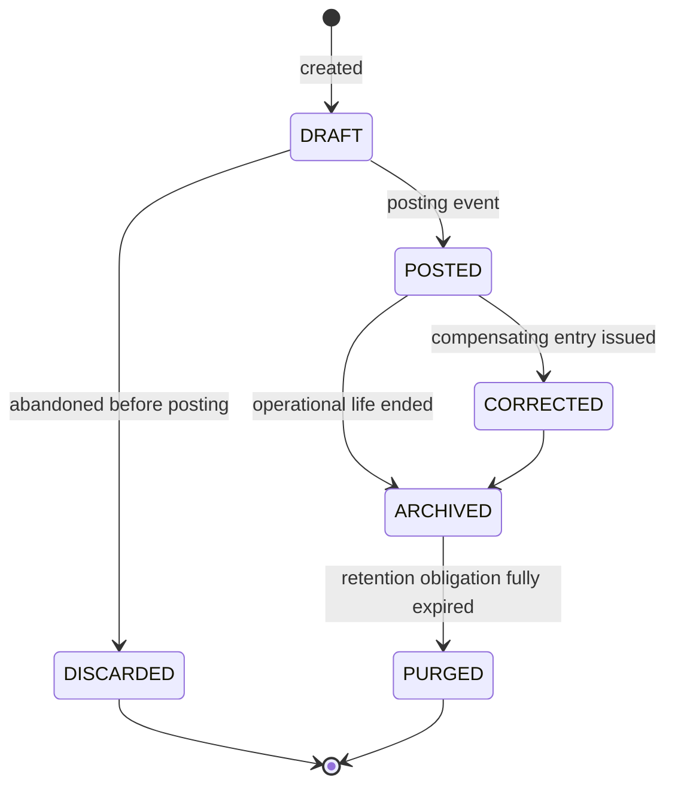

# Database Architecture

**Owner:** Trioloo Technology · **Module:** Data · **Status:** Canonical
**Version:** 1.2.0 · **Ratified:** 2026-08-04 · **Amended:** 2026-08-06 (immutability decision, `BD-254`) · **Rule prefix:** `DB-`

---

## Document Control

**Inherits:** [`SYSTEM_ARCHITECTURE.md`](SYSTEM_ARCHITECTURE.md) — module boundaries, ownership register, vocabulary.
**References:** [`ORDER_MANAGEMENT_ARCHITECTURE.md`](ORDER_MANAGEMENT_ARCHITECTURE.md), [`AUDIT_ARCHITECTURE.md`](AUDIT_ARCHITECTURE.md), [`ACCOUNTING_ARCHITECTURE.md`](ACCOUNTING_ARCHITECTURE.md).

> **This document contains no schema, no tables, no columns, no keys, no indexes, and no SQL.** It specifies the **data architecture principles** that any physical design must satisfy. Physical schema design is an engineering deliverable that is *tested against* this document (SYS-076).

---

# 1. Purpose

To define how the ERP represents, identifies, versions, retains, and protects business data — independently of any database technology.

An ERP's data architecture determines what questions the business will be able to answer in five years. Decisions made here are effectively permanent: they can be changed, but only by migrating live financial and inventory history, which is the most expensive and highest-risk work an ERP ever undertakes. This document exists to get them right once.

---

# 2. Scope

## 2.1 In scope

| Area | Coverage |
|---|---|
| Identity | How records are identified internally and by humans |
| Temporality | How time is represented and how history is preserved |
| Mutability | What may change, what may not, and how corrections work |
| Scope and tenancy | How company and access boundaries are carried |
| Classification | Data categories and their differing rules |
| Integrity | Consistency within and across module boundaries |
| Representation | Money, quantity, text, identifiers, controlled vocabularies |
| Retention | How long data lives and what happens at end of life |
| Concurrency | How simultaneous change is resolved |
| Reporting data | Separation of operational and analytical data |

## 2.2 Out of scope

Database engine, storage model, schema, keys, indexes, partitioning, query design, replication, backup mechanics, and performance tuning. All are engineering decisions constrained by, but not specified in, this document.

---

# 3. Business Goals

| # | Goal | Data consequence |
|---|---|---|
| DG-1 | Answer "what was true then?", not only "what is true now" | Temporal design (§7) |
| DG-2 | Prove what happened to any unit, order, or taka | Immutable history and unit identity (§8, §6.4) |
| DG-3 | Never lose business history | Archival, never deletion (§12) |
| DG-4 | Support multi-company without migration | Scope carried from day one (§9) |
| DG-5 | Keep figures reproducible | Derived values recomputable from movements (§8.4) |
| DG-6 | Survive a change of technology | Technology-neutral principles only |
| DG-7 | Keep reporting from distorting operations | Operational/analytical separation (§14) |

---

# 4. Architecture Principles

## 4.1 P1 — Movements are the truth; balances are derived

> **DB-001 — Every quantitative business figure is represented as a series of movements, not as a mutable balance.**

Stock on hand, receivable balance, and account balance are all **consequences** of recorded movements. A balance may be maintained for performance, but it is a cache — always reconstructible, and reconciled against the movements that produced it.

The alternative — storing a balance and adjusting it in place — makes a single missed or double-applied adjustment permanently invisible and unattributable. In an inventory and money system this is not a theoretical risk; it is the normal failure mode.

## 4.2 P2 — Write once, correct forward

> **DB-002 — Posted transactional records are immutable. A mistake is corrected by a compensating record, never by editing or deleting the original** (SYS-007, `ORDER_MANAGEMENT_ARCHITECTURE.md` BR-061).

The history of a record includes its corrections. This is a requirement of audit, dispute resolution, and tax compliance — and it is what allows the question "why did this number change?" to be answerable.

> ## ✅ DB-002 confirmed by the business — `BD-254`, 2026-08-06
>
> This rule was written ahead of confirmation and carried a live risk: three separate discovery answers (`BD-085`, `BD-088`, `BD-107`) used the words *"change"* and *"update"* about completed orders and financial records, which would have contradicted it.
>
> **The business has now confirmed the rule directly.** Completed business and financial transactions cannot be edited; originals always remain unchanged; corrections are made using linked adjustment records. The earlier wording was informal vocabulary for *linked correction*, not for editing.
>
> `DB-002`, `DB-026`, `DB-027` and `DB-023` all stand unchanged. See §4.2.1 for the one thing this settles that was previously unstated.

## 4.2.1 Where immutability begins

> **DB-077 — Immutability attaches at completion, not at creation. Draft and in-progress records remain editable under ordinary lifecycle rules; once a record is completed or posted, it may only be corrected by a linked adjustment** (`BD-254` point 5).

This boundary was **never stated** in the original specification. `DB-002` said posted records are immutable and §8.1 said a draft may be edited freely, but nothing defined the transition point or named it as a rule. It was inferred consistently across the set and is now explicit.

The practical consequence: **the editability of a record is a function of its lifecycle state, not of its type.** An order is freely editable in `DRAFT`, constrained through verification and fulfilment by `BR-011`/`BR-082`, and correctable only by linked adjustment once delivered.

> **DB-078 — A delivered order is never modified. An exchange creates a linked return/exchange record, and any item or price difference is recorded as an adjustment** (`BD-254` point 4, `BD-230`).
>
> This confirms `BR-048`, `BR-050` and `INV-50.3`. The original order remains permanently answerable to the question *"what was actually sold?"* — which is what `DB-023`'s snapshot rule exists to protect.

## 4.3 P3 — The past does not move

> **DB-003 — A change to master or configuration data never alters the meaning of a historical transaction** (SYS-017, SYS-021).

Changing a product's selling price today must not alter last month's revenue. Renegotiating a courier tariff must not alter last quarter's margin. This is achieved through snapshots (§7.4) and configuration versioning (§7.3), and it is the single most commonly violated principle in ERP implementations.

## 4.4 P4 — Data has an owner

> **DB-004 — Every data domain has exactly one owning module (SYS-004), and only that module writes it (SYS-005).**

Physical co-location of data does not confer shared ownership. If two modules can write the same figure, the figure has no owner and will diverge.

## 4.5 P5 — Unknown is representable

> **DB-005 — The absence of a value is representable and distinguishable from zero, empty, and false** (SYS-034).

An uncosted order line has an *unknown* cost, not a zero cost (`ORDER_MANAGEMENT_ARCHITECTURE.md` BR-007). A product with no recorded weight has an unknown weight, not a weight of zero. Collapsing unknown into zero produces aggregates that are confidently wrong.

## 4.6 P6 — Identity is permanent

> **DB-006 — An identifier, once issued, refers to the same thing forever and is never reused** (SYS-031).

## 4.7 P7 — Scope is intrinsic

> **DB-007 — Scope is a property of the record, not of the query that retrieves it** (SYS-014, SYS-018).

A record knows which company it belongs to. Access control filters on that property; it does not infer scope from context.

---

# 5. Core Concepts

## 5.1 Data classification

Four classes, each with different mutability, versioning, and retention rules. Misclassification is the root of most data-architecture defects.

| Class | Definition | Mutable? | Versioned? | Examples |
|---|---|---|---|---|
| **Reference** | Values that classify other data | Rarely | Yes | Status vocabularies, reason codes, units of measure, countries |
| **Configuration** | Parameters governing behaviour | Deliberately | **Yes, dated** | Commission rates, courier tariffs, verification policy, roles, tax rates |
| **Master** | The things the business deals in | Yes, controlled | Commercially significant fields only | Products, customers, suppliers, warehouses, couriers, channels |
| **Transaction** | Records of things that happened | **No, once posted** | No — immutable | Orders, shipments, stock movements, receipts, ledger entries |

> **DB-008 — Transactional records are immutable once posted.** Before posting they are drafts and may be freely edited. Posting is the boundary between "being prepared" and "part of the record."

## 5.2 The posting boundary

| Before posting | After posting |
|---|---|
| Freely editable | Immutable |
| No downstream effect | Events published; downstream modules react |
| Deletable | Reversible only by compensating entry |
| Not counted in any figure | Included in balances and reports |
| Light audit | Full audit |

> **DB-009 — Every transactional record type declares its posting event.** For an order it is release; for a stock movement it is confirmation; for a receipt it is reconciliation. Ambiguity about when a record becomes real produces double-counting.

## 5.3 Derived data

| Type | Definition | Rule |
|---|---|---|
| **Stored derived** | Computed and kept for performance | Must be reconstructible and periodically reconciled |
| **Computed on read** | Calculated when needed | Preferred where cost permits |
| **Snapshot** | Captured at a moment and frozen | Never recomputed (§7.4) |

> **DB-010 — Every stored derived value declares its source and is reconcilable against it.** A cached balance that cannot be checked against its movements is an unverifiable number.

## 5.4 Identity model

Three distinct kinds of identifier serve three distinct purposes. Conflating them is a common and damaging mistake.

| Kind | Purpose | Properties |
|---|---|---|
| **Internal identity** | Unambiguous reference within the system | Opaque, permanent, never shown to users, never carries meaning |
| **Business identifier** | Human reference in conversation and documents | Readable, stable, never reused, may be sequenced |
| **External identifier** | The counterparty's reference | Mirrored, not owned, may follow any foreign format |

> **DB-011 — Internal identity never carries business meaning.** An identifier that encodes the year, the warehouse, or the channel will eventually need to change when the business changes, and identifiers must never change (DB-006).
>
> **DB-012 — Business identifiers are unique within their company scope and are never reused, including after cancellation or voiding.** A cancelled invoice number is retired, not recycled.
>
> **DB-013 — External identifiers are stored with their issuing party.** A Daraz order number and a courier consignment number are only meaningful alongside the identity of the party that issued them. Two marketplaces may legitimately issue the same string.

Observed external identifiers requiring this treatment: marketplace order ID, shop ID (SBID), parcel ID, tracking number (`design-reference/02-orders-list.png`).

## 5.5 Serial identity

> **DB-014 — A serial is the identity of a physical unit and persists for the unit's entire existence in Trioloo's history** — receipt, storage, reservation, dispatch, delivery, return, and disposal (`ORDER_MANAGEMENT_ARCHITECTURE.md` BR-056).

A serial record outlives the order that sold it, because warranty and RMA obligations outlive commercial closure (SYS-044).

---

# 6. Entities

## 6.1 Entity ownership

Entities are defined by their owning module (SYS-004). This document specifies only the **data properties** every entity must exhibit.

## 6.2 Universal record properties

| Property | Required on | Purpose |
|---|---|---|
| Internal identity | All | Unambiguous reference |
| Company scope | All (SYS-018) | Ownership boundary |
| Record state | Master, configuration (SYS §7.1) | Lifecycle position |
| Created at / created by | All | Origin attribution |
| Last changed at / changed by | All mutable | Change attribution |
| Version | Versioned records | Concurrency and history |
| Effective period | Configuration | Temporal validity (§7.3) |
| Posted at | Transactional | Posting boundary (§5.2) |

> **DB-015 — Attribution fields are mandatory and never nullable.** A record with no creator is an unattributable record (SYS-058).

## 6.3 Relationship integrity

| Relationship | Rule |
|---|---|
| Within a module | Enforced strictly; a dangling reference is a defect |
| **Across modules** | Referenced by identity; the referencing module does not assume the referenced record is currently valid |
| To archived records | Existing references remain valid permanently; new references refused (SYS-024) |
| To external records | Mirrored identity only; no integrity guarantee possible |

> **DB-016 — A cross-module reference is resolved through the owning module, never by reaching into its data** (SYS-005, SYS-006). This holds regardless of whether the data is physically co-located.

---

# 7. Temporality

The most consequential section of this document. An ERP that mishandles time produces reports that change retroactively.

## 7.1 Three distinct times

| Time | Meaning | Example |
|---|---|---|
| **Event time** | When the thing actually happened | The courier delivered at 14:20 |
| **Record time** | When the system learned of it | The event arrived at 18:05 |
| **Business date** | Which business period it belongs to | Business day of 4 August |

> **DB-017 — Event time and record time are both retained wherever they may differ** (`ORDER_MANAGEMENT_ARCHITECTURE.md` BR-030).
>
> **DB-018 — Business date is explicit, not derived from a timestamp at read time.** An order captured at 00:30 belongs to a business day determined by business rules, not by the calendar date of its timestamp.

Retaining both event and record time is what allows two legitimate but different answers to "what did we ship on the 4th?" — what was actually shipped that day, and what we knew had shipped as of that day. Financial reporting needs the second; operations needs the first.

## 7.2 Time representation

| Rule | Statement |
|---|---|
| DB-019 | Every timestamp carries an unambiguous timezone offset |
| DB-020 | Timestamp precision is sufficient to order two events in the same second |
| DB-021 | Business calendars — periods, cut-offs, working days — are configuration, versioned per SYS-021 |

## 7.3 Configuration validity periods

> **DB-022 — Configuration values carry an effective period, and transactions reference the version in force on their own business date.**

| Configuration | Consequence of getting this wrong |
|---|---|
| Marketplace commission rate | Historical margin changes when a rate is renegotiated |
| Courier tariff | Past delivery costs change |
| Tax rate | Filed returns no longer reconcile |
| Price list | Past revenue changes |
| Verification policy | Past decisions appear non-compliant |

## 7.4 Snapshots

> **DB-023 — Any value that participates in a commercial or financial commitment is captured at commitment time and never refreshed** (SYS-017).

| Snapshot | Captured at | Why |
|---|---|---|
| Agreed unit price | Order confirmation | The customer agreed to that price |
| Product description | Order confirmation | The customer bought what was described then |
| Cost of goods | Dispatch | Margin must not move when replacement stock costs more |
| Delivery address | Dispatch | Where it was actually sent |
| Commission and charge rates | Order date | Settlement expectation must be stable |
| Customer name and contact | Order date | The invoice must remain reproducible |

> **DB-024 — A snapshot records both the captured value and the identity of the source record.** The snapshot answers "what was agreed"; the reference answers "what has it become". Both questions are legitimate and both must be answerable.

## 7.5 Master data history

> **DB-025 — Changes to commercially significant master fields are retained as history, not overwritten.**

Significant fields include selling price, cost, product specification, warranty terms, customer credit limit, and supplier terms. Non-significant fields — a corrected spelling, an internal note — may be overwritten, with the change recorded in audit (SYS-057).

---

# 8. Immutability and Correction

## 8.1 Correction model

| Situation | Mechanism |
|---|---|
| Draft contains an error | Edit freely — not yet posted (§5.2) |
| Posted record is wrong | **Compensating record** reversing its effect, plus a corrected record |
| Master data is wrong | Update with history retained (DB-025) |
| Configuration is wrong | New version with a new effective period (DB-022) |
| An entire process was mistaken | Full reversal chain; every step compensated |

> **DB-026 — A compensating record references the record it corrects, and both remain visible.**
>
> **DB-027 — Reversal is never silent.** A reversal carries a reason from a controlled vocabulary and an authorising actor (SYS-059).

## 8.2 What may never be deleted

| Category | Reason |
|---|---|
| Posted transactions | Financial and audit integrity |
| Stock movements | Inventory reconstructability |
| Serial history | Warranty and RMA obligations |
| Audit and activity records | Tamper evidence (SYS-060) |
| Master records referenced by history | Historical resolvability (SYS-024) |
| Received external data | Dispute evidence (SYS-046) |

> **DB-028 — Deletion is not available for business data. `ARCHIVED` prevents future use; it does not remove.**

## 8.3 Reconstructability

> **DB-029 — Every balance and every derived figure is reconstructible from its movements** (SYS-008, DB-001).

The test: for any stock figure, receivable balance, or margin, the system can enumerate the movements that produced it, in order, with attribution. A figure that fails this test is not usable for management decisions.

---

# 9. Scope and Tenancy

## 9.1 Scope model

The hierarchy is defined in `SYSTEM_ARCHITECTURE.md` §5.6: Company → Business Unit → (Warehouse, Channel Instance, User).

| Rule | Statement |
|---|---|
| DB-030 | Every master and transactional record carries company scope, populated from day one (SYS-014) |
| DB-031 | Scope is immutable — a record never moves between companies |
| DB-032 | Access filtering by scope is applied at the data layer, not left to callers (SYS-035) |
| DB-033 | Business identifier uniqueness is evaluated within company scope (DB-012) |
| DB-034 | A single transaction never spans two companies (SYS-019) |

## 9.2 Shared vs scoped data

| Data | Scope treatment |
|---|---|
| Reference data (units, countries, status vocabularies) | System-wide |
| Configuration | Company-scoped, with system-wide defaults |
| Products | **Open question U-1** — assumed company-scoped, potentially shared |
| Customers | **Open question U-1** — assumed company-scoped |
| Warehouses, channels, couriers | Company-scoped |
| All transactions | Company-scoped, immutably |

> **DB-035 — Until U-1 is resolved, master data is treated as company-scoped.** Sharing master data across companies later is an additive change; un-sharing it is a migration. The reversible choice is taken deliberately.

---

# 10. Representation

## 10.1 Money

| Rule | Statement |
|---|---|
| DB-036 | Every monetary value carries its currency (SYS-029) |
| DB-037 | Monetary values use exact decimal representation, never binary floating point |
| DB-038 | Precision and rounding are defined per currency and applied consistently |
| DB-039 | Rounding is a recorded operation where it materially affects a total |
| **DB-079** | **ERP-WIDE BDT MONETARY ROUNDING** — see below |

> ## **DB-079 — ERP-wide BDT monetary rounding policy**
>
> **Ratified 2026-08-10 by explicit business decision. This is the CANONICAL owner of monetary rounding for the whole ERP.**
>
> **For BDT monetary amounts, ERP-wide:**
>
> | | |
> |---|---|
> | **Final monetary line and posting amounts** | **2 decimal places** |
> | **Rounding mode** | **`HALF_UP`** |
> | **Order of operations** | **Round the LINE first, then aggregate** |
> | **Totals** | **Calculated from the already-rounded monetary lines** |
> | **Intermediate rates, percentages, weighted-average costs, unit rates** | **Retain sufficient HIGHER precision** |
> | **Arithmetic** | **Exact decimal end-to-end** (`DB-037`) |
>
> 🔴 **Intermediate rates must NOT be prematurely rounded merely because final BDT amounts are 2dp.**
>
> **The required shape:**
>
> **high-precision unit cost × quantity → exact/high-precision calculation → monetary line amount → 2dp `HALF_UP` → total from rounded monetary lines.**
>
> ✅ **`DB-038` states the general form** — *precision and rounding are defined per currency and applied consistently.* **`DB-079` is its BDT instantiation.** **`DB-038` is unchanged.**
>
> ⚠ **SCOPE — MONETARY AMOUNTS ONLY.** **This rule does not reach** quantity rounding · duration rounding · percentage precision · rate precision · overtime duration (`BD-483`) · late and early-departure completed-hour rules (`BD-467`, `BD-469`). **Those keep their own rules and are not disturbed.**
>
> **Consumed by** `ACC-098` · `ICO-036` · `HRP-025` · `TEC-011`. ⚠ **Those documents REFERENCE this policy; they do not restate or re-derive it** (`DOC-006`).
>
> **History.** **`BD-482` §10 originally scoped 2dp `HALF_UP` to PAYROLL only**, and `DB-037` mandated exact decimal ERP-wide without stating a scale. **A later explicit business decision broadened the monetary policy ERP-wide; `BD-482`'s original payroll scope remains historically traceable and is not rewritten** (`DOC-009`).

**On DB-037.** Binary floating point cannot represent common decimal amounts exactly. In a system that sums thousands of transactions into financial statements, the accumulated error is real, unattributable, and will not reconcile. This is a correctness requirement, not an optimisation.

**On DB-039.** Where an amount is apportioned — a courier charge across order lines, a marketplace deduction across items — the rounding residue must land somewhere explicitly, and the apportionment must sum exactly to the original.

## 10.2 Quantity

| Rule | Statement |
|---|---|
| DB-040 | Every quantity carries a unit of measure (SYS-030) |
| DB-041 | Quantity precision is a property of the product's unit of measure |
| DB-042 | Serialized products transact in whole units only |

## 10.3 Text and identifiers

| Rule | Statement |
|---|---|
| DB-043 | Text supports the full range of characters used by the business, including Bengali |
| DB-044 | Text comparison and sorting behave correctly for the scripts in use |
| DB-045 | Business identifiers are case-insensitive for matching and preserved as entered for display |
| DB-046 | External identifiers are stored exactly as received, unnormalised (SYS-046) |

**On DB-043.** Customer names, addresses, and delivery notes will contain Bengali script. Address quality directly determines delivery success, and a system that mangles or rejects Bengali text degrades the business's core operation.

**On DB-046.** Normalising an external identifier — trimming, upper-casing, stripping punctuation — destroys the ability to reproduce exactly what a partner sent, which is precisely what is needed in a dispute.

## 10.4 Controlled vocabularies

> **DB-047 — Controlled vocabulary values are permanent. A value may be deprecated from future use; it is never repurposed or deleted** (SYS-043).

Repurposing a value silently changes the meaning of every historical record that references it. A report run today over last year's cancellations would return a different answer than it did last year, with no change visible anywhere.

---

# 11. Concurrency

| Rule | Statement |
|---|---|
| DB-048 | Concurrent modification of one record is detected, never silently resolved by last-write-wins |
| DB-049 | A detected conflict is surfaced to the actor with both versions, not auto-merged |
| DB-050 | Operations that must not interleave — stock reservation, identifier issuance, settlement matching — are serialised on their contended subject |
| DB-051 | Serialisation is scoped as narrowly as correctness allows |

**On DB-050.** Two orders reserving the last unit of stock must not both succeed. Two processes issuing an invoice number must not produce the same number. These are correctness requirements independent of technology.

**On DB-048.** In a call centre where several agents work the same order queue, and a verification agent may be editing an order while a warehouse user releases it, silent last-write-wins loses work invisibly. The order module already prevents duplicate calling by locking during verification (`ORDER_MANAGEMENT_ARCHITECTURE.md` §7.6); the same discipline applies generally.

---

# 12. Retention and Lifecycle

## 12.1 Data lifecycle

| State | Meaning |
|---|---|
| `DRAFT` | Being prepared; mutable; no downstream effect |
| `POSTED` | Part of the record; immutable; events published |
| `CORRECTED` | Superseded by a compensating entry; both retained |
| `ARCHIVED` | Beyond operational use; retained and readable |
| `PURGED` | Removed after every retention obligation has expired |

## 12.2 Retention

> **DB-052 — Retention is governed by the longest obligation attached to the record** (SYS-044).

| Obligation | Typical driver |
|---|---|
| Statutory and tax | Jurisdiction — **unknown U-3** |
| Warranty | Product warranty term, from delivery |
| Dispute and claim | Commercial agreements with marketplaces and couriers |
| Operational | Business usefulness |

> **DB-053 — Purging requires that every applicable obligation has expired, and is itself an audited action** (SYS-059).
>
> **DB-054 — Audit records outlive the records they describe.** Purging a business record does not purge the evidence that it existed and was purged.

## 12.3 Personal data

| Rule | Statement |
|---|---|
| DB-055 | Personal data is identified as such and its access is audited (SYS §16.2) |
| DB-056 | Personal data belonging to a marketplace-owned customer is a mirror and is subject to that marketplace's terms (SYS-010) |
| DB-057 | Where personal data must be removed but the transaction must be retained, the transaction is retained with the personal data redacted, never deleted |

**On DB-057.** A right-to-erasure request cannot be allowed to destroy financial history. The reconciling approach is to sever the personal identity while preserving the transaction, its amounts, and its audit trail.

---

# 13. Integrity

| Rule | Statement |
|---|---|
| DB-058 | A business operation either completes fully or has no effect |
| DB-059 | Cross-module consistency is eventual and reconciled, never assumed immediate (SYS-006) |
| DB-060 | Every eventual-consistency gap has a reconciliation mechanism that detects divergence |
| DB-061 | Reconciliation discrepancies raise exceptions (SYS-022), never silent correction |

**On DB-059 and DB-060.** Because modules couple by event, a moment exists where an order is dispatched and Inventory has not yet recorded the deduction. This is acceptable **only** because a reconciliation exists that would detect the deduction never arriving. An eventual-consistency gap without a detector is a silent data-loss channel.

## 13.1 Required reconciliations

| Reconciliation | Detects |
|---|---|
| Stock movements vs stock on hand | Lost or double-applied movements |
| Physical count vs system stock | Shrinkage, mis-picks, unrecorded damage |
| Dispatched orders vs stock deductions | Missing deduction events |
| Delivered orders vs receivables raised | Unbilled deliveries |
| Receivables vs receipts | Unremitted COD, unsettled marketplace orders |
| Settlement expected vs actual | Deduction errors and disputes (SYS-055) |
| Purchase receipts vs supplier invoices | Overbilling, short delivery |
| Ledger vs subsidiary balances | Posting errors |

> **DB-062 — Every reconciliation runs on a defined cycle and produces a result, including when it finds nothing.** A reconciliation that reports only exceptions cannot be distinguished from one that has stopped running.

---

# 14. Operational and Analytical Separation

| Rule | Statement |
|---|---|
| DB-063 | Reporting never degrades operational capability |
| DB-064 | Reporting figures derive from the semantic layer defined by Reporting, over data owned by the source modules |
| DB-065 | Analytical data is reconcilable to operational data, with any timing lag declared |
| DB-066 | A figure reported to management is traceable to the transactions that produced it (DB-029) |

> **DB-067 — Reporting never becomes a second system of record.** A figure that exists only in reporting, computed by logic that exists only in reporting, is unowned and unverifiable (SYS-015).

---

# 15. Module Responsibilities

| Actor | Responsibility |
|---|---|
| **Each owning module** | Defines its entities, enforces its rules, publishes its events, guarantees its own internal integrity |
| **Data architecture (this document)** | Defines the universal properties every module's data must exhibit |
| **Audit** | Consumes change records; owns retention of evidence |
| **Reporting** | Consumes owned data through a defined semantic layer; owns no business figure |
| **Engineering** | Produces a physical design satisfying every rule here |

---

# 16. Integration Points

| Integration | Data consequence |
|---|---|
| Channel adapters | External identifiers stored unnormalised with issuing party (DB-013, DB-046); raw received payload retained as evidence (SYS-046) |
| Courier adapters | Tracking events append-only (`ORDER_MANAGEMENT_ARCHITECTURE.md` BR-031); event and record time both retained (DB-017) |
| Payment and settlement | Expected and actual both retained (SYS-055); settlement reports retained as received |
| Accounting export | Exported figures traceable to source transactions (DB-066) |
| Future systems | Constrained by the same rules; no exemption for integration convenience |

---

# 17. Events

Data-layer events supporting system-wide obligations:

| Event | Purpose |
|---|---|
| `Data.RecordPosted` | Posting boundary crossed (§5.2) |
| `Data.RecordCorrected` | Compensating entry issued |
| `Data.RecordArchived` | Withdrawn from operational use |
| `Data.RecordPurged` | Retention expired and removal executed |
| `Data.ReconciliationCompleted` | Cycle finished, with result |
| `Data.DiscrepancyDetected` | Reconciliation found divergence |
| `Data.ConflictDetected` | Concurrent modification conflict |

---

# 18. Audit Requirements

Specified in `AUDIT_ARCHITECTURE.md`. Data-layer obligations:

| Rule | Statement |
|---|---|
| DB-068 | Every change to a master or configuration record is audited with before and after values |
| DB-069 | Every posting, correction, archival, and purge is audited |
| DB-070 | Every access to personal data is audited (DB-055) |
| DB-071 | Audit data is held such that its alteration is detectable (SYS-060) |
| DB-072 | Audit records are interpretable without the operational system (`ORDER_MANAGEMENT_ARCHITECTURE.md` BR-064) |

---

# 19. Permissions

Specified in `PERMISSION_ARCHITECTURE.md`. Data-layer obligations:

| Rule | Statement |
|---|---|
| DB-073 | Scope filtering is applied at the data layer, not by callers (DB-032) |
| DB-074 | Read access to personal, cost, and margin data is separately controllable |
| DB-075 | Purge, correction, and manual adjustment require explicit authority (SYS-066) |
| DB-076 | No actor may alter audit data, at any authority level (SYS-060) |

**On DB-074.** Cost and margin are commercially sensitive. A warehouse user needs product and stock data but has no business need for cost; a call centre agent needs customer contact data but not margin. Separating these is a routine enterprise requirement.

---

# 20. Error Scenarios

| Scenario | Required behaviour |
|---|---|
| Movement recorded twice | Idempotency prevents double application (SYS-045); duplicate recorded, not applied |
| Movement lost | Reconciliation detects (DB-060); exception raised |
| Balance disagrees with movements | Movements are authoritative; balance rebuilt; discrepancy investigated (DB-001) |
| Concurrent modification | Conflict surfaced with both versions (DB-048, DB-049) |
| Reference to an archived record | Existing references valid; new references refused (SYS-024) |
| Reference to a non-existent record | Operation refused; never a partial write |
| Configuration changed mid-process | In-flight records keep the version in force at their date (DB-022) |
| Rounding residue on apportionment | Explicitly allocated; total reconciles exactly (DB-039) |
| Unknown value required for a computation | Result is unknown, excluded from aggregates (DB-005) |
| Retention expired but a dispute is open | Purge blocked until the obligation clears (DB-052) |
| External identifier collides across parties | Distinguished by issuing party (DB-013) |
| Personal data erasure requested | Transaction retained, identity redacted (DB-057) |

---

# 21. Future Extensibility

| Scenario | Absorption | Migration? |
|---|---|---|
| Multi-company activation | Scope already present and populated (DB-030) | **None** |
| Multi-currency | Currency already carried on every amount (DB-036) | None for structure; Accounting adds translation |
| Additional warehouses, channels, couriers | Configuration (SYS-013) | None |
| New product categories | Product-owned configuration | None |
| New reference and reason codes | Additive (DB-047) | None |
| Higher volumes | Physical concern; principles unaffected | None architecturally |
| Analytical expansion | Semantic layer over owned data (DB-064) | None |
| External accounting integration | Export with traceability (DB-066) | None |
| Mobile and partner clients | Same data rules apply | None |

## 21.1 What would require migration

| Change | Cost |
|---|---|
| Introducing scope after data exists | **Avoided by DB-030** — this is the migration this architecture is designed to prevent |
| Moving from balances to movements after the fact | Severe — historical balances cannot be decomposed retrospectively |
| Adding temporality to configuration after rates have changed | Severe — historical margin cannot be recovered |
| Making immutable what was previously editable | Severe — prior edits are unrecoverable |

These four are precisely the decisions this document settles at the outset, because each is cheap now and effectively unaffordable later.

---

# 22. Unknowns

| # | Unknown | Impact | Assumption |
|---|---|---|---|
| DBU-1 | Will companies share product and customer master data? (SYS U-1) | Determines scoping of master data | Company-scoped (DB-035) |
| DBU-2 | Statutory retention periods in the operating jurisdiction (SYS U-3) | Sets retention floors | Longest applicable obligation |
| DBU-3 | Are there data-residency or cross-border constraints? | May constrain hosting | None assumed |
| **DBU-4** | **Is there legacy data to migrate? (SYS U-6)** | Migration rules unspecified | **⚠ ANSWERED — `BD-007`. An existing Laravel ERP is in production. This is a migration, not greenfield.** Migration rules remain unspecified across the whole set — `GAP-070`, `SYS-083` |
| DBU-5 | Required precision for currency and for each unit of measure | Affects rounding rules (DB-038) | Two decimals for Taka; whole units for serialized goods |
| DBU-6 | Personal-data erasure obligations applicable to the business | Determines DB-057 handling | Redaction with transaction retention |

---

# Appendix — Rule Index

DB-001–007 principles · DB-008–014 classification and identity · DB-015–016 entities · DB-017–025 temporality · DB-026–029 immutability · DB-030–035 scope · DB-036–047 representation · DB-048–051 concurrency · DB-052–057 retention · DB-058–062 integrity · DB-063–067 analytical separation · DB-068–072 audit · DB-073–076 permissions · **DB-077–078 immutability boundary (§4.2.1)**.

**Amendment record**

| Version | Date | Change |
|---|---|---|
| 1.0.0 | 2026-08-04 | Initial ratification |
| **1.1.0** | **2026-08-06** | **Immutability decision confirmed (`BD-254`).** `DB-002`, `DB-023`, `DB-026`, `DB-027` **confirmed unchanged** by the business. `DB-077` added — immutability attaches at completion, not creation, making draft/in-progress editability an explicit rule for the first time. `DB-078` added — delivered orders are never modified; exchanges create linked records. `DBU-4` answered: this is a migration programme. Source: [`BUSINESS_DISCOVERY.md`](BUSINESS_DISCOVERY.md) `BD-254`, `BD-230` |

---

*This document specifies data architecture principles only. It contains no schema, tables, columns, keys, indexes, or SQL. Physical design is an engineering deliverable tested against these rules.*
