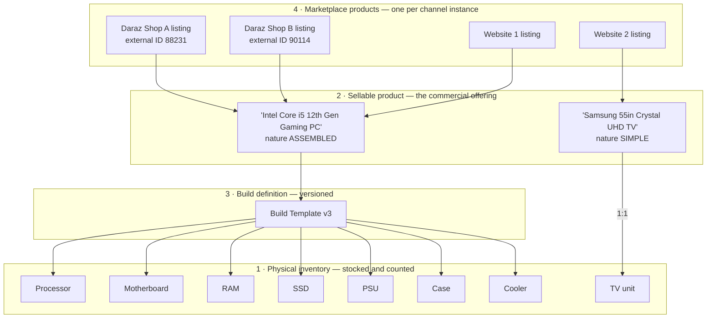
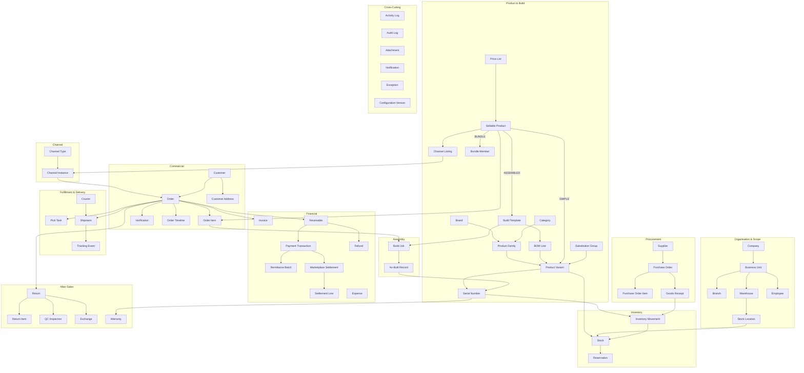

# Domain Model

**Owner:** Trioloo Technology · **Type:** Canonical business domain model · **Status:** Canonical
**Version:** 3.33.0 · **Updated:** 2026-08-15 (**`INV-16.4` sharpened — the internal code is ERP-ASSIGNED, not operator-typed**) · **Updated:** 2026-08-15 (**`E-016` cross-domain account scope — `INV-16.11`–`INV-16.13`; `DM-085`**) · **Updated:** 2026-08-15 (**`E-016` Shops & Channels ratification — `market` and `internal code` attributes; `INV-16.4`–`INV-16.10`; `DM-084`**) · **Updated:** 2026-08-14 (**`INV-106.10` added — Listing package publishing facts on `E-106`; `INV-59.12` added — English/Bangla listing content with derived fallback; Product `PRD-201`, `PRD-202`**) · **Updated:** 2026-08-14 (**`INV-106.3` / `INV-106.8` amended and `INV-106.9` added — Listing `Sale Price` + optional time-bounded `Promotion Price`; Product `PRD-199` supersedes `PRD-197`; 🔴 `MRP` is no longer a Listing price**) · **Updated:** 2026-08-14 (**`INV-106.3` amended and `INV-106.8` added — Listing `MRP` / `Sale Price`; Product `PRD-197`**) · **Updated:** 2026-08-13 (**`E-106` Channel Listing SKU, `E-107` Operation, `E-108` Operation Batch; `INV-59.1`/`INV-59.2` amended; Product `PRD-173`-`PRD-196`**) · **Updated:** 2026-08-13 (**`E-105` Media Asset; commercial content and media invariants for `E-058`/`E-059`; Product `PRD-163`-`PRD-172`**) · **Updated:** 2026-08-11 (**ASSEMBLED finished Product Variant identity for `E-058`; Product `PRD-156`-`PRD-161`) · **Updated:** 2026-08-11 (**Order-Specific Build Configuration — `E-103`, `E-104`; `GAP-129` resolved**) · **Updated:** 2026-08-08 (Sales reconciliation; immutability `BD-254`; serial policy `BD-242`; discount policy `BD-255`; Warehouse & Assembly §17; Purchase & Supplier §18; revenue recognition `BD-304`; Accounting §19; Marketplace; Warranty; Return & Exchange; Chat; Access; Notifications; Trade-In; Fund Transfers) · **Entity prefix:** `E-` · **Rule prefix:** `DM-`

---

## Document Control

### Purpose of this document

The canonical **business domain model** for the Trioloo ERP. It defines every business entity, its purpose, ownership, responsibility, attributes, relationships, lifecycle, and **invariants**.

It is the single source of truth from which every future entity, DTO, API contract, database design, service, workflow, permission, and report is derived. Those artefacts are **implementations of this model**; where they disagree, they are defects (`DOC-003`).

### What changed in v2.0.0

| Change | Detail |
|---|---|
| **Nine entities added** | `E-058`–`E-064` from [`PRODUCT_ARCHITECTURE.md`](PRODUCT_ARCHITECTURE.md) (required by `PRD-061`), plus `E-065` Build Job and `E-066` Purchase Order Item |
| **Four-way distinction added** | §3 — physical inventory vs marketplace products vs build definitions vs sellable products |
| **Identity strategy expanded** | §4 — six identifier classes, from three |
| **Invariants added** | Every entity now carries testable invariants; consolidated in §22 |
| **State machine index updated** | 7 → 11 machines, per [`STATE_MACHINE_ARCHITECTURE.md`](STATE_MACHINE_ARCHITECTURE.md) |
| **Terminology collision resolved** | §3.4 — "Marketplace Product" was used in two senses across briefs |

### Consistency basis

| Document | Inherited |
|---|---|
| [`SYSTEM_ARCHITECTURE.md`](SYSTEM_ARCHITECTURE.md) | Ownership register (§5.4), scope hierarchy (§5.6), record classification (§5.7), exception concept |
| [`ORDER_MANAGEMENT_ARCHITECTURE.md`](ORDER_MANAGEMENT_ARCHITECTURE.md) | Order lifecycle, canonical order, catalogued/non-catalogued lines, `BR-001`–`BR-070` |
| [`PRODUCT_ARCHITECTURE.md`](PRODUCT_ARCHITECTURE.md) | Three-layer product model, BOM, assembly, `PRD-001`–`PRD-099` |
| [`DATABASE_ARCHITECTURE.md`](DATABASE_ARCHITECTURE.md) | Identity model, temporality, immutability, universal properties |
| [`STATE_MACHINE_ARCHITECTURE.md`](STATE_MACHINE_ARCHITECTURE.md) | The eleven lifecycles |
| [`EVENT_ARCHITECTURE.md`](EVENT_ARCHITECTURE.md) | Events acting on these entities |
| [`PERMISSION_ARCHITECTURE.md`](PERMISSION_ARCHITECTURE.md) | User, Role, Role Assignment, scope grants |
| [`AUDIT_ARCHITECTURE.md`](AUDIT_ARCHITECTURE.md) | Activity and audit record content |
| [`DESIGN_CONSTITUTION.md`](DESIGN_CONSTITUTION.md) + [`design-reference/`](design-reference/README.md) | Observed business vocabulary; UI authority |
| [`GAP_ANALYSIS.md`](GAP_ANALYSIS.md) | Known gaps, referenced rather than filled |

**`UI_ARCHITECTURE.md`** is cited in the brief but does not exist (`SYS U-8`, `GAP-068`). **The Claude Design project list is empty** — verified four times across this work (`SYS U-9`). UI context is therefore taken from the Design Constitution and the three binding reference images.

### What this document is not

> **No database schema. No SQL. No Java. No table structures. No API contracts. No UI.**
>
> Entities are **business concepts**. "Attributes" describe what the business must know, not columns, types, keys, or nullability. Relationships describe business dependency, not foreign keys.

### The invention rule

> **DM-001 — This document models entities. It does not decide undecided business questions.**
>
> Where the documentation set has a gap, this model states the entity's structure and **marks the gap**, citing `GAP-nnn` or a `*U-n` unknown. It does not fill it.

### State reference convention

> **DM-002 — States are written `Machine:STATE`** because names collide across independent machines (`GAP-026`). A presentation convention, not a ratified rename.

---

## Table of Contents

| § | Section |
|---|---|
| 1 | Modelling Principles |
| 2 | Universal Entity Properties |
| 3 | **The Four-Way Distinction** |
| 4 | **Identity Strategy** |
| 5 | Domain Map |
| 6 | Organisation & Scope |
| 7 | Identity & Access |
| 8 | Channel |
| 9 | Master Data |
| 10 | **Product & Build** |
| 11 | Inventory |
| 12 | Procurement |
| 13 | Commercial |
| 14 | Fulfillment & Delivery |
| 15 | Financial |
| 16 | After-Sales |
| 17 | Cross-Cutting |
| 18 | Ownership Index |
| 19 | Relationship Rules |
| 20 | State Machine Index |
| 21 | **Invariant Register** |
| 22 | Unknowns |

---

# 1. Modelling Principles

| # | Principle | Source |
|---|---|---|
| **DM-003** | Every entity has exactly one owning module | `SYS-004` |
| **DM-004** | An entity is owned by the module that may change it, not the one that reads it most | `SYS-005` |
| **DM-005** | Cross-module relationships are references resolved through the owner | `SYS-006`, `DB-016` |
| **DM-006** | Quantitative position is derived from movement entities, never stored as a mutable balance | `DB-001` |
| **DM-007** | Values participating in a commitment are snapshotted onto the committing entity | `DB-023` |
| **DM-008** | Transactional entities are immutable once posted; corrections are compensating entities | `DB-002` |
| **DM-009** | Master and configuration entities are archived, never deleted | `SYS-024`, `DB-028` |
| **DM-010** | Every entity carries company scope | `SYS-018`, `DB-030` |
| **DM-011** | An entity's lifecycle is a record lifecycle, a posting lifecycle, or a named state machine | `SYS §7.1`, `SMA §3` |
| **DM-012** | An absent value is representable and distinct from zero | `DB-005`, `SYS-034` |
| **DM-022** | **Every entity declares invariants — conditions that must hold at all times, in every state** | New in v2.0.0 |

## 1.1 Entity classes

Per `SYS §5.7`, every entity belongs to exactly one class.

| Class | Mutability | Lifecycle | Examples |
|---|---|---|---|
| **Configuration** | Deliberate, dated versions | Record lifecycle | Channel Instance, Courier, Price List, Build Template |
| **Master** | Controlled, history retained | Record lifecycle | Product Variant, Sellable Product, Customer, Supplier |
| **Transactional** | Immutable once posted | Posting lifecycle or state machine | Order, Inventory Movement, Build Job, Payment Transaction |
| **Derived** | Not stored as truth | Recomputed | Stock, Sellable availability, Order Timeline |
| **Evidential** | Append-only | Sealed | Activity Log, Audit Log, As-Built Record, Attachment |

> **DM-013 — Class determines behaviour.** A Derived entity that is stored must be reconcilable to its sources (`DB-010`); an Evidential entity may never be altered (`AUD-006`).

## 1.2 On invariants

> **DM-022** introduces invariants as a first-class part of every entity definition.

An invariant is a condition that is **always true**, not a rule about a transition. "A refund never exceeds the amount received" is an invariant — it holds in every state, at every moment. "Verification precedes release" is a transition rule, not an invariant.

Invariants are the most directly testable content in this document: each becomes an assertion that can be checked against any system state. §21 consolidates them.

---

# 2. Universal Entity Properties

Carried by every entity unless excepted; not repeated per entity.

| Property | Applies to | Source |
|---|---|---|
| Internal identity — opaque, permanent, meaningless | All | `DB-011` |
| Company scope | All | `DM-010` |
| Created at / created by | All | `DB-015` |
| Last changed at / changed by | Mutable entities | `DB-015` |
| Record state | Master, Configuration | `SYS §7.1` |
| Posted at | Transactional | `DB-009` |
| Effective period | Configuration | `DB-022` |
| Version | Versioned entities | `DB-025` |

## 2.1 Attribute conventions

| Convention | Rule |
|---|---|
| Money carries its currency | `DB-036` |
| Money uses exact decimal representation | `DB-037` |
| Quantity carries its unit of measure | `DB-040` |
| Serialized products transact in whole units | `DB-042` |
| Timestamps carry offset; business date explicit | `DB-018`, `DB-019` |
| External identifiers stored with issuing party, unnormalised | `DB-013`, `DB-046` |
| Reason codes from controlled vocabularies | `SYS-043` |
| Text supports Bengali script | `DB-043` |

---

# 3. The Four-Way Distinction

The single most important structural fact in this domain, and the one most likely to be collapsed by an implementer who has not read it.

## 3.1 The four concepts

| # | Concept | Canonical entity | Physical? | Holds stock? | Example |
|---|---|---|---|---|---|
| **1** | **Physical inventory** | `E-020` Product Variant · `E-026` Stock · `E-021` Serial | **Yes** | **Yes** | Intel Core i5-12400F · 16GB DDR4 · 550W PSU · a Samsung 55″ TV unit |
| **2** | **Sellable product** | `E-058` Sellable Product | **No** | **No** | *"Intel Core i5 12th Gen Gaming PC"* |
| **3** | **Build definition** | `E-060` Build Template + `E-061` BOM Line | No | No | The versioned component list for that PC |
| **4** | **Marketplace product** | `E-059` Channel Listing | No | No | That PC as listed on Daraz Shop A, with its Daraz item ID |

## 3.2 How they relate

## 3.3 The rules that follow

| Rule | Statement |
|---|---|
| **DM-023** | **Only physical inventory holds stock.** A sellable product, build definition, or marketplace listing never has a stock quantity (`PRD-003`) |
| **DM-024** | **Sellable availability is always derived from component inventory, never taken from a marketplace quantity** (`PRD-023`). A marketplace's stock figure is a mirror of what Trioloo published, not a source |
| **DM-025** | **A finished PC need not exist before fulfillment.** It comes into being at assembly and is not stock beforehand (`PRD-045`) |
| **DM-026** | One sellable product has many marketplace listings; one listing belongs to exactly one sellable product and one channel instance (`PRD-028`) — ⚠ **AMENDED v3.27.0: the channel-instance half is unchanged; the sellable-product mapping moves to the ORDERABLE CHANNEL SKU (`E-106`) and is ZERO while `UNMAPPED`, exactly ONE once `MAPPED`** (`PRD-178`, `PRD-190.d`, `INV-59.1`). *Original retained (`DOC-009`).* |
| **DM-027** | A build definition references **physical inventory only**, never another sellable product (`PRD-032`, `PRD-034`) |

> **DM-024 is the invariant most at risk of being violated in implementation.** The tempting shortcut is to read stock back from Daraz, because Daraz reports a number. That number is Trioloo's own published figure returned to it — using it as a source creates a loop in which the system confirms its own guess.

## 3.4 Terminology collision — resolved

The term **"Marketplace Product"** has been used in two different senses across the source briefs. Both are recorded here so neither reading is lost.

| Sense | Meaning | Canonical entity |
|---|---|---|
| **Sense A** — *"a virtual sellable product"*, *"one marketplace product can have multiple external IDs"* | The commercial offering that exists across marketplaces | **`E-058` Sellable Product** |
| **Sense B** — `PRD-005`, *"Marketplace Product and Website Product are the same entity class"* | One channel's representation of that offering | **`E-059` Channel Listing** |

> **DM-028 — Sense A is canonical for the term "Marketplace Product" in this model.** A thing with *multiple* external IDs cannot be a listing, because a listing has exactly one (`PRD-031`, invariant `INV-59.2`). `PRD-005` remains correct in its own context — it was ruling that marketplace and website *listings* are one entity class — but the phrase is ambiguous and should be avoided.
>
> **Preferred vocabulary: "Sellable Product" and "Channel Listing".** `PRODUCT_ARCHITECTURE.md` §10.1 should be amended to note the ambiguity (`DMU-19`).

---

# 4. Identity Strategy

Per `DB §5.4`, identity kinds must never be conflated. This domain has six.

## 4.1 The six classes

| # | Class | Issued by | Shown to users? | Carries meaning? | Examples |
|---|---|---|---|---|---|
| **1** | **Internal ID** | Trioloo system | **Never** | **Never** | Every entity |
| **2** | **Business identifier** | Trioloo | Yes | Readable, not encoded | Order number, invoice `INV-0207`, SKU, PO number, build serial |
| **3** | **Marketplace ID** | Marketplace, per shop | Yes | External format | Daraz order ID, Daraz item ID, shop ID (SBID) |
| **4** | **Website ID** | Trioloo website, per site | Yes | Site-local | Site order reference, product slug |
| **5** | **Courier ID** | Courier | Yes | External format | Consignment number, parcel ID, tracking number |
| **6** | **Payment / supplier reference** | Bank, marketplace, supplier | Yes | External format | Remittance reference, settlement report ID, supplier invoice number |

## 4.2 Rules

| Rule | Statement |
|---|---|
| **DM-014** | **Internal IDs never carry business meaning** — an ID encoding year, warehouse, or channel must change when the business changes, and IDs must never change (`DB-006`, `DB-011`) |
| **DM-029** | **Business identifiers are unique within company scope and never reused**, including after cancellation or voiding (`DB-012`, `SYS-031`) |
| **DM-030** | **Every external identifier is stored with its issuing party** (`DB-013`). Two Daraz shops may issue the same string; two marketplaces certainly may |
| **DM-031** | **External identifiers are stored exactly as received, unnormalised** (`DB-046`). Trimming or upper-casing destroys the ability to reproduce what a partner sent — precisely what a dispute requires |
| **DM-032** | **An entity may hold many external identifiers simultaneously**, one per issuing party |
| **DM-033** | Identity class is explicit on every identifier. A bare string with no class and no issuer is not an identifier |

## 4.3 Identifiers by entity

| Entity | Internal | Business | External |
|---|---|---|---|
| `E-031` Order | Yes | Order number, invoice number | Daraz order ID + SBID; website order reference; courier tracking |
| `E-020` Product Variant | Yes | Inventory SKU, barcode | Manufacturer part number |
| `E-058` Sellable Product | Yes | Sellable SKU | — (its listings carry them) |
| `E-059` Channel Listing | Yes | — | **Exactly one** per listing — Daraz item ID or website slug |
| `E-021` Serial Number | Yes | — | **Manufacturer-issued serial** |
| `E-065` Build Job | Yes | Build serial (`PRDU-1`) | — |
| `E-037` Shipment | Yes | — | Consignment, parcel ID, tracking |
| `E-029` Purchase Order | Yes | PO number | Supplier order reference |
| `E-041` Payment Transaction | Yes | — | Remittance or settlement reference |
| `E-043` Marketplace Settlement | Yes | — | Settlement report ID |

> **DM-034 — The observed identifiers in `design-reference/02-orders-list.png` — `DARAZ · SBID: 686514786`, `PARCEL ID`, `TRACKING: DEX-BGN-00/2025928`, `INV-0207` — span four of the six classes on one order row.** Each must remain individually resolvable to its issuer.

---

# 5. Domain Map

---

# 6. Organisation & Scope

## E-001 · Company

| | |
|---|---|
| **Purpose** | The legal entity that owns transactions, holds books, and bounds all data |
| **Ownership** | System |
| **Responsibility** | Defines the outermost scope boundary of every record |
| **Parents / Children** | None / Business Unit, and by inheritance every scoped entity |
| **Lifecycle** | Master record lifecycle |

**Key attributes** — legal name; trading name; registration identifiers; base currency; business calendar; address; tax registration *(structure undefined — `GAP-003`)*.

**Invariants**
- `INV-1.1` Every record in the system resolves to exactly one company (`SYS-018`).
- `INV-1.2` No transaction references records from two companies (`SYS-019`).
- `INV-1.3` A record's company never changes (`DB-031`).

**Notes** — Multi-company is future, but scope is carried from day one because retrofitting it after financial history exists is the most expensive migration in this class of system (`SYS-014`).

---

## E-002 · Business Unit

| | |
|---|---|
| **Purpose** | A division within a company; the second scope level |
| **Ownership** | System |
| **Responsibility** | Groups warehouses, channel instances, and users for scoping and reporting |
| **Parents / Children** | Company / Branch, Warehouse, Channel Instance, scope grants |
| **Lifecycle** | Master record lifecycle |

**Key attributes** — name; parent company; default warehouse; active period.

**Invariants**
- `INV-2.1` Every business unit belongs to exactly one company.
- `INV-2.2` A user's scope never exceeds the business units granted to them (`SYS-020`).

---

## E-003 · Branch

| | |
|---|---|
| **Purpose** | A physical trading location where walk-in customers are served and staff are based |
| **Ownership** | System |
| **Responsibility** | Anchors walk-in orders, counter sales, and staff assignment to a place |
| **Parents / Children** | Business Unit / Employee assignments; associated Warehouse and Channel Instance |
| **Lifecycle** | Master record lifecycle |

**Key attributes** — name; business unit; address; associated warehouse; associated channel instance; operating status.

**Invariants**
- `INV-3.1` A branch never holds stock directly — stock is always held by a Warehouse (`DM-023`).
- `INV-3.2` A walk-in order originating at a branch has fulfillment method `SELF_PICKUP` (`SMA-013`).

**Notes** — `SYS §5.6` does **not** define Branch as a scope level. This model treats it as a physical location composing with Warehouse and Channel Instance, so `SYS §5.6` is not contradicted. Branch-level P&L would require amending that hierarchy first (`GAP-057`, `DMU-10`).

---

## E-004 · Warehouse

| | |
|---|---|
| **Purpose** | A stock-holding facility |
| **Ownership** | Warehouse |
| **Responsibility** | The unit at which stock availability, allocation, assembly, and fulfillment are determined |
| **Parents / Children** | Business Unit / Stock Location, Stock, Pick Task, Build Job, Goods Receipt |
| **Lifecycle** | Master record lifecycle |

**Key attributes** — name; business unit; address; courier coverage; assembly capability; operating status; capacity indicators.

**Invariants**
- `INV-4.1` Stock exists only within a warehouse.
- `INV-4.2` A build job executes at exactly one warehouse.
- `INV-4.3` A warehouse referenced by any historical movement is archived, never deleted (`SYS-024`).

---

## E-005 · Stock Location

| | |
|---|---|
| **Purpose** | A position within a warehouse where goods physically sit |
| **Ownership** | Warehouse |
| **Responsibility** | Makes stock findable and distinguishes sellable from non-sellable positions |
| **Parents / Children** | Warehouse / Stock |
| **Lifecycle** | Master record lifecycle |

**Key attributes** — identifier; warehouse; location type; **sellability flag**.

**Location types** — Storage (sellable) · Staging · Despatch · **Quarantine** (never sellable) · Scrap · **Build staging** (components withdrawn for assembly).

**Invariants**
- `INV-5.1` Returned goods are received only into a Quarantine location (`BR-046`).
- `INV-5.2` A location's sellability flag is authoritative — stock in a non-sellable location never contributes to availability.

---

## E-006 · Employee

| | |
|---|---|
| **Purpose** | A person employed by the business |
| **Ownership** | ⚠ **SUPERSEDED by `E-077`** (`DM-068`). **The live employment record is `E-077`, owned by Permission.** **`E-006` is retained for history; HR & Payroll owns the payroll *extension*, never the profile** (`BD-373`, `DOC-071` as scoped) |
| **Responsibility** | Links a human to a branch, a function, and a system identity |
| **Parents / Children** | Business Unit, Branch / User (at most one) |
| **Lifecycle** | Master record lifecycle |

**Key attributes** — name; branch; function; employment status; associated user identity.

**Invariants**
- `INV-6.1` An employee has at most one system identity (`PRM-019`).
- `INV-6.2` A user record persists after employment ends, so history stays attributable (`PRM-021`).
- `INV-6.3` **An outstanding Advance Requisition survives the end of employment** and is never written off automatically because employment ended (`BD-456`, `ACC-067`).

**Notes** — 🔴 **CORRECTED 2026-08-10, same day, on the `BD-460` reconciliation.** **An earlier entry that day assigned ownership to HR & Payroll. That was wrong: `DM-068` records that `E-077` Operational User Profile SUPERSEDES `E-006`**, and **`E-077` is owned by Permission — *authoritative regardless of whether HR & Payroll is ever implemented*.** **`BD-373` had already settled the boundary:** *“HR & Payroll **extends** the operational employment information but **does not own or replace it**.”*

✅ **What is true after the correction.** **The live employment record is `E-077`**, and **employment data lives in its Employment Information component**. **HR & Payroll owns payroll functions and the extension of that component** — **not the profile**. **`E-006` remains for history and for the relationships already written against it.** **Accounting does not own it either; Advance / Requisition references the employee as counterparty** (`ACC-060`, `INV-6.3`).

⚠ **`BD-460` makes this load-bearing.** Per-employee **working days, weekly off day(s), scheduled check-in, scheduled check-out and scheduled daily hours** are employment information. **`E-077` carries *working hours* today and none of the other four** — **the extension point exists, the attributes do not.** **Recorded as a consequence for the HR & Payroll stage; nothing is added here** (`DOC-023`).

*(Original note of 2026-08-10, retained under `DOC-009`: “✅ Ownership assigned 2026-08-10 … `HR_PAYROLL_ARCHITECTURE.md` is registered as PLANNED (`DOC-071`), which is the minimum governance needed to give this entity an owner under `DOC-005`.” — **`DOC-071`'s registration stands; only the ownership claim over `E-006` was wrong.**)*

⚠ **Employee remains defined only as far as the ERP needs it.** Payroll, contracts, leave and compensation are **not modelled**, and `SYS-093` defers those functions past V1 while **`SYS-078` keeps the domain in scope**. **`E-077` Operational User Profile holds the employment information V1 actually uses, and HR extends it rather than replacing it.**

*(Original note, retained under `DOC-009`: “`SYS §2.2` places HR **out of scope**, yet the shipped sidebar shows an `HR Payroll` module (`GAP-031`).” — **both halves are superseded**: `SYS-078` reversed the exclusion and `BD-005` closed `GAP-031`.)*

---

# 7. Identity & Access

Defined in full in [`PERMISSION_ARCHITECTURE.md`](PERMISSION_ARCHITECTURE.md) §6 and **not redefined** (`SYS-016`).

| Entity | Purpose | Owner | Key invariant |
|---|---|---|---|
| **E-007 · User** | An individual who acts in the system | Permission | One identity per human (`PRM-019`); never deleted (`PRM-021`) |
| **E-008 · System Identity** | A named automated process | Permission | Bounded permissions; never anonymous (`PRM-005`) |
| **E-009 · Role** | A named reusable permission set | Permission | — |
| **E-010 · Permission** | Action + subject type + magnitude bound | Permission | Commercially significant actions carry a bound (`PRM-008`) |
| **E-011 · Role Assignment** | User + role + scope + validity | Permission | At least one scope grant (`PRM-029`) |
| **E-012 · Scope Grant** | The boundary of an assignment | Permission | Additive, never exclusionary (`PRM-010`) |
| **E-013 · Delegation** | Time-bounded transfer of authority | Permission | Never exceeds the delegator's current authority (`PRM-032`) |
| **E-014 · Override Record** | A recorded rule bypass | Permission | Reason mandatory (`PRM-015`) |

---

# 8. Channel

## E-015 · Channel Type

| | |
|---|---|
| **Purpose** | A category of order source, defined by behavioural attributes rather than identity |
| **Ownership** | System (configuration) |
| **Responsibility** | Determines how orders from this category are processed |
| **Parents / Children** | None / Channel Instance |
| **Lifecycle** | Configuration lifecycle, dated versions |

**Key attributes** — the four axes of `OM §3.1`: order origin · customer ownership · fulfillment control · settlement mode. Plus verification policy, return policy reference, default courier preference.

**Types in operation** — Daraz · Website · Facebook · WhatsApp · Phone · Walk-in.

**Invariants**
- `INV-15.1` **No workflow branches on a channel's identity** — behaviour derives from attributes only (`BR-001`).
- `INV-15.2` Channel-specific logic exists only in adapters (`BR-005`).

---

## E-016 · Channel Instance

| | |
|---|---|
| **Purpose** | One operating account of a channel type — a single Daraz shop, a single website |
| **Ownership** | System (configuration) |
| **Responsibility** | The unit at which orders are attributed, settlement received, listings published, and margin measured |
| **Parents / Children** | Channel Type, Business Unit / Order, Channel Listing |
| **Lifecycle** | Configuration lifecycle, dated versions |

**Key attributes** — name; channel type; business unit; **market**; **internal code**; **external shop identifier**; **commission structure (versioned)**; settlement cycle; default warehouse; courier preference; credentials reference.

> ⚠ **AMENDED 2026-08-15 — `market` and `internal code` added; the superseded attribute list is retained** (`DOC-009`). **Neither is a new concept: `internal code` names the ERP-owned identifier the instance is already selected by, and `market` names the territory context the business already operates per shop.**

**Invariants**
- `INV-16.1` Every order records both channel type **and** instance (`BR-002`).
- `INV-16.2` Commission structure is effective-dated; a rate change never alters historical margin (`DB-022`).
- `INV-16.3` A channel listing belongs to exactly one channel instance (`PRD-028`).
- `INV-16.4` **TWO IDENTITIES, NEVER INTERCHANGED. Ratified 2026-08-15.** The **internal code** is ERP-owned and is what the ERP selects the instance by; the **external shop identifier** is the marketplace's own business identity for that account. 🔴 **Neither is ever presented as the other**, and 🔴 **an internal UUID, an internal code, a Listing's `external_listing_id` or a Seller SKU is NEVER substituted for the external shop identifier.** ⚠ **SHARPENED 2026-08-15 — the superseded wording above is retained** (`DOC-009`): **ERP-OWNED MEANS ERP-ASSIGNED.** **The internal code is allocated by the system when the Channel Instance is created, is unique and stable, and is not an operator-typed field.** 🔴 **No allocation format, algorithm or concurrency strategy is prescribed by the domain model** — **that is implementation** (`SCS-091`).
- `INV-16.5` **THE EXTERNAL SHOP IDENTIFIER IS BOUND FROM AUTHORITY, NOT TYPED. Ratified 2026-08-15.** It is set only from an authoritative external authorisation or readback, and ⚠ **MAY BE ABSENT** until one has occurred. ✅ **It is a business fact, not a credential**, and is therefore safe for ordinary business-facing display.
- `INV-16.6` **REAUTHORISATION MAY NOT MOVE A CHANNEL INSTANCE TO A DIFFERENT ACCOUNT. Ratified 2026-08-15.** 🔴 Where an external shop identifier is already bound, a reconnect that authorises a DIFFERENT external account is **REJECTED**. ⚠ **A different seller account is a DIFFERENT Channel Instance** — because every Listing and, once implemented, every order is attributed to this exact instance (`INV-16.1`, `BR-002`), silently rebinding would reattribute the entire operating history of a shop. **Any exceptional identity-replacement workflow is out of scope and must be separately ratified.**
- `INV-16.7` **ONE INSTANCE, ONE MARKET. Ratified 2026-08-15.** A Channel Instance belongs to exactly one market or territory context. ⚠ **Market is BUSINESS CONFIGURATION** — never a credential, an endpoint, a provider enumeration or a transport field. **An integration MAY read it when choosing provider-specific behaviour; the domain does not model that behaviour.**
- `INV-16.8` **THE CREDENTIALS REFERENCE IS A REFERENCE. Ratified 2026-08-15.** 🔴 It is an OPAQUE pointer to Integration-owned connection material and is **never itself an App Secret, an access token, a refresh token, a marketplace password or a raw authorisation payload.** ⚠ **No secret material enters the domain model, a Product response or any business-facing surface** (`API-062`, `PRD-194`).
- `INV-16.9` **IDENTITY-SENSITIVE FACTS ARE NOT ORDINARY EDITS. Ratified 2026-08-15.** ✅ Ordinary local metadata — the display name and other explicitly ratified descriptive fields — is mutable. 🔴 **Channel type is immutable once the instance is in operational use; market is immutable once remote identity is bound or dependent operational facts exist; and the bound external shop identifier is NEVER offered for replacement by ordinary Edit** (`INV-16.6`).
- `INV-16.10` **NO HARD DELETE. Ratified 2026-08-15.** A Channel Instance is retired through its configuration lifecycle and is never removed (`SYS-024`). ⚠ **Listings, history, audit and — once implemented — orders that reference it remain permanently resolvable.**
- `INV-16.11` **`E-016` IS THE PERMANENT SCOPE OF ONE EXTERNAL OPERATING ACCOUNT. Ratified 2026-08-15.** **One Channel Instance represents exactly one external operating account, shop or store instance** — one Daraz seller account, one website storefront, one Facebook commerce account, one WhatsApp commerce account — **where the applicable Channel Type supports such an account.** 🔴 **NO PARALLEL ACCOUNT IDENTITY IS EVER CREATED.** ⚠ **A `MarketplaceAccount`, `SellerAccount`, `OrderShop`, `ChatShop`, `ReturnShop` or `ListingShop` that means the same operating account is a DUPLICATE of `E-016`, and duplicate identities are how one shop silently becomes five.**
- `INV-16.12` **DOMAINS REFERENCE THE CHANNEL INSTANCE; THEY DO NOT REPRODUCE IT. Ratified 2026-08-15.** **Any business domain that receives remote facts attributable to one exact account references the canonical Channel Instance** — Listings, and once implemented Orders, Returns, Chat conversations, settlement contexts and seller-account-scoped promotions. 🔴 **THE REFERENCE CONFERS NO OWNERSHIP IN EITHER DIRECTION:** **`E-016` does not become the owner of an order, a return or a conversation, and those domains do not become second homes for account identity.** ✅ **The same external account resolves to the SAME Channel Instance in every domain that touches it** (`INV-16.11`).
- `INV-16.13` **A REMOTE IDENTIFIER IS SCOPED BY ITS ACCOUNT UNLESS THE PROVIDER GUARANTEES OTHERWISE. Ratified 2026-08-15.** 🔴 **Global uniqueness of a provider's remote object identifier across all seller accounts is NEVER ASSUMED**; it holds only where that provider's authoritative contract actually guarantees it. ✅ **For an account-scoped remote object the conceptual identity is CHANNEL INSTANCE + REMOTE IDENTIFIER** — *Instance A + Order 12345* is not *Instance B + Order 12345*. ⚠ **Each owning domain fixes its own persistence and uniqueness constraint when it is designed; none is created here.** ✅ **`INV-59.2`'s existing per-instance uniqueness for a listing's external identifier is this rule already applied, not an exception to it.**

---

# 9. Master Data

## E-017 · Brand

| | |
|---|---|
| **Purpose** | The manufacturer or marque of a product |
| **Ownership** | Product |
| **Responsibility** | Groups products for catalogue, reporting, warranty administration |
| **Parents / Children** | None / Product Family |
| **Lifecycle** | Master record lifecycle |

**Key attributes** — name; warranty administration contact; default warranty terms *(undefined — `OM Q-5`)*.

**Invariants** — `INV-17.1` Archived, never deleted while referenced by history.

---

## E-018 · Category

| | |
|---|---|
| **Purpose** | Classification of a product within a taxonomy |
| **Ownership** | Product |
| **Responsibility** | Drives commission rates, tax treatment, return policy, reporting grouping |
| **Parents / Children** | Category (self-referencing) / Product Family, Sellable Product |
| **Lifecycle** | Master record lifecycle |

**Key attributes** — name; parent; **tree type (inventory or sellable)**; serialization policy; return window *(undefined — `GAP-064`)*; tax classification *(undefined — `GAP-003`)*.

**Invariants**
- `INV-18.1` **Inventory and sellable categories are separate trees** (`PRD-016`) — a category belongs to exactly one tree.
- `INV-18.2` Marketplace commission resolves against the **sellable** category, because that is what the marketplace sees.

---

## E-019 · Product Family

| | |
|---|---|
| **Purpose** | A saleable item as the business conceives it — a model |
| **Ownership** | Product |
| **Responsibility** | Carries commercial identity, description, and policy that variants inherit |
| **Parents / Children** | Brand, Category / Product Variant |
| **Lifecycle** | Master record lifecycle |

**Key attributes** — name; brand; category; description; specifications; serialization policy; warranty terms; active period.

**Invariants**
- `INV-19.1` Archived, never deleted (`SYS-024`).
- `INV-19.2` A description change never alters an existing order's snapshot (`DB-023`).

---

## E-020 · Product Variant *(= Inventory Product, = Component SKU)*

| | |
|---|---|
| **Purpose** | **The physical, stockable item.** The unit at which stock is held, counted, costed, and consumed |
| **Ownership** | Product |
| **Responsibility** | The single granularity of physical inventory |
| **Parents / Children** | Product Family / Serial Number, Stock, BOM Line references |
| **Lifecycle** | Master record lifecycle |

**Key attributes** — product family; variant-defining attributes; **inventory SKU**; barcode; unit of measure; weight and dimensions; serialization flag; **compatibility attributes** (socket, form factor, memory type, wattage, interface); **component class**; substitution group; active period.

**Component classes** — Processor · Motherboard · RAM · SSD · HDD · PSU · Case · Cooler · GPU · Monitor · Peripheral · Finished Good.

**Invariants**
- `INV-20.1` **Stock is held exclusively at variant granularity** — never at product family or sellable level (`DM-023`).
- `INV-20.2` A variant may be sold directly, consumed in a build, or both; the role is not a property of the variant (`PRD-019`).
- `INV-20.3` A variant cannot be archived while any **active** Build Template references it (`PRD-065`).
- `INV-20.4` Serialized variants transact in whole units (`DB-042`).

**Notes** — This entity is called **Inventory Product** or **Component SKU** in business conversation. `PRD-015` fixes `Product Variant` as the canonical name to avoid two vocabularies for one concept.

---

## E-021 · Serial Number

| | |
|---|---|
| **Purpose** | The identity of one individual physical unit |
| **Ownership** | Inventory |
| **Responsibility** | Makes a single unit traceable through its entire existence in Trioloo's history |
| **Parents / Children** | Product Variant / Warranty; referenced by Movement, Shipment, As-Built, QC |
| **Lifecycle** | Unit lifecycle — receipt → available → reserved → picked → consumed-in-build or dispatched → delivered → optionally returned → restocked, regraded, or scrapped |

**Key attributes** — manufacturer serial value; variant; condition grade *(undefined — `GAP-047`)*; current location; current commitment state; acquisition reference; disposal reference.

**Invariants**
- `INV-21.1` A serial's history is **permanent and complete** — for any unit ever handled, the system answers when it arrived, what it cost, which order it left on, to which customer, whether it returned, and where it is now (`BR-056`).
- `INV-21.2` A serial belongs to exactly one variant, permanently.
- `INV-21.3` A serial is in exactly one commitment state at any moment.
- `INV-21.4` A serial consumed in a build appears in exactly one As-Built Record.
- `INV-21.5` Retention runs from **delivery plus warranty term**, not from record creation (`AUD-017`).

---

## E-022 · Price List

| | |
|---|---|
| **Purpose** | The price at which a sellable product is **offered** — **amended `BD-435`: offering is not the same as what an order sold at** |
| **Ownership** | Product |
| **Responsibility** | Holds the **offered** price. ⚠ **Amended 2026-08-09 (`BD-435`).** This read *“determines the price snapshotted onto an order at confirmation”* — **it does not.** **Daraz and Website orders arrive carrying their own actual price** (`PRD-137`, `PRD-138`), and **manual orders are priced by staff** |
| **Parents / Children** | Sellable Product, optionally Channel Instance / None |
| **Lifecycle** | Configuration lifecycle, dated versions |

**Key attributes** — sellable product; channel scope; price with currency; effective period; discount bounds.

**Invariants**
- `INV-22.1` A price change never alters an existing order (`DB-023`, `BR-146`).
- `INV-22.2` Channel-specific price attaches to the **Channel Listing**, not the Sellable Product (`PRD-029`).
- `INV-22.3` **This entity never prices an inbound Daraz or Website order.** Those orders arrive with their actual selling price and the ERP uses it (`BD-435`, `PRD-138`).
- `INV-22.4` **An offered price and a transacted price are different facts.** A listing price is what Trioloo **publishes**; the Order Line price is what the order **sold at** (`BD-435`).

**Notes** — ✅ **`GAP-015` answered by `BD-435`** (`PRD-137` – `PRD-143`, `BR-145` – `BR-148`). **`DMU-7` closed.** **Structure is modelled here; where a price comes from is `PRODUCT_ARCHITECTURE.md` §33's** (`DOC-005`). ⚠ **`discount bounds` remains an attribute of record only** — **`BR-092` and `PRM-052` forbid enforcing any numeric bound**, so nothing may read it as a constraint.

---

## E-023 · Customer

| | |
|---|---|
| **Purpose** | The party who buys |
| **Ownership** | Customer |
| **Responsibility** | Holds identity, contactability, credit standing, behavioural history |
| **Parents / Children** | None / Customer Address, Order |
| **Lifecycle** | Master record lifecycle |

**Key attributes** — name; contact numbers; customer type; **ownership flag** (Trioloo-owned vs marketplace-owned); blacklist flag; credit limit and terms; history references.

**Invariants**
- `INV-23.1` **On marketplace channels the customer belongs to the marketplace**; Trioloo's record is a mirror, never locally edited (`SYS-010`, `BR-003`).
- `INV-23.2` Customer name and contact are snapshotted onto the order, so invoices remain reproducible (`DB-023`).
- `INV-23.3` Credit exposure is evaluated at **release**, not capture (`BR-039`).
- `INV-23.4` Erasure redacts identity but never destroys the transaction (`DB-057`).

---

## E-024 · Customer Address

| | |
|---|---|
| **Purpose** | A place goods are delivered to |
| **Ownership** | Customer |
| **Responsibility** | Determines deliverability, courier coverage, delivery success |
| **Parents / Children** | Customer / None |
| **Lifecycle** | Master record lifecycle |

**Key attributes** — recipient; address lines; area and district; landmark; contact number; **address type**; courier serviceability; delivery instructions.

**Address types** — Residential/office · **Marketplace collection point** (e.g. the observed *Daraz Digibox Shewrapara Metro Rail Station*).

**Invariants**
- `INV-24.1` **Collection-point delivery completes Trioloo's obligation at the point, not at the customer's hands** (`BR-026`).
- `INV-24.2` Delivery address is snapshotted at dispatch (`DB-023`).
- `INV-24.3` Addresses support Bengali script (`DB-043`).

---

## E-025 · Supplier

| | |
|---|---|
| **Purpose** | The party from whom goods are acquired |
| **Ownership** | Procurement |
| **Responsibility** | Holds commercial terms; counterparty to purchase orders |
| **Parents / Children** | None / Purchase Order |
| **Lifecycle** | Master record lifecycle |

**Key attributes** — name; contacts; payment terms; lead times; currency; warranty administration route; **supplier reference identifiers**; active period.

**Invariants**
- `INV-25.1` **Creating a supplier and approving payment to that supplier are never held by one actor** (`PRM-012`) — this pair guards against fabricated-supplier fraud.
- `INV-25.2` Archived, never deleted.

---

# 10. Product & Build

> **Nine entities in this group are new in v2.0.0.** `E-058`–`E-064` are required by `PRD-061`; `E-065` and `E-066` are introduced here.

## E-058 · Sellable Product *(= "Marketplace Product", sense A)*

| | |
|---|---|
| **Purpose** | The commercial offering the business sells — what an order line refers to |
| **Ownership** | Product |
| **Responsibility** | Carries commercial identity and the resolution path to physical inventory |
| **Parents / Children** | Sellable Category, finished Product Variant for `ASSEMBLED` / Channel Listing, Build Template, Bundle Member |
| **Lifecycle** | Master record lifecycle |

**Key attributes** — sellable SKU; **nature** (`SIMPLE`, `ASSEMBLED`, `BUNDLE`); market-facing name; description; **marketplace metadata — highlights, feature bullets, specification summary, media references**; sellable category; warranty offering; **nature-specific resolution target** (`simple_target_variant_id` for `SIMPLE`, `assembled_finished_variant_id` plus Build Template semantics for `ASSEMBLED`, Bundle Members for `BUNDLE`); lifecycle status.

**Invariants**
- `INV-58.1` **Never holds stock** (`DM-023`, `PRD-003`).
- `INV-58.2` Declares exactly one nature, and resolution relationship(s) consistent with it: `SIMPLE` has only its simple target; `ASSEMBLED` has exactly one finished Product Variant plus Build Template semantics; `BUNDLE` has members and neither Inventory target column (`PRD-080`, `PRD-156`, `PRD-158`).
- `INV-58.3` **Nature is immutable** — a `SIMPLE` product never becomes `ASSEMBLED`; that is a new product (`PRD-070`).
- `INV-58.4` **Availability is always derived from Inventory availability and Product-owned resolution relationships**, never stored and never taken from a marketplace figure (`DM-024`, `PRD-159`).
- `INV-58.5` An `ASSEMBLED` product references exactly one `ACTIVE` Build Template (`PRD-081`).
- `INV-58.6` An `ASSEMBLED` product references exactly one finished `E-020` Product Variant for ready-built inventory identity; the relationship creates no stock, movement, WAC or balance and is immutable after creation (`PRD-156`, `PRD-157`, `PRD-161`).
- `INV-58.7` *(v3.26.0)* **Media is a SET of references to `E-105`, each carrying a role and an explicit position.** 🔴 **At most ONE reference holds `PRIMARY`; multiple `PRIMARY` references are invalid** (`PRD-168.a`). ✅ **`PRIMARY` is OPTIONAL and is never auto-selected** (`PRD-168.b`, `PRD-168.c`). 🔴 **Order is explicit and is never inferred from insertion, upload time, identifier or storage order** (`PRD-168.d`).
- `INV-58.8` *(v3.26.0)* 🔴 **Media presence is NEVER a lifecycle precondition.** **A Sellable Product may be created, become and remain `ACTIVE`, and be sold with no media at all** (`PRD-168.b`). ⚠ **`PRD-062`–`PRD-065` gain no media gate.**
- `INV-58.9` *(v3.26.0)* **The commercial content set — market-facing name, description, highlights, feature bullets, specification summary, media references — is Product-authored INTENT** (`PRD-163`). 🔴 **It never holds Stock Item technical identity, Inventory truth or channel-reported content, and no reported marketplace value ever writes into it** (`PRD-163.a`–`.c`, `PRD-128`). **Highlights and feature bullets are two attributes, not one, each explicitly ordered** (`PRD-164`, `PRD-165`).

**Notes** — Trioloo's catalogue: smart TVs, monitors, and accessories are `SIMPLE`; desktop computers are `ASSEMBLED`; promotional packages are `BUNDLE`.

---

## E-059 · Channel Listing *(= "Marketplace Mapping")*

| | |
|---|---|
| **Purpose** | One channel instance's representation of one sellable product |
| **Ownership** | Product (definition) / Channel adapter (sync state) |
| **Responsibility** | Holds the external identifier and sync position for one channel |
| **Parents / Children** | Sellable Product, Channel Instance / None |
| **Lifecycle** | **Integration sync lifecycle** (`SYS §7.1`) |

**Key attributes** — sellable product; channel instance; **external listing identifier**; channel-side title and description; channel-specific price; listing status; **sync state and last sync time**; channel category mapping; listing media.

> ✅ **CLARIFIED v3.26.0 — *listing media* is INTENDED media, Trioloo-authored** (`PRD-170`). 🔴 **There is no reported counterpart in V1** (`INV-59.7`, `PRD-172.a`). ⚠ **The line is unchanged; `INV-59.6` and `INV-59.7` say which side it sits on.**

**Invariants**
- `INV-59.1` ⚠ *(AMENDED v3.27.0 — `PRD-178`)* ~~Belongs to exactly one sellable product and exactly one channel instance~~ **Belongs to exactly ONE channel instance. Its Sellable Product mapping is carried per ORDERABLE CHANNEL SKU (`E-106`, `INV-106.2`) and is ZERO while `UNMAPPED`, exactly ONE once `MAPPED`; two or more simultaneous mappings for one orderable SKU are invalid** (`PRD-085` as amended, `PRD-190.d`). *Superseded wording retained (`DOC-009`).*
- `INV-59.2` ⚠ *(AMENDED v3.27.0 — `PRD-188`)* ~~**Carries exactly one external identifier**~~ **Carries AT MOST ONE external identifier. It MAY BE ABSENT before a successful remote creation; once assigned it is unique within its channel instance — not globally — and is mirrored exactly as received** (`PRD-086` as amended, `PRD-012`, `DB-046`). *Superseded wording retained (`DOC-009`).*
- `INV-59.8` *(v3.27.0)* **A Listing known to the ERP is RETAINED when the channel reports it as non-active, and is never hard-deleted** (`PRD-176`, `SYS-024`). 🔴 **Absence from a discovery run is never, by itself, a destructive state change** (`PRD-177`).
- `INV-59.9` *(v3.27.0)* **For every marketplace-editable fact the adapter can read, intended and reported values are retained SEPARATELY** (`PRD-181`). 🔴 **Inbound data writes the REPORTED side only and never overwrites intent**; the sole path from reported to intended is an explicit *Accept Marketplace* (`PRD-184`). ⚠ **An unreadable field has no reported twin, and absent is not empty** (`SYS-034`).
- `INV-59.10` *(v3.27.0)* **Channel-reported media is an ordered set of mirrored channel references with the time each was reported** (`PRD-182`). 🔴 **It is NOT `E-105` Media Asset**, 🔴 **never writes into `E-058` master media**, and 🔴 **never writes into intended listing media automatically.**
- `INV-59.12` ✅ **LISTING CONTENT IS AUTHORED IN ENGLISH WITH AN OPTIONAL BANGLA OVERRIDE on title, description and highlights** (`PRD-202.b`). 🔴 **The EFFECTIVE Bangla is DERIVED — the override where one exists, otherwise the English content — and the fallback is NEVER materialised into Bangla storage** (`PRD-202.c`, `PRD-202.d`, `DB-001`). 🔴 **Highlights fall back as a WHOLE SET, all-or-nothing, with no per-line merge** (`PRD-202.f`). 🔴 **The fallback is ONE-DIRECTIONAL: English is never derived from Bangla** (`PRD-202.g`), **and nothing here translates** (`PRD-202.h`).
- `INV-59.11` *(v3.27.0)* **A local save updates intended content only and NEVER constitutes or implies a remote operation** (`PRD-185`). ✅ **The unsent-change condition is DERIVED** — intended content changed after the last successful outbound operation — 🔴 **and is never a stored mutable flag** (`DB-001`).
- `INV-59.3` Listing status is **channel-authoritative**; divergence raises an exception and is never silently reconciled (`PRD-030`, `SYS-026`).
- `INV-59.4` ⚠ *(AMENDED v3.27.0 — propagation defect corrected)* ~~Availability published is the **derived** figure, computed at push time (`PRD-073`).~~ 🔴 **What is published is PUBLISHED MARKETPLACE STOCK — a MANUALLY maintained channel-facing figure carried per orderable channel SKU, never a derived one** (`PRD-073` **as amended 2026-08-06 by `BD-280`**, `PRD-126`, `PRD-193`, `INV-106.3`, `INV-106.4`). ⚠ **It may deliberately exceed available quantity** (`PRD-112`). **This invariant restated the pre-`BD-280` rule and was never propagated when `PRD-073` was amended and `PRD-079` withdrawn; corrected here.** *Superseded wording retained (`DOC-009`).*
- `INV-59.5` A sync failure on one listing never blocks other listings or the sale (`PRD-074`).
- `INV-59.6` *(v3.26.0)* **Listing intended media is an ALL-OR-NOTHING OVERRIDE SET of `E-105` references** (`PRD-170.d`). ✅ **Effective intended media is DERIVED on read: the Listing's own set where it has one, otherwise the mapped Sellable Product's master media** (`PRD-170`). 🔴 **The fallback is NEVER materialised, NEVER copied into the Listing, and NEVER transfers media ownership from `E-058`** (`PRD-170.b`, `PRD-170.c`, `DB-001`).
- `INV-59.7` *(v3.26.0)* 🔴 **V1 holds NO channel-reported media.** **The mirrored side remains channel-reported title and description only** (`DM-060`, `PRD-172.a`). 🔴 **Media therefore never participates in `DIVERGED`** — there is no reported value to compare against, and a comparison against absence would raise a permanent false exception (`PRD-172.b`, `SYS-026`).

**Notes** — This is what makes multiple Daraz shops and multiple websites work without duplicating product definitions.

---

## E-060 · Build Template *(= "Build Definition")*

| | |
|---|---|
| **Purpose** | The versioned definition of what goes into an assembled sellable product |
| **Ownership** | Product |
| **Responsibility** | Says what *should* be used — the specification, not the record |
| **Parents / Children** | Sellable Product / BOM Line, Build Job |
| **Lifecycle** | `DRAFT → ACTIVE → SUPERSEDED → WITHDRAWN` |

**Key attributes** — sellable product; **version**; effective period; BOM lines; assembly instructions reference; estimated effort; status.

**Invariants**
- `INV-60.1` **Exactly one version is `ACTIVE` per sellable product at any effective date** (`PRD-067`).
- `INV-60.2` Contains at least one non-optional BOM line (`PRD-082`).
- `INV-60.3` **Changing a template creates a new version; it never edits the active one** (`PRD-069`) — editing in place would rewrite what past units were built from.
- `INV-60.4` Superseded versions are retained permanently, because As-Built Records reference them (`PRD-068`).
- `INV-60.5` **Single-level** — no BOM line resolves to another template (`PRD-034`).

---

## E-061 · BOM Line

| | |
|---|---|
| **Purpose** | One component requirement within a build template |
| **Ownership** | Product |
| **Responsibility** | Names a physical component, its quantity, and its role |
| **Parents / Children** | Build Template / None |
| **Lifecycle** | Follows its template version |

**Key attributes** — **product variant reference**; quantity required; component role; **optional flag**; substitution group; position.

**Invariants**
- `INV-61.1` **References a Product Variant, never a Sellable Product** (`PRD-032`) — a build consumes physical things.
- `INV-61.2` Quantity is positive and in the component's unit of measure (`PRD-083`).
- `INV-61.3` References an `ACTIVE` variant (`PRD-084`).

---

## E-062 · As-Built Record

| | |
|---|---|
| **Purpose** | What **actually** went into one specific assembled unit |
| **Ownership** | Warehouse |
| **Responsibility** | The permanent evidence supporting warranty, support, cost, and return authentication |
| **Parents / Children** | Build Job / None |
| **Lifecycle** | **Evidential** — created at assembly, never altered |

**Key attributes** — build job; order and order line; **build template version used**; **each component actually used with its serial**; substitutions applied with reason; assembling technician; build date; test outcome; **build serial**.

**Invariants**
- `INV-62.1` Every assembled unit has exactly one As-Built Record (`PRD-035`).
- `INV-62.2` **Accounts for every non-optional component line of the BUILD SPECIFICATION SOURCE the job executed** — a Build Template version's BOM lines, or a confirmed `E-103`'s `E-104` lines (`PRD-088` as amended).
  🔴 **AMENDED 2026-08-11** (`GAP-129`, Option C). **v3.23.0 read:** ~~*"Accounts for every non-optional BOM line of the template version used"*~~ ⚠ **retained** (`DOC-009`). ✅ **The completeness obligation is unchanged; only the source it is measured against is generalised.**
- `INV-62.3` **Captures actual component serials, not merely types** (`PRD-036`).
- `INV-62.4` Immutable once recorded (`DM-008`).
- `INV-62.5` Retained for the longest applicable obligation — warranty from delivery (`PRD-097`).

**Notes** — Without this, `BR-047` is unenforceable on assembled goods. On a gaming PC the fraud vector is worse than on a TV: a customer can return the **same case** with a cheaper graphics card substituted. Only component-level records detect it.

---

## E-063 · Bundle Member

| | |
|---|---|
| **Purpose** | One member of a bundle sellable product |
| **Ownership** | Product |
| **Responsibility** | Names a member and its quantity within the bundle |
| **Parents / Children** | Sellable Product (bundle) / None |
| **Lifecycle** | Follows the bundle |

**Key attributes** — member sellable product; quantity; optional flag; **price allocation basis**.

**Invariants**
- `INV-63.1` A member is a **Sellable Product**, which may be `SIMPLE` or `ASSEMBLED` (`PRD-047`).
- `INV-63.2` **No member is itself a bundle** — nesting is one level (`PRD-048`).
- `INV-63.3` Members remain individually identifiable through fulfillment, delivery, and return (`PRD-050`).
- `INV-63.4` Partial-return value derives from the allocation basis, never the member's standalone price (`PRD-053`).

---

## E-064 · Substitution Group

| | |
|---|---|
| **Purpose** | A set of functionally equivalent components |
| **Ownership** | Product |
| **Responsibility** | Defines which components may replace which during assembly |
| **Parents / Children** | None / Product Variant members |
| **Lifecycle** | Master record lifecycle |

**Key attributes** — name; member variants; equivalence basis; conditions.

**Invariants**
- `INV-64.1` Substitution within a group is permitted to a technician; outside it requires supervisor authority and a reason (`PRD-039`).
- `INV-64.2` **Every substitution is recorded on the As-Built Record** (`PRD-040`).
- `INV-64.3` A substitution changing the advertised specification requires **customer agreement before dispatch** (`PRD-041`).

---

## E-065 · Build Job — **new**

| | |
|---|---|
| **Purpose** | The work instruction to assemble one or more units of an assembled sellable product |
| **Ownership** | Warehouse |
| **Responsibility** | Carries assembly work from instruction to completed unit; consumes components; produces As-Built Records |
| **Parents / Children** | Order Item, Build Template, Warehouse / As-Built Record, Inventory Movements |
| **Lifecycle** | `PENDING → COMPONENTS_RESERVED → IN_ASSEMBLY → ASSEMBLED → TESTED → COMPLETE`; plus `ON_HOLD`, `CANCELLED` |

**Key attributes** — order item; sellable product; **build template version**; warehouse; quantity to build; assigned technician; component reservation references; start and completion time; test outcome; resulting As-Built Records.

**Invariants**
- `INV-65.1` **A build job executes exactly ONE IMMUTABLE BUILD SPECIFICATION SOURCE, fixed at job creation** — **either a reusable Build Template version OR a confirmed `E-103` Order-Specific Build Configuration, never both** (`PRD-071`, `WHS-076`).
  🔴 **AMENDED 2026-08-11** (`GAP-129`, Option C). **v3.23.0 read:** ~~*"A build job executes exactly one Build Template version, fixed at job creation"*~~ — **which made a pre-existing reusable template a precondition of every build.** ⚠ **The superseded wording is retained here, not erased** (`DOC-009`). ✅ **What did NOT change: exactly ONE source, and FIXED AT JOB CREATION. A later change to either a template or a configuration never reaches a job already bound to it.**
- `INV-65.2` **Component reservation is atomic** — either every component is reserved or none is (`PRD-026`).
- `INV-65.3` **Components are consumed from stock at assembly, not at dispatch** (`PRD-045`).
- `INV-65.4` **The assembled unit is not stock** unless build-to-stock is adopted (`DM-025`, `PRDU-5`).
- `INV-65.5` Produces exactly one As-Built Record per unit built.
- `INV-65.6` Cannot complete while any non-optional BOM line is unaccounted for (`INV-62.2`).

**Notes** — Build Job is the *work*; As-Built Record is the *evidence*. `PRODUCT_ARCHITECTURE.md` specified the evidence but not the work instruction; this entity closes that gap. It is **new in this model and requires registration in `PRODUCT_ARCHITECTURE.md`** (`DMU-20`).

---

## E-103 · Order-Specific Build Configuration — **new**

*Added v3.24.0 — business decision 2026-08-11, resolving `GAP-129` by Option C. **Warehouse-owned** (`DM-081`).*

| | |
|---|---|
| **Purpose** | The **staff-confirmed component plan for ONE order's build requirement**, where no applicable reusable Build Template version governs it |
| **Ownership** | **Warehouse** (`DM-081`) |
| **Responsibility** | Carries a build specification that is authoritative for **one order only** — it says what *should* be used, for *this* order |
| **Parents / Children** | Order Item / `E-104` Configuration Line, `E-065` Build Job |
| **Lifecycle** | `DRAFT → ACTIVE → SUPERSEDED` — **the ratified Build Template lifecycle shape** (`PRD §15.3`), reused rather than duplicated (`SYS-016`, `SMA-002`, precedent `PRD-066`) |

**Key attributes** — order item; **confirmation actor and timestamp**; configuration lines; **recommendation provenance** *(which evidence produced the draft — `PRD-146`)*; originating Build Template version *(optional, where the draft began from one)*; status.

**Invariants**
- `INV-103.1` **Belongs to exactly ONE Order Item.** 🔴 **It is never shared between orders and is non-reusable by default** — reuse happens only by explicit promotion (`PRD-147`).
- `INV-103.2` 🔴 **A `DRAFT` configuration is NOT authoritative.** **It reserves nothing, consumes nothing, authorises no assembly and binds no Build Job** (`WHS-077`).
- `INV-103.3` **Confirmation is the `DRAFT → ACTIVE` transition and is attributable to an Operational User Profile** (`AGV-001`, `AUD-004`).
- `INV-103.4` 🔴 **An `ACTIVE` configuration is IMMUTABLE** (`DM-008`, `DB-003`). **A different plan is a NEW configuration; the earlier one becomes `SUPERSEDED`** — the same mechanism `PRD-069` applies to templates, not a new one.
- `INV-103.5` **A configuration bound to an `E-065` Build Job can never be superseded away from that job** — the job's source is fixed at creation (`INV-65.1`).
- `INV-103.6` 🔴 **It is NOT a Sellable Product, NOT a Channel Listing, NOT a reusable Build Template and NOT an As-Built Record.** **It creates no catalogue entry** (`PRD-145`).
- `INV-103.7` **Retained permanently** — it is the specification an As-Built Record was measured against (`SYS-024`, `DB-028`, `INV-62.2`).

**Notes** — **Build Template is REUSABLE intended composition; `E-103` is intended composition for ONE order; `E-062` As-Built Record is what was ACTUALLY installed.** Three different facts at three different times, and the model keeps all three.

---

## E-104 · Order-Specific Build Configuration Line — **new**

*Added v3.24.0. **Warehouse-owned** (`DM-081`).*

| | |
|---|---|
| **Purpose** | One confirmed component requirement within an `E-103` |
| **Ownership** | **Warehouse** (`DM-081`) |
| **Responsibility** | Names a physical component, its quantity and its role **for one order's build** |
| **Parents / Children** | `E-103` Order-Specific Build Configuration / None |
| **Lifecycle** | Follows its configuration |

**Key attributes** — **product variant reference**; quantity required; component role; **optional flag**; position.

**Invariants**
- `INV-104.1` **References a Product Variant, never a Sellable Product** — a build consumes physical things (the `INV-61.1` / `PRD-032` principle, applied here).
- `INV-104.2` Quantity is positive and in the component's unit of measure (`PRD-083`).
- `INV-104.3` References an `ACTIVE` variant (`PRD-084`, `SYS-024`).
- `INV-104.4` 🔴 **It is NOT an `E-061` BOM Line and is never presented, queried or reused as one.** **`E-061` belongs to a versioned reusable template; `E-104` belongs to one order** (`DM-081`).

> **DM-081 — ✅ `E-103` AND `E-104` ARE WAREHOUSE-OWNED. Ratified 2026-08-11.**
>
> **The owner was derived, not assumed** (`DOC-005` — one owner, and navigation grouping never decides it).
>
> | Candidate | Verdict |
> |---|---|
> | **Product** | ❌ **No.** **Product owns REUSABLE definition** — Sellable Products, Build Templates, BOM lines, bundles, substitution groups (`PRD §20`). **A non-reusable one-off is not catalogue data, and placing it here would make every one-off build a catalogue entry** — the exact outcome `PRD-081` and the business decision both refuse |
> | **Order Management** | ❌ **No.** 🔴 **`INV-32.1` deliberately keeps Order Management away from Product Variants** — *a catalogued line references a Sellable Product, never a Product Variant directly.* **Owning a variant-level component plan would contradict that boundary** |
> | **Inventory** | ❌ **No.** **`IVN-000` scopes Inventory to what exists, who owns it, whether it is available and what moved it.** **A specification is none of those** |
> | **Warehouse** | ✅ **Yes.** **Warehouse already owns the WORK (`E-065`) and the EVIDENCE (`E-062`); this is the SPECIFICATION those two consume and are measured against.** **All three share one lifetime, one actor community and one authority model** (`PRD §24` substitution authority) |
>
> ⚠ **The Order Item remains the COMMERCIAL requirement and is unchanged.** **`E-103` hangs off it as the build specification; it does not move ownership of the order line.**

**Notes** — **A deliberately separate line entity, not a reuse of `E-061`.** ⚠ **Attaching order-specific lines to `E-061` would make a one-off configuration indistinguishable from reusable catalogue definition** — the precise failure `PRD-002` and `PRD-081` exist to prevent. **The attribute shapes are near-identical on purpose: same concept, different reusability, different owner, different lifetime.**

---

## E-105 · Media Asset — **new**

*Added v3.26.0 — business decision 2026-08-13, propagated from Product `PRD-167` – `PRD-169` under `DOC-079`. **Product-owned** (`DM-082`).*

| | |
|---|---|
| **Purpose** | **Reusable authored COMMERCIAL media for Product-owned content** — what the business publishes about what it sells |
| **Ownership** | **Product** (`DM-082`) |
| **Responsibility** | Carries the identity of one piece of commercial media so it can be referenced, ordered and given a role by `E-058` and `E-059` **without being duplicated** |
| **Parents / Children** | None / referenced by `E-058` Sellable Product media and `E-059` Channel Listing intended media |
| **Lifecycle** | **`ACTIVE → ARCHIVED`** (`PRD-169`) — **deliberately minimal; no draft, pending or approval state** |

**Key attributes** — media identity; **media type**; **storage reference** *(sufficient to IDENTIFY the media and nothing more — `PRD-167.c`)*; descriptive metadata; lifecycle status; created-by actor and time (`AGV-001`).

**Invariants**
- `INV-105.1` 🔴 **It is NOT `E-054` Attachment and is never used as evidence.** **The boundary is PURPOSE, not file type: an image is not evidence merely because it is an image** (`PRD-167`). ⚠ **`E-054`'s `INV-54.1` unaltered-as-received rule and `INV-54.2` retention rule are untouched and are not inherited here.**
- `INV-105.2` ✅ **Reusable by design** — one asset may be referenced by many Sellable Products and many Channel Listings. **A reference is never a copy** (`PRD-170.b`).
- `INV-105.3` 🔴 **A referenced asset is never destructively hard-deleted in ordinary business operation** — archived, never deleted (`PRD-169.b`, `SYS-024`, `DB-028`).
- `INV-105.4` 🔴 **Replacement is a NEW asset and a NEW reference, never an in-place rewrite**; existing historical references are preserved where history or audit requires them (`PRD-169.c`, `DB-003`).
- `INV-105.5` 🔴 **It carries NO storage technology, provider, hosting mechanism or URL scheme as a business fact** (`PRD-167.c`, `TEC-105`). ⚠ **The storage reference identifies the media; it is not evidence that any storage decision has been made.**
- `INV-105.6` 🔴 **It holds no role and no order.** **Role (`PRIMARY`/`GALLERY`) and sequence belong to the REFERENCE from `E-058` or `E-059`, never to the asset** — the same asset may be `PRIMARY` for one product and `GALLERY` for another (`PRD-168`).
- `INV-105.7` 🔴 **No retention duration and no purge schedule is defined** (`PRD-169.e`).

> **DM-082 — ✅ `E-105` IS PRODUCT-OWNED, AND COMMERCIAL MEDIA IS NOT AUDIT'S. Ratified 2026-08-13.**
>
> **The owner was derived, not assumed** (`DOC-005`).
>
> | Candidate | Verdict |
> |---|---|
> | **Audit** | ❌ **No.** **Audit owns `E-054` because EVIDENCE is retained to prove what happened** (`INV-54.1`, `AUD-009`). **Commercial media proves nothing and is authored rather than received** — it answers *what do we publish*, not *what happened* |
> | **System** | ❌ **No.** **`SYS-076` keeps technology out of the business model; a media store is not a configuration participant** |
> | **Each consuming module** | ❌ **No.** **That is duplication by definition** — the reuse in `INV-105.2` is the entire reason the asset is a separate entity |
> | **Product** | ✅ **Yes.** **Product already owns the commercial content this media belongs to** — `E-058`'s market-facing name, description, highlights, feature bullets and specification summary (`PRD-163`), and `E-059`'s intended listing content (`PRD-018`). **The media is the same authored commercial fact in a different medium** |
>
> ⚠ **`E-054` Attachment is unchanged and remains Audit's.** 🔴 **This creates no second EVIDENCE store** — `TEC-104`'s prohibition is on evidence storage and is not relaxed (`TEC-105`).

---

## E-106 · Channel Listing SKU — **new**

*Added v3.27.0 — business decision 2026-08-13, propagated from Product `PRD-190` under `DOC-079`. **Product-owned** (`DM-083`).*

| | |
|---|---|
| **Purpose** | **One ORDERABLE unit of a Channel Listing** — what a customer can actually buy on the channel |
| **Ownership** | **Product** (`DM-083`) |
| **Responsibility** | Carries the channel-side SKU identity, its per-SKU commercial figures, and its Sellable Product mapping |
| **Parents / Children** | `E-059` Channel Listing / None |
| **Lifecycle** | Follows its Listing |

**Key attributes** — channel-side SKU identifier; **Sellable Product mapping** *(zero or one)*; **channel price** (`PRD-029`); **published marketplace stock** (`PRD-126`); intended and reported counterparts where the adapter can read them (`PRD-181`); position.

**Invariants**
- `INV-106.1` **Belongs to exactly one `E-059`.** ✅ **A Listing has AT LEAST ONE orderable channel SKU; a listing without variations has exactly ONE** — the degenerate case and the shape of every listing held today (`PRD-190.a`).
- `INV-106.2` 🔴 **THE ORDERABLE SKU IS THE MAPPING UNIT.** **It maps to ZERO Sellable Products while `UNMAPPED` and exactly ONE once `MAPPED`** (`PRD-178`, `PRD-190.d`). ✅ **Several orderable SKUs MAY map to the same Sellable Product;** 🔴 **one orderable SKU NEVER maps to two.**
- `INV-106.3` ⚠ *(AMENDED v3.29.0 — `PRD-199`; previously amended v3.28.0 by the now-superseded `PRD-197`)* 🔴 **~~CHANNEL PRICE~~ ~~THE TWO COMMERCIAL PRICES — `MRP` AND `SALE PRICE`~~ THE COMMERCIAL PRICING — `SALE PRICE`, THE OPTIONAL `PROMOTION PRICE` AND ITS WINDOW — AND PUBLISHED MARKETPLACE STOCK ATTACH HERE, NOT TO THE LISTING** (`PRD-190.b`, `PRD-199.i`). ⚠ **`PRD-029` and `PRD-126` are refined, not contradicted — for a single-SKU listing the two are indistinguishable, which is why the originals were correct.** *Superseded wording retained (`DOC-009`).*
- `INV-106.8` ⚠ *(AMENDED v3.29.0 — `PRD-199` supersedes `PRD-197`; `MRP` is no longer a Listing price)* 🔴 **~~`MRP >= SALE PRICE`, AND EQUALITY IS VALID~~ `PROMOTION PRICE <= SALE PRICE`, AND EQUALITY IS VALID** (`PRD-199.e`). ✅ **`SALE PRICE` is the normal base selling price; `PROMOTION PRICE` is a temporary selling price in force only while its window is open.** 🔴 **Any may be ABSENT — absence is not zero** (`SYS-034`). 🔴 **NO stored "current price" exists: the EFFECTIVE selling price is DERIVED at read time from the clock** (`PRD-199.d`, `DB-001`). 🔴 **Each is an INDEPENDENT adapter-capability field and one is NEVER substituted for another** (`PRD-199.h`). *Superseded wording retained (`DOC-009`).*
- `INV-106.9` 🔴 **A `PROMOTION PRICE` REQUIRES BOTH WINDOW BOUNDS, AND `PROMOTION ENDS` MUST BE LATER THAN `PROMOTION STARTS`** (`PRD-199.c`). ⚠ **A promotion price with no window would be a permanent second price.**
- `INV-106.10` 🔴 **THE PACKAGE PUBLISHING FACTS ATTACH HERE** — weight, length, width, height and package content (`PRD-201.c`). ✅ **A non-variation Listing has exactly one orderable SKU and therefore one set; a variation Listing may carry a different set per SKU.** 🔴 **Weight is KILOGRAMS and dimensions are CENTIMETRES, stored once; a channel needing other units converts in its adapter** (`PRD-201.e`). 🔴 **They are AUTHORABLE with no channel, adapter or schema** (`PRD-201.b`), **are NOT product physical dimensions and NEVER derive from an Inventory quantity** (`PRD-201.d`, `INV-106.4`). 🔴 **An unset value is ABSENT, never zero** (`SYS-034`, `PRD-201.f`).
- `INV-106.4` 🔴 **Published marketplace stock remains MANUAL and is never derived from Inventory** (`PRD-126`, `PRD-193`, `INV-58.4`).
- `INV-106.5` 🔴 **It confers NO variant structure on `E-058`.** **A Sellable Product acquires no variant axis, no parent/child relation and no channel-derived shape** (`PRD-190.f`, `INV-58.3`).
- `INV-106.6` 🔴 **It is NOT `E-020` Product Variant.** ⚠ **`E-020` is Trioloo's transaction-level physical granularity (`PRD-014`); `E-106` is a channel-side orderable unit. `BD-321` records the reconciliation between them as an ADAPTER MAPPING, and no automatic correspondence between the two exists.**
- `INV-106.7` 🔴 **The variation AXIS SCHEMA — option names and permitted values — is channel taxonomy and is NOT modelled here** (`PRD-190.g`, `PRD-194`).

---

## E-107 · Channel Listing Operation — **new**

*Added v3.27.0 — propagated from Product `PRD-186` under `DOC-079`. **Product-owned** (`DM-083`).*

| | |
|---|---|
| **Purpose** | **One requested remote operation against ONE Channel Listing, and its outcome** |
| **Ownership** | **Product** (`DM-083`) |
| **Responsibility** | Makes *what was requested, by whom, when, and what actually happened* a first-class fact per listing |
| **Parents / Children** | `E-059` Channel Listing · optional `E-108` batch / None |
| **Lifecycle** | `REQUESTED → IN_PROGRESS → SUCCEEDED` · `FAILED` · `MANUAL_REQUIRED` |

**Key attributes** — listing; **operation kind** *(discover · refresh · push update · publish create · withdraw)*; direction; optional batch reference; **requesting actor and time** (`AGV-001`); outcome; result detail; **adapter provenance** (`SYS-046`, `API-029`).

**Invariants**
- `INV-107.1` 🔴 **ONE RECORD PER LISTING PER REQUESTED REMOTE ACT.** **Per-listing outcomes are retained individually and are NEVER collapsed into an aggregate** (`PRD-186.b`).
- `INV-107.2` 🔴 **A FAILED SIBLING NEVER MAKES A SUCCEEDED RECORD APPEAR FAILED**, and vice versa.
- `INV-107.3` ✅ **It is an ACTIVITY record, not an audit record** (`AUD-001`, `PRD-129`), **and replaces no audit obligation** (`PRD-095`, `AUD §12.2`).
- `INV-107.4` 🔴 **It never carries or duplicates the SYSTEM-owned listing sync state** (`SYS §7.1`, `PRD-185.d`). ⚠ **An operation is an attempt with an outcome; the sync state is the listing's standing position relative to the channel.**
- `INV-107.5` **Attribution is captured at write time and is never reconstructed** (`PRJ-130`, `INV-77.1`).
- `INV-107.6` **Retained permanently as operational history** (`SYS-024`, `DB-028`).

---

## E-108 · Channel Listing Operation Batch — **new**

*Added v3.27.0 — propagated from Product `PRD-186` under `DOC-079`. **Product-owned** (`DM-083`).*

| | |
|---|---|
| **Purpose** | **The grouping of `E-107` records produced by one requested bulk operation** |
| **Ownership** | **Product** (`DM-083`) |
| **Responsibility** | Gives a bulk request one identity so its members can be reviewed, reported and retried as a set |
| **Parents / Children** | None / `E-107` Channel Listing Operation |
| **Lifecycle** | Follows its members |

**Key attributes** — **requesting actor and time**; operation kind; requested scope *(the explicit selection — `PRD-187.c`)*; channel instance(s) addressed.

**Invariants**
- `INV-108.1` 🔴 **A BATCH IS NOT ATOMIC ACROSS AN EXTERNAL PARTY.** **Partial success is the NORMAL outcome, not an anomaly** (`PRD-186.c`). ⚠ **`API-060`'s atomic commit governs a LOCAL file import and does not extend here.**
- `INV-108.2` 🔴 **The batch's aggregate outcome is DERIVED from its members and is NEVER stored** (`DB-001`, `PRD-186.c`).
- `INV-108.3` ✅ **Retry is targetable to failed or eligible members and does not repeat successful work** (`PRD-186.d`). 🔴 **Every attempt is idempotent** (`PRD-075`, `SYS-045`) — ⚠ **a retried publish must not create a second channel listing.**
- `INV-108.4` 🔴 **Its scope is an EXPLICIT SELECTION.** **A batch never expands itself to sibling listings sharing a Sellable Product** (`PRD-187.c`).
- `INV-108.5` 🔴 **Every control governing a single update applies unchanged** (`PRD-131`, `PRM-004`, `AUD §12.2`, `PRD-095`).

> **DM-083 — ✅ `E-106`, `E-107` AND `E-108` ARE PRODUCT-OWNED. Ratified 2026-08-13.**
>
> **The owner was derived, not assumed** (`DOC-005`).
>
> | Candidate | Verdict |
> |---|---|
> | **Marketplace Integration / adapter** | ❌ **No.** **`API-003` and `SYS-009` put the ADAPTER at the edge to absorb external variation — it owns transport, credentials, pagination and endpoints.** **A canonical listing representation, a Sellable Product mapping and a durable business history are core facts the core must keep when an adapter is replaced** (`PRD-194`) |
> | **Order Management** | ❌ **No.** **`INV-32.1` keeps Order Management away from product-layer identity; a listing is not an order** |
> | **Inventory** | ❌ **No.** **`IVN-000` scopes Inventory to existence, ownership, availability and movement.** 🔴 **`PRD-193` explicitly severs marketplace stock from Inventory stock** |
> | **Audit** | ❌ **No for `E-107`/`E-108`.** **These are OPERATIONAL activity records, not audit records** (`AUD-001`, `INV-107.3`); the audit obligation is separate and unchanged |
> | **Product** | ✅ **Yes.** **Product already owns `E-059`** (`DM §18`), **its mapping to `E-058`, its intended content and its activity history** (`PRD-129`). **All three entities are facts ABOUT a Channel Listing and share its owner, its lifetime and its authority model** |
>
> ⚠ **`E-016` Channel Instance remains System's and is unchanged.** 🔴 **No adapter, credential, endpoint or transport concept enters the domain model.**

> **DM-084 — ✅ THE CHANNEL INSTANCE IS THE SHOP, AND ITS CONNECTION IS NOT ITS CONFIGURATION. Ratified 2026-08-15.**
>
> **Derived from the Shops & Channels contract extraction, which found the entity model complete and the CONNECTION model entirely absent.**
>
> **a.** 🔴 **NO "PROVIDER" ENTITY IS CREATED.** ⚠ **`E-015` Channel Type is already the category and `E-016` is already the account** — "one operating account of a channel type — a single Daraz shop, a single website". ✅ **`DM-059` proved this sufficient: seven seller accounts resolve onto `E-016` as CONFIGURATION, NOT STRUCTURE, and six more Daraz shops require no model change.** 🔴 **`INV-15.1` still forbids workflow branching on a channel's identity, so a marketplace BRAND is never promoted to an entity.** ✅ **A surface may DISPLAY a friendly name such as *Daraz*; the canonical field names remain Channel Type and Channel Instance.**
> **b.** 🔴 **`E-016` REMAINS SYSTEM / CONFIGURATION OWNED.** **Administration → Shops & Channels is its business-facing management surface.** ⚠ **Product REFERENCES it — `channel_instance_id` on a Listing — and does not own it.** 🔴 **The current placement of `channel_instance` persistence under a Product package is IMPLEMENTATION DEBT, not a change of ownership** (`DOC-080` — code is never ratification).
> **c.** 🔴 **THE CONNECTION LIFECYCLE IS A SEPARATE FACT AND IS INTEGRATION-OWNED** (`API-068`). ⚠ **It is NOT `record_status`, which is the CONFIGURATION lifecycle** (`SYS-108`), **and it is NOT the per-record sync lifecycle of `§7.1`, which describes one record's agreement with a counterparty.** 🔴 **`ACTIVE` DOES NOT MEAN `CONNECTED`**: a shop may be perfectly well-configured and not authorised, and conflating the two would tell an operator a marketplace is reachable because someone filled in a form.
> **d.** ⚠ **NO ENTITY IS CREATED BY THIS DECISION.** **`INV-16.4`–`INV-16.10` add invariants to an existing entity; where the connection record itself lives is an Integration persistence question and is deliberately not answered here.**

> **DM-085 — ✅ ONE SHOP IS ONE SHOP IN EVERY DOMAIN. Ratified 2026-08-15.**
>
> **A forward-looking addendum to `DM-084`. It settles nothing about Orders, Returns, Chat or Finance except WHERE THEIR ACCOUNT IDENTITY COMES FROM, and it does so now because that is the decision which becomes unfixable later.**
>
> **a.** 🔴 **THE FAILURE THIS PREVENTS.** **Each domain, arriving on its own roadmap stage, meets the same external account and is tempted to model it locally — an `OrderShop` for orders, a `ChatShop` for conversations, a settlement account for finance.** ⚠ **Five records for one Daraz shop cannot be reconciled afterwards: nothing in the data says they are the same shop, and every cross-domain question — *what did Shop A actually earn?* — becomes a join nobody can trust.** ✅ **`INV-16.11` and `INV-16.12` close that door before it opens.**
> **b.** ✅ **THIS COSTS NOTHING NOW.** **`DM-059` already proved `E-016` sufficient for seven seller accounts as CONFIGURATION, and `INV-16.3` already binds a Listing to exactly one instance.** 🔴 **NO FIELD, TABLE OR CONSTRAINT IS CREATED BY THIS DECISION** — **speculative persistence for domains that do not exist is exactly what `DB-001` and `PRJ-*` discipline forbid.**
> **c.** ✅ **OWNERSHIP IS UNCHANGED AND STAYS DISTRIBUTED** (`SYS-110`). **Product owns Listings, Order Management owns orders, the reverse-order domain owns returns, Chat owns conversations, Finance owns settlement, Integration owns transport and authorisation.** 🔴 **Shops & Channels owns the ACCOUNT, and must not become a marketplace aggregate that quietly absorbs them.**
> **d.** ⚠ **`AGV-016` IS PRESERVED, NOT EXTENDED.** **It already requires per-shop actor isolation — "a Shop 1 adapter cannot read or write Shop 2's data" — and this decision depends on it rather than restating it.**

---

# 11. Inventory

## E-026 · Stock

| | |
|---|---|
| **Purpose** | The quantity of a variant held at a location in a given commitment stage |
| **Ownership** | Inventory |
| **Responsibility** | Answers "what is available to sell or build, and where is it?" |
| **Parents / Children** | Product Variant, Stock Location / Stock Reservation |
| **Lifecycle** | **Derived** — not independently maintained |

**Key attributes** — variant; location; quantity by commitment stage; condition grade.

**Commitment stages** — Available · Reserved · Picked · Packed · In transit · Delivered · Returning · Quarantine · **Consumed in build**.

**Invariants**
- `INV-26.1` **Derived from Inventory Movements, never adjusted in place** (`DB-001`).
- `INV-26.2` **Reservation reduces availability without reducing stock** (`BR-052`).
- `INV-26.3` Deducted at dispatch for direct sales (`BR-054`); **consumed at assembly for build components** (`PRD-045`).
- `INV-26.4` Any figure is reconstructible by enumerating its movements (`DB-029`).
- `INV-26.5` Stock in a non-sellable location never contributes to availability (`INV-5.2`).

**Notes** — Valuation method remains undecided (`GAP-005`). For serialized components, specific identification may be the only defensible basis, but nothing ratifies it.

---

## E-027 · Stock Reservation

| | |
|---|---|
| **Purpose** | A claim on stock for a specific order or build job |
| **Ownership** | Inventory |
| **Responsibility** | Prevents the same unit being promised twice |
| **Parents / Children** | Stock, Order or Build Job / None |
| **Lifecycle** | ⚠ **Corrected 2026-08-09.** Created at **order confirmation** (`BR-096`, `IVN-014`, `BD-278` — was *at release*); consumed at dispatch or assembly; **released automatically on cancellation only**, or by an **explicit authorised manual release** (`IVN-048`). **`ON_HOLD` releases nothing** (`BD-436`) |

**Key attributes** — order or build job reference; variant; warehouse; quantity; created at.

> ⚠ **The `expiry` attribute was REMOVED 2026-08-09.** It contradicted **`DM-041` and `SMA-031`, which state this entity has no lifecycle of its own**, and `BD-279`, which states there is **no independent reservation expiry clock** — *“a reservation is not aged, timed out, or swept separately; the thing that expires is the **order**”*. **The attribute had survived from the superseded `BR-053` model.**

**Invariants**
- `INV-27.1` ⚠ **AMENDED 2026-08-09.** ~~Follows **release**, never order capture (`BR-053`).~~ **Follows order confirmation** (`BR-096`, `IVN-014`, `BD-278`). `BR-053` is superseded and retained under `DOC-009`.
- `INV-27.6` **`ON_HOLD` never releases a reservation.** A held order is **active** for `BR-097`; the reservation changes only through the act underneath the hold (`BD-436`, `BR-149`, `IVN-047`).
- `INV-27.7` **A released reservation is spent and never silently reactivates.** Re-reservation goes through the normal path, **which may refuse** (`BD-437`, `IVN-050`, `SYS-032`).
- `INV-27.2` **A non-catalogued line never creates a reservation** (`BR-006`).
- `INV-27.3` An assembled order line reserves **each BOM component**, not the sellable product (`PRD-025`).
- `INV-27.4` **Build reservations are atomic** (`PRD-026`).
- `INV-27.5` Direct-sale and build reservations draw on the **same pool** for a shared component (`PRD-019`).

---

## E-028 · Inventory Movement

| | |
|---|---|
| **Purpose** | An immutable record of stock changing quantity, location, or commitment stage |
| **Ownership** | Inventory |
| **Responsibility** | **The authoritative source from which all stock positions derive** |
| **Parents / Children** | Stock; triggering document / None |
| **Lifecycle** | Transactional posting — immutable once posted |

**Key attributes** — movement type; variant; serial; from/to location and stage; quantity; triggering document; **attribution**; business date; cost impact.

**Movement types** — Reserve · Release reservation · Pick · Pack · Dispatch · Deliver · **Consume in build** · Return receipt · Restock · Regrade · Scrap · Lost · Damage · Missing · Adjustment.

**Invariants**
- `INV-28.1` Immutable; corrected only by a compensating movement (`DB-002`).
- `INV-28.2` **Every loss carries an attribution** (`BR-055`).
- `INV-28.3` Order Management **requests** movements; Inventory executes them (`BR-051`).
- `INV-28.4` Every pick discrepancy creates an inventory exception (`BR-020`).
- `INV-28.5` **A manual reservation release is a `Release reservation` movement carrying reason, performer and approver** — **performer and approver remain separate facts even where one authorised person is both** (`BD-437`, `IVN-049`).

---

# 12. Procurement

## E-029 · Purchase Order

| | |
|---|---|
| **Purpose** | A commitment to buy goods from a supplier |
| **Ownership** | Procurement |
| **Responsibility** | Establishes what was ordered, at what price, and what is owed |
| **Parents / Children** | Supplier / Purchase Order Item, Goods Receipt |
| **Lifecycle** | Draft → approved → sent → partially received → received → closed; or cancelled |

**Key attributes** — supplier; PO number; order date; expected date; currency; agreed terms; approval record; **supplier order reference**.

**Invariants**
- `INV-29.1` **Approver is never the creator** (`PRM-006`).
- `INV-29.2` Approval carries a magnitude bound; beyond it, escalation (`PRM-008`).
- `INV-29.3` PO number is stable and never reused (`SYS-031`).

---

## E-066 · Purchase Order Item — **new**

| | |
|---|---|
| **Purpose** | One line of a purchase order |
| **Ownership** | Procurement |
| **Responsibility** | The granularity at which goods are ordered, received, and costed |
| **Parents / Children** | Purchase Order / Goods Receipt lines |
| **Lifecycle** | Follows the parent order; may be partially received |

**Key attributes** — purchase order; **product variant**; quantity ordered; quantity received; unit cost with currency; expected date; line status.

**Invariants**
- `INV-66.1` References a **Product Variant** — procurement buys physical things, never sellable products.
- `INV-66.2` Quantity received never exceeds quantity ordered without an authorised over-receipt.
- `INV-66.3` Unit cost carries its currency (`DB-036`).

---

## E-030 · Goods Receipt

| | |
|---|---|
| **Purpose** | The record of goods physically arriving from a supplier |
| **Ownership** | Procurement |
| **Responsibility** | The point at which purchased goods become Trioloo's stock and acquire cost |
| **Parents / Children** | Purchase Order, Warehouse / Inventory Movement, Serial Numbers |
| **Lifecycle** | Transactional posting |

**Key attributes** — purchase order; warehouse; received date; quantities; **serials captured**; condition; discrepancies; landed cost components; **supplier invoice reference**.

**Invariants**
- `INV-30.1` **Serials are recorded on inbound** — the origin of every serial's permanent history (`DB-014`).
- `INV-30.2` **Receiving goods and adjusting stock are segregated** (`PRM-012`).
- `INV-30.3` Receipt-versus-invoice discrepancies raise exceptions, never silent correction (`DB-061`).

**Notes** — Inbound QC has no documented process (`GAP-045`); landed cost is named but undefined (`GAP-046`), and it is the input to every margin figure in the system.

---

# 13. Commercial

## E-031 · Order

| | |
|---|---|
| **Purpose** | The canonical, channel-neutral representation of a customer's commitment |
| **Ownership** | Order Management |
| **Responsibility** | **The commercial spine** — carries the obligation from intent to closure |
| **Parents / Children** | Channel Instance, Customer / Order Item, Verification, Shipment, Invoice, Receivable, Return, Timeline |
| **Lifecycle** | `SM-1` Order machine |

**Key attributes** — order number; channel type and instance; **authority state** (`API_MANAGED` / `ERP_MANAGED`) **with the causing action, actor and timestamp**; **external references** (marketplace order ID, SBID, parcel ID, tracking); **externally reported marketplace status, retained as an external fact**; invoice number; customer snapshot; commercial content; economics; logistics; payment; process state across machines; history.

**Invariants**
- `INV-31.1` **`Order:CLOSED` requires every sub-machine terminal. Delivery does not close an order** (`BR-010`).
- `INV-31.2` After dispatch, cancellation is unavailable — the instrument is a return (`BR-011`).
- `INV-31.3` A restored order **re-enters verification and re-checks stock**; it never resumes (`BR-012`).
- `INV-31.4` Records both channel type and instance (`BR-002`).
- `INV-31.8` **An Order's authority state is `API_MANAGED` or `ERP_MANAGED`, and the transition is one-way in V1** (`BD-498`, `BR-168`, `BR-175`). **Imported marketplace Orders begin `API_MANAGED`; direct-channel Orders are `ERP_MANAGED` from creation.** ⚠ **The transition is caused by a meaningful authorised manual action and is never silent** — **causing action, actor and timestamp are recorded** (`BR-169`, `BR-174`).
- `INV-31.9` **For an `ERP_MANAGED` Order, external sync never overwrites operational content** (`BD-498`, `BR-170`). ⚠ **Not by recency and not by payload order** — **the authority state decides.** **`Confirmed By` and `Confirmed At` are never sync-written in either state** (`BR-176`, `INV-33.6`).
- `INV-31.10` **Externally-authoritative facts continue to sync in both states and remain distinct from operational state** (`BD-498`, `BR-171`). ✅ **An externally reported marketplace status and the ERP operational status may legitimately differ**, and **the external fact never re-drives the operational lifecycle.**
- `INV-31.5` An order with any non-catalogued line is **economically incomplete** (`BR-007`).
- `INV-31.6` Order number is stable and never reused (`SYS-031`).
- `INV-31.7` Customer, address, price, and cost are **snapshots**, not references (`DB-023`).

---

## E-032 · Order Item

| | |
|---|---|
| **Purpose** | One line of a customer's commitment |
| **Ownership** | Order Management |
| **Responsibility** | The granularity at which stock is committed, built, delivered, returned, and costed |
| **Parents / Children** | Order / Reservation, Build Job, Return Item, serial assignments |
| **Lifecycle** | Follows the order; may be individually returned or partially delivered |

**Key attributes** — order; **catalogued flag**; **sellable product reference**; description snapshot; free-text name *(non-catalogued only)*; quantity; unit price snapshot; discount; line value; **cost snapshot**; allocated charges; received amount; realised margin; assigned serials.

**Invariants**
- `INV-32.1` **A catalogued line references a Sellable Product, never a Product Variant directly** (`PRD-022`) — the customer bought the offering, not the components.
- `INV-32.2` A non-catalogued line **cannot reserve or deduct inventory WHILE ITS BUILD REQUIREMENT IS UNRESOLVED** (`BR-006` as amended by `BR-177`).
  🔴 **AMENDED 2026-08-11** (`GAP-129`, Option C). **v3.23.0 read:** ~~*"A non-catalogued line cannot reserve or deduct inventory"*~~ ⚠ **retained, not erased** (`DOC-009`). ✅ **The protection is unchanged in substance: a RAW or unresolved line still reserves nothing.** ✅ **What changed is that a confirmed `E-103` is now a resolved build specification, so the line's build requirement participates in the ordinary reservation and build workflow through its `E-065` Build Job** (`BR-177`, `IVN-054`). 🔴 **A DRAFT `E-103` resolves nothing and reserves nothing.**
- `INV-32.3` A line for an `ASSEMBLED` product creates a Build Job (`INV-65.1`).
- `INV-32.4` **An unknown cost is unknown, not zero** (`SYS-034`).
- `INV-32.5` Payment obligation follows **delivered** goods, never ordered goods (`BR-033`).
- `INV-32.6` **The unit price snapshot is captured at line creation and preserved** — not re-derived at confirmation, and never silently rewritten by a later price or cost change (`BD-435`, `BD-046`, `BR-145`, `BR-146`).

**Notes** — The observed line `Sale ৳48 · Cost ৳0 · Charges ৳30 · Received ৳18 · Margin ৳0` shows margin displayed as zero when it is in fact unknown. The New Sale modal's **Marketplace item / Stock item** split is this distinction at capture.

---

## E-033 · Verification

| | |
|---|---|
| **Purpose** | The record of the decision that an order is real, correct, and fulfillable |
| **Ownership** | Order Management |
| **Responsibility** | **The commercial gate** — stops invalid orders before anything is spent |
| **Parents / Children** | Order / Contact attempts, amendment records |
| **Lifecycle** | `SM-2` Verification machine |

**Key attributes** — order; assigned agent; **`Confirmed By`**; **`Confirmed At`**; **human-versus-`AUTO_CONFIRMED` confirmation indicator**; state; **five dimension outcomes**; contact attempts with outcome *(including failures)*; amendments with before/after; callback schedule; terminal outcome; reason code; policy applied.

**Invariants**
- `INV-33.1` **Every order has exactly one Verification** — including "not required", which is a recorded decision (`BR-014`).
- `INV-33.2` All five dimensions must pass for confirmation (`OM §7.3`).
- `INV-33.3` Every cancellation records a **controlled-vocabulary reason** (`BR-016`).
- `INV-33.4` The order is locked during verification — a customer called twice is a service failure.
- `INV-33.5` Attempt limits and windows are per-channel configuration, never hard-coded (`BR-015`).
- `INV-33.6` **A human confirmation records `Confirmed By` and `Confirmed At` at the moment it occurs, and neither is ever derived** (`BD-497`, `BR-163`, `BR-164`). ⚠ **Never inferred from assigned agent, current owner, `Last Updated By` or audit parsing** — **attribution cannot be retrofitted** (`INV-77.1`).
- `INV-33.7` **`Assigned Agent` and `Confirmed By` are distinct facts and may differ.** **Allocation is not attribution** (`BD-497`, `BR-165`).
- `INV-33.8` **An `AUTO_CONFIRMED` verification carries no human `Confirmed By`, and none is fabricated** (`BD-497`, `BR-166`, `SYS-034`). ✅ **The action remains attributable to the automation identity** (`AGV-001`, `AGV-008`); **`Confirmed By` records a human confirmer specifically, and its absence is the fact.**

**Notes** — With 173 of 193 observed orders cancelled, this entity carries the operation's economic centre of gravity.

---

## E-034 · Order Timeline

| | |
|---|---|
| **Purpose** | The chronological operational narrative of one order |
| **Ownership** | Audit (storage) / Order Management (presentation) |
| **Responsibility** | Answers "what has been going on with this order?" |
| **Parents / Children** | Order / None |
| **Lifecycle** | **Derived** — a projection, not a store |

**Invariants**
- `INV-34.1` **A filtered projection of Activity Log records, not a separate store** — a second store would create a second source of truth (`DOC-006`).
- `INV-34.2` Complete by construction, because no state change occurs without an activity entry (`BR-058`).

---

# 14. Fulfillment & Delivery

## E-035 · Pick Task

| | |
|---|---|
| **Purpose** | The instruction to collect goods from storage |
| **Ownership** | Warehouse |
| **Responsibility** | Assigns physical work; captures what was actually picked |
| **Parents / Children** | Order, Warehouse / Inventory Movement, serial captures |
| **Lifecycle** | `SM-3` Fulfillment machine |

**Key attributes** — order; warehouse; picker; lines with location and quantity; confirmations; discrepancies; **handover acknowledgement — obtained flag, acknowledging staff/actor, handover date and time** *(added 2026-08-09, `BD-445`)*.

**Invariants**
- `INV-35.1` **Never created before order release** (`BR-019`).
- `INV-35.2` Every discrepancy creates an inventory exception (`BR-020`).
- `INV-35.3` Serials captured before packing completes (`BR-021`).
- `INV-35.4` **On self-pickup the handover acknowledgement is recorded here, because a `SELF_PICKUP` order has no shipment to carry it** (`BD-445`, `INV-37.5`, `DLV-102`, `DLV-139`). **An optional scan attaches via `E-054`; its absence never blocks completion** (`DLV-140`, `CP-8`).

---

## E-036 · Courier

| | |
|---|---|
| **Purpose** | A carrier that transports goods and frequently collects payment |
| **Ownership** | Delivery |
| **Responsibility** | Holds coverage, rates, capabilities, remittance terms |
| **Parents / Children** | None / Shipment, Remittance Batch |
| **Lifecycle** | Configuration lifecycle, dated versions |

**Key attributes** — name; coverage; **COD capability**; declared-value limit; fragility handling; rate structure *(versioned)*; remittance terms; performance history; integration mechanism; **courier reference identifiers**.

**Invariants**
- `INV-36.1` Adding a courier requires **no lifecycle change** (`BR-028`).
- `INV-36.2` Unremitted COD is tracked and **aged per courier** (`BR-036`).
- `INV-36.3` Declared value never exceeds the courier's limit — material for TVs and desktops.

---

## E-037 · Shipment

| | |
|---|---|
| **Purpose** | One physical movement of goods toward a customer |
| **Ownership** | Delivery |
| **Responsibility** | Tracks goods Trioloo no longer physically controls |
| **Parents / Children** | Order, Courier, Warehouse / Tracking Event |
| **Lifecycle** | `SM-4` Shipment machine — **external authority** |

**Key attributes** — order; courier; **tracking and consignment references**; weight and dimensions; declared value; COD amount; serials contained; handling instructions; address snapshot; proof of delivery; attempt count.

**Invariants**
- `INV-37.1` **An entity in its own right, not an attribute of the order** (`BR-027`).
- `INV-37.2` Belongs to exactly one order. ⚠ **AMENDED 2026-08-09 (`BD-442`): an order has at most ONE ACTIVE shipment**; successive shipments across fulfilment attempts remain normal — an RTO'd parcel re-sent **is** a second shipment (`BR-023` as amended).
- `INV-37.3` Each shipment carries an **independent** state (`BR-024`).
- `INV-37.4` ⚠ **AMENDED 2026-08-09 (`BD-442`): `Order:DELIVERED` requires *the* shipment delivered.** ~~*requires **every** shipment delivered (`BR-025`)*~~ — **`BR-025` is withdrawn and `Order:PARTIALLY_DELIVERED` removed** (`BR-159`).
- `INV-37.5` A `SELF_PICKUP` order has **no shipment at all** (`SMA-013`).

---

## E-038 · Tracking Event

| | |
|---|---|
| **Purpose** | A reported fact about a shipment's movement |
| **Ownership** | Delivery |
| **Responsibility** | The evidence base for delivery disputes and courier claims |
| **Parents / Children** | Shipment / None |
| **Lifecycle** | Append-only |

**Key attributes** — shipment; canonical event type; **event time and record time**; location; raw courier status as received; **source** (push / poll / manual with actor).

**Invariants**
- `INV-38.1` **Append-only** — a correction is a new superseding event, both retained (`BR-031`).
- `INV-38.2` **Every event records its source** (`BR-030`) — manual entries carry different evidential weight.
- `INV-38.3` Manual entry is a **permanent capability**, never a workaround (`BR-029`).
- `INV-38.4` Out-of-sequence events are recorded as exceptions, not forced (`OM §9.7`).

---

# 15. Financial

## E-039 · Invoice

| | |
|---|---|
| **Purpose** | The formal document evidencing a sale |
| **Ownership** | Accounting |
| **Responsibility** | The customer-facing and statutory record of what was sold and owed |
| **Parents / Children** | Order / None |
| **Lifecycle** | Issued → optionally cancelled or credited |

**Key attributes** — order; invoice number; issue date; customer snapshot; line detail; totals; tax detail *(undefined)*; currency.

**Invariants**
- `INV-39.1` Invoice number is **never reused, including after cancellation** — a cancelled number is retired (`DB-012`).
- `INV-39.2` Content is snapshotted, so the invoice remains reproducible years later (`DB-023`).

**Notes** — ✅ **Confirmed as ONE entity by `BD-443` (2026-08-09): “Sales Invoice”, “Tax Invoice” and “VAT Invoice” are not three documents.** **No second invoice entity and no second numbering sequence exists in V1.** A legally distinct VAT/Tax document, if compliance later requires one, is a **regulatory amendment** under `DOC-066` – `DOC-070`, not a carried gap. **This note records a confirmation; no rule, attribute or invariant changed** (`DOC-068`).

⚠ **`tax detail` remains *(undefined)*.** **Taxation is deliberately deferred, not undocumented** — `BD-307` permits VAT to be **displayed on an invoice** while the ERP maintains **no VAT payable or recoverable accounts**, which narrowed `GAP-003`. **`BD-443` supplies no rate, calculation, BIN/Mushak requirement, tax numbering or regulatory field, and none may be inferred.** *(Original note, retained under `DOC-009`: “Taxation is entirely undocumented (`GAP-003`), yet the New Sale modal states ‘Invoice auto-generates on save’ and `INV-0207` is live. Tax-bearing documents are already being produced with no documented tax model.” — **the observed legacy behaviour is unchanged and remains evidence of current practice, not a rule.**)*

---

## E-040 · Receivable

| | |
|---|---|
| **Purpose** | What is owed for an order, and whether it has arrived |
| **Ownership** | Payment |
| **Responsibility** | The bridge between a delivered order and money in hand |
| **Parents / Children** | Order / Payment Transaction, Refund |
| **Lifecycle** | `SM-5` Payment machine |

**Key attributes** — order; collection mode; **expected amount**; **actual received**; variance; ageing; dispute reference.

**Invariants**
- `INV-40.1` **Collection and settlement are never conflated** (`BR-035`) — money held by a courier is not money received.
- `INV-40.2` **Expected and actual are both retained**; the variance is the instrument for detecting deduction errors (`BR-038`).
- `INV-40.3` Obligation follows delivered goods (`BR-033`).
- `INV-40.4` Unremitted COD is aged per courier (`BR-036`).

---

## E-041 · Payment Transaction

| | |
|---|---|
| **Purpose** | An actual movement of money |
| **Ownership** | Payment |
| **Responsibility** | The immutable record that money changed hands |
| **Parents / Children** | Receivable; Remittance Batch or Settlement; **Advance Requisition** / None |
| **Lifecycle** | Transactional posting — immutable |

**Key attributes** — **parent obligation — receivable, batch/settlement, or Advance Requisition**; direction; amount with currency; instrument; date; counterparty; **batch or settlement reference**; attribution.

> ⚠ **Parent set generalised 2026-08-10 (`BD-448`, `ACC-060`).** An **employee advance disbursement** and a **returned cash/bank/MFS amount** are **real movements of money with none of the three original parents**. **The entity is generalised rather than duplicated** — `CP-9`, and a second Payment Transaction entity would split one concept (`DOC-006`). **Ownership stays with Payment; `INV-41.1` and `INV-41.2` are unchanged.**

**Invariants**
- `INV-41.1` Immutable; corrections are compensating transactions (`DB-002`).
- `INV-41.2` **Exact decimal representation** — accumulated binary floating-point error will not reconcile (`DB-037`).
- `INV-41.3` **A request or an authorisation never creates a Payment Transaction. Actual disbursement and actual returned money do** (`BD-451`, `ACC-003`, `PAY-003`).
- `INV-41.4` **A non-cash settlement never creates one.** Accepted expense, salary recovery and write-off are **`E-089` adjustments** and **fabricate no money movement** (`ACC-079`).

---

## E-042 · Remittance Batch

| | |
|---|---|
| **Purpose** | A courier's transfer of collected COD cash, covering many orders |
| **Ownership** | Payment |
| **Responsibility** | The unit at which courier-held cash is reconciled |
| **Parents / Children** | Courier / **Settlement Line** (`E-044`), Payment Transaction |
| **Lifecycle** | ⚠ **No lifecycle of its own** — **its condition is derived from its lines** (`SMA-080`, `DB-001`): *open with exceptions* while any line is unresolved, *reconciled* when all match, *closed with recorded variance* when all are resolved and an authorised acceptance or write-off is recorded. **Closure records; it never decides** (`PAY-080`, `PAY-081`) |

**Key attributes** — courier; date; gross; deducted charges; net; covered orders; matching result; unmatched items; **remittance reference**.

**Invariants**
- `INV-42.1` Matched **line by line**, never in aggregate (`OM §11.5`).
- `INV-42.2` Money held beyond agreed terms is an **exception requiring action**, not a passive balance (`BR-036`).
- `INV-42.3` **The courier-reported record is retained as received and never reconstructed from Order data** (`BD-438`, `PAY-073`, `SYS-010`, `SYS-046`).
- `INV-42.4` **Retained at two levels — the batch and its consignment lines** (`BD-438`, `PAY-074`). *Covered orders* is the line collection, not a bare attribute.
- `INV-42.5` **A batch never blocks a receivable.** A clean consignment reconciles immediately regardless of an unresolved line in the same batch (`BD-439`, `PAY-076`).
- `INV-42.6` **The batch closes only after every line has an authorised resolution**, and closure **posts nothing** (`BD-440`, `PAY-080`, `ACC-051`).

---

## E-043 · Marketplace Settlement

| | |
|---|---|
| **Purpose** | A marketplace's periodic transfer, net of deductions, covering many orders |
| **Ownership** | Payment |
| **Responsibility** | Reveals what Trioloo actually earned, as opposed to what the customer paid |
| **Parents / Children** | Channel Instance / Settlement Line |
| **Lifecycle** | `SM-6` Marketplace Settlement machine |

**Key attributes** — channel instance; period; gross; deductions by category; net; covered orders; **report as received, retained unaltered**; **settlement report ID**.

**Invariants**
- `INV-43.1` **Entirely independent of shipment and order state** (`BR-037`).
- `INV-43.2` The report is retained exactly as received (`SYS-046`).
- `INV-43.3` Commission rates resolve to the version in force at **order date** (`DB-022`).

**Notes** — `Sale ৳48 · Charges ৳30 · Received ৳18`. The customer paid 48; Trioloo received 18. **Only the third figure is revenue.**

---

## E-044 · Settlement Line

*Generalised 2026-08-09 (`BD-438`) — previously marketplace-only.*

| | |
|---|---|
| **Purpose** | One order's portion of **an inbound settlement or courier remittance**, with itemised deductions where the source reports them |
| **Ownership** | Payment |
| **Responsibility** | The granularity at which variance is detected and disputed |
| **Parents / Children** | **Marketplace Settlement *or* Remittance Batch**, Receivable / None |
| **Lifecycle** | Transactional posting |

**Key attributes** — **parent settlement or remittance batch**; order; gross; each deduction by category *(marketplace)*; net; expected net; **courier-reported amount** *(courier, where the source supplies it)*; **actual matched amount**; **variance**; dispute status; **resolution and its authorising decision**.

**Invariants**
- `INV-44.1` Apportioned rounding residue is explicitly allocated; the apportionment sums exactly (`DB-039`).
- `INV-44.2` An order missing from a settlement **or remittance** is **flagged and aged**, never ignored (`BD-439`).
- `INV-44.3` **Expected, source-reported and actual matched amounts remain distinguishable** — a difference is never silently adjusted (`BD-439`, `PAY-077`, `BR-038`).
- `INV-44.4` **Each line resolves independently of its siblings** (`BD-439`, `INV-42.5`).

> ⚠ **Why one entity rather than a courier twin.** The business drew its distinction at the **batch** level — different collectors, different terms, different evidence (`PAY-012`, `BD-059`) — **not at the line.** A line is one order's portion of an inbound settlement in both paths, and `INV-44.1` – `INV-44.4` are needed identically. **A twin would duplicate every invariant and split one concept** (`DOC-006`). **The marketplace deduction categories are optional on a courier line, not a second shape.**

---

## E-045 · Refund

| | |
|---|---|
| **Purpose** | Money returned to a customer |
| **Ownership** | Payment (execution); entitlement decided by Return & Exchange |
| **Responsibility** | Discharges an obligation from a return, cancellation, or correction |
| **Parents / Children** | Receivable, Return / Payment Transaction |
| **Lifecycle** | `SM-10` Refund machine |

**Key attributes** — receivable; trigger; amount; reason code; authorising actor; route; execution date; adjustments.

**Invariants**
- `INV-45.1` **Never exceeds the amount actually received** (`BR-040`).
- `INV-45.2` **Initiated only after money has been received** (`BR-041`) — refunding unsettled money creates real cash exposure.
- `INV-45.3` Follows the original collection route by default (`BR-042`).
- `INV-45.4` Approving a return and issuing its refund are **segregated** (`PRM-012`).

---

## E-046 · Expense

| | |
|---|---|
| **Purpose** | A cost incurred by the business |
| **Ownership** | Accounting |
| **Responsibility** | Captures outgoings so profitability reflects total cost |
| **Parents / Children** | Supplier, Courier, or cost centre / Payment Transaction |
| **Lifecycle** | Recorded → approved → paid |

**Key attributes** — category; amount with currency; date; counterparty; allocation basis; approval; supporting attachment.

**Invariants** — `INV-46.1` Every expense carries an approval record within magnitude bounds.

**Notes** — Whether courier charges and marketplace deductions are Expenses or contra-revenue against the Receivable is **an accounting policy decision not yet made** (`GAP-002`). The observed line treats charges as a deduction from sale value, suggesting contra-revenue — but nothing ratifies it.

---

# 16. After-Sales

## E-047 · Return

| | |
|---|---|
| **Purpose** | Goods coming back to Trioloo |
| **Ownership** | Return & Exchange |
| **Responsibility** | Recovers value, determines fault, discharges customer obligations |
| **Parents / Children** | Order / Return Item, QC Inspection, Refund, Exchange |
| **Lifecycle** | `SM-8` Return machine |

**Key attributes** — order; **type (RTO or customer return)**; reason code; **fault attribution**; requested date; approval; receipt date; QC reference; disposition; refund reference.

**Invariants**
- `INV-47.1` **RTO and customer returns are distinguished throughout** (`BR-044`) — an RTO never generated a receivable.
- `INV-47.2` **Reason and fault attribution are separate** (`BR-045`) — fault drives who bears the cost.
- `INV-47.3` **Returned goods enter quarantine and never go straight to sellable stock** (`BR-046`).
- `INV-47.4` Tracking continues until the warehouse physically receives the goods.

---

## E-048 · Return Item

| | |
|---|---|
| **Purpose** | One line of a return |
| **Ownership** | Return & Exchange |
| **Responsibility** | Supports partial returns and per-item disposition |
| **Parents / Children** | Return, Order Item / QC Inspection, Inventory Movement |
| **Lifecycle** | Follows the return |

**Key attributes** — return; order item; quantity; **serials returned**; condition on arrival; QC outcome; disposition; refund portion.

**Invariants**
- `INV-48.1` Serials returned are verified against serials dispatched (`BR-047`).
- `INV-48.2` For an assembled product, **component serials are verified against the As-Built Record** (`INV-62.3`).
- `INV-48.3` A bundle member may be returned alone (`PRD-051`); refund derives from the allocation basis (`PRD-053`).

---

## E-049 · QC Inspection

| | |
|---|---|
| **Purpose** | The physical examination determining whether goods are acceptable |
| **Ownership** | Warehouse |
| **Responsibility** | Gates re-entry to sellable stock and release of refunds |
| **Parents / Children** | Return Item or Goods Receipt / Inventory Movement |
| **Lifecycle** | `SM-11` QC machine |

**Key attributes** — subject; inspector; date; **serial verification result**; completeness; physical condition; functional test; packaging; tampering; outcome; condition grade; disposition.

**Invariants**
- `INV-49.1` **Serial verification is mandatory for serialized products** (`BR-047`).
- `INV-49.2` Goods remain in quarantine until QC passes (`BR-046`).
- `INV-49.3` A serial mismatch is **return fraud** — escalate, withhold refund.
- `INV-49.4` An inspector never resolves their own escalation (`PRM-006`).

**Notes** — **`QC` appears 62 times across the documentation and is never defined** (`GAP-045`). The lifecycle is specified; the process is not. Condition grades are also undefined (`GAP-047`), so `PASSED_WITH_CONDITION` has no grade to assign.

---

## E-050 · Exchange

| | |
|---|---|
| **Purpose** | Replacing delivered goods with different goods |
| **Ownership** | Return & Exchange |
| **Responsibility** | Resolves a customer problem in one linked transaction |
| **Parents / Children** | Order, Return / Replacement reservation, replacement Shipment |
| **Lifecycle** | `SM-9` Exchange machine |

**Key attributes** — original order; original item and serial; replacement sellable product; type; sequencing model; value difference; difference settlement; replacement shipment; warranty treatment.

**Invariants**
- `INV-50.1` **A single linked transaction, not a return plus a sale** (`BR-048`).
- `INV-50.2` **The original order is never closed by an exchange; it remains linked** (`BR-050`).
- `INV-50.3` **Historical records are never modified** — an exchange creates new linked transactions (`DB-002`).
- `INV-50.4` Advance and simultaneous sequencing require authority and a recovery path (`BR-049`).

---

## E-051 · Warranty

| | |
|---|---|
| **Purpose** | Trioloo's ongoing obligation for a unit after sale |
| **Ownership** | Product (terms) / Inventory (per-unit binding) |
| **Responsibility** | Determines entitlement long after commercial closure |
| **Parents / Children** | Serial Number, Order / None |
| **Lifecycle** | Starts at delivery; runs for the term; may be superseded by exchange |

**Key attributes** — serial; order; customer; start date; term; coverage; claim history.

**Invariants**
- `INV-51.1` Retention runs from **delivery plus term**, not record creation (`AUD-017`).
- `INV-51.2` **An assembled product's warranty is composite** — each component carries its own term (`PRD-043`).
- `INV-51.3` A claim on an assembled product resolves to a component **via the As-Built Record** (`PRD-044`).

---

# 17. Cross-Cutting

## E-052 · Activity Log

| | |
|---|---|
| **Purpose** | The operational narrative of everything that happened |
| **Ownership** | Audit |
| **Lifecycle** | Append-only |

Content defined in `OM §15.3–15.4`, generalised by `AUD-001`. **Not restated.**

**Invariants**
- `INV-52.1` **No state change occurs without an entry** (`BR-058`).
- `INV-52.2` System actions attributed to **named** system identities, never blank (`BR-059`).
- `INV-52.3` Capture never blocks a business operation (`AUD-024`); failure to capture is itself an auditable exception (`AUD-025`).

---

## E-053 · Audit Log

| | |
|---|---|
| **Purpose** | Formal proof of what happened |
| **Ownership** | Audit |
| **Lifecycle** | Captured → persisted → sealed → archived → purged |

Required content in `AUD §7.1`. **Not restated.**

**Invariants**
- `INV-53.1` **Append-only; never edited or deleted by any actor at any authority level** (`AUD-006`, `AUD-036`).
- `INV-53.2` Alteration must be **detectable** (`AUD-010`).
- `INV-53.3` Actor, action, subject, and time are mandatory (`AUD-012`).
- `INV-53.4` A bulk operation produces **one record per affected record** (`AUD-028`).

---

## E-054 · Attachment

| | |
|---|---|
| **Purpose** | A document or image evidencing something about a record |
| **Ownership** | Audit (retention) / owning module (meaning) |
| **Lifecycle** | Attached → retained → archived → purged with subject |

**Key attributes** — subject; type; original filename; uploader and time; description; retention basis.

**Types** — proof of delivery · settlement report as received · supplier invoice · QC evidence photographs · customer correspondence · courier claim documentation.

**Invariants**
- `INV-54.1` **External data is retained exactly as received, unaltered** (`AUD-009`).
- `INV-54.2` Retention follows the longest obligation on the subject (`DB-052`).

---

## E-084 · Fund Transfer
*Added v3.8.0 — `BD-398` – `BD-404`. Lifecycle `SM-20`.*

| | |
|---|---|
| **Purpose** | A recorded movement of money initiated from the Fund Transfer workspace |
| **Ownership** | Accounting |
| **Posting** | **Determined by Transfer Type, automatically** |

**Key attributes** — **Transfer Type** *(controlled vocabulary, business language)* · source and destination Financial Account · amount · **optional fee, recorded independently** · method · external reference where available · state.

**Supported internal movements** — the complete 3 × 3 matrix across Cash, Bank and Wallet **except Cash → Cash** (`BD-401`).

**Invariants**
- `INV-84.1` **A Fund Transfer never changes total business funds. A fee does.** They are **two things that happen together** (`BD-399`).
- `INV-84.2` **The fee is independent of the transfer in both dimensions** — of the **amount** (never deducted from it) and of the **outcome** (a failed transfer does not determine the fee's fate). **Linked, never merged.**
- `INV-84.3` **The ERP never assumes or calculates transfer fees or fee reversals**; it records the actual outcome reported by the provider (`SYS-104`).
- `INV-84.4` **Transfer Type is a required controlled vocabulary expressed in business language**, and it determines the accounting treatment (`SYS-043`).

**Notes — the original invariant was never broken.** The parked review held that MFS cash-out fees contradicted *"a fund transfer does not change the total cash position."* **They do not.** The fee was **a second transaction being read as part of the first**; recorded independently, the invariant holds without exception and the fee reduces funds **as an expense**, which is exactly what it is. **The attribution needed correcting, not the rule.**

**Why the fee must not be netted.** If the ERP absorbed it into the transfer, *"I moved 50,000 to the bank"* becomes *"I moved 49,075"* — **neither what the user did nor what anyone would later ask about.** `DB-001`: record the components, derive the net.

⚠ **Mis-selection of Transfer Type is the only remaining way to get this wrong, and it looks entirely normal.** An owner drawing recorded as an internal transfer overstates business funds with nothing visibly amiss. **The vocabulary must therefore be in business language** — *"Owner Drawing"*, *"Daraz payout"*. **If the list says *Equity Withdrawal* it has merely relocated the accounting knowledge into a dropdown.** Under `DB-002` the fix is a **correcting entry, never an edit**.

---

## E-085 · Funds In Transit
*Added v3.8.0 — `BD-403`. **A system-managed instance of `E-068` Financial Account, not a new concept.***

| | |
|---|---|
| **Purpose** | Holds value that has left one account and not yet reached another |
| **Ownership** | Accounting |
| **Operated by** | **Nobody** — system-managed; the business does not transact against it |

**Invariants**
- `INV-85.1` Its balance is **derived from movements** like any other Financial Account (`DB-001`).
- `INV-85.2` **Reached only by methods that can be delayed** (`SMA-077`). Immediate methods never touch it.

**Notes — why it earns its cost.** The simpler alternative is to post nothing until completion. **It is rejected for one concrete reason: the bank has already debited the account.** Under the simple model the ERP shows money the business does not have for as long as the transfer takes — **the silent-disagreement-with-the-bank-statement failure `BD-399` identified as the thing to avoid.**

---

## E-086 · Advance Requisition

*Added 2026-08-10 — `BD-448` – `BD-457`.*

| | |
|---|---|
| **Purpose** | A request for company money to a staff member, and the authority granted against it |
| **Ownership** | **Accounting** (`ACC-060`) |
| **Responsibility** | Holds the authorisation decision and the two positions derived beneath it |
| **Parents / Children** | **Employee** (`E-006`) / Advance Settlement, Advance Expense Claim, Payment Transaction |
| **Lifecycle** | **`SM-21` Advance Requisition Authority** — authority only; the financial positions are derived |

**Key attributes** — employee; **requested amount**; **authorised amount**; business purpose; **requested by / at**; **authorised by / at**; decision and its reason where rejected or reduced; source Financial Account and method **where applicable at disbursement**.

**Invariants**
- `INV-86.1` **Requested, Authorised and each Disbursement are distinct and never collapsed** (`ACC-074`, `BD-451`, `BD-453`).
- `INV-86.2` **Total disbursed never exceeds the Authorised Amount** — a hard ceiling (`ACC-072`, `BD-453`, `BR-040` in shape).
- `INV-86.3` **The Authorised Amount is never increased after disbursement.** Additional money is a **new requisition** (`ACC-073`, `BD-457`).
- `INV-86.4` **Employee Outstanding and Remaining Drawable are both derived and neither is stored** (`ACC-069`, `DB-001`).
- `INV-86.5` **Completion is derived — both positions at zero — and is not a state** (`ACC-070`, `BD-454`).
- `INV-86.6` **An employee may hold several open requisitions at once, and an outstanding balance never blocks a new one** (`BD-449`).
- `INV-86.7` **`Requested By` may equal `Authorised By`, and both remain separately recorded** (`BD-452`, `PRM-071`).

---

## E-087 · Advance Settlement

*Added 2026-08-10 — `BD-448` – `BD-456`.*

| | |
|---|---|
| **Purpose** | One settlement movement reducing what an employee owes on one requisition |
| **Ownership** | **Accounting** (`ACC-060`) |
| **Responsibility** | The granularity at which an advance is repaid, and the record of by what means |
| **Parents / Children** | **Advance Requisition** / None |
| **Lifecycle** | Transactional posting — immutable |

**Key attributes** — requisition; **method** — accepted expense · cash return · bank/MFS return · salary deduction · write-off; amount; date and actor; reason where applicable; **the `E-041` transaction or `E-089` adjustment that realises it**.

**Invariants**
- `INV-87.1` **Allocated to exactly one requisition** (`ACC-064`, `BD-449`).
- `INV-87.2` **Immutable; corrected only by a new linked settlement** (`ACC-002`, `DB-002`).
- `INV-87.3` **A cash or bank/MFS return is realised by `E-041`; accepted expense, salary deduction and write-off by `E-089`** (`ACC-063`, `INV-41.4`).
- `INV-87.4` **No automatic allocation exists.** Where the requisition is unidentifiable the receipt stays visible for review (`ACC-065`, `SYS-034`).

---

## E-088 · Advance Expense Claim

*Added 2026-08-10 — `BD-455`.*

| | |
|---|---|
| **Purpose** | A bill submitted against an advance, and how much of it was accepted |
| **Ownership** | **Accounting** (`ACC-060`) |
| **Responsibility** | Separates what was claimed from what the business recognised as its own expenditure |
| **Parents / Children** | Advance Requisition / Advance Settlement *(the accepted portion)* |
| **Lifecycle** | Submitted → reviewed; the outcome is recorded, not a state machine |

**Key attributes** — requisition; **amount claimed**; **amount accepted**; **amount rejected**; reviewing actor and time; **reason where rejected or partly accepted**; **evidence attachment where available** (`E-054`).

**Invariants**
- `INV-88.1` **The claimed amount is never overwritten by the accepted amount** (`ACC-075`, `BR-038` in shape).
- `INV-88.2` **An unaccepted amount remains outstanding and never becomes company expense** (`ACC-066`, `ACC-021`).
- `INV-88.3` **Evidence is supporting, never a prerequisite** (`ACC-076`, `BD-445`).
- `INV-88.4` **Acceptance is permission-controlled and need not be the requisition's authoriser** (`BD-455`).

---

## E-089 · Authorised Accounting Adjustment

*Added 2026-08-10 — resolves `GAP-117`. `BD-447`, `BD-455`, `BD-456`.*

| | |
|---|---|
| **Purpose** | A posting that arises from an authorised business decision rather than from a movement of money |
| **Ownership** | **Accounting** (`ACC-077`) |
| **Responsibility** | The only route by which value moves between positions without cash moving |
| **Parents / Children** | **The source business decision** / None |
| **Lifecycle** | Transactional posting — immutable |

**Key attributes** — **source business decision reference**; amount; the positions moved between; **authorising actor**; timestamp; **reason**.

**Invariants**
- `INV-89.1` **Cannot exist without a source business decision** (`ACC-078`). **There is no free-form journal entry.**
- `INV-89.2` **Never changes a Financial Account balance** — no cash movement is fabricated (`ACC-079`).
- `INV-89.3` **Immutable; corrections and reversals are new linked adjustments** (`ACC-080`, `ACC-031`).
- `INV-89.4` **Permission is the owning capability's, not a generic posting right** (`ACC-081`).
- `INV-89.5` **A Journal Voucher renders one; it never creates one** (`ACC-082`, `BR-121`).

---

## E-081 · Trade-In Case
*Added v3.7.0 — `BD-388` – `BD-397`. Lifecycle `SM-18`.*

| | |
|---|---|
| **Purpose** | A customer's request to exchange an owned product for value |
| **Ownership** | **Trade-In** — [`TRADE_IN_ARCHITECTURE.md`](TRADE_IN_ARCHITECTURE.md) (`DOC-063`) |
| **Begins as** | **An evaluation, never an inventory transaction** |

**Key attributes** — customer · channel · **provisional evaluation and its basis** · **final agreed value** · inspection findings · renegotiation record · **return shipping cost bearer and amount** · business reason for that decision · custody overlay.

**Invariants**
- `INV-81.1` **The customer's product remains the customer's property until both parties accept the agreement** (`BD-388`). **No inventory transaction occurs before acceptance.**
- `INV-81.2` **The provisional offer is a record, not a draft.** It is retained alongside the final value and never overwritten by it (`DB-003`) — *"you quoted me this"* is exactly where disputes arise.
- `INV-81.3` **The agreed value is fixed at acceptance** (`BD-392`) and anchors everything downstream.
- `INV-81.4` **The product never becomes business inventory while it remains customer property** (`BD-396`) — absolute, and the exposure is **legal rather than accounting**.
- `INV-81.5` **The ERP records who bears return shipping and why; it never determines who should pay** (`BD-395`).

**Notes — custody is a state the model did not previously have.** For a remote customer the item is **shipped before agreement**, so the business physically holds goods that are **the customer's property, not stock** — and returns them if declined, which is a movement but **not a sales return**. **The state to model is: physically present, not owned, not inventory.** The same shape arises in warranty repair (`E-072`), and the two should share it rather than inventing parallel concepts.

***"Differs materially"* is a judgement, not a number** — consistent with `BD-108`, `BD-275`, `BD-110` and `BD-111`, which all set *who decides* rather than *how much*.

---

## E-082 · Trade-In Component
*Added v3.7.0 — `BD-389`. Lifecycle `SM-19`.*

| | |
|---|---|
| **Purpose** | One component of an accepted trade-in, individually classified and costed |
| **Ownership** | **Trade-In** — [`TRADE_IN_ARCHITECTURE.md`](TRADE_IN_ARCHITECTURE.md) (`DOC-063`) |
| **Classifications** | Reusable · Repair Required · Refurbishable · Scrap · Recycle · **Unknown** *(pending inspection)* |

**Invariants**
- `INV-82.1` **Only components approved for inventory become inventory items.** Scrap and Recycle **do not automatically become saleable inventory** (`BD-389`).
- `INV-82.2` **Allocation precedes inventory creation, is performed once, and is never retrospectively restated** (`BD-390`, `BD-391`).
- `INV-82.3` **Components that do not become inventory receive no inventory cost** — so the full agreed value is borne by those that do.

**Notes — this is the inverse of assembly, and the architecture had no such operation.**

| | Direction | Existed? |
|---|---|---|
| **Build Job** (`SM-12`) | **Many components → one product** | Yes |
| **Trade-In acceptance** | **One product → many components** | **No** |

**A traded-in desktop is not one item entering stock — it is a bundle resolving into several inventory items of different kinds, plus some that never become inventory at all.** `PRD-009` separates assembly from bundling; **neither describes teardown**, which is a genuinely new operation rather than a variation.

**The full value landing on surviving components is correct and useful.** If a 20,000 machine yields one reusable part, that part costs 20,000 — **which makes over-valuation visible as inflated component cost** rather than hiding it in an averaged pool.

---

## E-083 · Trade-In Credit
*Added v3.7.0 — `BD-392`, `BD-394`. **A payment source, never a discount.***

| | |
|---|---|
| **Purpose** | Non-cash customer credit created by an accepted trade-in |
| **Ownership** | Accounting |
| **Balance** | **Derived from movements** — issued at agreement, consumed per sale (`DB-001`) |

**Invariants**
- `INV-83.1` **Treated as a payment source, not a product discount** (`BD-392`). **Revenue is recognised at the full selling price**; the credit reduces the amount payable, never the price.
- `INV-83.2` **Not redeemable for cash and cannot be withdrawn.** It discharges **only through a sale** (`BD-394`).
- `INV-83.3` **A dedicated credit type, distinct from discounts, refunds, customer advances, gift vouchers, loyalty points and promotional credits** (`BD-394`).
- `INV-83.4` **Available only on direct sales.** Not supported where **payment collection and settlement are controlled by the marketplace** (`BD-393`).
- `INV-83.5` The ERP records **New Sale Value · Trade-In Credit Applied · Additional Customer Payment · Remaining Credit** separately — `DB-001` applied to settlement.

**Notes — what distinguishes it from the other six is that it is backed by an asset.**

| Credit type | Backed by |
|---|---|
| Discount · promotional credit · loyalty points | **Nothing** |
| Gift voucher · customer advance | **Cash already paid** — and the advance is refundable |
| Refund | A reversed sale |
| **Trade-In Credit** | **Inventory the business now owns** |

**No other credit type in the list is backed by goods received.** That is why it cannot be *"just another voucher"* — and why the business can afford to issue it: **the obligation is settled in product at its own margin and never becomes a cash outflow.**

**`E-083` and `E-082` are two halves of one transaction.** The same agreed value appears as the **liability owed** and as the **asset acquired and allocated across components**. **Neither half makes sense alone** — which is what a discount treatment would have broken, leaving `INV-82.2` nothing to allocate.

⚠ **Unexpiring credit is a permanent liability.** *"Until fully used or otherwise resolved"* leaves expiry open, and under `BD-338` an unused balance persists indefinitely. **The ERP must be able to report outstanding Trade-In Credit as a standing liability, because it will accumulate.**

---

## E-079 · Action Queue Item
*Added v3.6.0 — `BD-382`. **The operational source of truth for outstanding work.***

| | |
|---|---|
| **Purpose** | Work that requires completion |
| **Ownership** | System |
| **Lifecycle** | `ACTIVE → COMPLETED · CANCELLED`, with **reassignment as a transfer that keeps it active** |

**Key attributes** — subject Business Event or record · **operational owner** · required action · created at · completed or cancelled at and by · reassignment history.

**Invariants**
- `INV-79.1` **Exists regardless of notification settings** (`BD-382`). Disabling, muting, delaying, grouping or changing delivery **must never remove, complete, or hide** the underlying work.
- `INV-79.2` **Reassignment is a transfer, not a terminal state** (`BD-373`) — it moves operational responsibility without ending the work.
- `INV-79.3` **Never changed on the basis of notification read, dismissal, or acknowledgement state** (`BD-384`).

**Notes — the prohibition in `INV-79.3` exists because the shortcut is genuinely tempting.** If every recipient has dismissed a notification it *looks* handled. **Dismissal means *"I have seen this"*, never *"this is done"*** — inferring completion from acknowledgement is how work is silently lost.

**`BD-385`'s cardinality makes that shortcut incoherent rather than merely forbidden.** Under one-to-many, *which* of five notifications completes the item? What completes an item that generated **zero**? **The structure removes the temptation instead of policing it** — the strongest form a rule of this kind can take.

---

## E-055 · Notification
*Rewritten v3.6.0 — `BD-380` – `BD-387`. **A delivery mechanism, not a business record.***

| | |
|---|---|
| **Purpose** | To inform users about a Business Event or an Action Queue Item |
| **Ownership** | Notification |
| **Authority** | **Authoritative for communication evidence only — never for business state** (`BD-386`) |

**Key attributes** — subject event or Action Queue Item · **category** *(Action Required · Information · Ongoing Condition)* · **priority** · **mandatory or optional** · intended recipients · delivery methods.

**Invariants**
- `INV-55.1` A notification failure **never blocks** the business process that triggered it (`SYS-054`) — and under `INV-79.1` **never loses the work either**.
- `INV-55.2` **Never authoritative for business state.** The Business Event records what happened; the Action Queue records what must be done; the notification records **who was told** (`BD-386`).
- `INV-55.3` **Each recipient holds independent state.** One user's read, dismissal or channel mute **never alters another's** (`BD-384`).
- `INV-55.4` **Mandatory notifications cannot be disabled by the recipient.** Presentation may be customised where permitted; existence may not (`BD-387`).
- `INV-55.5` **Never assume one-to-one.** One event → zero, one or many Action Queue Items → zero, one or many notifications → one or many delivery attempts (`BD-385`).

**Three categories, three genuinely different persistence mechanisms:**

| Category | Persists by | Cleared by |
|---|---|---|
| **Action Required** | **Re-delivery** — reminders | A person acting; or **informational resolution** when the underlying item resolves |
| **Information** | **Does not persist** | Nothing — it reports a completed fact |
| **Ongoing Condition** | **Re-evaluation** | **The condition ceasing to be true** |

**Ongoing Conditions are evaluated, not stored.** Nobody dismisses *Low Stock*; **restocking clears it**. That makes it **a query over current state, not an event** — and it **cannot be missed, because it is never delivered as a moment**. Same shape as the `SMA-061` overlays.

**The dependency is one-directional:** Action Queue state may render notifications *informationally resolved*; **notification state never touches the Action Queue.**

---

## E-080 · Notification Delivery Record
*Added v3.6.0 — `BD-383`. **Auditable evidence of communication.***

| | |
|---|---|
| **Purpose** | Evidence that a notification was, or was not, delivered |
| **Ownership** | Notification |

**Key attributes** — notification · related Business Event or Action Queue Item · **intended recipient** · delivery channel · attempt time · **attempt outcome** *(pending · succeeded · failed)* · viewed at · dismissed at.

**Invariants**
- `INV-80.1` **Status belongs to the attempt, not the notification** (`BD-385`). Retries are visible as history; **a single overwritten status field would lose why a notification arrived late or twice** — `DB-001`, movements not balances.
- `INV-80.2` **Delivery status and engagement status are two dimensions.** *Pending · Succeeded · Failed* is the system's attempt; *Viewed · Dismissed* is the recipient's engagement. **Collapsing them would make *delivered* mean *seen*, which it does not.**
- `INV-80.3` **Retention is operationally independent but not policy independent** (`BD-386`). Delivery records carry the **same minimum obligations as other business evidence**; storage strategy is local, **disposal authority is not**.

**Notes — *"was this person actually told?"* has no answer without this.** `PRM-058` requires administrators to be notified of overdue reviews; **without delivery history an unreviewed override and an unnotified administrator are indistinguishable**, and the access-governance surface would report a failure of diligence when the real failure was delivery.

**This will be the highest-volume data in the ERP** — every notification × every recipient × every channel, in a system designed for real-time delivery across all modules. **`BD-338`'s archival latitude matters more here than anywhere**: accessible and recoverable when required, with **real-time searchability expressly not a business rule**.

---

## E-056 · Exception

| | |
|---|---|
| **Purpose** | A condition requiring human resolution |
| **Ownership** | System |
| **Lifecycle** | Raised → assigned → resolved |

**Key attributes** — type; severity; subject; raised by and at; assigned role or user; resolution; resolved at.

**Invariants**
- `INV-56.1` **Every exception has an owning role and a resolution path** (`SYS-022`).
- `INV-56.2` Exceptions are visible, aggregated, and **aged** (`SYS-023`).

**Notes** — **No exception type vocabulary exists** (`GAP-060`), making the owning-role requirement undeterminable.

---

## E-078 · Permission Override
*Added v3.5.0 — `BD-374` – `BD-376`. Lifecycle `SM-17`.*

| | |
|---|---|
| **Purpose** | An exceptional user-specific adjustment to role-derived authority |
| **Ownership** | Permission |
| **Nature** | **Exceptional — never the primary administration method** |

**Key attributes** — permission · **override type** *(Permanent · Temporary)* · direction *(grant · revoke)* · **business reason** · granted by · granted date · effective date · **expiry date or condition** *(temporary)* · review status · **review history** *(reviewed by · review date · decision · review reason)*.

**Invariants**
- `INV-78.1` **Type is declared at creation** (`BD-375`). *Permanent* names the absence of an expiry condition, **not exemption from review**.
- `INV-78.2` **A role change suspends the override into `REVIEW_REQUIRED`; no suspended override becomes active again without explicit administrative approval** (`BD-376`).
- `INV-78.3` **An expired temporary override remains inactive through review** — review is not a resurrection route.
- `INV-78.4` **An override may never carry a magnitude** — `BD-275` and `PRM-052` prohibit per-user discount limits as a build prohibition, and a grant/revoke mechanism is the shape it could return through.
- `INV-78.5` Only authorized administrators may create or modify overrides; **every override is auditable and remains in permanent audit history after becoming inactive** (`BD-338`).

**Notes** — **the revoke direction is what prevents role proliferation.** A grant override answers *"Sales, but may also approve refunds"*; the **revoke** direction answers the harder case, *"Sales, but this one person may not issue refunds"*, which under a role-only model needs a role defined by what it lacks. **`CP-3` makes this practical: a seven-person business should not maintain fifteen roles to express three exceptions.**

---

## E-077 · Operational User Profile
*Added v3.4.0 — `BD-369` – `BD-373`. **Supersedes `E-006` Employee** (`DM-068`).*

| | |
|---|---|
| **Purpose** | **The operational identity of every authenticated actor in the ERP** |
| **Ownership** | **Permission** — authoritative regardless of whether HR & Payroll is ever implemented |
| **Actor types** | **Human · System · Integration · Automation · AI Service** *(future)* |
| **Lifecycle** | `SYS §7.1` master record — `DRAFT → ACTIVE → SUSPENDED → ARCHIVED` |

**Seven components** *(all V1; employment applies where relevant)*

| Component | Carries |
|---|---|
| **Identity Information** | Name, employee ID, contact |
| **Employment Information** *(where applicable)* | Designation, department, joining date, **salary reference**, working hours, reporting manager |
| **Responsibilities** | What the user does |
| **Permissions** | What the user may do |
| **Scope Assignments** | **Branch · warehouse · marketplace shops** |
| **Activity Information** | Latest login, login history, last activity, active sessions |
| **Security Information** | Account status, password history, 2FA status |

**Invariants**
- `INV-77.1` **No ERP action may exist without an attributable Operational User Profile** (`BD-371`). Absolute, under `CP-8`'s irreversibility axis — **attribution cannot be retrofitted.**
- `INV-77.2` **A profile is never transferred, shared, or reused between different people** (`BD-372`). On departure the account is suspended or archived; **the profile is retained permanently and the identity is never reassigned.** `DB-006` applied to actors — the third thing never reused, after internal identifiers and retired SKUs.
- `INV-77.3` **A profile owns every business artifact its identity created, and that ownership never changes** when the profile becomes inactive, suspended or archived (`BD-373`).
- `INV-77.4` **Operational responsibility for ongoing work may be reassigned; historical ownership and audit attribution never move** (`BD-373`, `DB-003`). **The two must never overwrite each other.**
- `INV-77.5` **There is no public registration.** Accounts are created only by an authorized Owner or Administrator (`BD-370`); **customers hold no ERP identity** (`PRMU-6`).
- `INV-77.6` **Employment Information is one component, not the profile.** HR & Payroll **extends that component only** — it does not own, replace, or become authoritative for the profile.
- `INV-77.7` **Owner is an authority designation carried on the profile — not a role, not an override, not a scope grant** (`BD-485`, `AGV-037`). **Granted and revoked only by an existing Owner** (`AGV-038`), **unreachable through role assignment, scope grant or override** (`AGV-039`), and **revocation changes the designation and nothing else** — identity, history, artifact ownership and attribution are untouched (`AGV-040`, `INV-77.2` – `INV-77.4`). **Multiple Owners may be active simultaneously; no hierarchy exists among them** (`AGV-030` as amended). ⚠ **No second identity or profile type is created** (`CP-9`).

**Notes — three rules form one guarantee, and each closes a hole the previous leaves.**

| Rule | Supplies |
|---|---|
| `INV-77.1` | Every action **must** be attributable |
| `INV-77.2` | The identity it attributes to is **permanent and never reused** |
| `INV-77.3`/`INV-77.4` | The attribution itself **never changes**, even when the identity goes inactive |

**Without permanence, attribution could be reassigned to a new joiner; without ownership stability, it could be overwritten at handover.** Together they mean ***"who did this?"* has a correct answer forever** — which is what `AUD-013`/`AUD-014` reconstruction depends on. **A reused identity is the worse failure of the two, because the record still looks complete.**

**The non-human actor case needs no separate class.** A system identity requires Identity, Permissions, Scope, Activity and Security — and **no employment component at all**. *"Where applicable"* accommodates that within the same seven components.

---

## E-074 · Conversation
*Added v3.3.0 — `BD-355` – `BD-368`. Lifecycle `SM-16`.*

| | |
|---|---|
| **Purpose** | The durable communication thread for **one channel identity** |
| **Ownership** | Chat |
| **Lifecycle** | **`SM-16`** — cyclic, with reversible closure |
| **Lifetime** | **Durable** — effectively permanent; outlives every case that touches it |

**Key attributes** — **channel identity** (`E-075`) · **shop identity** · current owner · **assignment history · assignment time · reassignment history** · conversation status · **last customer reply · last business reply · inactive since · closed by · closed date** · linked business records · linked Business Cases.

**Overlays** *(not states — `SMA-061`)* — **`Overdue`**, **`Inactive`**.

**Invariants**
- `INV-74.1` **A conversation retains its Channel Identity and Shop Identity throughout its lifecycle** (`BD-356`). It cannot be moved, merged into another channel's thread, or re-attributed.
- `INV-74.2` **Conversation history is permanent and continuous, and is never split or duplicated because of Business Case changes** (`BD-368`).
- `INV-74.3` **Only the assigned user may reply; any authorized user may read.** This is **concurrency control, not confidentiality** — its stated purpose is *"preventing multiple staff from replying to the same active conversation"* (`BD-356`).
- `INV-74.4` **Customers can never see Internal Notes** (`BD-360`) — absolute, per `CP-8`'s irreversibility axis.
- `INV-74.5` **A conversation may exist before any Business Case, and a Business Case may close while the conversation continues** (`BD-368`).

**Notes — the two clauses `INV-74.2` forecloses are natural temptations, not obvious errors.** **Splitting** the thread per case destroys the continuity `BD-362` requires; **duplicating** the messages into each case looks helpful — every case self-contained — and **violates `CP-12` directly**, because two copies eventually disagree. **The conversation is the single record; cases reference it.**

**Assignment is soft.** Every conversation starts unassigned; **the first reply assigns it automatically** — there is no claim step, which is `CP-6` applied precisely: *the act of helping the customer is the act of taking responsibility*. Ownership transfers by two routes: **"Assign to Me"** (the new owner pulls) and authorized reassignment (a third party pushes).

**Internal notes make the reply lock workable.** Locked replies alone would force a colleague to seize the conversation to contribute. **A note contributes without taking ownership** — the lock protects the customer from conflicting replies; notes keep the team able to help.

---

## E-075 · Channel Identity
*Added v3.3.0 — `BD-357`. Resolves the `BD-327` identity problem.*

| | |
|---|---|
| **Purpose** | A channel-scoped customer identity — **shop + channel-side username** |
| **Ownership** | Chat |
| **Exists** | **Always** — a conversation always has one |

**Invariants**
- `INV-75.1` **A marketplace username alone is not a verified customer identity** (`BD-357`).
- `INV-75.2` **Channel Identity is scoped to its issuing shop**, not to the marketplace globally — `DB-013` applied to people. **A channel identity that dropped its shop scope would collide the day a second marketplace arrives.**
- `INV-75.3` **Linking a Channel Identity to a Customer never merges them; both are preserved** (`BD-357`).
- `INV-75.4` **Cross-channel identities are never merged automatically.** Reliable matching evidence is required: phone number · email · order information · **explicit customer confirmation**.

**Notes — the problem is resolved by modelling the uncertainty, not by pretending it away.** `BD-327` recorded that cross-channel identity resolution was unsolved. **This does not solve it either — it makes the uncertainty representable, which is the correct answer.** The insight: **you do not need to know who someone is in order to serve them.** A channel identity is sufficient for the whole pre-sale interaction; customer identity is a bonus that arrives with an order.

**Why the prohibition is right rather than merely cautious.** A wrong merge surfaces one customer's order and conversation history **inside another's thread** — a correctness failure and a privacy failure at once, hard to detect and harder to unwind. **An unmatched identity costs convenience; a wrongly matched one costs trust.**

**Order creation is the natural linking moment, and nothing was designed for it.** `BD-030` requires direct phone verification on marketplace orders — so by the time an order exists, a **verified phone number** exists. **The verification step performed for an entirely different reason turns out to be what makes identity resolution possible.**

---

## E-076 · Internal Note
*Added v3.3.0 — `BD-360`.*

| | |
|---|---|
| **Purpose** | Staff-only content on a conversation |
| **Ownership** | Chat |
| **Visibility** | **Authorized business users only — customers can never see these** |

**Key attributes** — author · date and time · content · **note history**.

**Invariants**
- `INV-76.1` **Adding a note is not a lifecycle transition** (`BD-360`, `SMA-060`).
- `INV-76.2` Notes are **activity-log material, not audit-log postings** (`AUD-001`) — operational narrative for staff. *"Note History"* implies a note may be **edited with changes tracked**: a note is not a posted transaction, so `DB-077` permits change while `DB-068` requires the history.
- `INV-76.3` Retention is permanent (`BD-338`).

---

## E-073 · Business Case
*Added v3.2.0 — `BD-354`, ratifying what `BD-348`, `BD-352` and `BD-353` converged on independently.*

| | |
|---|---|
| **Purpose** | The **parent operational record** linking all related lifecycles for one customer problem |
| **Ownership** | System |
| **Governs** | **Completion and closure across every linked process** — not ownership of them |

**Links, where applicable** — Return (`SM-8`) · Exchange (`SM-9`) · Refund (`SM-10`) · Warranty (`SM-13`) · Repair (`SM-15`) · Claim (`SM-14`) · **Trade-In** · Customer Communication.

**Key attributes** — customer · originating contact and channel · **classification** *(may be unset)* · linked lifecycles · closure state.

**Invariants**
- `INV-73.1` **A Business Case may begin before its final classification is known.** Classification is determined during inspection or business review (`BD-354`).
- `INV-73.2` **The case gates closure.** A linked lifecycle may be `COMPLETED` while the case is not `CLOSED`; the case is `CLOSED` only when **no linked process has remaining pending activity** (`BD-352`, `SMA-057`).
- `INV-73.3` **The case governs closure, not ownership.** Each lifecycle remains independent and couples by events (`SMA-002`). **Neither lifecycle is a sub-state of another** — `SM-8`'s resolution stage is a **delegation point, not a container**.
- `INV-73.4` **Customer Communication is a closure condition**, not a courtesy (`BD-352`). A case is not `CLOSED` until the customer has been told.

**Notes — why this must be an entity rather than a mutual reference.** `BD-353` names the sharpest challenge as *"determining whether the issue is covered by **return, exchange, warranty, or paid service**"* — and **at intake that is often unknown**. You cannot create a Return until you know it is a return; **you can create a case the moment the customer makes contact.** The case is the **stable identity**; lifecycles attach once the route is known. A join between records cannot exist before the records do.

**Reporting consequence** — *"open"* now means two different things, and `BD-314`'s reports must say which: ***not Completed*** answers *"what needs operational work?"*; ***not Closed*** answers *"what is unfinished commercially?"* **Reporting the second as the first shows a backlog nobody can act on** — the return is done, it is waiting on the marketplace.

---

## E-070 · Warranty Package
*Added v3.1.0 — `BD-340`. Closes `BD-237`, `BD-238`.*

| | |
|---|---|
| **Purpose** | The warranty **policy** assigned to a product — **not a product sold separately** |
| **Ownership** | Product |
| **Nature** | **Configurable reference data**, defined once and referenced by many products (`SYS-021`) |
| **Lifecycle** | **Versioned** — `INV-70.1` |

**Key attributes** — warranty duration · **parts warranty** · **service warranty** · coverage · **exclusions** · terms and conditions · **warranty responsible party** *(supplier · manufacturer · Trioloo — `BD-336`)* · whether a warranty card is issued *(`BD-339`)*.

**Invariants**
- `INV-70.1` **Editing a Warranty Package creates a new version and never modifies the active one. Every sale retains the version in force at the time of sale** (`BD-340`, `DB-003`, `DB-022`). **Superseded versions are retained permanently** (`PRD-068`), because past sales reference them.
- `INV-70.2` A sale holds a **reference to a retained version**, not a copy of its contents — `DB-022` effective-dated configuration, not `DB-023` value snapshotting.

**Notes** — **The versioning risk here exceeds the Build Template case it mirrors.** `PRD-069` prevents an edit silently rewriting what past units were built from; a Warranty Package edited in place would rewrite **live contractual obligations** — with terms reaching **12 years** (`BD-091`) and records retained **permanently** (`BD-338`), an edit today could alter commitments entered into more than a decade ago.

**Removed from scope** — no warranty SKU, no warranty as a sellable product, no attach rate, no warranty revenue line. It is **policy, not product**, and stays outside `PRD-008`'s three sellable natures.

---

## E-071 · Warranty Request
*Added v3.1.0 — `BD-329`. Lifecycle `SM-13`.*

| | |
|---|---|
| **Purpose** | A customer's warranty claim, from first contact to closure |
| **Ownership** | **Warranty & Repair** — [`WARRANTY_REPAIR_ARCHITECTURE.md`](WARRANTY_REPAIR_ARCHITECTURE.md) (`DOC-062`) |
| **Lifecycle** | **`SM-13`** — two initial states (`SMA-039`) |

**Key attributes** — customer · order or sales record · product / Build ID · **intake channel** *(recorded separately from the order's channel)* · fault description · **eligibility determination** and its basis · resolution *(Repaired · Replaced · Refunded)* and **its reason** · **warranty cost bearer** *(expected)* · **claim destination** · **final cost responsibility** *(actual)* · upstream claim result · history.

**Invariants**
- `INV-71.1` **Eligibility is proved by the sales record, not by a serial or a warranty card** (`BD-330`, `BD-339`). **Absence of documentation routes to manual review; it never auto-refuses.**
- `INV-71.2` **Warranty cost bearer and final cost responsibility are separate retained values** (`BD-336`). They diverge when an upstream claim is rejected or not pursued — **expected and actual are both kept, and the difference is the information.** Same discipline as `INV-69.1`.
- `INV-71.3` **The warranty timeline is immutable.** Warranty never restarts on repair or replacement; the original period continues from the original delivery date (`BD-337`, `DB-003`).
- `INV-71.4` The **resolution reason** is mandatory (`BD-332`) — the sixth independent reason-capture context (`AUD-042`).

**Notes** — **Vocabulary.** The customer-facing case is a **warranty request**; *supplier claim* and *marketplace claim* (`E-069`) run the other direction. `SYS-016` forbids two vocabularies for one concept; **one vocabulary for three concepts is the sharper failure**, and the business supplied the disambiguation itself.

---

## E-072 · Repair
*Added v3.1.0 — `BD-333`. Lifecycle `SM-15`. Closes `GAP-075`.*

| | |
|---|---|
| **Purpose** | A repair job on a unit, from receipt to return |
| **Ownership** | **Warranty & Repair** — [`WARRANTY_REPAIR_ARCHITECTURE.md`](WARRANTY_REPAIR_ARCHITECTURE.md) (`DOC-062`) |
| **Lifecycle** | **`SM-15`** — **four entry points, only one of which is warranty** (`SMA-044` as amended 2026-08-09) |

**Key attributes** — source *(warranty claim · return QC disposition · chargeable repair)* · unit identity *(Build ID or serial where recorded)* · fault · **performer** *(in-house · supplier · external service centre)* · **parts replaced** · **cost bearer** *(four values — `BD-290`)* · outcome.

**Invariants**
- `INV-72.1` A repair may exist **with no warranty request behind it** (`BD-289`, `BD-290`).
- `INV-72.2` **Parts replaced during repair are recorded on the repair, never on the As-Built Record** (`PRD-044` as amended). The as-built record is a **build-time snapshot** and must stay one (`DB-003`).

**Notes** — **A repair needing a part is a purchase trigger that `BD-293` does not list.** The five stated triggers are low stock, components short for confirmed orders, expected demand, management decision, and a customer order needing unavailable items. **A warranty repair is none of these** — the part may be needed for a unit sold years ago. **Recorded as a genuine omission (`GAP-088`), not assumed.**

---

## E-069 · Marketplace Claim
*Added v3.0.0 — `BD-324`, `BD-325`.*

| | |
|---|---|
| **Purpose** | A dispute raised with a marketplace seeking compensation for a loss |
| **Ownership** | Order Management |
| **Lifecycle** | **`SM-14` — externally owned.** Trioloo raises and records; the marketplace decides |
| **Duration** | **Unbounded.** `BD-324` — *"depends entirely on Daraz and cannot be predicted"* |

**Key attributes** — channel instance (**a specific seller account**, `BD-317`); subject order or return; **Trioloo's inspection findings**; **the marketplace's decision and reason**; evidence (`E-054` Attachment); compensation amount; status, mirrored.

**Invariants**
- `INV-69.1` **Trioloo's inspection result and the marketplace's decision are independent records and must not overwrite each other** (`BD-325`). **The gap between them is what justifies the claim** — if either overwrote the other, the basis for the claim would disappear.
- `INV-69.2` **Claim status is mirrored, never locally decided** (`SYS-010`). The marketplace owns the outcome.
- `INV-69.3` **A claim result changes no inventory or accounting record automatically** (`BD-324`). A rejected claim routes to a **write-off** (`BD-110`) or **scrap** (`BD-291`) as a separate authorised decision.
- `INV-69.4` **A claim carries no expected duration and must not be aged, escalated on a timer, or flagged overdue.** The business states positively that no expectation exists.

**Notes** — Evidence reuses `E-054`; no new attachment concept. **Compensation classification is open** — recovery of a loss or other income — and pairs with `GAP-081`. **Claims are raised manually in Seller Center while status may arrive by API**: the clearest instance of `PRD-125`'s per-operation, per-direction capability.

---

## E-057 · Configuration Version

| | |
|---|---|
| **Purpose** | A dated set of configuration values |
| **Ownership** | System |
| **Responsibility** | **Keeps the past stable when the present changes** |
| **Lifecycle** | Effective period |

**Key attributes** — configured subject; values; effective from and to; authorising actor; reason.

**Invariants**
- `INV-57.1` **Transactions reference the version in force on their own business date** (`SYS-021`, `DB-022`).
- `INV-57.2` A controlled vocabulary value may be deprecated but **never repurposed or deleted** (`DB-047`).

**Notes** — Without this, renegotiating a Daraz commission or a Steadfast tariff silently rewrites the margin on every past order.

---

---

## E-090 · Employee Payroll Profile
*Added v3.21.0 — `BD-460`, `BD-463`, `BD-466`, `BD-473`, `BD-495`.*

| | |
|---|---|
| **Purpose** | **The payroll extension of `E-077`'s Employment Information** |
| **Ownership** | **HR & Payroll** (`HRP-001`, `HRP-004`) |
| **Parents / Children** | `E-077` Operational User Profile / salary history, schedule, calendar reference |
| **Lifecycle** | None — **an extension record, not a lifecycle** (`HRP-058`) |

**Key attributes** — profile; **Monthly Salary with effective-dated history**; Working Days; Weekly Off Day(s); Scheduled Start; Scheduled End; Scheduled Daily Working Hours; **scheduled lunch / non-working interval**; Attendance Grace Period; **applicable Holiday Calendar reference**; attendance applicability / exemption.

**Invariants**
- `INV-90.1` **Extends `E-077`; never duplicates, replaces or becomes authoritative for it** (`AGV-010`, `INV-77.6`, `HRP-003`). ⚠ **No separate Employee master exists, and `E-006` is not resurrected** (`DM-068`).
- `INV-90.2` **Monthly Salary is effective-dated and its history is never overwritten** (`BD-495`, `HRP-005`). ✅ **The history is the correctness mechanism** — **`BD-458`'s derived figures are not stored and no finalised run retains its salary basis**, so **a historical run can only be recomputed correctly through it.**
- `INV-90.3` **The salary value a profile displays is a derived exposure of the effective value, not the source of truth** (`BD-495` §3, `DB-001`). **Only an authorised `E-095` changes it.**
- `INV-90.4` **The holiday calendar is REFERENCED, never copied per employee** (`BD-473`, `PRD-132`, `SYS-021`, `CP-9`).
- `INV-90.5` **Attendance applicability is profile information, never a permission bypass** (`BD-473`, `HRP-007`, `AGV-033`).

---

## E-091 · Attendance Day
*Added v3.21.0 — `BD-461` – `BD-463`, `BD-466` – `BD-472`.*

| | |
|---|---|
| **Purpose** | **One employee, one date — expectation, raw facts, evaluation and any waiver** |
| **Ownership** | **HR & Payroll** |
| **Parents / Children** | `E-090` / attendance sessions, corrections, evaluated deductions, waiver |
| **Lifecycle** | None — **evaluated, not transitioned** (`HRP-058`) |

**Key attributes** — employee; date; **attendance expectation** (working day / weekly off / holiday / approved leave / LWP); **raw attendance sessions, multiple IN/OUT permitted, server-timestamped**; corrections with the original retained; derived worked duration; **evaluated outcome** (late / absent / early departure / present); raw and completed deductible durations; **applicable hourly-rate basis**; **calculated deduction · waived amount · final deduction**; waiver actor, timestamp and reason; payroll period.

**Invariants**
- `INV-91.1` **Worked duration is DERIVED from sessions and never stored as an independent figure** (`DB-001`, `BD-461`).
- `INV-91.2` **A missing punch is an exception, never a substituted, assumed or zero value** (`SYS-034`, `HRP-010`).
- `INV-91.3` **A correction retains the original session and links to it. Never edited in place** (`DB-002`, `DB-003`, `HRP-011`).
- `INV-91.4` **The scheduled lunch is EXCLUDED from worked duration, never deducted from pay** (`BD-463`). ⚠ **Exclusion changes the measurement; a deduction would change the money.**
- `INV-91.5` **The same missing time is never charged twice** (`BD-469`, `BD-472`, `HRP-017`).
- `INV-91.6` **LWP and Absent deduct identically and are never collapsed — the reason is the record** (`BD-472`).
- `INV-91.7` **`0 ≤ Waived ≤ Calculated`, and calculated, waived and final amounts are retained separately** (`BD-471`, `HRP-018`). 🔴 **Only Late, Absent and Early Departure are waivable** — **waiving a debt recovery would be a write-off, not a payroll concession** (`ACC-067`).

---

## E-092 · Overtime Approval
*Added v3.21.0 — `BD-462`, `BD-464`, `BD-465`, `BD-483`.*

| | |
|---|---|
| **Purpose** | **The decision that converts potential overtime into a payable quantity** |
| **Ownership** | **HR & Payroll** |
| **Parents / Children** | `E-091` Attendance Day / — |
| **Lifecycle** | None — **pending is the absence of approval, not a state** (`HRP-058`) |

**Key attributes** — employee; **earned period**; **nominated payroll period**; potential OT duration; **approved OT duration in exact time units**; approver; approval timestamp; applicable OT rate basis.

**Invariants**
- `INV-92.1` **`0 ≤ Approved OT ≤ Potential OT`**, a deterministic enforced bound (`BD-464`).
- `INV-92.2` **Duration is preserved in exact time units. 100 minutes is the authoritative fact, not 1.67 hours** (`BD-483`, `DB-001`). ⚠ **Overtime is never truncated to whole hours** — **deliberately unlike Late and Early Departure** (`BD-483` §6).
- `INV-92.3` **Unapproved potential OT does not block finalisation and does not expire** (`BD-465`).
- `INV-92.4` **Earned period and nominated payroll period may differ, and both are retained** (`BD-465`, `HRP-022`).

---

## E-093 · Payroll Run
*Added v3.21.0 — `BD-457`, `BD-475`, `BD-481`.*

| | |
|---|---|
| **Purpose** | **One payroll period's preparation and finalisation** |
| **Ownership** | **HR & Payroll** |
| **Parents / Children** | — / `E-094` Payroll Result |
| **Lifecycle** | **`PREPARATION / DRAFT → FINALISED`** — **an attribute, not a machine** (`HRP-058`) |

**Key attributes** — payroll period *(calendar month)*; state; preparer; finalised by; finalised at; linked later adjustments.

**Invariants**
- `INV-93.1` **A finalised run is never reopened or edited. Corrections are new linked adjustments in a later run** (`BD-475`, `DB-002`, `HRP-028`).
- `INV-93.2` **Before finalisation the preparer sees the complete calculation** — seven figures (`BD-481` §10, `HRP-029`).
- `INV-93.3` **Finalisation establishes the salary obligation; payment is a separate fact** (`BD-476`, `HRP-051`, `ACC-093`).

---

## E-094 · Payroll Result
*Added v3.21.0 — `BD-458`, `BD-481`, `BD-482`.*

| | |
|---|---|
| **Purpose** | **One employee's finalised earnings, deductions and net for one run** |
| **Ownership** | **HR & Payroll** |
| **Parents / Children** | `E-093` / earning lines, deduction lines, recovery occurrences |
| **Lifecycle** | None |

**Key attributes** — run; employee; **applicable Monthly Salary basis for that period**; earning lines *(salary, OT, bonus, commission, adjustments)*; deduction lines *(late, absent, early departure, LWP, other authorised)*; **AR recovery occurrence with per-requisition allocation**; **loan expected instalment and actual recovery**; Gross; Total Deductions; **Net Salary**.

**Invariants**
- `INV-94.1` **Every monetary line is rounded to 2dp HALF-UP, and totals are summed from already-rounded lines** (`BD-482`). ⚠ **Net Salary is never independently recalculated from raw rates.**
- `INV-94.2` **`Net Salary ≥ 0`**, deterministic and enforced (`BD-481`). ⚠ **PAYROLL ONLY** — **`BD-491` clarified the scope; Final Settlement may go negative.**
- `INV-94.3` **A Net Salary of exactly zero is a legitimate outcome. No protected minimum exists** (`BD-481` §7, §9).
- `INV-94.4` **No advance or loan BALANCE is stored here — only the recovery occurrence** (`SYS-027`, `HRP-042`, `HRP-046`).
- `INV-94.5` **Expected loan instalment and actual recovery are both retained; the difference is the instrument** (`BD-479` §5, `BR-038`).

---

## E-095 · Salary Increment
*Added v3.21.0 — `BD-495`.*

| | |
|---|---|
| **Purpose** | **The authorised, effective-dated change to an employee's Monthly Salary** |
| **Ownership** | **HR & Payroll** |
| **Lifecycle** | None — **a single authorised act** |

**Key attributes** — employee; **previous Monthly Salary**; **new Monthly Salary**; **effective payroll period**; authorised by; authorised at; optional reason.

**Invariants**
- `INV-95.1` **Effective only from the start of a payroll period — the first day of a calendar month** (`BD-495` §4). ✅ **This is what keeps `Monthly Salary ÷ 30` single-valued within any run.**
- `INV-95.2` **A future-dated increment has no effect until its period begins, and the current salary applies meanwhile** (`BD-495` §6). ⚠ **Authorised is not effective.**
- `INV-95.3` **Correction before the effective date preserves the original decision and records a replacement** (`BD-495` §7). ✅ **Never-edit-always-relink applied to a PENDING decision.**
- `INV-95.4` **Owner or Administrator only, as a distinct act** (`BD-495` §2).

---

## E-096 · General / Performance Bonus Authorisation
*Added v3.21.0 — `BD-496`.*

| | |
|---|---|
| **Purpose** | **A discretionary one-time employee earning** |
| **Ownership** | **HR & Payroll** |
| **Lifecycle** | None |

**Key attributes** — employee; bonus type; **directly entered monetary amount**; **nominated payroll period**; authorised by; authorised at; optional reason.

**Invariants**
- `INV-96.1` **Only the explicitly authorised amount is an authoritative earning. A proposed or entered bonus is not payable** (`BD-496` §3).
- `INV-96.2` **The amount is directly entered and never derived** from salary, attendance, sales, KPI, appraisal, designation, department, duration, percentage or targets (`BD-496` §4).
- `INV-96.3` **The payroll period is NOMINATED; the authorisation date does not determine it** (`BD-496` §5).
- `INV-96.4` **Separately identifiable and never merged into Monthly Salary** (`BD-496` §6). 🔴 **Merging would move every rate derived from Monthly Salary in that period** (`HRP-034`).

---

## E-097 · Sales Commission Authorisation
*Added v3.21.0 — `BD-497`. **Deliberately distinct from `E-096`** (`BD-465`, `BD-496` §1).*

| | |
|---|---|
| **Purpose** | **A sales-linked earning attributable to the person who confirmed a delivered order** |
| **Ownership** | **HR & Payroll** |
| **Parents / Children** | `E-031` Order *(consumed, not owned)* / — |
| **Lifecycle** | None |

**Key attributes** — order; **employee, being the Order's `Confirmed By` profile**; **configurable fixed amount**; **delivered qualifying fact**; **nominated payroll period**; authorised by; authorised at.

**Invariants**
- `INV-97.1` **The employee is the Order's `Confirmed By`, consumed from Order Management and never re-derived** (`BD-497` §3, `BR-163` – `BR-165`). ⚠ **`Assigned Agent` is not a substitute — allocation is not attribution.**
- `INV-97.2` **Delivery is the eligibility point; authorisation is the payable point** (`BD-497` §5, §6). ✅ **Eligibility coincides with revenue recognition** (`BD-304`).
- `INV-97.3` **An `AUTO_CONFIRMED` Order generates no automatic human commission and no confirmer is fabricated** (`BD-497` §4, `BR-166`, `SYS-034`).
- `INV-97.4` **No cancellation reversal and no return clawback in V1** (`BD-497` §7, §8). ⚠ **The return case is a deliberate economic asymmetry: revenue reverses, the commission does not.**

---

## E-098 · Employee Loan
*Added v3.21.0 — `BD-477`, `BD-479` – `BD-481`, `BD-484`, `BD-486` – `BD-489`. **ACCOUNTING-owned** (`ACC-086`).*

| | |
|---|---|
| **Purpose** | **An interest-free employee receivable with an agreed repayment schedule** |
| **Ownership** | **Accounting** — **not HR & Payroll merely because the counterparty is an employee** (`ACC-060`'s test applied, `ACC-086`) |
| **Parents / Children** | `E-077` / `E-099` Employee Loan Settlement, schedule versions |
| **Lifecycle** | None — **completion is a computed condition, never a state** (`ACC-089`) |

**Key attributes** — employee; **original principal**; authorisation date; **authorised by**; **self-authorisation identity where borrower = authoriser**; disbursement movements; **agreed instalment**; **repayment start period**; **schedule versions with effective dates and amendment history**; requested amount where applicable; reason/notes.

**Invariants**
- `INV-98.1` **Interest-free. No rate, accrual, compounding, late-payment interest or extension charge exists, and none is modelled** (`BD-487`).
- `INV-98.2` **`Outstanding = Original Principal − Confirmed Payroll Recoveries − Confirmed Outside-Payroll Repayments − Confirmed Authorised Write-Offs`** — **derived, never stored, never manually edited** (`BD-487` §3, `BD-488` §6, `DB-001`, `ACC-001`).
- `INV-98.3` **Authorisation, pause/reduction, schedule amendment and write-off are FOUR distinct Owner/Administrator acts and are never collapsed** (`BD-484`, `BD-488`, `BD-489` §2, `PRM-075` – `PRM-078`). ✅ **Shared authority is not shared identity.**
- `INV-98.4` **Self-authorisation is permitted and the borrower-equals-authoriser identity is retained** (`PRM-077`, `PRM-078`).
- `INV-98.5` **The original schedule is never overwritten. An amendment creates a new version effective prospectively, and historical periods resolve against the version that applied** (`BD-489` §3, `AGV-002`, `DB-003`).
- `INV-98.6` **An amended schedule may never create obligations exceeding the outstanding balance** (`BD-489` §4). ⚠ **A schedule amendment is not a balance adjustment** (`BD-489` §5).
- `INV-98.7` **Completion is the derived balance reaching zero, not a counter reaching a term** (`BD-479` §7, `BD-486` §4). ⚠ **Never marked settled because the schedule ended, nor left open at zero.**

---

## E-099 · Employee Loan Settlement
*Added v3.21.0 — `BD-486`, `BD-488`. **ACCOUNTING-owned** (`ACC-086`).*

| | |
|---|---|
| **Purpose** | **Every confirmed movement that reduces a specific Employee Loan** |
| **Ownership** | **Accounting** |
| **Parents / Children** | `E-098` / — |
| **Lifecycle** | None |

**Key attributes** — loan; type *(payroll recovery · outside-payroll repayment · authorised write-off)*; amount; confirmation fact; payroll period where applicable; **linked Payment movement where money moved**; authorised/recorded by; timestamp; reason; **outstanding balance before and after for a write-off**.

**Invariants**
- `INV-99.1` **Every settlement is allocated to a SPECIFIC loan** (`BD-486` §5). ⚠ **No FIFO, oldest-first, proportional distribution or anonymous employee-level balance.** **Split allocations sum exactly to the amount applied** (`DB-039`).
- `INV-99.2` **An outside-payroll repayment reduces the balance only on actual receipt plus authorised confirmation** (`BD-486` §2). ⚠ **A statement of payment or a reference is not a settlement.**
- `INV-99.3` **A write-off is an explicit Owner/Administrator decision, full or partial, never automatic** (`BD-488` §1, §2, `ACC-067`, `ACC-090`). ⚠ **Never triggered by resignation, termination, late repayment, failed recovery, schedule end, age, or a belief that collection is difficult** (`BD-488` §3).
- `INV-99.4` **`Authorised Write-Off ≤ outstanding balance at the point applied`**, deterministic and enforced (`BD-488` §5).
- `INV-99.5` **A write-off never fabricates a Cash, Bank, MFS or Payroll movement** (`BD-488` §9, `E-089`). ✅ **Write-off and repayment remain distinguishable: one recovered value, the other decided value will not be recovered.**

---

---

## E-100 · Final Settlement
*Added v3.22.0 — `BD-490` – `BD-494`. **HR & Payroll-owned** (`HRP-061`).*

| | |
|---|---|
| **Purpose** | **The computed settlement view when employment ends, and the immutable record of its finalisation** |
| **Ownership** | **HR & Payroll** — ⚠ **selected because `ACC-060`'s accounting-position test does NOT apply: this entity holds no position** |
| **Parents / Children** | `E-077` / `E-101` Recovery Authorisation, correction links |
| **Lifecycle** | **`DRAFT → FINALISED`** — **an attribute, not a machine** (`HRP-086`) |

**Key attributes** — employee/profile; settlement reference; **as-at point**; positions considered on the payable side; **the computed Final Settlement Position with EXPLICIT direction**; prepared by; **finalised by**; **finalised at**; frozen snapshot and evidence references; **links to the original settlement where this record is a correction**.

**Invariants**
- `INV-100.1` **Holds no balance and is never a subledger** (`BD-490` §2, `BD-492` §12, `SYS-027`, `DB-001`). **Always reproducible from the underlying positions plus the movements committed at finalisation.**
- `INV-100.2` **The Position REPRESENTS unresolved underlying positions and creates neither a payable nor a receivable** (`BD-492` §8, §10). 🔴 **A 7,000 loan plus a 3,000 AR may present as *employee owes 10,000*, but three receivables must never coexist** — **that would double-count one economic position.**
- `INV-100.3` **`Net Salary ≥ 0` does not apply. The Position may be positive, zero or negative** (`BD-491` §1, `HRP-072`). ⚠ **A negative Position creates no movement of any kind.**
- `INV-100.4` **Finalisation is ATOMIC. It never partially succeeds across the underlying recoveries** (`BD-494` §3, `HRP-075`).
- `INV-100.5` **A finalised settlement is immutable, and *reproducible* means AS AT its finalisation point** (`BD-494` §4). ⚠ **Never rewritten because an underlying balance later changes.**
- `INV-100.6` **A correction is a new linked record; the original is never edited** (`BD-494` §6, `DB-002`, `DB-003`).
- `INV-100.7` **Direction is recorded explicitly, never inferred from an arithmetic sign** (`BD-491` §7).
- `INV-100.8` **Fabricates no financial movement. It triggers the owning capabilities** (`BD-494` §2, `BD-492` §9, `HRP-076`).

---

## E-101 · Final Settlement Recovery Authorisation
*Added v3.22.0 — `BD-492`, `BD-493`. **HR & Payroll-owned.***

| | |
|---|---|
| **Purpose** | **One authorised decision that a specific employee liability participates in one settlement** |
| **Ownership** | **HR & Payroll** — **the occurrence; the POSITION stays with Accounting** |
| **Parents / Children** | `E-100` / — |
| **Lifecycle** | None |

**Key attributes** — settlement; **underlying capability and specific position reference** *(`E-098` loan or `E-086` requisition)*; **outstanding amount considered**; **authorised settlement amount**; **actually applied amount**; **remaining underlying balance**; direction; **authorising Owner/Administrator**; authorisation timestamp; **linked settlement movement(s)**.

**Invariants**
- `INV-101.1` **`0 ≤ Applied ≤ Authorised ≤ Outstanding`** — a deterministic enforced three-level bound (`BD-492` §6, `HRP-067`).
- `INV-101.2` **Authorisation is PER SPECIFIC POSITION** (`BD-492` §3). ⚠ **No generic *recover X from this employee*, no FIFO, oldest-first, proportional allocation or anonymous employee-level recovery.**
- `INV-101.3` **`Σ Authorised ≤ Available Employee-Payable Value` before finalisation, deterministically refused otherwise** (`BD-493` §1, §5). ✅ **The system never chooses which recovery to reduce** — **the constraint is enforced, the choice stays human.**
- `INV-101.4` **Partial authorisation is NOT a write-off** (`BD-492` §4). **Any unapplied amount remains in its original underlying position** (`BD-493` §6) — **not written off, transferred, accelerated or lost.**
- `INV-101.5` **The four figures are retained separately and none overwrites another** (`BR-038`).
- `INV-101.6` **Owner/Administrator authority, and a distinct act from loan authorisation, AR authorisation, schedule amendment, repayment recording, payroll preparation and write-off** (`BD-492` §5).

---

---

## E-102 · Leave Request
*Added v3.23.0 — `BD-499`. **HR & Payroll-owned** (`HRP-089`).*

| | |
|---|---|
| **Purpose** | **An employee's request for leave and the authorised decision on it** |
| **Ownership** | **HR & Payroll** |
| **Parents / Children** | `E-077` Operational User Profile / correction links |
| **Lifecycle** | None — **the decision is a recorded value, not a traversal** (`HRP-095`) |

**Key attributes** — employee/profile; **leave type** (`PAID_LEAVE` / `LEAVE_WITHOUT_PAY`); **requested start date**; **requested end date**; requested by; requested at; **approved start date and approved end date where approved**; decision; **decision by**; decision at; reason/note; **links to the original where this record is a correction**.

**Invariants**
- `INV-102.1` **A request covers a single day or CONSECUTIVE days only** (`BD-499` §1). ⚠ **No half-day, hourly or non-consecutive multi-date request in V1.**
- `INV-102.2` **Two leave types exist and no other is inferred** (`BD-499` §2).
- `INV-102.3` **The requested period and the approved period are retained SEPARATELY and neither overwrites the other** (`BD-499` §5, `BR-038`). **A rejected request preserves its original requested dates** (`BD-499` §7).
- `INV-102.4` **Only an APPROVED request is an authoritative Attendance Expectation input** (`BD-499` §8, `HRP-008`).
- `INV-102.5` 🔴 **Requested days that were not approved acquire NO status** (`BD-499` §6, `SYS-034`). ⚠ **They do not become Absent, LWP or another leave type.** **Attendance evaluates them on whatever other authoritative facts exist for those dates.**
- `INV-102.6` **`PAID_LEAVE` is legitimate non-attendance creating no attendance deduction; `LEAVE_WITHOUT_PAY` is legitimate non-attendance routing to `HRP-016`** (`BD-499` §8). ⚠ **Neither becomes Absent, and LWP never doubles with Absent for one date** (`INV-91.6`, `BD-472`).
- `INV-102.7` **Approval requires the distinct Leave Approval permission and is never inferred from another** (`BD-499` §3, `PRM-087`).
- `INV-102.8` **A historical decision is never silently edited or deleted. A correction is a new linked record preserving actor and timestamp** (`BD-499` §9, `DB-002`, `DB-003`).
- `INV-102.9` **No leave balance, entitlement or accrual is held** (`BD-499` §10, `DB-001`, `CP-9`).

---

# 18. Ownership Index

Must agree with `SYS §5.4`. ✅ **Every owning module in this index now has a registered document** — the last two, Warranty & Repair and Trade-In, were registered on 2026-08-09 (`DOC-062`, `DOC-063`).

*The marker ⬜ formerly appeared here against an owning module whose document did not yet exist. It is retained in the legend as the historical record required by `DOC-030`, and currently marks nothing.* **`E-006` Employee remains marked *Undetermined*; it is superseded by `E-077` (`DM-068`) and is not a live unregistered owner.**

| Owner | Entities |
|---|---|
| **System** | E-001 Company · E-002 Business Unit · E-003 Branch · E-015 Channel Type · E-016 Channel Instance · E-056 Exception · E-057 Configuration Version |
| **Permission** | E-007 – E-014 |
| **Audit** | E-052 Activity Log · E-053 Audit Log · E-054 Attachment |
| **Order Management** | E-031 Order · E-032 Order Item · E-033 Verification · E-034 Order Timeline |
| **Product** ✅ | E-017 Brand · E-018 Category · E-019 Product Family · E-020 Product Variant · E-022 Price List · **E-058 Sellable Product** · **E-059 Channel Listing** · **E-060 Build Template** · **E-061 BOM Line** · **E-063 Bundle Member** · **E-064 Substitution Group** · E-051 Warranty (terms) · **E-105 Media Asset** *(`DM-082`)* · **E-106 Channel Listing SKU** · **E-107 Channel Listing Operation** · **E-108 Channel Listing Operation Batch** *(`DM-083`)* |
| **Customer** | E-023 Customer · E-024 Customer Address |
| **Inventory** | E-021 Serial Number · E-026 Stock · E-027 Stock Reservation · E-028 Inventory Movement |
| **Warehouse** | E-004 Warehouse · E-005 Stock Location · E-035 Pick Task · E-049 QC Inspection · **E-062 As-Built Record** · **E-065 Build Job** · **E-103 Order-Specific Build Configuration** · **E-104 Configuration Line** |
| **Procurement** | E-025 Supplier · E-029 Purchase Order · **E-066 Purchase Order Item** · E-030 Goods Receipt |
| **Delivery** | E-036 Courier · E-037 Shipment · E-038 Tracking Event |
| **Payment** | E-040 Receivable · E-041 Payment Transaction · E-042 Remittance Batch · E-043 Marketplace Settlement · E-044 Settlement Line · E-045 Refund |
| **Accounting** | E-039 Invoice · E-046 Expense |
| **Return & Exchange** | E-047 Return · E-048 Return Item · E-050 Exchange |
| **Warranty & Repair** ✅ | **E-071 Warranty Request** · **E-072 Repair** — registered 2026-08-09 (`DOC-062`). **E-070 Warranty Package is Product's**, being policy rather than case |
| **Trade-In** ✅ | **E-081 Trade-In Case** · **E-082 Trade-In Component** — registered 2026-08-09 (`DOC-063`). **E-083 Trade-In Credit is Accounting's**, being a liability rather than a case |
| **Notification** | E-055 Notification |
| **Undetermined** | E-006 Employee (`GAP-031`) |

---

# 19. Relationship Rules

| # | Rule |
|---|---|
| **DM-015** | A cross-module relationship is resolved through the owning module, never by reach-in (`DB-016`) |
| **DM-016** | A relationship to an externally-owned entity is a **mirror**, never locally edited (`SYS-010`) |
| **DM-017** | Values carrying commercial meaning at a moment are **snapshotted** onto the dependent entity (`DB-023`) |
| **DM-018** | A reference to an archived record remains valid; **new** references are refused (`SYS-024`) |
| **DM-019** | Cardinality that will grow is modelled as unbounded from the outset |
| **DM-020** | No entity spans two companies (`SYS-019`) |
| **DM-021** | A child entity never outlives its parent's resolvability |

## 19.1 Cardinalities that matter

| Relationship | Cardinality | Source |
|---|---|---|
| Sellable Product → Channel Listing | One to **many** | `PRD-028` |
| Channel Listing → Sellable Product | **Exactly one** | `INV-59.1` |
| Channel Listing → external identifier | **Exactly one** | `INV-59.2` |
| ASSEMBLED Sellable Product → finished Product Variant | **Exactly one** | `INV-58.6`, `PRD-156` |
| Sellable Product → Build Template versions | One to many; **one `ACTIVE`** | `INV-60.1` |
| Build Template → BOM Line | One to many | — |
| BOM Line → Product Variant | **Exactly one** | `INV-61.1` |
| Order Item → Sellable Product | **Zero or one** — zero for non-catalogued | `INV-32.1` |
| Order Item → Build Job | Zero or one (assembled only) | `INV-32.3` |
| Build Job → As-Built Record | One per unit built | `INV-65.5` |
| As-Built Record → Serial | One to many | `INV-62.3` |
| Product Variant → Serial | One to many | `DB-014` |
| Order → Shipment | One to **many** | `BR-023` |
| Shipment → Order | **Exactly one** | `BR-023` |
| Order → Verification | **Exactly one** | `INV-33.1` |
| Marketplace Settlement → Settlement Line | One to many | `OM §11.6` |
| Purchase Order → Purchase Order Item | One to many | — |

---

# 20. State Machine Index

Eleven machines per [`STATE_MACHINE_ARCHITECTURE.md`](STATE_MACHINE_ARCHITECTURE.md), **all registered in `OM §18.2`** (`BR-142`, 2026-08-09). **`SM-3`, `SM-6`, `SM-10` and `SM-11` were carried as proposed extensions under `SMA-001` until that date**; the history is preserved at `SMA-001` and `GAP-027`. ⚠ That document also specifies **`SM-12` – `SM-20`**, which are **not** listed below and whose registration is a separate outstanding item.

| Machine | Primary entity | Owner | Authority | Terminal |
|---|---|---|---|---|
| `SM-1` Order | E-031 | Order Management | Internal | `CLOSED`, `CANCELLED` |
| `SM-2` Verification | E-033 | Order Management | Internal | 6 outcomes |
| `SM-3` Fulfillment | E-035 | Warehouse | Internal | `HANDED_OVER`, `COLLECTED`, `CANCELLED` |
| `SM-4` Shipment | E-037 | Delivery | **External** | `DELIVERED`, `RETURNED_TO_WAREHOUSE`, `LOST`, `DAMAGED`, `CANCELLED` |
| `SM-5` Payment | E-040 | Payment | Mixed | `RECONCILED`, `REFUNDED`, `WRITTEN_OFF` |
| `SM-6` Marketplace Settlement | E-043 | Payment | **External** | `RECONCILED`, `CLOSED_WITH_VARIANCE` |
| `SM-7` Inventory | E-021, E-026 | Inventory | Internal | `CONSUMED`, `SCRAPPED`, `WRITTEN_OFF` |
| `SM-8` Return | E-047 | Return & Exchange | Internal | `CLOSED` |
| `SM-9` Exchange | E-050 | Return & Exchange | Internal | `CLOSED` |
| `SM-10` Refund | E-045 | Payment | Internal | `EXECUTED`, `REJECTED`, `SUPERSEDED` |
| `SM-11` QC | E-049 | Warehouse | Internal | `PASSED`, `PASSED_WITH_CONDITION`, `FAILED`, `ESCALATED` |
| Record lifecycle | Master, Configuration | System | Internal | `ARCHIVED`, `DISCARDED` |
| Integration sync | E-059 and adapters | System | Mixed | `SYNCED`, `MANUAL_REQUIRED` |

> **`E-065` Build Job has no ratified machine.** Its lifecycle is stated at the entity (§10) and would form a twelfth machine (`DMU-20`).

**Independence** — `BR-065`, `BR-066`. An Order may be `Order:DELIVERED` while its Receivable is `Payment:COLLECTED_BY_INTERMEDIARY` and its Settlement is `Settlement:EXPECTED`. **`BR-010` — `Order:CLOSED` requires every machine terminal.**

---

# 21. Invariant Register

Consolidated for testing. Each is an assertion checkable against any system state.

## 21.1 The ten that protect money and stock

| # | Invariant | Entity |
|---|---|---|
| 1 | **Sellable availability is derived from Inventory availability and Product resolution relationships, never from a marketplace figure** | `INV-58.4`, `DM-024` |
| 2 | **Only physical inventory holds stock** | `INV-20.1`, `DM-023` |
| 3 | **Stock is derived from movements, never adjusted in place** | `INV-26.1` |
| 4 | **Reservation reduces availability without reducing stock** | `INV-26.2` |
| 5 | **A refund never exceeds the amount actually received** | `INV-45.1` |
| 6 | **A refund is initiated only after money has been received** | `INV-45.2` |
| 7 | **Expected and actual settlement are both retained** | `INV-40.2` |
| 8 | **Collection and settlement are never conflated** | `INV-40.1` |
| 9 | **An unknown cost is unknown, not zero** | `INV-32.4` |
| 10 | **Every inventory loss carries an attribution** | `INV-28.2` |

## 21.2 The five that protect history

| # | Invariant | Entity |
|---|---|---|
| 11 | **Audit records are never altered by any actor at any authority level** | `INV-53.1` |
| 12 | **Posted transactions are immutable; corrections are compensating entries** | `INV-28.1`, `INV-41.1` |
| 13 | **Configuration changes never alter historical transactions** | `INV-57.1` |
| 14 | **Snapshots are never refreshed** | `INV-31.7`, `INV-22.1` |
| 15 | **An exchange creates linked transactions; it never modifies historical records** | `INV-50.3` |

## 21.3 The five that protect the customer

| # | Invariant | Entity |
|---|---|---|
| 16 | **Every order receives a verification decision** | `INV-33.1` |
| 17 | **Returned goods never enter sellable stock before passing QC** | `INV-47.3` |
| 18 | **Serial verification at return QC is mandatory** | `INV-49.1` |
| 19 | **A substitution changing advertised specification requires customer agreement** | `INV-64.3` |
| 20 | **An order is not closed until every machine is terminal** | `INV-31.1` |

---

# 22. Unknowns

| # | Unknown | Affects | Recorded as |
|---|---|---|---|
| ~~DMU-1~~ | ~~Inventory valuation method~~ | — | **CLOSED — `BD-298`. Weighted Average Cost** (`DM-046`) |
| ~~DMU-2~~ | ~~Revenue recognition point~~ | — | **CLOSED — `BD-304`. Revenue at successful delivery**; cash receipt settles the receivable and never changes the date (`DM-051`) |
| DMU-3 | **Tax model** | E-039, E-018, E-032 | `GAP-003` |
| DMU-4 | **QC process definition** | E-049 | **SUBSTANTIALLY CLOSED — `BD-080`.** Performer and qualification defined for the first time; tolerances and dispute path still open (`BD-225`, `BD-226`). See `DM-029` |
| DMU-5 | **Condition grade vocabulary** | E-021, E-026, E-049 | `GAP-047` — **partial**: `BD-071` gives "Partial Scrap" and "Full Scrap" as real grades |
| ~~DMU-6~~ | ~~Landed cost composition~~ | — | **CLOSED — `BD-297`. No landed cost; period expenses** (`DM-047`) |
| ~~DMU-7~~ | ~~Price list structure and channel pricing rules~~ | E-022 | ✅ **CLOSED 2026-08-09 — `BD-435`.** `BD-047` had confirmed price is held per sales channel; **`BD-435` supplies what was missing — where an order's price comes from.** **Daraz and Website orders arrive priced; manual orders are priced by staff** (`PRD-137`). ⚠ **`E-022`'s responsibility was overstated and is amended** |
| ~~DMU-8~~ | ~~Return windows and eligibility~~ | E-047 | **CLOSED — `BD-077`. 14 days Daraz, 7 days elsewhere, assigned by channel.** Closes `GAP-064`. See `DM-030` |
| ~~DMU-9~~ | ~~Warranty terms by category; composite build warranty~~ | E-051 | **CLOSED — `BD-091`, `BD-092`. Composite warranty confirmed** (`PRDU-4`, `PRD-100`). ⚠ Terms reach 12 years against 5-year retention — see `DM-031` |
| DMU-10 | Branch as a scope level | E-003 | `GAP-057` |
| ~~DMU-11~~ | ~~Employee ownership — HR in sidebar, out of scope in `SYS §2.2`~~ | E-006 | **CLOSED — `BD-002` – `BD-005`. HR and payroll are IN scope** (`SYS-078`). The contradiction is resolved in favour of the sidebar. `GAP-031` closed |
| DMU-12 | Exception type vocabulary | E-056 | `GAP-060` |
| DMU-13 | Non-catalogued line mapping process | E-032 | `GAP-059` |
| ~~DMU-14~~ | ~~`NOT RELEASED` semantics~~ | E-031 | **CLOSED — `BD-039`. The marker is being dropped**; six explicit statuses replace it (`BR-080`). `GAP-021` closed |
| DMU-15 | `B2C` definition | E-031, E-015 | `GAP-022` — **partial**: `BD-025` gives three customer types (individual/B2C, corporate/B2B, reseller); `BD-027` says the `B2C Pending` view is being replaced |
| ~~DMU-16~~ | ~~Charges as Expense or contra-revenue~~ | — | **CLOSED — `BD-306`. Expense; revenue never netted** (`DM-054`) |
| ~~**DMU-17**~~ | ~~Serialization coverage — all products or some~~ | E-020, E-021 | **CLOSED 2026-08-06 — `BD-265`, `BD-266`. Optional by default, never mandatory; PCs not serialized; capture at any stage as operational latitude.** See `DM-036`. `BD-242` resolved |
| DMU-18 | Multi-company master data sharing | E-001, E-023, E-019 | `SYS U-1` |
| **DMU-19** | **`PRODUCT_ARCHITECTURE.md` §10.1 should record the "Marketplace Product" ambiguity** | §3.4 | `DM-028` |
| ~~**DMU-20**~~ | ~~`E-065` Build Job requires a state machine~~ | — | **CLOSED — `BD-281`. Eight-stage lifecycle defined as `SM-12`** (`SMA-026`) |
| ~~**DMU-21**~~ | ~~Build serial — Trioloo-issued, and physically affixed?~~ | — | **CLOSED — `BD-283`. Build ID mandatory, marking optional, internal only** (`DM-040`) |
| ~~**DMU-22**~~ | ~~Assembly labour and overhead in product cost?~~ | — | **CLOSED — `BD-286`. Supported but optionally zero** (`PRD-119`) |
| ~~**DMU-23**~~ | ~~Build-to-stock, or strictly build-to-order?~~ | E-065, E-026 | **CLOSED — `BD-098`, `BD-100`. Both, build-to-order primary** (`PRD-101`) |
| ~~**DMU-24**~~ | ~~Component compatibility validation rules~~ | — | **CLOSED — `BD-284`. Advisory reference data; warns, never blocks** (`PRD-118`) |
| **DMU-25** | **Is a warranty claim a distinct entity with its own lifecycle?** | E-051, E-047 | **New — `BD-096`.** A warranty claim is a **third inbound flow** alongside customer return and RTO, and **no state machine models it** |
| **DMU-26** | **Does an installment sale create a distinct obligation entity?** | E-039, E-045 | **New — `BD-028`.** Installment sales are confirmed and modelled nowhere |
| **DMU-27** | **How is own-delivery cash accounted for?** | E-042, E-044 | **New — `BD-068`.** A third settlement path with no courier remittance (`BR-077`) |

> **DM-021 — An entry here is an open question, not a decision.** No implementation may resolve one by choosing an answer in code (`DOC-003`, `DOC-024`).

---

# 23. Discovery Reconciliation — 2026-08-06

Rules arising from Sales discovery. Each cites the `BD-` answer it derives from.

## 23.1 Confirmed

> **DM-029 — QC has a defined performer and qualification** (`BD-080`). `E-049 QC Inspection` was previously an entity with no defined process — `GAP-045` recorded QC as referenced 62 times across the set and never once defined. **That is now substantially closed.** Tolerances and the dispute path remain open (`BD-225`, `BD-226`).
>
> `BD-082` further confirms that **serial verification and component-substitution checking are live practice at return QC**, validating `BR-047`, `INV-49.1` and `PRD-036` as real rather than aspirational.

> **DM-030 — Return windows are 14 days for Daraz and 7 days elsewhere, assigned by channel** (`BD-077`, closing `DMU-8` and `GAP-064`).
>
> **The window sits on the channel, not the product category.** This differs from where `E-018 Category` and `PRD §7.2` place it — both associate return windows with the sellable category. The business assigns by channel. **`E-047` must carry the window from the channel**, not the category. `BD-221` confirms the detail.

> **DM-031 — Warranty is composite and can extend to 12 years** (`BD-091`, `BD-092`, closing `DMU-9`). `E-051` must support per-component terms with no single expiry.
>
> ⚠ **Twelve years exceeds the 5-year retention policy** (`BD-008`). `INV-51.1` requires warranty to run from delivery and retention to cover the longest obligation; at 12 years it does not. **Unresolved — `BD-144` (priority).** Recorded, not fixed.

> **DM-033 — ⚠ CORRECTED 2026-08-08 (`BD-350`).** ~~Advance exchange is the common case, not the exception~~ (`BD-086`).
>
> **`BD-350` supersedes `BD-086`: *"Advance Exchange is an exceptional business process, not the default workflow."*** The business was asked with `BD-086`'s claim quoted back to it and stated the opposite, supplying a permission model, a configured overdue period and four resolutions. **`OM §13.4` was correct as written.**
>
> **The rest of `DM-033` stands unchanged**: the *"Pending Return"* concept satisfies `BR-049` tracking, and **returned units are reused for other customers**, which `E-026` must accommodate as sellable stock after QC (`BD-289`). **`BD-090` is also unaffected** — exchange remains the dominant after-sales path. *Two different claims: exchange is the usual resolution; sending the replacement first is unusual sequencing.*

> ## ✅ DM-035 — Immutability confirmed. `DM-008` stands unchanged
>
> **`BD-254`, 2026-08-06.** Three answers (`BD-085`, `BD-088`, `BD-107`) used *"change"* and *"update"* about completed orders, which would have contradicted `DM-008` if they meant editing. **They did not.**
>
> | Confirmed rule | Settles |
> |---|---|
> | Completed transactions cannot be edited directly | `DM-008`, `DB-002` |
> | Original records always remain unchanged | `DB-023` snapshots |
> | Corrections use **linked adjustment records** | `DB-026`, `DM-008` |
> | Delivered exchanges keep the original order unchanged, create a linked return/exchange record, and record differences as adjustments | **`INV-50.3`, `BR-048`, `BR-050`** |
> | Draft and in-progress records remain editable per lifecycle | **`DB-077` — new; this boundary was never stated** |
> | Audit history is always immutable | `AUD-006` |
>
> **`INV-50.3` is confirmed exactly as written.** The invariant that an exchange never rewrites the original order was specified before it was asked and is now independently stated by the business.
>
> **`E-032 Order Item` requires no mutation path.** An "Order Item Change" is a linked adjustment record, not an edit to the order item — which is what `BD-230` establishes.

## 23.2 The correction with the widest blast radius

> ## ✅ DM-052 — `E-068` Financial Account, the only entity Accounting adds
>
> **`BD-308`, corrected and completed by `BD-315`.** Nothing among the existing 67 entities models a place where money sits — `E-042` and `E-044` model settlement, not balances.
>
> **A Financial Account is a real, named, money-holding account** — `AIBL Corporate`, `City Bank`, `IFIC Bank (Arefin Collection)`, `Office Cash`, `bKash Business`. **Not a generic account type.** An earlier version of this rule listed Cash, Bank and MFS as though they were the accounts; that was imprecise and is corrected here.
>
> | | |
> |---|---|
> | **`E-068` Financial Account** | Unlimited named instances |
> | **Type** *(attribute)* | Bank · Mobile Financial Service · Cash |
> | **Designation** *(attribute)* | Business · **Collection account** |
> | **Lifecycle** | The master record lifecycle at `SYS §7.1` — a closed account is **archived, never deleted** (`SYS-024`, `DB-028`) |
> | **Every money movement** | Carries an account reference |
> | **Balances** | **Derived** — per account and consolidated (`DB-001`) |
>
> **Type and designation are orthogonal.** `IFIC Bank (Arefin Collection)` is a **bank account designated for collection** — same type, same behaviour as any other bank account. Making "collection account" a fourth *type* would conflate two dimensions, repeating the error `BD-057` made and `BD-308` corrected.
>
> **The designation attribute is what makes the arrangement auditable**: *"how much business money is held in collection accounts?"* is answerable only if the distinction is recorded.

> **DM-058 — Every collection and payment records two independent references: Collection Source and Financial Account** (`BD-315`).
>
> They do not determine each other. **A courier remittance covering thirty COD orders spanning Website and Facebook** has one Collection Source and one Financial Account, while the orders it settles carry different channels — so Collection Source is **not derivable** from them. Conversely one channel's money lands in several accounts, and one account receives from every channel.
>
> **Collection Source is the party from whom money was received** — distinct from the order's channel, which `BR-002` already records. A website order paid COD has channel `Website` and Collection Source `Courier`; the same order paid online has both as `Website`. Both questions — *what did this channel generate* and *who remitted this money* — stay answerable, from different sides.
>
> **Payment method and financial account are different dimensions.** A bKash payment is a *method* (`BD-057`); it lands in a **specific** bKash account. Two receipts by one method may land in different accounts, and one account receives several methods. `BD-057` was recorded as *"mixing instrument, collection and timing dimensions"* — **account was the missing dimension.**

> **DM-080 — A third advance party exists and it is deliberately not symmetric with the other two** (`BD-448`, `ACC-059`).
>
> | Party | Prepays | Applied |
> |---|---|---|
> | **Customer** | An identified order | **Automatically at delivery** (`ACC-013`) |
> | **Supplier** | An identified acceptance | **Automatically at acceptance** (`BR-109`) |
> | **Employee** | ⚠ **Nothing identified** — *the original purpose does not determine the settlement route* (`BD-448`) | ⚠ **Never automatically.** **Five routes, every one a judgement** (`ACC-063`) |
>
> **`DM-053` is extended, not amended**: the customer and supplier sides are untouched, and **the employee side is a third position that shares the *neither revenue nor expense* rule (`ACC-021`) while sharing none of the automatic application.** **A ledger is a derived view over requisitions, settlements and adjustments — never a copied customer or supplier structure** (`ACC-071`, `RPT-055`).

> **DM-053 — Advance balances are a symmetric position on both sides** (`BD-312`, closing `GAP-078`). ⚠ **EXTENDED 2026-08-10 by `DM-080`** — a **third** advance party now exists and **it is not symmetric with these two.** Money received before delivery is not revenue; money paid before goods arrive is not expense. Each is applied **automatically at the event that creates the obligation it prepaid** — delivery (`DM-051`) and acceptance (`DM-048`).
>
> **`SM-5` requires no new state.** `SMU-14` framed this as a *paid-but-not-due* payment state; it is not. A payment against an advance balance is an ordinary complete payment — what was missing was **a balance for it to sit against, not a state for it to occupy**. `SMA-035`'s proposed extension is withdrawn.

> **DM-054 — Channel deductions are expenses; revenue is never netted** (`BD-306`, closing `DMU-16`). The receivable is created **gross** and clears by **cash received plus deductions recorded as expense** — never by cash alone. This is why `INV-42.1` requires line-by-line reconciliation: deductions must be attributable **per order** to clear each receivable.
>
> Settlement **detail** is retained beneath **two aggregated expense categories**, so `DB-063` – `DB-067` operational/analytical separation holds — neither layer is derived by discarding the other.

> **DM-055 — A refund is recorded only when money actually returns** (`BD-310`, closing `BD-229`). The record follows the cash, so **no preventive control is required** — the ERP cannot record a refund that has not happened, exactly as it cannot recognize revenue before delivery. `BR-041` is validated in substance without becoming an exception to `CP-8`.

> **DM-056 — A write-off does not reverse revenue** (`BD-311`). The sale remains recognized; the uncollectable amount posts as **Bad Debt Expense**. Reversing the sale would make historical revenue move, violating `DB-003`.
>
> **Customer bad-debt risk sits almost entirely in the B2B credit and installment population** (`BD-026`, `BD-028`) — the only place a genuine customer receivable exists, since COD and marketplace customers are discharged at the door (`DM-051`). Courier or marketplace non-remittance is a **different exposure** with a different remedy (`BD-062`, `BD-065`).

> **DM-057 — Expense categories are versioned reference data** (`BD-309`, `SYS-021`). New categories are added without structural change. `Marketplace Charges` and `Courier Charges` are **ordinary categories**, not a parallel mechanism — one expense model serves both settlement deductions and directly paid bills. **No chart-of-accounts hierarchy is required** (`CP-9`).

> ## ✅ DM-051 — Revenue at delivery; the receivable counterparty varies by path
>
> **`BD-304`, closing `DMU-2` and `GAP-002`.** Revenue and a receivable are created at **successful delivery**, uniformly across **every channel** — website, direct, walk-in and marketplace alike. Collection and settlement are **receivable-clearing**, never revenue events, and **revenue is never recognized twice**.
>
> | Path | Receivable owed by |
> |---|---|
> | Marketplace | **The marketplace** — *Marketplace Receivable* |
> | Courier COD | **The courier** |
> | Own delivery | *None — cash in hand* |
>
> **`E-041` Receivable must carry its counterparty**, which is **not the customer** on the majority of orders — a marketplace COD customer is discharged at the door. A single customer-scoped receivable would name the wrong debtor and make marketplace batch reconciliation (`BD-060`, `BD-061`) unworkable.
>
> **A settlement statement is an evidence artefact** (`AUD-009`), not a posting source — the same role `DM-048` gives the supplier invoice. On both sides of the business, documents evidence obligations and business events create them.
>
> **`BR-044` becomes a consequence rather than a rule to enforce**: no delivery means no revenue and no receivable, so an RTO cannot leave a phantom receivable behind.
>
> **No channel branches recognition** — `BR-001` and `SYS-009` hold at the point they were most likely to break.

> ## ✅ DM-045 — Purchase & Supplier: no entities added, two relationships constrained
>
> **`BD-293` – `BD-303`, 2026-08-06.** The domain adds **no new entity**. What it does is fix the cardinality and optionality of three that already exist.
>
> | Entity | Constraint |
> |---|---|
> | **`E-030` Goods Receipt** | **Mandatory and universal.** Must be representable **without a parent `E-029`** — a direct purchase has no purchase order (`BR-105`) |
> | **`E-029` Purchase Order** | **Optional.** Exists only on the planned-purchase path |
> | **`E-025` Supplier** | **Simple party record.** No sourcing terms, per-product pricing, catalogue, or score (`BR-107`) |
>
> **`E-030` must not be modelled as a child of `E-029`.** The conventional parent-child arrangement makes the direct-purchase path unrepresentable and drives staff to create fictitious retrospective purchase orders — records that appear complete and are fiction.

> **DM-046 — Component cost is Weighted Average Cost, derived from receipt movements** (`BD-298`, closing `DMU-1`). Fixed at consumption (`PRD-045`), never retroactively altered for a completed build (`DB-003`). Specific identification is not used, coherently with `DM-032` — it would require serials that are usually absent.

> **DM-047 — No landed cost** (`BD-297`, closing `DMU-6`). Product cost is the supplier invoice price; freight, transport, duty and clearing are period expenses. `E-030` carries no cost-allocation apportionment.

> **DM-048 — Supplier payable is created at acceptance, not at invoice receipt** (`BD-299`). Only accepted quantities create it. The supplier invoice is an **evidence artefact** (`AUD-009`), not a liability-creating record. Where invoice and acceptance disagree, **acceptance governs**.
>
> This mirrors the customer side: on both sides obligations arise from business events, and documents evidence them (`BR-035`, `BR-041`).

> **DM-049 — Supplier payment is a movement stream; outstanding balance is derived** (`BD-300`, `DB-001`). ⚠ **Advance payment creates money paid against no liability** — the exact mirror of `SMU-14`/`BD-066` on the customer side. Recorded as an open gap, not modelled here.

> **DM-050 — Supplier settlement mirrors customer settlement** (`BD-301`): **Supplier Return · Supplier Exchange · Supplier Credit**, with **exchange primary and refund least preferred** — the same commercial preference `BD-090` established downstream. Whether these reuse `SM-8`/`SM-9`/`SM-10` or take their own machines is recorded at `SMA-032`.
>
> A supplier warranty claim on goods already sold is **the same mechanism**, entered from the `Supplier Claim` disposition (`BR-113`). No distinct entity is required.

> ## ✅ DM-039 — Warehouse & Assembly: two entities added at minimum level
>
> **`BD-278` – `BD-292`, 2026-08-06.** Kept deliberately minimal per the ratified simplification — enough to satisfy the confirmed rules, no further.
>
> | ID | Entity | Purpose | Lifecycle |
> |---|---|---|---|
> | **`E-067`** | **Stock Count** | A full or partial physical verification that **produces** stock adjustments (`BD-292`) | **Unspecified — open by ratified decision** |

> **`E-067` is episodic, not operational.** A Stock Count record exists **only when the business initiates a counting process** — it is not created daily, not scheduled, and not maintained continuously. This follows directly from `BD-292`: there is no mandatory periodic count, and counting is triggered by suspected mismatch, an impending purchase or large sale, management review, or a business decision to count.
>
> The classification matters. Under `DB §5` this is **low-volume event data**, closer to `E-049` QC Inspection than to `E-035` Pick Task or an order line. Nothing polls it, nothing ages it, and its absence is the normal state.
> | — | *Build Job* | Already registered as **`E-065`**; gains its lifecycle as `SM-12` (`SMA-026`) | Defined |
>
> **No new party entity is created for an external service provider.** Per the ratified simplification, an authorised service centre is a **repair counterparty**, not a new party hierarchy. `E-025` Supplier serves where a formal relationship exists.
>
> **No Assembly Supervisor role is created.** Owner, Administrator, or an authorised technician may perform or approve the responsibility.

> **DM-040 — `E-065` Build Job carries a mandatory Build ID** (`BD-283`). Trioloo-issued, permanent, order-linked, human-usable as a Job Number, **internal only** — order and invoice numbers remain the customer-facing reference. Physical marking is optional.
>
> **Scope is `ASSEMBLED` products only.** The Build ID belongs to `E-065`, and `E-065` exists only where a build occurs. `SIMPLE` products — televisions, monitors, accessories — have no Build Job and **no Build ID**. Mandatory applies **per build**, never per product.
>
> **A seventh identity class** for `DM §4`: a *Trioloo-issued internal operational reference*. It is readable and stable like an Inventory SKU, not opaque like the internal ID of `DB-011`, and unlike both it is **never shown to a customer**.

> **DM-041 — `E-027` Stock Reservation has no lifecycle of its own** (`BD-279`, `SMA-031`). It begins at order confirmation and ends automatically on cancellation or expiry — a dependent of the order, not a peer with its own states.

> **DM-042 — Three conditions render stock present but not sellable, and they are distinct** (`BR-104`): **Reserved**, **Pending supplier resolution**, and **QC Pending**. Different causes, different exits, different owners. Each is a position derived from movements (`DB-001`), never a status field mutated in place.
>
> `INV-5.1` and `BR-046` are **confirmed** by `BD-289` — QC Pending is quarantine under the business's own name.

> **DM-043 — `E-062` As-Built Record has a fourth independent use: component recovery on partial scrap** (`BD-291`). After warranty attribution (`PRD-044`), return authentication (`PRD-036`) and cost roll-up (`PRD-042`), recovering reusable parts from a scrapped build requires knowing what was fitted. **Unanticipated, and supported without structural change.**

> **DM-044 — Repair consumes components and records its cost bearer** (`BD-290`). Cost bearer — Trioloo, Supplier, Manufacturer, or Customer — determines whether the repair is an expense, an upstream recoverable, or revenue. **Recording cost is mandatory even where the customer is not charged**, which is `SYS-034` applied to a cost that would otherwise vanish for want of an invoice.

> ## ✅ DM-037 — Discount is a recorded structure on the order line, not a computed difference
>
> **`BD-275`, 2026-08-06.** A discount records six values: **original price · discount amount or percentage · final selling price · user who applied · approval by (if applicable) · reason**.
>
> **This is a stated business requirement, not an inference**, and it has three consequences for the model:
>
> | Consequence | Effect |
> |---|---|
> | **Original price is retained alongside the final price** | `E-032` Order Item carries both. `DB-023`'s snapshot rule is satisfied by preservation rather than by recomputation — the pre-discount value is never lost |
> | **Two distinct actor attributions on one line** | Applier and approver are separate. `E-006` Employee is referenced twice from the same discount record |
> | **Reason is mandatory content** | Not an optional note. Aligns discount with stock adjustment (`BD-111`) and write-off (`BD-110`) |
>
> **No new entity is required.** These are attributes of the existing order line, and the business described them as fields rather than as a separate discount object. Modelling a `Discount` entity would exceed what was stated (`DM-001`).
>
> **`E-022` Price List is unaffected.** A discount is applied *against* a price; it does not change the price list.

> **DM-038 — Price override and discount are one mechanism** (`BD-276`, `BR-094`). Entering a percentage, an amount, or a final selling price produces the same recorded triple. **No separate override concept exists in the model** — the difference is an input affordance only.

> ## ✅ DM-036 — Serial policy defined, `DM-032` resolved
>
> **`BD-265`, `BD-266`, `BD-267`, 2026-08-06.** The policy `DM-032` said was missing now exists:
>
> | | Confirmed |
> |---|---|
> | **Default** | **Not recorded.** Optional, never mandatory, no product or situation excepted |
> | **Triggers** *(habitual, not enforced)* | Smart TVs · supplier-warranty items · high value · corporate/B2B · customer request |
> | **Not serialized** | **Desktop PCs, components, accessories, regular retail** |
> | **Capture points** | Goods receipt · assembly · packing · warranty/service — **operational latitude, not a business rule** |
> | **Attaches to** | **`E-020` product level and `E-032` order-item level** |
> | **After completion** | First capture permitted; **correction requires the adjustment process** |
>
> **Consequences for the invariant register:**
>
> | Invariant | Restated as |
> |---|---|
> | `INV-21.1` | *"A serial's history is permanent and complete"* — scope narrows from **any unit ever handled** to **any unit for which a serial was recorded**. Within that scope the invariant is unchanged and still absolute |
> | `INV-49.1` | Return QC verifies serial against dispatch **only where one was recorded at dispatch**; otherwise verification is against order linkage (`BR-088`) |
>
> **`E-021` Serial Number becomes an optional participant.** It is not withdrawn — where a serial exists, every rule about it holds in full. What changes is that its **absence is normal and must be representable** (`DB-005` — unknown is distinguishable from empty).
>
> **`E-032` Order Item gains an optional serial reference** (`BR-090`). This is the link that makes `BR-056` unit traceability work wherever a serial exists.

> ## ⚠ DM-032 — Serial recording is optional, not default — **RESOLVED by `DM-036`**
>
> `BD-095` states that recording a serial number is **decided per item**. `DMU-17` assumed "serialized by default, configurable per product". The truth is the inverse: **nothing guarantees a serial exists.**
>
> Every invariant and rule below presumes one does:
>
> | Rule | Presumption |
> |---|---|
> | `INV-21.1` | A serial's history is permanent and complete *"for any unit ever handled"* |
> | `INV-49.1` | Return QC verifies the serial against what was dispatched |
> | `BR-021`, `BR-022` | Serial capture gates `READY_TO_SHIP` |
> | `BR-047` | Serial verification is mandatory at return QC — *"the principal return-fraud vector"* |
> | `BR-056` | Serial history answers where a unit is now |
> | `PRD-036`, `PRD-044` | As-built records capture component serials; warranty resolves through them |
> | `AUD-017` | Serial retention follows the warranty term |
>
> **None of these is rewritten.** The business has stated *that* serials are optional but not *when* one is recorded. Rewriting them would mean inventing the policy, which `DM-001` forbids.
>
> **`INV-21.1` needs the narrowest possible restatement** — its scope is "any unit ever handled", which is now false. It should read "any unit for which a serial was recorded". That restatement is **held** pending `BD-242` (priority), because the honest scope depends on the answer.
>
> This is recorded as `SYS U-10` and `GAP-069`, and is the **single most important open question in the set**: `BR-047` calls serial verification the principal defence against return fraud, and on assembled PCs `PRD-036` calls component-level records the only way to detect a swapped part.

---

# Appendix A — Entity Index

**Organisation & Scope** E-001 Company · E-002 Business Unit · E-003 Branch · E-004 Warehouse · E-005 Stock Location · E-006 Employee
**Identity & Access** E-007 – E-014
**Channel** E-015 Channel Type · E-016 Channel Instance
**Master Data** E-017 Brand · E-018 Category · E-019 Product Family · E-020 Product Variant · E-021 Serial Number · E-022 Price List · E-023 Customer · E-024 Customer Address · E-025 Supplier
**Finance** **E-068 Financial Account** *(new — `DM-052`)*

**Marketplace** **E-069 Marketplace Claim** *(new — `DM-059`)*

**Warranty** **E-070 Warranty Package** · **E-071 Warranty Request** · **E-072 Repair** *(new — `DM-061`)*

**System** **E-073 Business Case** *(new — `DM-062`)*

**Accounting** **E-084 Fund Transfer** · **E-085 Funds In Transit** *(new — `DM-078`)*

> ## ✅ DM-078 — **Collapse the surface, never the record** — the operational counterpart to relate-never-collapse
>
> Six times the discovery has established that **records must never be merged** — `SYS-010`, `BD-325`, `INV-75.3`, `DM-067`, `DM-070`, `DM-072`. **`BD-398` points the other way, deliberately:**
>
> | | Principle |
> |---|---|
> | **Records** | **Never collapse** — two true things stay two |
> | **Surfaces** | **Collapse where the user's intent is the same** |
>
> **Compatible, because the collapse is presentational only.** All financial account movements are initiated from **one Fund Transfer workspace**; the selected Transfer Type determines the accounting treatment automatically, across three genuinely different treatments:
>
> | Operationally | Accounting treatment |
> |---|---|
> | One workflow | **Internal Transfer** |
> | One workflow | **Equity Transaction** — owner contribution or drawing |
> | One workflow | **Marketplace Receivable Settlement** |
>
> **This has been the business's consistent preference:** §24's four access-governance views registered as one area, `BD-387`'s single Notification Center, and now one transfer workspace over three treatments. **`CP-3` expressed structurally: fewer places to go, more precision underneath.**
>
> ⚠ **Owner drawings are not an expense.** They reduce equity and never touch profit — the single most common accounting error in owner-operated businesses. **Marketplace settlement is not income either**: `BR-116` recognised the revenue at delivery, so remittance only converts a receivable into cash. **Treating it as income would double-count revenue.**

> ## ✅ DM-079 — Two capture methods, one business event
>
> Marketplace Settlement supports **manual and API capture**, and **the recording method never changes the accounting treatment** (`BD-402`). **`DM-072`'s Business Event applies: capture method is an attribute of the record, not an identity of the event.**
>
> **With `DM-078` the loop closes in both directions** — *one workflow → three treatments*, and *two captures → one treatment*. **How the user interacted and what the transaction means are independent, and neither implies the other.**
>
> **Duplicate posting is prevented by external settlement reference where one exists; where none exists, by business validation and user confirmation.** This is **the cleanest single-rule expression of `CP-8` in the architecture** — and the split is not a policy choice but a function of **whether the ERP can know**: deterministic identity is enforced, inferred identity defers to a person.
>
> ⚠ **The reference test is directional.** Bank credits rarely carry a marketplace's settlement identifier, so **most manual entries will have no external reference** — and an API import carrying one has nothing to match against. **Validation must run in the reverse direction too** (`GAP-107`), and the confirmation path should be designed as **the normal manual case, not an exception handler**.

**Trade-In** **E-081 Trade-In Case** · **E-082 Trade-In Component** · **E-083 Trade-In Credit** *(new — `DM-075`)*

> ## ✅ DM-075 — *"Never restated"* is a costing principle, not a Trade-In rule — **the cross-domain check resolves**
>
> `BD-391` forbids retrospective restatement of allocated cost, and I flagged this as **the key cross-domain check**: standard landed-cost practice restates provisional cost when freight or duty arrives late, which would have made the two domains inconsistent.
>
> **§18 Purchase already forbids it.** `PRD-121` and `BR` state there is **no landed cost allocation** and explicitly ***"no revaluation of stock when a freight invoice arrives late."***
>
> **The two domains agree, and *never restated* should be stated once at system level rather than twice** — see `SYS-102`. **The check is closed in favour of consistency.**

> ## ✅ DM-076 — Trade-In availability is a **capability condition**, not a platform list
>
> `BD-393` excludes Trade-In *"where payment collection and settlement are controlled by the marketplace"* — **the structural reason, not the name Daraz.**
>
> **That makes it self-maintaining:** any future marketplace with the same property is excluded without amending the rule, and one that natively supports Trade-In is included without a special case. **Eighth dimension of capability declaration** (`SYS-096`).
>
> **The limitation is in the settlement flow, not the ERP.** On a marketplace order the customer pays the marketplace in full and it remits net — **there is no moment at which a credit can reduce what the customer owes.** `BD-388`'s *"Marketplace where applicable"* resolves to **not currently applicable**.

> ## ⚠ DM-077 — A used component must not enter the same SKU as new stock
>
> **Consequence of `INV-82.2`, recorded as a consequence to test rather than a rule.** Weighted Average Cost averages across a SKU; **a salvaged part entering the same SKU would blend its cost into new inventory**, and `PRD-121` makes product cost the supplier invoice price for new goods. **Not stated by the business and not inferred** — flagged as `GAP-104`.

**Notification** **E-055 Notification** *(rewritten)* · **E-079 Action Queue Item** · **E-080 Notification Delivery Record** *(new — `DM-072`)*

> ## ✅ DM-072 — Business Event · Action Queue · Notification are three separate concepts
>
> | Concept | Records | Authoritative for |
> |---|---|---|
> | **Business Event** | That something happened — **permanent** | **The business record** |
> | **Action Queue Item** (`E-079`) | Work requiring completion | **The operational work record** |
> | **Notification** (`E-055`) | That someone was informed | **Communication evidence only** |
>
> **None is subordinate to the others; each is authoritative in its own domain** — *what happened* · *what must be done* · *who was told* (`BD-386`).
>
> **This is the sixth instance of relate-never-collapse, and it qualifies where `BD-374`'s conceptual separation did not.** Notification and Action Queue are **two representations of the same outstanding work**, and the rule governs **which is authoritative** — the same shape as `SYS-010`: *a copy exists for convenience and must never acquire authority over what it copies.*

> ## ✅ DM-073 — The business event is never configurable; only notification behaviour is
>
> **Seven configurable dimensions** — whether an event notifies · recipients · priority · delivery methods · repetition and reminders · sound and visual behaviour · grouping and batching (`BD-381`).
>
> **The direction of the dependency is what matters:**
>
> | Consequence | Why |
> |---|---|
> | Modules emit events **unconditionally** | No `if (notify)` branch inside business logic |
> | Event history is **complete regardless of notification settings** | Audit does not degrade when someone quiets a channel |
> | A notification enabled later **works immediately** | Configuration, not code |
>
> **Turning off a notification loses the announcement, never the event.** Same instinct as `SYS-015` — the notification layer decides delivery; business modules decide what happened.
>
> **`zero` is what makes the configuration expressible.** Two cardinalities permit it: an event requiring **no work** (pure Information), and an event **nobody is told about** (`BD-381` switched off). Without zero being valid, *"whether an event generates a notification is configurable"* would have no negative case.

> ## ⚠ DM-074 — WhatsApp now has three unrelated roles and must not be one integration
>
> | Role | Established |
> |---|---|
> | Customer conversation channel | §23 Chat |
> | **Scope dimension** — WhatsApp Account / Number | `PRM-064` |
> | **Staff notification delivery method** *(future)* | `BD-381`, `BD-387` |
>
> **Same technology, three purposes, different accounts.** An implementation treating *"WhatsApp"* as one integration would **couple customer conversation handling to internal alerting**.

**Permission** **E-078 Permission Override** *(new — `DM-071`)*

> ## ✅ DM-071 — Effective authority is computed, not stored, and its derivation must be explainable
>
> > **Operational User Profile + Assigned Roles + Scope Assignments + Permission Overrides**
>
> **Four layered sources with a floor**, and the same shape recurs at `BD-387` for notification delivery — *business default + user additions − user removals, bounded by the mandatory minimum*. **Both are layered compositions, and both need an explanation view or they become unauditable.**
>
> **`PRM-059` makes that a V1 requirement for permissions**, where a wrong answer is a security incident. For notification delivery it is recorded as **proportionate advice, not an obligation** — a wrong answer there is a support question.

**Identity** **E-077 Operational User Profile** *(new — `DM-068`; supersedes `E-006`)*

> ## ⚠ DM-068 — `E-006` Employee is superseded, and the ownership direction is inverted
>
> `E-006` Employee assumed the conventional arrangement: **HR owns employee data, other modules read it.** **The business states the opposite** — the Operational User Profile is authoritative **regardless of whether HR & Payroll is ever implemented**, and HR *extends* one of its seven components.
>
> **`E-006` also carried an assumption the business has now denied**: that every ERP user is an employee. `E-077` is explicitly ***"not limited to employees"*** and covers **five actor types**, four of them non-human.
>
> | | `E-006` Employee | **`E-077` Operational User Profile** |
> |---|---|---|
> | Covers | People on the payroll | **Every authenticated actor** |
> | Authoritative for identity | Implied HR | **Itself** |
> | Non-human actors | **No home** | **Same model, no employment component** |
>
> **Eleven modules read this record** — user management, roles, chat assignment, task assignment, branch/warehouse/shop scope, notifications, audit, activity history, workflow assignment. **A record eleven modules depend on is infrastructure**, which is why the rename from *Operational Employment Information* mattered: the old name described one component and understated the whole.
>
> **`GAP-031` (E-006 ownership undetermined) closes with it.**

> ## ✅ DM-069 — Branch is confirmed real, from three independent signals
>
> `DMU-10` and `GAP-057` have carried *branch as a scope level* as open since the domain model was written. **Three separate answers now name it:**
>
> | Signal | Source |
> |---|---|
> | `Assigned Branch` field on the profile | `BD-370` |
> | **Branch Staff** as a daily user type | `BD-369` |
> | **Branch Scope** among the profile's Scope Assignments | `BD-369` clarification |
>
> **`SYS §5.6` still does not define Branch as a scope level**, so `GAP-057` is **narrowed, not closed**: branch is confirmed as a **real scope dimension the profile carries and `PRM-009` reads**, while **branch-level P&L** remains a separate question requiring the hierarchy to be amended first.

> ## ✅ DM-070 — Operational responsibility and historical attribution are independent, and must never overwrite each other
>
> `BD-373` generalises what `BD-355`/`BD-356` established for conversations to **all sixteen artifact types** — orders, purchases, inventory and accounting transactions, approvals, conversations, notes, attachments, warranty/return/exchange/repair cases, tasks, notifications, audit records, activity history.
>
> | | Reassignable? |
> |---|---|
> | **Operational responsibility** — who is handling it now | **Yes** |
> | **Historical ownership and audit attribution** — who did what | **Never** |
>
> **Practically: when someone leaves, their in-flight work moves and their completed work does not.** Conversation ownership (`E-074`) was this rule discovered early in one domain.
>
> **Fifth instance of relate-never-collapse**, and it qualifies where `BD-374`'s conceptual separation did not: these are **two representations of the same work**, and the rule governs **which is authoritative** — the same shape as `SYS-010`. **Dismissing a notification is dismissing a message, not finishing a job.**

**Chat** **E-074 Conversation** · **E-075 Channel Identity** · **E-076 Internal Note** *(new — `DM-065`)*

> ## ⚠ DM-065 — `BD-354`'s *"parent"* means **governs closure, not owns the record**
>
> This is the most consequential correction in the domain, and reading it the other way produces a broken model.
>
> `BD-354` ratified Business Case as *"the **parent** operational record"* linking lifecycles **including Customer Communication**. **`BD-362` and `BD-368` establish that a conversation outlives every case that touches it.**
>
> | | Lifetime |
> |---|---|
> | **Conversation** | **Durable** — reopens indefinitely, permanent for a channel identity |
> | **Business Case** | **Episodic** — opens, closes, and another may follow |
>
> **Read as ownership, a conversation could not be reopened once its case closed — which the business explicitly forbids.** Read as closure governance, both hold: **the case governs completion across its linked processes; it does not own the conversation record.**
>
> **The relationship is one-active-at-a-time, many over time.** At any moment there is one **currently active** case; over the conversation's life the set of linked cases only grows.
>
> **This also closes the question raised at `BD-358`.** Communication is a closure condition **scoped to a case**, not to the conversation as a whole. Otherwise `BD-352` would be **unsatisfiable** — a durable conversation is never finished, so no case could ever close.

> ## ⚠ DM-066 — *Business Case* has exactly one meaning · `BD-355`'s usage superseded
>
> `BD-355` said a conversation *"is treated as an assigned business case"*. I flagged an `SYS-016` risk — one term serving two concepts. **`BD-367` closes it by instruction: *"The term Business Case must not be used to mean both a conversation container and an operational process."***
>
> | Concept | Answers |
> |---|---|
> | **Business Case** | **Why** — the customer's issue or objective |
> | **Operational lifecycle** | **How** — the work done about it |
> | **Conversation** | **The talking about it** — durable, per channel identity |
>
> **The case is not a container for either; it is the issue itself**, with both attached.
>
> **Reconciling reading, marked as mine:** `BD-354`'s list (Return, Exchange, Warranty, Repair, Claim, Trade-In…) are **case *classifications*** — what kind of issue it is — while lifecycles are the processes executed within it. Consistent with a case beginning **before its classification is known**.
>
> **⚠ `Order Support` shows a case may contain *zero* lifecycles.** A customer asking *"where is my order?"* creates a genuine case with only conversations. **For such a case, customer communication is not one closure condition among several — it is the only one.**

> ## ✅ DM-067 — The Business Case unifies conversations across channels **without needing identity resolution**
>
> `BD-363`: each channel is an **independent conversation record** — own identity, own history, **own technical limitations** — but **multiple conversations may link to the same case**.
>
> **The third reason is what makes merging actively wrong rather than merely unnecessary.** A merged record would carry **inconsistent capabilities** — video permitted on the WhatsApp half, forbidden on the Daraz half (`BD-361`). There would be no coherent answer to *"can this conversation accept a video?"*
>
> **The elegant part is what this avoids.** A staff member reading two threads can tell they concern the same issue and links them. **You do not need to know it is the same person to know it is the same problem** — a more reliable join than automated matching, because it rests on a human reading content rather than on a phone number that may not exist.
>
> **Two different "complete histories", and only one is solved:** *all conversations about this issue* — **✅ the case**; *all conversations with this customer ever* — **conditional, `INV-75.4`**. A design that pursued the second to deliver the first would take on the identity problem unnecessarily.
>
> **Fourth instance of relate-never-collapse**, after `SYS-010`, `BD-325` and `INV-75.3`.

> ## ✅ DM-062 — `E-073` Business Case is the only entity Return & Exchange adds
>
> Thirteen answers produce **one** entity, and it was **not proposed by the architecture** — it emerged from three separate answers before the business named it.
>
> | Requirement | Resolved by |
> |---|---|
> | Return / Exchange / Refund lifecycles | **`SM-8`, `SM-9`, `SM-10` — existing machines, states now confirmed** |
> | Return Authorization Source **and** Decision Authority | **One attribute** (`DM-063`) |
> | Return method | **Descriptive attribute** — drives nothing (`BD-344`) |
> | Partial vs full | **Derived from lines** — not stored (`SMA-051`) |
> | Customer return history | **A query**, third such case after supplier history and Supplier Ledger (`DB-067`) |
> | Cost bearers | **Attributes on their own lifecycles** — see `DM-064` |
> | **Coordination across all of them** | **`E-073`** |

> ## ⚠ DM-063 — `Return Authorization Source` and `Decision Authority` are one concept, not two
>
> `BD-342` gives **Return Authorization Source** *(Business Approved · Marketplace Approved)*; `BD-343` gives **Decision Authority** *(Business · Marketplace)*. **Same two values, same meaning, two names.**
>
> **`SYS-016` forbids two vocabularies for one concept, and two fields here would eventually disagree.** Reconciled as **one attribute** — `Return Authorization Source` — which both identifies who decided and drives the single `SM-8` skip.
>
> **The field is what makes the decision record coherent.** `Return Decision` holds outcomes Trioloo did not always make: on the marketplace path the decision is the marketplace's, mirrored under `SYS-010`. **Without the authority attribute the record would be ambiguous about who is accountable** — the same distinction `INV-69.1` insists on.

> ## ✅ DM-064 — Cost bearer is a recurring pattern, recorded four times independently
>
> | Field | Values | Source |
> |---|---|---|
> | Repair cost bearer | Trioloo · Supplier · Manufacturer · Customer | `BD-290` |
> | Warranty cost bearer | Supplier · Manufacturer · Trioloo | `BD-336` |
> | Return shipping cost bearer | Business · Customer · marketplace-determined | `BD-345` |
> | **Refund payer** | Trioloo · marketplace | `BD-349` |
>
> **Wherever money moves in an after-sales process, the business records who moved it** — for the reason `BD-290` gave: cost must be recorded *"even if the customer is not charged"*, so after-sales profitability stays visible.
>
> **Recorded as a recurring pattern, not unified into one polymorphic field.** The four live on different lifecycles with different value sets; **merging them is an implementation choice discovery does not settle**, and `DM-001` forbids inventing the abstraction here.

> ## ✅ DM-061 — Warranty adds three entities, and `E-051` is superseded
>
> `E-051` Warranty held *"terms"* as an under-specified placeholder. **`E-070` Warranty Package replaces it** with the structure the business actually uses — duration, parts and service warranty, coverage, exclusions, terms, **responsible party**, card issuance — as **reference data products point at** rather than attributes each product repeats.
>
> | Requirement | Resolved by |
> |---|---|
> | Warranty policy per product | **`E-070`**, versioned (`INV-70.1`) |
> | The customer's claim | **`E-071`**, lifecycle `SM-13` |
> | The repair job | **`E-072`**, lifecycle `SM-15` — **independent, four entry points** |
> | Claim evidence | `E-054` Attachment — unchanged |
> | External service centre | **A stage, not a party** — no new party modelling (`BD-290` simplification holds) |
> | Warranty card | **Nothing** — authority-free, outside the system's concern (`BD-339`) |
>
> **`DMU-25` closes.** It asked whether a warranty claim is a distinct entity with its own lifecycle. **It is — and so is repair, which the question did not anticipate.**

> ## ✅ DM-059 — `E-069` Marketplace Claim is the only entity Marketplace adds
>
> Twelve answers across §20 produce **one** new entity. Everything else resolves onto structures that already exist:
>
> | Requirement | Resolved by |
> |---|---|
> | Seven seller accounts | `E-016` Channel Instance — **configuration, not structure** |
> | Claim evidence | `E-054` Attachment |
> | Settlement reconciliation difference | **`E-056` Exception** — a new *type*, not a new entity |
> | Marketplace activity history | `E-052` Activity Log (`PRD-129`) |
> | Published stock, publication intent, listing status | **Attributes of `E-059`** |
>
> **This is the strongest evidence that the channel model was built correctly.** `BD-317` asks for generic multi-marketplace support *"without changing the architecture"* — and adding six more Daraz shops requires **no model change at all**.

> ## ✅ DM-060 — `E-059` Channel Listing holds intended and reported content as **two** attributes
>
> `BD-321` reverses content authority: Trioloo authors, the channel reports. **Both sides must be retained**, because `DIVERGED` is defined as a difference between them and a single field has nothing to compare against.
>
> | Attribute | Owner |
> |---|---|
> | Intended title, description, images, attributes | **Trioloo** (`PRD-018` amended) |
> | Channel-reported title and description | **Mirrored** |
> | **Published marketplace stock** | **Trioloo, manual, per shop** (`PRD-126`) |
> | **Publication intent** | Trioloo |
> | **Listing status** | **The channel** (`PRD-128`) |
>
> **`INV-59.x` addition:** publication intent must never overwrite listing status. A marketplace suspension erased by an intent push destroys the fact that the listing was refused.

**Product & Build** E-058 Sellable Product · E-059 Channel Listing · E-060 Build Template · E-061 BOM Line · E-062 As-Built Record · E-063 Bundle Member · E-064 Substitution Group *(advisory — `PRD-114`)* · **E-065 Build Job** · **E-067 Stock Count** · **E-103 Order-Specific Build Configuration** · **E-104 Order-Specific Build Configuration Line** · **E-105 Media Asset** · **E-106 Channel Listing SKU** · **E-107 Channel Listing Operation** · **E-108 Channel Listing Operation Batch**
**Inventory** E-026 Stock · E-027 Stock Reservation · E-028 Inventory Movement
**Procurement** E-029 Purchase Order · **E-066 Purchase Order Item** · E-030 Goods Receipt
**Commercial** E-031 Order · E-032 Order Item · E-033 Verification · E-034 Order Timeline
**Fulfillment & Delivery** E-035 Pick Task · E-036 Courier · E-037 Shipment · E-038 Tracking Event
**Financial** E-039 Invoice · E-040 Receivable · E-041 Payment Transaction · E-042 Remittance Batch · E-043 Marketplace Settlement · E-044 Settlement Line · E-045 Refund · E-046 Expense
**After-Sales** E-047 Return · E-048 Return Item · E-049 QC Inspection · E-050 Exchange · E-051 Warranty
**Cross-Cutting** E-052 Activity Log · E-053 Audit Log · E-054 Attachment · E-055 Notification · E-056 Exception · E-057 Configuration Version

**66 entities.**

> ⚠ **THIS AGGREGATE COUNT IS STALE AND IS NOT RECOMPUTED HERE.** **It states the v2.0.0 total and was already not updated when `E-103` and `E-104` were added at v3.24.0**, so it understated the model before this amendment and continues to. 🔴 **Reported as a pre-existing deterministic documentation defect rather than silently corrected** (`PRJ-011`, `DOC-079`): **this appendix's grouping does not enumerate every registered entity, so recomputing the figure would require deciding that appendix's scope — a separate governed decision.** **The authoritative ownership register is §18, which is current.**

# Appendix B — Amendments This Version Requires

| # | Document | Change |
|---|---|---|
| 1 | `PRODUCT_ARCHITECTURE.md` §10.1 | Record the "Marketplace Product" ambiguity (`DM-028`) |
| 2 | `PRODUCT_ARCHITECTURE.md` §14.1 | Register `E-065` Build Job and `E-066` Purchase Order Item |
| 3 | `STATE_MACHINE_ARCHITECTURE.md` §3 | Consider a Build Job machine (`DMU-20`) |
| 4 | `SYSTEM_ARCHITECTURE.md` §2.2, §18.3 | Remove the assembly exclusion (`PRD-001`) |
| 5 | `MASTER_DOCUMENTATION_INDEX.md` | Product → ✅ |

# Appendix C — Amendment Record

| Version | Date | Change |
|---|---|---|
| **3.24.0** | **2026-08-11** | ✅ **ORDER-SPECIFIC BUILD CONFIGURATION — `GAP-129` resolved by business decision (Option C), routed as a post-freeze amendment** (`DOC-079`, `DOC-081`). 🔴 **The blocker: `INV-32.3` + `INV-65.1` + `PRD-081` + `PRD-088` + `BR-006` together required a pre-existing reusable Sellable Product and ACTIVE Build Template before ANY assembly could occur, so a one-off configuration was unbuildable and the only workaround would have polluted the catalogue.** ✅ **NEW `E-103` Order-Specific Build Configuration and `E-104` Configuration Line, both WAREHOUSE-owned by `DM-081` — an ownership DERIVED rather than assumed: Product owns reusable definition, `INV-32.1` deliberately keeps Order Management away from Product Variants, `IVN-000` scopes Inventory to existence and movement, and Warehouse already owns the work (`E-065`) and the evidence (`E-062`) that this specification sits between.** ✅ **`E-103` reuses the ratified Build Template lifecycle shape `DRAFT → ACTIVE → SUPERSEDED` rather than inventing a machine — the `PRD-066` precedent applied exactly** (`SYS-016`, `SMA-002`). 🔴 **`E-104` is deliberately NOT `E-061`: identical attribute shape, different reusability, different owner, different lifetime — merging them would make a one-off indistinguishable from catalogue definition.** ✅ **THREE invariants AMENDED, each retaining its superseded wording** (`DOC-009`): **`INV-65.1` now fixes exactly ONE immutable specification SOURCE — template version OR confirmed configuration, never both, still fixed at job creation; `INV-32.2` keeps RAW and unresolved lines reserving nothing while a CONFIRMED configuration resolves the build requirement; `INV-62.2` measures As-Built completeness against whichever source the job executed.** ⚠ **What deliberately did NOT change: exactly one source per job · fixed at creation · As-Built immutability · the reusable-template path · `PRD-056` title matching · no stored stock balance · no accounting rule.** **No permission code invented; no event created; no GAP closed except `GAP-129` itself.** |
| **3.25.0** | **2026-08-11** | ✅ **E-058 ASSEMBLED FINISHED INVENTORY IDENTITY — propagated from Product `PRD-156`-`PRD-161` under `DOC-085`.** ✅ **`INV-58.2` and `INV-58.4` now name the nature-specific relationship matrix and the final availability sources precisely: SIMPLE uses only the SIMPLE target, ASSEMBLED uses `assembled_finished_variant_id` plus Build Template semantics, and BUNDLE uses members.** ✅ **`INV-58.6` records the exactly-one finished `E-020` Product Variant relationship for ready-built ASSEMBLED units, with no stock ownership transfer, no stock creation side effect and no persisted Sellable Product availability.** 🔴 **No new entity, E-103/E-104 implementation, Listing implementation, stock column, movement, valuation rule, permission, event or GAP is created.** |
| **3.27.0** | **2026-08-13** | ✅ **CONNECTED LISTINGS — `E-106`, `E-107`, `E-108` and `DM-083`, propagated from Product `PRD-173`–`PRD-196` under `DOC-079`.** 🔴 **TWO `E-059` INVARIANTS AMENDED, BOTH RETAINING THEIR SUPERSEDED WORDING** (`DOC-009`): **`INV-59.1` no longer requires a Sellable Product at all times — mapping moves to the ORDERABLE CHANNEL SKU and is ZERO while `UNMAPPED`, exactly ONE once `MAPPED`, never two; `INV-59.2` no longer requires an external identifier at all times — it MAY BE ABSENT before remote creation, with uniqueness-once-assigned untouched.** ⚠ **Both invariants made the real business impossible: a listing cannot be required to know its Sellable Product before anyone has decided what it is, and a channel cannot issue an identifier for a listing that does not exist yet.** ✅ **`INV-59.8`–`INV-59.11` add retention of non-active listings, the capability-aware intended/reported pair with no blind overwrite, channel-reported media as mirrored references that are NOT `E-105`, and local-save-is-not-push with the unsent-change condition DERIVED rather than stored.** ✅ **`E-106` Channel Listing SKU makes the ORDERABLE unit the mapping, price and stock unit — at least one per listing, single-SKU being the degenerate default — while 🔴 `INV-106.5` keeps `E-058` free of any variant axis and 🔴 `INV-106.6` keeps it distinct from `E-020`, whose reconciliation `BD-321` assigns to the adapter.** ✅ **`E-107`/`E-108` make requested remote operations and their per-listing outcomes first-class: 🔴 outcomes never collapsed, 🔴 remote batches NOT atomic, 🔴 aggregates DERIVED never stored, ✅ retry targetable and idempotent, 🔴 scope an explicit selection that never expands to siblings.** ✅ **`DM-083` derives Product ownership against adapter, Order Management, Inventory and Audit alternatives.** ⚠ **`E-016` Channel Instance remains System's; no adapter, credential, endpoint or transport concept enters the model.** 🔴 **No existing entity beyond `E-059` altered; `E-058`, `E-105`, `DM-060`, `DM-082` and `INV-58.*` confirmed unchanged.** |
| **3.26.0** | **2026-08-13** | ✅ **`E-105` MEDIA ASSET AND THE COMMERCIAL CONTENT INVARIANTS — propagated from Product `PRD-163`–`PRD-172` under `DOC-079`.** ✅ **NEW `E-105` Media Asset, PRODUCT-owned by `DM-082` — an ownership DERIVED rather than assumed: Audit owns `E-054` because EVIDENCE proves what happened, while commercial media proves nothing and is AUTHORED; Product already owns the commercial content the media belongs to.** 🔴 **The boundary is PURPOSE, NOT FILE TYPE — an image is not evidence merely because it is an image.** 🔴 **`E-054` IS UNCHANGED AND UNWEAKENED: `INV-54.1` unaltered-as-received and `INV-54.2` longest-obligation retention stand, and `TEC-104`'s second-EVIDENCE-store prohibition is not relaxed** (`TEC-105`). ✅ **`INV-105.1`–`INV-105.7` fix the asset as reusable-by-reference, archived-never-deleted, replaced-never-rewritten, role-less and order-less — 🔴 role and sequence belong to the REFERENCE, so one asset may be `PRIMARY` for one product and `GALLERY` for another — carrying no storage technology and no retention duration.** ✅ **`INV-58.7`–`INV-58.9` added: media is a set of role-bearing, explicitly ordered references with AT MOST ONE `PRIMARY`; 🔴 `PRIMARY` is OPTIONAL, never auto-selected, and media presence is NEVER a lifecycle precondition — `PRD-062`–`PRD-065` gain no gate; the commercial content set is Product-authored intent that never holds Stock Item technical identity, Inventory truth or channel-reported content.** ✅ **`INV-59.6`/`INV-59.7` added: Listing intended media is an ALL-OR-NOTHING OVERRIDE with a DERIVED effective-media resolution that is never materialised and never moves ownership from `E-058`; 🔴 V1 holds NO channel-reported media, so media never participates in `DIVERGED`.** ⚠ **`E-059`'s *listing media* attribute CLARIFIED as the intended side; the attribute line itself is unchanged.** ⚠ **Appendix A's stale `66 entities` count is REPORTED, not recomputed — it was already stale before this amendment.** 🔴 **No existing entity, invariant, lifecycle, state machine, event, permission or GAP is altered or closed; `E-054`, `DM-060`, `INV-58.1`–`INV-58.6` and `INV-59.1`–`INV-59.5` are confirmed unchanged.** |
| 1.0.0 | 2026-08-04 | Initial ratification. 57 entities, 18 unknowns |
| **2.0.0** | **2026-08-05** | **66 entities. Four-way distinction (§3); identity strategy expanded to six classes (§4); Product & Build group added; invariants on every entity with a consolidated register (§21); state machine index 7 → 11; "Marketplace Product" terminology collision resolved (§3.4). 24 unknowns, none filled** |
| **2.1.0** | **2026-08-06** | **Sales discovery reconciliation (§23).** `DM-029` – `DM-033` added; `DMU-8`, `DMU-9`, `DMU-11`, `DMU-14`, `DMU-23` closed; `DMU-25` – `DMU-27` opened. `DM-032` records the serial-optionality correction (`BD-095`) affecting 12 rules across 5 documents |
| **2.2.0** | **2026-08-06** | **Immutability decision confirmed (`BD-254`, `BD-230`).** `DM-035` added. `DM-008` and `INV-50.3` **confirmed unchanged**; `E-032 Order Item` requires no mutation path — an "Order Item Change" is a linked adjustment record |
| **2.3.0** | **2026-08-06** | **Serial number policy (`BD-242` resolved).** `DM-036` added; `DMU-17` closed. `INV-21.1` scope narrowed to units with a recorded serial; `E-021` becomes an optional participant; `E-032` gains an optional serial reference |
| **2.4.0** | **2026-08-06** | **Discount policy (`BD-255` resolved).** `DM-037` — discount is a six-field structure on the order line, no new entity required; `DM-038` — price override and discount are one mechanism |
| **2.5.0** | **2026-08-06** | **Warehouse & Assembly reconciliation.** `DM-039` – `DM-044` added; **`E-067` Stock Count** registered at minimum level. `DMU-20`, `DMU-21`, `DMU-22`, `DMU-24` closed. Build ID registered as a seventh identity class; `E-027` confirmed to need no lifecycle; `E-062` gains a fourth use; `E-064` narrowed to advisory |
| **2.6.0** | **2026-08-06** | **Purchase & Supplier reconciliation.** `DM-045` – `DM-050`. **No new entities** — `E-030` constrained mandatory and parentless-capable, `E-029` optional, `E-025` kept simple. `DMU-1` and `DMU-6` closed. Supplier settlement mirrors customer settlement |
| **2.7.0** | **2026-08-06** | **Revenue recognition (`BD-304`).** `DM-051` added; **`DMU-2` closed**. `E-041` Receivable must carry its counterparty — not the customer on marketplace orders. Settlement statement is an evidence artefact, not a posting source |
| **2.8.0** | **2026-08-06** | **Accounting reconciliation.** `DM-052` – `DM-057`; **`E-068` Financial Account** added — the only entity Accounting requires. `DMU-16` closed. Advance balances resolve `GAP-078`, `SMU-14` and `SMU-17`; payment method and account separated as distinct dimensions |
| **2.9.0** | **2026-08-06** | **Financial Account architecture (`BD-315`).** `DM-052` **corrected** — accounts are real named instances, not generic types; type and designation are orthogonal attributes; master record lifecycle applies. `DM-058` added — Collection Source and Financial Account are independent references on every money movement |
| **3.17.1** | **2026-08-10** | 🔴 **`E-006` ownership CORRECTED — my own error of the same day, caught on the `BD-460` reconciliation. No new rule.** **An earlier v3.17.0 entry assigned `E-006` Employee to HR & Payroll. That was wrong: `DM-068` in this document records that `E-077` Operational User Profile SUPERSEDES `E-006`**, and **`E-077` is PERMISSION-owned — *authoritative regardless of whether HR & Payroll is ever implemented*.** **`BD-373` had already settled it: HR EXTENDS the operational employment information and does not own or replace it.** ⚠ **Left standing it would have put the work schedule under the wrong owner**, which **`BD-460` makes load-bearing** — per-employee working days, weekly off and scheduled in/out times are employment information. **`E-006` is now marked superseded and retained for history; HR owns the payroll extension, never the profile.** ⚠ **`E-077` carries *working hours* today and none of `BD-460`'s other four schedule attributes** — **extension point exists, attributes do not; recorded for the HR stage, nothing added here.** **`DOC-071`'s PLANNED registration stands; only the ownership claim was wrong. Original note retained under `DOC-009`** |
| **3.17.0** | **2026-08-10** | ✅ **ADVANCE / REQUISITION MODEL — `BD-448` – `BD-457`. Four entities added, `E-006` ownership assigned, `E-041` generalised. Post-Freeze amendment under `DOC-067`.** **`E-086` Advance Requisition, `E-087` Advance Settlement, `E-088` Advance Expense Claim** — all **Accounting-owned** (`ACC-060`), **plus `E-089` Authorised Accounting Adjustment resolving `GAP-117`.** ✅ **`E-006` Employee ownership ASSIGNED to HR & Payroll** — it had read **`Undetermined`** with a note citing `SYS §2.2`'s HR exclusion and `GAP-031`, **both superseded** by `SYS-078` and `BD-005`. **Accounting deliberately does NOT own Employee; Advance references it as counterparty.** **`INV-6.3`: an outstanding advance survives the end of employment and is never auto-written-off.** ✅ **`E-041` Payment Transaction GENERALISED rather than duplicated** — an employee advance disbursement and a returned amount are **real money movements with none of the three original parents**; **Advance Requisition joins the parent set**, ownership stays with Payment, `INV-41.1`/`INV-41.2` unchanged, and **`INV-41.3`/`INV-41.4` keep authorisation and non-cash settlement out of it entirely.** **`DM-080` records the third advance party as deliberately ASYMMETRIC with `DM-053`'s two.** **No stored balance anywhere** |
| **3.16.0** | **2026-08-09** | ✅ **POST-FREEZE AMENDMENT under `DOC-067` — `BD-445` answers `BD-420`. `E-035` gains one attribute group and `INV-35.4`. No entity, state, event or workflow created.** **A signed Delivery Challan need not be scanned in V1** — the ERP records **that acknowledgement was obtained**, and the scan is optional. ✅ **Reconciled path by path and only ONE hole existed**: **own-staff delivery already had `E-037`'s *proof of delivery*** and **the optional scan already had `E-054`, whose type list includes *proof of delivery*** — but **`INV-37.5` gives a `SELF_PICKUP` order NO SHIPMENT AT ALL**, and `E-035`'s attributes were order, warehouse, picker, lines, confirmations, discrepancies — **no acknowledgement among them.** **`E-035` is the right home because it is the `SM-3` subject carrying the `COLLECTED` terminal** — *taken by the customer, self pickup*. **`INV-35.4` records the fact and points the optional scan at `E-054`; absence never blocks completion** (`CP-8`). **No new attachment entity, scanning state machine, OCR or approval process — all explicitly prohibited by the business** |
| **3.15.1** | **2026-08-09** | **`E-039` note updated to record `BD-443` — NOT an architecture amendment under `DOC-068`; no rule, attribute or invariant changed.** **“Sales Invoice”, “Tax Invoice” and “VAT Invoice” are confirmed to be ONE document**, so **`E-039` stays a single entity with a single never-reused number sequence** — the frozen model was already correct and this **removed a reading that could have forced an amendment.** ⚠ **`tax detail` remains *(undefined)*** and the deferral stands (`BD-307`, `GAP-003`); **no rate, calculation, BIN/Mushak requirement or tax numbering is inferred.** **Original note retained under `DOC-009`** |
| **3.15.0** | **2026-08-09** | ✅ **`GAP-116` propagated — `BD-442`, the final Freeze blocker. `E-037`'s `INV-37.2` and `INV-37.4` amended; no entity added, removed or renamed.** **`INV-37.2` read *“an order may have many”* shipments** — now **at most one ACTIVE**, with **successive shipments across fulfilment attempts still normal**: an RTO'd parcel re-sent **is** a second shipment. **What is withdrawn is concurrency, not multiplicity.** **`INV-37.4` read *“requires **every** shipment delivered”* and cited the now-withdrawn `BR-025`** — it requires **the** shipment delivered, and **`Order:PARTIALLY_DELIVERED` is removed.** **`INV-37.1`, `INV-37.3` and `INV-37.5` are untouched**, and `E-037` keeps every attribute |
| **3.14.0** | **2026-08-09** | ✅ **Courier remittance modelled — `BD-438` – `BD-440`, pre-freeze blocker A3. `E-044` GENERALISED; `E-042` gains four invariants and loses its informal lifecycle.** **`E-044` Settlement Line was marketplace-only**, so the courier path had **nowhere to hold the amount Steadfast reported per line** — `E-042` carried *covered orders* as a bare attribute. **It now parents to Marketplace Settlement *or* Remittance Batch**, gaining **courier-reported amount**, **actual matched amount** and **resolution with its authorising decision.** ⚠ **One entity rather than a courier twin, deliberately**: the business drew its distinction at the **batch** level — different collectors, terms and evidence — **not at the line**, and a twin would duplicate every invariant and split one concept (`DOC-006`). **`E-042`'s informal lifecycle *“Received → matched → reconciled; or disputed”* is replaced by a DERIVED condition** (`SMA-080`, `DB-001`) — **no state machine**, because **closure records and never decides** (`PAY-080`, `PAY-081`). **`INV-42.3`: the courier record is kept as received, never reconstructed from Order data** — the courier equivalent of `INV-43.2`, absent until now. **`INV-42.5`: a batch never blocks a receivable.** **`INV-44.2` extended to remittances; `INV-44.3`/`INV-44.4` added** |
| **3.13.0** | **2026-08-09** | ✅ **`GAP-018` propagated — `BD-436`/`BD-437`, pre-freeze blocker A2. `E-027` corrected on three counts; one attribute removed.** **Lifecycle read *“Created at **release** … released on cancellation, expiry, **or hold**”* — all three wrong**: creation moved to **confirmation** on 2026-08-06 (`BR-096`, never propagated here), **`ON_HOLD` releases nothing** (`BD-436`), and automatic release is **cancellation only**. ⚠ **The `expiry` attribute is REMOVED** — it contradicted **`DM-041` and `SMA-031` in this very document**, which state `E-027` has **no lifecycle of its own**, and `BD-279`'s *“no independent reservation expiry clock”*. **It had survived from the superseded `BR-053` model.** **`INV-27.1` amended** to follow confirmation; **`INV-27.6`** records that a held order is **active**; **`INV-27.7`** that a released reservation is **spent and never silently reactivates** (`SYS-032`). **`INV-28.5` added** — manual release is an existing **`Release reservation` movement** carrying reason, performer and approver, **separate even where one person is both.** **No entity added — `E-028` already recorded commitment-stage changes** |
| **3.12.0** | **2026-08-09** | ✅ **`GAP-015` answered (`BD-435`); `DMU-7` CLOSED; `E-022`'s responsibility corrected.** **`E-022` was described as *determining the price snapshotted onto an order at confirmation* — it does neither.** **Daraz and Website orders arrive carrying their own actual selling price** (`PRD-137`, `PRD-138`) and **manual orders are priced by staff**, so the Price List holds an **offered** price, which `INV-22.4` now distinguishes from a **transacted** one. **`INV-22.3` forbids using it to price an inbound channel order.** **`INV-32.6` fixes the capture point at Order Line creation**, settling the *confirmation* vs *order creation* difference between `DB-023`/`E-022` and `BD-046`'s table — **a Daraz order arrives priced before verification.** ⚠ **`discount bounds` is now marked an attribute of record only** — `BR-092` and `PRM-052` forbid enforcing it. **`DM-` rules unchanged; no entity added or removed** |
| **3.11.1** | **2026-08-09** | **`E-072`'s entry-point count corrected — no entity, attribute or invariant changed.** `SM-15` has **four** entry points, not three: **a Trade-In component classified `REPAIR_REQUIRED`** was registered as the fourth on 2026-08-09 (`SMA-044` as amended, `SMA-072`, `WAR-035`). **A stale enumeration corrected, not a business decision** |
| **3.11.0** | **2026-08-09** | **`E-081` and `E-082` gain a registered owner — no entity, attribute or invariant changed.** Both ownership lines read *"Trade-In ⬜"* from v3.7.0 (2026-08-08) until today. They now name [`TRADE_IN_ARCHITECTURE.md`](TRADE_IN_ARCHITECTURE.md) (`DOC-063`), and §18's ownership index gains the matching row. **`E-083` Trade-In Credit stays with Accounting** — liability, not case. **`INV-81.*`, `INV-82.*`, `INV-83.*`, `DM-075` – `DM-077`, `SM-18` and `SM-19` are untouched.** ✅ **§18's legend is updated: every owning module in the index now has a registered document**, verified by enumerating every ownership value. **`E-006` Employee still reads *Undetermined*; it is superseded by `E-077` (`DM-068`) and is not a live owner.** The ⬜ marker is retained in the legend as the historical record `DOC-030` requires, and currently marks nothing |
| **3.10.0** | **2026-08-09** | **`E-071` and `E-072` gain a registered owner — no entity, attribute or invariant changed.** Both ownership lines read *"Warranty ⬜"* from v3.1.0 (2026-08-06) until today: **a module the governance layer did not know existed.** They now name [`WARRANTY_REPAIR_ARCHITECTURE.md`](WARRANTY_REPAIR_ARCHITECTURE.md) (`DOC-062`), and §18's ownership index gains the matching row so it agrees with `SYS §5.4` as that section requires. **`E-070` Warranty Package stays with Product** — policy, not case. **`INV-70.*`, `INV-71.*` and `INV-72.*` are untouched**, as are `SM-13` and `SM-15`. ⚠ **Trade-In is unchanged**: `E-081` and `E-082` still read *"Trade-In ⬜"*, and §18's legend still applies to them |
| **3.9.0** | **2026-08-09** | **Machine register updated for ratification — no entity or invariant changed.** `SM-3`, `SM-6`, `SM-10` and `SM-11` lose their ⚠ markers: all eleven are now registered in `OM §18.2` (`BR-142`), discharging `SMA-001` and `SMA-011`. **The legend records the history rather than erasing it**, and states explicitly that `SM-12` – `SM-20` are specified in `STATE_MACHINE_ARCHITECTURE.md` but **not** listed here — a separate outstanding item. **`E-035`, `E-043`, `E-045` and `E-049` are unchanged**, as are their lifecycles, ownership and invariants |
| **3.8.0** | **2026-08-08** | **Fund Transfer reconciliation (§27) — FINAL DOMAIN.** **`E-084` Fund Transfer and `E-085` Funds In Transit added**; `E-085` is a **system-managed instance of `E-068`**, not a new concept. `DM-078` – `DM-079`. **`DM-078` names *collapse the surface, never the record*** — the operational counterpart to six relate-never-collapse instances, and the business's consistent preference across three domains. **`DM-079` records the cleanest single-rule `CP-8` expression in the architecture**, where the enforce/advise split is set by whether the ERP can know rather than by policy. `INV-84.1` records that **the original fund-transfer invariant was never broken** |
| **3.7.0** | **2026-08-08** | **Trade-In reconciliation (§26).** **Three entities — `E-081` Trade-In Case, `E-082` Trade-In Component, `E-083` Trade-In Credit.** `DM-075` – `DM-077`. **`DM-075` CLOSES the cross-domain check flagged at `BD-391`** — §18 Purchase already forbids cost restatement, so *never restated* is a **costing principle** and belongs at system level. `DM-076` records Trade-In availability as an **eighth capability dimension**. **`E-082` requires a teardown operation the architecture does not have** — the inverse of `SM-12` Build Job. `INV-83.1` keeps Trade-In Credit a **payment source, never a discount**, which is what leaves `INV-82.2` something to allocate |
| **3.6.0** | **2026-08-08** | **Notifications reconciliation (§25).** **`E-079` Action Queue Item and `E-080` Notification Delivery Record added; `E-055` Notification REWRITTEN** — it is a **delivery mechanism, not a business record**, authoritative for communication evidence only. `DM-072` – `DM-074`. **Sixth relate-never-collapse instance.** `INV-55.5` records the four-level cardinality; `INV-80.1` puts status on the **attempt** rather than the notification (`DB-001`). **`GAP-012` closed**; `GAP-001` reduced by one document's worth of specification |
 **`E-078` Permission Override added**, lifecycle `SM-17`, five invariants. `DM-071` records **effective authority as a four-part computed composition** requiring an explanation view. `INV-78.4` carries the `BD-275` build prohibition into the override mechanism — **an override may control *whether*, never *how much*** |
 **`E-077` Operational User Profile added; `E-006` Employee SUPERSEDED** — the ownership direction is **inverted** from the conventional arrangement, and `E-006`'s every-user-is-an-employee assumption is denied. `DM-068` – `DM-070`. **`GAP-031` closed; `GAP-057`/`DMU-10` narrowed** — branch confirmed real from three independent signals, branch-level P&L still separate. `INV-77.1` – `INV-77.6`; **three invariants form one guarantee** that *"who did this?"* has a correct answer forever. `DM-070` records operational responsibility versus historical attribution as the **fifth relate-never-collapse instance** |
 **Three entities — `E-074` Conversation, `E-075` Channel Identity, `E-076` Internal Note.** `DM-065` – `DM-067`. **`DM-065` corrects the reading of `BD-354`'s *parent*** — it governs closure, not ownership; read as ownership a conversation could never reopen after its case closed, which the business forbids. **`DM-066` records `BD-367` superseding `BD-355`'s loose *business case* usage** (`SYS-016`), and that `Order Support` proves a case may hold **zero** lifecycles. **`DM-067` establishes the case as the cross-channel unifier requiring no identity resolution** — fourth relate-never-collapse instance. `E-075` resolves the `BD-327` identity problem by **modelling the uncertainty** rather than solving matching |
| **3.2.0** | **2026-08-08** | **Return & Exchange reconciliation (§22).** **`E-073` Business Case added** — ratified at `BD-354` after emerging independently from `BD-348`, `BD-352` and `BD-353`; it **gates closure** (`INV-73.2`) and **may exist before its own classification** (`INV-73.1`), which is why it must be an entity rather than a mutual reference. `DM-062` – `DM-064`. **`DM-033` CORRECTED** — advance exchange is exceptional (`BD-350` supersedes `BD-086`). `DM-063` reconciles Return Authorization Source and Decision Authority as **one attribute** (`SYS-016`); `DM-064` records cost bearer as a four-instance pattern, **deliberately not unified** |
| **3.1.0** | **2026-08-08** | **Warranty reconciliation (§21).** **Three entities added — `E-070` Warranty Package, `E-071` Warranty Request, `E-072` Repair.** `DMU-25` **closed**: a warranty request is a distinct entity with its own lifecycle (`SM-13`), and repair is a **second** lifecycle with three entry points, only one of them warranty. `E-051` Warranty (terms) **superseded by `E-070`** — policy is reference data products reference, not attributes they repeat. `INV-70.1` requires **package versioning**; `INV-71.2` keeps **expected and final cost responsibility as separate retained values**; `INV-72.2` keeps replaced parts on the repair, never on the As-Built Record |
| **3.0.0** | **2026-08-08** | **Marketplace reconciliation (§20).** **`E-069` Marketplace Claim added** — externally-owned lifecycle (`SM-14`), unbounded duration, four invariants. `DM-059` – `DM-060` added: `E-059` Channel Listing carries **intended and channel-reported content as separate attributes** plus published stock, publication intent and listing status; a settlement reconciliation difference is an **`E-056` Exception type**, not a new entity. `INV-69.1` records dual independent records as the claim mechanism |

---

*This document models business entities only. It contains no database schema, SQL, Java, table structures, API contracts, or UI specification.*
