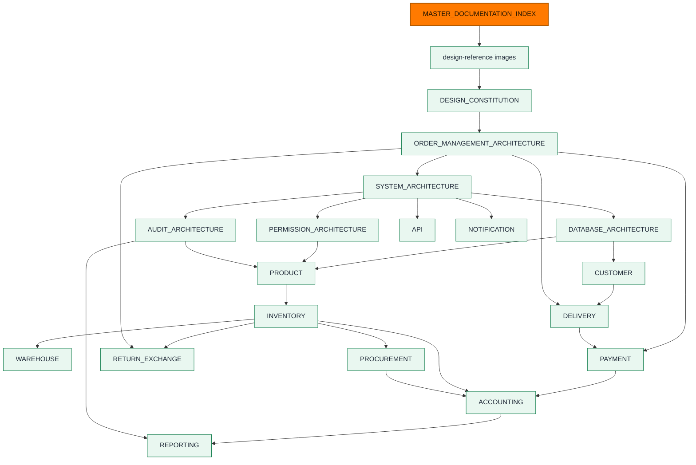

# Master Documentation Index

**Owner:** Trioloo Technology · **Status:** Canonical · **Rule prefix:** `DOC-`
**Version:** 1.61.13 · **Ratified:** 2026-08-04 · **Amended:** 2026-08-19 (**`LISTINGS_SCREEN_CONTRACT.md` v1.10.0 `LSC-058` — provider markup normalised for display only; nothing stored or compared changes**) · **Amended:** 2026-08-18 (**`LISTINGS_SCREEN_CONTRACT.md` v1.9.0 `LSC-057` — `FRAME 19` inbound half reconciled and `LSC-003` tags closed; frame still PARTIAL, outbound blocked**) · **Amended:** 2026-08-18 (**`LISTINGS_SCREEN_CONTRACT.md` v1.8.0 `LSC-056` — `FRAME 20` implemented against verified backend behaviour; four result figures unavailable, `FRAME 18`/`19` unchanged, `GAP-134` still open**) · **Amended:** 2026-08-18 (**`LISTINGS_SCREEN_CONTRACT.md` v1.7.0 `LSC-055` — `FRAME 10` explains an unauthored Listing; frontend only, no title or business rule changed**) · **Amended:** 2026-08-18 (**`GAP-134` — `discover()` recorded no per-listing operation against `PRD-186.a`; fixed in code, no migration. `GAP_ANALYSIS.md` v2.60.0, `LISTINGS_SCREEN_CONTRACT.md` v1.6.0 `LSC-054`; `FRAME 20` still blocked**) · **Amended:** 2026-08-18 (**`DARAZ_PROVIDER_CONTRACT.md` v1.6.1 — `DZC-031.h` bounded generic attributes, from the first live pull**) · **Amended:** 2026-08-18 (**`DARAZ_PROVIDER_CONTRACT.md` v1.6.0 — `DZC-031` reported stock is SKU `quantity`; inventory containers not mapped**) · **Amended:** 2026-08-18 (**first production Daraz listing adapter — `LISTINGS_SCREEN_CONTRACT.md` v1.5.0 `LSC-052`, `DARAZ_PROVIDER_CONTRACT.md` v1.5.0 §9 clarifications, `GAP_ANALYSIS.md` v2.59.0; read half only, nothing pulled**) · **Amended:** 2026-08-18 (**`DARAZ_PROVIDER_CONTRACT.md` v1.4.0 — §9 listing-read protocol `DZC-020`–`DZC-030`; `GAP_ANALYSIS.md` v2.58.0 points `GAP-133` at it**) · **Amended:** 2026-08-18 (**integration status corrected — [`LISTINGS_SCREEN_CONTRACT.md`](LISTINGS_SCREEN_CONTRACT.md) v1.4.1 `LSC-040` coverage range, [`GAP_ANALYSIS.md`](GAP_ANALYSIS.md) v2.57.0 `GAP-133` lead-in; row 13 was also stale at v2.55.0. Status rows only, no rule changed**) · **Amended:** 2026-08-18 (**[`LISTINGS_SCREEN_CONTRACT.md`](LISTINGS_SCREEN_CONTRACT.md) v1.4.0 — `FRAME 22` implemented, completing the local-only Listings frames; status row only, rule range unchanged**) · **Amended:** 2026-08-18 (**[`LISTINGS_SCREEN_CONTRACT.md`](LISTINGS_SCREEN_CONTRACT.md) v1.3.0 — `FRAME 21` implemented; status row only, rule range unchanged**) · **Amended:** 2026-08-18 (**[`LISTINGS_SCREEN_CONTRACT.md`](LISTINGS_SCREEN_CONTRACT.md) v1.2.0 — `FRAME 17` accepted as implemented and `LSC-050.b` pinned; status row only, rule range unchanged**) · **Amended:** 2026-08-18 (**`DOC-092` — [`LISTINGS_SCREEN_CONTRACT.md`](LISTINGS_SCREEN_CONTRACT.md) v1.0.0 registered, owning the `LSC-` prefix; the approved Listings Feature Pack tracked under [`design-reference/`](design-reference/README.md); **`GAP-133` connection half recorded closed — `GAP_ANALYSIS.md` v2.56.0**) · **Amended:** 2026-08-17 (`PRODUCTION_DEPLOYMENT_RUNBOOK.md` v1.5.0 — `DEP-124`, range now `DEP-001`–`DEP-124`) · **Amended:** 2026-08-17 (**`V14` verified against PostgreSQL 18.6** — `GAP_ANALYSIS.md` v2.55.0) · **Amended:** 2026-08-16 (**`V14` credential persistence** — `TECHNOLOGY_ARCHITECTURE.md` v1.4.0 `TEC-119`/`TEC-120`, `PRODUCTION_DEPLOYMENT_RUNBOOK.md` v1.4.0 `DEP-123`, `GAP_ANALYSIS.md` v2.54.0) · **Amended:** 2026-08-16 (`PRODUCTION_DEPLOYMENT_RUNBOOK.md` v1.3.0 — `DEP-122`, range now `DEP-001`–`DEP-122`) · **Amended:** 2026-08-16 (`PRODUCTION_DEPLOYMENT_RUNBOOK.md` v1.2.0 — `DEP-121`, range now `DEP-001`–`DEP-121`) · **Amended:** 2026-08-16 (stale `GAP-120` references reconciled — `PRODUCTION_DEPLOYMENT_RUNBOOK.md` v1.1.0, `TECHNOLOGY_ARCHITECTURE.md` v1.3.1) · **Amended:** 2026-08-16 (**`GAP-120` CLOSED — production first Owner created and verified**; `GAP_ANALYSIS.md` v2.53.0) · **Amended:** 2026-08-16 (**`AGV-042` initial Owner bootstrap**; `ACCESS_GOVERNANCE_ARCHITECTURE.md` v1.2.0) · **Amended:** 2026-08-16 (`DOC-091` `PRODUCTION_DEPLOYMENT_RUNBOOK.md` registered — first operations authority in the corpus; `TECHNOLOGY_ARCHITECTURE.md` v1.3.0, `TEC-115` amended) · **Amended:** 2026-08-15 (`DOC-090` Screen Contract v2.0.0 — re-audit simplification, 6 surfaces → 3) · **Amended:** 2026-08-15 (`DOC-090` Screen Contract v1.1.0 closure; `DOMAIN_MODEL.md` v3.33.0) · **Amended:** 2026-08-15 (`DOC-090` Shops & Channels Screen Contract registered — first Screen Contract in the corpus) · **Amended:** 2026-08-13 (`DOC-089` Connected Listings reconciliation; `E-106`-`E-108`) · **Amended:** 2026-08-13 (`DOC-088` Product commercial content and media; `E-105` Media Asset) · **Amended:** 2026-08-12 (Final global UI delta; Final global UI foundation; Inventory navigation terminology and Stock Control IA; `PRD-162` Channel Listing capability codes) · **Amended:** 2026-08-11 (`DOC-085` assembled finished-variant identity) · **Amended:** 2026-08-09 (**file reconstructed after data loss — see Appendix C 1.23.1**; **state-machine ratification — `BR-142`**; **pre-freeze GAP and cross-document reconciliation**; `DOC-061`) · **Amended:** 2026-08-08 (Sales reconciliation; immutability `BD-254`; serial policy `BD-242`; Warehouse & Assembly §17; Purchase & Supplier §18; Accounting §19; **documentation consistency pass**) · **Last verified against `/docs`:** 2026-08-12

---

> # READ THIS FIRST
>
> **This is the single entry point to the Trioloo ERP documentation.**
>
> Every developer, architect, engineer, and AI agent reads this document **before** reading any other document and **before** writing any code, schema, interface, or specification.
>
> This document is not business architecture, not UI specification, and not implementation guidance. It is the **navigation map and documentation constitution** — it tells you where every concept lives, which document owns it, what order to read in, and what you may and may not do.

---

## ⚠ Current State — Read Before Anything Else

**33 of 33 documents exist. Every registered document is written.**

*🔴 **CORRECTED 2026-08-10.** This read: “The only module remaining outside the register is **HR & Payroll** — in scope by `SYS-078`, deliberately deferred past V1 by `SYS-093`, and never registered as a planned document (`GAP-083`).”* **Every module is now registered and written.** **HR & Payroll is a V1 module** (`SYS-093` as amended, `DOC-072`), **written at [`HR_PAYROLL_ARCHITECTURE.md`](HR_PAYROLL_ARCHITECTURE.md) v1.1.0.** *Original retained under `DOC-009`.*

*`CHAT_ARCHITECTURE.md` was added to the register on 2026-08-08 (`DOC-060`). It had **never been registered** despite holding three entities, a ratified machine and twelve discovery answers — a governance defect corrected rather than propagated.*

*Dashboard re-verified against `/docs` on 2026-08-08. Six documents that existed were listed as `PLANNED` or were absent from the register entirely — corrected below. `ACCESS_GOVERNANCE_ARCHITECTURE.md` and `INVENTORY_COSTING_ARCHITECTURE.md` were registered by `DOC-055` and `DOC-057` but had never been added to this dashboard.*

> **DOC-001 — A document marked `PLANNED` in §3 does not exist. It has no content.**
>
> If your work requires a `PLANNED` document:
> 1. **Do not** infer, assume, or reconstruct what it would have said.
> 2. **Do not** proceed as though its rules exist.
> 3. **Do not** create the content inline in code, in another document, or in a commit message.
> 4. **Write that document first**, following §10, or escalate for a decision.
>
> This rule exists because the failure it prevents is severe and silent: an agent that invents the contents of a missing architecture document produces work that looks compliant, contradicts nothing visible, and diverges permanently from what the business actually decided.

### Status dashboard

| # | Document | Status | Rules |
|---|---|---|---|
| 1 | `MASTER_DOCUMENTATION_INDEX.md` | 🧊 **Under freeze governance** — current v1.61.8 | `DOC-001`–`DOC-092` (`DOC-059` withdrawn) |
| 2 | [`DESIGN_CONSTITUTION.md`](DESIGN_CONSTITUTION.md) | ✅ **Ratified** v2.15.0 | Article/rule numbering |
| 3 | [`design-reference/README.md`](design-reference/README.md) | ✅ **Ratified** | Binding images · **approved Feature Packs** (Shops & Channels → `SCS-`, Listings → `LSC-`) |
| 4 | [`ORDER_MANAGEMENT_ARCHITECTURE.md`](ORDER_MANAGEMENT_ARCHITECTURE.md) | ✅ **Ratified** v1.20.0 | `BR-001`–`BR-141` |
| 5 | [`SYSTEM_ARCHITECTURE.md`](SYSTEM_ARCHITECTURE.md) | ✅ **Ratified** v1.17.0 | `CP-1`–`CP-14` · `SYS-001`–`SYS-111` |
| 6 | [`DATABASE_ARCHITECTURE.md`](DATABASE_ARCHITECTURE.md) | ✅ **Ratified** v1.2.0 | `DB-001`–`DB-079` |
| 7 | [`PERMISSION_ARCHITECTURE.md`](PERMISSION_ARCHITECTURE.md) | ✅ **Ratified** v1.13.0 | `PRM-001`–`PRM-090` |
| 8 | [`AUDIT_ARCHITECTURE.md`](AUDIT_ARCHITECTURE.md) | ✅ **Ratified** v1.6.0 | `AUD-001`–`AUD-043` |
| 9 | [`PRODUCT_ARCHITECTURE.md`](PRODUCT_ARCHITECTURE.md) | ✅ **Ratified** v1.28.0 | `PRD-001`–`PRD-203` |
| 10 | [`DOMAIN_MODEL.md`](DOMAIN_MODEL.md) | ✅ **Ratified** v3.36.0 | `E-001`–`E-108` · `DM-001`–`DM-085` · `INV-` invariants |
| 11 | [`EVENT_ARCHITECTURE.md`](EVENT_ARCHITECTURE.md) | ✅ **Ratified** v1.17.0 | `EVT-001`–`EVT-087` · `EVA-` |
| 12 | [`STATE_MACHINE_ARCHITECTURE.md`](STATE_MACHINE_ARCHITECTURE.md) | ✅ **Ratified** v1.23.0 | **`SM-1`–`SM-20`** · `SMA-001`–`SMA-078` |
| 13 | [`GAP_ANALYSIS.md`](GAP_ANALYSIS.md) | ✅ **Current** v2.60.1 | `GAP-001`–`GAP-134` |
| 14 | [`BUSINESS_DISCOVERY.md`](BUSINESS_DISCOVERY.md) | 🔵 **Active** — six domains complete, **166 of 166** | `BD-001`–`BD-404` |
| 15 | [`NOTIFICATION_ARCHITECTURE.md`](NOTIFICATION_ARCHITECTURE.md) | ✅ **Ratified** v1.2.1 — 2026-08-08 (`DOC-053`) | `NOT-001`–`NOT-038` |
| 16 | [`RETURN_EXCHANGE_ARCHITECTURE.md`](RETURN_EXCHANGE_ARCHITECTURE.md) | ✅ **Ratified** v1.1.1 — 2026-08-08 (`DOC-054`) | `RET-001`–`RET-033` |
| 17 | [`ACCESS_GOVERNANCE_ARCHITECTURE.md`](ACCESS_GOVERNANCE_ARCHITECTURE.md) | ✅ **Ratified** v1.2.0 — 2026-08-16 (`DOC-055`) | `AGV-001`–`AGV-042` |
| 18 | [`ACCOUNTING_ARCHITECTURE.md`](ACCOUNTING_ARCHITECTURE.md) | ✅ **Ratified** v1.10.1 — 2026-08-08 (`DOC-056`) | `ACC-000`–`ACC-043` |
| 19 | [`INVENTORY_COSTING_ARCHITECTURE.md`](INVENTORY_COSTING_ARCHITECTURE.md) | ✅ **Ratified** v1.3.0 — 2026-08-08 (`DOC-057`) | `ICO-000`–`ICO-034` |
| 20 | [`INVENTORY_ARCHITECTURE.md`](INVENTORY_ARCHITECTURE.md) | ✅ **Ratified** v1.8.0 — 2026-08-08 (`DOC-058`) | `IVN-000`–`IVN-056` |
| 21 | [`CUSTOMER_ARCHITECTURE.md`](CUSTOMER_ARCHITECTURE.md) | ✅ **Ratified** v1.1.0 — 2026-08-08 | `CUS-000`–`CUS-074` |
| 22 | [`WAREHOUSE_ARCHITECTURE.md`](WAREHOUSE_ARCHITECTURE.md) | ✅ **Ratified** v1.6.0 — 2026-08-08 | `WHS-000`–`WHS-072` |
| 23 | [`PROCUREMENT_ARCHITECTURE.md`](PROCUREMENT_ARCHITECTURE.md) | ✅ **Ratified** v1.1.0 — 2026-08-08 | `PRC-000`–`PRC-062` |
| 24 | [`DELIVERY_ARCHITECTURE.md`](DELIVERY_ARCHITECTURE.md) | ✅ **Ratified** v1.8.0 — 2026-08-08 | `DLV-000`–`DLV-111` |
| 25 | [`PAYMENT_ARCHITECTURE.md`](PAYMENT_ARCHITECTURE.md) | ✅ **Ratified** v1.8.1 — 2026-08-08 | `PAY-000`–`PAY-063` |
| 26 | [`API_ARCHITECTURE.md`](API_ARCHITECTURE.md) | ✅ **Ratified** v1.7.0 — 2026-08-08 | `API-000`–`API-071` |
| 27 | [`REPORTING_ARCHITECTURE.md`](REPORTING_ARCHITECTURE.md) | ✅ **Ratified** v1.4.0 — 2026-08-08 | `RPT-000`–`RPT-054` |
| 28 | [`CHAT_ARCHITECTURE.md`](CHAT_ARCHITECTURE.md) | ✅ **Ratified** v1.2.0 — 2026-08-08 (`DOC-060`) | `CHT-000`–`CHT-066` |
| 29 | [`WARRANTY_REPAIR_ARCHITECTURE.md`](WARRANTY_REPAIR_ARCHITECTURE.md) | ✅ **Ratified** v1.1.0 — 2026-08-09 (`DOC-062`) | `WAR-000`–`WAR-077` |
| 30 | [`TRADE_IN_ARCHITECTURE.md`](TRADE_IN_ARCHITECTURE.md) | ✅ **Ratified** v1.2.2 — 2026-08-09 (`DOC-063`) | `TRD-000`–`TRD-075` |
| 31 | [`HR_PAYROLL_ARCHITECTURE.md`](HR_PAYROLL_ARCHITECTURE.md) | ✅ **Ratified** v1.3.0 — 2026-08-10 (`DOC-072`) | `HRP-000`–`HRP-097` |
| 32 | [`DOCUMENT_ARCHITECTURE.md`](DOCUMENT_ARCHITECTURE.md) | ✅ **Ratified** v1.0.1 — 2026-08-10 (`DOC-073`) | `PRN-000`–`PRN-030` |
| 33 | [`TECHNOLOGY_ARCHITECTURE.md`](TECHNOLOGY_ARCHITECTURE.md) | ✅ **Ratified** v1.4.0 — 2026-08-16 (`DOC-074`, `DOC-091`) | `TEC-000`–`TEC-120` |
| 34 | [`PROJECT_CONSTITUTION.md`](PROJECT_CONSTITUTION.md) | ✅ **Ratified** v1.0.0 — 2026-08-10 (`DOC-075`) | `PRJ-001`–`PRJ-280` |
| 35 | [`UI_UX_ARCHITECTURE.md`](UI_UX_ARCHITECTURE.md) | ✅ **Ratified** v1.20.0 — 2026-08-11 (`DOC-076`) | `UX-001`–`UX-273` |
| 36 | [`SHOPS_CHANNELS_SCREEN_CONTRACT.md`](SHOPS_CHANNELS_SCREEN_CONTRACT.md) | ✅ **Ratified** v3.2.0 — 2026-08-15 (`DOC-090`) | `SCS-001`–`SCS-092` |
| 37 | [`PRODUCTION_DEPLOYMENT_RUNBOOK.md`](PRODUCTION_DEPLOYMENT_RUNBOOK.md) | ✅ **Ratified** v1.5.0 — 2026-08-17 (`DOC-091`) | `DEP-001`–`DEP-124` |
| 38 | [`LISTINGS_SCREEN_CONTRACT.md`](LISTINGS_SCREEN_CONTRACT.md) | ✅ **Ratified** v1.10.0 — 2026-08-19 (`DOC-092`) | `LSC-001`–`LSC-058` |

> 🔴 **SUPERSEDED 2026-08-10 — retained under `DOC-009`.** **HR & Payroll now has full discovery (`BD-457` – `BD-497`) and a written V1 architecture** (`DOC-072`, `SYS-093` as amended). *The original text follows.*
>
> ~~**HR & PAYROLL is in scope** (`SYS-078`, `BD-002` – `BD-005`), has **no document and no discovery**, and is **deliberately deferred past Version 1** (`SYS-093`). **It is now registered as deferred** — see `DOC-061`.~~ *The previous note read that the registration "is itself outstanding"; that was true until 2026-08-08 and is now discharged, closing `GAP-083`'s registration defect.*

### Two documents referenced elsewhere that do not exist

| Referenced as | Reality | Where to go instead |
|---|---|---|
| `UI_ARCHITECTURE.md` | **Does not exist.** Never written | [`DESIGN_CONSTITUTION.md`](DESIGN_CONSTITUTION.md) + [`design-reference/`](design-reference/README.md) hold full UI authority |
| Claude Design project | **Does not exist.** The design-system project list is empty | [`design-reference/`](design-reference/README.md) — the three frozen screenshots are the visual source of truth |

> **DOC-002 — Cite only documents that exist.** A reference to `UI_ARCHITECTURE.md` in any brief, ticket, or prompt is a reference to nothing. Redirect it to the Design Constitution and the reference images. Recorded as `SYS U-8` and `SYS U-9`.

---

# 1. Documentation Purpose

## 1.1 Why this documentation exists

Trioloo Technology sells desktop computers and smart televisions across multiple Daraz stores, multiple websites, Facebook, WhatsApp, phone, and walk-in. Orders arrive from parties Trioloo does not control, are delivered by couriers Trioloo does not control, and are paid for by money that arrives late, indirectly, and reduced by deductions.

An operation with those properties cannot be run from tribal knowledge. Every one of them creates a way for the system to hold numbers that look authoritative and are wrong.

This documentation exists so that the **business architecture is decided once, written down, and enforced** — rather than being re-derived, inconsistently, by each person who touches the system.

## 1.2 Problems it solves

| Problem | Solved by |
|---|---|
| The same concept implemented differently in each module | Single canonical owner per concept (§4) |
| Business rules living only in code, undiscoverable | Numbered, citable rules in architecture documents |
| Decisions re-litigated every time someone new arrives | Ratified documents with amendment procedure (§7) |
| Architecture drifting silently from what was agreed | Precedence and conflict resolution (§5.3) |
| UI redesigned incrementally until it is incoherent | Frozen reference images (`DESIGN_CONSTITUTION.md` RULE 0.1) |
| Technology choices leaking into business rules | Technology neutrality (`SYS-076`) |
| Nobody knowing where a concept belongs | This document |

## 1.3 Why it is canonical

> **DOC-003 — The documentation is the specification. The code is an implementation of it.**
>
> Where code and documentation disagree, **the code is a defect** — unless the documentation has been formally amended (§7). Discovering that the code does something else is not evidence that the documentation is out of date; it is evidence that something shipped without an amendment.

## 1.4 Longevity intent

These documents are written to remain true for a decade. They achieve that by specifying **invariants** — what must always hold — and refusing to specify anything that varies: no technology, no schema, no interface contracts, no commercial parameters. Channels, couriers, marketplaces, and payment providers are all treated as configurable participants, never as architectural branches.

---

# 2. Reading Order

## 2.1 Required order

Read in this sequence. Each document assumes the vocabulary of the ones before it.

| # | Read | Why here |
|---|---|---|
| **1** | **`MASTER_DOCUMENTATION_INDEX.md`** (this) | Establishes what exists, who owns what, and the rules you are bound by |
| **2** | [`DESIGN_CONSTITUTION.md`](DESIGN_CONSTITUTION.md) | Visual system is frozen and binding. Read before forming any mental picture of the product |
| **3** | [`design-reference/README.md`](design-reference/README.md) + the three images | The images outrank the Constitution on layout, spacing, and existing screens |
| **4** | [`ORDER_MANAGEMENT_ARCHITECTURE.md`](ORDER_MANAGEMENT_ARCHITECTURE.md) | The commercial spine. Defines the core domain vocabulary every other document uses |
| **5** | [`SYSTEM_ARCHITECTURE.md`](SYSTEM_ARCHITECTURE.md) | Generalises the order module's patterns to the whole system; defines module boundaries |
| **6** | [`DATABASE_ARCHITECTURE.md`](DATABASE_ARCHITECTURE.md) | How data is identified, versioned, retained |
| **7** | [`PERMISSION_ARCHITECTURE.md`](PERMISSION_ARCHITECTURE.md) | Who may do what, at what magnitude |
| **8** | [`AUDIT_ARCHITECTURE.md`](AUDIT_ARCHITECTURE.md) | How everything is proven |
| **9+** | Domain modules (§3.3) as they are written | Each assumes 1–8 |

> **DOC-004 — Order Management is read before System Architecture, not after.** System Architecture repeatedly generalises from the order module (*"this generalises `BR-065`"*). Reading it first means encountering conclusions before the reasoning that produced them.

## 2.2 Reading order ≠ precedence order

These are different things and confusing them causes real errors.

| | Reading order (§2.1) | Precedence order (`SYS-001`) |
|---|---|---|
| Question | *What do I read first to understand?* | *Which document wins in a conflict?* |
| Sequence | Index → Design → Order → System → cross-cutting → modules | Design images → Design Constitution → Order Management → System → module document |

Reading order is about comprehension. Precedence is about conflict resolution. A document read later may still outrank one read earlier.

## 2.3 Role-based minimum

Nobody is exempt from §2.1, but these are the minimum before contributing in a given area.

| Role | Minimum |
|---|---|
| **Frontend developer** | 1, 2, 3, then the module document for the screen's domain |
| **Backend developer** | 1, 4, 5, 6, 7, 8, then the module document being implemented |
| **Database engineer** | 1, 4, 5, 6, then every module document whose data you touch |
| **Integration engineer** | 1, 4, 5, [`API_ARCHITECTURE.md`](API_ARCHITECTURE.md) ✅, then the relevant channel/courier module |
| **Business analyst** | 1, 4, 5, then the domain in question |
| **QA** | 1, 4, 5, plus the rule index of whatever is under test — rules are the test cases |
| **Auditor** | 1, 5, 7, 8 |
| **AI agent** | **All of §2.1, in full**, before generating anything (§8) |

---

# 3. Document Dependency Graph

## 3.1 Dependency direction

## 3.2 Existing documents

### `DESIGN_CONSTITUTION.md` ✅

| | |
|---|---|
| **Purpose** | The permanent visual and interaction authority: colour, typography, spacing, layout, components, accessibility, UX principles |
| **Depends on** | `design-reference/` images (which outrank it on frozen surfaces) |
| **Used by** | Every user-facing surface, every module document that describes a user-facing consequence |
| **Owns** | Colour system · typography · spacing · sidebar · header · navigation · cards · tables · forms · buttons · icons · elevation · motion · responsive · accessibility · UX principles |
| **Does NOT own** | Business rules · workflow · data · permissions logic · what a screen *does* (only how it looks and behaves visually) |

### `design-reference/README.md` + images ✅

| | |
|---|---|
| **Purpose** | The binding visual record of the shipped UI. Sidebar, orders list, and new-sale modal are **frozen** |
| **Depends on** | Nothing — highest visual authority |
| **Used by** | Design Constitution (which defers to it), every frontend task |
| **Owns** | Existing layout · spacing · sidebar behaviour · header structure · established visual patterns |
| **Does NOT own** | Screens not yet captured · any business rule |

### `ORDER_MANAGEMENT_ARCHITECTURE.md` ✅

| | |
|---|---|
| **Purpose** | The commercial spine: how a customer's intent becomes a delivered, paid, closed order |
| **Depends on** | `DESIGN_CONSTITUTION.md` for user-facing consequences |
| **Used by** | Every module document; System Architecture generalises from it |
| **Owns** | Order lifecycle · verification · release · fulfillment orchestration · sales channels · order-level economics · the seven independent state machines · `BR-001`–`BR-070` |
| **Does NOT own** | Stock quantities · product definitions · customer master · ledger postings · courier networks · physical warehouse operations |

### `SYSTEM_ARCHITECTURE.md` ✅

| | |
|---|---|
| **Purpose** | Keystone. Module map, ownership register, coupling model, scope hierarchy, cross-cutting rules |
| **Depends on** | `ORDER_MANAGEMENT_ARCHITECTURE.md` (generalises its patterns) |
| **Used by** | Every other architecture document |
| **Owns** | Module boundaries · data-ownership register · canonical vocabulary registry · event backbone · company/business-unit/warehouse scope · exception concept · configuration versioning · rule-prefix convention |
| **Does NOT own** | Any single domain's business rules · technology · schema · interface contracts |

### `DATABASE_ARCHITECTURE.md` ✅

| | |
|---|---|
| **Purpose** | How data is identified, timed, versioned, corrected, retained — technology-neutral |
| **Depends on** | `SYSTEM_ARCHITECTURE.md` |
| **Used by** | Every module; all engineering data design |
| **Owns** | Movements-vs-balances · identity model · temporality · immutability and correction · scope carriage · money/quantity representation · concurrency · retention · reconciliation obligations |
| **Does NOT own** | **Schema, tables, columns, keys, indexes, SQL, database engine** — explicitly excluded |

### `PERMISSION_ARCHITECTURE.md` ✅

| | |
|---|---|
| **Purpose** | Who may do what, at what magnitude, within what scope, under whose approval |
| **Depends on** | `SYSTEM_ARCHITECTURE.md`, `ORDER_MANAGEMENT_ARCHITECTURE.md` §17 (actors) |
| **Used by** | Every module (each enforces its own actions) |
| **Owns** | Users · roles · permissions · authority magnitude · scope grants · segregation of duties · delegation · override and escalation · access review |
| **Does NOT own** | Authentication mechanisms · credential storage · encryption · session transport · what any business action *means* |

### `AUDIT_ARCHITECTURE.md` ✅

| | |
|---|---|
| **Purpose** | Making the system provable: attribution, tamper evidence, reconstruction, evidence production |
| **Depends on** | `ORDER_MANAGEMENT_ARCHITECTURE.md` §15–16 (generalises them), `PERMISSION_ARCHITECTURE.md`, `DATABASE_ARCHITECTURE.md` |
| **Used by** | Every module (each produces its own audit records) |
| **Owns** | Audit vs activity distinction system-wide · record content · tamper evidence · retention · evidence packages · state reconstruction · control monitoring |
| **Does NOT own** | Business logic of any domain · technical monitoring · storage technology · cryptographic mechanisms |

## 3.3 Planned documents

Not yet written (`DOC-001`). Slots, ownership, and dependencies are reserved so that writing them is additive.

| Document | Purpose | Depends on | Owns | Does NOT own |
|---|---|---|---|---|
| ~~`PRODUCT_ARCHITECTURE.md`~~ ✅ | **WRITTEN — v1.7.0. Stale entry corrected 2026-08-08.** It has existed since ratification and now carries §28 – §32 reconciliation. **Warranty terms are superseded by `E-070` Warranty Package**, versioned reference data | — | — | — |
| ~~`CUSTOMER_ARCHITECTURE.md`~~ ✅ | **WRITTEN 2026-08-08 — v1.0.0.** Customer identity, contacts, addresses, credit standing, history | System, Database, Order, **Chat** | Customer identity · contacts · addresses · **credit position and the Credit Limit release gate** · **blacklist and its release gate** · customer history as decision support · **marketplace Customer creation** · erasure and redaction | Marketplace-owned buyer identity (mirror only, `SYS-010`) · order content · **Channel Identity, conversations and internal notes (Chat, `DOC-060`)** · **receivables and postings (Payment, Accounting)** · **pricing (Product, `GAP-015`)** · **installment mechanics (Payment, `GAP-072`)** |
| ~~`CHAT_ARCHITECTURE.md`~~ ✅ | **WRITTEN 2026-08-08 — v1.0.0.** Customer communication across every channel that carries it | System, Order, Return & Exchange | **`E-074` Conversation · `E-075` Channel Identity · `E-076` Internal Note** · conversation state as applied · the shared inbox and soft assignment · the reply lock · conversation-to-record linking and its confirm discipline · the two ageing overlays · attachment capability per channel · conversation continuity and reopening | **The Customer Profile (Customer)** · **the Business Case (Return & Exchange documentation, System data)** · adapter capability and sync (API) · system-initiated notification and the Action Queue (Notification) · order lifecycle and verification phone contact (Order Management) · authorisation (Permission, Access Governance) · audit structure and disposal authority (Audit, `SYS-101`) |
| ~~`INVENTORY_ARCHITECTURE.md`~~ ✅ | **WRITTEN 2026-08-08 — v1.0.0.** Stock quantities, locations, serials, movements | System, Database, Product | Stock quantity · commitment stages · serial records and unit history · movement ledger · loss attribution · **the customer-property custody boundary**. **~~Valuation~~ — carved out to `INVENTORY_COSTING_ARCHITECTURE.md` (`DOC-057`)** | Physical locations and operations (Warehouse) · order lifecycle · ledger postings |
| ~~`WAREHOUSE_ARCHITECTURE.md`~~ ✅ | **WRITTEN 2026-08-08 — v1.0.0.** Physical locations, picking, packing, QC, goods receipt | System, Inventory, Order | Location topology · pick/pack operations · serial capture execution · QC execution · goods receipt · counts · **build execution** · **the custody boundary for goods not owned** | Stock figures (Inventory) · valuation (Costing) · postings (Accounting) · lifecycle definitions (State Machine) · commercial terms · courier selection |
| ~~`PROCUREMENT_ARCHITECTURE.md`~~ ✅ | **WRITTEN 2026-08-08 — v1.0.0.** Suppliers, purchase orders, receipts | System, Inventory, Accounting | Supplier master · purchase orders · **goods receipt as the spine** (`BR-105`) · **acceptance as the pivot** · discrepancy vocabulary · **supplier payable creation** · payment stream · **Supplier Return / Exchange / Credit** | Stock quantity (Inventory) · **physical receiving execution (Warehouse, `PRC-036`)** · **cost derivation (Costing)** · ledger postings (Accounting) · ~~landed cost build-up~~ — **WITHDRAWN, `PRD-121`: there is no landed cost allocation** |
| ~~`DELIVERY_ARCHITECTURE.md`~~ ✅ | **WRITTEN 2026-08-08 — v1.0.0.** Couriers, shipments, tracking, delivery outcome, COD handling | System, Order, Customer | Courier master and rates · **the courier commercial model — every confirmed charge type, estimated versus actual** · shipment lifecycle as applied · tracking ingestion and provenance · delivery outcome · **failed-delivery recovery and RTO** · COD collection across three paths · **own-staff custody** · self-pickup handover · courier claims · **Customer Delivery Charge and Delivery Profit/Loss as an analytical metric** | Order lifecycle · receivable reconciliation (Payment) · **postings (Accounting)** · **stock (Inventory)** · **physical handling (Warehouse)** · **any report (Reporting)** |
| ~~`RETURN_EXCHANGE_ARCHITECTURE.md`~~ ✅ | **WRITTEN 2026-08-08 — v1.0.0.** RTO and customer returns, QC disposition, exchanges | System, Order, Inventory, Payment | Return and exchange lifecycle (**`SM-8`, `SM-9` states confirmed**) · RTO/customer distinction · QC disposition · fault attribution · exchange sequencing · **`E-073` Business Case** | Refund execution (Payment) · stock movement execution (Inventory) |
| ~~`PAYMENT_ARCHITECTURE.md`~~ ✅ | **WRITTEN 2026-08-08 — v1.0.0.** Receivables, receipts, remittance and settlement reconciliation, refunds | System, Order, Delivery | Receivable lifecycle · collection modes · COD remittance reconciliation · marketplace settlement reconciliation · variance and dispute · **refund execution** · **write-off and supplier payment execution** · duplicate-capture prevention | Ledger postings (Accounting, `ACC-000`) · **refund entitlement (Return & Exchange)** · **the payable itself (Procurement, `PRC-002`)** · delivery outcome (Delivery) |
| ~~`ACCOUNTING_ARCHITECTURE.md`~~ ✅ | **WRITTEN 2026-08-08 — v1.0.0.** Ledger, recognition, COGS, realised margin, financial reporting | System, Payment, Inventory, Procurement | Posting model · recognition policy · **`E-068` Financial Accounts** · derived balances · advances · **Fund Transfer (`DOC-056`)** · COGS · **realised margin** · period close · financial statements. ~~Chart of accounts~~ — **no hierarchy required** (`ACC-008`, `DM-057`) | Operational reconciliation (Payment) · stock valuation method (Inventory) |
| ~~`API_ARCHITECTURE.md`~~ ✅ | **WRITTEN 2026-08-08 — v1.0.0.** Integration architecture, adapter contracts, idempotency, sync state | System | Adapter responsibilities · **capability declaration across seven dimensions** · idempotency and duplicate absorption · **provenance** · sync lifecycle application · **authentication and authorisation responsibilities at every entry point** · manual equivalence | Business rules of any domain · UI · **endpoints, payloads, protocols, schemas and transport — engineering deliverables (`API-001`, `SYS §17`)** · **the event register (`EVENT_ARCHITECTURE.md`)** · the external party register (`SYS §12.3`) |
| ~~`NOTIFICATION_ARCHITECTURE.md`~~ ✅ | **WRITTEN 2026-08-08 — v1.0.0.** Customer and staff communication across channels | System, Order, Customer | **`E-079` Action Queue Item** · notification categories and triggers · templates · channel selection · **`E-080` delivery records** · preferences · suppression | What happened (**Business Event, source modules**) · customer identity · **outstanding work state — the Action Queue is authoritative, the notification is not** (`DM-072`) |
| ~~`REPORTING_ARCHITECTURE.md`~~ ✅ | **WRITTEN 2026-08-08 — v1.0.0.** Operational and financial reporting | System, Accounting, Audit, all modules | **The eleven-report V1 register** · shared period vocabulary · dashboard reporting requirement · snapshot-versus-live behaviour · **basis disclosure** · export and filtering obligations · report permission and scope · **the categories for which no report is registered** | **Any business figure** — every figure is owned by its source module (`DB-067`) · **any calculation not already ratified** · presentation (`DESIGN_CONSTITUTION.md`) · evidence packages (`AUD-021`) |

---

## 3.4 Writing readiness — assessed 2026-08-08

**All nine reconciliation domains are complete. `DOC-015` still bars development on any module whose document does not exist**, so this records **how much of each remaining document is already decided**, and therefore what writing it actually costs.

| Document | Discovery status | Writing cost |
|---|---|---|
| ~~`NOTIFICATION_ARCHITECTURE.md`~~ | ✅ **WRITTEN — v1.0.0, 2026-08-08** | **Complete.** 38 rules, `GAP-101` closed |
| ~~`RETURN_EXCHANGE_ARCHITECTURE.md`~~ | ✅ **WRITTEN — v1.0.0, 2026-08-08** | **Complete.** 33 rules; eight gaps carried |
| ~~`WAREHOUSE_ARCHITECTURE.md`~~ | ✅ **WRITTEN — v1.0.0, 2026-08-08** | **Complete.** 73 rules; fifteen open items carried, none closed |
| ~~`PROCUREMENT_ARCHITECTURE.md`~~ | ✅ **WRITTEN — v1.0.0, 2026-08-08** | **Complete.** 63 rules; ten open items carried, none closed |
| ~~`INVENTORY_ARCHITECTURE.md`~~ | ✅ **WRITTEN — v1.0.0, 2026-08-08** | **Complete.** 40 rules; `GAP-103` teardown and `GAP-104` used-SKU separation **carried, not closed** |
| ~~`ACCOUNTING_ARCHITECTURE.md`~~ | ✅ **WRITTEN — v1.0.0, 2026-08-08** | **Complete.** 43 rules; ten gaps carried |
| ~~`PAYMENT_ARCHITECTURE.md`~~ | ✅ **WRITTEN — v1.0.0, 2026-08-08** | **Complete.** 64 rules; fifteen open items carried, none closed — including `GAP-081`/`GAP-084` classification |
| ~~`REPORTING_ARCHITECTURE.md`~~ | ✅ **WRITTEN — v1.0.0, 2026-08-08** | **Complete.** 55 rules; twelve open items carried, none closed. **The `BR-141` disclosure ambiguity is carried as `RPT-045` plus an explicit statement that its scope is not enumerated anywhere** |
| ~~`API_ARCHITECTURE.md`~~ | ✅ **WRITTEN — v1.0.0, 2026-08-08** | **Complete.** 57 rules; nine open items carried, none closed — including `GAP-085` completeness reconciliation |
| ~~`DELIVERY_ARCHITECTURE.md`~~ | ✅ **WRITTEN — v1.0.0, 2026-08-08.** The *"some discovery may remain"* assessment was correct and was closed by **§28** (11 answers) and **§29** (5 answers) | **Complete.** 112 rules; eleven gaps and nine queued follow-ups carried, none closed |
| ~~`CUSTOMER_ARCHITECTURE.md`~~ | ✅ **WRITTEN — v1.0.0, 2026-08-08.** The *"some discovery may remain"* assessment was correct and was closed by **§30** (`BD-173`, `BD-169`, `BD-424`) | **Complete.** 75 rules; eleven gaps, eight follow-ups and six reconciliation points carried, none closed |
| ~~`CHAT_ARCHITECTURE.md`~~ | ✅ **WRITTEN — v1.0.0, 2026-08-08 (`DOC-060`).** Never previously on the register despite holding three entities, `SM-16` and fourteen answers | **Complete.** 67 rules; seven gaps and three reconciliation points carried |
| [`HR_PAYROLL_ARCHITECTURE.md`](HR_PAYROLL_ARCHITECTURE.md) | ✅ **Discovered and written** — `BD-457` – `BD-497`, v1.1.0, `HRP-000` – `HRP-088` (`DOC-072`) | **None** |

> **DOC-063 — `TRADE_IN_ARCHITECTURE.md` is written and canonical** (v1.0.0, 2026-08-09), and **owns `E-081` Trade-In Case and `E-082` Trade-In Component**. **This was the last owning module named in `DOMAIN_MODEL.md` with no register entry, no prefix and no document.**
>
> | | Owns |
> |---|---|
> | **`TRADE_IN_ARCHITECTURE.md`** — `TRD-` | **The case and the components** · the two intake shapes · provisional and final valuation and their retention · renegotiation · the agreement and the moment ownership transfers · **the custody overlay for customer property held before agreement** · component classification · the decline, return and **unclaimed-property** paths |
> | `INVENTORY_COSTING_ARCHITECTURE.md` — `ICO-` | **Allocation of the agreed value across components** (`ICO-011` – `ICO-017`). **Retained unchanged** |
> | `INVENTORY_ARCHITECTURE.md` — `IVN-` | **When components become stock** (`IVN-030` – `IVN-032`). **Retained unchanged** |
> | `ACCOUNTING_ARCHITECTURE.md` — `ACC-` | **`E-083` Trade-In Credit** — the liability, its balance and every posting (`ACC-039`, `ACC-040`). **Retained unchanged** |
> | `WAREHOUSE_ARCHITECTURE.md` — `WHS-` | **Physical holding** of the customer's property (`WHS-069`). **Retained unchanged** |
>
> **The module is deliberately narrow.** Every financial and physical consequence of a trade-in already had an owner; **`TRD-001` records that Trade-In is not a second system of record for money or stock** — it holds no balance, computes no allocation and posts nothing. `SM-18` and `SM-19` were ratified before this document and are **referenced, never re-ratified** (`TRD-075`).
>
> ⚠ **Historical record, preserved under `DOC-030`.** From `DOMAIN_MODEL.md` v3.7.0 (2026-08-08) until 2026-08-09, `E-081` and `E-082` recorded their owner as *"Trade-In ⬜"*. **With this registration the defect class first found at Chat, and tracked through `GAP-083` and `DOC-062`, has no surviving instance.**

> **DOC-062 — `WARRANTY_REPAIR_ARCHITECTURE.md` is written and canonical** (v1.0.0, 2026-08-09), and **owns `E-071` Warranty Request and `E-072` Repair**, which until this date named an owning module that appeared in no register, held no prefix and had no document.
>
> | | Owns |
> |---|---|
> | **`WARRANTY_REPAIR_ARCHITECTURE.md`** — `WAR-` | **The warranty request and the repair job** · intake and intake channel · eligibility determination · the resolution decision and its reason · repair performer and parts · **the custody state of held customer property** (`WHS-069`, `DOC-058`) · upstream recovery routing and result · cost attribution, expected and actual |
> | `PRODUCT_ARCHITECTURE.md` — `PRD-` | **`E-070` Warranty Package** — what the warranty *promises*: duration, coverage, exclusions, responsible party, card issuance (`PRD-132`). **Retained unchanged** |
>
> **The split is between the promise and the case.** Product owns what warranty terms say; **Warranty & Repair owns what happened to one unit and who paid.** `SM-13` and `SM-15` were ratified before this document and are **referenced, never re-ratified** (`WAR-077`).
>
> ⚠ **Historical record, preserved under `DOC-030`.** From the ratification of `DOMAIN_MODEL.md` v3.1.0 (2026-08-06) until 2026-08-09, `E-071` and `E-072` recorded their owner as *"Warranty ⬜"* — a module the governance layer did not know existed. **The pre-freeze audit identified this as the last surviving instance of the defect class that `GAP-083` and `DOC-060` each discharged.** Two ratified documents had meanwhile mis-cited `PRODUCT_ARCHITECTURE.md` §32 as the owner (`CUS-059`, `RET-027`); **§32 is a reconciliation of warranty *policy* and contains no lifecycle content.** Both citations were corrected on the same date.

> **DOC-061 — `HR_PAYROLL_ARCHITECTURE.md` is registered as DEFERRED POST-V1, closing `GAP-083`'s registration defect without implying it is a V1 obligation.**
>
> **The business decision is already ratified and is not revisited here:** HR & Payroll is **in scope** (`SYS-078`, `BD-005`) and **deliberately deferred past Version 1** (`SYS-093`). `GAP-083` recorded that it *"is not registered as a planned document… a deferred module still belongs on the index, or the index understates eventual scope."* **This registration is that correction.**
>
> | | |
> |---|---|
> | **Status** | ⏸ **DEFERRED POST-V1** — not a V1 blocker |
> | **Rule prefix** | **Not allocated.** No rule exists to carry one, and allocating a prefix for an undiscovered module would reserve identifiers against content nobody has decided |
> | **Discovery** | **None.** `BD-005` establishes scope only |
> | **Owns** | Payroll processing · attendance · leave · appraisal · benefits (`AGV-010`) |
> | **Does NOT own** | **The Operational User Profile** — `AGV-010` records that HR **extends** it and never owns it, *"regardless of whether HR & Payroll is implemented"* |
>
> ⚠ **The ownership runs opposite to the conventional arrangement, deliberately.** `AGV-010` records why: had HR owned the employment record, `SYS-093`'s deferral would have **removed the foundation eleven modules stand on**, and `PRM-009` would have had nothing to bound roles with. **V1 works precisely because HR does not own it.**
>
> **Two touchpoints already exist and are unaffected** (`SYS-093`): the **Salary** expense category (`BD-309`) and `E-006` Employee — superseded by `E-077` (`DM-068`). **Deferring HR blocks neither Accounting nor Reporting.**

> **DOC-060 — `CHAT_ARCHITECTURE.md` is written and canonical** (v1.0.0, 2026-08-08), and is **registered here for the first time.**
>
> ⚠ **This corrects a governance defect, it does not create a module.** Chat already held **three entities** (`E-074`, `E-075`, `E-076`), a **ratified state machine** (`SM-16`), **three domain-model rules** (`DM-065` – `DM-067`), **two system rules** (`SYS-096`, `SYS-097`) and **fourteen confirmed discovery answers** (§23, `BD-355` – `BD-368`) — while having **no document, no dashboard row, no ownership entry, no rule prefix and no `GAP-` recording its absence.** It was the only domain in the set that was discovered, entitised and machine-specified while being invisible to this register.
>
> **The defect was found because `CUSTOMER_ARCHITECTURE.md` depends on `E-075` Channel Identity**, and writing Customer first would have placed a pointer to an unregistered module inside a ratified document.
>
> | | `CHAT_ARCHITECTURE.md` — `CHT-` | `CUSTOMER_ARCHITECTURE.md` — `CUS-` |
> |---|---|---|
> | **Owns** | **The communication record** — Conversation, **Channel Identity**, Internal Note, assignment, linking, conversation state and overlays | **The Customer Profile** — identity, contacts, addresses, credit position, blacklist, customer history |
> | **Answers** | *"What was communicated, on which channel, by whom, and in what state does it stand?"* | *"Who is this customer, and what does the business know about them?"* |
>
> **`DOC-005` is satisfied because these are different questions** — the same distinction §4.1 draws between data and documentation ownership, and the sixth time it has resolved an apparent overlap.
>
> ⚠ **One reconciliation point is carried unchanged, not resolved by this registration.** `INV-23.1` states the marketplace Customer record is *"a mirror, never locally edited"*, while `BD-173` establishes a Customer Profile that accumulates Trioloo's own history. **A reading exists under which Channel Identity is the mirror and the Customer Profile is Trioloo's record — no canonical source states it, and `CHT-016` explicitly declines to assert it.**
>
> **Dependency position: Chat is written before Customer.** Customer depends on `E-075`; Chat depends on no unwritten document.

> **DOC-057 — `INVENTORY_COSTING_ARCHITECTURE.md` is written and canonical** (v1.0.0, 2026-08-08), and **carves inventory *valuation* out of `INVENTORY_ARCHITECTURE.md` ✅.**
>
> | | Owns |
> |---|---|
> | **`INVENTORY_COSTING_ARCHITECTURE.md`** — `ICO-` | **Cost derivation · valuation method · acquisition cost by source · allocation boundaries · cost immutability · cost history** |
> | `INVENTORY_ARCHITECTURE.md` ✅ | **Stock quantity · commitment stages · serial records and unit history · the movement ledger · loss attribution** — ~~valuation~~ |
>
> **The split answers two different questions:** *what did it cost* versus *how much is there and where*. `PRD-121` – `PRD-124` **remain ratified in `PRODUCT_ARCHITECTURE.md`** and are referenced, never moved; `ACCOUNTING_ARCHITECTURE.md` retains **posting** ownership — costing supplies the figure, accounting decides what it posts (`ICO-033`).

> **DOC-056 — `ACCOUNTING_ARCHITECTURE.md` is written and canonical** (v1.0.0, 2026-08-08). Two ownership questions are resolved.
>
> **1 · Accounting versus Payment.** The line is drawn by a ratified rule — **`BR-121`: *documents evidence obligations; business events create them*.**
>
> | | `ACCOUNTING_ARCHITECTURE.md` — `ACC-` | `PAYMENT_ARCHITECTURE.md` ✅ |
> |---|---|---|
> | **Owns** | The **posting model** · recognition policy · Financial Accounts · ledger and derived balances · advances · **Fund Transfer** · period close · financial statements | **Operational reconciliation** — receivable lifecycle, collection modes, COD and settlement matching, **variance and dispute**, refund execution |
> | **Answers** | *"What does this event post, and to which account?"* | *"Did the money arrive, does it match, and what do we do when it does not?"* |
>
> **`PAYMENT_ARCHITECTURE.md`'s registered ownership is unchanged.** `ACCOUNTING_ARCHITECTURE.md` states the **accounting consequence** of each payment event and **does not pre-empt** the operational reconciliation model.
>
> **2 · Fund Transfer ownership is assigned to Accounting** — it was **not previously registered to any document**. `E-084`, `E-085`, `SM-20`, Transfer Type classification and transfer-fee independence are owned there.

> **DOC-055 — `ACCESS_GOVERNANCE_ARCHITECTURE.md` is written and canonical** (v1.0.0, 2026-08-08), and **divides the access domain with `PERMISSION_ARCHITECTURE.md` along one line: *what authority is* versus *who holds it and how it is governed over time*.**
>
> | | `PERMISSION_ARCHITECTURE.md` — `PRM-` | `ACCESS_GOVERNANCE_ARCHITECTURE.md` — `AGV-` |
> |---|---|---|
> | **Owns** | The **authorisation decision model** — permission structure, authority magnitude, segregation of duties, enforcement obligations, standard role definitions | **Operational identity · attribution · effective-authority composition · override governance · scope governance · access review · self-administration · the governance surfaces** |
> | **Answers** | *"May this action, on this subject, at this magnitude, be permitted?"* | *"Who is this actor, what do they hold, why, and is it still appropriate?"* |
>
> **`PERMISSION_ARCHITECTURE.md` is not demoted.** `PRM-001` – `PRM-068` remain the ratified rule set, referenced and never duplicated. **`DOC-005` is satisfied because these are different questions** — the same distinction §4.1 draws between data and documentation ownership.
>
> ⚠ **This boundary is an architectural documentation decision, not a business rule, and should be ratified explicitly.** It was necessary because `GAP-099` recorded that the four access-governance surfaces had **no owning document**, while the permission model already had one.

> **DOC-054 — `RETURN_EXCHANGE_ARCHITECTURE.md` is written and canonical** (v1.0.0, 2026-08-08). It owns the Return and Exchange lifecycles, return authorization and eligibility, QC disposition, advance-exchange overdue handling, and the **documentation** of `E-073` Business Case. **It does not own refund execution** (Payment), **stock movement execution** (Inventory), **QC operational execution** (Warehouse), or **repair execution** ([`WARRANTY_REPAIR_ARCHITECTURE.md`](WARRANTY_REPAIR_ARCHITECTURE.md), `DOC-062` — *corrected 2026-08-09; this read `PRODUCT_ARCHITECTURE.md` §32 while no owning module was registered*).
>
> **`E-073` demonstrates the two-kinds-of-ownership distinction in §4.1 working as intended:** its **data ownership** is System, because it spans warranty, repair, trade-in and chat; its **documentation ownership** is Return & Exchange, because that is where it emerged and where its closure rule was established. **`DOC-005` is satisfied — these are different questions.**

> **DOC-053 — `NOTIFICATION_ARCHITECTURE.md` is written and canonical** (v1.0.0, 2026-08-08). It owns notification categories, the Action Queue, delivery evidence, recipient resolution, mandatory/optional policy and notification configuration. **It does not own the Business Event** — that remains with each source module (`SYS-015`) — **nor outstanding work state, which the Action Queue holds authoritatively** (`DM-072`, `NOT-001`).

> **DOC-051 — Nine of the eleven remaining documents require no further business discovery.** Their content is decided and currently resides in `DOMAIN_MODEL.md`, `SYSTEM_ARCHITECTURE.md`, `STATE_MACHINE_ARCHITECTURE.md`, `ORDER_MANAGEMENT_ARCHITECTURE.md` and `PRODUCT_ARCHITECTURE.md`. **What is missing is the owning document, not the decision** — which is why `GAP-001` is a documentation gap rather than an indecision gap.

> **DOC-052 — Architecture Freeze is blocked by `DOC-015`, not by unreconciled architecture.** All nine domains listed for reconciliation are complete, all contradictions are resolved or explicitly recorded, and no business decision remains outstanding except **HR & Payroll**, which is deferred by `SYS-093`.

# 4. Canonical Ownership

> **DOC-005 — Every topic has exactly one owner document. There are no shared owners and no secondary authorities.**

## 4.1 Two kinds of ownership — do not confuse them

| | Data ownership | Documentation ownership |
|---|---|---|
| Question | Which **module** may write this data? | Which **document** defines this concept? |
| Defined in | `SYSTEM_ARCHITECTURE.md` §5.4 | This section |
| Example | Inventory owns stock quantities | `INVENTORY_ARCHITECTURE.md` defines what a stock commitment stage means |

This section does not restate `SYS §5.4` (`SYS-016`). Consult that for runtime data authority; consult this for where to read and where to write.

## 4.2 Ownership register

| Topic | Canonical owner | Status |
|---|---|---|
| Colour, typography, spacing, components, icons, motion | `DESIGN_CONSTITUTION.md` | ✅ |
| Existing screen layout and frozen visual patterns | `design-reference/` | ✅ |
| Accessibility and UX principles | `DESIGN_CONSTITUTION.md` | ✅ |
| Order lifecycle, verification, release, fulfillment orchestration | `ORDER_MANAGEMENT_ARCHITECTURE.md` | ✅ |
| Sales channels and channel classification | `ORDER_MANAGEMENT_ARCHITECTURE.md` | ✅ |
| Module boundaries, coupling, event backbone | `SYSTEM_ARCHITECTURE.md` | ✅ |
| Company / business unit / warehouse scope | `SYSTEM_ARCHITECTURE.md` | ✅ |
| Canonical vocabulary registry | `SYSTEM_ARCHITECTURE.md` §5.3 | ✅ |
| Data identity, temporality, retention, correction | `DATABASE_ARCHITECTURE.md` | ✅ |
| Money and quantity representation | `DATABASE_ARCHITECTURE.md` | ✅ |
| Users, roles, authority, scope, segregation | `PERMISSION_ARCHITECTURE.md` | ✅ |
| Operational identity, attribution, override and scope governance, access review | `ACCESS_GOVERNANCE_ARCHITECTURE.md` | ✅ |
| Audit, activity history, evidence, reconstruction | `AUDIT_ARCHITECTURE.md` | ✅ |
| Product definitions, pricing, warranty terms | `PRODUCT_ARCHITECTURE.md` | ✅ |
| Customer identity, credit position, blacklist, history | `CUSTOMER_ARCHITECTURE.md` | ✅ |
| Stock, serials, movements, custody boundary | `INVENTORY_ARCHITECTURE.md` | ✅ |
| Cost derivation, valuation method, cost immutability | `INVENTORY_COSTING_ARCHITECTURE.md` | ✅ |
| Physical warehouse operations, execution and custody | `WAREHOUSE_ARCHITECTURE.md` | ✅ |
| Suppliers, purchase orders, goods receipt, supplier payable | `PROCUREMENT_ARCHITECTURE.md` | ✅ |
| Couriers, shipments, tracking, delivery outcome, courier commercial model | `DELIVERY_ARCHITECTURE.md` | ✅ |
| Returns, RTO, QC disposition, exchanges | `RETURN_EXCHANGE_ARCHITECTURE.md` | ✅ |
| Receivables, settlement reconciliation, refund execution | `PAYMENT_ARCHITECTURE.md` | ✅ |
| Ledger, recognition, COGS, realised margin | `ACCOUNTING_ARCHITECTURE.md` | ✅ |
| Integration architecture, adapters, capability declaration, idempotency | `API_ARCHITECTURE.md` | ✅ |
| Notification triggers, templates, delivery | `NOTIFICATION_ARCHITECTURE.md` | ✅ |
| Report catalogue, period vocabulary, reporting behaviour | `REPORTING_ARCHITECTURE.md` | ✅ |
| Conversations, Channel Identity, internal notes, customer communication | `CHAT_ARCHITECTURE.md` | ✅ |

## 4.3 Boundaries that are frequently confused

| Question | Answer | Not |
|---|---|---|
| Where is stock **quantity** defined? | Inventory | Warehouse |
| Where are physical **locations** defined? | Warehouse | Inventory |
| Where is **cost** defined? | Procurement (acquisition), Inventory (valuation) | Accounting |
| Where is **margin** defined? | Accounting | Order or Reporting |
| Where is **delivery outcome** defined? | Delivery | Order |
| Where is **settlement reconciliation** defined? | Payment | Accounting |
| Where is **refund entitlement** decided? | Return & Exchange | Payment |
| Where is a **refund executed**? | Payment | Return & Exchange |
| Where is the **customer** on a Daraz order owned? | The marketplace — Customer holds a mirror (`SYS-010`) | Customer |
| Where is a **report figure** defined? | The module that owns the figure (`DB-067`) | Reporting |
| Where is **what a screen looks like** defined? | `DESIGN_CONSTITUTION.md` + `design-reference/` | Any module document |
| Where is **what a screen does** defined? | The owning module document | Design documents |

---

# 5. Cross References

## 5.1 The rule

> **DOC-006 — If a concept exists in another document, reference it. Never restate it.** (`SYS-016`)

A restated definition is a second source of truth. The two will diverge, and nobody will know which is current. This is the most common way a documentation set decays.

## 5.2 How to reference

| Referencing | Form | Example |
|---|---|---|
| A rule | Prefix + number | `BR-054`, `SYS-017`, `DB-023` |
| A section | Document + § | `ORDER_MANAGEMENT_ARCHITECTURE.md` §11.6 |
| A design rule | Article or rule | `DESIGN_CONSTITUTION.md` RULE 0.2 |
| A frozen visual | Image filename | `design-reference/02-orders-list.png` |
| A concept | Owner document, linked | [`INVENTORY_ARCHITECTURE.md`](INVENTORY_ARCHITECTURE.md) |

> **DOC-007 — Rules are cited by number in documents, tickets, code review, commit messages, and tests.** A rule that is never cited is a rule that is not being enforced.

## 5.3 Conflict resolution

When two documents appear to disagree:

1. **Check precedence** (`SYS-001`): design images → Design Constitution → Order Management → System → module document.
2. **Check ownership** (§4.2). The owner governs; the other document must be corrected to reference rather than restate.
3. **If ownership is genuinely ambiguous**, that is a defect in *this* document. Fix §4.2 first, then the module documents.
4. **Never resolve a conflict in code.** Resolve it in documentation, then implement.

> **DOC-008 — A conflict discovered during implementation stops implementation of that element until the documentation is corrected.** Not the whole task — the element. Continue with everything unaffected.

## 5.4 Rule prefix registry

| Prefix | Document | Status |
|---|---|---|
| `DOC-` | Master Documentation Index | ✅ 058 rules |
| `BR-` | Order Management | ✅ 162 rules |
| `SYS-` | System Architecture | ✅ 107 rules · `CP-1`–`CP-14` core principles |
| `DB-` | Database Architecture | ✅ 078 rules |
| `PRM-` | Permission Architecture | ✅ 074 rules |
| `AGV-` | Access Governance Architecture | ✅ 036 rules |
| `AUD-` | Audit Architecture | ✅ 044 rules |
| `PRD-` | Product Architecture | ✅ 143 rules |
| `IVN-` | **Inventory Architecture** | ✅ 054 rules |
| `ICO-` | Inventory Costing Architecture | ✅ 036 rules |
| `RET-` | Return & Exchange Architecture | ✅ 033 rules |
| `ACC-` | Accounting Architecture | ✅ 086 rules |
| `NOT-` | Notification Architecture | ✅ 045 rules |
| `WHS-` | **Warehouse Architecture** | ✅ 075 rules |
| `PRC-` | **Procurement Architecture** | ✅ 067 rules |
| `PAY-` | **Payment Architecture** | ✅ 091 rules |
| `API-` | **API Architecture** | ✅ 057 rules |
| `RPT-` | **Reporting Architecture** | ✅ 057 rules |
| `DLV-` | **Delivery Architecture** | ✅ 142 rules |
| `CHT-` | **Chat Architecture** | ✅ 067 rules |
| `CUS-` | **Customer Architecture** | ✅ 075 rules |
| `WAR-` | **Warranty & Repair Architecture** | ✅ 078 rules |
| `TRD-` | **Trade-In Architecture** | ✅ 088 rules |
| `EVT-` `EVA-` | Event Architecture | ✅ 102 events · 032 rules |
| `SM-` `SMA-` | State Machine Architecture | ✅ 21 machines · 084 rules |
| `E-` `DM-` `INV-` | Domain Model — entities, rules, **invariants** | ✅ |
| `GAP-` | Gap Analysis | ✅ 110 findings |
| `BD-` | Business Discovery | 🔵 Active |
| — | **No prefix remains reserved.** Every registered document has a ratified prefix | — |

> **Registry note (unratified) — two reserved prefixes were superseded at ratification, and the registry above is corrected to the prefix each document actually uses.** Recorded as a factual correction, **not** as a new numbered rule; if the governance of prefix supersession should itself be a rule, it requires ratification under §7.1.
>
> | Reserved | Actually ratified | Why |
> |---|---|---|
> | `INV-` for Inventory | **`IVN-`** | `INV-` was already in service in [`DOMAIN_MODEL.md`](DOMAIN_MODEL.md) for **entity invariants** (`INV-42.1`, `INV-73.4`, `INV-83.1`). Two meanings for one prefix would have made every citation ambiguous |
> | `NTF-` for Notification | **`NOT-`** | The ratified document uses `NOT-001` – `NOT-038` throughout |
>
> **`DOC-009` is not breached** — neither reserved prefix was ever issued against a rule, so no citation is invalidated. **`INV-` remains permanently allocated to Domain Model invariants** and must never be reassigned.

> **DOC-009 — Rule numbers are permanent and never reused** (`SYS-002`). A withdrawn rule is marked withdrawn; its number is retired.

---

# 6. Documentation Rules

| # | Principle | Statement |
|---|---|---|
| **DOC-010** | **Single Source of Truth** | Every concept has exactly one owner document (§4). No secondary authorities |
| **DOC-011** | **No Duplicate Definitions** | Reference, never restate (`DOC-006`) |
| **DOC-012** | **Consistent Terminology** | Terms come from the canonical vocabulary (`SYS §5.3`). No module dialects, no synonyms |
| **DOC-013** | **Stable Naming** | Document names, rule prefixes, state names, and action names are permanent. Renaming breaks every citation |
| **DOC-014** | **Cross References** | Related documents are linked explicitly, not assumed |
| **DOC-015** | **Architecture Before Code** | No code is written for a module whose architecture document does not exist (`DOC-001`) |
| **DOC-016** | **Business Before Implementation** | Business behaviour is settled before schema, interface, or technology |
| **DOC-017** | **Design Before UI Development** | No user-facing work begins without the Design Constitution and reference images |
| **DOC-018** | **Facts Separated From Assumptions** | Every document carries an Unknowns section. Inferences are recorded there, not woven into rules as if settled |
| **DOC-019** | **Technology Neutrality** | No architecture document names a language, framework, database, or vendor (`SYS-076`) |
| **DOC-020** | **Scope Declared** | Every document states what it does not cover, explicitly |

## 6.1 On DOC-018

Every ratified document has an Unknowns section listing what was inferred rather than confirmed. This is deliberate and load-bearing: an architecture document that presents assumptions as decisions is more dangerous than one with visible gaps, because the gaps are what get verified. See §13.

---

# 7. Change Management

## 7.1 Amendment procedure

Every document carries its own amendment record and procedure. Universally:

1. **State the problem** — what is wrong, or what changed in the business.
2. **Identify affected documents and rules** — by number, across the whole set.
3. **Propose the change**, with alternatives considered.
4. **Assess impact** — what must change in code, data, and process.
5. **Ratify** — update the document, increment the version, record the amendment.
6. **Propagate** — update every document that referenced the changed rule.
7. **Migrate** — correct existing violations within one release cycle.

> **DOC-021 — An amendment that is ratified but not propagated creates a contradiction, which is worse than the problem it solved.** Step 6 is not optional.

## 7.2 Impact matrix — what to update when X changes

| Change | Must update | Must review |
|---|---|---|
| **Business workflow** | The owning module document | `SYSTEM_ARCHITECTURE.md` if boundaries move; `REPORTING` if metrics change; `PERMISSION` if new actions appear |
| **UI change** | `design-reference/` (new capture + spec) and `DESIGN_CONSTITUTION.md` amendment | Nothing else — UI never drives business architecture |
| **Database change** | `DATABASE_ARCHITECTURE.md` only if a *principle* changes | Schema alone requires no documentation change — schema is not documented (`DB` scope) |
| **API change** | `API_ARCHITECTURE.md` ✅ | The module whose behaviour is exposed; `SYSTEM_ARCHITECTURE.md` §12 if a new external party |
| **Accounting change** | `ACCOUNTING_ARCHITECTURE.md` ✅ | `PAYMENT`, `INVENTORY` ✅, `PROCUREMENT`, `REPORTING` |
| **Inventory change** | `INVENTORY_ARCHITECTURE.md` ✅ | `ORDER_MANAGEMENT` §14, `WAREHOUSE`, `RETURN_EXCHANGE` ✅, `ACCOUNTING` ✅, `INVENTORY_COSTING` ✅ |
| **Permission change** | `PERMISSION_ARCHITECTURE.md` | The module owning the action; `AUDIT_ARCHITECTURE.md` if new auditable actions |
| **New channel or courier** | **Nothing** — configuration (`SYS-013`, `BR-069`) | If it requires a document change, the architecture has failed its own extensibility test |
| **New module** | New document + this index (§3, §4) + `SYSTEM_ARCHITECTURE.md` module register | Every document that will reference it |
| **Terminology change** | `SYSTEM_ARCHITECTURE.md` §5.3 | Every document using the term — avoid; `DOC-013` |

## 7.3 What must never happen

| Prohibited | Why |
|---|---|
| Code shipped that contradicts a rule, without amendment | `DOC-003` — the code is the defect |
| A rule changed without propagating citations | `DOC-021` — creates contradiction |
| A concept redefined in a second document | `DOC-006` — creates divergence |
| A rule number reused | `DOC-009` — breaks historical citations |
| A document renamed | `DOC-013` — breaks every link |
| An assumption promoted to a rule without confirmation | `DOC-018` — fabricates a decision |

---

# 8. AI Development Rules

Binding on every AI agent operating on this repository.

## 8.1 Before generating anything

> **DOC-022 — Read this document in full, then the documents in §2.1 required for your task, before generating any code, schema, interface, specification, or document.**

## 8.2 The prohibitions

| # | Rule |
|---|---|
| **DOC-023** | **Never invent architecture.** If the architecture for what you are building is not written, stop and write it — or escalate |
| **DOC-024** | **Never invent business rules.** Business rules come from the owning document. A rule you reasoned your way to is a guess |
| **DOC-025** | **Never invent UI.** Layout, spacing, sidebar behaviour, header structure, and established patterns are frozen (`DESIGN_CONSTITUTION.md` RULE 0.1) |
| **DOC-026** | **Never contradict existing documentation.** If you believe a rule is wrong, say so and propose an amendment — do not implement around it |
| **DOC-027** | **Never redefine an existing concept.** Reference the canonical owner (`DOC-006`) |
| **DOC-028** | **Always cite the canonical owner** for every non-trivial decision, by rule number |
| **DOC-029** | **Never treat a `PLANNED` document as existing** (`DOC-001`) |
| **DOC-030** | **Never present an assumption as a decision.** Record it in Unknowns and say so plainly |
| **DOC-031** | **Never silently narrow scope.** If part of a task is blocked, complete everything else and state exactly what was left and why |

## 8.3 On DOC-030 — the most important rule for AI agents

An AI agent that fills a gap with a plausible-sounding rule produces work that is **indistinguishable from correct work** until the business discovers, often months later, that the system does something nobody decided. The documentation contains verified facts, and it contains recorded unknowns. Adding a third category — confident inventions — is the failure mode this entire documentation set exists to prevent.

If you do not know: say you do not know, record it in Unknowns, and proceed with everything that does not depend on the answer.

## 8.4 Required disclosure

> **DOC-032 — An AI agent reports, in its response: which documents it read, which rules it applied, what it assumed, and what it could not complete.**

Work delivered without this is unreviewable, because a reviewer cannot tell which parts rest on documented decisions and which rest on inference.

## 8.5 When the brief conflicts with documentation

> **DOC-033 — A user brief does not override ratified documentation. It also does not override observed reality.**

If a brief cites a document that does not exist, says a screen looks a certain way when the reference images show otherwise, or asks for something a rule prohibits: **say so plainly, once, and then proceed with the best available interpretation** — stating the interpretation used. Do not silently comply with a false premise, and do not stall the whole task over it.

---

# 9. Project Structure

One paragraph per document: responsibility, boundaries, and what it deliberately does not cover.

## 9.1 Ratified

**`MASTER_DOCUMENTATION_INDEX.md`** — This document. The entry point and navigation map for the entire documentation set. It establishes what exists, what is planned, who owns which topic, the required reading order, the cross-reference conventions, and the rules binding human and AI contributors. *Boundary:* it is pure navigation and governance. *Does not cover:* any business rule, any design rule, any technical decision. It never contains content that belongs in another document — if it did, it would become a second source of truth for that content.

**`DESIGN_CONSTITUTION.md`** — The permanent visual and interaction authority: colour system, typography, spacing scale, sidebar and header standards, navigation, cards, tables, forms, buttons, icons, elevation, motion, responsive behaviour, accessibility, and UX principles. Ratified at v1.1.0 with the reference images binding and existing layouts frozen. *Boundary:* how the product looks and behaves visually. *Does not cover:* what any screen does, any business rule, any data structure. It contains no implementation code and specifies no framework or component library.

**`design-reference/README.md` and images** — The binding visual record of the shipped UI: sidebar navigation, orders list, and new-sale modal. These images outrank the Design Constitution on layout, spacing, sidebar behaviour, header structure, and established patterns. *Boundary:* what the product actually looks like today. *Does not cover:* screens not yet captured, or anything about behaviour beyond what is visible.

**`ORDER_MANAGEMENT_ARCHITECTURE.md`** — The commercial spine: how a customer's intent to buy, arriving from any of Trioloo's channels, becomes a delivered, paid, and closed order. Covers channels, order sources, the full lifecycle, verification, fulfillment, shipment, delivery, payment, returns, exchanges, inventory relationships, actors, and seven independent state machines, with 70 numbered business rules. *Boundary:* the customer obligation, from intent to closure. *Does not cover:* stock quantities, product definitions, customer master data, ledger postings, courier networks, or physical warehouse operations — it instructs and observes those domains without absorbing them. Contains no code, schema, API, or UI specification.

**`SYSTEM_ARCHITECTURE.md`** — The keystone. Defines the module map, the data-ownership register, the canonical vocabulary registry, the event backbone, the company/business-unit/warehouse scope hierarchy, the exception concept, configuration versioning, and the rule-prefix convention that governs the whole set. Generalises the order module's patterns — independent state machines, adapters at the edge, external authority — to every module. *Boundary:* cross-module concerns. *Does not cover:* any individual domain's business rules, and explicitly names no technology (`SYS-076`).

**`DATABASE_ARCHITECTURE.md`** — How the ERP represents, identifies, versions, retains, and protects data, independently of any database technology. Covers movements-versus-balances, the identity model, temporality, immutability and correction, scope carriage, money and quantity representation, concurrency, retention, and required reconciliations. *Boundary:* data architecture principles. *Does not cover — deliberately and explicitly:* schema, tables, columns, keys, indexes, SQL, database engine, partitioning, replication, or performance tuning. Physical design is an engineering deliverable *tested against* this document.

**`PERMISSION_ARCHITECTURE.md`** — Who may do what, at what magnitude, within what boundary, under whose approval. Covers users, roles, permissions with enforced authority bounds, scope grants, data sensitivity classes, segregation of duties, delegation, override and escalation, and access review. Treats permission as a financial control, not a convenience feature. *Boundary:* the authorisation model. *Does not cover:* authentication mechanisms, credential storage, encryption, session transport, or identity-provider integration.

**`AUDIT_ARCHITECTURE.md`** — Making the system provable. Generalises the order module's activity/audit distinction to every module, and specifies record content, tamper evidence, retention, state reconstruction, evidence production for disputes, and control monitoring. *Boundary:* proof and attribution. *Does not cover:* business logic of any domain, technical monitoring (explicitly separate, `AUD-002`), storage technology, or cryptographic mechanisms.

## 9.2 Planned

Each planned document's purpose, dependencies, ownership, and exclusions are specified in §3.3. They do not exist (`DOC-001`).

---

# 10. Documentation Lifecycle

## 10.1 Documenting a new module

Strictly in order. Each stage depends on the one before.

| # | Stage | Deliverable | Gate |
|---|---|---|---|
| **1** | **Architecture** | Module architecture document with all required sections (§11.2) | Boundaries agreed; ownership registered in §4.2 and `SYS §5.4`; no overlap with an existing owner |
| **2** | **Business** | Workflows, state machines, business rules, validation, actors, exceptions | Every state has an owner and an exit; every rule numbered |
| **3** | **Database** | Data requirements expressed against `DATABASE_ARCHITECTURE.md` principles | Movements identified; immutability boundary declared; retention determined |
| **4** | **API** | Integration requirements against `API_ARCHITECTURE.md` ✅ | Adapter responsibilities defined; idempotency addressed; manual equivalent exists (`SYS-012`) |
| **5** | **UI** | Behaviour only, against `DESIGN_CONSTITUTION.md` and `design-reference/` | No new visual patterns without a Constitution amendment |
| **6** | **Implementation** | Code | Every rule implementable and cited |
| **7** | **Testing** | Tests derived from numbered rules | Every rule has at least one test citing it by number |

> **DOC-034 — Stage 7 is where the documentation proves itself.** A rule with no test is unenforced. A test citing no rule is testing an undocumented assumption. Both are defects.

## 10.2 Registering a new document

1. Add it to §3.3 with purpose, depends-on, used-by, owns, does-not-own.
2. Reserve its rule prefix in §5.4.
3. Add its topics to §4.2, confirming no existing owner is displaced.
4. Insert it into the reading order (§2.1) at its dependency position.
5. Add it to `SYSTEM_ARCHITECTURE.md` §11.1 module register.
6. Move it from ⬜ to ✅ in the status dashboard when ratified.

> **DOC-091 — ✅ `PRODUCTION_DEPLOYMENT_RUNBOOK.md` IS WRITTEN, CANONICAL AND REGISTERED** (v1.0.0, 2026-08-16), **owning the `DEP-` prefix.**
>
> **a.** ✅ **THE FIRST OPERATIONS AUTHORITY IN THE CORPUS.** ⚠ **Every other registered document governs what the system MEANS; this one governs how a verified build REACHES production** — a genuinely different question, and one the set previously had no owner for.
> **b.** 🔴 **IT RATIFIES INFRASTRUCTURE THAT ALREADY EXISTED BY USER DECISION AND INVENTS NO PLATFORM.** **`TEC-115` is amended in the same pass to stop calling the production host undefined while keeping containers, orchestration and CI/CD explicitly NOT ADOPTED.**
> **c.** ⚠ **IT CREATES NO BUSINESS RULE** (`DEP-010.b`). **A deployment that appears to need one is a `CLAUDE.md` §5 stop.**
> **d.** ✅ **WHERE THE REPOSITORY GENUINELY CANNOT KNOW A FACT — the service name, the Nginx paths, the production database identity — IT RECORDS A DISCOVERY ITEM RATHER THAN A GUESS** (`DEP-040`, `DEP-050`, `DEP-060.a`). 🔴 **A guessed unit name is worse than none: it produces a command that manages the wrong thing.**
> **e.** 🔴 **THE `DEP-` PREFIX IS PERMANENT AND IS NEVER REASSIGNED** (`DOC-009`, `DOC-013`).

> **DOC-035 — A document is not part of the set until it is registered here.** An unregistered document is a draft, whatever its content says.

---

# 11. Documentation Quality Rules

## 11.1 Every document must

| # | Requirement |
|---|---|
| **DOC-036** | Declare its scope, and declare what it does not cover |
| **DOC-037** | Own its topics exclusively; duplicate nothing (`DOC-006`) |
| **DOC-038** | Use canonical terminology (`SYS §5.3`) |
| **DOC-039** | Reference related documents explicitly by link and rule number |
| **DOC-040** | Separate facts from assumptions, with an Unknowns section (`DOC-018`) |
| **DOC-041** | Contain no implementation detail unless it is an implementation document |
| **DOC-042** | Number every binding rule with its prefix |
| **DOC-043** | Carry a version and an amendment record |
| **DOC-044** | Include the required sections for its type (§11.2) |

## 11.2 Required sections — module architecture documents

Purpose · Scope · Business Goals · Architecture Principles · Core Concepts · Entities · State Machines (where applicable) · Business Rules · Validation Rules · Lifecycle · Module Responsibilities · Integration Points · Events · Audit Requirements · Permissions · Error Scenarios · Future Extensibility · Unknowns.

> **DOC-045 — A missing section is stated as "not applicable, because…", never silently omitted.** A silent omission is indistinguishable from an oversight.

## 11.3 Signs a document has decayed

| Symptom | Cause | Fix |
|---|---|---|
| The same term means different things in two places | Terminology drift | Restore canonical term (`DOC-012`) |
| A concept defined twice | Duplication | Delete one, reference the owner |
| Rules with no citations anywhere | Unenforced rules | Cite in tests, or withdraw formally |
| Rules contradicting each other | Unpropagated amendment | `DOC-021` |
| Sections saying "TBD" | Unrecorded unknowns | Move to Unknowns with an owner |
| Technology names appearing | Neutrality breach | Remove (`DOC-019`) |
| Code doing something undocumented | Missing amendment | `DOC-003` — the code is the defect |

---

# 12. Future Expansion

## 12.1 The claim

> **DOC-046 — A new module is added by writing one document and registering it here. No existing document changes except this index and the `SYSTEM_ARCHITECTURE.md` module register.**

This holds because ownership is exclusive (`DOC-005`), coupling is by event (`SYS-006`), and variation lives at the edge (`SYS-009`).

## 12.2 Expansion scenarios

| Scenario | Documentation impact |
|---|---|
| New sales channel or marketplace | **None** — configuration (`BR-069`) |
| New courier | **None** — configuration (`SYS-013`) |
| New warehouse | **None** — configuration |
| New payment mode | **None** unless a new settlement *pattern*, then `PAYMENT` amendment |
| Multi-company activation | `ACCOUNTING` amendment for inter-company (`SYS-019`); scope already carried (`SYS-014`) |
| Multi-currency | `ACCOUNTING` extension; currency already carried (`DB-036`) |
| POS / retail | **None** — compressed lifecycle already specified (`ORDER_MANAGEMENT` §6.6) |
| B2B / wholesale | `CUSTOMER` and `PAYMENT` extensions for credit terms |
| Mobile application | **None to business architecture** — a client of the same surface |
| New module (e.g. HR, Manufacturing) | New document + registration (§10.2) |
| Replacing the technology stack | **None** — no document names a technology (`DOC-019`) |

## 12.3 Changes that break the architecture

| Change | Breaks |
|---|---|
| Two documents owning one topic | `DOC-005` — the foundation of the set |
| Modules coupling by shared state | `SYS-006` |
| Business rules living only in code | `DOC-003` |
| Deleting rather than archiving | `DB-028` |
| Merging the order state machines | `ORDER_MANAGEMENT` §18.1 |
| Naming a technology in architecture | `DOC-019`, `SYS-076` |

---

# 13. Consolidated Unknowns

Every ratified document records what was inferred rather than confirmed (`DOC-018`). Consolidated here because several overlap and a single answer resolves multiple entries.

## 13.1 Blocking or high-impact

| Question | Raised in | Why it matters |
|---|---|---|
| **Is Accounting native to this ERP, or does it export to an existing system?** | `SYS U-2` | Determines whether `ACCOUNTING_ARCHITECTURE.md` owns the ledger or defines an export contract. **Answer before writing it** |
| **What does the existing `NOT RELEASED` marker mean?** | `OM Q-1` | Modelled as the inventory-commitment gate (`ORDER_MANAGEMENT` §8.2). If it is a marketplace readiness signal instead, §8.2 needs revision |
| **Is `B2C Pending` a state or a filtered view?** | `OM Q-2` | Modelled as a channel-scoped view. If it is a state, `ORDER_MANAGEMENT` §6 changes |
| **When does multi-company become real, and will companies share master data?** | `SYS U-1`, `DBU-1` | Determines whether products and customers are company-scoped or shared. Currently assumed scoped (`DB-035`) |
| **Statutory retention obligations in the jurisdiction** | `SYS U-3`, `DBU-2`, `AUDU-1` | Sets retention floors across Database and Audit |

## 13.2 Operational

| Question | Raised in | Assumption in force |
|---|---|---|
| Does Trioloo operate its own delivery fleet? | `OM Q-3` | `OWN_DELIVERY` specified as available |
| Are all desktops and TVs serialized? | `OM Q-4` | Serialized by default, configurable per product |
| Standard warranty terms by category | `OM Q-5`, `AUDU-3` | Warranty exists, enforced by serial |
| Are accessories a distinct category? | `OM Q-6` | Same lifecycle, policy-differentiated |
| Couriers beyond Steadfast | `OM Q-7`, `SYS U-4` | Multi-courier from the outset |
| Is the ~90% cancellation rate representative? | `OM Q-8` | Treated as directionally real; verification resourced accordingly |
| Do marketplace policies permit QC before refund? | `OM Q-9` | QC before refund where permitted |
| Does a B2B operation exist today? | `OM Q-10`, `PRMU-6` | Future capability |
| Are Daraz shops one legal entity or several? | `SYS U-5` | One entity today |
| Is there legacy data to migrate? | `SYS U-6`, `DBU-4` | Greenfield; no migration specified |
| Headcount per function | `PRMU-1` | Some segregation conflicts accepted initially (`PRM-014`) |
| Concrete authority bounds | `PRMU-5` | Configuration, set by management |

## 13.3 Documentation-set unknowns

| Question | Raised in | Status |
|---|---|---|
| Does `UI_ARCHITECTURE.md` exist elsewhere, or is it planned? | `SYS U-8` | **Absent.** Design Constitution + reference images hold UI authority |
| Is a Claude Design project intended as visual source of truth? | `SYS U-9` | **Absent.** Project list empty. Frozen screenshots are authoritative |

> **DOC-047 — An entry here is an open question, not a decision.** When one is answered, update the owning document's Unknowns section, ratify the resulting rule, and update this table.

---

# 12. Business Discovery — the primary source of business truth

> **DOC-048 — [`BUSINESS_DISCOVERY.md`](BUSINESS_DISCOVERY.md) is the authoritative record of what the business actually does. Where an architecture document and a confirmed discovery answer disagree, the discovery answer is the fact and the architecture document is what must change.**

This inverts nothing about architectural precedence (`DOC-005`) — architecture still governs *how* the system is structured. Discovery governs *what is true about the business*. The two answer different questions, and conflating them is what produced the errors corrected on 2026-08-06.

| | |
|---|---|
| **Status** | **30 sections complete — 272 of 272 answered** (`BD-001` – `BD-425`) |
| **Follow-up backlog** | Queued and unanswered, carried by their owning documents — see `GAP_ANALYSIS.md` §Pre-Freeze Reconciliation |
| **Domains not yet started** | ✅ **None.** 🔴 **CORRECTED 2026-08-10** — this read *“HR & Payroll only — deferred past V1”*; **that domain is now discovered and written** (`DOC-072`). Original retained under `DOC-009` |
| **Reconciled into architecture** | 2026-08-06 through 2026-08-08 — see each document's amendment record |

*The previous entry read "Sales domain complete — 116 of 116" and listed Procurement, Warehouse & Assembly, Accounting, Reporting, People and Notifications as not started. **All six were subsequently discovered**; the entry had not been refreshed since §14. Corrected 2026-08-08.*

> **DOC-049 — Every architecture statement derived from discovery cites its `BD-` number.** A rule that changed because the business said something must be traceable to what the business said. Unsourced "corrections" are indistinguishable from invention.

> **DOC-050 — A discovery answer that contradicts another discovery answer, or a ratified rule, is recorded as a conflict, never resolved by choosing.** Each is registered here with the question that resolves it, and remains registered after resolution.
>
> ## Conflict register — **no conflict is currently live**
>
> *Status as at 2026-08-08. **Resolved entries are retained permanently, never deleted** — a register that dropped its closed items would lose the evidence that the method works.*
>
> | # | Conflict | Recorded | Resolved by | Outcome |
> |---|---|---|---|---|
> | 1 | `BD-052`/`BD-053` against `BD-108` — **discount limits** | 2026-08-05 | **`BD-275`** | Judged case by case; **no numeric limits**, and per-user limit capability **must not be built**. `BD-052`/`BD-053` superseded; `PRM-052`, `PRM-053` added |
> | 2 | `BD-033`/`BD-105` against `BR-052` — **reservation point** | 2026-08-05 | **`BD-278`** | Reservation at **order confirmation**. **`BR-052` amended as `BR-096`**; `BD-033`'s RTS statement superseded |
> | 3 | `BD-085`/`BD-088`/`BD-107` against `DB-002` — **"changes" to completed orders** | 2026-08-06 | **`BD-254`** | The architecture was right and the wording informal. `DB-002`, `DM-008`, `AUD-006` **confirmed unchanged** |
> | 4 | `BD-070` against `design-reference/02-orders-list.png` — **Digibox** | 2026-08-05 | **`BD-213`** | The customer selects a collection point on Daraz and **Daraz assigns the address**; Trioloo does not operate Digibox as its own delivery method. **Both original records remain true** |
> | 5 | `BD-190` against `SYS-088` — **does Delivery Profit/Loss add a Net Profit component?** | 2026-08-08 | **`BD-417`** | **`SYS-088` stands unamended.** Delivery Profit/Loss is **analytical only** — never an additional accounting posting and never a sixth Net Profit component |
> | 6 | `BD-072` against `ORDER_MANAGEMENT_ARCHITECTURE.md` §10.4 — **passive versus active failed-delivery handling** | 2026-08-05 | **`BD-216`** | **Dissolved, not superseded.** Trioloo performs active customer recovery **where the failed attempt is visible** through courier tracking; the courier remains authoritative for physical attempts and final outcome. **Both records stand**, with `OM §10.4` qualified as capability-dependent |
>
> ## Why the method is retained
>
> **In none of the six was a reading chosen.** In **four** the architecture proved correct and required no change (3, 4, 5, 6); in **one** both records proved simultaneously true once a missing fact arrived (4); and in exactly **one** a ratified rule was amended (2, `BR-052` → `BR-096`).
>
> **Entry 3 remains the worked example.** `BD-085`, `BD-088` and `BD-107` appeared to contradict `DB-002` by describing "changes" to completed orders. Recorded as a conflict rather than resolved by choosing a reading — and `BD-254` confirmed the architecture was right and the wording was informal. **Had either reading been assumed, the outcome would have been wrong or the rule needlessly rewritten.**
>
> **Entries 4, 5 and 6 repeat that outcome three more times.** At 5, assuming the alternative reading would have amended `SYS-088` — a correct rule — and introduced a double-counted Net Profit component. At 4 and 6, choosing either side would have discarded a true record. **Resolution by supplied fact, not by adjudication, is what this rule exists to require.**

## 12.1 Reconciliation status by document

| Document | Version | Reconciled | Outcome |
|---|---|---|---|
| `SYSTEM_ARCHITECTURE.md` | 1.1.0 | ✅ | 7 rules added; 2 scope errors corrected; 2 unknowns closed, 3 opened |
| `ORDER_MANAGEMENT_ARCHITECTURE.md` | 1.1.0 | ✅ | 14 rules added; **8 of 10 open questions closed**; verification model corrected |
| `PRODUCT_ARCHITECTURE.md` | 1.1.0 | ✅ | 6 rules added; `PRDU-4`, `PRDU-5` closed; 1 contradiction recorded |
| `DOMAIN_MODEL.md` | 2.1.0 | ✅ | 5 rules added; 5 unknowns closed, 3 opened |
| `STATE_MACHINE_ARCHITECTURE.md` | 1.1.0 | ✅ | 6 rules added; 1 machine confirmed unnecessary, 1 identified as missing |
| `PERMISSION_ARCHITECTURE.md` | 1.1.0 | ✅ | 5 rules added; `PRMU-5` **reopened**; delegation model confirmed unnecessary |
| `AUDIT_ARCHITECTURE.md` | 1.1.0 | ✅ | 4 rules added; retention conflict recorded |
| `GAP_ANALYSIS.md` | 1.1.0 | ✅ | 9 gaps closed, 4 opened, 10 blocking questions listed |
| `DATABASE_ARCHITECTURE.md` | **1.1.0** | ✅ | **`BD-254` confirmed `DB-002`, `DB-023`, `DB-026`, `DB-027` unchanged.** `DB-077`, `DB-078` added — immutability boundary made explicit. `DB-052` still blocked on `BD-144` |
| `EVENT_ARCHITECTURE.md` | **1.1.0** | ✅ | *Read: “Events follow the machines. Deferred until `SMA-018` (Warranty Claim) is specified.”* **`SMA-018` is specified, so the deferral expired**; acted on 2026-08-09. **`EVT-088` registers the `Product.*` catalogue**, and **§19 states machine-by-machine coverage — including that seven machines have no event and no evidence that one exists** (`EVA-020`). **Specifying those is authoring, not propagation, and remains open** |
| `DESIGN_CONSTITUTION.md` | 1.1.0 | ⬜ | `BD-027` affects the orders-list tab bar, which `RULE 0.1` freezes. **Not changed** — a frozen surface requires explicit instruction |

---

# Appendix A — Rule Index

`DOC-001`–`DOC-002` current state · `DOC-003`–`DOC-004` purpose and reading · `DOC-005`–`DOC-009` ownership and cross-reference · `DOC-010`–`DOC-021` documentation and change rules · `DOC-022`–`DOC-033` AI development rules · `DOC-034`–`DOC-035` lifecycle · `DOC-036`–`DOC-045` quality · `DOC-046`–`DOC-047` expansion and unknowns · **`DOC-048`–`DOC-050` business discovery authority (§12)**.

# Appendix B — Fast Lookup

| I need to know… | Go to |
|---|---|
| What colour, spacing, or component to use | `DESIGN_CONSTITUTION.md` |
| What an existing screen looks like | `design-reference/` |
| How an order moves from placed to closed | `ORDER_MANAGEMENT_ARCHITECTURE.md` §6 |
| Why verification exists | `ORDER_MANAGEMENT_ARCHITECTURE.md` §7 |
| Why settlement is separate from delivery | `ORDER_MANAGEMENT_ARCHITECTURE.md` §11.1 |
| Which module owns a piece of data | `SYSTEM_ARCHITECTURE.md` §5.4 |
| How modules talk to each other | `SYSTEM_ARCHITECTURE.md` §13 |
| How multi-company will work | `SYSTEM_ARCHITECTURE.md` §5.6 |
| Whether a value is snapshotted or referenced | `DATABASE_ARCHITECTURE.md` §7.4 |
| How corrections work | `DATABASE_ARCHITECTURE.md` §8 |
| Who may approve something | `PERMISSION_ARCHITECTURE.md` §5.3 |
| What must be audited | `AUDIT_ARCHITECTURE.md` §3.4, §12 |
| Where a concept belongs | **This document**, §4 |
| Whether a document exists | **This document**, status dashboard |

# Appendix C — Amendment Record

| Version | Date | Change |
|---|---|---|
| 1.0.0 | 2026-08-04 | Initial ratification. Documentation set: 6 ratified, 13 planned |
| **1.1.0** | **2026-08-06** | **Sales discovery reconciliation.** §12 added establishing `BUSINESS_DISCOVERY.md` as the primary source of business truth (`DOC-048` – `DOC-050`), with per-document reconciliation status. Eight documents amended to v1.1.0 (`DOMAIN_MODEL.md` to v2.1.0) |
| **1.2.0** | **2026-08-06** | **Immutability decision (`BD-254`, `BD-230`) traced.** `DOC-050` extended with the resolved fourth conflict. Dashboard updated: `DATABASE_ARCHITECTURE.md` → v1.1.0, `AUDIT_ARCHITECTURE.md` → v1.2.0, `SYSTEM_ARCHITECTURE.md` / `ORDER_MANAGEMENT_ARCHITECTURE.md` / `GAP_ANALYSIS.md` → v1.2.0, `DOMAIN_MODEL.md` → v2.2.0 |
| **1.3.0** | **2026-08-06** | **Serial number policy (`BD-242` resolved).** Dashboard updated across 7 documents; `BUSINESS_DISCOVERY.md` at 126 of 126. `GAP-069` closed, `GAP-073` opened as an accepted exposure |
| **1.4.0** | **2026-08-06** | **Discount policy (`BD-255`) traced.** Dashboard updated; `BUSINESS_DISCOVERY.md` at 129 of 129 |
| **1.5.0** | **2026-08-06** | **Warehouse & Assembly (§17) traced.** Dashboard updated; `BUSINESS_DISCOVERY.md` at 144 of 144 across four completed domains |
| **1.6.0** – **1.11.0** | **2026-08-06 → 2026-08-08** | ⚠ **ROWS LOST — reconstructed summary, not the original text.** These six rows were destroyed with the rest of this file on 2026-08-09 (see `1.23.1`) and, unlike every other row here, **their wording is not recoverable from the session record** — they were written by bulk scripts whose output was never quoted back. **What the versions covered is known from the rules they left behind:** revenue recognition and Accounting §19 · Marketplace §9.11 · Return & Exchange §9.12 · Fund Transfer §26 · and the module registrations `DOC-053` – `DOC-057`, ending with **`1.11.0` = `ACCESS_GOVERNANCE_ARCHITECTURE.md` written and registered**, which is the one fragment that survived. **No rule, registration or decision from these versions is lost — only the narrative of them.** Each is independently evidenced by the `DOC-` rules in §10 and by the amendment records of the documents concerned |
| **1.12.0** | **2026-08-08** | **Documentation consistency pass — no business rule, architecture, gap or roadmap changed.** The dashboard had drifted badly: **`INVENTORY_ARCHITECTURE.md` was written but registered nowhere**, and `ACCESS_GOVERNANCE_ARCHITECTURE.md` and `INVENTORY_COSTING_ARCHITECTURE.md` were registered by `DOC-055`/`DOC-057` but absent from the dashboard entirely. Five documents were still listed `PLANNED` after ratification. **Nine version headers were resynchronised to their own amendment records** (Index, System, Order Management, Product, Domain Model, State Machine, Permission, Audit, Gap Analysis). **`IVN-` registered**; `INV-`→`IVN-` and `NTF-`→`NOT-` corrected in both prefix registries, `INV-` confirmed permanently allocated to Domain Model invariants. §4.2 ownership register completed; `SYS §11.1` now cites both documents for the Inventory and Permission modules. **Seven documents remain planned** |
| **1.13.0** | **2026-08-08** | **`WAREHOUSE_ARCHITECTURE.md` written and registered** — v1.0.0, `WHS-000` – `WHS-072`. Consolidation only: **no business rule, entity, state machine or lifecycle introduced, and no gap closed.** `WHS-` moved from reserved to ratified; §3.3, §3.4, §4.2, §3.1 and the dashboard updated. **No new `DOC-` rule was required** — the boundary with Inventory was already registered as `DOC-058` (stock-count split and custody), and this document consolidates it rather than restating it. **`WHS-001`/`WHS-009` record that bin locations, wave picking and multi-warehouse operation were excluded from §17 by the business and are not reconstructed** (`DOC-001`). **`SM-3` and `SM-11` remain unratified proposed extensions** (`SMA-001`) — writing this document does not settle them. **Six documents remain planned** |
| **1.14.0** | **2026-08-08** | **`PROCUREMENT_ARCHITECTURE.md` written and registered** — v1.0.0, `PRC-000` – `PRC-062`. Consolidation only: **no business rule, entity, state machine or lifecycle introduced, and no gap closed.** `PRC-` moved from reserved to ratified; §3.3, §3.4, §4.2, §3.1 and the dashboard updated. **§4.2's topic wording corrected from *"landed cost"* to *"goods receipt, supplier payable"*** — `PRD-121` withdrew landed cost and §3.3 already recorded the withdrawal; the ownership register had not been updated. **No new `DOC-` rule was required** — the Warehouse boundary is recorded in-document as `PRC-036`. **`PRC-001` records that multi-level approval, tendering, RFQ comparison and supplier scoring were excluded from §18 by the business and are not reconstructed** (`DOC-001`). **`GAP-080`'s referral loop is recorded, not resolved** — `SMA-032` refers the supplier-settlement machine decision to Return & Exchange, and `RET §2.2` refers it to Procurement. **Five documents remain planned** |
| **1.15.0** | **2026-08-08** | **`PAYMENT_ARCHITECTURE.md` written and registered** — v1.0.0, `PAY-000` – `PAY-063`. Consolidation only: **no business rule, entity, state machine or lifecycle introduced, and no gap closed.** `PAY-` moved from reserved to ratified; §3.3, §3.4, §4.2, §3.1 and the dashboard updated. **No new `DOC-` rule was required** — the Payment/Accounting boundary was already ratified as `DOC-056` and `ACC-000`, and `PAY-000` reciprocates it rather than redrawing it. **`GAP-006` is supplied with its specification but explicitly not closed.** Carried unresolved and named in-document: **`SMU-10` — courier remittance still has no state machine**; **`GAP-071` — own-staff delivery is a third settlement path with no model**; **`GAP-072` — installments are modelled nowhere**; `GAP-019`'s `UNDECIDED` transition; `GAP-107`'s directional duplicate detection. **Two divergences recorded as observations, not reconciled** — `SM-10`'s proposed versus business-confirmed state sets (`SMA §14.3` vs `§22.3`), and the `BD-064` / `OM §11.6` deduction-category mapping. **Four documents remain planned** |
| **1.16.0** | **2026-08-08** | **`API_ARCHITECTURE.md` written and registered** — v1.0.0, `API-000` – `API-056`. Consolidation only: **no business rule, entity, state machine, lifecycle or interface contract introduced, and no gap closed.** `API-` moved from reserved to ratified; §3.3, §3.4, §4.2, §3.1 and the dashboard updated. **§3.4's claim of "eight dimensions" corrected to seven** — `SYS-096` enumerates seven capability dimensions. **`API-001` records the boundary the document must not cross**: endpoints, payloads, protocols, schemas and transport are engineering deliverables (`SYS §17`, `SYS-076`), and `API-052` reproduces the external party register **for navigation only** — `SYS §12.3` governs. **Four stale `⬜` markers in this index corrected** (§2.3, §7.2, §10.1, `DOC-056`), which under `DOC-001` had been asserting that written documents do not exist. **Three documents remain planned** |
| **1.17.0** | **2026-08-08** | **`REPORTING_ARCHITECTURE.md` written and registered** — v1.0.0, `RPT-000` – `RPT-054`. Consolidation only: **no business rule, entity, state machine, workflow or calculation introduced, and no gap closed.** `RPT-` moved from reserved to ratified; §3.3, §3.4, §4.2, §3.1 and the dashboard updated. **`RPT-010` resolves `SYS §11.1`'s *interim placement* of the eleven-report register** — the register now has its owning document, and `SYS-087` – `SYS-092` remain the ratified rules, referenced never restated. **`RPT-000` records the strictest ownership boundary in the set**: reporting owns **no figure**, per `DB-067`. **`RPT-035` records eight requested reporting categories for which no report is registered** — marketplace, settlement, warranty, return & exchange, trade-in, audit, access governance and work queues — **and invents none** (`DM-001`, `DOC-024`). **Two documents remain planned** |
| **1.18.0** | **2026-08-08** | **`DOC-050` conflict register corrected — bookkeeping only.** The register claimed *"three such conflicts are live"*; **all three were in fact resolved** — discount limits by `BD-275`, the reservation point by `BD-278`, Digibox by `BD-213` — and **two further conflicts arose and resolved during §28 and §29** without ever reaching the register: `BD-190` against `SYS-088` (resolved by `BD-417`) and `BD-072` against `OM §10.4` (resolved by `BD-216`). **DOC-050 now carries a six-entry register with resolution recorded against each, and states that no conflict is currently live.** Resolved entries are **retained permanently, never deleted**. **The rule statement itself is unchanged in substance** — extended only to say that a conflict against a *ratified rule*, not merely against another discovery answer, is registered the same way, which is what entries 5 and 6 are. **No business rule, architecture rule or `GAP-` was changed**; `SYS-088`, `BD-070`, `BD-072` and `OM §10.4` are untouched |
| **1.19.0** | **2026-08-08** | **`DELIVERY_ARCHITECTURE.md` written and registered** — v1.0.0, `DLV-000` – `DLV-111`. Consolidation only: **no business rule, entity, state machine, lifecycle or threshold introduced, and no gap closed.** `DLV-` moved from reserved to ratified; §3.3, §3.4, §4.2, §3.1 and the dashboard updated. **The §3.4 assessment of *"partially specified — some discovery may remain"* was correct and was closed by §28 and §29** (16 answers). **`DLV-014`/`DLV-015` preserve `SYS-082`'s withdrawal of the multi-courier assumption** while retaining `BR-028`; **`DLV-027` – `DLV-029` record that `LOST` has no elapsed-time threshold by decision** — the second instance of `SMA-037`'s pattern; **`DLV-080` records `SYS-088` as unamended**; **`DLV-097` carries the untracked own-staff cash-custody exposure exactly as discovered, with no control invented.** **Eight reconciliation points and nine queued follow-ups carried open.** **One document remains planned** |
| **1.20.0** | **2026-08-08** | **`CHAT_ARCHITECTURE.md` written and registered — a module that had never been on this register.** v1.0.0, `CHT-000` – `CHT-066`. **`DOC-060` records the correction and the boundary with `CUSTOMER_ARCHITECTURE.md`.** Chat already held three entities, `SM-16`, `DM-065` – `DM-067`, `SYS-096`/`SYS-097` and fourteen discovery answers **while being invisible to the register** — found because Customer depends on `E-075` Channel Identity, and writing Customer first would have propagated the defect. **`CHT-` allocated (collision-checked); the register grows to 28 documents.** Consolidation only: **no business rule, entity, state machine, lifecycle, threshold, template, automation or SLA introduced, and no gap closed.** **`CHT-016` carries the `INV-23.1` reconciliation point unchanged and declines to assert that Channel Identity is the marketplace-owned mirror**, because no source states it. **`CHT-009` records that no Message entity exists and does not create one.** **`CHT-039` records `SM-16` as ratified in `STATE_MACHINE_ARCHITECTURE.md` and referenced, never ratified, here.** **One document remains planned** |
| **1.21.0** | **2026-08-08** | **`CUSTOMER_ARCHITECTURE.md` written and registered — the last planned document.** v1.0.0, `CUS-000` – `CUS-074`. **Every registered document is now written: 28 of 28**, and **no rule prefix remains reserved.** Consolidation only: **no business rule, entity, state machine, lifecycle, threshold, segmentation, tier, score, consent model or automation introduced, and no gap closed.** The §3.4 assessment of *"partially specified — some discovery may remain"* **was correct and was closed by §30** (`BD-173`, `BD-169`, `BD-424`). **`CUS-026` – `CUS-032` reference Chat-owned `E-075` without re-owning it** (`DOC-060`), and **`CUS-032` declines the Channel-Identity-as-mirror reading a second time** after `CHT-016` — the `INV-23.1` reconciliation point is **carried, not resolved**. **`CUS-074` records that Customer has no state machine.** Eleven gaps, eight follow-ups and six reconciliation points carried. ⚠ **`GAP-083` remains: HR & Payroll is in scope, deferred past V1, and still unregistered** |
| **1.22.0** | **2026-08-09** | **PRE-FREEZE GAP AND CROSS-DOCUMENT RECONCILIATION.** All **110 gaps classified** in [`GAP_ANALYSIS.md`](GAP_ANALYSIS.md) v2.11.0 — **26 closed, 19 narrowed, 8 accepted exposure, 7 deferred, 50 still open** — **every closure cited, none closed merely because a document exists.** **`DOC-061` added**, registering `HR_PAYROLL_ARCHITECTURE.md` as ⏸ **DEFERRED POST-V1 with no prefix allocated**, which **discharges `GAP-083` as a registration defect** while leaving the deferral decision (`SYS-093`) untouched; dashboard row 29 added. **Documentary repairs only**: every stale `⬜` marker swept from seven architecture documents (each asserted, under `DOC-001`, that a written document had no content); the placeholder `(.)` link in `CHAT_ARCHITECTURE.md` corrected, **closing `GAP-051`**; §12's status block corrected to **30 sections, 272 of 272**. **`SMA §14.3` marked superseded** by the business-confirmed Refund states at `§22.3` (`BD-349`), and **`OM §18.2` annotated** to show its seven-machine register contradicting `SMA`'s twenty. 🔴 **Three blocking findings recorded and deliberately not resolved.** **(1)** `SM-3`, `SM-6`, `SM-10` and `SM-11` remain proposed extensions under `SMA-001` while three ratified module documents build on them (`SMA-011`). **(2)** **Warranty & Repair and Trade-In own `E-071`, `E-072`, `E-081`, `E-082` and the *fully ratified* `SM-13`, `SM-15`, `SM-18`, `SM-19`, yet appear in no register here or at `SYS §11.1`, hold no prefix, and have no document** — surfaced by the marker sweep, and the last surviving instance of the class `GAP-083` and the Chat finding each discharged. **`GAP-001` therefore narrows rather than closes.** **No registration was performed**, because unlike `GAP-083` no business deferral decision exists to cite. **(3)** **`EVENT_ARCHITECTURE.md` remains v1.0.0 with no events for the nine machines `SM-12` – `SM-20`** — this index's own propagation table deferred it *"until `SMA-018` is specified"*, and `SMA §21.1` has specified it, so the obligation is **due and unmet**. **All three require authoring or ratification reserved to the architect.** **No business rule, entity, state machine or confirmed decision was changed; no discovery was performed; Architecture Freeze was not declared** |

---

# 🧊 ARCHITECTURE FREEZE

## F.0 — CURRENT IMPLEMENTATION BASELINE · `FREEZE-V1-2026-08-11`

> **DOC-077 — ✅ THE COMPLETE V1 ARCHITECTURE IS FROZEN as of 2026-08-11 under the baseline identifier `FREEZE-V1-2026-08-11`. This is THE implementation baseline.**
>
> **It SUPERSEDES `FREEZE-V1-2026-08-09` as the baseline** — that earlier freeze covered 29 documents and predates HR & Payroll, Final Settlement, Document/Printable, Technology, Project Constitution, the Design Foundation and UI/UX Architecture. 🔴 **`DOC-064` and §F.1 are RETAINED UNCHANGED as historical record** (`DOC-009`, `DOC-069`). **They are not corrected and not deleted.**
>
> ✅ **Authority for the freeze:** the **Final V1 Architecture Audit, 2026-08-11**, verdict **`ARCHITECTURE FREEZE READY`** — 0 version mismatches, 0 duplicated rule prefixes, `DOC-001`–`DOC-076` contiguous, 0 genuine cross-document contradictions across the money, immutability, attribution, integration, zoom and design-fidelity sweeps, and no `Class A` gap.

**Freeze status:** ✅ **FROZEN** · **Freeze date:** **2026-08-11** · **Baseline:** **`FREEZE-V1-2026-08-11`**
**Master Documentation Index:** **v1.56.8** · **Canonical documents:** **34 registered** (33 architecture documents + the index) · **`DOC-001` – `DOC-080`** · **GAP register:** `GAP_ANALYSIS.md` **v2.43.1**, maximum **`GAP-128`**

### F.0.1 Frozen document set — 34 documents

| # | Document | Frozen version |
|---|---|---|
| 1 | `MASTER_DOCUMENTATION_INDEX.md` | **v1.56.8** |
| 2 | `BUSINESS_DISCOVERY.md` | *(discovery log — 47 sections complete, 347 of 347 answered)* |
| 3 | `SYSTEM_ARCHITECTURE.md` | **v1.15.0** |
| 4 | `DOMAIN_MODEL.md` | **v3.23.0** |
| 5 | `DATABASE_ARCHITECTURE.md` | **v1.2.0** |
| 6 | `ORDER_MANAGEMENT_ARCHITECTURE.md` | **v1.19.0** |
| 7 | `PRODUCT_ARCHITECTURE.md` | **v1.12.0** |
| 8 | `CUSTOMER_ARCHITECTURE.md` | **v1.1.0** |
| 9 | `INVENTORY_ARCHITECTURE.md` | **v1.5.0** |
| 10 | `INVENTORY_COSTING_ARCHITECTURE.md` | **v1.2.0** |
| 11 | `WAREHOUSE_ARCHITECTURE.md` | **v1.4.1** |
| 12 | `PROCUREMENT_ARCHITECTURE.md` | **v1.1.0** |
| 13 | `DELIVERY_ARCHITECTURE.md` | **v1.8.0** |
| 14 | `RETURN_EXCHANGE_ARCHITECTURE.md` | **v1.1.1** |
| 15 | `WARRANTY_REPAIR_ARCHITECTURE.md` | **v1.1.0** |
| 16 | `TRADE_IN_ARCHITECTURE.md` | **v1.2.2** |
| 17 | `ACCOUNTING_ARCHITECTURE.md` | **v1.10.1** |
| 18 | `PAYMENT_ARCHITECTURE.md` | **v1.8.1** |
| 19 | `HR_PAYROLL_ARCHITECTURE.md` | **v1.3.0** |
| 20 | `PERMISSION_ARCHITECTURE.md` | **v1.11.0** |
| 21 | `ACCESS_GOVERNANCE_ARCHITECTURE.md` | **v1.1.0** |
| 22 | `AUDIT_ARCHITECTURE.md` | **v1.6.0** |
| 23 | `STATE_MACHINE_ARCHITECTURE.md` | **v1.23.0** |
| 24 | `EVENT_ARCHITECTURE.md` | **v1.17.0** |
| 25 | `API_ARCHITECTURE.md` | **v1.3.0** |
| 26 | `CHAT_ARCHITECTURE.md` | **v1.2.0** |
| 27 | `NOTIFICATION_ARCHITECTURE.md` | **v1.2.1** |
| 28 | `REPORTING_ARCHITECTURE.md` | **v1.4.0** |
| 29 | `DOCUMENT_ARCHITECTURE.md` | **v1.0.1** |
| 30 | `TECHNOLOGY_ARCHITECTURE.md` | **v1.1.0** |
| 31 | `PROJECT_CONSTITUTION.md` | **v1.0.0** |
| 32 | `DESIGN_CONSTITUTION.md` | **v2.6.0** |
| 33 | `UI_UX_ARCHITECTURE.md` | **v1.2.0** |
| 34 | `GAP_ANALYSIS.md` | **v2.43.1** |

⚠ **These versions are the baseline.** **As with §F.1, they are historical the moment a governed amendment lands** — **current versions always live on the dashboard at §3, and any divergence must be explained by that document's own amendment record** (`DOC-069`).

### F.0.2 The load-bearing authority chain

**Business Discovery and the owning business architectures → Domain Model → Database / Accounting / Payment / Inventory Costing → State Machines and Events → Permissions and Access Governance → API and Integration → HR & Payroll, Leave and Final Settlement → Reporting → Document and Printable → Technology Architecture → Project Constitution → Design Constitution → UI/UX Architecture → the ratified V1 navigation.**

🔴 **The freeze does NOT mean every future feature is designed.** ✅ **It means the approved V1 implementation may proceed WITHOUT INVENTING CANONICAL BUSINESS MEANING.**

### F.0.3 Ratified V1 navigation — part of the baseline

**`UI_UX_ARCHITECTURE.md` `UX-024` is frozen with the corpus.** **MAIN: Inventory (Products · Stock · Warehouses) · Purchasing (Purchases · Suppliers) · Sales & Orders (Orders · Returns & Exchange · Warranty & Repair · Trade-In) · Finance & Accounting (Payments · Journal · Advance Requisitions · Employee Loans · Salary Payable · Fund Transfers) · HR & Payroll (Employees · Attendance · Leave · Payroll) · CRM (Customers) · Reports. ADMIN: Administration (Users · Roles & Permissions · Shops & Channels · Integrations · Settings). Header utilities: Chat · Notifications · User/Profile.**

🔴 **`UX-025` is frozen with it: a navigation group creates NO domain, module, aggregate, transaction boundary or ownership authority.** **There is no Sales module, no Finance module or ledger, and no CRM module.** **Orders remains a unified operational workspace with contextual fulfilment stages (`UX-187`) and Purchases exposes Purchase Orders and Goods Receipts while both remain canonically separate records (`UX-033`).**

### F.0.4 Knowingly carried — the freeze does NOT close these

> **DOC-078 — 🔴 AN OPEN GAP DOES NOT CONTRADICT THE FREEZE, AND THE FREEZE CLOSES NO GAP.** **Every entry below stays open at its own `GAP-nnn`.**

| Class | Meaning | Entries |
|---|---|---|
| **B — module-local** | Blocks one module's implementation, not the architecture | **`GAP-126`**, **`GAP-127`** (Payroll) |
| **B — feature-local** | Blocks one feature inside an otherwise implementable module | **`GAP-087`** overdue-warranty highlighting · **`GAP-098`** scope dimensions · **`GAP-103`** assembly teardown · **`GAP-128`** Quotation & Proforma |
| **C — go-live only** | Does not block the build | **`GAP-109`** opening balances · ~~**`GAP-120`**~~ ✅ **CLOSED 2026-08-16** (`AGV-042`; first Owner created in production) · **`GAP-121`**, **`GAP-122`** grant-upward, last-Owner |
| **D — out of V1** | Explicitly outside scope | **`GAP-070`** legacy Laravel migration — 🔴 **reclassified, NOT closed** |
| **E — superseded** | Written when the owning document did not exist | Early register entries now answered by written architecture |

⚠ **`GAP-128` keeps Quotation and Proforma Invoice out of V1 entirely — no UI, no workflow, no entry point** (`PRN-024`, `UX-006`). **`BD-134` remains unanswered and must not be invented.**

### F.0.5 🔴 Architecture Freeze is NOT Go-Live approval

**Freezing the architecture authorises IMPLEMENTATION. It authorises nothing about production.** **These remain separate, unsolved and outside this record:** **opening balances and day-one starting positions (`GAP-109`) · first-Owner bootstrap (`GAP-120`) · grant-upward (`GAP-121`) · last-Owner safety (`GAP-122`) · production infrastructure, secrets, backups, monitoring, deployment and operational readiness.**

🔴 **None of these were solved by this freeze and none may be invented during implementation.**

### F.0.6 Implementation priority — recorded, not planned

**Approved direction: the shared Application Foundation first, then → INVENTORY as the first business module → Purchasing → Sales & Orders → the remaining modules per the locked roadmap.**

⚠ **This is a freeze-status record only.** 🔴 **No implementation plan, ticket, epic, package structure or schedule is created here, and navigation order is not implementation order.**

### F.0.7 Post-freeze amendment discipline

> **DOC-079 — 🔴 IMPLEMENTATION CONVENIENCE IS NEVER SUFFICIENT REASON TO AMEND FROZEN ARCHITECTURE.**
>
> **When implementation exposes a GENUINE canonical defect:** **1.** state the exact conflict or gap · **2.** STOP the affected implementation · **3.** route to the OWNING canonical document (`DOC-005`) · **4.** make the SMALLEST governed amendment · **5.** perform impact reconciliation across consumers (`DOC-021`) · **6.** update versions, the dashboard and this index · **7.** resume.
>
> 🔴 **Do NOT reopen unrelated architecture. Do NOT re-run broad discovery because one implementation issue appeared.** ⚠ **If the amendment requires a business decision that does not exist, STOP and report `BLOCKED — MISSING CANONICAL BUSINESS RULE`. Never invent it.**

**Governed amendments landed since `FREEZE-V1-2026-08-11`.** ⚠ **The `§F.0.1` table is the BASELINE and is deliberately not rewritten** (`DOC-069`) — **current versions always live on the dashboard at `§3`.** **This is the running record of what has moved and why.**

| Date | Document | Baseline → current | Governed change |
|---|---|---|---|
| **2026-08-11** | `UI_UX_ARCHITECTURE.md` | **v1.2.0 → v1.3.0** | **Folding disclosure — `UX-026.f` gives disclosure to the operator** |
| **2026-08-11** | `UI_UX_ARCHITECTURE.md` | **v1.3.0 → v1.4.0** | **`UX-024` gains `Dashboard`, correcting an omission** |
| **2026-08-11** | `DESIGN_CONSTITUTION.md` | **v2.6.0 → v2.7.0** | **Global UI foundation — `§3.20` scroll surfaces, `§3.21` motion, `§3.17` production icon set, the omitted nav-label token, `RULE 3.7.a`/`RULE 3.7.b`** |
| **2026-08-11** | `UI_UX_ARCHITECTURE.md` | **v1.4.0 → v1.5.0** | **Global shell foundation — `UX-018`, `UX-029`, `UX-034`, `UX-074`, `UX-233`; `UX-015`, `UX-017`, `UX-026` amended** |
| **2026-08-11** | `UI_UX_ARCHITECTURE.md` | **v1.5.0 → v1.6.0** | **Products workspace — three entity-class tabs (`UX-035`–`UX-039`)** |
| **2026-08-11** | `DESIGN_CONSTITUTION.md` | **v2.7.0 → v2.8.0** | **Entity-class tab by REUSE (`RULE 3.13.a`); status-carrier boundary (`RULE 3.14.a`); thumbnail composition (`RULE 3.15.a`)** |
| **2026-08-11** | `DOMAIN_MODEL.md` | **v3.23.0 → v3.24.0** | **`E-103`/`E-104` registered; `INV-65.1`, `INV-32.2`, `INV-62.2` amended; `DM-081`** (`DOC-081`) |
| **2026-08-11** | `WAREHOUSE_ARCHITECTURE.md` | **v1.4.1 → v1.5.0** | **`§21A`, `WHS-075`–`WHS-079` — owner of `E-103`/`E-104`** (`DOC-081`) |
| **2026-08-11** | `PRODUCT_ARCHITECTURE.md` | **v1.12.0 → v1.13.0** | **`§34`, `PRD-144`–`PRD-147`; `PRD-088` amended** (`DOC-081`) |
| **2026-08-11** | `ORDER_MANAGEMENT_ARCHITECTURE.md` | **v1.19.0 → v1.20.0** | **`BR-177`; `BR-006` bounded** (`DOC-081`) |
| **2026-08-11** | `INVENTORY_ARCHITECTURE.md` | **v1.5.0 → v1.6.0** | **`IVN-054`** (`DOC-081`) |
| **2026-08-11** | `GAP_ANALYSIS.md` | **v2.43.1 → v2.44.0** | **`GAP-129` registered and resolved; `GAP-130` registered, open** |
| **2026-08-11** | `WAREHOUSE_ARCHITECTURE.md` | **v1.5.0 → v1.6.0** | **`§21A.6`, `WHS-080`–`WHS-083` — `GAP-130` confirmation authority** (`DOC-081`) |
| **2026-08-11** | `PRODUCT_ARCHITECTURE.md` | **v1.13.0 → v1.14.0** | **`PRD-147.c` amended, `.d`/`.e` added — promotion authority** (`DOC-081`) |
| **2026-08-11** | `GAP_ANALYSIS.md` | **v2.44.0 → v2.45.0** | **`GAP-130` RESOLVED; no new gap opened** |
| **2026-08-11** | `PRODUCT_ARCHITECTURE.md` | **v1.14.0 → v1.15.0** | **`§35`, `PRD-148`–`PRD-153` — CSV contracts** (`DOC-082`) |
| **2026-08-11** | `API_ARCHITECTURE.md` | **v1.3.0 → v1.4.0** | **`§23A`, `API-057`–`API-061` — CSV serialisation, atomicity, idempotency** (`DOC-082`) |
| **2026-08-11** | `UI_UX_ARCHITECTURE.md` | **v1.6.0 → v1.7.0** | **`UX-043`, `UX-044` — import workflow, export scope** (`DOC-082`) |
| **2026-08-11** | `PERMISSION_ARCHITECTURE.md` | **v1.11.0 → v1.12.0** | **`PRM-089` — permission code naming convention** (`DOC-083`) |
| **2026-08-11** | `PRODUCT_ARCHITECTURE.md` | **v1.15.0 → v1.16.0** | **`§36`, `PRD-154` — Stock Item capability codes** (`DOC-083`) |
| **2026-08-11** | `INVENTORY_COSTING_ARCHITECTURE.md` | **v1.2.0 → v1.3.0** | **`§13A`, `ICO-038` — valuation-view capability** (`DOC-083`) |
| **2026-08-11** | `INVENTORY_ARCHITECTURE.md` | **v1.6.0 → v1.7.0** | **`IVN-055` — Out-of-Stock derived predicate** (`DOC-083`) |
| **2026-08-11** | `UI_UX_ARCHITECTURE.md` | **v1.7.0 → v1.8.0** | **`UX-016` amended, `UX-045` — page-header action region and the three action levels** |
| **2026-08-11** | `UI_UX_ARCHITECTURE.md` | **v1.8.0 → v1.9.0** | **`UX-024` consolidation — `Purchases`/`Suppliers` under `Inventory`, `Purchasing` parent removed; `UX-033.a`; `UX-035.f.i` workspace entry** |
| **2026-08-11** | `PRODUCT_ARCHITECTURE.md` | **v1.16.0 → v1.17.0** | **`PRD-155` — Sellable Product and Build Template capability codes; `PRD-154.e` amended** |
| **2026-08-12** | `PRODUCT_ARCHITECTURE.md` | **v1.18.0 → v1.19.0** | **`PRD-162` — Channel Listing capability codes; `PRD-154.e` amended** |
| **2026-08-11** | `UI_UX_ARCHITECTURE.md` | **v1.9.0 → v1.10.0** | **`UX-037.e`/`.f` — Product tab operational summaries; `UX-036.a` stale ASSEMBLED formula correction** (`DOC-084`) |
| **2026-08-12** | `UI_UX_ARCHITECTURE.md` | **v1.10.0 → v1.11.0** | **`UX-024`, `UX-033`, `UX-035`, `UX-039`, `UX-262` — Inventory labels `Stock Control` and `Purchasing`; Stock Control internal IA and default** |
| **2026-08-12** | `DESIGN_CONSTITUTION.md` | **v2.8.0 → v2.9.0** | **Final global UI foundation visuals — `RULE 3.8.a`, `RULE 3.11.c`; no-border elevated header utilities and contextual actions** |
| **2026-08-12** | `UI_UX_ARCHITECTURE.md` | **v1.11.0 → v1.12.0** | **Final global UI foundation — `UX-263`-`UX-267`; 80%-110% desktop fit, coherent workspace overflow, no horizontal scroll, structural no-wrap, native zoom, action-label discipline** |

> **DOC-086 — ✅ THE FINAL GLOBAL UI FOUNDATION AMENDMENT, 2026-08-12. Routed under `DOC-079`.**
>
> ✅ **`DESIGN_CONSTITUTION.md` v2.9.0 and `UI_UX_ARCHITECTURE.md` v1.12.0 only.** The amendment supersedes the earlier component-level horizontal overflow allowance for ordinary ERP workspaces and ratifies the final header/control visual treatment. 🔴 **No Warehouse Foundation, Stock Control, Purchasing, Suppliers, Product business semantic, backend API, permission, migration, fake data or module ownership change is authorised.**
| **2026-08-12** | `INVENTORY_ARCHITECTURE.md` | **v1.7.0 → v1.8.0** | **`IVN-056` — Stock Control UI boundary; no new Inventory behaviour** |

> **DOC-084 — ✅ THE PRODUCT TAB OPERATIONAL SUMMARY AMENDMENT, 2026-08-11. Routed under `DOC-079`.**
>
> ✅ **`UI_UX_ARCHITECTURE.md` v1.10.0 only.** The P2R recovery review found that `UX-037.e`'s *"no count, total"* wording overreached the intended no-dashboard-KPI guard after the user explicitly ratified compact Product-tab operational summaries. The correction is narrow: Product entity-class workspaces may expose compact, read-only, pagination-independent summary strips only where the facts have canonical deterministic definitions. 🔴 **No Dashboard content is authorised**; `GAP-004` remains open and `UX-080` still forbids invented KPI, trend, forecast and analytic content.
>
> ✅ **Sellable Products P2 summary facts are exactly five:** Total Sellable Products · SIMPLE · ASSEMBLED · BUNDLE · Active Sellable Products. **Active** is the `E-058` master record lifecycle value `ACTIVE`, not an active Build Template and not Channel Listing status. 🔴 **No stored counter, click-through analytic, revenue, margin, chart, Listing capability, permission, entity, event or visual token is created.**
>
> ✅ **A deterministic documentation correction is included:** `UX-036.a`'s short ASSEMBLED formula summary was stale against `PRD-111`; it now states ready-built finished units plus Buildable Quantity. This changes no Product or Inventory rule and creates no implementation mapping for finished-unit stock.

> **DOC-083 — ✅ THE P1 IMPLEMENTATION-BLOCKER AMENDMENT, 2026-08-11. Routed under `DOC-079`.**
>
> ✅ **Both blockers were found by an implementation PRE-FLIGHT that STOPPED rather than guessing** — **exactly the behaviour `DOC-080` and `CLAUDE.md` §5 require.**
>
> 🔴 **Blocker 1 — no canonical permission vocabulary existed.** **`PRM-007` said WHO names an action but nothing said HOW, so no code could be derived and `GAP-130`'s resolution had explicitly forbidden inventing one.** ✅ **`PRM-089` supplies the convention; `PRD-154` and `ICO-038` supply the three P1 codes from their owning modules.**
>
> 🔴 **Blocker 2 — `Out of Stock` had no canonical definition.** **Every corpus occurrence was incidental prose, and `IVN-013` forbade adding a fourth not-sellable condition.** ✅ **`IVN-055` defines it as a DERIVED PREDICATE rather than a condition, so `IVN-012`'s vocabulary and `IVN-013` are both untouched.**
>
> ⚠ **NO GAP WAS FABRICATED.** **Neither blocker had a `GAP-` number — both were implementation STOP findings, not registered gaps — and inventing historical entries for paperwork would be false record.** ✅ **`GAP-130` was already RESOLVED and is not reopened; this amendment supplies the catalogue its resolution deferred.**

> **DOC-082 — ✅ THE PRODUCT CSV INTERCHANGE AMENDMENT, 2026-08-11. A routed post-freeze amendment under `DOC-079`.**
>
> 🔴 **THE FREEZE RECORD REMAINS HISTORICALLY TRUE.** **`§F.0.1`'s baseline table is not rewritten** (`DOC-069`); **`FREEZE-V1-2026-08-11` stands.**
>
> ✅ **THE RIGHT TO EXPORT WAS NOT CREATED HERE.** **`RPT-046` already ratified that every table representing business data is exportable, CSV as a minimum, and `RPT-047`, `SYS-033` and `API-043` already governed bulk operations.** **This amendment adds the PRODUCT-SPECIFIC contracts, the file serialisation discipline and the import workflow.**
>
> ⚠ **ONE RECONCILIATION WAS REQUIRED AND IS RECORDED RATHER THAN GLOSSED:** **`API-043`/`SYS-033`/`RPT-047` require bulk operations to report partial success per record. `API-060` establishes that those rules govern ENFORCEMENT, AUDIT and REPORTING GRANULARITY and fix no transaction boundary** — **so an atomically committed job that still validates, authorises, audits and reports every row individually satisfies all three, and is STRICTER rather than weaker.**
>
> ✅ **No new GAP was opened.** **Unknown class names, endpoint paths, library choices, row limits and file-size bounds are engineering deliverables** (`API-001`, `TEC-081`), **not business questions.**

⚠ **The last three rows COMPLETE `DOC-081` rather than starting a new amendment.** **`DOC-081` recorded that `GAP-130` was carried open — which was true when written and is not rewritten** (`DOC-009`). 🔴 **No new `DOC-` identifier was consumed: no new governance statement was required, only the residual authority question `DOC-081` itself named.**

> **DOC-081 — ✅ THE ORDER-SPECIFIC BUILD AMENDMENT, 2026-08-11. A routed post-freeze amendment under `DOC-079`, recorded here rather than in a new freeze document.**
>
> 🔴 **THE FREEZE RECORD REMAINS HISTORICALLY TRUE.** **`E-103` and `E-104` did NOT exist at freeze time, and `§F.0.1`'s baseline table is NOT rewritten to pretend otherwise** (`DOC-069`). **`FREEZE-V1-2026-08-11` stands; this is a governed amendment to it.**
>
> **Why it was routed rather than absorbed:** **implementation planning — not implementation convenience — exposed that five ratified rules together made a build impossible without a pre-existing catalogue entry** (`GAP-129`). ✅ **The business answered the question; the architecture was amended to match the answer.** 🔴 **No rule was weakened to make code easier, and the reconciliation that found the blocker STOPPED rather than designing around it.**
>
> ⚠ **`GAP-130` is the residue this decision did not answer and is carried open** — **confirmation and promotion authority. No permission code was invented to close it.**

✅ **The `FREEZE-V1-2026-08-11` baseline REMAINS VALID.** 🔴 **These are governed amendments to it, not a new freeze, and no new freeze document exists.** ⚠ **Implementation conforms to the AMENDED baseline — the frozen version of an amended document is superseded by its amendment, and an implementation that matches only the original version is out of date, not compliant** (`DOC-070`).

> **DOC-080 — 🔴 IF PRODUCTION CODE CONFLICTS WITH FROZEN CANONICAL ARCHITECTURE, THE CODE IS THE DEFECT.** **This restates `CLAUDE.md` §6 and `PROJECT_CONSTITUTION.md` for the frozen baseline and is not a new principle.**
>
> 🔴 **None of the following may silently redefine canonical behaviour:** **implementation convenience · ORM or JPA behaviour · frontend-library defaults · generated code · database shortcuts · performance shortcuts · a component library's design language.** ✅ **The remedy is to fix the code, or to amend the architecture through `DOC-079` — never to let the divergence stand.**

---

| **2026-08-12** | `DESIGN_CONSTITUTION.md` | **v2.9.0 -> v2.10.0** | **Final global UI delta visuals — User/Profile identity control supersedes the white utility surface only for profile; semantic contextual action icons ratified** |
| **2026-08-12** | `UI_UX_ARCHITECTURE.md` | **v1.12.0 -> v1.13.0** | **Final global UI delta interaction — profile menu outside/Escape dismissal; semantic action icon composition; no viewport foundation change** |

| **2026-08-13** | `PRODUCT_ARCHITECTURE.md` | **v1.19.0 -> v1.20.0** | **`§38`, `PRD-163`–`PRD-172` — commercial content and media; `PRD-150` `listing_count` citation corrected to `UX-037.g`** (`DOC-088`) |
| **2026-08-13** | `DOMAIN_MODEL.md` | **v3.25.0 -> v3.26.0** | **`E-105` Media Asset and `DM-082`; `INV-58.7`–`INV-58.9`, `INV-59.6`–`INV-59.7`** (`DOC-088`) |
| **2026-08-13** | `TECHNOLOGY_ARCHITECTURE.md` | **v1.1.0 -> v1.2.0** | **`TEC-104` evidence-store scope clarified without weakening; `TEC-105` commercial media storage `NOT DEFINED BY SOURCE`** (`DOC-088`) |
| **2026-08-13** | `UI_UX_ARCHITECTURE.md` | **v1.13.0 -> v1.14.0** | **`UX-037.h` released to Product `§38`; missing-image behaviour preserved** (`DOC-088`) |
| **2026-08-13** | `DESIGN_CONSTITUTION.md` | **v2.10.0 -> v2.11.0** | **`RULE 3.15.a` released to Product `§38`; geometry, `.b`, `.c` and `.d` unchanged** (`DOC-088`) |

| **2026-08-13** | `PRODUCT_ARCHITECTURE.md` | **v1.20.0 -> v1.21.0** | **`§39`, `PRD-173`–`PRD-196` — connected Listings; `PRD-085`, `PRD-086`, `PRD-151` amended, `PRD-172.a`/`.b` superseded; `§24` gains a synchronisation row** (`DOC-089`) |
| **2026-08-13** | `DOMAIN_MODEL.md` | **v3.26.0 -> v3.27.0** | **`E-106`/`E-107`/`E-108` and `DM-083`; `INV-59.1`/`INV-59.2` amended; `INV-59.8`–`INV-59.11`** (`DOC-089`) |
| **2026-08-13** | `API_ARCHITECTURE.md` | **v1.4.0 -> v1.5.0** | **`§23B`, `API-062`–`API-067` — channel-neutral listing ports, declared field support, non-atomic remote bulk** (`DOC-089`) |
| **2026-08-13** | `UI_UX_ARCHITECTURE.md` | **v1.14.0 -> v1.15.0** | **`UX-038.f`–`.j` — connected-Listings functional obligations; no surface designed** (`DOC-089`) |

> **DOC-090 — ✅ [`SHOPS_CHANNELS_SCREEN_CONTRACT.md`](SHOPS_CHANNELS_SCREEN_CONTRACT.md) is written and canonical** (v1.0.0, 2026-08-15), **and is registered here for the first time.** **It owns the `SCS-` prefix and the Shops & Channels surface contract: six surfaces, four routes, the configuration × connection action matrix, the authorisation return result, the Edit mutability contract and the permission mapping.**
>
> ⚠ **IT IS THE FIRST SCREEN CONTRACT IN THE CORPUS.** **Several documents forward-reference "the Screen Contract that follows" — `UX-038`, `UX-045`, `RULE 3.11.c` — and none existed until now.** ✅ **It is a SPECIFICATION and therefore correctly a separate document: `UX-260` holds that [`UI_UX_ARCHITECTURE.md`](UI_UX_ARCHITECTURE.md) defines component RESPONSIBILITIES conceptually and NEVER becomes a component specification.**
>
> 🔴 **IT CREATES NO BUSINESS RULE, ENTITY, PERMISSION, ENDPOINT, MIGRATION OR VISUAL DECISION.** **Every obligation in it is traceable to an existing ratified rule and is mapped one-by-one in its own `§14` coverage matrix.** ⚠ **It resolves exactly three SURFACE questions — the initial configuration state of a new Channel Instance, where the authorisation return lands, and which Listings projection is in the minimum production gate — and records three non-blocking open items.**
>
> ✅ **No other document is amended by its admission.** **`UX-024`'s navigation register, `UX-273`'s ownership split and `PRM-090`'s capability codes are referenced, not restated** (`DOC-006`).

---

> **DOC-092 — ✅ [`LISTINGS_SCREEN_CONTRACT.md`](LISTINGS_SCREEN_CONTRACT.md) IS WRITTEN, CANONICAL AND REGISTERED** (v1.0.0, 2026-08-18), **owning the `LSC-` prefix.** **It is the SECOND screen contract in the corpus and follows [`SHOPS_CHANNELS_SCREEN_CONTRACT.md`](SHOPS_CHANNELS_SCREEN_CONTRACT.md)'s structure exactly.**
>
> ✅ **IT REGISTERS AN APPROVED DESIGN AS AUTHORITY — the Claude Design project `d6810daf-c8d2-4fb3-82a6-227079fa79c6` (*Listings — UI Design Pack Java Erp*), with its rendered pack tracked at [`design-reference/Trioloo Listings Feature Pack.html`](design-reference/Trioloo%20Listings%20Feature%20Pack.html).** ⚠ **`support.js` is NOT duplicated: the copy already tracked for Shops & Channels is byte-identical and serves both packs.**
>
> 🔴 **IT CREATES NO BUSINESS RULE, ENTITY, PERMISSION, ENDPOINT, MIGRATION OR VISUAL DECISION.** **Every obligation traces to `PRD-173`–`PRD-199`, `INV-106`–`INV-108`, `API-062`–`API-067` and `PRM-090`.** **It records the `FRAME 01`–`FRAME 22` register — `01`–`16` complete and tested, `17`–`22` remaining — the three untagged draft surfaces, and the implementation constraints the built frames established.**
>
> ⚠ **IT RECORDS TWO BLOCKING FACTS RATHER THAN LEAVING THEM IN A REVIEW:** **`ChannelAdapterPort` has no `src/main` implementation, so `FRAME 18`–`20` are blocked while `FRAME 17`, `21` and `22` are local-only and buildable; and `FRAME 15`/`16` are complete as screens and refusals having moved no bytes to Daraz** (`LSC-050`–`LSC-053`).
>
> ⚠ **`LSC-002` records a tooling limit rather than hiding it:** **the MCP `get_file` read caps at 256 KiB and returns `Listings Feature Pack.dc.html` truncated at exactly 262,144 bytes, losing `FRAME 21`–`22`.** ✅ **The complete rendered export is tracked instead — the same convention Shops & Channels already follows.**
>
> ✅ **No other document is amended by its admission**, and `GAP-133`'s status text is corrected separately (`DOC-009`).

> **DOC-089 — ✅ THE CONNECTED LISTINGS RECONCILIATION, 2026-08-13. Routed under `DOC-079`.**
>
> **One bounded amendment on explicit business decision, updating `PRODUCT_ARCHITECTURE.md`, `DOMAIN_MODEL.md`, `API_ARCHITECTURE.md`, `UI_UX_ARCHITECTURE.md` and this index.**
>
> ✅ **MOST OF THIS CONTRACT WAS ALREADY DISCOVERED AND HAD NEVER BECOME A RULE.** **`BD-321` records that the ERP should support single AND batch updates, should pull the latest listing data so marketplace-side changes can be identified, and that variations are a listing-level construct whose reconciliation to Trioloo's granularity is an ADAPTER MAPPING.** **`PRD-130` already required reading the marketplace, `PRD-131` already bound batch to every single-update control, `PRD-076` already made manual sync permanent, and `PRD-056` already made a mapping suggestion require confirmation.** ⚠ **The gap was between a discovered business and a Listings model built as local CRUD.**
>
> 🔴 **FOUR RULES BLOCKED THE REAL BUSINESS AND ARE AMENDED OR SUPERSEDED, EACH RETAINING ITS ORIGINAL WORDING** (`DOC-009`): **`PRD-085`/`INV-59.1`** — a listing could not be discovered before someone decided its Sellable Product · **`PRD-086`/`INV-59.2`** — a channel cannot issue an identifier for a listing that does not exist yet · **`PRD-172.a`** — no channel-reported media, superseded exactly as `PRD-172.d` anticipated · **`PRD-172.b`** — no media divergence, superseded now that a reported side exists, with its warning preserved at `PRD-183.c`/`.d`.
>
> ✅ **What was decided:** the connected loop and 3000+ scale · active-only discovery separated from retention · absence is never deletion · `UNMAPPED` with zero mappings and no staging entity · advisory suggestion with explicit confirmation · *Create Sellable Product from Listing* · the capability-aware intended/reported pair · channel-reported media · deterministic-only media divergence · *Accept Marketplace* / *Push ERP Version* · **local save is not remote push** · per-listing operation and batch records with non-atomic remote bulk and targetable retry · selection-scoped batch with no cross-shop propagation · ERP-originated listings with a deferred external identifier · monthly automatic plus channel-scoped manual sync · the orderable channel SKU as the mapping unit · channel category and attributes without Product owning any taxonomy · marketplace stock severed from Inventory stock · the Product / Marketplace-Integration boundary · CSV as local interchange only · `publish` and `sync` capability codes.
>
> 🔴 **What was deliberately NOT decided:** **no channel, endpoint, payload, credential or Daraz mechanic** · **no queue, scheduler or background-processing technology** (`TEC-003`, `TEC-115`) · **no media storage provider** (`TEC-105`, unchanged) · **no sync calendar date or window** · **no replacement/relisting identity semantics** · **no Listings CSV expansion to structured content** · **no completed-run absence rule** · **no screen, page, modal, form, uploader or action label.** ⚠ **Five items carried open at `PRODUCT_ARCHITECTURE.md` `§39.10`.**
>
> ⚠ **`TECHNOLOGY_ARCHITECTURE.md`, `DESIGN_CONSTITUTION.md`, `DATABASE_ARCHITECTURE.md`, `PERMISSION_ARCHITECTURE.md`, `SYSTEM_ARCHITECTURE.md` and `ACCESS_GOVERNANCE_ARCHITECTURE.md` were inspected and are deliberately NOT amended** — **permission codes are named by the owning module** (`PRM-007`), **the sync lifecycle stays SYSTEM's and is not overloaded** (`PRD-185.d`), **and nothing in design, database or technology canon contradicts the reported-media or operation-record model.**
>
> ⚠ **`GAP_ANALYSIS.md` is deliberately NOT touched** (`DOC-078`).

> **DOC-088 — ✅ THE PRODUCT COMMERCIAL CONTENT AND MEDIA AMENDMENT, 2026-08-13. Routed under `DOC-079`.**
>
> **One bounded amendment on explicit business decision, updating `PRODUCT_ARCHITECTURE.md`, `DOMAIN_MODEL.md`, `TECHNOLOGY_ARCHITECTURE.md`, `UI_UX_ARCHITECTURE.md`, `DESIGN_CONSTITUTION.md` and this index. It closes a gap the corpus had DECLARED rather than merely left open.**
>
> ✅ **The gap was self-declared.** **`UX-037.h` and `RULE 3.15.a` both named primary-image selection, image ordering, storage ownership, fallback behaviour and any authoritative URL model as UNDEFINED, and both forbade the UI from inventing them.** **`§9.2`, `§10.3` and `DOMAIN_MODEL.md` `E-058`/`E-059` had meanwhile named *specification summary*, *highlights*, *feature bullets*, *media references* and *listing-specific media* as attributes since v1.0.0.** 🔴 **The owning document answered first and the UI documents then consumed the answer — the only order `DOC-005` permits.**
>
> ✅ **What was decided:** **the six-attribute Product-owned commercial content set (`PRD-163`)** · **highlights and feature bullets as two explicitly ordered attributes (`PRD-164`, `PRD-165`)** · **a commercial, non-technical specification summary (`PRD-166`)** · **commercial media as `E-105` Media Asset, Product-owned and NOT `E-054` evidence (`PRD-167`, `DM-082`)** · **`PRIMARY`/`GALLERY` roles, at most one `PRIMARY`, explicit ordering, `PRIMARY` OPTIONAL and never auto-selected (`PRD-168`)** · **an `ACTIVE`/`ARCHIVED` lifecycle with no destructive deletion of referenced media (`PRD-169`)** · **Listing intended media as an all-or-nothing override with derived effective-media resolution (`PRD-170`)** · **that resolution as Product-side outbound intent (`PRD-171`)**.
>
> 🔴 **What was deliberately NOT decided:** **no channel-reported media in V1 and no media participation in `DIVERGED` (`PRD-172.a`, `PRD-172.b`)** · **no storage provider, hosting mechanism, URL scheme, upload framework, size limit, accepted format, resizing, compression or CDN behaviour (`TEC-105`)** · **no attributes, variations or channel-category representation (`PRD-172.f`)** · **no CSV column, permission code, event, state machine or lifecycle gate** · **no screen, form, modal, uploader, gallery editor or card redesign (`UX-037.h.4`)**.
>
> 🔴 **`E-054` Attachment is unchanged and unweakened.** **`INV-54.1`, `INV-54.2` and `TEC-104`'s prohibition on a second EVIDENCE store, scanning workflow, OCR and mandatory upload all stand exactly as written.** ⚠ **The boundary drawn is PURPOSE, not file type: an image is not evidence merely because it is an image.**
>
> ⚠ **`GAP_ANALYSIS.md` is deliberately NOT touched** (`DOC-078`). **No gap entry is created, altered or closed by this amendment.**

> **DOC-087 — ✅ THE FINAL GLOBAL UI DELTA AMENDMENT, 2026-08-12. Routed under `DOC-079`.**
>
> One bounded UI delta updates only `DESIGN_CONSTITUTION.md`, `UI_UX_ARCHITECTURE.md` and this index. It supersedes only the User/Profile portion of the final white utility treatment: Chat and Notifications remain white elevated utilities, while User/Profile is the compact ink circular identity control with white mark, thin low-contrast border and restrained shadow. It also records the profile menu dismissal contract and the global semantic-icon convention for contextual business actions. 🔴 **No viewport foundation, sidebar structure, Product business semantic, backend API, permission, migration or fake data is authorised by this amendment.**

## F.0.8 Superseded baseline — `FREEZE-V1-2026-08-09` (historical)

> **DOC-064 — The V1 architecture is FROZEN as of 2026-08-09 under the baseline identifier `FREEZE-V1-2026-08-09`.** ⚠ **SUPERSEDED as the implementation baseline by `DOC-077` on 2026-08-11. Retained verbatim as historical record; the versions in §F.1 are NOT corrected.**

**Frozen means the architecture is stable enough to implement against and changes to it are now controlled. It does NOT mean every deferred feature, open GAP or implementation decision is solved** — §F below lists what is knowingly carried.

## F.1 Frozen document set — 29 documents

| # | Document | Frozen version |
|---|---|---|
| 1 | `MASTER_DOCUMENTATION_INDEX.md` | **v1.45.0** |
| 2 | `DESIGN_CONSTITUTION.md` | *(unversioned — constitutional)* |
| 3 | `SYSTEM_ARCHITECTURE.md` | **v1.12.0** |
| 4 | `ORDER_MANAGEMENT_ARCHITECTURE.md` | **v1.17.1** |
| 5 | `PRODUCT_ARCHITECTURE.md` | **v1.12.0** |
| 6 | `DOMAIN_MODEL.md` | **v3.15.0** |
| 7 | `DATABASE_ARCHITECTURE.md` | **v1.1.0** |
| 8 | `PERMISSION_ARCHITECTURE.md` | **v1.5.0** |
| 9 | `ACCESS_GOVERNANCE_ARCHITECTURE.md` | **v1.0.0** |
| 10 | `AUDIT_ARCHITECTURE.md` | **v1.6.0** |
| 11 | `EVENT_ARCHITECTURE.md` | **v1.13.0** |
| 12 | `STATE_MACHINE_ARCHITECTURE.md` | **v1.19.0** |
| 13 | `GAP_ANALYSIS.md` | **v2.32.0** |
| 14 | `INVENTORY_ARCHITECTURE.md` | **v1.5.0** |
| 15 | `INVENTORY_COSTING_ARCHITECTURE.md` | **v1.1.0** |
| 16 | `WAREHOUSE_ARCHITECTURE.md` | **v1.4.1** |
| 17 | `PROCUREMENT_ARCHITECTURE.md` | **v1.1.0** |
| 18 | `RETURN_EXCHANGE_ARCHITECTURE.md` | **v1.1.1** |
| 19 | `ACCOUNTING_ARCHITECTURE.md` | **v1.5.0** |
| 20 | `PAYMENT_ARCHITECTURE.md` | **v1.5.0** |
| 21 | `DELIVERY_ARCHITECTURE.md` | **v1.6.1** |
| 22 | `NOTIFICATION_ARCHITECTURE.md` | **v1.2.1** |
| 23 | `CHAT_ARCHITECTURE.md` | **v1.2.0** |
| 24 | `CUSTOMER_ARCHITECTURE.md` | **v1.1.0** |
| 25 | `WARRANTY_REPAIR_ARCHITECTURE.md` | **v1.1.0** |
| 26 | `TRADE_IN_ARCHITECTURE.md` | **v1.2.2** |
| 27 | `API_ARCHITECTURE.md` | **v1.2.4** |
| 28 | `REPORTING_ARCHITECTURE.md` | **v1.1.0** |
| 29 | `BUSINESS_DISCOVERY.md` | *(discovery log — 38 sections, 289 of 289 answered)* |

> ⚠ **The versions in §F.1 are historical by design and must never be “corrected” to match the current ones.** **They record what was frozen on 2026-08-09.** **Current versions live on the dashboard at §3**, and **a document whose dashboard version has moved past its §F.1 version simply carries a post-Freeze amendment** — which `DOC-069` requires to be visible in that document's own amendment record. **A divergence between the two tables is expected; an unexplained one is the defect.**

**Post-Freeze amendments so far**

| Document | Frozen → current | Authority | Amendment? |
|---|---|---|---|
| `DOMAIN_MODEL.md` | **v3.15.0 → v3.15.1** | `BD-443` | **No** — documentation confirmation (`DOC-068`) |
| `DELIVERY_ARCHITECTURE.md` | **v1.6.1 → v1.8.0** | `BD-444`, `BD-445` | **Yes** — `DLV-132` – `DLV-141` added under `DOC-067` |
| `DOMAIN_MODEL.md` | **v3.15.1 → v3.17.0** | `BD-445`, `BD-448` – `BD-457` | **Yes** — `E-035`, then `E-086` – `E-089`, `E-006` ownership, `E-041` generalised |
| `ACCOUNTING_ARCHITECTURE.md` | **v1.5.0 → v1.8.0** | `BD-446`, `BD-447`, `BD-448` – `BD-457` | **Yes** — `ACC-052` – `ACC-085`; §5A resolves `GAP-117`, §8A owns Advance / Requisition |
| `STATE_MACHINE_ARCHITECTURE.md` | **v1.19.0 → v1.20.0** | `BD-448` – `BD-457` | **Yes** — **`SM-21`**, `SMA-083`/`SMA-084` |
| `PERMISSION_ARCHITECTURE.md` | **v1.5.0 → v1.6.0** | `BD-452` | **Yes** — `PRM-006` amended, `PRM-071`/`PRM-072`; **`GAP-118` closed** |
| `PERMISSION_ARCHITECTURE.md` | **v1.6.0 → v1.8.0** | `BD-470`, `BD-471`, `BD-484` | **Yes** — `PRM-073`/`PRM-074` (payroll deduction waiver), then **`PRM-075`–`PRM-078`** (Employee Loan authority) under `DOC-067`. 🔴 **The v1.7.0 step was never logged here when it was made — my omission, recorded rather than backfilled silently.** 🔴 **`PRM-006`'s *“only one capability names the exception”* was stale from that same step and is now corrected to a maintained list of four** |
| `PAYMENT_ARCHITECTURE.md` | **v1.6.0 → v1.7.0** | `BD-448` – `BD-457` | **Yes** — `PAY-087` – `PAY-090` |
| `EVENT_ARCHITECTURE.md` | **v1.13.0 → v1.14.0** | `BD-448` – `BD-457` | **Yes** — `EVA-032`, fourth proven negative; **count stays 102** |
| `REPORTING_ARCHITECTURE.md` | **v1.1.0 → v1.2.0** | `BD-448`, `BD-449` | **Yes** — `RPT-055`/`RPT-056` |
| `SYSTEM_ARCHITECTURE.md` | **v1.12.0 → v1.13.0** | `DOC-071` | **No** — module register only; **HR & Payroll registered PLANNED** |
| `GAP_ANALYSIS.md` | **v2.32.0 → v2.35.0** | — | **No** — `GAP-117`/`GAP-118` closed, `GAP-119` registered |
| `DOMAIN_MODEL.md` | **v3.17.0 → v3.17.1** | `BD-460` | **No** — 🔴 **correction**: `E-006` ownership claim withdrawn; `E-077` supersedes it (`DM-068`) |
| `PAYMENT_ARCHITECTURE.md` | **v1.5.0 → v1.6.0** | `BD-446` | **Yes** — `PAY-082` – `PAY-086` under `DOC-067` |
| `ACCOUNTING_ARCHITECTURE.md` | **v1.5.0 → v1.7.0** | `BD-446`, `BD-447` | **Yes** — `ACC-052` – `ACC-058` under `DOC-067` |
| `GAP_ANALYSIS.md` | **v2.32.0 → v2.33.0** | `BD-447` | **No** — `GAP-117` registered as a carried dependency |
| `ACCESS_GOVERNANCE_ARCHITECTURE.md` | **v1.0.0 → v1.1.0** | `BD-485` | **Yes** — `AGV-037` – `AGV-041` (Owner designation); **`AGV-030` amended** to *each active Owner* |
| `DOMAIN_MODEL.md` | **v3.17.1 → v3.18.0** | `BD-485` | **Yes** — `INV-77.7`: Owner is a designation on `E-077`, not a role |
| `PERMISSION_ARCHITECTURE.md` | **v1.8.0 → v1.8.1** | `BD-485` | **No** — references only; **no `PRM-` rule created**, ownership sits with `AGV-` under `AGV-000` |
| `GAP_ANALYSIS.md` | **v2.35.0 → v2.36.0** | `BD-485` | **No** — `GAP-120` – `GAP-122` registered; Owner-definition gap closed |
| `GAP_ANALYSIS.md` | **v2.36.0 → v2.37.0** | `BD-488` | **No** — 🔴 **`GAP-123`: Employee Loan has no owning module or entity** |
| `GAP_ANALYSIS.md` | **v2.37.0 → v2.38.0** | `BD-490` | **No** — 🔴 **`GAP-124`: outstanding salary payable has no ratified position** |
| `ORDER_MANAGEMENT_ARCHITECTURE.md` | **v1.17.1 → v1.18.0** | `BD-497` | **Yes** — `BR-163` – `BR-167`, Order confirmation attribution (§27) |
| `DOMAIN_MODEL.md` | **v3.18.0 → v3.19.0** | `BD-497` | **Yes** — `E-033` gains `Confirmed By`/`Confirmed At`; `INV-33.6` – `INV-33.8` |
| `ORDER_MANAGEMENT_ARCHITECTURE.md` | **v1.18.0 → v1.19.0** | `BD-498` | **Yes** — `BR-168` – `BR-176` Order sync authority (§28); `BR-003` scope clarified; §3.5 row added |
| `DOMAIN_MODEL.md` | **v3.19.0 → v3.20.0** | `BD-498` | **Yes** — `E-031` authority state; `INV-31.8` – `INV-31.10` |
| `SYSTEM_ARCHITECTURE.md` | **v1.13.0 → v1.13.1** | `BD-498` | **No** — `SYS-010` scope note only |
| `API_ARCHITECTURE.md` | **v1.2.4 → v1.3.0** | `BD-498` | **No** — `API-022` scope note only; no `API-` rule added |
| `GAP_ANALYSIS.md` | **v2.38.0 → v2.39.0** | `BD-498` | **No** — `GAP-125` registered and closed |
| **`HR_PAYROLL_ARCHITECTURE.md`** | **— → v1.0.0** | `BD-457` – `BD-497` | **Yes** — **NEW DOCUMENT**, `HRP-000` – `HRP-060` (`DOC-072`) |
| `DOMAIN_MODEL.md` | **v3.20.0 → v3.21.0** | HR & Payroll Architecture | **Yes** — `E-090` – `E-099` and their invariants |
| `ACCOUNTING_ARCHITECTURE.md` | **v1.8.0 → v1.9.0** | HR & Payroll Architecture | **Yes** — `ACC-086` – `ACC-097`; §8B, §8C, §8D |
| `PAYMENT_ARCHITECTURE.md` | **v1.7.0 → v1.8.0** | HR & Payroll Architecture | **Yes** — `PAY-091` – `PAY-097`; §15D |
| `PERMISSION_ARCHITECTURE.md` | **v1.8.1 → v1.9.0** | HR & Payroll Architecture | **Yes** — `PRM-079` – `PRM-084`; §13.7 |
| `SYSTEM_ARCHITECTURE.md` | **v1.13.1 → v1.14.0** | HR & Payroll Architecture | **Yes** — 🔴 **`SYS-093` scope AMENDED**; module register corrected |
| `EVENT_ARCHITECTURE.md` | **v1.14.0 → v1.15.0** | HR & Payroll Architecture | **No** — `EVA-033`, fifth proven negative; **count stays 102** |
| `STATE_MACHINE_ARCHITECTURE.md` | **v1.20.0 → v1.21.0** | HR & Payroll Architecture | **No** — `SMA-085`; **21 machines, none added** |
| `REPORTING_ARCHITECTURE.md` | **v1.2.0 → v1.3.0** | HR & Payroll Architecture | **No** — `RPT-057` – `RPT-059`, requirements only |
| `GAP_ANALYSIS.md` | **v2.39.0 → v2.40.0** | HR & Payroll Architecture | **No** — `GAP-119`/`GAP-123`/`GAP-124` closed; `GAP-126` registered |
| `HR_PAYROLL_ARCHITECTURE.md` | **v1.0.0 → v1.1.0** | Final Settlement Architecture | **Yes** — §18, `HRP-061` – `HRP-088` |
| `DOMAIN_MODEL.md` | **v3.21.0 → v3.22.0** | Final Settlement Architecture | **Yes** — `E-100`, `E-101` |
| `PERMISSION_ARCHITECTURE.md` | **v1.9.0 → v1.10.0** | Final Settlement Architecture | **Yes** — `PRM-085`, `PRM-086` |
| `EVENT_ARCHITECTURE.md` | **v1.15.0 → v1.16.0** | Final Settlement Architecture | **No** — `EVA-034`, sixth proven negative; **count stays 102** |
| `STATE_MACHINE_ARCHITECTURE.md` | **v1.21.0 → v1.22.0** | Final Settlement Architecture | **No** — `SMA-086`; **21 machines, none added** |
| `REPORTING_ARCHITECTURE.md` | **v1.3.0 → v1.4.0** | Final Settlement Architecture | **No** — `RPT-060` – `RPT-062`, requirements only |
| `GAP_ANALYSIS.md` | **v2.40.0 → v2.41.0** | Final Settlement Architecture | **No** — `GAP-127` registered; none reopened |
| **`DOCUMENT_ARCHITECTURE.md`** | **— → v1.0.0** | `BD-006B`, `BD-443` – `BD-447` | **Yes** — **NEW DOCUMENT**, `PRN-000` – `PRN-030` (`DOC-073`) |
| `ACCOUNTING_ARCHITECTURE.md` | **v1.9.0 → v1.9.1** | Document Architecture | **No** — 🔴 **`ACC-057` repaired; it was stale since `GAP-117` resolved** |
| `GAP_ANALYSIS.md` | **v2.41.0 → v2.42.0** | Document Architecture | **No** — `GAP-128` registered |
| `HR_PAYROLL_ARCHITECTURE.md` | **v1.1.0 → v1.2.0** | `BD-499` Leave | **Yes** — §19, `HRP-089` – `HRP-097` |
| `DOMAIN_MODEL.md` | **v3.22.0 → v3.23.0** | `BD-499` | **Yes** — `E-102` Leave Request |
| `PERMISSION_ARCHITECTURE.md` | **v1.10.0 → v1.11.0** | `BD-499` | **Yes** — `PRM-087`; 🔴 **`PRM-088` refines `PRM-082`'s title-binding test** |
| `STATE_MACHINE_ARCHITECTURE.md` | **v1.22.0 → v1.23.0** | `BD-499` | **No** — `SMA-087`; **21 machines, none added** |
| `EVENT_ARCHITECTURE.md` | **v1.16.0 → v1.17.0** | `BD-499` | **No** — `EVA-035`, eighth proven negative; **count stays 102** |
| `DOCUMENT_ARCHITECTURE.md` | **v1.0.0 → v1.0.1** | `BD-499` | **No** — `PRN-029` amended; Leave UI blocker resolved |
| `MASTER_DOCUMENTATION_INDEX.md` | **v1.45.0 → current** | — | **No** — index sync and this log |

**`HR_PAYROLL_ARCHITECTURE.md` is not in the baseline** — in scope by `BD-005`, deferred past V1 by `SYS-093`, registered as `DOC-061`, tracked as `GAP-083`.

## F.2 Baselines

| Baseline | Frozen at |
|---|---|
| **Business Discovery** | **38 sections · 289 of 289 answered** · `BD-001` – `BD-442` |
| **Modules** | **26 architecture documents** across the module register (`DOC-053` – `DOC-063`) |
| **Entities** | **`E-001` – `E-085`**, owned per `DOMAIN_MODEL.md` §18 |
| **State machines** | **20 machines** · `SM-1` – `SM-20` · **82 `SMA-` rules** · **every machine's event position settled** |
| **Events** | **102 events** · `EVT-001` – `EVT-102` across **16 domains** · **31 `EVA-` rules** |
| **Rules** | **29 numbered prefixes, all contiguous, no reuse** |

## F.3 What is knowingly carried — the Freeze does not claim these are solved

| Class | Items |
|---|---|
| **Pre-implementation dependencies** | **`GAP-070` migration** 🔴 *(largest — an unwritten workstream, blocks go-live not build)* · `GAP-080`/`SMU-18` supplier settlement · `GAP-103` teardown · `GAP-104` salvage SKU · `EVU-15` · warranty refund vs `PAY-049` · chargeable-repair collection · warranty accounting postings · Trade-In credit reversal · `GAP-081`/`GAP-084` marketplace classification · `GAP-089` · **`GAP-112`** · **`GAP-114`** · **`GAP-115`** · **`GAP-117`** *(added post-Freeze 2026-08-09 — the authorised journal-entry mechanism a Journal Voucher would represent does not exist; `ACC-057`)* |
| **Accepted exposure** | `GAP-073` · `GAP-086` · `GAP-090` · `GAP-092` · `GAP-100` · `GAP-105` · `GAP-106` · `GAP-108` · `CUS-054` |
| **Deferred / post-V1** | `GAP-083` HR & Payroll · `GAP-052` – `GAP-055` · `GAP-058` · `GAP-109` |
| **Documentation only** | **`GAP-111`** · **`GAP-113`** · UI-mapping gaps `GAP-029`, `GAP-030`, `GAP-033`, `GAP-036` – `GAP-044`, `GAP-049`, `GAP-050`, `GAP-067` |
| **Open, non-blocking** | `SM-1` `FAILED_DELIVERY → RETURNED` transition mode (`GAP-019` residual) · `GAP-024` ageing thresholds · remaining `SMU-` and `EVU-` entries, each mapping to a classified GAP |

> **DOC-065 — A carried item is not implemented behaviour and must never be read as one.** Every entry above is recorded in `GAP_ANALYSIS.md` with its class. **An implementation that reaches one of these stops and asks; it does not choose** (`DOC-023`, `DOC-030`, `SMA-016`).

## F.4 Change control after Freeze

> **DOC-066 — After Freeze, no ratified rule, entity, state, transition or event may be changed by editing it in place. Every change is an *amendment*: the original text is retained under `DOC-009`, struck and annotated with its date, its authority and the discovery that caused it.**

> **DOC-067 — An architecture amendment requires a business decision recorded in `BUSINESS_DISCOVERY.md` first, or a deterministic reconciliation of two ratified statements. Nothing else authorises one** (`DOC-023`, `DOC-024`, `DOC-048`).

> **DOC-068 — What counts as an architecture amendment after Freeze:**
>
> | Amendment | Not an amendment |
> |---|---|
> | Adding, withdrawing or scoping a numbered rule | Fixing a typo or broken link |
> | Adding or removing an entity, attribute or invariant | Adding a cross-reference to existing content |
> | Adding, removing or re-scoping a state, transition or machine | Correcting a version or count to match reality |
> | Adding or removing an event, or changing a producer/consumer contract | Recording an amendment already ratified elsewhere |
> | Changing an ownership boundary (`DOC-005`) | Marking a stale statement stale, with evidence |
> | Changing a permission, authority or audit obligation | |

> **DOC-069 — Every post-Freeze amendment increments the owning document's minor version, carries a row in its amendment record, and is propagated the same day to every document that references it** (`DOC-021`, `DOC-043`). **A partially propagated amendment is a defect, not a state.**

> **DOC-076 — `UI_UX_ARCHITECTURE.md` is WRITTEN and CANONICAL** (v1.0.0, 2026-08-10), **rule prefix `UX-`, rules `UX-001` – `UX-261`** (`DOC-035`).
>
> **It owns ERP-wide INTERACTION ARCHITECTURE and PAGE COMPOSITION.** ⚠ **It owns NO visual token and NO business rule** — **`DESIGN_CONSTITUTION.md` keeps the visual language and every owning architecture keeps its business truth** (`DOC-005`, `DOC-006`).
>
> ✅ **It resolves two questions the design foundation deliberately deferred to it**: **the width-pressure overflow mechanism** (`RULE 7.5`) **and modal/drawer/popover/toast usage** (previously `NOT DEFINED BY SOURCE`).
>
> 🔴 **It supplies the UI representation of ratified facts the approved mockups predate** — `Confirmed By`/`Confirmed At` (`BR-163`) and the `API_MANAGED`/`ERP_MANAGED` authority state (`BR-168`) **appear in no approved capture.**
>
> ⚠ **`UX-` is a new prefix, collision-checked across all 33 documents.** **Thirty-four prefixes, none reused** (`DOC-009`, `DOC-013`).

> **DOC-075 — `PROJECT_CONSTITUTION.md` is WRITTEN and CANONICAL** (v1.0.0, 2026-08-10), **rule prefix `PRJ-`, rules `PRJ-001` – `PRJ-280`** (`DOC-035`).
>
> **It owns IMPLEMENTATION-WIDE ENGINEERING DISCIPLINE and nothing else.** ⚠ **It owns no business truth, no domain behaviour, no entity ownership, no permission, no design language, no documentation governance and no technology selection** — **each stays with its canonical owner** (`DOC-005`).
>
> ✅ **Non-overlap was tested before registration.** **`TECHNOLOGY_ARCHITECTURE.md` says WHAT we build with; `PROJECT_CONSTITUTION.md` says HOW we are allowed to write it.** **`DESIGN_CONSTITUTION.md` keeps the visual language; `DOC-` rules keep documentation governance.** **`PRJ-004` and `PRJ-261` require it to REFERENCE canonical rules rather than restate them** (`DOC-006`).
>
> 🔴 **`PRJ-003` is its spine: where implementation convenience conflicts with canonical architecture, the architecture wins, and code never becomes a competing source of business truth.**
>
> ⚠ **`PRJ-` is a new prefix, collision-checked across all 32 documents.** **Thirty-three prefixes, none reused** (`DOC-009`, `DOC-013`).

> **DOC-074 — `TECHNOLOGY_ARCHITECTURE.md` is WRITTEN and CANONICAL** (v1.0.0, 2026-08-10), **rule prefix `TEC-`, rules `TEC-000` – `TEC-115`** (`DOC-035`).
>
> 🔴 **It is the ONLY document permitted to name a technology.** **`SYS-076` is amended with exactly one scoped exception** (`TEC-000`), **so the rest of the corpus remains portable across a change of language, framework, database or hosting model.** ⚠ **Naming a technology anywhere else is a defect.**
>
> **It owns** the locked V1 stack, monetary-correctness enforcement, persistence and immutability discipline, transaction and concurrency invariants, time and timezone mapping, integration idempotency, authorization enforcement, API boundary discipline, frontend obligations, and deployment/recovery constraints. ⚠ **It creates NO business rule** — every constraint is derived from an existing one.
>
> ⚠ **`TEC-` is a new prefix, collision-checked across all 31 documents.** **Thirty-two prefixes, none reused** (`DOC-009`, `DOC-013`).

> **DOC-073 — `DOCUMENT_ARCHITECTURE.md` is WRITTEN and CANONICAL** (v1.0.0, 2026-08-10), **rule prefix `PRN-`, rules `PRN-000` – `PRN-030`** (`DOC-035`).
>
> ✅ **A CROSS-CUTTING document, not a module** — **the same shape as `REPORTING_ARCHITECTURE.md`.** **`CP-9` and `ACC-061` forbid a new top-level module, and none is created.**
>
> **It owns** the six-class scheme, the snapshot-versus-derivation test, reprint discipline, numbering policy, document permission separation, and the canonical V1 catalogue. ⚠ **It owns NO document's CONTENT** — **that stays with each owning domain** (`DOC-005`, `DOC-006`) — **and it adds no attribute to any record.**
>
> 🔴 **`PRN-001` is the spine: rendering never creates the business event.** ⚠ **`PRN-024` records that Quotation and Proforma CANNOT be architected while `BD-134` is unanswered** (`GAP-128`), and **`PRN-028` determines that Warranty Card is NOT a required V1 printable.** ✅ **`PRN-030`: no document defines a machine or publishes an event — the seventh proven negative.**
>
> ⚠ **`PRN-` is a new prefix and no prior rule uses it** — **collision-checked across all thirty documents.** **Thirty-one prefixes, all contiguous, none reused** (`DOC-009`, `DOC-013`).

> **DOC-072 — `HR_PAYROLL_ARCHITECTURE.md` is WRITTEN and CANONICAL** (v1.0.0, 2026-08-10), **rule prefix `HRP-`, rules `HRP-000` – `HRP-088`** (`DOC-035`).
>
> ✅ **It supersedes `DOC-061`'s DEFERRED POST-V1 status and `DOC-071`'s PLANNED status**, both retained under `DOC-009`. **`SYS-093` is amended accordingly.** ⚠ **`HRP-` is a new prefix and no prior rule uses it** — **thirty prefixes now, all contiguous, none reused** (`DOC-009`).
>
> **It owns** the payroll extension of `E-077` (`E-090`), attendance (`E-091`), overtime approval (`E-092`), the payroll run and result (`E-093`, `E-094`) and earnings authorisations (`E-095` – `E-097`). ⚠ **It owns NO identity, NO financial position and NO money movement** — **`E-098`/`E-099` Employee Loan and the salary payable position are Accounting's** (`ACC-086`, `ACC-093`).

> **DOC-071 — `HR_PAYROLL_ARCHITECTURE.md` is registered as a PLANNED document with no content** (`DOC-001`, `DOC-035`). ⚠ **SUPERSEDED 2026-08-10 by `DOC-072`; retained under `DOC-009`.** **It will own salary calculation, the salary-deduction occurrence, and the payroll *extension* of `E-077`'s Employment Information.**
>
> 🔴 **SCOPED 2026-08-10, same day, correcting this rule's first form.** It originally read *“It owns `E-006` Employee”*. **That was wrong** — **`DM-068` records that `E-077` Operational User Profile supersedes `E-006`**, and **`E-077` is Permission-owned, *authoritative regardless of whether HR & Payroll is ever implemented*.** **`BD-373`: HR extends the operational employment information and does not own or replace it.** **The registration itself stands; only the ownership claim was wrong.** Original wording retained under `DOC-009`. **In scope by `SYS-078`/`BD-005`; deferred past V1 by `SYS-093`.** **Registered now because `DOC-005` requires every entity to have an owner** and `E-006` had none — **this is the minimum governance, not the start of the module.** **`GAP-083`'s registration half is discharged; its deferral remains.**

> **DOC-070 — The Freeze baseline identifier `FREEZE-V1-2026-08-09` and the version table at `§F.1` are the reference point for every later comparison.** An implementation cites the baseline it was built against.

## F.5 What Freeze does not mean

**It does not mean** the system is fully specified for every feature · that migration is designed · that UI is defined · that the carried GAPs are solved · that no discovery remains · that amendments will not happen. **It means the V1 transactional spine — order → confirm → fulfil → dispatch → deliver → collect → reconcile → post — is decided, internally consistent, and safe to build against without inventing a business rule.**

| **1.23.0** | **2026-08-09** | ✅ **STATE-MACHINE RATIFICATION — PRE-FREEZE BLOCKER 1 CLEARED.** **`SM-3` Fulfillment, `SM-6` Marketplace Settlement, `SM-10` Refund and `SM-11` QC are ratified** into `OM §18.2` by **`BR-142`**, discharging `SMA-001` and `SMA-011` and **closing `SMU-11`**. Each was verified independently — existence, states, material transitions, authority, and any blocking business decision — **against confirmed discovery and already-ratified architecture; nothing was invented to make any of them pass.** **None introduced new behaviour**: each was extracted from states `OM` had already ratified, so **no commercial rule changed**. `OM §18.3` re-attributes four couplings to the machine that performs them, **with no event or effect altered**. **`SM-10` is ratified on the eight business-confirmed stages** (`BD-349`); `SMA §14.3` is superseded and **the two sets are not merged**. **`GAP-027`'s registration half closes; the gap stays open** on Courier Remittance (`SMU-10`). **`GAP-045`/`GAP-047` unchanged** — `SMA-014` bars `SM-11`'s implementation, not its registration. **`RP-SM10-GATES` carried open.** Stale status references corrected in `WAREHOUSE`, `PAYMENT`, `DELIVERY`, `API`, `CHAT`, `DOMAIN_MODEL` and `GAP_ANALYSIS`. ⚠ **Blockers 2 and 3 remain untouched** — Warranty & Repair and Trade-In are still unregistered, and `EVENT_ARCHITECTURE.md` still carries no events for `SM-12` – `SM-20`. **Architecture Freeze was not declared** |
| **1.56.23** | **2026-08-12** | ✅ **POST-FREEZE AMENDMENT — INVENTORY NAVIGATION TERMINOLOGY + STOCK CONTROL IA. `UI_UX_ARCHITECTURE.md` v1.11.0 and `INVENTORY_ARCHITECTURE.md` v1.8.0, routed under `DOC-079`.** ✅ **Inventory children are now `Products · Stock Control · Purchasing · Suppliers · Warehouses`; routes are unchanged: `/inventory/stock` remains the Inventory-owned operational destination and `/purchasing/purchases` remains the Procurement-owned purchasing workspace route.** ✅ **`UX-262` locks Stock Control's planned internal IA as Positions, Movements, Reservations, Adjustments and Transfers, with Positions as the default internal view; `IVN-056` records the Inventory-side boundary.** 🔴 **No Stock Control screen, Warehouse foundation, Purchasing implementation, Product P1/P2/P3 behaviour, permission, API, migration, fake data, stored balance, movement type, entity, module ownership or authority transfer is created.** |
| **1.56.24** | **2026-08-12** | ✅ **POST-FREEZE AMENDMENT — FINAL GLOBAL UI FOUNDATION. `DESIGN_CONSTITUTION.md` v2.9.0 and `UI_UX_ARCHITECTURE.md` v1.12.0, routed under `DOC-079` / `DOC-086`.** ✅ **Ratifies the 80%-110% desktop fit band, coherent workspace overflow above it, no-horizontal-scroll interaction model, structural no-wrap, native zoom discipline, shortest unambiguous action labels, and final no-resting-border elevated header utility/action surfaces.** 🔴 **No Warehouse Foundation, Stock Control, Purchasing, Suppliers, backend API, permission, migration, fake data or Product business semantic is changed.** |
| **1.56.25** | **2026-08-12** | ✅ **POST-FREEZE AMENDMENT — FINAL GLOBAL UI DELTA. `DESIGN_CONSTITUTION.md` v2.10.0 and `UI_UX_ARCHITECTURE.md` v1.13.0, routed under `DOC-079` / `DOC-087`.** ✅ **Supersedes only User/Profile's membership in the white utility surface: Chat and Notifications stay white elevated utilities, while User/Profile is the compact ink circular identity control with white mark, thin low-contrast border and restrained shadow. Adds profile-menu outside/Escape dismissal and semantic action-icon composition for useful contextual actions such as Export and Import.** 🔴 **No viewport foundation, sidebar structure, Product business semantic, backend API, permission, migration, fake data, commit or push is changed.** |
| **1.56.22** | **2026-08-12** | ✅ **POST-FREEZE AMENDMENT — CHANNEL LISTING CAPABILITY CODES. `PRODUCT_ARCHITECTURE.md` v1.19.0 only, routed under `DOC-079` before Stage P3 implementation.** ✅ **`PRD-162` names `product.channel-listing.view` and `product.channel-listing.manage`, derived from `PRM-089` and spelling listing capabilities already present in Product `§24`.** 🔴 **No sync, marketplace-specific, delete, wildcard or administrator-bypass capability is created; channel-owned facts remain read-only and CSV consumes these permissions without adding any CSV-specific authority.** |
| **1.56.21** | **2026-08-11** | ✅ **POST-FREEZE AMENDMENT — ASSEMBLED FINISHED VARIANT IDENTITY (`DOC-085`). `PRODUCT_ARCHITECTURE.md` v1.18.0 and `DOMAIN_MODEL.md` v3.25.0, routed under `DOC-079` during P2R2.** ✅ **`PRD-156`-`PRD-161` ratify `assembled_finished_variant_id`: every `ASSEMBLED` Sellable Product has exactly one finished `E-020` Product Variant representing ready-built inventory identity, while Product owns only that relationship and Inventory owns movements, physical/available quantity and reservations.** ✅ **`PRD-159` makes ASSEMBLED availability ready-built Inventory available quantity plus the existing BOM-derived Buildable Quantity, with neither term nor sum persisted on `E-058`.** ✅ **`PRD-158` records the exclusive nature matrix and `PRD-150` is amended only enough to add `assembled_finished_inventory_sku` for ASSEMBLED CSV create/import/export.** 🔴 **Creating the mapping creates no stock, movement, WAC or balance. No Listing implementation, E-103/E-104 implementation, permission, event, valuation rule, stock column or GAP is created. `DESIGN_CONSTITUTION.md` is not amended.** |
| **1.56.20** | **2026-08-11** | ✅ **POST-FREEZE AMENDMENT — PRODUCT TAB OPERATIONAL SUMMARIES. `UI_UX_ARCHITECTURE.md` v1.10.0 only, routed under `DOC-079` during P2R.** ✅ **`UX-037.e`/`.f` narrow the earlier no-count wording: generic dashboard KPIs, undefined counts, revenue, margin, trends, forecasts, charts and stored counters remain prohibited, while compact Product entity-class tab summaries are permitted only where the facts are canonical, deterministic, read-only and pagination-independent.** ✅ **Sellable Products P2 summary facts are exactly five — Total Sellable Products, SIMPLE, ASSEMBLED, BUNDLE, Active Sellable Products — with Active bound to the `E-058` master lifecycle value `ACTIVE`, never an active Build Template or Listing status.** ✅ **`UX-036.a` is corrected to match `PRD-111`: ASSEMBLED availability is ready-built finished units plus Buildable Quantity.** 🔴 **No ERP-wide analytics, Dashboard content, permission, entity, event, visual token, Listing implementation, stored counter or finished-unit stock mapping is created. `PRODUCT_ARCHITECTURE.md`, `DESIGN_CONSTITUTION.md`, `PERMISSION_ARCHITECTURE.md`, `DOMAIN_MODEL.md` and `INVENTORY_ARCHITECTURE.md` are not amended. The `FREEZE-V1-2026-08-11` baseline remains valid.** |
| **1.56.19** | **2026-08-11** | ✅ **POST-FREEZE AMENDMENT — THE SELLABLE PRODUCT CAPABILITY CODES. `PRODUCT_ARCHITECTURE.md` v1.17.0 only, routed under `DOC-079` BEFORE Stage P2 implementation, exactly as `PRM-089.f` requires — a capability whose code is not ratified is not implementable, and implementation may never coin one.** ✅ **`PRD-155` names `product.sellable-product.view`, `product.sellable-product.manage` and `product.build-template.activate`.** 🔴 **NO NEW BUSINESS CAPABILITY IS CREATED. `§24` has always carried *create or change a Sellable Product* and *activate a Build Template version*; only the SPELLING was missing, and it is DERIVED from `PRM-089`'s `<owning-module>.<resource>.<action>` shape rather than invented.** ✅ **This is precisely the condition `PRD-154.e` withheld them for — *those modules are not implemented* — and that condition has now ended; the superseded wording is retained** (`DOC-009`). 🔴 **THE THREE ARE INDEPENDENT** (`PRM-003`, `AGV-018`): **`view` never implies `manage`, `manage` never implies `activate`. The separation is `§24`'s own — activation sits on its own row because its blast radius is every future build, and `PRD-147.d` insists it is a distinct act.** ✅ **`activate` IS the approval-bearing authority itself and nothing further is built: `PRD-147.c` already ruled the act *requires NO additional business capability*, so 🔴 NO approval-request entity, approver role, two-step request/approve state or escalation workflow is invented** (`UX-006`, `DOC-024`); **activation is audited through first-class actor attribution per `PRD-092`.** ⚠ **A `product.build-template.manage` code is deliberately NOT created — `§24` names no such row, and coining one would be the CRUD-by-habit generation `PRM-089.b` prohibits; DRAFT authoring is ordinary product administration under `manage`, and `PRD-069` already forbids editing an `ACTIVE` version in place.** 🔴 **CHANNEL LISTING CAPABILITIES REMAIN UNNAMED — `E-059` is unimplemented and `PRM-089.b` still forbids pre-authorising it.** ✅ **CSV consumes these and adds none, and 🔴 no CSV path may reach `activate` because `PRD-150.b` keeps Build Templates out of CSV entirely.** ⚠ **No costing capability is implied — a Sellable Product carries no cost, margin or profit figure (`PRD-123`, `GAP-112`).** **No entity, business rule, lifecycle, state machine, event, availability rule, permission BEYOND these three spellings, module ownership or `GAP_ANALYSIS.md` entry created, altered or closed. `PRD-021`, `PRD-023`, `PRD-070`, `PRD-081` and `PRD-150` are unchanged; `DESIGN_CONSTITUTION.md`, `UI_UX_ARCHITECTURE.md` and `PERMISSION_ARCHITECTURE.md` NOT amended. The `FREEZE-V1-2026-08-11` baseline remains valid.** |
| **1.56.18** | **2026-08-11** | ✅ **POST-FREEZE AMENDMENT — INVENTORY NAVIGATION CONSOLIDATION. `UI_UX_ARCHITECTURE.md` v1.9.0 only, routed under `DOC-079`. No new `DOC-` identifier consumed: no new governance statement was required.** ✅ **`UX-024` AMENDED on explicit business decision — `Purchases` and `Suppliers` become `Inventory` children and `Purchasing` CEASES TO EXIST AS A NAVIGATION PARENT. The ratified child order is `Products · Stock · Purchases · Suppliers · Warehouses`, as selected, and is not re-sorted into a generic ERP convention. The superseded register listing is retained** (`DOC-009`). 🔴 **`UX-025` IS THE ONLY REASON THIS IS PERMISSIBLE AND IT APPLIES AT FULL FORCE — A NAVIGATION GROUP CREATES NO DOMAIN, MODULE, AGGREGATE, TRANSACTION BOUNDARY OR OWNERSHIP AUTHORITY. `PROCUREMENT_ARCHITECTURE.md` v1.1.0 remains the SOLE owner of Supplier, Purchase Order, Goods Receipt, the purchasing lifecycle, purchasing approval, purchasing documents and every purchasing accounting consequence; not one `PRC-` rule is touched and it is NOT amended. Purchase Order and Goods Receipt remain canonically separate records** (`BR-105`). 🔴 **NO `inventory.purchases.*` AND NO `inventory.suppliers.*` CAPABILITY IS CREATED OR IMPLIED — a permission code is spelled from its OWNING module** (`PRM-089`, `PRM-007`) — **and navigation authority is never bound to the word `Inventory`.** ⚠ **REACHABILITY ONLY: no destination added, removed or repurposed, and no operator gains or loses authority because a row moved** (`UX-014`, `UX-027`, `PRJ-120`). ✅ **`UX-033.a` records the relocation as navigation LOCATION only and reads *"the other Purchasing destination"* as the owning DOMAIN — what it always meant — never the removed sidebar group.** ✅ **`UX-035.f.i` DECIDES AN AMBIGUITY RATHER THAN CHANGING A RATIFIED URL: `f` fixed all four Product paths but left the MECHANISM of *"resolves to"* unstated, so the implementation's URL-replacing redirect violated nothing and was an undefined area** (`DOC-024`). **`/inventory/products` now RENDERS the workspace with `Stock Items` active and KEEPS that URL, because a workspace entry that instantly renames itself after its first tab misstates what the operator opened.** 🔴 **`/inventory/products/stock` REMAINS ratified, addressable, unchanged and the tab control's target — two paths, ONE workspace implementation.** ⚠ **`Products` and `Stock` remain DIFFERENT destinations and neither absorbs the other; a Stock Item card displaying an Inventory-owned derived figure transfers no ownership** (`UX-036`, `IVN-000`, `DOC-005`), **and the three entity-class tabs never become sidebar children.** ⚠ **A pre-existing markdown defect was repaired in passing — the `UX-024` `Inventory` row had lost its blockquote prefix and rendered outside the table; content unchanged.** **`DESIGN_CONSTITUTION.md` NOT amended and no visual token defined. No business rule, entity, state machine, event, permission code, posting, module ownership or `GAP_ANALYSIS.md` entry created, altered or closed. Every Article VII viewport rule and `UX-035`–`UX-045` are untouched. The `FREEZE-V1-2026-08-11` baseline remains valid; `§F.0.1` is deliberately not rewritten** (`DOC-069`). |
| **1.56.17** | **2026-08-11** | ✅ **POST-FREEZE AMENDMENT — THE PAGE-HEADER ACTION REGION. `UI_UX_ARCHITECTURE.md` v1.8.0 only, routed under `DOC-079`.** 🔴 **A NOUN DEFECT, found by implementation review: `UX-016` placed global actions in the page header's *utility cluster*, but `UX-017` later fixed that cluster as Chat, Notifications and User/Profile — so the rule as written pointed a module's buttons at shell furniture.** ✅ **`UX-016` now records page actions and global utilities as DIFFERENT REGIONS WITH DIFFERENT OWNERS sharing one header row, the action region immediately LEFT of the ratified separator, with the superseded wording retained** (`DOC-009`). ✅ **The routed surface owns its actions and the shell owns their placement through ONE global mechanism; an empty region is normal; visibility is permission-sensitive and hidden rather than disabled.** 🔴 **No global application header introduced and no correction reversed — `RULE 4.1.a`/`RULE 4.1.b` and `UX-011` stand.** ✅ **NEW `UX-045` fixes three action levels that never borrow each other's placement — PAGE to the header, DATASET to the toolbar, RECORD to the card — as the global default every future module inherits.** ⚠ **`DESIGN_CONSTITUTION.md` deliberately NOT amended: `§3.8` already owned the gaps, the `40px` header button, the separator *between actions and utility*, and secondary-then-primary ordering. The visual composition was canonical all along; only the interaction rule needed correcting.** **No visual token, business rule, permission, entity or GAP touched. Freeze baseline valid.** |
| **1.56.16** | **2026-08-11** | ✅ **POST-FREEZE AMENDMENT — P1 IMPLEMENTATION BLOCKERS RESOLVED (`DOC-083`).** **Four owning documents plus this index, routed under `DOC-079` after an implementation pre-flight STOPPED on two canonical blockers rather than guessing.** ✅ **`PRM-089` ratifies the permission code naming convention `<owning-module>.<resource>.<action>`, closing the gap where `PRM-007` said WHO names an action but nothing said HOW.** 🔴 **It is a SPELLING RULE, NOT A GENERATOR — a code exists only where a canonical capability exists, no resource acquires CRUD verbs automatically, NO WILDCARD exists in any segment, and Administrator receives nothing implicitly.** ✅ **`PRD-154` names `product.stock-item.view` and `product.stock-item.manage`; `ICO-038` names `inventory-costing.valuation.view` — each by its OWNING module per `PRM-007`.** 🔴 **The three are INDEPENDENT: managing Stock Items grants no cost visibility, which is `PRD-098` applied. Valuation authority is VIEW-ONLY and confers no power to mutate WAC. Without it a value is ABSENT, NOT ZERO — `0` would state a falsehood and `SYS-034` forbids presenting an unavailable figure as zero.** ✅ **`IVN-055` defines `Out of Stock` as `available_quantity <= 0`, a DERIVED display and query predicate — evaluated, never persisted, no column, not a lifecycle state, not a movement type.** 🔴 **It is NOT a fourth `IVN-012` condition, so `IVN-013` REMAINS INTACT: the predicate describes an availability OUTCOME while the three conditions describe WHY stock is unavailable. `<=` is deliberate because `BD-441` confirms availability may go negative, and no negative-stock behaviour is invented.** ⚠ **NO GAP FABRICATED — neither blocker carried a `GAP-` number and inventing historical entries would be false record; `GAP-130` stays RESOLVED and is not reopened.** **`DESIGN_CONSTITUTION.md` and `UI_UX_ARCHITECTURE.md` untouched; no Product workspace redesign; no entity, event, state machine or business rule created. Freeze baseline valid.** |
| **1.56.15** | **2026-08-11** | ✅ **POST-FREEZE AMENDMENT — PRODUCT CSV IMPORT / EXPORT (`DOC-082`).** **Four documents, routed under `DOC-079`.** ✅ **THE RIGHT TO EXPORT WAS ALREADY CANONICAL — `RPT-046` ratifies CSV export of every business table — so this amendment adds the PRODUCT-SPECIFIC contracts, not a new capability.** ✅ **`PRD-148`–`PRD-153`: THREE separate contracts matching the three entity classes, with no combined `Products.csv`; explicit column matrices with create/update/export/import disposition; relationships carried by stable identifiers rather than flattening; identical export and import headers for round-trip.** 🔴 **NO importable stock figure exists or may be created, and import produces no opening stock, balance, movement or cost — `GAP-109` untouched.** 🔴 **BOM and Build Templates are OUT of V1 CSV as a DECISION, not an omission: templates are versioned and effective-dated and activating one requires a Product administrator WITH APPROVAL under audit, so a bulk file would collapse versioning and route an approval-bearing act through a spreadsheet. Bundle membership excluded for the same structural reason.** 🔴 **Every channel-owned Listing fact is READ-ONLY — listing status, channel-reported title, sync state, last sync — because exportable does not imply importable and `PRD-128` is absolute; an unresolvable mapped SKU is a VALIDATION ERROR and title never auto-maps.** ✅ **`PRD-152` fixes identity as a stable canonical identifier with a three-outcome create/update/error decision, forbids fuzzy matching deciding it, and states an import NEVER deletes — CSV is not synchronisation-by-absence.** ✅ **`PRD-153` OMITS a restricted cost column entirely rather than blanking it, because a blank cell advertises a restricted figure and is indistinguishable from a genuinely absent value, which `SYS-034` forbids conflating with zero.** ✅ **`API-057`–`API-061`: CSV only; UTF-8 / RFC 4180 / deterministic headers / identifiers as text / money as plain decimal with NO importer rounding since `DB-079` owns it / canonical date-time; reversible formula-injection sanitisation that NEVER mutates the stored value; and idempotency by canonical row identifiers rather than filename, with a content hash an engineering aid and never business identity.** ⚠ **`API-060` RECONCILES atomic commit with `API-043`/`SYS-033`/`RPT-047` explicitly — those govern per-record enforcement, audit and reporting granularity and fix no transaction boundary, so atomic-per-job is stricter, not weaker, and accidental partial success is prohibited.** ✅ **`UX-043`/`UX-044`: import is a dedicated consequential PAGE under `UX-151`, never a modal, with nothing writing before explicit confirmation; `VALID`/`WARNING`/`ERROR` are workflow results and NOT business entity states; templates carry no fabricated data; Import and Export are tab-scoped toolbar actions and never sidebar destinations; and export scope is the ACTIVE result set, with pagination explicitly never defining it.** 🔴 **No file retention invented; execution model, row limits and file size left as engineering deliverables; no queue invented. No entity, event, state machine, permission code, stock rule, costing rule or accounting rule created. No GAP opened, closed or reclassified. The three-tab structure and every card specification are unchanged. The `FREEZE-V1-2026-08-11` baseline remains valid; no application code or schema modified.** |
| **1.56.14** | **2026-08-11** | ✅ **POST-FREEZE AMENDMENT — `GAP-130` RESOLVED, completing `DOC-081`.** **Three documents; no new `DOC-` identifier consumed because no new governance statement was needed.** ✅ **`WHS-080` separates FIVE capabilities — viewing recommendation evidence, preparing a `DRAFT`, confirming it, substituting at assembly, promoting to catalogue — and records that holding one confers none of the others.** ✅ **`WHS-081`: confirming `DRAFT → ACTIVE` requires WAREHOUSE SUPERVISOR authority or an explicitly granted equivalent capability, because an `ACTIVE` configuration may enter reservation and build execution.** 🔴 **Enforcement is a PERMISSION resolved through `AGV-018`'s four-part composition — `Warehouse Supervisor` is a baseline role carrying the capability by CONFIGURATION, and a role-name test is prohibited** (`PRM-004`). 🔴 **Administrator receives nothing implicitly** (`PRM-068`, `PRM-003`); **scope bounds but never grants** (`AGV-021`), **and dimensions `BD-377` records as not operationally enforced are not activated;** **the recommendation engine may never confirm and no automated actor holds the capability in V1.** ✅ **`WHS-082` reuses existing attribution — who and when — with NO new audit mechanism and 🔴 no reason invented for ordinary confirmation, leaving `PRD-039`'s and `IVN-018`'s reason obligations neither weakened nor extended.** 🔴 **`WHS-083` leaves `PRD-038`–`PRD-041` exactly as written.** ✅ **`PRD-147.c` RESOLVED: promotion needs NO new capability — `§24`'s Product administrator WITH APPROVAL and `PRD-092`'s audit already govern precisely what promotion performs — and `PRD-147.d` makes the two authorities mutually non-transferring.** ⚠ **The literal permission-code string remains UNDEFINED: no canonical vocabulary generates one** (`PRM-007`), **and 🔴 that is a naming artefact rather than a missing business decision, so NO new gap was opened and implementation must not invent the code.** 🔴 **No event invented — `EVA-019` rules that a state transition is not evidence an event exists, and where the architecture confirms a transition without stating that anything is published, no event is written.** **`PERMISSION_ARCHITECTURE.md`, `ACCESS_GOVERNANCE_ARCHITECTURE.md`, `DOMAIN_MODEL.md`, `ORDER_MANAGEMENT_ARCHITECTURE.md`, `INVENTORY_ARCHITECTURE.md`, `UI_UX_ARCHITECTURE.md` and `DESIGN_CONSTITUTION.md` are all UNCHANGED. No entity, event, state, inventory, costing or accounting rule created or altered. The `FREEZE-V1-2026-08-11` baseline remains valid.** |
| **1.56.13** | **2026-08-11** | ✅ **POST-FREEZE AMENDMENT — ORDER-SPECIFIC BUILD CONFIGURATION (`DOC-081`).** **Seven documents, routed under `DOC-079` after the previous task STOPPED at `BLOCKED — MISSING CANONICAL BUSINESS RULE` rather than designing around the conflict.** 🔴 **`GAP-129`: `INV-32.3` + `INV-65.1` + `PRD-081` + `PRD-088` + `BR-006` together required a catalogued Sellable Product with an ACTIVE Build Template before ANY assembly — so a one-off order configuration was unbuildable, and the only workaround would have polluted the catalogue.** ✅ **Business decision (Option C): NEW `E-103` Order-Specific Build Configuration and `E-104` Configuration Line, WAREHOUSE-owned by `DM-081` — an ownership DERIVED against four candidates, not assumed, because Product owns reusable definition, `INV-32.1` deliberately keeps Order Management away from Product Variants, `IVN-000` scopes Inventory to existence and movement, and Warehouse already owns the work and the evidence this specification sits between.** ✅ **`E-103` REUSES the ratified Build Template lifecycle `DRAFT → ACTIVE → SUPERSEDED` instead of inventing a machine — the `PRD-066` precedent applied exactly — and `E-104` is deliberately NOT `E-061`, because merging them would make a one-off indistinguishable from catalogue definition.** ✅ **FIVE rules AMENDED NARROWLY, every superseded wording retained** (`DOC-009`): **`INV-65.1` one immutable specification SOURCE per job, still fixed at creation; `INV-32.2`/`BR-006` bounded so RAW lines still reserve nothing while a CONFIRMED configuration resolves the build requirement; `INV-62.2`/`PRD-088` measure As-Built completeness against whichever source was executed.** ✅ **TWELVE rules CREATED: `WHS-075`–`WHS-079`, `PRD-144`–`PRD-147`, `BR-177`, `IVN-054`, `DM-081`.** 🔴 **`PRD-056` IS UNCHANGED — `PRD-146` adds only the complement it implied: text may rank, suggest and pre-select; it may never identify, map, create, confirm, reserve, consume, authorise or alter history. Recommendation precedence records that its first two positions are RESOLUTION rather than ranking, availability ranks but never identifies, and NO confidence score is defined because none is canonical.** ✅ **`PRD-147` makes promotion explicit and built entirely from existing product administration — a new template version where the product exists, never a duplicate.** ⚠ **`GAP-130` REGISTERED AND LEFT OPEN — confirmation and promotion authority are not canonically established and no permission code was invented** (`PRM-007`, `DOC-024`). 🔴 **No movement type, ledger, stored balance, costing rule, accounting entry, event or state machine created. No other GAP touched. The `FREEZE-V1-2026-08-11` baseline remains valid and `§F.0.1` is not rewritten. No application code or schema modified.** |
| **1.56.12** | **2026-08-11** | ✅ **POST-FREEZE AMENDMENT — THE PRODUCTS WORKSPACE PRESENTATION.** **`UI_UX_ARCHITECTURE.md` v1.6.0 and `DESIGN_CONSTITUTION.md` v2.8.0, routed under `DOC-079` from explicit business decision after a full design extraction against `PRODUCT_ARCHITECTURE.md` v1.12.0.** 🔴 **THE EXTRACTION FOUND A REAL COMPOSITION DEFECT BEFORE ANY DESIGN WAS DRAWN: a two-tab `Stock Items` / `Marketplace Items` workspace mapped onto only TWO of the THREE canonical layers at `PRD §5`. The missing middle layer is load-bearing — an order line references a Sellable Product and never an Inventory Product (`PRD-022`) and a Channel Listing belongs to exactly one Sellable Product (`PRD-028`) — so a Listing NEVER maps to a Stock Item directly.** ✅ **`UX-035` ratifies three entity-class tabs behind ONE sidebar destination: `Stock Items` = `E-020`, `Sellable Products` = `E-058`, `Listings` = `E-059`, never merged into one feed, at path-based addressable routes with the root resolving to Stock Items — a default checked against canon first and recorded as a workspace decision because no ratified rule names one.** 🔴 **The label is `Listings`, not `Marketplace Items`: `PRD-005` makes marketplace and website representations the SAME entity class.** ✅ **`UX-036` is the conflation guard across four figures with four owners and forbids `ready-built + buildable` appearing on a Stock Item card; `UX-037` ratifies three card classes with no universal Product card, no KPI strip, and 🔴 no count whose counting basis is undefined — `Used in N builds` is prohibited because canon does not say what `N` counts; `UX-038` keeps publication intent, listing status and sync state as three separate carriers because a listing can be perfectly SYNCED and simultaneously SUSPENDED; `UX-039` gives each tab its own toolbar, primary action and detail surface.** ✅ **`DESIGN_CONSTITUTION.md`: the entity-class tab question was answered by REUSE, not invention — `RULE 3.13`'s own *dark for filtering, white-raised for switching* distinction decides it deterministically, so `RULE 3.13.a` ratifies the existing white-raised treatment and PROHIBITS the dark-filled one. `RULE 3.14.a` records that the five order-semantic pairs do NOT extend to integration or publication states and mandates neutral labelled carriers until a mapping is ratified — no sixth pair created. `RULE 3.15.a` separates the ratified `38×38px` thumbnail GEOMETRY from the UNDEFINED image data model, so drawing a thumbnail is never evidence a field exists.** ⚠ **THE LISTINGS PRIMARY-ACTION LABEL IS DELIBERATELY LEFT PENDING** — **the capability is certain (`PRD §24`) but no canonical workflow noun exists, and inventing one would be `UX-006`.** 🔴 **`PRODUCT_ARCHITECTURE.md` NOT amended — no business inconsistency was found and this records UI placement only.** **No navigation destination changed; `UX-024` untouched. No entity, business rule, permission, state machine, event, accounting posting or module ownership altered. No GAP created, answered or closed — `GAP-103`, `GAP-047`, `GAP-003`, `GAP-059` and `GAP-112` remain open and unsolved. The `FREEZE-V1-2026-08-11` baseline remains valid. No application code or schema was modified.** |
| **1.56.11** | **2026-08-11** | ✅ **POST-FREEZE AMENDMENT — GLOBAL UI FOUNDATION RATIFIED.** **`DESIGN_CONSTITUTION.md` v2.7.0 and `UI_UX_ARCHITECTURE.md` v1.5.0, routed under `DOC-079` from explicit business decision after the running application was reviewed. Two documents plus this index; no other document affected and no new document created.** 🔴 **THE NAV-LABEL TOKEN WAS VERIFIED BEFORE RATIFICATION, NOT ASSUMED: `oklch(0.4 0.015 290)` was found present in the approved `Order Dashboard.dc.html` on every inactive nav row, while `§3.1` had already transcribed the SIZE and WEIGHT of that same span — a transcription OMISSION, not a code-invented token. Measured `9.25` on white; AAA.** ✅ **`DESIGN_CONSTITUTION.md`: NEW `§3.20` — ERP-owned scroll surfaces scroll normally while native scrollbar CHROME is suppressed, with `overflow: hidden`, clipping and any loss of keyboard, wheel, touchpad, pointer, focus or programmatic scrolling explicitly forbidden, and HIDDEN CHROME IS NOT HIDDEN CONTENT stated as the principle. NEW `§3.21` — motion moves from `NOT DEFINED BY SOURCE` to PARTIALLY defined for exactly TWO named primitives: sidebar disclosure `160ms` and routed page content `150ms`, both with a mandatory reduced-motion fallback. `§3.17` — the production icon set is ratified as the Lucide outline icon set with a canonical semantic mapping, plus the ONE rotated chevron whose business-approved direction is CLOSED-UP / OPEN-DOWN. `RULE 3.7.a` ratifies the SEMANTIC USE of two already-existing nav fills; `RULE 3.7.b` ratifies the brand `TrioLoo`. Fifteen prohibitions added to Article IX.** 🔴 **THREE GUARDS AGAINST OVER-RATIFICATION were written deliberately: `RULE 3.21.c` states the two durations are NOT tokens, NOT a scale and NOT a default, and that dialogs, menus, buttons, tabs, toasts, drawers, tooltips, accordions, skeletons and charts inherit NOTHING; `RULE 3.17.c` records header glyph size and chevron size as IMPLEMENTATION SELECTIONS rather than canonical geometry, because the superseded source values were CSS-primitive box dimensions and a `4/4/5px` triangle; `RULE 3.7.a.d` records that the two nav fills differ by only `1.062` and reach `1.229` and `1.157` against white, so NEITHER is a WCAG identification mechanism and a stronger colour separation would be a NEW TOKEN through `§12.3`.** ⚠ **`SYS-076`/`TEC-000` respected: `Lucide` is ratified as a VISUAL VOCABULARY on the same footing as `Manrope`, and the npm package that delivers it is deliberately NOT named in the Design Constitution.** ✅ **`UI_UX_ARCHITECTURE.md`: NEW `UX-018` global application-shell foundation — fixed brand, scrolling navigation, fixed identity card, with ten foundation concerns declared once and INHERITED BY CONSTRUCTION and module-level deviation requiring governed authority. NEW `UX-029` routed-content transition boundary; NEW `UX-034` authentication copy `Welcome To TrioLoo` / `Login to start work`; NEW `UX-074` HIDDEN SCROLLBAR CHROME ≠ HIDDEN OVERFLOW DISCOVERABILITY, which STRENGTHENS `UX-073` and explicitly protects row invariance, the pinned identity column, scoped overflow, zoom and page-size rules; NEW `UX-233` reduced motion as a USER-PREFERENCE query and NOT a breakpoint, leaving `RULE 7.10` untouched. `UX-015` gains identity-card composition with a title NEVER fabricated; `UX-017` gains header utility icon semantics with NO fabricated unread state; `UX-026` consumes the ratified chevron, binds disclosure motion, requires ONE folding implementation, and confirms what operator-controlled folding does NOT weaken. A v1.3.0 sub-item ordering defect in `UX-026` was corrected without removing wording.** 🔴 **`§28` finding 11 ADDED and LEFT OPEN — the authenticated LANDING DESTINATION is a business decision that has NOT been taken. `UX-030`'s orientation archetype and `UX-024`'s first position do not constitute one, FIRST IN A SIDEBAR IS NOT A LANDING RULE, and the running implementation's `/` → Dashboard redirect is reported as undecided rather than ratified** (`DOC-080`). ✅ **`§F.0.7` gains a running record of governed post-freeze amendments; the `§F.0.1` baseline table is deliberately NOT rewritten** (`DOC-069`). ⚠ **The `FREEZE-V1-2026-08-11` baseline REMAINS VALID — governed amendments, not a new freeze.** 🔴 **Superseded wording retained throughout** (`DOC-009`). **No business rule, entity, state machine, event, permission, accounting posting, API meaning, module ownership or `GAP_ANALYSIS.md` entry changed; `GAP-004` stays open and no dashboard KPI is authorised. No application code was modified by this task.** |
| **1.56.10** | **2026-08-11** | ✅ **POST-FREEZE AMENDMENT — `UI_UX_ARCHITECTURE.md` v1.4.0, `UX-024` gains `Dashboard`.** **Routed under `DOC-079` after implementation review.** 🔴 **`Dashboard`'s absence from the v1.2.0 sidebar register was an OMISSION, not a decision — it is the first row of the `§3` V1 Surface Inventory and archetype A in `UX-030`, so the surface was ratified while its navigation entry was not.** ✅ **Now the FIRST direct destination under MAIN, taking no children and no disclosure control, like `Reports`.** ⚠ **A DESTINATION only — no dashboard content, KPI or metric is authorised and `GAP-004` remains open.** **Superseded register listing retained** (`DOC-009`). **No business rule, permission semantic, GAP or design token changed; `DESIGN_CONSTITUTION.md` NOT amended.** |
| **1.56.9** | **2026-08-11** | ✅ **POST-FREEZE AMENDMENT — `UI_UX_ARCHITECTURE.md` v1.3.0, folding disclosure.** **Routed under `DOC-079`: implementation review exposed a genuine defect in a ratified interaction rule, and the owning document was amended rather than the code silently diverging.** 🔴 **`UX-026.c` kept the ACTIVE navigation group permanently expanded, so an operator could not collapse the module they were working in without navigating away.** ✅ **New `UX-026.f` gives disclosure to the operator — first activation opens, the next closes, including for the group owning the current page — while the active PARENT stays visually active when collapsed so the owning group is never lost.** ⚠ **Superseded wording retained verbatim** (`DOC-009`). **Business-approved after reviewing the running application. No navigation destination, permission semantic, business rule, GAP or design token changed; `DESIGN_CONSTITUTION.md` NOT amended.** |
| **1.56.8** | **2026-08-11** | 🧊 **V1 ARCHITECTURE FROZEN — `FREEZE-V1-2026-08-11`, recorded as `DOC-077` in the index's existing ARCHITECTURE FREEZE section. No new document created.** ✅ **Authority: the Final V1 Architecture Audit (2026-08-11), verdict `ARCHITECTURE FREEZE READY` — 0 version mismatches, 0 duplicated prefixes, `DOC-001`–`DOC-076` contiguous, 0 genuine cross-document contradictions, no Class A gap.** ✅ **§F.0 records the complete 34-document baseline at exact versions, the load-bearing authority chain, and the ratified V1 navigation including `UX-025`'s safeguard that a navigation group creates no domain, module, aggregate, transaction boundary or ownership authority.** 🔴 **`DOC-078` records that the freeze CLOSES NO GAP: `GAP-126`/`GAP-127` module-local, `GAP-087`/`GAP-098`/`GAP-103`/`GAP-128` feature-local, `GAP-109`/`GAP-120`/`GAP-121`/`GAP-122` go-live-only, `GAP-070` out of V1 and reclassified not closed, and superseded early entries. `GAP-128` keeps Quotation and Proforma out of V1 entirely and `BD-134` must not be invented.** 🔴 **§F.0.5 records that ARCHITECTURE FREEZE IS NOT GO-LIVE APPROVAL — opening balances, Owner bootstrap, infrastructure, secrets, backups, monitoring and deployment remain separate and unsolved.** ✅ **§F.0.6 records the approved priority — Application Foundation, then INVENTORY, then Purchasing, then Sales & Orders — as status only, with no plan, ticket or package created.** ✅ **`DOC-079` fixes the post-freeze amendment discipline and `DOC-080` reaffirms that where code conflicts with frozen architecture THE CODE IS THE DEFECT.** 🔴 **`DOC-064` and §F.1's 29-document baseline are RETAINED UNCHANGED as historical record and explicitly marked superseded, not corrected** (`DOC-009`, `DOC-069`). ✅ **`GAP_ANALYSIS.md` v2.43.1 — the §Summary Dashboard is now labelled a HISTORICAL SNAPSHOT with its 68-finding numbers PRESERVED rather than recalculated.** **No business rule, ownership, permission, lifecycle, monetary rule, visual token or technology choice changed. No implementation code exists.** |
| **1.56.7** | **2026-08-11** | ✅ **FINAL ARCHITECTURE AUDIT — DETERMINISTIC DOCUMENTARY REPAIRS. No business rule, ownership, posting, permission, lifecycle or visual token changed.** 🔴 **Carried finding 1 RESOLVED: `BD-316` was cited by `ACCOUNTING_ARCHITECTURE.md` and `PAYMENT_ARCHITECTURE.md` as the upper bound of `BUSINESS_DISCOVERY.md` §19 and DOES NOT EXIST. Proven from the owning document: §19 is budgeted `BD-304`–`BD-314`, its closing entry `BD-314` is marked `§19 complete`, the section header reads `11 of 11`, `BD-315` is an appended Financial-Account correction and §20 opens at `BD-317`. Both Document Control citations corrected to `BD-304`–`BD-315`; ACCOUNTING v1.10.1, PAYMENT v1.8.1. The `1.0.0` history row in ACCOUNTING retains the original citation verbatim under `DOC-009` and was NOT edited.** ✅ **Carried finding 2 RESOLVED: the index statement `33 of 33 documents exist` is CONSISTENT — 34 dashboard rows minus the index itself is 33. No change required.** 🔴 **Carried finding 3 RESOLVED: `/CLAUDE.md` stated `The index lists 32 registered documents`, stale by one since `UI_UX_ARCHITECTURE.md` was registered as `DOC-076`. Corrected to 33 registered architecture documents besides the index.** ⚠ **DEFECT REPORTED, NOT REPAIRED: `GAP_ANALYSIS.md` §Summary Dashboard still shows the ORIGINAL audit snapshot (68 gaps, severity split 17/24/21/6) while the register now holds `GAP-001`–`GAP-128`. Re-deriving severity counts across 128 gaps is not a deterministic repair and is left for an explicit follow-up.** |
| **1.56.6** | **2026-08-11** | ✅ **V1 SIDEBAR NAVIGATION RATIFIED from business decision — `UI_UX_ARCHITECTURE.md` v1.2.0, `UX-024`.** **Seven MAIN groups — Inventory, Purchasing, Sales & Orders, Finance & Accounting, HR & Payroll, CRM, Reports — plus ADMIN/Administration, superseding the mockup taxonomy that `UX-013` and `RULE 4.3.d` always declared non-canonical.** 🔴 **`UX-025` is the ownership safeguard: a navigation group creates NO domain, module, aggregate, transaction boundary or ownership authority. There is no `Sales` module, no `Finance` module or ledger, and no `CRM` module; no additional CRM capability may be inferred from the label; Payment and Accounting keep SEPARATE ownership under `SYS-027`; Return & Exchange, Warranty & Repair and Trade-In keep their own lifecycles.** ✅ **`UX-026` ratifies group folding — collapsed/expanded, simultaneous active parent and child, parent as disclosure rather than destination, and a disclosure affordance CONSUMING the already-approved caret so NO new visual token is created. `UX-027` ratifies permission-sensitive child visibility, renders nothing for a fully-hidden group, and deliberately does NOT auto-flatten a single-child group. `UX-028` makes expansion state per-user CLIENT state.** 🔴 **Group folding is explicitly NOT sidebar RAIL collapse, which remains `NOT DEFINED BY SOURCE`; the two were previously conflated and §28 finding 5 is now split.** ✅ **`UX-032` defines the operational WORKSPACE composition; `UX-033` consolidates Purchase Orders and Goods Receipts behind one `Purchases` workspace while they remain canonically separate records; `UX-187` defines the Orders workspace and removes any sidebar entry for Pick & Pack, Shipments or Marketplace Sync while picking, shipment and delivery remain Warehouse- and Delivery-owned facts.** ✅ **`UX-017` places Chat, Notifications and User/Profile in the page-header utility region exactly as the approved captures already show — Chat is NOT a sidebar destination — creating no ERP-wide header rule and leaving `RULE 4.1` intact.** 🔴 **`UX-007` corrects a genuine omission: the v1.0.0 Surface Inventory listed 30 surfaces and was MISSING Chat and Customers, both canonical V1 modules in `SYSTEM_ARCHITECTURE.md` §11.1. Both are now listed; the original is retained in history.** ⚠ **`DESIGN_CONSTITUTION.md` was NOT amended — no visual token changed and the disclosure caret already exists at `§3.17`.** **No business rule, permission, entity, event, state or GAP created or altered.** |
| **1.56.5** | **2026-08-11** | ✅ **OVERLAY & DESTRUCTIVE DESIGN LANGUAGE RATIFIED — `DESIGN_CONSTITUTION.md` v2.6.0, `UI_UX_ARCHITECTURE.md` v1.1.1, `design-reference/README.md` updated. THE DESIGN FOUNDATION IS NOW FREEZE-READY.** **The approved file was re-verified by extracting every value from its source markup and recomputing every ratio, not from the approval report.** 🔴 **`RULE 3.6` AMENDED from two elevations to THREE, superseded wording retained; the new `0 8px 24px oklch(0 0 0 / 0.1)` is strictly scoped to ratified detached overlays by `RULE 3.6.a`, and `RULE 3.6.b` records that it exists for PERCEPTUAL DETACHMENT — no shadow reaches 3:1, so a shadow is never WCAG component identification.** 🔴 **`RULE 3.3.b` AMENDED BY ADDITION, original wording untouched: `RULE 3.3.c` permits canonical red to carry DESTRUCTIVE ACTION semantics in exactly three enumerated placements and prohibits every other use.** ✅ **`RULE 3.11.a` adds the destructive button as a semantic variant of the primary with no new geometry; `RULE 3.11.b` ratifies its hover as REFERENCE-DEFINED and forbids deriving future hovers by formula.** ✅ **NEW `§3.19` ratifies the scrim `oklch(0.2 0 0 / 0.48)` (dialogs only, no other alpha variant of ink, never behind a menu, never blurred), the `460px` confirmation dialog whose `15.5px/700` title stays a CARD-heading, and the `216px` anchored action menu; `RULE 3.19.c` keeps menu and dialog separate classes, `RULE 3.19.d` records that neither panel boundary is load-bearing, and `RULE 3.19.e` records the family as consuming the existing focus architecture with FOCUS ALWAYS INK, NEVER RED.** ✅ **Register updated PRECISELY: modal, anchored action menu, scrim, elevation and destructive treatment CLOSED; drawer, toast, tooltip and other popover classes DELIBERATELY RETAINED open.** 🔴 **`RULE 14.1` amended — no V1 design blocker remains; the previous NOT-FREEZE-READY finding is superseded, not erased.** ⚠ **Design-Foundation freeze-readiness is NOT architecture freeze-readiness; the Final Architecture Audit is a separate exercise and was NOT started.** **No business rule, workflow, permission, entity, event, state or posting touched. No GAP created.** |
| **1.56.4** | **2026-08-11** | ✅ **FORM DESIGN LANGUAGE RATIFIED — `A11Y-08b` CLOSED IN FULL.** **`DESIGN_CONSTITUTION.md` v2.5.0, `UI_UX_ARCHITECTURE.md` v1.1.0, `design-reference/README.md` updated.** **`Form Design Language.dc.html` was approved 2026-08-11 and is registered at Constitution `§1.3` (precedence 3b, form surface class only), `§5.3` as an archetype, and in the reference README.** ✅ **NEW `§3.18` ratifies the complete form-control token set and its five states.** 🔴 **Programmatic token audit of the approved file confirms exactly ONE new canonical colour — `oklch(0.65 0.006 290)`, the ENABLED FORM CONTROL boundary, `3.24` on white and `3.10` on the app background, recomputed rather than copied. It is forbidden from generalising: card, utility-control, secondary-button and divider boundaries are UNCHANGED, grouped controls and pagination stay closed by self-identifying content, and the `32px` list-utility select is not collapsed into the `34px` form control.** ✅ **`RULE 3.18.e` ratifies DISABLED as deliberately lighter, since SC 1.4.11 exempts inactive components — and records that DISABLED is NOT read-only, permission-restricted or workflow-unavailable.** 🔴 **`RULE 3.18.f` records a measured constraint: the error-vs-rest boundary delta is only `2.19`, so the outline marker and message are MANDATORY and a focused field in error retains its message.** ✅ **`RULE 6.0.b` ratifies the designed focus treatment from already-canonical colours; `RULE 6.0.a` remains in force unchanged for non-form controls.** ✅ **Prohibited-effect audit clean; `RULE 3.6`'s two-elevation limit intact.** ✅ **`UI_UX_ARCHITECTURE.md` amended MINIMALLY and only where composition authority genuinely changed — `UX-031` archetype D, and UI/UX GAP finding 10 closed. No interaction rule changed, because `UX-100` was already correct.** 🔴 **Design Foundation NOT declared freeze-ready — the overlay surface family (modal, drawer, popover, toast) and destructive-action treatment remain undefined and are required by approved V1 surfaces.** **No business architecture touched. No GAP created. No new document.** |
| **1.56.3** | **2026-08-11** | ✅ **FINAL DESIGN RATIFICATION PASS — `DESIGN_CONSTITUTION.md` v2.4.0. NO BOUNDARY TOKEN CHANGED; card, control, secondary-action and divider boundaries all survive intact.** ✅ **`RULE 8.10` SELF-IDENTIFYING CONTENT closes five of the six previously-blocked control classes with ZERO visual change — pagination, both selects, the secondary button, the bordered icon button and the ghost/utility icon actions are each identified by their own compliant label, numeral or icon, so their boundaries are supplementary. The premise is ratified by the approved language itself, which defines a GHOST button identified by its label alone.** ✅ **`RULE 8.11` icon-action taxonomy derived from the source's own header divider; `RULE 8.12` closes `A11Y-08f` (state change `3.13`, non-colour cue present); `RULE 8.13` closes the `oklch(0.88 0.006 290)` one-off by documented mapping.** ✅ **`RULE 8.14` resolves the grey text tiers by proving reconciliation collapsed two semantics twice — icon-stroke vs text, and placeholder vs sidebar section label. TWO of four failures needed NO new token, mapping onto existing Muted and Text-secondary tokens already used for the identical semantic role. Demoted micro-label and placeholder amended to the AA floor, with the `§3.15` demotion hierarchy preserved.** 🔴 **`RULE 8.15` BLOCKS the TEXT INPUT — the sole component that fails, because it is EMPTY by default. A NEW APPROVED VISUAL REFERENCE IS REQUIRED: a form surface with labelled input and select in rest, focus, error and disabled states. `§3.12` already recorded four of those as undefined, so one reference resolves them together.** ✅ **`§12.5` fixes the four-condition ratification standard.** **`UI_UX_ARCHITECTURE.md` again NOT amended — no interaction or composition rule changed. No business architecture, no GAP, no new document.** |
| **1.56.2** | **2026-08-10** | 🔴 **`A11Y-08b` RULED PER CONTROL CLASS — `DESIGN_CONSTITUTION.md` v2.3.0. PARTIALLY RESOLVED, REMAINDER BLOCKED, NO TOKEN ALTERED.** ✅ **All three approved source files re-read in full rather than inferred from the reconciled record.** 🔴 **ADJACENCY CORRECTION: v2.2.0's candidates were computed against WHITE only, but every control-bordered element in the approved screens sits on the APP BACKGROUND — `oklch(0.669 0.006 290)` measures only `2.87` there. Governing values corrected to `oklch(0.658 0.006 290)` / `oklch(0.658 0 0)`; superseded figures retained.** ✅ **PROVEN NEGATIVE `RULE 8.6.c` — segmented control, channel filter, period filter and status tabs need NO change: each permanently carries an ink-filled active member at `17.33`, and the source gives inactive segments no boundary at all.** 🔴 **Strategy B rejected ON MEASUREMENT — fill-based identification needs `L 0.658`, while every approved tinted fill is `1.12`–`1.23`.** 🔴 **Two NEW failures found: `A11Y-08e` icon-only `⋮` button (`1.29`, no label) and `A11Y-08f` detail-tab active state (`1.12`).** 🔴 **Source/token defect: `oklch(0.88 0.006 290)` exists in approved source and in no Article III table — recorded, not normalised.** 🔴 **`A11Y-02a` also corrected by the same adjacency error — faint text also renders on the sidebar user block, where the v2.2.0 candidate measures `4.14`; governing value `oklch(0.548 0.012 290)` and the claimed single text-faint floor WITHDRAWN.** ✅ **Card and divider boundaries confirmed unchanged.** **No business architecture, no UI/UX rule and no GAP touched; `UI_UX_ARCHITECTURE.md` deliberately NOT amended — no interaction or composition consequence changed.** |
| **1.56.1** | **2026-08-10** | ✅ **DESIGN FIDELITY FOUNDATION HARDENED — `DESIGN_CONSTITUTION.md` v2.2.0, `UI_UX_ARCHITECTURE.md` v1.0.1.** 🔴 **SCOPE CORRECTION FIRST: v2.0.0's unqualified `There is no separate application header bar`, restated ERP-wide by `UX-011`, was an OVER-GENERALISATION from two reference screens.** ✅ **`RULE 4.1.a` — an element ABSENT from a reference is evidence about THAT reference, not an ERP-wide prohibition, and absence of evidence is not permission either. `RULE 4.1.b` — REFERENCE FIDELITY BY SURFACE CLASSIFICATION is the governing principle.** ⚠ **The `64px` = sidebar-brand-block token resolution is UNCHANGED and the superseded wording is RETAINED, not erased** (`DOC-009`). ✅ **ACCESSIBILITY MEASURED: 21 pairs COMPUTED, replacing `NOT YET MEASURED`.** **Fifteen text pairs PASS — including `A11Y-01` at 4.87/4.66, which the pre-measurement assessment had ranked `HIGHEST RISK`; that wrong ranking is retained as `RULE 8.5.a`, the record of why estimation is forbidden.** 🔴 **Four genuine failures.** ✅ **`RULE 8.6` applies WCAG 2.2 SC 1.4.11's ACTUAL test instead of a naive 3:1 sweep — card borders are NOT governed (grouping containers, not components identified by their boundary) while input/select/segment and secondary-button borders ARE (white fill on white surface; the boundary is the sole identifier).** ✅ **`RULE 8.6.a` computes DETERMINISTIC minimum remediation candidates — hue and chroma preserved, lightness only.** ⚠ **`RULE 8.3` NOT suspended — no design token was altered; `RULE 8.7` forbids production fixing contrast locally; `RULE 8.8` gives accessibility precedence over fidelity but only through governed amendment.** ✅ **`RULE 6.0.a` sets an INTERIM FOCUS FLOOR reusing the EXISTING ink token — no new colour invented — while `RULE 6.0`'s design task stays OPEN.** ✅ **NEW `DESIGN_CONSTITUTION.md` Article XV — Production Visual Fidelity** (`RULE 15.0`–`RULE 15.7`), **including a 24-checkpoint reference→production verification gate that names NO tool** (`SYS-076`). ✅ **Ten prohibitions added.** **No business rule, entity, event, state, permission or posting created or altered. No GAP created — every open item was already registered as a Design Constitution open decision.** |
| **1.56.0** | **2026-08-10** | ✅ **UI/UX ARCHITECTURE RATIFIED — `UI_UX_ARCHITECTURE.md` v1.0.0, `UX-001` – `UX-261`, registered as `DOC-076`. The thirty-fourth prefix, collision-checked.** **Owns interaction architecture and page composition ERP-wide; owns no visual token and no business rule.** ✅ **V1 surface inventory derived from canonical OWNERSHIP** — 31 surfaces, ten archetypes — **with no screen invented where no owning architecture exists.** ✅ **Resolves two deliberately-deferred design questions**: **the overflow access mechanism `RULE 7.5` left to this stage** — **per-surface-class behaviour, scoped horizontal overflow with pinned identity columns, and a DISCOVERABILITY requirement so truncation is never silent** — and **modal/drawer/popover/toast usage**, defined as discipline without inventing tokens. 🔴 **Supplies the UI representation of ratified facts the approved mockups PREDATE**: **`Assigned Agent` and `Confirmed By` kept distinct** (`BR-165`), **`AUTO_CONFIRMED` fabricating no human confirmer** (`BR-166`), **marketplace and ERP status as separate simultaneous facts** (`BR-171`), **`API_MANAGED`/`ERP_MANAGED` expressed in business language with the one-way takeover moment made legible** (`BR-169`, `BR-174`), and **no field-level sync conflict UI** (`BD-498` §13). 🔴 **Payroll finalisation is never presented as payment** (`ACC-094`); **Final Settlement never presented as a consolidated receivable** (`INV-100.2`); **unapproved leave residue given NO invented status** (`INV-102.5`). 🔴 **Zoom never changes information existence, page size or business behaviour; structured operational rows never structurally wrap; prose and forms never globally forced into nowrap.** ⚠ **Quotation and Proforma have NO UI — `GAP-128` remains open.** ⚠ **Focus indication (`RULE 6.0`) and nine contrast pairs (`§8.3`) REPORTED, not silently fixed by altering approved tokens.** ✅ **No GAP registered — every finding was already registered, resolved here as a UI/UX decision, or an implementation detail.** **No business rule, status or design token created or altered** |
| **1.55.1** | **2026-08-10** | 🔴 **Stale self-row corrected — the index's own rule range read `DOC-001`–`DOC-071` while `DOC-075` exists.** **It has been stale since `DOC-072`; each subsequent registration updated the dashboard row for the document being registered but not this document's own range.** **Found by the routine range check during the `CLAUDE.md` task.** ✅ **`CLAUDE.md` was deliberately NOT registered and carries no `DOC-` number**: **`DOC-035` governs membership of the ARCHITECTURE set, every registered entry is a `docs/` architecture document or the binding design reference, and `CLAUDE.md` is a repository-root OPERATIONAL ROUTING file that legislates nothing** (`PRJ-280`). **No frozen §F.1 value altered** (`DOC-069`) |
| **1.55.0** | **2026-08-10** | ✅ **PROJECT CONSTITUTION RATIFIED — `PROJECT_CONSTITUTION.md` v1.0.0, `PRJ-001` – `PRJ-280`, registered as `DOC-075`. The thirty-third prefix, collision-checked.** **Owns implementation-wide engineering discipline ONLY.** ✅ **Non-overlap tested before registration**: **`TECHNOLOGY_ARCHITECTURE.md` says WHAT we build with, `PROJECT_CONSTITUTION.md` says HOW we are allowed to write it**; **`DESIGN_CONSTITUTION.md` keeps the visual language and `DOC-` rules keep documentation governance.** 🔴 **`PRJ-003` is the spine — canonical architecture beats implementation convenience, and code never becomes a competing source of business truth.** **Establishes** bounded-task discipline · modular-monolith boundaries with **inward dependency direction** · the four-layer module structure · money discipline consuming `DB-079` · **the derived-position prohibition, with read models permitted only if non-authoritative, rebuildable and explicitly approved** · immutability with an explicit mutable/immutable boundary · JPA discipline · Flyway ownership · transaction and concurrency invariants · integration idempotency with **last-write-wins prohibited** · security and **write-time attribution that is never reconstructed from logs** · time and date typing · REST discipline · frontend engineering and the server/client state boundary · dependency justification · performance defaults · error handling · **logging separated from audit** · a risk-proportional testing constitution naming nine behaviours that require strong tests · a twelve-point Definition of Done · fifteen forbidden shortcuts · deliberately minimal style rules. ⚠ **`PRJ-280` records the `CLAUDE.md` boundary: it will ROUTE, not legislate, and must not duplicate this Constitution.** **No business rule, technology choice or design token created or altered** |
| **1.54.0** | **2026-08-10** | ✅ **ERP-WIDE BDT MONETARY ROUNDING PROPAGATED TO ITS CANONICAL NON-TECHNOLOGY OWNER.** 🔴 **The policy existed only in `TEC-011`, which is a technology document — a business rule cannot live there alone** (`DOC-005`). ✅ **`DB-079` created in `DATABASE_ARCHITECTURE.md` §10.1 Money as the canonical owner**: **2dp `HALF_UP`, line rounded BEFORE aggregation, totals from rounded lines, intermediate rates and weighted-average costs retaining higher precision, exact decimal end-to-end.** ✅ **`DB-038` — *precision and rounding are defined per currency* — is the general form and is UNCHANGED; `DB-079` is its BDT instantiation.** ✅ **Consumed, never restated** (`DOC-006`): **`ACC-098`** postings, settlements, adjustments and receivable/payable figures · **`ICO-036`/`ICO-037`** costing · **`HRP-025`** payroll · **`TEC-011`** implementation. 🔴 **`ICO-037` records the distinction that matters most: the Weighted Average unit cost is a RATE and stays HIGH PRECISION** — **rounding it before multiplying would compound error across every subsequent movement.** 🔴 **`HRP-025` carried a now-STALE note reading *Scoped to Payroll — no ERP-wide monetary rounding policy is created here*; amended, original retained under `DOC-009`.** ✅ **`BD-482` §10's payroll-only scope BROADENED, not superseded** — **its historical accuracy for its date is preserved** — **and the *one observation for the final cross-domain reconciliation* it raised is now CLOSED.** 🔴 **Scope guarded: quantity, duration, percentage and rate rounding are UNTOUCHED** — **`BD-483` overtime and `BD-467`/`BD-469` completed-hour rules are not monetary lines.** **No stack change; no financial policy invented** |
| **1.53.1** | **2026-08-10** | 🔴 **Stale dashboard row corrected — `DESIGN_CONSTITUTION.md` read v1.1.0 while the file is v2.1.1.** **The design-foundation reconciliation and the two Article VII amendments were scoped to the design files only, so the index was never synced with them.** **Found by the routine dashboard-versus-actual sweep during the Technology Architecture registration.** **No frozen §F.1 value altered** (`DOC-069`) |
| **1.53.0** | **2026-08-10** | ✅ **TECHNOLOGY ARCHITECTURE RATIFIED — `TECHNOLOGY_ARCHITECTURE.md` v1.0.0, `TEC-000` – `TEC-115`, registered as `DOC-074`. The thirty-second prefix, collision-checked.** **Locks the V1 stack: Java 25 LTS · Spring Boot 4.1.x · Maven · Spring Data JPA/Hibernate · Jakarta Bean Validation · Spring Security · Flyway · PostgreSQL 18.x · React 19.x · TypeScript · Vite · modular monolith with one deployable backend and one authoritative database.** 🔴 **`SYS-076` AMENDED with exactly one scoped exception** — it read *no architecture document names a technology* — **so `TECHNOLOGY_ARCHITECTURE.md` is now the sole technology-naming document and the rest of the corpus stays portable; original retained under `DOC-009`.** ✅ **Three carried items RESOLVED**: **ERP-wide monetary rounding** (`TEC-011`, extending `BD-482` §10 beyond payroll — ⚠ **propagation to `ACCOUNTING_ARCHITECTURE.md` and `INVENTORY_COSTING_ARCHITECTURE.md` still owed**), **timezone** (`TEC-050`, `Asia/Dhaka`), and **the payroll binding moment** (`TEC-044`, revalidated at finalisation, closing the `BD-486` gap). 🔴 **Five stack/corpus frictions recorded rather than glossed**: **money must cross REST as a STRING** because Jackson plus JavaScript would silently break `DB-037` · **JPA dirty-checking contradicts the immutability discipline** · **derived positions resist ORM aggregation and the balance-caching temptation is permanent** · **last-write-wins sync is explicitly prohibited by `BR-170`** · **viewport-driven data fetching violates `RULE 7.3.a`.** ✅ **`EVA-034` held absolute** — the settlement commit is synchronous and transactional, never event-driven, which is **why the modular monolith is required rather than merely convenient.** **No business rule created or altered. No frozen §F.1 value touched** (`DOC-069`) |
| **1.52.0** | **2026-08-10** | ⬜ **Index sync for `GAP_ANALYSIS.md` v2.43.0 — legacy Laravel ERP placed OUT OF V1 SCOPE.** **`GAP-070` reclassified, not closed**; **the Java ERP is the canonical new system, designed from the canonical business/domain architecture rather than the legacy schema.** ✅ **The corpus's only 🔴 Critical open item leaves the V1 roadmap.** ⚠ **`GAP-109` opening balances remains registered and is a different question.** **No frozen §F.1 value altered** (`DOC-069`) |
| **1.51.0** | **2026-08-10** | ✅ **MINIMAL LEAVE MANAGEMENT — the last UI blocker, CLOSED. `BD-499`, `E-102`, `HRP-089` – `HRP-097`, `PRM-087`/`PRM-088`.** **Single or consecutive-day requests · two types · a DISTINCT Leave Approval permission never inferred from payroll, attendance, Reporting Manager status, HR access, the Administrator role alone or general employee management · partial approval with requested and approved periods retained separately.** 🔴 **`HRP-094`: unapproved requested days acquire NO status** — not Absent, not LWP, not another type — **the eighth residue the corpus refuses to give a default meaning.** 🔴 **`PRM-088` REFINES `PRM-082`** — I had raised that `BD-470` bound waiver to a title because *a waiver directly changes salary payable*, and that leave approval does too, so the permission default was not obviously safe; **`BD-499` §4 answered with a sharper principle than either option: what binds a capability to a title is DIRECTNESS** — **a waiver IS the amount, while leave approval sets an EXPECTATION from which money derives.** ✅ **It retroactively explains `BD-464`, recorded as consistent at the time without a stated reason.** ✅ **`HRP-008`'s chain UNCHANGED** — it already read *Approved Leave / LWP → Attendance Expectation*. ✅ **NO machine, NO event — the closest call yet, since Leave genuinely has a pending phase**, but approve/reject/partial are VALUES of one decision, pending is the absence of one, and unlike `SM-17` there is no external driver and no re-entry. **21 machines, 102 events, eighth proven negative.** **No frozen §F.1 value altered** (`DOC-069`) |
| **1.50.0** | **2026-08-10** | ✅ **DOCUMENT / PRINTABLE ARCHITECTURE RATIFIED — `DOCUMENT_ARCHITECTURE.md` v1.0.0, `PRN-000` – `PRN-030`, registered as `DOC-073`. The thirty-first prefix, collision-checked.** ✅ **A CROSS-CUTTING document, not a module** — same shape as `REPORTING_ARCHITECTURE.md`; **`CP-9`/`ACC-061` forbid a new module and none is created.** **It owns the six-class scheme, the snapshot test, reprint discipline, numbering policy, permissions and the catalogue — and NO document's content, which stays with its owning domain.** 🔴 **TWO GENUINE FINDINGS.** **(1) `BD-134` has been UNANSWERED since 2026-08-05, so Quotation and Proforma CANNOT be architected** — **`GAP-128`, blocking those two documents only, not the stage.** **(2) `ACC-057` was STALE**: it read *the authorised journal-entry mechanism DOES NOT EXIST*, **true on 2026-08-09 and false on 2026-08-10 when `GAP-117` was resolved by `E-089`** — **missed propagation, now corrected** (`DOC-021`), **original retained under `DOC-009`.** ✅ **Warranty Card DETERMINED NOT REQUIRED** (`WAR-021`, `BD-339`) rather than left ambiguous. ✅ **Nine documents have NO numbering rule and none was invented** — `BD-446`/`BD-447` explicitly prohibit inferring schemes. ✅ **`PRN-030`: no document machine, no document event — the seventh proven negative; 21 machines and 102 events unchanged.** **No frozen §F.1 value altered** (`DOC-069`) |
| **1.49.0** | **2026-08-10** | ✅ **FINAL CROSS-DOMAIN RECONCILIATION — V1 READINESS PASS. Five stale live statements repaired; no business decision taken.** 🔴 **The index's own front matter still read *“28 of 28 documents exist”* and *“the only module remaining outside the register is HR & Payroll … never registered”*** — **both false since `DOC-072`.** 🔴 **Three further live rows still described HR & Payroll as *not discovered*, *deferred past V1* and *the only domain not yet started*.** 🔴 **`DOC-072`'s own rule range was stale at `HRP-060` and is corrected to `HRP-088`.** ✅ **All originals retained under `DOC-009`; §F.1 frozen values deliberately untouched** (`DOC-069`) — **their divergence from current versions is by design.** ✅ **Ownership verified: `E-086` – `E-101` each have exactly ONE owner, no duplicate and no ownerless subject** (`DOC-005`). ✅ **21 machines and 102 events unchanged; six proven negatives intact.** |
| **1.48.0** | **2026-08-10** | ✅ **FINAL SETTLEMENT ARCHITECTURE RATIFIED — `HR_PAYROLL_ARCHITECTURE.md` v1.1.0 §18, `HRP-061` – `HRP-088`; `E-100` and `E-101` added.** 🔴 **OWNERSHIP TESTED, NOT ASSUMED**: **`ACC-060`/`ACC-061`'s accounting-position test does NOT select Accounting, because Final Settlement maintains NO position — its defining property** — **and `ACC-061` already refused a new module for a larger capability.** **HR & Payroll owns it; NO new module and NO new rule prefix.** ✅ **The Position REPRESENTS the underlying positions and creates neither a payable nor a receivable** — **three coexisting receivables are prohibited** (`INV-100.2`). ✅ **`Net Salary ≥ 0` does NOT apply** (`HRP-072`). ✅ **`Σ Authorised ≤ Available` is deterministically refused and the SYSTEM NEVER CHOOSES which recovery to reduce**, **which is why no application-order rule exists: the authorisation must fit, so nothing competes.** ✅ **`PRM-006` RESOLVED NARROWLY rather than reopened** — **finalisation approves nothing; authorisation and finalisation are distinct acts on different subjects, one approval and one commit** — **and `PRM-086` states it as a RULE so no implementation models finalisation as an approval step.** ✅ **NO machine, NO event.** 🔴 **`EVA-034` is the sixth proven negative and the FIRST where an event would have been actively WRONG**: **`HRP-075` requires ATOMIC finalisation across another module's positions, and at-least-once asynchronous delivery cannot provide that** — **`SYS-006` permits the explicit-request form, which is the only one that satisfies the constraint.** 🔴 **`GAP-127` registered** — an earning nominated to a period that will never run — **Class B, not a blocker.** **No frozen §F.1 value altered** (`DOC-069`) |
| **1.47.0** | **2026-08-10** | ✅ **HR & PAYROLL ARCHITECTURE RATIFIED — `HR_PAYROLL_ARCHITECTURE.md` v1.0.0, `HRP-000` – `HRP-060`, registered as `DOC-072`.** **The thirtieth rule prefix; `DOC-061` DEFERRED and `DOC-071` PLANNED are both superseded and retained under `DOC-009`.** 🔴 **`SYS-093`'s V1 scope AMENDED** — **HR & Payroll is now a V1 module** — **because the business ran full discovery (`BD-457` – `BD-497`) and commissioned Minimal V1 architecture** (`DOC-048`); **the original deferral text is retained and every other deferral in it stands.** 🔴 **A stale module-register row also CORRECTED**: it still read *“HR & Payroll owns `E-006` Employee”* — **`DM-068` records `E-077` SUPERSEDES `E-006`, and `DOC-071` was scoped on 2026-08-10 without this register being updated.** ✅ **THREE ARCHITECTURE BLOCKERS CLOSED**: **`GAP-123`** — **Accounting owns Employee Loan** (`ACC-086`), **tested by re-applying `ACC-060`'s own test rather than assumed**; **`GAP-124`** — **Accounting owns Outstanding Salary Payable** (`ACC-093`); **`GAP-119`** — **all six closure conditions met and all five Advance settlement routes now specified** (`ACC-097`), ⚠ **with no new mechanism required.** ✅ **NO state machine and NO event added** — **`SMA-085` and `EVA-033`, the fifth proven negative; 21 machines and 102 events unchanged.** 🔴 **`GAP-126` registered**: six of `BD-005`'s twelve deduction types still have no formula, **not a V1 blocker because `HRP-040`'s classes absorb them and `BD-481`'s floor was written for exactly that case.** **No frozen §F.1 value altered** (`DOC-069`) |
| **1.46.7** | **2026-08-10** | ✅ **Index sync for Order sync authority — `BD-498`.** **`ORDER_MANAGEMENT_ARCHITECTURE.md` v1.18.0 → v1.19.0 (`BR-168` – `BR-176`, §28) · `DOMAIN_MODEL.md` v3.19.0 → v3.20.0 (`INV-31.8` – `INV-31.10`) · `SYSTEM_ARCHITECTURE.md` v1.13.0 → v1.13.1 and `API_ARCHITECTURE.md` v1.2.4 → v1.3.0, both scope notes only · `GAP_ANALYSIS.md` v2.38.0 → v2.39.0.** 🔴 **`GAP-125` registered AND closed in one pass** — a live contradiction between `BR-003`, `§3.5` and `§7.9`, **resolved by removing `BR-003`'s precondition rather than overriding it.** ⚠ **`BR-003`, `SYS-010` and `API-022` all stand unchanged in text and force** — **only their reach is clarified.** **No state machine and no event created** (`API-055` precedent). **No frozen §F.1 value altered** (`DOC-069`) |
| **1.46.6** | **2026-08-10** | ✅ **Index sync for the Order confirmation attribution amendment — `BD-497`.** **`ORDER_MANAGEMENT_ARCHITECTURE.md` v1.17.1 → v1.18.0 (`BR-163` – `BR-167`, §27) · `DOMAIN_MODEL.md` v3.18.0 → v3.19.0 (`E-033` attributes, `INV-33.6` – `INV-33.8`).** 🔴 **The gap was verified before amending**: **`E-031` carried no confirming actor or timestamp and `E-033` carried only `Assigned Agent`.** ⚠ **Required for attribution INDEPENDENTLY of commission** — **Sales Commission exposed it but is not why the fields exist.** **No new state, no event, no backfill, and no commission rule** — **the latter belongs to HR & Payroll, blocked by `GAP-123`/`GAP-124`.** **No frozen §F.1 value altered** (`DOC-069`) |
| **1.46.5** | **2026-08-10** | ✅ **Index sync for `GAP_ANALYSIS.md` v2.38.0 — `GAP-124`, from the `BD-490` reconciliation.** 🔴 **The outstanding-salary-payable position exists in discovery only** (`BD-476`), **while `BD-490` §4 makes it the first named component of Final Settlement's positive side.** ⚠ **Distinct from `GAP-119`, which is the recovery counterpart in the opposite direction.** **Second instance of the discovered-position-without-an-owner defect, after `GAP-123`.** **Neither blocks discovery; both block architecture.** **No frozen §F.1 value altered** (`DOC-069`) |
| **1.46.4** | **2026-08-10** | ✅ **Index sync for `GAP_ANALYSIS.md` v2.37.0 — `GAP-123`, from the `BD-488` reconciliation.** 🔴 **Employee Loan has no owning module and no entity**; **the business behaviour is extensively discovered but nothing in the architecture owns the position** (`DOC-005`). **Blocks HR & Payroll Architecture, not further discovery.** **No frozen §F.1 value altered** (`DOC-069`) |
| **1.46.3** | **2026-08-10** | ✅ **Index sync for the Owner-designation amendment — `BD-485`, `BUSINESS_DISCOVERY.md` §42.** **Dashboard: `ACCESS_GOVERNANCE_ARCHITECTURE.md` v1.0.0 → v1.1.0 (`AGV-001`–`AGV-041`) · `DOMAIN_MODEL.md` v3.17.1 → v3.18.0 · `PERMISSION_ARCHITECTURE.md` v1.8.0 → v1.8.1 · `GAP_ANALYSIS.md` v2.35.0 → v2.36.0 with the rule range corrected from `GAP-001`–`GAP-110` to `GAP-001`–`GAP-122`.** 🔴 **That range had been stale since `GAP-111`** — the same class of tracking defect corrected at v1.46.2 for `PRM-`, **found by re-checking every dashboard range rather than only the rows I was touching.** **Four post-Freeze amendment rows added.** 🔴 **This document's OWN dashboard row was also wrong on both counts** — it read *🧊 **FROZEN** v1.46.1* with range `DOC-001`–`DOC-063`, **asserting a frozen version that had already been amended twice and a rule range stale since `DOC-064`.** **Now *under freeze governance — current v1.46.3*, range `DOC-001`–`DOC-071`.** **The frozen baseline stays where it belongs: §F.1 still records v1.45.0, unaltered** (`DOC-069`). **No frozen §F.1 value changed** |
| **1.46.2** | **2026-08-10** | ✅ **Index sync for `PERMISSION_ARCHITECTURE.md` v1.8.0 — `BD-484` Employee Loan authority (`PRM-075`–`PRM-078`).** **Dashboard corrected from v1.7.0 / `PRM-001`–`PRM-068` to v1.8.0 / `PRM-001`–`PRM-078`** — 🔴 **the rule range had been stale since `PRM-069` and was not caught at the v1.6.0 or v1.7.0 steps.** **Post-Freeze amendment log gains a `v1.6.0 → v1.8.0` row** — 🔴 **the v1.7.0 step (`PRM-073`/`PRM-074`, `BD-470`/`BD-471`) was never logged when it was made; recorded as a single spanning row rather than backfilled silently.** **No frozen §F.1 value altered** (`DOC-069`) |
| **1.46.1** | **2026-08-10** | 🔴 **`DOC-071` SCOPED — correcting my own rule of the same day. The registration stands; the ownership claim did not.** `DOC-071` originally read *“It owns `E-006` Employee”*. **`DM-068` records that `E-077` Operational User Profile SUPERSEDES `E-006`**, and **`E-077` is PERMISSION-owned — *authoritative regardless of whether HR & Payroll is ever implemented*** — with **`BD-373` already settling that HR EXTENDS the operational employment information and does not own or replace it.** **`DOC-071` now reads: HR will own salary calculation, the salary-deduction occurrence, and the payroll EXTENSION of `E-077`'s Employment Information.** ⚠ **Caught on the `BD-460` reconciliation, where per-employee work schedules made the owner load-bearing.** **`DOMAIN_MODEL.md` v3.17.1 carries the matching `E-006` correction.** Original wording retained under `DOC-009` |
| **1.46.0** | **2026-08-10** | ✅ **ADVANCE / REQUISITION ARCHITECTURE COMPLETE — `BD-448` – `BD-457`. `GAP-117` and `GAP-118` RESOLVED; `GAP-119` registered. Nine documents amended under `DOC-067`.** **Accounting owns the capability** (`ACC-060`) — tested against `DOC-005`, **not assigned to HR because the counterparty is an employee** — with **Payment owning the money movements** and **HR & Payroll later owning salary calculation.** **No new top-level module** (`CP-9`). **Four entities**: `E-086` Requisition · `E-087` Settlement · `E-088` Expense Claim · **`E-089` Authorised Accounting Adjustment**, which **resolves `GAP-117`** by posting only from an authorised business decision and **being unable to exist without one.** **`E-041` GENERALISED, not duplicated**; **`E-006` Employee ownership ASSIGNED to HR & Payroll** via **`DOC-071`**, registering that document as **PLANNED with no content** — the minimum governance `DOC-005` requires, discharging **`GAP-083`'s registration half.** **`SM-21` added — the twenty-first machine — governing AUTHORITY ONLY**, with **completion left as a derived condition because `DB-001` forbids a state that mirrors a balance** (`SMA-084`). **`EVA-032`: `SM-21` requires NO event — the fourth proven negative; count stays 102.** **`PRM-006` amended with a narrow capability-scoped exception, `INV-29.1` tested and unchanged.** ⚠ **`GAP-119` carries the one incomplete route**: salary recovery's accounting counterpart needs HR & Payroll, and **`ACC-084` states plainly that it is not implemented** |
| **1.45.5** | **2026-08-09** | **Post-Freeze log updated and `GAP-117` carried into §F.3 — `BD-447` completes the voucher class.** **`ACCOUNTING_ARCHITECTURE.md` v1.7.0** (`ACC-055` – `ACC-058`, amendment under `DOC-067`). **Three distinct voucher identities**: Receipt and Payment **render already-recorded money movements**; **Journal represents an authorised journal entry**. 🔴 **That mechanism DOES NOT EXIST** — `ACC-011` makes every posting event-driven by another module and there is **no manual journal entry anywhere**; **`GAP-117` registered as a Class B pre-implementation dependency and added to the frozen baseline's carried list.** ✅ **The Freeze is not reopened** — the architecture is **silent, not wrong**, `ACC-003` still denies posting authority to any document, and the V1 spine is unaffected. **§F.1 frozen versions untouched** |
| **1.45.4** | **2026-08-09** | **Post-Freeze log updated — `BD-446` closes `BD-135`.** **`PAYMENT_ARCHITECTURE.md` v1.6.0** (`PAY-082` – `PAY-086`) and **`ACCOUNTING_ARCHITECTURE.md` v1.6.0** (`ACC-052` – `ACC-054`), both **amendments under `DOC-067`**. **Money Receipt is customer-facing; Receipt Voucher is internal and renders an already-recorded posting — two documents, not two names.** ✅ **The own-staff custody case reconciled with no conflict**: `BR-119` discharges the customer at the door while `DLV-096` completes Trioloo's receipt only at Accounts, so **a Money Receipt evidences the customer's act and never the Payment record**; `DLV-097`'s exposure carried unchanged. ✅ **`ACC-053` settles the voucher class safely** — the posting comes first. ⚠ **Payment Voucher and Journal Voucher remain unsettled.** **§F.1 frozen versions untouched** |
| **1.45.3** | **2026-08-09** | **Post-Freeze log updated — `BD-445` closes `BD-420`.** **`DELIVERY_ARCHITECTURE.md` v1.8.0** (`DLV-137` – `DLV-141`) and **`DOMAIN_MODEL.md` v3.16.0** (`E-035` handover-acknowledgement attributes, `INV-35.4`), both **amendments under `DOC-067`**. **A signed Delivery Challan need not be digitised** — the ERP records **that acknowledgement was obtained** and that record is authoritative; **the scan is optional via the existing `E-054`** and **its absence never blocks completion.** ⚠ **One documentary repair in the same pass**: `DLV §18`'s `BD-420` note **had been split by the §18A insertion** and is **restored whole under `DOC-009`**; no rule was affected. **§F.1 frozen versions untouched** |
| **1.45.2** | **2026-08-09** | **Post-Freeze amendment log made a table and `DELIVERY_ARCHITECTURE.md` v1.7.0 recorded — `BD-444`, `DLV-132` – `DLV-136` under `DOC-067`.** **Delivery Challan is conditional; the courier's own record is the delivery evidence on courier deliveries; the Sales Invoice never serves as delivery proof.** **`DLV-102` unchanged — scope confirmed as self-pickup.** Dashboard and rule count synced; **§F.1 frozen versions untouched by design** |
| **1.45.1** | **2026-08-09** | **§F.1 clarified and a post-Freeze amendment log started — no rule changed.** **The frozen version table is historical by design and must never be “corrected” to match current versions** — it records what was frozen on 2026-08-09, while **current versions live on the §3 dashboard.** A document whose dashboard version has moved past its §F.1 version **carries a post-Freeze amendment**, visible in its own record per `DOC-069`; **the divergence is expected and an unexplained one is the defect.** First entry logged: **`DOMAIN_MODEL.md` v3.15.0 → v3.15.1** from `BD-443`, a documentation confirmation and **not an amendment under `DOC-068`** |
| **1.45.0** | **2026-08-09** | 🧊 **ARCHITECTURE FREEZE PERFORMED — baseline `FREEZE-V1-2026-08-09`. `DOC-064` – `DOC-070` added; §F declares the frozen set.** **The last blocker `GAP-116` was closed by `BD-442`: ONE ORDER, ONE PARCEL for its current fulfilment attempt.** **`PARTIALLY_DELIVERED` removed from `SM-1`, `BR-025` withdrawn, `BR-023` amended to *at most one ACTIVE shipment*, `OM §8.7` and `§10.5` withdrawn** — all retained under `DOC-009`. ✅ **Nothing was invented — `BD-073`'s seven failed-delivery causes were already ALL whole-parcel**, and `OM §10.5`'s item-level acceptance was the single unsupported exception. ✅ **`SM-3` PRESERVED on subject grounds** (`SMA-082`) — only `SMA-002`'s illustration was stale. **Baseline: 29 documents · 38 discovery sections, 289 of 289 answered · `E-001` – `E-085` · 20 machines, 82 `SMA-` rules, every event position settled · 102 events, 31 `EVA-` rules · 29 rule prefixes, all contiguous.** ⚠ **Freeze does NOT mean solved**: `GAP-070` migration and 13 other **pre-implementation dependencies**, 9 **accepted exposures**, 7 **deferred**, and the **documentation-only** items are carried explicitly at §F.3, **none closed to make the Freeze look clean** (`DOC-065`). **Change control: `DOC-066` no in-place edits, `DOC-067` discovery or deterministic reconciliation first, `DOC-068` what counts as an amendment, `DOC-069` same-day propagation, `DOC-070` baseline citation** |
| **1.44.0** | **2026-08-09** | 🔴 **FINAL FREEZE GATE RUN — ARCHITECTURE FREEZE BLOCKED on ONE item: `GAP-116`. Freeze NOT performed.** ✅ **The four cleared blockers verified internally consistent after propagation** — `GAP-015`, `GAP-018`, `GAP-019`/`SMU-10`, `GAP-016`; **all rule ranges contiguous, all 30 index versions matching, 288 of 288 discovery answers, 102 events, 20 machines with every event position settled.** ✅ **Three stale `GAP-019` `UNDECIDED` transition markers resolved** (`SMA-081`) — **`CONFIRMED → RELEASED` Manual by `BR-081`, `any → CLOSED` Automatic by `BR-010`, `— → AWAITING_RECEIPT` Automatic by its own actor column** — **no new decision taken.** One marker stays open and is **non-blocking**. 🔴 **`GAP-116` BLOCKS: the business states partial shipment and split Order are NOT supported, and no evidence for that exists anywhere in `BUSINESS_DISCOVERY.md`** — **zero matches** — **while the architecture ratifies the OPPOSITE in load-bearing places**: `BR-023`, `BR-024`, `DLV-020`, `SM-1`'s `PARTIALLY_DELIVERED`, `OM §10.5`, and **`SMA-002`'s stated rationale for `SM-3` existing at all.** **This is an unresolved contradiction on the V1 transactional spine**, which the gate's own invariant forbids. **Reported rather than resolved — choosing a side would either delete ratified rules or ratify an unrecorded assumption** (`DOC-023`, `DOC-030`, `DOC-050`). **`GAP-111` – `GAP-115` classified B/C and carried** |
| **1.43.0** | **2026-08-09** | ✅ **PRE-FREEZE BLOCKER A4 RESOLVED — `GAP-016` CLOSED by `BD-441`. ALL FOUR FREEZE BLOCKERS NOW CLEARED.** ✅ **The finding: there is no backorder flow to model.** **Stock shortage never blocks, holds or cancels an Order** — processing continues regardless of physical stock on **every** order source, and **negative actual stock is supported.** **Shortage is a condition of the STOCK, not of the ORDER**, and the Order never learns about it — which explains why **`OM §8.2`'s *“or backorder explicitly authorised”* never had an authorisation step, actor, reason vocabulary or waiting state: there was never anything to authorise.** **Six explicit prohibitions**; shortage visibility is **permissive** (`CP-8`, ninth instance). ✅ **`SYS-032` TESTED and STANDS UNAMENDED** — permissive, never obliged a refusal; **`IVN-041` scoped to warranty replacement**, which is all `BD-426` answered. ⚠ **Four stale statements corrected**: **`BR-018` had contradicted `BR-096` since 2026-08-06**; `§8.2`'s *Release effects: inventory reserved* was the **sixth** reserve-at-release statement; **`PRD-079` was withdrawn by `BD-280` and still read as live**; **`PG-6` *Never oversell* had never been amended.** **`GAP-115`** (WAC across a negative balance) and **`GAP-116`** (split/partial shipment) **registered, not resolved.** **`BUSINESS_DISCOVERY.md` now 37 sections, 288 of 288.** ⚠ **Architecture Freeze NOT declared — it is a separate act and has not been performed** |
| **1.42.0** | **2026-08-09** | ✅ **PRE-FREEZE BLOCKER A3 RESOLVED — courier COD remittance reconciled by `BD-438` – `BD-440`; `SMU-10` and `GAP-027`'s residual CLOSED. One blocker remains: A4 backorder.** **THREE facts where the architecture had two**: `BR-035` separated collection from settlement, and **the courier's own record of having remitted sits between them** — the Steadfast panel names the consignments, **the money arrives separately**, and they can be days apart. **A bank credit alone never establishes which orders were settled; a courier statement alone is never proof of receipt.** ✅ **Reconciliation completes PER RECEIVABLE** — a clean consignment never waits on a disputed sibling — which **`SM-5` already permitted** and which **settles `BD-061`'s recorded ambiguity.** ✅ **Variance authority split on an ECONOMIC line**: correcting an expectation is **permissioned Accounts, not owner-only, not a write-off**; abandoning money is a write-off under **`BD-110` unchanged.** ✅ **`SMU-10` closed as a PROVEN NEGATIVE** — **a batch whose closure decides nothing has no decisions to sequence**, so `E-042`'s condition **derives from its lines**; **`SM-6` is a machine because its closure IS a decision.** ⚠ **`GAP-027`'s premise was a misreading** — `SM-5`'s `COLLECTED_BY_INTERMEDIARY` **already begins ageing per courier.** **Two `UNDECIDED` markers resolved from already-ratified discovery; four others untouched.** **`E-044` generalised to serve both settlement paths.** **`GAP-114` registered** — `SMA §10.8`'s *Accounts Manager within bounds* is doubly unsupported but governs the marketplace path. **`BUSINESS_DISCOVERY.md` now 36 sections, 287 of 287. Architecture Freeze NOT performed** |
| **1.41.0** | **2026-08-09** | ✅ **PRE-FREEZE BLOCKER A2 RESOLVED — `GAP-018` answered by `BD-436`/`BD-437`; `SMU-4` closed. Two blockers remain: A3 COD remittance, A4 backorder.** **`ON_HOLD` is reservation-NEUTRAL** — **a held order is *active***, and a reservation changes because of **the act underneath the hold, never the state transition.** Shortage releases **only the unfulfillable quantity**; a **credit issue does not by itself make stock available to another customer**; substitution **does not reserve the substitute until the customer approves — silence is not approval**; staff/commercial **keeps it by default.** ✅ **`BR-097`, `BD-279`, `SMA-031` and `DM-041` all stand UNAMENDED.** ⚠ **The corpus said the opposite in five places and every one was stale**, each from the superseded `BR-053` reserve-at-release model — **`E-027`, `OM §14.5`, `OM §14.3`, `SMA §11.3`, `EVT-040`** — corrected as propagation under `DOC-048`. ⚠ **Unsupported reservation-expiry behaviour REMOVED** from three places, all contradicting the no-independent-lifecycle rule. ✅ **One new mechanism only**: explicit manual release — **permission-controlled, explicitly NOT owner-only** (narrowing `PRM-051` from rule to staffing), **ten recorded facts**, **performer and approver separate even where one person is both** — **the first action to close the collapse case `PRM-050` accepted.** **No new entity; `E-028` already carried `Release reservation`.** **`GAP-113` registered** — `AUD §12.2` is cited by nine documents and does not exist. **`BUSINESS_DISCOVERY.md` now 35 sections, 284 of 284. Architecture Freeze NOT performed** |
| **1.40.0** | **2026-08-09** | ✅ **PRE-FREEZE BLOCKER A1 RESOLVED — `GAP-015` price determination answered by `BD-435`. Three blockers remain: A2 `ON_HOLD`, A3 COD remittance, A4 backorder.** **Price source follows the ORDER SOURCE** — **Daraz and Website orders arrive carrying their own actual selling price and the ERP uses it**, **manual orders are priced by staff** with an **Ideal / Recommended Selling Price of applicable product cost + 25% that is advisory only** (`CP-8`). **The cost input needed no new rule** — `ICO-001`'s Weighted Average Cost is already the only method; **`GAP-112` registered** for build-to-order, bundles and non-catalogued lines, **not chosen.** ⚠ **Two long-standing statements corrected**: `E-022` was described as *determining the price snapshotted onto an order* and **for channel orders determines nothing** (`DMU-7` closed), and the snapshot point moves from *confirmation* to **Order Line creation** — **a Daraz order arrives priced before verification.** ✅ **No pricing engine, no new price list, no new authority**: `BR-092`, `BR-094`, `OM §7.9` and `PRM-052` **all unamended.** **`BUSINESS_DISCOVERY.md` now 34 sections, 282 of 282 answered.** **Architecture Freeze NOT performed** |
| **1.39.0** | **2026-08-09** | 🔴 **FINAL PRE-FREEZE TRIAGE COMPLETE — verdict NOT READY FOR ARCHITECTURE FREEZE. Four blockers, and every one is business discovery rather than architecture.** **`GAP-015`** no document defines **how a price is determined**, though `OM §7.9` and `PRM-008` both presuppose one; **`GAP-018`** **whether a hold releases the inventory reservation** — required to build `SM-1` and unanswerable; **`GAP-019` residual with `SMU-10`** — `SM-5` `RECEIVED → RECONCILED` is **`UNDECIDED`** and **Courier Remittance has no machine**, which **at ~100% COD is how the business gets paid**; **`GAP-016`** **backorder is confirmed real practice and unmodelled.** **All four are reached on the first order, none is resolvable by reconciliation, and `SMA-016`/`EVA-018` forbid resolving them in code.** **12 items must resolve pre-implementation**, led by **`GAP-070` migration — an entire unwritten workstream**; **9 accepted exposure, 7 deferred, the rest non-blocking.** ✅ **Five stale statements reconciled**: **`SMU-13` and `SMU-16` had been closed by `SMA §21.1`/`§21.2`** and the register still showed them open; **`PRODUCT_ARCHITECTURE.md` Appendix A carried five satisfied items under a footer calling them unsettled.** **`GAP-111` registered.** **No new contradiction between ratified rules. Architecture Freeze NOT performed** |
| **1.38.0** | **2026-08-09** | ✅ **`SM-20` Fund Transfer PROVEN to require no event — the last uncovered machine. PRE-FREEZE BLOCKER 3 CLEARED.** **`ACC-026`/`SYS-105`: a Fund Transfer *changes no balance outside* the Financial Accounts the business controls** — there is **no cross-module surface to have an event on.** Wholly Accounting's (`DOC-056`); **Payment observes only**, **`ICO-034` explicit non-reaction**, **Notification no entry**. **`EVA-020` and `EVU-13` CLOSED** — the uncovered list went from **seven machines to zero**: `SM-12`, `SM-13`, `SM-15`, `SM-18`, `SM-19` **covered by discovery**; `SM-14`, `SM-16`, `SM-20` **proven unnecessary**; **no event invented at any point.** ⚠ **One presentational risk corrected in `STATE_MACHINE_ARCHITECTURE.md`**: `SM-20`'s posting column is **cumulative**, and an incremental reading would have **double-posted the source leg**. **Idempotency examined and sound; no rule changed.** **No GAP closed. 102 events across 16 domains. Architecture Freeze NOT declared** |
| **1.37.0** | **2026-08-09** | ✅ **`SM-16` Conversation PROVEN to require no event — the second proven negative. No event created; count stays 102.** Every occurrence tested (`EVA-030`): the **shared inbox is Chat's own**, **assignment is automatic**, **the cycle is the machine's nature**, **reopening is mechanical**, **closure has no consumer**, **linkage is orthogonal and a link is not an event**, and **notes do not change the lifecycle.** 🔴 **A message event is forbidden rather than unjustified** — **`CHT-009` declines message-level structure.** **The ageing overlays are refused for want of a consumer, not a threshold**: `SM-16` holds **the architecture's only real threshold** (10 minutes), yet the whole reaction is **highlighting in Chat's own inbox**, never escalation, and **no conversation is an Action Queue instance.** **`EVA-020` narrows to `SM-20` alone**, with the register now distinguishing **three** outcomes — *covered by discovery*, *proven unnecessary*, and *still unknown*. ⚠ **`GAP-096` carried; no module document required a change** |
| **1.36.0** | **2026-08-09** | ✅ **`SM-14` Marketplace Claim PROVEN to require no event — no event created, count stays 102.** **A determination, not an absence of evidence.** Every occurrence was tested against `EVA-019` and **no module reacts**: **submission is manual in the Daraz Seller Center and is not a system action**; **post-submission states are mirrored, never locally owned**; **`REJECTED` changes nothing automatically**, stated independently by **`BR-131`, `SMA-038` and `INV-69.3`** — all re-tested and all holding; and **ageing is positively foreclosed** (`SMA-037`, `INV-69.4`). **`EVA-029` settles the `SM-14` ↔ `SM-6` boundary: approval is not receipt**, no rule makes an approved claim a receivable or settlement component, and **whichever route the money takes is already carried by `EVT-056` or `EVT-054`.** **`EVA-020` narrows to `SM-16` and `SM-20`**, with the register now distinguishing *covered by discovery* from *proven unnecessary*. ⚠ **`GAP-084` untouched and open**; one observation recorded — `OM §11.6`'s deduction categories are all outbound and an inbound compensation has none. **No module document required a change** |
| **1.35.0** | **2026-08-09** | ✅ **`SM-12` EVENT SURFACE COMPLETE — ratification defect discharged and `EVT-102` registered.** **`OM §14.4` amended**: **`BR-054` is scoped, not weakened** — it governs ordinary finished and sellable goods, while **`BR-143` deducts build components at the physical assembly point** and **`BR-144` forbids a second deduction at dispatch.** **This discharges `PRD-046`**, which had recorded `PRD-045` as specification-ahead-of-ratification since `PRODUCT_ARCHITECTURE.md` v1.0.0 (Appendix A item 7). **`EVT-102 Build.Completed` registered** — **one event for a six-stage machine**, with consumers branching on build mode: **build-to-order allocates to the Order and never becomes general stock; build-to-stock becomes available inventory.** **It does not duplicate `Product.AsBuiltRecorded`** — `BD-434`'s order is QC Pass → As-Built Recorded → Finished Unit created. **`EVA-027` records that component consumption publishes nothing**: **`EVT-041` was tested and rejected as dispatch-specific in every field.** **Build QC, shortage and rework publish nothing; no Action Queue behaviour invented; `GAP-016` unresolved; no `SM-12` state changed.** **`EVU-14` CLOSED.** **102 events across 16 domains** |
| **1.34.0** | **2026-08-09** | **§33 Build Job discovery committed — `BD-434`; 281 of 281 answered. No event created; count stays 101.** **Creating the finished unit and making it generally available are two distinct facts**: **both build modes always create the unit**, and they diverge only at availability — **build-to-order is allocated to its Order and never general stock**, build-to-stock becomes available inventory. **Two business prohibitions recorded**: never model a build-to-order PC as going from components to parcel **without a finished-unit record**, and **never expose a customer-specific build as available stock even momentarily** — which the obvious create-then-reserve implementation would do. Propagated to `INVENTORY` (`IVN-043` – `IVN-045`) and `WAREHOUSE` (`WHS-074`); **`IVN-029`'s *Available fans out* reading corrected — it held only for build-to-stock.** **`EVU-14` narrowed**: Build QC needs no event, shortage and rework have no confirmed consumer, **build completion is now specifiable**. 🔴 **Component consumption remains blocked by a RATIFICATION defect, not discovery** — `BR-054` deducts at dispatch, `PRD-045` consumes at assembly, `PRD-046`'s `OM §14.4` amendment outstanding since v1.0.0, **and `EVT-041` encodes `BR-054`.** **No GAP closed** |
| **1.33.0** | **2026-08-09** | ✅ **`EVU-16` CLOSED — the last Trade-In event-contract dependency, resolved by architecture decision.** **`EVT-101 Accounting.TradeInCreditApplied` is registered — the register's first `Accounting.*` event** — because **Accounting owns `E-083`** (`ACC-048`, `ACC-050`). **Payment orchestrates by explicit request and may be refused** (`PAY-068`, `PAY-069`); **`SYS-006` permits coupling by event *and by explicit request*, and `EVA-002` forbids modelling a request as an event**, so **no request event was invented** — the `EVT-039 Inventory.Reserved` shape exactly. ✅ **`PAY-015`'s gross receivable model is PRESERVED**: applied credit is a **third non-cash clearing component** beside cash and deductions, so **Order Total and Sales Revenue are never rewritten and the credit is never a discount.** `PAY-064` and `ACC-047` **amended, not withdrawn** (`DOC-021`) — both briefly implied a net receivable. Reconciled across `PAYMENT`, `ACCOUNTING`, `TRADE_IN`, `DELIVERY`, `EVENT_ARCHITECTURE`, `API`, `GAP_ANALYSIS`. ⚠ **Credit reversal, credit expiry, `GAP-103` – `GAP-106` and abandonment authority all preserved unresolved.** **101 events across 15 domains** |
| **1.32.0** | **2026-08-09** | **`BD-433` committed — Trade-In Credit application timing settled; 280 of 280 answered.** **Credit is applied to the Order BEFORE dispatch**, the **Order Total stays the full sale value**, and **the obligation created at dispatch and the COD instruction both carry the remaining payable.** **The courier never applies the credit** — which at ~100% COD keeps a non-cash instrument off the parcel. **`PAYMENT_ARCHITECTURE.md` gains its first Trade-In rules** (`PAY-064` – `PAY-066`), with `DELIVERY` (`DLV-130`, `DLV-131`), `ACCOUNTING` (`ACC-047`) and `TRADE_IN` (`TRD-087`) following. ✅ **`EVU-16`'s business half is resolved** and **most consequences need no new event** — the net figures travel as **data** on `EVT-012` and `EVT-031`. 🔴 **Its producer half remains an architecture decision** — two entities change and no rule picks between their owners; **none was chosen.** ⚠ **A second decision recorded, not taken**: `PAY-015` creates receivables **gross**, so net-creation versus gross-with-clearing is open — **satisfied either way, `PAY-015` unamended.** **No event created; count stays 100. No GAP closed** |
| **1.31.0** | **2026-08-09** | **Trade-In dependency reconciliation — four of five closed, one sharpened. No event created or removed; count stays 100.** ✅ **`SM-15` now registers FOUR entry points** — a Trade-In component classified `REPAIR_REQUIRED` is the fourth (`SMA-044` amended, `WAR-035`, `TRD-034`). **A stale enumeration corrected, not a business decision**: `SMA-072` always stated the delegation, and `SMA-044`'s list predated §25 in its own document. Propagated to `DOMAIN_MODEL`, `INVENTORY`, `RETURN_EXCHANGE`, `WARRANTY_REPAIR`, `TRADE_IN` and `EVENT_ARCHITECTURE`. ✅ **`EVU-15` classified an ACCEPTED ABSENCE** — no Inventory event created, because no module has a confirmed reaction. ✅ **Failed trade-in return COVERED** by Delivery's existing RTO lifecycle (`DLV-128`, `DLV-129`). ✅ **Cost-bearer `DOC-050` conflict RECONCILED BY SCOPE** — `BD-395`'s four outcomes are *“Examples”*, `BD-430` adds a default and excludes nothing; **no side chosen, no outcome invented.** 🔴 **`EVU-16` REMAINS** — credit is applied at the order but `PAY-014`/`EVT-052` raise the receivable at dispatch, so **no receivable exists to reduce**; **no owner chosen and one business question raised** |
| **1.30.0** | **2026-08-09** | **Trade-In events specified — `SM-18` and `SM-19` covered.** `EVENT_ARCHITECTURE.md` v1.3.0 §21 registers **`EVT-096` – `EVT-100`**, justified by §32 (`BD-430` – `BD-432`). **`EVT-100`'s boundary is the return-method determination, never `DECLINED`** — a `CUSTOMER_PICKUP` return publishes nothing, the third instance of `SMA-013`. **Delivery's `EVT-031` – `EVT-038` reused whole.** **`EVA-026` records that every customer-facing Trade-In moment publishes nothing**, because `BD-432` positively confirms no notification is required. 🔴 **Two dependencies recorded rather than filled**: **`EVU-15`** — the Inventory stock-creation event was **NOT created**, because `ACC §6` names only *Trade-In accepted* and **no module has a confirmed reaction**; **`EVU-16`** — the **credit-application producer is undetermined**, and **no `Accounting.*` or `Payment.*` event was invented.** **`EVA-020` narrowed from five uncovered machines to three.** **No gap closed; the `DOC-050` cost-bearer conflict, credit reversal and the `REPAIR_REQUIRED` → `SM-15` defect all preserved.** **100 events across 14 domains** |
| **1.29.0** | **2026-08-09** | **Trade-In §32 discovery committed and reconciled — `BD-430` – `BD-432`; 279 of 279 answered.** The three occurrences the Trade-In event analysis found to have **no confirmed behaviour** now have answers. **`BD-430`** — two return methods, `CUSTOMER_PICKUP` and `COURIER_RETURN`; **a decline must never imply a courier shipment exists**; method is data, not a state; the item stays customer property. **`BD-431`** — credit applies in full or part, **reduces Amount Payable without rewriting the Order Total**, and **application is a separate financial fact from settlement**. **`BD-432`** — **Trade-In requires no automatic customer notification at any transition**, removing a capability area as `BD-335` did for loaners. Propagated to `TRADE_IN` (`TRD-076` – `TRD-086`), `DELIVERY` (§18B), `ACCOUNTING` (`ACC-044` – `ACC-046`) and `NOTIFICATION` (`NOT-044`, `NOT-045`). ⚠ **One `DOC-050` conflict opened and left unresolved** — two cost-bearer values against `BD-395`'s four; **the default is adopted, the narrowing is not.** ⚠ **One open boundary recorded** — which module publishes a credit application. **No event was created**, **no gap closed**, and **credit reversal stays explicitly unresolved** |
| **1.28.0** | **2026-08-09** | **Warranty/Repair consumer contracts propagated into the consuming modules — deterministic only.** `EVENT_ARCHITECTURE.md` §20 named consumers whose own documents did not carry the reactions. Now they do: **`PRC-063` – `PRC-066`** (warranty-case claim as a second entry path; **Procurement's reaction is visibility and supplier claim history, nothing more**), **`NOT-039` – `NOT-043`** (four determinate triggers; **two confirmed requirements left without triggers because materiality is judgement and `GAP-087`'s threshold is undefined**; **`BD-352`'s closure rule expressly not generalised**), **`IVN-040` – `IVN-042`** (**reserve at authorisation, deduct at handover**; `SYS-032` already covered the unavailable case), **`WHS-073`** (one cross-reference — **the process already existed**), **`DLV-112` – `DLV-123`** (§18A handback: not a sale, **never recreate the original COD**, zero COD ≠ zero courier cost, dispatch is not handover). **`PAYMENT_ARCHITECTURE.md` records the chargeable-repair obligation as OPEN** — `PAY-013` scopes a receivable to an order and `PAY-014` to delivered goods, and **neither fits; no mechanism was invented.** **`ACCOUNTING_ARCHITECTURE.md` was deliberately not touched** — no posting exists to propagate. **No event, state machine, entity or GAP changed** |
| **1.27.0** | **2026-08-09** | **Warranty & Repair events specified — `SM-13` and `SM-15` covered.** `EVENT_ARCHITECTURE.md` v1.2.0 §20 registers **`EVT-089` – `EVT-095`**, seven events justified by `BUSINESS_DISCOVERY.md` §31 (`BD-426` – `BD-429`) — **the first discovery run specifically to establish cross-module reactions.** **Each event exists because a confirmed occurrence has a confirmed reaction elsewhere**: Inventory reserves on replacement authorisation, Procurement gains supplier-claim visibility, Notification serves four confirmed customer-contact points, Delivery creates the handback shipment. **`EVA-021` records that twenty-three transitions across the two machines produce seven events; `EVA-022` lists the ten occurrences that deliberately publish nothing.** **Reuse was preferred over duplication throughout** — `EVT-039` gains a second trigger, `EVT-041` keeps the stock deduction, and Warranty **consumes** `EVT-036 Shipment.DeliveryFailed` rather than republishing it. **`EVA-023` records that the supplier/manufacturer warranty claim has no state machine and is NOT `SM-14`.** **`EVA-020` amended from seven uncovered machines to five; `EVU-13` narrowed** — both by discovery. **Nine open dependencies carried unsolved at §20.3**, including the `PAY-049` refund conflict and three unstated Accounting postings; **no event was used to hide one.** **95 events across 13 domains.** **Architecture Freeze was not declared** |
| **1.26.0** | **2026-08-09** | 🟡 **EVENT PROPAGATION WORKED — BLOCKER 3 RE-CHARACTERISED, NOT CLEARED.** `EVENT_ARCHITECTURE.md` v1.1.0. **What was genuinely propagatable was propagated**: **`EVT-088` registers the sixteen ratified `Product.*` events** by delegation to `PRODUCT_ARCHITECTURE.md` §22 — confirmed in their owning document since v1.0.0, with **its Appendix A item 8 recording the registration as outstanding**; **not one event name, class or purpose originates in the register.** **`SM-17` was already covered** by `Permission.OverridePerformed` (`EVT-085`); **`SM-12` is partly covered** by `Product.AsBuiltRecorded`; **`SM-15`'s inventory effect** by `EVT-041`. 🔴 **Seven machines have no registered event and no canonical evidence that one exists** — `SM-13` – `SM-16`, `SM-18` – `SM-20`. **The corpus was searched for every admissible form of evidence and found none**, and **`BD-385` forecloses inferring an event from Action Queue work**. **Specifying them is an authoring act reserved to the architect, not a propagation act** — recorded at `EVA-019`, `EVA-020`, §19, `EVU-13`, `EVU-14`. **This index's own deferral condition is recorded as expired and acted on.** ✅ **`SMA-011` fully discharged.** **Three false claims withdrawn** in `EVENT_ARCHITECTURE.md`, including §16's claim to be *the complete inter-module coupling surface*. **No event invented, no gap closed by adding one, no business rule, state machine, entity or ownership changed.** **Architecture Freeze was not declared** |
| **1.25.0** | **2026-08-09** | ✅ **TRADE-IN REGISTERED — PRE-FREEZE BLOCKER 2 FULLY CLEARED. `GAP-001` CLOSED.** **`DOC-063` registers [`TRADE_IN_ARCHITECTURE.md`](TRADE_IN_ARCHITECTURE.md) v1.0.0**, prefix **`TRD-`** (collision-checked against the full registry and the whole corpus — unused, as were five alternatives), **76 rules `TRD-000` – `TRD-075`**, dashboard row 30, `SYS §5.4` and `§11.1` rows per `DOC-046`. **`E-081` and `E-082` now have a registered owner**; from 2026-08-08 until today their ownership line named a module in no register. **This was the last surviving instance of the defect class first found at Chat** (`DOC-060`) and tracked through `GAP-083`/`DOC-061` and `DOC-062`. **The module is deliberately narrow** — allocation stays with Inventory Costing, stock with Inventory, physical holding with Warehouse, and **`E-083` Trade-In Credit wholly with Accounting**; `TRD-001` records that Trade-In is **not a second system of record for money or stock**. **`SM-18` and `SM-19` referenced, neither re-ratified.** **`GAP-001` closes on verified evidence** — every entity-ownership value in `DOMAIN_MODEL.md` was enumerated and each maps to a registered document. **No other gap closed**; `GAP-103` – `GAP-106` all carried. **Downstream pointers corrected in four documents**, including an internal error where `ACCOUNTING_ARCHITECTURE.md` §2.2 disclaimed `E-083`, an entity it owns. ⚠ **Blocker 3 remains** — no `SM-12` – `SM-20` events. **Architecture Freeze was not declared** |
| **1.24.0** | **2026-08-09** | ✅ **WARRANTY & REPAIR REGISTERED — PRE-FREEZE BLOCKER 2 HALF CLEARED.** **`DOC-062` registers [`WARRANTY_REPAIR_ARCHITECTURE.md`](WARRANTY_REPAIR_ARCHITECTURE.md) v1.0.0**, prefix **`WAR-`** (collision-checked against the full registry — unused), **78 rules `WAR-000` – `WAR-077`**, dashboard row 29, `SYS §5.4` and `§11.1` rows added per `DOC-046`. **`E-071` Warranty Request and `E-072` Repair now have a registered owner**; from 2026-08-06 until today their `DOMAIN_MODEL.md` ownership line named a module that appeared in no register, held no prefix and had no document. **The readiness test found no area requiring invented business behaviour**, so the module was **written rather than deferred** — unlike `DOC-061`, where the business had decided a deferral to cite. **`E-070` Warranty Package stays with Product**: the split is between the **promise** and the **case**. **`SM-13` and `SM-15` are referenced and neither re-ratified.** **No gap closed by the document existing**; `GAP-001` narrows from two unregistered modules to one. **A genuine contradiction corrected**: `CUS-059` and `RET-027` cited `PRODUCT_ARCHITECTURE.md` §32 as owning the warranty and repair lifecycles — §32 reconciles warranty *policy* and holds no lifecycle content. ⚠ **Trade-In remains unregistered, and `EVENT_ARCHITECTURE.md` still carries no `SM-13`/`SM-15` events — deliberately not propagated.** **Architecture Freeze was not declared** |
| **1.23.1** | **2026-08-09** | 🔧 **FILE RECONSTRUCTED AFTER DATA LOSS — recorded here because `DOC-030` forbids presenting a reconstruction as an original.** During the `1.23.0` amendment an automated edit opened this file for writing and then failed on a character-encoding error; the open truncated it to **zero bytes**. There was no version control, shadow copy or backup. **The file was rebuilt by replaying its complete recorded mutation history** — the original v1.0.0 content, 117 subsequent edits, 27 bulk commands and 6 registration scripts — and then **audited line by line against the 26 surviving documents on disk**. **Everything asserted here is verified against a real file, not against memory.** **One irreducible loss:** the narrative text of amendment rows `1.6.0` – `1.11.0`, noted in place above. `PAYMENT_ARCHITECTURE.md` was damaged in the same incident and **was recovered in full, byte-for-byte**. **No `DOC-` rule, registration, dashboard entry or governance decision was lost** |

**Maintenance.** This index is updated whenever a document is added, ratified, renamed, or withdrawn, and whenever ownership changes. The status dashboard must be re-verified against `/docs` at each update — an index that claims a document exists when it does not is the most damaging defect this document can carry (`DOC-001`).

---

*This document is navigation and governance only. It contains no business rule, no design rule, and no technical decision — all of those belong to the documents it points to.*
