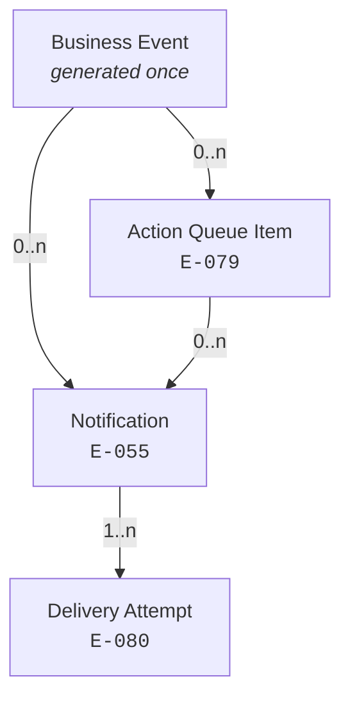
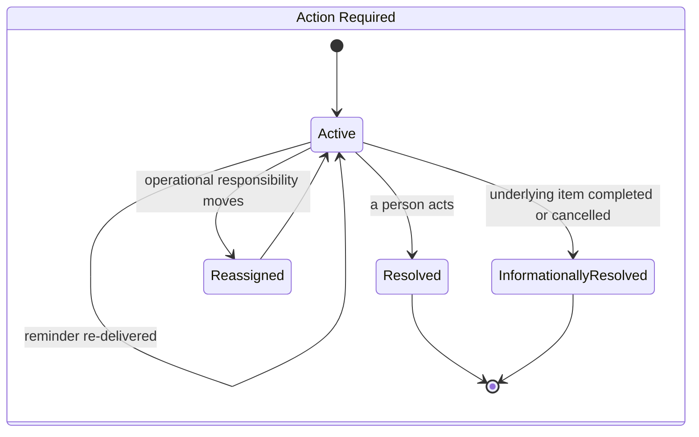
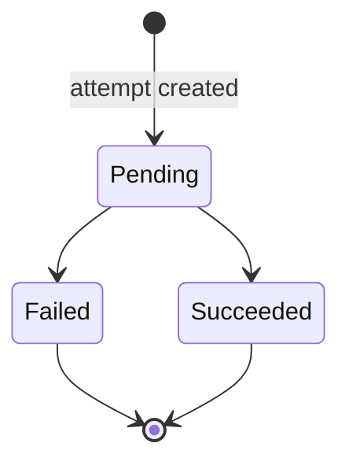
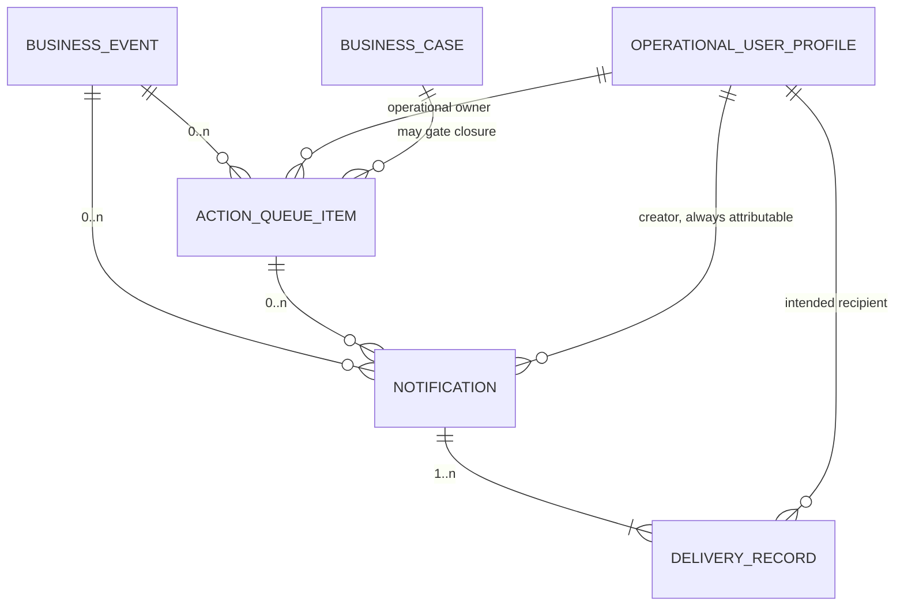
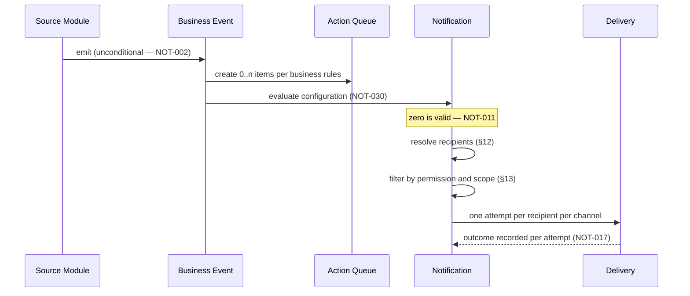
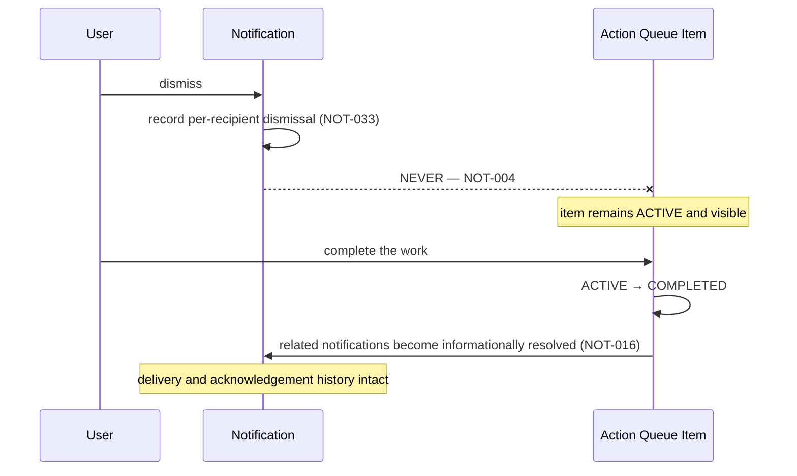
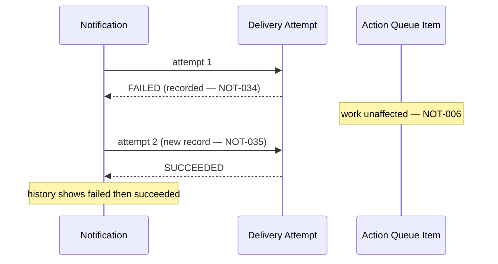

# Notification Architecture

**Owner:** Trioloo Technology · **Module:** Notification · **Status:** Canonical
**Version:** 1.2.1 · **Ratified:** 2026-08-08 · **Rule prefix:** `NOT-`

---

## Document Control

**Inherits:** [`SYSTEM_ARCHITECTURE.md`](SYSTEM_ARCHITECTURE.md) §22 — system-level notification obligations (`SYS-098` – `SYS-101`).
**References:** [`DOMAIN_MODEL.md`](DOMAIN_MODEL.md) `E-055`, `E-079`, `E-080` · [`PERMISSION_ARCHITECTURE.md`](PERMISSION_ARCHITECTURE.md) `PRM-009`, `PRM-065` · [`AUDIT_ARCHITECTURE.md`](AUDIT_ARCHITECTURE.md) `AUD-001`, `AUD-004` · [`EVENT_ARCHITECTURE.md`](EVENT_ARCHITECTURE.md) · [`DESIGN_CONSTITUTION.md`](DESIGN_CONSTITUTION.md) for all presentation.

**Source of truth:** [`BUSINESS_DISCOVERY.md`](BUSINESS_DISCOVERY.md) §25, `BD-380` – `BD-387`, and the reconciliation recorded at `SYSTEM_ARCHITECTURE.md` §22 and `DOMAIN_MODEL.md` v3.6.0.

> **This document consolidates confirmed decisions only.** No business rule is introduced here, no entity is invented, and no gap is solved. Where a decision was not made, the governing `GAP-` reference is cited in §25.

> Contains no code, schema, API contract, or UI specification. Where notification behaviour has a user-facing consequence, this document states the **behaviour**; presentation is governed by `DESIGN_CONSTITUTION.md` (`SYS-001`).

---

# 1. Purpose

To define how the ERP draws a person's attention to something that has happened, or to work that is waiting — **without ever becoming the record of either.**

Trioloo's operational cost is dominated by **coordination, not difficulty**. Three independent domains reported the same finding: marketplace work is one problem multiplied across seven seller accounts (`BD-328`), returns are one case scattered across many processes (`BD-353`), and chat is one customer reached through several platforms (`BD-366`). **In none of them is any individual task described as hard.** What consumes the day is holding the work together.

Notification is the mechanism by which that coordination happens. It is therefore **load-bearing infrastructure, not a convenience feature** — and it carries a second responsibility that is easy to miss:

> **Twenty-five architectural decisions across this ERP deliberately warn rather than block** (`CP-8`). Every one of them assumes somebody sees the warning. **If notifications become noise, advise-over-enforce does not degrade into a stricter system — it degrades into no control at all, while still appearing to have one.**

---

# 2. Scope

## 2.1 In scope

Notification categories and their behaviour · the Action Queue as the record of outstanding work · notification generation, configuration and suppression · recipient resolution · per-recipient state · delivery methods and delivery attempts · delivery evidence and its retention · the Notification Center as the primary operational workspace · cross-domain notification obligations raised by other modules.

## 2.2 Out of scope

| Not owned here | Owner |
|---|---|
| **What happened** — the Business Event | The source module (`SYS-015`) |
| **Whether a permission or scope permits a read** | `PERMISSION_ARCHITECTURE.md` |
| Customer identity | `CUSTOMER_ARCHITECTURE.md` ✅ |
| Message templates' visual presentation | `DESIGN_CONSTITUTION.md` |
| Transport mechanics, push infrastructure, delivery-provider integration | Engineering (`SYS-076`) |
| **Organizational record retention policy** | `SYS-101` — central, not per-module |

---

# 3. Architectural Principles

## 3.1 P1 — The notification is never the record

> **NOT-001 — A notification is authoritative for communication evidence only, and never for business state** (`BD-382`, `BD-386`, `INV-55.2`).

Three concepts exist and **none is subordinate to the others**:

| Concept | Records | Authoritative for |
|---|---|---|
| **Business Event** | That something happened — **permanent** | **The business record** |
| **Action Queue Item** | Work requiring completion | **The operational work record** |
| **Notification** | That someone was informed | **Communication evidence** |

**This is the sixth instance of *relate, never collapse*** in this architecture, after `SYS-010`, `BD-325`, `INV-75.3`, `DM-067` and `DM-070`. It qualifies as one because Notification and Action Queue are **two representations of the same outstanding work**, and the rule settles which is authoritative — the same shape as `SYS-010`: **a copy exists for convenience and must never acquire authority over what it copies.**

## 3.2 P2 — The business event is never configurable

> **NOT-002 — Notification behaviour is configurable; the business event that triggers it is not** (`BD-381`, `DM-073`).

| Consequence | Why it matters |
|---|---|
| Modules emit events **unconditionally** | No `if (notify)` branch inside business logic |
| Event history is **complete regardless of notification settings** | Audit does not degrade when someone quiets a channel |
| A notification enabled later **works immediately** | Configuration, not a code change |

**Turning off a notification loses the announcement, never the event.** Same instinct as `SYS-015` — the notification layer decides delivery; business modules decide what happened.

## 3.3 P3 — Silencing a notification must never hide work

> **NOT-003 — Disabling, muting, delaying, grouping or changing notification delivery must never remove, complete, or hide the underlying business work** (`BD-382`, `INV-79.1`).

**The word *hide* is deliberate.** It is not merely that work survives a muted notification — **its visibility must not depend on notification configuration at all.**

This is the most dangerous failure this subsystem can produce, because it is **silent**: nothing errors, work simply stops being done. The obvious way for an administrator to reduce noise is to disable notifications, and the obvious ones to disable are those arriving most often.

## 3.4 P4 — The dependency is one-directional

> **NOT-004 — Action Queue state may render notifications informationally resolved. Notification state never changes the Action Queue** (`BD-384`, `INV-79.3`).

| Direction | Permitted |
|---|---|
| Action Queue → notification relevance | **Yes** |
| Notification → Action Queue | **Never** |

**The prohibition exists because the shortcut is genuinely tempting.** If every recipient has dismissed a notification, the work *looks* handled. **Dismissal means *"I have seen this"*, never *"this is done."*** Inferring completion from acknowledgement is how work is silently lost.

## 3.5 P5 — Never assume one-to-one

> **NOT-005 — No one-to-one relationship may be assumed between Business Event and Notification, Action Queue Item and Notification, or Notification and Delivery Attempt** (`BD-385`, `INV-55.5`).

**This is what makes `NOT-004` structurally impossible to violate rather than merely forbidden.** Under a one-to-one design, *"dismiss the notification → complete the item"* sits waiting for whoever writes that code. Under one-to-many it is incoherent: **which of five notifications completes the item? What completes an item that generated zero?**

**The cardinality removes the temptation instead of policing it** — the strongest form a rule of this kind can take.

## 3.6 P6 — Failure isolates

> **NOT-006 — A notification failure never blocks the business process that triggered it** (`SYS-054`, `INV-55.1`) **and never loses the work either** (`NOT-003`).

Under a design where the notification *was* the record, a delivery failure would silently destroy the obligation. Because the Action Queue is the source of truth, **a failed delivery is an inconvenience to be retried, not lost work.**

---

# 4. Notification Concepts

## 4.1 Business Event

Owned by the **source module**, not by Notification. Recorded here only for the relationships it anchors.

| | |
|---|---|
| **Records** | That something happened |
| **Permanence** | **Permanent** — `BD-382` |
| **Independence** | **Exists regardless of notification settings** |
| **Generated** | **Once** |

`EVENT_ARCHITECTURE.md` publishes the per-module event catalogues — `Permission.RoleAssigned`, `Integration.SyncFailed`, `Exception.Raised` and others. **This document names the general concept those catalogues are instances of**, and adds the property that matters: **permanence, independent of whether anyone was told.**

## 4.2 Action Queue Item · `E-079`

| | |
|---|---|
| **Purpose** | Work that requires completion |
| **Ownership** | System |
| **Authority** | **The operational source of truth for outstanding work** |
| **Lifecycle** | `ACTIVE → COMPLETED · CANCELLED`, with **reassignment as a transfer that keeps it active** |

**Attributes** — subject Business Event or record · operational owner · required action · created at · completed or cancelled at and by · reassignment history.

**Invariants** — `INV-79.1`, `INV-79.2`, `INV-79.3` (`DOMAIN_MODEL.md`).

> **NOT-007 — *"Remains active until resolved"* means active in a queue, not active as a message.** An Action Required item remains visible in its work surface **whether or not a notification was generated for it** (`BD-382`).

> **NOT-008 — Reassignment is a transfer, not a terminal state.** It moves **operational responsibility** without ending the work, and **without moving the attribution of the underlying event** (`BD-373`, `DM-070`). Reassigning *"approve this discount"* changes who must act; it does not change who requested it.

## 4.3 Notification · `E-055`

| | |
|---|---|
| **Purpose** | To inform users about a Business Event or an Action Queue Item |
| **Authority** | **Communication evidence only** |
| **Delivered through** | One or more channels |

**Attributes** — subject event or Action Queue Item · **category** · **priority** · **mandatory or optional** · intended recipients · delivery methods.

**Invariants** — `INV-55.1` – `INV-55.5` (`DOMAIN_MODEL.md`).

## 4.4 Notification Delivery Record · `E-080`

| | |
|---|---|
| **Purpose** | Evidence that a notification was, or was not, delivered |
| **Authority** | **Auditable evidence of communication** |

**Attributes** — notification · related Business Event or Action Queue Item · **intended recipient** · delivery channel · attempt time · **attempt outcome** · viewed at · dismissed at.

**Invariants** — `INV-80.1`, `INV-80.2`, `INV-80.3`.

> **NOT-009 — The record captures the *intended* recipient, not merely the actual one** (`BD-383`). This is the only way a **failed** delivery is distinguishable from one that was **never attempted**.

> **NOT-010 — *"Was this person actually told?"* must be answerable.** `PRM-058` requires administrators to be notified of overdue access reviews. **Without delivery history, an unreviewed override and an unnotified administrator are indistinguishable** — and the access-governance surface would report a failure of diligence when the real failure was delivery (`BD-383`).

---

# 5. Relationships

## 5.1 The four-level cardinality chain

| Relationship | Cardinality | Source |
|---|---|---|
| Business Event → Action Queue Item | **zero, one, or many**, according to business rules | `BD-385` |
| Business Event → Notification | **zero, one, or many** | `BD-385` |
| Action Queue Item → Notification | **zero, one, or many** | `BD-385` |
| Notification → Delivery Attempt | **one or more**, each independently recorded | `BD-385` |
| Notification → Recipient | **one or more**, each with independent state | `BD-381`, `BD-384` |

## 5.2 Why `zero` is load-bearing

> **NOT-011 — Zero is a valid cardinality at two points, and it is what makes configuration expressible** (`BD-385`).

| Zero | Means |
|---|---|
| Event → **zero** Action Queue Items | Something happened that **requires no work** — pure Information |
| Event or Item → **zero** Notifications | **Nobody is told**, by configuration (`NOT-002`) |

**Without zero being valid, *"whether an event generates a notification is configurable"* would have no expressible negative case.**

---

# 6. Notification Categories

> **NOT-012 — Every notification carries exactly one of three categories, and the category determines its lifecycle and persistence** (`BD-380`).

| Category | Reports | Persists by | Cleared by |
|---|---|---|---|
| **Action Required** | Work waiting for a person | **Re-delivery** — reminders (`BD-381`) | A person acting · reassignment · **informational resolution** |
| **Information** | A completed or important event | **Does not persist** | Nothing — it reports a completed fact |
| **Ongoing Condition** | A condition that is currently true | **Re-evaluation** | **The condition ceasing to be true** |

## 6.1 Ongoing Conditions are evaluated, not stored

> **NOT-013 — An Ongoing Condition notification is a query over current state, not a stored event** (`BD-380`).

**Nobody dismisses *Low Stock*; restocking clears it.** The condition is continuously true and continuously visible, and therefore **cannot be missed, because it is never delivered as a moment.**

This is the same mechanism as the overlay flags established at `SMA-061` — a value derived from state rather than an event recorded at a point in time.

## 6.2 Category is independent of the other two axes

> **NOT-014 — Category, Priority and Mandatory/Optional are three independent axes and none may be derived from another** (`BD-380`, `BD-381`, `BD-387`).

| Axis | Determines |
|---|---|
| **Category** | **Lifecycle** — how it persists and clears |
| **Priority** | Relative importance |
| **Mandatory / Optional** | **Whether it can be silenced** |

**The business's own examples prove the independence.** *Marketplace Sync Failure*, *Security Alerts* and *Critical System Alerts* are **mandatory but are not Action Required items** — nothing is queued for a person to complete. **A design inferring *mandatory = Action Required* would leave every system and security alert silenceable.**

**No inference is required, because the model prevents it:** every notification type **declares** whether it is mandatory (§14).

---

# 7. Notification Lifecycle

**The lifecycle differs by category.** Only Action Required has a resolution path.

| Category | Lifecycle |
|---|---|
| **Action Required** | As above |
| **Information** | **Emitted. No resolution state exists** — it reports a completed fact |
| **Ongoing Condition** | **No stored lifecycle.** Continuously evaluated; present while true |

## 7.1 Two clearing mechanisms coexist

> **NOT-015 — Dismissal and informational resolution are different mechanisms operating at different scopes, and neither overwrites the other** (`BD-384`).

| Mechanism | Scope | Nature |
|---|---|---|
| **Dismissal** | **Per recipient** | **An act** — this user has seen it |
| **Informational resolution** | **Global** | **A consequence** — the work no longer needs anyone |

**Acknowledgement history survives both** (`DB-003`, `INV-80.3`).

## 7.2 Informational resolution is derived, not written

> **NOT-016 — When the underlying Action Queue Item is completed, cancelled or otherwise resolved, related notifications become informationally resolved. Their individual delivery and acknowledgement history remains intact** (`BD-384`).

**The relevance is derived from the state of the underlying item, not written onto the notification** — the same mechanism as `NOT-013`.

---

# 8. Delivery Lifecycle

> **NOT-017 — Delivery status belongs to the attempt, not to the notification** (`BD-385`, `INV-80.1`).

**Three levels, each with its own state:**

| Level | State |
|---|---|
| **Notification** | **Derived from its attempts** |
| **Delivery attempt** | `Pending` · `Succeeded` · `Failed` |
| **Recipient engagement** | `Viewed` · `Dismissed` — **per recipient** |

## 8.1 Delivery and engagement are two dimensions

> **NOT-018 — *Pending · Succeeded · Failed* describes the system's attempt; *Viewed · Dismissed* describes the recipient's engagement. They must not be collapsed** (`INV-80.2`).

**A notification can be successfully delivered and never read.** Collapsing the two would make *delivered* mean *seen*, which it does not.

## 8.2 Retries are history, not a mutated field

**This is `DB-001` applied to delivery — movements, not balances.** Each attempt is recorded independently, so the sequence *attempted · failed · retried · succeeded* is visible. **A single overwritten status field would lose exactly the information needed to explain why a notification arrived late or twice.**

---

# 9. Delivery Methods

> **NOT-019 — V1 supports five delivery methods, all of which reach a user at their machine. No external delivery integration is built in V1** (`BD-387`).

| V1 | Future |
|---|---|
| **In-App Notification Center** | Mobile Push |
| **Live ERP Notification** | Email |
| **Desktop Notification** | SMS |
| **Browser Notification** | WhatsApp |
| **Notification Sound** *(see `GAP-102`)* | Other external channels |

## 9.1 The V1 boundary, stated as a known trade-off

| Situation | V1 reaches them? |
|---|---|
| Working in the ERP | **Yes** — Center, live, sound |
| At their machine, ERP not in focus | **Yes** — desktop and browser notifications |
| **Away from their machine** | **No** |

**Desktop and browser notifications cover more than the split first suggests.** The uncovered case is not *"not looking at the ERP"* but ***"not at the computer"*** — evening marketplace orders and weekend chat messages wait until someone returns.

> **Given that `BD-328`, `BD-353` and `BD-366` all identify coordination as the dominant operational cost, this is the first limitation worth revisiting when external channels arrive.**

## 9.2 Deferring external channels also defers their constraints

| Channel | Constraint deferred with it |
|---|---|
| SMS | **Per-message cost** |
| WhatsApp | **Business API restricts free-form messages outside a 24-hour window** — routine alerts generally need pre-approved templates |
| Email | Deliverability; slow to be noticed |
| Push / Browser | Requires the app or an open session |

`CP-3` — a seven-person team should not carry four integrations it does not yet need.

## 9.3 External delivery never becomes primary

> **NOT-020 — External delivery methods supplement the ERP but never replace the Notification Center as the primary operational notification workspace** (`BD-387`).

**The same authority relationship as `NOT-001`**, applied to delivery surfaces rather than to records: a copy exists for convenience and must not acquire authority over what it copies.

## 9.4 WhatsApp has three unrelated roles

> **NOT-021 — WhatsApp as a staff notification method is a separate integration from WhatsApp as a customer channel and from WhatsApp Account as a scope dimension** (`DM-074`).

| Role | Established |
|---|---|
| Customer conversation channel | §23 Chat |
| **Scope dimension** — WhatsApp Account / Number | `PRM-064` |
| **Staff notification delivery method** *(future)* | `BD-381`, `BD-387` |

**Same technology, three purposes, different accounts.** An implementation treating *"WhatsApp"* as one integration would **couple customer conversation handling to internal alerting.**

---

# 10. Notification Center

> **NOT-022 — The Notification Center is the primary operational notification workspace** (`BD-387`).

| Responsibility | |
|---|---|
| Presents notifications the current user may see | Bounded by §13 |
| Presents Action Required items with their queue state | §11 |
| Presents Ongoing Conditions while true | `NOT-013` |
| Holds per-recipient read and dismissal state | §16 |

**Layout, interaction and visual behaviour are governed by `DESIGN_CONSTITUTION.md`** (`SYS-001`) and are not specified here.

> ⚠ **Whether the Notification Center and the Action Queue are one surface or two is a design decision, not a business rule.** `NOT-001` requires the **records** to remain distinct; it does not require two screens. §24b established that four access-governance views should be registered as **one** administrative area, and `SYS-106` records *"collapse the surface, never the record"* as the business's consistent preference. **The same reasoning applies here and should be settled during UI design, not assumed in either direction.**

---

# 11. Action Queue

> **NOT-023 — The Action Queue is the operational source of truth for outstanding work, and remains so independently of every notification setting** (`BD-382`).

## 11.1 What belongs in it

An Action Queue Item exists wherever **a business event creates work requiring completion by a person.** Confirmed instances across the ERP:

| Work | Source |
|---|---|
| Sync exceptions requiring manual intervention | `BD-320` |
| Listing issues assigned to a responsible user | `BD-322` |
| A component pending classification, blocking a Trade-In | `SMA-072`, `SMA-073`, **`EVT-098`** |
| A repair awaiting parts | `SM-15` |
| An override awaiting review after a role change | `PRM-063` |
| An overdue access review | `PRM-058` |
| Unclaimed customer property requiring follow-up | `BD-396`, **`EVT-099`** |
| An advance exchange past its configured period | `SMA-054` |

## 11.2 Ownership and reassignment

> **NOT-024 — An Action Queue Item carries an operational owner. Operational responsibility may be reassigned; the historical attribution of the underlying event never moves** (`BD-373`, `DM-070`).

**Practically: when someone leaves, their in-flight work moves and their completed work does not.**

---

# 12. Recipient Resolution

> **NOT-025 — Notification recipients are configurable per notification type** (`BD-381`).

## 12.1 Recipients are actors, not only people

Every recipient resolves to an **Operational User Profile** (`E-077`). Under `BD-371` **every actor that performs work in the ERP holds one** — human, system, integration, automation, or AI service — so **a notification's creator is always attributable**.

> **NOT-026 — A notification with no attributable creator cannot exist** (`BD-371`, `INV-77.1`). Most notifications are system-generated; this works only because System and Automation actors hold their own profiles. **Without that, *"the system did it"* would be the answer to an auditor asking why a notification was sent.**

## 12.2 Resolution order

| Step | Determined by |
|---|---|
| 1 · Candidate recipients | Notification type configuration (`NOT-025`) |
| 2 · Filtered by permission | `PRM-009` — enforced on read |
| 3 · Filtered by scope | §13 |
| 4 · Adjusted by recipient preference | §14, §15 — **within the mandatory floor** |

---

# 13. Permission & Scope

> **NOT-027 — Notification visibility is bounded by Roles, Permissions and Scope Assignments, enforced as any other read** (`BD-380`, `SYS-098`, `PRM-009`).

**Scope bounds; it never grants** (`PRM-065`). A user with no permission gains nothing from wide scope; a user with permission and no scope sees nothing. **The two are multiplicative, not additive.**

## 13.1 Consequences

| | |
|---|---|
| A user scoped to WhatsApp Account 1 | **Does not receive Account 2's notifications** |
| A user scoped to one branch | **Does not see another branch's queue** |
| An integration actor | **Bounded exactly as a person is** — a Shop 1 adapter cannot surface Shop 2's data |
| Two users viewing the same summary | **Legitimately see different totals** |

## 13.2 ⚠ Scope is the right volume control, and it is not active today

> **`SYS-098` records that most users currently work across all business channels** (`BD-377`), because the business operates as one integrated organization.

| | Controls volume by | Effective |
|---|---|---|
| **Scope** | Which instances a user sees | **At organizational growth** |
| **Category** | Must-act versus good-to-know | **Today** |

**Only the second is live**, which means **category discipline is currently the only thing standing between this design and notification fatigue.** Stated as a finding, not a criticism — but it is why §6 and §14 matter more in V1 than §13 does.

---

# 14. Mandatory vs Optional Notifications

> **NOT-028 — Every notification type declares whether it is mandatory, and whether user preferences may modify its delivery** (`BD-387`).

| Group | Rule | Confirmed examples |
|---|---|---|
| **Mandatory** | **Cannot be completely disabled by the recipient.** Presentation may be customized where permitted; **existence may not** | Action Required · Approval Requests · **Permission Review** · **Access Review** · **Marketplace Sync Failure** · Security Alerts · Critical System Alerts |
| **Optional** | May be customized according to business policy | Information · Routine Updates · Completed Activities · General Announcements |

## 14.1 The protection is doubled

| Protection | Mechanism |
|---|---|
| **Structural** | The Action Queue is the source of truth — silencing loses the announcement, never the work (`NOT-003`) |
| **Policy** | Mandatory notifications cannot be disabled (`NOT-028`) |

> **The user's latitude is real but bounded: *how* they are told, never *whether*.**

## 14.2 The floor

> **NOT-029 — Business rules define the minimum required delivery. Recipient preferences may extend or reduce optional delivery methods, and may never violate the mandatory minimum** (`BD-387`).

**Effective delivery = business default + user additions − user removals, bounded below by the mandatory minimum.**

This is structurally the same layered computation as effective authority in `PERMISSION_ARCHITECTURE.md` (`PRM-057`), where the same shape required an explanation view. **Here it is recorded as proportionate advice rather than an obligation:** a wrong permission is a security incident; a missed notification is a support question. **But *"why didn't I get notified?"* will be asked**, and under a four-layer model it is not answerable by inspection.

---

# 15. Notification Configuration

> **NOT-030 — Notification generation is configurable across seven dimensions; the business event is not** (`BD-381`, `NOT-002`).

| # | Configurable |
|---|---|
| 1 | **Whether an event generates a notification** |
| 2 | **Recipients** |
| 3 | **Priority** |
| 4 | **Delivery methods** |
| 5 | **Repetition and reminder rules** |
| 6 | **Sound and visual behaviour** |
| 7 | **Grouping and batching**, where appropriate |

## 15.1 Significance is configuration, not code

> **NOT-031 — The set of notifying events is configuration** (`SYS-099`).

`BD-380` states that *"every **significant** business event **may** generate a live notification."* **Both hedges matter**, and *significant* is where notification volume is actually governed. The business deliberately left it undefined.

**A fixed list would make every tuning decision a code change — and this will need tuning in its first month of use.** `SYS-013`.

## 15.2 Model richness is not interface richness

**Seven configuration dimensions is substantial machinery for a business of this size**, and it follows a pattern confirmed three times: ten scope dimensions with users unscoped (`PRM-064`), configurable review cycles running one default (`PRM-028`), seven notification dimensions for a seven-person team.

> **The standing consequence for V1: the model must accommodate all seven; the interface should expose only those in use.** Sound, visual behaviour, grouping and batching are configuration the model must **permit**, not settings V1 must **ship**. `CP-3`, `PRM-014`, `PRM-051`.

## 15.3 Real-time is bounded by knowledge

> **NOT-032 — The ERP cannot notify faster than it learns** (`SYS-100`).

The business requires **real-time notification of all significant operational events wherever possible** (`BD-380`). The qualifier is correct and structural:

| Event origin | Liveness |
|---|---|
| **Inside the ERP** | **Genuinely live** |
| **Externally sourced** | **As live as its integration allows** — for a marketplace order, **the sync cadence is the floor** |

**Real-time delivery and real-time awareness are different things**, and only the first is within the ERP's control (`SYS-095`).

---

# 16. Per-recipient Behaviour

> **NOT-033 — When one notification is delivered to multiple recipients, each recipient holds independent state. One user's actions never alter another's** (`BD-384`, `INV-55.3`).

| Action by User A | Effect on User B |
|---|---|
| Dismisses the notification | **None** |
| Reads it | **None** — it is not marked read for B |
| Mutes a delivery channel | **None** |

**Dismissal is per-recipient; informational resolution is global** (`NOT-015`). The two coexist without interfering: **one is an act, the other is a consequence.**

---

# 17. Delivery History

> **NOT-034 — A notification's delivery history must be retained, and must answer seven questions** (`BD-383`).

| # | Question |
|---|---|
| 1 | What notification was generated |
| 2 | Which Business Event or Action Queue Item it related to |
| 3 | **Who was intended to receive it** |
| 4 | Which delivery channel was used |
| 5 | When delivery was attempted |
| 6 | Whether delivery **succeeded, failed, or remains pending** |
| 7 | When the recipient viewed or dismissed it, where applicable |

> **Notification history is auditable evidence of communication, not authority over business state.**

## 17.1 Where this obligation bites

**Communication is a closure condition, not a courtesy** (`BD-352`, `INV-73.4`). A Business Case is not `CLOSED` until the customer has been told — which moved communication from *something the business does* to **a condition on a state transition**, and raises the architectural weight of this record considerably.

## 17.2 ⚠ Volume

**This will be the highest-volume data in the ERP** — every notification × every recipient × every channel × every attempt, in a system designed for real-time delivery across all modules.

**`BD-338`'s archival latitude matters more here than anywhere else**: archived records must remain **accessible and recoverable when required**, and **real-time searchability of archived data is expressly not a business rule.** Retrieval method, latency and storage tier are infrastructure decisions.

---

# 18. Retry Behaviour

> **NOT-035 — Each delivery attempt is recorded independently. A retry creates a new attempt; it never overwrites the previous one** (`BD-385`, `INV-80.1`).

| | |
|---|---|
| **Failure is survivable** | The Action Queue holds the work (`NOT-003`, `NOT-006`) |
| **Failure is visible** | The attempt is recorded with its outcome (`NOT-034`) |
| **Retry is a new movement** | `DB-001` — the history explains why a notification arrived late or twice |

**No retry schedule, backoff policy or attempt limit is specified here.** The business stated no such rule; inventing one would be inventing business policy (`DM-001`). **Retry mechanics are an engineering concern** (`SYS-076`) constrained by `NOT-035`.

---

# 19. Retention & Archival

> **NOT-036 — Notification retention is operationally independent but not policy independent** (`BD-386`, `SYS-101`).

| Each record class may differ in | Governed centrally |
|---|---|
| Storage strategy · archival strategy · indexing · retrieval method | **Whether data may be destroyed** |

> **Independent retention means independent lifecycle management and storage optimization, not independent disposal authority.**

## 19.1 The boundary falls on reversibility

| | Owned by | Because |
|---|---|---|
| **How** data is stored, tiered, indexed | **This module**, freely | **Reversible** — cold storage re-warms, an index rebuilds |
| **Whether** data may be destroyed | **The organization**, centrally | **Irreversible** — `CP-8` |

**The same axis `CP-8` carries.** A design in which each module sets its own disposal rules satisfies every individual rule and violates the whole.

## 19.2 The floor

**Notification Delivery Records carry the same minimum business retention obligations as other business evidence** (`BD-386`). Combined with `BD-338` — **no business record is ever deleted** — delivery evidence is **archived, never disposed of**.

**Why the floor matters concretely:** warranty terms reach **12 years** (`BD-091`), and `BD-338` made retention a **minimum, never an expiry**, for exactly that reason. A dispute in year three about whether a customer or colleague was informed must find the evidence, **possibly in cold storage, and it must be recoverable.**

**Archiving must never prevent authorized users from recovering notification evidence when required** — and recovery is **permission-and-scope bounded** like any other read (§13).

---

# 20. Audit Requirements

> **NOT-037 — Notifications and internal notes are activity-log material, not audit-log postings** (`AUD-001`).

`AUD-001` distinguishes the **activity log** — operational narrative for staff — from the **audit log** — formal proof for auditors. **Notification content is squarely the first.**

## 20.1 What is nonetheless auditable

| Auditable | Rule |
|---|---|
| **Who or what generated a notification** | `NOT-026`, `AUD-004` |
| **Delivery attempts and outcomes** | `NOT-034` |
| **Per-recipient acknowledgement** | `NOT-033` |
| **Changes to notification configuration** | `AUD` change history, `DB-068` |

## 20.2 The `E-055` / ownership reconciliation

`BD-373` lists **Notifications** among the artifacts an Operational User Profile **owns**; `BD-382` states notifications are **not a business record**. **Both hold on one reading, confirmed by `BD-386`:**

> A notification is **attributable and retained** — who or what generated it, when, to whom, through which channel — but **never authoritative for business state.** ***"Not a business record"* means not the record of the fact, not *not recorded*.**

---

# 21. Cross-domain Integration

## 21.1 Requirements raised against this module

Six requirements accumulated across five domains before this document existed. **All are now owned here.**

| # | Requirement | Raised at | Audience | Category |
|---|---|---|---|---|
| 1 | Order follow-up reminders | `BD-279` | Internal | Action Required |
| 2 | Sync exceptions requiring manual intervention | `BD-320` | Internal | Action Required |
| 3 | Listing issues → responsible user | `BD-322` | Internal | Action Required |
| 4 | **Warranty status and delays** | `BD-334` | **The customer** | Information |
| 5 | Advance-exchange follow-up | `BD-350` | Internal | Action Required |
| 6 | **Return closure communication** | `BD-352` | **The customer** | **A closure condition** |

> **Items 4 and 6 are the two that change this module's weight.** Item 4 **leaves the building** — it needs a channel the customer uses, content fit to send, and a record of what was told to whom, all of which `E-080` supplies. Item 6 made communication **a condition on a state transition** rather than a courtesy.

⚠ **Both customer-facing requirements depend on external delivery channels, which `NOT-019` defers past V1.** Recorded so the dependency is deliberate: **in V1 these are satisfied in-app or not at all.**

## 21.1a Warranty & Repair — the four determinate triggers

**Added 2026-08-09** from `BUSINESS_DISCOVERY.md` §31 (`BD-428`). **Item 4 above recorded *“warranty status and delays”* as one line because `BD-334` defined no further.** `BD-428` supplied the missing precision, and the four points below are the ones that are **determinable**.

> **NOT-039 — Four Warranty & Repair occurrences are confirmed notification triggers**, each carried by a registered event (`EVENT_ARCHITECTURE.md` §20).

| Trigger | Event | Audience | What the customer is told |
|---|---|---|---|
| **Unit received into custody** | `EVT-089` | Customer | The product is now with Trioloo |
| **Customer decision or approval required** | `EVT-090` | Customer | A decision is needed before work continues |
| **Resolution materially decided** | `EVT-094` | Customer | The outcome — repaired, replaced, not covered, or refund where applicable |
| **Ready for handback** | `EVT-095` | Customer | The unit is ready to collect or be returned |

> **NOT-040 — Routine Warranty/Repair progress is explicitly NOT a notification trigger** (`BD-428`). **Internal movement between repair stages requires no customer message**, and neither `SM-13` nor `SM-15` produces a notification per transition.

> **NOT-041 — Two Warranty/Repair requirements are confirmed but have no determinate trigger, and neither is implemented by guessing one.**
>
> | Requirement | Why it has no trigger |
> |---|---|
> | **A material diagnostic finding** (`BD-428`) | **Materiality is a judgement, not a determinable point** (`CP-8`). A person decides a finding is material; no state does |
> | **A significant unexpected delay** (`BD-334`, `BD-428`) | ⚠ **`GAP-087` leaves the threshold undefined.** *“Longer than expected”* presupposes an expectation the business has not stated, and **deriving one from history would be inventing policy** (`DM-001`) |

> **NOT-042 — The ready-for-handback notification gates handover readiness; it is NOT a case-closure condition** (`BD-428`, `EVT-095`).
>
> ⚠ **This is where item 6 above must not be generalised.** `BD-352` made customer communication **a closure condition** on a *return*. **`BD-428` expressly declines to extend that to warranty**: closure follows the Warranty/Repair lifecycle and the actual handover. **The two entries in this section look alike and are not.**

> **NOT-044 — Trade-In requires no automatic customer notification at any lifecycle transition** (`BD-432`). Communication is **handled manually by staff**.
>
> **No Notification consumer or event exists for Trade-In** — not for request received, valuation, agreement accepted, credit creation, decline, return or unclaimed property — **and none is created** (`DOC-024`). **A whole capability area removed by explicit answer**, as `BD-335` removed loaner management (`CP-9`).
>
> ⚠ **This is the sharpest contrast in the set.** `BD-428` gives Warranty & Repair **eight contact points, four determinate and two gating progress** (§21.1a); `BD-432` gives Trade-In **none**. **Two adjacent after-sales domains, opposite answers** — which is why neither was inferred from the other.

> **NOT-045 — Two Trade-In Action Queue entries are internal staff work and are unaffected** (`BD-432`, `BD-396`, §11.1): **a component pending classification blocking a case** (`SMA-072`, `SMA-073`) and **unclaimed customer property requiring follow-up**. **Recording communication and sending it are different, and only recording is required.**

> **NOT-043 — Where a Warranty/Repair case waits on the customer, silence is never approval** (`BD-428`, `EVT-090`, `SMA-046`). **No notification, reminder, retry or elapsed period converts an unanswered request into consent.** The case waits.

**Unchanged by this propagation:** delivery methods, templates, retry behaviour, escalation, recipient preferences and the mandatory/optional split. **`NOT-019` still defers external channels past V1** — in V1 all four triggers above are satisfied **in-app or not at all**.

## 21.2 Ageing overlays that produce notifications

**Ageing thresholds produce visibility, never action** — stated independently four times (`BD-334`, `BD-350`, `BD-364`, `BD-365`).

| Overlay | Where | Threshold |
|---|---|---|
| `Overdue` — a reply is late | `SM-16` Conversation | **10 minutes**, configurable (`BD-364`) |
| `Inactive` — the customer has gone quiet | `SM-16` | Configurable (`BD-365`) |
| `Overdue` — an advance exchange is unreturned | `SM-9` | Configurable (`SMA-054`) |
| A warranty case running long | `SM-15` | **Undefined — `GAP-087`** |
| Unusually frequent returns | Customer history | **Undefined — `GAP-091`** |

> **`Overdue` names two different things** across `SM-9` and `SM-16` — the second concrete instance under `GAP-026`. **Machine-qualified naming applies** (`SMA-047`).

## 21.3 Module boundaries

| This module | Does not |
|---|---|
| Decides **delivery** | Decide **what happened** — `SYS-015` |
| Holds **communication evidence** | Hold **business state** — `NOT-001` |
| Reads permission and scope | **Own** them — `PERMISSION_ARCHITECTURE.md` |
| Retains delivery records | **Set disposal policy** — `SYS-101` |

---

# 22. Entity Relationships

| Entity | ID | Canonical definition |
|---|---|---|
| Notification | `E-055` | `DOMAIN_MODEL.md` |
| Action Queue Item | `E-079` | `DOMAIN_MODEL.md` |
| Notification Delivery Record | `E-080` | `DOMAIN_MODEL.md` |
| Operational User Profile | `E-077` | `DOMAIN_MODEL.md` |
| Business Case | `E-073` | `DOMAIN_MODEL.md` |

**No entity is defined here.** This document specifies behaviour; `DOMAIN_MODEL.md` remains canonical for entity structure and invariants (`DOC-005`).

---

# 23. State Machine References

| Machine | Subject | Owner |
|---|---|---|
| **None** | **Notification has no state machine** | — |

> **NOT-038 — Notification requires no state machine.** Under `DB-001` a notification's status is **derived from its delivery attempts**, and a delivery attempt has three outcomes rather than a lifecycle. **The Action Queue Item's lifecycle is `ACTIVE → COMPLETED · CANCELLED`, recorded in `DOMAIN_MODEL.md` `E-079`, and does not warrant a machine of its own.**

**Machines this module observes but does not own:**

| Machine | Relevance |
|---|---|
| `SM-16` Conversation | `Overdue` and `Inactive` overlays produce notifications |
| `SM-17` Permission Override | `REVIEW_REQUIRED` produces an Action Queue Item (`PRM-063`) |
| `SM-15` Repair | `WAITING_FOR_PARTS` is the sole internally-owned ageing candidate |
| `SM-9` Exchange | `Overdue` advance exchange produces follow-up (`SMA-054`) |
| `SM-19` Trade-In Component | `UNKNOWN` classification blocks a case and requires action |

---

# 24. Flow Diagrams

## 24.1 Generation — one event, many outcomes

## 24.2 Resolution — why dismissal cannot complete work

## 24.3 Delivery failure — nothing is lost

---

# 25. Open GAP References

**Referenced, not solved.**

| GAP | Severity | Bearing on this module |
|---|---|---|
| **`GAP-102`** | 🟢 Low | **Notification Sound is listed both as a V1 delivery method (§9) and as a presentation property (§15).** Sound is an attribute of a delivery, not a channel — a notification cannot be delivered *only* as a sound with nothing to see. **Recommended modelling as presentation; not decided** |
| **`GAP-087`** | 🔴 High | **A warranty case running long cannot be flagged**, because no threshold exists. Three of five duration factors are external; **`SM-15.WAITING_FOR_PARTS` is the only internally-owned candidate.** The mechanism exists (`SMA-054`, `SMA-063`); **only a value is missing** |
| **`GAP-091`** | 🟡 Medium | ***"Unusually frequent returns"* has no threshold.** Same shape as `GAP-087`; the pattern exists, the value is the business's to set |
| **`GAP-096`** | 🟡 Medium | **Whether a conversation links to lifecycles directly or via the Business Case is undecided.** Affects which record a conversation-originated notification resolves against |
| **`GAP-026`** | 🟡 Medium | **`Overdue` names two different things** across `SM-9` and `SM-16`. Machine-qualified naming required (`SMA-047`) |
| **`GAP-098`** | 🔴 High | **Scope dimensions must be addable as configuration.** Every future channel is a new dimension, and §13 filtering depends on the scope model absorbing them |
| **`GAP-099`** | 🟡 Medium | **The four access-governance surfaces have no owning document.** Several produce notifications owned here |
| **`GAP-001`** | 🔴 Critical | Eleven module documents remain unwritten. **This document reduces the count by one** |

> **`GAP-101` — *"`NOTIFICATION_ARCHITECTURE.md` is unwritten though its content is specified"* — is closed by this document.**

---

# 26. Traceability

## 26.1 Business Decisions consumed

| BD | Contributes |
|---|---|
| `BD-380` | Three categories · real-time workspace · visibility by roles, permissions and scope |
| `BD-381` | Seven configuration dimensions · the business event is never configurable · reminders |
| `BD-382` | **Three separate concepts** · Action Queue as source of truth · notifications are delivery |
| `BD-383` | **Delivery Record** · seven questions · evidence of communication |
| `BD-384` | **Per-recipient state** · one-directional dependency · informational resolution |
| `BD-385` | **Four-level cardinality** · never assume 1:1 · attempt-level status |
| `BD-386` | **Three authorities** · retention operationally but not policy independent |
| `BD-387` | **Hybrid delivery** · Mandatory vs Optional · V1 delivery scope |

**Supporting decisions:** `BD-279`, `BD-320`, `BD-322`, `BD-334`, `BD-338`, `BD-350`, `BD-352`, `BD-364`, `BD-365`, `BD-371`, `BD-373`, `BD-377`, `BD-396`.

## 26.2 Rules inherited, not restated

| Rule | Document | Governs |
|---|---|---|
| `SYS-098` – `SYS-101` | `SYSTEM_ARCHITECTURE.md` §22 | Visibility · significance as configuration · real-time bound · retention authority |
| `SYS-013`, `SYS-015`, `SYS-054`, `SYS-076`, `SYS-095`, `SYS-096` | `SYSTEM_ARCHITECTURE.md` | Configuration · module boundaries · failure isolation · engineering scope · adapter capability |
| `PRM-009`, `PRM-057`, `PRM-058`, `PRM-063`, `PRM-064`, `PRM-065` | `PERMISSION_ARCHITECTURE.md` | Scope enforcement · access governance surfaces |
| `INV-55.1` – `INV-55.5`, `INV-79.1` – `INV-79.3`, `INV-80.1` – `INV-80.3` | `DOMAIN_MODEL.md` | Entity invariants |
| `DM-072`, `DM-073`, `DM-074` | `DOMAIN_MODEL.md` | Three concepts · configurability direction · WhatsApp's three roles |
| `AUD-001`, `AUD-004` | `AUDIT_ARCHITECTURE.md` | Activity versus audit log · attribution |
| `DB-001`, `DB-003`, `DB-068`, `DB-077` | `DATABASE_ARCHITECTURE.md` | Movements not balances · the past does not move · change history |
| `SMA-047`, `SMA-054`, `SMA-061`, `SMA-063` | `STATE_MACHINE_ARCHITECTURE.md` | Machine-qualified naming · overlays · ageing pattern |
| `CP-3`, `CP-6`, `CP-8`, `CP-12` | `SYSTEM_ARCHITECTURE.md` §0 | Small team · minimal clicks · advise-over-enforce · single source of truth |

## 26.3 Rules owned by this document

`NOT-001` – `NOT-038`. **Every one cites a confirmed Business Decision or a reconciled architectural rule. None is new.**

| Range | Subject |
|---|---|
| `NOT-001` – `NOT-006` | Architectural principles |
| `NOT-007` – `NOT-011` | Concepts and cardinality |
| `NOT-012` – `NOT-018` | Categories, lifecycle, delivery lifecycle |
| `NOT-019` – `NOT-024` | Delivery methods, Notification Center, Action Queue |
| `NOT-025` – `NOT-029` | Recipients, scope, mandatory/optional |
| `NOT-030` – `NOT-038` | Configuration, per-recipient state, history, retry, retention, audit |

---

# 27. Version History

| Version | Date | Change |
|---|---|---|
| **1.2.1** | **2026-08-09** | **Event cross-references added — no rule changed.** §11.1's two Trade-In Action Queue entries now name their triggers, **`EVT-098`** and **`EVT-099`**. **Both remain internal staff work**; `NOT-044` still holds that **Trade-In requires no automatic customer notification at any transition** |
| **1.2.0** | **2026-08-09** | **Trade-In confirmed to require NO customer notification — `NOT-044`, `NOT-045` added; nothing else changed.** `BD-432` establishes that **Trade-In customer communication is manual and that no automatic notification is required at any lifecycle transition.** **No consumer, trigger or event is created**, and a whole capability area is removed by explicit answer as `BD-335` removed loaners (`CP-9`). **`NOT-045` preserves the two internal Trade-In Action Queue entries** — a component blocking a case, and unclaimed property follow-up — which are **staff work, not customer messages**. A future automated messaging capability is noted in `BD-432` and **given no architectural weight**; `NOT-019` already defers external channels past V1 |
| **1.1.0** | **2026-08-09** | **Warranty & Repair notification triggers propagated — `NOT-039` – `NOT-043` added; no existing rule changed.** §21.1 item 4 carried *“warranty status and delays”* as a single line because `BD-334` said no more. **`BD-428` supplied the precision**, and §21.1a records **four determinate triggers** — `EVT-089`, `EVT-090`, `EVT-094`, `EVT-095` — with **`NOT-040` recording that routine progress is explicitly not one.** **`NOT-041` records the two confirmed requirements that have no determinate trigger**: a material diagnostic finding (**judgement, not a point**) and a significant delay (**`GAP-087`'s threshold is undefined**) — **neither is implemented by guessing.** **`NOT-042` is the important guard**: ready-for-handback **gates handover readiness and is NOT a closure condition**, so item 6's `BD-352` return rule **must not be generalised to warranty.** `NOT-043` records that silence is never approval. **No delivery method, template, retry, SLA, escalation or preference rule was added**, and `NOT-019`'s V1 channel constraint stands |
| **1.0.0** | **2026-08-08** | **Initial ratification.** Consolidates `BUSINESS_DISCOVERY.md` §25 (`BD-380` – `BD-387`) and the reconciliation at `SYSTEM_ARCHITECTURE.md` §22 and `DOMAIN_MODEL.md` v3.6.0. **38 rules, all traceable; no new business rule, entity or lifecycle introduced.** Six cross-domain requirements accumulated since `BD-279` are now owned here. **`GAP-101` closed.** Eight open gaps referenced without resolution |

**Amendment procedure.** Proposals state the business problem, the affected sections and rules, the proposed change, alternatives considered, and the operational impact. Ratified amendments increment the version and are recorded here. **Business rules are never silently altered** — a changed rule is a changed contract with the operation.

---

*This document specifies notification business architecture only. It contains no code, schema, API contract, or user interface specification, and assumes no technology.*
