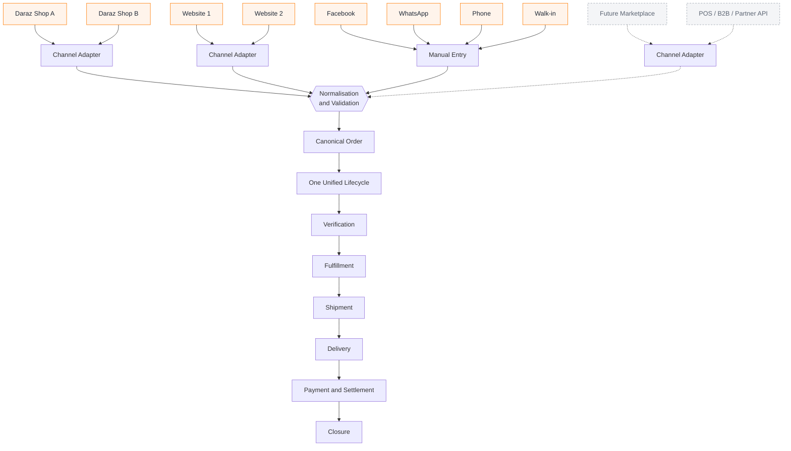
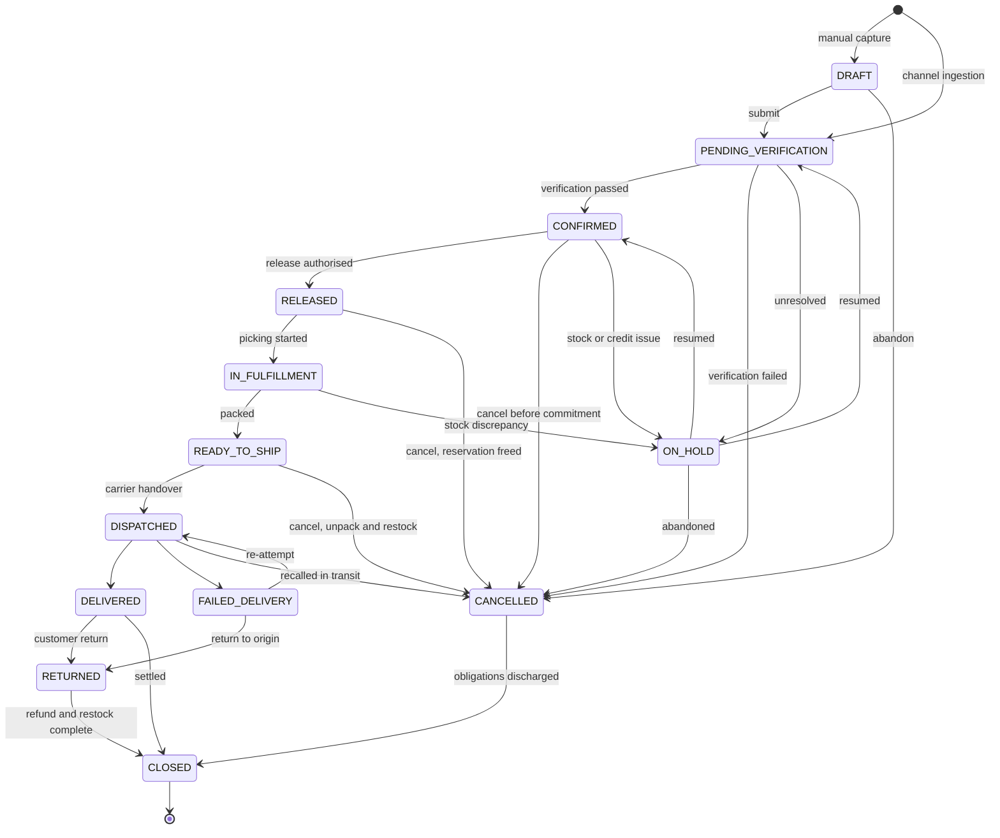
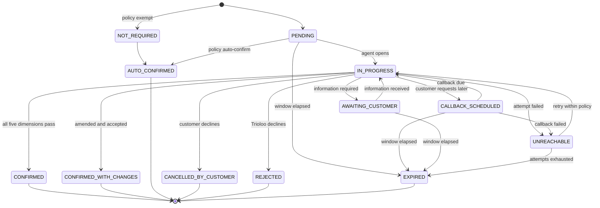
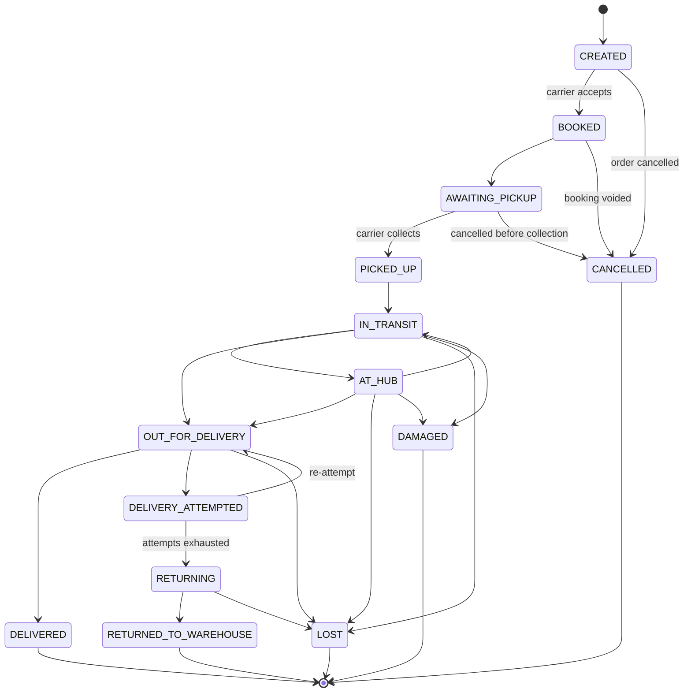
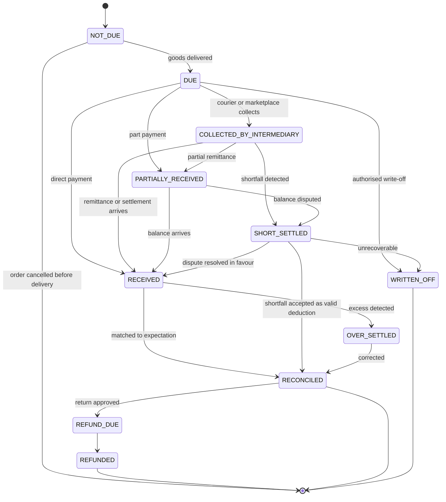
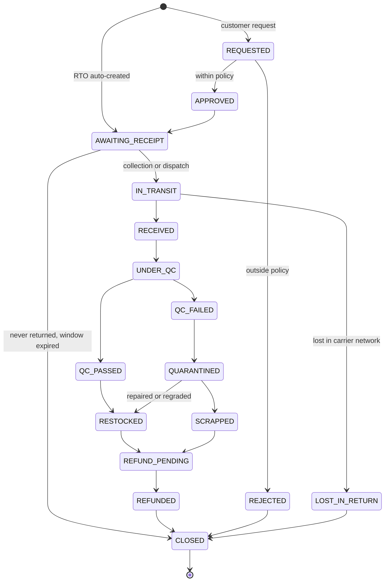
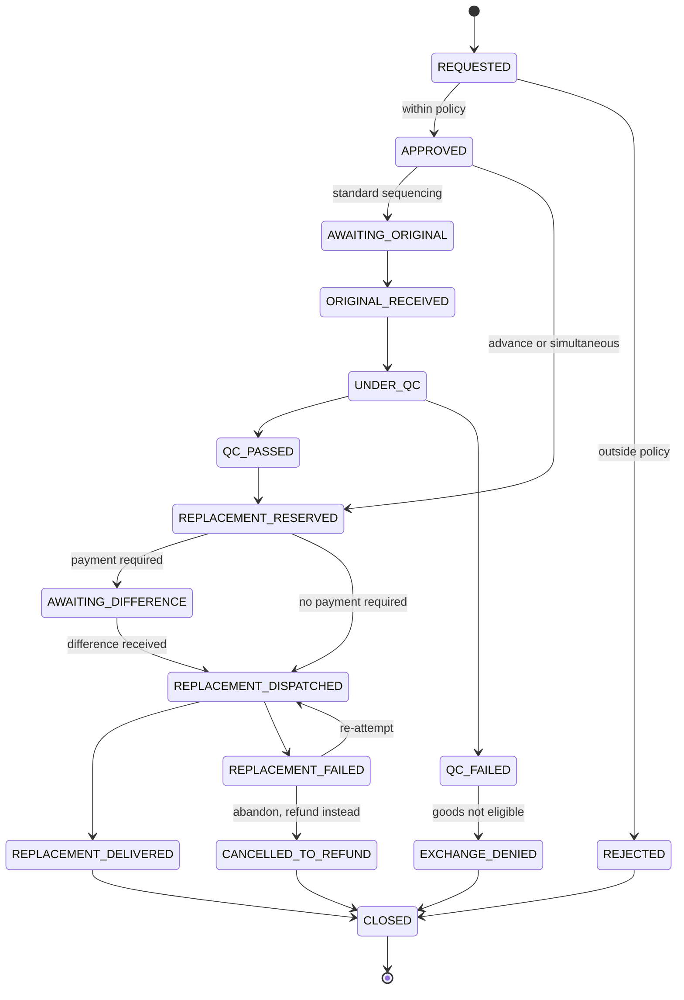
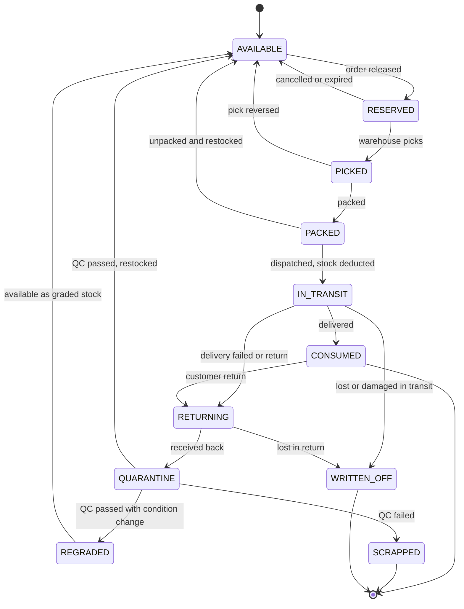
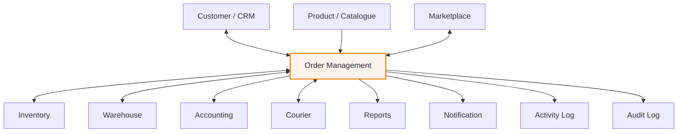

# Order Management — Business Architecture

**Owner:** Trioloo Technology · **Module:** Order Management · **Status:** Canonical
**Version:** 1.21.0 · **Ratified:** 2026-08-04 · **Amended:** 2026-08-23 (Marketplace Order ingestion MVP operating rules — `BR-178`–`BR-183`, §29: backfill in 7-day chunks to a 3-month cap, a 15-minute configurable cadence with an overlapping watermark deduplicated by `order_id`, one explicit channel instance per job, `ACTIVE` shops only, no in-job retry, and the webhook explicitly out of MVP) · **Amended:** 2026-08-10 (Order sync authority — `BD-498`, §28) · **Amended:** 2026-08-10 (Order confirmation attribution — `BD-497`, §27) · **Amended:** 2026-08-09 (pre-freeze reconciliation note at §18.2 — documentary only) · **Amended:** 2026-08-08 (Sales reconciliation; immutability `BD-254`; serial policy `BD-242`; discount policy `BD-255`; Warehouse & Assembly §17; Purchase & Supplier §18; revenue recognition `BD-304`; Accounting §19; Marketplace §9.11; Return & Exchange §9.12)

---

## Document Control

### Purpose of this document

This is the **single source of truth for the business architecture** of the Trioloo ERP Order Management module. All future backend, frontend, database, API, workflow, and integration work derives from it. Where an implementation disagrees with this document, the implementation is wrong.

### What this document is

A specification of **business behaviour**: what happens, in what order, who is responsible, what is permitted, what is forbidden, and why. It describes the domain in terms that would remain true if the entire technology stack were replaced.

### What this document is not

It contains **no code, no database schema, no API contracts, no UI specification, and no technology decisions.** See §22 (Out of Scope) for the full exclusion list. UI is governed separately by [`DESIGN_CONSTITUTION.md`](DESIGN_CONSTITUTION.md).

### How to read it

- **Business Rules** are numbered `BR-nnn` and are binding. They are the enforceable content of this document.
- **States** are written in `UPPER_SNAKE_CASE`. State names are canonical vocabulary — the same word means the same thing in every conversation, ticket, and system.
- **Diagrams** illustrate the rules; where a diagram and a rule disagree, the rule governs.
- **Open questions** (Appendix C) mark points inferred from the current system that require confirmation. They are not settled architecture.

### Design longevity principle

This document is written to survive ten years of business change. It achieves that by specifying the **invariants** of order processing and deliberately refusing to specify anything that varies. Channels, couriers, marketplaces, payment instruments, and warehouses are all treated as **configurable participants**, never as architectural branches. A new marketplace, a new courier, or a new sales model must be absorbable by configuration and adapters — never by modifying the core lifecycle.

---

## Table of Contents

| § | Section |
|---|---|
| 1 | Module Purpose |
| 2 | Business Goals |
| 3 | Supported Sales Channels |
| 4 | Unified Order Management Philosophy |
| 5 | Order Sources |
| 6 | Order Lifecycle |
| 7 | Verification Workflow |
| 8 | Fulfillment Workflow |
| 9 | Shipment Workflow |
| 10 | Delivery Workflow |
| 11 | Payment Workflow |
| 12 | Return Workflow |
| 13 | Exchange Workflow |
| 14 | Inventory Relationship |
| 15 | Activity Log |
| 16 | Audit Log |
| 17 | Business Actors |
| 18 | State Machines |
| 19 | Business Rules |
| 20 | Future Scalability |
| 21 | Module Relationships |
| 22 | Out of Scope |
| A–D | Appendices: Glossary · Rule Index · Open Questions · Amendment Record |

---

# 1. Module Purpose

## 1.1 Statement of purpose

The Order Management module is the **commercial spine of the Trioloo ERP**. It exists to take a customer's intent to buy — arriving from any channel, in any format, through any intermediary — and carry it deterministically to one of a small number of defined commercial outcomes, while keeping inventory, money, and customer obligations correct at every intermediate point.

Everything else in the ERP is either an input to this module or a consequence of it.

## 1.2 What the module owns

| Owns | Meaning |
|---|---|
| The order record | The canonical, channel-neutral representation of a customer's commitment |
| The order lifecycle | The legal sequence of states an order may pass through |
| Verification | The decision that an order is real, correct, and fulfillable |
| Release authority | The decision to commit company inventory to an order |
| Fulfillment orchestration | Instructing the warehouse and tracking its progress |
| Shipment orchestration | Assigning carriers and tracking movement to the customer |
| Commercial outcome | Delivered, returned, exchanged, cancelled, closed |
| Receivable position | What is owed to Trioloo for each order, and whether it arrived |
| Order-level profitability | Sale, cost, charges, received, margin |

## 1.3 What the module does not own

| Does not own | Owned by |
|---|---|
| Stock quantities and valuation | Inventory |
| Product definitions, pricing rules, warranty terms | Product / Catalogue |
| Customer master data and history | Customer / CRM |
| Ledger postings and financial statements | Accounting |
| Physical warehouse operations | Warehouse |
| Courier network and tracking infrastructure | Courier (external) |
| Marketplace listings, promotions, buyer relationship | Marketplace (external) |

The Order module **instructs** and **observes** these domains. It does not absorb them. This boundary is what allows each to evolve independently.

## 1.4 The problem this module solves

Trioloo sells physical, high-value, serialized electronics through channels it does not control, to customers who mostly pay on delivery, via couriers who mostly handle the money, on marketplaces that settle weeks later net of deductions.

Each of those facts creates a failure mode:

| Fact | Failure mode without this module |
|---|---|
| Multiple independent channels | Each channel processed differently; no single view of the business |
| Goods are high value and serialized | Units untraceable; warranty and RMA unprovable |
| Payment on delivery | Revenue recognised that never arrives |
| Courier holds the cash | Cash in transit invisible; remittance shortfalls undetected |
| Marketplace settles later, net | True margin unknown; deductions unchallenged |
| Marketplace can cancel unilaterally | ERP and marketplace silently diverge |
| Very high cancellation rate | Inventory committed to orders that never complete |

The module's purpose is to make each of these **visible, attributable, and reconcilable**.

---

# 2. Business Goals

## 2.1 Primary goals

**G-1 — One operational truth.**
Every order from every channel is visible in one place, in one vocabulary, with one lifecycle. Staff learn the process once. Management sees the whole business without consolidating reports by hand.

**G-2 — No order is lost or forgotten.**
Every order is in exactly one state at all times, and every state has a defined owner and a defined exit. An order can never be in limbo, and no order can sit unattended without becoming visible as an exception.

**G-3 — Inventory accuracy.**
Physical stock, system stock, and committed stock agree. Goods committed to orders are not sold twice; goods returned are not lost; goods damaged are not silently absorbed.

**G-4 — Money is reconciled, not assumed.**
An order is not commercially complete when it is delivered. It is complete when the money owed for it has actually arrived and been matched. COD remittance and marketplace settlement are tracked to the taka against expectation.

**G-5 — True profitability per order.**
Margin is computed from **what was actually received** after commissions, vouchers, shipping charges and deductions — not from the list price. A channel that looks profitable at list price may be loss-making after settlement, and the module must reveal that.

**G-6 — Cancellation control.**
Verification exists to detect invalid orders before they consume inventory, labour, and courier cost. Reducing the cancellation rate and moving cancellations *earlier* in the lifecycle is a primary commercial objective, not a side effect.

**G-7 — Complete accountability.**
Every state change is attributable to an actor with a timestamp and a reason. The question "who did this, when, and why" always has an answer.

## 2.2 Operational goals

| Goal | Description |
|---|---|
| G-8 | Handle unlimited channels, marketplaces, couriers, and warehouses through configuration |
| G-9 | Support both marketplace-controlled and Trioloo-controlled fulfillment without separate workflows |
| G-10 | Degrade gracefully — every automated path has a manual equivalent, so no integration outage stops the business |
| G-11 | Provide the verification team a single prioritised queue |
| G-12 | Make exceptions loud: unreachable customers, failed deliveries, settlement shortfalls, missing stock |
| G-13 | Preserve full order history immutably for dispute, audit, and warranty |

## 2.3 Success measures

| Measure | Definition |
|---|---|
| Verification conversion | Confirmed ÷ orders entering verification |
| Time to confirmation | Order receipt → verification outcome |
| Cancellation stage profile | Share of cancellations occurring before release vs after dispatch |
| Fulfillment cycle time | Release → dispatch |
| Delivery success rate | Delivered ÷ dispatched |
| Return rate | By channel, product, and reason |
| Settlement accuracy | Actual received ÷ expected receivable |
| Settlement lag | Delivery → cash reconciled |
| Realised margin | Received − cost − charges, per order and per channel |
| Inventory shrinkage | Units lost, missing, or damaged in the order pipeline |

> **Observed baseline.** The live system shows 173 of 193 orders cancelled. Whether or not that figure reflects production data, an operation with a cancellation rate of that order of magnitude has its economic centre of gravity in **§7 Verification**, not in fulfillment. The architecture treats verification accordingly: as the primary commercial control point of the module, resourced and instrumented as such.

---

# 3. Supported Sales Channels

## 3.1 Channel taxonomy

A **channel** is a route through which a customer's order reaches Trioloo. Channels are classified along four independent axes. These axes — not the channel's name — determine how the order is processed.

| Axis | Values | Determines |
|---|---|---|
| **Order origin** | Integrated · Manual · Imported | How the order enters the ERP |
| **Customer ownership** | Trioloo-owned · Marketplace-owned | Whether Trioloo may contact the customer directly |
| **Fulfillment control** | Trioloo-fulfilled · Marketplace-fulfilled | Who arranges shipment |
| **Settlement mode** | Direct · Intermediated | Whether money reaches Trioloo directly or via a third party |

> **BR-001 — Channel behaviour is derived from attributes, never from channel identity.** No workflow, rule, or decision may branch on a channel's name. A rule may branch on *"customer ownership = marketplace-owned"*; it may never branch on *"channel = Daraz"*. This single rule is what allows unlimited channels to be added without changing the core.

## 3.2 Channel register

### Currently operating

| Channel | Origin | Customer | Fulfillment | Settlement | Notes |
|---|---|---|---|---|---|
| **Daraz** (multiple shops) | Integrated | Marketplace-owned | Marketplace-fulfilled | Intermediated | Each shop is a distinct channel instance under one channel type. Daraz holds the buyer relationship and may cancel unilaterally |
| **Website** (multiple sites) | Integrated | Trioloo-owned | Trioloo-fulfilled | Direct | Each site is a distinct channel instance. Full control end to end |
| **Facebook** | Manual | Trioloo-owned | Trioloo-fulfilled | Direct | Conversational; order data is incomplete at capture and must be completed during verification |
| **WhatsApp** | Manual | Trioloo-owned | Trioloo-fulfilled | Direct | As Facebook. Often used for high-value consultative sales |
| **Phone** | Manual | Trioloo-owned | Trioloo-fulfilled | Direct | Captured by the agent during the call; verification may be satisfied inline |
| **Walk-in** | Manual | Trioloo-owned | Self-pickup | Direct | Customer physically present; verification and delivery are simultaneous |

### Planned

| Channel | Origin | Customer | Fulfillment | Settlement | Absorption |
|---|---|---|---|---|---|
| **Future marketplaces** | Integrated | Marketplace-owned | Either | Intermediated | New channel instance + adapter. No core change |
| **POS / retail counter** | Manual | Trioloo-owned | Immediate handover | Direct | Compressed lifecycle (§6.6) |
| **B2B / wholesale** | Manual or Integrated | Trioloo-owned | Trioloo-fulfilled | Direct, on credit terms | Adds credit-limit and payment-terms gates (§11.7) |
| **Partner / reseller API** | Integrated | Partner-owned | Trioloo-fulfilled | Direct, on terms | Behaves as a marketplace with Trioloo fulfillment |

## 3.3 Channel instances

A **channel type** defines behaviour; a **channel instance** is one operating account. Trioloo runs multiple Daraz shops and multiple websites, and each is a separate instance.

> **BR-002 — Every order records both its channel type and its channel instance.** Reporting, settlement, and reconciliation all operate at instance level. "Daraz" is never a sufficient attribution, because settlement arrives per shop and margin differs per shop.

Each instance carries its own configuration: credentials, commission structure, settlement cycle, default warehouse, courier preference, return policy window, and verification policy.

## 3.4 Channel authority matrix

Different channels grant Trioloo different authority. This matrix is the reference for every "can we do X?" question.

| Decision | Trioloo-owned channel | Marketplace-owned channel |
|---|---|---|
| Contact the customer directly | Yes | Only within marketplace policy; often prohibited |
| Modify order lines | Yes, before release | No — modification is a marketplace-side action |
| Change price | Yes, before release | No |
| Cancel the order | Yes, before dispatch | Yes, but must be pushed to the marketplace |
| Be cancelled *by* the counterparty | No | **Yes, at any time, without notice** |
| Choose the courier | Yes | Usually no — marketplace assigns |
| Set the delivery address | Yes | No — supplied by marketplace, may be a collection point |
| Collect the money | Yes | No — marketplace/courier collects and remits |
| Set the return window | Yes | No — marketplace policy governs |
| Own the customer record | Yes | No — customer belongs to the marketplace |

> **BR-003 — For any field where an external party holds authority, that party's value is authoritative and Trioloo's copy is a mirror.** Local edits to mirrored fields are prohibited. Divergence between mirror and source is an exception requiring resolution, never a local override.
>
> ⚠ **SCOPE CLARIFIED 2026-08-10 (`BD-498`, `BR-168` – `BR-176`) — clarified, NOT amended** (`DOC-009`). **The rule text above is unchanged and stands in full.** **Its antecedent is *“where an external party holds authority”*** — and **for an `ERP_MANAGED` Order the external party no longer holds authority over that Order's operational content** (§28). ✅ **`BR-003` therefore continues to bind every `API_MANAGED` Order and every externally-authoritative fact in `BR-171`; it simply no longer reaches operational content after takeover.** **`SYS-010` and `API-022` restate this rule and inherit the same clarification.**

## 3.5 System of record by data domain

| Data domain | System of record | Trioloo's role |
|---|---|---|
| Marketplace order existence and status | Marketplace | Mirror |
| **Marketplace order operational content** — *added 2026-08-10, `BD-498`* | **Marketplace while `API_MANAGED`; Trioloo once `ERP_MANAGED`** | **Mirror, then Owner** — §28 |
| Marketplace settlement amounts and deductions | Marketplace | Mirror, then reconcile |
| Buyer identity on marketplace orders | Marketplace | Mirror |
| Shipment tracking events | Courier | Mirror |
| Direct-channel order content | **Trioloo ERP** | Owner |
| Verification outcome and history | **Trioloo ERP** | Owner |
| Inventory, serials, and stock movement | **Trioloo ERP** | Owner |
| Product cost and realised margin | **Trioloo ERP** | Owner |
| Warehouse operations | **Trioloo ERP** | Owner |
| Internal activity and audit history | **Trioloo ERP** | Owner |

> **BR-004 — Trioloo is always the system of record for inventory, cost, and margin, on every channel without exception.** A marketplace knows what it paid; only Trioloo knows what the goods cost and what was actually earned.

---

# 4. Unified Order Management Philosophy

## 4.1 The principle

> **Every order, from every source, enters one central Order module and is processed through one unified lifecycle.**

Channel differences are absorbed **at the boundary**, during ingestion. Past that boundary, an order is an order.

## 4.2 Why

**Reason 1 — Operational learnability.** One process means staff are interchangeable across channels. A new channel requires no retraining.

**Reason 2 — Prevention of process drift.** Parallel per-channel workflows diverge over time. Each divergence is a place where a rule is enforced in one path and forgotten in another. Unification makes drift structurally impossible.

**Reason 3 — A single inventory truth.** Stock is physical and shared. If channels held separate order pipelines, each would reserve stock independently and oversell. One pipeline means one queue against one pool.

**Reason 4 — Comparable economics.** Channel profitability can only be compared if cost, charges, and settlement are computed identically everywhere.

**Reason 5 — Linear cost of growth.** Adding the eleventh channel must cost what the second cost. That is only true if channels are configuration, not code paths.

**Reason 6 — Coherent audit.** One lifecycle produces one audit vocabulary. Disputes, warranty claims, and tax questions are answered the same way regardless of origin.

## 4.3 The ingestion boundary

**Adapter responsibilities** — everything channel-specific lives here and nowhere else:

| Responsibility | Description |
|---|---|
| Acquisition | Obtain the order from the channel by whatever means that channel provides |
| Translation | Convert channel vocabulary into canonical vocabulary (status names, payment methods, address formats) |
| Product mapping | Resolve the channel's product identifier to a Trioloo catalogue item where possible |
| Enrichment | Attach channel instance, external references, marketplace metadata |
| Validation | Reject structurally invalid orders before they enter the lifecycle |
| Idempotency | Guarantee that re-receiving the same channel order does not create a duplicate |
| Outbound reflection | Push Trioloo-side decisions back to the channel where the channel expects them |

> **BR-005 — Channel-specific logic exists only in adapters.** No downstream stage may contain channel-conditional behaviour. If a downstream stage needs to behave differently, the difference must be expressed as a canonical attribute (§3.1) set by the adapter.

## 4.4 The canonical order

Every order, regardless of origin, carries the same conceptual content. This is a description of *meaning*, not of storage.

| Group | Content |
|---|---|
| Identity | Internal order number; channel type and instance; external references (marketplace order ID, shop ID, seller reference); invoice number |
| Customer | Name, contact numbers, delivery address, delivery instructions, customer record link where permitted |
| Commercial | Order lines, quantities, unit prices, discounts, vouchers, order value, currency |
| Economics | Line cost, channel charges, expected receivable, actual received, realised margin |
| Logistics | Source warehouse, fulfillment method, courier, tracking references, delivery type |
| Payment | Collection mode, payment status, amount paid, amount outstanding |
| Process | Order state, verification state, shipment state, payment state, return state, inventory commitment state |
| History | Full activity log and audit trail |

## 4.5 Catalogued and non-catalogued lines

The current system distinguishes a **stock item** (selected from the Trioloo catalogue) from a **marketplace item** (a product name typed manually). This distinction is architecturally significant and is formalised here.

| | Catalogued line | Non-catalogued line |
|---|---|---|
| Product identity | Linked to a catalogue item | Free text only |
| Inventory | Reserves and deducts stock | **Cannot reserve or deduct** |
| Cost | Known | Unknown — defaults to zero |
| Margin | Computable | **Not computable** |
| Serial tracking | Applies where the product is serialized | Not possible |
| Warranty | Enforceable | Not enforceable |
| Returns | Full workflow | Refund only; no restock |

> **BR-006 — A non-catalogued line may not reserve or deduct inventory.**
>
> 🔴 **BOUNDED 2026-08-11 by `BR-177`** (`GAP-129`, Option C). **The rule stands in full and its wording is unchanged** — **what `BR-177` establishes is WHEN a line stops being unresolved.**

> **BR-177 — ✅ A CONFIRMED ORDER-SPECIFIC BUILD CONFIGURATION RESOLVES A LINE'S BUILD REQUIREMENT. Ratified 2026-08-11.**
>
> **`BR-006` exists to stop a RAW, unresolved line committing stock against a product nobody has identified.** ✅ **That protection is untouched.**
>
> **a.** 🔴 **A line with no resolved build specification still reserves NOTHING** — **and a `DRAFT` `E-103` is not a resolved specification** (`WHS-077`, `INV-103.2`).
> **b.** ✅ **A line whose build requirement is carried by a CONFIRMED `E-103` is resolved FOR BUILD PURPOSES**, and its components participate in the ordinary reservation and assembly workflow through its `E-065` Build Job (`IVN-054`, `WHS-076`).
> **c.** ⚠ **This changes nothing else about the line.** **It acquires no Sellable Product** (`INV-32.1`), **no catalogued flag, no price, no margin and no catalogue identity.** **An unmapped line remains economically incomplete and its margin remains UNKNOWN, not zero** (`BR-007`, `SYS-034`, `INV-32.4`), **and `BR-008`'s open mapping task is unaffected.**
> **d.** 🔴 **Reservation and consumption remain Inventory's and Warehouse's** (`IVN-015`, `WHS-078`). **No order rule creates, times or performs a stock movement.**
>
> **BR-007 — An order containing any non-catalogued line is flagged as economically incomplete.** Its margin is not trustworthy and must be excluded from margin reporting until every line is mapped to a catalogue item.
>
> **BR-008 — Non-catalogued lines are a transitional state, not a permanent one.** Each carries an open mapping task. The count of unmapped lines is an operational metric that should trend to zero.

The observed line `Sale ৳48 · Cost ৳0 · Charges ৳30 · Received ৳18 · Margin ৳0` illustrates the consequence exactly: the revenue side is fully known, the cost side is absent, and the resulting margin figure is not a profit of zero — it is **an unknown displayed as zero**. Distinguishing "zero" from "unknown" is a requirement of the module, because summing unknowns as zeros silently overstates profitability.

---

# 5. Order Sources

## 5.1 Source profiles

### 5.1.1 Daraz (marketplace, multiple shops)

| Aspect | Behaviour |
|---|---|
| Entry | Integrated ingestion per shop; each shop a separate channel instance |
| Data quality | Structurally complete — address, contact, and payment method supplied |
| Customer contact | Restricted by marketplace policy |
| Verification | Reduced or policy-driven; the marketplace has performed its own checks |
| External references | Marketplace order ID, shop ID (SBID), parcel ID, tracking number |
| Delivery address | May be a residential address **or a marketplace collection point** (e.g. a Digibox at a metro station) |
| Fulfillment | Marketplace-assigned courier; Trioloo picks, packs, and hands over |
| Cancellation | **Marketplace may cancel at any time, and may subsequently restore** |
| Settlement | Intermediated, delayed, net of commission, vouchers, and shipping charges |
| Distinct risk | ERP/marketplace divergence; settlement shortfall; unilateral status change |

### 5.1.2 Website (multiple sites)

| Aspect | Behaviour |
|---|---|
| Entry | Integrated ingestion per site |
| Data quality | Complete but **self-declared and unverified** |
| Customer contact | Unrestricted |
| Verification | **Full verification mandatory** — the primary defence against invalid orders |
| Fulfillment | Trioloo-selected courier |
| Cancellation | Trioloo controls; customer may request |
| Settlement | Direct — COD via courier remittance, or prepaid |
| Distinct risk | Fake and duplicate orders; incorrect addresses; COD refusal at the door |

### 5.1.3 Facebook and WhatsApp (conversational)

| Aspect | Behaviour |
|---|---|
| Entry | Manual capture by a sales agent from a conversation |
| Data quality | **Incomplete by nature** — partial address, informal product naming, negotiated price |
| Customer contact | Already established; the conversation itself is the contact channel |
| Verification | Full; often partially satisfied by the originating conversation |
| Product identification | High risk of non-catalogued lines (§4.5) |
| Price | May be negotiated, requiring authority checks |
| Distinct risk | Ambiguous product identity; unrecorded verbal commitments; price leakage |

### 5.1.4 Phone

| Aspect | Behaviour |
|---|---|
| Entry | Manual capture during a live call |
| Data quality | Good — the agent can ask clarifying questions in real time |
| Verification | **May be satisfied inline**, since the customer is on the line and all verification dimensions can be confirmed during capture |
| Distinct risk | Transcription errors in address and contact number |

### 5.1.5 Walk-in

| Aspect | Behaviour |
|---|---|
| Entry | Manual capture at the counter |
| Verification | Satisfied by the customer's physical presence |
| Fulfillment | Immediate handover; no shipment |
| Payment | Immediate and direct |
| Lifecycle | **Compressed** (§6.6) |
| Distinct risk | Stock accuracy at the counter; correct serial capture under time pressure |

## 5.2 Source comparison

| | Daraz | Website | Social | Phone | Walk-in |
|---|---|---|---|---|---|
| Origin | Integrated | Integrated | Manual | Manual | Manual |
| Data complete at entry | Yes | Yes | No | Partly | Yes |
| Customer contactable | Restricted | Yes | Yes | Yes | Present |
| Verification depth | Reduced | Full | Full | Inline | Implicit |
| Trioloo picks courier | No | Yes | Yes | Yes | N/A |
| Trioloo collects money | No | Yes | Yes | Yes | Yes |
| Settlement | Delayed, net | Direct | Direct | Direct | Immediate |
| External cancellation risk | **High** | None | None | None | None |
| Non-catalogued line risk | Medium | Low | **High** | Medium | Low |

## 5.3 What is common to all sources

Despite these differences, **every order without exception**:

1. Receives a Trioloo order number and enters the canonical lifecycle.
2. Passes a verification decision — even if that decision is "not required" under policy.
3. Requires explicit release before consuming inventory.
4. Reserves inventory for catalogued lines before fulfillment.
5. Produces a fulfillment instruction to a warehouse.
6. Reaches a defined commercial outcome.
7. Carries a receivable that must be reconciled to actual money.
8. Records realised margin.
9. Maintains a complete activity and audit history.
10. Closes only when every sub-process is terminal.

> **BR-009 — No source is exempt from any of the ten common obligations.** Sources differ in *how* an obligation is satisfied, never in *whether* it applies.

---

# 6. Order Lifecycle

## 6.1 Lifecycle stages

| Stage | Question answered | Owner |
|---|---|---|
| Capture | What did the customer ask for? | Channel adapter / Sales |
| Verification | Is this order real, correct, and fulfillable? | Call Centre |
| Release | Do we commit company inventory to it? | Sales / Admin |
| Fulfillment | Assemble the physical goods | Warehouse |
| Shipment | Move the goods to the customer | Courier / Warehouse |
| Delivery | Did the customer receive them? | Courier / Customer |
| Settlement | Did the money arrive? | Accounts |
| Closure | Is every obligation discharged? | System |

## 6.2 Principal order states

| State | Meaning | Exit owner |
|---|---|---|
| `DRAFT` | Being captured; not yet a commitment | Sales |
| `PENDING_VERIFICATION` | Awaiting the verification decision | Call Centre |
| `CONFIRMED` | Verified and accepted; not yet committed to stock | Sales / Admin |
| `RELEASED` | Authorised to consume inventory; queued to warehouse | Warehouse |
| `IN_FULFILLMENT` | Picking and packing under way | Warehouse |
| `READY_TO_SHIP` | Packed, awaiting carrier handover (**RTS**) | Warehouse |
| `DISPATCHED` | Handed to the carrier | Courier |
| `DELIVERED` | Received by the customer | Accounts |
| ~~`PARTIALLY_DELIVERED`~~ | ❌ **REMOVED 2026-08-09 — `BD-442`.** Partial delivery is not an Order lifecycle outcome | — |
| `FAILED_DELIVERY` | Delivery attempted and failed | Call Centre |
| `RETURNED` | Goods came back to Trioloo | Warehouse / Accounts |
| `CANCELLED` | Terminated before delivery | — |
| `CLOSED` | All sub-processes terminal; commercially complete | — |
| `ON_HOLD` | Progress deliberately suspended | Whoever placed the hold |
| **`COURIER_BOOKED`** | **Consignment booked with the courier — the last point at which the order may be changed** (`BD-041`) | Warehouse |

> **BR-010 — `CLOSED` is the only clean terminal state, and it is reached only when every sub-machine is terminal.** Delivery does not close an order. An order delivered but not yet settled remains open. This is the module's most commonly misunderstood rule and the one that protects revenue accuracy.

### 6.2.1 Corrections and additions from discovery

> ## ⚠ BR-079 — "RTS" means two different things in the business's vocabulary
>
> **`BD-071` surfaced a terminology collision that this document does not currently distinguish.**
>
> | Meaning | Direction | Used by |
> |---|---|---|
> | **Ready To Ship** — packed, awaiting carrier handover | Outbound | This document, §6.2, §8, Appendix glossary |
> | **Return To Seller** — goods coming back undelivered | **Inbound** | The business, when discussing returns (`BD-071`, `BD-084`) |
>
> These are opposite directions of travel sharing one abbreviation. The architecture's `READY_TO_SHIP` is unambiguous and **is retained**; the business's inbound "RTS" corresponds to what this document calls **RTO — Return To Origin** (`BR-044`).
>
> **No state is renamed.** The collision is recorded so that requirements written in business language are not mapped to the wrong state. `BD-214` (priority) asks the business which term it wants standardised.

> **BR-080 — `NOT_RELEASED` is withdrawn.** `BD-039` states the business is dropping "Not Released" in the new ERP and gives six explicit statuses in its place. **This closes `GAP-021`**, which recorded that the state was specified but never released. The rule number is retained per `SYS-002`; the state is not to be implemented.

> **BR-081 — Release is a manual decision made by a permissioned user** (`BD-040`) — currently owners and administrators. It is not automatic and not rule-derived. **This closes part of `GAP-019`** (manual vs automatic transitions). Five pre-release checks are recorded at `BD-040`.

> **BR-082 — Order changes are permitted up to `COURIER_BOOKED`, and not after** (`BD-041`). This **matches `BR-011`** in intent but moves the boundary: `BR-011` set it at dispatch. Booking precedes dispatch, so the business's rule is *stricter*. The stricter boundary governs.

> ## ⚠ Unresolved — the release gate and the point of reservation
>
> `BD-033` describes the operational sequence and it does **not** match §6.2 in two respects:
>
> | Architecture | Business (`BD-033`) |
> |---|---|
> | `CONFIRMED` → `RELEASED` is an explicit gate authorising inventory consumption | **No release gate was described in the flow** |
> | Reservation occurs at release (`BR-052`) | **Reservation occurs at RTS** |
>
> `BD-105` then states allocation happens **at confirmed order**, which agrees with neither. Three statements, three different points.
>
> **Not resolved here — this is a blocking question.** `BD-177`, `BD-178` and `BD-252` ask it. Until answered, `BR-052` stands as written because no single replacement is confirmed.

## 6.3 Lifecycle diagram

## 6.4 Cancellation authority by stage

| Stage | Customer | Trioloo | Marketplace | Consequence |
|---|---|---|---|---|
| `DRAFT` | — | Yes | — | None |
| `PENDING_VERIFICATION` | Yes | Yes | Yes | None |
| `CONFIRMED` | Yes | Yes | Yes | None |
| `RELEASED` | Yes | Yes | Yes | Reservation released |
| `IN_FULFILLMENT` | Yes | Yes | Yes | Picking stopped; goods restocked |
| `READY_TO_SHIP` | Yes | Yes | Yes | Unpack, restock, void shipping label |
| `DISPATCHED` | Request only | Recall attempt | Yes | Becomes a **return**, not a cancellation |
| `DELIVERED` | **No** | **No** | **No** | Only a return or exchange is possible |

> **BR-011 — After dispatch, cancellation is no longer available; the correct instrument is a return.** Cancellation implies nothing left the building. Once goods are in the courier network, the physical reality is a return and must be modelled as one so that inventory and money follow the return path.

## 6.5 External cancellation and restoration

Marketplace-owned channels may cancel an order without notice and may later restore it. This is a normal, expected event.

**Cancellation received from marketplace:**

1. Adapter receives the cancellation and records the external event with its timestamp.
2. System determines the current internal stage.
3. If not yet dispatched: order moves to `CANCELLED`; reservations released; any pick or pack instruction is recalled; packed goods are unpacked and restocked.
4. If already dispatched: order is **not** cancelled. It is flagged `EXTERNALLY_CANCELLED_IN_TRANSIT` and routed to the return workflow, because goods are physically in the network.
5. Accounts is notified that expected settlement is now void or disputed.
6. Full event recorded in activity and audit logs.

**Restoration received from marketplace:**

1. Adapter receives the restoration event.
2. The order is **not** silently reinstated. It re-enters `PENDING_VERIFICATION`.
3. Stock availability is re-checked — the reservation was released and the goods may since have been sold.
4. If stock is unavailable, the order is raised as an exception for commercial decision rather than being auto-confirmed.
5. If the original goods were already restocked and are still available, the order proceeds normally from verification.

> **BR-012 — A restored order re-enters verification and re-checks stock. It never resumes at its prior stage.** The world changed while the order was cancelled; the order must be re-validated against the world as it now is.

## 6.6 Compressed lifecycle — walk-in and POS

Where the customer is physically present and takes the goods immediately, the lifecycle is compressed but **not bypassed**. Every stage still occurs; several are satisfied instantly.

| Stage | How satisfied |
|---|---|
| Capture | At the counter |
| Verification | Implicit — customer present, `AUTO_CONFIRMED` with reason `CUSTOMER_PRESENT` |
| Release | Immediate |
| Fulfillment | Goods taken from counter stock; serials captured |
| Shipment | Not applicable — fulfillment method `SELF_PICKUP` |
| Delivery | Immediate, at handover |
| Settlement | Immediate and direct |
| Closure | Same day |

> **BR-013 — The compressed lifecycle skips no stage; it satisfies stages instantly.** Every order, including a counter sale, produces the same audit trail, the same inventory movements, and the same margin record.

---

# 7. Verification Workflow

## 7.1 Purpose

Verification is the **commercial gate** of the module. It answers one question before Trioloo spends anything on the order:

> Is this a real customer, who genuinely wants these products, at this address, at this price, and will they accept and pay for the delivery?

Given the observed cancellation profile, verification is where the money is saved. Each order that fails verification *before* release costs nothing beyond a phone call; each order that fails *after* dispatch costs picking, packing, courier charges in both directions, handling risk on high-value electronics, and lost availability of reserved stock.

## 7.2 Verification policy by channel

> **BR-014 — Every order receives a verification decision.** "Not required" is itself a decision, recorded with its reason. No order proceeds without one.

| Channel type | Policy | Rationale |
|---|---|---|
| Website | **Full verification mandatory** | Self-declared, unverified data; highest invalid-order risk |
| Facebook / WhatsApp | **Full verification mandatory** | Incomplete capture; ambiguous product identity |
| Phone | **Inline verification** | All dimensions confirmable during the capture call |
| Walk-in | **Auto-confirmed** — `CUSTOMER_PRESENT` | Physical presence satisfies every dimension (confirmed `BD-022`) |
| **Marketplace (Daraz)** | **Full verification mandatory — identical to website** | **Corrected 2026-08-06 — see `BR-071`** |
| B2B / wholesale | **Full, plus credit check** | Adds commercial exposure (§11.7) |

High-value orders may be subject to additional verification regardless of channel, since desktops and televisions carry significant unit value.

> ## BR-071 — Marketplace orders receive full verification, including direct customer contact
>
> **Corrected from business discovery.** This document previously modelled marketplace orders as receiving *reduced, policy-driven* verification on the assumption that the marketplace had already validated them and prohibited contact. **The business states the opposite, confirmed three times independently:**
>
> | Answer | Statement |
> |---|---|
> | `BD-024` | Marketplace orders carry six recurring data-quality problems, including product-matching errors |
> | `BD-030` | **Daraz customers are contacted directly by phone for verification** |
> | `BD-038` | **Daraz and website orders follow identical verification** |
>
> The original assumption was not merely conservative — it was inverted. Daraz data quality is *worse* than website data, not better, so it warrants more scrutiny rather than less.
>
> `AUTO_CONFIRMED` with reason `MARKETPLACE_VERIFIED` is **withdrawn as a marketplace policy**. The `AUTO_CONFIRMED` state itself is retained — it remains correct for walk-in (`CUSTOMER_PRESENT`, `BD-022`).

## 7.3 The five verification dimensions

Every full verification confirms five dimensions. All five must pass.

| # | Dimension | Confirms | Failure consequence |
|---|---|---|---|
| 1 | **Customer** | The person exists, is reachable, and placed this order | Fake or mistaken order — cancel |
| 2 | **Address** | Deliverable, complete, within a serviced area, correctly identified | Failed delivery, courier return |
| 3 | **Product** | The exact model and specification intended | Wrong item shipped; return and re-ship cost |
| 4 | **Quantity** | The intended count per line | Over- or under-supply; margin and stock error |
| 5 | **Delivery** | Timing, payable amount, payment mode, recipient availability | Refusal at the door on a COD delivery |

For Trioloo's catalogue, dimension 3 carries elevated weight. Desktop computers and smart televisions have close model variants — screen size, panel type, processor, memory, storage — where a small naming error produces an entirely different product at a materially different cost. Verification must confirm the **exact specification**, not merely the product family.

Dimension 5 carries elevated weight on COD, which is the dominant collection mode: the payable amount must be stated explicitly and acknowledged, because a customer surprised at the door refuses the parcel and Trioloo absorbs the round-trip cost.

## 7.4 Verification states

| State | Meaning |
|---|---|
| `NOT_REQUIRED` | Policy exempts this order; reason recorded |
| `PENDING` | Queued, not yet attempted |
| `IN_PROGRESS` | An agent is actively working it |
| `CALLBACK_SCHEDULED` | Customer asked to be contacted at a specific time |
| `UNREACHABLE` | Contact attempted per policy without success |
| `AWAITING_CUSTOMER` | Awaiting information the customer must supply |
| `CONFIRMED` | All five dimensions passed |
| `CONFIRMED_WITH_CHANGES` | Passed after amendment (address, quantity, product, price) |
| `AUTO_CONFIRMED` | Confirmed by policy without contact; reason recorded |
| `CANCELLED_BY_CUSTOMER` | Customer declined |
| `REJECTED` | Trioloo declined — fraud, blacklist, unserviceable, uneconomic |
| `EXPIRED` | Contact window elapsed without resolution |

### 7.4.1 Confirmed values from discovery

> **BR-072 — The contact policy is three attempts, then a seven-day Callback window** (`BD-036`). **This closes `GAP-063`**, which recorded that verification attempt limits were undefined.

> **BR-073 — One Callback queue serves both unreachable customers and customers who asked to be called back** (`BD-037`). This document modelled these as two states, `UNREACHABLE` and `CALLBACK_SCHEDULED`. The business operates **one queue**. The two states remain useful as *reasons*, but they are not separate work queues.
>
> Note that the business's "Callback" therefore differs in meaning from `CALLBACK_SCHEDULED` as defined above — it covers the unreachable case too.

> **BR-074 — Verification confirms thirteen checks, not five dimensions** (`BD-034`). The five dimensions at §7.3 remain a correct *grouping*, and every one of the thirteen falls inside them. Two of the thirteen were not previously visible at this level and are commercially significant:
>
> - **Selling price** — verified per order, consistent with price being a manual decision (`BD-043`, `BD-044`)
> - **Product configuration** — for assembled PCs, the component specification (`PRD-017` makes this possible; the sellable name alone cannot express it)

> **BR-075 — Nine cancellation reasons are confirmed** (`BD-035`). These are the first concrete values for the `BR-016` reason vocabulary, which was previously specified as required but unenumerated. The list is recorded in `BUSINESS_DISCOVERY.md` `BD-035` and is **not restated here** (`SYS-016`).

## 7.5 Verification state machine

## 7.6 Step-by-step: full verification

**Step 1 — Queue entry.** Order enters `PENDING`. Queue priority is derived from order value, channel policy, promised delivery date, and waiting time. High-value orders and orders with imminent delivery commitments surface first.

**Step 2 — Assignment.** An agent takes the order; state becomes `IN_PROGRESS`, attributed to that agent. The order is locked to prevent duplicate calling — a customer called twice about one order is a service failure.

**Step 3 — Pre-call review.** The agent reviews order content, customer history, prior cancellations or returns, and any blacklist flag, before dialling. Prior behaviour informs how the call is handled.

**Step 4 — Contact attempt.** The agent calls the primary number. Every attempt is logged with timestamp, agent, number dialled, and outcome — **including failed attempts**, which are the evidence base for the `UNREACHABLE` decision.

**Step 5 — Dimension confirmation.** With the customer on the line, the agent confirms all five dimensions of §7.3 in order. Each dimension is recorded pass, fail, or amended.

**Step 6 — Amendment.** Where the customer corrects something:

- Permitted on Trioloo-owned channels before release.
- Address, quantity, product, and delivery preference may be amended.
- Price amendment requires authority per §7.9.
- Every amendment records before-value, after-value, reason, and authorising actor.
- Amended lines re-check stock availability.
- On marketplace-owned channels, amendment is generally **not permitted** (§3.4); the customer is directed to the marketplace.

**Step 7 — Outcome.** The agent records one terminal verification state. `CONFIRMED` and `CONFIRMED_WITH_CHANGES` release the order to §6 for release; every other outcome routes per §7.7.

**Step 8 — Propagation.** The outcome is pushed to the originating channel where that channel expects it, and the customer is notified through the appropriate channel.

## 7.7 Non-confirmation paths

### Callback

1. Customer asks to be called later; the agent records the requested time.
2. State becomes `CALLBACK_SCHEDULED` with a due time.
3. The order leaves the active queue and reappears when due.
4. An overdue callback is an exception and escalates.
5. Callbacks are subject to the same overall attempt and window limits.

### Unreachable

1. Contact attempt fails — no answer, unavailable, invalid number.
2. Attempt is logged; the attempt counter increments.
3. If attempts remain, the order is rescheduled after the configured interval. Retries are spread across different times of day, since a customer unreachable at one hour may be reachable at another.
4. Alternative contact routes are attempted where available — secondary number, or the originating conversation for social channels.
5. On exhaustion, the order moves to `EXPIRED` and the order is cancelled with reason `UNREACHABLE`.

> **BR-015 — Attempt limits, retry intervals, and contact windows are configurable per channel, never hard-coded.** These are commercial policy and will change; they must be tunable without architectural change.

### Awaiting customer

Used when the customer must supply something — a corrected address, a landmark, a payment confirmation. The order pauses with a due date and escalates if the date passes.

### Customer cancellation

1. Customer declines the order; the agent records a **reason from a controlled list** — price, delivery time, changed mind, ordered elsewhere, duplicate, mistake.
2. Order moves to `CANCELLED`; any reservation is released.
3. Reason is propagated to the channel and retained for analysis.

> **BR-016 — Every cancellation records a reason from a controlled vocabulary.** Free text alone is insufficient. Cancellation reasons are the primary diagnostic instrument for the module's largest commercial loss, and they cannot be analysed if they are unstructured.

### Trioloo rejection

Trioloo declines the order — suspected fraud, blacklisted customer, unserviceable location, uneconomic delivery, or a pricing error on the listing. Rejection requires a reason and, above a configured value threshold, supervisor authority.

## 7.8 Marketplace verification

> **Rewritten 2026-08-06 from `BD-024`, `BD-030`, `BD-038` — see `BR-071`.** The previous text assumed pre-validation and contact restriction. Both were wrong.

Marketplace orders arrive through the Daraz API within approximately five minutes and land in **Pending Verification**, exactly as website orders do (`BD-018`). They are then verified by direct phone contact.

| Situation | Handling |
|---|---|
| Standard marketplace order | **Full verification with direct customer contact** — identical to website (`BD-038`) |
| Data-quality problems | Six recurring categories including product-matching errors (`BD-024`) |
| Unreachable customer | 3 attempts, then a 7-day Callback window (`BD-036`, §7.4) |
| Suspected invalid order | Verification cancellation reasons apply (`BD-035`) |
| Marketplace cancels | §6.5 |
| Marketplace restores | Re-enters `PENDING` per BR-012 — **confirmed** (`BD-042`) |

> **Open — `BD-166`.** Whether Daraz's contact policy formally permits this is not established. The business does it; the marketplace's own rules were not stated. This is a compliance question, not an architecture one, but it is recorded because the architecture now depends on the practice.

## 7.9 Amendment authority

| Amendment | Authority |
|---|---|
| Address correction | Verification agent |
| Delivery timing | Verification agent |
| Quantity decrease | Verification agent |
| Quantity increase | Verification agent, subject to stock availability |
| Product change within family | Verification agent, subject to stock |
| Product change across families | Sales supervisor |
| ~~Price change within discount limit~~ | **AMENDED 2026-08-06 — no discount limit exists** (`BD-275`, `BR-092`). A permissioned user may apply a discount of any size |
| ~~Price change beyond discount limit~~ | **AMENDED 2026-08-06.** There is no "beyond" — routing depends on **whether the actor is permissioned at all**, not on magnitude. An unpermissioned user obtains Owner or Administrator approval **before** applying |
| Any amendment after release | Sales supervisor, with recall of the fulfillment instruction |
| Any amendment after dispatch | **Not permitted** — return or exchange only |

## 7.10 Verification exceptions

| Exception | Handling |
|---|---|
| Customer confirms but demands a price not offered | Escalate to supervisor; do not confirm at the disputed price |
| Customer confirms a product not in stock | Confirm, then hold for stock or offer an alternative; do not release |
| Address outside courier coverage | Offer self-pickup or an alternative courier; cancel if impossible |
| Customer denies placing the order | Cancel as fraudulent; flag the contact for pattern analysis |
| Duplicate of an existing order | Cancel the duplicate, linking it to the original |
| Order value exceeds the customer's history by a large multiple | Additional verification before release |
| Marketplace order the marketplace cannot confirm | Hold; do not release into fulfillment |

---

# 8. Fulfillment Workflow

## 8.1 Purpose

Fulfillment converts a confirmed commercial commitment into a physical, packed, shippable parcel — accurately, traceably, and without disturbing stock accuracy.

## 8.2 Release — the inventory gate

Release is a **distinct, deliberate authorisation**, separate from verification. Verification says the order is valid; release says Trioloo commits goods to it.

> **BR-017 — Verification must be complete before release.**
> ⚠ ~~**BR-018 — Release must be complete before any inventory is reserved.**~~ **SUPERSEDED by `BR-096` (`BD-278`, 2026-08-06) — reservation occurs at *order confirmation*.** Struck here 2026-08-09; **only the `§14.3` bullet citing it had been marked**, leaving the rule itself stating the opposite of `IVN-014` for three days. **Retained under `DOC-009`.**
> **BR-019 — No order enters the warehouse queue before release.**

Keeping release separate from confirmation is what allows an order to be commercially accepted while physically deferred — awaiting stock, awaiting payment terms on a B2B order, awaiting a marketplace readiness signal, or held during a stock count. The current system's `NOT RELEASED` marker corresponds to this gate.

**Release preconditions:**

| Precondition | Rule |
|---|---|
| Verification | Terminal and successful |
| Stock | ⚠ ~~Available for every catalogued line, or backorder explicitly authorised~~ — **AMENDED 2026-08-09 (`BD-441`, `BR-153`): stock availability is NOT a release precondition.** A shortage **may be shown** and **never gates progression** |
| Address | Present and serviceable |
| Payment | For prepaid, received; for COD, not applicable; for B2B, within credit limit |
| Hold | No active hold |
| Warehouse | Source warehouse determined |

**Release effects:** order becomes visible to the warehouse; fulfillment instruction issued.

> ⚠ **Corrected 2026-08-09.** This read *“inventory reserved for catalogued lines”* — **the superseded reserve-at-release model.** **Reservation occurs at order confirmation** (`BR-096`, `IVN-014`, `BD-278`), well before release. **The sixth such statement found and the last** — five were corrected on 2026-08-09 under `BD-436`.

## 8.3 Warehouse assignment

| Consideration | Description |
|---|---|
| Stock availability | The warehouse must hold the goods |
| Proximity | Nearest to the delivery address, to reduce transit time and cost |
| Channel default | Some channel instances are bound to specific warehouses |
| Courier coverage | The assigned warehouse must be served by a suitable courier |
| Capacity | Current workload |
| Split | ❌ ~~Where no single warehouse can fulfill, the order may split (§8.7)~~ — **WITHDRAWN `BD-442`.** One order, one parcel |

## 8.4 Picking

**Step 1 — Pick instruction.** A pick task is generated listing products, quantities, and storage locations, sequenced for an efficient path through the warehouse.

**Step 2 — Assignment.** A picker takes the task; it is attributed to them.

**Step 3 — Physical picking.** The picker collects each item, confirming product identity at the location.

**Step 4 — Pick confirmation.** Each line is confirmed picked. Discrepancies are recorded immediately rather than at the end.

**Step 5 — Discrepancy handling.**

| Discrepancy | Handling |
|---|---|
| **Pick discrepancy — the shelf holds less than the record says** | Order to `ON_HOLD`; **inventory exception raised** (`BR-020`); Sales notified for customer decision. ⚠ **Scoped 2026-08-09**: this row read *“Insufficient stock”*, which **`BD-441` now forbids as a reason to hold an order.** **This is an accuracy failure discovered at the shelf, not known unavailability** — see `BR-155` |
| Item not at recorded location | Stock location exception; search initiated |
| Item damaged | Item quarantined; replacement picked if available |
| Wrong item at location | Stock accuracy exception; correction recorded |

> **BR-020 — A pick discrepancy always creates an inventory exception record.** Silent substitution or silent short-picking is prohibited. Stock accuracy depends on every discrepancy being visible.

**Step 6 — Completion.** All lines picked; the order moves to packing.

## 8.5 Serial capture

> ## ⚠ Amended 2026-08-06 — the premise of this section was wrong
>
> This section opened *"Trioloo sells serialized, warrantied, high-value goods"*. **The goods are high-value and warrantied; they are largely not serialized.** `BD-265` establishes that recording is optional by default and that desktop PCs, components and accessories are not serialized at all.
>
> **See §9.7 for the governing policy** (`BR-086` – `BR-091`).

Trioloo sells warrantied, high-value goods. **Serial capture is an optional capability available at several stages, not a required fulfillment step** (`BR-086`, `BR-087`).

> ~~**BR-021 — For every serialized product, the specific serial numbers dispatched are captured before packing is complete.**~~
>
> **RECLASSIFIED by `BR-087`.** Capture timing is **operational latitude, not a business rule** (`BD-266`). Capture may occur at goods receiving, assembly, packing, or warranty/service. Number retained per `SYS-002`.

> ~~**BR-022 — An order containing a serialized product cannot reach `READY_TO_SHIP` until every required serial is captured.**~~
>
> **WITHDRAWN.** Serial entry *"must never be mandatory"* (`BD-265`); a gate that halts fulfilment for a missing serial is mandatory capture by another name. **No replacement gate exists.** Number retained and never reused (`SYS-002`).

Where a serial **is** captured, it enables:

- **Warranty enforcement** — proving which physical unit was sold, to whom, and when.
- **Return authentication** — proving a returned unit is the unit dispatched, not a substituted or older one. On high-value electronics this is a material fraud control.
- **Defect traceability** — identifying affected units by batch when a fault pattern emerges.
- **Dispute resolution** — evidencing what was delivered.

## 8.6 Packing

**Step 1 — Verify contents against the order.** A final check that packed contents match ordered lines.

**Step 2 — Select packaging.** Appropriate to the goods. Televisions are large, fragile, and require protective packing and fragile marking; desktops require anti-static and shock protection. Packaging choice is a documented decision, not left to individual discretion, because damage in transit on high-value fragile goods is a significant loss category.

**Step 3 — Record package attributes.** Weight and dimensions, which determine courier charges and must be accurate for later charge reconciliation.

**Step 4 — Include documentation.** Invoice, warranty documentation, and any channel-required paperwork.

**Step 5 — Apply handling instructions.** Special instructions carried on the order — the observed `Handle with care` note — are transferred to the physical package and to the courier booking.

**Step 6 — Seal and label.**

**Step 7 — Ready to ship.** The order reaches `READY_TO_SHIP` (RTS) and awaits carrier handover.

## 8.7 One order, one parcel — *(was “Split fulfillment”)*

> ❌ ~~Where one order cannot be fulfilled from one warehouse in one parcel, it splits into multiple shipments. Splitting is triggered by warehouse distribution, size or weight constraints, backorder of some lines with customer agreement to part-ship, or differing dispatch readiness.~~ **WITHDRAWN 2026-08-09 — `BD-442`. Split fulfilment is not supported in V1.** Retained under `DOC-009`.

> **BR-023 — AMENDED 2026-08-09 (`BD-442`). An order has at most ONE ACTIVE shipment. A shipment belongs to exactly one order, and an order may have successive shipments across fulfilment attempts — never two at once.**
>
> ~~*An order may have many shipments; a shipment belongs to exactly one order.*~~ **What is withdrawn is concurrency, not multiplicity**: a parcel that RTOs and is re-sent **is** a second shipment.

> **BR-024 — Each shipment carries its own independent shipment state** (`SM-4`). **STANDS.** ⚠ ~~*One shipment delivered and another lost is a normal, representable situation.*~~ **Illustration WITHDRAWN** — with one active shipment it cannot arise.

> ❌ ~~**BR-025** — The order reaches `DELIVERED` only when every shipment is delivered; otherwise `PARTIALLY_DELIVERED`.~~ **WITHDRAWN 2026-08-09 (`BD-442`) — `PARTIALLY_DELIVERED` is removed from `SM-1`.** **The order reaches `DELIVERED` when its shipment is delivered.** Retained under `DOC-009`.

## 8.8 Fulfillment methods

| Method | Description | Shipment |
|---|---|---|
| `COURIER` | Third-party carrier delivers | Full shipment workflow |
| `OWN_DELIVERY` | Trioloo's own vehicle and staff | Simplified internal shipment |
| `SELF_PICKUP` | Customer collects | No shipment |
| `MARKETPLACE_PICKUP` | Marketplace collects from Trioloo | Shipment ends at handover |
| `COLLECTION_POINT` | Delivered to a marketplace collection point | Shipment ends at the point; final handover is the marketplace's |

`OWN_DELIVERY` is particularly relevant for large televisions, high-value orders, local deliveries, and orders requiring installation or demonstration at handover.

> **BR-026 — `COLLECTION_POINT` delivery completes Trioloo's obligation at the collection point, not at the customer's hands.** The observed Daraz Digibox address is this case: Trioloo's delivery is complete on handover to the point, and the final leg is the marketplace's responsibility. Conflating the two produces false delivery-failure attribution.

---

# 9. Shipment Workflow

## 9.1 Purpose

The shipment workflow tracks the physical movement of goods from the warehouse to the customer, across carriers Trioloo does not control, with mixed integration maturity.

## 9.2 Shipment as an independent entity

> **BR-027 — A shipment is an entity in its own right, with its own lifecycle, not an attribute of the order.**

This is required because a shipment can fail while the order remains valid (re-attempt), one order can have several shipments in different states, a shipment can be lost or damaged independently of the commercial agreement, and a return shipment moves in the opposite direction under the same tracking model.

## 9.3 Courier assignment

> ## BR-076 — There is no courier selection step. Steadfast is the only courier and is assigned automatically
>
> **Confirmed by `BD-067`, closing `Q-7` and `SYS U-4`.** The considerations below were written on the assumption that Trioloo chooses between carriers per order. **It does not.** No selection logic is required, and none should be built.
>
> The table is **retained, not deleted**, because it correctly describes what a selection decision would weigh if a second courier is ever added. It is now **future capability, not present behaviour**.

| Consideration *(retained for future multi-courier use — not in operation)* | Description |
|---|---|
| Coverage | Does the courier serve the destination? |
| Channel constraint | Marketplace orders usually mandate the marketplace's courier |
| COD capability | Can the courier collect and remit cash? |
| Value limit | Couriers cap the declared value they will carry — material for televisions and desktops |
| Fragility handling | Suitability for large fragile goods |
| Cost | Rate for the weight, dimensions, and destination |
| Performance | Historical success rate and remittance reliability on the route |

> **BR-028 — Courier assignment is configuration-driven, and adding a courier requires no change to the shipment lifecycle.** **This rule stands and is now more valuable, not less** — it is precisely what keeps a single-courier operation from hard-coding Steadfast into the shipment lifecycle. The adapter boundary is retained (`SYS-082`); only the *selection* logic is withdrawn.

> **BR-077 — Own-staff delivery is a real fulfilment path, not a future capability** (`BD-068`, closing `Q-3`). It carries no courier, no consignment reference, and no courier remittance — the money returns directly. This creates a **third settlement path** alongside courier COD remittance and marketplace settlement, which §11 does not model. Recorded as `GAP-071`; `BD-211` asks how that cash is accounted for.

> **BR-078 — Self-collection by the customer is confirmed** (`BD-069`). It matches the existing `SELF_PICKUP` handling and produces no shipment (`SMA-013`).

## 9.4 Shipment states

| State | Meaning |
|---|---|
| `CREATED` | Shipment record exists; carrier not yet booked |
| `BOOKED` | Carrier accepted; consignment and tracking reference issued |
| `AWAITING_PICKUP` | Awaiting collection from the warehouse |
| `PICKED_UP` | Carrier has taken possession |
| `IN_TRANSIT` | Moving through the carrier network |
| `AT_HUB` | At a sorting or distribution facility |
| `OUT_FOR_DELIVERY` | With the delivery agent |
| `DELIVERY_ATTEMPTED` | Attempted and failed; awaiting next action |
| `DELIVERED` | Handed over successfully |
| `RETURNING` | Travelling back to Trioloo |
| `RETURNED_TO_WAREHOUSE` | Physically received back |
| `LOST` | Carrier cannot account for it |
| `DAMAGED` | Damaged in the carrier network |
| `CANCELLED` | Cancelled before pickup |

## 9.5 Shipment state machine

## 9.6 Tracking event ingestion

Tracking events arrive by three mechanisms of decreasing automation. **All three must be supported permanently**, because carrier integration maturity varies and always will.

| Mechanism | Description |
|---|---|
| **Push** | The carrier notifies Trioloo as events occur. Lowest latency. |
| **Pull** | Trioloo periodically queries the carrier for active shipments. |
| **Manual** | Staff record events observed on a carrier portal or by phone. |

> **BR-029 — Manual shipment update is a permanent first-class capability, never a temporary workaround.** Any carrier without integration must still be fully usable. The architecture must never assume automation.
>
> **BR-030 — Every tracking event records its source** — push, pull, or manual with the recording actor. Provenance matters in disputes, and manual entries carry different evidential weight from carrier-reported events.

## 9.7 Event processing

1. Event received with carrier reference, event type, timestamp, and location.
2. Shipment identified by tracking reference.
3. Carrier vocabulary translated to canonical shipment states by the courier adapter — carriers use incompatible status names, and translation is an adapter responsibility.
4. Transition validated against the shipment state machine.
5. Invalid or out-of-sequence transitions are recorded as exceptions rather than applied, since carrier feeds are not always ordered or correct.
6. Shipment state updated; event appended to shipment history.
7. Consequent effects raised — order state, inventory, payment expectation, customer notification.

> **BR-031 — Tracking history is append-only.** Events are never edited or deleted. A correction is a new event that supersedes, with both retained.

## 9.8 Shipment exceptions

| Exception | Handling |
|---|---|
| Stuck in transit beyond expected duration | Exception raised; Call Centre follows up with the carrier |
| Repeated failed attempts | Call Centre contacts the customer to re-confirm address and availability |
| Lost | Inventory written off as lost; carrier claim raised; customer offered replacement or refund |
| Damaged in transit | Goods returned or disposed per carrier terms; claim raised; customer offered replacement |
| Delivered to the wrong recipient | Treated as lost pending investigation; carrier claim raised |
| Carrier reports delivered, customer denies receipt | **Dispute.** Order not closed; proof of delivery obtained; serial record (§8.5) supports investigation |
| Tracking reference invalid | Booking exception; re-book with the carrier |

---

# 10. Delivery Workflow

## 10.1 Purpose

Delivery determines the **commercial outcome** of the physical process and triggers the money consequences.

## 10.2 Delivery outcomes

| Outcome | Meaning | Consequence |
|---|---|---|
| `DELIVERED` | All goods received by the customer | Inventory consumed; receivable becomes due; return window opens |
| ~~`PARTIALLY_DELIVERED`~~ | ❌ **REMOVED — `BD-442`** | **No per-portion receivable exists.** `BR-033` still governs: obligation follows **delivered** goods |
| `FAILED_DELIVERY` | Attempted, not completed | Re-attempt or return |
| `REFUSED` | Customer declined to accept | Return; reason recorded |
| `RETURNED_UNDELIVERED` | Returned without successful delivery (RTO) | Return workflow; no receivable |

## 10.3 Successful delivery

1. Carrier reports delivery with timestamp, and proof of delivery where available.
2. Shipment moves to `DELIVERED`.
3. **For COD:** the collected amount is recorded and the receivable moves from *expected* to *collected by courier* — **not** to *received by Trioloo* (§11.4).
4. Reserved inventory is converted to a permanent deduction (§14.4).
5. Serial numbers are bound to the customer for warranty purposes.
6. When the shipment is delivered, the order moves to `DELIVERED`. ⚠ **Amended 2026-08-09 (`BD-442`)** — this read *“if all shipments are delivered … otherwise `PARTIALLY_DELIVERED`”*.
7. The return window opens per channel policy.
8. Customer notified.
9. **The order does not close** (BR-010).

## 10.4 Failed delivery

**Common causes:** customer unreachable at the address; address incorrect or incomplete; customer unavailable; customer refuses the parcel; customer cannot pay the COD amount; area inaccessible; recipient refuses to accept on the customer's behalf.

**Steps:**

1. Carrier reports the failure with a reason.
2. Shipment moves to `DELIVERY_ATTEMPTED`; the attempt counter increments.
3. Order moves to `FAILED_DELIVERY` and enters the Call Centre exception queue.
4. Agent contacts the customer to establish the cause.
5. Resolution path selected:

| Cause | Resolution |
|---|---|
| Customer unavailable | Re-attempt scheduled for an agreed time |
| Address wrong | Address corrected; re-attempt |
| Cannot pay now | Re-attempt scheduled, or order cancelled |
| Changed mind | Cancelled; goods returned |
| Unreachable after failure | Attempts exhausted per policy; return initiated |

6. Re-attempts are limited by carrier and Trioloo policy. On exhaustion the shipment moves to `RETURNING`.

> **BR-032 — Every failed delivery records a cause from a controlled vocabulary.** Failed deliveries on high-value goods carry round-trip cost and handling risk; the causes must be analysable by area, courier, product, and channel to be reduced.

## 10.5 Partial delivery — ❌ **WITHDRAWN 2026-08-09 (`BD-442`)**

> **The whole section is withdrawn and retained under `DOC-009`.** **Partial delivery is not an Order lifecycle outcome**, and **none of its three stated causes survives:**
>
> | Stated cause | Disposition |
> |---|---|
> | *an order was split* | **Withdrawn with split fulfilment** (`§8.7`, `BR-023` as amended) |
> | *the customer accepts some items and refuses others* | ⚠ **Withdrawn as unsupported.** **`BD-073` confirms seven failed-delivery causes and every one is whole-parcel** — including *customer refuses the parcel* — and **`REFUSED` is a parcel-level outcome** (`§10.4`, `DLV-046`). **This was the only place item-level acceptance appeared anywhere in the corpus, and no discovery answer supported it** |
> | *a shipment is partially damaged* | **Withdrawn** — damage is `BR-055` loss attribution against the shipment, not a partial Order outcome |
>
> **A refused or failed parcel goes to `FAILED_DELIVERY` and then RTO**, which `BR-117`, `DLV-044` and `DLV-050` already specify in full. **No new state, event or rule was needed to replace this section.**

> ~~*Arises when an order was split, when the customer accepts some items and refuses others, or when a shipment is partially damaged.* **1.** Delivered lines are recorded as delivered; undelivered lines are recorded separately. **2.** Order moves to `PARTIALLY_DELIVERED`. **3.** Receivable is recalculated for the delivered portion only. **4.** Undelivered goods enter the return workflow. **5.** Inventory is deducted only for delivered lines; the remainder returns to stock on receipt. **6.** Customer is contacted to confirm intent for the undelivered portion — re-ship or cancel. **7.** The order closes only when both portions reach terminal states.~~

> **BR-033 — Payment obligation always follows delivered goods, never ordered goods.** A customer owes for what they received.

## 10.6 Delivery disputes

| Dispute | Handling |
|---|---|
| Carrier says delivered, customer denies | Order held open; proof of delivery obtained; serial and dispatch records reviewed; carrier claim if unresolved |
| Customer says goods differed from order | Return or exchange; picking and serial records reviewed to establish fault |
| Customer says goods arrived damaged | Return with damage claim; packing record and carrier handling reviewed |
| Customer says quantity was short | Packing record and package weight reviewed; return or partial refund |

> **BR-034 — A disputed delivery never auto-closes.** It remains open until resolved by a human decision, recorded with its reasoning.

---

# 11. Payment Workflow

## 11.1 The central distinction

> **BR-035 — Collection and settlement are separate concepts and must never be conflated.**
>
> - **Collection** — money leaves the customer.
> - **Settlement** — money arrives at Trioloo.
>
> On COD, an intermediary holds the cash between the two. On marketplace channels, the marketplace holds it and deducts from it. The gap between collection and settlement is where revenue leakage occurs, and making it visible is a primary purpose of this module.

An order marked "paid" at the moment of delivery is a false statement on every channel Trioloo operates. It is paid when Trioloo has the money.

## 11.2 Collection modes

| Mode | Collector | Settlement route | Lag |
|---|---|---|---|
| `COD_COURIER` | Courier | Courier remittance | Days |
| `COD_OWN_DELIVERY` | Trioloo staff | Direct to cash office | Same day |
| `MARKETPLACE_COD` | Marketplace or its courier | Marketplace settlement | Weeks |
| `MARKETPLACE_PREPAID` | Marketplace | Marketplace settlement | Weeks |
| `PREPAID_DIRECT` | Trioloo | Direct | Immediate |
| `COUNTER` | Trioloo counter | Direct | Immediate |
| `CREDIT_TERMS` | — | Customer payment on terms | Per agreement |

## 11.3 Payment states

| State | Meaning |
|---|---|
| `NOT_DUE` | Goods not yet delivered |
| `DUE` | Delivered; payment expected |
| `COLLECTED_BY_INTERMEDIARY` | Customer paid; money held by courier or marketplace |
| `PARTIALLY_RECEIVED` | Some money has reached Trioloo |
| `RECEIVED` | Full expected amount reached Trioloo |
| `RECONCILED` | Received amount matched and agreed against expectation |
| `SHORT_SETTLED` | Received less than expected; under dispute |
| `OVER_SETTLED` | Received more than expected; requires correction |
| `REFUND_DUE` | Trioloo owes the customer |
| `REFUNDED` | Refund completed |
| `WRITTEN_OFF` | Deemed unrecoverable; authorised write-off |

## 11.4 Payment state machine

## 11.5 COD workflow (Trioloo-controlled channels)

**Step 1 — Expectation set.** On dispatch, the COD amount to be collected is fixed and communicated to the carrier.

**Step 2 — Collection.** The carrier collects from the customer on delivery. Payment state becomes `COLLECTED_BY_INTERMEDIARY`. **This is not revenue received.**

**Step 3 — Cash in transit.** The money is held by the carrier. This balance is a tracked exposure — the total held by each carrier at any time is a visible figure, because it represents Trioloo's money in someone else's hands.

**Step 4 — Remittance.** The carrier remits, typically in batches covering many orders, net of its charges.

**Step 5 — Reconciliation.** Each remittance is matched line by line against the orders it covers:

| Check | Question |
|---|---|
| Coverage | Which orders does this remittance cover? |
| Amount | Does the amount per order match the COD amount? |
| Charges | Are the deducted charges as agreed? |
| Missing | Which delivered orders have not been remitted? |
| Ageing | How long has each unremitted order been outstanding? |

**Step 6 — Outcome.** Matched orders move to `RECONCILED`. Mismatches move to `SHORT_SETTLED` and are pursued with the carrier.

> ✅ **Extended 2026-08-09 by `BD-438` – `BD-440`; this narrative is unchanged and remains correct.** **`PAYMENT_ARCHITECTURE.md` §15A now owns the operational detail** (`PAY-000`, `DOC-005`): the **three-fact separation** — courier record ≠ money received ≠ all consignments reconciled — **per-receivable completion**, so a clean consignment never waits on a disputed sibling, and **two acceptance acts with different authorities** (`PAY-078`, `PAY-079`). **Step 6's *matched → `RECONCILED`, mismatch → `SHORT_SETTLED`* is exactly what `BD-439` confirmed.**

> **BR-036 — Unremitted COD is tracked and aged per courier.** Money held by a carrier beyond agreed remittance terms is an exception requiring action, not a passive balance.

## 11.6 Marketplace settlement workflow

Marketplace settlement is fundamentally different from COD remittance: the marketplace does not simply forward the customer's money, it **deducts from it** according to a commercial agreement.

**Deduction categories:**

| Deduction | Description |
|---|---|
| Commission | Marketplace fee, usually a percentage, often varying by category |
| Voucher and promotion | Discounts funded wholly or partly by the seller |
| Shipping charge | Delivery cost charged to the seller |
| Payment fee | Payment processing charge |
| Penalty | Late dispatch, cancellation, or quality penalties |
| Return cost | Charges for returned orders |
| Adjustment | Corrections from prior periods |

**Steps:**

1. **Expected receivable computed at dispatch** — order value less known deductions per the channel's commercial terms. This is an estimate.
2. **Settlement period elapses** per the marketplace's cycle.
3. **Settlement report received**, covering many orders with itemised deductions.
4. **Line-by-line reconciliation** — actual received per order compared to expected.
5. **Variance analysis:**

| Variance | Handling |
|---|---|
| Matches expectation | `RECONCILED` |
| Deduction higher than agreed | `SHORT_SETTLED`; dispute raised with the marketplace |
| Unexpected deduction category | Investigated; disputed if unjustified |
| Order missing from settlement | Flagged as unsettled and aged |
| Penalty applied | Recorded against its cause for operational correction |

6. **Realised margin computed** from actual received, not expected.

> **BR-037 — Marketplace settlement is entirely independent of shipment and order state.** An order may be `DELIVERED` and `CLOSED` for fulfillment purposes while its settlement remains outstanding for weeks. The order nevertheless does not reach `CLOSED` overall until settlement is reconciled (BR-010).
>
> **BR-038 — Expected and actual settlement are both retained.** The difference is the reconciliation variance, and it is the primary instrument for detecting marketplace deduction errors. Overwriting the expectation with the actual destroys the ability to detect the very errors reconciliation exists to find.

The observed line economics demonstrate the model: `Sale ৳48`, `Charges ৳30`, `Received ৳18`. The customer paid 48; Trioloo received 18; the intermediary retained 30. Only the third figure is revenue, and only a cost figure — absent here — would make the margin real.

## 11.7 Credit terms (B2B)

For wholesale and partner channels, payment follows agreed terms rather than delivery.

| Element | Rule |
|---|---|
| Credit limit | Checked at release; insufficient limit blocks release |
| Terms | Payment due a defined period after delivery or invoice |
| Ageing | Receivables aged; overdue accounts flagged |
| Exposure | Total outstanding per customer visible before new orders are released |
| Block | Overdue customers may be blocked from release pending payment |

> **BR-039 — Credit exposure is checked at release, not at order capture.** An order may be accepted and verified while its release waits on the customer's credit position.

## 11.8 Refunds

| Trigger | Handling |
|---|---|
| Return approved | Refund becomes due once goods are received and pass QC |
| Order cancelled after prepayment | Refund due immediately |
| ~~Partial delivery~~ | ❌ **REMOVED — `BD-442`.** No per-portion refund exists; a failed parcel creates **no receivable at all** (`BR-117`) |
| Price correction | Refund of the difference |
| Goodwill | Requires authority; recorded with reason |

**Rules:**

> **BR-040 — A refund can never exceed the amount actually received for that order.**
> **BR-041 — A refund is only initiated after the money has been received.** Refunding money not yet settled creates real cash exposure on an unrecovered receivable.
> **BR-042 — Refunds follow the original collection route by default** — marketplace refunds through the marketplace, direct payments through the original instrument.
> **BR-043 — Every refund records its reason, its authorising actor, and its link to the triggering return, cancellation, or adjustment.**

---

# 12. Return Workflow

## 12.1 Return types

Two categories, physically similar and commercially very different:

| Type | Trigger | Delivered? | Payment implication |
|---|---|---|---|
| **RTO** (return to origin) | Delivery failed or refused | **No** | No receivable arose; nothing to refund |
| **Customer return** | Customer returns after receipt | **Yes** | Receivable arose; refund likely due |

> **BR-044 — RTO and customer returns are distinguished throughout.** They share the warehouse receipt and QC process but differ entirely in payment, margin, and analysis. Merging them corrupts both the return-rate metric and the refund liability.

## 12.2 Return reasons

| Category | Examples |
|---|---|
| Customer-driven | Changed mind; ordered by mistake; found cheaper elsewhere; delivery too slow |
| Product | Wrong item; wrong specification; not as described; missing accessories |
| Quality | Dead on arrival; faulty; damaged in transit; used or refurbished when new expected |
| Delivery | Failed delivery; refused; unreachable; could not pay |
| Trioloo error | Wrong item picked; wrong quantity; wrong address |

> **BR-045 — Return reason and fault attribution are recorded separately.** "Damaged" is a reason; whether the fault lies with the supplier, the warehouse, the carrier, or the customer is a separate determination that drives who bears the cost. Conflating them makes cost recovery impossible.

## 12.3 Return states

| State | Meaning |
|---|---|
| `REQUESTED` | Return requested, not yet decided |
| `APPROVED` | Authorised |
| `REJECTED` | Declined, with reason |
| `AWAITING_RECEIPT` | Approved; goods not yet back |
| `IN_TRANSIT` | Goods travelling to Trioloo |
| `RECEIVED` | Physically received |
| `UNDER_QC` | Being inspected |
| `QC_PASSED` | Resaleable |
| `QC_FAILED` | Not resaleable |
| `RESTOCKED` | Returned to sellable inventory |
| `QUARANTINED` | Held pending decision |
| `SCRAPPED` | Written off |
| `REFUND_PENDING` | Awaiting refund |
| `REFUNDED` | Refund complete |
| `CLOSED` | Terminal |

## 12.4 Return state machine

## 12.5 Step-by-step

**Step 1 — Request.** Customer requests a return through any channel, or an RTO is auto-created on delivery failure.

**Step 2 — Policy check.** Within the return window? Product eligible? Reason valid? Marketplace policy governs on marketplace channels.

**Step 3 — Decision.** Approved or rejected. Rejection requires a reason communicated to the customer.

**Step 4 — Return logistics.** Carrier collection, customer drop-off, or already in transit for RTO.

**Step 5 — Receipt.** Goods physically received and booked into a **quarantine location, not sellable stock**.

> **BR-046 — Returned goods enter quarantine on receipt and never enter sellable stock before passing QC.** For high-value electronics this is essential: an unchecked faulty television returned directly to stock will be resold and returned again, at double cost and with reputational damage.

**Step 6 — QC.** Physical inspection covering:

| Check | Purpose |
|---|---|
| **Serial verification** | Confirm the unit returned is the unit dispatched (§8.5) |
| Completeness | All accessories, cables, remotes, documentation present |
| Physical condition | Damage, wear, signs of use |
| Functional test | Powers on and operates correctly |
| Packaging | Original packaging present and intact |
| Tampering | Seals intact; no unauthorised opening or component substitution |

> **BR-047 — Serial verification at QC is mandatory for serialized products.** Without it, a customer can return a different or older unit. On desktops and televisions this is the principal return-fraud vector.

**Step 7 — QC outcome.**

| Outcome | Disposition |
|---|---|
| As new, complete | Restock as new |
| Opened, undamaged, complete | Restock as open-box at adjusted value |
| Minor damage, functional | Quarantine for regrade or repair decision |
| Faulty | Supplier warranty claim, repair, or scrap |
| Damaged in transit | Carrier claim |
| Wrong or substituted unit | **Return fraud** — escalate; refund withheld pending investigation |
| Incomplete | Refund reduced by the value of missing components |

**Step 8 — Inventory movement.** Restock, regrade, or scrap per §14.

**Step 9 — Refund.** Per §11.8, after receipt and QC. Refund value may be adjusted for missing components, damage attributable to the customer, or restocking charges where policy permits.

**Step 10 — Closure.** Return closes; the order closes when all obligations are terminal.

## 12.6 Return exceptions

| Exception | Handling |
|---|---|
| Approved return never sent back | Window expires; return closed; no refund |
| Return lost in transit | Carrier claim; refund decision on evidence |
| Returned unit's serial differs from dispatched | Fraud investigation; refund withheld |
| Return arrives without approval | Received into quarantine; matched to an order; decision taken retrospectively |
| Return cannot be matched to any order | Held in quarantine as unidentified; investigated |
| Customer returns only part of a multi-item order | Partial return; refund proportional to returned lines |
| Return outside window but goods faulty | Assessed under warranty rather than return policy |

---

# 13. Exchange Workflow

## 13.1 Purpose

An exchange replaces delivered goods with different goods — the same product (a faulty unit replaced) or a different product (wrong size, wrong specification, upgrade).

## 13.2 Why exchange is distinct from return

An exchange is not a return followed by a new order, and modelling it as one loses information.

| Concern | Return + new order | Exchange |
|---|---|---|
| Commercial link | Lost | Preserved |
| Money | Full refund, then new payment | Only the difference moves |
| Inventory | Two unrelated movements | Linked outbound and inbound |
| Warranty | Restarts, disconnected from the original sale | Continues from the original where appropriate |
| Customer experience | Two transactions | One resolution |
| Analysis | Appears as a return and a sale | Correctly counted as an exchange |

> **BR-048 — An exchange is a single linked transaction, not a return plus a sale.**

## 13.3 Exchange types

| Type | Description | Money |
|---|---|---|
| **Like-for-like** | Same product, replacement unit — typically faulty on arrival | None |
| **Different variant** | Different specification of the same product family | Difference payable or refundable |
| **Different product** | Entirely different item | Difference payable or refundable |
| **Upgrade** | Higher-value product | Customer pays the difference |
| **Downgrade** | Lower-value product | Trioloo refunds the difference |

## 13.4 Exchange sequencing

| Model | Sequence | Risk | Use |
|---|---|---|---|
| **Standard** | Original returned and QC'd first, then replacement dispatched | Low | Default |
| **Advance** | Replacement dispatched before the original is returned | Higher — Trioloo may never receive the original | Trusted customers; clear Trioloo fault; high-value service commitments |
| **Simultaneous** | Courier delivers replacement and collects original in one visit | Medium | Where the courier supports it; best customer experience |

> **BR-049 — Advance and simultaneous exchange require authority and a defined recovery path for the original unit.** The original remains an open obligation until received, and is aged and escalated like any other outstanding item.

## 13.5 Exchange state machine

## 13.6 Step-by-step

**Step 1 — Request** with a reason and the desired replacement.

**Step 2 — Policy check** — within window, product eligible, replacement available.

**Step 3 — Availability check.** If the replacement is out of stock, the customer chooses between waiting and a refund. An exchange is never approved against unavailable stock without the customer's agreement.

**Step 4 — Value comparison.** Difference computed; the customer is informed of any amount payable or refundable **before** approval.

**Step 5 — Sequencing decision** per §13.4.

**Step 6 — Original recovery.** Return logistics, receipt into quarantine, QC per §12.5 including serial verification.

**Step 7 — Replacement reservation.** Stock reserved for the replacement unit, with new serials recorded where applicable.

**Step 8 — Difference settlement.** Payable difference collected before dispatch; refundable difference paid per §11.8.

**Step 9 — Replacement dispatch** through the normal fulfillment and shipment workflow.

**Step 10 — Completion.** On delivery of the replacement, the exchange closes. Warranty on the replacement unit is set per policy — continuing the original term for a like-for-like fault replacement, or starting fresh for a different product.

> **BR-050 — The original order is not closed by an exchange; it remains linked to it.** The commercial history of the customer's purchase includes both what was originally sold and what they finally hold.

## 13.7 Exchange exceptions

| Exception | Handling |
|---|---|
| Replacement out of stock after approval | Customer offered wait or refund |
| Original fails QC on an advance exchange | Customer invoiced for the replacement, or the replacement recovered |
| Original never returned on an advance exchange | Aged, escalated, and invoiced per policy |
| Difference unpaid | Replacement not dispatched; exchange expires |
| Replacement also faulty | New exchange linked to the same chain; repeated failure escalates |
| Customer requests refund mid-exchange | Exchange cancelled to refund, if the replacement has not shipped |

---

# 14. Inventory Relationship

## 14.1 Principle

> **BR-051 — The Order module never manipulates stock directly. It requests inventory movements; Inventory executes and records them.**

This boundary keeps a single authority over stock. Every movement, whatever its cause, passes through one module and one set of rules.

## 14.2 Commitment stages

Stock passes through distinct commitment stages as an order progresses. Confusing them is the most common cause of stock inaccuracy in order management.

| Stage | Physical location | Sellable? | Deducted? |
|---|---|---|---|
| **Available** | Warehouse | Yes | No |
| **Reserved** | Warehouse | **No** | **No** |
| **Picked** | Staging | No | No |
| **Packed** | Despatch area | No | No |
| **In transit** | Carrier network | No | **Yes** — dispatched |
| **Delivered** | Customer | No | Yes — consumed |
| **Returning** | Carrier network | No | Yes — until received |
| **Quarantine** | Warehouse | **No** | No — back in stock, not sellable |

> **BR-052 — Reservation reduces availability without reducing stock.** Reserved goods are physically present but not sellable. Failing to distinguish these produces either overselling or phantom stock shortages.
>
> **AMENDED 2026-08-06 (`BD-278`, `BR-096`): reservation occurs at order confirmation, not at release.** The principle above is unchanged and confirmed — `BR-104` extends it to three distinct present-but-not-sellable conditions.

## 14.3 Reservation

- ⚠ ~~Occurs at **release**, not at order capture (BR-018).~~ **SUPERSEDED 2026-08-06 — reservation occurs at order confirmation** (`BR-096`, `IVN-014`, `BD-278`).
- Applies only to catalogued lines (BR-006).
- Reserves specific quantity at a specific warehouse.
- ⚠ ~~Released automatically on cancellation, expiry, or failure to fulfill.~~ **AMENDED 2026-08-09 (`BD-436`) — released automatically on cancellation only.** *Expiry* resolves to cancellation (`SM-2` `EXPIRED`, `OM §7`); ***failure to fulfill* released nothing and never did**; and **`ON_HOLD` releases nothing** (`BR-149`).
- ⚠ ~~May be time-limited, so abandoned orders do not hold stock indefinitely.~~ **REMOVED 2026-08-09 — there is no reservation time limit and there never was one.** `BD-279`, `SMA-031` and `DM-041` all state that **`E-027` has no lifecycle of its own and no independent expiry clock**; the thing that expires is the **order**.

> ⚠ **`BR-053` is SUPERSEDED by `BR-096` (`BD-278`) — reservation occurs at *confirmation*. Retained under `DOC-009`; its reasoning below is history, and the concern it names is now *stronger*, not weaker, because commitment begins earlier.**
>
> **BR-053 — Reservation at release rather than at capture is deliberate.** Given the observed cancellation profile, reserving at capture would leave a large proportion of stock committed to orders that never complete, starving orders that would. Reservation follows commercial confirmation.

## 14.4 Deduction

> **BR-054 — Stock is deducted at dispatch, not at delivery and not at order confirmation.** **Scope clarified 2026-08-09: this governs ordinary finished and sellable goods. It does not govern components physically consumed into a Build Job** — see `BR-143`.

> **BR-143 — Components consumed into a Build Job are deducted at the physical assembly or install point, not at dispatch** (`PRD-045`, `WHS-043`, `IVN-029`, `BD-281`).
>
> **The two rules do not compete; they govern different things.** At assembly the components **physically cease to exist as separate items** — they cannot be picked for another order, counted, or sold. **Carrying them as available stock until the finished PC ships would overstate availability for the whole build period.**
>
> | | Deducted at | Rule |
> |---|---|---|
> | **Ordinary finished or sellable goods** | **Dispatch** | `BR-054` |
> | **Components consumed into a build** | **Assembly / install** | **`BR-143`** |
>
> **The sequence is: components reserved → components consumed at assembly → the completed PC created as a finished inventory-controlled unit → dispatch, which concerns that finished PC only.**
>
> **`BR-144` — Components consumed into a build are never deducted a second time at dispatch** (`BR-143`, `DB-001`). **Dispatch deducts the finished unit; the components have already gone.** A second deduction would remove stock that no longer exists and corrupt the movement ledger.
>
> ✅ **This amendment discharges `PRD-046`**, which recorded `PRD-045` as **specification-ahead-of-ratification** pending exactly this change (`PRODUCT_ARCHITECTURE.md` Appendix A item 7), outstanding since its v1.0.0. **`BR-054`'s own statement is unchanged for everything it always governed.**

At dispatch the goods have physically left Trioloo's control. Before that they are present and recoverable; after it they are not. Deducting earlier misstates physical stock; deducting later leaves dispatched goods appearing to be on hand.

Goods in transit remain an accounted asset in a transit state until delivered, returned, or written off as lost.

## 14.5 Inventory events raised by Order Management

| Event | Trigger | Effect |
|---|---|---|
| Reserve | **Order confirmed** (`BR-096`, `IVN-014` — amended from *order released*) | Availability reduced |
| Release reservation | **Cancellation**, or an **explicit authorised manual release** (`BR-152`) — **never `ON_HOLD` by itself** (`BR-149`, `BD-436`) | Availability restored |
| Pick | Warehouse picks | Moves to staging |
| Pack | Warehouse packs | Moves to despatch |
| Dispatch | Carrier handover | **Deducted**; enters transit |
| Deliver | Delivery confirmed | Transit consumed; sale complete |
| Return receipt | Goods received back | Enters quarantine |
| Restock | QC passed | Returns to sellable stock |
| Regrade | QC passed with condition change | Returns as open-box or graded stock |
| Scrap | QC failed | Written off |
| Lost | Shipment lost | Written off as loss with attribution |
| Damage | Damage identified | Written off or quarantined; claim raised |
| Missing | Pick shortfall | Stock discrepancy raised |
| Replacement reserve | Exchange approved | Availability reduced for the replacement |

## 14.6 Inventory-affecting exceptions

| Exception | Inventory effect | Attribution |
|---|---|---|
| Pick shortfall | Discrepancy; count triggered | Warehouse |
| Damaged in warehouse | Quarantine or scrap | Warehouse |
| Lost in transit | Written off | Carrier — claim raised |
| Damaged in transit | Written off or returned | Carrier — claim raised |
| Return never arrives | No restock; loss recorded | Customer or carrier |
| Returned unit is not the dispatched unit | No restock; fraud case | Customer |
| Return arrives damaged | Quarantine; disposition decided | Determined at QC |
| Unidentified return received | Held in quarantine, unallocated | Investigation |

> **BR-055 — Every inventory loss carries an attribution.** Loss without attribution cannot be recovered, claimed, or prevented. "Missing" is a symptom, not a conclusion.

## 14.7 Serialized inventory

Given Trioloo's catalogue, serial tracking is central rather than optional.

| Point | Requirement |
|---|---|
| Receipt from supplier | Serials recorded on inbound |
| Reservation | Reserved at product level; specific serials assigned at picking |
| Picking | Specific serials selected |
| Packing | Serials confirmed and bound to the shipment (BR-021) |
| Dispatch | Serials leave stock, bound to the order |
| Delivery | Serials bound to the customer for warranty |
| Return | Serials verified against dispatch (BR-047) |
| Restock | Serials returned to stock with a condition grade |
| Scrap | Serials written off and permanently retired |

> **BR-056 — A serial number's history is permanent and complete.** For any unit Trioloo has ever handled, the module can answer: when it arrived, what it cost, which order it went out on, to which customer, on what date, whether it came back, and where it is now. This is the foundation of warranty, RMA, and fraud control on high-value electronics.

---

# 15. Activity Log

## 15.1 Purpose

The activity log is the **operational narrative** of an order: a chronological, human-readable account of everything that happened to it. It answers "what has been going on with this order?" and is the first thing a staff member reads when handling a query.

## 15.2 Activity log vs audit log

| | Activity log | Audit log |
|---|---|---|
| Audience | Operational staff | Auditors, management, investigators |
| Purpose | Understand the order | Prove what happened |
| Content | Everything of operational interest | Significant, sensitive, and financial actions |
| Style | Readable narrative | Formal record with before and after values |
| Retention | Business-relevant period | Long-term, per legal and tax requirements |
| Mutability | Append-only | Append-only and **tamper-evident** |
| Scope | Per order | Cross-cutting, system-wide |

> **BR-057 — Both logs exist. Neither substitutes for the other.**

## 15.3 What must be logged

**Order lifecycle** — creation with source and actor; every state change with from-state, to-state, actor, timestamp, and reason; holds and releases; closure.

**Verification** — queue entry; assignment; every contact attempt including failures, with number, time, and outcome; each dimension confirmation; every amendment with before and after values; the outcome and its reason; callbacks scheduled and honoured or missed.

**Amendments** — any change to lines, quantities, prices, discounts, addresses, contacts, delivery preferences, courier, or warehouse, each with before-value, after-value, reason, and actor.

**Fulfillment** — release; warehouse assignment; pick task creation and assignment; pick confirmations and discrepancies; serial capture; packing with weight and dimensions; RTS.

**Shipment** — courier assignment; booking and tracking reference; every tracking event with its source; delivery attempts and their causes; delivery confirmation; exceptions.

**Delivery** — outcome; proof of delivery; recipient where recorded; disputes.

**Payment** — expectation set; collection reported; remittance or settlement received; reconciliation result; variances and disputes; refunds; write-offs.

**Returns and exchanges** — request; decision; receipt; QC results including serial verification; disposition; refund; linkage to the original order.

**Inventory** — every reservation, deduction, restock, and write-off arising from the order.

**Communication** — every notification sent to the customer, its channel and content; inbound customer contact; marketplace messages.

**Integration** — every inbound and outbound channel exchange; sync failures and retries; conflicts between mirror and source.

**Exceptions** — every exception raised, its assignment, and its resolution.

## 15.4 Required content of an entry

| Field | Purpose |
|---|---|
| Timestamp | When, to a precision sufficient to order events unambiguously |
| Actor | Who — a named user, or a named system process |
| Actor type | Human, system, external party |
| Action | What happened, in canonical vocabulary |
| Subject | Which entity |
| Before and after | For any change of value |
| Reason | Why, where a reason applies |
| Source | Which channel, integration, or interface |
| Correlation | Link to related entries and to the triggering event |

> **BR-058 — No state change may occur without a corresponding activity entry.** A change with no log entry is indistinguishable from an unauthorised change.
>
> **BR-059 — System actions are attributed to named system actors, never left blank.** "The system did it" must identify *which* automated process, so automated behaviour is as accountable as human behaviour.

---

# 16. Audit Log

## 16.1 Purpose

The audit log exists to **prove** what happened, to whom, by whom, and when — for financial control, dispute resolution, regulatory and tax compliance, fraud investigation, and internal accountability.

## 16.2 Auditable actions

**Financial**

| Action | Why audited |
|---|---|
| Price change after order creation | Direct revenue impact |
| Discount beyond standard authority | Margin leakage control |
| Refund issued | Money leaving the business |
| Write-off | Loss recognition |
| Settlement variance accepted | Acceptance of a deduction |
| Payment recorded manually | Bypasses automated reconciliation |
| Credit limit override | Increases exposure |

**Inventory**

| Action | Why audited |
|---|---|
| Manual stock adjustment | Direct impact on assets |
| Write-off as lost, damaged, or scrapped | Loss recognition |
| Restock decision after QC failure | Quality and resale risk |
| Serial reassignment or correction | Undermines traceability if unchecked |

**Order integrity**

| Action | Why audited |
|---|---|
| Amendment after release | Fulfillment already committed |
| Cancellation after dispatch | Goods already in the network |
| Forced state transition outside the normal machine | Bypasses controls |
| Reopening a closed order | Reverses a settled outcome |
| Deletion or voiding of any record | Potential concealment |

**Access and authority**

| Action | Why audited |
|---|---|
| Permission or role change | Changes who can do what |
| Supervisor override | Deliberate bypass of a control |
| Access to customer contact data | Privacy and data-protection control |
| Bulk operation on many orders | Large blast radius |
| Data export | Data leaving the system |

**Integration**

| Action | Why audited |
|---|---|
| Channel credential change | Access to external accounts |
| Manual override of mirrored external data | Contradicts the system of record (BR-003) |
| Reconciliation adjustment | Alters financial matching |

## 16.3 Audit principles

> **BR-060 — The audit log is append-only and tamper-evident.** Entries are never edited or deleted. Any alteration must be detectable.
>
> **BR-061 — Records are reversed, never erased.** A mistaken action is corrected by a compensating entry; both remain visible. The history of an order includes its corrections.
>
> **BR-062 — Every override records who authorised it and why.** An override without a recorded justification is an unexplained bypass of a control.
>
> **BR-063 — Audit retention follows the longest applicable obligation** — legal, tax, warranty, or commercial dispute. For serialized goods under warranty, this extends well beyond the order's commercial life.
>
> **BR-064 — Audit records are readable independently of the operational system.** An audit that can only be interpreted by the system it audits has limited evidential value.

---

# 17. Business Actors

## 17.1 Actor register

### Customer

| | |
|---|---|
| Role | Places the order, receives goods, pays, may return or exchange |
| Interacts with | All channels; Call Centre; Courier at delivery |
| Cannot | Change internal states, see internal cost or margin |
| Note | On marketplace channels the customer belongs to the marketplace, and direct contact may be prohibited |

### Call Centre / Verification Agent

| | |
|---|---|
| Owns | Verification (§7); failed-delivery follow-up; customer communication |
| Can | Contact customers, amend orders within authority, confirm, cancel, schedule callbacks |
| Cannot | Release to warehouse, alter inventory, issue refunds, exceed discount authority |
| Accountable for | Verification quality — a confirmed order that fails at the door is a verification failure |

### Sales

| | |
|---|---|
| Owns | Manual order capture; customer relationship on direct channels; pricing within authority |
| Can | Create orders, apply approved discounts, request holds, initiate returns and exchanges |
| Cannot | Alter inventory, approve their own out-of-policy discounts, edit settled financials |

### Warehouse

| | |
|---|---|
| Owns | Picking, serial capture, packing, dispatch handover, return receipt, QC |
| Can | Confirm picks, record discrepancies, capture serials, pack, hand over, receive returns, record QC outcomes |
| Cannot | Change commercial terms, cancel orders, decide refunds, release orders |
| Accountable for | Physical accuracy — what leaves matches what was ordered |

### Accounts

| | |
|---|---|
| Owns | Reconciliation of COD remittance and marketplace settlement; refunds; write-offs; margin verification |
| Can | Record receipts, reconcile, raise disputes, authorise refunds and write-offs within authority |
| Cannot | Change order content, alter physical inventory, override verification |
| Accountable for | Every taka collected being accounted for |

### Admin / Management

| | |
|---|---|
| Owns | Configuration, authority levels, policies, channel and courier setup |
| Can | Configure the system, override with recorded justification, approve exceptions, access all data |
| Cannot | Alter or delete audit history (BR-060) |
| Accountable for | Overrides — every one is audited (BR-062) |

### Courier (external)

| | |
|---|---|
| Role | Transports goods; often collects COD; reports tracking events |
| Provides | Tracking events, delivery confirmation, failure reasons, COD remittance |
| Authority | System of record for shipment tracking |
| Cannot | Change order content or commercial terms |
| Risk | Holds Trioloo's goods and money in transit — both are tracked exposures |

### Marketplace (external)

| | |
|---|---|
| Role | Owns the buyer relationship, may control fulfillment, collects and settles money |
| Provides | Orders, status changes, cancellations, restorations, settlement reports |
| Authority | System of record for order existence, marketplace status, and settlement amounts |
| Cannot | Alter Trioloo inventory, cost, or margin |
| Risk | Unilateral cancellation; deductions that must be verified rather than trusted |

### System

| | |
|---|---|
| Role | Automated processing — ingestion, state transitions, reservation, expiry, escalation, notification, reconciliation matching |
| Requirement | Every system action is attributed to a **named** process (BR-059) |
| Cannot | Take actions reserved for human authority — overrides, write-offs, out-of-policy approvals |

## 17.2 Responsibility matrix

Legend: **R** responsible · **A** accountable · **C** consulted · **I** informed

| Activity | Customer | Call Centre | Sales | Warehouse | Accounts | Admin | Courier | Marketplace | System |
|---|---|---|---|---|---|---|---|---|---|
| Place order | R | | C | | | | | C | I |
| Ingest order | | | | | | | | R | R/A |
| Verify | C | **R/A** | C | | | I | | | I |
| Amend within authority | C | R | R | | | I | | | I |
| Approve out-of-policy amendment | | C | R | | | **A** | | | |
| Release to warehouse | | I | R | I | C | **A** | | | I |
| Reserve inventory | | | | I | | | | | **R/A** |
| Pick and pack | | | | **R/A** | | | | | I |
| Capture serials | | | | **R/A** | | | | | I |
| Dispatch | | I | | **R** | | | C | I | I |
| Transport | | I | | | | | **R/A** | C | I |
| Deliver | C | I | | | | | **R/A** | I | I |
| Collect payment | R | | | | I | | **R** | R | I |
| Remit or settle | | | | | **A** | | R | R | I |
| Reconcile | | | | | **R/A** | C | C | C | R |
| Approve return | C | R | C | | I | **A** | | C | |
| Receive and QC return | | I | | **R/A** | I | | | | I |
| Issue refund | I | C | | | **R/A** | C | | R | I |
| Write off inventory | | | | C | C | **A** | | | I |
| Close order | | | | | C | | | | **R/A** |
| Configure system | | | | | | **R/A** | | | |

---

# 18. State Machines

## 18.1 Why the state machines are independent

This is the module's central architectural decision.

**An order is not one process. It is several concurrent processes** — a commercial agreement, a verification decision, a physical fulfillment, one or more shipments, a financial receivable, and possibly a return or an exchange — each with its own actors, timescale, and terminal conditions.

### The combinatorial argument

With one merged status field, every combination of sub-process outcomes needs its own value: `DELIVERED_UNPAID`, `DELIVERED_PAID_UNRECONCILED`, `DELIVERED_PARTIALLY_RETURNED_REFUND_PENDING`, and so on. Combinations multiply until the status list is unmanageable and incomplete — and the first situation nobody anticipated has no valid value at all.

Independent machines represent the same reality as a small set of coordinates: order `DELIVERED`, payment `COLLECTED_BY_INTERMEDIARY`, return `NONE`, inventory `CONSUMED`. Every combination is representable without being enumerated.

### The timescale argument

The sub-processes run at fundamentally different speeds:

| Process | Typical duration |
|---|---|
| Verification | Minutes to days |
| Fulfillment | Hours |
| Shipment | Days |
| COD remittance | Days |
| Marketplace settlement | **Weeks** |
| Return window | Weeks |
| Warranty | **Years** |

A single machine would have to advance at the speed of its slowest component. Marketplace settlement alone would hold every order open for weeks in a fulfillment-oriented status, making operational queues useless.

### The ownership argument

Each machine has a different owner: Call Centre owns verification, Warehouse owns fulfillment, Courier owns shipment, Accounts owns payment. Independent machines let each team work its own queue without contending over a shared field.

### The authority argument

Some machines are authoritative internally; others mirror an external system of record (§3.5). Shipment state follows the courier. Marketplace status follows the marketplace. Payment reconciliation is Trioloo's own. These cannot share one field, because they do not share one authority.

### The failure-isolation argument

A stalled settlement must not block fulfillment reporting. A courier integration outage must not freeze verification. Independence contains failure to the affected process.

> **BR-065 — Each state machine is independent, with its own states, transitions, owner, and terminal conditions.**
>
> **BR-066 — State machines communicate through events, never by reading or writing each other's states.** Coupling by shared state is what causes monolithic status fields to re-emerge over time.

## 18.2 Machine register

**[`STATE_MACHINE_ARCHITECTURE.md`](STATE_MACHINE_ARCHITECTURE.md) is canonical for every machine's states, transitions and diagrams** (`DOC-005`). This table registers **which machines exist, who owns them, and where they end** — the facts `§18.3` and `§18.4` depend on. It does not restate them (`DOC-006`).

| # | Machine | Owner | Authority | Terminal states |
|---|---|---|---|---|
| `SM-1` | **Order** | Sales / System | Internal | `CLOSED`, `CANCELLED` |
| `SM-2` | **Verification** | Call Centre | Internal | `CONFIRMED`, `CONFIRMED_WITH_CHANGES`, `AUTO_CONFIRMED`, `CANCELLED_BY_CUSTOMER`, `REJECTED`, `EXPIRED` |
| **`SM-3`** | **Fulfillment** | **Warehouse** | **Internal** | **`HANDED_OVER`, `COLLECTED`, `CANCELLED`** |
| `SM-4` | **Shipment** | Warehouse / Courier | External (courier) | `DELIVERED`, `RETURNED_TO_WAREHOUSE`, `LOST`, `DAMAGED`, `CANCELLED` |
| `SM-5` | **Payment** | Accounts | Mixed | `RECONCILED`, `REFUNDED`, `WRITTEN_OFF` |
| **`SM-6`** | **Marketplace Settlement** | **Payment** | **External** | **`RECONCILED`, `CLOSED_WITH_VARIANCE`** |
| `SM-7` | **Inventory** | Inventory | Internal | `CONSUMED`, `RESTOCKED`, `SCRAPPED`, `WRITTEN_OFF` |
| `SM-8` | **Return** | Warehouse / Accounts | Internal | `CLOSED` |
| `SM-9` | **Exchange** | Sales / Warehouse | Internal | `CLOSED` |
| **`SM-10`** | **Refund** | **Payment** *(execution)* | **Internal** | **`EXECUTED`, `REJECTED`, `SUPERSEDED`** |
| **`SM-11`** | **QC** | **Warehouse** | **Internal** | **`PASSED`, `PASSED_WITH_CONDITION`, `FAILED`, `ESCALATED`** |

> **BR-142 — `SM-3`, `SM-6`, `SM-10` and `SM-11` are registered machines of this architecture.** Ratified 2026-08-09, discharging `SMA-011` and `SMU-11`.
>
> **They were previously carried as *proposed extensions* under `SMA-001`** — specified in `STATE_MACHINE_ARCHITECTURE.md` but absent from this register, so the ratified count stood at seven. **That status is now historical.** The record of it is preserved at `SMA-001`, at `GAP-027` and in each module's amendment history; **it must not be deleted.**
>
> **Each was extracted from states this document had already ratified, not introduced as new behaviour**: `SM-3` from `§8`, `SM-6` from `§11.6`, `SM-10` from the two gates of `BR-040`/`BR-041`, `SM-11` from `§12.5` steps 6–7. **The commercial rules are unchanged** — `§18.1`'s combinatorial argument is simply applied four times further.

⚠ **This register is not the whole set.** `STATE_MACHINE_ARCHITECTURE.md` also specifies **`SM-12` – `SM-20`** — Build Job, Warranty Claim, Marketplace Claim, Repair, Conversation, Permission Override, Trade-In Case, Trade-In Component and Fund Transfer. **They are not registered here because their propagation is a separate outstanding item**, tracked in `GAP_ANALYSIS.md` § Pre-Freeze Reconciliation. **Registering them is not this amendment's scope**, and their absence from this table is **not** a statement that they do not exist.

## 18.3 Coupling contract

Machines coordinate by emitting and consuming events. This table is the complete coupling surface.

**Amended 2026-08-09.** The rows below are unchanged in event and effect; **four couplings are re-attributed to the machine that actually performs them**, now that `SM-3`, `SM-6`, `SM-10` and `SM-11` are registered. **Nothing new is coupled, and nothing is decoupled.**

| Emitting machine | Event | Consuming machine | Effect |
|---|---|---|---|
| Verification | Confirmed | Order | Eligible for release |
| Verification | Cancelled / Rejected / Expired | Order | Order cancelled |
| Order | Released | Inventory | Reserve stock |
| **Order** | **Released** | **Fulfillment** | **Pick task created — `PENDING`** *(was implicit in "queue pick work")* |
| Order | Cancelled before dispatch | Inventory | Release reservation |
| **Order** | **Cancelled before dispatch** | **Fulfillment** | **Recall; unpack and restock where already packed** |
| Order | Dispatched | Inventory | Deduct stock |
| Order | Dispatched | Payment | Set expected receivable |
| Order | Dispatched | Shipment | Shipment becomes active |
| **Fulfillment** | **Ready to ship** | **Shipment** | **Shipment created where the method requires one (`SMA-013`)** |
| **Fulfillment** | **Handed over / Collected** | **Order** | **Fulfillment obligation satisfied** |
| Shipment | Delivered | Order | Order delivered (all shipments) or partially delivered |
| Shipment | Delivered | Payment | Receivable becomes due |
| Shipment | Delivered | Inventory | Transit stock consumed |
| Shipment | Delivery failed, attempts exhausted | Return | RTO created |
| Shipment | Lost / Damaged | Inventory | Write off with attribution |
| Shipment | Lost / Damaged | Payment | Receivable void; claim raised |
| Payment | Reconciled | Order | Financial obligation satisfied |
| Payment | Short-settled | Order | Dispute flag; order held open |
| **Marketplace Settlement** | **Report received** | **Payment** | **Reconciliation begins line by line** |
| **Marketplace Settlement** | **Reconciled / Closed with variance** | **Payment** | **Receivables resolved; realised margin released** |
| Return | Received | Inventory | Quarantine |
| **Return** | **Received** | **QC** | **Inspection subject created — `AWAITING_INSPECTION`** |
| **QC** | **Passed / Passed with condition** | **Inventory** | **Restock or regrade** *(was attributed to Return)* |
| **QC** | **Failed** | **Inventory** | **Scrap or quarantine** *(was attributed to Return)* |
| **QC** | **Passed** | **Refund** | **Goods gate released (`BR-046`, `BR-047`)** |
| **QC** | **Serial mismatch** | **Refund** | **Refund withheld; fraud exception raised** |
| **Refund** | **Paid** | **Payment** | **Refund recorded** *(was "Return · Refund completed")* |
| Return | Closed | Order | Return obligation satisfied |
| Exchange | Replacement reserved | Inventory | Reserve replacement |
| Exchange | Replacement delivered | Order | Exchange obligation satisfied |
| External channel | Cancelled | Order | Cancel or route to return per §6.5 |
| External channel | Restored | Verification | Re-enter `PENDING` (BR-012) |
| **External channel** | **Settlement received** | **Marketplace Settlement** | **Period moves to `REPORT_RECEIVED`** |
| All machines | Terminal state reached | Order | Evaluate closure eligibility |

> **`EVENT_ARCHITECTURE.md` §16 required no amendment for these four.** Its coupling matrix is keyed by **module**, not by machine, and every one of the couplings above already appears there under the owning module — *Order · Released → Inventory, Warehouse*, *Return · QC passed / failed → Inventory, Payment*, *External channel · Settlement received → Payment, Accounting, Reporting*. **Re-attributing a row between two machines of the same module changes nothing at module granularity.** The outstanding `EVENT_ARCHITECTURE.md` work concerns `SM-12` – `SM-20`, which is a separate item.

## 18.4 Closure

> **BR-067 — An order reaches `CLOSED` only when every associated machine is in a terminal state.**

| Machine | Closure condition |
|---|---|
| Verification | Terminal |
| Shipment | Every shipment terminal |
| Payment | `RECONCILED`, `REFUNDED`, or `WRITTEN_OFF` |
| Return | None open, or all closed |
| Exchange | None open, or all closed |
| Inventory | All movements settled; no open discrepancy |

An order may sit `DELIVERED` for weeks awaiting settlement. That is correct and expected, not a backlog.

## 18.5 Inventory commitment machine

---

# 19. Business Rules

## 19.1 Precedence

> **BR-068 — Where rules conflict, precedence is: legal and regulatory obligation → external system-of-record authority → this document → channel policy → local operating practice.**

## 19.2 Consolidated rules by domain

### Channel and ingestion

| Rule | Statement |
|---|---|
| BR-001 | Channel behaviour derives from attributes, never from channel identity |
| BR-002 | Every order records both channel type and channel instance |
| BR-003 | Externally-authoritative fields are mirrored, never locally overridden |
| BR-004 | Trioloo is always system of record for inventory, cost, and margin |
| BR-005 | Channel-specific logic exists only in adapters |
| BR-009 | No source is exempt from the ten common obligations |

### Order content

| Rule | Statement |
|---|---|
| BR-006 | Non-catalogued lines may not reserve or deduct inventory — **bounded by `BR-177`** |
| BR-177 | A confirmed Order-Specific Build Configuration resolves a line's build requirement |
| BR-007 | Orders with non-catalogued lines are flagged economically incomplete |
| BR-008 | Non-catalogued lines are transitional and carry a mapping task |

### Lifecycle

| Rule | Statement |
|---|---|
| BR-010 | `CLOSED` requires every sub-machine terminal; delivery does not close an order |
| BR-011 | After dispatch, cancellation is unavailable; the instrument is a return |
| BR-012 | A restored order re-enters verification and re-checks stock |
| BR-013 | The compressed lifecycle satisfies stages instantly; it skips none |

### Verification

| Rule | Statement |
|---|---|
| BR-014 | Every order receives a verification decision, including "not required" |
| BR-015 | Attempt limits, intervals, and windows are configurable per channel |
| BR-016 | Every cancellation records a reason from a controlled vocabulary |
| BR-017 | Verification must complete before release |

### Release and fulfillment

| Rule | Statement |
|---|---|
| ~~BR-018~~ | ⚠ ~~Release must complete before inventory is reserved~~ — **SUPERSEDED by `BR-096`**: reservation occurs at **order confirmation** (`BD-278`, `IVN-014`) |
| BR-019 | No order enters the warehouse queue before release |
| BR-020 | Pick discrepancies always create an inventory exception |
| BR-021 | Serials are captured before packing completes |
| ~~BR-022~~ | **WITHDRAWN 2026-08-06** — serial entry is never mandatory (`BD-265`, `BR-086`). No replacement gate |
| BR-023 | ⚠ **AMENDED `BD-442`** — ~~an order may have many shipments~~; **an order has at most one ACTIVE shipment**, and a shipment belongs to one order |
| BR-024 | Each shipment carries an independent state |
| ~~BR-025~~ | ❌ **WITHDRAWN `BD-442`** — `DELIVERED` requires every shipment delivered |
| BR-026 | Collection-point delivery completes Trioloo's obligation at the point |

### Shipment

| Rule | Statement |
|---|---|
| BR-027 | A shipment is an independent entity with its own lifecycle |
| BR-028 | Courier assignment is configuration-driven |
| BR-029 | Manual shipment update is a permanent first-class capability |
| BR-030 | Every tracking event records its source |
| BR-031 | Tracking history is append-only |

### Delivery

| Rule | Statement |
|---|---|
| BR-032 | Every failed delivery records a controlled-vocabulary cause |
| BR-033 | Payment obligation follows delivered goods, never ordered goods |
| BR-034 | A disputed delivery never auto-closes |

### Payment

| Rule | Statement |
|---|---|
| BR-035 | Collection and settlement are separate and never conflated |
| BR-036 | Unremitted COD is tracked and aged per courier |
| BR-037 | Marketplace settlement is independent of shipment and order state |
| BR-038 | Expected and actual settlement are both retained |
| BR-039 | Credit exposure is checked at release |
| BR-040 | A refund never exceeds the amount actually received |
| BR-041 | A refund is initiated only after money has been received |
| BR-042 | Refunds follow the original collection route by default |
| BR-043 | Every refund records reason, authority, and trigger |

### Returns and exchanges

| Rule | Statement |
|---|---|
| BR-044 | RTO and customer returns are distinguished throughout |
| BR-045 | Return reason and fault attribution are recorded separately |
| BR-046 | Returned goods enter quarantine and never go straight to sellable stock |
| BR-047 | Serial verification at QC is mandatory for serialized products |
| BR-048 | An exchange is a single linked transaction, not a return plus a sale |
| BR-049 | Advance and simultaneous exchange require authority and a recovery path |
| BR-050 | The original order remains linked to its exchange |

### Inventory

| Rule | Statement |
|---|---|
| BR-051 | Order Management requests inventory movements; Inventory executes them |
| BR-052 | Reservation reduces availability without reducing stock |
| BR-053 | Reservation occurs at release, not at capture |
| BR-054 | Stock is deducted at dispatch |
| BR-055 | Every inventory loss carries an attribution |
| BR-056 | A serial number's history is permanent and complete |

### Logging and audit

| Rule | Statement |
|---|---|
| BR-057 | Activity log and audit log both exist; neither substitutes for the other |
| BR-058 | No state change occurs without an activity entry |
| BR-059 | System actions are attributed to named system actors |
| BR-060 | The audit log is append-only and tamper-evident |
| BR-061 | Records are reversed, never erased |
| BR-062 | Every override records who authorised it and why |
| BR-063 | Audit retention follows the longest applicable obligation |
| BR-064 | Audit records are readable independently of the operational system |

### Architecture

| Rule | Statement |
|---|---|
| BR-065 | Each state machine is independent |
| BR-066 | Machines communicate through events, never shared state |
| BR-067 | Closure requires all machines terminal |
| BR-068 | Rule precedence as defined in §19.1 |
| BR-069 | Every new channel, courier, warehouse, or payment mode is absorbed by configuration and adapters, never by modifying the core lifecycle |
| BR-070 | Every automated path has a manual equivalent, so no integration failure halts the business |

---

# 20. Future Scalability

## 20.1 The extensibility principle

> **BR-069 — Every new channel, courier, warehouse, or payment mode is absorbed by configuration and adapters, never by modifying the core lifecycle.**

The core lifecycle — capture, verify, release, fulfill, ship, deliver, settle, close — is deliberately **channel-agnostic, courier-agnostic, product-agnostic, and payment-agnostic**. Growth happens at the edges.

## 20.2 Extension points

| Extension point | Absorbs |
|---|---|
| Channel adapter | Any new order source |
| Courier adapter | Any new carrier |
| Payment mode | Any new collection or settlement arrangement |
| Warehouse | Any new stock location |
| Verification policy | Any new validation regime |
| Fulfillment method | Any new delivery model |
| Return policy | Any new return regime |
| Product type | Serialized, non-serialized, bundled, service |

## 20.3 Scenario tests

Each scenario below is tested against the architecture. A scenario requiring core change would indicate an architectural defect.

**Unlimited marketplaces.** New marketplace → new channel type with attributes per §3.1, an adapter, and instance configuration. It arrives as marketplace-owned, intermediated settlement — attributes the core already understands. *No core change.*

**Unlimited couriers.** New courier → courier adapter translating its tracking vocabulary and remittance format into canonical terms. The shipment machine is unchanged; only translation is new. *No core change.*

**Unlimited websites.** New site → new channel instance of the existing website type, with its own configuration and settlement identity. *No core change; no new adapter.*

**POS / retail counter.** POS is the compressed lifecycle of §6.6 — a manual channel with auto-verification, `SELF_PICKUP` fulfillment, and immediate direct settlement. Every element already exists. *No core change.*

**Wholesale / B2B.** Adds credit terms and payment-terms gating (§11.7), larger quantities, and possibly scheduled delivery. Verification adds a credit check; release adds a credit gate. *Extension of existing gates, not new lifecycle.*

**Retail expansion (multiple physical stores).** Each store is a warehouse for stock purposes and a channel instance for sales purposes. Both concepts already exist and compose. *No core change.*

**Partner and reseller APIs.** A partner integration is a marketplace-shaped channel with Trioloo fulfillment and direct settlement on terms. All attributes exist. *New adapter only.*

**Automation.** Auto-verification for trusted patterns, auto-release when preconditions are met, auto-courier-selection, auto-reconciliation matching. Each automates an existing decision point; each retains its manual equivalent per BR-070. *No new states.*

**International or multi-currency.** Currency is an order attribute; settlement currency an instance attribute. Adds conversion and rate-date rules to reconciliation. *Extension of settlement, not lifecycle.*

**Third-party or marketplace-operated fulfillment.** Fulfillment is delegated; Trioloo mirrors fulfillment state as it already mirrors courier state. The `MARKETPLACE_PICKUP` method already models the handover boundary. *Extension of existing method.*

**Subscription, service, or installation lines.** A non-physical line reserves no stock and ships nothing but still carries a receivable. The distinction between catalogued/non-catalogued and physical/non-physical already exists. *Extension of line types.*

## 20.4 What would require an amendment

Honesty about the architecture's limits is part of its value. The following would require deliberate amendment rather than configuration:

| Change | Why |
|---|---|
| An order serving multiple customers | The model assumes one order, one customer, one commercial agreement |
| An order spanning multiple currencies | Settlement and margin assume one currency per order |
| Removal of the verification gate | Verification is structural, not optional, and BR-014 is load-bearing |
| Inventory deduction at a point other than dispatch | BR-054 anchors physical accuracy |
| Merging the state machines | Reverses the module's central architectural decision (§18.1) |

---

# 21. Module Relationships

## 21.1 Relationship map

## 21.2 Relationship detail

| Module | Direction | Order Management provides | Order Management consumes |
|---|---|---|---|
| **Customer / CRM** | Bidirectional | Order history, returns, cancellations, lifetime value, behavioural flags | Customer identity, contact details, addresses, blacklist status, credit standing |
| **Product / Catalogue** | Inbound | Demand signals, return rates by product | Product definitions, specifications, pricing, cost, warranty terms, serialization requirement |
| **Inventory** | Bidirectional | Reservation, deduction, restock, and write-off requests with attribution | Availability, stock location, serial records, valuation |
| **Warehouse** | Bidirectional | Fulfillment instructions, pick lists, pack requirements, return receipt instructions | Pick confirmations, discrepancies, serial capture, packing data, QC outcomes |
| **Accounting** | Outbound | Revenue events, receivables, settlement variances, refunds, write-offs, cost of goods, realised margin | Payment confirmations, ledger status |
| **Courier** | Bidirectional | Shipment bookings, package data, COD amounts, handling instructions | Tracking events, delivery confirmation, failure reasons, remittance data |
| **Marketplace** | Bidirectional | Fulfillment status, dispatch confirmation, tracking references, cancellations | Orders, status changes, cancellations, restorations, settlement reports, deductions |
| **Reports** | Outbound | Every operational and financial fact of the order lifecycle | Reporting definitions |
| **Notification** | Outbound | Events requiring customer or staff communication | Delivery confirmations, channel preferences |
| **Activity Log** | Outbound | Every operational event (§15) | — |
| **Audit Log** | Outbound | Every auditable action (§16) | — |

## 21.3 Boundary discipline

> **BR-051** (restated) — Order Management requests; other modules execute within their own domains.

| Boundary | Order Management does | Order Management never does |
|---|---|---|
| Inventory | Requests reservation and deduction | Directly alters stock figures |
| Accounting | Reports financial events | Posts to the ledger |
| Warehouse | Instructs and receives confirmation | Performs physical operations |
| Customer | References and enriches | Owns the master record |
| Product | Consumes definitions | Defines products or prices |

This discipline is what allows each module to be replaced, extended, or re-implemented without disturbing the others.

---

# 22. Out of Scope

## 22.1 Deliberate exclusions

This document specifies **business architecture only**. The following are explicitly and deliberately out of scope. Their absence is a design decision, not an omission to be corrected.

| Excluded | Note |
|---|---|
| **Database design** | No tables, columns, keys, indexes, relationships, or storage model |
| **API design** | No endpoints, contracts, payloads, protocols, versioning, or authentication schemes |
| **User interface** | No screens, layouts, components, or interactions. Governed by [`DESIGN_CONSTITUTION.md`](DESIGN_CONSTITUTION.md) |
| **Application architecture** | No controllers, services, repositories, modules, or layering |
| **Technology choices** | No language, framework, runtime, database engine, queue, or hosting decision |
| **Algorithms** | No routing, allocation, pricing, or optimisation algorithms |
| **Infrastructure** | No deployment, scaling, availability, backup, or disaster-recovery design |
| **Security implementation** | Authority and audit *requirements* are in scope; authentication, encryption, and access-control mechanisms are not |
| **Performance** | No throughput, latency, or capacity targets |
| **Integration mechanics** | Adapter *responsibilities* are in scope; transport, formats, and scheduling are not |
| **Reporting design** | Data requirements are in scope; report layouts and BI tooling are not |
| **Commercial parameters** | Actual commission rates, courier charges, credit limits, return windows, and attempt limits are configuration, not architecture |
| **Organisational design** | Actor roles are defined; staffing, shifts, and org structure are not |
| **Accounting policy** | Financial events are specified; recognition policy, chart of accounts, and tax treatment belong to Accounting |
| **Product catalogue** | Order-relevant product attributes are referenced; catalogue structure belongs to Product |

## 22.2 Why these are excluded

**Longevity.** Technology choices have a useful life of a few years. Business architecture has a useful life of decades. Mixing them would age this document to the shortest-lived element in it.

**Authority separation.** Each excluded area has its own owner and its own document. Duplicating their content here creates two sources of truth, and the copy is always the one that goes stale.

**Implementation freedom.** Specifying *what* the business requires without specifying *how* lets implementers choose the best available means, and lets those means be replaced without renegotiating the business rules.

**Testability.** A rule such as "stock is deducted at dispatch" (BR-054) is verifiable against any implementation, in any technology, forever.

## 22.3 Documents that must exist alongside this one

| Document | Owner | Covers |
|---|---|---|
| Design Constitution | Design | UI, visual system, interaction |
| Data Architecture | Engineering | Storage and data model |
| Integration Specification | Engineering | Channel and courier integration mechanics |
| Technical Architecture | Engineering | Application structure and technology |
| Accounting Policy | Finance | Recognition, chart of accounts, tax |
| Operating Procedures | Operations | Day-to-day staff instructions |
| Channel Commercial Terms | Commercial | Rates, commissions, settlement cycles |

---

# Appendix A — Glossary

| Term | Definition |
|---|---|
| **Adapter** | The boundary component absorbing all channel- or courier-specific behaviour |
| **Canonical order** | The channel-neutral representation every order becomes after ingestion |
| **Catalogued line** | An order line linked to a Trioloo catalogue product |
| **Channel instance** | One operating account of a channel type (one Daraz shop, one website) |
| **Channel type** | A category of order source with shared behavioural attributes |
| **COD** | Cash on delivery — payment collected at the point of delivery |
| **Collection** | Money leaving the customer |
| **Collection point** | A third-party location where the customer collects their order |
| **Deduction** | An amount withheld by a marketplace from the order value at settlement |
| **Non-catalogued line** | An order line identified only by free text, with no catalogue link |
| **Quarantine** | A non-sellable stock location holding returned goods pending QC |
| **Realised margin** | Actual received, less actual cost and charges |
| **Reconciliation** | Matching money actually received against money expected, per order |
| **Release** | The authorisation committing company inventory to an order |
| **Reservation** | Stock held for an order — present but not sellable |
| **RTO** | Return to origin — goods returned without a successful delivery |
| **RTS** | Ready to ship — packed and awaiting carrier handover |
| **Serial** | The unique identifier of an individual physical unit |
| **Settlement** | Money arriving at Trioloo |
| **System of record** | The authoritative source for a given data domain |

# Appendix B — Business Rule Index

BR-001–005 channel and ingestion · BR-006–008 order content · BR-009 source obligations · BR-010–013 lifecycle · BR-014–016 verification · BR-017–026 release and fulfillment · BR-027–031 shipment · BR-032–034 delivery · BR-035–043 payment · BR-044–050 returns and exchanges · BR-051–056 inventory · BR-057–064 logging and audit · BR-065–070 architecture · **BR-071–085 discovery reconciliation** · **BR-086–091 serial number policy (§9.7)**.

Full statements: §19.2.

# Appendix C — Open Questions

These points were **inferred from the current system** and required confirmation by Trioloo. **Sales discovery has now answered eight of the ten.** Answers are cited to their `BD-` question in [`BUSINESS_DISCOVERY.md`](BUSINESS_DISCOVERY.md).

| # | Question | Status | Answer |
|---|---|---|---|
| ~~Q-1~~ | What does `NOT RELEASED` mean? | **CLOSED** `BD-039` | **The marker is being dropped**; six explicit statuses replace it. The inferred "internal release gate" reading was never confirmed. Closes `GAP-021`. See `BR-080` |
| Q-2 | What does the `B2C Pending` view represent? | **PARTIAL** `BD-027` | To be **replaced by Pending Verification** in the new ERP. Its *current* meaning was still not described, so the original question survives for migration purposes. `BD-170` |
| ~~Q-3~~ | Does Trioloo operate its own delivery fleet? | **CLOSED — yes** `BD-068` | Own-staff delivery is real and in use. `OWN_DELIVERY` is present capability. Creates an unmodelled third settlement path — see `BR-077`, `GAP-071` |
| ~~Q-4~~ | Are all desktops and televisions serialized? | **CLOSED — ⚠ assumption was wrong** `BD-095` | **Serial recording is optional, decided per item.** The assumption "serialized by default" is withdrawn. This is the **widest-reaching correction in this reconciliation** — see `BR-083` |
| ~~Q-5~~ | Standard warranty terms by product category? | **SUBSTANTIALLY CLOSED** `BD-091`, `BD-092` | Composite warranty confirmed exactly as `PRD-043` predicted; terms range to **12 years**, which conflicts with the 5-year retention policy — see `BR-084`. Closes `PRDU-4` |
| Q-6 | Are accessories a distinct product category? | **OPEN** | Not asked in Sales discovery |
| ~~Q-7~~ | Which couriers besides Steadfast? | **CLOSED — none** `BD-067` | **Steadfast only, auto-assigned, no selection.** See `BR-076`, `SYS-082` |
| ~~Q-8~~ | Is the observed cancellation profile representative? | **CLOSED — no** `BD-032` | **Explicitly not representative. Must not be used as a design basis.** The figure informed reasoning in five places across three documents — see `SYS-084` |
| Q-9 | Do marketplace return policies permit Trioloo-side QC before refund? | **PARTIAL** `BD-078` | Two parallel return processes confirmed (Daraz-governed and Trioloo-governed), matching §3.4. Whether Daraz permits QC before refund was not stated. `BD-222` |
| ~~Q-10~~ | Is there a B2B or wholesale operation today? | **CLOSED — yes** `BD-025`, `BD-026` | Three customer types: individual, **corporate (B2B)**, and **resellers**. Corporate may receive credit terms on approval. **Installment sales also surfaced** (`BD-028`) and are not modelled anywhere — `GAP-072` |

## Appendix C.1 — Rules arising from these answers

> **BR-083 — Serial capture is conditional on a per-item recording decision, not universal** (`BD-095`, closing `Q-4`). Every rule that presumes a serial exists is therefore conditional.
>
> **Resolved 2026-08-06 by `BD-265` and `BD-266`** — the serial policy is now defined. See §9.7.

## 9.7 Serial Number Policy — `BD-242` resolved

> **BR-086 — Serial number recording is optional by default and is never mandatory. No product, category, value, or customer type requires one, and no process step may refuse to proceed for want of a serial** (`BD-265`, `BD-267`).
>
> The default is **not to record**, chosen deliberately for operational speed. Recording is a case-by-case judgement, habitually exercised for smart TVs, items carrying manufacturer or supplier warranty, high-value items, corporate/B2B orders, and where a customer asks. **These are habitual triggers, not enforced rules** — the business states there is no fixed rule.
>
> **Desktop PCs, components, accessories and regular retail sales are not serialized.**

> ## ⚠ BR-022 is WITHDRAWN
>
> **`BR-022` stated:** *"An order containing a serialized product cannot reach `READY_TO_SHIP` until every required serial is captured."*
>
> This is a **blocking gate**, and `BD-265` states serial entry *"must never be mandatory"*. A gate that halts fulfilment for a missing serial is mandatory capture under another name. The rule cannot be reworded into compliance — its entire mechanism is the block.
>
> **`BR-022` is withdrawn.** Its number is retained and never reused (`SYS-002`). No replacement gate is specified, because the business specified none.

> **BR-087 — `BR-021` is reclassified from a business rule to operational latitude** (`BD-266`). Capture may occur at goods receiving, assembly, packing, or warranty/service processing. The business states plainly: *"This is an operational decision, not a business rule."*
>
> Capture timing must therefore **not** appear as a business rule, a state gate, a transition guard, a validation rule, or a precondition anywhere in the set. `BR-021`'s placement of capture "before packing" was never a business rule — it was an assumption about sequence.

> **BR-088 — `BR-047` is conditional, not mandatory.** Serial verification at return QC applies **only where a serial was recorded at dispatch**. Where none was, the return is verified against **order linkage** — order or invoice number, customer identity, and purchase history (`BD-095`, `BD-265`, `BD-082`).
>
> **This changes what return verification proves.** Order-linkage verification confirms *this customer bought this product from us*. It does not confirm *this is the physical unit we shipped*. `BR-047` called serial verification the principal defence against return fraud; for non-serialized items **that defence is not in place**, and the business has accepted this in exchange for operational speed. Recorded as `GAP-073`.

> **BR-089 — A serial may be recorded after the order completes, and that is not an edit.** Where a serial was never captured, recording one during warranty or service processing is permitted (`BD-266`). **Changing a serial already recorded on a completed transaction is not permitted directly** and requires the adjustment process (`DB-002`, `DB-077`).
>
> First capture is not a correction. This distinction was supplied by the business unprompted and refines `DB-077`.

> **BR-090 — A recorded serial attaches to the order item** (`BD-265`, `BD-272`). Optional serial fields exist at **product level** (`E-020`) and **order-item level** (`E-032`). `BR-056` unit traceability holds **wherever a serial exists** — it is conditional, not withdrawn.

> **BR-091 — Serial capture method is unconstrained by architecture** (`BD-274`). A serial is a value; manual entry and barcode or QR scanning produce the same record. Scanning may be added as an input affordance with no business-architecture change (`SYS-076`, `SYS §18.2`).

## 9.8 Discount Policy — `BD-255` resolved

> **BR-092 — There is no numeric discount limit at any level, and none may be enforced** (`BD-275`). Owners and Administrators hold full discount authority. A permissioned user may apply a discount of any size. An unpermissioned user must obtain Owner or Administrator approval **before** applying one.
>
> **Authority is a right to act, not a bounded quantity.** Routing depends on whether the actor is permissioned, never on how large the discount is. `BD-052` and `BD-053` — which described enforced per-user ceilings — are **superseded**.
>
> **Explicitly out of scope:** per-user percentage caps, amount caps, threshold checks, and blocking validation on discount magnitude. The business states the capability *"is not required and should not be built"* (`PRM-052`). A configurable-but-unset limit is also declined.

> **BR-093 — Every discount records six values** (`BD-275`):
>
> | Field | Purpose |
> |---|---|
> | **Original price** | Preserves the pre-discount value — satisfies `DB-023` |
> | **Discount amount or percentage** | The reduction, expressed either way |
> | **Final selling price** | What the customer pays |
> | **User who applied the discount** | Attribution — `AUD-004`, `AUD-007` |
> | **Approval by** *(if applicable)* | Names the approver where approval was needed — `PRM-053` |
> | **Reason for the discount** | Justification — closes `BD-277` and the discount half of `BD-256` |
>
> **Applier and approver are separate fields.** This is what makes an off-system approval (`BD-109`) attributable on-system without an approval workflow.

> **BR-094 — A price override and a discount are one mechanism, not two** (`BD-276`). Whether the operator enters a percentage, an amount, or a final selling price, the record is the same triple — original, reduction, final. The difference is an **input affordance**, exactly as `BR-091` treats serial capture method.
>
> No separate "price override" concept is required, and the original price is never overwritten.

## 9.9 Warehouse & Assembly — `BD-278` – `BD-292`

> ## BR-096 — Stock is committed at order confirmation. `BR-052` is amended
>
> **`BD-278`.** Reservation occurs when the order is **confirmed**, in both fulfilment paths. What differs is *what* is reserved:
>
> | Path | Reserves | Between confirmation and packing |
> |---|---|---|
> | **Stock products** — TVs, monitors, accessories | The finished unit | *(nothing)* |
> | **Custom PCs** | **The required components** (`PRD-025`) | **Assembly → QC** |
>
> **`BR-052` is amended** from release to confirmation. `BD-033`'s "reservation at RTS" is superseded — packing follows reservation, it is not the reservation point.
>
> *"Both workflows within the same order management system"* is an explicit requirement: **one order lifecycle with a branch in fulfilment**, not two order types. The branch lives in `SM-3`; `SM-1` is unchanged.

> **BR-097 — A reservation exists only while its order is active, and is released automatically on cancellation or expiry** (`BD-279`).
>
> There is **no independent reservation expiry**. A reservation is not aged, timed out, or swept separately — the *order* expires and release follows. `E-027` Stock Reservation therefore needs **no lifecycle of its own**.
>
> Note the vocabulary collision: order **release** to the warehouse is a manual decision (`BR-081`); reservation **release** on cancellation is automatic.

> **BR-098 — Goods are not sellable until received and verified, and receiving is line-level** (`BD-287`). The receiver — Owner, Administrator, or authorised warehouse staff — checks quantity, product/model, visible condition, and major damage.
>
> **Partial receiving is required**: accepted lines enter available inventory immediately while problem lines remain pending supplier resolution. Verification is **visual and quantitative, not functional** — latent defects surface later as warranty claims (`BD-092`, `BD-097`).

> **BR-099 — Supplier payable follows accepted quantity, not delivered quantity** (`BD-288`). Rejected or pending lines are recorded as **shortage, wrong item, or damaged** and resolved by replacement, missing quantity, or **credit/adjustment**. Payment on acceptance is the default; other terms remain expressible by agreement.
>
> A supplier credit is a **linked adjustment**, never an edit to the original purchase order or receipt — `DB-002`, `DB-077`, `DM-035` confirmed on the purchase side.
>
> `E-029` Purchase Order **stays open** until all pending issues are resolved **or officially closed**. The forced-close path exists for issues that will never resolve, and is the same shape as the write-off decision at `BD-110`.

> **BR-100 — Returned goods are held in QC Pending and are not sellable until a disposition is decided** (`BD-289`). This **confirms `BR-046` and `INV-5.1`** as written; "QC Pending area" is the business's name for quarantine.
>
> | Disposition | Destination |
> |---|---|
> | Sellable | Available inventory |
> | Repair Required | Service/repair (`BR-101`) |
> | Supplier Claim | Upstream recovery (`BD-097`) |
> | Scrap/Damaged | Removed from sellable inventory (`BR-102`) |
>
> These are **dispositions**, not QC outcomes. `SM-11`'s outcome states determine which applies; both layers are needed.

> ## BR-101 — Repair records its cost and who bears it
>
> **`BD-290`.** Repairs are performed by a Trioloo technician, an **external repair or service provider**, or the supplier/manufacturer, depending on warranty terms.
>
> Recorded: performed by · repair date · repair status · parts replaced · **repair cost** · **cost bearer** · notes.
>
> **Cost bearer is load-bearing** — one field, three accounting treatments:
>
> | Bearer | Treatment |
> |---|---|
> | Trioloo | Expense against realised margin |
> | Supplier / Manufacturer | Recoverable — the upstream claim (`BD-097`) |
> | Customer | Revenue |
>
> **Recording repair cost is mandatory even where the customer is not charged** — this is `SYS-034` and `BR-007` applied to the case where a real cost would otherwise vanish because nobody was billed.
>
> Repair **consumes components from inventory**, adding a movement point alongside assembly (`PRD-045`) and dispatch (`BR-054`).
>
> *An external service provider is simply a repair counterparty. No party hierarchy is introduced.* **Repair lifecycle states remain unspecified** (`GAP-075`).

> **BR-102 — Scrap is a recorded movement with an accounting consequence, never a silent deduction** (`BD-291`).
>
> | | |
> |---|---|
> | **Partial Scrap** | Unusable components written off; **reusable components recovered to inventory only after passing inspection** — through the same QC Pending gate |
> | **Full Scrap** | Entire unit written off; nothing returns to sellable stock |
>
> Recorded: scrap reason · approved by · date and time · **estimated loss value** · recoverable parts.
>
> **The value must post as an inventory loss in Accounting, not merely reduce stock.** This is the first confirmed accounting posting arising from an inventory event; `GAP-002` still records Accounting as undocumented.
>
> *"Estimated"* is deliberate — an exact figure awaits the valuation method (`GAP-005`). An estimate is a known approximation, not an unknown (`SYS-034`).

> **BR-103 — Stock is corrected only by recorded adjustment, never edited directly** (`BD-292`). Counting is **event-driven, not scheduled** — triggered by suspected mismatch, before purchasing, before large sales, at management review, or at any time the business decides. **Full and partial counts** are both supported.
>
> An adjustment records **actual quantity, system quantity and the difference**, plus reason, approver, and timestamp. Carrying both the system and actual figures preserves the position being corrected — `DB-026` expressed as fields. With `BD-111` this specifies the adjustment record completely.

## 9.9A Revenue Recognition — `BD-304`

> **Interim placement.** `ACCOUNTING_ARCHITECTURE.md` is `PLANNED` and unwritten (`GAP-001`). This rule is recorded here because Order Management owns the delivery and settlement lifecycle it attaches to. **It migrates to the Accounting document when that is written**, per `SYS-016`.

> ## BR-116 — Revenue is recognized at successful delivery. Cash receipt settles the receivable and never changes the recognition date
>
> **`BD-304`, closing `GAP-002` and `DMU-2`.**
>
> | Event | Effect |
> |---|---|
> | Order confirmed | **No revenue** |
> | Dispatched | **No revenue** |
> | **Delivered** | **Revenue recognized · receivable created** |
> | Collection — customer pays the courier | Receivable still outstanding against Trioloo |
> | **Settlement — courier or marketplace remits** | **Receivable cleared** |
>
> **The receivable is the bridge between delivery and cash**, and it is why `BR-010` keeps an order open after delivery. At ~100% COD (`BD-058`) with a 7-day Daraz cycle (`BD-063`), the gap between revenue and cash is **normal rather than exceptional** — which is what the reconciliation model at `BD-060` and `BD-061` exists to manage.
>
> `OM §11.1`'s separation of **collection** from **settlement** is unaffected: both sit after revenue, and neither is a revenue event.
>
> **The rule is uniform across every channel** — website, direct, walk-in and marketplace alike. Revenue recognition was a plausible place for `BR-001` and `SYS-009` to break, since marketplace money arrives by an entirely different route. It does not break: **the route differs, the recognition point does not.**
>
> **Deductions do not move the recognition point.** Commissions, shipping charges and campaign deductions arrive with settlement, days after delivery, and are **recorded separately** — they do not delay recognition until the net amount is known. Whether they reduce reported revenue or sit as expenses is a separate question (`DMU-16`).

> ## BR-119 — The receivable counterparty varies by fulfilment path
>
> **`BD-304` extended.** On a marketplace COD order the customer pays the marketplace's courier and is discharged at the door; **Trioloo's receivable is against the marketplace, not the customer.**
>
> | Path | Revenue at | Receivable owed by | Cleared by |
> |---|---|---|---|
> | Marketplace | Delivery | **The marketplace** — *Marketplace Receivable* | Batch settlement (`BD-063`) |
> | Courier COD | Delivery | **The courier** | Courier remittance |
> | **Own delivery** | Delivery | *Nobody — cash is in hand* | Immediate (`BR-077`) |
>
> A single undifferentiated "customer receivable" would **name the wrong debtor on the majority of orders**, and would make the reconciliation model at `BD-060` and `BD-061` unworkable — you cannot reconcile a marketplace batch payment against receivables recorded as owed by individual customers.

> **BR-120 — Revenue is never recognized twice.** Delivery recognizes it; settlement does not. A batch payment **reduces the receivable and increases cash or bank** — it posts no revenue.
>
> **BR-121 — A settlement statement is evidence, not a posting source.** It is used for **reconciliation only**, exactly as `BD-299` treats the supplier invoice. On both sides of the business, **documents evidence obligations; business events create them.**

> **BR-117 — `BR-044` is now a consequence, not a rule requiring enforcement.** It distinguishes an RTO from a customer return because *"an RTO never generated a receivable"*. Under `BR-116` that is automatic: goods never delivered created no revenue and no receivable, so **a failed delivery cannot leave a phantom receivable behind**. The error the rule guards against is unrepresentable.

> **BR-118 — A return reverses recognized revenue by linked adjustment, never by editing the original sale** (`BD-254`, `DB-002`, `DB-077`). Revenue was recognized at delivery; a subsequent return adjusts it forward. No new mechanism is required.

> **No conflict with `DB-023`.** Price is snapshotted at order confirmation (`BD-046`); revenue is recognized at delivery **using that snapshot**. Snapshot timing and recognition timing are separate questions and both are now settled.

## 9.9B Marketplace & Settlement Accounting — `BD-306`, `BD-310`, `BD-312`

> **Interim placement**, as §9.9A — these rules migrate to `ACCOUNTING_ARCHITECTURE.md` when it is written (`GAP-001`, `SYS-016`).

> ## BR-122 — Channel deductions are expenses. Revenue is never netted
>
> **`BD-306`, closing `DMU-16`.** Daraz commission, courier charges, COD charges, campaign costs and other marketplace deductions are **business expenses**. The sale amount remains the **gross selling price**.
>
> **Netting would hide what each channel costs.** `BD-013` records that each Daraz shop carries its own commission; under contra-revenue treatment that cost becomes invisible and per-channel profitability unanswerable.

> ## BR-123 — The receivable is created gross and clears in two parts
>
> | Step | Effect |
> |---|---|
> | Delivery | Revenue **gross** · receivable **gross** (`BR-119`) |
> | Settlement | Marketplace or courier remits **net** |
> | **Clearing** | **Cash received + deductions recorded as expense** |
>
> **The receivable does not clear on cash alone.** At ~15% commission (`BD-043`), roughly a seventh of every marketplace receivable is discharged by recording an expense. A model clearing receivables only against cash would leave a permanent unexplained residue on every marketplace order.
>
> **This is why `INV-42.1` requires line-by-line reconciliation** rather than aggregate matching, and why `BD-061`'s ambiguity on that point mattered (`BD-203`). Deductions must be attributable **per order**.

> **BR-124 — Deduction detail is captured; accounting is aggregated** (`BD-306`). Individual deductions — commission, delivery charge, payment fee, campaign, other — are recorded from the official settlement statement and **automatically combined into two expense categories**: `Marketplace Charges` and `Courier Charges`.
>
> | Layer | Granularity | Serves |
> |---|---|---|
> | Settlement detail | Per deduction, per order | **Reconciliation** (`INV-42.1`) and reporting |
> | Accounting posting | **Two categories** | Profit calculation |
>
> Aggregation does not weaken reconciliation: **it runs on the detail layer, and the posting summarises it.** This is `DB-063` – `DB-067` applied to money — neither layer is derived by discarding the other. `BD-064`'s five deduction categories are **detail lines, not accounts**.

> **BR-125 — Revenue and deduction amounts have different authoritative sources**, and both `BR-121` and `BD-306` hold:
>
> | Figure | Source | Why |
> |---|---|---|
> | Revenue | **Delivery** — a Trioloo event | The statement never creates revenue (`BR-120`) |
> | Deduction amounts | **The settlement statement** | Only the marketplace knows what it charged |
>
> This is `SYS-010`/`SYS-011` applied to money: **the channel is system of record for its own charges**, which are mirrored, not computed.

> **BR-126 — A marketplace refund reaches Trioloo as a settlement deduction, not as a cash payment** (`BD-310`). The marketplace refunds the customer and recovers the amount from a future settlement; the ERP records it during reconciliation. This connects `BD-078`'s two return paths to the accounts — the **Daraz-governed** path settles by deduction, the **Trioloo-governed** path by cash.
>
> ⚠ **Whether a refund recovery belongs in a charges expense or against revenue is not established** (`BD-310`). A refund is not a fee for a service, and the current answer does not draw the distinction. Recorded as open — `GAP-081`.

> **BR-127 — Advances are neither revenue nor expense, and never move a recognition point** (`BD-312`). Money received before delivery and money paid before goods arrive are held as **advance balances**, applied automatically at the event that creates the obligation they prepaid — delivery (`BR-116`) and acceptance (`BR-109`) respectively.
>
> **Cash timing and recognition timing are fully decoupled**, in both directions.

## 9.10 Purchase & Supplier — `BD-293` – `BD-303`

> ## BR-105 — The goods receipt is the spine of purchasing, not the purchase order
>
> **`BD-294`.** Two acquisition paths exist and both are first-class:
>
> | | Purchase Order path | Direct Purchase path |
> |---|---|---|
> | `E-029` Purchase Order | Created first | **Does not exist** |
> | `E-030` Goods Receipt | On arrival | **On arrival** |
> | Stock, payable, accounting | Driven by the receipt | Driven by the receipt |
>
> **`E-030` is mandatory and universal; `E-029` is optional.** A goods receipt **must be representable without a parent purchase order**.
>
> This is the rule that matters most in the domain. Were receipts modelled as children of purchase orders — the conventional arrangement — the direct-purchase path would be unrepresentable and staff would create fictitious retrospective purchase orders to satisfy the model. The record would become fiction while appearing complete.
>
> Recording a direct purchase after goods arrive is **first capture, not correction** (`DB-077`).

> **BR-106 — Purchase demand arises from stock position and from the order book** (`BD-293`). Five triggers: low stock · components insufficient for **confirmed orders** · expected demand · a management decision on trends or promotions · a **specific customer order** for unavailable items.
>
> The order-book triggers need no new mechanism: components are reserved at confirmation (`BR-096`) and `PRD-024` already nets reservations from availability, so a shortfall against committed demand is **already computable**.
>
> **Reorder level** is an attribute of the stockable item. A low-stock **recommendation is a derived view, not a record** (`DB-001`, `DB-067`) — nothing is stored, aged, or tracked. **The system recommends; the business decides.** No demand forecasting is modelled.

> **BR-107 — There is no mandatory default supplier** (`BD-295`). A supplier is selected per purchase on availability, price, quality, delivery time and past experience.
>
> **No supplier–product relationship is enforced**: no default supplier, no per-item sourcing record, no contracted price list, no supplier catalogue, and **no supplier scoring**. `E-025` Supplier remains a simple party record.
>
> The ERP **may** surface previously used or preferred suppliers **as a convenience hint**. This is `PRD-056`'s established shape — *a suggestion requiring confirmation, never automatic* — and it never restricts selection. **Supplier purchase history is a query over `E-029` and `E-030`, not an entity.**

> ## BR-108 — Cost basis: weighted average of supplier invoice prices, excluding freight and duty
>
> **`BD-297`, `BD-298`.** Two decisions together define the entire cost basis.
>
> **No landed cost allocation** (`BD-297`). Product cost is the **supplier invoice price**. Transport, freight, import duty and clearing are **period business expenses**, not capitalised into inventory. There is no allocation engine, no apportionment basis, and no revaluation of stock when a freight invoice arrives late.
>
> **Weighted Average Cost** (`BD-298`) governs build costing, inventory valuation and profit calculation. The business does not choose between oldest and newest prices.
>
> | Property | Consequence |
> |---|---|
> | Derived from movements | Recomputed as each receipt arrives — never a stored figure adjusted in place (`DB-001`) |
> | **Fixed at consumption** | Components are consumed at assembly (`PRD-045`); the average **at that moment** is what the build carries |
> | **The past does not move** | A later purchase changes the *current* average and **never** the cost of a completed build (`DB-003`, `DB-023`) |
>
> **Specific identification is not used**, which is coherent with `BD-265` — it requires serials, and components on desktop PCs are usually not serialized.
>
> **Reported margin is knowably incomplete.** Excluding freight and duty means product cost understates true acquisition cost and gross margin overstates. This is a **classification decision, not a missing value** — `SYS-034` and `BR-007` are not violated, because nothing unknown is recorded as zero.

> **BR-109 — The supplier payable is created at acceptance. The invoice is evidence, not the trigger** (`BD-299`). Only accepted quantities create a payable; rejected, damaged, missing and pending items create none until accepted or resolved.
>
> There is **no invoice-posting step that brings a liability into existence** and no three-way-match gate between receipt and payable. The invoice is retained as received (`AUD-009`). **Where invoice and acceptance disagree, acceptance governs**, and the difference resolves through `BR-099`'s three routes.
>
> This mirrors the customer side: on both sides **obligations arise from business events and documents record them** (`BR-035`, `BR-041`).

> **BR-110 — Excess delivery is a fourth discrepancy type with two routes** (`BD-296`). The default is to accept only the ordered quantity. Extra may be **accepted by agreement** — updating the still-open purchase order, permitted by `DB-077` — or **returned**. Payable follows the **finally accepted** quantity.
>
> Rejected excess **never enters stock**, so no inventory movement occurs and no reversal is required — unlike a post-acceptance return (`BR-112`).

> **BR-111 — Supplier payment is a movement stream** (`BD-300`). Advance payment, full payment after receipt, partial payment, and multiple payments to settlement are all supported. Total purchase amount, total paid, and **outstanding balance** are all **derived positions** (`DB-001`); the balance is never decremented in place. Payment methods reuse the `BD-057` vocabulary (`SYS-016`).
>
> ⚠ **Advance payment creates money paid against no liability**, because the payable arises only at acceptance. This is the exact mirror of `SMU-14` on the customer side (`BD-066`) and is recorded as an open gap, not resolved here.

> ## BR-112 — Supplier settlement: Return, Exchange, Credit — with exchange primary
>
> **`BD-301`.** Accepted goods may still go back. The business requests **replacement or exchange first**; **cash refund is used only where neither is possible.**
>
> | Mechanism | Use |
> |---|---|
> | **Supplier Return** | Faulty or incorrect goods go back |
> | **Supplier Exchange** | **Primary settlement** — same product replaced, or a different agreed product |
> | **Supplier Credit/Refund** | Least preferred; only where goods cannot resolve it |
>
> **This mirrors the customer side exactly**, including the commercial preference: `BD-090` established exchange as the dominant after-sales path with refunds least common. The same instinct runs upstream — **keep the value in goods, move money only when goods cannot resolve it.**
>
> A post-acceptance return **is** a stock movement. Inventory and payable update by **linked adjustment** (`BR-099`, `DB-002`, `DB-077`), never by editing the original receipt.

> **BR-113 — A supplier warranty claim is the same mechanism as any post-acceptance supplier return** (`BD-302`), entered from the return-QC **Supplier Claim** disposition (`BR-100`) rather than from a purchasing decision. It requires **no distinct process, entity, or settlement route** — only that it records its cost bearer (`BR-101`) and links to the originating customer return.
>
> The upstream recovery chain is complete: customer return → QC disposition → cost bearer → supplier tier (`BD-097`) → settlement.

> **BR-114 — A purchase order may be amended or cancelled only until the supplier ships or confirms shipment, and only with the supplier's agreement** (`BD-303`). Where the supplier has shipped or does not agree, it must be resolved by agreement, not cancelled unilaterally. Owner or authorised Administrator decides; the discussion happens off-system and its outcome is recorded (`BD-109`).
>
> **This is external authority, the third instance** after marketplaces (`PRD-030`) and couriers. The supplier's shipment state is **mirrored, not owned** (`SYS-010`).
>
> **The change window closes when goods start moving — on both sides.** A customer order is amendable until `COURIER_BOOKED` (`BR-082`); a purchase order until shipment. Neither boundary sits at agreement or at payment.

> **BR-115 — Editable does not mean untracked.** A complete history of purchase-order amendments and cancellations is retained (`BD-303`). `DB-077` permits an open record to change; `DB-068` requires the change to be recorded with before and after values. **Permission to change and obligation to record are separate requirements.**

> **BR-104 — Three stock conditions are physically present but not sellable, and must not collapse into one flag** (`BD-278`, `BD-287`, `BD-289`):
>
> | Condition | Cause | Exit |
> |---|---|---|
> | **Reserved** | Committed to a confirmed order | Dispatch, or automatic release on cancellation |
> | **Pending supplier resolution** | Failed inbound verification | Supplier replacement, delivery, or credit |
> | **QC Pending** | Returned from a customer | One of four dispositions (`BR-100`) |
>
> Each is a position derived from movements (`DB-001`), not a status field mutated in place.

> **BR-095 — Discount is a manual act in every case** (`BD-055`). There are no automatic or rule-derived business discounts. Marketplace-funded promotions are a different thing entirely and are settlement deductions, not Trioloo discounts (`BD-054`, §11.6).

> ## ✅ BR-085 — Delivered orders are never modified. Exchange creates a linked record
>
> **`BD-254`, `BD-230`, 2026-08-06.** A delivered order exchange must **keep the original order unchanged**, **create a linked return/exchange record**, and **record any item or price difference as an adjustment**.
>
> This **confirms `BR-048`, `BR-050` and `INV-50.3` exactly as written.** The *"Order Item Change"* and *"the order is updated with the new product"* wording at `BD-085` and `BD-088` described a linked adjustment, not an edit to the original order.
>
> `BR-011` and `BR-082` govern amendment **up to** `COURIER_BOOKED`. After delivery, amendment is not merely restricted — **it does not exist as a mechanism.** The only path is a linked return, exchange, or adjustment record.
>
> **This tightens §7.9's last row.** *"Any amendment after dispatch — not permitted, return or exchange only"* is correct and is now confirmed by the business, with the additional detail that the return or exchange is a **linked record carrying its own price difference**, not a re-opening of the original.

> **BR-084 — ✅ RESOLVED 2026-08-08 (`BD-338`).** ~~Warranty terms extend to 12 years, against a 5-year retention policy~~ (`BD-091` vs `BD-008`).
>
> **There was never a conflict.** `BD-338` establishes that **no business record is ever deleted, automatically or manually** — the only end-of-life lifecycle is archival. `BD-008`'s five years was **a minimum operational guideline, never a disposal horizon**; the conflict came from my reading of it, not from the business.
>
> `AUD-017`, `DB-052` and `INV-51.1` resolve on the same basis and their rule — retention runs from the end of the obligation — **still holds, now trivially satisfied because nothing expires.** `BD-144` closes.

## 9.11 Marketplace Integration — `BD-317` – `BD-328`

**Twelve confirmed answers.** Nine confirm existing rules unchanged, two refine, one contradicts (`PRD-018`, amended in `PRODUCT_ARCHITECTURE.md` §31). No business rule is invented here.

> ## BR-128 — The Marketplace Receivable counterparty is a **specific seller account**, not a marketplace
>
> **`BD-317`.** `BR-119` established that the counterparty varies by fulfilment path. It now sharpens: **seven Daraz seller accounts are seven independent counterparties**, each with its own credentials, settlement stream and receivable.
>
> | Was | Now |
> |---|---|
> | *Marketplace Receivable — Daraz* | **Marketplace Receivable — Daraz Shop 3** |
>
> **Reconciliation is therefore at minimum per-shop**, because the statements arrive that way. `BR-002`'s requirement to attribute orders at **channel instance** level was reasoned from this observation; the business now states it outright.

> ## BR-129 — `BD-203` is settled by structural necessity: reconciliation is per-order
>
> **`BD-323`.** The question — aggregate or line-by-line — has been open since Sales discovery. **The architecture has no room for the aggregate answer.**
>
> `BR-123` clears a receivable in **two parts**: cash received plus deductions recorded as expense. **Each deduction must therefore be attributable to the order whose receivable it discharges.** Aggregate matching cannot clear individual receivables and would leave a residue on every marketplace order.
>
> **`INV-42.1`'s line-by-line requirement is necessary, not aspirational.** No new rule is created — this records that the existing rules already decided it.

> ## BR-130 — A settlement difference never posts automatically
>
> **`BD-323`.** The ERP **computes the comparison** — arithmetic — and **records differences as reconciliation exceptions for review** (`E-056`, `SYS-022`). It **never modifies a financial record without user review and confirmation**, and any correction is a **linked adjustment**, never an edit (`DB-002`, `DB-077`).
>
> **This sits exactly on the `CP-8` boundary.** Computing the comparison is correctness; deciding what a difference *means* — a legitimate deduction, a marketplace error, a missing order, a claim worth raising — is judgement, and stays with a person. **Declined at the point where automation would be most tempting:** hundreds of statement lines a week across seven shops.

> ## BR-131 — A marketplace claim result changes nothing automatically
>
> **`BD-324`.** **Approved** → the compensation amount is recorded. **Rejected** → the result and reason are recorded **without automatically changing inventory or accounting records**. Absorbing the loss is a separate authorised decision routing to write-off (`BD-110`) or scrap (`BD-291`), each with reason and audit history.
>
> **The claim result is a fact; the accounting response is a decision.**

> ## BR-132 — In a marketplace-governed return, the two parties' findings are both recorded and neither overwrites the other
>
> **`BD-325`.** The marketplace decides whether the return is accepted and **Trioloo cannot refuse it**. After receipt Trioloo performs its own inspection — condition, missing parts, physical damage, **functional damage**, **incorrect return**, other abnormalities.
>
> | Stage | Who decides |
> |---|---|
> | Whether the return is accepted | **The marketplace** |
> | What condition the goods are actually in | **Trioloo** |
> | Whether a claim is raised | **Trioloo** |
> | Whether the claim succeeds | **The marketplace** (`BR-131`) |
>
> **The gap between the two records is what justifies the claim.** If either overwrote the other, the basis for the claim would disappear — so this is not record hygiene but the mechanism itself (`INV-69.1`). `BD-289`'s QC applies unchanged; what differs is the **governance of the decision to accept**, not the inspection.

> ## BR-133 — The ERP is the **operational** source of truth; authority is split by data domain
>
> **`BD-319`.** Read without the qualifier, *"the ERP is the source of truth"* would contradict `SYS-010`, `SYS-011`, `PRD-030` and `OM §6.5`. Read as stated, it is exact:
>
> | Data | System of record | Direction |
> |---|---|---|
> | Order fulfilment state, tracking / AWB, courier | **ERP** | **Push** |
> | Listing status · settlement amounts · unilateral cancellation | **The marketplace** | **Mirror in** |
> | Product definition, specification, cost | **Trioloo** | **Push** |
>
> **Trioloo owns what it does; the marketplace owns what it decides.** `SYS-025`'s `MANUAL_REQUIRED` covers the rest: where an API cannot carry an operation, the ERP **records it internally and allows manual completion** — a normal state, not a failure.
>
> **Order Status synchronization is the minimum viable adapter** (`BD-319`). Everything else — tracking events, delivery updates, settlement detail — is opportunistic. **A new marketplace is viable with order status alone**, which is what makes `CP-10` more than an aspiration.

> **BR-134 — Absent is not empty.** Where a marketplace supplies no data for a field, the ERP holds **"not available"**, never a zero or an empty set (`DB-005`). *"No tracking events"* and *"tracking events not supported"* look identical on a screen and mean opposite things. Same discipline as `SYS-034` for cost and `BR-007` for margin.

> **Instance multiplication is the dominant operational cost** (`BD-328`). The seven stated pain points are one problem — fragmentation across seller accounts — appearing seven times. **No individual process is described as hard; doing each seven times is what consumes the day.** This is the domain's most useful finding, and it says where value comes from: **consolidation across instances beats feature richness.** `CP-3`, `CP-4`, `CP-6`, `CP-13`.

> **Residual manual work is known and named, not hidden.** Claims raised in Seller Center (`BD-324`), unsupported product fields (`BD-321`), settlement detail absent from the API (`BD-323`), events the API does not report (`BD-322`). **What the ERP removes is the repetition — one action instead of seven — even where the action still has to touch the marketplace.**

## 9.12 Return & Exchange — `BD-342` – `BD-354`

**Thirteen confirmed answers.** One supersedes an earlier discovery answer; one narrows a product rule; the rest confirm. **`SM-8`, `SM-9` and `SM-10` receive their states — see `SMA §22`.**

> ## BR-135 — Return Authorization Source is the single path discriminator, and it is data rather than a channel test
>
> **`BD-342`, `BD-343`.** `BD-078` established two parallel return processes but not what distinguishes them in the record. **One attribute does** — *Business Approved · Marketplace Approved* — and it drives the one skip in `SM-8`.
>
> **This does not breach `BR-001` or `SYS-009`.** The behaviour genuinely differs and the business is right that it does:
>
> | | |
> |---|---|
> | ❌ Branching on channel | *if channel is Daraz, follow the marketplace path* |
> | ✅ **What is specified** | **The channel determines the authorization source; the workflow reads the source** |
>
> **A model that tested channel identity would break the moment a second marketplace arrives** (`BD-012` names CartUp, Facebook Marketplace, Bikroy). One that reads an authorization source does not. Same technique `PRD-005` uses for listings.

> ## BR-136 — The return window is a default, not a cutoff
>
> **`BD-343`.** `BD-077`'s 14 days (marketplace) and 7 days (elsewhere) are **standard policy, not hard limits**. An out-of-window or out-of-grounds request becomes an **exceptional case**, reviewed and possibly approved, with **Return Decision, Decision Reason and Decision Authority recorded**.
>
> **This refines `BD-076`.** Five fault-based grounds were recorded with no change-of-mind ground, raising `BD-220`. **A change-of-mind return is not impossible — it is simply not standard**, and `BD-345` supplies its commercial terms: **the grounds determine the default; the reason determines who pays the freight.** `BD-220` is substantially answered.
>
> **Third instance of one principle**, after `BD-330` (no sales record → manual review) and `BD-339` (no warranty card → not refused): **a policy limit routes to a person; it never auto-refuses.**

> ## BR-137 — Return method is recorded and drives nothing
>
> **`BD-344`.** *Walk-in · Courier · Marketplace Logistics · other approved methods* — **"part of the return history but does not change the business return workflow."**
>
> **The business declined a second branch point outright**, and stating it is more useful than leaving it to be inferred. Method and authorization source are **independent**: a business-approved return may arrive by walk-in or courier. Same independence already recorded for collection source (`BD-315`), conversation channel (`BD-327`) and warranty intake channel (`BD-329`) — **four instances of *how it arrived* being separate from *what it is*.**

> ## BR-138 — A return is line-level; inventory, accounting, warranty and replacement resolve per affected line
>
> **`BD-346`.** *"Not automatically for the entire order."* A partial return **does not unwind the order** — the original is untouched and the return is a linked record covering specific lines (`BD-230`, `BD-254`, `BR-118`).
>
> **`BD-289`'s four dispositions now apply per line, not per return.** One returned item may be Sellable while another from the same return is Scrap — which is what independent tracking exists to permit. **On assembled units the remedy is component-level but the commercial unit is not** — see `PRD-009` as clarified.

> ## BR-139 — Advance exchange is exceptional, and `OM §13.4` was right
>
> **`BD-350` supersedes `BD-086`.** `BD-086` recorded advance exchange as *"the common case, not the exception"* and was written up as a correction **to** this document. **It was not.** Asked again with that claim quoted back, the business stated: *"Advance Exchange is an exceptional business process, not the default workflow"* — permitted case by case on **customer trust and business policy**.
>
> **`BD-090` is unaffected: exchange remains the dominant after-sales path.** Two different claims — *exchange is the usual resolution* and *sending the replacement first is unusual sequencing*. **`DM-033` and `SMA-022` corrected accordingly.**
>
> **The unreturned original has a mechanism**: a **configured business period**, then `OVERDUE`, then follow-up. **The ERP must not decide the outcome** (`SMA-054`).

> ## BR-140 — Customer history informs return decisions; it never decides them
>
> **`BD-351`.** *"Customer history is a decision-support tool, not an automatic approval or rejection rule."* **No return scoring, no blacklist, no permanent refusal list, no automatic blocking.**
>
> **This is the clearest statement of `CP-8` the business has given** — and the first time the posture is stated as a *general principle* rather than case by case. `CP-8` was **derived** from a pattern across answers; it is now **corroborated as a principle the business itself holds**.
>
> **Symmetrical with `BD-295`:** no supplier scoring either. **The business consistently declines algorithmic judgement of counterparties in both directions** — and this is also its answer to return fraud, consistent with `GAP-073` being an accepted exposure rather than a problem to engineer away.

> ## BR-141 — Completed and Closed apply to every operational lifecycle · **`BR-010` generalised**
>
> **`BD-352`, business definition.** **Completed** = the operational work for that lifecycle has finished. **Closed** = the entire business case has no remaining pending activity across any linked process.
>
> **`BR-010` is the module's most emphasised rule and it turns out not to be order-specific.** Seven lifecycles separate the two independently. **The business applies the distinction everywhere: the commercial process outlives the physical one.**
>
> **Reporting consequence — *"open"* is now ambiguous** and `BD-314`'s eleven reports must be explicit: **not Completed** answers *what needs work*; **not Closed** answers *what is unfinished commercially*. Reporting the second as the first shows a backlog nobody can act on.

> **Coordination is the dominant cost** (`BD-353`), as instance multiplication was for marketplace (`BD-328`). **No individual step is described as hard** — inspection, decision, refund and inventory placement are all workable. **What consumes the day is holding them together.** Two domains, one conclusion: **integration beats capability**, and `CP-3` is what it argues for.

> **`GAP-081` extends to return-shipping recovery.** Marketplace return shipping arrives as a **settlement deduction** (`BD-345`), not a courier payment — a non-fee item flowing through a charges expense, exactly like refund recovery. **Whichever way `GAP-081` resolves should cover both.** The unreconciled charge vocabulary (`BD-190`, `BD-191`) now spans **four** concepts, inbound and outbound.

# 23. Price Determination Reconciliation — 2026-08-09

**Source:** `BD-435`, resolving pre-freeze blocker **A1**. **Where a price comes from is `PRODUCT_ARCHITECTURE.md` §33's** (`PRD-137` – `PRD-143`, `DOC-005`). **What follows governs only the order line.**

> ## BR-145 — An Order Line's selling price is captured when the line is created, and preserved thereafter

> **BR-145 — The actual selling price is captured onto the Order Line at line creation and is preserved as a transactional fact** (`BD-435`, `BD-046`).

**For Daraz and Website orders the price arrives with the order** (`PRD-137`); **for manual orders staff enter it.** In both cases the line holds a **snapshot**, consistent with `INV-31.7` and `E-032`'s *unit price snapshot*.

> ⚠ **This settles a wording difference carried since v1.0.0.** `DB-023`, `E-022` and `PRD §10.4` describe the snapshot as taken **at confirmation**; **`BD-046`'s own table says at order creation.** **A Daraz order arrives already priced — before verification and well before `CONFIRMED`** — so capture is at **line creation**, and **confirmation never re-derives it.** `DB-023` is satisfied *a fortiori*: the snapshot exists **earlier** than it requires, not later.

> ## BR-146 — A later price or cost change never rewrites an existing line

> **BR-146 — A subsequent change to a product price, a channel listing price, or product cost must never silently rewrite the selling price on an existing Order Line** (`BD-435`, `BD-046`, `INV-22.1`, `DB-023`).

**`BD-046` already stated this and it is unchanged**: *"selling prices are never updated automatically for existing orders."* **The cost snapshot is a separate question with a separate freeze point** — cost updates until **RTS** (`BD-046`), and `BD-189`/`BD-106` extend that for builds. **`BR-146` governs selling price only.**

> ## BR-147 — An intentional authorised edit remains possible, under the rules that already exist

> **BR-147 — An authorised user may intentionally change the selling price on an editable Order under the existing authority and audit rules. No new authority is created** (`BD-435`).

| Rule | Status after `BD-435` |
|---|---|
| **`BR-092`** — no numeric discount limit exists at any level | **Unamended** |
| **`BR-094`** — a price override and a discount are **one mechanism**, recorded as original · reduction · final | **Unamended** |
| **`§7.9`** amendment authority, and *no amendment after dispatch* | **Unamended** |
| **`PRM-052`** — `PRM-008`'s price and discount rows withdrawn | **Unamended** |
| **`§16`** — price change after order creation carries direct revenue impact and is audited | **Unamended** |

> ## BR-148 — The recommendation is not a baseline, and a price below it is not a discount

> **BR-148 — The Ideal / Recommended Selling Price (`PRD-139`) is never the `original price` in `BD-275`'s six-field discount record, never a floor, and never triggers approval routing** (`BD-435`, `PRD-140`, `CP-8`).

**On a manual order there is no prior offered price to discount *from* — staff determine the price.** Wiring the recommendation into the discount mechanism would manufacture an approval path that **`BD-275` and `BR-092` explicitly forbid building.** `BD-275`'s triple applies when a price is **reduced from one already offered**, which on a manual order means the price **already accepted onto the line** (`BR-145`).

# 24. Order Hold Reconciliation — 2026-08-09

**Source:** `BD-436`, `BD-437`, resolving pre-freeze blocker **A2** and answering `GAP-018`. **Reservation itself is `INVENTORY_ARCHITECTURE.md`'s** (`E-027`, `DOC-005`); what follows governs the **order** and the hold.

## 24.1 `ON_HOLD` changes no reservation

> **BR-149 — `ON_HOLD` never automatically releases a reservation. A reservation changes because of the action underneath the hold, never because of the state transition** (`BD-436`).

**A held order is *active* for the purposes of `BR-097`**, so its commitment persists exactly as a confirmed order's does. **`BR-097`, `BD-279`, `SMA-031` and `DM-041` all stand unamended** — the question was never what they said, only whether `ON_HOLD` fell inside *active*. **It does.**

| The hold was placed because… | What happens to the reservation |
|---|---|
| **Stock is short, or a pick found a discrepancy** | **Only the quantity that cannot actually be fulfilled** is released or adjusted — it cannot remain **falsely reserved**. **Other valid reservations on the same order are untouched** unless staff decide otherwise. The order stays `ON_HOLD` while the shortage is resolved |
| **A B2B credit issue** (`BD-169`) | **Stock stays reserved.** *"A credit/payment issue does not by itself make the stock available to another customer."* If the order is later cancelled, release follows the normal cancellation flow |
| **Waiting for the customer to approve a substitution** (`PRD-102`, `BD-102`) | **Currently valid stock stays reserved. The proposed substitute is NOT reserved until the customer approves.** On approval, the replaced item's reservation is released or adjusted and the approved substitute is reserved. ⚠ **Silence is not approval** |
| **A staff or commercial decision** | **Default is to keep it reserved.** Staff may **explicitly** release under `BR-152` where there is a real business reason |

> **BR-150 — A reservation change is always the consequence of a specific act — a confirmed unavailable quantity, an approved substitution, a cancellation, or an authorised manual release. In every other case the reservation remains attached to the order** (`BD-436`).

> ✅ **One consequence worth stating: the hold reason does not need to be machine-readable.** Every branch above is driven by a **separate explicit act**, so **no behaviour is derived from a reason code.** `EVT-010` already records reason and actor; **no reason vocabulary is created, and none is required.**

## 24.2 What was deliberately not created

> **BR-151 — Holds have no duration, no ageing, no SLA, no automatic cancellation and no automatic release** (`BD-436`, `BD-437`).

**The business prohibited each of these explicitly.** This is consistent with the rule stated independently four times across the record — **ageing thresholds produce visibility, never action** — and with `CP-8`. **A held order that must end is *cancelled*, by a person**, and release follows through the path `BR-097` already defines.

## 24.3 Explicit manual release, from the order's side

> **BR-152 — An authorised user may explicitly release a specified reservation quantity on a held order. It does not cancel the order, and the order may remain `ON_HOLD`** (`BD-437`).

**The mechanism, permission contract and record belong to `INVENTORY_ARCHITECTURE.md`** (`IVN-047` – `IVN-050`). **Three consequences are the order's:**

- **The order is not cancelled and its state does not change.** A release is a stock decision, not a commercial one.
- **Only the selected quantity goes.** *"The system must not silently release additional products or quantities"* — other reservations on the order are unchanged.
- ⚠ **The order does not silently regain its claim.** If the stock is needed again it goes through **normal reservation**, which **may refuse** (`SYS-032`, `IVN-041`). **The previous reservation is spent and never reactivates.**

**Both the release and its reason are visible in the order history** (`§15`, `§16`, `AUD-044`).

# 25. Stock Shortage & Order Progression — 2026-08-09

**Source:** `BD-441`, closing `GAP-016` and resolving the final pre-freeze blocker **A4**. **Inventory behaviour is `INVENTORY_ARCHITECTURE.md` §14.4's** (`IVN-051` – `IVN-053`, `DOC-005`); what follows governs the **Order**.

## 25.1 The rule

> **BR-153 — Stock shortage never blocks, holds or cancels an Order. Order processing continues regardless of current physical stock availability, on every order source** (`BD-441`).

**Six prohibitions, stated by the business as prohibitions:**

| Not permitted | |
|---|---|
| `ON_HOLD` **merely** because stock is unavailable | `BR-155` draws the line |
| A **backorder waiting state** | **None exists, and none is created** |
| **Customer approval** required merely because stock is unavailable | Substitution keeps its own rules (`PRD-102`, `BD-282`) |
| **Automatic cancellation** | — |
| **Procurement completion** as a prerequisite | `PRC-013`'s demand figure informs buying, never gates orders |
| A shortage **warning or flag gating progression** | `BR-154` |

> **BR-154 — A shortage may be surfaced for operational visibility, and that visibility never gates anything** (`BD-441`, `CP-8`). **Permissive** — *the ERP may show*. **No Action Queue entry, notification rule, threshold or SLA is created.**

> ✅ **This is `CP-8` for the ninth time in the discovery record. A shortage warns; it never enforces.**

## 25.2 Why `GAP-016` could never be closed by modelling a flow

**`GAP-016` had been read as *“a backorder flow exists and is unmodelled”*. It does not exist.**

**Shortage is a condition of the stock, not of the Order** — and **the Order never learns about it.** This explains something that had looked like an omission for months: **`§8.2`'s escape clause, *“or backorder explicitly authorised”*, never had an authorisation step, a reason vocabulary, an actor or a waiting state specified for it.** **There was never anything to authorise.** The precondition is now amended away.

## 25.3 Where a hold is still correct

> **BR-155 — A hold for a *pick discrepancy* remains correct. A hold for *known unavailability* does not** (`BD-441`, `BD-436`, `BR-020`).

| Event | Behaviour |
|---|---|
| **Known unavailability** — the stock was never there, often **deliberately** (`BD-280`) | **No hold. The order proceeds** |
| **Pick discrepancy** — the warehouse went to the shelf and found other than the record said | **`BR-020` mandates an inventory exception** — *silent short-picking is prohibited* — and the hold follows **the discrepancy** |

> ✅ **`BD-436` and `BD-441` are reconciled by the word *merely*.** `BD-436` (§35) holds an order while a **shortage or pick discrepancy** is resolved; `BD-441` forbids a hold placed **merely** because stock is unavailable. **One is an accuracy failure; the other is the business model working as designed.** **`BR-149`'s reservation-neutrality is unaffected either way.**

## 25.4 What `BD-100` still says

> **BR-156 — A build waiting for components is a Build Job condition, never an Order state** (`BD-100`, `BD-441`, `SM-12`).

**`BD-100` listed *“the order is delayed until the required components become available”* among three responses to a shortage.** **A PC genuinely cannot be assembled from parts that have not arrived** — that is `SM-12`'s `WAITING_FOR_COMPONENTS`, **a Build Job state.** **As a statement about the *Order*, it is superseded by `BD-441`** (`DOC-048`). **`BD-100`'s other two responses — reconfigure, or offer an alternative — remain choices a person may make, never required steps.**

> **BR-157 — Fulfilment readiness is a physical fact and never a lifecycle gate.** An Order may progress while the goods to satisfy it are still being bought or built (`BD-441`, `BD-280`).

# 26. Shipment Multiplicity — 2026-08-09

**Source:** `BD-442`, closing `GAP-116` — **the final Architecture Freeze blocker.**

> **BR-158 — One Order is fulfilled as one complete parcel for its current fulfilment attempt. It is never split into concurrent shipments** (`BD-442`).

> **BR-159 — Partial shipment and partial delivery are not supported. `PARTIALLY_DELIVERED` is removed from `SM-1`** (`BD-442`).

**A delivery either succeeds or fails.** A refused or undeliverable parcel reaches **`FAILED_DELIVERY`** and follows **RTO**, already specified by `BR-117` (no revenue, no receivable), `DLV-044` and `DLV-050`.

> **BR-160 — No per-portion receivable and no per-portion refund exist** (`BD-442`). **`BR-033` is unchanged and sufficient**: payment obligation follows **delivered** goods, never ordered goods.

> **BR-161 — An unready line never creates a partial shipment. The Order proceeds under `BR-153`** (`BD-442` point 5, `BD-441`).

⚠ **This is the interlock that matters.** Without it, withdrawing partial shipment could be read as reinstating a stock gate — *if we cannot ship everything, hold the order.* **`BD-441` forbids that and `BD-442` confirms it.** **The Order proceeds; it simply must not leave in two parcels.**

> **BR-162 — Exchange, Return, Warranty handback or replacement, Trade-In return and RTO are never partial shipment of the original Order** (`BD-442` point 6). Each is a **separate post-sale, case-linked logistics process** under its own architecture (`RET-`, `WAR-`, `TRD-`, `DLV-`).

> ✅ **What survives, and why nothing had to be invented.** **`BD-073` had already confirmed seven failed-delivery causes and every one is whole-parcel.** **Refusal was always modelled at the parcel.** `OM §10.5`'s item-level acceptance was the single exception in the entire corpus and carried no discovery behind it. **Removing it restored consistency rather than creating a hole.**

# Appendix D — Amendment Record

| Version | Date | Change |
|---|---|---|
| 1.0.0 | 2026-08-04 | Initial ratification |
| **1.1.0** | **2026-08-06** | **Sales discovery reconciliation.** Marketplace verification model corrected (`BR-071`); verification values confirmed (`BR-072` – `BR-075`); courier selection withdrawn, own-delivery and self-collection confirmed (`BR-076` – `BR-078`); RTS collision recorded (`BR-079`); `NOT_RELEASED` withdrawn (`BR-080`); manual release and change boundary confirmed (`BR-081`, `BR-082`); serialization and warranty-retention corrections (`BR-083`, `BR-084`); `COURIER_BOOKED` state added. **Eight of ten open questions closed.** Source: [`BUSINESS_DISCOVERY.md`](BUSINESS_DISCOVERY.md) |
| **1.2.0** | **2026-08-06** | **Immutability decision confirmed (`BD-254`, `BD-230`).** `BR-085` added — delivered orders are never modified; exchange creates a linked record with differences as adjustments. `BR-048`, `BR-050`, `INV-50.3` and §7.9 **confirmed unchanged** |
| **1.3.0** | **2026-08-06** | **Serial number policy (§9.7, `BD-242` resolved).** `BR-086` – `BR-091` added. **`BR-022` WITHDRAWN** — never mandatory; **`BR-021` reclassified** to operational latitude; `BR-047` made conditional. §8.5 premise corrected |
| **1.4.0** | **2026-08-06** | **Discount policy (§9.8, `BD-255` resolved).** `BR-092` – `BR-095` added. **No numeric discount limit at any level and none may be enforced**; six required record fields; price override and discount unified as one mechanism. §7.9 amendment-authority rows amended — routing depends on permission, not magnitude |
| **1.5.0** | **2026-08-06** | **Warehouse & Assembly reconciliation (§9.9).** `BR-096` – `BR-104` added. **`BR-052` amended** — reservation at order confirmation, not release. Partial receiving, payable-on-acceptance, QC quarantine confirmed, repair cost bearer, partial/full scrap with accounting loss, adjustment-only stock correction, three non-sellable stock conditions |
| **1.6.0** | **2026-08-06** | **Purchase & Supplier reconciliation (§9.10).** `BR-105` – `BR-115`. **Goods receipt is the spine, not the purchase order** — `E-030` mandatory and parentless-capable, `E-029` optional. Weighted Average Cost; no landed cost; payable at acceptance; excess as fourth discrepancy; supplier Return/Exchange/Credit with exchange primary; PO amendment bounded by supplier authority |
| **1.7.0** | **2026-08-06** | **Revenue recognition (§9.9A, `BD-304`).** `BR-116` – `BR-121`. **Revenue at successful delivery, uniform across all channels**; cash receipt settles the receivable and never re-recognizes. Receivable counterparty varies by fulfilment path — *Marketplace Receivable*. `BR-044` becomes a consequence rather than an enforced rule. **`GAP-002` closed** — interim placement pending `ACCOUNTING_ARCHITECTURE.md` |
| **1.8.0** | **2026-08-06** | **Marketplace & settlement accounting (§9.9B).** `BR-122` – `BR-127`. **Deductions are expenses, revenue never netted** (`DMU-16` closed); **the receivable clears in two parts — cash plus expense**, which is why line-by-line reconciliation is structural; detail retained beneath two aggregated categories; marketplace refunds arrive as deductions; advances never move a recognition point |

| **1.9.0** | **2026-08-08** | **Marketplace reconciliation (§9.11).** `BR-128` – `BR-134`. **`BR-119` sharpened** — the receivable counterparty is a *specific seller account*, seven independent counterparties. **`BD-203` settled by structural necessity** (`BR-129`): `BR-123`'s two-part clearing makes per-order reconciliation unavoidable, so `INV-42.1` is necessary rather than aspirational. Settlement differences and claim results **never post automatically** (`BR-130`, `BR-131`); dual independent records established as the claim mechanism (`BR-132`); ERP authority scoped to the **operational** domain with Order Status as the minimum viable adapter (`BR-133`). New entity `E-069` Marketplace Claim, `SM-14`. Source: [`BUSINESS_DISCOVERY.md`](BUSINESS_DISCOVERY.md) §20 |

| **1.17.1** | **2026-08-09** | **Appendix B rule index synced to `BD-442` — no rule changed.** `BR-023`'s index line still read *“an order may have many shipments”*, and `BR-025`'s entry did not show its withdrawal |
| **1.17.0** | **2026-08-09** | ✅ **`GAP-116` CLOSED — `BD-442`, the FINAL Architecture Freeze blocker. §26 added, `BR-158` – `BR-162`; `BR-025` WITHDRAWN, `BR-023` amended, `BR-024` illustration withdrawn; `PARTIALLY_DELIVERED` REMOVED from `SM-1`; `§8.7` and `§10.5` withdrawn.** **ONE ORDER, ONE PARCEL for its current fulfilment attempt.** ⚠ **`BR-023` is amended, not deleted** — what goes is **concurrency, not multiplicity**: a parcel that RTOs and is re-sent **is** a second shipment, so an order may have **successive** shipments and never two at once. ✅ **Nothing had to be invented, because the delivery model already agreed**: **`BD-073` confirms seven failed-delivery causes and every one is whole-parcel**, and **`REFUSED` is parcel-level**. **`§10.5`'s *“customer accepts some items and refuses others”* was the ONLY item-level acceptance anywhere in the corpus and no discovery supported it** — withdrawn as unsupported. **A refused parcel goes to `FAILED_DELIVERY` → RTO**, fully specified by `BR-117`, `DLV-044`, `DLV-050`. **`BR-160`: no per-portion receivable or refund** — `BR-033` was always sufficient. ⚠ **`BR-161` is the interlock with `BD-441`** — an unready line **never** creates a partial shipment and **never** re-introduces a stock gate; the Order proceeds under `BR-153`. **`BR-162` keeps Exchange, Return, Warranty handback, Trade-In return and RTO as separate case-linked logistics.** **All withdrawn text retained under `DOC-009`** |
| **1.16.0** | **2026-08-09** | ✅ **`GAP-016` CLOSED — `BD-441`, the FINAL pre-freeze blocker. §25 added, `BR-153` – `BR-157`. `BR-018` SUPERSEDED; three stale statements corrected.** **Stock shortage NEVER blocks, holds or cancels an Order** — processing continues regardless of physical stock, on **every** order source, and **six prohibitions are recorded as prohibitions**: no `ON_HOLD` merely for unavailability, no backorder waiting state, no customer approval, no automatic cancellation, no procurement gating, **no warning that gates.** ✅ **The finding that closes `GAP-016`: there is no backorder flow to model.** **Shortage is a condition of the STOCK, not of the ORDER**, which explains why **`§8.2`'s *“or backorder explicitly authorised”* never had an authorisation step, actor, reason vocabulary or waiting state** — **there was never anything to authorise.** **That precondition is amended away: stock availability is NOT a release precondition.** ⚠ **`BR-018` — *“Release must be complete before any inventory is reserved”* — SUPERSEDED by `BR-096` since 2026-08-06 and never struck**; only the `§14.3` bullet citing it had been marked, **leaving the rule itself stating the opposite of `IVN-014`.** Corrected in both `§8.2` and the Appendix B index, retained under `DOC-009`. ⚠ **`§8.2`'s *“Release effects: inventory reserved”* corrected — the SIXTH and last reserve-at-release statement.** ⚠ **`§8.4`'s *“Insufficient stock → `ON_HOLD`”* row rescoped to *pick discrepancy*** — **`BR-155` reconciles `BD-436` and `BD-441` on the word *merely***: an accuracy failure found at the shelf still holds the order and `BR-020` still mandates the exception; **known unavailability does not.** **`BR-156`: a build waiting for components is `SM-12`'s state, never the Order's** |
| **1.15.1** | **2026-08-09** | **§11.5 cross-referenced to `PAYMENT_ARCHITECTURE.md` §15A — no rule or step changed.** `BD-438` – `BD-440` resolved pre-freeze blocker A3, and **this narrative was confirmed correct rather than amended**: step 6's *matched → `RECONCILED`, mismatch → `SHORT_SETTLED` and pursued* **is what `BD-439` independently described.** Operational detail — the three-fact separation, per-receivable completion and the two acceptance authorities — **belongs to Payment under `PAY-000` and `DOC-005`** |
| **1.15.0** | **2026-08-09** | ✅ **`GAP-018` ANSWERED — `BD-436`/`BD-437`, pre-freeze blocker A2. §24 added, `BR-149` – `BR-152`. `BR-097` needed no amendment.** **`ON_HOLD` is reservation-NEUTRAL** — a held order **is active**, and a reservation changes because of **the action underneath the hold, never the state transition** (`BR-149`, `BR-150`). **Four branches**: shortage releases **only the unfulfillable quantity**; a **credit issue does not by itself make stock available to another customer**; substitution **keeps valid stock and does not reserve the substitute until the customer approves — silence is not approval**; staff/commercial **defaults to keeping it**. ✅ **The hold reason need not be machine-readable** — every branch is driven by a separate explicit act, so **no reason vocabulary was created.** **`BR-151` records what was deliberately NOT built** — no duration, ageing, SLA, auto-cancellation or auto-release, each prohibited by the business. **`BR-152` adds explicit manual release from the order's side** — **it does not cancel the order**, only the selected quantity goes, and ⚠ **the previous reservation is spent and never silently reactivates** (`SYS-032`). ⚠ **Three stale statements corrected**: `§14.3`'s *occurs at release* (superseded by `BR-096` since 2026-08-06), its *released on … failure to fulfill*, and its ***may be time-limited*** — **removed, because `BD-279`/`SMA-031`/`DM-041` all state `E-027` has no independent expiry.** **`§14.5`'s two trigger rows corrected. `BR-053` marked superseded, retained under `DOC-009`** |
| **1.14.0** | **2026-08-09** | ✅ **Price determination reconciled — `BD-435`, pre-freeze blocker A1. §23 added, `BR-145` – `BR-148`. No existing authority rule amended.** **`BR-145` captures the actual selling price at Order Line CREATION and preserves it** — which **settles a wording difference carried since v1.0.0**: `DB-023`, `E-022` and `PRD §10.4` say *at confirmation*, **`BD-046`'s own table says at order creation**, and **a Daraz order arrives already priced before verification.** `DB-023` is satisfied *a fortiori*. **`BR-146` forbids a later price or cost change silently rewriting an existing line** — restating nothing, since `BD-046` already said selling prices are never updated automatically; **the cost snapshot keeps its own separate RTS freeze point.** **`BR-147` confirms an authorised intentional edit remains possible under rules that already exist** — **`BR-092`, `BR-094`, `§7.9`, `PRM-052` and `§16` all stand unamended.** **`BR-148` forecloses the dangerous reading**: the Ideal / Recommended Selling Price is **never `BD-275`'s `original price`, never a floor, never an approval trigger**, and **a manual price below it is not a discount** — wiring it in would manufacture the approval path `BD-275` and `BR-092` forbid building. **Where a price comes from stays `PRODUCT_ARCHITECTURE.md` §33's under `DOC-005`** |
| **1.13.0** | **2026-08-09** | **§14.4 amended — `BR-143` and `BR-144` added; `BR-054` scoped, not weakened. `PRD-046` DISCHARGED.** **`BR-054` continues to govern ordinary finished and sellable goods, deducted at dispatch**; **it does not govern components consumed into a Build Job**, which `BR-143` deducts **at the physical assembly or install point** — because at assembly the components **cease to exist as separate items** and could not be picked, counted or sold. **`BR-144` forbids a second deduction at dispatch**: dispatch concerns the finished unit only, and re-deducting would remove stock that no longer exists. **This is the amendment `PRD-046` has required since `PRODUCT_ARCHITECTURE.md` v1.0.0** (Appendix A item 7), and it discharges that item. **No `SM-12` state changed, no other `BR-` rule touched** |
| **1.12.0** | **2026-08-09** | 🔴➜✅ **STATE-MACHINE RATIFICATION. `BR-142` added — `SM-3` Fulfillment, `SM-6` Marketplace Settlement, `SM-10` Refund and `SM-11` QC are registered machines of this architecture.** This discharges `SMA-001`, `SMA-011` and `SMU-11`, and closes the registration half of `GAP-027`. **§18.2 now registers eleven and is keyed by machine number**; **§18.3 re-attributes four couplings to the machine that performs them** — QC's restock/scrap rows away from Return, Refund's completion row away from Return, pick-task creation onto Fulfillment, settlement receipt onto Marketplace Settlement — **with no event, effect or actor changed.** **Each machine was extracted from states this document had already ratified** (§8, §11.6, the `BR-040`/`BR-041` gates, §12.5), so **no commercial rule changed**; §18.1's combinatorial argument is applied four times further. **`SM-10` is registered on the eight business-confirmed stages** (`BD-349`), not on `SMA §14.3`'s superseded proposal. ⚠ **§18.2 registers eleven, not twenty** — `SM-12` – `SM-20` remain unregistered here and the table now says so explicitly rather than implying they do not exist |
| **1.11.0** | **2026-08-09** | **Pre-freeze reconciliation — documentary only, no rule changed.** §18.2 now carries an explicit note that its **seven-machine register contradicts `STATE_MACHINE_ARCHITECTURE.md`'s twenty**, and that this table's non-amendment is itself what keeps `SM-3`, `SM-6`, `SM-10` and `SM-11` unratified under `SMA-001`. **The register is left unchanged** — adopting the four machines is a ratification act reserved to the architect (`SMA-011`), not a documentation repair. Recorded as the single blocking finding for Architecture Freeze in [`GAP_ANALYSIS.md`](GAP_ANALYSIS.md) |
| **1.10.0** | **2026-08-08** | **Return & Exchange reconciliation (§9.12).** `BR-135` – `BR-141`. **`BD-086` SUPERSEDED by `BD-350`** — advance exchange is exceptional; `OM §13.4` was right, and `DM-033`/`SMA-022` are corrected. **`BR-010` GENERALISED to `BR-141`** — Completed vs Closed applies to every operational lifecycle, confirmed across seven. Return Authorization Source as the single discriminator (`BR-135`); return window as a default not a cutoff (`BR-136`, substantially answering `BD-220`); return method drives nothing (`BR-137`); line-level returns (`BR-138`); **no customer return scoring** (`BR-140`). `E-073` Business Case gates closure. `GAP-081` extended to return-shipping recovery. Source: [`BUSINESS_DISCOVERY.md`](BUSINESS_DISCOVERY.md) §22 |
| **1.18.0** | **2026-08-10** | ✅ **Order confirmation attribution — `BR-163` – `BR-167` (§27). Source `BD-497`. Post-Freeze amendment under `DOC-067`.** 🔴 **`E-031` carried NO confirming actor and NO confirmation timestamp, and `E-033` carried only `Assigned Agent`** — **verified directly before amending.** **`BR-163` makes `Confirmed By`/`Confirmed At` first-class facts; `BR-164` forbids deriving them from `Assigned Agent`, current owner, `Last Updated By` or audit parsing** — **attribution cannot be retrofitted.** **`BR-165` separates ALLOCATION from ATTRIBUTION: an order may be assigned to one agent and confirmed by another, and both must show.** **`BR-166`: an `AUTO_CONFIRMED` order has NO human confirmer and none is fabricated** — five fallbacks named and refused — ⚠ **without weakening `AGV-001`, since the action stays attributable to the automation identity while `Confirmed By` records a HUMAN confirmer specifically and its absence is itself the fact.** **`BR-167` makes the human-versus-auto distinction a recorded property rather than an inference from a null.** ⚠ **Required for attribution INDEPENDENTLY of commission** (`BD-497` §11) — **Sales Commission exposed the absence but is not the reason the fields exist, and NO commission rule is added here because that belongs to HR & Payroll, which `GAP-123`/`GAP-124` block.** **No new state, no event, no backfill** |
| **1.20.0** | **2026-08-11** | ✅ **`BR-177` — a CONFIRMED Order-Specific Build Configuration resolves a line's build requirement.** **`GAP-129` resolved by business decision (Option C), routed under `DOC-079`.** 🔴 **`BR-006` is BOUNDED, not weakened, and its wording is unchanged — a RAW or unresolved line still reserves nothing, and a DRAFT configuration is not a resolved specification.** ✅ **What `BR-177` establishes is WHEN a line stops being unresolved.** ⚠ **The line acquires no Sellable Product, no catalogued flag, no price and no catalogue identity; it remains economically incomplete with margin UNKNOWN not zero (`BR-007`, `INV-32.4`), and `BR-008`'s open mapping task is unaffected.** 🔴 **Reservation and consumption remain Inventory's and Warehouse's; no order rule creates, times or performs a stock movement.** **No entity, state, event or permission created.** |
| **1.19.0** | **2026-08-10** | ✅ **Order sync authority — `BR-168` – `BR-176` (§28); `BR-003` SCOPE CLARIFIED; §3.5 gains the missing row. Source `BD-498`. Post-Freeze under `DOC-067`.** 🔴 **The defect: §3.5 declared DIRECT-CHANNEL order content Trioloo-owned and NEVER declared who owns MARKETPLACE order content** — **which `API-005` forbids** — **while §7.9 authorised agents to amend address, quantity, product and price on orders §7.8 routes through full marketplace verification, and `BR-003` prohibits local edits to mirrored fields *never a local override*.** ✅ **RESOLVED BY REMOVING THE PRECONDITION, NOT BY CHOOSING A SIDE**: **`BR-003`'s antecedent is *where an external party holds authority*, and after takeover it no longer does** — **so `BR-003` stands unchanged and still binds every `API_MANAGED` Order and every external fact.** **`BR-168`: an Order is `API_MANAGED` or `ERP_MANAGED`, direct-channel Orders being `ERP_MANAGED` from creation.** **`BR-169`: nine meaningful actions transfer authority; viewing and ingestion do not** — ✅ **every §7.9 amendment is a meaningful action, so §7.9 needed NO change, it needed an authority rule underneath it.** **`BR-170`: no last-write-wins, no timestamp-wins — the authority state decides.** **`BR-171`: external facts keep syncing and stay distinguished, so `Marketplace Status = Cancelled` and `ERP Status = Confirmed` may coexist** — **`API-023`'s two-owner pattern applied to ONE pair, not every field.** **`BR-172`: restoration transfers authority immediately, supplying the consequence `BD-042` left unstated.** **`BR-173` – `BR-176`: external history retained, transitions attributable, one-way in V1, and sync may never write `Confirmed By`/`Confirmed At`.** ⚠ **NO state machine, NO event** — the same determination `API-055` records for listing sync state — **and none of `§13`'s rejected machinery** |

---

# 27. Order Confirmation Attribution — 2026-08-10

**Source:** [`BUSINESS_DISCOVERY.md`](BUSINESS_DISCOVERY.md) `BD-497` §3, §4, §11. **Post-Freeze amendment under `DOC-067`.**

**Why this exists.** ⚠ **The business requires `Confirmed By` and `Confirmed At` for accurate attribution INDEPENDENTLY of commission** (`BD-497` §11). **Sales Commission is the capability that exposed the absence; it is not the reason the fields exist.**

> **BR-163 — An order confirmed by a person records `Confirmed By` and `Confirmed At` as first-class facts** (`BD-497` §3, `AUD-004`, `AGV-001`).
>
> **`Confirmed By` is the Operational User Profile that performed the successful confirmation** (`E-077`). **`Confirmed At` is the moment it occurred.**

> **BR-164 — `Confirmed By` is never derived. It is recorded at the moment of confirmation or it does not exist** (`BD-497` §3).
>
> ⚠ **It must NOT be inferred from `Assigned Agent`, the current order owner, `Last Updated By`, or by parsing audit history.** **Attribution cannot be retrofitted** — the same reasoning `INV-77.1` applies to actions generally.

> **BR-165 — `Assigned Agent` and `Confirmed By` are different facts and neither substitutes for the other** (`BD-497` §3, `E-033`).
>
> | Fact | Records |
> |---|---|
> | **`Assigned Agent`** | **Who was RESPONSIBLE for the work** — allocation |
> | **`Confirmed By`** | **Who PERFORMED the successful confirmation** — attribution |
>
> **Both may be recorded on the same verification, and they may differ.** ⚠ **An order may be assigned to one agent and confirmed by another; the record must show both.**

> **BR-166 — An `AUTO_CONFIRMED` order has no human `Confirmed By`, and none is fabricated** (`BD-497` §4, `SM-2`, `SYS-034`).
>
> **Marketplace orders that reach confirmation without human action carry no human confirmer.** ⚠ **The field is not populated with `Assigned Agent`, an Owner, an Administrator, a marketplace/shop owner or a channel owner.** **`SYS-034` on the attribution axis: no human confirmer is not *some other human*.**
>
> ✅ **This does not weaken `AGV-001`.** **The confirmation action remains attributable to the automation identity that performed it** (`BD-371`, `AGV-008`); **`Confirmed By` records a HUMAN confirmer specifically, and its absence is itself the fact.**

> **BR-167 — The confirmation record distinguishes human confirmation from `AUTO_CONFIRMED`** (`BD-497` §4, §11).
>
> **The distinction is a recorded property of the confirmation, not something a consumer infers from a null field.**

**What this amendment deliberately does NOT do.**

| Not done | Why |
|---|---|
| **No commission rule is added here** | **Sales Commission is HR & Payroll's**, and **`GAP-123`/`GAP-124` block that architecture** (`DOC-005`) |
| **No new state or transition** | **`SM-2` is unchanged.** **A state transition is not automatically an event**, and this adds attributes, not states |
| **No event** | **No business decision requires one.** **Adding one for catalogue symmetry is forbidden** (`EVA-` discipline) |
| **No backfill rule** | ⚠ **`BR-164` makes retrofitting impossible by design.** **Orders confirmed before this amendment have no `Confirmed By`, and that is the honest record** |

---

# 28. Order Sync Authority — 2026-08-10

**Source:** [`BUSINESS_DISCOVERY.md`](BUSINESS_DISCOVERY.md) `BD-498`. **Post-Freeze amendment under `DOC-067`.**

**What this fixes.** 🔴 **§3.5 declared *direct-channel* order content Trioloo-owned and never declared who owns MARKETPLACE order content** — **which `API-005` forbids, since authority is *“declared rather than assumed”*.** ⚠ **Meanwhile §7.9 authorised agents to amend address, quantity, product and price on orders §7.8 routes through full marketplace verification.** **This section supplies the missing declaration.**

> **BR-168 — Every Order carries an authority state: `API_MANAGED` or `ERP_MANAGED`** (`BD-498` §1, §2, `API-005`).
>
> **Imported marketplace Orders begin `API_MANAGED`.** **Direct-channel Orders are `ERP_MANAGED` from creation** (`BD-498` §12, `§3.5`).

> **BR-169 — A meaningful authorised manual operational action transitions an Order to `ERP_MANAGED`** (`BD-498` §2, §3).
>
> **Meaningful actions include at least:** restoring a marketplace-cancelled Order · manual verification · manual confirmation · changing delivery address · changing customer contact information · changing product · changing quantity · changing price where permitted · **another material operational correction.**
>
> ⚠ **Viewing is not takeover. API ingestion is not takeover.** ✅ **Every action in the §7.9 amendment table is a meaningful action**, so **performing it is what makes the Order `ERP_MANAGED`.** **§7.9 is unchanged.**

> **BR-170 — For an `ERP_MANAGED` Order, marketplace sync never overwrites Trioloo's operational data** (`BD-498` §4).
>
> **Protected:** operational customer contact · delivery address · operational product selection · quantity · agreed price · ERP workflow status · verification decisions · `Assigned Agent` · `Confirmed By` · `Confirmed At` · internal notes · fulfilment decisions · other Trioloo-owned operational facts.
>
> ⚠ **No last-write-wins. No latest-timestamp-wins. The authority state determines the result** — **not recency, not payload order.**

> **BR-171 — Externally-authoritative facts continue to sync regardless of authority state, and remain distinguished from Trioloo's operational Order state** (`BD-498` §5, §6, `API-021`).
>
> **These include** marketplace external Order ID · **the marketplace's own status as an external fact** · shipment/tracking identifiers · AWB · externally reported courier events · settlement and remittance facts.
>
> ✅ **`Marketplace Status = Cancelled` and `ERP Operational Status = Confirmed` may legitimately coexist, because they describe different systems.** ⚠ **External status must never automatically re-cancel an `ERP_MANAGED` Order.** **This is `API-023`'s pattern — two facts, two owners — applied to exactly one pair, not to every field.**

> **BR-172 — A marketplace-cancelled Order that Trioloo restores becomes `ERP_MANAGED` immediately, and a later payload still reporting it cancelled does not undo the restoration** (`BD-498` §7, `BR-012`, `BD-042`).
>
> ✅ **`BR-012` and §6.5 are unchanged** — a restored Order re-enters `PENDING` and re-checks stock. ⚠ **What this adds is the authority consequence `BD-042` left unstated: the marketplace's stale *cancelled* is retained as evidence and regains no operational authority.**

> **BR-173 — ERP authority never deletes external history** (`BD-498` §8, `API-029`, `API-030`, `SYS-046`).
>
> **The original imported facts and every later marketplace update are retained for audit and evidence**, and **never overwrite the current `ERP_MANAGED` operational Order.**

> **BR-174 — The authority state, the action that caused the transition, the actor and the timestamp are all recorded. Authority never transfers silently** (`BD-498` §9, `AUD-004`, `AGV-001`).

> **BR-175 — In V1 the transition is one-way** (`BD-498` §10, `CP-9`).
>
> **`API_MANAGED` → meaningful authorised manual intervention → `ERP_MANAGED`.** ⚠ **No automatic return, no release or reset mechanism.** ✅ **This is why no *“until the override is released”* state needs designing** — **a controlled return of authority may be added later as a deliberate feature.**

> **BR-176 — `Confirmed By` and `Confirmed At` are never written, overwritten or inferred by sync** (`BD-498` §11, `BR-163` – `BR-167`).
>
> **`AUTO_CONFIRMED` remains separately identifiable and fabricates no human confirmer** (`BR-166`).

**No state machine is created.** ⚠ **`BR-168`'s authority state is a recorded property of the Order with a single one-way transition, not a lifecycle.** **`SM-1` – `SM-5` are unchanged**, **no state machine is defined or ratified here**, and **no event is added** — **the same determination `API-055` records for listing sync state.** **A state transition is not automatically an event, and none is created for catalogue symmetry.**

**What this amendment deliberately does NOT do** (`BD-498` §13): no CRDT merging · no per-field conflict queue · no two-way merge resolution · no timestamp winner selection · no per-field override flags · no automatic push-back to the marketplace · no integration orchestration.

# 29. Marketplace Order Ingestion — the MVP operating rules — 2026-08-23

**Source:** product-owner decision, taken on the evidence of `DZC §12` (the order read protocol, live-verified at `DZC-057`) and `DZC §13` (the notification protocol).

> 🔴 **THIS SECTION DECIDES HOW OFTEN AND HOW WIDELY TRIOLOO READS, AND NOTHING ELSE.** ⚠ **It creates no
> entity, no state, no transition, no event and no permission.** **Ingestion is the act `EVT-002
> Order.Imported` already names; these rules bound its WINDOW, its CADENCE, its SCOPE and its FAILURE
> BEHAVIOUR** (`BR-005` — channel-specific logic stays in the adapter).
>
> 🔴 **IT IS MVP SCOPE AND RATIFIES NOTHING BEYOND ITSELF** (`BR-183`).

## 29.1 Backfill

> **BR-178 — ✅ THE INITIAL BACKFILL WALKS BACKWARD IN SEVEN-DAY CHUNKS TO A THREE-MONTH CAP, AND STOPS ON
> REFUSAL.**
>
> **a.** ✅ **THE WINDOW IS SEVEN DAYS AND THE CAP IS THREE MONTHS**, walked from most recent to oldest.
> **b.** ✅ **IT OPENS WITH A BOUNDARY PROBE NEAR THE THREE-MONTH EDGE.** ⚠ **The point is to LEARN the real
> limit before spending a long run against an assumed one.**
> **c.** 🔴 **A PROVIDER REFUSAL STOPS THE BACKFILL AND IS REPORTED. IT IS NEVER RETRIED BLIND.** ✅ **The
> refusal is the ANSWER: it names the retention boundary the provider does not publish** (`DZC-050.a`).
> **d.** 🔴 **A SINGLE THREE-MONTH REQUEST IS PROHIBITED.** ⚠ **Not for politeness — because a request that
> SILENTLY TRUNCATES produces an incomplete backfill with no signal that it happened**, and Trioloo would
> have no way to know what it never received. **`DZC-032` records the same hazard on the review API, where
> 90-day retention and a 7-day maximum window would have defeated a naive request.**
> **e.** ⚠ **THE DISCOVERED LIMIT IS RECORDED WHEN IT IS FOUND.** 🔴 **It is a provider fact and belongs in
> `DZC §12`, not inferred here.**

## 29.2 Cadence

> **BR-179 — ✅ THE DEFAULT POLL CADENCE IS FIFTEEN MINUTES PER SHOP, AND IT IS CONFIGURATION.**
>
> **a.** 🔴 **THE CADENCE IS CONFIGURATION, NEVER HARD-CODED** (`SYS-013`). **Fifteen minutes is the
> DEFAULT, not a constant.**
> **b.** ⚠ **IT IS NOT THE FIVE MINUTES THE LEGACY SYSTEM SHOWS.** **`BD-018` records ~5 minutes as
> OBSERVED LEGACY BEHAVIOUR and `§7.8` restates it as ARRIVAL LATENCY carrying no rule number.** ✅ **A
> legacy latency is not a business requirement**, and an imported order lands in `PENDING_VERIFICATION`
> for human verification measured in minutes to days (`§7.4`).
> **c.** 🔴 **THE READ IS INCREMENTAL, BY UPDATE WATERMARK.** ✅ **`update_after` with `updated_at` ordering
> is what the protocol offers** (`DZC-049.c`).
> **d.** 🔴 **THE WATERMARK OVERLAPS AND THE OVERLAP IS DEDUPLICATED BY `order_id`.** ⚠ **THIS IS NOT
> OPTIONAL AND IT IS NOT A TUNING CHOICE:** **no cursor exists** (`DZC-049.d`), **and `update_after`
> inclusivity and timezone are UNSTATED by the provider** (`DZC-050.e`) — **so a non-overlapping watermark
> can silently miss an order at the boundary.** ✅ **`order_id` is the external idempotency key**
> (`DZC-049.b`, `SYS-045`, `API-024`, `EVA-016`).
> **e.** ⚠ **NO RATE LIMIT IS PUBLISHED** (`DZC-050.b`). 🔴 **The cadence is therefore CONSERVATIVE BY
> CHOICE, and tightening it is a configuration change made on evidence, never a default.**

## 29.3 Shop scope

> **BR-180 — ✅ ONE PULL JOB TARGETS EXACTLY ONE EXPLICIT CHANNEL INSTANCE.**
>
> **a.** 🔴 **EVERY JOB CARRIES AN EXPLICIT `channelInstanceId`** (`API-071.a`, `BR-002`).
> **b.** 🔴 **NO SHARED OR AMBIENT "CURRENT SHOP" CONTEXT MAY EXIST** (`API-071.b`). ⚠ **An ambient
> current-shop variable is the exact mechanism by which one seller's authorisation reads another's data**,
> which `AGV-016` forbids.
> **c.** ✅ **THE SCHEDULER MAY FAN OUT BY LAUNCHING ONE JOB PER ELIGIBLE SHOP.** 🔴 **Fan-out is a
> SCHEDULING act, never a widened job.** ✅ **One shop's failure, throttle or lapsed authorisation cannot
> stall another's** (`INV-108.1` — partial success is the normal outcome).

> **BR-181 — ✅ MVP PULLS FROM `ACTIVE` DARAZ SHOPS ONLY.**
>
> **a.** 🔴 **A `DRAFT` CHANNEL INSTANCE IS EXCLUDED, EVEN WHERE ITS CONNECTION IS `CONNECTED`.** ⚠ **The
> two facts are independent: a shop may be authorised against the marketplace while its own configuration
> is unfinished** (`SYS-108`, `SCS-`).
> **b.** ⚠ **THE REASON IS THAT NOBODY HAS DECIDED IT.** **Importing live customer orders from a shop whose
> configuration is still a draft is a decision, not a default** — **and `CP-8` does not license it.**
> **c.** 🔴 **ADMITTING `DRAFT` SHOPS IS A SEPARATE BUSINESS DECISION AND IS NOT TAKEN HERE.**
> **d.** ✅ **ELIGIBILITY IS EVALUATED PER RUN, NOT FROZEN.** **A shop that becomes `ACTIVE` becomes
> eligible without a rule change.**

## 29.4 Failure and retry

> **BR-182 — ✅ A FAILED PAGE STOPS THE JOB, IS RECORDED, AND IS RETRIED ON THE NEXT SCHEDULED CYCLE.**
>
> **a.** 🔴 **THERE IS NO IN-JOB RETRY LOOP IN MVP.** ⚠ **Against an UNPUBLISHED rate limit
> (`DZC-050.b`), an in-job retry is the behaviour most likely to turn a transient failure into a
> throttle.**
> **b.** ✅ **NOTHING IS LOST BY WAITING.** **The next cycle is one cadence away and the read is idempotent
> by `order_id`** (`BR-179.d`), **so a repeated page is absorbed rather than duplicated** (`EVA-016`).
> **c.** 🔴 **PARTIAL SUCCESS IS RETAINED. A FAILED PAGE NEVER ROLLS BACK PAGES ALREADY IMPORTED**
> (`INV-108.1`, `PRD-186.b`). ⚠ **Discarding good pages because a later one failed would throw away work
> the provider may not serve again.**
> **d.** ✅ **THE FAILURE IS RECORDED AS A FACT**, not merely logged and forgotten.
> **e.** ⚠ **THIS IS THE MVP ANSWER, AND `BD-158` REMAINS UNANSWERED AS DISCOVERY** — **what the BUSINESS
> wants to happen when an import fails, including who is told, is a separate question this rule does not
> close.**

## 29.5 Notifications, and what this section does not ratify

> **BR-183 — 🔴 THE WEBHOOK IS NOT IN MVP, AND THIS SECTION RATIFIES NOTHING BEYOND INGESTION.**
>
> **a.** 🔴 **A WEBHOOK CANNOT REPLACE PERIODIC READS AND IS NOT TREATED AS AN ALTERNATIVE TO THEM**
> (`DZC-056.c`). **Its payload is identifiers and a fulfilment status, not the order; a message abandoned
> after twelve retries is never resent; and pushes stop entirely while an authorisation is revoked or
> expired.**
> **b.** ✅ **IT MAY SUPPLEMENT LATER, AND ONLY ONCE TWO FACTS ARE KNOWN** — **the `message_type`
> enumeration and whether the webhook is available on the Bangladesh venture at all** (`DZC-055.z.a`,
> `DZC-055.z.j`). ⚠ **Both need App Console access, which is a separately authorised credentialed act.**
>
> **c.** 🔴 **NOT RATIFIED BY THIS SECTION, AND NOT INFERABLE FROM IT** (`DOC-024`):
>
> | Not ratified | Where it belongs |
> |---|---|
> | **Pulling from `DRAFT` shops** | `BR-181.c` — a separate decision |
> | **Webhook implementation, subscription or callback endpoint** | `BR-183.b`, `DZC §13` |
> | **Any ORDER WRITE to a marketplace** | `DZC-044.a` — `SetInvoiceNumber` stays unauthorised |
> | **Shipment or fulfilment action** | `SM-3`, `SM-4` |
> | **Inventory movement or reservation** | `BR-096`, `BR-004` |
> | **Settlement or payment reconciliation** | `SM-5`, `SM-6`, `GAP-019` residual |
> | **Order lifecycle progression beyond `PENDING_VERIFICATION`** | `EVT-002`, `§7` |
>
> **d.** ✅ **AN IMPORTED ORDER STILL LANDS EXACTLY WHERE `EVT-002` PUTS IT** — `PENDING_VERIFICATION`,
> `API_MANAGED` (`BR-168`), **with no product, inventory, payment or settlement side effect** (`§18.3`'s
> coupling matrix is unchanged).

**Amendment procedure.** Proposals state the business problem, the affected sections and rules, the proposed change, alternatives considered, and the operational impact. Ratified amendments increment the version and are recorded here. Business rules are never silently altered — a changed rule is a changed contract with the operation.

---

*This document specifies business architecture only. It contains no code, schema, API, or user interface specification, and assumes no technology. See §22.*

