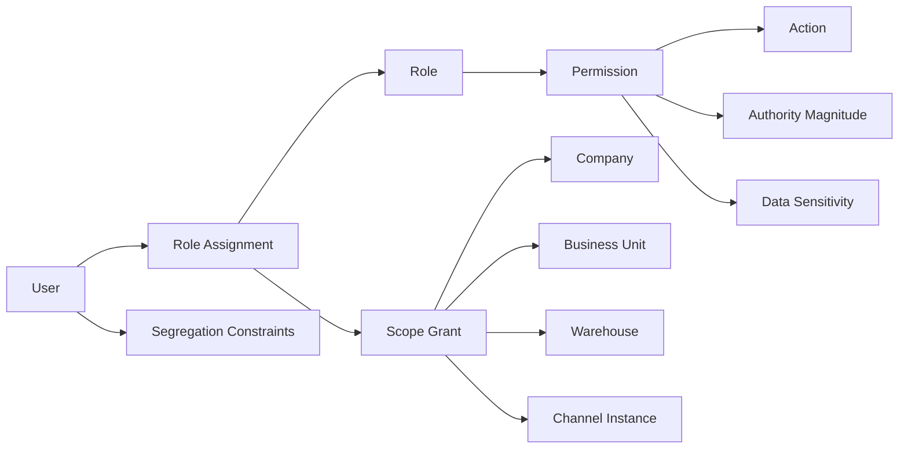
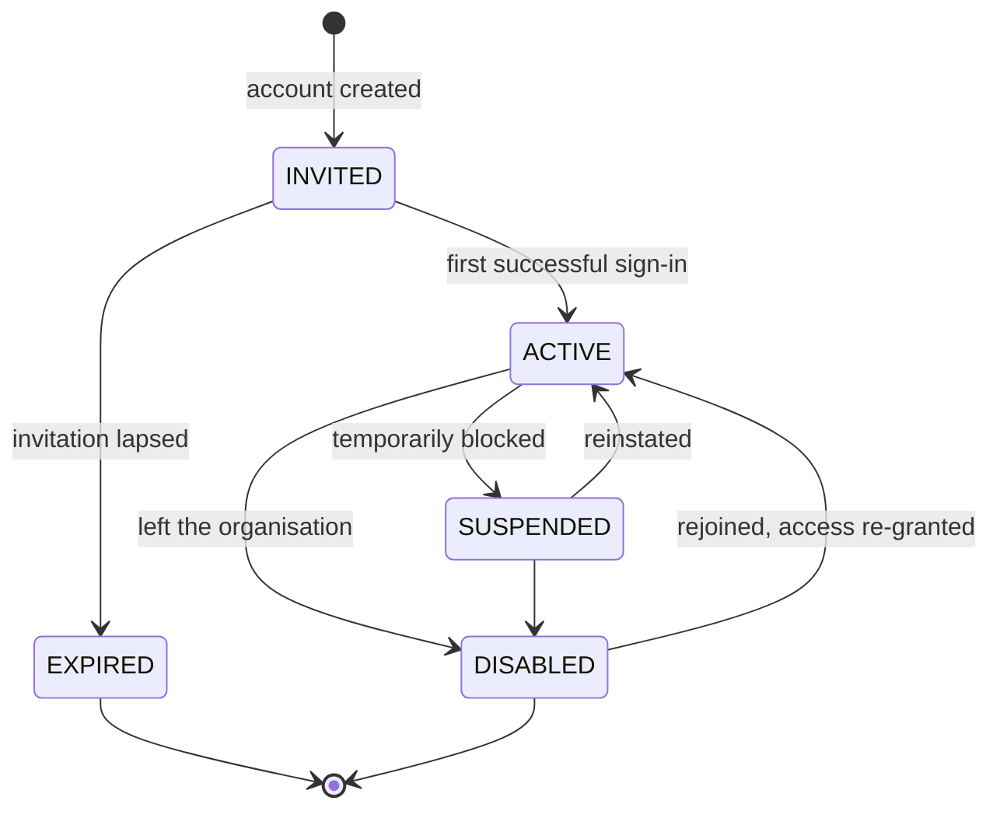
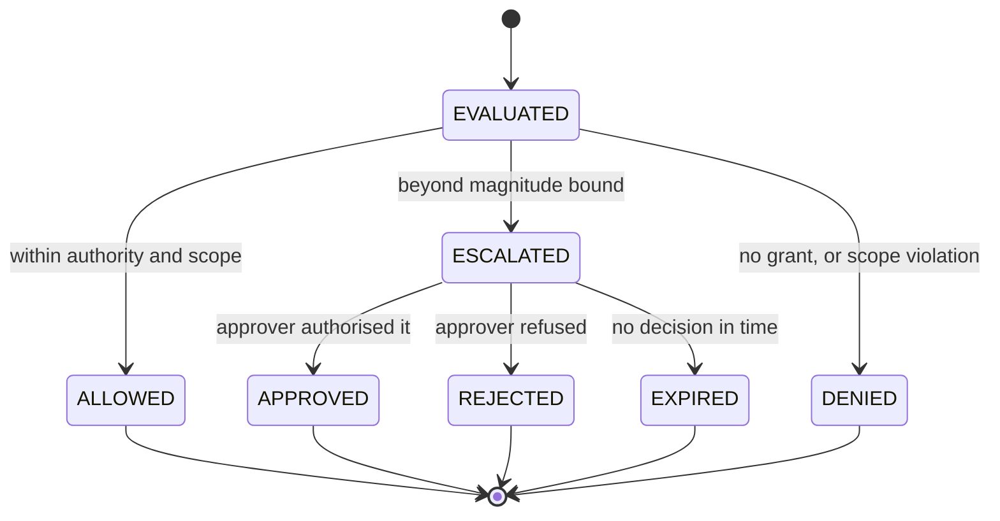

# Permission Architecture

**Owner:** Trioloo Technology · **Module:** Permission · **Status:** Canonical
**Version:** 1.11.0 · **Ratified:** 2026-08-04 · **Amended:** 2026-08-10 (Employee Loan authority — `BD-484`, §13.6; Owner designation reference — `BD-485`) · **Rule prefix:** `PRM-`

---

## Document Control

**Inherits:** [`SYSTEM_ARCHITECTURE.md`](SYSTEM_ARCHITECTURE.md) §15 — system-level permission obligations.
**References:** [`ORDER_MANAGEMENT_ARCHITECTURE.md`](ORDER_MANAGEMENT_ARCHITECTURE.md) §17 (actors), [`AUDIT_ARCHITECTURE.md`](AUDIT_ARCHITECTURE.md), [`DESIGN_CONSTITUTION.md`](DESIGN_CONSTITUTION.md) 19.7 (hide vs disable).

> Contains no code, schema, API, or UI specification. Where permission has a user-facing consequence, this document states the **behaviour**; presentation is governed by the design documents.

---

# 1. Purpose

To define who may do what, at what magnitude, within what boundary, and under whose approval.

In an ERP handling high-value goods, cash on delivery, and marketplace settlement, the permission model is a **financial control**, not a convenience feature. It is the mechanism by which the business limits the damage any single person can do — through error or intent — and the mechanism by which every consequential action becomes attributable.

---

# 2. Scope

## 2.1 In scope

Users and their identities · roles and role composition · permissions and authority magnitude · scope boundaries · delegation and approval · segregation of duties · session and access lifecycle · enforcement obligations on every module.

## 2.2 Out of scope

Authentication mechanisms, credential storage, encryption, session transport, identity-provider integration, and multi-factor implementation. These are engineering deliverables constrained by §12 but not specified here (SYS-076).

---

# 3. Business Goals

| # | Goal | Expression |
|---|---|---|
| PG-1 | Limit the blast radius of any single actor | Authority magnitude (§5.3) and segregation of duties (§5.6) |
| PG-2 | Make every consequential action attributable | Mandatory attribution (SYS-058) |
| PG-3 | Protect commercially sensitive data | Field-level sensitivity (§5.5) |
| PG-4 | Keep operational staff unobstructed | Least privilege that still permits the job (§4.2) |
| PG-5 | Support growth to many users and locations | Role and scope composition (§5.4) |
| PG-6 | Make exceptions deliberate | Overrides permitted, always audited (§5.7) |
| PG-7 | Prove the control environment to auditors | Reviewable, exportable access model (§13) |

---

# 4. Architecture Principles

## 4.1 P1 — Permission is not a lookup, it is a decision

> **PRM-001 — Every authorisation decision considers four inputs: the actor, the action, the subject, and the magnitude.**

"May this user cancel an order?" is not answerable. "May this user cancel *this* order, in *this* company, at *this* value?" is. A model that answers only the first question cannot express the controls this business needs.

## 4.2 P2 — Least privilege that still permits the job

> **PRM-002 — Roles grant the minimum authority required to perform the role's actual work, and no less.**

Over-restriction is not a safe default: staff who cannot do their jobs share accounts, and shared accounts destroy attribution entirely — a worse outcome than the permission being granted properly in the first place.

## 4.3 P3 — Deny by default

> **PRM-003 — Absence of a grant is a denial.** No action is permitted because it was not considered.

## 4.4 P4 — Enforcement is server-side and universal

> **PRM-004 — Authorisation is enforced by the module that owns the action, on every entry point** — interactive, bulk, integration, and automated (SYS-035).

Hiding a control in the interface is a usability decision, never a security control.

## 4.5 P5 — Automated actors are actors

> **PRM-005 — Every system process acts under a named identity with explicit, bounded permissions, and its actions are audited exactly as a human's are** (SYS-070).
>
> **✅ CONFIRMED AND GENERALISED (`BD-371`, v1.3.0).** The business states it as an absolute: **"No ERP action may exist without an attributable Operational User Profile."**
>
> **`PRM-005` scoped this to *system processes*; `BD-371` makes it universal.** Five actor types share one identity model — **Human · System · Integration · Automation · AI Service (future)** — each carrying **unique identity, explicit permissions, scope assignments, activity history, security controls and audit attribution.**
>
> | Consequence | |
> |---|---|
> | **AI gets no special treatment** | Consistent with `BD-322`'s guardrail: AI suggests, a person approves |
> | **Integration actors carry scope** | A Shop 1 adapter **cannot write Shop 2's data** — `PRM-009` enforced on read and on write |
> | **Attribution cannot be retrofitted** | An absolute rule under `CP-8`'s irreversibility axis (`BD-360`) |
>
> ***"The system did it"* was already unacceptable to an auditor. It is now unrepresentable.**

An automated reconciliation that can write off a receivable holds that authority explicitly and visibly. "The system did it" is not an acceptable answer to an auditor.

## 4.6 P6 — Authority to act is not authority to approve

> **PRM-006 — No actor approves their own request, override, or exception, EXCEPT where a specific business capability explicitly permits it and the actor holds the required permission** (`SYS-069`; **amended 2026-08-10, `BD-452`, `PRM-071`**).
>
> ⚠ ~~*No actor approves their own request, override, or exception.*~~ **The universal form is superseded and retained under `DOC-009`.** **It was never a business statement** — `PRM-050` had already recorded it as *“not violated in principle but not observed in practice”*, and **`BD-452` states positively that self-authorisation is correct for Advance Requisition**, not merely tolerated.
>
> ✅ **The exception is narrow by construction.** **It is not a general right and cannot be self-granted** — `PRM-046` is untouched. **A capability must name it, and the actor must still hold the permission** (`PRM-004`). **Four capabilities name it today** — **Advance Requisition** (`PRM-071`), **Payroll Deduction Waiver** (`PRM-073`), **Employee Loan Authorisation** and **Employee Loan Pause / Reduction** (`PRM-077`).
>
> 🔴 **CORRECTED 2026-08-10.** This read ~~*“Only **one** capability names it today: Advance Requisition”*~~ — **stale from the moment `PRM-073` was added on the same day, and my error for not updating it then.** **Original retained under `DOC-009`. No exception is broadened; the list is now maintained here rather than asserted as a count.**
>
> ⚠ **`INV-29.1` — a Purchase Order's approver is never its creator — STANDS UNCHANGED.** **Procurement has not named such an exception**, so the default in this rule still applies to it. **A separate business decision would be required to change that, and none has been taken** (`DOC-023`).

---

# 5. Core Concepts

## 5.1 The model

## 5.2 Permission

A permission is the right to perform one **action** on one **subject type**.

| Component | Example |
|---|---|
| Action | Create, view, amend, approve, cancel, release, dispatch, refund, adjust, export, configure |
| Subject type | Order, product, stock, shipment, receipt, return, user, configuration |

> **PRM-007 — Actions are named from the canonical vocabulary of the owning module** (SYS-016). A permission named for a screen rather than a business action becomes meaningless the moment the interface changes.

## 5.3 Authority magnitude

> **PRM-008 — Where an action has commercial magnitude, the permission carries a bound, and the bound is enforced.**

> ⚠ **Amended 2026-08-06 — the discount row is withdrawn.** See `PRM-052` (§19.1). The remaining rows are **untested by discovery**; `PRMU-8` records that they may follow the same pattern.

| Action | Bound |
|---|---|
| ~~Apply discount~~ | **WITHDRAWN — `BD-275`, `PRM-052`.** No percentage or amount bound exists, and per-user discount limit capability **must not be built**. Authority is binary plus approval routing |
| Amend price | Maximum variance from list — **see `BR-094`: a price change and a discount are one mechanism**, so this row is withdrawn in the same terms |
| Approve return | Maximum value |
| Issue refund | Maximum amount |
| Write off receivable | Maximum amount |
| Adjust stock | Maximum quantity or value |
| Approve purchase order | Maximum value |
| Extend credit limit | Maximum limit |
| Override a rule | Which rules, within what value |

Beyond the bound, the action is not refused outright — it is **escalated** for approval (§5.7). This is the practical difference between a control that works and one that staff route around.

This model is required by the order module, which already specifies bounded authority for discounting, amendment, rejection, and refund (`ORDER_MANAGEMENT_ARCHITECTURE.md` §7.9, §11.8).

## 5.4 Scope

> **PRM-009 — Every role assignment is bounded by scope, and scope is enforced on read and on write** (SYS-020, DB-032).

| Scope dimension | Effect |
|---|---|
| Company | Which legal entity's data is visible and actionable (SYS-018) |
| Business unit | Which division |
| Warehouse | Which stock locations may be operated |
| Channel instance | Which shops and websites may be worked |

A warehouse user at one location cannot pick from another. A call centre team assigned to specific Daraz shops sees only those orders. Both are ordinary requirements of a multi-location, multi-channel operation.

> **PRM-010 — Scope grants are additive; a user may hold several.** Scope is never expressed as an exclusion, because an exclusion silently grants access to anything added later.

## 5.5 Data sensitivity

> **PRM-011 — Sensitive data classes are separately grantable, independently of record access.**
>
> **⚠ STRENGTHENED (`BD-369`, `BD-370`, v1.3.0) — salary is present in V1, not postponed.** The Operational User Profile carries a **Salary Reference** in its Employment Information component, and a user profile is otherwise **widely readable**.
>
> **This is the strongest case the rule has.** Cost and margin were already listed; salary differs in that the record containing it is one many users legitimately need to open. **Separately grantable is therefore not a refinement here — it is the only thing preventing routine profile access from disclosing pay.**
>
> ***"Salary Reference"* is the business's own wording and is precise**: a reference figure visible for operational purposes, distinct from payroll **processing**, which is what `SYS-093` defers.

| Class | Sensitivity | Typical restriction |
|---|---|---|
| Cost and margin | **Commercial** | Warehouse and call centre staff do not need it (DB-074) |
| Customer contact | **Personal** | Access audited (DB-070) |
| Supplier terms | Commercial | Procurement and Accounts only |
| Settlement detail | Commercial | Accounts and management |
| Audit records | Control | Read-only to all; alterable by none (PRM-023) |
| User and permission data | Control | Administrators only |

A user may legitimately need to view an order without seeing its margin. Record-level and field-level access are therefore separate decisions.

## 5.6 Segregation of duties

> **PRM-012 — Certain action pairs may not be held by one actor on the same subject.**

| Pair | Risk prevented |
|---|---|
| Create supplier + approve payment to supplier | Fabricated supplier fraud |
| Receive goods + adjust stock | Concealed theft |
| Approve return + issue refund | Fabricated refund |
| Record settlement + write off shortfall | Concealed misappropriation |
| Create user + grant permissions to that user | Privilege escalation |
| Perform an action + approve one's own override | Control bypass (PRM-006) |

> **PRM-013 — Segregation constraints are evaluated at role assignment and at the moment of action.** Checking only at assignment misses the case where two individually-safe roles combine into an unsafe pair.
>
> **PRM-014 — Where the organisation is too small to segregate a pair, the conflict is explicitly accepted, recorded, and compensated by review.** An unenforceable control that is silently ignored is worse than one that is openly accepted, because only the second produces a review.

**PRM-014 matters here.** A growing business will not have enough staff to segregate every pair on day one. The architecture must let the business proceed while making the residual risk visible, rather than forcing either an unworkable control or an undocumented bypass.

## 5.7 Override and escalation

| Path | When | Requirement |
|---|---|---|
| **Within authority** | Magnitude inside the bound | Proceed; audited normally |
| **Escalation** | Beyond the bound | Routed to an actor holding sufficient authority |
| **Override** | Rule bypass permitted for the role | Reason mandatory; audited as an override (SYS-059) |
| **Refusal** | No path exists | Refused with a reason; the attempt is audited |

> **PRM-015 — An override is a recorded business decision, not a silent capability.** It records who, what rule, why, and on which subject.
>
> **PRM-016 — Escalation preserves the requester's identity.** The record shows both who requested and who approved. Collapsing these loses the reason the control exists.

## 5.8 Delegation

> **PRM-017 — Delegation is time-bounded, explicit, and revocable, and the delegated authority never exceeds the delegator's own.**
>
> **PRM-018 — Delegated actions record both the acting user and the authority under which they acted.**

Delegation covers absence — a supervisor on leave. Without it, staff share credentials, which destroys attribution.

---

# 6. Entities

| Entity | Purpose | Notes |
|---|---|---|
| **User** | An individual who acts in the system | Never shared (PRM-019) |
| **System Identity** | A named automated process | Bounded permissions (PRM-005) |
| **Role** | A named, reusable set of permissions | Composable |
| **Permission** | Action + subject type + magnitude bound | §5.2, §5.3 |
| **Role Assignment** | User + role + scope grant + validity period | ~~The unit of access~~ — **the unit of *role-derived* access only.** See `PRM-057` |
| **Scope Grant** | The boundary of an assignment | §5.4 |
| **Segregation Constraint** | A prohibited action pair | §5.6 |
| **Authorisation Decision** | A recorded allow or deny | Retained for consequential actions |
| **Override Record** | A recorded rule bypass | §5.7 |
| **Delegation** | Temporary transfer of authority | §5.8 |

> **PRM-019 — AMENDED (`BD-371`, `BD-372`, v1.4.0). Every user identity represents exactly one *actor*** — human, system, integration, automation, or AI service. **Shared and generic accounts are prohibited**, because they make attribution — the foundation of the audit model — impossible.
>
> **The original wording said *one human*, which had no place for the four non-human actor types `BD-371` establishes.** The prohibition is unchanged; its subject widens.
>
> **`BD-372` supplies the enforcement `PRM-019` always needed:** a profile is **never transferred, shared, or reused between different people**. On departure the account is suspended or archived, the profile is **retained permanently**, and **the identity is never reassigned**.
>
> **`PRM-021` — user records are never deleted — is confirmed exactly**, and now has the stronger companion rule that they are never *reused* either. **A recycled identity is worse than a deleted one: it silently re-attributes years of one person's actions to another, and the record still looks complete.**

## 6.1 Standard roles

Derived from the actors in `ORDER_MANAGEMENT_ARCHITECTURE.md` §17. Roles are configuration (SYS-013); this is the baseline set, not a fixed list.

| Role | Core authority | Explicitly denied |
|---|---|---|
| **Call Centre Agent** | Verify, contact, amend within bounds, cancel with reason, schedule callbacks | Release, stock adjustment, refunds, cost and margin visibility |
| **Call Centre Supervisor** | Agent authority + higher bounds, approve escalations, reassign queues | Stock adjustment, payment write-off |
| **Sales** | Create orders, apply approved discounts, initiate returns and exchanges, request holds | Stock adjustment, self-approval of out-of-policy discounts, settled financials |
| **Sales Supervisor** | Sales authority + higher discount bounds, approve amendments after release | Payment write-off, permission administration |
| **Warehouse Operator** | Pick, capture serials, pack, hand over, receive returns, record QC | Commercial terms, cancellation, refunds, release, cost visibility |
| **Warehouse Supervisor** | Operator authority + stock adjustment within bounds, approve discrepancies | Approving own adjustments, commercial terms |
| **Accounts** | Record receipts, reconcile, raise disputes, refunds and write-offs within bounds | Order content, physical stock, verification |
| **Accounts Manager** | Accounts authority + higher bounds, approve write-offs | Approving own write-offs |
| **Procurement** | Create suppliers and purchase orders within bounds | Approving own POs, goods receipt (PRM-012) |
| **Administrator** | Configuration, roles, channel and courier setup | Altering audit records (PRM-023) |
| **Auditor** | Read-only across all data including audit | Any write action |
| **System Identity** | Only the specific automated actions it performs | Anything not explicitly granted |

> ⚠ **Owner is deliberately absent from this catalogue** (`BD-485` §6, `AGV-037`). **It is an authority designation on the Operational User Profile, not a role**, and **is never assignable through role management** — **granting and revoking it are reserved to existing Owners** (`AGV-038`) and **it is unreachable through role assignment, scope grant or override** (`AGV-039`). **Owner and Administrator are never collapsed** (`PRM-068`).

> **PRM-020 — The Auditor role is read-only, without exception**, and includes read access to audit records that no other role may alter.

---

# 7. State Machines

## 7.1 User access lifecycle

> **PRM-021 — A user record is never deleted** (SYS-024, DB-028). Historical actions must remain attributable to a resolvable identity indefinitely. `DISABLED` removes access; it does not remove the person from history.

## 7.2 Authorisation request lifecycle

---

# 8. Business Rules

| Rule | Statement |
|---|---|
| PRM-001 | Authorisation considers actor, action, subject, and magnitude |
| PRM-002 | Least privilege that still permits the job |
| PRM-003 | Deny by default |
| PRM-004 | Enforcement by the owning module on every entry point |
| PRM-005 | System processes act under named, bounded identities |
| PRM-006 | No actor approves their own request or override |
| PRM-007 | Actions named from canonical business vocabulary |
| PRM-008 | Commercially significant actions carry enforced magnitude bounds |
| PRM-009 | Scope enforced on read and write |
| PRM-010 | Scope grants are additive, never exclusionary |
| PRM-011 | Sensitive data classes are separately grantable |
| PRM-012 | Segregation-of-duty pairs may not be held by one actor |
| PRM-013 | Segregation evaluated at assignment and at action |
| PRM-014 | Unenforceable segregation is explicitly accepted and compensated by review |
| PRM-015 | Overrides are recorded business decisions with mandatory reasons |
| PRM-016 | Escalation preserves both requester and approver identity |
| PRM-017 | Delegation is time-bounded, revocable, and never exceeds the delegator |
| PRM-018 | Delegated actions record acting user and governing authority |
| PRM-019 | One user identity per human; shared accounts prohibited |
| PRM-020 | The Auditor role is read-only without exception |
| PRM-021 | User records are never deleted |
| PRM-022 | Permission changes take effect promptly and are audited |
| PRM-023 | **No actor at any authority level may alter audit records** (SYS-060) |
| PRM-024 | Permission-restricted actions are hidden; capability-restricted actions are disabled with a reason |
| PRM-025 | Bulk operations authorise each record individually (SYS-033) |
| PRM-026 | Integration and API access carries the same model as interactive access |
| PRM-027 | Every denial is recorded with its reason |
| PRM-028 | Access is reviewed on a defined cycle |

**On PRM-024.** This is the behavioural rule behind `DESIGN_CONSTITUTION.md` 19.7. If a user can *never* perform an action, the control is absent. If they could but not now — wrong record state, missing prerequisite, insufficient magnitude — the control is present, disabled, and states why. A disabled control with no explanation is a defect.

**On PRM-025.** The orders list supports bulk status change, bulk courier dispatch, and bulk export (`design-reference/02-orders-list.png`). Authorising the *operation* rather than each record would let a user act on records outside their scope by selecting them in bulk. Each record is authorised individually and partial results are reported per record (SYS-073).

**On PRM-027.** Denials are the primary signal of both a mis-scoped role and an attempted overreach. Recording only successes makes both invisible.

---

# 9. Validation Rules

| Rule | Statement |
|---|---|
| PRM-029 | A role assignment must specify at least one scope grant |
| PRM-030 | A magnitude bound must be present wherever the action type defines one |
| PRM-031 | A role assignment violating a segregation constraint is refused, or explicitly accepted per PRM-014 |
| PRM-032 | Delegated authority is validated against the delegator's current authority at time of use, not at time of delegation |
| PRM-033 | An override requires a reason from a controlled vocabulary (SYS-043) |
| PRM-034 | An escalation must identify an approver who actually holds sufficient authority |
| PRM-035 | Assignment validity periods must be coherent — start before end, no retroactive grants |

**On PRM-032.** If a supervisor's own authority is reduced after delegating, the delegate's authority reduces with it. Validating at delegation time would leave a delegate holding authority their delegator no longer has.

**On PRM-035.** Retroactive grants would allow an action to be authorised after the fact, defeating the audit trail.

---

# 10. Lifecycle

## 10.1 Access lifecycle

| Stage | Action | Control |
|---|---|---|
| **Joining** | Identity created, roles assigned with scope | Approved by a manager; segregation checked |
| **Operating** | Actions authorised continuously | Every consequential decision audited |
| **Changing role** | Old assignments ended, new granted | Segregation re-evaluated (PRM-013) |
| **Absence** | Delegation granted, time-bounded | Automatically expires (PRM-017) |
| **Leaving** | All assignments ended; identity `DISABLED` | Immediate; history retained (PRM-021) |
| **Review** | Periodic re-attestation of who holds what | PRM-028 |

> **PRM-036 — Role change ends prior assignments rather than adding to them.** Accumulated permissions from previous roles are how a long-serving employee silently acquires the authority of five different jobs.

## 10.2 Access review

> **PRM-028 — RESPECIFIED (`BD-379`, v1.4.0). Access is reviewed on a configurable cycle, defaulting to 12 months**, covering: who holds which roles and scopes · **overdue access reviews** · **stale permission overrides** · dormant accounts · **long-unused privileged permissions** · accepted segregation conflicts (`PRM-014`) · override frequency by actor.
>
> **Different permission types may use different intervals.**
>
> ⚠ **The *"delegations that should have expired"* clause is WITHDRAWN as stale.** `PRM-048` and `PRM-049` concluded delegation machinery is unnecessary; a review cycle cannot inspect something that does not exist.
>
> > **PRM-058 — The ERP identifies records due or overdue for review and notifies administrators. It never revokes a permission because a review has become overdue.**
>
> **This is `CP-8` with an unusually clean justification** (`SMA-064`): **an event carries information; a date does not.** A role change is evidence the basis for an override has moved; a review falling due is only the calendar advancing. **And auto-revocation would punish the user for the administrator's inaction** — an admin backlog would become an operational outage.
>
> **Event-driven and periodic review cover each other's blind spots** — the first is blind to nothing changing for years, the second to change between cycles. **Neither alone is sufficient**, which is why `BD-379` states they complement rather than replace.
>
> ⚠ ***"Long-unused privileged permissions"* cannot be answered from the permission model at all.** It requires knowing which permissions were **actually exercised**, which lives in audit history. `PRM-027` already records successes as well as denials, so the data exists — **but this surface is derived from audit, not from role assignments**, and is easy to build against the wrong source.

Override frequency is the most useful of these. A control that is overridden constantly is not functioning as a control — the bound is wrong, and should be corrected rather than routinely bypassed.

---

# 11. Module Responsibilities

| Module | Responsibility |
|---|---|
| **Permission** | Owns users, roles, permissions, scopes, segregation constraints, delegations. Answers authorisation questions. Owns no business logic (SYS-015) |
| **Every other module** | Enforces authorisation for its own actions (PRM-004); defines its action vocabulary and magnitude dimensions |
| **Audit** | Records every consequential authorisation decision, override, and permission change |
| **Notification** | Delivers escalation requests and decisions |
| **Reporting** | Presents access reviews and override analysis |

> **PRM-037 — Permission does not know what an order is.** It answers "may this actor perform this action on this subject at this magnitude within this scope?" The meaning of the action belongs to the owning module.

---

# 12. Integration Points

| Integration | Requirement |
|---|---|
| Interactive access | Full model applies |
| Integration and API access | Same model; an external system acts under a named identity with bounded permissions (PRM-026) |
| Adapter-initiated actions | Adapters act under a system identity, not a human's (PRM-005) |
| Future mobile clients | Same model; client type never affects authority |
| Future identity provider | Authentication may be delegated externally; **authorisation remains Trioloo's** |
| Future partner access | A partner is a scoped identity, never an unbounded one |

> **PRM-038 — Authorisation is never delegated to an external system.** Authentication answers "who is this?" and may be federated. Authorisation answers "what may they do here?" and is Trioloo's alone, because only Trioloo knows its own controls.

---

## 13.5 Capability-scoped self-authorisation — 2026-08-10

> **PRM-071 — Advance Requisition permits self-authorisation. A permissioned user may request and authorise the same requisition, and `Requested By` and `Authorised By` remain separate recorded facts even when identical** (`BD-452`, `SM-21`, `INV-86.7`).
>
> ⚠ **CORRECTED 2026-08-10.** This read *“Advance Requisition is **the one capability** that permits self-authorisation”*. **It was true when written and became false the same day**: **`BD-471` names a second** — see `PRM-073` — **and `BD-484` names the third and fourth** — see `PRM-077`. **The Advance Requisition exception itself is unchanged and is not broadened.** Original wording retained under `DOC-009`.

**Capability comes from permission, not job title.** **Self-authorisation being permitted does not mean every employee may self-authorise** — the actor must hold the permission (`PRM-004`, `PRM-003` deny by default).

> ✅ **This closes `GAP-118` without weakening anything else.** **Three things stay exactly as they were:**
>
> | Rule | Status |
> |---|---|
> | **`PRM-046`** — no actor may grant themselves authority they do not hold | **Untouched.** Self-authorisation **uses** authority; it never creates any |
> | **`INV-29.1`** — a Purchase Order's approver is never its creator | **Untouched.** Procurement names no exception, so `PRM-006`'s default still binds it |
> | **`PRM-012`** — recording a settlement and writing off a shortfall are segregated | **Untouched**, and it has real work here: **write-off is owner/administrator only** (`ACC-067`) while authorising and accepting are permission-controlled (`ACC-068`) |

> **PRM-072 — Where one actor performs two roles in one decision, both are recorded. The record is never collapsed to a single generic action** (`BD-452`, `PRM-070`, `AUD-012`).

> **PRM-073 — Payroll Deduction Waiver is the second capability to name `PRM-006`'s exception. An Owner or Administrator holding waiver authority may waive a payroll deduction applied to their own salary** (`BD-470`, `BD-471`).
>
> ⚠ **The authority requirement is unchanged and is the whole point** — **being the affected employee grants nothing** (`PRM-046`). **Ordinary employees, reporting managers and payroll preparers may not waive**, and **`BD-470` keeps the capability title-bound to Owner or Administrator**, deliberately more restrictive than ordinary permission-controlled decisions **because a waiver changes salary payable.**
>
> ⚠ **Only Late, Absent and Early Departure deductions are established as waivable** (`BD-471` §9). **Advance Salary Recovery, Employee Loan Installment, Damage/Loss, Tax and Provident Fund are NOT** — **recovering money the employee already received and then waiving it would be forgiving a debt, which is a write-off under `BD-110`/`ACC-067`, not a payroll concession.** **No extension by pattern-matching.**

> **PRM-074 — Where the waiver actor is the affected employee, that identity is retained and never normalised away** (`BD-471`, `PRM-070`, `AUD-012`).
>
> **Third appearance of the collapse-case discipline**, after `PRM-070` (`BD-437`) and `PRM-072` (`BD-452`). **The ERP records what happened rather than tidying it away.**
>
> **Seventh appearance of the two-actor pattern** — `BD-110`, `BD-111`, `BD-275`, `BD-282`, `BD-437`, `BD-452` — and **the second to close the collapse case explicitly**, after `PRM-070`.

---

## 13.6 Employee Loan authority — 2026-08-10

> **PRM-075 — Employee Loan Authorisation is a distinct capability from Advance Requisition authorisation and never reuses its permission** (`BD-484` §1, `DOC-005`).
>
> ⚠ **The distinction is substantive, not organisational.** **`BD-452` permits Advance Requisition to be authorised by *“an owner, administrator, or any other user granted the relevant authority”* — explicitly not title-bound.** **Reusing `PRM-071` for loans would therefore have widened loan authority to every holder of Advance Requisition permission.**

> **PRM-076 — An Employee Loan is authorised only by an authorised Owner or Administrator, regardless of loan amount** (`BD-484` §2, §3).
>
> **Title-bound deliberately, because a loan creates a longer-term employee receivable and commits company funds across multiple payroll periods.** **Reporting Managers, Payroll preparers and other permissioned operational users do not acquire it through HR or Payroll access.**
>
> ⚠ **No amount threshold, approval tier, committee or mandatory second approver exists** — **`PRM-050` (`BD-112`) is confirmed, not excepted.**

> **PRM-077 — Employee Loan Authorisation and Employee Loan Pause / Reduction are separate capabilities carrying the same Owner/Administrator binding, and both name `PRM-006`'s exception** (`BD-484` §4, §5, §6).
>
> **Three authorities stay distinct:** **Loan Authorisation** · **Payroll Preparation / Processing** · **Loan Pause / Reduction**. **A Payroll user may process an approved loan deduction without holding either loan authority**, and **processing payroll confers no right to reduce or pause recovery.**
>
> **Self-authorisation is permitted for both**: an Owner or Administrator **may authorise their own loan and may decide a pause or reduction of their own instalment**, provided they hold the authority. ⚠ **Capability-specific, exactly as `PRM-006` requires. Not generalised** — **`PRM-046` is untouched, and `INV-29.1` still binds Procurement, which names no exception.**

> **PRM-078 — Where the borrower and the authoriser are the same person, both facts are retained and never collapsed** (`BD-484` §7, `PRM-070`, `PRM-072`, `PRM-074`, `AUD-012`).
>
> **Fourth appearance of the collapse-case discipline.** **Borrower, Requested Amount where applicable, Authorised Amount, Authoriser and authorisation timestamp are separate recorded facts even when borrower and authoriser are identical.**

> 🔴 **A pause is not a waiver, and only the outstanding balance distinguishes them.**
>
> **`PRM-073` excludes Employee Loan Instalment from waivability** — *waiving a recovery of money already received would be forgiving a debt, a write-off under `BD-110`/`ACC-067`.* **`PRM-077` nonetheless permits pausing or reducing that instalment**, and **there is no conflict**: **a waiver extinguishes the obligation; a pause leaves it fully outstanding and merely defers recovery** (`BD-480` §2, §3).
>
> ⚠ **The authority is identical for both, so authority does not tell them apart** — **and at the payroll line both appear as a recovery lower than expected.** ✅ **`BD-480` §5's retention of expected instalment, actual recovery and difference is what keeps a deferral from being recorded as a forgiveness.** **`PRM-012` remains untouched: writing off a loan is still a segregated write-off decision under `ACC-067`, and `BD-484` §10 leaves write-off undiscovered.**

**Scope.** **These rules govern authority only.** **Loan entities, schedules, movements and the retention lists in `BD-484` §7/§8 are not modelled here** — **HR & Payroll is registered `PLANNED` (`DOC-071`) and `DOC-001` forbids content in a planned module.** **They are recorded in [`BUSINESS_DISCOVERY.md`](BUSINESS_DISCOVERY.md) §41 and will be architected at the HR & Payroll Architecture stage.**

---

## 13.7 Payroll authority separation — 2026-08-10

**Source:** `BD-470`, `BD-478`, `BD-484`, `BD-495` – `BD-497`.

> **PRM-079 — Ten payroll actions are separately permissioned, and no permission is inferred from another** (`PRM-002`, `PRM-003`, `HRP-055`).
>
> | Action | Authority |
> |---|---|
> | **View salary** | **Sensitive class, separately grantable** (`PRM-011`, `AGV-012`) |
> | **Prepare / process payroll** | **Permission-controlled** |
> | **Finalise payroll** | **Permission-controlled** |
> | **Pay salary** | **Payment-side permission** |
> | **Waive an attendance deduction** | **Owner / Administrator** (`PRM-073`) |
> | **Authorise a salary increment** | **Owner / Administrator** |
> | **Authorise a General / Performance Bonus** | **Owner / Administrator** |
> | **Authorise a Sales Commission** | **Owner / Administrator** |
> | **Employee Loan authority** — four distinct acts | **Owner / Administrator** (`PRM-075` – `PRM-078`) |
> | **Decide an Advance Requisition recovery for a run** | **Permission-controlled** |

> **PRM-080 — Processing payroll confers no authority to waive, authorise an earning, or decide a recovery** (`BD-484` §5, `BD-478`).
>
> ⚠ **A payroll preparer may compute and process an already-authorised deduction or earning without holding the authority that created it.**

> **PRM-081 — Authorising a salary increment, a General Bonus and a Sales Commission are three distinct acts sharing one authority class** (`BD-495` §2, `BD-496` §3, `BD-497` §6).
>
> ✅ **Shared authority is not shared identity** (`BD-489` §2's principle). **They are never collapsed into a generic *authorise employee earning*.**

> **PRM-082 — Title-binding appears where a decision changes money the company will or will not receive** (`BD-470`, `BD-484`, `BD-486` §6, `ACC-067`).
>
> | Bound to a title | Bound to permission |
> |---|---|
> | **Write-off · deduction waiver · loan authorisation, pause, amendment and write-off · salary increment · bonus · commission** | **Advance Requisition authorisation · overtime approval · payroll preparation and finalisation · recording a loan repayment · AR recovery decision** |
>
> ⚠ **The line is not arbitrary and is not growing by pattern-matching.** ✅ **`PRM-071`'s *capability comes from permission, not job title* remains the general rule; these are the named departures.**

> **PRM-083 — Salary in every form is a `PRM-011` sensitive class** (`AGV-012`).
>
> **Monthly Salary, salary history, payroll results, payslips and salary payable are all separately grantable, independently of record access.** ⚠ **A payroll preparer's need to compute is not a general right to view every employee's salary.**

> **PRM-084 — Payroll adds no new `PRM-006` self-approval exception** (`PRM-077`).
>
> ✅ **The four naming capabilities are unchanged** — Advance Requisition, Payroll Deduction Waiver, Employee Loan Authorisation and Employee Loan Pause/Reduction. ⚠ **Salary increment, bonus and commission name NO exception**, so **`PRM-006`'s default binds them: an authoriser does not authorise their own increment, bonus or commission** unless the business later names an exception.

> **PRM-085 — Six Final Settlement actions are separately permissioned** (`HRP-084`, `BD-492` §5, `BD-494` §7).
>
> **View settlement · prepare settlement · authorise recovery participation · finalise settlement · record the actual payment or receipt · correct a finalised settlement.**
>
> **Recovery authorisation is Owner/Administrator** and is **never collapsed into loan authorisation, AR authorisation, schedule amendment, repayment recording, payroll preparation or write-off.** ⚠ **Settlement figures are a `PRM-011` sensitive class** (`PRM-083`).

> **PRM-086 — Finalising a Final Settlement is not an approval, so `PRM-006` is not engaged** (`HRP-085`, `BD-494` §7, `PRM-050`).
>
> ✅ **Authorising a recovery and finalising the settlement are DISTINCT ACTS ON DIFFERENT SUBJECTS** — the recovery, and the settlement. **There is one approval and one commit, not two approvals**, so **one actor may perform both where they hold the authority and no dual approval is required.** **`PRM-071`'s reasoning applies directly: *acting within authority one already holds is not self-approval — no approval step is involved.***
>
> ⚠ **Stated as a rule rather than left as a reading**, **so that no implementation models finalisation as an approval step** — **which would engage `PRM-006`'s default and require an exception the business has not named** (`PRM-084`). ✅ **The four naming capabilities are unchanged.**
>
> **`Recovery Authorised By` and `Finalised By` are retained separately even when identical** (`PRM-070`, `PRM-072`, `PRM-078`).

> **PRM-087 — Leave Approval is a DISTINCT permission and is never inferred from another** (`BD-499` §3, `PRM-003`, `PRM-068`).
>
> ⚠ **Not from** payroll access · attendance access · Reporting Manager status · HR record access · **the Administrator role alone** · general employee-management access. **Owners and Administrators MAY hold it; none of them inherits it.**
>
> ✅ **This is `PRM-068` applied — *Administrator is a role holding permissions, never a mode that suspends checking*** — and ⚠ **it is STRICTER than a title-bound rule in one respect**: **a title-bound rule would have granted leave approval to EVERY Administrator, and a distinct permission does not.**

> **PRM-088 — `PRM-082`'s title-binding test is refined: what binds a capability to a title is DIRECTNESS, not merely that money is affected** (`BD-499` §4).
>
> | Decision | Effect | Authority |
> |---|---|---|
> | **Deduction waiver** (`BD-470`) | 🔴 **The decision IS the amount** | **Owner / Administrator** |
> | **Write-off** (`ACC-067`, `ACC-090`) | **The decision IS the amount forgiven** | **Owner / Administrator** |
> | **Overtime approval** (`BD-464`) | **Sets a duration; money derives** (`HRP-023`) | **Permission-controlled** |
> | **Leave approval** (`BD-499`) | **Sets an attendance expectation; money derives** (`HRP-016`) | **Permission-controlled** |
>
> ⚠ **`PRM-082` reads *“title-binding appears where a decision changes money the company will or will not receive”*.** **That is imprecise — leave approval changes money the company will PAY, yet is permission-bound.** ✅ **Refined, not contradicted; `PRM-082`'s text stands under `DOC-009` and this rule states the operative test.** ✅ **It retroactively explains `BD-464`, recorded as consistent at the time without a stated reason.**

# 13. Events

| Event | Purpose |
|---|---|
| `Permission.UserCreated` / `UserDisabled` | Access lifecycle |
| `Permission.RoleAssigned` / `RoleRevoked` | Access change |
| `Permission.RoleDefinitionChanged` | Blast-radius change for every holder |
| `Permission.ScopeGranted` / `ScopeRevoked` | Boundary change |
| `Permission.AuthorityBoundChanged` | Magnitude change |
| `Permission.OverridePerformed` | Control bypass |
| `Permission.EscalationRequested` / `Approved` / `Rejected` | Approval flow |
| `Permission.DelegationGranted` / `Expired` | Temporary authority |
| `Permission.AccessDenied` | Attempted overreach or mis-scoped role |
| `Permission.SegregationConflictAccepted` | Residual risk accepted (PRM-014) |
| `Permission.AccessReviewCompleted` | Control attestation |

---

# 14. Audit Requirements

| Rule | Statement |
|---|---|
| PRM-039 | Every permission and role change is audited with before and after values |
| PRM-040 | Every override is audited with actor, rule, reason, subject, and approver |
| PRM-041 | Every escalation records requester, approver, and outcome |
| PRM-042 | Every denial of a consequential action is audited (PRM-027) |
| PRM-043 | Every access to sensitive data classes is audited (PRM-011, DB-070) |
| PRM-044 | Every access review and its outcome is audited |
| PRM-045 | Audit records of permission activity are themselves immutable (PRM-023) |

---

# 15. Permissions Over Permissions

| Action | Required authority |
|---|---|
| Create or disable a user | Administrator |
| Assign a role | Administrator, and not to oneself (PRM-012) |
| Define or change a role | Administrator, audited as a blast-radius change |
| Change an authority bound | Administrator with management approval |
| Accept a segregation conflict | Management, explicitly recorded (PRM-014) |
| Grant delegation | The delegator, within their own authority (PRM-017) |
| View audit records | Auditor, Administrator, management |
| **Alter audit records** | **Nobody** (PRM-023) |

> **PRM-046 — No actor may grant themselves authority they do not hold.** Self-elevation is the failure mode every permission system must structurally prevent.
>
> ✅ **Confirmed and now enforceable for the Owner predicate** (`BD-485`, `AGV-038`): **a non-Owner cannot grant Owner, and an Owner granting Owner already holds it.** ⚠ **This rule is *self-only*.** **Nothing here constrains granting ANOTHER user an authority the granting actor does not hold** — **closed for Owner, open for every other authority. Registered as `GAP-121`; no general rule is invented here** (`DOC-023`).

---

# 16. Error Scenarios

| Scenario | Required behaviour |
|---|---|
| Action attempted without grant | Denied with a reason; audited (PRM-027) |
| Action exceeds magnitude bound | Escalated, not silently refused (PRM-008) |
| Subject outside actor's scope | Denied; the subject's existence is not disclosed beyond what scope permits |
| Segregation conflict at assignment | Refused, or explicitly accepted (PRM-031) |
| Segregation conflict detected at action | Action refused; conflict raised as an exception (SYS-022) |
| Escalation with no qualified approver | Configuration defect; raised as an exception, not silently permitted |
| Escalation unanswered | Expires; requester informed; original action not performed |
| Delegator's authority reduced during delegation | Delegate's authority reduces with it (PRM-032) |
| Permission changed mid-session | Takes effect promptly (PRM-022); in-flight actions re-authorised |
| Bulk operation with mixed authority | Authorised per record; partial result reported per record (PRM-025, SYS-073) |
| System identity attempts an ungranted action | Denied and audited exactly as for a human (PRM-005) |
| User leaves with work in progress | Access ends immediately; in-flight work reassigned, never orphaned |
| Attempt to alter audit data | Refused at every authority level; the attempt is itself audited (PRM-023) |

---

# 17. Future Extensibility

| Scenario | Absorption | Core change? |
|---|---|---|
| More users, roles, locations | Configuration (SYS-013) | No |
| **Multi-company** | Company is already a scope dimension (PRM-009) | No |
| New modules | Declare their actions and magnitude dimensions | No |
| External identity provider | Authentication federated; authorisation retained (PRM-038) | No |
| Partner and reseller access | Scoped identity with bounded permissions | No |
| Mobile clients | Client type does not affect authority | No |
| Customer self-service | A distinct identity class scoped to own records | Extension of scope model |
| Time-based or location-based restrictions | Additional constraint dimension on assignment | Extension |
| Approval chains beyond one step | Escalation already models requester and approver | Extension of §5.7 |

## 17.1 Requires amendment

| Change | Why |
|---|---|
| Permitting shared accounts | Reverses PRM-019 and destroys attribution |
| Permitting audit alteration | Reverses PRM-023 and the audit model |
| Delegating authorisation externally | Reverses PRM-038 |
| Removing magnitude bounds | Reverses PRM-008; controls become binary and unusable |

---

# 18. Unknowns

| # | Unknown | Impact | Assumption |
|---|---|---|---|
| PRMU-1 | Current headcount per function | Determines which segregation pairs are enforceable (PRM-014) | Some conflicts will be accepted initially |
| PRMU-2 | Are there statutory access-control obligations in the jurisdiction? | May mandate specific reviews or retention | General good practice assumed |
| PRMU-3 | Will call centre agents be scoped per channel instance? | Affects default scope grants | Scoping supported; default is all instances |
| PRMU-4 | Is an external identity provider planned? | Affects authentication only (PRM-038) | Native authentication |
| ~~**PRMU-5**~~ | ~~Concrete authority bounds — discount %, refund and write-off ceilings~~ | — | **CLOSED BY REMOVAL 2026-08-06 — `BD-275`. For discount there are no bounds, and the capability must not be built** (`PRM-052`). Refund and write-off ceilings remain untested — see `PRMU-8` |
| PRMU-6 | Is customer self-service access planned? | Would add an identity class | Not in scope today |
| ~~**PRMU-7**~~ | ~~Is a requester identity captured when an approval is granted off-system?~~ | — | **SUBSTANTIALLY CLOSED — `BD-275`. The discount record carries "user who applied" and "approval by" as separate fields**, so applier and approver are distinctly attributed (`PRM-053`) |
| **PRMU-8** | **Do `PRM-008`'s remaining magnitude bounds — refund, write-off, stock adjustment, purchase order, credit limit, rule override — exist as enforced numbers, or do they follow the discount pattern of "who decides, not how much"?** | `PRM-008` | **None. `BD-110` and `BD-111` suggest the same pattern but were not asked in these terms.** Not assumed either way |

---

# 19. Discovery Reconciliation — 2026-08-06

## 19.1 The contested rule

> ## ✅ PRM-052 — Discount authority is binary plus approval routing, not magnitude-bounded. `PRM-047` RESOLVED, `PRMU-5` CLOSED
>
> **`BD-275`, 2026-08-06.** The business selected reading B without qualification:
>
> > *"There are **no fixed numeric discount limits**. Discounts are decided case by case… **The ERP must not enforce per-user percentage or amount limits**… **Per-user discount limit capability is not required and should not be built**."*
>
> **`BD-052` and `BD-053` are superseded.** `BD-108` is confirmed and definitive.
>
> ### The authority model for discount
>
> | Actor | Authority |
> |---|---|
> | Owner / Administrator | **Full** — any discount, no ceiling |
> | Permissioned user | May apply discounts |
> | Unpermissioned user | Must obtain approval from Owner or Administrator **before** applying |
>
> **`PRM-008` is amended for discount.** Its first example — *"Apply discount — maximum percentage or amount"* — is withdrawn. Discount authority is a **right to act**, with unpermissioned users routed to approval, and **no enforced numeric bound at any level**.
>
> ### What must not be built
>
> > **This is an explicit build prohibition, not a description of current practice.** No per-user discount ceiling, no percentage cap, no amount cap, no threshold check, and no blocking validation on discount magnitude. A configurable-but-unset limit is **also** out of scope — the capability itself is declined.
>
> **`PRMU-5` is closed by removal.** The question *"what are the concrete authority bounds?"* is answered: **there are none, and none should exist.**
>
> ### Scope of this amendment
>
> `PRM-008`'s remaining rows — refund, write-off, stock adjustment, purchase order approval, credit limit, rule override — are **not changed here**. `BD-110` and `BD-111` describe the same shape for write-offs and stock adjustments (*who decides*, not *how much*), which suggests the pattern is general, but they were not asked in these terms. **Recorded as an observation, not a change** (`PRMU-8`).

> ## ~~PRM-047~~ — RESOLVED by `PRM-052`. Retained for traceability
>
> `PRM-008` is one of this document's foundational rules: commercially significant actions carry an **enforced magnitude bound** rather than a yes/no right, and it names discounting as its first example.
>
> Discovery produced two incompatible statements:
>
> | Answer | Statement |
> |---|---|
> | `BD-052` | The maximum discount a user can give is **controlled by the ERP permission system**, configurable per user or role |
> | `BD-053` | Each user has a **configurable discount limit**; over it, **the ERP prevents the discount from being applied** |
> | **`BD-108`** | **The business does not use fixed discount limits.** Each request is reviewed on its circumstances |
> | `BD-110` | Write-off is decided by an owner or administrator — **no ceiling described** |
> | `BD-111` | Stock adjustment likewise — **no ceiling described** |
>
> `BD-052` and `BD-053` describe **enforced numeric ceilings**. `BD-108`, `BD-110` and `BD-111` describe **who decides**, with no magnitude at all. These are different control models.
>
> **`PRMU-5` was recorded as closed by `BD-052`. It is reopened.** Under `BD-108`'s description, `PRM-008` has nothing to enforce.
>
> **Not resolved here.** A plausible reconciliation is that `BD-052`/`BD-053` describe intended system capability and `BD-108` describes current practice — but neither answer says so, and choosing between them would invent policy. **`BD-255` (priority) asks directly.** `PRM-008` stands unchanged pending the answer.

## 19.2 Simplifications discovery permits

> **PRM-048 — No delegation or temporary-authority model is required** (`BD-113`). When an approver is unavailable, cover comes from **standing authority already held by another owner or administrator** — nothing is handed over and handed back. No delegation record, no acting-on-behalf-of relationship, no expiry, no time-bounded grant.
>
> This is a genuine simplification: an entire class of permission machinery is confirmed unnecessary rather than merely deferred.

> **PRM-049 — No approval workflow exists in the system** (`BD-109`, and see `SMA-017`). Requests are made verbally or by message and the authorized user records the outcome. There is no approval request entity, no queue, no notification, and no approve/reject action.
>
> **This has one favourable consequence for `PRM-016`.** Because *"the authorized user updates the order"*, the person holding the authority is the person acting in the system — so the ERP actor and the real approver coincide, satisfying `AUD-004` without delegation modelling. `PRMU-7` records the case where that breaks: if a staff member ever records a verbally approved action under their own login, the ERP names the wrong actor (`BD-257`).

> **PRM-050 — No two-person approval is required anywhere** (`BD-112`). `PRM-006` (no actor approves their own decision) and `PRM-012` (approving a return is separate from issuing its refund) are **not violated in principle but are not observed in practice**: `BD-080` and `BD-083` describe owners and administrators inspecting, approving, and issuing refunds on the same transaction.
>
> **`PRM-014` already governs this** — where a small team cannot segregate a pair, the conflict is **explicitly accepted and recorded**, not silently ignored. This reconciliation is that record. `PRM-006` and `PRM-012` remain as written and become enforceable as the team grows.

> **PRM-051 — Authority is concentrated in owners and administrators across every domain examined.** Pricing (`BD-044`), release (`BD-040`), discounts (`BD-108`), refunds (`BD-083`), write-offs (`BD-110`), stock adjustments (`BD-111`) and listing decisions (`BD-016`) all resolve to the same two roles, with other users acting only where explicitly permissioned.
>
> The role model in this document is therefore **richer than current practice**. That is not an error — `PRM-014` anticipates it — but it means the fine-grained roles are **designed for growth, not in use today**, and should not be presented as reflecting the current operation.

> ## ✅ PRM-053 — Approval is attributed on the transaction, even though no workflow exists
>
> **`BD-275`** requires a discount record to carry **"user who applied the discount"** and **"approval by (if applicable)"** as **separate fields**.
>
> This **refines `PRM-049` without contradicting it.** There is still no approval workflow — no request entity, no queue, no notification, no approve/reject action (`BD-109`). But the outcome of an off-system approval is **recorded on-system and attributed to the approver by name**.
>
> | Concern | Status |
> |---|---|
> | `PRM-016` — the requesting actor must be preserved | **Satisfied by the record structure**, not by procedure |
> | `AUD-004`, `AUD-007` — every action attributable to a named actor | **Satisfied** — applier is always named |
> | `BD-257` — does a staff member record a verbally approved action under their own login, naming the wrong actor? | **Largely resolved.** The applier field names who acted; the approver field names who authorised. The two are not conflated |
>
> **This is the strongest control the discount model has**, given there is no ceiling and no preventive check. It does not prevent an over-generous discount; it makes every one of them attributable to two named people and carry a stated reason.

## 19.3 What this leaves

Combining `PRM-049`, `PRM-050` and `PRM-052`: exceptional actions have **no preventive control**. The decision is made off-system, by one person, without an enforced bound, and the outcome is recorded afterwards.

**The audit trail is therefore the only control that exists** — not a supplement to preventive controls.

> **Both questions that made this dangerous have since been answered, and both answered well.**
>
> | Question | Answer |
> |---|---|
> | `BD-254` — can completed records be edited in place? | **No.** Originals never change; corrections are linked adjustments; audit history is immutable (`DB-077`, `AUD-040`) |
> | `BD-256` — is a reason captured? | **Yes** — discounts (`BD-275`), write-offs (`BD-110`), stock adjustments (`BD-111`) |
>
> So the sole control is **unalterable, attributed to two named people** (`PRM-053`), **and carries a stated reason**. That is a defensible position for a business of this size — detective rather than preventive, but genuinely detective rather than nominally so.
>
> **One question now carries the residual risk alone: `BD-263`** — whether anyone reviews these actions after the fact. A trail that is written but never read leaves `AUD-023` control monitoring without an operator.

---

# 13. Roles & Permissions Reconciliation — 2026-08-08

**Source:** `BUSINESS_DISCOVERY.md` §24, `BD-374` – `BD-379`.

## 13.1 The hybrid model

> **PRM-057 — Effective authority is a four-part composition, and role assignment is only one part of it.**
>
> > **Operational User Profile + Assigned Roles + Scope Assignments + Permission Overrides**
>
> **Permissions primarily belong to roles**; roles define the **default authority** required to perform a business responsibility. **User-specific overrides exist for exceptional situations only** and are never the primary administration method (`BD-374`).
>
> ⚠ **Correction to the discovery record.** At `BD-374` I attributed *"Role Assignment is the unit of access"* to `PRM-021` and proposed narrowing it. **That was a misattribution** — `PRM-021` states that user records are never deleted, and `BD-372` **confirms** it. The unit-of-access claim sits in the §6 entity table, and **that is what is narrowed**: role assignment is the unit of **role-derived** access, not of authority as a whole.

> **PRM-059 — The ERP must always be able to explain why a user holds a particular permission**, by showing **Assigned Roles · Scope Assignments · User-Specific Overrides** (`BD-374`).
>
> **This is a new V1 capability and the architecture does not currently have it.** `PRM-028` provides an **access review** across the population — *who holds which roles*. **This requires a per-user, per-permission derivation view**: *this permission, for this user, comes from this role, bounded by this scope, adjusted by this override.*
>
> **A hybrid model without it becomes unauditable within a year** — precisely the failure `PRM-028` was written to catch and cannot catch alone. **The two-sources-of-truth cost of a hybrid model is real; this is what pays it.**

> **PRM-060 — Overrides grant *or revoke*, and the revoke direction is what prevents role proliferation.**
>
> | Without overrides | Consequence |
> |---|---|
> | *"Sales, but may also approve refunds"* | A new role |
> | *"Sales, but this one person may not issue refunds"* | **A role defined by what it lacks** |
>
> **`CP-3` makes this practical rather than theoretical** — a seven-person business should not maintain fifteen roles to express three exceptions.
>
> ⚠ **An override may never carry a magnitude.** `BD-275` and `PRM-052` prohibit per-user discount limits as an explicit **build prohibition**. A grant/revoke mechanism is exactly the shape that prohibition could return through, as *"just an override on the discount permission"*. **An override may control *whether* a user applies a discount; it may never carry a percentage or amount.**
>
> **`BD-052`'s structural claim — permissions configurable *"per user or role"* — is confirmed as the general model, while its discount-ceiling claim stays withdrawn.** The mechanism is ratified; one specific use of it remains prohibited.

## 13.2 Override lifecycle · `SM-17`

> **PRM-061 — Every override declares its type at creation: Permanent or Temporary** (`BD-375`).
>
> | Type | Behaviour |
> |---|---|
> | **Permanent** | Active until **explicitly reviewed, modified or removed**. ***"Permanent" names the absence of an expiry condition, not exemption from review.*** |
> | **Temporary** | Requires a **validity period *or expiry condition***; **automatically becomes inactive** on expiry |
>
> ***"Expiry condition"* is not a late synonym for a date.** A date passes on its own; a condition must be observed — *"until the supplier dispute is resolved"*. **`E-073` Business Case is the natural carrier** for that form.
>
> **Automatic expiry is an action no human performs**, and it works only because `BD-371` gives Automation actors their own profiles. **Without that, this single rule would produce exactly what `PRM-005` forbids: *"the system did it"* as the answer to an auditor asking why a permission ended.**

> **PRM-062 — A role change suspends every override into `Review Required`; none may become active again without explicit administrative approval** (`BD-376`).
>
> **`PRM-036` ends prior role assignments automatically because the new role supplies what is needed. Overrides cannot be treated the same way** — auto-revoking breaks legitimate standing authority mid-work, auto-keeping is the silent accumulation `PRM-036` exists to prevent. **Review is the only correct third option.**
>
> **The suspension is enforced, not advisory, and `CP-8` explains why:** whether an override remains *appropriate* is a judgement, which is why review is required rather than automatic revocation — **but whether unconfirmed authority may act in the meantime is not a judgement at all.** An action taken with a permission that should have been withdrawn **cannot be undone**.
>
> | | |
> |---|---|
> | **Expired temporary overrides remain inactive** | Review is not a resurrection route |
> | **No auto-reactivation** | No timeout, no silent resumption, no default-to-previous |
>
> **The ERP must clearly highlight users whose overrides await review** (`PRM-063`). **Suspension is safe only if the queue is visible** — an invisible review queue converts a safety mechanism into an outage.

## 13.3 Scope

> **PRM-064 — Scope dimensions must be addable as configuration, not as structure.** Ten dimensions are declared: Company *(future)* · Branch · Warehouse · **Marketplace Shop · Website · Facebook Page · WhatsApp Account** · Sales Channel · Department · Business Unit *(future)* (`BD-377`).
>
> **This is the most load-bearing constraint in the scope model**, and the amendment that produced it made it essential rather than future-facing:
>
> | Approach | Adding a new marketplace later means |
> |---|---|
> | A generic *Channel Instance* dimension | **A new value** — configuration |
> | **Explicit per-channel dimensions** *(chosen)* | **A new dimension** |
>
> **Under the chosen model every future channel this business adds is a new scope dimension — and this business adds channels regularly.** A design enumerating the ten in fixed structure satisfies V1 and then forces an authorization-model change the first time a new marketplace appears, against the stated requirement of growth *"without changing the authorization model"*.

> **PRM-065 — Scope bounds; it never grants.** *"Permissions define what a user can do. Scope defines where that permission applies."* **A user with no permission gains nothing from wide scope; a user with permission and no scope acts nowhere. The two are multiplicative, not additive.**
>
> **`PRM-009` is confirmed exactly** — enforced on read and on write — and **integration identities follow the same model**, which `BD-371` had already required and `BD-377` now states independently. **The seven Daraz adapters are seven scoped actors, not one actor holding seven credentials.**
>
> ⚠ **Scope is the right answer to notification and data volume, but it is not active today.** `BD-377` states that **most users currently work across all channels**. Recorded so the model's richness is understood as **deliberate design for growth** (`PRM-051`, `PRM-014`), not as a description of current practice.

## 13.4 Administration

> **PRM-066 — Transparency replaces mandatory dual approval where organizational size makes segregation impossible** (`BD-378`).
>
> **`PRM-006` is narrowed, but less than it first appears.** Acting within authority one already holds is **not self-approval** — no approval step is involved. What changes is narrower: **dual approval for administrative actions is configurable, not mandatory, and cannot be assumed staffable.**
>
> **Mandating it in a one-administrator business does not produce dual approval.** It produces a blocked business, or **someone sharing the owner's account** — which is `PRM-002`'s named failure and destroys the attribution `INV-77.1`–`INV-77.4` were built to guarantee. **The realistic outcome is worse than the control's absence**, which is why transparency is not the weaker choice here but the only one that does not degrade.
>
> **Where segregation is not possible the ERP records: the action · who performed it · when · the business reason.**

> **PRM-067 — Administrators may modify their own permissions only where they already possess the authority in question; every self-administration action is permanently recorded and specially flagged** (`BD-378`).
>
> **This closes escalation-by-self-grant.** An administrator holding authority X may adjust their own X; one lacking authority Y **may not grant themselves Y**. Without this line, *"administrators may modify their own permissions"* would make every administrator an owner in one step. **The Owner is the stated exception, and it is recorded.**

> **PRM-068 — Administrator is a role holding permissions, never a mode that suspends checking.** *"The ERP must never allow a user to bypass permission validation simply because they are an administrator."*
>
> **This closes the `is_admin → skip validation` branch**, the most common structural hole in permission systems. **The Owner clause is not an exception:** *"may perform any administrative action"* means the Owner **holds** every authority, so every check passes on its merits.
>
> **The outcome looks identical and the audit trail is completely different** — a bypass records nothing to evaluate; a passed check records which authority was exercised, on what subject, and why. **`PRM-023` already denies administrators power over audit records; this generalises the same instinct to validation itself.**

## 13.5 `SYS-016` closed — Role *groups* Responsibilities

| Concept | Definition |
|---|---|
| **Responsibility** | What a user **does** — the atom |
| **Role** | **Groups** operational responsibilities — the container |
| **Permission** | What a user is **allowed to perform** |
| **Scope** | **Where** those permissions are effective |

**`BD-369`'s many-to-many responsibilities and this document's role model were never in conflict.** Role is not a synonym for Responsibility; **it is a container of them.** The definitional gap flagged at `BD-371` is **closed, not traded off**.

## 13.6 Four surfaces are one surface

| Source | Surface |
|---|---|
| `PRM-059` | Permission derivation — *why does this user have this?* |
| `PRM-063` | Override review queue — *what is suspended awaiting review?* |
| `PRM-067` | Self-administration reporting |
| `PRM-058` | Access review dashboard — overdue, stale, dormant, unused |

**These are four views of one thing: access governance.** Same subject, same audience, same data source. **They must be registered as one administrative area** — building them separately is how a seven-person business acquires four modules it did not need (`CP-3`).

## 13.7 Open

| Item | Status |
|---|---|
| **Dual-approval mechanism build scope** | **Open.** `PRM-048`/`PRM-049` found approval-workflow machinery unnecessary — but that concerned **business** approvals (`BD-109`); this concerns **administrative** ones. **Documented position:** the policy must be expressible and the model must not preclude it, but **building the mechanism is not justified while one administrator exists** (`CP-3`). Flagged, not assumed |
| **`PRM-033` vocabulary** | `PRM-033` requires an override reason from a **controlled vocabulary** (`SYS-043`); `BD-375` says *"Business Reason"* without specifying. **Not inferred** |
| **Override frequency by actor** | `PRM-028` names it the most useful review signal; `BD-379` does not mention it. **Recorded as unaddressed, not as dropped** |

> ## PRM-069 — Manual reservation release is a permissioned action, and it is deliberately not owner-only

> **PRM-069 — Releasing a reservation is permission-controlled, assignable to any role by configuration, and escalates to an authorised approver where the performer's own authority is insufficient** (`BD-437`, `IVN-048`).

**No new mechanism is created.** `PRM-004` already requires authorisation at every entry point; **`PRM-033`/`PRM-034` already route an escalation to an actor who *actually holds* sufficient authority**; `PRM-010` makes scope grants additive; `AGV-030` assigns by role. **`BD-437` asks for exactly this and names it** — *"use the existing Permission / Access Governance model so authority can be assigned to appropriate roles and changed through configuration rather than hard-coded to one job title."*

> ⚠ **This narrows `PRM-051`, which is worth stating plainly.** `PRM-051` recorded that **authority is concentrated in owners and administrators across every domain examined** — pricing, release, discounts, refunds, write-offs, stock adjustments, listings. **`BD-437` is the first answer to say outright that the concentration is *current staffing*, not a rule**: *"It is NOT restricted only to the business owner/admin."* **`PRM-051` remains an accurate observation; it was never a constraint, and must not be implemented as one.**

> **PRM-070 — The performer and the approver are recorded as separate facts even where one authorised person is entitled to be both** (`BD-437`, `IVN-049`, `AUD-012`).

**This is the fourth appearance of the two-actor pattern** — `BD-110` write-off, `BD-111` stock adjustment, `BD-275` discount, `BD-282` substitution — **and the first to close the collapse case.** **`PRM-050` already accepted owners inspecting, approving and acting on one transaction as a structural conflict**; recording both facts **makes that overlap visible rather than erasing it.**

# 12. User Profile Reconciliation — 2026-08-08

**Source:** `BUSINESS_DISCOVERY.md` §24, `BD-369` – `BD-373`.

> **PRM-054 — The Operational User Profile is the authoritative identity record, and `PRM` owns it.** Seven components; **Employment Information is one of them, not the record**. HR & Payroll extends that component only and **never becomes authoritative** (`BD-369`).
>
> **The dependency chain is explicit: profile → scope values → permission enforcement.** `PRM-009` requires every role assignment to be bounded by **branch, warehouse and channel instance** — all three live on the profile. **Deferring the profile would leave `PRM-009` with nothing to read.**

> **PRM-055 — Identity is permanent; responsibilities and permissions change around it** (`BD-369`, `BD-372`).
>
> **A permission change must never rewrite what someone was permitted to do at the time.** An action taken last year under authority since removed was **validly authorised then**, and the audit record must continue to say so (`DB-003`, `AUD-013`/`AUD-014`).
>
> **`PRM-036` already ends prior role assignments on a role change** — that remains correct and is now paired with an identity that never moves beneath it.

> **PRM-056 — Accounts are administratively created; there is no self-registration and customers hold no ERP identity** (`BD-370`, closing `PRMU-6`). User creation, activation, suspension, credential reset and account management are **administrative functions performed only by authorized users**.

## 12.1 What `PRMU-1` actually returned
`PRMU-1` asked for **headcount per function** so `PRM-014` could decide which segregation pairs are enforceable. **The answer is better than a headcount:**

> **The relationship between users and responsibilities is many-to-many, and the system must not assume otherwise.**

**`PRM-050`'s accepted conflict — owners inspecting, approving and issuing refunds on one transaction — is therefore structural, not a small-team compromise to be engineered away.** One person holding several responsibilities is **the normal case**.

## 12.2 `PRM-051` confirmed as intent
I recorded that the role model was *"richer than current practice… designed for growth, not in use today"* and cautioned against presenting it as current operation. **The business states that intent directly** — support today's overlap *and* future separation *"without changing the core user model"*. **`CP-10`: the fine-grained model is correct to exist and correct not to be enforced yet.**

# Appendix — Rule Index

PRM-001–006 principles · PRM-007–018 core concepts · PRM-019–021 entities and lifecycle · PRM-022–028 business rules · PRM-029–035 validation · PRM-036–038 lifecycle and integration · PRM-039–046 audit and self-governance · **PRM-047–051 discovery reconciliation (§19)** · **PRM-052–074 sales, discount and capability-scoped self-authorisation** · **PRM-075–078 Employee Loan authority (§13.6)**.

**Amendment record**

| Version | Date | Change |
|---|---|---|
| 1.0.0 | 2026-08-04 | Initial ratification |
| **1.1.0** | **2026-08-06** | **Sales discovery reconciliation (§19).** `PRMU-5` **reopened** — authority bounds contested (`PRM-047`). Delegation and approval-workflow machinery confirmed unnecessary (`PRM-048`, `PRM-049`); segregation conflicts recorded under `PRM-014` (`PRM-050`); role concentration recorded (`PRM-051`). `PRMU-7` opened. Source: [`BUSINESS_DISCOVERY.md`](BUSINESS_DISCOVERY.md) |
| **1.8.1** | **2026-08-10** | ✅ **Owner designation reference added — `BD-485`. No `PRM-` rule created.** **`AGV-000` puts *who holds authority and how it is governed over time* in `ACCESS_GOVERNANCE_ARCHITECTURE.md`**, so **Owner designation is owned there (`AGV-037` – `AGV-041`) and only referenced here** (`DOC-005`, `DOC-006`). **Two notes added where this document could otherwise mislead**: ⚠ **the §6 role catalogue now records that Owner is DELIBERATELY ABSENT** — an authority designation on the profile, never assignable through role management — and **`PRM-046` now records that it is CONFIRMED and enforceable for the Owner predicate but is *self-only*, leaving `GAP-121` open for every other authority.** **`PRM-068` is untouched and reinforced: Owner and Administrator are never collapsed.** Source: [`BUSINESS_DISCOVERY.md`](BUSINESS_DISCOVERY.md) `BD-485` |
| **1.8.0** | **2026-08-10** | ✅ **`PRM-075`–`PRM-078` added; `PRM-006` and `PRM-071` corrected — `BD-484`. Post-Freeze amendment under `DOC-067`.** **`PRM-075`: Employee Loan Authorisation is a DISTINCT capability that never reuses the Advance Requisition permission** — ⚠ **substantive, because `BD-452` allows AR authorisation by *any user granted the relevant authority* and reuse would have WIDENED loan authority to every AR permission holder.** **`PRM-076`: Owner or Administrator only, regardless of amount** — title-bound because a loan creates a longer-term receivable across multiple payroll periods — **and `PRM-050` (`BD-112`) is confirmed, not excepted.** **`PRM-077`: authorisation and pause/reduction are SEPARATE capabilities with the same binding, both naming `PRM-006`'s exception, with self-authorisation permitted** — **payroll processing stays distinct and confers neither.** **`PRM-078`: borrower = authoriser is retained, never collapsed — fourth appearance of the discipline.** 🔴 **`PRM-006` CORRECTED**: it read *“Only ONE capability names it today”* — **stale from the moment `PRM-073` was added the same day, my error for not updating it then**; **now four, listed rather than counted, originals retained under `DOC-009`.** 🔴 **A PAUSE IS NOT A WAIVER**: `PRM-073` excludes loan instalments from waivability because that would forgive a debt, yet `PRM-077` permits pausing the same instalment — **no conflict, because a waiver EXTINGUISHES and a pause merely DEFERS** — ⚠ **but the authority is identical and both look alike at the payroll line, so `BD-480` §5's expected/actual/difference retention is what keeps a deferral from becoming a forgiveness.** **Scope is authority only** — loan entities and the `§7`/`§8` retention lists stay in discovery because **`DOC-071` registers HR & Payroll `PLANNED` and `DOC-001` forbids content there.** Source: [`BUSINESS_DISCOVERY.md`](BUSINESS_DISCOVERY.md) `BD-484` |
| **1.7.0** | **2026-08-10** | ✅ **`PRM-073`/`PRM-074` added and `PRM-071` CORRECTED — `BD-470`/`BD-471`. Post-Freeze amendment under `DOC-067`.** 🔴 **`PRM-071` read *“Advance Requisition is **the one capability** that permits self-authorisation”* — true when written on 2026-08-10 and FALSE the same day**, because **`BD-471` names a second: Payroll Deduction Waiver.** **Corrected with the original retained under `DOC-009`; the Advance Requisition exception is unchanged and NOT broadened, and no universal self-approval rule is created.** **`PRM-073`: an Owner or Administrator holding waiver authority may waive a deduction on their own salary** — ⚠ **the authority requirement is the whole point: being the affected employee grants nothing** (`PRM-046`), and **`BD-470` keeps the capability title-bound because a waiver changes salary payable.** ⚠ **Only Late, Absent and Early Departure are waivable** — **Advance Salary Recovery, Loan Installment, Damage/Loss, Tax and PF are NOT, because waiving a recovery of money already received would be FORGIVING A DEBT, a write-off under `BD-110`/`ACC-067` rather than a payroll concession.** **No extension by pattern-matching.** **`PRM-074`: where the waiver actor IS the affected employee, that identity is retained and never normalised** — **the third appearance of the collapse-case discipline** after `PRM-070` and `PRM-072` |
| **1.6.0** | **2026-08-10** | ✅ **`GAP-118` RESOLVED — `PRM-006` AMENDED, `PRM-071`/`PRM-072` added. `BD-452`. Post-Freeze amendment under `DOC-067`.** **`PRM-006`'s universal form — *no actor approves their own request, override, or exception* — conflicted with `BD-452`, which states that a permissioned user MAY request and authorise the same Advance Requisition.** **The rule now carries a narrow exception: except where a specific business capability explicitly permits it and the actor holds the required permission.** **The universal wording is retained under `DOC-009`.** ✅ **It was never a business statement** — `PRM-050` had already recorded it as *not violated in principle but not observed in practice*, and **`BD-452` states self-authorisation positively rather than tolerating it.** ✅ **The exception is narrow by construction**: **not a general right, not self-grantable** (`PRM-046` untouched), **a capability must name it**, and **only Advance Requisition does** (`PRM-071`). ⚠ **`INV-29.1` — a Purchase Order's approver is never its creator — STANDS UNCHANGED**: Procurement names no exception, so `PRM-006`'s default still binds it, and **changing that would need its own business decision, which has not been taken.** **`PRM-012` untouched and now load-bearing** — write-off is owner/administrator only while authorising and accepting are permission-controlled. **`PRM-072`: both roles recorded when one actor performs two** — the **seventh** two-actor instance |
| **1.5.0** | **2026-08-09** | ✅ **`PRM-069`, `PRM-070` added — `BD-437`, pre-freeze blocker A2. No new mechanism, hierarchy, role or threshold.** **Manual reservation release is permission-controlled and assignable by configuration**, escalating where the performer's authority is insufficient — **which is `PRM-004` and `PRM-033`/`PRM-034` unchanged**, exactly as `BD-437` asks: *“assigned to appropriate roles and changed through configuration rather than hard-coded to one job title.”* ⚠ **`PRM-051` is narrowed and the narrowing matters**: it recorded authority as **concentrated in owners and administrators across every domain examined**, and **`BD-437` is the first answer to state outright that this is current staffing, not a rule** — *“NOT restricted only to the business owner/admin.”* **`PRM-051` stays an accurate observation and must not be implemented as a constraint.** **`PRM-070` records performer and approver as separate facts *even where one authorised person is both*** — the **fourth** two-actor instance after `BD-110`, `BD-111`, `BD-275`, `BD-282`, and **the first to close the collapse case**, making `PRM-050`'s accepted overlap **visible rather than erased** |
| **1.4.0** | **2026-08-08** | **Roles & Permissions reconciliation (§13).** `PRM-057` – `PRM-068`. **Hybrid model ratified** — effective authority is a four-part composition; the *unit of access* claim narrowed to role-derived access **(and my `BD-374` misattribution of it to `PRM-021` corrected — `PRM-021` is confirmed, not narrowed)**. **`PRM-019` AMENDED** — one *actor*, not one human. **`PRM-028` RESPECIFIED** — 12-month configurable cycle, and its **delegation clause WITHDRAWN as stale** against `PRM-048`/`PRM-049`. **`PRM-006` narrowed on staffability, not principle** (`PRM-066`). **`SYS-016` Responsibility-vs-Role CLOSED** — Role *groups* Responsibilities. New: `SM-17` override lifecycle, `E-078` Permission Override, dimension-extensible scope (`PRM-064`), and **four access-governance surfaces registered as one area** |
 **`PRM-005` CONFIRMED AND GENERALISED** — scoped to system processes, now universal across **five actor types**; *"the system did it"* moves from unacceptable to **unrepresentable**. **`PRM-011` STRENGTHENED** — salary is present in V1 and the profile is widely readable, making separate grantability the only thing preventing routine access from disclosing pay. `PRM-054` – `PRM-056` added. **`PRMU-1` and `PRMU-6` CLOSED**; `PRM-014` answered better than by headcount — the responsibility relationship is **many-to-many and must not be assumed otherwise**, making `PRM-050`'s accepted conflict **structural rather than a small-team compromise**. `PRM-051` confirmed as **deliberate intent**, not aspiration |
 `PRM-052` — discount authority is binary plus approval routing; **`PRM-008`'s discount and price rows WITHDRAWN**; per-user limit capability must not be built. `PRM-053` — applier and approver separately attributed. `PRMU-5` **closed by removal**, `PRMU-7` substantially closed, `PRMU-8` opened |

---

*This document specifies the permission model only. Authentication mechanisms, credential handling, and session transport are engineering deliverables constrained by §12.*
