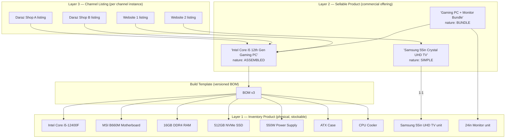
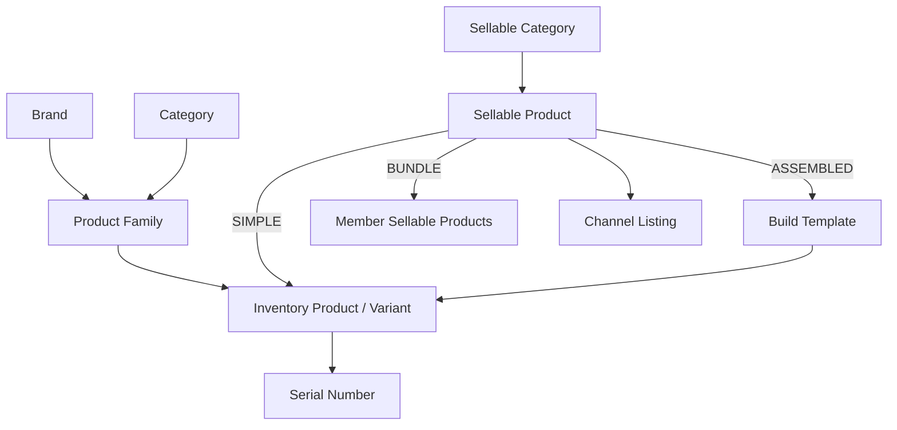
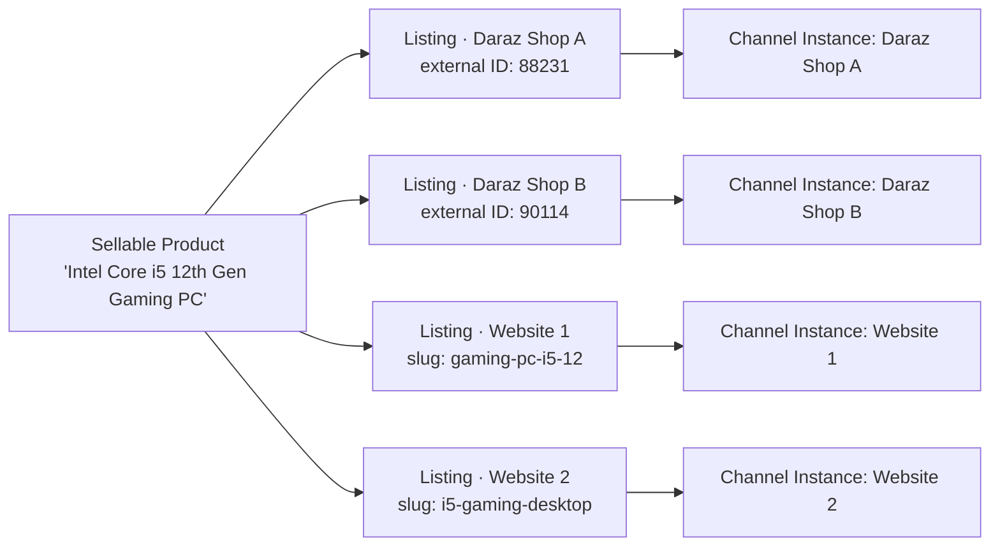
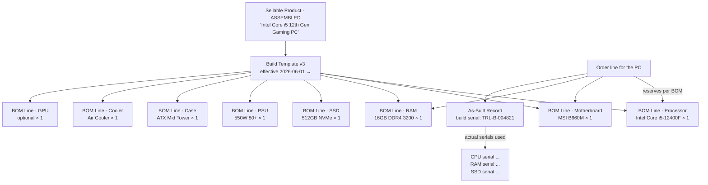

# Product Architecture

**Owner:** Trioloo Technology · **Module:** Product · **Status:** Canonical
**Version:** 1.29.0 · **Ratified:** 2026-08-05 · **Amended:** 2026-08-20 (**§39.17 the operator-facing listing model — `PRD-204`; `PRD-181` retained as persistence, `PRD-184` demoted off the ordinary editing path**) · **Amended:** 2026-08-15 (`§39.10` open register — `.k` orderable-SKU remote identity raised; `.g` owed `PRD-203` migration measured against `V10`) · **Amended:** 2026-08-14 (Candidate media and listing media roles §39.16 `PRD-203`; ✅ `GAP-131` discharged, `PRD-169.a` amended; `PRD-200` refined — `.m` partial text acceptance, `.n` provenance does not propagate, `.o`–`.r` candidate flow and provider neutrality) · **Amended:** 2026-08-14 (Listing package publishing facts §39.14 `PRD-201`; English/Bangla listing content §39.15 `PRD-202`) · **Amended:** 2026-08-14 (AI-assisted authoring readiness §39.13; `PRD-200`; ⚠ no capability created; `GAP-131` raised against `PRD-169.a`) · **Amended:** 2026-08-14 (Listing promotion price §39.11; `PRD-199`; 🔴 `PRD-197` SUPERSEDED — `MRP` is no longer a Listing price) · **Amended:** 2026-08-14 (Listing highlights §39.12; `PRD-198`; `PRD-164` extended) · **Amended:** 2026-08-14 (Listing commercial price §39.11; `PRD-197`; `PRD-029`/`PRD-138`/`PRD-190.b` refined) · **Amended:** 2026-08-13 (Connected Listings §39; `PRD-173`-`PRD-196`; `PRD-085`, `PRD-086`, `PRD-151`, `PRD-172.a`, `PRD-172.b` amended or superseded) · **Amended:** 2026-08-13 (Commercial content and media §38; `PRD-163`-`PRD-172`) · **Amended:** 2026-08-12 (Channel Listing capability codes `PRD-162`) · **Amended:** 2026-08-11 (assembled finished-variant identity `PRD-156`-`PRD-161`) · **Amended:** 2026-08-08 (Sales reconciliation; serial policy `BD-242`; Warehouse & Assembly §17; Purchase & Supplier §18; Marketplace §31; Warranty §32; Return & Exchange) · **Rule prefix:** `PRD-`

---

## Document Control

### Purpose in the documentation set

The canonical specification of the product domain: what Trioloo sells, what it physically stocks, and how the two relate. Every product-touching module derives from it — Inventory, Procurement, Sales, Marketplace, Website, Warehouse, Assembly, Fulfillment, and Order Management.

### ⚠ This document requires an amendment to `SYSTEM_ARCHITECTURE.md`

> **PRD-001 — Trioloo assembles desktop computers from purchased components. Two ratified statements say otherwise and are now factually wrong.**

| Location | Ratified text | Reality |
|---|---|---|
| `SYSTEM_ARCHITECTURE.md` §2.2 | *"Manufacturing and assembly — Trioloo resells; it does not manufacture"* — listed **out of scope for the system** | Trioloo assembles PCs from components |
| `SYSTEM_ARCHITECTURE.md` §18.3 | *"Manufacturing or assembly — the model assumes goods are bought and resold, not produced"* — listed as **requiring amendment** | The amendment is now required |

`SYS §18.3` correctly anticipated that assembly would require an amendment rather than being absorbable by configuration. **That amendment is now due.** Until it is ratified, the assembly content of this document is specification-ahead-of-ratification, in the same posture as `SMA-001`.

**Assembly is not manufacturing.** Trioloo does not produce components; it selects, combines, and tests purchased components into a sellable configuration. The distinction matters because it bounds the scope: no production planning, no work-in-progress accounting across periods, no routing or capacity modelling. What it does require is a bill of materials, a build record, and component-level traceability — all specified here.

### Consistency basis

| Document | Inherited |
|---|---|
| [`MASTER_DOCUMENTATION_INDEX.md`](MASTER_DOCUMENTATION_INDEX.md) | Precedence, ownership, planned-document status |
| [`SYSTEM_ARCHITECTURE.md`](SYSTEM_ARCHITECTURE.md) | Ownership register, scope hierarchy, configuration versioning, adapter discipline |
| [`DATABASE_ARCHITECTURE.md`](DATABASE_ARCHITECTURE.md) | Identity model, temporality, snapshots, archival |
| [`DOMAIN_MODEL.md`](DOMAIN_MODEL.md) | Entities E-017–E-022; this document **adds seven** (§14.1) |
| [`EVENT_ARCHITECTURE.md`](EVENT_ARCHITECTURE.md) | Event principles and naming |
| [`STATE_MACHINE_ARCHITECTURE.md`](STATE_MACHINE_ARCHITECTURE.md) | Record and sync lifecycles |
| [`ORDER_MANAGEMENT_ARCHITECTURE.md`](ORDER_MANAGEMENT_ARCHITECTURE.md) | Catalogued/non-catalogued lines, channel classification, verification dimensions |
| [`AUDIT_ARCHITECTURE.md`](AUDIT_ARCHITECTURE.md) | Audit obligations |
| [`GAP_ANALYSIS.md`](GAP_ANALYSIS.md) | Known gaps, referenced not filled |
| [`DESIGN_CONSTITUTION.md`](DESIGN_CONSTITUTION.md) | UI authority where product has a user-facing consequence |

### Claude Design

The brief instructs reading Claude Design files for Sales & Orders. **The design-system project list is empty** — verified again during this work, the third such verification (`SYS U-9`, `GAP-006`). No Claude Design content exists to read. Product-related UI evidence is taken from [`design-reference/03-new-sale-modal.png`](design-reference/README.md), which shows the **Marketplace item / Stock item** split and the **Sync stock** control — both directly relevant and both cited below.

### What this document is not

> **No UI. No database design. No SQL. No APIs. No code.** Attributes describe what the business must know, not columns or types.

---

## Table of Contents

| § | Section |
|---|---|
| 1 | Purpose |
| 2 | Scope |
| 3 | Business Goals |
| 4 | Architecture Principles |
| 5 | Core Concepts — the three-layer model |
| 6 | Product Identity & SKU Philosophy |
| 7 | Hierarchy, Categories & Naming |
| 8 | Inventory Product |
| 9 | Sellable Product |
| 10 | Channel Listing & Multi-Channel Mapping |
| 11 | Bill of Materials & Assembly |
| 12 | Bundles |
| 13 | Product Mapping |
| 14 | Entities |
| 15 | Lifecycle & State Machines |
| 16 | Versioning |
| 17 | Synchronization Architecture |
| 18 | Business Rules |
| 19 | Validation Rules |
| 20 | Module Responsibilities |
| 21 | Integration Points |
| 22 | Events |
| 23 | Audit Requirements |
| 24 | Permissions |
| 25 | Error Scenarios |
| 26 | Future Extensibility |
| 27 | Unknowns |

---

# 1. Purpose

To resolve a distinction the business depends on and that no existing document captures:

> **What Trioloo sells is not what Trioloo stocks.**

An *"Intel Core i5 12th Gen Gaming PC"* is a real, sellable, listed, orderable product. It is **not** a physical object in any warehouse. What sits on the shelf is a processor, a motherboard, memory, storage, a power supply, a case, a cooler, and possibly a graphics card. The PC comes into existence when those components are assembled against an order.

Meanwhile a **smart television is both** — one sellable product, one physical unit, bought whole and resold whole.

An architecture that assumes sellable and stockable are the same thing cannot represent the first case. An architecture that assumes they are always different adds pointless indirection to the second. This document specifies a model that handles both without special cases.

---

# 2. Scope

## 2.1 In scope

Product identity · categories and hierarchy · the inventory/sellable/listing separation · bills of materials and build templates · assembly relationships · bundles · multi-channel listing and mapping · SKU philosophy · naming strategy · product lifecycle, versioning, and status · synchronization to channels · product metadata and references.

## 2.2 Out of scope

| Excluded | Owner |
|---|---|
| Stock quantities, movements, valuation | Inventory |
| Physical assembly operations, workstations, technicians | Warehouse |
| Supplier selection, purchase orders, acquisition cost | Procurement |
| Order content and lifecycle | Order Management |
| Price *values* and discount policy | This document defines the **structure** and, from `BD-435`, **where an order's price comes from** (§33). **Discount policy remains Order Management's** (`BR-092` – `BR-095`) |
| Tax classification | `GAP-003` — taxation entirely undocumented |
| Product screens and listings UI | `DESIGN_CONSTITUTION.md` |

---

# 3. Business Goals

| # | Goal | Expression |
|---|---|---|
| PG-1 | Sell configurations Trioloo does not stock | The three-layer model (§5) |
| PG-2 | Know exactly what went into every unit shipped | As-built records (§11.6) |
| PG-3 | Compute true cost of an assembled product | Component cost roll-up (§11.8) |
| PG-4 | List one product across many shops and sites without duplication | Channel Listing (§10) |
| PG-5 | Change a build without corrupting history | Build template versioning (§16) |
| PG-6 | ⚠ ~~Never oversell a configuration whose components ran out~~ — **AMENDED 2026-08-09 (`BD-280`, `BD-441`): *know the exposure*, never prevent it.** Overselling against reliable procurement capacity is **deliberate**, and **stock shortage never blocks an Order** | Derived availability (§9.5) as **one of three distinct quantities** (`PRD-112`) |
| PG-7 | Support warranty and returns on assembled goods | Component-level traceability (§11.6) |
| PG-8 | Add marketplaces and sites without touching product definitions | Listing indirection (§10.3) |

---

# 4. Architecture Principles

## 4.1 P1 — Sellable and stockable are different concepts

> **PRD-002 — What is sold and what is stocked are separate entities, related by an explicit mapping. They coincide only by configuration, never by assumption.**

For a television the mapping is one-to-one. For a gaming PC it is one-to-many through a bill of materials. Both are the same mechanism at different settings.

## 4.2 P2 — Only physical things hold stock

> **PRD-003 — Stock is held exclusively against Inventory Products. A Sellable Product never has a stock quantity.**

The availability of *"Intel Core i5 12th Gen Gaming PC"* is not stored; it is **derived** from the availability of its components (§9.5). Storing it would create a figure that could disagree with the parts it depends on — precisely the failure `DB-001` prohibits for stock generally.

## 4.3 P3 — Channel representation is a separate layer

> **PRD-004 — A channel's representation of a product is an entity, not an attribute of the product.**

Trioloo runs multiple Daraz shops and multiple websites. Each holds its own external identifier, its own listing state, its own price, and its own sync position. Modelling these as fields on the product would cap the number of channels at the number of fields.

## 4.4 P4 — Channel type never branches behaviour

> **PRD-005 — "Marketplace Product" and "Website Product" are the same entity class.**

The brief names them separately, and operationally they feel different. Architecturally they are one concept — a **Channel Listing** — distinguished only by the attributes of their Channel Type (`OM §3.1`). Modelling them as two classes would branch on channel identity, which `BR-001` and `SYS-009` prohibit, and would require a third class the day a third channel type appears.

Both terms are retained as **business vocabulary** for the same architectural entity (§10.1).

## 4.5 P5 — Build definitions are versioned; builds are recorded

> **PRD-006 — A build template says what *should* go into a product. An as-built record says what *did* go into one specific unit. Both are retained, permanently.**

They differ whenever a component is substituted — which happens routinely when a part is out of stock. Without the as-built record, warranty and support on assembled goods are guesswork.

## 4.6 P6 — Product definition is Trioloo's; listing status is the channel's

> **PRD-007 — Trioloo is system of record for product definition, specification, BOM, and cost. The channel is system of record for its own listing identifier and listing status** (`SYS-010`, `SYS-011`).
>
> **REFINED (`BD-321`, v1.5.0) — the line moves; it does not disappear.** Listing **content** (title, description, images, attributes, variations) transfers from channel to Trioloo wherever the API permits it. **Identifier and status remain the channel's**, because those are decisions the marketplace makes rather than content anyone authors:
>
> > **What Trioloo authors, Trioloo owns. What the marketplace decides, the marketplace owns.**

---

# 5. Core Concepts — The Three-Layer Model

## 5.1 The layers

## 5.2 Layer definitions

| Layer | Entity | Is it physical? | Does it hold stock? | Does it have an external ID? |
|---|---|---|---|---|
| **1** | **Inventory Product** | **Yes** — occupies a warehouse location | **Yes** | No |
| **2** | **Sellable Product** | **No** — a commercial offering | **No** (`PRD-003`) | No |
| **3** | **Channel Listing** | No — a representation | No | **Yes**, one per channel instance |

## 5.3 The three sellable natures

> **PRD-008 — Every Sellable Product declares exactly one nature, and its nature determines how it resolves to inventory.**

| Nature | Resolves to | Example | Stock resolution |
|---|---|---|---|
| **`SIMPLE`** | Exactly one Inventory Product, 1:1 | Samsung 55″ Crystal UHD TV · 24″ Monitor · HDMI cable | Direct |
| **`ASSEMBLED`** | Many Inventory Products via a Build Template | Intel Core i5 12th Gen Gaming PC | Through BOM (§11) |
| **`BUNDLE`** | Many Sellable Products, shipped together | Gaming PC + Monitor | Recursive through members (§12) |

**Trioloo's actual catalogue maps cleanly:**

| Business line | Nature |
|---|---|
| Smart televisions | `SIMPLE` |
| Monitors, accessories (HDMI cables, peripherals) | `SIMPLE` |
| Desktop computers | **`ASSEMBLED`** |
| Promotional packages | `BUNDLE` |

## 5.4 Assembly is not bundling

> **PRD-009 — Assembly produces one physical unit from many. Bundling ships many units together. They are different mechanisms and must never be conflated.**
>
> **⚠ CLARIFIED (`BD-346`, v1.7.0) — the *partial return* row is narrowed to *partial refund*.** `BD-346` states that on a custom desktop *"individual components may also be returned or exchanged if the issue is limited to a specific component and business policy allows it."* Read against `PRD-009`'s table — *partial return: not possible, the unit is one thing* — the two appear to collide. **They do not, once *return* is separated from *refund*:**
>
> | What happens to the component | Permitted? |
> |---|---|
> | **Replaced or exchanged** — the unit goes back whole | **✅ Yes.** This is the component-level remedy `PRD §5.4` already describes as a warranty claim, and `PRD-135` makes eligibility per component |
> | **Refunded** — unwinding part of the sale | **❌ Not supported, and the model cannot express it** |
>
> **Why the second is blocked rather than merely undecided.** An assembled PC is sold as **one Sellable Product at one price** (`PRD-022`), so a component carries **no separate sale value**. Refunding one would require a **declared allocation basis** — which `PRD-053` defines **only for bundles**, precisely because bundle members *do* have standalone prices.
>
> **`PRD-009` stands. The remedy is component-level; the commercial unit is not.** The business's own hedge — *"if business policy allows it"* — is consistent with this being a conditional remedy rather than a routine unwinding of the sale. **Assumption explicitly marked:** if the business later requires component *refunds* on assembled units, an allocation basis equivalent to `PRD-053` must be declared first (`GAP-092`).

| | Assembly | Bundle |
|---|---|---|
| Physical result | **One** unit | **Several** units |
| Components after | Cease to exist as separate stock | Remain separate, individually identifiable |
| Serials | Component serials recorded in the as-built record; the build carries its own identity | Each member keeps its own serial |
| Partial return | Not possible — the unit is one thing | **Possible** — a member may be returned alone |
| Packaging | One package (usually) | May ship as several packages |
| Warranty | Composite (§11.9) | Per member |

This distinction determines return handling. A customer returning "the monitor from my bundle" is returning one member. A customer returning "the RAM from my PC" is making a warranty claim against a component of a single unit — a completely different process.

---

# 6. Product Identity & SKU Philosophy

## 6.1 Four kinds of identifier

Per `DB §5.4`, identity kinds must not be conflated. Product has four.

| Identifier | Layer | Purpose | Properties |
|---|---|---|---|
| **Internal Product ID** | All | Unambiguous system reference | Opaque, permanent, **meaningless** (`DB-011`) |
| **Inventory SKU** | 1 | Human reference to a physical item | Readable, stable, never reused |
| **Sellable SKU** | 2 | Human reference to a commercial offering | Readable, stable, never reused |
| **Channel Listing ID** | 3 | The **channel's** identifier for its listing | **External, mirrored**, stored with issuing party |

> **PRD-010 — Internal Product IDs carry no business meaning.** An identifier encoding category, brand, or year will need to change when the business changes, and identifiers must never change (`DB-006`, `DB-011`).
>
> **PRD-011 — Inventory SKU and Sellable SKU are separate identifier spaces.** A television has both — they are not the same string and must not be assumed equal. Treating them as one makes the assembled case unrepresentable.
>
> **PRD-012 — Channel Listing IDs are stored with their issuing party** (`DB-013`). Daraz Shop A and Daraz Shop B may legitimately issue the same identifier string for different listings, and two different marketplaces certainly may.
>
> **PRD-013 — A retired SKU is never reissued**, including after archival (`DB-012`, `SYS-031`). SKUs appear on invoices, warranty claims, courier manifests, and marketplace records that outlive the product.

## 6.2 SKU philosophy

> **PRD-014 — A SKU identifies a thing at the granularity at which it is transacted, and at no coarser granularity.**

| Situation | Requires its own Inventory SKU? | Why |
|---|---|---|
| 8GB vs 16GB DDR4 RAM | **Yes** | Different price, different cost, not interchangeable |
| Same RAM, different supplier | **No** — same SKU | Physically equivalent; supplier is a procurement attribute |
| Same RAM model, different speed | **Yes** | Different specification |
| 55″ vs 65″ TV | **Yes** | Different product |
| Same TV, different colour | **Yes** if separately stocked and priced | Granularity follows transaction |

This restates `DM E-020`'s reasoning at inventory level: `OM §7.3` records that verification dimension 3 carries elevated weight because *"desktop computers and smart televisions have close model variants — screen size, panel type, processor, memory, storage — where a small naming error produces an entirely different product at a materially different cost."* SKU granularity is the mechanism that makes that verification possible.

## 6.3 Reconciliation with `DOMAIN_MODEL.md`

| This document | `DOMAIN_MODEL.md` | Relationship |
|---|---|---|
| Inventory Product | **E-020 Product Variant** | The same entity. "Inventory Product" is the business term for a stockable variant |
| Product family | **E-019 Product** | Unchanged |
| Brand, Category | **E-017, E-018** | Unchanged |
| Sellable Product | — | **New** (§14.1) |
| Channel Listing | — | **New** |
| Build Template, BOM Line, As-Built Record | — | **New** |

> **PRD-015 — "Inventory Product" and "Product Variant" are the same entity under two names.** To avoid two vocabularies for one concept (`SYS-016`), **`E-020 Product Variant` remains the canonical entity name**; "Inventory Product" is business shorthand used where the physical/sellable contrast is the point.

---

# 7. Hierarchy, Categories & Naming

## 7.1 Hierarchy

> **PRD-016 — Inventory and Sellable products have separate category trees.** A customer browsing a website sees "Gaming PCs"; a warehouse operator counting stock sees "Processors". Forcing one tree to serve both produces a taxonomy that serves neither.

## 7.2 Category responsibilities

| Category type | Drives |
|---|---|
| **Inventory category** | Storage strategy, counting cycles, QC checks, serialization policy |
| **Sellable category** | Marketplace commission rates, return windows, tax classification, listing taxonomy |

Marketplace commission commonly varies by category (`OM §11.6`), and the relevant category is the **sellable** one, because that is what the marketplace sees.

## 7.3 Naming strategy

> **PRD-017 — Inventory names are precise and technical. Sellable names are market-facing. They are different names for different audiences and are never the same string.**

| Layer | Audience | Style | Example |
|---|---|---|---|
| **Inventory Product** | Warehouse, procurement, verification agents | Brand + model + exact specification, unambiguous | `Intel Core i5-12400F 2.5GHz LGA1700 Tray` |
| **Sellable Product** | Customers, marketplaces | Descriptive, market-oriented | `Intel Core i5 12th Gen Gaming PC` |
| **Channel Listing** | The channel's buyers | **Channel-controlled**, may be keyword-optimised | Varies per shop |

**Why this separation is load-bearing.** `OM §7.3` requires the verification agent to confirm *"the exact model and specification intended"*. An agent verifying against `Intel Core i5 12th Gen Gaming PC` cannot confirm anything — the name does not identify a specification. The agent must be able to see the **inventory-level names of the components** (§11.6), which are precise.

> **PRD-018 — AMENDED (`BD-321`, v1.5.0). Trioloo authors listing content and is authoritative for *intent*; the channel reports *actual state*; a difference between them is `DIVERGED`, never a silent overwrite in either direction.**
>
> | | Owner |
> |---|---|
> | Title, description, images, attributes, variations — **as Trioloo intends them** | **Trioloo**, pushed where the API supports the field (`PRD-125`) |
> | The **actual title the channel displays** | **The channel**, mirrored |
> | A difference between the two | **`DIVERGED`** — an exception (`PRD-030`, `SYS-026`) |
>
> **The original rule's reasoning survives intact and is retained:** a marketplace that rewrites a title for search purposes **has not changed the product**. What changed is the direction of authorship — Trioloo now authors the content rather than accepting whatever the channel holds. **A channel-side rewrite is therefore a divergence to detect, not a fact to absorb.**
>
> *Superseded text (v1.4.0): "Channel listing titles are channel-owned and may diverge from the Sellable Product name. They are mirrored, never authoritative."*

---

# 8. Inventory Product

## 8.1 Definition

| | |
|---|---|
| **Purpose** | A physically stockable item occupying warehouse space |
| **Canonical entity** | `E-020 Product Variant` (`PRD-015`) |
| **Owner module** | Product |
| **Stock held** | **Yes** — by Inventory |

## 8.2 The two roles an Inventory Product plays

> **PRD-019 — An Inventory Product may be sold directly, consumed in a build, or both. The role is not a property of the item; it is determined by how a Sellable Product references it.**

| Role | Example |
|---|---|
| **Component only** | Motherboard, power supply, CPU cooler, case |
| **Directly sellable only** | Smart television |
| **Both** | A graphics card sold standalone **and** used in gaming PC builds; a monitor sold alone and bundled |

The "both" case is the important one: the same physical stock serves two demand streams. Its availability must be visible to both, and reservations from either must reduce the same pool (`BR-052`).

## 8.3 Core attributes

Identity (internal ID, inventory SKU, barcode) · product family, brand, inventory category · exact technical specification · unit of measure · weight and dimensions *(drive courier charges and packing — `OM §8.6`)* · **serialization policy** · **Warranty Package reference** *(`E-070`, versioned — `PRD-132`; supersedes "warranty terms (undefined)", `OM Q-5` closed)* · storage requirements · active period.

## 8.4 Component-specific attributes

Assembly imposes attributes ordinary resale does not:

| Attribute | Purpose |
|---|---|
| **Compatibility attributes** | Socket type, form factor, memory type, wattage, interface — determine whether components can be combined |
| **Substitution group** | Which items are functionally equivalent (§11.7) |
| **Component class** | Processor · Motherboard · RAM · SSD · HDD · PSU · Case · Cooler · GPU · Monitor · Peripheral |

> **PRD-020 — Compatibility attributes are recorded but this document specifies no compatibility *rules*.** Whether a build template is validated for electrical and mechanical compatibility, and by what logic, is an unresolved question (`PRDU-3`). Recording the attributes makes future validation possible; inventing the rules would exceed this document's authority (`DM-001`).

---

# 9. Sellable Product

## 9.1 Definition

| | |
|---|---|
| **Purpose** | A commercial offering the business sells — the thing an order line refers to |
| **Owner module** | Product |
| **Stock held** | **No** (`PRD-003`) |
| **New entity** | `E-058` (§14.1) |

## 9.2 Core attributes

Identity (internal ID, sellable SKU) · **nature** (`SIMPLE`, `ASSEMBLED`, `BUNDLE`) · market-facing name · description and specification summary · sellable category · price list references (`E-022`) · warranty offering · **resolution target** (inventory product, build template, or member list) · lifecycle status · media references.

> ✅ **AMENDED 2026-08-13 — the commercial content attributes named here are now STRUCTURED at `§38`.** **`PRD-163` fixes the full commercial content set, `PRD-164` – `PRD-166` give highlights, feature bullets and specification summary their semantics, and `PRD-167` – `PRD-169` give *media references* an ownership, role, ordering and lifecycle model.** ⚠ **This line is UNCHANGED and remains the attribute inventory; `§38` says what the attributes MEAN.**

## 9.3 The resolution target

> **PRD-021 — Every Sellable Product resolves to inventory by exactly one mechanism, determined by its nature.**

| Nature | Resolution target |
|---|---|
| `SIMPLE` | One Inventory Product, with a quantity per sale unit |
| `ASSEMBLED` | One finished Inventory Product Variant for ready-built units, plus one **active** Build Template version |
| `BUNDLE` | An ordered list of member Sellable Products with quantities |

## 9.4 What an order line references

> **PRD-022 — A catalogued order line references a Sellable Product, never an Inventory Product directly.**

This is a clarification of `OM §4.5`. The customer bought *"Intel Core i5 12th Gen Gaming PC"* — that is what the invoice must say, what the marketplace recorded, and what the customer will reference in a support call. The components are how Trioloo satisfies it, not what was sold.

## 9.5 Availability is derived, never stored

> **PRD-023 — The availability of a Sellable Product is derived from its resolution target and is never stored as a figure.**

| Nature | Derivation |
|---|---|
| `SIMPLE` | Available quantity of the mapped Inventory Product ÷ quantity per sale unit |
| `ASSEMBLED` | Ready-built available quantity for the finished Inventory Product Variant + **the minimum, across all BOM lines, of (component available ÷ quantity required)** |
| `BUNDLE` | The minimum across member availabilities ÷ member quantities |

**The assembled case is the constraining one.** A gaming PC whose every component is plentiful except the power supply — of which three remain — has an availability of three. Publishing any higher number to a marketplace oversells.

> **PRD-024 — Derived availability accounts for reservations, not merely stock on hand** (`BR-052`). Components already reserved for other orders are unavailable, whether reserved for a build or a direct sale (§8.2).

## 9.6 Reservation for assembled products — extension to `BR-006`

> **PRD-025 — An order line for an `ASSEMBLED` Sellable Product reserves each component named in its Build Template, in the required quantities. It does not reserve the Sellable Product, because no such stock exists.**
>
> **PRD-026 — A build reservation is atomic. Either every component is reserved, or none is.**

`PRD-026` prevents the failure mode where a partially-reserved build holds scarce components hostage while waiting for a missing one, blocking other orders that could have been fulfilled completely.

> **PRD-027 — These rules extend `BR-006`.** `BR-006` states that a non-catalogued line may not reserve inventory. It does not address a catalogued line that reserves *something other than itself*. `OM §14` requires amendment to record the assembled case.

---

# 10. Channel Listing & Multi-Channel Mapping

## 10.1 Definition

| | |
|---|---|
| **Purpose** | One channel instance's representation of one Sellable Product |
| **Business names** | *"Marketplace Product"*, *"Website Product"* — the same entity (`PRD-005`) |
| **Owner module** | Product (definition) / Channel adapter (sync state) |
| **New entity** | `E-059` |

## 10.2 Cardinality

> **PRD-028 — One Sellable Product has many Channel Listings. One Channel Listing belongs to exactly one Sellable Product and exactly one Channel Instance.**
>
> ⚠ **AMENDED 2026-08-13 by `PRD-178` and `PRD-190`; original retained under `DOC-009`.** ✅ **The CHANNEL INSTANCE half is unchanged and remains exactly one.** 🔴 **The SELLABLE PRODUCT half now reads: the mapping is carried per ORDERABLE CHANNEL SKU (`E-106`) and is ZERO while `UNMAPPED`, exactly ONE once `MAPPED`** — **two or more simultaneous mappings for one orderable SKU remain invalid.** ⚠ **The one-to-many direction is untouched: one Sellable Product still has many Channel Listings, which is what makes multiple Daraz shops and websites work without duplicating product definitions.**

This structure is what makes *"multiple Daraz shops"* and *"multiple websites"* work without duplicating product definitions. `BR-002` already requires order attribution at channel **instance** level because settlement arrives per shop; listings follow the same granularity for the same reason.

## 10.3 Core attributes

Sellable Product reference · channel instance reference · **external listing identifier** (mirrored, stored with issuing party) · **intended title and description** *(Trioloo-authored, `PRD-018` as amended)* · **channel-reported title and description** *(mirrored, for divergence detection)* · channel-specific price · **published marketplace stock** *(`PRD-126`)* · **publication intent** *(Trioloo)* · **listing status** *(channel)* · sync state and last sync time · channel category mapping · listing-specific media.

> **Intended and reported content are two attributes, not one.** Holding a single title field makes `DIVERGED` undetectable — there would be nothing to compare against. `BD-321` requires the ERP to *"pull the latest listing data so differences can be identified"*, which is only meaningful if both sides are retained.

> ✅ **AMENDED 2026-08-13 — *listing-specific media* is now STRUCTURED at `§38`.** **`PRD-170` makes it an OVERRIDE set with a derived effective-media resolution, `PRD-171` makes that resolution the Product-side outbound intent, and `PRD-172` records that V1 carries NO channel-reported media.** 🔴 **THE TWO-SIDED PRINCIPLE ABOVE IS UNCHANGED AND IS NOT EXTENDED TO MEDIA IN V1** — **it governs title and description, which is exactly what this attribute list has always said** (`DM-060`). ⚠ **`PRD-172` states the consequence explicitly rather than leaving it inferred.**

## 10.4 Why price sits on the listing

> **PRD-029 — Channel-specific price is an attribute of the Channel Listing, not the Sellable Product.**

The same PC may sell at different prices on two Daraz shops and a third price on a website — because marketplace commission differs by shop and channel economics differ. A single price on the product could not express this.

The **agreed price on an order** is a snapshot, unaffected by later listing price changes.

> ⚠ **Amended 2026-08-09 by `BD-435`.** This paragraph read *“a snapshot taken at confirmation”*. **Capture is at Order Line creation** — a Daraz order **arrives already priced**, before verification and well before `CONFIRMED`. `DB-023` is satisfied *a fortiori*, the snapshot existing **earlier** than it requires. See **`PRD-140`**.

> ⚠ **A listing price is what Trioloo *publishes*, not what an order *sold at*.** `§10.5` records price as *pushed by Trioloo*; **`BD-435` confirms the actual price arrives back with the order.** The two are different facts and `PRD-138` keeps them apart.

## 10.5 Daraz relationship

*Amended v1.5.0 — `BD-317`, `BD-318`, `BD-321`, `BD-322`. Daraz is the first marketplace adapter, not the model; every row below is expressed as adapter capability, never as Daraz-specific logic (`PRD-077`).*

| Aspect | Behaviour |
|---|---|
| **Seller account** | **Seven independent accounts** — each its own channel instance with **its own credentials, orders, settlement, receivable and chat** (`BD-317`). Credentials are **instance-scoped configuration**; one adapter serves seven connections |
| Listing identity | Daraz issues its own identifier per shop; mirrored (`PRD-012`) |
| **Title, description, images, attributes, variations** | **Trioloo authors and pushes where the API supports the field**; Daraz-reported values are mirrored for divergence detection (`PRD-018` as amended, `PRD-125`) |
| Category | Daraz taxonomy, mapped to Trioloo sellable category |
| Price | Pushed by Trioloo; Daraz confirms |
| **Stock** | **Published marketplace stock is a per-shop manual decision** (`PRD-126`) — **not** derived availability, and it may deliberately exceed it (`BD-280`, `PRD-112`). Physical inventory is a **single shared pool** across all seven shops (`PRD-127`) |
| **Publication intent** | **Trioloo** — *we want this listed* |
| **Listing status** | **Daraz** — *active · suspended · rejected*. It may suspend unilaterally, and **intent must never overwrite status** (`PRD-128`) |
| **Channel-originated events** | Suspension · rejection · deactivation · category change · **policy violation** — recorded on the listing's activity history (`PRD-129`) |
| Product definition, specification, BOM, cost | Trioloo authoritative — unchanged (`PRD-007`) |

> **PRD-030 — A marketplace may suspend, reject, or alter a listing without notice.** This is the same external-authority pattern as unilateral order cancellation (`OM §6.5`). The listing's sync state moves to `DIVERGED` and an exception is raised (`SYS-026`); it is never silently reconciled in either direction.

## 10.6 Website relationship

| Aspect | Behaviour |
|---|---|
| Listing identity | Trioloo-issued (a slug or site-local reference) |
| Title, description, category | **Trioloo authoritative** — the site is Trioloo's own |
| Price | Trioloo authoritative |
| Stock | Availability pushed |
| Listing status | Trioloo authoritative |

The websites are Trioloo-owned channels (`OM §3.2`), so no external authority applies. **The listing layer still exists**, because multiple websites each need their own identifier, price, and sync state — and because `PRD-005` forbids a separate entity class for the Trioloo-owned case.

## 10.7 Multiple marketplace identifiers

> **PRD-031 — A Sellable Product accumulates one external identifier per channel instance it is listed on, and each is qualified by its issuing channel instance.**

An unqualified external identifier is ambiguous: two Daraz shops may issue the same string, and a future marketplace certainly may. This is `DB-013` applied to products.

---

# 11. Bill of Materials & Assembly

## 11.1 Concepts

| Concept | Definition |
|---|---|
| **Build Template** | The **versioned** definition of what goes into an `ASSEMBLED` Sellable Product |
| **BOM Line** | One component requirement within a template — inventory product, quantity, role, optionality |
| **As-Built Record** | What **actually** went into one specific assembled unit |
| **Substitution Rule** | Which components may replace which, and under what conditions |

## 11.2 Build Template

| | |
|---|---|
| **Purpose** | Define the components required to assemble one unit of a Sellable Product |
| **Owner** | Product |
| **Versioned** | **Yes**, with effective periods (`DB-022`) |
| **New entity** | `E-060` |

**Attributes** — sellable product reference · version · effective period · BOM lines · assembly instructions reference · estimated assembly effort · status.

## 11.3 BOM Line

**Attributes** — inventory product reference · **quantity required** · component role (`Processor`, `Motherboard`, `RAM`, `SSD`, `HDD`, `PSU`, `Case`, `Cooler`, `GPU`) · **optional flag** · substitution group reference · position or sequence.

> **PRD-032 — A BOM line references an Inventory Product, never another Sellable Product.** A build consumes physical things. A Sellable Product composed of other Sellable Products is a **bundle** (§12), not an assembly.
>
> **PRD-033 — BOM lines may be optional.** A gaming PC may be defined with an optional discrete graphics card; the base configuration is buildable without it. Optionality is a property of the line, not a separate template.

## 11.4 Single-level BOM

> **PRD-034 — Build Templates are single-level. A BOM line resolves directly to a stockable Inventory Product and never to another Build Template.**

Trioloo assembles; it does not manufacture sub-assemblies. Multi-level BOMs introduce work-in-progress accounting, sub-assembly stock, and production routing — none of which this business performs. `SYS §2.2` correctly excludes manufacturing; this rule keeps assembly on the right side of that boundary.

If Trioloo ever pre-assembles and stocks a sub-unit, that sub-unit becomes an **Inventory Product in its own right** and the model still holds — but the decision to do so requires an amendment (`PRDU-6`).

## 11.5 The assembly relationship

## 11.6 As-Built Record

| | |
|---|---|
| **Purpose** | Record what physically went into one specific assembled unit |
| **Owner** | Warehouse (capture) / Product (definition) |
| **New entity** | `E-062` |

**Attributes** — order and order line reference · build template version used · **each component actually used, with its serial where serialized** · substitutions applied with reason · assembling technician · build date · test or QC outcome · **build serial**.

> **PRD-035 — Every assembled unit has an as-built record. It is created during assembly and retained permanently.**
>
> **PRD-036 — The as-built record captures actual component serials, not merely component types.** This is what makes `BR-047` enforceable on assembled goods.

**Why this is not optional.** `BR-047` makes serial verification mandatory at return QC, because *"without it a customer can return a different or older unit; on desktops and televisions this is the principal return-fraud vector."* On an assembled PC the vector is worse: a customer can return the **same case** with a **cheaper graphics card** substituted. Only a component-level as-built record detects that.

> **PRD-037 — Whether the assembled unit carries a Trioloo-issued build serial in addition to its component serials is unresolved** (`PRDU-1`). This document specifies the attribute because return authentication and warranty require a unit-level identity; **whether it is physically affixed, and how, is an operational decision**.

## 11.7 Substitution

> **PRD-038 — Substitution is expected, permitted within defined groups, and always recorded.**

| Rule | Statement |
|---|---|
| **PRD-039** | A substitution outside a defined substitution group requires authority and a recorded reason |
| **PRD-040** | Every substitution is recorded on the as-built record with the intended and actual component |
| **PRD-041** | A substitution that changes the advertised specification requires **customer agreement** before dispatch |

**PRD-041 is a commercial protection.** A customer who ordered a PC advertised with a 512GB SSD and received a 256GB one has grounds for return, and the return will be attributed to Trioloo fault (`BR-045`). Silent downward substitution converts a stock problem into a return, a refund, and a reputational cost.

## 11.8 Cost of an assembled product

> **PRD-042 — The cost of an assembled unit is the sum of the actual costs of the components in its as-built record, plus assembly cost.**

| Component of cost | Source |
|---|---|
| Component acquisition cost | Procurement per component, at the valuation method in force |
| ~~Landed cost allocation~~ | **NOT USED — `BD-297`.** Freight, transport, import duty and clearing are **period business expenses**, never capitalised into product cost. `GAP-046` closed by removal (`PRD-121`) |
| Assembly labour and overhead | **Undefined** (`PRDU-2`) |

**Consequences — settled 2026-08-06.** This section previously recorded that an assembled product's cost *"can in principle be exact rather than averaged"* through specific identification, pending the valuation method.

**The method is Weighted Average Cost** (`BD-298`, closing `GAP-005`). Specific identification is **not** used, and the cost of a build is **averaged, not exact**.

This is coherent rather than a compromise: specific identification requires serials, and `BD-265` establishes that components on desktop PCs are usually not serialized. Weighted average is the only method available without unit-level identity. See `PRD-122`.

Until then, `BR-007` applies with force: an assembled product whose component costs are unknown produces a margin that is **unknown, not zero** (`SYS-034`).

## 11.9 Warranty on assembled products

> **PRD-043 — An assembled product's warranty is composite: each component carries its manufacturer's term, and Trioloo may offer its own term on the build as a whole.**

This creates a genuine complication that resale does not have: a PC sold with a three-year CPU warranty, a two-year motherboard warranty, and a one-year power supply warranty has no single expiry date. A claim must resolve to the **component** that failed, which requires the as-built record.

> **PRD-044 — AMENDED (`BD-337`, v1.6.0). Warranty claims on assembled products resolve to a component via the as-built record *plus the repair history*.** Without both, the claim cannot be attributed and Trioloo cannot recover from the supplier.
>
> **Why the amendment was unavoidable.** `PRD-044` as written assumed the as-built record describes what is **currently** inside the unit. **After a repair it does not** — a replaced component means the physical unit differs from its as-built record, and `BD-290` records replaced parts on the **repair**, not on the as-built.
>
> | Record | Describes |
> |---|---|
> | `E-062` As-Built Record | **What went in at build** — a historical fact, correctly immutable (`DB-003`) |
> | `E-072` Repair | **What was changed afterwards** |
> | **Current configuration** | **Neither alone — the composition of both** |
>
> **The as-built record is not wrong and must not be updated.** What was missing is the **derived current view**. Whether it is computed on demand or maintained is an architecture decision (`GAP-089`).
>
> *Superseded text (v1.5.0): "…resolve to a component via the as-built record."*

`OM Q-5` records that standard warranty terms are unconfirmed; the composite case makes that gap more consequential (`PRDU-4`).

## 11.10 When components are consumed

> **PRD-045 — Components are consumed from stock at assembly, not at dispatch. The assembled unit is not itself stock.**

This is a **departure from `BR-054`**, which deducts stock at dispatch. It is justified because at assembly the components physically cease to exist as separate items — they cannot be picked for another order, counted, or sold. Continuing to carry them as stock until dispatch would misstate physical reality, which is the exact concern `BR-054` was written to protect.

> **PRD-046 — `PRD-045` requires an amendment to `ORDER_MANAGEMENT_ARCHITECTURE.md` §14.4.** Until ratified, it is specification-ahead-of-ratification.
>
> ✅ **DISCHARGED 2026-08-09.** `OM §14.4` was amended: **`BR-054` is scoped to ordinary finished and sellable goods**, and **`BR-143` deducts build components at the physical assembly or install point**, with **`BR-144` forbidding a second deduction at dispatch.** **`PRD-045` is no longer specification-ahead-of-ratification.** **The historical status is preserved here under `DOC-009`** — it stood outstanding from v1.0.0 until today.

**Build-to-order is assumed.** Whether Trioloo ever builds to stock — assembling units in advance of demand — is unresolved (`PRDU-5`). If it does, the assembled unit **becomes an Inventory Product** with its own stock, and the model accommodates this without structural change: the build's output is registered as a stockable item and `BR-054` applies normally to it.

---

# 12. Bundles

## 12.1 Definition

| | |
|---|---|
| **Purpose** | Sell several Sellable Products together as one commercial offering |
| **Nature** | `BUNDLE` |
| **New entity** | `E-063` Bundle Member |

**Member attributes** — member Sellable Product reference · quantity · optional flag · price contribution basis.

## 12.2 Rules

| Rule | Statement |
|---|---|
| **PRD-047** | A bundle member is a **Sellable Product**, which may itself be `SIMPLE` or `ASSEMBLED` |
| **PRD-048** | Bundle nesting is **limited to one level** — a bundle may not contain a bundle |
| **PRD-049** | Bundle availability is the minimum across members, adjusted for quantity (`PRD-023`) |
| **PRD-050** | Bundle members remain **individually identifiable** through fulfillment, delivery, and return |
| **PRD-051** | A bundle may be **partially returned** — one member without the others — subject to policy |

**PRD-048** prevents combinatorial explosion in availability derivation and pricing. **PRD-051** is the operational consequence of `PRD-009`: because bundle members remain separate physical units, partial return is physically possible, and the return policy must address it (`GAP-064` — return windows and eligibility are undefined).

## 12.3 Bundle pricing

> **PRD-052 — A bundle's price is set on the bundle, not computed from its members.** The discount relative to member prices is the commercial point of a bundle.
>
> **PRD-053 — For partial return, the refundable value of a member is derived from a declared allocation basis, not from that member's standalone price.**

Without `PRD-053`, a customer returning one member of a discounted bundle could be refunded more than the bundle's proportional value — the classic bundle-arbitrage failure.

---

# 13. Product Mapping

## 13.1 The mapping problem

`OM §4.5` establishes that order lines may be **non-catalogued** — a product name typed manually rather than selected from the catalogue. The observed New Sale modal offers exactly this: a **Marketplace item** block for typed names alongside a **Stock item** block for catalogue selection (`design-reference/03-new-sale-modal.png`).

`BR-008` requires each non-catalogued line to carry an open mapping task, with the unmapped count trending to zero. **`GAP-059` records that no mapping process is documented.**

## 13.2 What mapping resolves to

> **PRD-054 — A non-catalogued line maps to a Sellable Product, not to an Inventory Product** (`PRD-022`).

## 13.3 Mapping rules

| Rule | Statement |
|---|---|
| **PRD-055** | A mapping records the free text, the resolved Sellable Product, the resolving actor, and the date |
| **PRD-056** | A mapping may be reused — the same free text from the same channel resolves the same way — but reuse is a **suggestion requiring confirmation**, never automatic |
| **PRD-057** | Mapping a line **does not retroactively alter the order's snapshots** (`DB-023`); it establishes the product reference so cost and margin become computable |
| **PRD-058** | Whether mapping recomputes margin on a **closed** order is unresolved (`PRDU-7`) |

**PRD-056 is deliberately conservative.** Automatic mapping on text match would silently attach the wrong product — and on a catalogue where "i5 Gaming PC" and "i5 Gaming PC Pro" differ by a graphics card and several thousand taka, a wrong automatic match is a real financial error.

## 13.4 Channel product mapping

> **PRD-059 — An inbound marketplace order line is resolved to a Sellable Product through the Channel Listing that carries the marketplace's product identifier.**

This is the normal path and it is exact — the marketplace tells Trioloo which listing was ordered, and the listing points to one Sellable Product. Non-catalogued lines arise when that resolution **fails**: an unmapped listing, a manually captured order, or a marketplace item never registered in the catalogue.

> **PRD-060 — A marketplace order whose listing cannot be resolved raises an exception** (`SYS-022`) **and produces a non-catalogued line rather than a guess.**

---

# 14. Entities

## 14.1 New entities — `DOMAIN_MODEL.md` amendment required

> **PRD-061 — This document introduces seven entities not present in `DOMAIN_MODEL.md`. Registering them requires amending its §14 register, §15 ownership index, and Appendix A.**

| ID | Entity | Purpose | Owner |
|---|---|---|---|
| **E-058** | **Sellable Product** | A commercial offering | Product |
| **E-059** | **Channel Listing** | One channel instance's representation | Product / adapter |
| **E-060** | **Build Template** | Versioned BOM for an assembled product | Product |
| **E-061** | **BOM Line** | One component requirement | Product |
| **E-062** | **As-Built Record** | What actually went into one unit | Warehouse |
| **E-063** | **Bundle Member** | One member of a bundle | Product |
| **E-064** | **Substitution Group** | Functionally equivalent components | Product |

## 14.2 Existing entities affected

| Entity | Effect |
|---|---|
| `E-019` Product | Unchanged — the family layer |
| `E-020` Product Variant | **Confirmed as the Inventory Product** (`PRD-015`) |
| `E-021` Serial Number | Now also referenced by As-Built Records (`PRD-036`) |
| `E-022` Price List | Now scoped by Channel Listing as well (`PRD-029`) |
| `E-032` Order Item | Now references a **Sellable Product** (`PRD-022`) |
| `E-027` Stock Reservation | Now created per BOM line for assembled lines (`PRD-025`) |

---

# 15. Lifecycle & State Machines

## 15.1 Product record lifecycle

Products follow the master record lifecycle at `SYS §7.1` — `DRAFT → ACTIVE → SUSPENDED → ARCHIVED`. **Not restated** (`SYS-016`).

| Rule | Statement |
|---|---|
| **PRD-062** | A product referenced by any historical order is **archived, never deleted** (`SYS-024`, `DB-028`) |
| **PRD-063** | `ARCHIVED` prevents **new** references; existing references remain permanently valid |
| **PRD-064** | Archiving a Sellable Product does not archive its Inventory Products — components usually remain in use by other builds |
| **PRD-065** | An Inventory Product cannot be archived while any **active** Build Template references it |

## 15.2 Channel Listing sync lifecycle

Channel Listings follow the **integration sync lifecycle** at `SYS §7.1` — `PENDING → IN_PROGRESS → SYNCED | FAILED → MANUAL_REQUIRED`, with `DIVERGED` when the mirror no longer matches its source.

> **PRD-066 — No new state machine is introduced for listings.** The ratified sync lifecycle already models exactly this, and inventing a parallel machine would duplicate it (`SYS-016`, `SMA-002`).

| State | Meaning for a listing |
|---|---|
| `PENDING` | A change awaits publication to the channel |
| `SYNCED` | Channel reflects Trioloo's intent |
| `FAILED` | Publication rejected; retry scheduled |
| `MANUAL_REQUIRED` | Retries exhausted — **a normal state** (`SYS-025`), not a failure |
| `DIVERGED` | Channel-side state differs from Trioloo's record — **always an exception** (`SYS-026`) |

`PRD-030` — a marketplace suspending a listing produces `DIVERGED`, never a silent local update.

## 15.3 Build Template lifecycle

| State | Meaning |
|---|---|
| `DRAFT` | Being defined; not buildable |
| `ACTIVE` | The version used for new builds |
| `SUPERSEDED` | Replaced by a later version; retained for historical as-built records |
| `WITHDRAWN` | No longer buildable |

> **PRD-067 — Exactly one Build Template version is `ACTIVE` for a Sellable Product at any effective date.**
> **PRD-068 — Superseded versions are retained permanently**, because as-built records reference them and `DB-003` forbids the past moving.

---

# 16. Versioning

## 16.1 What is versioned

| Subject | Versioned? | Mechanism |
|---|---|---|
| **Build Template** | **Yes** — effective-dated | `DB-022` |
| Product specification | Yes — history retained | `DB-025` |
| Price | Yes — effective-dated price lists | `DB-022` |
| Sellable Product nature | **No** — see `PRD-070` |
| Channel Listing content | Change history retained | `DB-068` |
| Category and taxonomy | Yes | `SYS-021` |

## 16.2 Rules

> **PRD-069 — Changing a Build Template creates a new version. It never edits the active one.**
>
> Editing in place would silently rewrite what past units were built from, corrupting warranty attribution, support, and cost. This is `DB-003` — the past does not move — applied to assembly.

> **PRD-070 — A Sellable Product's nature is immutable.** A `SIMPLE` product does not become `ASSEMBLED`. If the business begins assembling something it previously resold whole, that is a **new Sellable Product**, because its cost basis, availability derivation, warranty model, and return handling all change.

> **PRD-071 — An order references the Build Template version in force at its own date** (`DB-022`), and the as-built record names the version actually used — which may differ if the build occurred after a version change (`PRDU-8`).

---

# 17. Synchronization Architecture

## 17.1 Direction of authority

| Data | Authoritative | Direction |
|---|---|---|
| Product definition, specification, BOM, cost | **Trioloo** | Push to channel |
| Price | **Trioloo** | Push |
| **Availability** | **Trioloo** | Push (derived — `PRD-023`) |
| Listing identifier | **Channel** | Mirror |
| Listing status (active, suspended, rejected) | **Channel** | Mirror |
| Channel-side title, category placement | **Channel** | Mirror |
| Orders against the listing | **Channel** | Mirror (`OM §3.5`) |

> ⚠ **THIS TABLE PREDATES `BD-321` AND IS SUPERSEDED IN PART. Annotated 2026-08-13; retained under `DOC-009`.** 🔴 **`PRD-018` as amended reversed content authorship: title, description, images, attributes and variations are AUTHORED BY TRIOLOO and pushed where the adapter supports the field, while the channel's values are MIRRORED for divergence detection** — so the *Channel-side title, category placement* row now describes only the REPORTED side of a two-sided pair (`PRD-181`). ⚠ **The *Availability* row was already amended by `PRD-073`: what is pushed is manually maintained Published Marketplace Stock, never a derived figure** (`PRD-126`, `PRD-193`). ✅ **The identifier and status rows are unchanged and remain channel-owned** (`PRD-012`, `PRD-128`).

## 17.2 Rules

| Rule | Statement |
|---|---|
| **PRD-072** | Synchronization is **per Channel Listing**, never per Sellable Product — each channel instance syncs independently |
| **PRD-073** | ⚠ ~~Availability pushed to a channel is the **derived** figure, computed at push time~~ — **AMENDED `BD-280` (§29.2): what is pushed is **Published Marketplace Stock**, a manually maintained figure** |
| **PRD-074** | A sync failure on one listing never blocks other listings or the sale itself (`SYS-054`) |
| **PRD-075** | Every sync exchange is idempotent (`SYS-045`) and records provenance (`SYS-046`) |
| **PRD-076** | **Manual sync is a permanent capability** (`SYS-012`, `BR-029`) — the observed **Sync stock** control is evidence it already exists |
| **PRD-077** | Channel-specific sync logic lives **only in the adapter** (`BR-005`, `SYS-009`) |

## 17.3 The assembled-availability sync problem

> **PRD-078 — Component stock movement changes the availability of every assembled Sellable Product whose BOM contains that component, across every channel it is listed on.**

Selling one power supply may reduce the published availability of several PC configurations across four channel instances. This fan-out is inherent to the assembled model, not a design flaw — but it means availability sync is **event-driven from component movement**, not from sellable-product changes.

> ❌ ~~**PRD-079** — Over-publication is the failure to avoid. Where derived availability cannot be recomputed in time, the safe direction is to publish **less** than derived, never more. Overselling a marketplace order carries cancellation penalties on top of the customer cost.~~
>
> **WITHDRAWN — `BD-280`, 2026-08-06, propagated here 2026-08-09.** **Publishing more than is held is the deliberate model**, backed by reliable procurement capacity (`PRD-112`, §29.2), and **`BD-441` confirms the consequence: those orders proceed and stock may go negative.** **The withdrawal was ratified at §29.2 and this original statement was never struck** — it read as live for three days. **Retained under `DOC-009`; the risk it names is real and is now knowingly carried, not prevented.**

---

# 18. Business Rules

Consolidated index. Statements are at their section of origin.

| Group | Rules |
|---|---|
| Amendment status | PRD-001, PRD-027, PRD-046, PRD-061 |
| Principles | PRD-002 – PRD-007 |
| Natures and resolution | PRD-008, PRD-009, PRD-021, PRD-022 |
| Identity and SKU | PRD-010 – PRD-015 |
| Hierarchy and naming | PRD-016 – PRD-018 |
| Inventory product | PRD-019, PRD-020 |
| Availability and reservation | PRD-023 – PRD-026 |
| Channel listing | PRD-028 – PRD-031 |
| BOM and assembly | PRD-032 – PRD-037 |
| Substitution | PRD-038 – PRD-041 |
| Cost and warranty | PRD-042 – PRD-044 |
| Consumption | PRD-045 |
| Bundles | PRD-047 – PRD-053 |
| Mapping | PRD-054 – PRD-060 |
| Lifecycle | PRD-062 – PRD-068 |
| Versioning | PRD-069 – PRD-071 |
| Synchronization | PRD-072 – PRD-079 |
| Validation | PRD-080 – PRD-088 |
| **Order-specific build and recommendation** | **PRD-144 – PRD-147** |
| **CSV interchange** | **PRD-148 – PRD-153** |
| **Permission vocabulary** | **PRD-154** |

---

# 19. Validation Rules

| Rule | Statement |
|---|---|
| **PRD-080** | A Sellable Product must declare a nature and a resolution target consistent with it |
| **PRD-081** | An `ASSEMBLED` product must reference exactly one `ACTIVE` Build Template |
| **PRD-082** | A Build Template must contain at least one non-optional BOM line |
| **PRD-083** | A BOM line quantity must be positive and expressed in the component's unit of measure (`DB-040`) |
| **PRD-084** | A BOM line must reference an `ACTIVE` Inventory Product (`SYS-024`) |
| **PRD-085** | ⚠ ~~A Channel Listing must reference exactly one Sellable Product and one Channel Instance~~ — **AMENDED 2026-08-13 by `PRD-178`: an `UNMAPPED` listing references ZERO Sellable Products; a `MAPPED` one references exactly ONE. Two or more remain invalid, and the Channel Instance remains exactly one** |
| **PRD-086** | A Channel Listing's external identifier must be unique **within its channel instance**, not globally (`PRD-012`) — ⚠ **AMENDED 2026-08-13 by `PRD-188`: the identifier MAY BE ABSENT before a successful remote creation. Uniqueness once assigned is unchanged** |
| **PRD-087** | A bundle must contain at least two members and no member that is itself a bundle (`PRD-048`) |
| **PRD-088** | An as-built record must account for every non-optional **component line of the BUILD SPECIFICATION SOURCE the job executed** — a Build Template version's BOM lines, **or a confirmed `E-103` Order-Specific Build Configuration's `E-104` lines** (`INV-62.2`, `WHS-076`). 🔴 **AMENDED 2026-08-11** (`GAP-129`). **v1.12.0 read:** ~~*"must account for every non-optional BOM line of the template version used"*~~ — ⚠ **retained, not erased** (`DOC-009`). ✅ **The completeness obligation is unchanged; only the source it is measured against is generalised** |

> **PRD-089 — Compatibility between components is *not* validated by this specification** (`PRD-020`, `PRDU-3`). A template pairing an incompatible processor and motherboard would pass every rule above. Whether the system should prevent this is an open decision.

---

# 20. Module Responsibilities

| Module | Responsibility |
|---|---|
| **Product** | Owns Sellable Products, Build Templates, BOM lines, bundles, substitution groups, listings, categories, naming |
| **Inventory** | Owns stock against Inventory Products; serves availability; consumes components at assembly |
| **Warehouse** | Performs assembly; **captures as-built records and component serials** |
| **Procurement** | Owns component acquisition and cost; landed cost (`GAP-046`) |
| **Order Management** | References Sellable Products on order lines; requests reservations |
| **Accounting** | Consumes cost roll-up for COGS and margin (`GAP-002`) |
| **Channel adapters** | Own listing sync mechanics; all channel-specific logic (`PRD-077`) |
| **Reporting** | Presents product performance; owns no product figure (`DB-067`) |

---

# 21. Integration Points

| Integration | Product involvement |
|---|---|
| **Daraz (per shop)** | Listing publication, price push, availability push, listing-status mirror, order line resolution (`PRD-059`) |
| **Websites (per site)** | Listing publication, price, availability; Trioloo authoritative throughout |
| **Future marketplaces** | New channel instance + adapter; **no product-model change** (`PRD-028`) |
| **Manual channels** (Facebook, WhatsApp, phone, walk-in) | No listings; orders reference Sellable Products directly, with non-catalogued lines resolved by mapping (§13) |
| **Procurement** | Component definitions and acquisition cost |
| **Inventory** | Availability queries and reservation requests |

---

# 22. Events

Following `EVENT_ARCHITECTURE.md` naming (`SYS §13.5`). These extend the `MasterData` group (EVT-073–075).

| Event | Class | Purpose |
|---|---|---|
| `Product.SellableCreated` / `Changed` / `Archived` | Internal · Manual | Commercial offering lifecycle |
| `Product.InventoryProductCreated` / `Changed` / `Archived` | Internal · Manual | Physical item lifecycle |
| `Product.BuildTemplateVersionActivated` | Internal · Manual | **New build definition effective** (`PRD-069`) |
| `Product.BuildTemplateWithdrawn` | Internal · Manual | No longer buildable |
| `Product.AsBuiltRecorded` | Internal · Manual | **A unit was assembled; components and serials captured** |
| `Product.SubstitutionApplied` | Internal · Manual | A component was substituted (`PRD-040`) |
| `Product.ListingCreated` / `Updated` / `Withdrawn` | Internal · Manual | Channel listing lifecycle |
| `Product.ListingSynced` / `SyncFailed` / `Diverged` | External · Automatic | Sync lifecycle (`SYS §7.1`) |
| `Product.AvailabilityRecomputed` | Internal · Automatic | Derived availability changed (`PRD-078`) |
| `Product.MappingResolved` | Internal · Manual | A non-catalogued line was mapped (`PRD-055`) |
| `Product.MappingFailed` | Internal · Automatic | A marketplace listing could not be resolved (`PRD-060`) |

> **PRD-090 — `Product.AsBuiltRecorded` is the most consequential product event.** It fixes component cost, establishes warranty attribution, and creates the record on which return authentication depends.

---

# 23. Audit Requirements

| Rule | Statement |
|---|---|
| **PRD-091** | Every product and listing change is audited with before and after values (`DB-068`) |
| **PRD-092** | **Build Template version activation is audited** — it changes what every future unit contains |
| **PRD-093** | **Every as-built record is permanently retained** and is audit evidence for warranty and return disputes (`AUD-021`) |
| **PRD-094** | Every substitution is audited with intended component, actual component, reason, and authorising actor |
| **PRD-095** | Price changes on listings are audited (`AUD §12.2` — direct revenue impact) |
| **PRD-096** | Mapping decisions are audited with the resolving actor (`PRD-055`) |
| **PRD-097** | As-built retention follows the **longest** applicable obligation — warranty term from delivery, not build date (`AUD-017`) |

---

# 24. Permissions

| Action | Authority |
|---|---|
| Create or change an Inventory Product | Product administrator |
| Create or change a Sellable Product | Product administrator |
| **Activate a Build Template version** | Product administrator **with approval** — blast radius is every future build |
| Record an as-built | Warehouse technician |
| **Apply a substitution within a group** | Warehouse technician |
| **Apply a substitution outside a group** | Warehouse supervisor, with reason (`PRD-039`) |
| Set or change a listing price | Sales administrator, **bounded** (`PRM-008`) |
| Publish or withdraw a listing | Sales administrator — 🔴 **outbound marketplace mutation** (`product.channel-listing.publish`, `PRD-196`) |
| Resolve a product mapping | Sales or Product administrator |
| **Request a channel synchronisation** *(added 2026-08-13, `PRD-196`)* | Sales or Product administrator — **channel-scoped inbound read; confers NO outbound authority** |
| **View component cost** | Restricted sensitive class (`PRM-011`, `DB-074`) |

> **PRD-098 — Component cost visibility is separately grantable.** A warehouse technician assembling a PC needs the component list and serials; they have no business need for component cost. This is `PRM-011` applied to the assembly floor.

---

# 25. Error Scenarios

| Scenario | Required behaviour |
|---|---|
| Component out of stock mid-build | Build halts; exception raised; substitution considered (§11.7); order to `Order:ON_HOLD` |
| Substitution changes advertised specification | **Customer agreement required before dispatch** (`PRD-041`) |
| Derived availability published higher than actual | Overselling; cancellation penalty risk (`PRD-079`) — publish conservatively |
| Listing rejected or suspended by marketplace | `DIVERGED`; exception raised; never silently reconciled (`PRD-030`, `SYS-026`) |
| Two channel instances issue the same external identifier | Distinguished by issuing instance (`PRD-012`, `PRD-086`) |
| Build Template changed while orders are in flight | Orders retain the version in force at their date (`PRD-071`) |
| As-built record incomplete at dispatch | **Dispatch refused** — mirrors `BR-022` for serials |
| Returned PC has a component serial not in its as-built record | **Return fraud** — escalate, withhold refund (`BR-047`, `OM §12.5` step 7) |
| Non-catalogued line cannot be mapped | Remains unmapped; order flagged economically incomplete (`BR-007`) |
| Inventory Product archived while an active template uses it | Refused (`PRD-065`) |
| Bundle member returned alone | Permitted subject to policy; refund by allocation basis (`PRD-051`, `PRD-053`) |
| Assembled product's component costs unknown | Margin is **unknown, not zero** (`BR-007`, `SYS-034`) |

---

# 26. Future Extensibility

| Scenario | Absorption | Core change? |
|---|---|---|
| **Additional Daraz shops** | New channel instance + listings | **No** |
| **Additional websites** | New channel instance + listings | **No** |
| **Future marketplaces** | New channel type + adapter; listing layer unchanged | **No** |
| **New PC configurations** | New Sellable Product + Build Template | **No** |
| **New component categories** | New inventory category + component class | **No** |
| **Configurable / build-to-order PCs** (customer picks components) | Extension of Build Template with customer-selectable BOM lines | **Extension** (`PRDU-9`) |
| **Build to stock** | Assembled unit registered as an Inventory Product; `BR-054` then applies normally | **Extension** (`PRDU-5`) |
| **Multi-level BOM / sub-assemblies** | Would require WIP accounting | **Amendment** (`PRD-034`, `PRDU-6`) |
| **Kits sold for self-assembly** | A bundle of components — already supported | No |
| **Refurbished / open-box products** | Condition grades — **undefined** (`GAP-047`) | Blocked on that gap |
| **Multi-company product sharing** | Scope already carried; sharing policy undecided | `SYS U-1` |

---

# 27. Unknowns

| # | Unknown | Affects | Recorded as |
|---|---|---|---|
| ~~**PRDU-1**~~ | ~~Does an assembled unit carry a Trioloo-issued build serial?~~ | — | **CLOSED — `BD-283`. Build ID mandatory; physical marking optional; not customer-facing** (`PRD-116`) |
| ~~**PRDU-2**~~ | ~~Is assembly labour and overhead costed into the product?~~ | — | **CLOSED — `BD-286`. Supported but optionally zero** (`PRD-119`). The earlier "appears excluded" reading was wrong and is corrected at `PRD-103` |
| ~~**PRDU-3**~~ | ~~Should component compatibility be validated?~~ | — | **CLOSED — `BD-284`. Warn, never block** (`PRD-118`) |
| ~~**PRDU-4**~~ | ~~Warranty terms per component class, and Trioloo's own build warranty~~ | §11.9 | **CLOSED — `BD-092`. Composite warranty confirmed exactly as `PRD-043` specified.** See `PRD-100` |
| ~~**PRDU-5**~~ | ~~Does Trioloo ever build to stock, or strictly to order?~~ | §11.10 | **CLOSED — `BD-098`, `BD-100`. Both modes, build-to-order primary.** See `PRD-101` |
| **PRDU-6** | Will sub-assemblies ever be pre-built and stocked? | `PRD-034` | New |
| **PRDU-7** | Does mapping a non-catalogued line recompute margin on a **closed** order? | §13.3 | `PRD-058`, `GAP-059` |
| **PRDU-8** | If a build occurs after a template version change, which version governs? | §16 | `PRD-071` |
| **PRDU-9** | Will customers configure their own builds (select components at order time)? | §26 | New |
| **PRDU-10** | Are televisions and monitors ever serialized differently from components? | §8, `OM Q-4` | `OM Q-4` |
| ~~**PRDU-11**~~ | ~~Component cost basis~~ | — | **CLOSED — `BD-298`. Weighted Average Cost** (`PRD-122`) |
| ~~**PRDU-12**~~ | ~~Landed cost composition for imported components~~ | — | **CLOSED — `BD-297`. No landed cost; period expenses** (`PRD-121`) |
| **PRDU-13** | Sellable category taxonomy and its mapping to marketplace categories | §7.2 | New |
| **PRDU-14** | Tax classification per sellable category | §2.2 | `GAP-003` |

> **PRD-099 — An entry here is an open question, not a decision.** No implementation may resolve one by choosing an answer in code (`DOC-003`, `DOC-024`).

---

# 28. Discovery Reconciliation — 2026-08-06

Sales discovery (`BUSINESS_DISCOVERY.md`, 116 answers) confirmed most of this document and contradicted one rule. Confirmations are recorded because a specification written ahead of confirmation and later validated is materially stronger than one still unverified.

## 28.1 Confirmed

> **PRD-100 — Composite warranty is confirmed** (`BD-092`, closing `PRDU-4`). Each component carries its manufacturer's term and Trioloo offers its own term on the build; there is no single expiry date. `PRD-043` and `PRD-044` stand exactly as written. **The As-Built Record is now load-bearing for warranty**, not merely useful — a claim cannot be attributed to a component without it.
>
> A **"warranty package"** concept appeared in `BD-092` that this document does not model. `BD-237`, `BD-238` ask what it is.

> **PRD-101 — Trioloo builds both to order and to stock, with build-to-order primary** (`BD-098`, `BD-100`, closing `PRDU-5`). §11.10's "build-to-order is assumed" caveat is withdrawn. **The structure anticipated this correctly and requires no change**: a built-to-stock unit is registered as an Inventory Product in its own right and `BR-054` applies to it normally.
>
> `PRD-023`'s availability derivation **needs extending** to account for finished units held in stock alongside component-derived availability. `BD-245` (priority) asks how the two are combined.

> **PRD-102 — Substitution requires customer confirmation where specification or price changes** (`BD-102`). This **matches `PRD-041` almost verbatim** — an independent statement of a rule written before it was asked.
>
> The business is **stricter than this document in two ways**, both in the safe direction:
>
> | | This document | Business |
> |---|---|---|
> | Brand change | Within a substitution group, no consent needed (`PRD-038`) | **Triggers customer approval** (`BD-103`) |
> | Disclosure | Consent before dispatch (`PRD-041`) | **Explanation beforehand, including performance impact** (`BD-104`) |
>
> Because the business is stricter, no rule is relaxed. But `BD-103` raises a real question about `E-064 Substitution Group`: if any brand change needs approval, the group's purpose narrows to same-brand equivalents. `BD-250` asks whether the entity earns its place.

> **PRD-103 — Build cost is the actual cost of the components used, updated until assembly completes** (`BD-106`). This **confirms `PRD-042`** and resolves the apparent conflict at `BD-046`/`BD-189` — cost is not frozen at RTS; it accumulates while the build is open, then fixes.
>
> **Assembly labour appears to be excluded**, which makes reported margin a *component* margin (`PRDU-2`, `BD-253`).

> **PRD-104 — Derived availability is confirmed as real practice for build-to-order** (`BD-100`) — `PRD-023`'s formula matches how the business actually reasons about what it can sell. **Backorder is also confirmed as real practice** (`GAP-016`), which this document does not model.

## 28.2 Contradicted — and not resolved

> ## ⚠ PRD-105 — Published stock is set manually, including procurement capacity
>
> `BD-101` states that the stock figure published to channels is **set manually**, and deliberately includes **components Trioloo can procure**, not only components it holds.
>
> This contradicts three rules:
>
> | Rule | Statement | Conflict |
> |---|---|---|
> | `PRD-023` | Availability is **derived**, never stored | The figure is entered, not derived |
> | `PRD-073` | Availability pushed is the derived figure, computed at push time | It is a human judgement |
> | `PRD-079` | Where uncertain, publish **less** than derived, never more | Procurement capacity is deliberately publishing **more** |
>
> **`PRD-079` is the serious one.** It was written to prevent overselling, and `BD-101` links this practice to out-of-stock cancellations — the exact failure `PRD-079` anticipated. But the business may be trading a known cancellation rate for volume knowingly, which is a commercial decision, not an error.
>
> **Not resolved here.** Resolving it would mean either overriding a ratified rule or overriding stated business practice, and discovery has not established which the business intends. **`BD-248` (priority) asks directly.** Recorded as `SYS U-11`.

## 28.3 Serial policy — `PRD-036` and `PRD-044` become conditional

> **PRD-106 — Component serials are recorded only where the build warrants it. Desktop PCs are not serialized by default** (`BD-265`, `BD-266`).
>
> `BD-266` names *"during PC assembly, for important components if needed"* as a capture point — so component-level capture **is** part of the assembly process, but exercised by judgement, not by rule.

> **PRD-107 — `PRD-036` is conditional.** *"The as-built record captures actual component serials, not merely component types"* holds **where serials were recorded**. Where they were not, `E-062` As-Built Record still captures **which component models were fitted**, the build template version, substitutions applied, the technician, and the build date.
>
> **The as-built record does not lose its purpose.** It remains the only record of what went into a specific unit, and it still detects a **different model**. What it cannot do without serials is distinguish **two units of the same model**.

> ## ⚠ PRD-108 — The fraud control `PRD-036` was written for does not exist on non-serialized builds
>
> `PRD-036`'s stated rationale: *"a customer can return the **same case** with a **cheaper graphics card** substituted. Only a component-level as-built record detects that."*
>
> That reasoning requires **component serials**. `BD-265` states desktop PCs are not serialized, and `BD-082`'s account of return inspection names no substitute mechanism. **The control is therefore absent for the product line it was designed to protect.**
>
> **This is an accepted commercial exposure, not a defect to be fixed in architecture.** The business has chosen operational speed explicitly (`BD-265`) and may record serials case by case where a build is high-value. Recorded as `GAP-073` so the trade-off is visible and revisitable, not silently absorbed.

> **PRD-109 — `PRD-044` is conditional.** Warranty claims resolve to a component **via the as-built record**, which works on component models where serials are absent. Where the **supplier** requires a serial for upstream recovery, that requirement is itself a **recording trigger** (`BD-265`) — so a serial is captured for exactly the cases that need one. `BD-097`'s three-tier recovery is unaffected.

> **PRD-110 — `PRDU-1` is narrowed.** Whether an assembled unit carries a Trioloo-issued build serial matters more now, not less: if component serials are usually absent, a build serial may be the **only** unit-level identity an assembled PC has. Still unresolved; `BD-243` is closed but `PRDU-1` is not.

## 28.4 Unaffected

`PRD-002` – `PRD-022`, `PRD-024` – `PRD-040`, `PRD-047` – `PRD-098` are untouched by Sales discovery. The three-layer model, channel listing indirection, SKU philosophy, bundle rules, and mapping rules were neither confirmed nor contradicted — Sales discovery did not reach them. Several will be tested by **Warehouse & Assembly** discovery.

---

# 29. Warehouse & Assembly Reconciliation — 2026-08-06

Source: `BUSINESS_DISCOVERY.md` §17, `BD-278` – `BD-292`.

## 29.1 Availability — `PRD-023` extended

> **PRD-111 — For an `ASSEMBLED` Sellable Product, Available Quantity is the sum of ready-built finished units and buildable quantity from components** (`BD-285`).
>
> | Term | Derivation |
> |---|---|
> | **Ready-built Stock** | Finished units on hand, less those allocated |
> | **Buildable Quantity** | **`PRD-023` as written** — the minimum, across BOM lines, of (component available ÷ quantity required) |
> | **Available Quantity** | **The sum of the two** |
>
> `PRD-023`'s existing formula is unchanged; it is now named **Buildable Quantity** and joined by a finished-goods term. For a `SIMPLE` product Buildable does not apply and Available reduces to Ready-built, so `PRD-008` still holds without a special case.
>
> **`PRD-024` governs both terms.** Components reserved for a confirmed build are excluded from Buildable; a ready-built unit allocated to an order is excluded from Ready-built. This prevents the same components being counted once as buildable and again as a committed build.

## 29.2 Published stock — `PRD-073` amended, `PRD-079` withdrawn

> **PRD-112 — Published Marketplace Stock is a manually controlled business figure, distinct from Available Quantity, and may exceed physical stock** (`BD-280`, `BD-101`).
>
> Trioloo publishes against reliable procurement capacity, not only against goods held — 3 in stock plus 7 procurable is published as 10. This supports the build-to-order and fast-procurement model.
>
> **The ERP must not automatically prevent it.** No cap, no block, and no automatic correction of the published figure toward the derived one.

> **PRD-073 — AMENDED.** Availability pushed to a channel is **Published Marketplace Stock**, a manually maintained figure — not the derived figure computed at push time.

> ~~**PRD-079**~~ — **WITHDRAWN.** *"Where derived availability cannot be recomputed in time, the safe direction is to publish less than derived, never more"* is directly contradicted by confirmed practice. Publishing more is deliberate. Number retained, never reused (`SYS-002`).

> **PRD-078 stands** for Available Quantity. Component movement still changes derived availability; it no longer implies an automatic push to channels.

## 29.3 Substitution — approval always required

> **PRD-113 — Every component substitution requires approval, regardless of substitution group** (`BD-282`).
>
> **`PRD-038` is amended** and the technician autonomy in `PRD §24` is withdrawn. Equivalent-or-better substitutions may be made only after approval; lower-specification components never without the customer's explicit agreement.

> **PRD-114 — `E-064` Substitution Group is advisory, not an authority boundary** (`BD-282`, closing `BD-250`). Group membership tells a technician what *could* substitute; it grants no right to act without approval. The entity is retained with its purpose narrowed.

> **PRD-115 — A substitution records six values** (`BD-282`): originally planned component · actually installed component · reason · **approved by** · date and time · **person who performed the substitution**.
>
> Approver and performer are **separate**, consistent with `BD-111`, `BD-275` and `PRM-053`.

> **PRD-041 — AMENDED on two axes** (`BD-282`). Customer agreement is required **before the substitution**, not merely before dispatch; and the trigger is any change to **specification, performance, brand, or value**. **"Value" is new** — a substitution leaving specification identical but changing worth still requires approval.

## 29.4 Build identity and compatibility

> **PRD-116 — Every build carries a mandatory, Trioloo-issued Build ID (Job Number)** (`BD-283`, closing `PRDU-1` and `DMU-21`). It is internal, permanently linked to its order, and **not customer-facing** — order and invoice numbers remain the customer's reference. Physical marking as a label or QR code is **optional** (`BR-091`).
>
> **Scope — `ASSEMBLED` products only.** A Build ID exists because a **build** exists. Televisions, monitors and accessories are `SIMPLE` products (`PRD-008`), are never assembled, have no `E-065` Build Job, and therefore **have no Build ID and require none**.
>
> "Mandatory" means *mandatory for every build*, not *mandatory for every product*. A ready-made unit is identified by its Inventory SKU and, where one was recorded, its serial (`BD-265`) — nothing else is required.
>
> **`PRD-037` is resolved.** The Build ID anchors build progress, QC history, substitutions, technician, completion date, and warranty/service history.

> **PRD-117 — `PRD-044` works without serials.** The chain **Build ID → As-Built Record → component models** attributes a warranty claim to a component with no serialization at all. `PRD-109`'s conditional status is lifted; serials add unit-level certainty, not the basic ability to attribute.

> **PRD-118 — Component compatibility is advisory. The system warns; it never blocks** (`BD-284`, closing `PRDU-3` and resolving `PRD-089`).
>
> A compatibility rule set is **versioned reference data** (`SYS-021`) owned by Product, covering processor↔motherboard socket and chipset, RAM type↔motherboard, power-supply capacity, storage interface, and case form factor. Compatibility **attributes** remain on `E-020` per `PRD §8.4`.
>
> **Final responsibility rests with the technician or an authorised approver.** Per the ratified simplification, **no new supervisor role is created** — Owner, Administrator, or an authorised technician may hold it.

## 29.5 Cost — `PRD-103` corrected

> **PRD-119 — Total Build Cost = Component Cost + Additional Build Costs** (`BD-286`, closing `PRDU-2` and `DMU-22`).
>
> Additional build costs are **assembly labour, workshop/production, packaging, and other optional production expenses**. They are **supported but may be zero** by business choice, and may be enabled or ignored **without changing the costing model**.
>
> **`PRD-042` was correct as written** — its *"plus assembly cost"* clause already anticipated this.

> **PRD-103 — CORRECTED.** It recorded that *"assembly labour appears to be excluded, making reported margin a component margin"*. That inference was wrong. The model includes the term; the business may set it to zero.
>
> **A chosen zero is not an unknown.** `SYS-034` and `BR-007` are not violated — `DB-005` requires unknown to be distinguishable from zero, and this is that distinction in use. Where additional costs are zeroed, reported margin is knowably incomplete rather than silently wrong.

## 29.6 Scrap and the As-Built Record

> **PRD-120 — Partial scrap of an assembled unit resolves recoverable components through its As-Built Record** (`BD-291`). This is a **fourth independent use** of `E-062`, after warranty attribution (`PRD-044`), return authentication (`PRD-036`) and cost roll-up (`PRD-042`). It was not anticipated and requires no structural change.

---

# 30. Purchase & Supplier Reconciliation — 2026-08-06

Source: `BUSINESS_DISCOVERY.md` §18, `BD-293` – `BD-303`. Cost-model consequences only; purchasing process is owned by `ORDER_MANAGEMENT_ARCHITECTURE.md` §9.10.

> **PRD-121 — There is no landed cost allocation. Product cost is the supplier invoice price** (`BD-297`, closing `GAP-046`, `PRDU-12`, `DMU-6`).
>
> Transport, freight, import duty and clearing are **period business expenses**, not capitalised into inventory. §11.8's cost table is amended accordingly.
>
> **What this removes from the build:** no allocation engine, no apportionment basis by value, weight, quantity or volume, no landed-cost adjustment at receipt, and no stock revaluation when a freight invoice arrives late.
>
> **The extension path already exists.** `PRD-119` established *Total Build Cost = Component Cost + Additional Build Costs*, with terms optionally zero and enabled *"without changing the core costing model"*. Landed cost is another optional term of that kind, so declining it today costs nothing later.

> **PRD-122 — Component cost is Weighted Average Cost** (`BD-298`, closing `GAP-005`, `PRDU-11`, `DMU-1`).
>
> It governs **build costing, inventory valuation and profit calculation**. The business does not choose between oldest and newest purchase prices; the average is computed automatically.
>
> | Property | Rule |
> |---|---|
> | Derived from movements | Recomputed as each receipt arrives; never stored and adjusted in place (`DB-001`) |
> | **Fixed at consumption** | `PRD-045` consumes components at assembly — the average **at that moment** is what the build carries |
> | **The past does not move** | Later purchases change the current average, never a completed build's cost (`DB-003`, `DB-023`) |
>
> **`PRD-042` stands.** Its *"sum of the actual costs of the components in its as-built record"* now means *actual* as recorded at consumption, valued at weighted average — not specific identification.
>
> This resolves `BD-046` against `BD-106`: cost accumulates while a build is open, using the then-current average per component, and fixes when assembly completes.

> **PRD-123 — Reported margin on assembled products is knowably incomplete.** Two decisions place real costs outside product cost: additional build costs may be zero (`PRD-119`), and freight and duty are period expenses (`PRD-121`).
>
> **`SYS-034` and `BR-007` are not violated.** Nothing unknown is recorded as zero — these are **classification decisions on known amounts**, and `DB-005` preserves the distinction. Margin is understated in cost and therefore overstated in result, by an amount the business can quantify whenever it chooses to.

> **PRD-124 — Supplier sourcing places no requirement on the product model** (`BD-295`). There is no supplier–product relationship, no per-item sourcing record, no contracted price list, and no supplier catalogue. `E-020` gains **reorder level** as an attribute (`BR-106`); nothing else.
>
> A remembered or preferred supplier is a **convenience hint** of the kind `PRD-056` already defines — *a suggestion requiring confirmation, never automatic*. No new pattern is introduced.

---

# 31. Marketplace Reconciliation — 2026-08-08

**Source:** `BUSINESS_DISCOVERY.md` §20, `BD-317` – `BD-328` (12 answers, complete).
**Method:** every confirmed decision compared against the existing architecture. **No new business rule is introduced** except where a contradiction made one unavoidable — one such case, `PRD-018`, is recorded as an amendment rather than a new rule.

## 31.1 Reconciliation register

| BD | Outcome | Effect |
|---|---|---|
| `BD-317` | **Confirmed** | `OM §3.1` Channel Type / Instance, `PRD-004`, `PRD-028`, `PRD-077`, `CP-10`. **Sharpens `BR-119`** — the receivable counterparty is a **specific seller account**, not "Daraz" |
| `BD-318` | **Confirmed** | `CP-12`, `SYS-004`, `PRD-078` fan-out confirmed as real practice. **Removes** per-shop stock allocation from scope |
| `BD-319` | **Refined** | `PRD-077` — adapters declare **capabilities**, not only translations. Scopes ERP authority to the **operational** domain |
| `BD-320` | **Refined** | Completeness reconciliation established as a **distinct sync operation** from incremental polling |
| `BD-321` | **CONTRADICTED** | **`PRD-018` amended**, `PRD §10.5` amended, `PRD-007` refined |
| `BD-322` | **Confirmed** | `PRD-030` confirmed event for event. **Raises** channel-originated events and policy violation |
| `BD-323` | **Confirmed** | `SYS-010`, `BR-121`, `BR-123`, `BR-125`. **Effectively settles `BD-203`** by structural necessity |
| `BD-324` | **Refined** | New entity — **Marketplace Claim**, externally-owned lifecycle, unbounded duration |
| `BD-325` | **Confirmed** | `SYS-010` applied to *decisions*. **Establishes** dual independent records as the claim mechanism |
| `BD-326` · `BD-327` | **Confirmed** | Chat as declared channel capability. **Reconciled in §23**, not here |
| `BD-328` | **Confirmed** | `CP-3`, `CP-4`, `CP-6`, `CP-13`. **Establishes** instance multiplication as the dominant cost |

## 31.2 New rules

> **PRD-125 — Adapter capability is declared per operation, per direction, and per field.** An adapter is not only a translator but a **capability declaration**: which operations it supports, in which direction, and for which fields.
>
> | Dimension | Example |
> |---|---|
> | **Operation** | Order status push supported; claim raising not |
> | **Direction** | Claims raised **manually**, status received **by API** (`BD-324`) |
> | **Field** | Title updatable; warranty text not (`BD-321`) |
>
> **Without this the ERP cannot distinguish a genuine sync failure from an unsupported operation** — and *"never require duplicate manual updates when the API supports it"* (`BD-319`) becomes unenforceable. Refines `PRD-077`; does not replace it.

> **PRD-126 — Published marketplace stock is an attribute of the Channel Listing, set manually per shop.** It is **not** derived from Available Quantity and may deliberately exceed it (`BD-280`, `PRD-112`).
>
> | Figure | Scope | Behaviour |
> |---|---|---|
> | Physical Stock | **One, shared** | Derived from movements (`DB-001`) |
> | Available Quantity | **One, shared** | **Automatic** — recomputed on every movement (`PRD-023`) |
> | **Published Marketplace Stock** | **Per shop — seven values** | **Manual** |
>
> **A system that auto-clamped published stock to available would contradict `BD-280`.** Both figures are correct; they answer different questions.

> **PRD-127 — All channel instances draw on one shared physical inventory pool. Stock is never reserved to a marketplace shop.** No channel inventory buckets, no per-shop safety stock, no rebalancing. This is `CP-12` in the business's own words — *"one inventory source with multiple marketplace publication channels"* (`BD-318`).

> **PRD-128 — Publication intent and listing status are distinct states with distinct owners, and intent must never overwrite status.**
>
> | State | Owner | Meaning |
> |---|---|---|
> | **Publication intent** | **Trioloo** | *We want this listed* |
> | **Listing status** | **The channel** | *Active · suspended · rejected* |
>
> **A suspension pushed over by an intent sync would erase the fact that the marketplace refused the listing.** Where they disagree the sync state is `DIVERGED` and an exception is raised (`PRD-030`, `SYS-026`). **This is the most dangerous available misreading of `BD-321`**, which is why it is a rule rather than a note.

> **PRD-129 — A listing's activity history carries two kinds of record: field changes and channel-originated events.**
>
> | Kind | Example | Shape |
> |---|---|---|
> | **Change** | Title updated, price changed | Before / after values (`DB-068`, `PRD-091`) |
> | **Event** | **Suspended · rejected · policy violation** | An occurrence with **no "before"** |
>
> **Recording only field changes would lose precisely the events that matter most.** This is an **activity log**, not an audit log (`AUD-001`) — operational narrative for staff, bidirectional in origin.

> **PRD-130 — Detecting absence and detecting silent alteration both require reading the marketplace, not only writing to it.**
>
> | Detecting | Requires |
> |---|---|
> | A **missing order** (`BD-320`) | Comparing order lists against the marketplace |
> | A **diverged listing** (`BD-321`, `BD-322`) | Comparing listing data against the marketplace |
>
> **Push-and-forget detects neither.** Incremental sync answers *"what is new?"*; **completeness reconciliation answers *"is anything missing or changed?"*** — a second, distinct operation. `PRD-075`'s idempotency already prevents duplicates; **absence has no equivalent protection and must be actively sought.**

> **PRD-131 — Batch listing updates are subject to every control that governs single-product updates.** `PRM-004` (authorisation on every entry point), `AUD §12.2` (bulk is a registered auditable action) and `PRD-095` (listing price changes audited) apply unchanged. **A batch price push across seven shops is one action with the reach of hundreds**; batch is an operational necessity (`CP-4`, `CP-6`), not an exemption.

## 31.3 What this removes from scope

| Not required | Why |
|---|---|
| Per-shop stock allocation, channel inventory buckets, rebalancing | `PRD-127` — one shared pool (`CP-9`) |
| Auto-clamping published stock to availability | `PRD-126` — deliberate over-publishing |
| Claim ageing, overdue-claim alerts, escalation timers | **`BD-324` forecloses it** — duration is Daraz's and *"cannot be predicted"*. Inventing a threshold would produce alerts that mean nothing (`DM-001`) |
| Automatic financial correction on settlement difference | `BD-323` — never without user review |
| Automatic inventory or accounting change on claim rejection | `BD-324` — the result is a fact, the response is a decision |

## 31.4 Open, carried forward

| Item | Status |
|---|---|
| **Claim compensation classification** — recovery of a loss, or other income? | **Open.** Pairs with `GAP-081` (refund recovery). Resolving one likely resolves the other; guessing either would misstate marketplace profitability |
| **Externally-imposed chat response targets** | Open — whether Daraz imposes a requirement is not established (`BD-326`) |
| **Cross-channel customer identity resolution** | Open, and **does not bite in V1** — reconciled in §23 (`BD-327`, `BD-357`) |
| `GAP-073` — substituted component of the same model | **Unchanged.** `BD-325` confirms missing and wrong are caught; swapped-for-identical is not |

# 32. Warranty Reconciliation — 2026-08-08

**Source:** `BUSINESS_DISCOVERY.md` §21, `BD-329` – `BD-341` (12 answers, complete).
**One contradiction** — `PRD-044`, amended above. Everything else confirms or refines.

## 32.1 Reconciliation register

| BD | Outcome | Effect |
|---|---|---|
| `BD-329` | **Confirmed** | `SMA-018`, `BD-095`, `BD-283`. **Adopts *warranty request*** for the customer-facing case, resolving a three-way vocabulary collision |
| `BD-330` | **Confirmed** | `INV-51.1`, `AUD-017` confirmed exactly — warranty runs **from delivery**. **Closes `BD-240`.** Separates **eligibility** from **authentication** |
| `BD-331` | **Refined** | `SM-13` added. **Closes `BD-244`, `SMU-13`** |
| `BD-332` | **Confirmed** | `CP-8`, `AUD-042`. Resolution branch at Inspection; **refund-last** as a stated principle |
| `BD-333` | **Refined** | `SM-15` Repair added. **Closes `GAP-075`, `SMU-16`.** Raises the eight-stage overlap into `GAP-026` |
| `BD-334` | **Refined** | Refines `BD-324`'s *"foreclosed"* note — **external duration is foreclosed, internal duration is merely unstated** |
| `BD-335` | **Confirmed** | `CP-9`. **Removes loaner management from scope** |
| `BD-336` | **Refined** | **Warranty responsible party** required as policy data. Expected vs final cost responsibility as separate values |
| `BD-337` | **CONTRADICTED** | **`PRD-044` amended** — as-built alone no longer describes the unit |
| `BD-338` | **Corrected** | **Resolves `BD-144`, `AUD-037`, `DB-052`, `INV-51.1`.** The conflict **dissolved**; the premise was wrong |
| `BD-339` | **Confirmed** | Warranty card is **authority-free**. **Closes `BD-241`** |
| `BD-340` | **Refined** | **`E-070` Warranty Package**, versioned. **Closes `BD-237`, `BD-238`** |

## 32.2 New rules

> **PRD-132 — Warranty policy is an entity products reference, not attributes products repeat.** `E-070` Warranty Package holds duration, parts warranty, service warranty, coverage, **exclusions**, terms, **responsible party**, and card issuance. Same shape as `E-022` Price List and `E-064` Substitution Group — **configurable reference data** (`SYS-021`).
>
> **This supersedes my own earlier framing.** Across `BD-336`, `BD-337` and `BD-339` I recorded warranty attributes accumulating on the product. **The business's structure is more economical**: defined once, shared by many.

> **PRD-133 — Warranty Package is the third versioned configuration subject, and carries the longest exposure of the three.**
>
> | Subject | Rule | Exposure if edited in place |
> |---|---|---|
> | Build Template | `PRD-069` | Rewrites what past units were built from |
> | Price List | `DB-022` | Rewrites historical pricing |
> | **Warranty Package** | **`INV-70.1`** | **Rewrites live contractual obligations up to 12 years old** |
>
> **`PRD-069`'s precedent is exact and its rationale transfers directly.** With `BD-091`'s 12-year terms and `BD-338`'s permanent retention, an edit today could alter commitments entered into more than a decade ago.

> **PRD-134 — Warranty eligibility is proved by the sales record; the serial authenticates, it does not qualify.** Two questions were being conflated and they take different evidence:
>
> | Question | Evidence | Needs a serial? |
> |---|---|---|
> | **Eligibility** — did this customer buy this from us, in term? | **The sales record** | **No** |
> | **Authentication** — is this the physical unit we sold? | **The serial** (`BR-047`) | **Yes** |
>
> **This retrospectively vindicates the serial-optional decision** (`BD-095`, `PRD-106`). The concern raised there was real but belonged to authentication — the fraud vector `GAP-073` already records as accepted. **Eligibility was never at risk.**

> **PRD-135 — On an assembled product, warranty eligibility *and* claim destination are both per component.** Composite warranty (`PRD-043`) already made eligibility per component; `BD-336` makes the upstream route per component too. **One PC failure may be a manufacturer claim, another an absorbed cost, depending on which part failed.** Resolution requires `PRD-044` as amended — as-built **plus** repair history.

> **PRD-136 — After a repair, a unit may carry warranties starting on different dates.**
>
> | Layer | Runs from | Applies to |
> |---|---|---|
> | **Original product warranty** | **Delivery date** | Each original component (`PRD-043`) |
> | **Service warranty** *(optional, per package)* | **Replacement date** | A component fitted during repair |
>
> **Eligibility is therefore per component *and* per installation event.** It remains bounded because the service warranty is *optional* and *limited* — **the expensive version of this rule, a full warranty restart, was explicitly declined** (`BD-337`).

## 32.3 What this removes from scope

| Not required | Why |
|---|---|
| **Loaner pool, loaner inventory category, allocation, return-chasing, condition grading on return** | `BD-335` — the business does **not** normally provide loaners. A standard field-service capability, **explicitly not required** (`CP-9`) |
| **Warranty SKU, warranty as a sellable product, attach rate, warranty revenue line** | `BD-340` — it is **policy, not product**; stays outside `PRD-008` |
| **Warranty card machinery** | `BD-339` — the card grants nothing, gates nothing, and proves nothing the sales record does not. **A customer-held artefact with no authority is outside the system's concern** |
| **Warranty restart / extension / recalculation logic** | `BD-337` — the timeline is immutable; expiry is computed once and stays computed |
| **Automatic deletion or purge of any record** | `BD-338` — see §32.4 |

## 32.4 The retention conflict dissolved — `BD-144` resolved

`BD-144` was a **priority blocker** since Sales discovery: a claim in year 9 against a 12-year warranty would find its evidence disposed of under a 5-year policy (`AUD-037`, `DB-052`, `INV-51.1`, `BR-084`).

> **The premise was wrong, and the misreading was mine.** `BD-008` said *"5-year retention, archive not delete"*; I treated the five years as a **disposal horizon**. **It was always a minimum, never an expiry.**

**With permanent retention the conflict does not need trading off — it does not exist.** `SYS-024`, `DB-028`, `SYS §4.3` P3 and `AUD-008` are all **confirmed**, and are now **literally true rather than true-with-an-administrator-exception** (`BD-341`).

**Assumption explicitly marked:** archival remains the only end-of-life lifecycle, and *"accessible and recoverable when required"* is the binding obligation. **Real-time searchability of archived data is expressly *not* a business rule** — retrieval method, latency and storage tier are deferred to infrastructure design.

## 32.5 Open, carried forward

| Item | Status |
|---|---|
| **`BD-334` overdue threshold** | **Open — the requirement cannot be built as stated** (`GAP-087`). Highlighting *"longer than expected"* presupposes an expectation; none is given, and deriving one from historical averages would be inventing business policy (`DM-001`) |
| **Warranty repair as a purchase trigger** | **Open** (`GAP-088`) — a genuine omission from `BD-293`'s five triggers |
| **Current configuration as a derived view** | **Open** (`GAP-089`) — computed on demand or maintained is an architecture decision |
| **Inventory treatment of a loaner** | **Open** (`GAP-090`) — physically absent but still owned; reads as missing stock at the next count (`BD-292`) |
| **Which transitions are "customer-significant"** | Open — `BD-334` requires customer notification on significant change; not all 13 repair stages warrant it |

# 33. Price Determination — 2026-08-09

**Source:** `BD-435`, answering the remainder of `GAP-015` and resolving pre-freeze blocker **A1**. **This document owns where a price comes from; Order Management owns what happens to it on an order line, and discount authority is unchanged.**

## 33.1 Price source follows the order source

> **PRD-137 — An order's selling price is determined by the source of the order, not by a single price-resolution path** (`BD-435`).

| Order source | Where the actual selling price comes from |
|---|---|
| **Daraz** (7 shops) | **Received with the order from Daraz.** The ERP uses the price the order carries |
| **Website** (7 sites) | **Received with the order from the website.** The ERP uses the price the order carries |
| **Manual / phone / direct** | **Determined and entered by staff**, with an advisory recommendation displayed (`PRD-139`) |

> **PRD-138 — A Channel Listing price is what Trioloo publishes; it is not the price an order was sold at, and it is never used to price an inbound channel order** (`BD-435`, `PRD-029`).

**This corrects an assumption the model had been carrying.** `E-022` Price List was described as *the source of the price at which a sellable product is offered* and as *determining the price snapshotted onto an order*. **For Daraz and Website orders it determines neither** — the order arrives priced, and campaigns, vouchers and channel-side adjustments mean the figure may differ from what was pushed. **Pricing an inbound order by lookup would overwrite a real commercial fact with a stale one.**

## 33.2 The Ideal / Recommended Selling Price

> **PRD-139 — For manually created orders the ERP calculates and displays an Ideal / Recommended Selling Price of applicable product cost + 25%** (`BD-435`).

> **PRD-140 — The recommendation is advisory and must never be enforced.** It is **not a minimum margin**, **not a floor**, **not an approval trigger**, and **never the `original price` in `BD-275`'s six-field discount record.** The actual price may be **higher or lower** (`BD-435`, `CP-8`).

**`CP-8` is exactly this posture — judgement warns, correctness enforces.** A price below the recommendation is **not a discount**: on a manual order there is no prior offered price to discount *from*, and **`BR-092` already forbids any enforced discount bound** while `PRM-052` withdrew `PRM-008`'s price and discount rows. **No new authority is created and none of those rules is amended.**

> ⚠ **Cost + 25% is not a net margin, and must not be reported as one.** **`ICO-009` states that margin computed from `ICO-007` is knowably incomplete** — freight and duty are period expenses. **`BD-043` names further inputs the business weighs**: marketplace commission around 15%, advertising, courier delivery and COD charges. **`BD-043` is unchanged and remains how price is actually decided.**

## 33.3 What *applicable product cost* means

> **PRD-141 — The recommendation reads the canonical inventory cost and defines no cost basis of its own.** **`ICO-001` — Weighted Average Cost is the only inventory costing method in the ERP**; `ICO-007` makes product cost the supplier invoice price. **Costing is `INVENTORY_COSTING_ARCHITECTURE.md`'s** (`ICO-000`, `DOC-005`).

> **PRD-142 — Where no canonical cost exists, no recommendation is displayed.** **`INV-32.4` and `SYS-034` rule that an unknown cost is unknown, not zero**, and `ICO-006` refuses inventory entry without an acquisition cost. **A recommendation derived from an assumed zero would violate a ratified rule.**

> ⚠ **`GAP-112` — which cost figure feeds the recommendation where no weighted average exists is not determined, and is not chosen here.** **A build-to-order PC — the primary mode under `SYS-080` — may have components not yet purchased**; `ICO-018` defines the cost of a **finished** build, not an expected one; **`PRD-052` sets a bundle's price on the bundle, not from its members**; and a **non-catalogued line has no product at all.** **Recommendation display is advisory, so its absence blocks nothing** — the actual price is staff-entered in every one of these cases.

## 33.4 Three figures, kept distinct

> **PRD-143 — Cost, Ideal / Recommended Selling Price, and actual Order Line selling price are three separate figures and are never conflated** (`BD-435`).

| Figure | Owner | Nature |
|---|---|---|
| **Cost** | Inventory Costing (`ICO-001`) | Derived from movements, **never manually maintained** (`ICO-002`) |
| **Ideal / Recommended Selling Price** | **This document** (`PRD-139`) | **Computed, advisory, displayed — never stored on the order** |
| **Actual Order Line selling price** | Order Management (`BR-145`) | **A commercial fact, captured once and preserved** |

**The recommendation is a display, not a record.** Nothing snapshots it, nothing reports against it, and no downstream module consumes it — **so it creates no event, no entity and no state.**

---

# 34. Order-Specific Build and Recommendation — 2026-08-11

**Source:** business decision 2026-08-11 resolving **`GAP-129`** by **Option C**, routed under `DOC-079`. **The new entities are Warehouse-owned** (`DM-081`, `WHS-075`); **this section records only what PRODUCT must say.**

> **PRD-144 — ✅ `PRD-081` IS BOUNDED, NOT WEAKENED. An Order-Specific Build Configuration is NOT an `ASSEMBLED` Sellable Product.**
>
> **`PRD-081` continues to hold in full: an `ASSEMBLED` Sellable Product must reference exactly one `ACTIVE` Build Template.** ✅ **What it never said — and must not be read as saying — is that every buildable order requires a pre-existing reusable Sellable Product.**
>
> **A confirmed `E-103` is a build specification for ONE order.** 🔴 **It creates no Sellable Product, enters no catalogue, acquires no nature, gets no Sellable SKU and is never listed.** ✅ **Catalogue integrity is therefore untouched:** `PRD-002` (sellable and stockable are separate), `PRD-021` (one resolution mechanism per nature) and `PRD-070` (nature is immutable) **are all unaffected.**

> **PRD-145 — 🔴 COMPLETING AN ASSEMBLED ORDER NEVER ADDS A PRODUCT TO THE CATALOGUE.**
>
> **No Sellable Product, Build Template version, Channel Listing or listing mapping is created as a side effect of building, confirming, assembling, dispatching or delivering an order.** ⚠ **Reuse is a deliberate act, never a consequence** (`PRD-147`).

> **PRD-146 — ✅ TITLE AND SPECIFICATION TEXT ARE RECOMMENDATION EVIDENCE. THEY ARE NEVER IDENTITY. `PRD-056` IS UNCHANGED.**
>
> **`PRD-056` stands exactly as written** — *a mapping may be reused, but reuse is a suggestion requiring confirmation, never automatic* — **and its reasoning is unchanged: automatic mapping on text match would silently attach the wrong product, and on a catalogue where two configurations differ by a graphics card and several thousand taka a wrong automatic match is a real financial error.**
>
> ✅ **This rule adds the complement `PRD-056` implies but never stated: what text MAY do.**
>
> | Text matching MAY | Text matching MUST NEVER, by itself |
> |---|---|
> | Rank candidate configurations | Establish product identity |
> | Suggest a reusable Build Template | Create a Listing → Sellable Product mapping (`PRD-055`) |
> | Suggest component Product Variants | Create a Sellable Product or a Build Template version |
> | Pre-select a DRAFT for staff review | Confirm an `E-103` (`WHS-077`) |
> | | Reserve or consume stock · create a Build Job · authorise assembly |
> | | Overwrite a confirmed mapping · alter As-Built history (`WHS-079`) |
>
> **a. ✅ RECOMMENDATION PRECEDENCE.** 🔴 **The first two are RESOLUTION, not ranking, and canon already fixes them:** **1.** an explicit authoritative Listing → Sellable Product mapping resolves EXACTLY and an unresolvable one raises an exception rather than a guess (`PRD-059`, `PRD-060`); **2.** an `ASSEMBLED` Sellable Product's applicable `ACTIVE` Build Template version follows from `PRD-021` and `PRD-067`.
>
> ✅ **Ranking begins only below that, and every rank is EVIDENCE:** **3.** a previously confirmed configuration · **4.** structured specification and attribute match · **5.** component compatibility — **which warns and never blocks** (`PRD-118`) · **6.** current availability · **7.** title and token similarity, **last** · **8.** manual selection.
>
> **b.** 🔴 **AVAILABILITY RANKS; IT NEVER IDENTIFIES.** **An unavailable correct component does not become a different product because another is in stock.** **Availability changes constantly and cost does not** (`IVN-011`) — **neither redefines product identity, BOM identity, compatibility, historical configuration or a listing mapping.**
>
> **c.** ✅ **DETERMINISTIC AND EXPLAINABLE.** **Every recommendation states which evidence produced it.** 🔴 **No opaque machine learning, no autonomous self-training, no unexplained behavioural adaptation and no silent canonical creation of any kind.** ⚠ **NO CONFIDENCE SCORE OR PERCENTAGE IS DEFINED** — **no canonical rule establishes one and none is invented** (`DOC-024`).
>
> **d.** ✅ **CONFIRMED HISTORY MAY BECOME EVIDENCE for later ranking** — a staff correction accepted today may rank differently tomorrow. 🔴 **It never becomes identity, mapping or catalogue by accumulating.**
>
> **e.** ✅ **CHANNEL-NEUTRAL.** **The same semantics serve marketplace, website and manual orders.** **Adapters supply different EVIDENCE, declared per operation, direction and field** (`PRD-125`); 🔴 **recommendation semantics are never duplicated per channel** (`PRD-077`, `BR-001`, `SYS-009`).

> **PRD-147 — ✅ PROMOTION TO REUSABLE IS EXPLICIT, AUTHORISED, AND USES EXISTING PRODUCT ADMINISTRATION. IT IS NEVER AUTOMATIC.**
>
> **An authorised user MAY deliberately promote a confirmed `E-103` for future reuse.** 🔴 **Nothing promotes itself.**
>
> | Starting point | Canonical operation |
> |---|---|
> | **An authoritative Sellable Product already exists** | **Create a NEW Build Template version** (`PRD-069`) — 🔴 **never a duplicate Sellable Product** |
> | **No Sellable Product exists** | **Create an `E-058` with nature `ASSEMBLED`** (`PRD-008`) **and its first Build Template version** |
>
> **a.** ✅ **No new mechanism is created.** **Promotion is ordinary product administration: `PRD-067` keeps exactly one `ACTIVE` version per effective date, `PRD-069` forbids editing an active version in place, `PRD-068` retains superseded versions permanently, and `§24` requires a Product administrator WITH APPROVAL to activate a version, audited by `PRD-092`.**
> **b.** 🔴 **PROMOTION NEVER TOUCHES HISTORY.** **The promoted-from configuration, its Build Job and its As-Built Record are unchanged** (`WHS-079`). **The new template version governs FUTURE orders only** (`PRD-071`).
> **c.** ✅ **RESOLVED 2026-08-11** (`GAP-130`). **Promotion is governed ENTIRELY by existing Product administration authority and requires NO additional business capability.** **`§24` already requires a Product administrator WITH APPROVAL to activate a Build Template version, and `PRD-092` already audits that activation** — **which is exactly what promotion performs.** 🔴 **No new capability is created merely because the source happens to be an `E-103`** (`SYS-016`, `DOC-024`).
>
> **d.** 🔴 **WAREHOUSE CONFIRMATION AUTHORITY DOES NOT PROMOTE, AND PROMOTION AUTHORITY DOES NOT CONFIRM.** **`WHS-081`'s capability governs `DRAFT → ACTIVE` on a one-off configuration; this rule governs entry into the reusable catalogue.** ⚠ **They are different acts with different blast radii — one binds a single order, the other changes what every future build may contain** (`PRD-092`).
>
> **e.** 🔴 **Administrator receives nothing implicitly here either** (`PRM-068`, `PRM-003`). **Promotion remains impossible without the effective permission, whatever the actor's title.**

---

# 35. Product CSV Interchange — ratified 2026-08-11

**Business decision 2026-08-11, routed under `DOC-079`.** ✅ **Export was ALREADY canonical** — **`RPT-046` ratifies that every table representing business data is exportable, CSV as a minimum, and `RPT-047`/`SYS-033`/`API-043` already govern bulk operations.** ⚠ **This section adds the PRODUCT-SPECIFIC contracts, not the right to export.**

> **PRD-148 — ✅ THREE ENTITY CLASSES, THREE SEPARATE CSV CONTRACTS. There is no combined `Products.csv`.**
>
> | Contract | Entity | Owner |
> |---|---|---|
> | **Stock Items CSV** | `E-020` Product Variant | Product |
> | **Sellable Products CSV** | `E-058` Sellable Product | Product |
> | **Listings CSV** | `E-059` Channel Listing | Product / adapter |
>
> **a.** 🔴 **A single mixed file is prohibited.** **The three are distinct LAYERS with distinct ownership** (`PRD §5`, `UX-035`); **one row contract spanning them would assert an equivalence the model denies.**
> **b.** ✅ **Relationships are carried by STABLE IDENTIFIERS, never by flattening a related entity into the row.** **A Stock Items export does not embed listing columns; a Listings export carries the mapped Sellable SKU, not the Sellable Product's own contract.**
> **c.** ✅ **Export and import headers are IDENTICAL for round-trip compatibility**, and **the header set is the contract** (`API-058`).

> **PRD-149 — ✅ THE STOCK ITEMS CSV CONTRACT.**
>
> | CSV header | Field | Create | Update | Export | Import | Notes |
> |---|---|---|---|---|---|---|
> | `inventory_product_id` | Internal ID (`PRD-010`) | — | **key** | ✅ | key only | 🔴 Opaque, never authored |
> | `inventory_sku` | Inventory SKU (`PRD-011`) | **required** | **key** | ✅ | ✅ | 🔴 Never reissued (`PRD-013`) |
> | `technical_name` | Technical name (`PRD-017`) | **required** | ✅ | ✅ | ✅ | Precise/technical, not market-facing |
> | `brand` · `inventory_category` | `E-017` · `E-018` | — | ✅ | ✅ | ✅ | Must resolve to an existing record |
> | `unit_of_measure` | §8.3 | **required** | ✅ | ✅ | ✅ | (`DB-040`) |
> | `barcode` | §8.3 identity | — | ✅ | ✅ | ✅ | ⚠ Leading zeros preserved (`API-058`) |
> | `serialization_policy` | `PRD-106` | — | ✅ | ✅ | ✅ | Optional, never mandatory |
> | `component_class` | §8.4 | — | ✅ | ✅ | ✅ | Component items only |
> | `record_status` | `SYS §7.1` | — | ✅ | ✅ | ✅ | 🔴 Lifecycle rules apply (`PRD-062`–`PRD-065`) |
> | `physical_stock` · `available_quantity` | Derived (`IVN-007`) | — | — | ✅ | 🔴 **NEVER** | **READ-ONLY** |
> | `weighted_average_cost` | `ICO-001` | — | — | ⚠ restricted | 🔴 **NEVER** | **READ-ONLY + `PRD-153`** |
>
> **a.** 🔴 **NO IMPORTABLE STOCK FIGURE EXISTS, AND NONE MAY BE CREATED.** **Not `stock_quantity`, not `current_balance`, not `on_hand`, not `available_balance`, not a warehouse balance.** **Every quantity remains derived from movements** (`IVN-002`, `DB-001`). ✅ **Exporting a derived figure for information does NOT make it importable** (`API-058.e`).
> **b.** 🔴 **IMPORT CREATES NO OPENING STOCK, NO BALANCE, NO MOVEMENT AND NO COST.** ⚠ **Opening balances remain a separate go-live concern and `GAP-109` is untouched by this amendment.**
> **c.** 🔴 **It creates no Supplier-owned fact** — **supplier is a procurement attribute, not a product one** (`§6.2`).

> **PRD-150 — ✅ THE SELLABLE PRODUCTS CSV CONTRACT, and 🔴 BOM IS NOT IN IT.**
>
> | CSV header | Field | Create | Update | Export | Import | Notes |
> |---|---|---|---|---|---|---|
> | `sellable_product_id` | Internal ID | — | **key** | ✅ | key only | Opaque |
> | `sellable_sku` | Sellable SKU (`PRD-011`) | **required** | **key** | ✅ | ✅ | 🔴 A separate identifier space from Inventory SKU |
> | `name` | Market-facing name (`PRD-017`) | **required** | ✅ | ✅ | ✅ | Never equal to the technical name |
> | `nature` | `PRD-008` | **required** | 🔴 **IMMUTABLE** | ✅ | create only | **`SIMPLE` · `ASSEMBLED` · `BUNDLE`** only |
> | `sellable_category` | §7.1 | — | ✅ | ✅ | ✅ | 🔴 A separate tree from inventory category (`PRD-016`) |
> | `record_status` | `SYS §7.1` | — | ✅ | ✅ | ✅ | |
> | `simple_target_inventory_sku` | `PRD-021` | required **if `SIMPLE`** | ✅ | ✅ | ✅ | Must resolve explicitly |
> | `simple_quantity_per_sale_unit` | `PRD-021` | required **if `SIMPLE`** | ✅ | ✅ | ✅ | Positive |
> | `active_build_template_version` | `PRD-067` | — | — | ✅ | 🔴 **NEVER** | **READ-ONLY reference** |
> | `warranty_package` | `E-070` (`PRD-132`) | — | ✅ | ✅ | ✅ | Must resolve to an existing package |
> | `listing_count` | Derived | — | — | — | 🔴 **NEVER** | 🔴 **NOT EXPORTED** — no canonical counting basis (`UX-037.g`) |
>
> ⚠ **CITATION CORRECTED 2026-08-13 (`DOC-079`, deterministic defect).** **The `listing_count` row cited `UX-037.f`; the governing clause is `UX-037.g`** — *"NO COUNT IS DISPLAYED WHOSE COUNTING BASIS IS UNDEFINED… The same applies to a Listing-link count."* **`UX-037.f` is the five Sellable Products summary facts and says nothing about counting bases.** 🔴 **The RULE IS UNCHANGED — `listing_count` remains never exported and never importable.** **Only the pointer was wrong.** *Superseded citation retained here under `DOC-009`.*
>
> **a.** 🔴 **NATURE IS IMMUTABLE ON UPDATE** (`PRD-070`). **A CSV attempting to change it is an ERROR, never a silent rewrite.**
> **b.** 🔴 **BOM AND BUILD TEMPLATES ARE OUT OF V1 CSV SCOPE. A DECISION, NOT AN OMISSION.** **A Build Template is VERSIONED with effective periods (`PRD-069`, `DB-022`), carries many `E-061` lines, and activating a version requires a Product administrator WITH APPROVAL and is separately audited (`§24`, `PRD-092`).** ⚠ **Flattening that into a spreadsheet cell would collapse versioning, and a multi-file `BuildTemplates.csv` + `BuildTemplateLines.csv` contract would import an approval-bearing, version-creating act through a bulk file.** ✅ **Templates continue to be authored through the ratified manual and recommendation workflows** (`PRD-146`, `PRD-147`). 🔴 **`active_build_template_version` is exported as a READ-ONLY reference so an operator can see it; it is never importable.**
> **c.** 🔴 **BUNDLE MEMBERSHIP IS NOT IMPORTABLE IN V1** for the same reason — **an ordered member list with quantities and a declared allocation basis (`PRD-052`, `PRD-053`) is a structured relationship, not a cell.** ✅ **A `BUNDLE` row may be created or updated; its members are authored in the application.**

> **PRD-151 — ✅ THE LISTINGS CSV CONTRACT, and 🔴 CHANNEL-OWNED FACTS ARE READ-ONLY.**
>
> | CSV header | Field | Create | Update | Export | Import | Notes |
> |---|---|---|---|---|---|---|
> | `listing_id` | Internal ID | — | **key** | ✅ | key only | |
> | `channel_instance` | `PRD-028` | **required** | **key part** | ✅ | ✅ | Must resolve to a registered instance |
> | `external_listing_id` | Channel-issued (`PRD-012`) | ⚠ ~~required~~ **optional — `PRD-195.c`** | **key part** | ✅ | ✅ | 🔴 Unique WITHIN its instance only (`PRD-086`); absent before publication (`PRD-188.b`) |
> | `mapped_sellable_sku` | `PRD-085` | ⚠ ~~required~~ **optional — `PRD-195.b`** | ✅ | ✅ | ✅ | 🔴 Explicit resolution only; ABSENT is permitted (`UNMAPPED`), GUESSED is not |
> | `intended_title` | Trioloo-authored (`PRD-018`) | — | ✅ | ✅ | ✅ | |
> | `channel_price` | `PRD-029` | — | ✅ | ✅ | ✅ | ⚠ Bounded authority (`PRM-008`); audited (`PRD-095`) |
> | `published_marketplace_stock` | `PRD-126` | — | ✅ | ✅ | ✅ | ✅ **Manual by design; may exceed physical** |
> | `publication_intent` | Trioloo (`PRD-128`) | — | ✅ | ✅ | ✅ | |
> | `channel_reported_title` | Mirrored (`PRD-018`) | — | — | ✅ | 🔴 **NEVER** | **READ-ONLY** |
> | `listing_status` | **The channel** (`PRD-128`) | — | — | ✅ | 🔴 **NEVER** | **READ-ONLY** |
> | `sync_state` · `last_sync_at` | Integration | — | — | ✅ | 🔴 **NEVER** | **READ-ONLY** |
>
> **a.** 🔴 **A CSV MAY NEVER OVERWRITE A CHANNEL-OWNED FACT.** **`PRD-128` is absolute: publication intent must never overwrite listing status.** ⚠ **An import carrying `listing_status` because the export contained it is an ERROR, not an update** — **exportable does not imply importable.**
> **b.** 🔴 **NO AUTO-MAPPING FROM TITLE.** **`PRD-056` and `PRD-146` are unchanged: title text may rank and suggest, never identify.** **A row whose `mapped_sellable_sku` does not resolve is a VALIDATION ERROR** — ⚠ **it does not silently create an unmapped listing, and `PRD-060`'s exception path is not bypassed.**
> **c.** 🔴 **The three states are NEVER exported as one merged `status` column** (`UX-038`).

> **PRD-152 — ✅ IDENTITY, AND THE CREATE-VERSUS-UPDATE DECISION.**
>
> **a.** 🔴 **IDENTITY IS ALWAYS A STABLE CANONICAL IDENTIFIER. TITLE AND NAME ARE NEVER IDENTITY** (`PRD-056`, `PRD-146`).
>
> | Contract | Identity, in priority order |
> |---|---|
> | Stock Items | `inventory_product_id`, else `inventory_sku` |
> | Sellable Products | `sellable_product_id`, else `sellable_sku` |
> | Listings | `listing_id`, else **`channel_instance` + `external_listing_id` together** (`PRD-012`, `PRD-086`) |
>
> **b.** **A row resolves to exactly one of three outcomes, and the system never guesses:** **an identifier matches → candidate UPDATE** · **no identifier matches and every create-required field is present → candidate CREATE** · **identity is ambiguous, or an identifier matches more than one record → ERROR requiring correction.**
> **c.** 🔴 **FUZZY OR SIMILARITY MATCHING MAY NEVER DECIDE CREATE VERSUS UPDATE.**
> **d.** 🔴 **AN IMPORT NEVER DELETES.** **A record absent from the file is untouched** — ⚠ **CSV import is not synchronisation-by-absence.** **Lifecycle change happens only through an explicit `record_status` value with its own authority** (`PRD-062`, `SYS-024`).
> **e.** 🔴 **AN ATTEMPT TO CHANGE AN IMMUTABLE FIELD IS AN ERROR** — nature (`PRD-070`), a retired SKU (`PRD-013`), an activated template version (`PRD-069`), an As-Built fact (`WHS-079`). ⚠ **Bulk convenience never bypasses immutability.**

> **PRD-153 — ✅ COST IS RESTRICTED IN EXPORT, AND THE COLUMN IS OMITTED RATHER THAN BLANKED.**
>
> **`PRD-098` makes component cost separately grantable and `PRM-011`/`DB-074` place it in the restricted sensitive class.**
>
> **a.** ✅ **Where the actor lacks cost authority the column is OMITTED ENTIRELY from the generated file.** 🔴 **A blank column is not chosen:** **it advertises that a restricted figure exists and invites a request for it, and an empty cell is indistinguishable from a genuinely absent value — which `SYS-034` forbids conflating with zero.**
> **b.** ✅ **The header set is therefore AUTHORITY-DEPENDENT, and a file exported without cost re-imports cleanly** because cost was never importable (`PRD-149`).
> **c.** 🔴 **Export is not an authority bypass** (`PRM-004`, `RPT-047` — authorisation per record). **Administrator receives nothing implicitly** (`PRM-068`).

---

# 36. Product Permission Vocabulary — ratified 2026-08-11

> **PRD-154 — ✅ THE STOCK ITEM CAPABILITY CODES.** **Written to `PRM-089`'s convention; the owning module names its own actions** (`PRM-007`).
>
> | Code | Capability |
> |---|---|
> | **`product.stock-item.view`** | **View, search, filter, list, read detail and EXPORT authorised Stock Item facts** |
> | **`product.stock-item.manage`** | **Create a Stock Item, and update it where the Product lifecycle permits** (`PRD-062`–`PRD-065`, `PRD-070`) |
>
> **a.** 🔴 **THESE TWO ARE INDEPENDENT.** **`view` never implies `manage`, and `manage` never implies `view`** — **an actor holds each only where effective authority grants it** (`AGV-018`, `PRM-003`).
> **b.** 🔴 **NEITHER GRANTS VALUATION VISIBILITY.** **Cost and Stock Value require `inventory-costing.valuation.view`** (`ICO-038`), **separately grantable exactly as `PRD-098` requires.** ⚠ **An operator may fully manage Stock Items and still see no cost.**
> **c.** ✅ **CSV CONSUMES THESE CAPABILITIES AND ADDS NONE.** **Export requires `view`, plus `inventory-costing.valuation.view` for the restricted column** (`PRD-153`); **import requires `manage`.** 🔴 **No CSV-specific permission exists.**
> **d.** 🔴 **NO OTHER PRODUCT CODE IS RATIFIED HERE** — no delete, no approve, no wildcard, no administrator bypass (`PRM-089.b`, `PRM-089.c`, `PRM-068`).
> **e.** ⚠ **AMENDED 2026-08-11 — the Sellable Product half is now named at `PRD-155`; AMENDED 2026-08-12 — the Channel Listing half is now named at `PRD-162`.** **v1.16.0 read:** ~~*"Sellable Product and Channel Listing capabilities are deliberately NOT named — those modules are not implemented and `PRM-089.b` forbids pre-authorising them."*~~ **The superseded wording is retained** (`DOC-009`). ✅ **CHANNEL LISTING CAPABILITIES ARE NOW NAMED** because `E-059` is being implemented, which is the exact condition this rule withheld them for.

> **PRD-155 — ✅ THE SELLABLE PRODUCT AND BUILD TEMPLATE CAPABILITY CODES. Ratified 2026-08-11.**
>
> **Named because the module is now being implemented, which is the exact condition `PRD-154.e` withheld them for.** 🔴 **The business capabilities are NOT new — `§24` has always named them. Only their SPELLING is added, and it is DERIVED from `PRM-089`, never invented** (`PRM-007`, `PRM-089.f`).
>
> | Code | Capability | `§24` row it spells |
> |---|---|---|
> | **`product.sellable-product.view`** | **View, search, filter, list, read detail and EXPORT authorised Sellable Product facts, including its resolution target, its Build Template versions and its bundle members** | The read counterpart, exactly as `PRD-154` established for `E-020` |
> | **`product.sellable-product.manage`** | **Create a Sellable Product, and update it where the Product lifecycle permits** (`PRD-062`–`PRD-065`, `PRD-070`); **author a DRAFT Build Template version and its `E-061` lines; author `E-063` bundle membership** | *Create or change a Sellable Product — Product administrator* |
> | **`product.build-template.activate`** | **Activate a Build Template version** — `DRAFT → ACTIVE`, superseding the previous one | *Activate a Build Template version — Product administrator **with approval*** |
>
> **a.** 🔴 **THE THREE ARE INDEPENDENT** (`PRM-003`, `AGV-018`). **`view` never implies `manage`; `manage` never implies `activate`.** ⚠ **This separation is `§24`'s own: it lists activation on its OWN row precisely because its blast radius is every future build, and `PRD-147.d` insists activation authority is a distinct act.**
>
> **b.** ✅ **`activate` IS THE APPROVAL-BEARING AUTHORITY ITSELF, AND NOTHING MORE IS CREATED.** **`PRD-147.c` already ruled that this act *"is governed ENTIRELY by existing Product administration authority and requires NO additional business capability"*.** 🔴 **THEREFORE NO APPROVAL-REQUEST ENTITY, NO APPROVER ROLE, NO TWO-STEP REQUEST/APPROVE STATE AND NO ESCALATION WORKFLOW IS CREATED HERE** — **none is canonical, and inventing one would be `UX-006` / `DOC-024`.** ✅ **Activation is audited through first-class actor attribution exactly as `PRD-092` requires.**
>
> **c.** 🔴 **AUTHORING A DRAFT IS NOT ACTIVATING ONE.** **`PRD-069` forbids editing an `ACTIVE` version in place, so authoring always happens on a `DRAFT` — which is ordinary product administration and carries no approval weight.** ⚠ **A separate `product.build-template.manage` is deliberately NOT created: `§24` names no such row, and coining one would be the CRUD-by-habit generation `PRM-089.b` prohibits.**
>
> **d.** 🔴 **NO OTHER CODE IS RATIFIED HERE.** **No delete, no archive, no approve, no publish, no wildcard, no administrator bypass** (`PRM-089.b`, `PRM-089.c`, `PRM-068`).
>
> **e.** ✅ **CSV CONSUMES THESE AND ADDS NONE**, exactly as `PRD-154.c` established: **`PRD-150` export requires `view`; import requires `manage`.** 🔴 **No CSV-specific permission exists, and 🔴 no CSV path may reach `activate`** — `PRD-150.b` keeps Build Templates out of CSV entirely.
>
> **f.** ⚠ **NO COSTING CAPABILITY IS IMPLIED.** **A Sellable Product carries no cost, margin or profit figure** (`PRD-123`, `GAP-112`), **and `inventory-costing.valuation.view` is neither required nor sufficient for anything in this section.**

> **PRD-162 — ✅ THE CHANNEL LISTING CAPABILITY CODES. Ratified 2026-08-12.**
>
> **Named because `E-059` is now being implemented, which is the exact condition `PRD-154.e`
> withheld them for.** The business capabilities are not new: `§24` already names listing
> price changes, publish/withdraw, and mapping resolution. Only their spelling is added, and
> it is derived from `PRM-089`, never invented (`PRM-007`, `PRM-089.f`).
>
> | Code | Capability | `§24` row it spells |
> |---|---|---|
> | **`product.channel-listing.view`** | **View, search, filter, list, read detail and EXPORT authorised Channel Listing facts** | The read counterpart, exactly as `PRD-154` and `PRD-155` established for implemented Product entity classes |
> | **`product.channel-listing.manage`** | **Create a Channel Listing and update Product-owned Listing facts, including explicit Sellable Product mapping, intended content, channel price, published marketplace stock and publication intent** | *Set or change a listing price* · *Publish or withdraw a listing* · *Resolve a product mapping* |
>
> **a.** 🔴 **THE TWO ARE INDEPENDENT** (`PRM-003`, `AGV-018`). `view` never implies
> `manage`, and `manage` never implies `view`.
>
> **b.** 🔴 **CHANNEL-OWNED FACTS REMAIN READ-ONLY.** `product.channel-listing.manage`
> grants no authority to edit `channel_reported_title`, `listing_status`, `sync_state` or
> `last_sync_at` (`PRD-128`, `PRD-151.a`, `API-058.e`).
>
> **c.** ✅ **CSV CONSUMES THESE CAPABILITIES AND ADDS NONE.** Export requires `view`;
> import requires `manage`. No CSV-specific permission exists.
>
> **d.** 🔴 **NO OTHER CODE IS RATIFIED HERE.** No sync, approve, delete, wildcard,
> marketplace-specific or administrator-bypass permission is created (`PRM-089.b`,
> `PRM-089.c`, `PRM-068`).

# 37. Post-Freeze Amendment — ASSEMBLED Finished Inventory Identity

> **PRD-156 — An `ASSEMBLED` Sellable Product has exactly one canonical finished Inventory Product Variant.**
>
> The relation is named `assembled_finished_variant_id`. It references the `E-020` Product Variant under which already-built finished units are physically held. It is an identity relationship for ready-built finished inventory only: it is not a BOM, Build Template, selling price, Listing, order-specific build, component stock, cost, margin, or Sellable Product stock balance.

> **PRD-157 — The ASSEMBLED finished-variant relation transfers no stock ownership to Product.**
>
> Product owns `E-058`, the `assembled_finished_variant_id` relationship, and the reusable Build Template relation. Inventory owns movements, physical quantity, available quantity and reservations for the finished `E-020`. Inventory Costing owns valuation. Creating or linking the finished variant creates no opening stock, no movement, no WAC, no warehouse balance, and no quantity.

> **PRD-158 — Sellable Product resolution relationships are nature-specific and structurally exclusive.**
>
> | Nature | Required relationship | Forbidden relationships |
> |---|---|---|
> | `SIMPLE` | `simple_target_variant_id` and `simple_quantity_per_sale_unit` | `assembled_finished_variant_id`, Build Template requirement as resolution, Bundle Members |
> | `ASSEMBLED` | `assembled_finished_variant_id` and exactly one `ACTIVE` Build Template before activation | `simple_target_variant_id`, `simple_quantity_per_sale_unit`, Bundle Members |
> | `BUNDLE` | Bundle Members | `simple_target_variant_id`, `simple_quantity_per_sale_unit`, `assembled_finished_variant_id`, Build Template requirement as resolution |
>
> Invalid combinations are errors. A column that is meaningful for one nature is not a shortcut for another.

> **PRD-159 — `ASSEMBLED` Available Quantity is ready-built available quantity plus buildable quantity.**
>
> **Ready-built available quantity** is the canonical Inventory available quantity for the `assembled_finished_variant_id` Product Variant, after Inventory reservations. **Buildable quantity** is the existing Build Template/BOM-derived minimum across required component lines. The sum is derived on read. Neither term and not their sum is persisted on `E-058`.

> **PRD-160 — Buildability is a query fact and does not consume stock.**
>
> Ready-built finished units and component-derived buildable units are distinct terms. Computing buildable quantity does not reserve or consume components, and must not double-count a completed finished unit as if it were still component stock.

> **PRD-161 — The ASSEMBLED finished-variant identity is set at creation and immutable afterward.**
>
> The relation determines which Inventory identity holds ready-built units for that Sellable Product. Changing it would silently repoint current and historical availability meaning, so correction is a new Sellable Product rather than an edit of the identity relation (`PRD-011`, `PRD-013`, `PRD-070`). A sparse update may omit the field; it may not replace it.

> **PRD-150 amended — the Sellable Products CSV contract carries the ASSEMBLED finished Inventory SKU.**
>
> | CSV header | Field | Create | Update | Export | Import | Notes |
> |---|---|---|---|---|---|---|
> | `assembled_finished_inventory_sku` | `PRD-156` | required **if `ASSEMBLED`** | immutable check | ✅ | ✅ | Must resolve explicitly to the finished `E-020`; no stock is created |
>
> This is the minimum CSV amendment because an `ASSEMBLED` create cannot be represented without the finished variant identifier. BOM, Build Templates and Bundle Members remain excluded from CSV.

# 38. Post-Freeze Amendment — Commercial Content and Media

*Ratified 2026-08-13 by explicit business decision, routed under `DOC-079`. **This section gives STRUCTURE to attributes canon already named** — `§9.2` and `DOMAIN_MODEL.md` `E-058` have carried "specification summary" and "media references" since v1.0.0, and `§10.3` has carried "listing-specific media". 🔴 **`UX-037.h` and `DESIGN_CONSTITUTION.md` `RULE 3.15.a` recorded primary-image selection, image ordering, storage ownership and fallback behaviour as UNDEFINED and forbade the UI from inventing them. This section is the owning document answering, which is the only order `DOC-005` permits.***

## 38.1 The commercial content set

> **PRD-163 — ✅ `E-058` CARRIES A DEFINED COMMERCIAL CONTENT SET, AND IT IS PRODUCT-OWNED.**
>
> | Attribute | Owner | Reusable across channels |
> |---|---|---|
> | **Market-facing name** (`PRD-017`) | **Product** | ✅ Default |
> | **Description** | **Product** | ✅ Default |
> | **Highlights** (`PRD-164`) | **Product** | ✅ Default |
> | **Feature bullets** (`PRD-165`) | **Product** | ✅ Default |
> | **Specification summary** (`PRD-166`) | **Product** | ✅ Default |
> | **Media references** (`PRD-167`, `PRD-168`) | **Product** | ✅ Default |
>
> **a.** ✅ **THIS SET IS COMMERCIAL, NOT TECHNICAL.** 🔴 **It never duplicates Stock Item master or technical identity** — technical name, Inventory SKU, barcode, brand, inventory category, serialization policy and component class remain `E-020`'s and are never copied onto `E-058` (`PRD-011`, `PRD-017`, `UX-035.a`, `UX-036`, `DOC-005`).
>
> **b.** 🔴 **IT IS NOT INVENTORY TRUTH.** **No quantity, availability, position, cost, valuation or movement fact enters this set** (`INV-58.1`, `INV-58.4`, `PRD-003`, `PRD-023`, `DB-001`).
>
> **c.** 🔴 **IT IS NOT CHANNEL-REPORTED CONTENT.** **Everything above is Trioloo-AUTHORED intent** (`PRD-018` as amended). **Mirrored channel facts live on `E-059` and never write back into `E-058`** (`PRD-128`, `SYS-026`).
>
> **d.** ⚠ **"Reusable across channels by default" is a DEFAULT, not a prohibition on channel-specific content.** **`PRD-170` establishes the Listing-level override for media.** ✅ **Title and description already have their Listing-level intended counterparts** (`§10.3`).
>
> **e.** 🔴 **NO MARKETPLACE-SPECIFIC FIELD IS CREATED.** **No Daraz attribute, Daraz field name, Daraz content slot or marketplace-specific content shape appears here** (`PRD-077`, `PRD-125`). **Adapters declare capability per field; they do not define the field.**

> **PRD-164 — ✅ HIGHLIGHTS ARE AN ORDERED SET OF SHORT MARKETING STATEMENTS.**
>
> **a.** ✅ **Product-owned, authored by Trioloo, reusable across channels by default** (`PRD-163`).
> **b.** ✅ **ORDER IS EXPLICIT AND MEANINGFUL.** 🔴 **Order is never inferred from insertion order, identifier order or storage order** — the same discipline `PRD-167.c` applies to media, for the same reason: a marketing sequence the operator chose must survive a re-save.
> **c.** ⚠ **A highlight is SHORT by intent.** 🔴 **No character limit, count limit or truncation rule is ratified here** — none is canonical, and inventing one would be `DOC-024`. **Where a channel imposes a limit, that is adapter capability** (`PRD-125`).
> **d.** ✅ **Highlights are OPTIONAL.** **A Sellable Product with none is ordinary, not incomplete.**

> **PRD-165 — ✅ FEATURE BULLETS ARE AN ORDERED SET OF DETAILED SELLING POINTS.**
>
> **a.** ✅ **Product-owned, reusable across channels by default; order explicit and never inferred** — `PRD-164.a` and `PRD-164.b` apply identically.
> **b.** 🔴 **FEATURE BULLETS AND HIGHLIGHTS ARE TWO ATTRIBUTES, NOT ONE.** **`DOMAIN_MODEL.md` `E-058` names both separately, and they answer different questions — a highlight is the short claim that earns attention, a feature bullet is the detailed selling point that survives comparison.** ⚠ **Merging them because they are both "lists of text" would destroy a distinction the business already recorded.**
> **c.** ✅ **Optional, exactly as `PRD-164.d`.**

> **PRD-166 — ✅ THE SPECIFICATION SUMMARY IS COMMERCIAL, AND IT IS NOT THE TECHNICAL RECORD.**
>
> **a.** ✅ **Product-owned commercial specification summary for `E-058`** — what a buyer is told the product is.
> **b.** 🔴 **IT IS NOT STOCK ITEM TECHNICAL IDENTITY AND NEVER REPLACES IT** (`PRD-163.a`). ⚠ **`§9.4`'s reasoning is the guard: a verification agent confirming *"the exact model and specification intended"* reads the COMPONENT-level inventory names (`§11.6`), never a marketing summary.** **A specification summary is never evidence of what was built** — that is `E-062`'s (`PRD-088`).
> **c.** 🔴 **IT IS NOT INVENTORY TRUTH AND NOT CHANNEL-REPORTED CONTENT** (`PRD-163.b`, `PRD-163.c`).
> **d.** ⚠ **NO STRUCTURED SPECIFICATION SCHEMA IS RATIFIED HERE.** **Whether the summary is free text or a structured attribute set is NOT decided** — `PRD-020` already refuses to invent compatibility rules on the same grounds, and the attributes/variations representation remains open (`PRD-172.d`).

## 38.2 Commercial media is not evidence

> **PRD-167 — ✅ COMMERCIAL MEDIA IS A PRODUCT-OWNED CONCEPT AND IS NOT `E-054` ATTACHMENT.**
>
> 🔴 **THE BOUNDARY IS PURPOSE, NOT FILE TYPE. An image is not evidence merely because it is an image.**
>
> | | `E-054` Attachment | **Commercial media** (`E-105` Media Asset) |
> |---|---|---|
> | **Answers** | *What proves this happened?* | *What does the business publish about what it sells?* |
> | **Owner** | **Audit** (retention) / owning module (meaning) | **Product** |
> | **Examples** | Proof of delivery · settlement report as received · supplier invoice · QC evidence photographs · customer correspondence · claim documentation | Product photography · gallery imagery · authored commercial media |
> | **Origin** | **Received**, and retained **exactly as received, unaltered** (`INV-54.1`) | **Authored by Trioloo** as marketing content (`PRD-018`) |
> | **Reusable across records** | ⚠ Evidence belongs to its subject | ✅ **Reusable across Sellable Products and Listings by design** |
>
> **a.** 🔴 **`E-054`'S EVIDENCE INTEGRITY RULES ARE UNTOUCHED AND ARE NOT WEAKENED.** **`INV-54.1` unaltered-as-received and `INV-54.2` longest-obligation retention stand exactly as written**, and **`TEC-104`'s prohibition on a second EVIDENCE store, scanning workflow, OCR or mandatory upload is not relaxed** (`PRN-021`, `BD-445`). ⚠ **Nothing here permits commercial media to be used as evidence, or evidence to be republished as commercial media.**
>
> **b.** ✅ **THE ENTITY IS `E-105` MEDIA ASSET** (`DOMAIN_MODEL.md`, `DM-082`). **Reusable authored commercial media for Product-owned content.**
>
> **c.** 🔴 **NO STORAGE TECHNOLOGY IS SELECTED HERE.** **A Media Asset carries a storage/reference concept sufficient to IDENTIFY the media and nothing more** (`PRD-169`, `TEC-105`). ⚠ **A reference attribute is not a storage decision, and a database column is never proof of a hosting mechanism.**

## 38.3 Sellable Product media

> **PRD-168 — ✅ SELLABLE PRODUCT MASTER MEDIA: TWO ROLES, EXPLICIT ORDER, AT MOST ONE `PRIMARY`, AND `PRIMARY` IS OPTIONAL.**
>
> **A Sellable Product MAY have commercial media. It is a set, not a field.**
>
> | Role | Meaning |
> |---|---|
> | **`PRIMARY`** | The single image that represents the product where one image is shown |
> | **`GALLERY`** | Every other commercial image for the product |
>
> **a.** 🔴 **AT MOST ONE `PRIMARY` PER SELLABLE PRODUCT. MULTIPLE `PRIMARY` REFERENCES ARE INVALID** (`INV-58.7`). ⚠ **"Which image represents this product" has exactly one answer or none; two answers is a data defect, not a preference.**
>
> **b.** 🔴 **`PRIMARY` IS OPTIONAL, AND ITS ABSENCE IS NEVER AN ERROR STATE.** ✅ **A Sellable Product may be CREATED, may become and remain `ACTIVE`, and may be SOLD with no media at all**, unless a separate ratified business rule independently requires otherwise. 🔴 **MEDIA PRESENCE IS NEVER AN ACTIVATION PREREQUISITE** and is never added to `PRD-062` – `PRD-065` lifecycle gating. ⚠ **This is `CP-8` applied exactly: the system advises where it must infer and enforces only where a mistake cannot be undone — a missing photograph is trivially correctable.**
>
> **c.** 🔴 **`PRIMARY` IS NEVER AUTO-SELECTED.** **No first-uploaded, lowest-sort, most-recent, largest-file or any other implicit rule promotes a `GALLERY` image to `PRIMARY`.** ✅ **The role is an explicit authored decision** — the same refusal to infer that `PRD-146` applies to recommendation and `PRD-152` to CSV identity.
>
> **d.** ✅ **MEDIA ORDER IS EXPLICIT.** 🔴 **Order is never inferred from insertion order, upload time, identifier or storage order.** ⚠ **A gallery sequence is an authored commercial decision; deriving it from row order means it silently changes on re-save.**
>
> **e.** ✅ **WHERE NO MEDIA EXISTS, THE UI USES THE ALREADY-RATIFIED NEUTRAL TREATMENT** — **`DESIGN_CONSTITUTION.md` `RULE 3.15.a.d`'s `oklch(0.96 0.004 290)` empty block.** 🔴 **NO PLACEHOLDER ILLUSTRATION, NO IMAGE-ICON SUBSTITUTE AND NO "No image" TEXT IS INTRODUCED.** **That rule is unchanged and remains the visual authority; this rule only confirms the data condition it describes is ordinary.**

> **PRD-169 — ✅ MEDIA LIFECYCLE IS `ACTIVE` AND `ARCHIVED`, AND REFERENCED MEDIA IS NOT DESTROYED.**
>
> **a.** ⚠ **AMENDED 2026-08-14 BY `PRD-203.a`.** ~~**Exactly two lifecycle values: `ACTIVE` · `ARCHIVED`.**~~ ✅ **THREE: `CANDIDATE` · `ACTIVE` · `ARCHIVED`.** **`PRD-200.h` established the canonical source this rule said did not exist.** ⚠ **Still deliberately minimal — no approval state, no review queue.** *Superseded wording retained (`DOC-009`).*
>
> **b.** 🔴 **REFERENCED MEDIA IS NEVER DESTRUCTIVELY HARD-DELETED IN ORDINARY BUSINESS OPERATION.** **Archived, never deleted — `SYS-024` and `DB-028` applied, not extended.**
>
> **c.** ✅ **REPLACING AN IMAGE MEANS REFERENCING A NEW ASSET.** 🔴 **It never rewrites an existing asset in place**, and **existing historical references are preserved wherever history or audit requires them** (`DB-003`, `PRJ-060`).
>
> **d.** ⚠ **NO BINARY IMMUTABILITY RULE IS DEFINED BEYOND `c`.** **This is a business rule about references, not a storage guarantee about bytes.**
>
> **e.** 🔴 **NO RETENTION DURATION AND NO PURGE SCHEDULE IS INVENTED.** **`DB-052`'s longest-obligation principle and `INV-54.2` are `E-054`'s and are not copied here.** ⚠ **Media retention beyond "archived, not deleted" is NOT decided and must not be assumed.**

## 38.4 Listing intended media

> **PRD-170 — ✅ LISTING INTENDED MEDIA IS AN OVERRIDE SET, AND EFFECTIVE MEDIA IS DERIVED.**
>
> **An `E-059` Channel Listing MAY carry its own Listing-specific INTENDED media. It is Product-owned Listing content, channel-specific, authored by Trioloo, and distinct from `E-058` master media.**
>
> ✅ **EFFECTIVE INTENDED MEDIA RESOLUTION:**
>
> | Condition | Effective intended media |
> |---|---|
> | **The Listing HAS intended media** | **The Listing's intended media** |
> | **The Listing has NO intended media** | **The mapped Sellable Product's master media** (`PRD-168`) |
>
> **a.** 🔴 **THIS IS A DERIVED RESOLUTION, COMPUTED ON READ.** **It is never persisted as a resolved set** — the `DB-001` / `PRD-023` discipline applied to content instead of quantity.
>
> **b.** 🔴 **SELLABLE PRODUCT MEDIA IS NEVER COPIED INTO LISTING MEDIA.** **No fallback rows are written, no duplicate media set is materialised, and no synchronisation job reconciles the two.** ⚠ **A copy would make the fallback indistinguishable from a deliberate override the moment the master changed.**
>
> **c.** 🔴 **OWNERSHIP DOES NOT TRANSFER FROM `E-058` TO `E-059`.** **The master set remains the Sellable Product's; the Listing holds only its own override** (`DOC-005`, `UX-036`'s display-is-not-ownership principle).
>
> **d.** ✅ **OVERRIDE IS ALL-OR-NOTHING AT THE SET LEVEL.** **A Listing that carries any intended media uses ITS OWN SET.** 🔴 **There is no per-slot merge, no partial inheritance and no positional blending of the two sets** — none is canonical, and a merge rule would have to invent slot identity that no source establishes.
>
> **e.** ✅ **A Listing with no intended media is the ORDINARY case**, exactly as `PRD-168.b` makes absent master media ordinary.

> **PRD-171 — ✅ EFFECTIVE INTENDED MEDIA IS THE PRODUCT-SIDE OUTBOUND INTENT, AND NOTHING MORE.**
>
> **a.** ✅ **`PRD-170`'s resolution is NOT display-only.** **The canonical media a future adapter MAY publish for a Listing is that Listing's effective intended media.** ⚠ **Without this, a Listing relying on fallback would display the product's images and publish nothing — two different answers to one question.**
>
> **b.** 🔴 **THIS DEFINES PRODUCT-SIDE INTENT ONLY.** **Whether, when and how any media is actually transmitted is ADAPTER-OWNED and DEFERRED** (`PRD-077`, `PRD-125`). **An adapter that declares no media field support publishes none, and that is `MANUAL_REQUIRED`, not a failure** (`SYS-025`).
>
> **c.** 🔴 **NO TRANSPORT MECHANICS ARE DEFINED OR IMPLIED HERE.** **No Daraz media API, no upload sequence, no ordering protocol, no retry policy, no image transformation and no marketplace-specific behaviour** (`PRD-077`).

## 38.5 What V1 deliberately does not carry

> **PRD-172 — ⚠ PARTLY SUPERSEDED 2026-08-13. Original heading: 🔴 *V1 CARRIES NO CHANNEL-REPORTED MEDIA, AND MEDIA NEVER DRIVES `DIVERGED`*.** **Clauses `a` and `b` are superseded by `PRD-182` and `PRD-183`; clauses `c`, `d`, `e` and `f` REMAIN IN FORCE.**
>
> 🔴 **`a` AND `b` BELOW ARE SUPERSEDED 2026-08-13 BY `PRD-182` AND `PRD-183`.** **The business established the reported-media requirement directly, which is exactly the condition `d` named. `c`, `e` and `f` remain in force.** *Superseded text retained under `DOC-009`.*
>
> **a.** ~~🔴 **NO CHANNEL-REPORTED MEDIA IS ADDED TO `E-059` IN V1.** **Current canon establishes reported media nowhere: `PRD-018`, `DM-060` and `§10.3` each enumerate the mirrored side as TITLE AND DESCRIPTION and stop there.** ✅ **The mirrored Listing facts remain exactly as ratified — channel-reported title, channel-reported description, listing status, sync state and last sync time.**~~ — **SUPERSEDED by `PRD-182`.**
>
> **b.** ~~🔴 **MEDIA DIFFERENCES MUST NOT PARTICIPATE IN `DIVERGED` CALCULATION OR STATE IN V1.** **`DIVERGED` is a difference between an intended value and a REPORTED value; with no reported media there is nothing to compare, and a comparison invented against absence would raise a permanent false exception** (`PRD-030`, `SYS-026`, `TEC-112`). 🔴 **NO MEDIA COMPARISON SEMANTICS ARE DEFINED** — no checksum, no ordering comparison, no count comparison, no visual equivalence rule.~~ — **SUPERSEDED by `PRD-183`, which permits media divergence ONLY on a deterministic basis and preserves this rule's core warning at `PRD-183.c` and `PRD-183.d`: no visual comparison is invented, and where no reliable basis exists media alone must not produce `DIVERGED`.**
>
> **c.** ✅ **THE EXISTING DIVERGENCE RULES ARE UNTOUCHED.** **Title, description, listing status and sync state divergence behave exactly as `PRD-018`, `PRD-030`, `PRD-128` and `UX-038` already ratify.**
>
> **d.** ✅ **REPORTED MEDIA MAY BE ADDED LATER ONLY THROUGH A NEW GOVERNED AMENDMENT** (`DOC-079`), **if adapter capability and a business requirement establish it.** ⚠ **Until then it does not exist, and `PRD-167`'s never-silently-overwrite discipline means no future reported media may write into `E-058` master media.**
>
> **e.** 🔴 **THE INTENDED / REPORTED BOUNDARY IS EXPLICIT AND ABSOLUTE.** **Product-owned INTENDED Listing content may include intended title, intended description, intended media, attributes, variations, channel category mapping, and the price and published-stock intent that `PRD-029` and `PRD-126` already own. Channel-reported facts remain separate and are never merged into it.** 🔴 **Reported marketplace data NEVER silently overwrites intended Product data** (`PRD-018`, `PRD-128`, `PRJ-111`).
>
> **f.** ⚠ **THE REPRESENTATION OF ATTRIBUTES, VARIATIONS AND CHANNEL CATEGORY MAPPING IS NOT DECIDED HERE.** **Canon names them as intended content but fixes no structure for any of the three** (`§10.3`, `PRD-018`). 🔴 **They remain OPEN and are carried to a later P3 decision pass; nothing in this section authorises inventing their shape.**

# 39. Post-Freeze Amendment — Connected Listings: Discovery, Mapping, Sync and Batch Operations

*Ratified 2026-08-13 by explicit business decision, routed under `DOC-079`. **Much of this contract was already recorded in discovery and never became a rule.** `BD-321` states outright that the ERP should support **single-product and batch updates**, should **pull the latest listing data so marketplace-side changes can be identified**, and that **variations are a listing-level construct** whose reconciliation to Trioloo's granularity is an **adapter mapping**. `PRD-130` already requires reading the marketplace to detect absence and silent alteration; `PRD-131` already subjects batch to every single-update control; `PRD-076` already makes manual sync permanent; `PRD-056` already makes a mapping suggestion require confirmation. **This section completes the model those statements imply and repairs the invariants that contradict it.***

## 39.1 What the Listings workspace is

> **PRD-173 — ✅ LISTINGS IS A CONNECTED CHANNEL WORKSPACE, NOT A LOCAL CATALOGUE.**
>
> **The canonical operating loop is bidirectional and has a deliberate gap in the middle:**
>
> **connected channel → API discovery/readback → ERP Listing → operator maps, reviews, edits INTENDED content → SAVE (local only) → REVIEW → PUSH (single or selected) → adapter performs the remote operation → readback → reported state, result and divergence.**
>
> **a.** 🔴 **THE ERP IS NOT THE ORIGIN OF MOST LISTINGS.** **Listings predominantly ARRIVE from connected channels and are reconciled**, rather than being typed in locally. **A design that assumes a small hand-created dataset is a defect** (`PRD-174`).
> **b.** ✅ **`PRD-018`'s authorship model is unchanged and is the spine of this section** — Trioloo authors intent, the channel reports actual state, and a difference is `DIVERGED`, never a silent overwrite in either direction.
> **c.** 🔴 **NO STEP OF THE LOOP IS AUTOMATIC BEYOND WHAT THIS SECTION RATIFIES.** **Discovery does not map. Mapping does not create products. Save does not push. Push does not accept. Pull does not overwrite intent.**

> **PRD-174 — ✅ THE LISTING CORPUS IS LARGE, AND THE ARCHITECTURE IS BOUND BY THAT FACT.**
>
> **The business currently operates 3000+ listings across multiple channel instances, and the figure is a floor, not a limit.**
>
> **a.** 🔴 **NO LISTING COUNT CEILING EXISTS ANYWHERE IN CANON**, and none may be introduced — not 3000, not any number.
> **b.** 🔴 **PROHIBITED AS ARCHITECTURE:** **loading the full corpus into the browser** (`TEC-095`, `TEC-096`, `PRJ-190`) · **one giant synchronous request for a full-channel operation** · **browser-driven adapter loops** · **an all-or-nothing transaction spanning a whole channel's listings.**
> **c.** ✅ **REQUIRED AS ARCHITECTURE:** **server-side pagination, filter and search** (`TEC-096`) · **discovery and bulk outbound operations able to run as background work in chunks** · **per-item progress and result retention** (`PRD-186`) · **resumable and targetable retry** (`PRD-186.d`).
> **d.** 🔴 **NO QUEUE, SCHEDULER OR BACKGROUND-PROCESSING TECHNOLOGY IS SELECTED HERE** (`TEC-003`, `TEC-115`). **This rule states the business obligation; the mechanism is `TECHNOLOGY_ARCHITECTURE.md`'s and is `NOT DEFINED BY SOURCE` until it amends.**

## 39.2 Discovery and retention

> **PRD-175 — ✅ DISCOVERY ENUMERATES ACTIVE CHANNEL LISTINGS ONLY.**
>
> **a.** ✅ **Initial and full discovery for a channel instance enumerates the channel's ACTIVE listings.** **All of them are ingestible; none is excluded by count.**
> **b.** 🔴 **THIS IS AN ENUMERATION RULE, NOT A RETENTION RULE.** ⚠ **It says what a discovery run LOOKS FOR. It says nothing about what the ERP KEEPS** — that is `PRD-176`, and confusing the two is the most likely misreading of this subsection.
> **c.** 🔴 **PAGINATION, CURSORS, PAGE SIZE, RATE LIMITS AND ENUMERATION MECHANICS ARE ADAPTER CONCERNS** (`PRD-077`, `PRD-194`) **and no Daraz mechanic appears in Product canon.**

> **PRD-176 — 🔴 A LISTING ALREADY KNOWN TO THE ERP IS RETAINED WHEN IT LEAVES `ACTIVE`.**
>
> **a.** 🔴 **A Listing is NEVER hard-deleted, and never disappears from the workspace, merely because the channel now reports it as inactive, suspended, rejected, unavailable, removed or any other non-active state.** **It is retained with its latest channel-reported state** — `SYS-024` archived-never-deleted applied to a record the business must still explain, reconcile and account for.
> **b.** ✅ **The reported state is a FACT and is recorded as such**, including where the channel explicitly reports removal or deletion.
> **c.** ⚠ **Historical value is the reason.** **Orders, settlements, claims and returns reference listings that are no longer sellable**; deleting the listing would break the resolution path `PRD-059` depends on.
> **d.** 🔴 **`PRD-175` AND THIS RULE HOLD SIMULTANEOUSLY.** **Active-only enumeration plus non-active retention is the intended combination, not a contradiction.**

> **PRD-177 — 🔴 ABSENCE FROM A PULL IS NOT PROOF OF DELETION.**
>
> **a.** 🔴 **A Listing MUST NOT be marked removed, deleted, inactive or any destructive state merely because a discovery run did not return it.** ⚠ **A page boundary, a partial run, a rate-limited truncation, a filter or a transport failure all produce the same silence as a genuine deletion, and none of them means the same thing.**
> **b.** ✅ **A destructive channel state is recorded only where the channel EXPLICITLY REPORTS IT**, or where a channel-scoped reconciliation completed successfully and canon later establishes a rule for interpreting completed-run absence.
> **c.** ⚠ **This sharpens `PRD-130` rather than replacing it.** **`PRD-130` requires absence to be actively sought; this rule fixes what may be CONCLUDED from it** — **seeking absence and proving deletion are different operations.**
> **d.** ✅ **Unexplained absence is surfaceable as an exception for human resolution** (`SYS-022`, `SYS-025`), **never as a silent state change.**

## 39.3 Mapping

> **PRD-178 — ✅ `UNMAPPED` IS A VALID LISTING CONDITION. `PRD-085` IS AMENDED.**
>
> 🔴 **AMENDS `PRD-085`, which read *"A Channel Listing must reference exactly one Sellable Product and one Channel Instance"*.** ⚠ **That invariant made API discovery impossible: a listing cannot be required to know its Sellable Product before anyone has decided what it is.** *Superseded wording retained under `DOC-009`.*
>
> | Condition | Sellable Product mappings |
> |---|---|
> | **`UNMAPPED`** | **ZERO** — ingested, addressable, reviewable, not yet resolved |
> | **`MAPPED`** | **EXACTLY ONE** authoritative Sellable Product |
>
> **a.** 🔴 **TWO OR MORE SIMULTANEOUS SELLABLE PRODUCT MAPPINGS ARE INVALID IN BOTH CONDITIONS.** **The "exactly one" half of `PRD-085` survives intact; only the "at all times" half is amended.**
> **b.** ✅ **CHANNEL INSTANCE REMAINS MANDATORY AND EXACTLY ONE.** **`PRD-028` is untouched** — a listing without a channel instance is meaningless, and discovery always knows which shop it read.
> **c.** 🔴 **NO SEPARATE STAGING ENTITY IS CREATED.** ⚠ **An `E-059` that cannot yet name its Sellable Product is still an `E-059`; duplicating the entity to preserve an amended invariant would put the same listing in two places and require reconciliation between them** (`DOC-024`, smallest coherent model).
> **d.** ✅ **`UNMAPPED` IS AN ORDINARY WORKING CONDITION, NOT AN ERROR.** ⚠ **It is expected to be the state of most listings immediately after a first discovery of 3000+ records.**
> **e.** ✅ **`PRD-059` AND `PRD-060` ARE CONFIRMED AND EXPLAINED BY THIS RULE.** **`PRD-059` already names *"an unmapped listing"* as a cause of failed order resolution; that case now has a modelled state instead of an implied one.** 🔴 **An order against an `UNMAPPED` listing still raises an exception and produces a non-catalogued line — it never guesses** (`PRD-060`).

> **PRD-179 — 🔴 A MAPPING SUGGESTION IS ADVISORY. CONFIRMATION IS THE AUTHORITY.**
>
> **a.** ✅ **The system MAY suggest a Sellable Product from deterministic evidence** — exact seller SKU, known identifiers, other exact references — **and MAY rank by weaker evidence such as title or content similarity.**
> **b.** 🔴 **SUGGESTION IS NEVER AUTHORITY.** **No fuzzy, similarity or text match ever becomes a canonical mapping on its own**, at any confidence, in any volume, including during bulk discovery.
> **c.** ✅ **THE AUTHORITATIVE MAPPING REQUIRES EXPLICIT OPERATOR CONFIRMATION**, attributed to an Operational User Profile at the moment it is made (`AGV-001`, `PRD-055`).
> **d.** ⚠ **THIS IS `PRD-056` AND `PRD-146` APPLIED, NOT A NEW PRINCIPLE.** **`PRD-056`'s reasoning transfers exactly: on a catalogue where two names differ by a graphics card and several thousand taka, a wrong automatic match is a real financial error.** 🔴 **No confidence score is invented** (`PRD-146`).
> **e.** ✅ **Mapping, re-mapping and un-mapping are recorded on the listing's activity history** (`PRD-129` as extended by `PRD-186`).

> **PRD-180 — ✅ *CREATE SELLABLE PRODUCT FROM LISTING* IS AN EXPLICIT OPERATOR ACT.**
>
> **a.** ✅ **An `UNMAPPED` listing supports creating a new `E-058` from it and mapping the listing to the result in one operator-initiated operation.**
> **b.** 🔴 **API DISCOVERY NEVER CREATES PRODUCT MASTER DATA.** ⚠ **A pull that silently minted Sellable Products would let a marketplace author Trioloo's catalogue** — the exact inversion `PRD-018` and `PRD-145` refuse.
> **c.** ✅ **Reported marketplace content MAY PREFILL the creation form as advice.** 🔴 **It becomes Product-owned master content only through the explicit creation operation**, and the created `E-058` is thereafter authored by Trioloo (`PRD-163`).
> **d.** 🔴 **THE CREATED PRODUCT OBEYS EVERY EXISTING `E-058` RULE WITHOUT EXCEPTION** — nature is declared and immutable (`PRD-008`, `PRD-070`), a resolution target consistent with that nature is required (`PRD-021`, `INV-58.2`), and no stock, availability or cost is created (`INV-58.1`, `INV-58.4`). ⚠ **A marketplace listing carries none of these facts, so they are supplied by the operator, never inferred from the channel.**
> **e.** ✅ **The act requires the authority to create a Sellable Product** (`§24`), **not merely listing authority** (`PRD-196.c`).

## 39.4 Intended and reported content

> **PRD-181 — ✅ INTENDED AND REPORTED ARE A CAPABILITY-AWARE PAIR MODEL.**
>
> **For every marketplace-editable fact the adapter can read, `E-059` retains two values: what Trioloo INTENDS the channel to show, and what the channel REPORTS it is showing.**
>
> | Fact | Intended | Reported |
> |---|---|---|
> | **Title** | ✅ | ✅ *(already canonical)* |
> | **Description** | ✅ | ✅ *(already canonical)* |
> | **Price** | ✅ (`PRD-029`) | ✅ **where readable** |
> | **Published marketplace stock** | ✅ (`PRD-126`) | ✅ **where readable** |
> | **Media** | ✅ (`PRD-170`) | ✅ (`PRD-182`) |
> | **Channel category** | ✅ (`PRD-191`) | ✅ **where readable** |
> | **Attributes** | ✅ (`PRD-192`) | ✅ **where readable** |
> | **Orderable channel SKUs / variations** | ✅ (`PRD-190`) | ✅ **where readable** |
> | **Publication intent** | ✅ **Trioloo only** | 🔴 **Never — the channel's counterpart is listing STATUS** (`PRD-128`) |
>
> **a.** 🔴 **A PULL NEVER BLIND-OVERWRITES AN INTENDED VALUE.** **Inbound data writes the REPORTED side only.** ⚠ **Overwriting intent with what the marketplace happens to show would destroy the unsent local edit the operator just made and would make `DIVERGED` undetectable.**
> **b.** ✅ **CAPABILITY-AWARE, PER `PRD-125`.** 🔴 **No reported twin is required for a field the adapter cannot read**, and its absence is `MANUAL_REQUIRED`, not a failure (`SYS-025`). ⚠ **An absent reported value is NOT an empty one** (`SYS-034`, `TEC-084`).
> **c.** ✅ **THIS GENERALISES `DM-060` AND `§10.3`**, which fixed the two-sided model for title and description. **The principle was never title-specific; it was stated where the first two fields were.**
> **d.** 🔴 **REPORTED VALUES ARE MIRRORED FACTS AND ARE NEVER OPERATOR-EDITABLE** (`PRD-151.a`, `PRD-162.b`). **They change only by readback, or by an explicit `PRD-184` decision that copies a reported value INTO the intended side.**

> **PRD-182 — ✅ CHANNEL-REPORTED MEDIA IS REQUIRED. `PRD-172.a` IS SUPERSEDED.**
>
> 🔴 **SUPERSEDES `PRD-172.a`, ratified 2026-08-13, which held that V1 carries no channel-reported media.** ⚠ **That rule was correct on the canon then available — no source established reported media and the adapter was deferred. The business has now established the requirement directly, which is the condition `PRD-172.d` named for exactly this amendment.** *Superseded wording retained under `DOC-009`.*
>
> **Three media concepts now exist and are never merged:**
>
> | Concept | Owner | Meaning |
> |---|---|---|
> | **`E-058` master media** | **Product** | Reusable authored commercial media (`PRD-167`, `PRD-168`) |
> | **`E-059` intended listing media** | **Product** | What Trioloo intends THIS listing to show (`PRD-170`) |
> | **`E-059` channel-reported media** | **Mirrored** | What the channel reports this listing IS showing |
>
> **a.** ✅ **Where the adapter can read listing media, the current channel media is represented as reported media** — an ordered set of channel-provided references with the time each was reported.
> **b.** 🔴 **REPORTED MEDIA IS NOT `E-105` MEDIA ASSET.** ⚠ **`E-105` is authored commercial media Trioloo owns and reuses; a reported reference is a mirrored external fact retained as received.** **Ingesting a marketplace image does not make it Trioloo's authored asset.**
> **c.** 🔴 **REPORTED MEDIA NEVER WRITES INTO `E-058` MASTER MEDIA — SILENTLY OR OTHERWISE.** **The only path from reported to intended is an explicit `PRD-184` *Accept Marketplace*, and even that affects LISTING intended media, never master media** (`PRD-184.c`).
> **d.** 🔴 **REPORTED MEDIA NEVER WRITES INTO INTENDED LISTING MEDIA AUTOMATICALLY** (`PRD-181.a`).

> **PRD-183 — ✅ MEDIA MAY CONTRIBUTE TO `DIVERGED`, BUT ONLY ON A DETERMINISTIC BASIS. `PRD-172.b` IS SUPERSEDED.**
>
> 🔴 **SUPERSEDES `PRD-172.b`**, which excluded media from `DIVERGED` unconditionally **because no reported side existed to compare against.** ✅ **`PRD-182` creates that side, which removes the reason.** *Superseded wording retained under `DOC-009`.*
>
> **a.** ✅ **Where the adapter provides a RELIABLE comparison basis, reported media versus effective intended media (`PRD-170`) may contribute to `DIVERGED`** (`PRD-030`, `SYS-026`).
> **b.** 🔴 **A RELIABLE BASIS MEANS DETERMINISTIC IDENTITY OR ORDER INFORMATION** — stable channel-side media references, counts and positions the adapter reports consistently.
> **c.** 🔴 **NO VISUAL, PERCEPTUAL OR IMAGE-SIMILARITY COMPARISON IS INVENTED OR PERMITTED.** ⚠ **No pixel diff, no hash-of-rendered-image, no "looks the same" heuristic.**
> **d.** 🔴 **WHERE A RELIABLE BASIS IS ABSENT, MEDIA ALONE MUST NOT PRODUCE `DIVERGED`.** ⚠ **A false divergence on every listing is worse than no media divergence at all: `SYS-026` makes `DIVERGED` an exception, and an exception raised on everything is an exception raised on nothing.**
> **e.** ✅ **The absence of a reliable basis is `MANUAL_REQUIRED`, a normal state** (`SYS-025`), **not a failure.**

> **PRD-184 — ✅ *ACCEPT MARKETPLACE* AND *PUSH ERP VERSION* ARE THE TWO DIVERGENCE RESOLUTIONS, AND BOTH ARE DELIBERATE.**
>
> **a.** 🔴 **NEITHER HAPPENS AUTOMATICALLY.** **`SYS-026` forbids silent reconciliation in either direction; these are the two explicit operator decisions that resolve it.**
>
> **b. ACCEPT MARKETPLACE** — ✅ **deliberately adopts the reported value(s) as the new INTENDED value(s) for that listing.** **The operation, its actor, its time and the values it replaced are recorded** (`PRD-186`). ⚠ **This is not the ERP losing an argument; it is the operator ratifying what the channel shows as what Trioloo now intends.**
>
> **c.** 🔴 **ACCEPT MARKETPLACE NEVER MUTATES `E-058` MASTER CONTENT.** **For media it affects LISTING intended media only** (`PRD-182.c`). ⚠ **A marketplace-side edit on one shop must never rewrite the master content every other channel inherits** (`PRD-170.c`).
>
> **d. PUSH ERP VERSION** — ✅ **retains the ERP intended values and requests an outbound adapter update** (`PRD-185`, `PRD-186`). **It is an ordinary push whose motive is a known divergence.**
>
> **e.** ✅ **Both are available per field group where the adapter's capability makes them meaningful** (`PRD-125`); 🔴 **neither is a whole-listing all-or-nothing requirement, and neither may be applied to a channel-owned fact** — **listing status is never "accepted" or "pushed", because intent never overwrites status** (`PRD-128`).

## 39.5 Save, review, push

> **PRD-185 — 🔴 A LOCAL SAVE IS NOT A REMOTE PUSH. THE SEPARATION IS ABSOLUTE.**
>
> **`EDIT → SAVE (local intended data updated) → REVIEW → PUSH (remote operation) → RESULT / READBACK`**
>
> **a.** 🔴 **SAVING LOCALLY MUST NEVER CLAIM, DISPLAY OR RECORD THAT THE MARKETPLACE WAS UPDATED.** ⚠ **This is the single most dangerous available misreading of the Listings workspace: an operator who believes a save reached Daraz will not push, and the channel will sell at the old price.**
> **b.** ✅ **A saved intended value is authoritative ERP intent immediately** (`PRD-018`) **and is valid, reviewable and exportable whether or not it has ever been pushed.**
> **c.** ✅ **A LISTING WITH UNSENT LOCAL CHANGES IS A DERIVED CONDITION, NOT A NEW STORED STATE** — **intended content changed after the last successful outbound operation for that listing** (`PRD-186`). 🔴 **It is never stored as a mutable flag** (`DB-001`).
> **d.** 🔴 **THE LISTING-LEVEL SYNC STATE IS NOT OVERLOADED TO CARRY IT.** **`PENDING`, `IN_PROGRESS`, `SYNCED`, `FAILED`, `MANUAL_REQUIRED` and `DIVERGED` remain exactly as `SYS §7.1` defines them and remain SYSTEM-owned** (`DOC-005`). ⚠ **Forcing "the operator edited something and has not pushed it" into `PENDING` would make the field semantically false — `PENDING` means an attempt is owed to the counterparty, which a purely local edit is not.**

> **PRD-186 — ✅ EVERY REMOTE OPERATION IS RECORDED PER LISTING, AND A BATCH IS A GROUPING OF THOSE RECORDS.**
>
> **`E-107` Channel Listing Operation and `E-108` Channel Listing Operation Batch are introduced** (`DM-083`).
>
> **a.** ✅ **ONE OPERATION RECORD PER LISTING PER REQUESTED REMOTE ACT**, carrying its kind (**discover · refresh · push update · publish create · withdraw**), its direction, its requesting actor and time, its outcome, and the adapter's provenance (`SYS-046`, `API-029`).
> **b.** 🔴 **PER-LISTING RESULTS ARE RETAINED INDIVIDUALLY AND ARE NEVER COLLAPSED INTO AN AGGREGATE.** **`100 requested / 94 succeeded / 3 failed / 2 `MANUAL_REQUIRED` / 1 `DIVERGED`` must be representable exactly**, and 🔴 **a failed item never makes a successful item appear failed.**
> **c.** 🔴 **A BATCH IS NOT ATOMIC ACROSS EXTERNAL PARTIES AND MUST NOT BE MODELLED AS IF IT WERE.** ⚠ **`API-060`'s atomic CSV commit governs a LOCAL file import; a remote batch crosses a boundary where partial success is the normal outcome, not an anomaly.** ✅ **The batch's aggregate outcome is DERIVED from its members and never stored** (`DB-001`).
> **d.** ✅ **RETRY IS TARGETABLE.** **A retry addresses the failed or eligible members and does not repeat successful work.** 🔴 **Idempotency is required on every attempt** (`PRD-075`, `SYS-045`, `PRJ-110`) — ⚠ **a retried push must not create a second listing.**
> **e.** ✅ **THIS EXTENDS `PRD-129` RATHER THAN REPLACING IT.** **`PRD-129`'s activity history keeps field changes and channel-originated events; operations are a third kind of record — a REQUESTED ACT WITH AN OUTCOME, which is neither a before/after change nor an unsolicited channel event.** 🔴 **It remains an activity log, not an audit log** (`AUD-001`), **and replaces no audit obligation** (`PRD-095`, `AUD §12.2`).
> **f.** ✅ **The events the history must be able to carry include:** discovery · retention after status change · mapping suggested, confirmed, changed · Sellable Product created from listing · local intended edit per field group · media add, remove, reorder, replace · *Accept Marketplace* · *Push ERP Version* · push requested, succeeded, failed · refresh requested, succeeded, failed · reported marketplace change · monthly sync · manual channel sync · batch membership and per-item result · actor and source · timestamp.

> **PRD-187 — ✅ SINGLE AND BATCH ARE THE SAME OPERATIONS AT DIFFERENT SCOPE, AND SCOPE IS ALWAYS AN EXPLICIT SELECTION.**
>
> **a.** ✅ **A single Listing supports edit, save, review, push and refresh for every adapter-supported field.**
> **b.** ✅ **SELECTED LISTINGS SUPPORT THE SAME OPERATIONS IN BATCH FOR EVERY ADAPTER-SUPPORTED EDITABLE FIELD** — including price, published marketplace stock, title, description, media, channel category, attributes, orderable channel SKUs and publication intent. 🔴 **Batch editability is NEVER restricted merely because a current UI lacks the control** (`DOC-003` — code and screens are implementations, not the specification).
> **c.** 🔴 **BATCH IS SELECTION-SCOPED, AND THERE IS NO IMPLICIT CROSS-CHANNEL PROPAGATION.** **Where one Sellable Product is listed in several shops, editing one listing changes ONLY that listing.** ⚠ **The operator selects the listings and channel instances to act on; the system never fans an edit out to sibling listings on the strength of a shared Sellable Product.**
> **d.** ✅ **`SELECT → BATCH EDIT / APPLY → REVIEW → PUSH SELECTED`** — **`PRD-185`'s separation applies unchanged at batch scope: a batch apply is local until a batch push is requested.**
> **e.** 🔴 **`PRD-131` APPLIES IN FULL AND IS NOT WEAKENED.** **Authorisation on every entry point** (`PRM-004`), **bulk as a registered auditable action** (`AUD §12.2`), **listing price changes audited** (`PRD-095`). ⚠ **A batch price push across seven shops is one action with the reach of hundreds.**

## 39.6 ERP-originated listings and external identity

> **PRD-188 — ✅ THE ERP MAY CREATE A NEW CHANNEL LISTING, AND `PRD-086` IS AMENDED FOR ITS IDENTITY LIFECYCLE.**
>
> **`Add Listing → select channel instance → select Sellable Product → author intended content → SAVE (local) → REVIEW → PUBLISH → adapter creates it remotely → channel returns its identifier → ERP associates it → later readback.`**
>
> 🔴 **AMENDS `PRD-086`, which required a Channel Listing to carry an external identifier unique within its channel instance.** ⚠ **Read as *"always"*, it made ERP-originated creation impossible: the channel cannot issue an identifier for a listing that does not exist yet.** *Superseded reading retained under `DOC-009`.*
>
> **a.** ✅ **THE ERP LISTING HAS ITS OWN INTERNAL IDENTITY FROM CREATION** (`DB-011`), **independent of any channel identifier.**
> **b.** ✅ **`external_listing_id` MAY BE ABSENT** before a successful remote creation.
> **c.** 🔴 **ONCE ASSIGNED IT IS UNIQUE WITHIN ITS CHANNEL INSTANCE, EXACTLY AS `PRD-086` REQUIRES, AND IS MIRRORED AS RECEIVED** (`PRD-012`, `DB-046`). **The uniqueness half of `PRD-086` is untouched; only its mandatory-at-creation reading is amended.**
> **d.** 🔴 **A LISTING AWAITING PUBLICATION IS NOT A DIVERGENCE AND IS NOT A FAILURE.** **It has no counterpart to differ from** (`SYS-026`).
> **e.** 🔴 **NO REPLACEMENT, RELISTING, IDENTIFIER-REUSE OR IDENTIFIER-CHANGE SEMANTICS ARE INVENTED HERE.** ⚠ **`DB-012`'s non-reuse discipline and `PRD-013` apply; whether a channel that reissues an identifier for a replaced listing is a new `E-059` or the same one is NOT decided and is recorded as open** (`§39.10`).
> **f.** ✅ **Publication requires outbound authority** (`PRD-196`), **and creating the listing locally requires only listing management authority.**

## 39.7 Synchronisation cadence

> **PRD-189 — ✅ MONTHLY AUTOMATIC SYNC, PERMANENT MANUAL SYNC, AND TARGETED REFRESH.**
>
> **a.** ✅ **CONNECTED CHANNEL LISTINGS SYNCHRONISE AUTOMATICALLY ONCE PER MONTH.** 🔴 **The business cadence is monthly; NO CALENDAR DAY, TIME, TIMEZONE OFFSET OR WINDOW IS RATIFIED HERE** and none may be inferred. ⚠ **Scheduling mechanics belong to integration and system implementation** (`PRD-194`).
> **b.** ✅ **MANUAL *SYNC NOW* IS A PERMANENT, CHANNEL-SCOPED CAPABILITY** — **the operator selects a channel instance and starts synchronisation for it.** **This is `PRD-076` and `SYS-012` applied, not a new principle.**
> **c.** ✅ **SINGLE-LISTING AND SELECTED-LISTING REFRESH ARE SUPPORTED WHERE ADAPTER CAPABILITY PERMITS** (`PRD-125`).
> **d.** 🔴 **A SYNC RUN OBEYS `PRD-176`, `PRD-177`, `PRD-181.a` AND `PRD-186`** — it retains non-active known listings, concludes no deletion from absence, writes only the reported side, and records per-listing results.
> **e.** 🔴 **AUTOMATIC SYNC NEVER PUSHES.** ⚠ **A scheduled run that silently published intent would make `PRD-185`'s separation meaningless once a month.** **It reads; outbound acts remain operator-requested** (`PRD-184`, `PRD-187`).

## 39.8 Structured channel content

> **PRD-190 — ✅ A CHANNEL LISTING HAS ONE OR MORE ORDERABLE CHANNEL SKUs, AND THE ORDERABLE SKU IS THE MAPPING UNIT.**
>
> **`E-106` Channel Listing SKU is introduced** (`DM-083`). ✅ **`BD-321` already established the shape: *"Variations are a listing-level construct"* whose reconciliation to Trioloo's granularity is *"an adapter mapping — recorded, not designed."* This rule records the Product-side model that mapping targets.**
>
> **a.** ✅ **THE LISTING IS THE CHANNEL'S LISTING OBJECT; ITS ORDERABLE CHANNEL SKUs ARE THE UNITS A CUSTOMER CAN ACTUALLY BUY.** **A listing with no variations has exactly ONE orderable channel SKU — the degenerate case, and the shape of every listing the ERP holds today.**
> **b.** ✅ **LISTING-LEVEL CONTENT stays on `E-059`** — title, description, media, channel category, attributes. ✅ **PER-SKU FACTS sit on the orderable channel SKU** — its channel-side SKU identifier, its `Sale Price` and optional time-bounded `Promotion Price` (`PRD-029` as refined by `PRD-199`), its published marketplace stock (`PRD-126`) and its Sellable Product mapping.
> **c.** 🔴 **`PRD-029` AND `PRD-126` ARE REFINED, NOT CONTRADICTED.** **Both attach to the listing's orderable SKU; for a single-SKU listing that is indistinguishable from the listing itself, which is why the original statements were correct and remain so.** *Original wording retained under `DOC-009`.*
> **d.** 🔴 **MAPPING CARDINALITY IS PER ORDERABLE CHANNEL SKU.** **Each maps to ZERO (`UNMAPPED`) or exactly ONE Sellable Product** (`PRD-178`). ✅ **Several orderable SKUs MAY map to the same Sellable Product**; 🔴 **one orderable SKU NEVER maps to two.**
> **e.** ✅ **THIS IS WHAT KEEPS `PRD-059` EXACT.** ⚠ **A marketplace order names the SKU the customer bought. A listing-level-only mapping would resolve every variation of a listing to one Sellable Product — correct only by luck, and wrong wherever variations differ in specification, BOM or price.**
> **f.** 🔴 **SELLABLE PRODUCT IDENTITY IS NOT TOUCHED.** **`E-058` acquires no variant axis, no parent/child relation and no channel-derived structure** (`PRD-002`, `INV-58.3`). **The channel's parent/child shape lives entirely on the channel side of the boundary.**
> **g.** 🔴 **THE VARIATION AXIS SCHEMA — what options exist, their names, their permitted values — IS CHANNEL TAXONOMY AND IS ADAPTER-OWNED** (`PRD-194`). ⚠ **Product represents that a listing HAS orderable SKUs and what they map to; it does not model the marketplace's option system.**

> **PRD-191 — ✅ CHANNEL CATEGORY IS A CHANNEL-OWNED TAXONOMY THE LISTING REFERENCES.**
>
> **a.** ✅ **`E-059` retains an INTENDED channel category reference and, where readable, a REPORTED one** (`PRD-181`).
> **b.** 🔴 **PRODUCT NEVER BECOMES THE OWNER OF A MARKETPLACE TAXONOMY.** **No channel category tree, node set, hierarchy or validation rule is modelled, stored as master data or maintained in Product.**
> **c.** 🔴 **CATEGORY CATALOGUE RETRIEVAL, BROWSING, TRANSLATION AND VALIDATION ARE ADAPTER/INTEGRATION CONCERNS** (`PRD-194`).
> **d.** ✅ **THE SELLABLE CATEGORY IS A SEPARATE TREE AND IS UNAFFECTED** (`PRD-016`). ⚠ **A channel category is what the marketplace files the listing under; a sellable category is Trioloo's own classification, and neither derives from the other.**

> **PRD-192 — ✅ CHANNEL ATTRIBUTES ARE LISTING CONTENT, NOT PRODUCT TRUTH.**
>
> **a.** ✅ **`E-059` retains INTENDED channel attributes and, where readable, REPORTED ones** (`PRD-181`).
> **b.** 🔴 **THEY ARE NEVER STOCK ITEM TECHNICAL TRUTH** (`PRD-163.a`). ⚠ **A marketplace attribute is what the channel needs to publish a listing; `E-020`'s technical identity is what the business knows about the physical thing, and a channel form field never redefines it.**
> **c.** 🔴 **THEY DO NOT DUPLICATE `E-058` MASTER CONTENT.** **Where the intended attribute value is simply the product's own commercial content, it is referenced rather than copied** (`PRD-170.b`'s no-duplication discipline).
> **d.** 🔴 **CHANNEL-SPECIFIC ATTRIBUTE SCHEMA, REQUIREDNESS AND VALIDATION ARE ADAPTER CAPABILITY** (`PRD-125`, `PRD-194`). ✅ **Product ratifies only that intended and reported attribute content is representable per listing; the neutral representation is deliberately minimal.**

## 39.9 Boundaries

> **PRD-193 — 🔴 LISTING MARKETPLACE STOCK HAS NO AUTOMATIC RELATIONSHIP TO INVENTORY STOCK. CONFIRMED, NOT CHANGED.**
>
> **a.** 🔴 **Published marketplace stock is a MANUALLY CONTROLLED channel-facing intended value** (`PRD-126`) **and MUST NOT be automatically derived from physical quantity, available quantity, reservations, warehouse quantity or Sellable Product availability** (`PRD-023`, `IVN-007`, `UX-036`).
> **b.** ✅ **`Intended marketplace stock = 15` means `SAVE → PUSH → the channel receives 15` where the adapter supports the field** — regardless of what Inventory holds. **It may deliberately exceed available quantity** (`BD-280`, `PRD-112`).
> **c.** ✅ **Inventory figures may be DISPLAYED alongside where another contract permits;** 🔴 **display is never derivation and never ownership** (`UX-036`).
> **d.** 🔴 **NO INVENTORY-TO-CHANNEL STOCK AUTOMATION EXISTS IN THIS SCOPE.** **`PRD-078`'s component-movement fan-out changes derived availability; it triggers no automatic channel push** (`PRD-073` as amended, `PRD-079` withdrawn). ⚠ **Any future automation is a SEPARATE governed business amendment** (`DOC-079`).

> **PRD-194 — ✅ THE PRODUCT / MARKETPLACE-INTEGRATION OWNERSHIP BOUNDARY, STATED EXPLICITLY.**
>
> | **Product / Listings owns** | **Marketplace Integration owns** |
> |---|---|
> | `E-059` canonical listing identity and representation | The channel API client, per channel |
> | `UNMAPPED` / `MAPPED` condition and mapping semantics | Seller authorisation, credentials, tokens, authentication |
> | Suggestion-versus-confirmation authority (`PRD-179`) | Polling, scheduling execution, webhooks where supported |
> | Product-side intended marketplace content | HTTP transport, pagination mechanics, rate limits, transport retries |
> | Channel-reported facts needed for reconciliation | Payload serialisation and raw payload handling |
> | Intended and reported media representation | Category catalogue transport; attribute schema translation |
> | Listing activity and operation history (`PRD-186`) | Marketplace-side validation |
> | Local edit / save / review semantics (`PRD-185`) | Remote create, update and read EXECUTION |
> | Divergence and result presentation | Exact endpoint availability and capability discovery |
> | Batch operation business intent and scope | Variation axis schema and channel taxonomy structure |
> | Channel-facing manual stock value (`PRD-193`) | |
> | *Accept Marketplace* / *Push ERP Version* intent (`PRD-184`) | |
>
> **a.** 🔴 **NO DARAZ-SPECIFIC OR CHANNEL-SPECIFIC TRANSPORT LOGIC EVER ENTERS PRODUCT** (`PRD-077`, `SYS-009`, `API-003`). **No endpoint, field name, error code, pagination token or credential appears in Product canon or in a Product module.**
> **b.** ✅ **PRODUCT EXPOSES NEUTRAL PORTS.** **Product/application defines channel-neutral commands and ingestion contracts through which an adapter reports facts and requests outbound operations** (`API-062`–`API-067`). ⚠ **The port is Product's; the implementation behind it is the adapter's.**
> **c.** 🔴 **AN ADAPTER NEVER WRITES PRODUCT-OWNED INTENT.** **It reports; Product decides** (`PRD-181.a`).
> **d.** ✅ **This makes `PRD-125` operational: capability is declared per operation, per direction and per field, and every rule in this section that says *"where the adapter supports it"* reads that declaration rather than guessing.**

> **PRD-195 — ✅ CSV IS LOCAL INTERCHANGE. IT IS NOT MARKETPLACE SYNCHRONISATION. `PRD-151` IS AMENDED.**
>
> **a.** 🔴 **`CSV import → local intended listing data → validation and review → optionally a later PUSH SELECTED`.** ⚠ **A CSV import NEVER performs a remote operation and never contacts a channel** — it is `PRD-185`'s local save at file scale.
> **b.** 🔴 **AMENDS `PRD-151`: `mapped_sellable_sku` IS NO LONGER REQUIRED ON CREATE**, because `PRD-178` makes `UNMAPPED` valid. ⚠ **`PRD-151.b` is otherwise unchanged and remains absolute: an unresolvable value is still a VALIDATION ERROR, and title still never auto-maps** — **the amendment permits an ABSENT mapping, never a guessed one.**
> **c.** 🔴 **AMENDS `PRD-151`: `external_listing_id` IS NO LONGER REQUIRED ON CREATE**, because `PRD-188.b` permits its absence before publication. ✅ **`PRD-152`'s identity rule is unaffected where it is present**; ⚠ **a row with neither `listing_id` nor `external_listing_id` resolves by `listing_id` alone and is otherwise a create.**
> **d.** 🔴 **EVERY CHANNEL-OWNED FACT REMAINS READ-ONLY IN CSV** (`PRD-151.a`), **and reported values added by `PRD-181` and `PRD-182` JOIN THAT READ-ONLY SET.** ⚠ **Exportable does not imply importable** (`API-058.e`).
> **e.** ⚠ **WHETHER THE LISTINGS CSV EXPANDS TO CARRY MEDIA, ATTRIBUTES, ORDERABLE SKUs OR CATEGORY IS NOT DECIDED HERE** — **`PRD-150.b`/`.c`'s reasoning applies: a structured relationship is not a spreadsheet cell.** **Recorded as open** (`§39.10`).

> **PRD-196 — ✅ THE OUTBOUND AND SYNCHRONISATION CAPABILITY CODES.**
>
> **Derived from `PRM-089`'s `<owning-module>.<resource>.<action>` shape and named by the owning module** (`PRM-007`). **`§24` is amended to add one row.**
>
> | Code | Capability | `§24` row |
> |---|---|---|
> | **`product.channel-listing.view`** | Unchanged (`PRD-162`) | The read counterpart |
> | **`product.channel-listing.manage`** | **LOCAL intended content, mapping, media, publication intent, local save and CSV import** | *Set or change a listing price* · *Resolve a product mapping* |
> | **`product.channel-listing.publish`** | 🔴 **OUTBOUND MARKETPLACE MUTATION** — push update, remote create/publish, withdraw, *Push ERP Version* | *Publish or withdraw a listing* — **already in `§24`** |
> | **`product.channel-listing.sync`** | **Request inbound discovery or refresh for a channel instance, a listing or a selection** | ✅ **NEW `§24` row — *Request a channel synchronisation*, Sales or Product administrator** |
>
> **a.** 🔴 **THE FOUR ARE INDEPENDENT** (`PRM-003`, `AGV-018`). 🔴 **`manage` NEVER IMPLIES `publish`.** ⚠ **This is the rule's whole purpose: local editing authority must not silently carry the authority to change what customers see on seven marketplaces.** **The `PRD-155` precedent is exact — `manage` never implies `activate` for the same blast-radius reason.**
> **b.** 🔴 **`publish` IS REQUIRED FOR EVERY OUTBOUND ACT AT EVERY SCOPE** — single, batch, and *Push ERP Version* alike (`PRM-004`, `PRD-131`).
> **c.** ✅ **`PRD-180`'s *Create Sellable Product from Listing* REQUIRES SELLABLE PRODUCT AUTHORITY** (`product.sellable-product.manage`, `PRD-155`), **not listing authority alone.** ⚠ **Creating catalogue master data from a listing is a Product act performed in a Listings context.**
> **d.** 🔴 **`sync` CONFERS NO OUTBOUND AUTHORITY.** **It is separated because a channel-scoped run over thousands of listings consumes external quota and rewrites the reported side wholesale — a materially different act from editing one listing's title.**
> **e.** 🔴 **NO OTHER CODE IS RATIFIED.** **No delete, no approve, no wildcard, no marketplace-specific and no administrator bypass** (`PRM-089.b`, `PRM-089.c`, `PRM-068`).
> **f.** ✅ **`PRD-162` remains in force; its `manage` description is bounded by this rule to LOCAL acts.** *Superseded breadth retained under `DOC-009`.*

## 39.11 Listing commercial price — MRP and Sale Price

> **PRD-197 — ⚠ SUPERSEDED BY `PRD-199` ON 2026-08-14. `MRP` IS NO LONGER A CANONICAL CHANNEL LISTING PRICE.** *Original wording retained under `DOC-009`; read `PRD-199` for the governing model.*
>
> ~~**✅ A LISTING CARRIES TWO EDITABLE COMMERCIAL MONETARY VALUES, AND EXACTLY TWO. Ratified 2026-08-14 on confirmed business decision.**~~
>
> **a.** ✅ **`MRP` IS THE REFERENCE / LIST PRICE.** **It is the higher, headline figure a discount is measured from.**
> **b.** ✅ **`SALE PRICE` IS THE PRICE THE LISTING IS ACTUALLY OFFERED AT.** 🔴 **It is ALWAYS the real selling price — the figure the customer pays.** ⚠ **It is NEVER called *Discount Price*: a discount is an outcome of two prices, not a price of its own.**
> **c.** 🔴 **`MRP >= SALE PRICE`.** ✅ **EQUALITY IS VALID and means no discount is being offered** — the ordinary case for a listing sold at its list price. 🔴 **`MRP < SALE PRICE` IS REFUSED WITH A STATED REASON AND THE TWO VALUES ARE NEVER SILENTLY SWAPPED**, because a swap publishes a price the operator did not choose (`SYS-032`, `PRJ-200`).
> **d.** 🔴 **NO THIRD MONETARY TRUTH EXISTS.** ⚠ **Discount amount is `MRP − Sale Price` and discount percentage is derived from the same two figures. Both are DERIVED AT READ TIME and are NEVER stored as separately editable prices** (`DB-001`). **Introducing a stored discount would create a third value that can disagree with the two that are real.**
> **e.** 🔴 **THE TWO ARE INDEPENDENT ADAPTER-CAPABILITY FIELDS** (`PRD-125`, `API-063`). **A channel instance may support one and not the other, in either direction. 🔴 An unsupported `MRP` is NEVER substituted with the Sale Price and vice versa; an unsupported field is omitted from the outbound payload and reported to the operator as omitted.**
> **f.** ✅ **COMPATIBILITY WITH THE SUPERSEDED `channel price`.** **`PRD-138` already defined that value as *what Trioloo publishes* — the price the listing is offered at. It is therefore RENAMED to `Sale Price`; no value is lost or reinterpreted.** 🔴 **Where no historical `MRP` exists, `MRP` is seeded EQUAL to the Sale Price**, which asserts exactly what the old data said: a price, with no discount claim. ⚠ **Seeding a higher `MRP` would manufacture a discount nobody entered.** *Superseded `channel price` wording retained under `DOC-009`.*
> **g.** ✅ **BOTH PARTICIPATE IN THE INTENDED / REPORTED PAIR** (`PRD-181`). **Inbound readback writes the REPORTED side of each independently; a local save writes the INTENDED side only and is never a push** (`PRD-185`). 🔴 **An unreadable reported price stays UNREADABLE and is never rendered or stored as zero** (`SYS-034`, `API-063.c`).
> **h.** 🔴 **BOTH ATTACH TO THE ORDERABLE CHANNEL SKU** (`E-106`, `INV-106.3`). **A non-variation listing has exactly one orderable SKU and therefore one `MRP` and one `Sale Price`; a variation listing may carry a different pair per orderable SKU.** 🔴 **`E-058` acquires no variant axis and no price axis from this** (`INV-106.5`).
> **i.** ✅ **FIELD-LEVEL HISTORY IS PRESERVED.** **A change to `MRP` and a change to `Sale Price` are recorded as SEPARATE field-level facts** (`PRD-095`, `PRD-129`). 🔴 **They are never collapsed into one generic *price changed* entry.**
> **j.** ⚠ **`PRD-029`, `PRD-126`, `PRD-138` AND `PRD-190.b` ARE REFINED, NOT CONTRADICTED.** **Everything they say about a Listing price attaching to the listing's orderable SKU, being Trioloo's published intent and never pricing an inbound order remains exactly true — it is now stated of the `Sale Price` specifically, with `MRP` beside it.**

> **PRD-199 — ✅ A LISTING CARRIES ONE BASE PRICE AND AN OPTIONAL, TIME-BOUNDED PROMOTION. `PRD-197` IS SUPERSEDED. Ratified 2026-08-14 on confirmed business decision.**
>
> 🔴 **SUPERSEDES `PRD-197` IN FULL.** ⚠ **`MRP` IS NO LONGER A CANONICAL CHANNEL LISTING PRICE** and is not offered, edited, compared, pushed or reported as one. *Superseded wording retained under `DOC-009`.*
>
> **a.** ✅ **`SALE PRICE` IS THE NORMAL, BASE SELLING PRICE OF THE LISTING.** **It is what the customer pays whenever no promotion is running**, and it is the same figure `PRD-138` always meant by *what Trioloo publishes*.
>
> **b.** ✅ **`PROMOTION PRICE` IS AN OPTIONAL, TEMPORARY SELLING PRICE** that applies only while its window is open. ⚠ **It is a second selling price, not a discount figure: the discount is the OUTCOME of the two, never a stored value of its own** (`DB-001`).
>
> **c.** ✅ **THE WINDOW IS `PROMOTION STARTS` AND `PROMOTION ENDS`.** 🔴 **Where a `Promotion Price` exists, BOTH bounds are REQUIRED and `Promotion Ends` must be LATER THAN `Promotion Starts`.** ⚠ **A promotion price with no window would be a permanent second price, which is exactly the ambiguity this rule removes.**
>
> **d.** ✅ **THE EFFECTIVE SELLING PRICE IS DERIVED, NEVER STORED** (`DB-001`):
>
> | Condition | Effective selling price |
> |---|---|
> | No promotion price, or the window is not open | **`Sale Price`** |
> | Promotion price present AND the window is open | **`Promotion Price`** |
>
> 🔴 **IT IS COMPUTED AT READ TIME FROM THE CLOCK.** ⚠ **No scheduled job flips a stored "current price" — a job that has not run yet would make the ERP state a price that is not in force.**
>
> **e.** 🔴 **`PROMOTION PRICE <= SALE PRICE`.** ✅ **EQUALITY IS VALID** and means the promotion offers no reduction, which is an ordinary thing to schedule. 🔴 **`PROMOTION PRICE > SALE PRICE` IS REFUSED WITH A STATED REASON, AND THE TWO VALUES ARE NEVER SILENTLY SWAPPED** (`SYS-032`, `PRJ-200`) — a swap publishes a price the operator did not choose.
>
> **f.** 🔴 **NO COMPETING CANONICAL PRICE IS CREATED OR EXPOSED.** ⚠ **`MRP`, `Regular Price` and `Discount Price` are NOT Channel Listing price fields.** **The operator-facing labels are exactly `Sale Price`, `Promotion Price`, `Promotion Starts` and `Promotion Ends`.**
>
> **g.** ✅ **ALL FOUR PARTICIPATE IN THE INTENDED / REPORTED PAIR** (`PRD-181`). **Inbound readback writes the REPORTED side of each independently; a local save writes the INTENDED side only and is never a push** (`PRD-185`). 🔴 **An unreadable reported value stays UNREADABLE and is never rendered or stored as zero or as "no promotion"** (`SYS-034`, `API-063.c`) — ⚠ **a channel that does not report a promotion has not told us there is none.**
>
> **h.** 🔴 **EACH IS AN INDEPENDENT ADAPTER-CAPABILITY FIELD** (`PRD-125`, `API-063`). **A channel instance may support the base price and not the promotion, in either direction.** 🔴 **An unsupported `Promotion Price` is NEVER substituted with the `Sale Price` and vice versa; an unsupported field is omitted from the outbound payload and reported to the operator as omitted.**
>
> **i.** 🔴 **ALL FOUR ATTACH TO THE ORDERABLE CHANNEL SKU** (`E-106`, `INV-106.3`). **A non-variation listing has exactly one orderable SKU and therefore one promotion; a variation listing may carry a different promotion per orderable SKU.** 🔴 **`E-058` acquires no variant axis and no price axis from this** (`INV-106.5`).
>
> **j.** ✅ **FIELD-LEVEL HISTORY IS PRESERVED.** **A change to the `Sale Price`, to the `Promotion Price` and to either window bound are recorded as SEPARATE field-level facts** (`PRD-095`, `PRD-129`) and are never collapsed into one generic *price changed* entry.
>
> **k.** ✅ **COMPATIBILITY WITH `PRD-197`.** **`Sale Price` keeps its meaning and its value exactly** — nothing is renamed or reinterpreted. 🔴 **A historical `MRP` is NOT migrated into any new field and is NOT deleted: it is retained where it stands, unread, because it was entered by a person and asserting it as a promotion price would manufacture a promotion nobody scheduled.** ⚠ **`MRP >= Sale Price` ceases to be enforced, since `MRP` is no longer a price this system maintains.**
>
> **l.** ⚠ **NO EXPIRY BEHAVIOUR IS RATIFIED HERE.** 🔴 **What happens to a listing when its promotion window closes — whether an outbound push is owed to restore the base price on the channel — is NOT decided by this rule and must not be invented** (`DOC-024`). **Recorded as an open item at `§39.10`.**

## 39.12 Listing highlights

> **PRD-198 — ✅ A CHANNEL LISTING MAY CARRY ITS OWN ORDERED, CHANNEL-FACING HIGHLIGHTS. Ratified 2026-08-14 on confirmed business decision.**
>
> **a.** ✅ **`PRD-164` IS EXTENDED, NOT REPLACED.** **A Sellable Product retains its MASTER highlights, reusable across channels by default** (`PRD-164.a`). **A Channel Listing may additionally hold INTENDED highlights of its own, because marketplace copy is written for one shop's audience and its rules.**
> **b.** 🔴 **ORDER IS EXPLICIT AND MEANINGFUL, and is never inferred from insertion, identifier or storage order** (`PRD-164.b` applies identically). ⚠ **Merging them into one paragraph destroys the sequence the operator chose.**
> **c.** ✅ **THE EFFECTIVE HIGHLIGHTS ARE A DERIVED RESOLUTION, exactly as media resolves** (`PRD-170`): **the Listing's OWN ordered set where it holds one, otherwise the mapped Sellable Product's master set.** 🔴 **ALL-OR-NOTHING — there is no per-slot merge, and the fallback is NEVER materialised as listing-owned rows.**
> **d.** ✅ **Add Listing and Edit Listing may add, edit, remove and reorder Listing highlights.** ⚠ **They remain OPTIONAL; a Listing with none is ordinary, not incomplete** (`PRD-164.d`).
> **e.** 🔴 **ADAPTER CAPABILITY NEVER DESTROYS INTENT.** **Where a channel does not support highlights, or does not report them, the Listing's intended highlights are RETAINED UNCHANGED and are simply not sent** (`PRD-125`, `PRD-181.a`). ⚠ **Deleting authored content because a transport cannot carry it would lose work the operator did.**
> **f.** ⚠ **NO LENGTH, COUNT OR TRUNCATION RULE IS RATIFIED HERE** — `PRD-164.c` applies unchanged, and inventing one would be `DOC-024`.
> **g.** ⚠ **The Sellable Product master highlight set is not yet persisted.** **Until it is, the fallback in `.c` resolves to an empty set. That is a storage gap, not a semantic one; the resolution rule stands as written.**

## 39.16 Candidate media and listing media roles

> **PRD-203 — ✅ GENERATED MEDIA ENTERS AS A CANDIDATE AND IS ASSIGNED A ROLE ONLY BY AN OPERATOR. `PRD-169.a` IS AMENDED. Ratified 2026-08-14 on confirmed business decision.**
>
> 🔴 **DISCHARGES `GAP-131`.** **`PRD-200.h` requires generated media to exist as a candidate before it is canonical; `PRD-169.a` fixed the media lifecycle at exactly `ACTIVE` and `ARCHIVED` *because no canonical source established a draft state*. One now does, and this rule supplies it.**
>
> **a.** ✅ **`PRD-169.a` IS AMENDED TO ADMIT ONE FURTHER LIFECYCLE VALUE: `CANDIDATE`.** 🔴 **THREE VALUES, AND NO MORE: `CANDIDATE` · `ACTIVE` · `ARCHIVED`.** ⚠ **`PRD-169.a`'s minimalism is preserved in substance — no approval workflow, no review queue and no pending state is created.** *Superseded wording retained under `DOC-009`.*
>
> **b.** 🔴 **A CANDIDATE IS NOT PUBLISHED CONTENT.** **It is never sent to a channel, never resolves as effective media** (`PRD-170`), **never appears in a gallery and never becomes `PRIMARY` by itself.** ⚠ **It exists so a person can look at it before deciding.**
>
> **c.** ✅ **ACCEPTANCE IS AN OPERATOR ACT THAT ASSIGNS A ROLE.** **A candidate becomes `ACTIVE` only when a person assigns it one, and only a role the current model and the selected channel's capability actually support** (`PRD-125`).
>
> **d.** ✅ **THE LISTING MEDIA ROLES ARE DISTINCT AND ARE NEVER CONFLATED:**
>
> | Role | What it is |
> |---|---|
> | **`PRIMARY`** | The listing's lead image |
> | **`GALLERY`** | Further product images for the listing |
> | **`SKU`** | An image of ONE orderable channel SKU (`E-106`) |
> | **`PROMOTION`** | An image for a promotion, distinct from the promotion PRICE (`PRD-199`) |
> | **`DESCRIPTION`** | Rich-content imagery inside the description body |
>
> 🔴 **A DESCRIPTION IMAGE IS NEVER SENT AS A GALLERY IMAGE, AND A PROMOTION IMAGE IS NEVER A GALLERY IMAGE** (`PRD-200.h`). ⚠ **Conflating them puts a banner in a product carousel, which is a defect a shopper sees.**
>
> **e.** 🔴 **ACCEPTANCE NEVER SILENTLY REPLACES EXISTING CANONICAL MEDIA.** **Assigning a new `PRIMARY` is an explicit act on the existing one; `PRD-169.c` still governs — replacing means REFERENCING A NEW ASSET, never rewriting one in place.**
>
> **f.** ✅ **A DISCARDED CANDIDATE IS ARCHIVED, NEVER DESTROYED** (`PRD-169.b`). ⚠ **The same rule that protects referenced media protects a rejected one: the fact that it was generated and refused is part of the record.**
>
> **g.** ✅ **THE CANDIDATE LIFECYCLE IS NOT AI-SPECIFIC.** **Any media that needs looking at before it is published may enter as a candidate.** ⚠ **Tying the state to AI would mean inventing it again the first time an operator uploads something they are unsure about.**
>
> **h.** ⚠ **NO PERSISTENCE IS CREATED BY THIS RULE ALONE.** 🔴 **The `CANDIDATE` value and the three new roles require a migration, and one is created ONLY when generated or candidate media is actually implemented** (`PRJ-` schema discipline). **Until then no column, constraint or enum value anticipating them is added.**
>
> **i.** ⚠ **VIDEO IS NOT RATIFIED HERE.** **No video entity, reference, transport or role exists, and none is inferred from this rule** (`DOC-024`).

## 39.14 Listing package publishing facts

> **PRD-201 — ✅ A LISTING CARRIES PACKAGE PUBLISHING FACTS, AUTHORABLE WITHOUT ANY CHANNEL, ADAPTER OR SCHEMA. Ratified 2026-08-14 on confirmed business decision.**
>
> **a.** ✅ **FIVE FACTS:** **Package Weight · Package Length · Package Width · Package Height · Package Content.** ⚠ **Package Content is the operator-facing "what is in the box" list** — what the buyer receives, authored as text.
>
> **b.** 🔴 **THEY ARE LOCAL TRIOLOO PUBLISHING INTENT AND ARE AUTHORABLE UNCONDITIONALLY.** **Entering and saving them requires NO channel selection, NO configured adapter and NO declared category schema.** ⚠ **A marketplace requirement is a reason to SEND them, never a precondition for RECORDING them** — requiring an adapter to type a parcel weight would make Trioloo's own record hostage to a counterparty it may not have yet (`PRD-188.a`).
>
> **c.** 🔴 **THEY ATTACH TO THE ORDERABLE CHANNEL SKU** (`E-106`, `INV-106.3`). **A non-variation Listing has exactly ONE orderable SKU and therefore exactly one set; a variation Listing may carry a DIFFERENT set per orderable SKU.** ⚠ **This follows the price and stock decision for the same reason: the orderable unit is what a courier actually collects, so a listing-level parcel would be a fiction the moment two variants ship differently.**
>
> **d.** 🔴 **THEY ARE NOT PRODUCT PHYSICAL DIMENSIONS AND NOT INVENTORY.** ⚠ **A package is the SHIPPING CARTON as this channel is told about it — it includes wrapping, filler and box, and it is not the product's own measured size.** 🔴 **Nothing here derives from, or writes to, an Inventory quantity or position** (`PRD-193`, `INV-106.4`).
>
> **e.** ✅ **UNITS ARE FIXED: WEIGHT IN KILOGRAMS, DIMENSIONS IN CENTIMETRES.** 🔴 **One unit per fact, stored once.** ⚠ **A channel that requires grams, pounds or inches CONVERTS IN ITS ADAPTER** (`API-062.d`) — **a per-channel unit stored in the core would make the same parcel two different sizes.**
>
> **f.** 🔴 **ABSENCE IS ABSENCE.** **Any of the five may be unset, and an unset value is NEVER rendered, stored or sent as zero** (`SYS-034`). ⚠ **A parcel weighing 0 kg is a claim; an unweighed parcel is a gap.**
>
> **g.** ✅ **SENDING THEM IS ADAPTER CAPABILITY** (`PRD-125`, `API-063`). **A channel that does not accept a package fact simply does not receive it; the value is RETAINED unchanged and reported to the operator as not sent.** 🔴 **No fact is ever substituted for another, and an unsupported field is never silently dropped from the operator's view.**
>
> **h.** ✅ **FIELD-LEVEL HISTORY IS PRESERVED.** **Each package fact is recorded as its own field-level change** (`PRD-095`, `PRD-129`), **never collapsed into one "package edited" entry.**
>
> **i.** ⚠ **NO INTENDED / REPORTED COMPARISON IS RATIFIED HERE.** 🔴 **This rule creates INTENDED publishing data only. Whether a channel's reported package differs, and whether such a difference is `DIVERGED`, is NOT decided and must not be inferred** (`DOC-024`). **Recorded as an open item at `§39.10`.**

## 39.15 English and Bangla listing content

> **PRD-202 — ✅ LISTING CONTENT IS AUTHORED IN ENGLISH WITH AN OPTIONAL BANGLA OVERRIDE, AND THE EFFECTIVE BANGLA IS DERIVED. Ratified 2026-08-14 on confirmed business decision.**
>
> **a.** ✅ **ENGLISH IS THE PRIMARY AUTHORING VALUE.** **It is what `PRD-181` and `PRD-198` already mean by intended title, description and highlights; nothing about the existing content changes, and every existing Listing's content IS its English content.**
>
> **b.** ✅ **BANGLA IS AN OPTIONAL OVERRIDE ON THREE FACTS:** **Title · Description · Highlights.** 🔴 **It is nullable. A Listing with no Bangla content is ordinary and complete, not incomplete.**
>
> **c.** ✅ **THE EFFECTIVE BANGLA IS A DERIVED RESOLUTION** (`DB-001`): **the Bangla override where one exists, otherwise the English content.**
>
> | Bangla override | Effective Bangla |
> |---|---|
> | Present | **The Bangla override** |
> | Absent or blank | **The English content** |
>
> **d.** 🔴 **THE FALLBACK IS NEVER MATERIALISED.** ⚠ **English is NOT copied into Bangla storage to implement it** — exactly as media and highlights resolve (`PRD-170`, `PRD-198.c`). **A copy would freeze a translation that was never written, and a later English edit would silently stop reaching Bangla readers.**
>
> **e.** 🔴 **A BLANK OVERRIDE IS AN ABSENT ONE.** **Whitespace is not content, so a Bangla field containing only spaces falls back exactly as an empty one does.**
>
> **f.** 🔴 **HIGHLIGHTS FALL BACK AS A WHOLE SET, ALL-OR-NOTHING** (`PRD-198.c` applied identically). **A Bangla highlight set that exists is the effective one entirely; where none exists the English set is used entirely.** ⚠ **There is NO per-line merge — a half-translated list in marketplace order would read as a mistake to every Bangla shopper.**
>
> **g.** 🔴 **THE FALLBACK IS ONE-DIRECTIONAL.** **English is NEVER derived from Bangla.** ⚠ **Bangla is the override; treating it as a source would make the primary value depend on an optional one.**
>
> **h.** 🔴 **NO TRANSLATION IS PERFORMED, EVER.** ⚠ **A fallback is not a translation: it shows the English words to a Bangla reader and does not pretend otherwise.** **Machine translation is an AI authoring capability and is governed by `PRD-200` — its output is a SUGGESTION an operator accepts into the Bangla override, never an automatic write.**
>
> **i.** ✅ **WHICH LANGUAGE A CHANNEL RECEIVES IS ADAPTER CAPABILITY** (`PRD-125`, `API-063`). **A channel declaring one language receives the EFFECTIVE content for that language.** 🔴 **An adapter that cannot carry a second language never causes the Bangla override to be deleted** (`PRD-198.e` applied identically): **unsupported means not sent, never discard what was written.**
>
> **j.** ✅ **FIELD-LEVEL HISTORY IS PRESERVED PER LANGUAGE.** **An English title change and a Bangla title change are SEPARATE field-level facts** (`PRD-095`, `PRD-129`).
>
> **k.** ⚠ **NO OTHER LANGUAGE AND NO OTHER FIELD IS RATIFIED HERE.** 🔴 **Category, attributes and package content carry no Bangla override under this rule, and no third language exists.** **Extending either is a business decision, not an implementation detail** (`DOC-024`).

## 39.13 AI-assisted authoring readiness

> **PRD-200 — ✅ AI IS AN AUTHORING ASSISTANT FOR LISTING CONTENT. ITS OUTPUT IS ALWAYS A DRAFT UNTIL AN OPERATOR ACCEPTS IT. Ratified 2026-08-14 on confirmed business decision.**
>
> ⚠ **THIS RULE CREATES NO AI CAPABILITY AND SELECTS NO PROVIDER.** **It governs what any future one may and may not do**, so that the Listings model built before it does not have to be unpicked afterwards. 🔴 **Nothing in `§39` may be implemented as though an assistant already exists.**
>
> **a.** ✅ **AI ASSISTS AUTHORING. IT DOES NOT AUTHOR.** **Candidate capabilities include generating or rewriting a title, highlights, a description or a whole content set; producing Bangla content; optimising content for a selected channel and category; and generating gallery, promotion or rich-content images.** 🔴 **Every one of them produces a SUGGESTION.**
>
> **b.** 🔴 **AI NEVER ACTS ON ITS OWN.** **No generation may, without an explicit operator act:** **save** · **push to a marketplace** · **overwrite reported channel truth** (`PRD-181.a`) · **change a Sellable Product mapping** (`PRD-178`) · **change the channel category** · **assert a Product fact** · **fill a required channel attribute** · **publish media**.
>
> **c.** 🔴 **ACCEPTANCE IS THE OPERATOR'S ACT AND IS WHAT MAKES CONTENT CANONICAL.** **Until then the suggestion is not Listing intent and is not sent anywhere.**
>
> **d.** 🔴 **NO PARALLEL AUTHORITATIVE FIELD IS EVER CREATED.** ⚠ **There is no `ai_title`, `ai_description` or `ai_highlights`.** **Accepted output writes into the SAME canonical intended fields manual authoring writes into** (`PRD-199`, `PRD-198`, `PRD-181`). **A second field holding "the AI version" would be a second truth that can disagree with the real one** (`DB-001`).
>
> **e.** ✅ **PROVENANCE IS RECORDED, ON THE ORDINARY TRAIL.** **An accepted AI-assisted change is an ordinary field-level change** (`PRD-129`, `PRD-095`) **carrying provenance that identifies it as AI-assisted, alongside the ACCEPTING OPERATOR.** 🔴 **The actor is the person who accepted it, never the assistant** — **a suggestion nobody accepted changed nothing, and a person is accountable for what they published.**
>
> **f.** ✅ **A FUTURE ASSISTANT CONSUMES A STRUCTURED AUTHORING CONTEXT, from what the Listing and its neighbours ACTUALLY HOLD:** **Channel / Shop · channel category · mapped Sellable Product · intended title · highlights · description · product specifications · channel attributes · orderable SKU data · warranty · package information · existing media · language and locale · adapter constraints.**
>
> **g.** 🔴 **AUTHORITATIVE FACT AND GENERATED SUGGESTION ARE NEVER CONFLATED, AND ABSENT DATA IS NEVER INVENTED.** ⚠ **Where the context lacks a fact, the assistant is told it is ABSENT** — **it does not receive a guess, and it must not supply one.** **This is `SYS-034` applied to authoring: absence is a fact in its own right, and filling it silently would put a fabricated specification in front of a customer.**
>
> **h.** ✅ **GENERATED MEDIA IS CANDIDATE MEDIA FIRST.** **It exists as a candidate, is explicitly accepted into a role — gallery media, promotion image, SKU image or rich-content media — and only then becomes canonical.** 🔴 **IT NEVER REPLACES EXISTING CANONICAL MEDIA AUTOMATICALLY** (`PRD-169.c`: replacing means referencing a new asset, never rewriting one in place). ⚠ **`PRD-169.a` currently forbids any lifecycle beyond `ACTIVE` and `ARCHIVED`; see `.l`.**
>
> **i.** ✅ **THE UI RESERVES A COMPACT ENTRY POINT AND NOTHING MORE.** 🔴 **AI IS NEVER REQUIRED TO AUTHOR A LISTING.** **Every field stays directly editable, and Add Listing and Edit Listing remain FULLY FUNCTIONAL when no assistant is configured, exactly as they are when no marketplace adapter is** (`PRD-199.h`'s capability discipline). ⚠ **An entry point that does nothing is not built ahead of the capability.**
>
> **j.** 🔴 **PROVIDER, MODEL, PROMPTS, USAGE ACCOUNTING AND EXECUTION ARE NOT PRODUCT'S.** **They belong to a future AI Integration capability.** **Product owns only what a suggestion MEANS and what accepting one DOES** — **the same split that keeps channel transport with the adapter and listing intent with Product** (`API-062`, `PRD-077`).
>
> **k.** 🔴 **`SAVE ≠ PUSH` IS UNCHANGED AND ABSOLUTE** (`PRD-185`). **Two further inequalities join it: GENERATION ≠ SAVE, and ACCEPTANCE ≠ PUSH.** ⚠ **Accepting a generated title records local intent and stops** — **reaching the marketplace is still a separate act needing separate authority** (`PRD-196.a`).
>
> **m.** ✅ **A TEXT GENERATION SET MAY BE ACCEPTED IN PART. Refined 2026-08-14.** **Where one request returns several candidates — a title, highlights and a description together — the operator may accept any subset and discard the rest.** 🔴 **Each accepted candidate is its own acceptance and its own field-level fact** (`PRD-200.e`); **the set is not a transaction.** ⚠ **This resolves the partial-acceptance question `.l` left open, FOR TEXT ONLY** — **media is governed by `PRD-203` and is not covered here.**
>
> **n.** ✅ **AI PROVENANCE DESCRIBES A REVISION, NOT A FIELD, AND IT DOES NOT PROPAGATE. Refined 2026-08-14.** **Where AI-assisted content is later edited by hand, the CURRENT canonical value is simply the manually edited value and is recorded as an ordinary manual change.** 🔴 **The earlier revision keeps its AI-assisted provenance in the activity trail forever** (`PRD-129`, `DB-003`). ⚠ **A field does not stay "AI generated" because an ancestor revision was: continuing to label it so would misreport a human's own words back to them.** **This resolves the provenance question `.l` left open.**
>
> **o.** ✅ **THE CANDIDATE IS SHOWN BEFORE IT TOUCHES THE FORM.** 🔴 **Generation NEVER replaces authored content in place.** **Where a field already holds content the operator sees the CURRENT and SUGGESTED values together and accepts the replacement explicitly** (`PRD-200.c`). ⚠ **Discarding a candidate changes nothing, and regenerating replaces only the candidate — never the form.**
>
> **p.** 🔴 **GENERATION IS NEVER AUTOMATIC.** **No readiness gap, no empty field and no page load may trigger a request.** ⚠ **Listing Readiness reports what is missing; it does not commission content** — **an assistant that ran on its own would spend an operator's budget and author copy nobody asked for.**
>
> **q.** ✅ **THE PORT IS PROVIDER-NEUTRAL.** **Product owns the authoring REQUEST, the CANDIDATE and the ACCEPTANCE; a separate AI Integration capability owns the provider, credentials, model choice, prompt templates, timeouts, retries and usage accounting** (`PRD-200.j`). 🔴 **No provider name, key, model identifier or vendor payload shape ever appears in the Product domain** — the same boundary `API-062.d` draws for channel adapters.
>
> **r.** ✅ **AN UNCONFIGURED PROVIDER IS AN HONEST, ORDINARY STATE.** **AI Assist opens and says so.** 🔴 **No content is fabricated locally to stand in for a generation, and manual authoring is unaffected** (`PRD-200.i`).
>
> **l.** ⚠ **WHAT THIS RULE DOES NOT DECIDE, and what must not be inferred** (`DOC-024`): **the candidate-media lifecycle itself** — **`PRD-169.a` fixes media lifecycle at exactly `ACTIVE` and `ARCHIVED` and states that no canonical source establishes a draft state.** ✅ **RESOLVED 2026-08-14 by `PRD-203`, which ratifies the candidate lifecycle and the media roles** (`GAP-131` discharged). ✅ **Partial acceptance and later-manual-edit provenance are resolved by `.m` and `.n`.** ⚠ **Still undecided: how long an UNACCEPTED text candidate may be retained, if at all.**

## 39.17 The operator-facing listing model

> **PRD-204 — ✅ THE OPERATOR EDITS THE MARKETPLACE LISTING. *INTENDED VS REPORTED* IS A
> PERSISTENCE MODEL, NOT THE OPERATOR'S MENTAL MODEL. Ratified 2026-08-20 on confirmed business
> decision.**
>
> ⚠ **THIS CHANGES THE VOCABULARY AND THE FLOW, NOT THE STORAGE.** **`PRD-181`'s two-sided pair
> is RETAINED IN FULL as a persistence detail** — it is the only thing that can tell a marketplace
> edit from an unsent local one, and it is what makes a push verifiable at all (`PRD-186`). 🔴 **What
> is withdrawn is the requirement that an OPERATOR reason in those terms.**
>
> **a.** ✅ **A PULLED LISTING IS THE CURRENT MARKETPLACE LISTING.** **`PRD-178`'s `UNMAPPED` state
> and `PRD-181.a`'s reported-only write are unchanged; what changes is that the operator meets the
> listing as *the listing*, not as one half of a comparison.**
>
> **b.** ✅ **THE FOUR TERMS THE UI USES.**
>
> | Term | Meaning | Persistence |
> |---|---|---|
> | **Marketplace current value** | what the channel reports it is showing now | the REPORTED side (`PRD-181`) |
> | **Local draft value** | a change the operator has made and not yet sent | the INTENDED side (`PRD-181`) |
> | **Push-supported field** | the channel DECLARES it writable (`API-063.a`, `PRD-125`) | capability declaration |
> | **Local-only field** | editable in Trioloo, not sendable to this channel | the same declaration, negatively |
>
> ✅ **Mapping and Stock keep their existing meanings unchanged** (`PRD-178`, `PRD-126`) **and both
> remain first-class on the operator's surfaces.**
>
> **c.** 🔴 **THE EDIT FORM OPENS ON THE MARKETPLACE CURRENT VALUES.** ⚠ **SEEDING A FORM IS NOT A
> WRITE.** **`PRD-181.a` forbids a PULL from writing intent and is untouched: nothing is persisted by
> opening a page.** ✅ **The operator's SAVE is what writes a local draft, and it is their act.**
>
> **d.** 🔴 ***ACCEPT MARKETPLACE* IS NO LONGER ON THE ORDINARY EDITING PATH.** ⚠ **It was the only
> way to get content into an empty form, which forced every operator through a divergence workflow
> to do ordinary work.** ✅ **`PRD-184.b` IS RETAINED for what it was written for — resolving a real
> divergence, after a push, when the channel and Trioloo genuinely disagree** — 🔴 **but it is not
> required for editing and must not be the primary control on a listing surface.**
>
> **e.** 🔴 **DIVERGENCE IS NOT THE PRIMARY VIEW.** **The intended-versus-reported comparison remains
> a real surface** (`FRAME 07`) **and remains reachable**, ⚠ **but a listing's main view is the
> listing, and per-field push controls do not belong in a comparison table as the everyday path.**
>
> **f.** 🔴 **SAVE IS STILL NOT PUSH** (`PRD-185`). **The wording must distinguish them plainly: a
> save is local and contacts nothing; a push is a separate, separately-authorised act**
> (`PRD-196.a`). ⚠ **An operator must never be able to believe a save reached the marketplace.**
>
> **g.** 🔴 **A FIELD IS OFFERED FOR PUSH ONLY WHERE THE CHANNEL DECLARES IT WRITABLE**
> (`API-063.a`). **Everything else is shown as local-only with a SHORT reason.** ⚠ **Daraz currently
> declares NO listing field writable** — no outbound write protocol is implemented — **so today every
> field is local-only, and the surfaces must say so rather than offer a control that cannot act.**
>
> **h.** ✅ **NOTHING ABOUT MAPPING, STOCK OR PRICE SEMANTICS IS DECIDED HERE.** 🔴 **`name_en` is
> still not a title** (`DZC-026`), **the `price`/`special_price` reading is unchanged** (`PRD-199`),
> **and `GAP-134`'s sync-state question remains OPEN.** ⚠ **This rule changes what the operator is
> shown and asked to do; it decides no mapping and no marketplace semantics.**
>
> **i.** 🔴 **NO STORED FACT IS DELETED OR REINTERPRETED BY THIS RULE.** **Existing reported and
> intended columns keep their meaning, their history and their divergence computation** — ⚠ **a
> future decision to change the STORAGE model would be a separate amendment, and this is not it.**

## 39.10 Open, carried forward

> **These are recorded, not answered. 🔴 None may be inferred or invented during implementation** (`DM-001`, `DOC-024`).
>
> **a.** ⚠ **Replacement and relisting identity** — whether a channel that reissues an identifier for a replaced listing produces a new `E-059` or reuses one (`PRD-188.e`).
> **b.** ⚠ **Listings CSV scope for structured content** — media, attributes, orderable SKUs, category (`PRD-195.e`).
> **c.** ⚠ **Completed-run absence** — whether a provably complete channel reconciliation may itself conclude removal, and on what evidence (`PRD-177.b`).
> **d.** ⚠ **The neutral attribute and variation-axis representation's exact shape**, beyond the minimum `PRD-190.g` and `PRD-192.d` assign to the adapter.
> **e.** ⚠ **Sync run scheduling specifics** — day, time and window remain undecided by business decision (`PRD-189.a`).
> **f.** ⚠ **Promotion expiry behaviour** — whether the close of a promotion window obliges an outbound push to restore the base price on the channel, and on whose initiative (`PRD-199.l`).
> **g.** ✅ **RESOLVED 2026-08-14** — candidate media lifecycle and the distinct media roles are ratified by `PRD-203`; `GAP-131` is discharged. ⚠ **The migration is still owed** (`PRD-203.h`).
>
> ⚠ **THE OWED MIGRATION IS NOW MEASURED, 2026-08-15.** **The applied schema ends at `V10` and CANNOT represent four ratified `PRD-203` facts. Recorded exactly so the size of the debt is not rediscovered:**
>
> | `PRD-203` fact | What blocks it at `V10` |
> |---|---|
> | **`.a` lifecycle `CANDIDATE`** | `media_asset_lifecycle_check CHECK (lifecycle_status IN ('ACTIVE','ARCHIVED'))` |
> | **`.d` role `SKU`** | `channel_listing_intended_media_role_check CHECK (media_role IN ('PRIMARY','GALLERY'))` — **and there is no `channel_listing_sku_id` column, so the role has no `E-106` to point at** |
> | **`.d` role `PROMOTION`** | the same `CHECK`, on both intended and `sellable_product_media` |
> | **`.d` role `DESCRIPTION`** | the same `CHECK` |
>
> 🔴 **UNTIL THAT MIGRATION EXISTS, A SURFACE MUST NOT PRETEND THESE ROLES ARE ASSIGNABLE.** ✅ **`PRIMARY` and `GALLERY` are fully representable and are not affected.**
> **h.** ⚠ **AI suggestion retention** — whether an UNACCEPTED text candidate is retained at all (`PRD-200.l`). ✅ **Partial acceptance and later-manual-edit provenance are RESOLVED by `PRD-200.m` and `PRD-200.n`.**
> **i.** ⚠ **Package comparison** — whether a channel-reported package is compared against intended package facts, and whether a difference is `DIVERGED` (`PRD-201.i`).
> **j.** ⚠ **Language scope** — whether category, attributes or package content ever carry a Bangla override, and whether a third language is admitted (`PRD-202.k`).
> **k.** ⚠ **REMOTE IDENTITY OF AN ORDERABLE SKU** — **whether an `E-106` Channel Listing SKU carries a CHANNEL-ISSUED identifier of its own, distinct from `E-059`'s `external_listing_id`. Raised 2026-08-15.** ⚠ **`PRD-190` gives the orderable SKU a SELLER-owned `channel_sku` and the listing a channel-issued `external_listing_id`, but says nothing about a marketplace-issued identifier for the UNIT** — **the thing a marketplace typically calls a *SKU ID* or *Shop SKU*.** 🔴 **A surface therefore has no such fact to show, and must not present the seller's own `channel_sku`, the listing's identifier or a UUID as if it were one** (`DOC-024`). ⚠ **Whether one is needed is an ADAPTER-INFORMED question and is deliberately not answered before an adapter exists** (`PRD-194`).

# Appendix A — Amendments This Document Requires

| # | Document | Change | Rule |
|---|---|---|---|
| 1 | `SYSTEM_ARCHITECTURE.md` §2.2 | Remove assembly from out-of-scope | `PRD-001` — ✅ **RATIFIED 2026-08-06 by `SYS-079`** |
| 2 | `SYSTEM_ARCHITECTURE.md` §18.3 | Record the assembly amendment as made | `PRD-001` — ✅ **RATIFIED 2026-08-06** |
| 3 | `SYSTEM_ARCHITECTURE.md` §5.4, §11.1 | Register Product module ownership of new entities | `PRD-061` — ✅ **SATISFIED.** `SYS §5.4` and `§11.1` carry the Product module; **entity-level ownership is registered in `DOMAIN_MODEL.md` §18**, which lists Product with `E-058` – `E-064` |
| 4 | `DOMAIN_MODEL.md` §14, §15, App. A | Register E-058 – E-064 | `PRD-061` — ✅ **SATISFIED.** All seven entities are defined and appear in §18's ownership index |
| 5 | `ORDER_MANAGEMENT_ARCHITECTURE.md` §4.5 | Order lines reference Sellable Products | `PRD-022` — ✅ **SATISFIED IN SUBSTANCE by `INV-32.1`**: *a catalogued line references a Sellable Product, never a Product Variant directly*, and `E-032` carries a **sellable product reference**. ⚠ `OM §4.5`'s prose still says *linked to a catalogue item* — **older and vaguer, but not contradictory** |
| 6 | `ORDER_MANAGEMENT_ARCHITECTURE.md` §14 | Assembled lines reserve components | `PRD-027` — ✅ **SATISFIED IN SUBSTANCE.** `SM-12`'s `COMPONENTS_RESERVED` commits components, `IVN-014` reserves at order confirmation, `EVT-039` publishes it, and `BR-143` consumes them at assembly. **The chain is fully ratified** |
| 7 | `ORDER_MANAGEMENT_ARCHITECTURE.md` §14.4 | Components consumed at assembly | `PRD-046` — ✅ **RATIFIED 2026-08-09 by `BR-143`/`BR-144`**; `BR-054` scoped rather than weakened |
| 8 | `EVENT_ARCHITECTURE.md` §14 | Register product events (§22) | ✅ **RATIFIED 2026-08-09 by `EVT-088`** — registered by delegation; §22 remains canonical and was not restated |
| 9 | `MASTER_DOCUMENTATION_INDEX.md` §3.3, dashboard | Move Product from ⬜ to ✅ | `DOC-035` — ✅ **SATISFIED.** Registered on the dashboard as ratified |

> ✅ **All nine items are now ratified or satisfied — verified item by item on 2026-08-09. No content in this document remains specification-ahead-of-ratification.**
>
> *This footer previously read: “Until these are ratified, the affected content is specification-ahead-of-ratification and must not be treated as settled.”* **It was correct when written and had become stale**: items 1 – 2 ratified 2026-08-06, items 7 – 8 on 2026-08-09, and items 3 – 6 and 9 were satisfied by propagation without ever being marked. **Retained under `DOC-009` so the history stays visible.**
>
> ⚠ **Two items are satisfied *in substance* rather than by the literal amendment named.** `OM §4.5` and `OM §14` were never rewritten; the rules they would have carried are ratified in `DOMAIN_MODEL.md` and `STATE_MACHINE_ARCHITECTURE.md` instead. **Recorded as a documentation-alignment item, not an open architecture question.**

# Appendix B — Amendment Record

| Version | Date | Change |
|---|---|---|
| 1.0.0 | 2026-08-05 | Initial ratification. Three-layer model; assembly and BOM introduced; 7 new entities; 99 rules; 14 unknowns recorded, none filled |
| **1.1.0** | **2026-08-06** | **Sales discovery reconciliation (§28).** `PRDU-4` and `PRDU-5` closed; `PRDU-2` substantially answered. `PRD-100` – `PRD-104` record confirmations (composite warranty, dual build mode, substitution consent, actual-cost basis, derived availability). **`PRD-105` records an unresolved contradiction** — published stock is set manually including procurement capacity, against `PRD-023`/`PRD-073`/`PRD-079`. **Amendment 1 of Appendix A is now ratified** by `SYS-079`. Source: [`BUSINESS_DISCOVERY.md`](BUSINESS_DISCOVERY.md) |
| **1.13.0** | **2026-08-11** | ✅ **ORDER-SPECIFIC BUILD AND RECOMMENDATION — `§34`, `PRD-144`–`PRD-147`. `GAP-129` resolved by business decision (Option C), routed under `DOC-079`.** ✅ **`PRD-088` AMENDED — As-Built completeness is now measured against whichever immutable specification source the Build Job executed; the obligation is unchanged and the superseded wording is retained** (`DOC-009`). ✅ **`PRD-144` BOUNDS `PRD-081` without weakening it: an `ASSEMBLED` Sellable Product still needs its `ACTIVE` template, but a confirmed `E-103` is not a Sellable Product, enters no catalogue and acquires no nature — so `PRD-002`, `PRD-021` and `PRD-070` are untouched.** 🔴 **`PRD-145` states plainly that completing an assembled order never adds a product to the catalogue.** ✅ **`PRD-146` leaves `PRD-056` EXACTLY AS WRITTEN and adds the complement it implied but never stated — what text MAY do (rank, suggest, pre-select) against what it must never do alone (identify, map, create, confirm, reserve, consume, authorise, overwrite history). It fixes the precedence, recording that the first two positions are RESOLUTION rather than ranking because `PRD-059`/`PRD-060` already make listing resolution exact; that availability ranks but never identifies; that recommendation is deterministic and explainable with NO confidence score invented; and that semantics are channel-neutral with adapters supplying only evidence.** ✅ **`PRD-147` makes promotion explicit, authorised and built entirely from existing product administration — a new template version where the Sellable Product exists, never a duplicate product — and never touching the history it came from.** ⚠ **Confirmation and promotion AUTHORITY are not canonically established; `GAP-130` registered rather than a permission invented.** **No entity introduced here — `E-103`/`E-104` are Warehouse-owned by `DM-081`. No business rule weakened, no GAP closed except `GAP-129`.** |
| **1.14.0** | **2026-08-11** | ✅ **`GAP-130` RESOLVED for the PROMOTION half — `PRD-147.c` amended, `PRD-147.d`/`.e` added.** ✅ **Promotion is governed ENTIRELY by existing Product administration: `§24` already requires a Product administrator WITH APPROVAL to activate a Build Template version and `PRD-092` already audits it — which is precisely what promotion performs.** 🔴 **NO new capability was created merely because the source happens to be an `E-103`** (`SYS-016`, `DOC-024`). 🔴 **Warehouse confirmation authority does not promote and promotion authority does not confirm — different acts, different blast radii: one binds a single order, the other changes what every future build may contain.** 🔴 **Administrator receives nothing implicitly** (`PRM-068`). ⚠ **The superseded `PRD-147.c` deferral to `GAP-130` is replaced by its resolution; no other `PRD-` rule altered and `PRD-038`–`PRD-041` are untouched.** |
| **1.15.0** | **2026-08-11** | ✅ **PRODUCT CSV INTERCHANGE — `§35`, `PRD-148`–`PRD-153`, routed under `DOC-079`.** ✅ **Export was ALREADY canonical — `RPT-046` ratifies CSV export of every business table and `RPT-047`/`SYS-033`/`API-043` already govern bulk operations; this section adds the PRODUCT-SPECIFIC contracts, not the right to export.** ✅ **`PRD-148` fixes THREE separate contracts with no combined `Products.csv`, relationships carried by stable identifiers rather than flattening, and identical export/import headers for round-trip.** ✅ **`PRD-149`–`PRD-151` give each contract an explicit column matrix with create/update/export/import disposition.** 🔴 **NO importable stock figure exists or may be created, and import produces no opening stock, balance, movement or cost — `GAP-109` untouched.** 🔴 **`PRD-150.b` keeps BOM and Build Templates OUT of V1 CSV as a DECISION, not an omission: templates are versioned, effective-dated and activated by a Product administrator WITH APPROVAL under audit, so importing them through a bulk file would collapse versioning and route an approval-bearing act through a spreadsheet; the active version is exported READ-ONLY. Bundle membership is excluded for the same structural reason.** 🔴 **`PRD-151` marks every channel-owned fact READ-ONLY — listing status, channel-reported title, sync state and last sync — because exportable does not imply importable and `PRD-128` is absolute; an unresolvable `mapped_sellable_sku` is a VALIDATION ERROR and title never auto-maps.** ✅ **`PRD-152` fixes identity as a stable canonical identifier with a three-outcome create/update/error decision, forbids fuzzy matching from deciding it, states that an import NEVER deletes and that CSV is not synchronisation-by-absence, and makes an immutable-field change an error.** ✅ **`PRD-153` OMITS the cost column entirely rather than blanking it, because a blank cell advertises a restricted figure and is indistinguishable from a genuinely absent value — which `SYS-034` forbids conflating with zero.** ⚠ **`PRD-056`, `PRD-070`, `PRD-098`, `PRD-126`, `PRD-128` and `PRD-146` are all confirmed unchanged. No permission code invented; no entity, event, state or GAP created.** |
| **1.16.0** | **2026-08-11** | ✅ **`§36`, `PRD-154` — `product.stock-item.view` and `product.stock-item.manage`, written to `PRM-089`'s convention and named by the owning module per `PRM-007`.** 🔴 **The two are INDEPENDENT, and NEITHER grants valuation visibility — that requires `inventory-costing.valuation.view` (`ICO-038`), exactly as `PRD-098`'s separately-grantable cost class demands.** ✅ **CSV consumes these capabilities and adds none. No delete, approve, wildcard or administrator bypass; Sellable Product and Listing capabilities deliberately NOT named.** |
| **1.17.0** | **2026-08-11** | ✅ **`PRD-155` — the Sellable Product and Build Template capability codes, routed under `DOC-079` before Stage P2 implementation.** ✅ **`product.sellable-product.view`, `product.sellable-product.manage` and `product.build-template.activate`, each DERIVED from `PRM-089`'s `<owning-module>.<resource>.<action>` shape and each spelling a row `§24` has always carried.** 🔴 **NO NEW BUSINESS CAPABILITY IS CREATED — only the spelling `PRD-154.e` deliberately withheld while the module was unimplemented, which is now exactly the condition that has ended.** 🔴 **The three are INDEPENDENT: `view` never implies `manage` and `manage` never implies `activate`, because `§24` lists activation on its own row and `PRD-147.d` insists it is a distinct act with a different blast radius.** ✅ **`activate` IS the approval-bearing authority itself — `PRD-147.c` already ruled the act needs no additional business capability — so 🔴 NO approval-request entity, approver role, two-step request/approve state or escalation workflow is invented; activation is audited through first-class attribution per `PRD-092`.** ⚠ **A `product.build-template.manage` code is deliberately NOT created: `§24` names no such row and coining one would be the CRUD-by-habit generation `PRM-089.b` prohibits — DRAFT authoring is ordinary product administration under `manage`.** 🔴 **CHANNEL LISTING CAPABILITIES REMAIN UNNAMED — `E-059` is still unimplemented.** ✅ **CSV consumes these and adds none; no CSV path may reach `activate` because `PRD-150.b` keeps Build Templates out of CSV.** ⚠ **The superseded `PRD-154.e` wording is retained** (`DOC-009`). **No entity, business rule, lifecycle, state machine, event, availability rule, costing rule or GAP created, altered or closed. `PRD-021`, `PRD-023`, `PRD-070`, `PRD-081`, `PRD-150` unchanged.** |
| **1.19.0** | **2026-08-12** | ✅ **`PRD-162` — the Channel Listing capability codes, routed under `DOC-079` before Stage P3 implementation.** ✅ **`product.channel-listing.view` and `product.channel-listing.manage` are derived from `PRM-089`'s `<owning-module>.<resource>.<action>` shape and spell rows `§24` already carried for listing price, publish/withdraw and mapping resolution.** 🔴 **NO NEW BUSINESS CAPABILITY IS CREATED — only the spelling `PRD-154.e` deliberately withheld while `E-059` was unimplemented.** 🔴 **The two are independent; channel-owned facts remain read-only; CSV consumes these and adds none.** 🔴 **No sync, marketplace-specific, delete, wildcard or administrator-bypass capability is created.** |
| **1.21.0** | **2026-08-13** | ✅ **CONNECTED LISTINGS — `§39`, `PRD-173`–`PRD-196`, routed under `DOC-079` on explicit business decision.** ✅ **MOST OF THIS CONTRACT WAS ALREADY IN DISCOVERY AND HAD NEVER BECOME A RULE: `BD-321` records single AND batch updates, pulling the latest listing data so marketplace-side changes can be identified, and that VARIATIONS ARE A LISTING-LEVEL CONSTRUCT whose reconciliation to Trioloo's granularity is an ADAPTER MAPPING. `PRD-130` already required reading the marketplace; `PRD-131` already bound batch to every single-update control; `PRD-076` already made manual sync permanent; `PRD-056` already made a suggestion require confirmation.** ✅ **`PRD-173`/`PRD-174` fix the workspace as a CONNECTED loop at 3000+ scale with 🔴 no count ceiling and no browser-loaded corpus.** ✅ **`PRD-175`–`PRD-177` separate ACTIVE-ONLY DISCOVERY from RETENTION and forbid concluding deletion from absence.** 🔴 **`PRD-178` AMENDS `PRD-085`: `UNMAPPED` is valid with ZERO mappings, `MAPPED` has exactly ONE, two remain invalid, channel instance stays mandatory — and NO staging entity is created.** ✅ **`PRD-179`/`PRD-180` keep suggestion advisory and make *Create Sellable Product from Listing* explicit; 🔴 discovery never creates Product master data.** ✅ **`PRD-181` generalises the intended/reported pair beyond title and description, capability-aware, with 🔴 no blind overwrite of intent.** 🔴 **`PRD-182` SUPERSEDES `PRD-172.a` — channel-reported media is now required, is NOT `E-105`, and never writes into master media. `PRD-183` SUPERSEDES `PRD-172.b` — media may drive `DIVERGED` on a DETERMINISTIC basis only, with no visual comparison invented and no false divergence where no reliable basis exists.** ✅ **`PRD-184` ratifies *Accept Marketplace* and *Push ERP Version* as the two deliberate resolutions.** 🔴 **`PRD-185` makes LOCAL SAVE ≠ REMOTE PUSH absolute, with the unsent-change condition DERIVED and the SYSTEM-owned sync state deliberately not overloaded.** ✅ **`PRD-186` introduces `E-107`/`E-108` operation and batch records with per-listing results retained, 🔴 non-atomic remote batches, derived aggregates and targetable idempotent retry.** ✅ **`PRD-187` gives single/batch parity, selection scope and 🔴 no implicit cross-shop propagation.** 🔴 **`PRD-188` AMENDS `PRD-086`: `external_listing_id` may be ABSENT before remote creation; uniqueness once assigned is untouched.** ✅ **`PRD-189` ratifies MONTHLY automatic sync with 🔴 no calendar date invented, channel-scoped manual *Sync Now*, targeted refresh, and 🔴 automatic sync NEVER pushes.** ✅ **`PRD-190` introduces `E-106` Channel Listing SKU — the ORDERABLE SKU is the mapping, price and stock unit, single-SKU is the degenerate default, and 🔴 `E-058` acquires NO variant axis.** ✅ **`PRD-191`/`PRD-192` represent channel category and attributes without Product owning any marketplace taxonomy.** 🔴 **`PRD-193` CONFIRMS marketplace stock has NO automatic relation to Inventory stock.** ✅ **`PRD-194` states the Product / Marketplace-Integration boundary explicitly with neutral ports.** 🔴 **`PRD-195` AMENDS `PRD-151`: `mapped_sellable_sku` and `external_listing_id` are no longer create-required, while every channel-owned fact stays read-only and 🔴 CSV never contacts a channel.** ✅ **`PRD-196` adds `product.channel-listing.publish` (spelling an existing `§24` row) and `product.channel-listing.sync` (one NEW `§24` row); 🔴 `manage` NEVER implies `publish`.** ⚠ **`§17.1`'s pre-`BD-321` authority table annotated as partly superseded.** ⚠ **Five items carried open at `§39.10`.** 🔴 **No migration, code, screen, storage technology, queue technology or Daraz mechanic is created; `PRD-018`, `PRD-023`, `PRD-028`, `PRD-029`, `PRD-030`, `PRD-055`–`PRD-060`, `PRD-125`–`PRD-131`, `PRD-152`, `PRD-162`, `PRD-163`–`PRD-171` confirmed in force.** |
| **1.20.0** | **2026-08-13** | ✅ **COMMERCIAL CONTENT AND MEDIA — `§38`, `PRD-163`–`PRD-172`, routed under `DOC-079` on explicit business decision.** ✅ **THIS SECTION STRUCTURES ATTRIBUTES CANON ALREADY NAMED — `§9.2` and `DOMAIN_MODEL.md` `E-058` have carried *specification summary* and *media references* since v1.0.0 and `§10.3` has carried *listing-specific media*; `UX-037.h` and `RULE 3.15.a` recorded primary-image selection, ordering, storage ownership and fallback as UNDEFINED and forbade the UI from inventing them, so the owning document answers first** (`DOC-005`). ✅ **`PRD-163` fixes the six-attribute Product-owned commercial content set and holds it apart from Stock Item technical identity, Inventory truth and channel-reported content.** ✅ **`PRD-164`/`PRD-165` keep highlights and feature bullets as TWO attributes with explicit, never-inferred order — 🔴 no length, count or truncation limit invented.** ✅ **`PRD-166` makes the specification summary commercial and 🔴 never the verification or as-built record; no specification schema is ratified.** 🔴 **`PRD-167` DRAWS THE BOUNDARY ON PURPOSE, NOT FILE TYPE: an image is not evidence merely because it is an image. `E-054` remains evidence-oriented and `INV-54.1`, `INV-54.2` and `TEC-104`'s second-evidence-store prohibition are UNTOUCHED AND UNWEAKENED**; commercial media becomes `E-105` Media Asset, Product-owned. ✅ **`PRD-168` ratifies `PRIMARY`/`GALLERY`, at most one `PRIMARY`, explicit never-inferred order, and 🔴 `PRIMARY` OPTIONAL — media presence is NEVER an activation prerequisite and `PRIMARY` is NEVER auto-selected; a missing image uses `RULE 3.15.a.d`'s existing neutral block with no placeholder illustration, icon substitute or "No image" text.** ✅ **`PRD-169` sets a minimal `ACTIVE`/`ARCHIVED` lifecycle, forbids destructive hard deletion of referenced media, makes replacement a NEW reference preserving history, and 🔴 invents NO retention duration and NO purge schedule.** ✅ **`PRD-170` makes Listing intended media an ALL-OR-NOTHING OVERRIDE SET with a DERIVED effective-media resolution — 🔴 never copied, never materialised, never transferring ownership from `E-058`, and with no per-slot merge.** ✅ **`PRD-171` makes that resolution the Product-side OUTBOUND INTENT rather than display-only, while 🔴 transport stays adapter-owned and deferred with no Daraz mechanics.** 🔴 **`PRD-172` records what V1 does NOT carry: NO channel-reported media, and MEDIA NEVER DRIVES `DIVERGED` — because `DIVERGED` compares intent against a reported value and comparing against absence would raise a permanent false exception. Existing title/description/status/sync divergence is untouched; reported media may arrive only through a new governed amendment.** ⚠ **Attributes, variations and channel category mapping representation remain OPEN and are carried to a later P3 pass** (`PRD-172.f`). ✅ **`PRD-150`'s `listing_count` citation corrected from `UX-037.f` to `UX-037.g` — a deterministic pointer defect; the rule is unchanged and the superseded citation is retained** (`DOC-009`). 🔴 **No permission code, event, state machine, CSV column, lifecycle gate, storage technology, stock figure, costing rule or GAP is created, altered or closed. `PRD-018`, `PRD-023`, `PRD-029`, `PRD-030`, `PRD-062`–`PRD-065`, `PRD-125`, `PRD-126`, `PRD-128`, `PRD-150`–`PRD-153` and `PRD-162` are confirmed unchanged.** |
| **1.18.0** | **2026-08-11** | ✅ **ASSEMBLED FINISHED INVENTORY IDENTITY — `§37`, `PRD-156`-`PRD-161`, routed under `DOC-085`.** ✅ **An `ASSEMBLED` Sellable Product now explicitly references exactly one finished `E-020` Product Variant via `assembled_finished_variant_id`; this is the ready-built inventory identity, not a BOM, Listing, price, order-specific build, stock balance or costing fact.** ✅ **`PRD-159` makes the final availability formula operational: Inventory available quantity for that finished variant plus the existing Build Template/BOM-derived Buildable Quantity, with neither term nor the sum persisted on `E-058`.** 🔴 **Product owns only the relationship; Inventory owns movements, physical/available quantity and reservations; Inventory Costing owns valuation.** 🔴 **The nature matrix is exclusive: SIMPLE uses only the SIMPLE target, ASSEMBLED uses the finished variant plus Build Template semantics, and BUNDLE uses members.** ✅ **`PRD-150` amended only enough to add `assembled_finished_inventory_sku`, because ASSEMBLED CSV create cannot otherwise express the required identity.** ⚠ **No Listing implementation, E-103/E-104 implementation, stock column, movement, WAC, opening balance, permission, event or GAP is created.** |
| **1.2.0** | **2026-08-06** | **Serial number policy (§28.3, `BD-242` resolved).** `PRD-106` – `PRD-110` added. `PRD-036` and `PRD-044` made conditional; **`PRD-108` records that the component-substitution control does not exist on non-serialized PCs** — accepted exposure, `GAP-073` |
| **1.3.0** | **2026-08-06** | **Warehouse & Assembly reconciliation (§29).** `PRD-111` – `PRD-120` added. `PRD-023` extended (ready-built + buildable); **`PRD-073` amended, `PRD-079` WITHDRAWN**; `PRD-038` and §24 amended (all substitutions need approval); `PRD-041` broadened ("value"); **`PRD-103` corrected** — labour is supported, not excluded. `PRDU-1`, `PRDU-2`, `PRDU-3` all closed |
| **1.4.0** | **2026-08-06** | **Purchase & Supplier reconciliation (§30).** `PRD-121` – `PRD-124`. **`GAP-005` and `GAP-046` closed** — Weighted Average Cost; no landed cost allocation. §11.8 settled against specific identification; cost table amended; `PRDU-11` and `PRDU-12` closed. Margin recorded as knowably incomplete (`PRD-123`) |
| **1.12.0** | **2026-08-09** | ✅ **`BD-280`'s withdrawal of `PRD-079` PROPAGATED, and `PG-6` amended — `BD-441`, pre-freeze blocker A4. No new rule.** **`PRD-079` was withdrawn on 2026-08-06 at §29.2 and its original statement at `§17.3` was never struck** — *“the safe direction is to publish **less** than derived, never more”* **read as a live rule for three days**, while `PRD-112` said the opposite. **Now marked withdrawn and retained under `DOC-009`; the risk it names is knowingly carried, not prevented.** **`PRD-073`'s original statement in the §17 index likewise annotated** as amended. ⚠ **`PG-6` — *“Never oversell a configuration whose components ran out”* — had never been amended at all**, and it is a **business goal**, which made it the strongest surviving statement of the model `BD-280` replaced. **Amended to *know the exposure*, never prevent it.** **`BD-441` makes the withdrawal doubly confirmed**: publishing more than is held is deliberate, **and the resulting orders proceed with stock going negative.** **`PRD-023`, `PRD-024`, `PRD-104`, `PRD-112` unchanged** |
| **1.11.0** | **2026-08-09** | ✅ **`GAP-015` price determination ANSWERED — `BD-435`; pre-freeze blocker A1 resolved. §33 added, `PRD-137` – `PRD-143`.** **Price source follows the ORDER SOURCE**: **Daraz and Website orders arrive carrying their own actual price and the ERP uses it**, while **manual orders are priced by staff.** ⚠ **This corrects an assumption the model carried** — `E-022` was described as *determining the price snapshotted onto an order*, and **for channel orders it determines nothing**; **`PRD-138` separates what Trioloo publishes from what an order sold at.** **`PRD-139` adds an Ideal / Recommended Selling Price of applicable product cost + 25%, and `PRD-140` makes it advisory** — **never a minimum, a floor, an approval trigger, or `BD-275`'s `original price`** (`CP-8`). **A price below it is not a discount**; `BR-092`, `BR-094`, `PRM-052` and `OM §7.9` stand **unamended**. **`PRD-141` reads the canonical cost basis rather than defining one** — `ICO-001` WAC; **`PRD-142` shows no recommendation where no cost exists**, because `INV-32.4`/`SYS-034` already rule unknown cost is **not zero**. ⚠ **`§10.4` amended** — the snapshot is taken at **Order Line creation**, not confirmation: a Daraz order **arrives priced** before verification. ⚠ **`GAP-112` registered**, not answered — the cost input for build-to-order, bundles and non-catalogued lines |
| **1.10.0** | **2026-08-09** | **Appendix A fully reconciled — five stale items marked, footer corrected; no rule changed.** The register still showed items **3, 4, 5, 6 and 9** unratified under a footer declaring the affected content *specification-ahead-of-ratification and not to be treated as settled* — **which had become false.** Verified item by item: **4 and 9 were plainly done** (entities registered, dashboard ratified); **3 is satisfied across `SYS §5.4`/`§11.1` and `DOMAIN_MODEL.md` §18**; **5 is satisfied by `INV-32.1`** — *a catalogued line references a Sellable Product* — and **6 by `SM-12`'s `COMPONENTS_RESERVED` with `IVN-014`, `EVT-039` and `BR-143`.** ⚠ **Items 5 and 6 are satisfied *in substance*, not by the literal amendment**: `OM §4.5` and `OM §14` were never rewritten, and that is recorded as a documentation-alignment item rather than an open question. **No content in this document remains specification-ahead-of-ratification** |
| **1.9.0** | **2026-08-09** | **`PRD-046` DISCHARGED and Appendix A item 7 RATIFIED — no product rule changed.** `OM §14.4` was amended so that **`BR-054` governs ordinary finished and sellable goods while `BR-143` deducts build components at assembly**, with `BR-144` forbidding a second deduction at dispatch. **`PRD-045` is no longer specification-ahead-of-ratification**, a status it had carried since v1.0.0. **`PRD-045` itself is unchanged**, and the historical record is preserved in place (`DOC-009`) |
| **1.8.0** | **2026-08-09** | **Appendix A item 8 RATIFIED — no product rule changed.** §22's sixteen `Product.*` events are now registered in `EVENT_ARCHITECTURE.md` as **`EVT-088`**, by delegation: **§22 remains canonical and was not restated** (`DOC-006`). The item had stood outstanding since v1.0.0, marking the affected content **specification-ahead-of-ratification**; **that caveat no longer applies to the event catalogue.** `PRD-090` is unchanged, and `Product.AsBuiltRecorded` is recorded there as the completion fact of `SM-12` Build Job |
| **1.7.0** | **2026-08-08** | **Return & Exchange reconciliation.** **`PRD-009` CLARIFIED, not amended** — `BD-346`'s component-level return is a **remedy**, not a partial unwinding of the sale. Component **replacement/exchange** is supported; component **refund** is not, because an assembled PC is one Sellable Product at one price (`PRD-022`) and no allocation basis exists for it — `PRD-053` covers bundles only, precisely because bundle members have standalone prices. `GAP-092` records what would be required if that changed |
| **1.6.0** | **2026-08-08** | **Warranty reconciliation (§32).** `PRD-132` – `PRD-136`. **`PRD-044` AMENDED — the domain's only contradiction**: warranty resolution needs the as-built record **plus repair history**, because after a repair the as-built no longer describes the unit. **`E-070` Warranty Package** introduced as versioned reference data, the third versioned subject and the one with the longest exposure. §8.3 warranty-terms placeholder replaced; **`OM Q-5` closed**. **`BD-144` resolved — the retention conflict dissolved rather than traded off.** Loaner management, warranty SKUs, warranty-card machinery and restart logic all **removed from scope**. `GAP-087` – `GAP-090` opened. Source: [`BUSINESS_DISCOVERY.md`](BUSINESS_DISCOVERY.md) §21 |
| **1.5.0** | **2026-08-08** | **Marketplace reconciliation (§31).** `PRD-125` – `PRD-131`. **`PRD-018` AMENDED — the only contradiction in the domain**: Trioloo authors listing content and is authoritative for intent; the channel reports actual state; a difference is `DIVERGED`. `PRD-007` refined (the system-of-record line moves, it does not disappear); `PRD-077` refined (adapters declare capability per operation, direction and field); §10.3 and §10.5 amended. **`PRD-128` records publication intent versus listing status** as the domain's most dangerous misreading. Per-shop stock allocation, claim ageing and auto-correction on settlement difference all **removed from scope**. Claim compensation classification **carried open**, paired with `GAP-081`. Source: [`BUSINESS_DISCOVERY.md`](BUSINESS_DISCOVERY.md) §20 |

---

*This document specifies product business architecture only. It contains no UI specification, database design, SQL, API contract, or code.*
