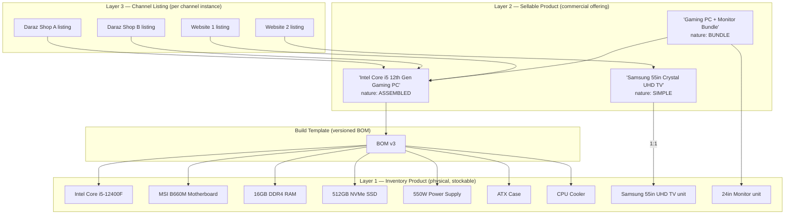
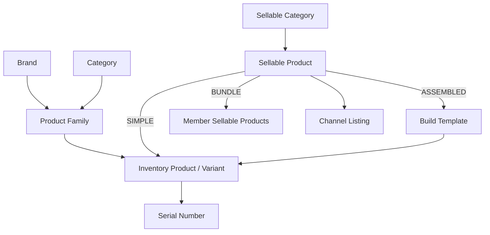
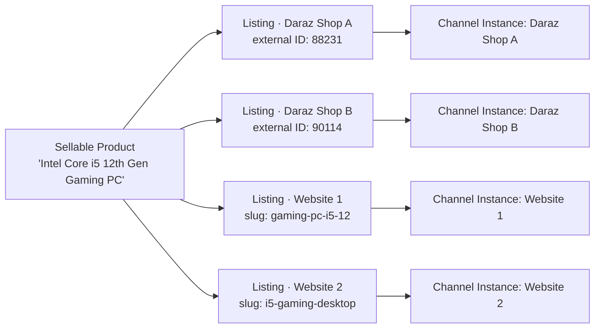
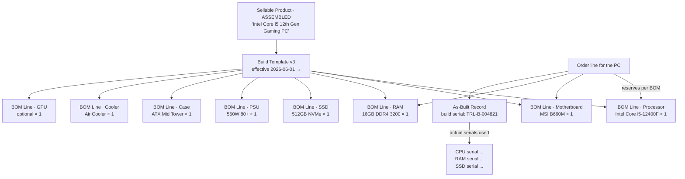

# Product Architecture

**Owner:** Trioloo Technology · **Module:** Product · **Status:** Canonical
**Version:** 1.12.0 · **Ratified:** 2026-08-05 · **Amended:** 2026-08-08 (Sales reconciliation; serial policy `BD-242`; Warehouse & Assembly §17; Purchase & Supplier §18; Marketplace §31; Warranty §32; Return & Exchange) · **Rule prefix:** `PRD-`

---

## Document Control

### Purpose in the documentation set

The canonical specification of the product domain: what Trioloo sells, what it physically stocks, and how the two relate. Every product-touching module derives from it — Inventory, Procurement, Sales, Marketplace, Website, Warehouse, Assembly, Fulfillment, and Order Management.

### ⚠ This document requires an amendment to `SYSTEM_ARCHITECTURE.md`

> **PRD-001 — Trioloo assembles desktop computers from purchased components. Two ratified statements say otherwise and are now factually wrong.**

| Location | Ratified text | Reality |
|---|---|---|
| `SYSTEM_ARCHITECTURE.md` §2.2 | *"Manufacturing and assembly — Trioloo resells; it does not manufacture"* — listed **out of scope for the system** | Trioloo assembles PCs from components |
| `SYSTEM_ARCHITECTURE.md` §18.3 | *"Manufacturing or assembly — the model assumes goods are bought and resold, not produced"* — listed as **requiring amendment** | The amendment is now required |

`SYS §18.3` correctly anticipated that assembly would require an amendment rather than being absorbable by configuration. **That amendment is now due.** Until it is ratified, the assembly content of this document is specification-ahead-of-ratification, in the same posture as `SMA-001`.

**Assembly is not manufacturing.** Trioloo does not produce components; it selects, combines, and tests purchased components into a sellable configuration. The distinction matters because it bounds the scope: no production planning, no work-in-progress accounting across periods, no routing or capacity modelling. What it does require is a bill of materials, a build record, and component-level traceability — all specified here.

### Consistency basis

| Document | Inherited |
|---|---|
| [`MASTER_DOCUMENTATION_INDEX.md`](MASTER_DOCUMENTATION_INDEX.md) | Precedence, ownership, planned-document status |
| [`SYSTEM_ARCHITECTURE.md`](SYSTEM_ARCHITECTURE.md) | Ownership register, scope hierarchy, configuration versioning, adapter discipline |
| [`DATABASE_ARCHITECTURE.md`](DATABASE_ARCHITECTURE.md) | Identity model, temporality, snapshots, archival |
| [`DOMAIN_MODEL.md`](DOMAIN_MODEL.md) | Entities E-017–E-022; this document **adds seven** (§14.1) |
| [`EVENT_ARCHITECTURE.md`](EVENT_ARCHITECTURE.md) | Event principles and naming |
| [`STATE_MACHINE_ARCHITECTURE.md`](STATE_MACHINE_ARCHITECTURE.md) | Record and sync lifecycles |
| [`ORDER_MANAGEMENT_ARCHITECTURE.md`](ORDER_MANAGEMENT_ARCHITECTURE.md) | Catalogued/non-catalogued lines, channel classification, verification dimensions |
| [`AUDIT_ARCHITECTURE.md`](AUDIT_ARCHITECTURE.md) | Audit obligations |
| [`GAP_ANALYSIS.md`](GAP_ANALYSIS.md) | Known gaps, referenced not filled |
| [`DESIGN_CONSTITUTION.md`](DESIGN_CONSTITUTION.md) | UI authority where product has a user-facing consequence |

### Claude Design

The brief instructs reading Claude Design files for Sales & Orders. **The design-system project list is empty** — verified again during this work, the third such verification (`SYS U-9`, `GAP-006`). No Claude Design content exists to read. Product-related UI evidence is taken from [`design-reference/03-new-sale-modal.png`](design-reference/README.md), which shows the **Marketplace item / Stock item** split and the **Sync stock** control — both directly relevant and both cited below.

### What this document is not

> **No UI. No database design. No SQL. No APIs. No code.** Attributes describe what the business must know, not columns or types.

---

## Table of Contents

| § | Section |
|---|---|
| 1 | Purpose |
| 2 | Scope |
| 3 | Business Goals |
| 4 | Architecture Principles |
| 5 | Core Concepts — the three-layer model |
| 6 | Product Identity & SKU Philosophy |
| 7 | Hierarchy, Categories & Naming |
| 8 | Inventory Product |
| 9 | Sellable Product |
| 10 | Channel Listing & Multi-Channel Mapping |
| 11 | Bill of Materials & Assembly |
| 12 | Bundles |
| 13 | Product Mapping |
| 14 | Entities |
| 15 | Lifecycle & State Machines |
| 16 | Versioning |
| 17 | Synchronization Architecture |
| 18 | Business Rules |
| 19 | Validation Rules |
| 20 | Module Responsibilities |
| 21 | Integration Points |
| 22 | Events |
| 23 | Audit Requirements |
| 24 | Permissions |
| 25 | Error Scenarios |
| 26 | Future Extensibility |
| 27 | Unknowns |

---

# 1. Purpose

To resolve a distinction the business depends on and that no existing document captures:

> **What Trioloo sells is not what Trioloo stocks.**

An *"Intel Core i5 12th Gen Gaming PC"* is a real, sellable, listed, orderable product. It is **not** a physical object in any warehouse. What sits on the shelf is a processor, a motherboard, memory, storage, a power supply, a case, a cooler, and possibly a graphics card. The PC comes into existence when those components are assembled against an order.

Meanwhile a **smart television is both** — one sellable product, one physical unit, bought whole and resold whole.

An architecture that assumes sellable and stockable are the same thing cannot represent the first case. An architecture that assumes they are always different adds pointless indirection to the second. This document specifies a model that handles both without special cases.

---

# 2. Scope

## 2.1 In scope

Product identity · categories and hierarchy · the inventory/sellable/listing separation · bills of materials and build templates · assembly relationships · bundles · multi-channel listing and mapping · SKU philosophy · naming strategy · product lifecycle, versioning, and status · synchronization to channels · product metadata and references.

## 2.2 Out of scope

| Excluded | Owner |
|---|---|
| Stock quantities, movements, valuation | Inventory |
| Physical assembly operations, workstations, technicians | Warehouse |
| Supplier selection, purchase orders, acquisition cost | Procurement |
| Order content and lifecycle | Order Management |
| Price *values* and discount policy | This document defines the **structure** and, from `BD-435`, **where an order's price comes from** (§33). **Discount policy remains Order Management's** (`BR-092` – `BR-095`) |
| Tax classification | `GAP-003` — taxation entirely undocumented |
| Product screens and listings UI | `DESIGN_CONSTITUTION.md` |

---

# 3. Business Goals

| # | Goal | Expression |
|---|---|---|
| PG-1 | Sell configurations Trioloo does not stock | The three-layer model (§5) |
| PG-2 | Know exactly what went into every unit shipped | As-built records (§11.6) |
| PG-3 | Compute true cost of an assembled product | Component cost roll-up (§11.8) |
| PG-4 | List one product across many shops and sites without duplication | Channel Listing (§10) |
| PG-5 | Change a build without corrupting history | Build template versioning (§16) |
| PG-6 | ⚠ ~~Never oversell a configuration whose components ran out~~ — **AMENDED 2026-08-09 (`BD-280`, `BD-441`): *know the exposure*, never prevent it.** Overselling against reliable procurement capacity is **deliberate**, and **stock shortage never blocks an Order** | Derived availability (§9.5) as **one of three distinct quantities** (`PRD-112`) |
| PG-7 | Support warranty and returns on assembled goods | Component-level traceability (§11.6) |
| PG-8 | Add marketplaces and sites without touching product definitions | Listing indirection (§10.3) |

---

# 4. Architecture Principles

## 4.1 P1 — Sellable and stockable are different concepts

> **PRD-002 — What is sold and what is stocked are separate entities, related by an explicit mapping. They coincide only by configuration, never by assumption.**

For a television the mapping is one-to-one. For a gaming PC it is one-to-many through a bill of materials. Both are the same mechanism at different settings.

## 4.2 P2 — Only physical things hold stock

> **PRD-003 — Stock is held exclusively against Inventory Products. A Sellable Product never has a stock quantity.**

The availability of *"Intel Core i5 12th Gen Gaming PC"* is not stored; it is **derived** from the availability of its components (§9.5). Storing it would create a figure that could disagree with the parts it depends on — precisely the failure `DB-001` prohibits for stock generally.

## 4.3 P3 — Channel representation is a separate layer

> **PRD-004 — A channel's representation of a product is an entity, not an attribute of the product.**

Trioloo runs multiple Daraz shops and multiple websites. Each holds its own external identifier, its own listing state, its own price, and its own sync position. Modelling these as fields on the product would cap the number of channels at the number of fields.

## 4.4 P4 — Channel type never branches behaviour

> **PRD-005 — "Marketplace Product" and "Website Product" are the same entity class.**

The brief names them separately, and operationally they feel different. Architecturally they are one concept — a **Channel Listing** — distinguished only by the attributes of their Channel Type (`OM §3.1`). Modelling them as two classes would branch on channel identity, which `BR-001` and `SYS-009` prohibit, and would require a third class the day a third channel type appears.

Both terms are retained as **business vocabulary** for the same architectural entity (§10.1).

## 4.5 P5 — Build definitions are versioned; builds are recorded

> **PRD-006 — A build template says what *should* go into a product. An as-built record says what *did* go into one specific unit. Both are retained, permanently.**

They differ whenever a component is substituted — which happens routinely when a part is out of stock. Without the as-built record, warranty and support on assembled goods are guesswork.

## 4.6 P6 — Product definition is Trioloo's; listing status is the channel's

> **PRD-007 — Trioloo is system of record for product definition, specification, BOM, and cost. The channel is system of record for its own listing identifier and listing status** (`SYS-010`, `SYS-011`).
>
> **REFINED (`BD-321`, v1.5.0) — the line moves; it does not disappear.** Listing **content** (title, description, images, attributes, variations) transfers from channel to Trioloo wherever the API permits it. **Identifier and status remain the channel's**, because those are decisions the marketplace makes rather than content anyone authors:
>
> > **What Trioloo authors, Trioloo owns. What the marketplace decides, the marketplace owns.**

---

# 5. Core Concepts — The Three-Layer Model

## 5.1 The layers

## 5.2 Layer definitions

| Layer | Entity | Is it physical? | Does it hold stock? | Does it have an external ID? |
|---|---|---|---|---|
| **1** | **Inventory Product** | **Yes** — occupies a warehouse location | **Yes** | No |
| **2** | **Sellable Product** | **No** — a commercial offering | **No** (`PRD-003`) | No |
| **3** | **Channel Listing** | No — a representation | No | **Yes**, one per channel instance |

## 5.3 The three sellable natures

> **PRD-008 — Every Sellable Product declares exactly one nature, and its nature determines how it resolves to inventory.**

| Nature | Resolves to | Example | Stock resolution |
|---|---|---|---|
| **`SIMPLE`** | Exactly one Inventory Product, 1:1 | Samsung 55″ Crystal UHD TV · 24″ Monitor · HDMI cable | Direct |
| **`ASSEMBLED`** | Many Inventory Products via a Build Template | Intel Core i5 12th Gen Gaming PC | Through BOM (§11) |
| **`BUNDLE`** | Many Sellable Products, shipped together | Gaming PC + Monitor | Recursive through members (§12) |

**Trioloo's actual catalogue maps cleanly:**

| Business line | Nature |
|---|---|
| Smart televisions | `SIMPLE` |
| Monitors, accessories (HDMI cables, peripherals) | `SIMPLE` |
| Desktop computers | **`ASSEMBLED`** |
| Promotional packages | `BUNDLE` |

## 5.4 Assembly is not bundling

> **PRD-009 — Assembly produces one physical unit from many. Bundling ships many units together. They are different mechanisms and must never be conflated.**
>
> **⚠ CLARIFIED (`BD-346`, v1.7.0) — the *partial return* row is narrowed to *partial refund*.** `BD-346` states that on a custom desktop *"individual components may also be returned or exchanged if the issue is limited to a specific component and business policy allows it."* Read against `PRD-009`'s table — *partial return: not possible, the unit is one thing* — the two appear to collide. **They do not, once *return* is separated from *refund*:**
>
> | What happens to the component | Permitted? |
> |---|---|
> | **Replaced or exchanged** — the unit goes back whole | **✅ Yes.** This is the component-level remedy `PRD §5.4` already describes as a warranty claim, and `PRD-135` makes eligibility per component |
> | **Refunded** — unwinding part of the sale | **❌ Not supported, and the model cannot express it** |
>
> **Why the second is blocked rather than merely undecided.** An assembled PC is sold as **one Sellable Product at one price** (`PRD-022`), so a component carries **no separate sale value**. Refunding one would require a **declared allocation basis** — which `PRD-053` defines **only for bundles**, precisely because bundle members *do* have standalone prices.
>
> **`PRD-009` stands. The remedy is component-level; the commercial unit is not.** The business's own hedge — *"if business policy allows it"* — is consistent with this being a conditional remedy rather than a routine unwinding of the sale. **Assumption explicitly marked:** if the business later requires component *refunds* on assembled units, an allocation basis equivalent to `PRD-053` must be declared first (`GAP-092`).

| | Assembly | Bundle |
|---|---|---|
| Physical result | **One** unit | **Several** units |
| Components after | Cease to exist as separate stock | Remain separate, individually identifiable |
| Serials | Component serials recorded in the as-built record; the build carries its own identity | Each member keeps its own serial |
| Partial return | Not possible — the unit is one thing | **Possible** — a member may be returned alone |
| Packaging | One package (usually) | May ship as several packages |
| Warranty | Composite (§11.9) | Per member |

This distinction determines return handling. A customer returning "the monitor from my bundle" is returning one member. A customer returning "the RAM from my PC" is making a warranty claim against a component of a single unit — a completely different process.

---

# 6. Product Identity & SKU Philosophy

## 6.1 Four kinds of identifier

Per `DB §5.4`, identity kinds must not be conflated. Product has four.

| Identifier | Layer | Purpose | Properties |
|---|---|---|---|
| **Internal Product ID** | All | Unambiguous system reference | Opaque, permanent, **meaningless** (`DB-011`) |
| **Inventory SKU** | 1 | Human reference to a physical item | Readable, stable, never reused |
| **Sellable SKU** | 2 | Human reference to a commercial offering | Readable, stable, never reused |
| **Channel Listing ID** | 3 | The **channel's** identifier for its listing | **External, mirrored**, stored with issuing party |

> **PRD-010 — Internal Product IDs carry no business meaning.** An identifier encoding category, brand, or year will need to change when the business changes, and identifiers must never change (`DB-006`, `DB-011`).
>
> **PRD-011 — Inventory SKU and Sellable SKU are separate identifier spaces.** A television has both — they are not the same string and must not be assumed equal. Treating them as one makes the assembled case unrepresentable.
>
> **PRD-012 — Channel Listing IDs are stored with their issuing party** (`DB-013`). Daraz Shop A and Daraz Shop B may legitimately issue the same identifier string for different listings, and two different marketplaces certainly may.
>
> **PRD-013 — A retired SKU is never reissued**, including after archival (`DB-012`, `SYS-031`). SKUs appear on invoices, warranty claims, courier manifests, and marketplace records that outlive the product.

## 6.2 SKU philosophy

> **PRD-014 — A SKU identifies a thing at the granularity at which it is transacted, and at no coarser granularity.**

| Situation | Requires its own Inventory SKU? | Why |
|---|---|---|
| 8GB vs 16GB DDR4 RAM | **Yes** | Different price, different cost, not interchangeable |
| Same RAM, different supplier | **No** — same SKU | Physically equivalent; supplier is a procurement attribute |
| Same RAM model, different speed | **Yes** | Different specification |
| 55″ vs 65″ TV | **Yes** | Different product |
| Same TV, different colour | **Yes** if separately stocked and priced | Granularity follows transaction |

This restates `DM E-020`'s reasoning at inventory level: `OM §7.3` records that verification dimension 3 carries elevated weight because *"desktop computers and smart televisions have close model variants — screen size, panel type, processor, memory, storage — where a small naming error produces an entirely different product at a materially different cost."* SKU granularity is the mechanism that makes that verification possible.

## 6.3 Reconciliation with `DOMAIN_MODEL.md`

| This document | `DOMAIN_MODEL.md` | Relationship |
|---|---|---|
| Inventory Product | **E-020 Product Variant** | The same entity. "Inventory Product" is the business term for a stockable variant |
| Product family | **E-019 Product** | Unchanged |
| Brand, Category | **E-017, E-018** | Unchanged |
| Sellable Product | — | **New** (§14.1) |
| Channel Listing | — | **New** |
| Build Template, BOM Line, As-Built Record | — | **New** |

> **PRD-015 — "Inventory Product" and "Product Variant" are the same entity under two names.** To avoid two vocabularies for one concept (`SYS-016`), **`E-020 Product Variant` remains the canonical entity name**; "Inventory Product" is business shorthand used where the physical/sellable contrast is the point.

---

# 7. Hierarchy, Categories & Naming

## 7.1 Hierarchy

> **PRD-016 — Inventory and Sellable products have separate category trees.** A customer browsing a website sees "Gaming PCs"; a warehouse operator counting stock sees "Processors". Forcing one tree to serve both produces a taxonomy that serves neither.

## 7.2 Category responsibilities

| Category type | Drives |
|---|---|
| **Inventory category** | Storage strategy, counting cycles, QC checks, serialization policy |
| **Sellable category** | Marketplace commission rates, return windows, tax classification, listing taxonomy |

Marketplace commission commonly varies by category (`OM §11.6`), and the relevant category is the **sellable** one, because that is what the marketplace sees.

## 7.3 Naming strategy

> **PRD-017 — Inventory names are precise and technical. Sellable names are market-facing. They are different names for different audiences and are never the same string.**

| Layer | Audience | Style | Example |
|---|---|---|---|
| **Inventory Product** | Warehouse, procurement, verification agents | Brand + model + exact specification, unambiguous | `Intel Core i5-12400F 2.5GHz LGA1700 Tray` |
| **Sellable Product** | Customers, marketplaces | Descriptive, market-oriented | `Intel Core i5 12th Gen Gaming PC` |
| **Channel Listing** | The channel's buyers | **Channel-controlled**, may be keyword-optimised | Varies per shop |

**Why this separation is load-bearing.** `OM §7.3` requires the verification agent to confirm *"the exact model and specification intended"*. An agent verifying against `Intel Core i5 12th Gen Gaming PC` cannot confirm anything — the name does not identify a specification. The agent must be able to see the **inventory-level names of the components** (§11.6), which are precise.

> **PRD-018 — AMENDED (`BD-321`, v1.5.0). Trioloo authors listing content and is authoritative for *intent*; the channel reports *actual state*; a difference between them is `DIVERGED`, never a silent overwrite in either direction.**
>
> | | Owner |
> |---|---|
> | Title, description, images, attributes, variations — **as Trioloo intends them** | **Trioloo**, pushed where the API supports the field (`PRD-125`) |
> | The **actual title the channel displays** | **The channel**, mirrored |
> | A difference between the two | **`DIVERGED`** — an exception (`PRD-030`, `SYS-026`) |
>
> **The original rule's reasoning survives intact and is retained:** a marketplace that rewrites a title for search purposes **has not changed the product**. What changed is the direction of authorship — Trioloo now authors the content rather than accepting whatever the channel holds. **A channel-side rewrite is therefore a divergence to detect, not a fact to absorb.**
>
> *Superseded text (v1.4.0): "Channel listing titles are channel-owned and may diverge from the Sellable Product name. They are mirrored, never authoritative."*

---

# 8. Inventory Product

## 8.1 Definition

| | |
|---|---|
| **Purpose** | A physically stockable item occupying warehouse space |
| **Canonical entity** | `E-020 Product Variant` (`PRD-015`) |
| **Owner module** | Product |
| **Stock held** | **Yes** — by Inventory |

## 8.2 The two roles an Inventory Product plays

> **PRD-019 — An Inventory Product may be sold directly, consumed in a build, or both. The role is not a property of the item; it is determined by how a Sellable Product references it.**

| Role | Example |
|---|---|
| **Component only** | Motherboard, power supply, CPU cooler, case |
| **Directly sellable only** | Smart television |
| **Both** | A graphics card sold standalone **and** used in gaming PC builds; a monitor sold alone and bundled |

The "both" case is the important one: the same physical stock serves two demand streams. Its availability must be visible to both, and reservations from either must reduce the same pool (`BR-052`).

## 8.3 Core attributes

Identity (internal ID, inventory SKU, barcode) · product family, brand, inventory category · exact technical specification · unit of measure · weight and dimensions *(drive courier charges and packing — `OM §8.6`)* · **serialization policy** · **Warranty Package reference** *(`E-070`, versioned — `PRD-132`; supersedes "warranty terms (undefined)", `OM Q-5` closed)* · storage requirements · active period.

## 8.4 Component-specific attributes

Assembly imposes attributes ordinary resale does not:

| Attribute | Purpose |
|---|---|
| **Compatibility attributes** | Socket type, form factor, memory type, wattage, interface — determine whether components can be combined |
| **Substitution group** | Which items are functionally equivalent (§11.7) |
| **Component class** | Processor · Motherboard · RAM · SSD · HDD · PSU · Case · Cooler · GPU · Monitor · Peripheral |

> **PRD-020 — Compatibility attributes are recorded but this document specifies no compatibility *rules*.** Whether a build template is validated for electrical and mechanical compatibility, and by what logic, is an unresolved question (`PRDU-3`). Recording the attributes makes future validation possible; inventing the rules would exceed this document's authority (`DM-001`).

---

# 9. Sellable Product

## 9.1 Definition

| | |
|---|---|
| **Purpose** | A commercial offering the business sells — the thing an order line refers to |
| **Owner module** | Product |
| **Stock held** | **No** (`PRD-003`) |
| **New entity** | `E-058` (§14.1) |

## 9.2 Core attributes

Identity (internal ID, sellable SKU) · **nature** (`SIMPLE`, `ASSEMBLED`, `BUNDLE`) · market-facing name · description and specification summary · sellable category · price list references (`E-022`) · warranty offering · **resolution target** (inventory product, build template, or member list) · lifecycle status · media references.

## 9.3 The resolution target

> **PRD-021 — Every Sellable Product resolves to inventory by exactly one mechanism, determined by its nature.**

| Nature | Resolution target |
|---|---|
| `SIMPLE` | One Inventory Product, with a quantity per sale unit |
| `ASSEMBLED` | One **active** Build Template version |
| `BUNDLE` | An ordered list of member Sellable Products with quantities |

## 9.4 What an order line references

> **PRD-022 — A catalogued order line references a Sellable Product, never an Inventory Product directly.**

This is a clarification of `OM §4.5`. The customer bought *"Intel Core i5 12th Gen Gaming PC"* — that is what the invoice must say, what the marketplace recorded, and what the customer will reference in a support call. The components are how Trioloo satisfies it, not what was sold.

## 9.5 Availability is derived, never stored

> **PRD-023 — The availability of a Sellable Product is derived from its resolution target and is never stored as a figure.**

| Nature | Derivation |
|---|---|
| `SIMPLE` | Available quantity of the mapped Inventory Product ÷ quantity per sale unit |
| `ASSEMBLED` | **The minimum, across all BOM lines, of (component available ÷ quantity required)** |
| `BUNDLE` | The minimum across member availabilities ÷ member quantities |

**The assembled case is the constraining one.** A gaming PC whose every component is plentiful except the power supply — of which three remain — has an availability of three. Publishing any higher number to a marketplace oversells.

> **PRD-024 — Derived availability accounts for reservations, not merely stock on hand** (`BR-052`). Components already reserved for other orders are unavailable, whether reserved for a build or a direct sale (§8.2).

## 9.6 Reservation for assembled products — extension to `BR-006`

> **PRD-025 — An order line for an `ASSEMBLED` Sellable Product reserves each component named in its Build Template, in the required quantities. It does not reserve the Sellable Product, because no such stock exists.**
>
> **PRD-026 — A build reservation is atomic. Either every component is reserved, or none is.**

`PRD-026` prevents the failure mode where a partially-reserved build holds scarce components hostage while waiting for a missing one, blocking other orders that could have been fulfilled completely.

> **PRD-027 — These rules extend `BR-006`.** `BR-006` states that a non-catalogued line may not reserve inventory. It does not address a catalogued line that reserves *something other than itself*. `OM §14` requires amendment to record the assembled case.

---

# 10. Channel Listing & Multi-Channel Mapping

## 10.1 Definition

| | |
|---|---|
| **Purpose** | One channel instance's representation of one Sellable Product |
| **Business names** | *"Marketplace Product"*, *"Website Product"* — the same entity (`PRD-005`) |
| **Owner module** | Product (definition) / Channel adapter (sync state) |
| **New entity** | `E-059` |

## 10.2 Cardinality

> **PRD-028 — One Sellable Product has many Channel Listings. One Channel Listing belongs to exactly one Sellable Product and exactly one Channel Instance.**

This structure is what makes *"multiple Daraz shops"* and *"multiple websites"* work without duplicating product definitions. `BR-002` already requires order attribution at channel **instance** level because settlement arrives per shop; listings follow the same granularity for the same reason.

## 10.3 Core attributes

Sellable Product reference · channel instance reference · **external listing identifier** (mirrored, stored with issuing party) · **intended title and description** *(Trioloo-authored, `PRD-018` as amended)* · **channel-reported title and description** *(mirrored, for divergence detection)* · channel-specific price · **published marketplace stock** *(`PRD-126`)* · **publication intent** *(Trioloo)* · **listing status** *(channel)* · sync state and last sync time · channel category mapping · listing-specific media.

> **Intended and reported content are two attributes, not one.** Holding a single title field makes `DIVERGED` undetectable — there would be nothing to compare against. `BD-321` requires the ERP to *"pull the latest listing data so differences can be identified"*, which is only meaningful if both sides are retained.

## 10.4 Why price sits on the listing

> **PRD-029 — Channel-specific price is an attribute of the Channel Listing, not the Sellable Product.**

The same PC may sell at different prices on two Daraz shops and a third price on a website — because marketplace commission differs by shop and channel economics differ. A single price on the product could not express this.

The **agreed price on an order** is a snapshot, unaffected by later listing price changes.

> ⚠ **Amended 2026-08-09 by `BD-435`.** This paragraph read *“a snapshot taken at confirmation”*. **Capture is at Order Line creation** — a Daraz order **arrives already priced**, before verification and well before `CONFIRMED`. `DB-023` is satisfied *a fortiori*, the snapshot existing **earlier** than it requires. See **`PRD-140`**.

> ⚠ **A listing price is what Trioloo *publishes*, not what an order *sold at*.** `§10.5` records price as *pushed by Trioloo*; **`BD-435` confirms the actual price arrives back with the order.** The two are different facts and `PRD-138` keeps them apart.

## 10.5 Daraz relationship

*Amended v1.5.0 — `BD-317`, `BD-318`, `BD-321`, `BD-322`. Daraz is the first marketplace adapter, not the model; every row below is expressed as adapter capability, never as Daraz-specific logic (`PRD-077`).*

| Aspect | Behaviour |
|---|---|
| **Seller account** | **Seven independent accounts** — each its own channel instance with **its own credentials, orders, settlement, receivable and chat** (`BD-317`). Credentials are **instance-scoped configuration**; one adapter serves seven connections |
| Listing identity | Daraz issues its own identifier per shop; mirrored (`PRD-012`) |
| **Title, description, images, attributes, variations** | **Trioloo authors and pushes where the API supports the field**; Daraz-reported values are mirrored for divergence detection (`PRD-018` as amended, `PRD-125`) |
| Category | Daraz taxonomy, mapped to Trioloo sellable category |
| Price | Pushed by Trioloo; Daraz confirms |
| **Stock** | **Published marketplace stock is a per-shop manual decision** (`PRD-126`) — **not** derived availability, and it may deliberately exceed it (`BD-280`, `PRD-112`). Physical inventory is a **single shared pool** across all seven shops (`PRD-127`) |
| **Publication intent** | **Trioloo** — *we want this listed* |
| **Listing status** | **Daraz** — *active · suspended · rejected*. It may suspend unilaterally, and **intent must never overwrite status** (`PRD-128`) |
| **Channel-originated events** | Suspension · rejection · deactivation · category change · **policy violation** — recorded on the listing's activity history (`PRD-129`) |
| Product definition, specification, BOM, cost | Trioloo authoritative — unchanged (`PRD-007`) |

> **PRD-030 — A marketplace may suspend, reject, or alter a listing without notice.** This is the same external-authority pattern as unilateral order cancellation (`OM §6.5`). The listing's sync state moves to `DIVERGED` and an exception is raised (`SYS-026`); it is never silently reconciled in either direction.

## 10.6 Website relationship

| Aspect | Behaviour |
|---|---|
| Listing identity | Trioloo-issued (a slug or site-local reference) |
| Title, description, category | **Trioloo authoritative** — the site is Trioloo's own |
| Price | Trioloo authoritative |
| Stock | Availability pushed |
| Listing status | Trioloo authoritative |

The websites are Trioloo-owned channels (`OM §3.2`), so no external authority applies. **The listing layer still exists**, because multiple websites each need their own identifier, price, and sync state — and because `PRD-005` forbids a separate entity class for the Trioloo-owned case.

## 10.7 Multiple marketplace identifiers

> **PRD-031 — A Sellable Product accumulates one external identifier per channel instance it is listed on, and each is qualified by its issuing channel instance.**

An unqualified external identifier is ambiguous: two Daraz shops may issue the same string, and a future marketplace certainly may. This is `DB-013` applied to products.

---

# 11. Bill of Materials & Assembly

## 11.1 Concepts

| Concept | Definition |
|---|---|
| **Build Template** | The **versioned** definition of what goes into an `ASSEMBLED` Sellable Product |
| **BOM Line** | One component requirement within a template — inventory product, quantity, role, optionality |
| **As-Built Record** | What **actually** went into one specific assembled unit |
| **Substitution Rule** | Which components may replace which, and under what conditions |

## 11.2 Build Template

| | |
|---|---|
| **Purpose** | Define the components required to assemble one unit of a Sellable Product |
| **Owner** | Product |
| **Versioned** | **Yes**, with effective periods (`DB-022`) |
| **New entity** | `E-060` |

**Attributes** — sellable product reference · version · effective period · BOM lines · assembly instructions reference · estimated assembly effort · status.

## 11.3 BOM Line

**Attributes** — inventory product reference · **quantity required** · component role (`Processor`, `Motherboard`, `RAM`, `SSD`, `HDD`, `PSU`, `Case`, `Cooler`, `GPU`) · **optional flag** · substitution group reference · position or sequence.

> **PRD-032 — A BOM line references an Inventory Product, never another Sellable Product.** A build consumes physical things. A Sellable Product composed of other Sellable Products is a **bundle** (§12), not an assembly.
>
> **PRD-033 — BOM lines may be optional.** A gaming PC may be defined with an optional discrete graphics card; the base configuration is buildable without it. Optionality is a property of the line, not a separate template.

## 11.4 Single-level BOM

> **PRD-034 — Build Templates are single-level. A BOM line resolves directly to a stockable Inventory Product and never to another Build Template.**

Trioloo assembles; it does not manufacture sub-assemblies. Multi-level BOMs introduce work-in-progress accounting, sub-assembly stock, and production routing — none of which this business performs. `SYS §2.2` correctly excludes manufacturing; this rule keeps assembly on the right side of that boundary.

If Trioloo ever pre-assembles and stocks a sub-unit, that sub-unit becomes an **Inventory Product in its own right** and the model still holds — but the decision to do so requires an amendment (`PRDU-6`).

## 11.5 The assembly relationship

## 11.6 As-Built Record

| | |
|---|---|
| **Purpose** | Record what physically went into one specific assembled unit |
| **Owner** | Warehouse (capture) / Product (definition) |
| **New entity** | `E-062` |

**Attributes** — order and order line reference · build template version used · **each component actually used, with its serial where serialized** · substitutions applied with reason · assembling technician · build date · test or QC outcome · **build serial**.

> **PRD-035 — Every assembled unit has an as-built record. It is created during assembly and retained permanently.**
>
> **PRD-036 — The as-built record captures actual component serials, not merely component types.** This is what makes `BR-047` enforceable on assembled goods.

**Why this is not optional.** `BR-047` makes serial verification mandatory at return QC, because *"without it a customer can return a different or older unit; on desktops and televisions this is the principal return-fraud vector."* On an assembled PC the vector is worse: a customer can return the **same case** with a **cheaper graphics card** substituted. Only a component-level as-built record detects that.

> **PRD-037 — Whether the assembled unit carries a Trioloo-issued build serial in addition to its component serials is unresolved** (`PRDU-1`). This document specifies the attribute because return authentication and warranty require a unit-level identity; **whether it is physically affixed, and how, is an operational decision**.

## 11.7 Substitution

> **PRD-038 — Substitution is expected, permitted within defined groups, and always recorded.**

| Rule | Statement |
|---|---|
| **PRD-039** | A substitution outside a defined substitution group requires authority and a recorded reason |
| **PRD-040** | Every substitution is recorded on the as-built record with the intended and actual component |
| **PRD-041** | A substitution that changes the advertised specification requires **customer agreement** before dispatch |

**PRD-041 is a commercial protection.** A customer who ordered a PC advertised with a 512GB SSD and received a 256GB one has grounds for return, and the return will be attributed to Trioloo fault (`BR-045`). Silent downward substitution converts a stock problem into a return, a refund, and a reputational cost.

## 11.8 Cost of an assembled product

> **PRD-042 — The cost of an assembled unit is the sum of the actual costs of the components in its as-built record, plus assembly cost.**

| Component of cost | Source |
|---|---|
| Component acquisition cost | Procurement per component, at the valuation method in force |
| ~~Landed cost allocation~~ | **NOT USED — `BD-297`.** Freight, transport, import duty and clearing are **period business expenses**, never capitalised into product cost. `GAP-046` closed by removal (`PRD-121`) |
| Assembly labour and overhead | **Undefined** (`PRDU-2`) |

**Consequences — settled 2026-08-06.** This section previously recorded that an assembled product's cost *"can in principle be exact rather than averaged"* through specific identification, pending the valuation method.

**The method is Weighted Average Cost** (`BD-298`, closing `GAP-005`). Specific identification is **not** used, and the cost of a build is **averaged, not exact**.

This is coherent rather than a compromise: specific identification requires serials, and `BD-265` establishes that components on desktop PCs are usually not serialized. Weighted average is the only method available without unit-level identity. See `PRD-122`.

Until then, `BR-007` applies with force: an assembled product whose component costs are unknown produces a margin that is **unknown, not zero** (`SYS-034`).

## 11.9 Warranty on assembled products

> **PRD-043 — An assembled product's warranty is composite: each component carries its manufacturer's term, and Trioloo may offer its own term on the build as a whole.**

This creates a genuine complication that resale does not have: a PC sold with a three-year CPU warranty, a two-year motherboard warranty, and a one-year power supply warranty has no single expiry date. A claim must resolve to the **component** that failed, which requires the as-built record.

> **PRD-044 — AMENDED (`BD-337`, v1.6.0). Warranty claims on assembled products resolve to a component via the as-built record *plus the repair history*.** Without both, the claim cannot be attributed and Trioloo cannot recover from the supplier.
>
> **Why the amendment was unavoidable.** `PRD-044` as written assumed the as-built record describes what is **currently** inside the unit. **After a repair it does not** — a replaced component means the physical unit differs from its as-built record, and `BD-290` records replaced parts on the **repair**, not on the as-built.
>
> | Record | Describes |
> |---|---|
> | `E-062` As-Built Record | **What went in at build** — a historical fact, correctly immutable (`DB-003`) |
> | `E-072` Repair | **What was changed afterwards** |
> | **Current configuration** | **Neither alone — the composition of both** |
>
> **The as-built record is not wrong and must not be updated.** What was missing is the **derived current view**. Whether it is computed on demand or maintained is an architecture decision (`GAP-089`).
>
> *Superseded text (v1.5.0): "…resolve to a component via the as-built record."*

`OM Q-5` records that standard warranty terms are unconfirmed; the composite case makes that gap more consequential (`PRDU-4`).

## 11.10 When components are consumed

> **PRD-045 — Components are consumed from stock at assembly, not at dispatch. The assembled unit is not itself stock.**

This is a **departure from `BR-054`**, which deducts stock at dispatch. It is justified because at assembly the components physically cease to exist as separate items — they cannot be picked for another order, counted, or sold. Continuing to carry them as stock until dispatch would misstate physical reality, which is the exact concern `BR-054` was written to protect.

> **PRD-046 — `PRD-045` requires an amendment to `ORDER_MANAGEMENT_ARCHITECTURE.md` §14.4.** Until ratified, it is specification-ahead-of-ratification.
>
> ✅ **DISCHARGED 2026-08-09.** `OM §14.4` was amended: **`BR-054` is scoped to ordinary finished and sellable goods**, and **`BR-143` deducts build components at the physical assembly or install point**, with **`BR-144` forbidding a second deduction at dispatch.** **`PRD-045` is no longer specification-ahead-of-ratification.** **The historical status is preserved here under `DOC-009`** — it stood outstanding from v1.0.0 until today.

**Build-to-order is assumed.** Whether Trioloo ever builds to stock — assembling units in advance of demand — is unresolved (`PRDU-5`). If it does, the assembled unit **becomes an Inventory Product** with its own stock, and the model accommodates this without structural change: the build's output is registered as a stockable item and `BR-054` applies normally to it.

---

# 12. Bundles

## 12.1 Definition

| | |
|---|---|
| **Purpose** | Sell several Sellable Products together as one commercial offering |
| **Nature** | `BUNDLE` |
| **New entity** | `E-063` Bundle Member |

**Member attributes** — member Sellable Product reference · quantity · optional flag · price contribution basis.

## 12.2 Rules

| Rule | Statement |
|---|---|
| **PRD-047** | A bundle member is a **Sellable Product**, which may itself be `SIMPLE` or `ASSEMBLED` |
| **PRD-048** | Bundle nesting is **limited to one level** — a bundle may not contain a bundle |
| **PRD-049** | Bundle availability is the minimum across members, adjusted for quantity (`PRD-023`) |
| **PRD-050** | Bundle members remain **individually identifiable** through fulfillment, delivery, and return |
| **PRD-051** | A bundle may be **partially returned** — one member without the others — subject to policy |

**PRD-048** prevents combinatorial explosion in availability derivation and pricing. **PRD-051** is the operational consequence of `PRD-009`: because bundle members remain separate physical units, partial return is physically possible, and the return policy must address it (`GAP-064` — return windows and eligibility are undefined).

## 12.3 Bundle pricing

> **PRD-052 — A bundle's price is set on the bundle, not computed from its members.** The discount relative to member prices is the commercial point of a bundle.
>
> **PRD-053 — For partial return, the refundable value of a member is derived from a declared allocation basis, not from that member's standalone price.**

Without `PRD-053`, a customer returning one member of a discounted bundle could be refunded more than the bundle's proportional value — the classic bundle-arbitrage failure.

---

# 13. Product Mapping

## 13.1 The mapping problem

`OM §4.5` establishes that order lines may be **non-catalogued** — a product name typed manually rather than selected from the catalogue. The observed New Sale modal offers exactly this: a **Marketplace item** block for typed names alongside a **Stock item** block for catalogue selection (`design-reference/03-new-sale-modal.png`).

`BR-008` requires each non-catalogued line to carry an open mapping task, with the unmapped count trending to zero. **`GAP-059` records that no mapping process is documented.**

## 13.2 What mapping resolves to

> **PRD-054 — A non-catalogued line maps to a Sellable Product, not to an Inventory Product** (`PRD-022`).

## 13.3 Mapping rules

| Rule | Statement |
|---|---|
| **PRD-055** | A mapping records the free text, the resolved Sellable Product, the resolving actor, and the date |
| **PRD-056** | A mapping may be reused — the same free text from the same channel resolves the same way — but reuse is a **suggestion requiring confirmation**, never automatic |
| **PRD-057** | Mapping a line **does not retroactively alter the order's snapshots** (`DB-023`); it establishes the product reference so cost and margin become computable |
| **PRD-058** | Whether mapping recomputes margin on a **closed** order is unresolved (`PRDU-7`) |

**PRD-056 is deliberately conservative.** Automatic mapping on text match would silently attach the wrong product — and on a catalogue where "i5 Gaming PC" and "i5 Gaming PC Pro" differ by a graphics card and several thousand taka, a wrong automatic match is a real financial error.

## 13.4 Channel product mapping

> **PRD-059 — An inbound marketplace order line is resolved to a Sellable Product through the Channel Listing that carries the marketplace's product identifier.**

This is the normal path and it is exact — the marketplace tells Trioloo which listing was ordered, and the listing points to one Sellable Product. Non-catalogued lines arise when that resolution **fails**: an unmapped listing, a manually captured order, or a marketplace item never registered in the catalogue.

> **PRD-060 — A marketplace order whose listing cannot be resolved raises an exception** (`SYS-022`) **and produces a non-catalogued line rather than a guess.**

---

# 14. Entities

## 14.1 New entities — `DOMAIN_MODEL.md` amendment required

> **PRD-061 — This document introduces seven entities not present in `DOMAIN_MODEL.md`. Registering them requires amending its §14 register, §15 ownership index, and Appendix A.**

| ID | Entity | Purpose | Owner |
|---|---|---|---|
| **E-058** | **Sellable Product** | A commercial offering | Product |
| **E-059** | **Channel Listing** | One channel instance's representation | Product / adapter |
| **E-060** | **Build Template** | Versioned BOM for an assembled product | Product |
| **E-061** | **BOM Line** | One component requirement | Product |
| **E-062** | **As-Built Record** | What actually went into one unit | Warehouse |
| **E-063** | **Bundle Member** | One member of a bundle | Product |
| **E-064** | **Substitution Group** | Functionally equivalent components | Product |

## 14.2 Existing entities affected

| Entity | Effect |
|---|---|
| `E-019` Product | Unchanged — the family layer |
| `E-020` Product Variant | **Confirmed as the Inventory Product** (`PRD-015`) |
| `E-021` Serial Number | Now also referenced by As-Built Records (`PRD-036`) |
| `E-022` Price List | Now scoped by Channel Listing as well (`PRD-029`) |
| `E-032` Order Item | Now references a **Sellable Product** (`PRD-022`) |
| `E-027` Stock Reservation | Now created per BOM line for assembled lines (`PRD-025`) |

---

# 15. Lifecycle & State Machines

## 15.1 Product record lifecycle

Products follow the master record lifecycle at `SYS §7.1` — `DRAFT → ACTIVE → SUSPENDED → ARCHIVED`. **Not restated** (`SYS-016`).

| Rule | Statement |
|---|---|
| **PRD-062** | A product referenced by any historical order is **archived, never deleted** (`SYS-024`, `DB-028`) |
| **PRD-063** | `ARCHIVED` prevents **new** references; existing references remain permanently valid |
| **PRD-064** | Archiving a Sellable Product does not archive its Inventory Products — components usually remain in use by other builds |
| **PRD-065** | An Inventory Product cannot be archived while any **active** Build Template references it |

## 15.2 Channel Listing sync lifecycle

Channel Listings follow the **integration sync lifecycle** at `SYS §7.1` — `PENDING → IN_PROGRESS → SYNCED | FAILED → MANUAL_REQUIRED`, with `DIVERGED` when the mirror no longer matches its source.

> **PRD-066 — No new state machine is introduced for listings.** The ratified sync lifecycle already models exactly this, and inventing a parallel machine would duplicate it (`SYS-016`, `SMA-002`).

| State | Meaning for a listing |
|---|---|
| `PENDING` | A change awaits publication to the channel |
| `SYNCED` | Channel reflects Trioloo's intent |
| `FAILED` | Publication rejected; retry scheduled |
| `MANUAL_REQUIRED` | Retries exhausted — **a normal state** (`SYS-025`), not a failure |
| `DIVERGED` | Channel-side state differs from Trioloo's record — **always an exception** (`SYS-026`) |

`PRD-030` — a marketplace suspending a listing produces `DIVERGED`, never a silent local update.

## 15.3 Build Template lifecycle

| State | Meaning |
|---|---|
| `DRAFT` | Being defined; not buildable |
| `ACTIVE` | The version used for new builds |
| `SUPERSEDED` | Replaced by a later version; retained for historical as-built records |
| `WITHDRAWN` | No longer buildable |

> **PRD-067 — Exactly one Build Template version is `ACTIVE` for a Sellable Product at any effective date.**
> **PRD-068 — Superseded versions are retained permanently**, because as-built records reference them and `DB-003` forbids the past moving.

---

# 16. Versioning

## 16.1 What is versioned

| Subject | Versioned? | Mechanism |
|---|---|---|
| **Build Template** | **Yes** — effective-dated | `DB-022` |
| Product specification | Yes — history retained | `DB-025` |
| Price | Yes — effective-dated price lists | `DB-022` |
| Sellable Product nature | **No** — see `PRD-070` |
| Channel Listing content | Change history retained | `DB-068` |
| Category and taxonomy | Yes | `SYS-021` |

## 16.2 Rules

> **PRD-069 — Changing a Build Template creates a new version. It never edits the active one.**
>
> Editing in place would silently rewrite what past units were built from, corrupting warranty attribution, support, and cost. This is `DB-003` — the past does not move — applied to assembly.

> **PRD-070 — A Sellable Product's nature is immutable.** A `SIMPLE` product does not become `ASSEMBLED`. If the business begins assembling something it previously resold whole, that is a **new Sellable Product**, because its cost basis, availability derivation, warranty model, and return handling all change.

> **PRD-071 — An order references the Build Template version in force at its own date** (`DB-022`), and the as-built record names the version actually used — which may differ if the build occurred after a version change (`PRDU-8`).

---

# 17. Synchronization Architecture

## 17.1 Direction of authority

| Data | Authoritative | Direction |
|---|---|---|
| Product definition, specification, BOM, cost | **Trioloo** | Push to channel |
| Price | **Trioloo** | Push |
| **Availability** | **Trioloo** | Push (derived — `PRD-023`) |
| Listing identifier | **Channel** | Mirror |
| Listing status (active, suspended, rejected) | **Channel** | Mirror |
| Channel-side title, category placement | **Channel** | Mirror |
| Orders against the listing | **Channel** | Mirror (`OM §3.5`) |

## 17.2 Rules

| Rule | Statement |
|---|---|
| **PRD-072** | Synchronization is **per Channel Listing**, never per Sellable Product — each channel instance syncs independently |
| **PRD-073** | ⚠ ~~Availability pushed to a channel is the **derived** figure, computed at push time~~ — **AMENDED `BD-280` (§29.2): what is pushed is **Published Marketplace Stock**, a manually maintained figure** |
| **PRD-074** | A sync failure on one listing never blocks other listings or the sale itself (`SYS-054`) |
| **PRD-075** | Every sync exchange is idempotent (`SYS-045`) and records provenance (`SYS-046`) |
| **PRD-076** | **Manual sync is a permanent capability** (`SYS-012`, `BR-029`) — the observed **Sync stock** control is evidence it already exists |
| **PRD-077** | Channel-specific sync logic lives **only in the adapter** (`BR-005`, `SYS-009`) |

## 17.3 The assembled-availability sync problem

> **PRD-078 — Component stock movement changes the availability of every assembled Sellable Product whose BOM contains that component, across every channel it is listed on.**

Selling one power supply may reduce the published availability of several PC configurations across four channel instances. This fan-out is inherent to the assembled model, not a design flaw — but it means availability sync is **event-driven from component movement**, not from sellable-product changes.

> ❌ ~~**PRD-079** — Over-publication is the failure to avoid. Where derived availability cannot be recomputed in time, the safe direction is to publish **less** than derived, never more. Overselling a marketplace order carries cancellation penalties on top of the customer cost.~~
>
> **WITHDRAWN — `BD-280`, 2026-08-06, propagated here 2026-08-09.** **Publishing more than is held is the deliberate model**, backed by reliable procurement capacity (`PRD-112`, §29.2), and **`BD-441` confirms the consequence: those orders proceed and stock may go negative.** **The withdrawal was ratified at §29.2 and this original statement was never struck** — it read as live for three days. **Retained under `DOC-009`; the risk it names is real and is now knowingly carried, not prevented.**

---

# 18. Business Rules

Consolidated index. Statements are at their section of origin.

| Group | Rules |
|---|---|
| Amendment status | PRD-001, PRD-027, PRD-046, PRD-061 |
| Principles | PRD-002 – PRD-007 |
| Natures and resolution | PRD-008, PRD-009, PRD-021, PRD-022 |
| Identity and SKU | PRD-010 – PRD-015 |
| Hierarchy and naming | PRD-016 – PRD-018 |
| Inventory product | PRD-019, PRD-020 |
| Availability and reservation | PRD-023 – PRD-026 |
| Channel listing | PRD-028 – PRD-031 |
| BOM and assembly | PRD-032 – PRD-037 |
| Substitution | PRD-038 – PRD-041 |
| Cost and warranty | PRD-042 – PRD-044 |
| Consumption | PRD-045 |
| Bundles | PRD-047 – PRD-053 |
| Mapping | PRD-054 – PRD-060 |
| Lifecycle | PRD-062 – PRD-068 |
| Versioning | PRD-069 – PRD-071 |
| Synchronization | PRD-072 – PRD-079 |
| Validation | PRD-080 – PRD-088 |

---

# 19. Validation Rules

| Rule | Statement |
|---|---|
| **PRD-080** | A Sellable Product must declare a nature and a resolution target consistent with it |
| **PRD-081** | An `ASSEMBLED` product must reference exactly one `ACTIVE` Build Template |
| **PRD-082** | A Build Template must contain at least one non-optional BOM line |
| **PRD-083** | A BOM line quantity must be positive and expressed in the component's unit of measure (`DB-040`) |
| **PRD-084** | A BOM line must reference an `ACTIVE` Inventory Product (`SYS-024`) |
| **PRD-085** | A Channel Listing must reference exactly one Sellable Product and one Channel Instance |
| **PRD-086** | A Channel Listing's external identifier must be unique **within its channel instance**, not globally (`PRD-012`) |
| **PRD-087** | A bundle must contain at least two members and no member that is itself a bundle (`PRD-048`) |
| **PRD-088** | An as-built record must account for every non-optional BOM line of the template version used |

> **PRD-089 — Compatibility between components is *not* validated by this specification** (`PRD-020`, `PRDU-3`). A template pairing an incompatible processor and motherboard would pass every rule above. Whether the system should prevent this is an open decision.

---

# 20. Module Responsibilities

| Module | Responsibility |
|---|---|
| **Product** | Owns Sellable Products, Build Templates, BOM lines, bundles, substitution groups, listings, categories, naming |
| **Inventory** | Owns stock against Inventory Products; serves availability; consumes components at assembly |
| **Warehouse** | Performs assembly; **captures as-built records and component serials** |
| **Procurement** | Owns component acquisition and cost; landed cost (`GAP-046`) |
| **Order Management** | References Sellable Products on order lines; requests reservations |
| **Accounting** | Consumes cost roll-up for COGS and margin (`GAP-002`) |
| **Channel adapters** | Own listing sync mechanics; all channel-specific logic (`PRD-077`) |
| **Reporting** | Presents product performance; owns no product figure (`DB-067`) |

---

# 21. Integration Points

| Integration | Product involvement |
|---|---|
| **Daraz (per shop)** | Listing publication, price push, availability push, listing-status mirror, order line resolution (`PRD-059`) |
| **Websites (per site)** | Listing publication, price, availability; Trioloo authoritative throughout |
| **Future marketplaces** | New channel instance + adapter; **no product-model change** (`PRD-028`) |
| **Manual channels** (Facebook, WhatsApp, phone, walk-in) | No listings; orders reference Sellable Products directly, with non-catalogued lines resolved by mapping (§13) |
| **Procurement** | Component definitions and acquisition cost |
| **Inventory** | Availability queries and reservation requests |

---

# 22. Events

Following `EVENT_ARCHITECTURE.md` naming (`SYS §13.5`). These extend the `MasterData` group (EVT-073–075).

| Event | Class | Purpose |
|---|---|---|
| `Product.SellableCreated` / `Changed` / `Archived` | Internal · Manual | Commercial offering lifecycle |
| `Product.InventoryProductCreated` / `Changed` / `Archived` | Internal · Manual | Physical item lifecycle |
| `Product.BuildTemplateVersionActivated` | Internal · Manual | **New build definition effective** (`PRD-069`) |
| `Product.BuildTemplateWithdrawn` | Internal · Manual | No longer buildable |
| `Product.AsBuiltRecorded` | Internal · Manual | **A unit was assembled; components and serials captured** |
| `Product.SubstitutionApplied` | Internal · Manual | A component was substituted (`PRD-040`) |
| `Product.ListingCreated` / `Updated` / `Withdrawn` | Internal · Manual | Channel listing lifecycle |
| `Product.ListingSynced` / `SyncFailed` / `Diverged` | External · Automatic | Sync lifecycle (`SYS §7.1`) |
| `Product.AvailabilityRecomputed` | Internal · Automatic | Derived availability changed (`PRD-078`) |
| `Product.MappingResolved` | Internal · Manual | A non-catalogued line was mapped (`PRD-055`) |
| `Product.MappingFailed` | Internal · Automatic | A marketplace listing could not be resolved (`PRD-060`) |

> **PRD-090 — `Product.AsBuiltRecorded` is the most consequential product event.** It fixes component cost, establishes warranty attribution, and creates the record on which return authentication depends.

---

# 23. Audit Requirements

| Rule | Statement |
|---|---|
| **PRD-091** | Every product and listing change is audited with before and after values (`DB-068`) |
| **PRD-092** | **Build Template version activation is audited** — it changes what every future unit contains |
| **PRD-093** | **Every as-built record is permanently retained** and is audit evidence for warranty and return disputes (`AUD-021`) |
| **PRD-094** | Every substitution is audited with intended component, actual component, reason, and authorising actor |
| **PRD-095** | Price changes on listings are audited (`AUD §12.2` — direct revenue impact) |
| **PRD-096** | Mapping decisions are audited with the resolving actor (`PRD-055`) |
| **PRD-097** | As-built retention follows the **longest** applicable obligation — warranty term from delivery, not build date (`AUD-017`) |

---

# 24. Permissions

| Action | Authority |
|---|---|
| Create or change an Inventory Product | Product administrator |
| Create or change a Sellable Product | Product administrator |
| **Activate a Build Template version** | Product administrator **with approval** — blast radius is every future build |
| Record an as-built | Warehouse technician |
| **Apply a substitution within a group** | Warehouse technician |
| **Apply a substitution outside a group** | Warehouse supervisor, with reason (`PRD-039`) |
| Set or change a listing price | Sales administrator, **bounded** (`PRM-008`) |
| Publish or withdraw a listing | Sales administrator |
| Resolve a product mapping | Sales or Product administrator |
| **View component cost** | Restricted sensitive class (`PRM-011`, `DB-074`) |

> **PRD-098 — Component cost visibility is separately grantable.** A warehouse technician assembling a PC needs the component list and serials; they have no business need for component cost. This is `PRM-011` applied to the assembly floor.

---

# 25. Error Scenarios

| Scenario | Required behaviour |
|---|---|
| Component out of stock mid-build | Build halts; exception raised; substitution considered (§11.7); order to `Order:ON_HOLD` |
| Substitution changes advertised specification | **Customer agreement required before dispatch** (`PRD-041`) |
| Derived availability published higher than actual | Overselling; cancellation penalty risk (`PRD-079`) — publish conservatively |
| Listing rejected or suspended by marketplace | `DIVERGED`; exception raised; never silently reconciled (`PRD-030`, `SYS-026`) |
| Two channel instances issue the same external identifier | Distinguished by issuing instance (`PRD-012`, `PRD-086`) |
| Build Template changed while orders are in flight | Orders retain the version in force at their date (`PRD-071`) |
| As-built record incomplete at dispatch | **Dispatch refused** — mirrors `BR-022` for serials |
| Returned PC has a component serial not in its as-built record | **Return fraud** — escalate, withhold refund (`BR-047`, `OM §12.5` step 7) |
| Non-catalogued line cannot be mapped | Remains unmapped; order flagged economically incomplete (`BR-007`) |
| Inventory Product archived while an active template uses it | Refused (`PRD-065`) |
| Bundle member returned alone | Permitted subject to policy; refund by allocation basis (`PRD-051`, `PRD-053`) |
| Assembled product's component costs unknown | Margin is **unknown, not zero** (`BR-007`, `SYS-034`) |

---

# 26. Future Extensibility

| Scenario | Absorption | Core change? |
|---|---|---|
| **Additional Daraz shops** | New channel instance + listings | **No** |
| **Additional websites** | New channel instance + listings | **No** |
| **Future marketplaces** | New channel type + adapter; listing layer unchanged | **No** |
| **New PC configurations** | New Sellable Product + Build Template | **No** |
| **New component categories** | New inventory category + component class | **No** |
| **Configurable / build-to-order PCs** (customer picks components) | Extension of Build Template with customer-selectable BOM lines | **Extension** (`PRDU-9`) |
| **Build to stock** | Assembled unit registered as an Inventory Product; `BR-054` then applies normally | **Extension** (`PRDU-5`) |
| **Multi-level BOM / sub-assemblies** | Would require WIP accounting | **Amendment** (`PRD-034`, `PRDU-6`) |
| **Kits sold for self-assembly** | A bundle of components — already supported | No |
| **Refurbished / open-box products** | Condition grades — **undefined** (`GAP-047`) | Blocked on that gap |
| **Multi-company product sharing** | Scope already carried; sharing policy undecided | `SYS U-1` |

---

# 27. Unknowns

| # | Unknown | Affects | Recorded as |
|---|---|---|---|
| ~~**PRDU-1**~~ | ~~Does an assembled unit carry a Trioloo-issued build serial?~~ | — | **CLOSED — `BD-283`. Build ID mandatory; physical marking optional; not customer-facing** (`PRD-116`) |
| ~~**PRDU-2**~~ | ~~Is assembly labour and overhead costed into the product?~~ | — | **CLOSED — `BD-286`. Supported but optionally zero** (`PRD-119`). The earlier "appears excluded" reading was wrong and is corrected at `PRD-103` |
| ~~**PRDU-3**~~ | ~~Should component compatibility be validated?~~ | — | **CLOSED — `BD-284`. Warn, never block** (`PRD-118`) |
| ~~**PRDU-4**~~ | ~~Warranty terms per component class, and Trioloo's own build warranty~~ | §11.9 | **CLOSED — `BD-092`. Composite warranty confirmed exactly as `PRD-043` specified.** See `PRD-100` |
| ~~**PRDU-5**~~ | ~~Does Trioloo ever build to stock, or strictly to order?~~ | §11.10 | **CLOSED — `BD-098`, `BD-100`. Both modes, build-to-order primary.** See `PRD-101` |
| **PRDU-6** | Will sub-assemblies ever be pre-built and stocked? | `PRD-034` | New |
| **PRDU-7** | Does mapping a non-catalogued line recompute margin on a **closed** order? | §13.3 | `PRD-058`, `GAP-059` |
| **PRDU-8** | If a build occurs after a template version change, which version governs? | §16 | `PRD-071` |
| **PRDU-9** | Will customers configure their own builds (select components at order time)? | §26 | New |
| **PRDU-10** | Are televisions and monitors ever serialized differently from components? | §8, `OM Q-4` | `OM Q-4` |
| ~~**PRDU-11**~~ | ~~Component cost basis~~ | — | **CLOSED — `BD-298`. Weighted Average Cost** (`PRD-122`) |
| ~~**PRDU-12**~~ | ~~Landed cost composition for imported components~~ | — | **CLOSED — `BD-297`. No landed cost; period expenses** (`PRD-121`) |
| **PRDU-13** | Sellable category taxonomy and its mapping to marketplace categories | §7.2 | New |
| **PRDU-14** | Tax classification per sellable category | §2.2 | `GAP-003` |

> **PRD-099 — An entry here is an open question, not a decision.** No implementation may resolve one by choosing an answer in code (`DOC-003`, `DOC-024`).

---

# 28. Discovery Reconciliation — 2026-08-06

Sales discovery (`BUSINESS_DISCOVERY.md`, 116 answers) confirmed most of this document and contradicted one rule. Confirmations are recorded because a specification written ahead of confirmation and later validated is materially stronger than one still unverified.

## 28.1 Confirmed

> **PRD-100 — Composite warranty is confirmed** (`BD-092`, closing `PRDU-4`). Each component carries its manufacturer's term and Trioloo offers its own term on the build; there is no single expiry date. `PRD-043` and `PRD-044` stand exactly as written. **The As-Built Record is now load-bearing for warranty**, not merely useful — a claim cannot be attributed to a component without it.
>
> A **"warranty package"** concept appeared in `BD-092` that this document does not model. `BD-237`, `BD-238` ask what it is.

> **PRD-101 — Trioloo builds both to order and to stock, with build-to-order primary** (`BD-098`, `BD-100`, closing `PRDU-5`). §11.10's "build-to-order is assumed" caveat is withdrawn. **The structure anticipated this correctly and requires no change**: a built-to-stock unit is registered as an Inventory Product in its own right and `BR-054` applies to it normally.
>
> `PRD-023`'s availability derivation **needs extending** to account for finished units held in stock alongside component-derived availability. `BD-245` (priority) asks how the two are combined.

> **PRD-102 — Substitution requires customer confirmation where specification or price changes** (`BD-102`). This **matches `PRD-041` almost verbatim** — an independent statement of a rule written before it was asked.
>
> The business is **stricter than this document in two ways**, both in the safe direction:
>
> | | This document | Business |
> |---|---|---|
> | Brand change | Within a substitution group, no consent needed (`PRD-038`) | **Triggers customer approval** (`BD-103`) |
> | Disclosure | Consent before dispatch (`PRD-041`) | **Explanation beforehand, including performance impact** (`BD-104`) |
>
> Because the business is stricter, no rule is relaxed. But `BD-103` raises a real question about `E-064 Substitution Group`: if any brand change needs approval, the group's purpose narrows to same-brand equivalents. `BD-250` asks whether the entity earns its place.

> **PRD-103 — Build cost is the actual cost of the components used, updated until assembly completes** (`BD-106`). This **confirms `PRD-042`** and resolves the apparent conflict at `BD-046`/`BD-189` — cost is not frozen at RTS; it accumulates while the build is open, then fixes.
>
> **Assembly labour appears to be excluded**, which makes reported margin a *component* margin (`PRDU-2`, `BD-253`).

> **PRD-104 — Derived availability is confirmed as real practice for build-to-order** (`BD-100`) — `PRD-023`'s formula matches how the business actually reasons about what it can sell. **Backorder is also confirmed as real practice** (`GAP-016`), which this document does not model.

## 28.2 Contradicted — and not resolved

> ## ⚠ PRD-105 — Published stock is set manually, including procurement capacity
>
> `BD-101` states that the stock figure published to channels is **set manually**, and deliberately includes **components Trioloo can procure**, not only components it holds.
>
> This contradicts three rules:
>
> | Rule | Statement | Conflict |
> |---|---|---|
> | `PRD-023` | Availability is **derived**, never stored | The figure is entered, not derived |
> | `PRD-073` | Availability pushed is the derived figure, computed at push time | It is a human judgement |
> | `PRD-079` | Where uncertain, publish **less** than derived, never more | Procurement capacity is deliberately publishing **more** |
>
> **`PRD-079` is the serious one.** It was written to prevent overselling, and `BD-101` links this practice to out-of-stock cancellations — the exact failure `PRD-079` anticipated. But the business may be trading a known cancellation rate for volume knowingly, which is a commercial decision, not an error.
>
> **Not resolved here.** Resolving it would mean either overriding a ratified rule or overriding stated business practice, and discovery has not established which the business intends. **`BD-248` (priority) asks directly.** Recorded as `SYS U-11`.

## 28.3 Serial policy — `PRD-036` and `PRD-044` become conditional

> **PRD-106 — Component serials are recorded only where the build warrants it. Desktop PCs are not serialized by default** (`BD-265`, `BD-266`).
>
> `BD-266` names *"during PC assembly, for important components if needed"* as a capture point — so component-level capture **is** part of the assembly process, but exercised by judgement, not by rule.

> **PRD-107 — `PRD-036` is conditional.** *"The as-built record captures actual component serials, not merely component types"* holds **where serials were recorded**. Where they were not, `E-062` As-Built Record still captures **which component models were fitted**, the build template version, substitutions applied, the technician, and the build date.
>
> **The as-built record does not lose its purpose.** It remains the only record of what went into a specific unit, and it still detects a **different model**. What it cannot do without serials is distinguish **two units of the same model**.

> ## ⚠ PRD-108 — The fraud control `PRD-036` was written for does not exist on non-serialized builds
>
> `PRD-036`'s stated rationale: *"a customer can return the **same case** with a **cheaper graphics card** substituted. Only a component-level as-built record detects that."*
>
> That reasoning requires **component serials**. `BD-265` states desktop PCs are not serialized, and `BD-082`'s account of return inspection names no substitute mechanism. **The control is therefore absent for the product line it was designed to protect.**
>
> **This is an accepted commercial exposure, not a defect to be fixed in architecture.** The business has chosen operational speed explicitly (`BD-265`) and may record serials case by case where a build is high-value. Recorded as `GAP-073` so the trade-off is visible and revisitable, not silently absorbed.

> **PRD-109 — `PRD-044` is conditional.** Warranty claims resolve to a component **via the as-built record**, which works on component models where serials are absent. Where the **supplier** requires a serial for upstream recovery, that requirement is itself a **recording trigger** (`BD-265`) — so a serial is captured for exactly the cases that need one. `BD-097`'s three-tier recovery is unaffected.

> **PRD-110 — `PRDU-1` is narrowed.** Whether an assembled unit carries a Trioloo-issued build serial matters more now, not less: if component serials are usually absent, a build serial may be the **only** unit-level identity an assembled PC has. Still unresolved; `BD-243` is closed but `PRDU-1` is not.

## 28.4 Unaffected

`PRD-002` – `PRD-022`, `PRD-024` – `PRD-040`, `PRD-047` – `PRD-098` are untouched by Sales discovery. The three-layer model, channel listing indirection, SKU philosophy, bundle rules, and mapping rules were neither confirmed nor contradicted — Sales discovery did not reach them. Several will be tested by **Warehouse & Assembly** discovery.

---

# 29. Warehouse & Assembly Reconciliation — 2026-08-06

Source: `BUSINESS_DISCOVERY.md` §17, `BD-278` – `BD-292`.

## 29.1 Availability — `PRD-023` extended

> **PRD-111 — For an `ASSEMBLED` Sellable Product, Available Quantity is the sum of ready-built finished units and buildable quantity from components** (`BD-285`).
>
> | Term | Derivation |
> |---|---|
> | **Ready-built Stock** | Finished units on hand, less those allocated |
> | **Buildable Quantity** | **`PRD-023` as written** — the minimum, across BOM lines, of (component available ÷ quantity required) |
> | **Available Quantity** | **The sum of the two** |
>
> `PRD-023`'s existing formula is unchanged; it is now named **Buildable Quantity** and joined by a finished-goods term. For a `SIMPLE` product Buildable does not apply and Available reduces to Ready-built, so `PRD-008` still holds without a special case.
>
> **`PRD-024` governs both terms.** Components reserved for a confirmed build are excluded from Buildable; a ready-built unit allocated to an order is excluded from Ready-built. This prevents the same components being counted once as buildable and again as a committed build.

## 29.2 Published stock — `PRD-073` amended, `PRD-079` withdrawn

> **PRD-112 — Published Marketplace Stock is a manually controlled business figure, distinct from Available Quantity, and may exceed physical stock** (`BD-280`, `BD-101`).
>
> Trioloo publishes against reliable procurement capacity, not only against goods held — 3 in stock plus 7 procurable is published as 10. This supports the build-to-order and fast-procurement model.
>
> **The ERP must not automatically prevent it.** No cap, no block, and no automatic correction of the published figure toward the derived one.

> **PRD-073 — AMENDED.** Availability pushed to a channel is **Published Marketplace Stock**, a manually maintained figure — not the derived figure computed at push time.

> ~~**PRD-079**~~ — **WITHDRAWN.** *"Where derived availability cannot be recomputed in time, the safe direction is to publish less than derived, never more"* is directly contradicted by confirmed practice. Publishing more is deliberate. Number retained, never reused (`SYS-002`).

> **PRD-078 stands** for Available Quantity. Component movement still changes derived availability; it no longer implies an automatic push to channels.

## 29.3 Substitution — approval always required

> **PRD-113 — Every component substitution requires approval, regardless of substitution group** (`BD-282`).
>
> **`PRD-038` is amended** and the technician autonomy in `PRD §24` is withdrawn. Equivalent-or-better substitutions may be made only after approval; lower-specification components never without the customer's explicit agreement.

> **PRD-114 — `E-064` Substitution Group is advisory, not an authority boundary** (`BD-282`, closing `BD-250`). Group membership tells a technician what *could* substitute; it grants no right to act without approval. The entity is retained with its purpose narrowed.

> **PRD-115 — A substitution records six values** (`BD-282`): originally planned component · actually installed component · reason · **approved by** · date and time · **person who performed the substitution**.
>
> Approver and performer are **separate**, consistent with `BD-111`, `BD-275` and `PRM-053`.

> **PRD-041 — AMENDED on two axes** (`BD-282`). Customer agreement is required **before the substitution**, not merely before dispatch; and the trigger is any change to **specification, performance, brand, or value**. **"Value" is new** — a substitution leaving specification identical but changing worth still requires approval.

## 29.4 Build identity and compatibility

> **PRD-116 — Every build carries a mandatory, Trioloo-issued Build ID (Job Number)** (`BD-283`, closing `PRDU-1` and `DMU-21`). It is internal, permanently linked to its order, and **not customer-facing** — order and invoice numbers remain the customer's reference. Physical marking as a label or QR code is **optional** (`BR-091`).
>
> **Scope — `ASSEMBLED` products only.** A Build ID exists because a **build** exists. Televisions, monitors and accessories are `SIMPLE` products (`PRD-008`), are never assembled, have no `E-065` Build Job, and therefore **have no Build ID and require none**.
>
> "Mandatory" means *mandatory for every build*, not *mandatory for every product*. A ready-made unit is identified by its Inventory SKU and, where one was recorded, its serial (`BD-265`) — nothing else is required.
>
> **`PRD-037` is resolved.** The Build ID anchors build progress, QC history, substitutions, technician, completion date, and warranty/service history.

> **PRD-117 — `PRD-044` works without serials.** The chain **Build ID → As-Built Record → component models** attributes a warranty claim to a component with no serialization at all. `PRD-109`'s conditional status is lifted; serials add unit-level certainty, not the basic ability to attribute.

> **PRD-118 — Component compatibility is advisory. The system warns; it never blocks** (`BD-284`, closing `PRDU-3` and resolving `PRD-089`).
>
> A compatibility rule set is **versioned reference data** (`SYS-021`) owned by Product, covering processor↔motherboard socket and chipset, RAM type↔motherboard, power-supply capacity, storage interface, and case form factor. Compatibility **attributes** remain on `E-020` per `PRD §8.4`.
>
> **Final responsibility rests with the technician or an authorised approver.** Per the ratified simplification, **no new supervisor role is created** — Owner, Administrator, or an authorised technician may hold it.

## 29.5 Cost — `PRD-103` corrected

> **PRD-119 — Total Build Cost = Component Cost + Additional Build Costs** (`BD-286`, closing `PRDU-2` and `DMU-22`).
>
> Additional build costs are **assembly labour, workshop/production, packaging, and other optional production expenses**. They are **supported but may be zero** by business choice, and may be enabled or ignored **without changing the costing model**.
>
> **`PRD-042` was correct as written** — its *"plus assembly cost"* clause already anticipated this.

> **PRD-103 — CORRECTED.** It recorded that *"assembly labour appears to be excluded, making reported margin a component margin"*. That inference was wrong. The model includes the term; the business may set it to zero.
>
> **A chosen zero is not an unknown.** `SYS-034` and `BR-007` are not violated — `DB-005` requires unknown to be distinguishable from zero, and this is that distinction in use. Where additional costs are zeroed, reported margin is knowably incomplete rather than silently wrong.

## 29.6 Scrap and the As-Built Record

> **PRD-120 — Partial scrap of an assembled unit resolves recoverable components through its As-Built Record** (`BD-291`). This is a **fourth independent use** of `E-062`, after warranty attribution (`PRD-044`), return authentication (`PRD-036`) and cost roll-up (`PRD-042`). It was not anticipated and requires no structural change.

---

# 30. Purchase & Supplier Reconciliation — 2026-08-06

Source: `BUSINESS_DISCOVERY.md` §18, `BD-293` – `BD-303`. Cost-model consequences only; purchasing process is owned by `ORDER_MANAGEMENT_ARCHITECTURE.md` §9.10.

> **PRD-121 — There is no landed cost allocation. Product cost is the supplier invoice price** (`BD-297`, closing `GAP-046`, `PRDU-12`, `DMU-6`).
>
> Transport, freight, import duty and clearing are **period business expenses**, not capitalised into inventory. §11.8's cost table is amended accordingly.
>
> **What this removes from the build:** no allocation engine, no apportionment basis by value, weight, quantity or volume, no landed-cost adjustment at receipt, and no stock revaluation when a freight invoice arrives late.
>
> **The extension path already exists.** `PRD-119` established *Total Build Cost = Component Cost + Additional Build Costs*, with terms optionally zero and enabled *"without changing the core costing model"*. Landed cost is another optional term of that kind, so declining it today costs nothing later.

> **PRD-122 — Component cost is Weighted Average Cost** (`BD-298`, closing `GAP-005`, `PRDU-11`, `DMU-1`).
>
> It governs **build costing, inventory valuation and profit calculation**. The business does not choose between oldest and newest purchase prices; the average is computed automatically.
>
> | Property | Rule |
> |---|---|
> | Derived from movements | Recomputed as each receipt arrives; never stored and adjusted in place (`DB-001`) |
> | **Fixed at consumption** | `PRD-045` consumes components at assembly — the average **at that moment** is what the build carries |
> | **The past does not move** | Later purchases change the current average, never a completed build's cost (`DB-003`, `DB-023`) |
>
> **`PRD-042` stands.** Its *"sum of the actual costs of the components in its as-built record"* now means *actual* as recorded at consumption, valued at weighted average — not specific identification.
>
> This resolves `BD-046` against `BD-106`: cost accumulates while a build is open, using the then-current average per component, and fixes when assembly completes.

> **PRD-123 — Reported margin on assembled products is knowably incomplete.** Two decisions place real costs outside product cost: additional build costs may be zero (`PRD-119`), and freight and duty are period expenses (`PRD-121`).
>
> **`SYS-034` and `BR-007` are not violated.** Nothing unknown is recorded as zero — these are **classification decisions on known amounts**, and `DB-005` preserves the distinction. Margin is understated in cost and therefore overstated in result, by an amount the business can quantify whenever it chooses to.

> **PRD-124 — Supplier sourcing places no requirement on the product model** (`BD-295`). There is no supplier–product relationship, no per-item sourcing record, no contracted price list, and no supplier catalogue. `E-020` gains **reorder level** as an attribute (`BR-106`); nothing else.
>
> A remembered or preferred supplier is a **convenience hint** of the kind `PRD-056` already defines — *a suggestion requiring confirmation, never automatic*. No new pattern is introduced.

---

# 31. Marketplace Reconciliation — 2026-08-08

**Source:** `BUSINESS_DISCOVERY.md` §20, `BD-317` – `BD-328` (12 answers, complete).
**Method:** every confirmed decision compared against the existing architecture. **No new business rule is introduced** except where a contradiction made one unavoidable — one such case, `PRD-018`, is recorded as an amendment rather than a new rule.

## 31.1 Reconciliation register

| BD | Outcome | Effect |
|---|---|---|
| `BD-317` | **Confirmed** | `OM §3.1` Channel Type / Instance, `PRD-004`, `PRD-028`, `PRD-077`, `CP-10`. **Sharpens `BR-119`** — the receivable counterparty is a **specific seller account**, not "Daraz" |
| `BD-318` | **Confirmed** | `CP-12`, `SYS-004`, `PRD-078` fan-out confirmed as real practice. **Removes** per-shop stock allocation from scope |
| `BD-319` | **Refined** | `PRD-077` — adapters declare **capabilities**, not only translations. Scopes ERP authority to the **operational** domain |
| `BD-320` | **Refined** | Completeness reconciliation established as a **distinct sync operation** from incremental polling |
| `BD-321` | **CONTRADICTED** | **`PRD-018` amended**, `PRD §10.5` amended, `PRD-007` refined |
| `BD-322` | **Confirmed** | `PRD-030` confirmed event for event. **Raises** channel-originated events and policy violation |
| `BD-323` | **Confirmed** | `SYS-010`, `BR-121`, `BR-123`, `BR-125`. **Effectively settles `BD-203`** by structural necessity |
| `BD-324` | **Refined** | New entity — **Marketplace Claim**, externally-owned lifecycle, unbounded duration |
| `BD-325` | **Confirmed** | `SYS-010` applied to *decisions*. **Establishes** dual independent records as the claim mechanism |
| `BD-326` · `BD-327` | **Confirmed** | Chat as declared channel capability. **Reconciled in §23**, not here |
| `BD-328` | **Confirmed** | `CP-3`, `CP-4`, `CP-6`, `CP-13`. **Establishes** instance multiplication as the dominant cost |

## 31.2 New rules

> **PRD-125 — Adapter capability is declared per operation, per direction, and per field.** An adapter is not only a translator but a **capability declaration**: which operations it supports, in which direction, and for which fields.
>
> | Dimension | Example |
> |---|---|
> | **Operation** | Order status push supported; claim raising not |
> | **Direction** | Claims raised **manually**, status received **by API** (`BD-324`) |
> | **Field** | Title updatable; warranty text not (`BD-321`) |
>
> **Without this the ERP cannot distinguish a genuine sync failure from an unsupported operation** — and *"never require duplicate manual updates when the API supports it"* (`BD-319`) becomes unenforceable. Refines `PRD-077`; does not replace it.

> **PRD-126 — Published marketplace stock is an attribute of the Channel Listing, set manually per shop.** It is **not** derived from Available Quantity and may deliberately exceed it (`BD-280`, `PRD-112`).
>
> | Figure | Scope | Behaviour |
> |---|---|---|
> | Physical Stock | **One, shared** | Derived from movements (`DB-001`) |
> | Available Quantity | **One, shared** | **Automatic** — recomputed on every movement (`PRD-023`) |
> | **Published Marketplace Stock** | **Per shop — seven values** | **Manual** |
>
> **A system that auto-clamped published stock to available would contradict `BD-280`.** Both figures are correct; they answer different questions.

> **PRD-127 — All channel instances draw on one shared physical inventory pool. Stock is never reserved to a marketplace shop.** No channel inventory buckets, no per-shop safety stock, no rebalancing. This is `CP-12` in the business's own words — *"one inventory source with multiple marketplace publication channels"* (`BD-318`).

> **PRD-128 — Publication intent and listing status are distinct states with distinct owners, and intent must never overwrite status.**
>
> | State | Owner | Meaning |
> |---|---|---|
> | **Publication intent** | **Trioloo** | *We want this listed* |
> | **Listing status** | **The channel** | *Active · suspended · rejected* |
>
> **A suspension pushed over by an intent sync would erase the fact that the marketplace refused the listing.** Where they disagree the sync state is `DIVERGED` and an exception is raised (`PRD-030`, `SYS-026`). **This is the most dangerous available misreading of `BD-321`**, which is why it is a rule rather than a note.

> **PRD-129 — A listing's activity history carries two kinds of record: field changes and channel-originated events.**
>
> | Kind | Example | Shape |
> |---|---|---|
> | **Change** | Title updated, price changed | Before / after values (`DB-068`, `PRD-091`) |
> | **Event** | **Suspended · rejected · policy violation** | An occurrence with **no "before"** |
>
> **Recording only field changes would lose precisely the events that matter most.** This is an **activity log**, not an audit log (`AUD-001`) — operational narrative for staff, bidirectional in origin.

> **PRD-130 — Detecting absence and detecting silent alteration both require reading the marketplace, not only writing to it.**
>
> | Detecting | Requires |
> |---|---|
> | A **missing order** (`BD-320`) | Comparing order lists against the marketplace |
> | A **diverged listing** (`BD-321`, `BD-322`) | Comparing listing data against the marketplace |
>
> **Push-and-forget detects neither.** Incremental sync answers *"what is new?"*; **completeness reconciliation answers *"is anything missing or changed?"*** — a second, distinct operation. `PRD-075`'s idempotency already prevents duplicates; **absence has no equivalent protection and must be actively sought.**

> **PRD-131 — Batch listing updates are subject to every control that governs single-product updates.** `PRM-004` (authorisation on every entry point), `AUD §12.2` (bulk is a registered auditable action) and `PRD-095` (listing price changes audited) apply unchanged. **A batch price push across seven shops is one action with the reach of hundreds**; batch is an operational necessity (`CP-4`, `CP-6`), not an exemption.

## 31.3 What this removes from scope

| Not required | Why |
|---|---|
| Per-shop stock allocation, channel inventory buckets, rebalancing | `PRD-127` — one shared pool (`CP-9`) |
| Auto-clamping published stock to availability | `PRD-126` — deliberate over-publishing |
| Claim ageing, overdue-claim alerts, escalation timers | **`BD-324` forecloses it** — duration is Daraz's and *"cannot be predicted"*. Inventing a threshold would produce alerts that mean nothing (`DM-001`) |
| Automatic financial correction on settlement difference | `BD-323` — never without user review |
| Automatic inventory or accounting change on claim rejection | `BD-324` — the result is a fact, the response is a decision |

## 31.4 Open, carried forward

| Item | Status |
|---|---|
| **Claim compensation classification** — recovery of a loss, or other income? | **Open.** Pairs with `GAP-081` (refund recovery). Resolving one likely resolves the other; guessing either would misstate marketplace profitability |
| **Externally-imposed chat response targets** | Open — whether Daraz imposes a requirement is not established (`BD-326`) |
| **Cross-channel customer identity resolution** | Open, and **does not bite in V1** — reconciled in §23 (`BD-327`, `BD-357`) |
| `GAP-073` — substituted component of the same model | **Unchanged.** `BD-325` confirms missing and wrong are caught; swapped-for-identical is not |

# 32. Warranty Reconciliation — 2026-08-08

**Source:** `BUSINESS_DISCOVERY.md` §21, `BD-329` – `BD-341` (12 answers, complete).
**One contradiction** — `PRD-044`, amended above. Everything else confirms or refines.

## 32.1 Reconciliation register

| BD | Outcome | Effect |
|---|---|---|
| `BD-329` | **Confirmed** | `SMA-018`, `BD-095`, `BD-283`. **Adopts *warranty request*** for the customer-facing case, resolving a three-way vocabulary collision |
| `BD-330` | **Confirmed** | `INV-51.1`, `AUD-017` confirmed exactly — warranty runs **from delivery**. **Closes `BD-240`.** Separates **eligibility** from **authentication** |
| `BD-331` | **Refined** | `SM-13` added. **Closes `BD-244`, `SMU-13`** |
| `BD-332` | **Confirmed** | `CP-8`, `AUD-042`. Resolution branch at Inspection; **refund-last** as a stated principle |
| `BD-333` | **Refined** | `SM-15` Repair added. **Closes `GAP-075`, `SMU-16`.** Raises the eight-stage overlap into `GAP-026` |
| `BD-334` | **Refined** | Refines `BD-324`'s *"foreclosed"* note — **external duration is foreclosed, internal duration is merely unstated** |
| `BD-335` | **Confirmed** | `CP-9`. **Removes loaner management from scope** |
| `BD-336` | **Refined** | **Warranty responsible party** required as policy data. Expected vs final cost responsibility as separate values |
| `BD-337` | **CONTRADICTED** | **`PRD-044` amended** — as-built alone no longer describes the unit |
| `BD-338` | **Corrected** | **Resolves `BD-144`, `AUD-037`, `DB-052`, `INV-51.1`.** The conflict **dissolved**; the premise was wrong |
| `BD-339` | **Confirmed** | Warranty card is **authority-free**. **Closes `BD-241`** |
| `BD-340` | **Refined** | **`E-070` Warranty Package**, versioned. **Closes `BD-237`, `BD-238`** |

## 32.2 New rules

> **PRD-132 — Warranty policy is an entity products reference, not attributes products repeat.** `E-070` Warranty Package holds duration, parts warranty, service warranty, coverage, **exclusions**, terms, **responsible party**, and card issuance. Same shape as `E-022` Price List and `E-064` Substitution Group — **configurable reference data** (`SYS-021`).
>
> **This supersedes my own earlier framing.** Across `BD-336`, `BD-337` and `BD-339` I recorded warranty attributes accumulating on the product. **The business's structure is more economical**: defined once, shared by many.

> **PRD-133 — Warranty Package is the third versioned configuration subject, and carries the longest exposure of the three.**
>
> | Subject | Rule | Exposure if edited in place |
> |---|---|---|
> | Build Template | `PRD-069` | Rewrites what past units were built from |
> | Price List | `DB-022` | Rewrites historical pricing |
> | **Warranty Package** | **`INV-70.1`** | **Rewrites live contractual obligations up to 12 years old** |
>
> **`PRD-069`'s precedent is exact and its rationale transfers directly.** With `BD-091`'s 12-year terms and `BD-338`'s permanent retention, an edit today could alter commitments entered into more than a decade ago.

> **PRD-134 — Warranty eligibility is proved by the sales record; the serial authenticates, it does not qualify.** Two questions were being conflated and they take different evidence:
>
> | Question | Evidence | Needs a serial? |
> |---|---|---|
> | **Eligibility** — did this customer buy this from us, in term? | **The sales record** | **No** |
> | **Authentication** — is this the physical unit we sold? | **The serial** (`BR-047`) | **Yes** |
>
> **This retrospectively vindicates the serial-optional decision** (`BD-095`, `PRD-106`). The concern raised there was real but belonged to authentication — the fraud vector `GAP-073` already records as accepted. **Eligibility was never at risk.**

> **PRD-135 — On an assembled product, warranty eligibility *and* claim destination are both per component.** Composite warranty (`PRD-043`) already made eligibility per component; `BD-336` makes the upstream route per component too. **One PC failure may be a manufacturer claim, another an absorbed cost, depending on which part failed.** Resolution requires `PRD-044` as amended — as-built **plus** repair history.

> **PRD-136 — After a repair, a unit may carry warranties starting on different dates.**
>
> | Layer | Runs from | Applies to |
> |---|---|---|
> | **Original product warranty** | **Delivery date** | Each original component (`PRD-043`) |
> | **Service warranty** *(optional, per package)* | **Replacement date** | A component fitted during repair |
>
> **Eligibility is therefore per component *and* per installation event.** It remains bounded because the service warranty is *optional* and *limited* — **the expensive version of this rule, a full warranty restart, was explicitly declined** (`BD-337`).

## 32.3 What this removes from scope

| Not required | Why |
|---|---|
| **Loaner pool, loaner inventory category, allocation, return-chasing, condition grading on return** | `BD-335` — the business does **not** normally provide loaners. A standard field-service capability, **explicitly not required** (`CP-9`) |
| **Warranty SKU, warranty as a sellable product, attach rate, warranty revenue line** | `BD-340` — it is **policy, not product**; stays outside `PRD-008` |
| **Warranty card machinery** | `BD-339` — the card grants nothing, gates nothing, and proves nothing the sales record does not. **A customer-held artefact with no authority is outside the system's concern** |
| **Warranty restart / extension / recalculation logic** | `BD-337` — the timeline is immutable; expiry is computed once and stays computed |
| **Automatic deletion or purge of any record** | `BD-338` — see §32.4 |

## 32.4 The retention conflict dissolved — `BD-144` resolved

`BD-144` was a **priority blocker** since Sales discovery: a claim in year 9 against a 12-year warranty would find its evidence disposed of under a 5-year policy (`AUD-037`, `DB-052`, `INV-51.1`, `BR-084`).

> **The premise was wrong, and the misreading was mine.** `BD-008` said *"5-year retention, archive not delete"*; I treated the five years as a **disposal horizon**. **It was always a minimum, never an expiry.**

**With permanent retention the conflict does not need trading off — it does not exist.** `SYS-024`, `DB-028`, `SYS §4.3` P3 and `AUD-008` are all **confirmed**, and are now **literally true rather than true-with-an-administrator-exception** (`BD-341`).

**Assumption explicitly marked:** archival remains the only end-of-life lifecycle, and *"accessible and recoverable when required"* is the binding obligation. **Real-time searchability of archived data is expressly *not* a business rule** — retrieval method, latency and storage tier are deferred to infrastructure design.

## 32.5 Open, carried forward

| Item | Status |
|---|---|
| **`BD-334` overdue threshold** | **Open — the requirement cannot be built as stated** (`GAP-087`). Highlighting *"longer than expected"* presupposes an expectation; none is given, and deriving one from historical averages would be inventing business policy (`DM-001`) |
| **Warranty repair as a purchase trigger** | **Open** (`GAP-088`) — a genuine omission from `BD-293`'s five triggers |
| **Current configuration as a derived view** | **Open** (`GAP-089`) — computed on demand or maintained is an architecture decision |
| **Inventory treatment of a loaner** | **Open** (`GAP-090`) — physically absent but still owned; reads as missing stock at the next count (`BD-292`) |
| **Which transitions are "customer-significant"** | Open — `BD-334` requires customer notification on significant change; not all 13 repair stages warrant it |

# 33. Price Determination — 2026-08-09

**Source:** `BD-435`, answering the remainder of `GAP-015` and resolving pre-freeze blocker **A1**. **This document owns where a price comes from; Order Management owns what happens to it on an order line, and discount authority is unchanged.**

## 33.1 Price source follows the order source

> **PRD-137 — An order's selling price is determined by the source of the order, not by a single price-resolution path** (`BD-435`).

| Order source | Where the actual selling price comes from |
|---|---|
| **Daraz** (7 shops) | **Received with the order from Daraz.** The ERP uses the price the order carries |
| **Website** (7 sites) | **Received with the order from the website.** The ERP uses the price the order carries |
| **Manual / phone / direct** | **Determined and entered by staff**, with an advisory recommendation displayed (`PRD-139`) |

> **PRD-138 — A Channel Listing price is what Trioloo publishes; it is not the price an order was sold at, and it is never used to price an inbound channel order** (`BD-435`, `PRD-029`).

**This corrects an assumption the model had been carrying.** `E-022` Price List was described as *the source of the price at which a sellable product is offered* and as *determining the price snapshotted onto an order*. **For Daraz and Website orders it determines neither** — the order arrives priced, and campaigns, vouchers and channel-side adjustments mean the figure may differ from what was pushed. **Pricing an inbound order by lookup would overwrite a real commercial fact with a stale one.**

## 33.2 The Ideal / Recommended Selling Price

> **PRD-139 — For manually created orders the ERP calculates and displays an Ideal / Recommended Selling Price of applicable product cost + 25%** (`BD-435`).

> **PRD-140 — The recommendation is advisory and must never be enforced.** It is **not a minimum margin**, **not a floor**, **not an approval trigger**, and **never the `original price` in `BD-275`'s six-field discount record.** The actual price may be **higher or lower** (`BD-435`, `CP-8`).

**`CP-8` is exactly this posture — judgement warns, correctness enforces.** A price below the recommendation is **not a discount**: on a manual order there is no prior offered price to discount *from*, and **`BR-092` already forbids any enforced discount bound** while `PRM-052` withdrew `PRM-008`'s price and discount rows. **No new authority is created and none of those rules is amended.**

> ⚠ **Cost + 25% is not a net margin, and must not be reported as one.** **`ICO-009` states that margin computed from `ICO-007` is knowably incomplete** — freight and duty are period expenses. **`BD-043` names further inputs the business weighs**: marketplace commission around 15%, advertising, courier delivery and COD charges. **`BD-043` is unchanged and remains how price is actually decided.**

## 33.3 What *applicable product cost* means

> **PRD-141 — The recommendation reads the canonical inventory cost and defines no cost basis of its own.** **`ICO-001` — Weighted Average Cost is the only inventory costing method in the ERP**; `ICO-007` makes product cost the supplier invoice price. **Costing is `INVENTORY_COSTING_ARCHITECTURE.md`'s** (`ICO-000`, `DOC-005`).

> **PRD-142 — Where no canonical cost exists, no recommendation is displayed.** **`INV-32.4` and `SYS-034` rule that an unknown cost is unknown, not zero**, and `ICO-006` refuses inventory entry without an acquisition cost. **A recommendation derived from an assumed zero would violate a ratified rule.**

> ⚠ **`GAP-112` — which cost figure feeds the recommendation where no weighted average exists is not determined, and is not chosen here.** **A build-to-order PC — the primary mode under `SYS-080` — may have components not yet purchased**; `ICO-018` defines the cost of a **finished** build, not an expected one; **`PRD-052` sets a bundle's price on the bundle, not from its members**; and a **non-catalogued line has no product at all.** **Recommendation display is advisory, so its absence blocks nothing** — the actual price is staff-entered in every one of these cases.

## 33.4 Three figures, kept distinct

> **PRD-143 — Cost, Ideal / Recommended Selling Price, and actual Order Line selling price are three separate figures and are never conflated** (`BD-435`).

| Figure | Owner | Nature |
|---|---|---|
| **Cost** | Inventory Costing (`ICO-001`) | Derived from movements, **never manually maintained** (`ICO-002`) |
| **Ideal / Recommended Selling Price** | **This document** (`PRD-139`) | **Computed, advisory, displayed — never stored on the order** |
| **Actual Order Line selling price** | Order Management (`BR-145`) | **A commercial fact, captured once and preserved** |

**The recommendation is a display, not a record.** Nothing snapshots it, nothing reports against it, and no downstream module consumes it — **so it creates no event, no entity and no state.**

# Appendix A — Amendments This Document Requires

| # | Document | Change | Rule |
|---|---|---|---|
| 1 | `SYSTEM_ARCHITECTURE.md` §2.2 | Remove assembly from out-of-scope | `PRD-001` — ✅ **RATIFIED 2026-08-06 by `SYS-079`** |
| 2 | `SYSTEM_ARCHITECTURE.md` §18.3 | Record the assembly amendment as made | `PRD-001` — ✅ **RATIFIED 2026-08-06** |
| 3 | `SYSTEM_ARCHITECTURE.md` §5.4, §11.1 | Register Product module ownership of new entities | `PRD-061` — ✅ **SATISFIED.** `SYS §5.4` and `§11.1` carry the Product module; **entity-level ownership is registered in `DOMAIN_MODEL.md` §18**, which lists Product with `E-058` – `E-064` |
| 4 | `DOMAIN_MODEL.md` §14, §15, App. A | Register E-058 – E-064 | `PRD-061` — ✅ **SATISFIED.** All seven entities are defined and appear in §18's ownership index |
| 5 | `ORDER_MANAGEMENT_ARCHITECTURE.md` §4.5 | Order lines reference Sellable Products | `PRD-022` — ✅ **SATISFIED IN SUBSTANCE by `INV-32.1`**: *a catalogued line references a Sellable Product, never a Product Variant directly*, and `E-032` carries a **sellable product reference**. ⚠ `OM §4.5`'s prose still says *linked to a catalogue item* — **older and vaguer, but not contradictory** |
| 6 | `ORDER_MANAGEMENT_ARCHITECTURE.md` §14 | Assembled lines reserve components | `PRD-027` — ✅ **SATISFIED IN SUBSTANCE.** `SM-12`'s `COMPONENTS_RESERVED` commits components, `IVN-014` reserves at order confirmation, `EVT-039` publishes it, and `BR-143` consumes them at assembly. **The chain is fully ratified** |
| 7 | `ORDER_MANAGEMENT_ARCHITECTURE.md` §14.4 | Components consumed at assembly | `PRD-046` — ✅ **RATIFIED 2026-08-09 by `BR-143`/`BR-144`**; `BR-054` scoped rather than weakened |
| 8 | `EVENT_ARCHITECTURE.md` §14 | Register product events (§22) | ✅ **RATIFIED 2026-08-09 by `EVT-088`** — registered by delegation; §22 remains canonical and was not restated |
| 9 | `MASTER_DOCUMENTATION_INDEX.md` §3.3, dashboard | Move Product from ⬜ to ✅ | `DOC-035` — ✅ **SATISFIED.** Registered on the dashboard as ratified |

> ✅ **All nine items are now ratified or satisfied — verified item by item on 2026-08-09. No content in this document remains specification-ahead-of-ratification.**
>
> *This footer previously read: “Until these are ratified, the affected content is specification-ahead-of-ratification and must not be treated as settled.”* **It was correct when written and had become stale**: items 1 – 2 ratified 2026-08-06, items 7 – 8 on 2026-08-09, and items 3 – 6 and 9 were satisfied by propagation without ever being marked. **Retained under `DOC-009` so the history stays visible.**
>
> ⚠ **Two items are satisfied *in substance* rather than by the literal amendment named.** `OM §4.5` and `OM §14` were never rewritten; the rules they would have carried are ratified in `DOMAIN_MODEL.md` and `STATE_MACHINE_ARCHITECTURE.md` instead. **Recorded as a documentation-alignment item, not an open architecture question.**

# Appendix B — Amendment Record

| Version | Date | Change |
|---|---|---|
| 1.0.0 | 2026-08-05 | Initial ratification. Three-layer model; assembly and BOM introduced; 7 new entities; 99 rules; 14 unknowns recorded, none filled |
| **1.1.0** | **2026-08-06** | **Sales discovery reconciliation (§28).** `PRDU-4` and `PRDU-5` closed; `PRDU-2` substantially answered. `PRD-100` – `PRD-104` record confirmations (composite warranty, dual build mode, substitution consent, actual-cost basis, derived availability). **`PRD-105` records an unresolved contradiction** — published stock is set manually including procurement capacity, against `PRD-023`/`PRD-073`/`PRD-079`. **Amendment 1 of Appendix A is now ratified** by `SYS-079`. Source: [`BUSINESS_DISCOVERY.md`](BUSINESS_DISCOVERY.md) |
| **1.2.0** | **2026-08-06** | **Serial number policy (§28.3, `BD-242` resolved).** `PRD-106` – `PRD-110` added. `PRD-036` and `PRD-044` made conditional; **`PRD-108` records that the component-substitution control does not exist on non-serialized PCs** — accepted exposure, `GAP-073` |
| **1.3.0** | **2026-08-06** | **Warehouse & Assembly reconciliation (§29).** `PRD-111` – `PRD-120` added. `PRD-023` extended (ready-built + buildable); **`PRD-073` amended, `PRD-079` WITHDRAWN**; `PRD-038` and §24 amended (all substitutions need approval); `PRD-041` broadened ("value"); **`PRD-103` corrected** — labour is supported, not excluded. `PRDU-1`, `PRDU-2`, `PRDU-3` all closed |
| **1.4.0** | **2026-08-06** | **Purchase & Supplier reconciliation (§30).** `PRD-121` – `PRD-124`. **`GAP-005` and `GAP-046` closed** — Weighted Average Cost; no landed cost allocation. §11.8 settled against specific identification; cost table amended; `PRDU-11` and `PRDU-12` closed. Margin recorded as knowably incomplete (`PRD-123`) |
| **1.12.0** | **2026-08-09** | ✅ **`BD-280`'s withdrawal of `PRD-079` PROPAGATED, and `PG-6` amended — `BD-441`, pre-freeze blocker A4. No new rule.** **`PRD-079` was withdrawn on 2026-08-06 at §29.2 and its original statement at `§17.3` was never struck** — *“the safe direction is to publish **less** than derived, never more”* **read as a live rule for three days**, while `PRD-112` said the opposite. **Now marked withdrawn and retained under `DOC-009`; the risk it names is knowingly carried, not prevented.** **`PRD-073`'s original statement in the §17 index likewise annotated** as amended. ⚠ **`PG-6` — *“Never oversell a configuration whose components ran out”* — had never been amended at all**, and it is a **business goal**, which made it the strongest surviving statement of the model `BD-280` replaced. **Amended to *know the exposure*, never prevent it.** **`BD-441` makes the withdrawal doubly confirmed**: publishing more than is held is deliberate, **and the resulting orders proceed with stock going negative.** **`PRD-023`, `PRD-024`, `PRD-104`, `PRD-112` unchanged** |
| **1.11.0** | **2026-08-09** | ✅ **`GAP-015` price determination ANSWERED — `BD-435`; pre-freeze blocker A1 resolved. §33 added, `PRD-137` – `PRD-143`.** **Price source follows the ORDER SOURCE**: **Daraz and Website orders arrive carrying their own actual price and the ERP uses it**, while **manual orders are priced by staff.** ⚠ **This corrects an assumption the model carried** — `E-022` was described as *determining the price snapshotted onto an order*, and **for channel orders it determines nothing**; **`PRD-138` separates what Trioloo publishes from what an order sold at.** **`PRD-139` adds an Ideal / Recommended Selling Price of applicable product cost + 25%, and `PRD-140` makes it advisory** — **never a minimum, a floor, an approval trigger, or `BD-275`'s `original price`** (`CP-8`). **A price below it is not a discount**; `BR-092`, `BR-094`, `PRM-052` and `OM §7.9` stand **unamended**. **`PRD-141` reads the canonical cost basis rather than defining one** — `ICO-001` WAC; **`PRD-142` shows no recommendation where no cost exists**, because `INV-32.4`/`SYS-034` already rule unknown cost is **not zero**. ⚠ **`§10.4` amended** — the snapshot is taken at **Order Line creation**, not confirmation: a Daraz order **arrives priced** before verification. ⚠ **`GAP-112` registered**, not answered — the cost input for build-to-order, bundles and non-catalogued lines |
| **1.10.0** | **2026-08-09** | **Appendix A fully reconciled — five stale items marked, footer corrected; no rule changed.** The register still showed items **3, 4, 5, 6 and 9** unratified under a footer declaring the affected content *specification-ahead-of-ratification and not to be treated as settled* — **which had become false.** Verified item by item: **4 and 9 were plainly done** (entities registered, dashboard ratified); **3 is satisfied across `SYS §5.4`/`§11.1` and `DOMAIN_MODEL.md` §18**; **5 is satisfied by `INV-32.1`** — *a catalogued line references a Sellable Product* — and **6 by `SM-12`'s `COMPONENTS_RESERVED` with `IVN-014`, `EVT-039` and `BR-143`.** ⚠ **Items 5 and 6 are satisfied *in substance*, not by the literal amendment**: `OM §4.5` and `OM §14` were never rewritten, and that is recorded as a documentation-alignment item rather than an open question. **No content in this document remains specification-ahead-of-ratification** |
| **1.9.0** | **2026-08-09** | **`PRD-046` DISCHARGED and Appendix A item 7 RATIFIED — no product rule changed.** `OM §14.4` was amended so that **`BR-054` governs ordinary finished and sellable goods while `BR-143` deducts build components at assembly**, with `BR-144` forbidding a second deduction at dispatch. **`PRD-045` is no longer specification-ahead-of-ratification**, a status it had carried since v1.0.0. **`PRD-045` itself is unchanged**, and the historical record is preserved in place (`DOC-009`) |
| **1.8.0** | **2026-08-09** | **Appendix A item 8 RATIFIED — no product rule changed.** §22's sixteen `Product.*` events are now registered in `EVENT_ARCHITECTURE.md` as **`EVT-088`**, by delegation: **§22 remains canonical and was not restated** (`DOC-006`). The item had stood outstanding since v1.0.0, marking the affected content **specification-ahead-of-ratification**; **that caveat no longer applies to the event catalogue.** `PRD-090` is unchanged, and `Product.AsBuiltRecorded` is recorded there as the completion fact of `SM-12` Build Job |
| **1.7.0** | **2026-08-08** | **Return & Exchange reconciliation.** **`PRD-009` CLARIFIED, not amended** — `BD-346`'s component-level return is a **remedy**, not a partial unwinding of the sale. Component **replacement/exchange** is supported; component **refund** is not, because an assembled PC is one Sellable Product at one price (`PRD-022`) and no allocation basis exists for it — `PRD-053` covers bundles only, precisely because bundle members have standalone prices. `GAP-092` records what would be required if that changed |
| **1.6.0** | **2026-08-08** | **Warranty reconciliation (§32).** `PRD-132` – `PRD-136`. **`PRD-044` AMENDED — the domain's only contradiction**: warranty resolution needs the as-built record **plus repair history**, because after a repair the as-built no longer describes the unit. **`E-070` Warranty Package** introduced as versioned reference data, the third versioned subject and the one with the longest exposure. §8.3 warranty-terms placeholder replaced; **`OM Q-5` closed**. **`BD-144` resolved — the retention conflict dissolved rather than traded off.** Loaner management, warranty SKUs, warranty-card machinery and restart logic all **removed from scope**. `GAP-087` – `GAP-090` opened. Source: [`BUSINESS_DISCOVERY.md`](BUSINESS_DISCOVERY.md) §21 |
| **1.5.0** | **2026-08-08** | **Marketplace reconciliation (§31).** `PRD-125` – `PRD-131`. **`PRD-018` AMENDED — the only contradiction in the domain**: Trioloo authors listing content and is authoritative for intent; the channel reports actual state; a difference is `DIVERGED`. `PRD-007` refined (the system-of-record line moves, it does not disappear); `PRD-077` refined (adapters declare capability per operation, direction and field); §10.3 and §10.5 amended. **`PRD-128` records publication intent versus listing status** as the domain's most dangerous misreading. Per-shop stock allocation, claim ageing and auto-correction on settlement difference all **removed from scope**. Claim compensation classification **carried open**, paired with `GAP-081`. Source: [`BUSINESS_DISCOVERY.md`](BUSINESS_DISCOVERY.md) §20 |

---

*This document specifies product business architecture only. It contains no UI specification, database design, SQL, API contract, or code.*
