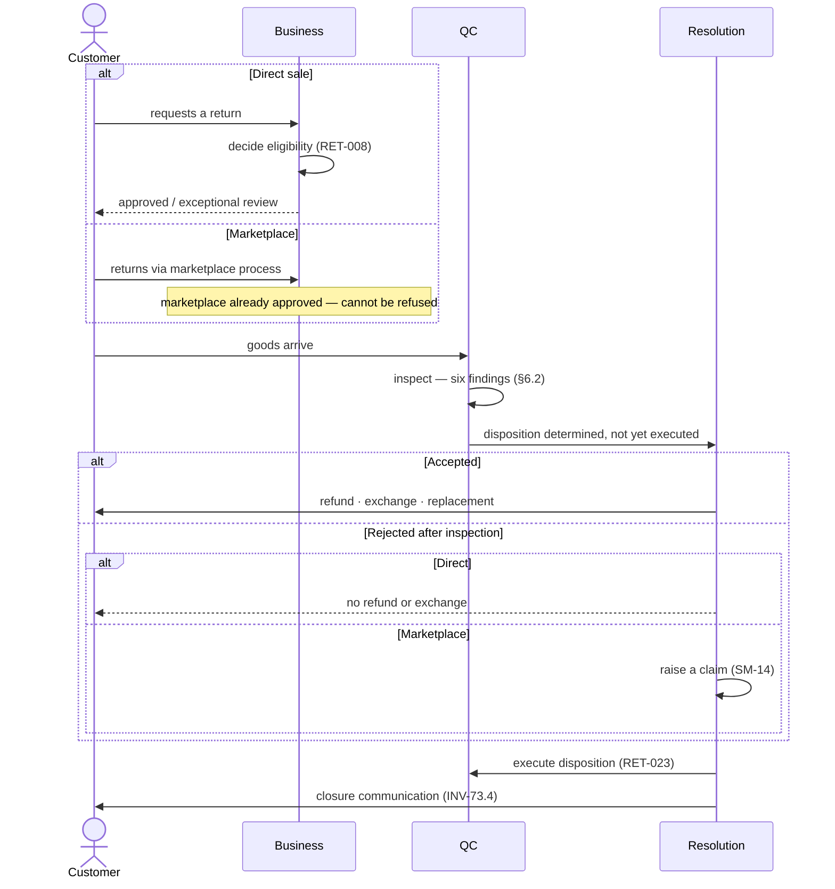
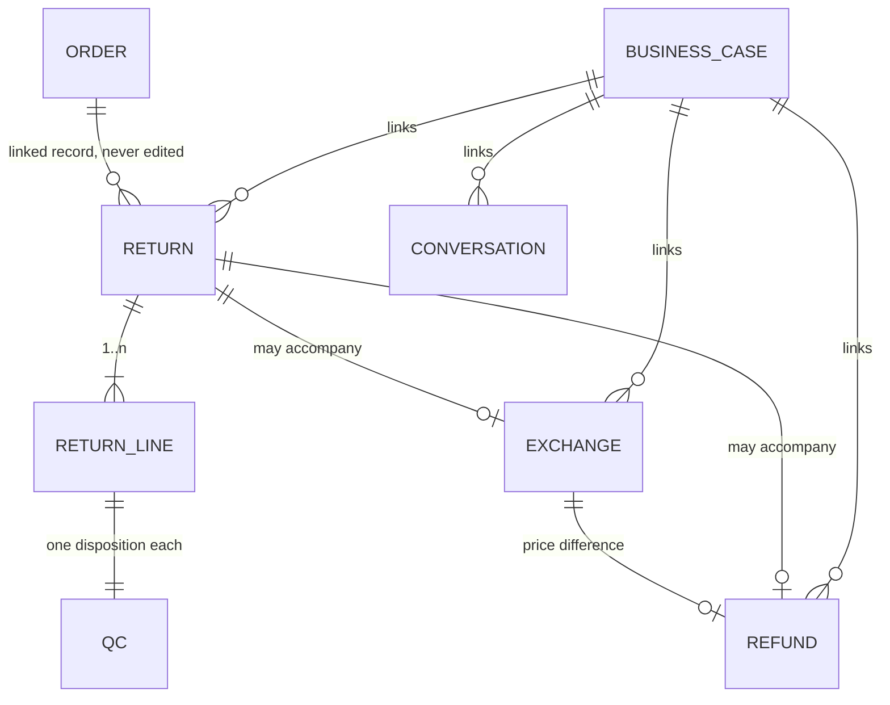

# Return & Exchange Architecture

**Owner:** Trioloo Technology · **Module:** Return & Exchange · **Status:** Canonical
**Version:** 1.1.1 · **Ratified:** 2026-08-08 · **Rule prefix:** `RET-`

---

## Document Control

**Inherits:** [`SYSTEM_ARCHITECTURE.md`](SYSTEM_ARCHITECTURE.md) §0 Core Principles · [`ORDER_MANAGEMENT_ARCHITECTURE.md`](ORDER_MANAGEMENT_ARCHITECTURE.md) §9.12 (`BR-135` – `BR-141`, the reconciliation record).
**References:** [`STATE_MACHINE_ARCHITECTURE.md`](STATE_MACHINE_ARCHITECTURE.md) §22 (`SM-8`, `SM-9`, `SM-10`, `SM-11`) · [`DOMAIN_MODEL.md`](DOMAIN_MODEL.md) `E-045`, `E-047`, `E-049`, `E-050`, `E-073` · [`PRODUCT_ARCHITECTURE.md`](PRODUCT_ARCHITECTURE.md) `PRD-009`, `PRD-053` · [`NOTIFICATION_ARCHITECTURE.md`](NOTIFICATION_ARCHITECTURE.md) · [`AUDIT_ARCHITECTURE.md`](AUDIT_ARCHITECTURE.md) · [`DESIGN_CONSTITUTION.md`](DESIGN_CONSTITUTION.md) for all presentation.

**Source of truth:** [`BUSINESS_DISCOVERY.md`](BUSINESS_DISCOVERY.md) §22, `BD-342` – `BD-354`, with prior coverage at `BD-076` – `BD-090`, `BD-230`, `BD-254`, `BD-289`, `BD-291`, `BD-301`, `BD-310`, `BD-325`.

> **This document consolidates confirmed decisions only.** No business rule is introduced, no entity or lifecycle is invented, and no gap is solved. Unresolved items are carried in §21 with their governing `GAP-` reference.

> Contains no code, schema, API contract, or user interface specification.

---

# 1. Purpose

To define how goods come back — and what the business does about it commercially, physically and financially.

This domain carries **the heaviest prior coverage of any in the discovery**, and its own summary of what goes wrong is unambiguous:

> **The greatest cost is staff time spent coordinating information across departments and communication channels, rather than performing the actual return or exchange work** (`BD-353`).

**No individual step is described as hard.** Inspection, decision, refund and inventory placement are all workable. **What consumes the day is holding them together** — which is why this document's central structure is not a lifecycle but a **case** (§4.4), and why *"integration beats capability"* is the ordering principle for work here.

---

# 2. Scope

## 2.1 In scope

Return authorization and eligibility · the two parallel return processes and their discriminator · return methods · return shipping cost attribution · partial and full returns at line level · the Return, Exchange and Refund lifecycles · QC disposition of returned goods · advance exchange and its overdue mechanism · customer return history as decision support · the Business Case that gates closure across linked processes.

## 2.2 Out of scope — owned elsewhere

| Topic | Owner |
|---|---|
| **Refund execution and the accounting entry** | `PAYMENT_ARCHITECTURE.md` ✅ |
| **Stock movement execution and valuation** | `INVENTORY_ARCHITECTURE.md` ✅ |
| **QC operational execution** — who inspects, where, with what | `WAREHOUSE_ARCHITECTURE.md` ✅ |
| **Repair execution** — `SM-15`, performers, parts | [`WARRANTY_REPAIR_ARCHITECTURE.md`](WARRANTY_REPAIR_ARCHITECTURE.md) `WAR-`, `E-072` |
| **Marketplace claim** against a rejected return | `E-069`, `SM-14`, `OM §9.11` |
| **Supplier return, exchange and credit** | `PROCUREMENT_ARCHITECTURE.md` ✅ (`BD-301`) |
| **Notification delivery** | `NOTIFICATION_ARCHITECTURE.md` |
| Ledger postings, recognition, COGS | `ACCOUNTING_ARCHITECTURE.md` ✅ |

> **`E-073` Business Case — a note on two kinds of ownership.** `DOMAIN_MODEL.md` assigns its **data ownership** to System, because it spans warranty, repair, trade-in and chat as well as returns. `MASTER_DOCUMENTATION_INDEX.md` assigns its **documentation ownership** here, because this is where it emerged and where its closure rule was established. **`DOC-005` is satisfied** — §4.1 of the index distinguishes the two explicitly.

---

# 3. Architectural Principles

## 3.1 P1 — The original order is never edited

> **RET-001 — A return, exchange or refund is a linked record. The original order is never modified** (`BD-230`, `BD-254`, `BR-118`, `BR-085`).

`BR-011` and `BR-082` govern amendment up to `COURIER_BOOKED`. **After delivery, amendment does not merely become restricted — it does not exist as a mechanism.** The only path is a linked return, exchange or adjustment record carrying its own price difference.

## 3.2 P2 — Channel difference is expressed as data, never as branching

> **RET-002 — The workflow reads an authorization source; it never tests channel identity** (`BR-135`, `BR-001`, `SYS-009`).

| | |
|---|---|
| ❌ Prohibited | *if channel is Daraz, follow the marketplace path* |
| ✅ **Specified** | **The channel determines the authorization source; the workflow reads the source** |

**A model that tested channel identity would break the moment a second marketplace arrives** — `BD-012` names CartUp, Facebook Marketplace and Bikroy. One that reads an authorization source does not.

## 3.3 P3 — A policy limit routes to a person; it never auto-refuses

> **RET-003 — Return windows and grounds are defaults, not cutoffs** (`BR-136`, `BD-343`).

**Third independent instance of one principle**, after `BD-330` (no sales record → manual review) and `BD-339` (no warranty card → not refused). `CP-8` applied to evidence and policy rather than to authority.

## 3.4 P4 — Completed is not Closed

> **RET-004 — Completed means this lifecycle's operational work has finished. Closed means the entire Business Case has no remaining pending activity across any linked process** (`BD-352`, `BR-141`, `SMA-057`).

**`BR-010` was written for orders and turns out to describe a rule the business applies everywhere.** Seven lifecycles separate the two independently.

## 3.5 P5 — Coordination is the cost, so the case is the structure

> **RET-005 — Every return and exchange is managed from a single Business Case, not from multiple disconnected processes** (`BD-353`, `BD-354`).

**The case was not proposed by the architecture.** It emerged from three separate answers — `BD-348` named it, `BD-352` made it load-bearing, `BD-353` made it the stated requirement — before `BD-354` ratified it.

---

# 4. Return Architecture

## 4.1 Two parallel processes, one discriminator

> **RET-006 — `Return Authorization Source` is the single path discriminator, with two values: `Business Approved` and `Marketplace Approved`** (`BD-342`, `BR-135`, `DM-063`).

`BD-078` established that two return processes exist; **this is what distinguishes them in the record.** One attribute, and it drives the one skip in `SM-8`.

| | Direct sales — Website, Facebook, Walk-in, Phone | Marketplace |
|---|---|---|
| **Who authorizes** | An **authorized business representative** | **The marketplace's return policy** |
| **Sequence** | **Authorization precedes movement** | The marketplace approves; **Trioloo cannot refuse** (`BD-325`) |
| **Trioloo learns** | **At the request** | When the marketplace reports it, **or when the parcel arrives** |

> **RET-007 — `Decision Authority` and `Return Authorization Source` are one concept, not two** (`DM-063`, `SYS-016`). `BD-343` names the second; **same two values, same meaning.** Two fields would eventually disagree.

**The attribute is what makes the decision record coherent.** `Return Decision` holds outcomes Trioloo did not always make — on the marketplace path the decision is the marketplace's, mirrored under `SYS-010`. **Without the authority attribute, the record would be ambiguous about who is accountable for it.**

## 4.2 Eligibility

> **RET-008 — Requests outside the standard window or grounds are handled as exceptional business cases, and may be approved or rejected after review** (`BD-343`, `BR-136`).

| Established | Value | Source |
|---|---|---|
| Return window | **14 days marketplace · 7 days elsewhere** | `BD-077`, `DM-030` |
| Return grounds | **Five, all fault-based** | `BD-076` |

**This refines `BD-076`.** Five fault-based grounds were recorded with no change-of-mind ground, raising `BD-220`. **A change-of-mind return is not impossible — it is simply not standard**, and `RET-011` supplies its commercial terms. `BD-220` is substantially answered.

> **RET-009 — Three fields are recorded on every decision: `Return Decision`, `Decision Reason`, `Decision Authority`** (`BD-343`). **Seventh reason-capture instance** (`AUD-042`).

## 4.3 Return method drives nothing

> **RET-010 — Return method is recorded as history and has no effect on the business return workflow** (`BD-344`, `BR-137`).

**Values:** Walk-in · Courier · Marketplace Logistics · other approved methods — a **controlled vocabulary, extensible by design** (`SYS-021`).

**The business declined a second branch point outright, and stating it is more useful than leaving it to be inferred.** Had method also branched, `SM-8` would face a two-dimensional matrix — business-approved-by-courier, marketplace-approved-by-walk-in — for no business reason.

**Method and authorization source are independent.** A business-approved return may arrive by walk-in **or** courier. **Fourth instance of *how it arrived* being separate from *what it is***, after collection source (`BD-315`), conversation channel (`BD-327`) and warranty intake channel (`BD-329`).

## 4.4 The Business Case

> **RET-011 — A Business Case may begin before its classification is known; classification is determined during inspection or business review** (`BD-354`, `INV-73.1`).

**This is why the case must be an entity rather than a join between records.** `BD-353` names the sharpest operational challenge as *"determining whether the issue is covered by **return, exchange, warranty, or paid service**"* — **and at intake that is often unknown.**

> **You cannot create a Return until you know it is a return. You can create a case the moment the customer makes contact.** The case is the **stable identity**; lifecycles attach once the route is known. **A join between records cannot exist before the records do.**

| Property | Rule |
|---|---|
| **Gates closure** | `INV-73.2` — a lifecycle may be `COMPLETED` while the case is not `CLOSED` |
| **Governs, does not own** | `INV-73.3` — each lifecycle stays independent and couples by events (`SMA-002`) |
| **Customer communication is a closure condition** | `INV-73.4` — not a courtesy |
| **May hold zero lifecycles** | `BD-367` — *Order Support* is a genuine case with only conversations |

## 4.5 Partial and full returns

> **RET-012 — A return carries lines. Partial versus full is derived from which lines are included, never stored** (`BD-346`, `BR-138`, `SMA-051`).

**A return covering every line *is* a full return.** This keeps `SM-8` free of a second branch point, as `RET-010` already did for method.

> **RET-013 — Inventory, accounting, warranty and replacement decisions resolve per affected line, never automatically for the entire order** (`BD-346`).

**A three-item order with one fault produces one affected line and two untouched ones.** `BD-289`'s four QC dispositions therefore apply **per line, not per return** — one returned item may be `Sellable` while another from the same return is `Scrap`, which is what independent tracking exists to permit.

## 4.6 Component-level returns on assembled products

> **RET-014 — On an assembled product the remedy is component-level; the commercial unit is not** (`BD-346`, `PRD-009` as clarified).

| What happens to the component | Permitted |
|---|---|
| **Replaced or exchanged** — the unit goes back whole | **✅ Yes** — the component-level remedy `PRD §5.4` describes as a warranty claim |
| **Refunded** — unwinding part of the sale | **❌ Not supported, and the model cannot express it** |

**Why the second is blocked rather than undecided.** An assembled PC is sold as **one Sellable Product at one price** (`PRD-022`), so a component carries **no separate sale value**. Refunding one would require a **declared allocation basis** — which `PRD-053` defines **only for bundles**, precisely because bundle members *do* have standalone prices. **`GAP-092`** records what would be required if this changed.

---

# 5. Exchange Architecture

## 5.1 Exchange is the dominant path; advance exchange is not

> **RET-015 — Exchange is the dominant after-sales resolution. Advance exchange — sending the replacement before the original returns — is an exceptional business process, not the default workflow** (`BD-090`, `BD-350`, `BR-139`).

**These are two different claims and both are true.** `BD-086` recorded advance exchange as *"the common case"* and was written up as a correction **to** `OM §13.4`. **It was not.** Asked again with that claim quoted back, the business stated the opposite. **`OM §13.4` was right all along**; `DM-033` and `SMA-022` are corrected accordingly.

**Permission is case by case, based on customer trust and business policy** (`BD-350`).

## 5.2 Commercial shape

| Established | Source |
|---|---|
| Upgrade, downgrade, and **price difference settled before dispatch** | `BD-087`, `BD-088` |
| A **single linked transaction**, not a cancel-and-reorder | `BD-088`, `RET-001` |
| **Accounting adjustment is conditional** — a like-for-like exchange needs none | `BD-087`, `SM-9` stage 10 |
| Returned units are **reused for other customers** after QC | `BD-086`, `DM-033` |

## 5.3 The join, and why it can hang

> **RET-016 — `Exchange Confirmed` is a synchronisation point requiring both the replacement side and the return side to complete** (`BD-348`, `SMA-052`).

**Replacement delivery and return receipt are explicitly order-independent** — the replacement may go out first, or the original may arrive first, and **the ERP must support both.**

> **A join can wait forever.** If the customer never returns the original, the return arm never completes and the exchange never confirms. **`SM-9` is the only machine in the architecture whose non-completion is structural rather than incidental** — which is exactly what the overdue mechanism exists to catch.

## 5.4 The overdue mechanism

> **RET-017 — After a configured business period, an unreturned advance exchange becomes `Overdue`. The ERP must not automatically decide the outcome** (`BD-350`, `SMA-054`).

| Property | |
|---|---|
| **Threshold** | **Configurable** (`SYS-013`) — not hardcoded, not invented |
| **Result** | **A named state**, not merely a flag |
| **Consequence** | Follow-up and recorded communication |

**Four resolutions, and they are not equivalent** — extending the period · closing the case on receipt · **converting the replacement into a normal sale** · another business-approved resolution. **They have entirely different commercial and accounting consequences, which is precisely why the decision is not automated.**

> **This was the first stated ageing threshold in the architecture.** `GAP-024` recorded that no state had a documented time expectation; `BD-350` supplied the **mechanism** and `BD-364` later supplied a **worked value**. The pattern — *configurable default → named state → follow-up, never an automatic decision* — is now available to `GAP-087` and `GAP-091`.

⚠ **Conversion to a normal sale has an unresolved accounting question — `GAP-093`.** The replacement was **already delivered**, and `BD-304` recognises revenue at delivery. See §11.4.

---

# 6. QC Architecture

> **RET-018 — Returned goods enter QC Pending and take one of four dispositions** (`BD-289`, `SM-11`).

| Disposition | Consequence |
|---|---|
| **Sellable** | Re-enters saleable stock after inspection |
| **Repair Required** | Enters `SM-15` Repair — **a repair entry point that is not warranty** (`SMA-044`) |
| **Supplier Claim** | Routed upstream; duration **supplier-owned and unbounded** |
| **Scrap** | Partial or full, **with an accounting loss** (`BD-291`) |

## 6.1 QC is a machine here because it decides an outcome

> **RET-019 — Return QC is `SM-11`, a machine, because it produces branching dispositions.** Build QC and repair QC are **stages**, because they gate progress without deciding an outcome (`SMA-045`).

> **QC is a stage where it gates progress, and a machine where it decides an outcome.**

## 6.2 What inspection determines

Six findings are confirmed (`BD-079`, `BD-080`, `BD-082`, `BD-325`): **product condition · missing parts or accessories · physical damage · functional damage · incorrect return · other abnormalities.**

⚠ **`GAP-073` is unchanged.** As-built records detect a **different model**, not a **different unit of the same model**. **Missing and wrong are caught; swapped-for-identical is not** — an accepted exposure, and `RET-024` records the business's chosen response.

## 6.3 Marketplace returns are inspected identically

> **RET-020 — On a marketplace-governed return, the marketplace's decision and Trioloo's inspection are independent records and must not overwrite each other** (`BD-325`, `BR-132`, `INV-69.1`).

| Stage | Who decides |
|---|---|
| Whether the return is accepted | **The marketplace** — Trioloo cannot refuse |
| What condition the goods are actually in | **Trioloo** |
| Whether a claim is raised | **Trioloo** |
| Whether the claim succeeds | **The marketplace** (`SM-14`) |

> **The gap between the two records is what justifies the claim.** If either overwrote the other, the basis for `E-069` would disappear. **This is not record hygiene — it is the mechanism.**

**`BD-289`'s QC applies unchanged on both paths.** What differs is **the governance of the decision to accept**, not the inspection.

---

# 7. Return Request

## 7.1 `SM-8` — states

`REQUESTED → APPROVED → WAITING_FOR_RETURN → IN_TRANSIT → RECEIVED → INSPECTION → DECISION_PENDING → ACCEPTED → RESOLUTION → INVENTORY_PROCESSING → COMPLETED → CLOSED`

> **RET-021 — `SM-8` has exactly one branch point: `APPROVED` is skipped when the authorization source is `Marketplace Approved`** (`SMA-048`).

## 7.2 Two decisions, separated by inspection

> **RET-022 — `APPROVED` and `ACCEPTED` are different decisions** (`SMA-049`).

| Stage | Decides |
|---|---|
| `APPROVED` | *"We will take it back"* — a commitment to receive |
| `ACCEPTED` | *"We accept the goods as received"* — after inspecting condition |

**This is what makes rejection after inspection possible without contradiction.** A return may be approved at stage 2 and rejected at stage 8 — the customer was told to send it, and what arrived was not what was agreed.

**Rejection means different things on the two paths:**

| Path | Rejection after inspection means |
|---|---|
| **Direct** | The customer does not receive the refund or exchange |
| **Marketplace** | **Trioloo cannot refuse the return** — so rejection becomes **a claim against the marketplace** (`SM-14`) |

## 7.3 Inventory processing follows the commercial resolution

> **RET-023 — The QC disposition is determined at inspection but executed only after the customer outcome is settled** (`SMA-050`).

**Goods remain in QC Pending throughout the refund or exchange.** Deliberate and correct: **stock must not return to sellable inventory while a dispute is live**, or the same unit could be sold twice over.

## 7.4 Repeat returns

> **RET-024 — Customer return history is a decision-support tool, not an automatic approval or rejection rule** (`BD-351`, `BR-140`).

**No return scoring, no blacklist, no permanent refusal list, no automatic blocking.** Each request is evaluated on five factors: **return reason · product condition · sales channel · business policy · customer history.**

> **This is the clearest statement of `CP-8` the business has given**, and the first time the posture is stated as a *general principle* rather than case by case. `CP-8` was **derived** from a pattern across answers; it is **corroborated here as a principle the business itself holds**.

**Symmetrical with `BD-295`** — no supplier scoring either. **The business declines algorithmic judgement of counterparties in both directions.** It is also its answer to return fraud, consistent with `GAP-073` being an accepted exposure rather than a problem to engineer away.

**Customer return history is a query, not stored data** — reached via the customer through returns (`DB-067`).

---

# 8. Exchange Request

## 8.1 `SM-9` — states

`REQUESTED → APPROVED → REPLACEMENT_RESERVED → { REPLACEMENT_DELIVERED ∥ WAITING_FOR_RETURN → RECEIVED → INSPECTION } → CONFIRMED → INVENTORY_ADJUSTMENT → ACCOUNTING_ADJUSTMENT → COMPLETED → CLOSED`

## 8.2 Reservation follows commitment

> **RET-025 — Stock is reserved at exchange approval** (`BD-348`, `BD-278`). **Commitment reserves; fulfilment consumes.**

## 8.3 Independence from Return

> **RET-026 — Return and Exchange are independent lifecycles linked to the same Business Case whenever they occur together** (`BD-348`, `SMA-002`).

**`SM-8`'s `RESOLUTION` stage is a delegation point, not a container.** A customer's single problem may generate a Return **and** an Exchange running in parallel, each starting at its own `REQUESTED` stage — **neither is a sub-state of the other.**

> **The business stated `SMA-002` independently and unprompted** — *"independent but closely linked"*, *"separate lifecycles while being linked to the same business case"*. **This is the clearest confirmation that principle has received:** not a rule the architecture imposed, but one the business already works to.

**This addresses the chain-linking gap raised at `BD-089`/`BD-235`.**

---

# 9. Repair Relationship

> **RET-027 — A return QC disposition of `Repair Required` is one of four entry points into `SM-15` Repair, and it is not a warranty claim** (`BD-289`, `BD-333`, `SMA-044`).

| Entry into `SM-15` | Warranty? |
|---|---|
| A warranty claim resolved as *Repaired* (`SM-13`) | **Yes** |
| **A return QC disposition of `Repair Required`** | **No** — a returned unit, not a claim |
| A **chargeable** repair, cost bearer = Customer | **No** — paid service |

**A repair can exist with no warranty claim behind it at all**, which is why `SM-15` is an independent lifecycle rather than a branch of `SM-13`. **Repair execution, performers, parts and cost bearer are owned by [`WARRANTY_REPAIR_ARCHITECTURE.md`](WARRANTY_REPAIR_ARCHITECTURE.md) (`WAR-034` – `WAR-047`) and `E-072`** — not restated here.

*Corrected 2026-08-09. This paragraph previously cited `PRODUCT_ARCHITECTURE.md` §32, which reconciles warranty **policy** and holds no execution content; it was cited because no owning module was registered at the time (`DOC-062`). **The boundary itself is unchanged.***

---

# 10. Inventory Movement

**Stock movement execution and valuation are owned by `INVENTORY_ARCHITECTURE.md` ✅.** This section states only what the return and exchange lifecycles require of it.

| Moment | Movement |
|---|---|
| Goods received on a return | Into **QC Pending** — not sellable (`BR-104`) |
| Disposition executed at `INVENTORY_PROCESSING` | Sellable · Repair · Supplier Claim · Scrap |
| Replacement reserved at exchange approval | Reservation (`RET-025`) |
| Scrap | **Partial or full, with an accounting loss** (`BD-291`) |

> **RET-028 — Returned goods are not sellable stock until their disposition is executed, and execution follows the commercial resolution** (`RET-023`, `BR-104`).

**Three conditions exist where stock is physically present but not sellable** (`BR-104`): **Reserved · Pending supplier resolution · QC Pending.** Returns produce the third.

---

# 11. Financial Impact

**Refund execution and all ledger postings are owned by `PAYMENT_ARCHITECTURE.md` ✅ and `ACCOUNTING_ARCHITECTURE.md` ✅.** This section states the return-side facts they consume.

## 11.1 `SM-10` Refund — states established in this domain

`REQUESTED → REVIEW → APPROVED → AMOUNT_CONFIRMED → PAYMENT_PENDING → PAID → CONFIRMED → CLOSED`

> **RET-029 — The accounting entry is created at `PAID`, never before** (`BD-310`, `BD-349`, `SMA-055`).

| Stages | Status |
|---|---|
| **1 – 5** — Requested → Payment Pending | **Operational only. No accounting entry exists** |
| **6 — `PAID`** | **The accounting entry is created** |
| 7 – 8 | Confirmation and closure |

**An approved refund is not yet a financial record.** A refund can be requested, reviewed, approved and have its amount confirmed while remaining **entirely absent from the accounts** — correct, because none of those acts moves money.

> **Same discipline as `BD-304` (revenue at delivery) and `BD-299` (payable at acceptance): recognition follows the event, never the intent.** Three domains, one rule.

> **RET-030 — `PAID` and `CONFIRMED` mirror collection and settlement in reverse** (`SMA-056`). Money leaving Trioloo and money reaching the customer are **different events with a real gap between them** — on the marketplace path the marketplace refunds the customer and Trioloo only sees it later in settlement (`BR-126`).

**Eight stages, linear, no join and no conditional branch** — the shortest lifecycle in the architecture. **The only variation is who pays, which is data rather than a path.**

**`SM-10` is never standalone** — it attaches to a return or an exchange (`BD-349`).

## 11.2 Return shipping cost

> **RET-031 — The ERP records `Return Shipping Cost Bearer`, `Return Shipping Amount`, `Return Reason` and `Sales Channel`, and the responsibility remains fully auditable** (`BD-345`).

| Return reason | Who bears shipping |
|---|---|
| **Business fault** — the five standard grounds | **The business may bear it** |
| **Customer decision or responsibility** — the exception path | **The customer normally bears it** |

**So the exception path is not a free-for-all.** A change-of-mind return may be approved, and when it is, **the customer carries the freight** — which is why `BD-076` could describe the grounds as fault-based while `BD-343` allows exceptions. **The grounds determine the default; the reason determines the cost.**

**Both allocations are hedged — *"may bear"*, *"normally bears"*.** Even the fault-based default is a default, not an automatic posting.

## 11.3 Marketplace return shipping is a settlement deduction

> **RET-032 — On the marketplace path, return shipping arrives as a settlement deduction, not as a courier payment** (`BD-345`, `BR-124`).

It aggregates into **`Marketplace Charges`** and **shares the open question at `GAP-081`**: a refund recovery and a return-shipping recovery are both **non-fee items flowing through a charges expense**. **Whichever way `GAP-081` resolves should cover both.**

⚠ **The unreconciled charge vocabulary now spans four concepts** (`BD-190`, `BD-191`) — what the customer pays for delivery, what the courier charges Trioloo, what the marketplace deducts, and **return shipping** — inbound and outbound, customer-borne and business-borne.

## 11.4 ⚠ Converting a replacement into a sale — `GAP-093`

**Carried, not solved.** The replacement was **already delivered**, and `BD-304` recognises revenue at delivery — but at that moment this was an exchange, not a sale, so no revenue was recognised.

| Reading | Consequence |
|---|---|
| Recognise at **original delivery date** | Reopens a closed period; conflicts with `DB-003` |
| Recognise at **conversion date** | Revenue dated after its own delivery — unusual but forward-only |

**`BD-311` set the precedent that a bad debt does not reverse revenue because *the past does not move*, which points toward forward recognition** — but this is **not stated and is not assumed.** Rare, with a real consequence: guessing would misstate a period.

---

# 12. Customer Journey

**Customer communication is a closure condition** (`INV-73.4`) — **a case is not `CLOSED` until the customer has been told.**

---

# 13. Internal Workflow

## 13.1 The eight operational challenges, and where each is addressed

| Challenge (`BD-353`) | Addressed by |
|---|---|
| Customers not fully explaining the problem | Intake and authorization — `RET-006` |
| Delays receiving returned products | `WAITING_FOR_RETURN` · `IN_TRANSIT` — `SM-8` |
| Waiting for customer responses | Communication as a closure condition — `INV-73.4` |
| **Determining return / exchange / warranty / paid service** | **The case precedes classification — `RET-011`** |
| Identifying reusable, repairable, scrap components | Four dispositions, **per line** — `RET-013`, `RET-018` |
| Managing replacement stock availability | `REPLACEMENT_RESERVED` — `RET-025` |
| **Coordinating across processes and channels** | **The Business Case — `RET-005`** |
| Marketplace policies and settlement adjustments | `RET-020`, `RET-032` |

> **Nothing in the pain set is unaddressed, and nothing in the requirement set is unmotivated** — the same coherence check §20 Marketplace and §23 Chat both passed.

## 13.2 Reporting consequence of `RET-004`

**A lifecycle can sit `COMPLETED` but not `CLOSED` for a long time**, gated by its slowest linked process — a supplier claim (unbounded), a marketplace claim (unpredictable by definition), or a settlement adjustment (up to 7 days, `BD-063`).

> **So *"open returns"* means two different things.** See §20.

---

# 14. State Machine References

| Machine | Subject | Entity | Documented |
|---|---|---|---|
| **`SM-8`** | **Return** | `E-047` | **Here** — §7, `STATE_MACHINE_ARCHITECTURE.md` §22.1 |
| **`SM-9`** | **Exchange** | `E-050` | **Here** — §8, `SMA §22.2` |
| `SM-10` | Refund | `E-045` | States established here (§11.1); **execution owned by `PAYMENT_ARCHITECTURE.md`** |
| `SM-11` | QC | `E-049` | **Here** — §6; **operational execution owned by `WAREHOUSE_ARCHITECTURE.md`** |
| `SM-14` | Marketplace Claim | `E-069` | `OM §9.11` — reached on marketplace rejection |
| `SM-15` | Repair | `E-072` | [`WARRANTY_REPAIR_ARCHITECTURE.md`](WARRANTY_REPAIR_ARCHITECTURE.md) — one entry point is here (§9) |

**No machine is defined in this document.** `STATE_MACHINE_ARCHITECTURE.md` remains canonical for machine structure (`DOC-005`).

⚠ **`GAP-026`** — machine-qualified state naming is required. `RECEIVED`, `INSPECTION`, `COMPLETED` and `CLOSED` appear across `SM-8`, `SM-9`, `SM-13` and `SM-15`; `SM-8.RECEIVED` and `SM-15.RECEIVED` are different states of different entities (`SMA-047`).

---

# 15. Entity Relationships

| Entity | ID | Canonical definition |
|---|---|---|
| Return | `E-047` | `DOMAIN_MODEL.md` |
| Exchange | `E-050` | `DOMAIN_MODEL.md` |
| Refund | `E-045` | `DOMAIN_MODEL.md` |
| QC | `E-049` | `DOMAIN_MODEL.md` |
| **Business Case** | **`E-073`** | `DOMAIN_MODEL.md` — data owner System, **documented here** |

**No entity is defined here.**

---

# 16. Business Rules

`RET-001` – `RET-032`. **Every rule cites a confirmed Business Decision or a reconciled architectural rule. None is new.**

| Range | Subject |
|---|---|
| `RET-001` – `RET-005` | Architectural principles |
| `RET-006` – `RET-014` | Return architecture, eligibility, method, case, lines |
| `RET-015` – `RET-017` | Exchange, the join, overdue |
| `RET-018` – `RET-020` | QC and marketplace inspection |
| `RET-021` – `RET-026` | Return and exchange requests |
| `RET-027` – `RET-028` | Repair relationship, inventory |
| `RET-029` – `RET-032` | Financial impact |

**Reconciliation record:** `ORDER_MANAGEMENT_ARCHITECTURE.md` §9.12 (`BR-135` – `BR-141`) is retained as the historical reconciliation; **this document is the canonical specification.**

---

# 17. Cross-domain Integration

| Domain | Interface |
|---|---|
| **Order** | The original order is never edited (`RET-001`); returns are linked records |
| **Marketplace** | Authorization source, dual independent records, rejection → `SM-14` (`RET-020`) |
| **Warranty** | [`WARRANTY_REPAIR_ARCHITECTURE.md`](WARRANTY_REPAIR_ARCHITECTURE.md) — shares `SM-15` Repair; a case may be classified warranty rather than return (`RET-011`) |
| **Trade-In** | `E-073` also links Trade-In cases (`BD-354`) |
| **Chat** | Conversations link to the case; **communication gates closure** (`INV-73.4`) |
| **Inventory** | QC Pending, dispositions, scrap loss |
| **Payment** | Refund execution and settlement deductions |
| **Procurement** | Supplier Claim disposition; supplier return, exchange and credit (`BD-301`) |

---

# 18. Notification Integration

**All delivery behaviour is owned by `NOTIFICATION_ARCHITECTURE.md`.** This domain raises three obligations against it:

| Obligation | Category | Source |
|---|---|---|
| **Advance-exchange overdue follow-up** | **Action Required** | `BD-350`, `RET-017` |
| **Return closure communication** | **A closure condition, not a courtesy** | `BD-352`, `INV-73.4` |
| Frequent-return highlighting | Information | `BD-351` — **threshold undefined, `GAP-091`** |

⚠ **Closure communication is customer-facing, and `NOT-019` defers all external delivery channels past V1.** Recorded so the dependency is deliberate: **in V1 this is satisfied in-app or not at all.**

---

# 19. Audit Requirements

| Auditable | Rule |
|---|---|
| **Return decision, reason and authority** | `RET-009` — seventh reason-capture instance (`AUD-042`) |
| **Return shipping responsibility** | `RET-031` — *"fully auditable"* |
| Exchange approval and reservation | `RET-025` |
| **Overdue resolution decisions** | `RET-017` — four non-equivalent outcomes |
| QC disposition per line | `RET-013` |
| Every actor attribution | `AUD-004`, `INV-77.1` |

**Corrections are linked adjustments, never edits** (`DB-002`, `DB-077`, `RET-001`).

---

# 20. Reporting Requirements

> **RET-033 — Reports must state whether they count *not Completed* or *not Closed*** (`BD-352`, `RET-004`).

| Question | Counts |
|---|---|
| *"What still needs operational work?"* | **Not Completed** |
| *"What is not finished commercially?"* | **Not Closed** |

**Reporting the second as the first shows a backlog nobody can act on** — the return is done, it is waiting on the marketplace.

**Report definitions are owned by `REPORTING_ARCHITECTURE.md` ✅; no figure is owned by reporting** (`DB-067`). `BD-314`'s eleven-report register applies.

---

# 21. Open GAP References

**Carried, not solved.**

| GAP | Severity | Bearing |
|---|---|---|
| **`GAP-093`** | 🟡 Medium | **Revenue recognition on a converted replacement** (§11.4). Rare, real consequence; guessing misstates a period |
| **`GAP-092`** | 🟢 Low | **No allocation basis exists for components of an assembled product** (§4.6). Only live if component *refunds* are later required |
| **`GAP-091`** | 🟡 Medium | ***"Unusually frequent returns"* has no threshold** (§7.4). Pattern exists (`RET-017`); the value is the business's to set |
| **`GAP-081`** | 🟡 Medium | **Refund and return-shipping recovery classification** (§11.3) — both non-fee items in a charges expense |
| **`GAP-073`** | 🟡 Medium | **A substituted component of the same model is undetectable** (§6.2) — an accepted exposure |
| **`GAP-064`** | 🟢 Low | **Bundle return windows and eligibility are undefined** (`PRD-051`) |
| **`GAP-026`** | 🟡 Medium | **State names collide across machines** (§14) |
| **`GAP-001`** | 🔴 Critical | Ten module documents remain unwritten. **This document reduces the count by one** |

**Also unresolved, recorded at discovery:** *replacement* versus *exchange* as terms were never defined (`BD-347`), and **whether marketplace return approval reaches Trioloo before the goods do** depends on sync capability and is not stated (`BD-342`).

---

# 22. Traceability

## 22.1 Business Decisions consumed

| BD | Contributes |
|---|---|
| `BD-342` | **Return Authorization Source** — the two-value path discriminator |
| `BD-343` | Eligibility · window as a default · three decision fields |
| `BD-344` | **Return method drives nothing** |
| `BD-345` | Return shipping cost bearer · marketplace deduction |
| `BD-346` | **Line-level returns** · component remedy |
| `BD-347` | **`SM-8` states** · `APPROVED` vs `ACCEPTED` |
| `BD-348` | **`SM-9` states and the join** · case linking |
| `BD-349` | **`SM-10` states** · accounting at `PAID` |
| `BD-350` | **Advance exchange is exceptional** · `Overdue` · four resolutions |
| `BD-351` | **Customer history is decision support** · no scoring |
| `BD-352` | **Completed vs Closed** as a general principle |
| `BD-353` | **Coordination as the dominant cost** · the case precedes classification |
| `BD-354` | **`E-073` Business Case ratified** |

**Prior coverage consumed:** `BD-063`, `BD-076` – `BD-090`, `BD-190`, `BD-191`, `BD-220`, `BD-230`, `BD-254`, `BD-278`, `BD-289`, `BD-291`, `BD-295`, `BD-299`, `BD-301`, `BD-304`, `BD-310`, `BD-311`, `BD-314`, `BD-315`, `BD-325`, `BD-327`, `BD-329`, `BD-333`, `BD-364`.

## 22.2 Rules inherited, not restated

| Rule | Document |
|---|---|
| `BR-010`, `BR-085`, `BR-104`, `BR-118`, `BR-124`, `BR-126`, `BR-135` – `BR-141` | `ORDER_MANAGEMENT_ARCHITECTURE.md` |
| `SMA-002`, `SMA-044` – `SMA-057` | `STATE_MACHINE_ARCHITECTURE.md` |
| `INV-69.1`, `INV-73.1` – `INV-73.4`, `INV-77.1`, `DM-030`, `DM-033`, `DM-062` – `DM-064` | `DOMAIN_MODEL.md` |
| `PRD-009`, `PRD-022`, `PRD-051`, `PRD-053` | `PRODUCT_ARCHITECTURE.md` |
| `SYS-009`, `SYS-010`, `SYS-013`, `SYS-016`, `SYS-021` | `SYSTEM_ARCHITECTURE.md` |
| `DB-002`, `DB-003`, `DB-067`, `DB-077` | `DATABASE_ARCHITECTURE.md` |
| `AUD-004`, `AUD-042` | `AUDIT_ARCHITECTURE.md` |
| `NOT-019` | `NOTIFICATION_ARCHITECTURE.md` |
| `CP-3`, `CP-8`, `CP-12` | `SYSTEM_ARCHITECTURE.md` §0 |

## 22.3 Corrections carried from reconciliation

| Correction | Record |
|---|---|
| **`BD-086` superseded** — advance exchange is exceptional | `BR-139`, `DM-033`, `SMA-053` |
| **`PRD-009` clarified** — partial *refund*, not partial *return* | `PRD-009`, §4.6 |
| **`BR-010` generalised** to every operational lifecycle | `BR-141`, `RET-004` |

---

# 23. Version History

| Version | Date | Change |
|---|---|---|
| **1.1.1** | **2026-08-09** | **`RET-027`'s entry-point count corrected — no rule changed in substance.** A return QC disposition of `Repair Required` is one of **four** entry points into `SM-15`, not three; the fourth is a Trade-In component classified `REPAIR_REQUIRED` (`SMA-044` as amended, `SMA-072`). **`RET-027`'s own statement is unaffected** — the disposition is still an entry point and still not a warranty claim |
| **1.1.0** | **2026-08-09** | **Stale citations corrected — no rule changed.** Four references routed repair execution, performers, parts and cost bearer to `PRODUCT_ARCHITECTURE.md` §32, which **reconciles warranty *policy* and holds no execution content**; they were written because **no owning module was registered at the time**. All four now resolve to [`WARRANTY_REPAIR_ARCHITECTURE.md`](WARRANTY_REPAIR_ARCHITECTURE.md) (`DOC-062`, `WAR-034` – `WAR-047`). **`RET-027` is unchanged in substance** — a `Repair Required` disposition is still one of three entry points into `SM-15` and still not a warranty claim (`SMA-044`). **No return or exchange rule, state or boundary changed** |
| **1.0.0** | **2026-08-08** | **Initial ratification.** Consolidates `BUSINESS_DISCOVERY.md` §22 (`BD-342` – `BD-354`) with prior coverage from `BD-076` – `BD-090`, and the reconciliation at `OM §9.12` and `SMA §22`. **33 rules, all traceable; no new business rule, entity or lifecycle introduced.** `SM-8`, `SM-9`, `SM-10` and `SM-11` referenced, none defined here. `E-073` Business Case documented; data ownership remains System. **Eight open gaps carried without resolution** |

**Amendment procedure.** Proposals state the business problem, the affected sections and rules, the proposed change, alternatives considered, and the operational impact. **Business rules are never silently altered** — a changed rule is a changed contract with the operation.

---

*This document specifies return and exchange business architecture only. It contains no code, schema, API contract, or user interface specification, and assumes no technology.*
