# State Machine Architecture

**Owner:** Trioloo Technology · **Type:** Canonical lifecycle specification · **Status:** Canonical
**Version:** 1.24.0 · **Amended:** 2026-08-24 (**`COURIER_BOOKED` RATIFIED INTO `SM-1`, resolving `GAP-139`.** `OM §6.2` had carried the state since v1.1.0 with a meaning and an exit owner, and `§5.2`/`§5.4` had neither — while `BR-082` depended on it to place the amendment boundary STRICTER than `BR-011`. ✅ The product owner ratified that it exists, 2026-08-24. ⚠ `READY_TO_SHIP → DISPATCHED` is RETAINED for paths that book no consignment; the booking transition is `UNDECIDED` for want of a ratified event and NO event is invented) · **Ratified:** 2026-08-04 · **Amended:** 2026-08-09 (§14.3 marked superseded — documentary only) · **Amended:** 2026-08-08 (Sales reconciliation; serial policy `BD-242`) · **Machine prefix:** `SM-` · **Rule prefix:** `SMA-` · **+ Warehouse & Assembly §17** · **+ Purchase & Supplier §18** · **+ Accounting §19**

---

## Document Control

### Purpose in the documentation set

[`ORDER_MANAGEMENT_ARCHITECTURE.md`](ORDER_MANAGEMENT_ARCHITECTURE.md) §18 establishes **why** state machines are independent and registers **eleven** of them (`BR-142`, 2026-08-09; **seven** until that date). [`EVENT_ARCHITECTURE.md`](EVENT_ARCHITECTURE.md) registers **102 events** — ⚠ **which do not cover every machine specified here**: **`SM-14`, `SM-16` and `SM-20`** have no registered event and no canonical evidence that one exists (`EVA-020`, `EVENT_ARCHITECTURE.md` §19). **`SM-13` and `SM-15` were covered on 2026-08-09** by `EVT-089` – `EVT-095`, **`SM-18` and `SM-19` by `EVT-096` – `EVT-100`, and `SM-12` by `EVT-102`.** **This document specifies the machines themselves** — every state, every transition, every prohibition, and every entry and exit action.

### Relationship to the ratified register — read this before using the document

`ORDER_MANAGEMENT_ARCHITECTURE.md` §18.2 ratifies **seven** machines: Order, Verification, Shipment, Payment, Return, Exchange, Inventory.

This document specifies **eleven**. Four are new:

| Machine | Was | Status |
|---|---|---|
| **Fulfillment** (`SM-3`) | States embedded in the Order machine | ✅ **Independent — ratified 2026-08-09** |
| **Marketplace Settlement** (`SM-6`) | Embedded in the Payment machine | ✅ **Independent — ratified 2026-08-09** |
| **Refund** (`SM-10`) | Embedded in the Payment machine | ✅ **Independent — ratified 2026-08-09** |
| **QC** (`SM-11`) | Embedded in Return and Exchange | ✅ **Independent — ratified 2026-08-09** |

> **SMA-001 — The four machines are registered extensions to `ORDER_MANAGEMENT_ARCHITECTURE.md` §18.2. ✅ Ratified 2026-08-09 by `BR-142`.**
>
> `GAP-027` recorded these as absent and required that the choice be made explicitly: *"Either document the four missing machines in their owning modules, or record an explicit decision that each is a sub-state of its parent — with the reasoning. Silence is the problem, not the choice."* **Each is specified in §3.2 with its business justification, and each is now registered.**
>
> **📌 Historical status, preserved under `DOC-009` and `DOC-021` — do not delete.** From this document's ratification on 2026-08-04 until 2026-08-09, this rule read: *"Until `OM §18.2` is amended to register them, the ratified count remains seven and these four are specification-ahead-of-ratification. They must not be treated as settled until that amendment is made."* **That condition was met, not waived.** `WAREHOUSE_ARCHITECTURE.md`, `PAYMENT_ARCHITECTURE.md` and `RETURN_EXCHANGE_ARCHITECTURE.md` were each written while it applied, and each carried the unratified status faithfully rather than assuming it away — **no module document ratified a machine by using it**, which is why the amendment was still available to make.

Two machines `GAP-027` also identified — **Courier Remittance** and **Approval** — are **not** specified here because they were not requested. They remain open (§18).

### What this document is not

> **No UI. No database design. No code. No APIs.**
>
> Where a state has a user-facing consequence, this document states the **behaviour**; presentation is governed by [`DESIGN_CONSTITUTION.md`](DESIGN_CONSTITUTION.md) and [`design-reference/`](design-reference/README.md). `UI_ARCHITECTURE.md` is cited in the brief but does not exist (`SYS U-8`, `GAP-068`).

### State reference convention

Per `DM-002`, states are written **`Machine:STATE`** because state names collide across machines (`GAP-026` — `CONFIRMED`, `CLOSED`, `CANCELLED`, `RECEIVED`, `APPROVED`, `REJECTED`, `EXPIRED`, `IN_TRANSIT`). A presentation convention, not a ratified rename.

---

## Table of Contents

| § | Section |
|---|---|
| 1 | Purpose & Scope |
| 2 | Independence Principles |
| 3 | Machine Register |
| 4 | How to Read a Machine |
| 5 | `SM-1` Order |
| 6 | `SM-2` Verification |
| 7 | `SM-3` Fulfillment |
| 8 | `SM-4` Shipment |
| 9 | `SM-5` Payment |
| 10 | `SM-6` Marketplace Settlement |
| 11 | `SM-7` Inventory |
| 12 | `SM-8` Return |
| 13 | `SM-9` Exchange |
| 14 | `SM-10` Refund |
| 15 | `SM-11` QC |
| 16 | Cross-Machine Coordination |
| 17 | Flow Patterns |
| 18 | Unknowns |

---

# 1. Purpose & Scope

## 1.1 Purpose

To specify every lifecycle in the Trioloo ERP such that an order arriving from any channel — a Daraz shop, one of several websites, Facebook, WhatsApp, phone, or the counter — passes through defined, enforceable, auditable states from arrival to closure, and such that no record can ever occupy an undefined or unreachable position.

## 1.2 Business scope

| Requirement | Where satisfied |
|---|---|
| Orders from multiple Daraz shops, multiple websites, Facebook, WhatsApp, phone, walk-in | `SM-1` — channel behaviour derives from attributes (`BR-001`), never channel identity |
| **Verification before fulfillment** | `SM-1`/`SM-2` — `BR-017`; enforced as an invalid transition (§5.5) |
| **Cancelled marketplace orders may be restored** | `SM-1` — `BR-012`; restoration re-enters verification, never resumes |
| **Daraz normally reaches RTS before shipment** | `SM-3` — `Fulfillment:READY_TO_SHIP` precedes carrier handover |
| **Website and manual orders may use Courier, Own Delivery, or Self Pickup** | `SM-3`/`SM-4` — fulfillment method determines whether a Shipment machine instance exists at all (§7.9) |
| **Failed delivery is not the end of an order** | `SM-4` — `DELIVERY_ATTEMPTED` is a recoverable state, not terminal (§8.8) |
| **Return tracking continues until the warehouse receives the product** | `SM-8` — `AWAITING_RECEIPT` → `IN_TRANSIT` → `RECEIVED` |
| **QC determines refund or exchange** | `SM-11` — QC outcome gates both `SM-10` and `SM-9` |
| **Inventory, Payment, and Shipment change independently** | §2 |

---

# 2. Independence Principles

## 2.1 Inherited

`ORDER_MANAGEMENT_ARCHITECTURE.md` §18.1 argues machine independence five ways — combinatorial, timescale, ownership, authority, and failure-isolation — and establishes `BR-065` and `BR-066`. **Not restated** (`SYS-016`).

## 2.2 Rules established here

| Rule | Statement |
|---|---|
| **SMA-002** | A machine's states describe **one subject**. If two subjects can be in different positions simultaneously, they need separate machines |
| **SMA-003** | A machine never reads another machine's current state to decide a transition; it reacts to events (`BR-066`, `SYS-006`) |
| **SMA-004** | Every state has at least one documented exit, except terminal states |
| **SMA-005** | Every state has a documented owner — the role accountable for moving it onward |
| **SMA-006** | A transition not listed as allowed is prohibited; there is no implicit transition |
| **SMA-007** | Entry and exit actions are **consequences**, not preconditions; a failing action raises an exception and never silently reverses the transition |
| **SMA-008** | A subject occupies exactly one state per machine at any moment |
| **SMA-009** | Terminal states are terminal — no transition leaves them, and reopening requires a new subject linked to the old |
| **SMA-010** | Every transition is auditable with actor, timestamp, and reason (`SYS-057`, `BR-058`) |

**On SMA-002.** This is the test that produced the four new machines. ⚠ **Its illustration was amended 2026-08-09 (`BD-442`, `SMA-082`) — the *rule* is untouched.** ~~An order split across two warehouses has **two fulfillment processes at different stages simultaneously**~~ — **split fulfilment is withdrawn, so that example can no longer arise.** **The test still holds and `SM-3` still passes it on subject grounds:** `E-035` Pick Task carries **eleven states** — picking, serial capture, packing, RTS, handover, self-pickup collection — **none of which is an Order state.** Original wording continues, retained under `DOC-009`: — so fulfillment cannot be a state of the order. One marketplace settlement covers **many** receivables — so it cannot be a state of one receivable. Same reasoning `BR-024` already applied to make Shipment independent.

**On SMA-009.** An order in `Order:CLOSED` that must be revisited does not reopen. A new linked subject is created — a Return, an Exchange, or a correction — preserving the closed record's integrity (`DB-002`).

---

# 3. Machine Register

## 3.1 The eleven

| # | Machine | Subject entity | Owner module | Authority | Initial | Terminal |
|---|---|---|---|---|---|---|
| `SM-1` | **Order** | E-031 | Order Management | Internal | `DRAFT` / `PENDING_VERIFICATION` | `CLOSED`, `CANCELLED` |
| `SM-2` | **Verification** | E-033 | Order Management | Internal | `PENDING` / `NOT_REQUIRED` | 6 outcomes (§6.3) |
| `SM-3` | **Fulfillment** | E-035 | Warehouse | Internal | `PENDING` | `HANDED_OVER`, `COLLECTED`, `CANCELLED` |
| `SM-4` | **Shipment** | E-037 | Delivery | **External** | `CREATED` | `DELIVERED`, `RETURNED_TO_WAREHOUSE`, `LOST`, `DAMAGED`, `CANCELLED` |
| `SM-5` | **Payment** | E-040 | Payment | Mixed | `NOT_DUE` | `RECONCILED`, `REFUNDED`, `WRITTEN_OFF` |
| `SM-6` | **Marketplace Settlement** | E-043 | Payment | **External** | `EXPECTED` | `RECONCILED`, `CLOSED_WITH_VARIANCE` |
| `SM-7` | **Inventory** | E-021, E-026 | Inventory | Internal | `AVAILABLE` | `CONSUMED`, `SCRAPPED`, `WRITTEN_OFF` |
| `SM-8` | **Return** | E-047 | Return & Exchange | Internal | `REQUESTED` / `AWAITING_RECEIPT` | `CLOSED` |
| `SM-9` | **Exchange** | E-050 | Return & Exchange | Internal | `REQUESTED` | `CLOSED` |
| `SM-10` | **Refund** | E-045 | Payment | Internal | `ENTITLED` | `EXECUTED`, `REJECTED`, `SUPERSEDED` |
| `SM-11` | **QC** | E-049 | Warehouse | Internal | `AWAITING_INSPECTION` | `PASSED`, `PASSED_WITH_CONDITION`, `FAILED`, `ESCALATED` |

✅ All eleven are registered in `OM §18.2` (`BR-142`). The four formerly marked ⚠ were ratified 2026-08-09; see `SMA-001`.

## 3.2 Justification for the four new machines

Each satisfies `SMA-002` — two instances can occupy different positions simultaneously, so the state cannot belong to a parent.

**`SM-3` Fulfillment.** `BR-023` permits an order to split across warehouses. A split order has two pick-and-pack processes running at different stages at the same time. `Order:IN_FULFILLMENT` cannot express "warehouse A is packed, warehouse B is still picking." This is the identical argument `BR-024` used to make Shipment independent, applied one step earlier in the chain.

**`SM-6` Marketplace Settlement.** A settlement is a **batch covering many orders** (`OM §11.6`, `E-043`). The Payment machine tracks one receivable. One settlement resolves dozens of receivables to different outcomes — some reconciled, some short-settled, some missing entirely. A batch lifecycle cannot be a state of any single receivable it covers.

**`SM-10` Refund.** `GAP-027` stated the defect precisely: *"a refund approved but blocked pending goods receipt (`BR-041`) has no state to occupy."* `BR-040` and `BR-041` impose **two independent gates** — goods received and QC-passed, **and** money actually received — which can clear in either order. `Payment:REFUND_DUE → REFUNDED` cannot represent a refund waiting on one gate but not the other. A partial return also generates multiple refunds against one receivable.

**`SM-11` QC.** QC applies to **returned goods and to inbound supplier receipts** (`GAP-045`, `GAP-050`). An inspection subject exists in both contexts, with an inspector, checks, and an outcome. It cannot be a state of Return when it also governs Goods Receipt.

> **SMA-011 — Adopting these four requires amending `OM §18.2` and `OM §18.3`** (the coupling contract), plus `DOMAIN_MODEL.md` §17 and `EVENT_ARCHITECTURE.md` §16. Until then, `SMA-001` applies.
>
> ✅ **Discharged 2026-08-09.** `OM §18.2` registers all eleven (`BR-142`); `OM §18.3` re-attributes four couplings to the machine that performs them, with no event or effect changed; `DOMAIN_MODEL.md`'s machine register carries all eleven unmarked. **`EVENT_ARCHITECTURE.md` §16 required no amendment for these four** — its matrix is keyed by **module**, not by machine, and every affected coupling already appears there under the owning module, so re-attributing a row between two machines *of the same module* leaves it unchanged. **The `EVENT_ARCHITECTURE.md` work that does remain concerns `SM-12` – `SM-20` and is a separate item.**

**`SM-11`'s scope, as later rules settled it.** §3.2 justifies `SM-11` by its two contexts — returned goods and inbound supplier receipts. **`SMA-045` subsequently drew the general rule** — *QC is a stage where it gates progress, and a machine where it decides an outcome* — and assigned **Return QC to `SM-11`**, Build QC to a stage of `SM-12`, Repair QC to a stage of `SM-15`. **`WHS-018` settles the inbound case**: whether a given supplier receipt is inspected under `SM-11` or resolved by the four goods-receipt checks alone is *"an operational decision, not a rule"*. **`SM-11` therefore serves Return QC always and inbound receipt QC at the warehouse's discretion** — the machine is unchanged, and its independence never rested on the inbound case alone, since `E-049` is a subject in its own right with its own inspector, checks and branching outcome.

---

# 4. How to Read a Machine

Each specification carries: purpose · subject · owner · authority · states with owners · diagram · allowed transitions (from, to, trigger, mode, actor) · **invalid transitions** with the rule prohibiting them · entry and exit actions · the four flows · permissions · audit.

**Transition modes** — `Manual` (a human deliberately acts) · `Automatic` (a consequence of an event or condition) · `Scheduled` (time cycle) · **`UNDECIDED`** (`GAP-019` — no ratified document settles it; recorded, never guessed).

> **SMA-012 — Invalid transitions listed are those a person or system would plausibly attempt.** Exhaustively enumerating every non-edge produces noise; documenting the prohibitions that protect a business rule produces control.

---

# 5. `SM-1` — Order

## 5.1 Definition

| | |
|---|---|
| **Purpose** | Carries the customer's commercial commitment from arrival to discharge |
| **Subject** | E-031 Order |
| **Owner** | Order Management |
| **Authority** | Internal — but reacts to external cancellation and restoration (`SYS-010`) |
| **Initial** | `DRAFT` (manual capture) · `PENDING_VERIFICATION` (channel ingestion) |
| **Terminal** | `CLOSED`, `CANCELLED` |

## 5.2 States

| State | Meaning | Exit owner |
|---|---|---|
| `DRAFT` | Being captured; not a commitment | Sales |
| `PENDING_VERIFICATION` | Awaiting the verification decision | Call Centre |
| `CONFIRMED` | Commercially accepted; **stock not yet committed** | Sales / Admin |
| `RELEASED` | Authorised to consume inventory | Warehouse |
| `IN_FULFILLMENT` | One or more fulfillments in progress | Warehouse |
| `READY_TO_SHIP` | All fulfillments packed — the **RTS** tab in the orders list | Warehouse |
| **`COURIER_BOOKED`** | **Consignment booked with the courier — the last point at which the order may be changed** (`BD-041`, `BR-082`). ✅ **RATIFIED INTO `SM-1` 2026-08-24 on the product owner's decision, resolving `GAP-139`** — `OM §6.2` had carried it since v1.1.0 and this table had not | Warehouse |
| `DISPATCHED` | Handed to the carrier, or out for own delivery | Courier / Delivery |
| `DELIVERED` | Every shipment delivered | Accounts |
| ~~`PARTIALLY_DELIVERED`~~ | ❌ **REMOVED 2026-08-09 — `BD-442`.** Partial delivery is not an Order lifecycle outcome (`BR-159`) | — |
| `FAILED_DELIVERY` | Attempted and failed — **not terminal** | Call Centre |
| `RETURNED` | Goods came back | Warehouse / Accounts |
| `ON_HOLD` | Progress deliberately suspended | Whoever placed the hold |
| `CANCELLED` | Terminated before delivery | — |
| `CLOSED` | Every machine terminal | — |

## 5.3 Diagram

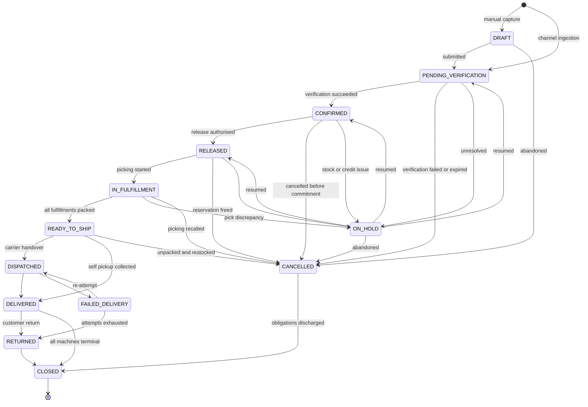

## 5.4 Allowed transitions

| From → To | Trigger event | Mode | Actor |
|---|---|---|---|
| `DRAFT` → `PENDING_VERIFICATION` | EVT-003 `Order.Submitted` | Manual | Sales |
| — → `PENDING_VERIFICATION` | EVT-002 `Order.Imported` | Automatic / Scheduled | Channel adapter |
| `PENDING_VERIFICATION` → `CONFIRMED` | EVT-004 `Order.Confirmed` | Automatic | System, on `SM-2` success |
| `PENDING_VERIFICATION` → `CANCELLED` | EVT-021/22/23 | Manual / Automatic | Call Centre / System |
| `CONFIRMED` → `RELEASED` | EVT-005 `Order.Released` | **Manual** — resolved 2026-08-09 (`SMA-081`) | Sales / Admin. **`BR-081`: *release is a manual decision made by a permissioned user … not automatic and not rule-derived*** (`BD-040`) |
| `RELEASED` → `IN_FULFILLMENT` | EVT-025 `Fulfillment.PickingStarted` | Manual | Warehouse |
| `IN_FULFILLMENT` → `READY_TO_SHIP` | EVT-030 `Fulfillment.ReadyToShip` | Automatic | System, when **all** fulfillments packed |
| `READY_TO_SHIP` → `COURIER_BOOKED` | **`UNDECIDED` — no event ratified** | Manual | Warehouse. ✅ **The booking act itself** (`BR-076` — Steadfast is assigned automatically, there is no selection step). ⚠ **No event is INVENTED here** (`EVA-019`): whether the booking publishes one is a separate determination |
| `COURIER_BOOKED` → `DISPATCHED` | EVT-033 `Shipment.Dispatched` | Manual | Warehouse. ⚠ **The handover, which `BR-082` places AFTER booking** — *"Booking precedes dispatch, so the business's rule is stricter"* |
| `READY_TO_SHIP` → `DISPATCHED` | EVT-033 `Shipment.Dispatched` | Manual | Warehouse. ⚠ **RETAINED for the paths that book no consignment** — own-staff delivery, and any handover not made through the courier (`DLV-022` — a `SELF_PICKUP` order has no shipment at all) |
| `READY_TO_SHIP` → `DELIVERED` | EVT-013 | Manual | Branch — **self pickup only** |
| `DISPATCHED` → `DELIVERED` | EVT-035 `Shipment.Delivered` | Automatic | Courier report |
| ~~`DISPATCHED` → `PARTIALLY_DELIVERED`~~ | — | ❌ **REMOVED — `BD-442`** | The transition and its target state are both withdrawn |
| `DISPATCHED` → `FAILED_DELIVERY` | EVT-036 `Shipment.DeliveryFailed` | Automatic | Courier report |
| `FAILED_DELIVERY` → `DISPATCHED` | EVT-034 | Manual | Call Centre schedules re-attempt |
| `FAILED_DELIVERY` → `RETURNED` | EVT-063 `Return.RTOCreated` | **`UNDECIDED`** (`GAP-019`) | System / Call Centre |
| `DELIVERED` → `RETURNED` | EVT-066 | Automatic | On return receipt |
| any pre-dispatch → `CANCELLED` | EVT-007 / EVT-008 | Manual / External | Various |
| any → `ON_HOLD` | EVT-010 | Manual | Authorised actor |
| any → `CLOSED` | EVT-014 `Order.Closed` | **Automatic** — resolved 2026-08-09 (`SMA-081`) | System. **`BR-010`: `CLOSED` *is reached only when every sub-machine is terminal*** — a derived condition, and the actor was already **System** |

## 5.5 Invalid transitions

| Prohibited | Why | Rule |
|---|---|---|
| `PENDING_VERIFICATION` → `RELEASED` | **Verification must complete before release** | `BR-017` |
| `CONFIRMED` → `IN_FULFILLMENT` | No warehouse queue entry before release | `BR-019` |
| `DISPATCHED` → `CANCELLED` | After dispatch the instrument is a **return**, not cancellation — goods are in the carrier network | `BR-011` |
| `DELIVERED` → `CANCELLED` | Only return or exchange is available | `BR-011`, `OM §6.4` |
| `DELIVERED` → `CLOSED` while any machine is non-terminal | **Delivery does not close an order** | `BR-010` |
| `CLOSED` → any | Terminal; revisiting creates a new linked subject | `SMA-009` |
| `CANCELLED` → `CONFIRMED` | A restored order **re-enters verification**, never resumes | `BR-012` |
| `RELEASED` → `DISPATCHED` | Goods must be picked and packed; serials captured | `BR-022` |
| `READY_TO_SHIP` → `DISPATCHED` with serials uncaptured | Serialized orders cannot ship without complete capture | `BR-022` |

## 5.6 Entry and exit actions

| State | On entry | On exit |
|---|---|---|
| `PENDING_VERIFICATION` | Create Verification (`SM-2`); enter queue with priority | Record outcome |
| `CONFIRMED` | Notify customer; push to channel | — |
| `RELEASED` | **Reserve inventory** (`SM-7`); create Fulfillment (`SM-3`); assign warehouse | On cancel: **release reservations** |
| `READY_TO_SHIP` | Create Shipment (`SM-4`) where the method requires one | — |
| `DISPATCHED` | **Deduct stock** (`BR-054`); **create Receivable** (`SM-5`); snapshot COGS; notify customer with tracking | — |
| `DELIVERED` | Receivable becomes due; bind serials to customer; **start warranty**; open return window | — |
| `FAILED_DELIVERY` | Raise exception; queue to Call Centre | Record resolution cause |
| `ON_HOLD` | Record reason and placer | Record release reason |
| `CANCELLED` | Release reservations; recall pick/pack; restock packed goods; void booking; push to channel | — |
| `CLOSED` | Finalise realised margin; release to period close | — |

## 5.7 Flows

**Normal** `PENDING_VERIFICATION → CONFIRMED → RELEASED → IN_FULFILLMENT → READY_TO_SHIP → DISPATCHED → DELIVERED → CLOSED`

Daraz orders follow this path with `READY_TO_SHIP` before carrier handover, as the marketplace requires.

**Cancellation** Any pre-dispatch state → `CANCELLED` → `CLOSED`. Reservations release, packed goods restock, bookings void. After dispatch, cancellation is unavailable (`BR-011`).

**Failure** `DISPATCHED → FAILED_DELIVERY`. **Not terminal.** Either re-attempt or return.

**Recovery**
- `FAILED_DELIVERY → DISPATCHED` — re-attempt after Call Centre contact.
- `ON_HOLD → CONFIRMED/RELEASED` — impediment resolved.
- **`CANCELLED → PENDING_VERIFICATION` — marketplace restoration.** `BR-012` requires re-entry to verification and a **fresh stock check**: the reservation was released and the goods may since have been sold. If stock is now unavailable, an exception is raised for commercial decision rather than auto-confirming.

## 5.8 Permissions & audit

| Transition | Authority |
|---|---|
| Create, submit | Sales, Call Centre |
| Release | Sales / Admin — bounded (`PRM-008`) |
| Cancel pre-dispatch | Call Centre, Sales, with reason (`BR-016`) |
| Amend after release | Sales Supervisor (`OM §7.9`) |
| Place or release hold | Authorised actor |
| Force a transition outside the machine | **Administrator override, audited** (`AUD §12.2`) |

**Audit** — every transition with from-state, to-state, actor, timestamp, reason (`BR-058`, `SMA-010`). Cancellation after dispatch and forced transitions are separately auditable. Bulk transitions produce **one record per order** (`AUD-028`, `EVA-011`).

---

# 6. `SM-2` — Verification

## 6.1 Definition

| | |
|---|---|
| **Purpose** | Determine whether an order is real, correct, and fulfillable **before** anything is spent on it |
| **Subject** | E-033 Verification |
| **Owner** | Order Management (Call Centre) |
| **Authority** | Internal |
| **Initial** | `PENDING`, or `NOT_REQUIRED` where policy exempts |
| **Terminal** | `CONFIRMED`, `CONFIRMED_WITH_CHANGES`, `AUTO_CONFIRMED`, `CANCELLED_BY_CUSTOMER`, `REJECTED`, `EXPIRED` |

> **The commercial centre of gravity.** With 173 of 193 observed orders cancelled, this machine — not fulfillment — is where the money is saved. An order failing here costs a phone call; the same order failing after dispatch costs picking, packing, two-way courier charges, handling risk on high-value electronics, and lost availability of reserved stock.

## 6.2 States

`NOT_REQUIRED` · `PENDING` · `IN_PROGRESS` · `CALLBACK_SCHEDULED` · `UNREACHABLE` · `AWAITING_CUSTOMER` · `CONFIRMED` · `CONFIRMED_WITH_CHANGES` · `AUTO_CONFIRMED` · `CANCELLED_BY_CUSTOMER` · `REJECTED` · `EXPIRED`

Meanings are defined in `OM §7.4`. **Not restated** (`SYS-016`).

## 6.3 Diagram

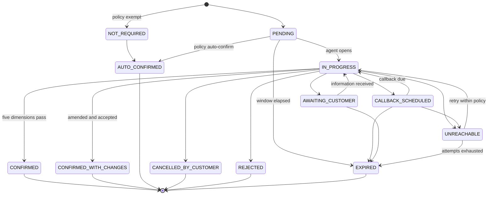

## 6.4 Allowed transitions

| From → To | Trigger | Mode | Actor |
|---|---|---|---|
| `PENDING` → `IN_PROGRESS` | EVT-016 | Manual | Agent — **order locked** |
| `PENDING` → `AUTO_CONFIRMED` | EVT-019 | Automatic | Policy |
| `IN_PROGRESS` → `CONFIRMED` | EVT-018 | Manual | Agent |
| `IN_PROGRESS` → `CONFIRMED_WITH_CHANGES` | EVT-018 | Manual | Agent within authority |
| `IN_PROGRESS` → `CALLBACK_SCHEDULED` | EVT-020 | Manual | Agent |
| `IN_PROGRESS` → `UNREACHABLE` | EVT-017 | Manual | Agent, after logged attempt |
| `IN_PROGRESS` → `REJECTED` | EVT-022 | Manual | Agent; supervisor above threshold |
| `UNREACHABLE` → `IN_PROGRESS` | EVT-017 | Manual / Scheduled | Retry per policy |
| any → `EXPIRED` | EVT-023 | Automatic | Window elapsed |

## 6.5 Invalid transitions

| Prohibited | Why | Rule |
|---|---|---|
| `PENDING` → `CONFIRMED` without `IN_PROGRESS` or policy exemption | Every order receives a **decision**, and a decision requires either work or a recorded policy | `BR-014` |
| Any terminal → any state | Terminal | `SMA-009` |
| `IN_PROGRESS` → `CONFIRMED` with any dimension unconfirmed | **All five dimensions must pass** | `OM §7.3` |
| Two agents in `IN_PROGRESS` on one order | The order is locked; a customer called twice is a service failure | `OM §7.6` |
| `CONFIRMED_WITH_CHANGES` on a marketplace order | Amendment generally not permitted; customer directed to the marketplace | `OM §3.4` |

## 6.6 Entry and exit actions

| State | On entry | On exit |
|---|---|---|
| `PENDING` | Compute queue priority from order value, channel policy, promised date, waiting time | — |
| `IN_PROGRESS` | **Lock order**; surface customer history, prior cancellations, blacklist flag | Release lock |
| `CALLBACK_SCHEDULED` | Set due time; remove from active queue | Return to queue when due; **overdue callback escalates** |
| `UNREACHABLE` | Increment attempt counter; schedule retry at a **different time of day** | — |
| `CONFIRMED*` | Emit `Order.Confirmed`; notify customer; push to channel | — |
| `CANCELLED_BY_CUSTOMER` / `REJECTED` / `EXPIRED` | **Record reason from controlled vocabulary**; cancel order | — |

## 6.7 Flows

**Normal** `PENDING → IN_PROGRESS → CONFIRMED`, or `PENDING → AUTO_CONFIRMED` for marketplace and walk-in.

**Cancellation** `IN_PROGRESS → CANCELLED_BY_CUSTOMER` with a controlled reason (`BR-016`) — price, delivery time, changed mind, ordered elsewhere, duplicate, mistake.

**Failure** `IN_PROGRESS → UNREACHABLE`. Attempts, intervals, and windows are per-channel configuration (`BR-015`); values are unrecorded (`GAP-063`).

**Recovery** `UNREACHABLE → IN_PROGRESS` on retry; `CALLBACK_SCHEDULED → IN_PROGRESS` when due; `AWAITING_CUSTOMER → IN_PROGRESS` on information received. Alternative contact routes are attempted where available — a secondary number, or the originating conversation for Facebook and WhatsApp orders.

## 6.8 Permissions & audit

Agents verify, amend within bounds, cancel with reason, schedule callbacks. Supervisors hold higher bounds and approve escalations. Agents **cannot** release, adjust stock, issue refunds, or see cost and margin (`PRM §6.1`).

**Audit** — every contact attempt **including failures**, because failed attempts are the evidence base for `UNREACHABLE`; per-dimension outcomes; amendments with before and after values; the terminal reason.

---

# 7. `SM-3` — Fulfillment

> ✅ **Registered in `OM §18.2`** (`BR-142`, 2026-08-09). Justification at §3.2; previously a proposed extension under `SMA-001`.

## 7.1 Definition

| | |
|---|---|
| **Purpose** | Convert a released commercial commitment into packed, shippable goods |
| **Subject** | E-035 Pick Task / fulfillment assignment — ⚠ **one per order** *(was “one per order per warehouse”; narrowed 2026-08-09 by `BD-442`, `SMA-082`)* |
| **Owner** | Warehouse |
| **Authority** | Internal |
| **Initial** | `PENDING` |
| **Terminal** | `HANDED_OVER`, `COLLECTED`, `CANCELLED` |

## 7.2 States

| State | Meaning | Exit owner |
|---|---|---|
| `PENDING` | Created at release; queued to the warehouse | Warehouse |
| `PICKING` | A picker is collecting goods | Warehouse |
| `PICKED` | All lines picked; discrepancies resolved | Warehouse |
| `SERIALS_CAPTURED` | Serial numbers recorded for serialized lines | Warehouse |
| `PACKING` | Being packed | Warehouse |
| `PACKED` | Sealed, labelled, weighed | Warehouse |
| `READY_TO_SHIP` | Awaiting handover — **RTS** | Warehouse / Delivery |
| `HANDED_OVER` | Given to the carrier | — |
| `COLLECTED` | Taken by the customer — **self pickup** | — |
| `ON_HOLD` | Pick discrepancy or stock shortfall | Warehouse Supervisor |
| `CANCELLED` | Recalled before handover | — |

## 7.3 Diagram

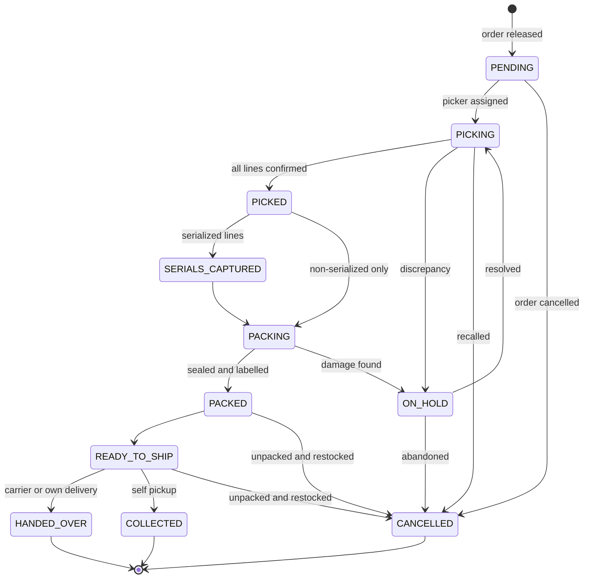

## 7.4 Allowed transitions

| From → To | Trigger | Mode | Actor |
|---|---|---|---|
| — → `PENDING` | EVT-024 | Automatic | On `Order.Released` |
| `PENDING` → `PICKING` | EVT-025 | Manual | Picker |
| `PICKING` → `PICKED` | EVT-026 | Manual | Picker |
| `PICKING` → `ON_HOLD` | EVT-027 | Manual | Picker records discrepancy |
| `PICKED` → `SERIALS_CAPTURED` | EVT-028 | Manual | Warehouse |
| `PACKING` → `PACKED` | EVT-029 | Manual | Packer |
| `PACKED` → `READY_TO_SHIP` | EVT-030 | Automatic | System |
| `READY_TO_SHIP` → `HANDED_OVER` | EVT-033 | Manual | Warehouse |
| `READY_TO_SHIP` → `COLLECTED` | EVT-013 | Manual | Branch staff |

> **Observation recorded 2026-08-09 at ratification — the table above is a subset of §7.3.** Six transitions appear in the diagram, the flows and the invalid-transition table but have no row here: `PICKED → PACKING` (non-serialized), `SERIALS_CAPTURED → PACKING`, `ON_HOLD → PICKING`, and the three cancellations from `PICKING`, `PACKED` and `READY_TO_SHIP`. **Each is independently stated by ratified module architecture** — `WHS-031` gives the two packing paths, `WHS-028` the `ON_HOLD` exit owner, `WHS-037` the cancellations. **No transition is missing from the machine; only from this table.** It is left unamended because filling it is documentation work, not a ratification act, and `DOC-009` keeps the record of what was registered.

## 7.5 Invalid transitions

| Prohibited | Why | Rule |
|---|---|---|
| `PENDING` before order release | No warehouse queue entry before release | `BR-019` |
| `PICKED` → `PACKED` with serials uncaptured on serialized lines | **Serials captured before packing completes** | `BR-021` |
| `PACKING` → `READY_TO_SHIP` bypassing `PACKED` | RTS requires sealed, weighed, labelled goods | `OM §8.6` |
| `READY_TO_SHIP` → `HANDED_OVER` with incomplete serial capture | **Cannot reach RTS at all without complete capture** | `BR-022` |
| Silent substitution on shortfall | A discrepancy **always** creates an inventory exception | `BR-020` |
| `HANDED_OVER` → any | Terminal; goods have left | `SMA-009` |

## 7.6 Entry and exit actions

| State | On entry | On exit |
|---|---|---|
| `PENDING` | Generate pick instruction sequenced for an efficient path | — |
| `PICKING` | Attribute to picker | Record confirmations and discrepancies |
| `SERIALS_CAPTURED` | Bind serials to order and shipment | — |
| `PACKING` | Select packaging — **televisions large and fragile; desktops anti-static and shock-protected**; a documented decision, not individual discretion | Record weight and dimensions, which determine courier charges and later charge reconciliation |
| `PACKED` | Attach invoice and warranty documentation; transfer handling instructions to the package | — |
| `READY_TO_SHIP` | Create Shipment (`SM-4`) where the method requires one | — |
| `CANCELLED` | Unpack, restock, void label | — |

## 7.7 Flows

**Normal** `PENDING → PICKING → PICKED → SERIALS_CAPTURED → PACKING → PACKED → READY_TO_SHIP → HANDED_OVER`

**Cancellation** Any pre-handover state → `CANCELLED`, with unpack and restock where already packed.

**Failure** `PICKING → ON_HOLD` on shortfall, item not at location, damage, or wrong item at location. Always raises an inventory exception (`BR-020`).

**Recovery** `ON_HOLD → PICKING` once stock is located, a replacement is picked, or Sales obtains a customer decision.

## 7.8 Permissions & audit

Warehouse operators pick, capture serials, pack, and hand over. They **cannot** change commercial terms, cancel orders, decide refunds, release orders, or see cost. Supervisors approve discrepancies and adjust stock within bounds — but never approve their own adjustments (`PRM-012`).

**Audit** — pick assignment and confirmations; **every discrepancy with attribution**; serial capture; packing attributes; handover.

## 7.9 Fulfillment method determines whether a Shipment exists

> **SMA-013 — The fulfillment method determines whether a `SM-4` Shipment instance is created at all.**

| Method | Shipment machine? | Terminal fulfillment state |
|---|---|---|
| `COURIER` | **Yes** — full lifecycle | `HANDED_OVER` |
| `OWN_DELIVERY` | Yes — simplified internal shipment | `HANDED_OVER` |
| `SELF_PICKUP` | **No** | `COLLECTED` |
| `MARKETPLACE_PICKUP` | Yes — ends at handover | `HANDED_OVER` |
| `COLLECTION_POINT` | Yes — **ends at the point** (`BR-026`) | `HANDED_OVER` |

Website and manual orders may use Courier, Own Delivery, or Self Pickup. Own Delivery is particularly relevant for large televisions, high-value orders, local deliveries, and orders requiring installation or demonstration at handover.

---

# 8. `SM-4` — Shipment

## 8.1 Definition

| | |
|---|---|
| **Purpose** | Track goods Trioloo no longer physically controls |
| **Subject** | E-037 Shipment — **one order may have many** (`BR-023`) |
| **Owner** | Delivery |
| **Authority** | **External** — the courier is system of record for tracking (`SYS §3.5`) |
| **Initial** | `CREATED` |
| **Terminal** | `DELIVERED`, `RETURNED_TO_WAREHOUSE`, `LOST`, `DAMAGED`, `CANCELLED` |

## 8.2 States

`CREATED` · `BOOKED` · `AWAITING_PICKUP` · `PICKED_UP` · `IN_TRANSIT` · `AT_HUB` · `OUT_FOR_DELIVERY` · `DELIVERY_ATTEMPTED` · `DELIVERED` · `RETURNING` · `RETURNED_TO_WAREHOUSE` · `LOST` · `DAMAGED` · `CANCELLED`

Meanings in `OM §9.4`. **Not restated.**

## 8.3 Diagram

The ratified diagram is `OM §9.5`. **Not duplicated** (`DOC-006`).

## 8.4 Allowed transitions

| From → To | Trigger | Mode | Actor |
|---|---|---|---|
| `CREATED` → `BOOKED` | EVT-032 | Automatic / Manual | Adapter or staff |
| `AWAITING_PICKUP` → `PICKED_UP` | EVT-033 | Manual | Warehouse handover |
| `PICKED_UP` → `IN_TRANSIT` → `AT_HUB` → `OUT_FOR_DELIVERY` | EVT-034 | **Push, Scheduled poll, or Manual** | Courier or staff |
| `OUT_FOR_DELIVERY` → `DELIVERED` | EVT-035 | Automatic | Courier report |
| `OUT_FOR_DELIVERY` → `DELIVERY_ATTEMPTED` | EVT-036 | Automatic | Courier report |
| `DELIVERY_ATTEMPTED` → `OUT_FOR_DELIVERY` | EVT-034 | Manual | Re-attempt scheduled |
| `DELIVERY_ATTEMPTED` → `RETURNING` | EVT-036 | Automatic | Attempts exhausted |
| `RETURNING` → `RETURNED_TO_WAREHOUSE` | EVT-066 | Manual | Warehouse receipt |
| any transit state → `LOST` / `DAMAGED` | EVT-037 / EVT-038 | Automatic / Manual | Courier report or threshold |

> **`BR-029` — the manual path is permanent.** Any courier without integration must remain fully usable. **`BR-030`** — every event records whether it arrived by push, poll, or manual entry, because manual entries carry different evidential weight in a dispute.

## 8.5 Invalid transitions

| Prohibited | Why | Rule |
|---|---|---|
| `CREATED` → `PICKED_UP` | A carrier must accept and issue a tracking reference first | `OM §9.4` |
| `DELIVERED` → any | Terminal; a post-delivery return is `SM-8`, not a shipment reversal | `SMA-009` |
| Out-of-sequence courier events applied silently | **Recorded as exceptions, not applied** — carrier feeds are not always ordered or correct | `OM §9.7` |
| Editing a tracking event | **Append-only**; a correction is a new superseding event, both retained | `BR-031` |
| `LOST` → `DELIVERED` | A found shipment is a new event superseding, with the loss retained | `BR-031`, `EVA-012` |

## 8.6 Entry and exit actions

| State | On entry | On exit |
|---|---|---|
| `BOOKED` | Obtain tracking and consignment references; communicate COD amount to collect | — |
| `PICKED_UP` | Emit `Order.Dispatched` → **deduct stock, create receivable, snapshot COGS** | — |
| `DELIVERY_ATTEMPTED` | Increment attempts; **raise exception**; queue to Call Centre | Record cause from controlled vocabulary |
| `DELIVERED` | Record proof of delivery; receivable → collected-by-intermediary for COD; bind serials to customer; start warranty | — |
| `RETURNING` | Create or link Return (`SM-8`) | — |
| `LOST` / `DAMAGED` | **Write off inventory with attribution**; void receivable; raise carrier claim | — |

## 8.7 Flows

**Normal** `CREATED → BOOKED → AWAITING_PICKUP → PICKED_UP → IN_TRANSIT → AT_HUB → OUT_FOR_DELIVERY → DELIVERED`

**Cancellation** `CREATED`/`BOOKED`/`AWAITING_PICKUP` → `CANCELLED`, voiding the booking. Once picked up, cancellation is unavailable.

**Failure** `OUT_FOR_DELIVERY → DELIVERY_ATTEMPTED`. Causes: customer unreachable, address wrong, customer unavailable, refused, **cannot pay the COD amount**, area inaccessible.

> **Failed delivery is not the end of the order.** `DELIVERY_ATTEMPTED` is explicitly recoverable, and the order moves to `Order:FAILED_DELIVERY` — a state with an owner (Call Centre) and two exits.

**Recovery** `DELIVERY_ATTEMPTED → OUT_FOR_DELIVERY` after the Call Centre establishes the cause: re-attempt at an agreed time, correct the address and re-attempt, or cancel. On exhaustion, `RETURNING`.

## 8.8 Permissions & audit

Warehouse hands over; couriers report; Call Centre schedules re-attempts and contacts customers; Delivery staff record manual updates. **Audit** — every tracking event with its source; delivery proof retained as an attachment; loss and damage write-offs separately auditable.

---

# 9. `SM-5` — Payment

## 9.1 Definition

| | |
|---|---|
| **Purpose** | Track what is owed for **one order** and whether it actually arrived |
| **Subject** | E-040 Receivable |
| **Owner** | Payment |
| **Authority** | Mixed — collection reported externally, reconciliation internal |
| **Initial** | `NOT_DUE` |
| **Terminal** | `RECONCILED`, `REFUNDED`, `WRITTEN_OFF` |

## 9.2 States

`NOT_DUE` · `DUE` · `COLLECTED_BY_INTERMEDIARY` · `PARTIALLY_RECEIVED` · `RECEIVED` · `RECONCILED` · `SHORT_SETTLED` · `OVER_SETTLED` · `REFUND_DUE` · `REFUNDED` · `WRITTEN_OFF`

Meanings in `OM §11.3`. Diagram at `OM §11.4`. **Not duplicated.**

## 9.3 Allowed transitions

| From → To | Trigger | Mode | Actor |
|---|---|---|---|
| `NOT_DUE` → `DUE` | EVT-013 | Automatic | On delivery |
| `DUE` → `COLLECTED_BY_INTERMEDIARY` | EVT-053 | Automatic | Courier or marketplace collects |
| `DUE` → `RECEIVED` | EVT-054 | Manual | Direct payment — counter, own delivery |
| `COLLECTED_BY_INTERMEDIARY` → `RECEIVED` | EVT-055 / EVT-056 | **Manual** — amended 2026-08-09 (`BD-438`, `SMA-079`) | **Accounts confirms the money actually arrived.** ⚠ *“Remittance arrives”* was ambiguous: **a courier statement saying money was remitted is not the same fact as receipt** (`PAY-070`, `PAY-072`) |
| `COLLECTED_BY_INTERMEDIARY` → `SHORT_SETTLED` | EVT-058 | Automatic | Shortfall detected |
| `RECEIVED` → `RECONCILED` | EVT-057 | **Manual** — resolved 2026-08-09 (`SMA-079`) | **Accounts.** Matching is **automatic where an API supplies the data, manual otherwise**; **marking reconciled is a human act** (`PAY-034`, `PAY-075`, `BD-061`, `BD-062`) |
| `SHORT_SETTLED` → `RECONCILED` | EVT-059 | Manual | Dispute resolved or deduction accepted |
| `RECONCILED` → `REFUND_DUE` | EVT-064 | Automatic | Return approved |
| `REFUND_DUE` → `REFUNDED` | EVT-060 | Manual | Accounts executes |
| any → `WRITTEN_OFF` | EVT-061 | Manual | Authorised write-off |

## 9.4 Invalid transitions

| Prohibited | Why | Rule |
|---|---|---|
| `NOT_DUE` → `RECEIVED` before delivery | **Obligation follows delivered goods, never ordered goods** | `BR-033` |
| `COLLECTED_BY_INTERMEDIARY` → `RECONCILED` directly | Money collected by a courier is **not** money received by Trioloo | `BR-035` |
| `DUE` → `REFUNDED` | **A refund is initiated only after the money has been received** | `BR-041` |
| Refund exceeding amount received | Hard ceiling | `BR-040` |
| Overwriting expected with actual | **Both retained** — the variance is the instrument for detecting deduction errors | `BR-038` |
| Marking paid at delivery | On every Trioloo channel this would be a false statement | `BR-035` |

## 9.5 Entry and exit actions

| State | On entry | On exit |
|---|---|---|
| `DUE` | Record expected amount alongside eventual actual | — |
| `COLLECTED_BY_INTERMEDIARY` | Add to **cash-in-transit exposure per courier**; begin ageing | — |
| `RECEIVED` | Match against expectation | — |
| `SHORT_SETTLED` | Raise dispute; notify Accounts | Record resolution |
| `RECONCILED` | Compute **realised margin** from actual received | — |
| `WRITTEN_OFF` | Recognise loss; require authority and reason | — |

## 9.6 Flows

**Normal (COD)** `NOT_DUE → DUE → COLLECTED_BY_INTERMEDIARY → RECEIVED → RECONCILED`
**Normal (counter / own delivery)** `NOT_DUE → DUE → RECEIVED → RECONCILED`

**Cancellation** Order cancelled before delivery → receivable never becomes due; machine terminates without a transaction.

**Failure** `COLLECTED_BY_INTERMEDIARY → SHORT_SETTLED` on shortfall. `BR-036` — **money held by a carrier beyond agreed terms is an exception requiring action, not a passive balance.** This is Trioloo's largest routine exposure.

**Recovery** `SHORT_SETTLED → RECONCILED` when a dispute is resolved in Trioloo's favour or the deduction is accepted as valid — the acceptance is itself an auditable financial decision.

## 9.7 Permissions & audit

Accounts record receipts, reconcile, raise disputes, and refund or write off within bounds. **Segregation** — recording settlement and writing off a shortfall may not be held by one actor (`PRM-012`), guarding against concealed misappropriation. **Audit** — manual payment entry, settlement variance acceptance, refunds, and write-offs are all explicitly auditable (`AUD §12.2`).

---

# 10. `SM-6` — Marketplace Settlement

> ✅ **Registered in `OM §18.2`** (`BR-142`, 2026-08-09); previously a proposed extension under `SMA-001`. A settlement is a **batch covering many orders**; it cannot be a state of any one receivable.

## 10.1 Definition

| | |
|---|---|
| **Purpose** | Track a marketplace's periodic net transfer and reconcile it order by order |
| **Subject** | E-043 Marketplace Settlement — **one per channel instance per period** |
| **Owner** | Payment |
| **Authority** | **External** — the marketplace is system of record for settlement amounts |
| **Initial** | `EXPECTED` |
| **Terminal** | `RECONCILED`, `CLOSED_WITH_VARIANCE` |

## 10.2 States

| State | Meaning | Exit owner |
|---|---|---|
| `EXPECTED` | Period open; receivables accruing against a forecast net | System |
| `REPORT_RECEIVED` | Settlement report received from the marketplace | Accounts |
| `UNDER_RECONCILIATION` | Matching line by line against expectation | Accounts |
| `VARIANCE_DETECTED` | One or more lines differ from expectation | Accounts |
| `DISPUTED` | Variance raised with the marketplace | Accounts Manager |
| `PARTIALLY_RECONCILED` | Some lines settled, others open | Accounts |
| `RECONCILED` | Every line matched and agreed | — |
| `CLOSED_WITH_VARIANCE` | Variance accepted or written off; period closed | — |

## 10.3 Diagram

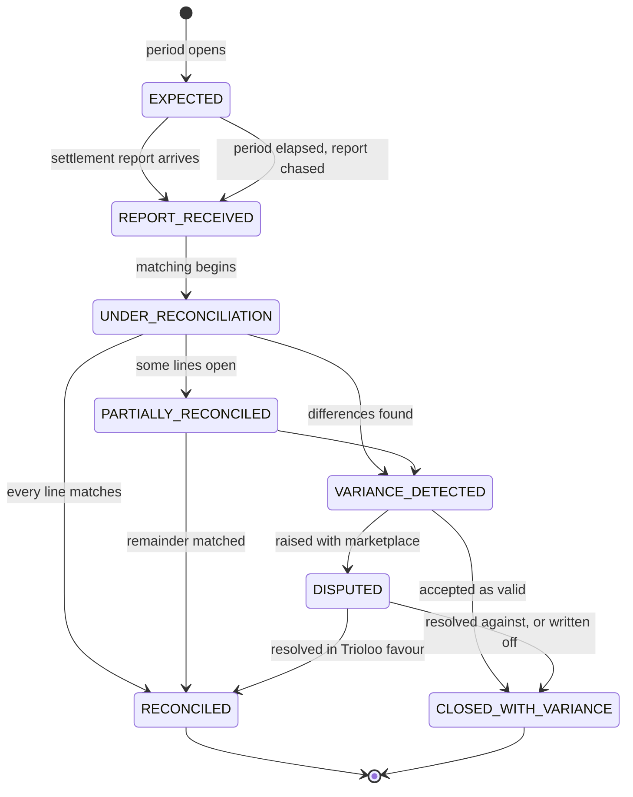

## 10.4 Allowed transitions

| From → To | Trigger | Mode | Actor |
|---|---|---|---|
| — → `EXPECTED` | EVT-052 | Automatic | Receivables accrue |
| `EXPECTED` → `REPORT_RECEIVED` | EVT-056 | **Scheduled** | Channel adapter |
| `REPORT_RECEIVED` → `UNDER_RECONCILIATION` | EVT-057 | Automatic / Manual | Accounts |
| `UNDER_RECONCILIATION` → `RECONCILED` | EVT-057 | **Manual** — resolved 2026-08-09 (`SMA-079`) | **Accounts.** Same evidence as `SM-5`: `PAY-034` covers marketplace and courier alike, and `BD-061`/`BD-062` describe reconciliation completing *“before it is **marked as** completed”* |
| `UNDER_RECONCILIATION` → `VARIANCE_DETECTED` | EVT-058 | Automatic | Matching |
| `VARIANCE_DETECTED` → `DISPUTED` | EVT-059 | Manual | Accounts |
| `DISPUTED` → `CLOSED_WITH_VARIANCE` | EVT-059 | Manual | Accounts Manager — **audited** |

## 10.5 Invalid transitions

| Prohibited | Why | Rule |
|---|---|---|
| `EXPECTED` → `RECONCILED` | A settlement cannot be reconciled before its report arrives | `OM §11.6` |
| Discarding the expectation on receipt | **Expected and actual both retained** — overwriting destroys the ability to detect the very errors reconciliation exists to find | `BR-038` |
| Silent acceptance of an unexpected deduction category | Investigated and disputed if unjustified | `OM §11.6` |
| Applying a renegotiated commission rate retroactively | Rates are versioned; transactions use the version in force on their own date | `DB-022` |
| Blocking order closure on settlement lag | Settlement is **independent** of shipment and order state | `BR-037` |

## 10.6 Entry and exit actions

| State | On entry | On exit |
|---|---|---|
| `EXPECTED` | Compute expected receivable per order from the channel's commercial terms **in force at order date** | — |
| `REPORT_RECEIVED` | **Retain the report exactly as received** — the defensible position in a dispute | — |
| `UNDER_RECONCILIATION` | Match per order: gross, each deduction by category, net, against expectation | — |
| `VARIANCE_DETECTED` | Classify: deduction higher than agreed · unexpected category · order missing from settlement · penalty applied | — |
| `RECONCILED` | Release realised margin for the period | — |

**Deduction categories** (`OM §11.6`) — commission · voucher and promotion · shipping charge · payment fee · penalty · return cost · prior-period adjustment.

## 10.7 Flows

**Normal** `EXPECTED → REPORT_RECEIVED → UNDER_RECONCILIATION → RECONCILED`
**Cancellation** Not applicable — a settlement period cannot be cancelled; an empty period reconciles to zero.
**Failure** `VARIANCE_DETECTED → DISPUTED`, or a covered order missing from the report entirely — flagged and aged.
**Recovery** `DISPUTED → RECONCILED` on resolution in Trioloo's favour; otherwise `CLOSED_WITH_VARIANCE`, which **records the loss rather than absorbing it silently**.

## 10.8 Permissions & audit

Accounts reconcile and raise disputes; Accounts Manager accepts variances within bounds and above them escalates. **Accepting a settlement variance is an auditable financial action** (`AUD §12.2`) — it is acceptance of a deduction, which is money forgone.

> The observed economics make this machine concrete: `Sale ৳48 · Charges ৳30 · Received ৳18`. The customer paid 48; Trioloo received 18. **Only the third figure is revenue**, and only this machine establishes it.

---

# 6A. `SM-3` after `BD-442` — the machine survives, its illustration does not

> **SMA-082 — `SM-3` Fulfillment remains justified. `SMA-002`'s split-shipment illustration is withdrawn; the rule it illustrates is untouched** (`BD-442`, `DOC-009`).

**`BD-442` withdrew split fulfilment, which was the example `§2.2` used to explain why fulfilment needs its own machine.** **It was never the reason.**

| Test | `SM-3` |
|---|---|
| **`SMA-002` — does it describe one subject?** | **Yes — `E-035` Pick Task**, not the Order |
| **Does the Order already express these positions?** | **No.** `SM-1` runs `RELEASED → IN_FULFILLMENT → DISPATCHED`. **`SM-3` runs eleven states**: `PENDING`, `PICKING`, `PICKED`, `SERIALS_CAPTURED`, `PACKING`, `PACKED`, `READY_TO_SHIP`, `HANDED_OVER`, `COLLECTED`, `ON_HOLD`, `CANCELLED`. **Picking, serial capture and packing have no Order-level representation at all** |
| **Different owner?** | **Yes — Warehouse**, with a **Warehouse Supervisor** `ON_HOLD` distinct from `SM-1`'s |
| **Different terminals?** | **Yes** — `HANDED_OVER` **or** `COLLECTED` (self-pickup, `DLV-`), a distinction the Order does not draw |
| **Other dependants?** | **The build branch lives in `SM-3`** (`BR-096`) |

> ✅ **The machine is preserved for the reason it always deserved to exist, and only the stale rationale is corrected.** **Nothing was deleted**: no state, transition, event or rule of `SM-3` changes.

> ⚠ **One subject line is narrowed as a direct consequence.** `SM-3`'s subject read *“one per order **per warehouse**”*. **With split fulfilment withdrawn, it is one per order** (`BD-442`). **`E-035` is otherwise unchanged.**

---

# 9A. `GAP-019` transition modes — three stale markers resolved, one genuinely open

> **SMA-081 — Three `UNDECIDED` transition markers were stale and are resolved from rules already ratified. No new decision was taken** (`BR-081`, `BR-010`, `DOC-021`).

| Transition | Mode | The rule that already settled it |
|---|---|---|
| **`SM-1` `CONFIRMED` → `RELEASED`** | **Manual** | **`BR-081` — *release is a manual decision made by a permissioned user … **not automatic and not rule-derived***** (`BD-040`). **The rule states outright that it *“closes part of `GAP-019`”*** — and the marker was never removed |
| **`SM-1` any → `CLOSED`** | **Automatic** | **`BR-010` — `CLOSED` *“is reached only when every sub-machine is terminal”***, a **derived** condition; and the actor column already read **System**, so no human act was ever contemplated |
| **`SM-10` — → `AWAITING_RECEIPT`** | **Automatic** | **The actor column already read *“RTO auto-created”***. The marker contradicted its own row |

> ⚠ **One marker is genuinely open and is NOT resolved here: `SM-1` `FAILED_DELIVERY` → `RETURNED`** (`EVT-063`), whose actor reads **System / Call Centre**. **`DLV-044` states that where the customer cancels or the issue cannot be resolved, *“no further intervention is made and the parcel follows the courier's normal RTO process”*** — which points to the ERP mirroring a courier status rather than a person acting.
>
> **It is not resolved because the rule describes Trioloo not intervening, not which internal actor stamps the record** — and **inferring one would be choosing an answer in code, which `SMA-016` forbids.** **Classified non-blocking:** the transition happens either way, **no posting, obligation or customer-facing outcome depends on which actor stamps it** (`BR-117` — goods never delivered create no revenue and no receivable), and **`GAP-019` continues to carry it.**

---

# 9B. `SM-21` — Advance Requisition Authority

**Source:** `BD-448` – `BD-457`. **Post-Freeze amendment under `DOC-067`. The twenty-first machine.**

## 9B.1 Why a machine, and why only over authority

> **SMA-083 — `SM-21` governs the *authority* to draw money, and nothing else. Settlement progress and completion are derived positions and are not states** (`BD-454`, `DB-001`, `ACC-069`, `ACC-070`).

**Tested against the three proven negatives before being created.** `SMA-031` (`E-027` — condition derives), `SMA-034` (goods receipt — a decision per line, no states), `SMA-080` (`E-042` — **closure decides nothing**).

| Test | Advance Requisition |
|---|---|
| Are there decisions? | **Yes** — reject · authorise, possibly for less · cancel before disbursement · close undrawn authority |
| Are there transitions that must be **prohibited**? | **Yes** — a rejected or cancelled requisition may never be disbursed; cancellation is valid **only** before any disbursement; an authorised amount may never rise (`SMA-006`) |
| One subject? | **Yes** — `E-086` |

✅ **`E-042` needed no machine because its closure decides nothing. Here closure of undrawn authority *is* an authorised decision** (`BD-454`) — **which is exactly the difference `SMA-080` turns on.**

⚠ **No state mirrors a balance.** **There is no `PARTIALLY_SETTLED`, no `OUTSTANDING`, no `COMPLETED`** — `BD-449` and `BD-454` make those derived, and **`DB-001` already forbids storing them.**

## 9B.2 Definition

| | |
|---|---|
| **Purpose** | Track whether money may still be drawn against an authorisation |
| **Subject** | `E-086` Advance Requisition |
| **Owner** | **Accounting** (`ACC-060`) |
| **Authority** | Internal — permission-controlled (`PRM-071`) |
| **Initial** | `REQUESTED` |
| **Terminal** | `REJECTED`, `CANCELLED`, `AUTHORITY_CLOSED` |

## 9B.3 States

| State | Meaning | Exit owner |
|---|---|---|
| `REQUESTED` | Raised, awaiting decision | Authorised user |
| `REJECTED` | Refused. **No disbursement, no balance** (`BD-451`) | — |
| `AUTHORISED` | Approved, **possibly for less than requested**; money may be drawn up to the ceiling | Authorised user |
| `CANCELLED` | Will not be paid, **and nothing was ever disbursed** (`BD-451`) | — |
| `AUTHORITY_CLOSED` | **Nothing further may be drawn** — either fully drawn, or the undrawn remainder explicitly closed (`BD-454`) | — |

## 9B.4 Allowed transitions

| From → To | Mode | Actor |
|---|---|---|
| `REQUESTED` → `REJECTED` | **Manual** | Authorised user; **reason recorded** (`BD-451`) |
| `REQUESTED` → `AUTHORISED` | **Manual** | Authorised user. **`Requested By` may equal `Authorised By`** (`BD-452`, `PRM-071`) |
| `AUTHORISED` → `CANCELLED` | **Manual** | **Only while nothing has been disbursed** |
| `AUTHORISED` → `AUTHORITY_CLOSED` | **Automatic** | When total disbursed **reaches** the authorised amount |
| `AUTHORISED` → `AUTHORITY_CLOSED` | **Manual** | **Explicit closure of the undrawn remainder** — actor and timestamp recorded (`BD-454`) |

## 9B.5 Invalid transitions

| Prohibited | Why | Rule |
|---|---|---|
| Disbursement against `REQUESTED`, `REJECTED`, `CANCELLED` or `AUTHORITY_CLOSED` | **Money moves only under live authority** | `ACC-072` |
| `AUTHORISED` → `CANCELLED` **after any disbursement** | Cancellation is a pre-disbursement act; afterwards the undrawn remainder is **closed**, not cancelled | `BD-451`, `BD-454` |
| **Raising the Authorised Amount** | An excess requires a **new requisition** | `ACC-073`, `BD-457` |
| Any state meaning *settled* or *complete* | **Completion is derived, never entered** | `SMA-083`, `ACC-070` |
| Automatic closure by age, expiry or employment ending | **No expiry exists and none may be built** | `BD-454`, `BD-456` |

## 9B.6 Entry and exit actions

| State | On entry |
|---|---|
| `REJECTED` | **Record reason, actor, time.** Nothing financial occurs (`ACC-003`) |
| `AUTHORISED` | **Record authorised amount, actor, time.** ⚠ **No balance, no cash movement, no expense** (`BD-451`, `INV-41.3`) |
| `CANCELLED` | Record actor and time. **No balance ever existed** |
| `AUTHORITY_CLOSED` | **Record actor and time where closed explicitly.** ⚠ **Not a financial transaction** — no expense, payment or receipt, and nothing already recorded is altered (`BD-454`) |

> **SMA-084 — A completed requisition is one whose authority is closed and whose Employee Outstanding is zero. It is a computed condition over `SM-21` plus two derived positions, and the machine has no terminal state for it** (`ACC-070`, `BD-454`).
>
> ⚠ **This is a shape the architecture has not used before: a machine whose business completion is computed rather than entered.** **Recorded deliberately** — the alternative would be a state that mirrors a balance, which `DB-001` forbids.

# 10A. Courier Remittance — why it needs no machine

> **SMA-079 — `SM-5`'s `RECEIVED → RECONCILED` and `SM-6`'s `UNDER_RECONCILIATION → RECONCILED` are `Manual`. The `UNDECIDED` markers are resolved, not by new discovery but by discovery already ratified** (`PAY-034`, `BD-060`, `BD-061`, `BD-062`).

**Two facts were always separate and the marker conflated them.** **Matching** is automatic where an API supplies the data and manual where it does not (`PAY-034`, `PAY-075`); **marking reconciled is a human act** — `BD-061` says the settlement is reconciled *“before it is **marked as** completed”* and `BD-062` *“before the settlement is **marked as** reconciled”*, both after investigation and, where needed, contacting the courier (`PAY-037`).

> ⚠ **`GAP-019`'s four other `UNDECIDED` markers are untouched** — `CONFIRMED → RELEASED`, `FAILED_DELIVERY → RETURNED`, `any → CLOSED`, `— → AWAITING_RECEIPT`. **They are outside A3 and no evidence gathered here bears on them.**

> **SMA-080 — `E-042` Remittance Batch requires no state machine. Its condition is derived from its consignment lines** (`BD-439`, `BD-440`, `DB-001`, `PAY-080`).

| Condition | Derived from |
|---|---|
| **Open with exceptions / partially reconciled** | **Any line unresolved** |
| **Reconciled** | **Every line matched**, no remaining difference |
| **Closed with recorded variance** | **Every line resolved**, and an **authorised acceptance or write-off** is recorded against the differing lines |

> ## Why this is a proven negative and not a convenience
>
> **The business supplied the discriminator itself:** *“batch closure records their completed reconciliation result”*, and it **may never write off money, approve a deduction, change an expected amount, or manufacture an accounting treatment** (`BD-440`, `PAY-081`).
>
> **A state machine exists to govern decisions and constrain legal transitions between them. A batch whose closure decides nothing has no decisions to sequence.** Every underlying act already lives elsewhere under its own authority — **deduction acceptance** (`PAY-078`, permissioned Accounts), **write-off** (`PAY-079`, `BD-110`, owner/administrator), **recovery** (`SM-5`'s `SHORT_SETTLED → RECONCILED`).

> ## ⚠ Why `SM-6` is a machine and this is not — the difference is real
>
> **`SM-6`'s closure *is* a decision.** `CLOSED_WITH_VARIANCE` is an act performed **at the batch**, with an actor named in `§10.8`. **`BD-440` inverts that for the courier path**: every decision happens **on the consignment first**, and the batch merely reflects that they are all complete.
>
> **`BD-439` forbade copying `SM-6`'s states, and this is why the prohibition was right** — the two batches look alike and behave differently. **`SMA-031` is the closer precedent**: `E-027` needs no machine because its condition follows from its order.

> ## ✅ `BR-036`'s ageing never needed this machine
>
> **`GAP-027` and `SMU-10` implied that COD cash-in-transit had *“no states to age against”*. It always did.** **`SM-5`'s `COLLECTED_BY_INTERMEDIARY` entry action is *“add to cash-in-transit exposure per courier; begin ageing”*** — ageing hangs off the **receivable**, not the batch, and a batch that does not yet exist cannot age anything. **The argument for the machine rested on a misreading.**
>
> ⚠ **The ageing *threshold* remains undefined** — `GAP-024`, unchanged and outside A3.

# 11. `SM-7` — Inventory

## 11.1 Definition

| | |
|---|---|
| **Purpose** | Track the commitment stage and physical position of stock, at unit granularity where serialized |
| **Subject** | E-021 Serial Number / E-026 Stock |
| **Owner** | Inventory |
| **Authority** | Internal — **Trioloo is always authoritative** (`SYS-011`) |
| **Initial** | `AVAILABLE` (on goods receipt) |
| **Terminal** | `CONSUMED`, `SCRAPPED`, `WRITTEN_OFF` |

## 11.2 States

`AVAILABLE` · `RESERVED` · `PICKED` · `PACKED` · `IN_TRANSIT` · `CONSUMED` · `RETURNING` · `QUARANTINE` · `REGRADED` · `SCRAPPED` · `WRITTEN_OFF`

Diagram at `OM §18.5`. **Not duplicated.**

## 11.3 Allowed transitions

| From → To | Trigger | Mode | Actor |
|---|---|---|---|
| `AVAILABLE` → `RESERVED` | EVT-039 | Automatic | **On order confirmation** (`BR-096`, `IVN-014` — amended from *order release*) |
| `RESERVED` → `AVAILABLE` | EVT-040 | **Automatic** | **Cancellation only** — ⚠ **not `ON_HOLD`, and no expiry exists** (`BD-436`, `BD-279`) |
| `RESERVED` → `AVAILABLE` | EVT-040 | **Manual** | **Explicit authorised release** of a specified quantity (`IVN-048`, `BD-437`) |
| `RESERVED` → `PICKED` → `PACKED` | EVT-026, EVT-029 | Manual | Warehouse |
| `PACKED` → `IN_TRANSIT` | EVT-041 | Automatic | **Stock deducted at dispatch** |
| `IN_TRANSIT` → `CONSUMED` | EVT-013 | Automatic | On delivery |
| `IN_TRANSIT` → `WRITTEN_OFF` | EVT-037/38 | Automatic | Lost or damaged in transit |
| `CONSUMED` → `RETURNING` | EVT-062 | Manual | Customer return |
| `RETURNING` → `QUARANTINE` | EVT-042 | Manual | Warehouse receipt |
| `QUARANTINE` → `AVAILABLE` | EVT-043 | Manual | QC passed |
| `QUARANTINE` → `REGRADED` | EVT-044 | Manual | QC passed with condition |
| `QUARANTINE` → `SCRAPPED` | EVT-045 | Manual | QC failed |

## 11.4 Invalid transitions

| Prohibited | Why | Rule |
|---|---|---|
| `RESERVED` reducing stock quantity | **Reservation reduces availability without reducing stock** — confusing these produces overselling or phantom shortages | `BR-052` |
| Deduction before dispatch | Stock is deducted **at dispatch**, when goods physically leave | `BR-054` |
| Deduction at delivery | Too late — dispatched goods would appear on hand | `BR-054` |
| `RETURNING` → `AVAILABLE` directly | **Returned goods enter quarantine and never go straight to sellable stock** | `BR-046` |
| Reservation against a non-catalogued line | Only catalogued lines reserve | `BR-006` |
| Adjusting a balance in place | Position is **derived from movements**; corrections are compensating movements | `DB-001`, `DB-002` |
| Loss without attribution | Loss without attribution cannot be recovered, claimed, or prevented | `BR-055` |

## 11.5 Entry and exit actions

| State | On entry | On exit |
|---|---|---|
| `RESERVED` | Reduce availability. ⚠ **No reservation expiry is set** — `E-027` has **no lifecycle of its own** (`SMA-031`, `DM-041`, `BD-279`); *“set reservation expiry”* was removed 2026-08-09 | Restore availability on release |
| `PACKED` | Bind serials to shipment | — |
| `IN_TRANSIT` | **Deduct stock; snapshot cost of goods** so margin cannot drift | — |
| `CONSUMED` | Bind serials to customer; **start warranty** | — |
| `QUARANTINE` | **Mark non-sellable**; create QC inspection (`SM-11`) | — |
| `WRITTEN_OFF` | Recognise loss **with attribution**; raise carrier claim where applicable | — |

## 11.6 Flows

**Normal** `AVAILABLE → RESERVED → PICKED → PACKED → IN_TRANSIT → CONSUMED`
**Cancellation** `RESERVED/PICKED/PACKED → AVAILABLE` with unpack and restock.
**Failure** `IN_TRANSIT → WRITTEN_OFF` on loss or damage; pick shortfall raises an inventory exception.
**Recovery** `RETURNING → QUARANTINE → AVAILABLE` or `REGRADED`, gated by QC.

> **`BR-053` — reservation occurs at release, not at capture, deliberately.** With 173 of 193 observed orders cancelled, reserving at capture would commit most stock to orders that never complete, starving orders that would.

## 11.7 Permissions & audit

Warehouse moves stock physically; Inventory records movements. **Manual stock adjustment requires bounded authority and is explicitly auditable**; receiving goods and adjusting stock are segregated (`PRM-012`), preventing concealed theft. Cost visibility is a separately grantable sensitive class (`PRM-011`).

---

# 12. `SM-8` — Return

## 12.1 Definition

| | |
|---|---|
| **Purpose** | Recover goods and value, determine fault, and discharge customer obligations |
| **Subject** | E-047 Return |
| **Owner** | Return & Exchange |
| **Authority** | Internal |
| **Initial** | `REQUESTED` (customer return) · `AWAITING_RECEIPT` (RTO, auto-created) |
| **Terminal** | `CLOSED` |

> **`BR-044` — RTO and customer returns are distinguished throughout.** They share receipt and QC but differ entirely in payment, margin, and analysis: an RTO never generated a receivable; a customer return did. Merging them corrupts both the return-rate metric and the refund liability.

## 12.2 States

`REQUESTED` · `APPROVED` · `REJECTED` · `AWAITING_RECEIPT` · `IN_TRANSIT` · `RECEIVED` · `UNDER_QC` · `QC_PASSED` · `QC_FAILED` · `RESTOCKED` · `QUARANTINED` · `SCRAPPED` · `LOST_IN_RETURN` · `REFUND_PENDING` · `REFUNDED` · `CLOSED`

Diagram at `OM §12.4`. **Not duplicated.**

> `GAP-028` records that `LOST_IN_RETURN` appears in the diagram but **not in the state table at `OM §12.3`** — a state with no defined meaning, owner, or exit. Listed here for completeness; **its definition remains an open gap.**

## 12.3 Allowed transitions

| From → To | Trigger | Mode | Actor |
|---|---|---|---|
| — → `REQUESTED` | EVT-062 | Manual | Customer request |
| — → `AWAITING_RECEIPT` | EVT-063 | **Automatic** — resolved 2026-08-09 (`SMA-081`) | **RTO auto-created** — the actor column already said so |
| `REQUESTED` → `APPROVED` | EVT-064 | Manual | Authorised approver |
| `REQUESTED` → `REJECTED` | EVT-065 | Manual | Authorised approver, with reason |
| `AWAITING_RECEIPT` → `IN_TRANSIT` | EVT-034 | Manual / Automatic | Collection or dispatch |
| `IN_TRANSIT` → `RECEIVED` | EVT-066 | Manual | **Warehouse receipt** |
| `RECEIVED` → `UNDER_QC` | EVT-067 | Automatic | QC created (`SM-11`) |
| `UNDER_QC` → `QC_PASSED` / `QC_FAILED` | EVT-067/68 | Manual | Inspector |
| `QC_PASSED` → `RESTOCKED` → `REFUND_PENDING` | EVT-043 | Manual | Warehouse, Accounts |
| `REFUND_PENDING` → `REFUNDED` → `CLOSED` | EVT-060 | Manual | Accounts |
| `AWAITING_RECEIPT` → `CLOSED` | — | Scheduled | Never returned; window expired |

> **Return tracking continues until the warehouse receives the product.** `AWAITING_RECEIPT` and `IN_TRANSIT` are tracked states with ageing, not a gap in the record.

## 12.4 Invalid transitions

| Prohibited | Why | Rule |
|---|---|---|
| `RECEIVED` → `RESTOCKED` bypassing QC | **Returned goods never enter sellable stock before passing QC.** An unchecked faulty television returned to stock is resold and returned again, at double cost | `BR-046` |
| `QC_PASSED` → `REFUNDED` before money received | **A refund is initiated only after the money has been received** | `BR-041` |
| Refund exceeding amount received | Hard ceiling | `BR-040` |
| Restocking a unit whose serial differs from dispatch | **Return fraud** — escalate, withhold refund | `BR-047` |
| Merging RTO and customer return handling | They differ entirely in payment and analysis | `BR-044` |
| Recording a reason without fault attribution | Reason and fault are **separate determinations**; fault drives who bears the cost | `BR-045` |

## 12.5 Entry and exit actions

| State | On entry | On exit |
|---|---|---|
| `REQUESTED` | Policy check — window, eligibility; **marketplace policy governs on marketplace channels** | — |
| `APPROVED` | Arrange return logistics | — |
| `RECEIVED` | **Book into quarantine, not sellable stock**; create QC inspection | — |
| `QC_FAILED` | Quarantine; decide scrap, repair, or supplier warranty claim | — |
| `REFUND_PENDING` | Create Refund (`SM-10`); adjust for missing components or customer-attributable damage | — |
| `CLOSED` | Release the order for closure evaluation | — |

## 12.6 Flows

**Normal (customer)** `REQUESTED → APPROVED → AWAITING_RECEIPT → IN_TRANSIT → RECEIVED → UNDER_QC → QC_PASSED → RESTOCKED → REFUND_PENDING → REFUNDED → CLOSED`
**Normal (RTO)** `AWAITING_RECEIPT → IN_TRANSIT → RECEIVED → UNDER_QC → …` — **no refund path**, because no receivable arose.
**Cancellation** `REQUESTED → REJECTED → CLOSED`, with a reason communicated to the customer.
**Failure** `IN_TRANSIT → LOST_IN_RETURN`; approved return never sent back → window expires → `CLOSED` with no refund; return arrives unidentifiable → held in quarantine pending investigation.
**Recovery** A return arriving without approval is received into quarantine, matched to an order, and decided retrospectively.

## 12.7 Permissions & audit

Call Centre and Sales initiate; approval is bounded by value; Warehouse receives and inspects; Accounts refunds. **Segregation — approving a return and issuing the refund may not be held by one actor** (`PRM-012`), guarding against fabricated refunds. **Audit** — decision and reason, receipt, QC outcome including serial verification, disposition, refund.

---

# 13. `SM-9` — Exchange

## 13.1 Definition

| | |
|---|---|
| **Purpose** | Replace delivered goods with different goods in **one linked transaction** |
| **Subject** | E-050 Exchange |
| **Owner** | Return & Exchange |
| **Authority** | Internal |
| **Initial** | `REQUESTED` |
| **Terminal** | `CLOSED` |

> **`BR-048` — an exchange is a single linked transaction, not a return plus a sale.** Modelling it as two loses the commercial link, restarts warranty incorrectly, moves full money rather than the difference, and miscounts it in analysis.

## 13.2 States

`REQUESTED` · `APPROVED` · `REJECTED` · `AWAITING_ORIGINAL` · `ORIGINAL_RECEIVED` · `UNDER_QC` · `QC_PASSED` · `QC_FAILED` · `EXCHANGE_DENIED` · `REPLACEMENT_RESERVED` · `AWAITING_DIFFERENCE` · `REPLACEMENT_DISPATCHED` · `REPLACEMENT_FAILED` · `REPLACEMENT_DELIVERED` · `CANCELLED_TO_REFUND` · `CLOSED`

Diagram at `OM §13.5`. **Not duplicated.**

> `GAP-028` — `EXCHANGE_DENIED` and `CANCELLED_TO_REFUND` appear in the diagram but not the preceding state table. Their definitions remain open.

## 13.3 Allowed transitions

| From → To | Trigger | Mode | Actor |
|---|---|---|---|
| `REQUESTED` → `APPROVED` | EVT-070 | Manual | Authorised approver |
| `APPROVED` → `AWAITING_ORIGINAL` | — | Automatic | Standard sequencing |
| `APPROVED` → `REPLACEMENT_RESERVED` | — | Manual | **Advance or simultaneous** — requires authority |
| `ORIGINAL_RECEIVED` → `UNDER_QC` → `QC_PASSED` | EVT-067 | Manual | Inspector |
| `QC_FAILED` → `EXCHANGE_DENIED` | EVT-068 | Manual | Goods not eligible |
| `REPLACEMENT_RESERVED` → `AWAITING_DIFFERENCE` | — | Automatic | Payment required |
| `AWAITING_DIFFERENCE` → `REPLACEMENT_DISPATCHED` | EVT-071 | Manual | Difference received |
| `REPLACEMENT_DISPATCHED` → `REPLACEMENT_DELIVERED` → `CLOSED` | EVT-072 | Automatic | On delivery |
| `REPLACEMENT_FAILED` → `CANCELLED_TO_REFUND` | — | Manual | Abandon; refund instead |

## 13.4 Invalid transitions

| Prohibited | Why | Rule |
|---|---|---|
| `APPROVED` against unavailable replacement stock without customer agreement | Customer chooses between waiting and a refund | `OM §13.6` step 3 |
| `REPLACEMENT_DISPATCHED` with a payable difference unpaid | Difference collected before dispatch | `OM §13.6` step 8 |
| Advance exchange without recovery path for the original | **Requires authority and a defined recovery path**; the original remains an open obligation, aged and escalated | `BR-049` |
| Closing the original order on exchange completion | **The original order remains linked, not closed** | `BR-050` |
| Modelling as return + new order | Loses the link, warranty continuity, and analysis | `BR-048` |

## 13.5 Entry and exit actions

| State | On entry | On exit |
|---|---|---|
| `REQUESTED` | Policy check; **availability check**; compute value difference | — |
| `APPROVED` | **Inform customer of any payable or refundable difference before proceeding** | — |
| `REPLACEMENT_RESERVED` | Reserve replacement stock; record new serials | — |
| `REPLACEMENT_DELIVERED` | **Set warranty** — original term continues for like-for-like fault replacement; fresh term for a different product | — |
| `CLOSED` | Link retained to the original order | — |

## 13.6 Flows

**Normal (standard)** `REQUESTED → APPROVED → AWAITING_ORIGINAL → ORIGINAL_RECEIVED → UNDER_QC → QC_PASSED → REPLACEMENT_RESERVED → REPLACEMENT_DISPATCHED → REPLACEMENT_DELIVERED → CLOSED`
**Normal (advance / simultaneous)** Replacement reserved and dispatched before the original returns — higher risk, requiring authority.
**Cancellation** `REQUESTED → REJECTED`; or mid-flight `→ CANCELLED_TO_REFUND` if the replacement has not shipped.
**Failure** Original fails QC on an advance exchange → customer invoiced for the replacement, or the replacement recovered. Original never returned → aged, escalated, invoiced per policy. Replacement also faulty → new exchange linked to the same chain; repeated failure escalates.
**Recovery** `REPLACEMENT_FAILED → REPLACEMENT_DISPATCHED` on re-attempt.

## 13.7 Permissions & audit

Sales initiate; approval bounded by value; **advance and simultaneous sequencing require elevated authority** (`BR-049`). **Audit** — approval, sequencing model, value difference, QC outcome, replacement serials, the full exchange chain.

---

# 14. `SM-10` — Refund

> ✅ **Registered in `OM §18.2`** (`BR-142`, 2026-08-09); previously a proposed extension under `SMA-001`. **States confirmed by the business at `BD-349` — see §22.3, which supersedes §14.3.** `GAP-027`: *"a refund approved but blocked pending goods receipt (`BR-041`) has no state to occupy."*

## 14.1 Definition

| | |
|---|---|
| **Purpose** | Track a refund from entitlement to execution through **two independent gates** |
| **Subject** | E-045 Refund |
| **Owner** | Payment |
| **Authority** | Internal |
| **Initial** | `ENTITLED` |
| **Terminal** | `EXECUTED`, `REJECTED`, `SUPERSEDED` |

## 14.2 The two gates

`BR-040` and `BR-041` impose two conditions that clear **in either order**:

| Gate | Requirement | Rule |
|---|---|---|
| **Goods gate** | Goods received and QC passed | `BR-046`, `BR-047` |
| **Money gate** | Money for that order actually received by Trioloo | `BR-041` |

A single `REFUND_DUE` state cannot express "goods cleared, money not yet settled" — the common case on marketplace channels where settlement lags weeks behind delivery.

## 14.3 States

> ⚠ **This table is SUPERSEDED and is NOT the authoritative state set for `SM-10`.** Confirmed 2026-08-09 at ratification. The states below were **proposed** when §14 was drafted. **`BD-349` subsequently confirmed the Refund states from the business** — **`REQUESTED → REVIEW → APPROVED → AMOUNT_CONFIRMED → PAYMENT_PENDING → PAID → CONFIRMED → CLOSED`**, recorded at **§22.3**, and used by `RET-029`, `PAY-046` and `OM §18.3`.
>
> **Under `DOC-048`, confirmed discovery outranks a prior proposal, so §22.3 governs.** The table is retained unaltered because `DOC-009` and `DOC-021` require the superseded reading to remain visible. **`SM-10` was ratified on the §22.3 set only; the two sets are not merged, and no state below is registered.**
>
> **What is NOT withdrawn: the two gates at §14.2.** `BR-040` and `BR-041` are ratified rules and remain in force — a refund cannot exceed the amount received, and is initiated only after the money has arrived.
>
> 🔶 **Open reconciliation point, carried unresolved — `RP-SM10-GATES`.** **No ratified source states at which of the eight confirmed stages a refund waits when one gate is open.** The superseded set expressed this with two explicit blocking states; the confirmed set has none, because the business enumerated the stages a refund *passes through*, not the conditions under which it *waits*. **The gap is real and is a business question, not a documentary one.** It is recorded here, at `PAY §12.3` and in `GAP_ANALYSIS.md`. **No state, transition or blocking semantic is invented to close it**, and ratification does not close it — a machine can be registered with an unspecified waiting semantic exactly as `SM-1`, `SM-5` and `SM-8` are registered with `UNDECIDED` transition modes.

| State | Meaning | Exit owner |
|---|---|---|
| `ENTITLED` | Entitlement established by a return, cancellation, or correction | Accounts |
| `BLOCKED_PENDING_GOODS` | Awaiting receipt and QC of the returned item | Warehouse |
| `BLOCKED_PENDING_SETTLEMENT` | Awaiting money to actually reach Trioloo | Accounts |
| `APPROVED` | Both gates clear; authorised for execution | Accounts |
| `ADJUSTED` | Amount reduced for missing components or customer-attributable damage | Accounts |
| `PENDING_EXECUTION` | Queued for payment | Accounts |
| `EXECUTED` | Money returned to the customer | — |
| `REJECTED` | Entitlement declined | — |
| `SUPERSEDED` | Converted to an exchange instead | — |

## 14.4 Diagram

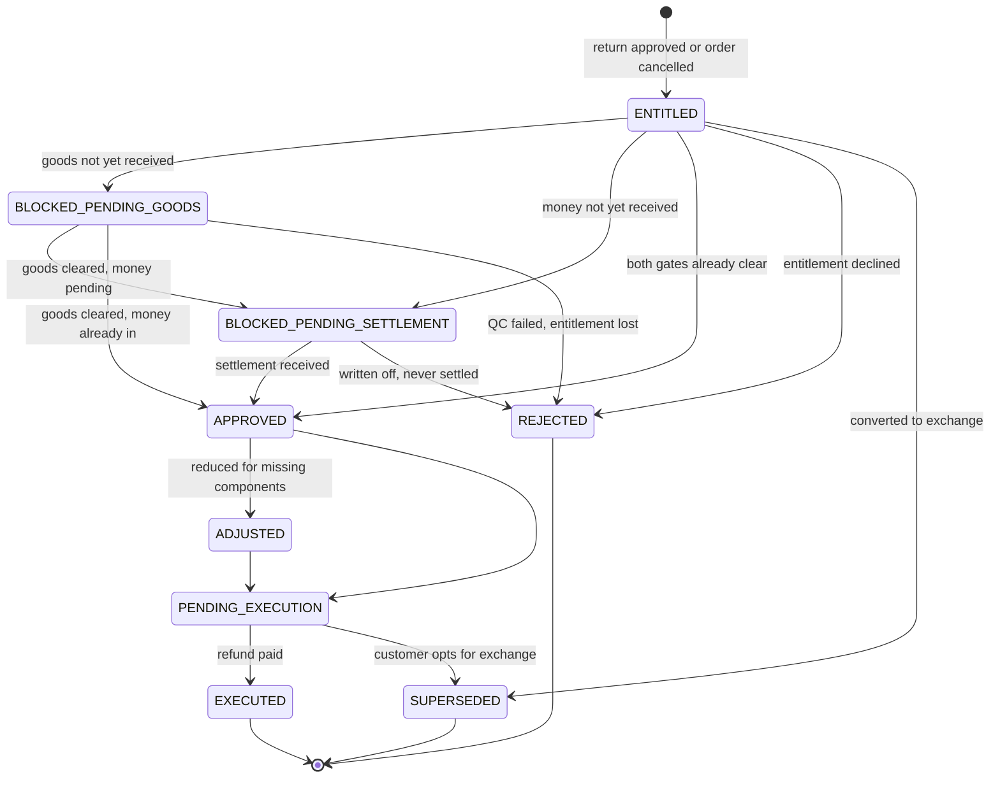

## 14.5 Allowed transitions

| From → To | Trigger | Mode | Actor |
|---|---|---|---|
| — → `ENTITLED` | EVT-064 / EVT-007 | Automatic | Return approved or order cancelled |
| `ENTITLED` → `BLOCKED_PENDING_GOODS` | — | Automatic | Goods gate open |
| `ENTITLED` → `BLOCKED_PENDING_SETTLEMENT` | — | Automatic | Money gate open |
| `BLOCKED_PENDING_GOODS` → `APPROVED` | EVT-067 | Automatic | QC passed, money already received |
| `BLOCKED_PENDING_SETTLEMENT` → `APPROVED` | EVT-055 / EVT-056 | Automatic | Remittance or settlement arrives |
| `APPROVED` → `ADJUSTED` | — | Manual | Accounts, with reason |
| `PENDING_EXECUTION` → `EXECUTED` | EVT-060 | Manual | Accounts, within bounds |

## 14.6 Invalid transitions

| Prohibited | Why | Rule |
|---|---|---|
| `ENTITLED` → `EXECUTED` with either gate open | **A refund is initiated only after the money has been received**; refunding unsettled money creates real cash exposure on an unrecovered receivable | `BR-041` |
| Refund amount exceeding amount received | Hard ceiling | `BR-040` |
| Executing with no reason or authorising actor | Every refund records reason, authority, and trigger | `BR-043` |
| Refunding by a route other than the original | Original collection route by default | `BR-042` |
| Same actor approving the return and executing the refund | **Segregated** — guards against fabricated refunds | `PRM-012` |
| `EXECUTED` → any | Terminal; a correction is a new transaction | `SMA-009`, `DB-002` |

## 14.7 Entry and exit actions

| State | On entry | On exit |
|---|---|---|
| `ENTITLED` | Compute entitled amount against amount actually received | — |
| `BLOCKED_PENDING_GOODS` | **Age the block**; escalate if the return never arrives | — |
| `BLOCKED_PENDING_SETTLEMENT` | Link to the awaited remittance or settlement; age | — |
| `ADJUSTED` | Record the deduction reason; **notify the customer** | — |
| `EXECUTED` | Payment transaction; notify customer; move receivable to `Payment:REFUNDED` | — |

## 14.8 Flows

**Normal** `ENTITLED → BLOCKED_PENDING_GOODS → APPROVED → PENDING_EXECUTION → EXECUTED`
**Cancellation** `ENTITLED → SUPERSEDED` where the customer accepts an exchange instead.
**Failure** `BLOCKED_PENDING_GOODS → REJECTED` on QC failure — particularly where the returned serial differs from the dispatched serial (`BR-047`), which is return fraud, not a refund case.
**Recovery** `BLOCKED_PENDING_SETTLEMENT → APPROVED` when a delayed marketplace settlement finally arrives — possibly weeks after the customer returned the goods.

## 14.9 Permissions & audit

Accounts execute within magnitude bounds; above them, escalation. **Audit** — refunds are explicitly auditable as money leaving the business (`AUD §12.2`), recording reason, authority, trigger, and any adjustment.

---

# 15. `SM-11` — QC

> ✅ **Registered in `OM §18.2`** (`BR-142`, 2026-08-09); previously a proposed extension under `SMA-001`.
>
> **Scope, as later rules settled it** (§3.2): **`SM-11` is Return QC always**, and inbound supplier-receipt QC **at the warehouse's discretion** — `WHS-018` makes that *"an operational decision, not a rule"*. Build QC is a stage of `SM-12` and Repair QC a stage of `SM-15` (`SMA-045`). The original justification below — *"it cannot be a state of Return when it also governs Goods Receipt"* — is **retained as the reasoning of record**, but `SM-11`'s independence does not rest on the inbound case: **`E-049` is a subject in its own right, with its own inspector, checks and branching outcome** (`SMA-002`, `SMA-045`).

## 15.1 Definition

| | |
|---|---|
| **Purpose** | Determine whether goods are acceptable, and gate both restocking and refund |
| **Subject** | E-049 QC Inspection |
| **Owner** | Warehouse |
| **Authority** | Internal |
| **Initial** | `AWAITING_INSPECTION` |
| **Terminal** | `PASSED`, `PASSED_WITH_CONDITION`, `FAILED`, `ESCALATED` |

> **⚠ The process this machine governs is undefined.** `GAP-045` — **`QC` appears 62 times across the documentation and is never defined or expanded.** No document specifies who performs it, what qualifies an inspector, what tolerances apply, or how a disputed outcome is resolved. The **lifecycle** below is derived from `OM §12.5` steps 6–7, which enumerate the checks and outcomes. **The process definition remains an open gap and is not invented here** (`SMA-014`, `DM-001`).

## 15.2 States

| State | Meaning | Exit owner |
|---|---|---|
| `AWAITING_INSPECTION` | Goods in quarantine, not yet inspected | Warehouse |
| `IN_INSPECTION` | Inspector working through the checks | Inspector |
| `SERIAL_MISMATCH` | Returned serial differs from dispatched serial | Supervisor |
| `PASSED` | As new, complete — restock as new | — |
| `PASSED_WITH_CONDITION` | Opened or minor damage — restock at an adjusted grade | — |
| `FAILED` | Faulty, incomplete, or damaged beyond resale | — |
| `ESCALATED` | Fraud suspected, or the outcome is disputed | Supervisor / Management |

## 15.3 Diagram

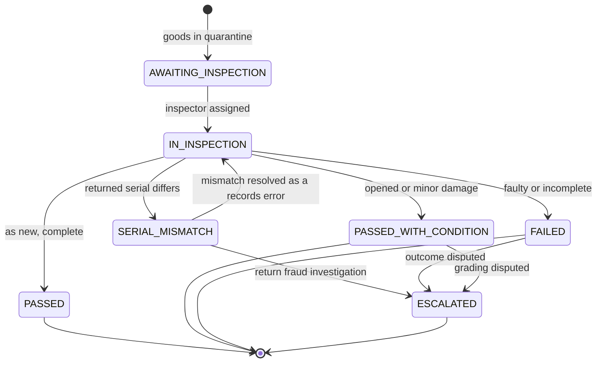

## 15.4 The six checks

Per `OM §12.5` step 6, every inspection covers:

| Check | Purpose |
|---|---|
| **Serial verification** | Confirm the unit returned is the unit dispatched (`BR-047`) |
| Completeness | All accessories, cables, remotes, documentation |
| Physical condition | Damage, wear, signs of use |
| Functional test | Powers on and operates correctly |
| Packaging | Original packaging present and intact |
| Tampering | Seals intact; no unauthorised opening or component substitution |

## 15.5 Allowed transitions

| From → To | Trigger | Mode | Actor |
|---|---|---|---|
| — → `AWAITING_INSPECTION` | EVT-042 / EVT-050 | Automatic | Goods quarantined or received |
| `AWAITING_INSPECTION` → `IN_INSPECTION` | — | Manual | Inspector |
| `IN_INSPECTION` → `PASSED` / `PASSED_WITH_CONDITION` / `FAILED` | EVT-067 / EVT-068 | Manual | Inspector |
| `IN_INSPECTION` → `SERIAL_MISMATCH` | EVT-068 | Manual | Inspector |
| `SERIAL_MISMATCH` → `ESCALATED` | EVT-077 | Manual | Supervisor |

## 15.6 Invalid transitions

| Prohibited | Why | Rule |
|---|---|---|
| Bypassing inspection to restock | **Returned goods never enter sellable stock before passing QC** | `BR-046` |
| `PASSED` on a serialized item without serial verification | **Mandatory** — without it a customer can return a different or older unit; on desktops and televisions this is the principal return-fraud vector | `BR-047` |
| `SERIAL_MISMATCH` → `PASSED` | Serial mismatch is **return fraud**: escalate and withhold refund pending investigation | `OM §12.5` step 7 |
| Inspector resolving their own escalation | No actor approves their own exception | `PRM-006` |
| Restocking a `FAILED` item | Quarantine, then scrap, repair, or supplier warranty claim | `OM §12.5` |

## 15.7 Entry and exit actions

| State | On entry | On exit |
|---|---|---|
| `AWAITING_INSPECTION` | Hold in quarantine, **non-sellable** | — |
| `IN_INSPECTION` | Attribute to inspector; record each of the six checks | — |
| `PASSED` | Restock as new; **release the goods gate** on `SM-10` | — |
| `PASSED_WITH_CONDITION` | Assign condition grade; restock at adjusted value | — |
| `FAILED` | Quarantine; decide scrap, repair, supplier claim, or carrier claim | — |
| `SERIAL_MISMATCH` | **Withhold refund**; raise fraud exception | — |

> **`GAP-047` — the condition grade vocabulary and its valuation impact are undefined**, although `Inventory:REGRADED` is a state and "restock as open-box at adjusted value" is a specified disposition. `PASSED_WITH_CONDITION` therefore has no grade to assign.

## 15.8 Flows

**Normal** `AWAITING_INSPECTION → IN_INSPECTION → PASSED → restock`
**Cancellation** Not applicable — goods physically present must be dispositioned.
**Failure** `IN_INSPECTION → FAILED` — faulty, incomplete, or damaged. Fault attribution determines who bears the cost: supplier warranty claim, carrier claim, or customer-attributable refund reduction (`BR-045`).
**Recovery** `SERIAL_MISMATCH → IN_INSPECTION` where investigation shows a records error rather than fraud.

## 15.9 Permissions & audit

Warehouse operators record QC outcomes; supervisors handle escalations; **no actor resolves their own escalation** (`PRM-006`). **Audit** — inspector, each check result, **serial verification outcome**, assigned grade, disposition, and any escalation.

> **SMA-014 — This machine's states are specified; its process is not.** Implementing it requires `GAP-045` to be closed first: who performs QC, what qualifies them, what tolerances apply, and how a disputed outcome is resolved.

---

# 16. Cross-Machine Coordination

## 16.1 The coupling rule

> **`BR-066` — machines communicate through events, never by reading or writing each other's state.** `SMA-003` restates this at machine level.

The complete coupling surface is the matrix at [`EVENT_ARCHITECTURE.md`](EVENT_ARCHITECTURE.md) §16, extending `OM §18.3`. **Not duplicated here** (`DOC-006`).

## 16.2 Simultaneity

At one moment an order may legitimately be:

| Machine | State |
|---|---|
| `SM-1` Order | `DELIVERED` |
| `SM-2` Verification | `CONFIRMED` (terminal) |
| `SM-3` Fulfillment A | `HANDED_OVER` (terminal) |
| `SM-3` Fulfillment B | `HANDED_OVER` (terminal) |
| `SM-4` Shipment A | `DELIVERED` (terminal) |
| `SM-4` Shipment B | `DELIVERED` (terminal) |
| `SM-5` Payment | `COLLECTED_BY_INTERMEDIARY` |
| `SM-6` Settlement | `EXPECTED` |
| `SM-7` Inventory | `CONSUMED` |
| `SM-8` Return | not started |

**This is normal and correct.** A single merged status field would need a value for this combination and every other, which is `OM §18.1`'s combinatorial argument.

## 16.3 Closure

> **`BR-010` — `Order:CLOSED` requires every machine terminal.** An order sits `DELIVERED` for weeks awaiting marketplace settlement. **That is correct, not a backlog.**

| Machine | Closure condition |
|---|---|
| Verification | Terminal |
| Fulfillment | Every instance terminal |
| Shipment | Every instance terminal |
| Payment | `RECONCILED`, `REFUNDED`, or `WRITTEN_OFF` |
| Settlement | Order's line reconciled or closed with variance |
| Return / Exchange / Refund | None open, or all closed |
| Inventory | All movements settled; no open discrepancy |

---

# 17. Flow Patterns

## 17.1 Four patterns, eleven machines

| Pattern | Definition | Universal rule |
|---|---|---|
| **Normal** | The path when nothing goes wrong | Every machine documents one |
| **Cancellation** | Deliberate termination before completion | Always requires a **controlled reason** (`BR-016`) |
| **Failure** | Something went wrong outside the actor's control | Always raises an **exception with an owner** (`SYS-022`) |
| **Recovery** | Return from failure to the normal path | **Every failure state has at least one recovery exit** (`SMA-004`) |

## 17.2 The recovery guarantee

> **SMA-015 — No failure state is terminal unless the failure is physically irreversible.**

| Failure | Recoverable? |
|---|---|
| `Verification:UNREACHABLE` | Yes — retry within policy |
| `Order:FAILED_DELIVERY` | **Yes — re-attempt or return.** Failed delivery is not the end of an order |
| `Fulfillment:ON_HOLD` | Yes — resolve discrepancy |
| `Shipment:DELIVERY_ATTEMPTED` | Yes — re-attempt |
| `Payment:SHORT_SETTLED` | Yes — dispute resolution |
| `Refund:BLOCKED_PENDING_*` | Yes — gate clears |
| `QC:SERIAL_MISMATCH` | Yes — if a records error |
| `Shipment:LOST` / `DAMAGED` | **No** — goods are physically gone; claim and write-off |
| `Inventory:SCRAPPED` | **No** — physically destroyed |

## 17.3 Cross-machine failure isolation

`SYS-054` — a subscriber failure never blocks the publisher. If Notification cannot send, the order still dispatches. If Reporting is unavailable, the warehouse still picks. Failure produces a retry and, unresolved, an exception — **never a stalled business process**.

---

# 18. Unknowns

| # | Unknown | Affects | Recorded as |
|---|---|---|---|
| SMU-1 | **Trigger mode** for release, closure, reconciliation, RTO creation | `SM-1`, `SM-6`, `SM-8` | `GAP-019` — **release resolved: manual, by a permissioned user** (`BD-040`, `BR-081`). Closure, reconciliation and RTO creation still unstated |
| SMU-2 | **QC process definition** — performer, qualification, tolerances, dispute path | `SM-11` | **SUBSTANTIALLY CLOSED — `BD-080` defines performer and qualification** (`DM-029`). Tolerances and dispute path remain open (`BD-225`, `BD-226`) |
| SMU-3 | **Condition grade vocabulary** for `PASSED_WITH_CONDITION` | `SM-11`, `SM-7` | `GAP-047` — **partial: `BD-071` gives "Partial Scrap" and "Full Scrap"** as grades in real use |
| ~~SMU-4~~ | ~~`ON_HOLD` entry/exit rules and effect on reservations~~ | `SM-1`, `SM-7` | ✅ **CLOSED 2026-08-09 — `BD-436`, `BD-437`.** **`ON_HOLD` is reservation-neutral**: a held order is **active** (`BR-097`), and a reservation changes only through the act underneath the hold (`BR-149`, `IVN-047`). **Entry/exit were already buildable** — `EVT-010`/`EVT-011` fix it as manual, by an authorised actor, reason and actor recorded, exit owner the placer. **No duration, ageing, SLA or auto-cancellation** (`BR-151`) |
| SMU-5 | **State ageing thresholds** — no state has a documented time expectation | All | `GAP-024` |
| SMU-6 | **`LOST_IN_RETURN`, `EXCHANGE_DENIED`, `CANCELLED_TO_REFUND`** appear in diagrams but not state tables | `SM-8`, `SM-9` | `GAP-028` |
| SMU-7 | **Stuck-shipment threshold** for `LOST` | `SM-4` | `GAP-048` |
| ~~SMU-8~~ | ~~`NOT RELEASED` semantics~~ | `SM-1`, `SM-3` | **CLOSED — `BD-039`. The marker is being dropped** (`BR-080`); `GAP-021` closed |
| ~~SMU-9~~ | ~~Return windows and eligibility~~ | `SM-8` | **CLOSED — `BD-077`. 14 days Daraz, 7 days elsewhere, by channel** (`DM-030`); `GAP-064` closed |
| ~~SMU-10~~ | ~~Courier Remittance and Approval machines~~ | — | ✅ **CLOSED 2026-08-09 — both machines proven unnecessary.** Approval by `SMA-017`; **Courier Remittance by `SMA-080`** — **`BD-440` places every decision on the consignment, leaving batch closure with nothing to decide.** **A derived condition, not a machine** |
| ~~SMU-11~~ | ~~**Amendment to `OM §18.2`** registering the four new machines~~ | `SM-3`, `SM-6`, `SM-10`, `SM-11` | **CLOSED 2026-08-09 — `OM §18.2` amended; `BR-142` registers all four.** `SMA-001` and `SMA-011` discharged |
| SMU-12 | **Partial cancellation** — whether individual lines may be cancelled while others proceed | `SM-1`, `SM-3` | `GAP-025` |
| ~~**SMU-13**~~ | ~~Warranty Claim machine — a third inbound flow with no lifecycle~~ | `SM-13` | ✅ **CLOSED — `SM-13` Warranty Claim specified at §21.1**, whose heading records that it closes `SMA-018`, `SMU-13` and `BD-244`. **The register entry was stale; corrected 2026-08-09** |
| ~~**SMU-14**~~ | ~~Advance payment produces a paid-but-not-due position `SM-5` cannot express~~ | — | **CLOSED — `BD-312`. It is an advance balance, not a payment state; `SM-5` unchanged** (`SMA-036`) |
| ~~**SMU-15**~~ | ~~No quarantine holding state is described in practice~~ | — | **CLOSED — `BD-289`. QC Pending IS quarantine; `BR-046` and `INV-5.1` stand as written** (`BR-100`) |
| ~~**SMU-16**~~ | ~~Repair lifecycle states~~ | `SM-15` | ✅ **CLOSED — `SM-15` Repair specified at §21.2**, whose heading records that it closes `GAP-075` and `SMU-16`. Thirteen stages from `BD-333`. **The register entry was stale; corrected 2026-08-09** |
| ~~**SMU-17**~~ | ~~Advance payment — unrepresentable on both sides~~ | — | **CLOSED — `BD-312`. Advance balances**, applied automatically at delivery and acceptance. `SM-5` needs no change (`SMA-036`) |
| **SMU-18** | **Supplier settlement machines — reuse `SM-8`–`SM-10`, or separate?** | `SM-8`, `SM-9`, `SM-10` | **`BD-301`.** ⚠ **Referral loop, tracked as `GAP-080`** — `SMA-032` deferred the decision to the Return & Exchange module, and `RET §2.2` referred it back. **Still open; an architecture decision, not discovery** |

> **SMA-016 — An entry here is an open question, not a decision.** No implementation may resolve one by choosing an answer in code (`DOC-003`, `DOC-024`).

---

# 19. Discovery Reconciliation — 2026-08-06

## 19.1 A machine that is not needed

> **SMA-017 — No Approval state machine is required.** `GAP-027` proposed one. `BD-109` establishes that **approval happens outside the ERP** — verbally or by message — and the authorized user records only the outcome. `BD-112` confirms no two-person approval anywhere, and `BD-113` that cover comes from standing authority rather than delegation.
>
> There is therefore **no approval request, no pending state, no queue, and nothing that waits.** An order never sits in "awaiting approval". Building a machine for this would model a process the business does not perform.
>
> This also settles one of the missing-machine candidates in `GAP-027` **by removing it**, which is a legitimate outcome of discovery.

## 19.2 Machines that are missing

> ## SMA-018 — A Warranty Claim has no lifecycle, and it is a third inbound flow
>
> `BD-096` establishes that goods come back to Trioloo through **three** distinct paths, and this document models only two:
>
> | Inbound flow | Machine |
> |---|---|
> | Customer return | `SM-8` Return |
> | RTO — undelivered goods | `SM-8` Return, via `BR-044` |
> | **Warranty claim** | **None** |
>
> A warranty claim is not a return: it arrives long after delivery, generates no receivable reversal, may resolve by **repair** rather than replacement, resolves to a **component** rather than the sold product (`PRD-044`), and may trigger **upstream recovery** from a supplier, distributor, or manufacturer (`BD-097`).
>
> **The machine is not specified here.** `BD-244` asks for its states, and specifying it now would invent them (`DM-001`, `SMA-016`). Recorded as `SMU-13`.

> **SMA-019 — Advance payment produces a position `SM-5` cannot express** (`BD-066`). When a customer pays before the amount is due, the payment is real but the obligation has not matured. `SM-5` has no state for *paid but not due* — it models `NOT_DUE` and `PAID` as mutually exclusive.
>
> At approximately 100% COD (`BD-058`) this is a small volume, but it is not zero, and an unrepresentable position becomes a workaround. Recorded as `SMU-14`; `BD-209` asks the detail.

## 19.3 Serial policy — `SM-11` narrowed, no gate anywhere

> **SMA-023 — No state machine may gate a transition on serial capture** (`BD-265`, `BD-266`). Serial entry is never mandatory and capture timing is **operational latitude, not a business rule**. Accordingly:
>
> - `SM-1` Order has **no serial precondition** on any transition. `BR-022`'s block into `READY_TO_SHIP` is **withdrawn** (`BR-086`).
> - `SM-3` Fulfillment has no serial-capture step that must complete.
> - Capture may occur during goods receipt, assembly, packing, or **warranty/service** — the last of which sits outside every existing machine.

> **SMA-024 — `SM-11` QC's `SERIAL_MISMATCH` state is reachable only where a serial was recorded at dispatch.** It is **not withdrawn** — where serials exist, the state and its fraud-escalation path work exactly as specified.
>
> Where no serial was recorded, a returned unit is verified against **order linkage** (`BR-088`), which cannot produce a serial mismatch. `SM-11` therefore needs **no new state**: the absence of a serial is not a QC outcome, it is a condition under which that particular check is not performed.

> **SMA-025 — Serial capture at warranty or service reinforces `SMA-018`.** `BD-266` names warranty/service processing as a capture point. That flow has **no machine** (`SMU-13`). A capture point on an unmodelled lifecycle is a gap in coverage, not merely a missing convenience.

## 19.4 `SM-12` Build Job — new machine, `DMU-20` resolved

> **SMA-026 — `E-065` Build Job has a lifecycle of eight business stages** (`BD-281`). This is the twelfth machine and the first supplied wholly by the business rather than derived.

| Stage | Entered when |
|---|---|
| `WAITING_FOR_COMPONENTS` | A required component is unavailable — **skipped** when all are on hand |
| `COMPONENTS_RESERVED` | Components committed; normal entry point |
| `ASSEMBLY_IN_PROGRESS` | Build under way |
| `QC_INSPECTION` | Assembly complete, unit being checked |
| `REWORK_REQUIRED` | **Only on QC failure** — returns to assembly and re-enters QC |
| `READY_FOR_PACKING` | **Terminal.** The build is complete and hands off to fulfilment |

> **SMA-027 — `SM-12` terminates at `READY_FOR_PACKING`.** The business also named *Packed* and *Ready to Ship*; those describe steps `SM-3` Fulfillment and `SM-1` Order already own. Allocating them to the existing machines avoids two vocabularies for one concept (`SYS-016`) and a name collision with the existing `READY_TO_SHIP` order state (`GAP-026`).
>
> Nothing is lost — the same physical steps are tracked, by the machine that owns them — and `SM-12` stays independent, coupled by event (`SMA-002`).

> **SMA-028 — `REWORK_REQUIRED` is a failure state with a recovery exit**, satisfying `SMA-004` and `SMA-015` without a new rule. The business named the state but not its exit; the return to assembly and re-entry to QC is **recorded as the inferred loop**, not as a business statement.

> **SMA-029 — Build QC and return QC are different things.** `QC_INSPECTION` is a **stage of `SM-12`**, checking a new build against its template. `SM-11` QC is an **independent machine**, checking a returned unit against what was dispatched. **`GAP-074` is resolved: `SM-11` needs no change.**

> **SMA-030 — No machine gates a transition on serial capture or on component compatibility** (`BD-265`, `BD-284`). `ASSEMBLY_IN_PROGRESS` carries no compatibility precondition — an incompatibility produces a warning, never a refusal. Consistent with `SMA-023`.

> **SMA-031 — `E-027` Stock Reservation requires no state machine** (`BD-279`). A reservation begins at order confirmation and ends automatically when the order is cancelled or expires. It has no independent lifecycle, no ageing, and no expiry of its own — it is a **dependent of `SM-1`**, not a peer.

## 19.5 Purchase & Supplier — `BD-293` – `BD-303`

> **SMA-032 — The supplier settlement triad mirrors the customer triad, and the choice of machines is deferred** (`BD-301`).
>
> | Customer | Supplier |
> |---|---|
> | `SM-8` Return | Supplier Return |
> | `SM-9` Exchange | **Supplier Exchange — primary settlement** |
> | `SM-10` Refund | Supplier Credit/Refund — least preferred |
>
> The shape is identical; the counterparty and direction of goods differ. **Whether these reuse `SM-8` – `SM-10` parameterised by counterparty, or take their own machines, is an architecture decision and is not settled here.** Reuse risks conflating two commercial relationships in one lifecycle; duplication risks two vocabularies for one concept (`SYS-016`). The decision belongs with the Return & Exchange module when it is written.

> **SMA-033 — `E-029` Purchase Order has a lifecycle bounded by external authority** (`BD-303`). It is amendable and cancellable **only until the supplier ships or confirms shipment**, and only with the supplier's agreement. Beyond that point it is resolved by agreement, never cancelled unilaterally.
>
> This is the **third external-authority relationship** the architecture models, after marketplaces (`PRD-030`) and couriers. The supplier's shipment state is **mirrored, not owned** (`SYS-010`, `SYS-026`).
>
> **The change window closes when goods move — symmetrically on both sides.** `BR-082` closes customer amendment at `COURIER_BOOKED`; `BR-114` closes purchase amendment at shipment. Neither sits at agreement or payment.

> **SMA-034 — No machine is required for goods receipt, purchase recommendation, or supplier selection.** `E-030` records an acceptance decision per line (`BR-105`); a recommendation is a derived view (`BR-106`); supplier choice is made at the moment of purchase and pre-binds nothing (`BR-107`). **None of the three has states, and none should be given any.**

> ## ✅ SMA-036 — `BD-312` resolves advance payment, and `SMA-035` is withdrawn
>
> **An advance is a balance, not a payment state.** A payment against an advance balance is an ordinary, complete payment — nothing about it is pending. What was missing was **a balance for it to sit against, not a state for it to occupy**.
>
> **`SM-5` Payment requires no change.** `SMU-14` and `SMU-17` close. The extension proposed below is **withdrawn as unnecessary** — modelling this as a payment state would have added a machine branch to represent what is simply a different account.
>
> Advances are applied automatically at the event creating the obligation they prepaid: **delivery** (`BR-116`) and **acceptance** (`BR-109`).

> ## ~~SMA-035~~ — WITHDRAWN 2026-08-06 by `SMA-036`. Retained for traceability
>
> `SMU-14` records that customer advance payment produces a *paid-but-not-due* position `SM-5` cannot express (`BD-066`, `SMA-019`).
>
> `BD-300` shows the **same absence in the opposite direction**: a supplier advance is money paid **before any payable exists**, because the payable arises at acceptance (`BR-109`).
>
> | Side | Situation |
> |---|---|
> | Customer | Paid before the amount is due |
> | **Supplier** | **Paid before the liability exists** |
>
> **Whatever resolves `SMU-14` must be checked against the supplier case.** A model handling only the customer side leaves supplier prepayments unrepresentable, and they will be recorded as something they are not. Recorded as `SMU-17`.

## 19.6 Confirmed

> **SMA-020 — `SM-6` Marketplace Settlement is confirmed as necessary and correctly shaped.** `BD-059` confirms two settlement paths (courier remittance and marketplace logistics); `BD-060` confirms batch settlement with line-by-line reconciliation and a permanent manual fallback, matching `E-042`/`E-044`, `OM §11.5` and `SYS-012`; `BD-062` confirms the investigate-then-contact-courier sequence before marking reconciled.
>
> `BD-063` gives the **first concrete timing figure in the entire set** — a 7-day Daraz settlement cycle.

> **SMA-021 — `SM-2` Verification is confirmed, with one structural correction.** The business runs **one Callback queue** serving both unreachable and customer-requested callbacks (`BD-037`, `BR-073`), where this document models `UNREACHABLE` and `CALLBACK_SCHEDULED` as separate states. They remain valid as reasons; they are not separate queues.

> **SMA-022 — `SM-9` Exchange carries more weight than assumed.** `BD-090` establishes that **exchange is the dominant after-sales path**, with refunds and completed returns less common. `OM §13.4` treats advance exchange as the exception; `BD-086` states it is the common case (`DM-033`). `SM-9` is therefore a primary machine, not a secondary one.

---

# 20. Marketplace Reconciliation — 2026-08-08

**Source:** `BUSINESS_DISCOVERY.md` §20, `BD-317` – `BD-328`.

## 20.1 `SM-14` — Marketplace Claim *(new — fourteenth machine)*

*`SM-13` remains reserved for Warranty Claim (`SMA-018`), reconciled in §21.*

| | |
|---|---|
| **Entity** | `E-069` Marketplace Claim |
| **Module** | Order Management |
| **Authority** | **External** — the marketplace decides |
| **Initial** | `PREPARING` |
| **Terminal** | `APPROVED`, `REJECTED`, `WITHDRAWN` |

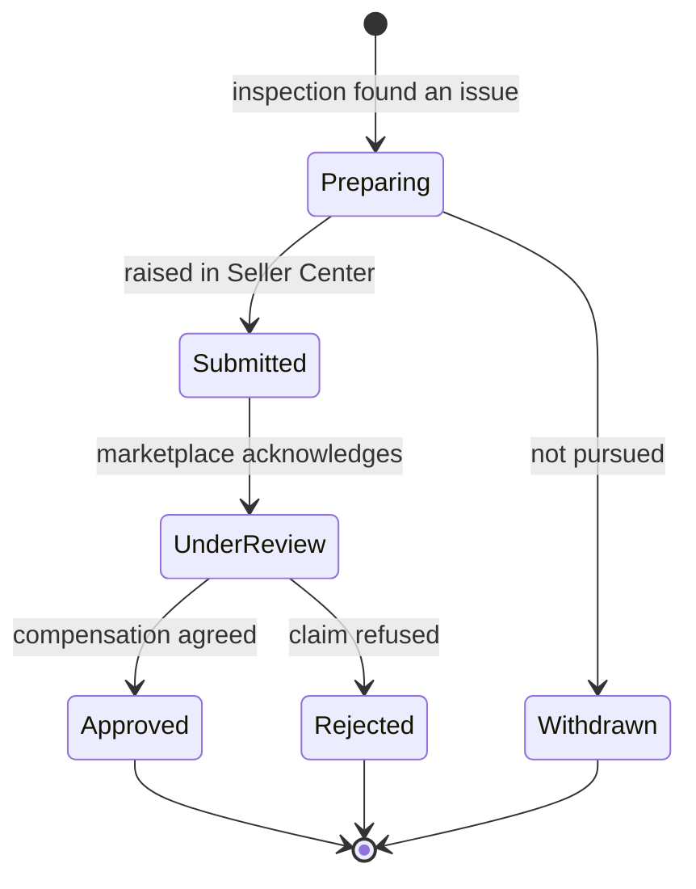

> **SMA-036 — `SM-14`'s post-submission states are mirrored, never locally decided.** `PREPARING` and `WITHDRAWN` are Trioloo's; everything from `SUBMITTED` onward reports what the marketplace did (`SYS-010`). **Sixth external-authority machine**, after `SM-4`, `SM-6`, listing status, order cancellation and purchase-order amendment.

> **SMA-037 — `SM-14` has no time expectation and no transition may be triggered by elapsed time.** `BD-324` states positively that duration *"cannot be predicted by the business"*. **This is the first machine where the absence of a threshold is a stated business fact rather than a gap** — it does not belong under `SMU-5`/`GAP-024`, and inventing an ageing rule would produce alerts that mean nothing (`DM-001`).

> **SMA-038 — Reaching `REJECTED` changes no other machine.** `SM-7` Inventory and any accounting record are untouched; absorbing the loss is a **separate authorised decision** — write-off (`BD-110`) or scrap (`BD-291`). **The claim result is a fact; the accounting response is a decision.**

## 20.2 No machine required

| Candidate | Why not |
|---|---|
| **Settlement reconciliation difference** | An **exception** (`E-056`), not a lifecycle — `SYS-022` already gives it an owner and a resolution path. What is new is the difference *type*, not a machine |
| **Listing sync state** | Already modelled — `SYNCED` / `MANUAL_REQUIRED` / `DIVERGED` are sync states on `E-059`, not a business lifecycle |
| **Policy violation** | A **channel-originated event** on the listing's activity history (`PRD-129`), with no states of its own |

## 20.3 Confirmed unchanged

`SM-1` Order and `SM-6` Marketplace Settlement are confirmed by `BD-319` and `BD-323` respectively. **`SM-6` gains no new state from settlement differences** — a difference raises an exception alongside the machine rather than moving it, which is what `CLOSED_WITH_VARIANCE` already anticipated.

# 21. Warranty Reconciliation — 2026-08-08

**Source:** `BUSINESS_DISCOVERY.md` §21, `BD-329` – `BD-341`. **Two machines, both given by the business rather than designed.**

## 21.1 `SM-13` — Warranty Claim *(closes `SMA-018`, `SMU-13`, `BD-244`)*

| | |
|---|---|
| **Entity** | `E-071` Warranty Request |
| **Authority** | **Internal** — Trioloo runs the process |
| **Initial** | `REPORTED` **or** `RECEIVED` |
| **Terminal** | `CLOSED` |

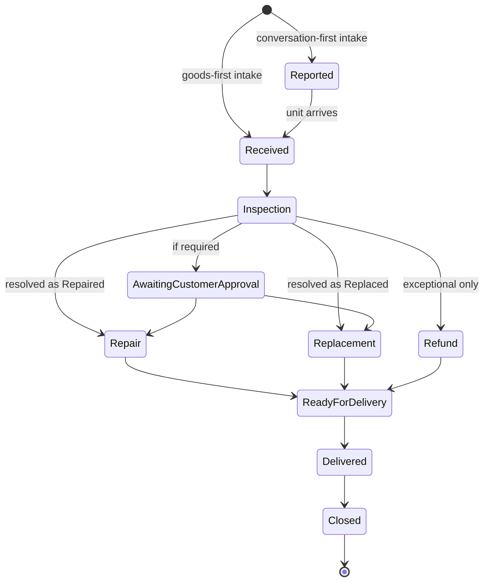

> **SMA-039 — `SM-13` has two initial states, and that is not redundancy.** `BD-329` established two structurally different intakes: **conversation-first** (phone, chat, walk-in) enters at `REPORTED`; **goods-first** (a courier return arriving with no prior contact) enters at `RECEIVED`. **A claim that starts with a parcel is the same lifecycle entered one stage later** — the business's conditional-skip rule covers it with no special case.

> **SMA-040 — Eligibility is determined at `INSPECTION`, not at intake.** On an assembled PC, warranty is **composite** (`PRD-043`) and eligibility is **per component** — so the answer depends on which component failed, which is not known until diagnosis (`BD-330`, `BD-331`). **A customer asking *"is my PC still under warranty?"* at intake often cannot be given a straight answer**, and the lifecycle accommodates that honestly rather than forcing a determination too early.

> **SMA-041 — The resolution branch is at `INSPECTION`: Repaired · Replaced · Refunded.** `BD-331`'s ten stages describe the **repair path specifically**, not the machine's only route (`BD-332`). **Refund is exceptional** — the fourth independent statement of *refund-last* (`SMA-043`).

> **SMA-042 — `DELIVERED` and `CLOSED` are separate, for the same reason as `BR-010`.** Handing the unit back does not end the case: **upstream recovery may still be open** (`BD-336`) and final cost responsibility may not be settled (`BD-290`). **The commercial process outlives the physical one** — now confirmed in three lifecycles independently.

> **SMA-043 — Refund-last is a stated business principle, not a per-module preference.** Four unrelated contexts state it: customer returns (`BD-090`), supplier settlement (`BD-301`), refund timing (`BD-310`), warranty resolution (`BD-332`). **Keep the value in goods; move money only when goods cannot resolve it.** It should be treated as a principle in the architecture rather than rediscovered per module.

## 21.2 `SM-15` — Repair *(new — fifteenth machine; closes `GAP-075`, `SMU-16`)*

| | |
|---|---|
| **Entity** | `E-072` Repair |
| **Authority** | **Mixed** — internal, with externally-owned excursions |
| **Initial** | `RECEIVED` |
| **Terminal** | `CLOSED` |

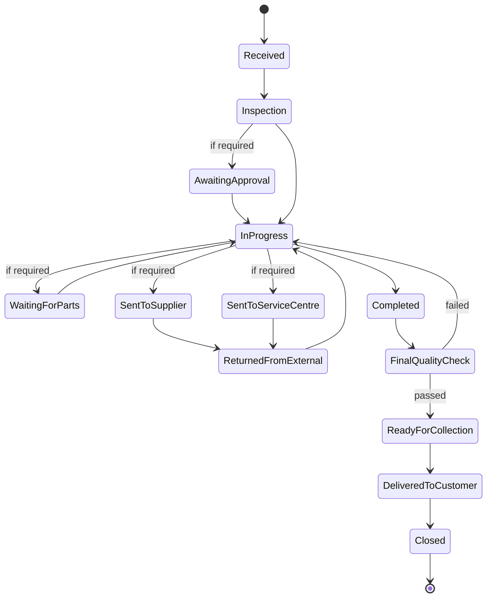

> **SMA-044 — Repair is a lifecycle in its own right, not a branch of `SM-13`.** It has **four entry points and only one is warranty:**
>
> | Entry | Source | Warranty? |
> |---|---|---|
> | A warranty claim resolved as *Repaired* | `BD-332` | **Yes** |
> | A return QC disposition of **Repair Required** | `BD-289` | **No** |
> | A **chargeable** repair, cost bearer = Customer | `BD-290` | **No** — paid service |
| **A Trade-In component classified `REPAIR_REQUIRED`** | **`BD-389`, `SMA-072`** | **No** — a salvaged component, not a claim |

> ✅ **Amended 2026-08-09 — the fourth entry was always specified here, and only this enumeration was stale.** **`SMA-072` states it directly: *“`REPAIR_REQUIRED` delegates to `SM-15`”*.** `SMA-044` was written at §21 (Warranty reconciliation) and **`SMA-072` at §25 (Trade-In), later in this same document** — the list was simply never revisited. **This is a stale registration corrected, not a new business decision**: no state, transition, terminal or authority of `SM-15` changes, and **`TRADE_IN_ARCHITECTURE.md` and `WARRANTY_REPAIR_ARCHITECTURE.md` already treated the classification as real.**
>
> ⚠ **This corrects the enumeration; it does not create an event.** Whether the Trade-In → Repair handoff needs its own event is a separate question with **no confirmed occurrence point**, and `SM-13`'s own delegation into `SM-15` publishes nothing either.
>
> **A repair can exist with no warranty claim behind it at all.** Modelling it as a sub-path of `SM-13` would make three of its four entry points unreachable. `SMA-002` keeps the machines independent; `SM-13` **delegates into** `SM-15` on the Repaired branch.

> **SMA-045 — Repair QC is a stage, not a machine, and this settles the general rule.** Three QC contexts now exist:
>
> | Context | Checks | Modelled as |
> |---|---|---|
> | Build QC | A new build against its template | **Stage** of `SM-12` |
> | Return QC | A returned unit against what was dispatched | **Machine** — `SM-11`, four dispositions |
> | **Repair QC** | **A repaired unit against working order** | **Stage** of `SM-15` |
>
> > **QC is a stage where it gates progress, and a machine where it decides an outcome.**
>
> Repair QC gates — pass and it goes back to the customer, fail and it returns to `IN_PROGRESS`. **It produces no branching disposition, so it needs no machine.** This generalises the resolution `BD-281` gave `GAP-074`.

> **SMA-046 — `SM-15`'s three waiting states are not the same kind of wait, and only one is Trioloo's.**
>
> | State | Waiting on | Trioloo can influence? |
> |---|---|---|
> | `AWAITING_APPROVAL` | **The customer** | Chase, not control |
> | **`WAITING_FOR_PARTS`** | **Procurement** | **Yes — internal** |
> | `SENT_TO_SUPPLIER` · `SENT_TO_SERVICE_CENTRE` | **A third party** | **No** |
>
> **This determines where ageing can legitimately exist.** `BD-334` requires overdue cases to be highlighted but states no threshold; **`WAITING_FOR_PARTS` is the only state where an internal expectation could meaningfully be set**, because the other two belong to other parties (`GAP-087`).

## 21.3 The eight-stage vocabulary overlap — resolved by namespacing, not by merging

`SM-13` and `SM-15` share eight stage names — `RECEIVED`, `INSPECTION`, waiting-for-approval, in-progress, waiting-for-parts, external service centre, `DELIVERED`, `CLOSED`. **This is exactly what `GAP-026` tracks.**

> **SMA-047 — The overlap is resolved by machine-qualified state names, never by merging the machines.** `SM-13.RECEIVED` and `SM-15.RECEIVED` are different states of different entities. **Merging them would collapse `SMA-044`'s four entry points**; leaving them unqualified produces the ambiguous requirements `GAP-026` predicts. **This is the first concrete instance where `GAP-026` must be resolved rather than merely noted.**

# 22. Return & Exchange Reconciliation — 2026-08-08

**Source:** `BUSINESS_DISCOVERY.md` §22, `BD-342` – `BD-354`. **No new machines.** `SM-8`, `SM-9` and `SM-10` existed without confirmed states; the business has now given all three.

## 22.1 `SM-8` — Return · states confirmed

`REQUESTED → APPROVED → WAITING_FOR_RETURN → IN_TRANSIT → RECEIVED → INSPECTION → DECISION_PENDING → ACCEPTED → RESOLUTION → INVENTORY_PROCESSING → COMPLETED → CLOSED`

> **SMA-048 — `SM-8` has exactly one branch point: `APPROVED` is skipped when Return Authorization Source is *Marketplace Approved*.** The marketplace already approved it (`BD-342`, `BD-347`).
>
> **Return *method* deliberately branches nothing** (`BD-344`). Had it done so the lifecycle would face a two-dimensional matrix — business-approved-by-courier, marketplace-approved-by-walk-in — for no business reason. **One discriminator, one skip.**

> **SMA-049 — `APPROVED` and `ACCEPTED` are different decisions, separated by `INSPECTION`.**
>
> | Stage | Decides |
> |---|---|
> | `APPROVED` | *"We will take it back"* — a commitment to receive |
> | `ACCEPTED` | *"We accept the goods as received"* — after inspecting condition |
>
> **This is what makes *rejection after inspection* possible without contradiction.** A return approved at stage 2 may still be rejected at stage 8. **Rejection means different things on the two paths:** on the direct path the customer gets no refund; on the marketplace path **Trioloo cannot refuse the return** (`BD-325`), so rejection becomes **a claim against the marketplace** — `SM-14` (`BD-324`).

> **SMA-050 — `INVENTORY_PROCESSING` follows the commercial resolution, not the inspection.** The disposition is **determined at inspection** (`SM-11`, four dispositions) but **executed only after the customer outcome is settled**. Goods stay in QC Pending throughout. **Deliberate and correct: stock must not return to sellable inventory while a dispute is live**, or the same unit could be sold twice over.

> **SMA-051 — A return carries lines; partial versus full is derived, never stored.** Each returned item or component is tracked independently with its own disposition, inventory effect and accounting treatment (`BD-346`). **A return covering every line *is* a full return** — this keeps `SM-8` free of a second branch point, as `SMA-048` already did for method.

## 22.2 `SM-9` — Exchange · states confirmed, **with a join**

`REQUESTED → APPROVED → REPLACEMENT_RESERVED → { REPLACEMENT_DELIVERED ∥ WAITING_FOR_RETURN → RECEIVED → INSPECTION } → CONFIRMED → INVENTORY_ADJUSTMENT → ACCOUNTING_ADJUSTMENT → COMPLETED → CLOSED`

> **SMA-052 — `CONFIRMED` is a synchronisation point, not a transition, and it is the first join in any machine.** Replacement delivery and return receipt are **explicitly order-independent** (`BD-348`); `CONFIRMED` requires **both** sides complete. `SM-8`, `SM-12`, `SM-13` and `SM-15` are all sequential with skips — **this is structurally different.**
>
> **A join can wait forever.** If the customer never returns the original, the return arm never completes and the exchange never confirms. **`SM-9` is therefore the only machine whose non-completion is structural rather than incidental** — which is exactly what `BD-350`'s `OVERDUE` mechanism exists to catch.

> **SMA-053 — ⚠ `SMA-022` CORRECTED.** `SMA-022` reads *"`OM §13.4` treats advance exchange as the exception; `BD-086` states it is the common case."*
>
> **`BD-350` supersedes `BD-086`: *"Advance Exchange is an exceptional business process, not the default workflow."*** The business was asked with `BD-086`'s claim quoted back to it and stated the opposite, supplying a permission model, an ageing rule and four resolutions. **`OM §13.4` was right all along.**
>
> **`SMA-022`'s conclusion survives; its reasoning does not.** `SM-9` remains a **primary** machine — but because `BD-090` makes **exchange** dominant, not because advance exchange is common. **Two different claims:** exchange is the usual resolution; sending the replacement first is unusual sequencing. Both can be true, and now are.

> **SMA-054 — `OVERDUE` is the first configured time threshold in the architecture.** `GAP-024` records that no state has a documented time expectation. **`BD-350` supplies one**: after a **configured business period** an unreturned advance exchange becomes `OVERDUE` — **a named state, not a flag**, with follow-up rather than an automatic decision.
>
> **The ERP must not decide the outcome.** Four resolutions are available — extend the period, close on receipt, **convert the replacement into a normal sale**, or another approved resolution — and they have entirely different commercial consequences, which is why the decision is not automated.
>
> **This partially answers `GAP-024`** and supplies the pattern the undefined thresholds at `GAP-087` and `GAP-091` could follow: **configuration produces a state; the state produces follow-up; a person decides.**

## 22.3 `SM-10` — Refund · states confirmed

`REQUESTED → REVIEW → APPROVED → AMOUNT_CONFIRMED → PAYMENT_PENDING → PAID → CONFIRMED → CLOSED`

> **SMA-055 — The accounting entry is created at `PAID`, not before.** Stages 1–5 are **operational only** — a refund can be requested, reviewed, approved and have its amount confirmed while remaining **entirely absent from the accounts**, because none of those acts moves money (`BD-310`, `BD-349`).
>
> **Same discipline as `BD-304` (revenue at delivery) and `BD-299` (payable at acceptance): recognition follows the event, never the intent.** Three domains, one rule.

> **SMA-056 — `PAID` and `CONFIRMED` mirror collection and settlement in reverse.** Money leaving Trioloo and money reaching the customer are **different events with a real gap between them** — a transfer takes time to land, and on the marketplace path the marketplace refunds the customer while Trioloo only sees it later in settlement (`BR-126`). Same reasoning that keeps `OM §11.1`'s collection/settlement split necessary.
>
> **Eight stages, linear, no join and no conditional branch** — the shortest lifecycle in the architecture. The only variation is **who pays**, which is data rather than a path.

## 22.4 `SMA-057` — Completed and Closed are a **general principle**, and `BR-010` is an instance of it

> **`BD-352`, business definition:**
> **Completed** — the operational work **for that specific lifecycle** has finished.
> **Closed** — the **entire business case** has no remaining pending activities **across any linked processes**.

| | Scope | Determined by |
|---|---|---|
| **Completed** | **One lifecycle** | That machine's own work |
| **Closed** | **The whole business case** | **Every linked process** |

**`BR-010` was written for orders and turns out to describe a rule the business applies everywhere.** Seven lifecycles separate the two independently — order, warranty, repair, return, exchange, refund, build. **Confirmed as deliberate and universal, not seven coincidences.**

> **`CLOSED` is not a state a machine can decide for itself.** Its entry condition lies **outside** the machine, in processes it does not own. **This does not violate `SMA-002`** — machines stay independent and couple by events; each announces completion, and closure follows when none remains active.
>
> **But it means the business case must know its linked processes.** That promotes `E-073` from a convenience to **the thing that gates closure** — the most consequential structural finding in this domain.

# 23. Chat Reconciliation — 2026-08-08

**Source:** `BUSINESS_DISCOVERY.md` §23, `BD-355` – `BD-368`.

## 23.1 `SM-16` — Conversation *(new — sixteenth machine)*

| | |
|---|---|
| **Entity** | `E-074` Conversation |
| **Authority** | **Mixed** — reopening is customer-driven |
| **Initial** | `NEW` |
| **Terminal** | `CLOSED` — **but reversibly so** |

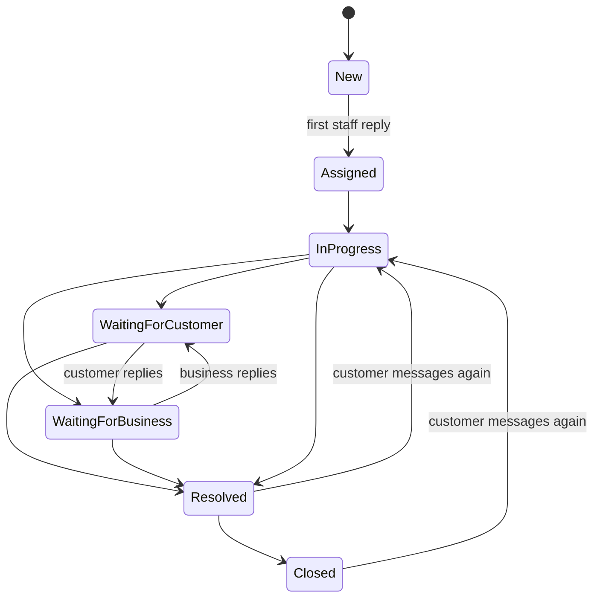

> **SMA-058 — `SM-16` is the first cyclic machine in the architecture.** Every prior lifecycle is **sequential with conditional skips**; `SM-9` adds a single **join**. This one cycles: *"may move between Waiting for Customer and Waiting for Business multiple times"* (`BD-359`).
>
> **This is not an anomaly — a conversation is a back-and-forth by nature**, and a model forcing it forward only would misrepresent the commonest thing it does. **Worth stating because every prior machine could be validated by checking it progresses. This one cannot.**

> **SMA-059 — `CLOSED` is reversible on `SM-16`, and reopening is automatic.** A customer message after `RESOLVED` or `CLOSED` **reopens the conversation**; history remains continuous and is **never split or duplicated** (`BD-362`, `BD-368`).
>
> **Reopening is mechanical, and correctly so.** Most transitions in this business are decisions; this one is not — a message arrived, so the conversation is active again. **Asking a person to confirm that an incoming message means the conversation is open would be ceremony** (`CP-6`). *Which* Business Case it belongs to **is** a judgement, and that one is left open.

> **SMA-060 — Three things are orthogonal to `SM-16` and none of them is a state.**
>
> | Orthogonal dimension | Source |
> |---|---|
> | **Linkage to business records** | `BD-359` — *"may be linked at any stage"* |
> | **Internal notes** | `BD-360` — *"do not change the conversation lifecycle"* |
> | **Ageing flags — `Overdue`, `Inactive`** | `BD-364`, `BD-365` |
>
> **`BD-359` lists *"Linked to Business Case"* sixth in its sequence, and it is not a state.** A sequential state must be passed through; a thing that can happen at any point is not one. Treating it as a state would produce a broken lifecycle — a conversation linked while `IN_PROGRESS` would have to leave `IN_PROGRESS` to become `LINKED`, then return.
>
> **The lifecycle tracks progress; everything else overlays it.** Seven states carry what would otherwise be dozens of combinations.

> **SMA-061 — `Overdue` and `Inactive` are overlay flags, not states, and the business's own wording settles it.** A conversation *"**remains in** Waiting for Customer"* **and** is *"**marked as** Inactive"* — **both at once**, which no lifecycle state permits. The same construction appears at `BD-364` for `Overdue`.
>
> | Lifecycle state | Overlay | Whose silence | Threshold |
> |---|---|---|---|
> | `WAITING_FOR_BUSINESS` | **`Overdue`** | **Trioloo's** | **10 minutes**, configurable (`BD-364`) |
> | `WAITING_FOR_CUSTOMER` | **`Inactive`** | The customer's | Configurable period (`BD-365`) |
>
> **Structurally necessary, not merely tidy:** a conversation that became `Overdue` as a *state* would lose the information that it was `IN_PROGRESS` — which is exactly what a supervisor needs to know. **Neither becomes an eighth state.**

> **SMA-062 — An ageing threshold produces visibility, never action.** Stated independently three times: warranty running long *"highlight for follow-up"* (`BD-334`), advance exchange *"the ERP does not decide the outcome"* (`BD-350`), conversation SLA *"never automatically closed or escalated"* (`BD-364`), and inactivity *"not automatically closed"* (`BD-365`).
>
> **Closure remains a human act with a named actor** — `Closed By` and `Closed Date` are recorded, satisfying `AUD-004`.

> **SMA-063 — `GAP-024` now has a worked example.** The gap has closed in four stages:
>
> | Answer | Contribution |
> |---|---|
> | `BD-324` | Externally owned duration — **no expectation can exist** |
> | `BD-334` | Highlighting wanted, **threshold undefined** |
> | `BD-350` | **A mechanism** — configured period → named state, no value |
> | **`BD-364`** | **Mechanism *and* value — 10 minutes, configurable** |
>
> **The pattern is complete: a configurable default producing a named overlay, highlighted rather than acted upon.** `GAP-087` and `GAP-091` now have both a shape and a precedent; **the values themselves remain the business's to set.**

> ⚠ **`Overdue` now names two different things** — an unreturned advance exchange (`SM-9`) and a late reply (`SM-16`). **Second concrete instance under `GAP-026`**, alongside the eight-name `SM-13`/`SM-15` overlap. Machine-qualified naming (`SMA-047`) covers both.

## 23.2 Two promises, split on what Trioloo controls

| | Controlled by | Promise |
|---|---|---|
| **First response** | **Trioloo** — a staff member replying | **✅ 10 minutes**, configurable |
| Case completion | Suppliers, service centres, manufacturers (`BD-334`) | **None** |

**The business promises what it can deliver and declines what it cannot.** `SM-16`'s two waiting states carry the same logic — `WAITING_FOR_BUSINESS` is measurable, `WAITING_FOR_CUSTOMER` is not.

# 24. Roles & Permissions Reconciliation — 2026-08-08

## 24.1 `SM-17` — Permission Override *(new — seventeenth machine)*

| | |
|---|---|
| **Entity** | `E-078` Permission Override |
| **Authority** | **Internal — administrator only** |
| **Initial** | `ACTIVE` |
| **Terminal** | `REMOVED`, `EXPIRED` |

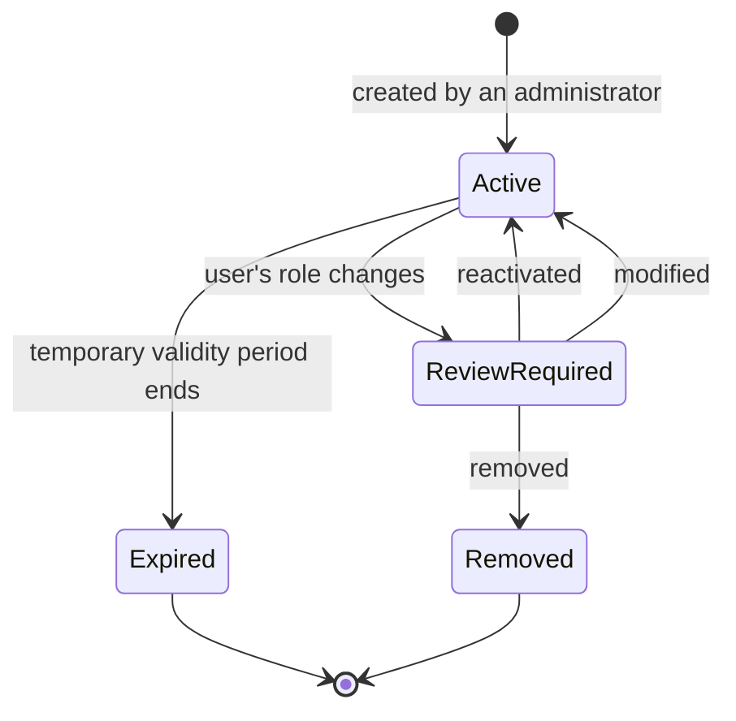

> **SMA-064 — A role change suspends into `REVIEW_REQUIRED`; a review falling overdue does not.** The two behave in opposite ways and the distinction is not inconsistency:
>
> > **An event carries information; a date does not.**
>
> A role change is **evidence the basis for the override has actually moved**. A review falling due is **only the calendar advancing** — nothing about the permission has changed. **And auto-revocation on overdue would punish the user for the administrator's inaction**, turning a review backlog into an outage.

> **SMA-065 — `REVIEW_REQUIRED` is a state, not an overlay** — and this is the exception that proves `SMA-061`'s rule. `Overdue` and `Inactive` are overlays because the underlying lifecycle continues beneath them. **`REVIEW_REQUIRED` suspends the override's effect**, so it changes what the record *is*, not merely how it is flagged.
>
> **`Expired` is separate and terminal**: an expired temporary override **remains inactive through review** — review is not a resurrection route.

> **SMA-066 — A hard gate is paired with a visibility requirement — the third instance.**
>
> | | What stalls | Mitigation |
> |---|---|---|
> | `SM-17` (`BD-376`) | Overrides suspended pending review | *"clearly highlight users awaiting review"* |
> | `SM-15` (`BD-391`) | Inventory blocked pending classification | *"records the inspection progress"* |
> | `E-073` (`BD-396`) | A case open indefinitely | *"may remind responsible staff"* |
>
> **The business consistently pairs a condition it will not resolve automatically with a mechanism that keeps it in view.** In each case the enforcement is justified by irreversibility, and its cost is paid by making the blockage visible rather than by weakening the rule.

# 25. Trade-In Reconciliation — 2026-08-08

**Source:** `BUSINESS_DISCOVERY.md` §26, `BD-388` – `BD-397`.

## 25.1 `SM-18` — Trade-In Case *(new — eighteenth machine)*

| | |
|---|---|
| **Entity** | `E-081` Trade-In Case |
| **Authority** | **Mixed** — `UNCLAIMED_PROPERTY` is blocked by the customer |
| **Initial** | `REQUESTED` |
| **Terminal** | `COMPLETED`, `RETURNED`, `LEGALLY_RESOLVED`, `CANCELLED` |

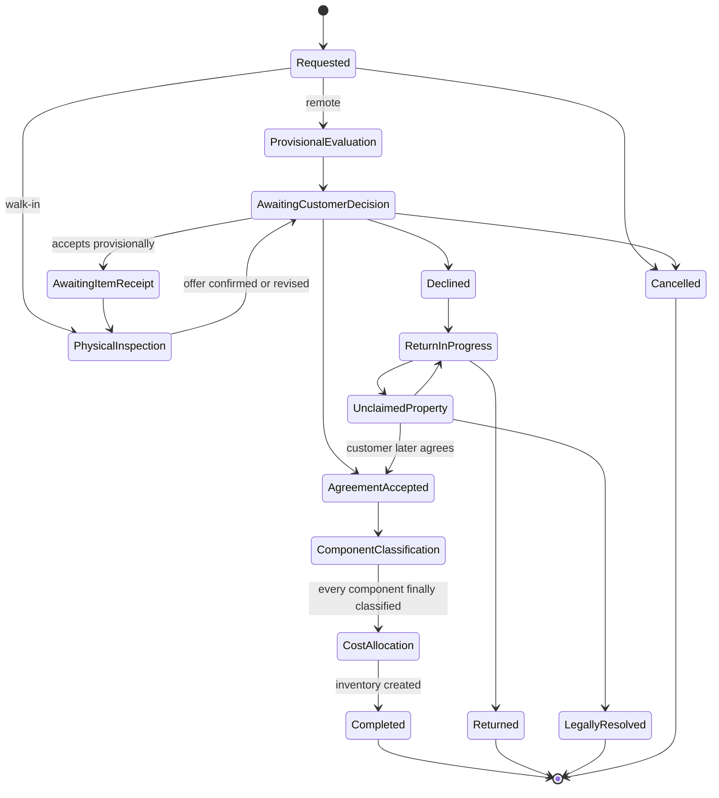

> **SMA-067 — Trade-In Credit and inventory are created at different moments, and the gap is what makes `SM-18` affordable.**
>
> | | Created at |
> |---|---|
> | **Trade-In Credit** — the customer's side | **`AGREEMENT_ACCEPTED`** — immediately |
> | **Inventory** — the business's side | **`COST_ALLOCATION` complete** — possibly days later |
>
> **This dissolves what looks like a conflict between two rules.** `BD-391` accepts that *"incomplete inspection may delay inventory availability"*; `BD-392` says *"immediate use of Trade-In Credit is the normal business workflow"*. **Both hold, because the delay never reaches the customer** — they buy their new machine and leave while the components reach stock when the workshop finishes. **The costing discipline is paid for entirely by the business.**

> **SMA-068 — Three guarded transitions, and they are the `BD-391` gates.**
>
> | Transition | Guard |
> |---|---|
> | `COMPONENT_CLASSIFICATION → COST_ALLOCATION` | **Every component finally classified** — no `Unknown` remains |
> | `COST_ALLOCATION → COMPLETED` | **Allocation sums to the agreed value** — arithmetic, enforced (`CP-8`) |
> | `AWAITING_CUSTOMER_DECISION → AGREEMENT_ACCEPTED` | Final value fixed |
>
> **Everything else is unguarded, because everything else is judgement.**

> **SMA-069 — `UNCLAIMED_PROPERTY` is the first legitimately-open-forever state in the architecture.** Every other lifecycle closes by business action. **All three of its exits require something outside the business's control** — the customer collecting, the customer changing their mind, or a legal process concluding.
>
> **Cases will accumulate here by design and without limit.** That is correct — a case must not close because it is inconvenient — but it means **the state must be reportable, not merely permitted**. `BD-352`'s `Closed` still holds; **what is new is a state that is legitimately never reached.**

> **SMA-070 — `SM-18` is not a forward march.** `UNCLAIMED_PROPERTY → AGREEMENT_ACCEPTED` implements `BD-396`'s *"accepted into an agreed Trade-In"* — **a customer who declined may still agree later.** Third non-linear machine, after `SM-9`'s join and `SM-16`'s cycle.

> **SMA-071 — Custody and component progress are overlays, not states** (`SMA-061` pattern). **Custody** — the business physically holding the customer's property — spans `AWAITING_ITEM_RECEIPT` through to `AGREEMENT_ACCEPTED` or `RETURNED`. **Component progress** (*"three of five classified"*) belongs to `SM-19`; the case state reflects only whether **all** are final.

## 25.2 `SM-19` — Trade-In Component *(new — nineteenth machine)*

| | |
|---|---|
| **Entity** | `E-082` Trade-In Component |
| **Initial** | `UNKNOWN` — pending inspection |
| **Terminal** | `IN_INVENTORY`, `DISPOSED` |

`UNKNOWN → { REUSABLE · REPAIR_REQUIRED · REFURBISHABLE · SCRAP · RECYCLE } → IN_INVENTORY · DISPOSED`

> **SMA-072 — `REPAIR_REQUIRED` and `REFURBISHABLE` are work, not storage**, and both generate `E-079` Action Queue Items with an owner. **They are genuinely different activities** — repairing a fault and restoring cosmetic condition have different costs. `REPAIR_REQUIRED` delegates to `SM-15`.

> **SMA-073 — `UNKNOWN` blocks the whole case, and the business chose that deliberately.**
>
> > **Inventory immutability is more important than early inventory availability.**
>
> **A partially classified Trade-In cannot create partial inventory** (`BD-391`). The alternative — allocating provisionally and revising — would either give a later-classified component **no cost** or force **retrospective restatement**, both breaking `DB-003` and `DB-077`.
>
> **This makes `UNKNOWN` expensive, which is healthy:** one unclassified component holds up an entire Trade-In, so the incentive is to resolve it. **Fourth instance of the stall-plus-visibility pairing** — the ERP *"records the inspection progress"* (`SMA-066`).

# 26. Fund Transfer Reconciliation — 2026-08-08

**Source:** `BUSINESS_DISCOVERY.md` §27, `BD-398` – `BD-404`.

## 26.1 `SM-20` — Fund Transfer *(new — twentieth machine)*

| | |
|---|---|
| **Entity** | `E-084` Fund Transfer |
| **Authority** | **Mixed** — delayed methods depend on a bank or MFS provider |
| **Initial** | `REQUESTED` |
| **Terminal** | `COMPLETED`, `FAILED`, `CANCELLED` |

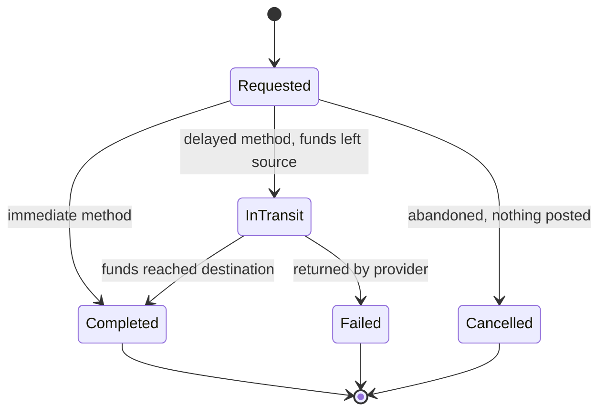

| State | Posted **by this point** — cumulative, not incremental | Business question |
|---|---|---|
| `REQUESTED` | **Nothing** | *"Recorded, not gone yet"* |
| `IN_TRANSIT` | **Source leg only** | *"Left my account, hasn't landed"* |
| `COMPLETED` | **Both legs** | *"Done"* |
| `FAILED` | **Source leg + return leg** | *"It bounced back"* |
| `CANCELLED` | **Nothing** | *"We didn't do it"* |

> ⚠ **The column above is cumulative.** It states **what has been posted by the time the state is reached**, not what that transition posts. **A delayed transfer posts the source leg once, on entering `IN_TRANSIT`, and the destination leg once, on reaching `COMPLETED`** — it does **not** post both legs again at `COMPLETED`. **An immediate method** (`SMA-077`) never enters `IN_TRANSIT` and posts both legs on the single transition. **Read incrementally the table would double-post the source leg**, which `SMA-074`'s movement table below forecloses. Clarified 2026-08-09; **no rule changed.**

> **SMA-074 — Posting follows the movement of funds, never the request.** The business stated the constraint directly: *"a transfer request is not the same thing as a completed transfer — the accounting movement should represent **when funds actually move**."*
>
> **That forces one structural conclusion: a delayed transfer is two movements at two times.** A BEFTN transfer debits the source immediately and credits the destination a day later, so under `DB-001` those are **two movements with two timestamps**, and the source debit needs a counterpart that is neither account.
>
> | Moment | Movement |
> |---|---|
> | Funds leave the source | **Source − X** · **Funds In Transit + X** |
> | Funds reach the destination | **Funds In Transit − X** · **Destination + X** |
>
> **The `SYS-105` invariant then holds at every instant, including mid-flight** — total business funds never change, because **money in transit is still the business's money.** Without it, an in-flight transfer would make total funds appear to drop and recover, which is not what happened.

> **SMA-075 — Failure is a third movement, never an undo.** `SOURCE − X → IN_TRANSIT + X`, then `IN_TRANSIT − X → SOURCE + X`. **Nothing is edited, nothing deleted, and the trail shows what actually happened** — the money left and came back. **`DB-002`, `DB-003` and `DB-077` are satisfied by construction**, because the model never reaches backwards.

> **SMA-076 — `Reversed` is not a state of `SM-20`.** If a transfer **completed** and is reversed days later, **the completion genuinely happened** (`DB-003`). A reversal is a **new, linked compensating transaction**, and the original carries a **`Reversed` overlay** in the `SMA-061` pattern.
>
> | | What happened |
> |---|---|
> | **`FAILED`** | The transfer **never completed** — a state |
> | **`Reversed`** | The transfer **completed and was later undone** — an overlay plus a new transaction |
>
> **Merging them would make a completed transfer retroactively look as though it never worked.**

> **SMA-077 — Whether a method can be delayed is a property of the method, not of the transfer type.** Cash deposits, wallet top-ups and same-bank transfers go `REQUESTED → COMPLETED` in one step and never reach `IN_TRANSIT`. **The same capability-declaration pattern that governs the other eight dimensions** (`SYS-096`), applied to payment methods.

> **SMA-078 — The fee needs no lifecycle.** A fee is charged, and may later be credited back — **two postings**. Under `DB-001` its state is derived from its movements, **which avoids a twenty-first machine for something that is only ever two entries.**

# Appendix A — Machine Index

`SM-1` Order · `SM-2` Verification · `SM-3` Fulfillment ⚠ · `SM-4` Shipment · `SM-5` Payment · `SM-6` Marketplace Settlement ⚠ · `SM-7` Inventory · `SM-8` Return · `SM-9` Exchange · `SM-10` Refund ⚠ · `SM-11` QC ⚠ · **`SM-12` Build Job** (§19.4) · **`SM-13` Warranty Claim** (§21.1) · **`SM-14` Marketplace Claim** (§20.1) · **`SM-15` Repair** (§21.2) · **`SM-16` Conversation** (§23.1) · **`SM-17` Permission Override** (§24.1) · **`SM-18` Trade-In Case** (§25.1) · **`SM-19` Trade-In Component** (§25.2) · **`SM-20` Fund Transfer** (§26.1)

✅ `SM-1` – `SM-11` are all registered in `OM §18.2` (`BR-142`, 2026-08-09). ⚠ **`SM-12` – `SM-20` are specified here but not yet registered there** — a separate outstanding propagation item.

# Appendix B — Rule Index

SMA-001 extension status · SMA-002–010 independence principles · SMA-011 amendment requirement · SMA-012 invalid transitions · SMA-013 fulfillment method determines shipment · SMA-014 QC process undefined · SMA-015 recovery guarantee · SMA-016 unknowns · **SMA-017–022 Sales reconciliation · SMA-023–025 serial policy · SMA-026–031 Warehouse & Assembly (§19.4)**.

# Appendix C — Amendment Record

| Version | Date | Change |
|---|---|---|
| 1.0.0 | 2026-08-04 | Initial ratification. 11 machines: 7 ratified, 4 proposed extensions. 12 unknowns recorded, none filled |
| **1.1.0** | **2026-08-06** | **Sales discovery reconciliation (§19).** Approval machine confirmed unnecessary (`SMA-017`); Warranty Claim machine identified as missing (`SMA-018`); advance-payment state gap recorded (`SMA-019`); `SM-6`, `SM-2`, `SM-9` confirmed (`SMA-020` – `SMA-022`). `SMU-8` and `SMU-9` closed; `SMU-13` – `SMU-16` opened. Source: [`BUSINESS_DISCOVERY.md`](BUSINESS_DISCOVERY.md) |
| **1.2.0** | **2026-08-06** | **Serial number policy (§19.3, `BD-242` resolved).** `SMA-023` – `SMA-025` added. **No machine may gate a transition on serial capture**; `SM-11`'s `SERIAL_MISMATCH` narrowed but retained; warranty capture point reinforces `SMA-018` |
| **1.3.0** | **2026-08-06** | **Warehouse & Assembly reconciliation (§19.4).** **`SM-12` Build Job added — twelfth machine**, eight stages, terminating at `READY_FOR_PACKING`. `SMA-026` – `SMA-031`. `SMU-15` closed, `SMU-16` narrowed to states-only. **`GAP-074` resolved** — build QC and return QC are distinct |
| **1.4.0** | **2026-08-06** | **Purchase & Supplier reconciliation (§19.5).** `SMA-032` – `SMA-035`. Supplier settlement triad recorded with machine choice deferred; `E-029` lifecycle bounded by **external authority — third instance**; no machines for receipt, recommendation or supplier selection. `SMU-17`, `SMU-18` opened |
| **1.20.0** | **2026-08-10** | ✅ **`SM-21` Advance Requisition Authority ADDED — the twenty-first machine. `BD-448` – `BD-457`, §9B, `SMA-083`/`SMA-084`. Post-Freeze amendment under `DOC-067`.** **The machine governs AUTHORITY ONLY** — whether money may still be drawn — **and nothing else.** ✅ **Created only after failing the three proven negatives in the opposite direction**: unlike `SMA-031`, `SMA-034` and `SMA-080`, this subject **has decisions to sequence and transitions that must be prohibited** — a rejected or cancelled requisition may never be disbursed, cancellation is valid **only** before any disbursement, and **an authorised amount may never rise.** **`E-042` needed no machine because its closure decides nothing; here closure of undrawn authority IS a decision** — the exact difference `SMA-080` turns on. ⚠ **NO STATE MIRRORS A BALANCE**: there is no `PARTIALLY_SETTLED`, `OUTSTANDING` or `COMPLETED`, because `BD-449`/`BD-454` make those derived and **`DB-001` forbids storing them.** **Five states** — `REQUESTED`, `REJECTED`, `AUTHORISED`, `CANCELLED`, `AUTHORITY_CLOSED` — with **`AUTHORISED → AUTHORITY_CLOSED` reachable both automatically (fully drawn) and manually (undrawn remainder explicitly closed).** **`AUTHORISED` entry records the amount and actor and creates NO balance, cash movement or expense.** ⚠ **`SMA-084` records a shape this architecture has not used: business completion is COMPUTED — authority closed AND outstanding zero — rather than entered**, because the alternative is a state mirroring a balance. **Twenty-one machines** |
| **1.19.0** | **2026-08-09** | ✅ **`GAP-116` propagated — `BD-442`, the FINAL Freeze blocker. `PARTIALLY_DELIVERED` REMOVED from `SM-1`; `SM-3` PRESERVED; `§6A` and `SMA-082` added.** **`SM-1` loses one state and one transition** — the state row, three diagram edges and the `DISPATCHED → PARTIALLY_DELIVERED` transition are struck. **No other `SM-1` transition referenced it**, so nothing is orphaned: `DISPATCHED` still exits to `DELIVERED` and `FAILED_DELIVERY`. ✅ **`SM-3` SURVIVES and was not deleted** — **`SMA-002`'s split-shipment illustration was never its reason.** It passes the test on **subject**: `E-035` Pick Task carries **eleven states** — picking, serial capture, packing, RTS, handover, self-pickup collection — **none of which is an Order state**, while `SM-1` runs only `RELEASED → IN_FULFILLMENT → DISPATCHED`. Different owner (**Warehouse**), a distinct supervisor `ON_HOLD`, **two terminals the Order does not distinguish** (`HANDED_OVER` vs `COLLECTED`), and **the build branch lives there** (`BR-096`). ⚠ **`SMA-002`'s RULE is untouched; only its illustration is amended**, with the original retained under `DOC-009`. ⚠ **One consequential narrowing**: `SM-3`'s subject was *one per order **per warehouse*** and is now **one per order**. **20 machines unchanged** |
| **1.18.0** | **2026-08-09** | ✅ **Three stale `GAP-019` `UNDECIDED` transition markers RESOLVED at the Final Freeze Gate — `SMA-081`, §9A. No new decision taken; every one was settled by a rule already ratified.** **`CONFIRMED → RELEASED` is `Manual`** — **`BR-081` says outright that release *“is a manual decision made by a permissioned user … not automatic and not rule-derived”* and that it *“closes part of `GAP-019`”***, yet the marker was never removed. **`any → CLOSED` is `Automatic`** — **`BR-010` makes `CLOSED` *“reached only when every sub-machine is terminal”*, a derived condition**, and the actor column already read **System**. **`— → AWAITING_RECEIPT` is `Automatic`** — **its own actor column already read *“RTO auto-created”***, so the marker contradicted its row. ⚠ **`FAILED_DELIVERY → RETURNED` is NOT resolved and stays marked** — `DLV-044` says *no further intervention is made*, which describes **Trioloo not intervening, not which internal actor stamps the record**; inferring one would be **choosing an answer in code** (`SMA-016`). **Classified non-blocking** — nothing posts or changes for the customer either way (`BR-117`) |
| **1.17.0** | **2026-08-09** | ✅ **`SMU-10` CLOSED — Courier Remittance PROVEN to need no machine; two `UNDECIDED` markers resolved. `BD-438` – `BD-440`, pre-freeze blocker A3. §10A added, `SMA-079`, `SMA-080`.** **`SMA-079`: `SM-5`'s `RECEIVED → RECONCILED` and `SM-6`'s `UNDER_RECONCILIATION → RECONCILED` are `Manual`** — **resolved by discovery already ratified, not new discovery.** The marker conflated two facts: **matching is automatic where an API supplies data and manual otherwise** (`PAY-034`), while **marking reconciled is a human act** — `BD-061` and `BD-062` both say *“before it is **marked as** reconciled”*. ⚠ **`GAP-019`'s four other markers are untouched and outside A3.** ✅ **`SMA-080`: `E-042` needs NO machine — its condition derives from its lines** (`DB-001`). **The business supplied the discriminator: *batch closure records completed resolutions and decides nothing*** — and **a batch whose closure decides nothing has no decisions to sequence.** ⚠ **Why `SM-6` is a machine and this is not**: `SM-6`'s `CLOSED_WITH_VARIANCE` **is an act performed at the batch**, while `BD-440` puts every courier decision **on the consignment first**. **`BD-439` forbade copying `SM-6`, and that was right — the two look alike and behave differently.** ✅ **`BR-036`'s ageing never needed this machine**: `SM-5`'s `COLLECTED_BY_INTERMEDIARY` entry action already *begins ageing* per courier — **ageing hangs off the receivable, not the batch**, so `GAP-027`/`SMU-10`'s premise was a misreading. **`SM-5`'s `COLLECTED_BY_INTERMEDIARY → RECEIVED` corrected from `Automatic` to `Manual`** — *“remittance arrives”* conflated the statement with the money |
| **1.16.0** | **2026-08-09** | ✅ **`SMU-4` CLOSED and §11's inventory machine reconciled — `BD-436`/`BD-437`, pre-freeze blocker A2. No machine, state or rule changed.** **`§11.3` said `AVAILABLE → RESERVED` occurs *on order release*** — superseded by `BR-096` on 2026-08-06 and never propagated — **and `RESERVED → AVAILABLE` listed *Cancellation, **hold**, expiry* as Automatic.** **`ON_HOLD` releases nothing** (`BD-436`) and **no reservation expiry exists** (`BD-279`, `SMA-031`, `DM-041`), so the row is now **cancellation only**, with a **separate Manual row for the explicit authorised release** `BD-437` introduces (`IVN-048`). **`§11.5`'s *“set reservation expiry”* removed** — it contradicted `SMA-031` in this same document. **`SMU-4` closed**: the reservation question is answered, and **entry/exit were already buildable** from `EVT-010`/`EVT-011` — manual, authorised actor, reason and actor recorded, exit owner the placer. **`SMA-031` stands unamended** |
| **1.15.3** | **2026-08-09** | **Three stale §18 register entries corrected — no machine, state or rule changed.** **`SMU-13` and `SMU-16` were closed by this document's own §21** — the headings of §21.1 and §21.2 record that `SM-13` closes `SMA-018`/`SMU-13` and `SM-15` closes `GAP-075`/`SMU-16` — **yet both still showed as open.** **`SMU-18` now cites `GAP-080`**, which tracks the referral loop where `SMA-032` deferred the decision to Return & Exchange and `RET §2.2` referred it back; **it remains open as an architecture decision.** Found during the pre-freeze triage |
| **1.15.2** | **2026-08-09** | **`SM-20`'s posting table clarified as cumulative — no rule, state or transition changed.** The column headed *Posted?* states **what has been posted by the time a state is reached**, not what the transition itself posts. **Read incrementally it would double-post the source leg** — `IN_TRANSIT` posting *source leg only* and `COMPLETED` posting *both legs*. **`SMA-074`'s movement table already forecloses that reading**, and the header now says so explicitly. Recorded during the `SM-20` event analysis as a **presentational risk, not an architectural defect** |
| **1.15.1** | **2026-08-09** | **Consistency-basis line updated — no machine, state or transition changed.** **102 events registered**, and **`SM-12` is now covered** by `EVT-102 Build.Completed`. **The uncovered set is `SM-14`, `SM-16` and `SM-20`.** `SMA-026` – `SMA-031` are untouched — **`SM-12`'s six stages, its two conditional skips, its `READY_FOR_PACKING` terminal and the Build-QC-is-a-stage boundary all stand exactly as ratified** |
| **1.15.0** | **2026-08-09** | **`SMA-044` amended — `SM-15` has FOUR entry points, not three. A stale enumeration corrected, not a business decision.** **`SMA-072`, later in this same document, already states *“`REPAIR_REQUIRED` delegates to `SM-15`”***; `SMA-044` was written at §21 and never revisited when §25 added the Trade-In machines. **A Trade-In component classified `REPAIR_REQUIRED` is now registered as the fourth entry point** (`BD-389`, `SMA-072`). **No state, transition, terminal or authority of `SM-15` changed**, no machine was created, and **no event was created** — the handoff has no confirmed occurrence point, and `SM-13`'s own delegation into `SM-15` publishes nothing either. Historical traceability preserved in place |
| **1.14.2** | **2026-08-09** | **Consistency-basis line updated — no machine, state or transition changed.** **100 events registered**, and **`SM-18` and `SM-19` are now covered** by `EVT-096` – `EVT-100`. **The uncovered set narrows to `SM-14`, `SM-16` and `SM-20`.** `SMA-067` – `SMA-073` are untouched — **the events were built on them, not the reverse** — and **`SMA-072`'s `REPAIR_REQUIRED` delegation against `SMA-044`'s registered entry points remains an open reconciliation defect that no event amends** |
| **1.14.1** | **2026-08-09** | **Consistency-basis line updated — no machine, state or transition changed.** `EVENT_ARCHITECTURE.md` now registers **95 events**, and **`SM-13` and `SM-15` are covered** by `EVT-089` – `EVT-095`. **The uncovered set narrows from `SM-13` – `SM-16`/`SM-18` – `SM-20` to `SM-14`, `SM-16` and `SM-18` – `SM-20`.** `SMA-041`, `SMA-044`, `SMA-045`, `SMA-046` and `SMA-047` are untouched — **the events were built on them, not the reverse** |
| **1.14.0** | **2026-08-09** | **Consistency-basis line corrected — no machine, state or transition changed.** It read *“§18 … registers seven of them”* and *“the 87 events that move them”*. **`OM §18.2` now registers eleven** (`BR-142`) and **`EVENT_ARCHITECTURE.md` carries 88 events** — but the sharper correction is that **the events do not cover every machine specified here**: `SM-13` – `SM-16` and `SM-18` – `SM-20` have none, and none is evidenced (`EVA-020`). **The old line implied a completeness that never held for the nine machines added after `EVENT_ARCHITECTURE.md` v1.0.0** |
| **1.13.0** | **2026-08-09** | ✅ **`SM-3`, `SM-6`, `SM-10` and `SM-11` RATIFIED. `SMA-001` and `SMA-011` DISCHARGED; `SMU-11` CLOSED.** `OM §18.2` was amended to register them (`BR-142`) — **the condition `SMA-001` set was met, not waived.** Each was verified independently: existence, state set, material transitions, authority model, and whether any business decision blocked it. **All four passed, and no state, transition or authority was invented to make them pass.** Two objections were tested and did not hold — an `UNDECIDED` transition mode is no bar, since ratified `SM-1`, `SM-5` and `SM-8` carry them; and `SMA-014` bars `SM-11`'s **implementation**, not its registration, so `GAP-045` and `GAP-047` stay open unchanged. **⚠ markers removed from §3.1, §7, §10, §14, §15 and `DOMAIN_MODEL.md`; the historical status is preserved verbatim inside `SMA-001` under `DOC-009`.** **§3.2 records `SM-11`'s scope as `SMA-045` and `WHS-018` settled it** — Return QC always, inbound supplier-receipt QC at the warehouse's discretion. **§14.3 is confirmed superseded and no state of it is registered.** 🔶 **`RP-SM10-GATES` opened as a carried reconciliation point** — at which of the eight confirmed stages a refund waits when a gate is open is stated by no ratified source; **no state was invented to close it.** **§7.4 is recorded as a subset of §7.3** and left unamended. **No machine's states, transitions or diagrams changed** |
| **1.12.0** | **2026-08-09** | **Pre-freeze reconciliation — documentary only, no machine ratified.** **§14.3's Refund state table is marked SUPERSEDED** by the business-confirmed set at §22.3 (`BD-349`), which `RET-029` and `PAYMENT_ARCHITECTURE.md` already use; under `DOC-048` confirmed discovery outranks a prior proposal. **The table is retained unaltered** per `DOC-009`/`DOC-021`, and §14.2's two gates are **not** withdrawn — only the state vocabulary is. **Mapping the two sets is left as an open architecture task.** `SMA-001` is unchanged: `SM-3`, `SM-6`, `SM-10` and `SM-11` remain proposed extensions, and `OM §18.2` now records the same contradiction from its own side |
| **1.11.0** | **2026-08-08** | **Fund Transfer reconciliation (§26).** **`SM-20` Fund Transfer added — twentieth and final machine.** `SMA-074` – `SMA-078`. **`SMA-074` derives `Funds In Transit` from the business's posting constraint** — a delayed transfer is two movements at two times, so the source debit needs a counterpart that is neither account. **`SMA-075` — failure satisfies `DB-002`/`DB-003`/`DB-077` by construction**, because the model never reaches backwards. `SMA-076` keeps `Reversed` an overlay, distinct from `FAILED`. `SMA-078` avoids a machine for the fee |
| **1.10.0** | **2026-08-08** | **Trade-In reconciliation (§25).** **`SM-18` Trade-In Case and `SM-19` Trade-In Component added — nineteen machines.** `SMA-067` – `SMA-073`. **`SMA-067` dissolves the apparent `BD-391`/`BD-392` conflict** — credit is created at agreement, inventory at allocation, so the costing delay is borne entirely by the business. **`SMA-069` records the first legitimately-open-forever state**, blocked by a third party. `SMA-070` — third non-linear machine. `SMA-073` records **immutability over availability** as a stated business priority |
| **1.9.0** | **2026-08-08** | **Roles & Permissions reconciliation (§24).** **`SM-17` Permission Override added — seventeenth machine.** `SMA-064` – `SMA-066`. **`SMA-064` records the sharpest `CP-8` case in the architecture** — role change suspends, overdue review only notifies, because *an event carries information and a date does not*. **`SMA-065` marks `REVIEW_REQUIRED` as the exception to `SMA-061`'s overlay rule** — it suspends effect rather than flagging state. `SMA-066` records the stall-plus-visibility pairing as a three-instance pattern |
| **1.8.0** | **2026-08-08** | **Chat reconciliation (§23).** **`SM-16` Conversation added — sixteenth machine, and the FIRST CYCLIC one**; every prior machine could be validated by checking it progresses, this one cannot. `SMA-058` – `SMA-063`. **`CLOSED` is reversible** and reopening is mechanical (`SMA-059`). **`SMA-060` and `SMA-061` establish overlays as distinct from states** — linkage, internal notes and the ageing flags `Overdue`/`Inactive` are all orthogonal, keeping seven states in place of dozens of combinations. **`SMA-063` completes the `GAP-024` pattern with a worked value** — 10-minute configurable First Response SLA. Second `GAP-026` collision recorded |
| **1.7.0** | **2026-08-08** | **Return & Exchange reconciliation (§22).** **No new machines** — `SM-8`, `SM-9` and `SM-10` all receive confirmed states from the business. `SMA-048` – `SMA-057`. **`SMA-022` CORRECTED** — `BD-350` supersedes `BD-086`; advance exchange is **exceptional**, and `OM §13.4` was right. **`SMA-052` records the first join in any machine** (`SM-9.CONFIRMED`), whose non-completion is structural. **`SMA-054` records the first configured time threshold** (`OVERDUE`), partially answering `GAP-024` and supplying a pattern for the undefined ones. **`SMA-057` promotes `BR-010` to a general principle** across seven lifecycles, and makes the Business Case the gate on closure |
| **1.6.0** | **2026-08-08** | **Warranty reconciliation (§21).** **`SM-13` Warranty Claim and `SM-15` Repair added — fifteen machines.** `SMA-039` – `SMA-047`. **`SMA-018`, `SMU-13`, `BD-244`, `GAP-075` and `SMU-16` all CLOSED.** `SMA-044` establishes repair as an independent lifecycle with **three entry points, only one of which is warranty**; `SMA-045` generalises **QC is a stage where it gates, a machine where it decides**; `SMA-043` records **refund-last** as a stated business principle across four contexts; `SMA-047` requires machine-qualified state names — **the first concrete case where `GAP-026` must be resolved rather than noted** |
| **1.5.0** | **2026-08-08** | **Marketplace reconciliation (§20).** **`SM-14` Marketplace Claim added — fourteenth machine**, externally owned from `SUBMITTED` onward. `SMA-036` – `SMA-038`. **`SMA-037` records the first machine where absence of a time expectation is a stated business fact rather than a gap** — claims must never be aged. Settlement differences, listing sync state and policy violations all confirmed as **not** requiring machines. `SM-13` reserved for Warranty Claim. Source: [`BUSINESS_DISCOVERY.md`](BUSINESS_DISCOVERY.md) §20 |
| **1.5.0** | **2026-08-06** | **Accounting reconciliation.** `SMA-036` — **`SMU-14` and `SMU-17` closed; `SMA-035` WITHDRAWN.** An advance is a balance, not a payment state, so `SM-5` requires no change. No machine is added by the Accounting domain |

---

*This document specifies business lifecycles only. It contains no UI specification, database design, API contract, or code. Implementation is derived from and tested against these machines.*

---

# 25. HR & Payroll requires no state machine — 2026-08-10

> **SMA-085 — HR & Payroll defines no state machine, and this is a determination rather than an omission** (`HRP-058`, `DOC-023`).

**Every candidate was tested against the established grounds — branching disposition, prohibited transitions, and independent lifecycle ownership.**

| Candidate | Assessment |
|---|---|
| **`E-093` Payroll Run** | **Two states, one forward transition.** ⚠ **No branching disposition, and the only prohibition — *do not reopen* (`HRP-028`) — is a single edge enforced locally.** **A lifecycle attribute, not a machine** |
| **`E-091` Attendance Day** | **Evaluated, not transitioned.** **Its outcome derives from schedule, expectation and sessions** (`INV-91.1`) |
| **`E-092` Overtime Approval** | **`0 ≤ Approved ≤ Potential` is a bound, not a lifecycle.** ⚠ **Pending is the ABSENCE of approval, not a state** (`BD-465`) |
| **`E-095` – `E-097` authorisations** | **Authorised or not — a single act.** **`BD-495` §6's future-dating is an effective date, not a state** |
| **`E-098` Employee Loan** | ✅ **Completion is a computed condition over the derived balance and the machine would have no terminal state** (`ACC-089`) — **the same reasoning `SMA-084` records for `SM-21`** |
| **`E-099` Loan Settlement** | **A movement, not a lifecycle** |

> ✅ **Twenty-one machines remain: `SM-1` – `SM-21`. None is added.**
>
> ⚠ **`E-093`'s two states are the closest call, and the test that settles it is `SMA-083`'s**: **a machine exists to govern where transitions branch or must be prevented across owners.** **A single forward edge enforced by its own module is an attribute.**

---

# 26. Final Settlement requires no state machine — 2026-08-10

> **SMA-086 — Final Settlement defines no state machine** (`HRP-086`, `DOC-023`).

| Candidate | Assessment |
|---|---|
| **`E-100` Final Settlement** | **`DRAFT → FINALISED`: two states, one forward transition, no branching disposition.** ⚠ **Atomicity is a TRANSACTION property, not a state** — **a failed finalisation leaves the settlement in `DRAFT`, which is the absence of a transition rather than a state of its own.** **The only prohibition — never reopen — is a single edge enforced locally** |
| **`E-101` Recovery Authorisation** | **`0 ≤ Applied ≤ Authorised ≤ Outstanding` is a bound, not a lifecycle** |

> ✅ **The same determination `SMA-085` reached for the Payroll Run, and the same test `SMA-083` states**: **a machine governs where transitions branch or must be prevented ACROSS OWNERS.** **Twenty-one machines: `SM-1` – `SM-21`. None added.**

---

# 27. Leave requires no state machine — 2026-08-10

> **SMA-087 — `E-102` Leave Request defines no state machine** (`HRP-097`, `BD-499`, `DOC-023`).

⚠ **The closest call in the corpus, and it is worth stating why it still fails.** **A Leave Request genuinely has a pending phase, which none of `E-095` – `E-097` or `E-101` had.**

| Ground | Assessment |
|---|---|
| **Branching disposition** | ⚠ **Approve, reject and partially approve are VALUES of a single decision, not a sequence of transitions.** **Pending is the ABSENCE of a decision** — the same finding `SMA-085` recorded for `E-092` Overtime Approval |
| **Prohibited transitions across owners** | **None.** ✅ **Contrast `SM-17` Permission Override, which IS a machine because `AGV-025` has an EXTERNAL event — a role change — drive it into `Review Required` with controlled re-entry.** **Leave has no external driver and no re-entry** |
| **Independent lifecycle ownership** | **None.** **Attendance consumes the approved fact at evaluation time** (`HRP-008`) |

> ✅ **Twenty-one machines: `SM-1` – `SM-21`. None added.** **A pending phase is not a lifecycle.**

