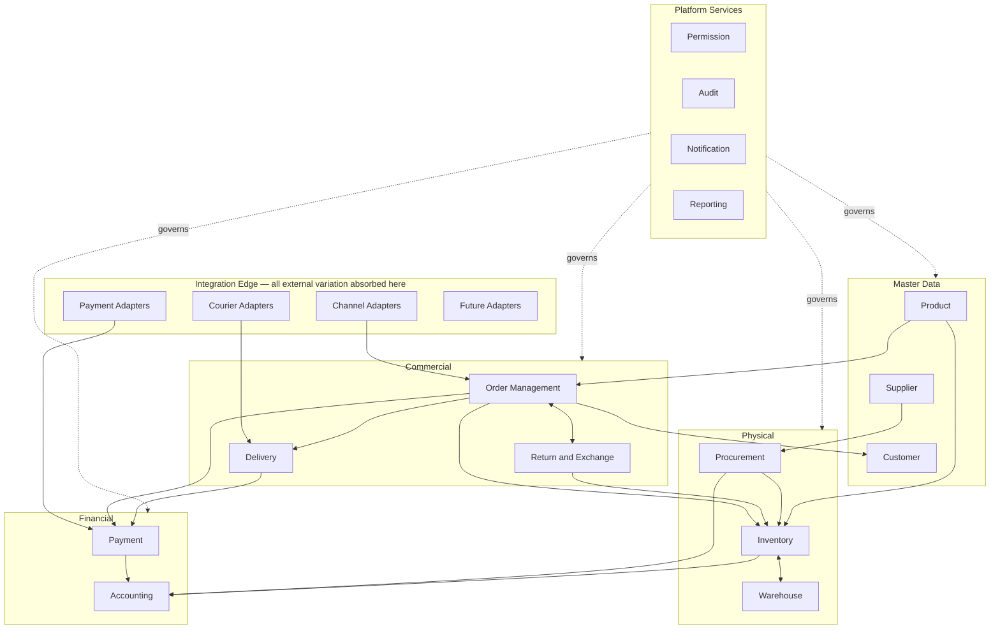
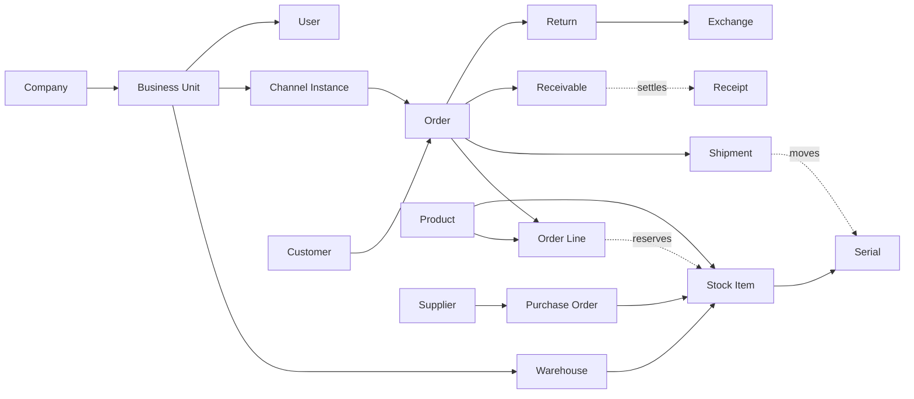
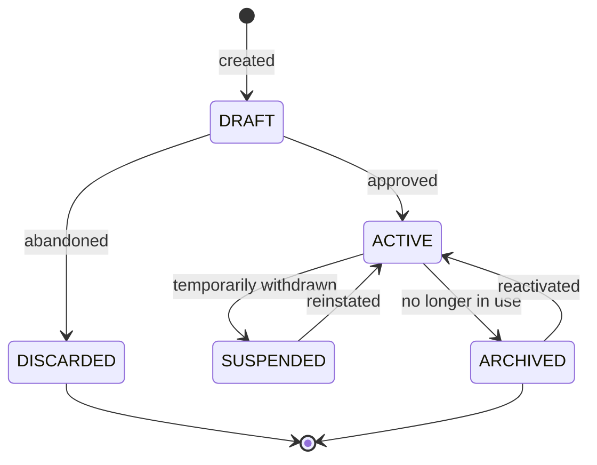
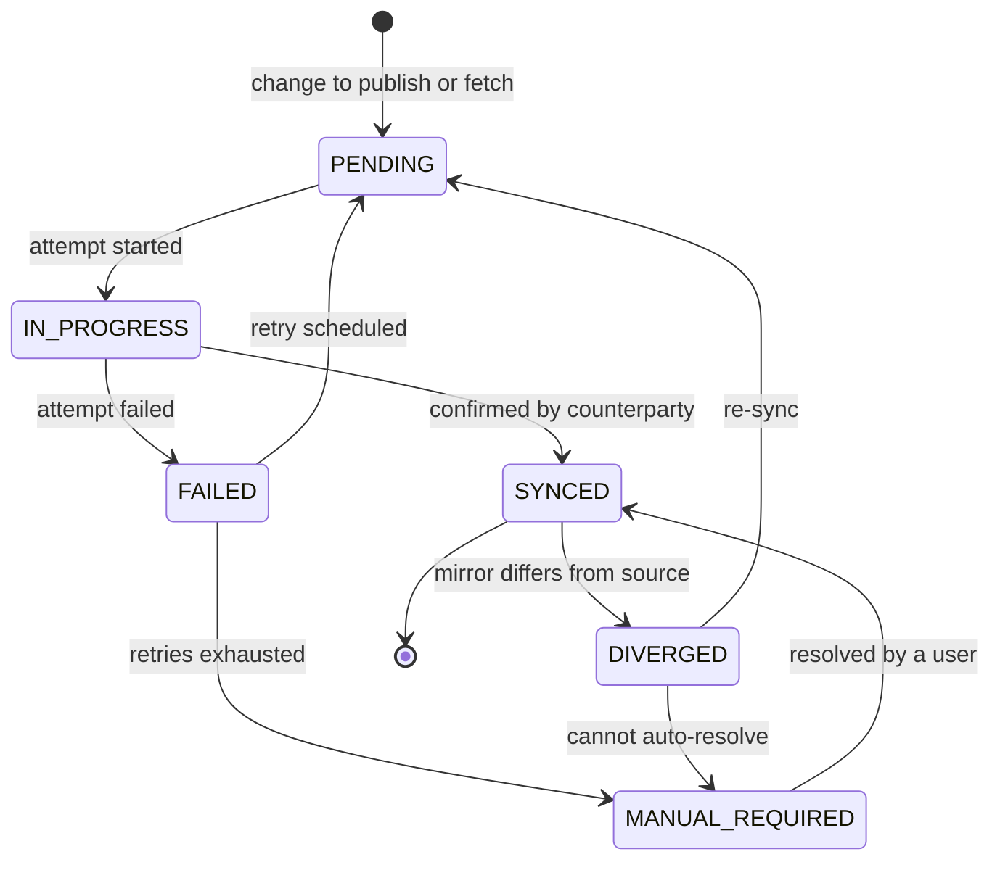
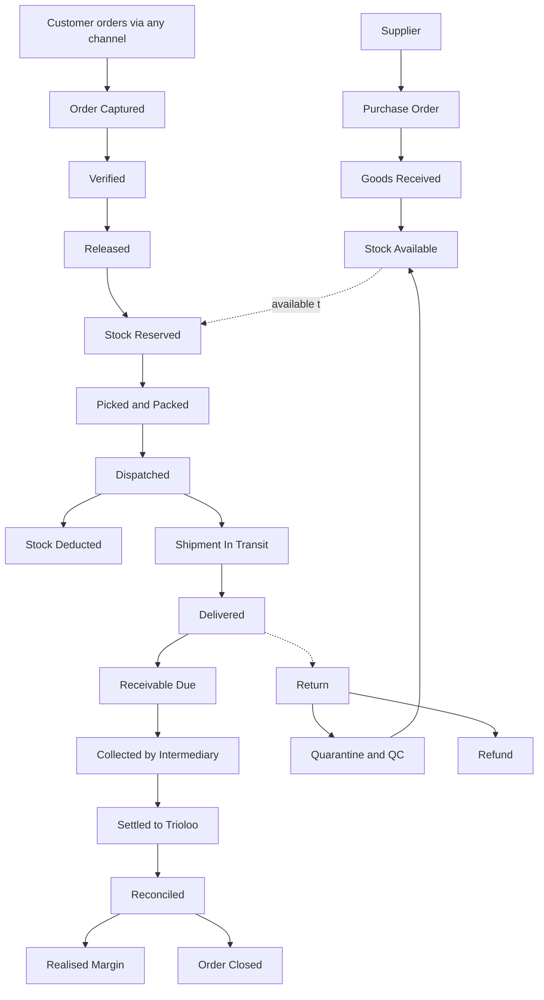

# System Architecture

**Owner:** Trioloo Technology · **Scope:** Whole ERP · **Status:** Canonical
**Version:** 1.15.0 · **Ratified:** 2026-08-04 · **Amended:** 2026-08-08 (Sales reconciliation; immutability `BD-254`; serial policy `BD-242`; Accounting §19; Marketplace §20; Chat §21; Notifications §22; Trade-In §23; Fund Transfer §24)

---

## Document Control

### Position in the documentation set

This document is the **keystone** of the Trioloo ERP architecture. It defines the module map, the vocabulary, the coupling model, and the cross-cutting rules that every other architecture document inherits.

| Layer | Documents | Authority |
|---|---|---|
| **Visual** | [`DESIGN_CONSTITUTION.md`](DESIGN_CONSTITUTION.md), [`design-reference/`](design-reference/README.md) | Binding for all UI |
| **Keystone** | **This document** | Binding for module boundaries, vocabulary, coupling |
| **Business domain** | [`ORDER_MANAGEMENT_ARCHITECTURE.md`](ORDER_MANAGEMENT_ARCHITECTURE.md) and the module documents listed in §11 | Binding within their module |

### Precedence

> **SYS-001 — Documentation precedence is: `DESIGN_CONSTITUTION.md` and `design-reference/` for anything visual → `ORDER_MANAGEMENT_ARCHITECTURE.md` for order lifecycle → this document for cross-module concerns → the individual module document for its own domain.**
>
> Where two documents describe the same concept, the one that **owns** the concept governs (§5.4) and the other must reference rather than restate it.

### What this document is not

It contains no code, no schema, no API contracts, no UI specification, and **no technology decisions**. It describes logical architecture: what the parts are, what each is responsible for, and how they may interact. See §17.

### Rule identifier convention

Every architecture document numbers its binding rules with a document-specific prefix, so a rule can be cited unambiguously from anywhere in the set.

| Prefix | Document |
|---|---|
| `BR-` | Order Management (established; retained) |
| `SYS-` | System Architecture (this document) |
| `DB-` | Database Architecture |
| `API-` | API Architecture |
| `IVN-` | Inventory Architecture |
| `ICO-` | Inventory Costing Architecture |
| `PAY-` | Payment Architecture |
| `ACC-` | Accounting Architecture |
| `CUS-` | Customer Architecture |
| `PRD-` | Product Architecture |
| `PRC-` | Procurement Architecture |
| `WHS-` | Warehouse Architecture |
| `DLV-` | Delivery Architecture |
| `RET-` | Return & Exchange Architecture |
| `NOT-` | Notification Architecture |
| `CHT-` | Chat Architecture |
| `RPT-` | Reporting Architecture |
| `PRM-` | Permission Architecture |
| `AGV-` | Access Governance Architecture |
| `AUD-` | Audit Architecture |

> **SYS-002 — Rule identifiers are permanent.** A rule that is withdrawn is marked withdrawn; its number is never reused. Rules are cited by number in tickets, code review, and testing.

---

## Table of Contents

| § | Section |
|---|---|
| **0** | **TRIOLOO ERP Core Architecture Principles** — governing |
| 1 | Purpose |
| 2 | Scope |
| 3 | Business Goals |
| 4 | Architecture Principles |
| 5 | Core Concepts |
| 6 | Entities |
| 7 | State Machines |
| 8 | Business Rules |
| 9 | Validation Rules |
| 10 | Lifecycle |
| 11 | Module Responsibilities |
| 12 | Integration Points |
| 13 | Events |
| 14 | Audit Requirements |
| 15 | Permissions |
| 16 | Error Scenarios |
| 17 | Out of Scope |
| 18 | Future Extensibility |
| 19 | Unknowns |

---

# 0. TRIOLOO ERP Core Architecture Principles

> **These are the governing principles for every future architecture decision.** Where a design choice is open, it is resolved in their favour. Where a proposal conflicts with one, the proposal changes.

They are **architectural principles, not business rules.** They constrain *how* the system is built and shaped; they decide nothing about what the business does. No business rule in any document is altered by this section, and §4's principles (`SYS-004` – `SYS-014`) remain in force as the specific mechanisms by which several of these are achieved.

> **CP-1 — Business First.** The architecture serves Trioloo's actual operation, not a reference model of how such a business might work. Where a documented pattern and observed practice disagree, practice is the fact and the document changes (`DOC-048`). Nothing is built because an ERP is expected to have it.

> **CP-2 — Automation First.** Anything mechanical, repeatable, or computational is automated: derivations, valuations, reconciliations, syncs, and status propagation. A person should never do by hand what the system can determine. **Bounded by `CP-8`.**

> **CP-3 — Small Team First.** The system is designed for a small team where one person holds several roles. Segregation of duties is expressed where it matters and **explicitly accepted as unmet where the team cannot supply it** (`PRM-014`), never enforced into unworkability. Role models may exceed current practice, but the system must remain fully operable by very few people.

> **CP-4 — Fast Operation First.** Operational speed is a design goal, not a trade-off made after correctness. Where a control would slow routine work without protecting something material, it is not added. Optional capture, absent gates, and unscheduled verification are deliberate expressions of this.

> **CP-5 — Simple but Information-Rich UI.** Screens carry the information needed to decide without navigating away, and no ornament beyond it. Density is preferred to prettiness; a busy screen that answers the question beats a clean one that does not. Visual authority remains with `DESIGN_CONSTITUTION.md` and `design-reference/` (`SYS-001`); this principle guides future design, and **does not relax `RULE 0.1`'s freeze on existing surfaces**.

> **CP-6 — Minimal Clicks.** The common path is the short path. Routine actions complete without traversing dialogs, and exceptional actions are reachable without ceremony. Steps that exist only to confirm what the system already knows are removed.

> **CP-7 — Smart Defaults.** The system proposes the likely answer and lets it be overridden freely. A default is a **suggestion, never a constraint** — the shape `PRD-056` defines for mapping reuse and `BR-107` for supplier selection. Defaults reduce effort; they never narrow choice.

> **CP-8 — Human Decision Over Automation.** Where a person holds information the system does not, the system **advises and does not obstruct**. Judgement stays with the operator: discount size, supplier choice, component compatibility, what to publish, when to count, what to buy.
>
> **⚠ REFINED 2026-08-08 (`BD-360`) — the boundary has a second axis: *enforce where a mistake cannot be undone*.**
>
> Twenty-five instances of advise-over-enforce are recorded across discovery. The business has also stated a small number of **absolute** rules, and they share one property — **the harm is irreversible:**
>
> | Absolute rule | Harm if breached |
> |---|---|
> | Customers never see internal notes (`BD-360`) | **Disclosure — cannot be undone** |
> | Never auto-merge uncertain identities (`BD-357`) | One customer's history exposed inside another's |
> | No record is ever deleted (`BD-338`) | **Loss — cannot be undone** |
> | Posted records immutable; audit never altered (`DB-002`, `AUD-006`) | The record of what happened is gone |
> | Attribution and identity permanence (`BD-371`, `BD-372`) | Historical actions silently re-attributed |
>
> **Every judgement the business left open is reversible** — a discount can be adjusted, a link corrected, a return decision revisited. **Every rule it made absolute is irreversible.** This explains the apparent exceptions to advise-over-enforce without special-casing them.
>
> **Two further considerations refine where the line falls**, both derived from the business's own choices rather than proposed:
>
> - **Feasibility** (`BD-378`) — a control that cannot be staffed is not a control. Mandating dual approval in a one-administrator business produces a **shared account**, which destroys attribution entirely; transparency is the only option that does not degrade into something worse.
> - **Certainty** (`BD-402`) — the system enforces **where identity is deterministic** and defers **where it must infer**. Something is a *judgement call* precisely when the system lacks the information to decide.
>
> **Derived, not invented.** `CP-8` originally described *who knows better*; it now also describes *what cannot be taken back*.
>
> **This is the boundary that makes `CP-2` safe.** Automate **computation**; leave **judgement** to people. Weighted-average cost is computed automatically because it is arithmetic that must be consistent; a discount limit is not enforced because it is a commercial judgement. A system that automates judgement gets routed around; one that automates arithmetic gets trusted.

> **CP-9 — No Enterprise Complexity.** Machinery is included only when the business demonstrably needs it. Capability that exists "for completeness" is not built. Declined by this principle so far: landed-cost allocation, supplier scoring, approval workflows, delegation models, multi-level authorisation, per-user magnitude ceilings, and tendering.

> **CP-10 — Expandable Architecture.** Growth is absorbed by configuration and adapters at the edge, never by rebuilding the core (§18.2). New channels, couriers, marketplaces, warehouses, companies, and payment modes are configured participants. Where an extension genuinely requires amendment, that is stated honestly rather than pretended away (§18.3).

> **CP-11 — Full Auditability.** Every consequential action is attributed to a named actor, carries its reason where one is required, and is recorded immutably. Completed records are corrected by **linked adjustment, never by editing** (`DB-002`, `DB-077`, `AUD-006`). With few preventive controls by design, the trail is the control — so it must be complete and unalterable.

> **CP-12 — Single Source of Truth.** Every data domain has exactly one owning module, and only that module writes it (`SYS-004`, `SYS-005`). Quantitative positions are **derived from movements, never stored and adjusted in place** (`DB-001`). Where two figures could disagree, only one exists.

> **CP-13 — API-Ready Architecture.** Every capability is reachable through a defined interface, not only through a screen. Integration is a permanent architectural surface, not a feature — marketplaces, couriers and future partners consume the same operations staff do, subject to the same authorisation and audit (`PRM-004`).

> **CP-14 — Desktop-First Architecture.** The primary working context is a desktop workstation used for sustained operational work — order verification, assembly, receiving, reconciliation. Layout, density and interaction are designed for that context first. Other form factors are accommodated where useful; none constrains the primary one.

## 0.1 Interpretation guide — how the principles interact

> **This is not a principle and adds none.** `CP-1` – `CP-14` above are the complete constitutional principles. This section explains how to read them together where two appear to conflict.

Three pairs pull against each other. The resolution is stated here rather than left to whoever encounters it first:

| Apparent conflict | How to read it |
|---|---|
| `CP-2` Automation First **vs** `CP-8` Human Decision | Automate **computation**; leave **judgement** to people. `CP-8` governs the boundary |
| `CP-4` Fast Operation **vs** `CP-11` Full Auditability | Recording is never optional; **blocking** usually is. Capture everything, gate almost nothing |
| `CP-9` No Enterprise Complexity **vs** `CP-10` Expandable | Do not build it now; do not preclude it later. Optional terms and adapter boundaries satisfy both |

---

# 1. Purpose

## 1.1 Statement

The Trioloo ERP is a **single operational system of record** for a multi-channel electronics retail and distribution business. Its purpose is to hold one truth about products, stock, customers, orders, money, and obligations — across every channel Trioloo sells through and every partner it depends on.

This document exists to ensure that the ERP is built as **one coherent system composed of bounded modules**, rather than a collection of features that happen to share a database. It defines where each boundary lies, who owns what, and how modules are permitted to interact.

## 1.2 The problem this architecture solves

Trioloo's operation has four structural properties that determine the shape of the system:

| Property | Architectural consequence |
|---|---|
| **Multiple independent channels** feeding one operation | Channel differences must be absorbed at the edge, never propagated inward |
| **Critical dependencies on parties Trioloo does not control** (marketplaces, couriers) | The system must model *external authority* explicitly and reconcile against it |
| **High-value goods, serialized selectively** | Unit-level traceability is a foundation, not a feature — but `BD-095` establishes that recording a serial is **optional per item**, so every rule depending on one is conditional (`SYS-081`, `U-10`) |
| **Money arrives late, indirectly, and reduced** | Financial truth must be reconciled, never assumed |

An ERP that ignores any of these produces the same failure: numbers that look authoritative and are wrong. This architecture is organised to make each of them visible and correctable.

## 1.3 What "enterprise system" means here

This is not a CRUD application with an ERP-shaped menu. The distinction is concrete and enforceable:

| CRUD application | Enterprise ERP |
|---|---|
| Records are edited | Records are transitioned through defined lifecycles |
| Latest value is the truth | History is the truth; current value is derived |
| Delete removes | Nothing is deleted; corrections are compensating entries |
| Fields are validated | Business rules are enforced with authority levels |
| One user is like another | Every action is attributed and authorised |
| Modules share tables freely | Modules own data and expose it deliberately |
| Integration is a feature | Integration is a permanent architectural surface |
| Reports read the tables | Reports read a defined semantic layer |

> **SYS-003 — Every business-significant record has a lifecycle, an owner, an audit trail, and an authority model.** A record with none of these is a configuration value, not a business record.

---

# 2. Scope

## 2.1 In scope

The full operational and financial management of Trioloo Technology's retail and distribution business:

| Area | Coverage |
|---|---|
| Master data | Products, customers, suppliers, warehouses, channels, couriers |
| Commercial | Orders across all channels, pricing, verification, returns, exchanges |
| Physical | Inventory, serials, warehouse operations, procurement, delivery |
| Financial | Payments, settlement reconciliation, accounting integration, margin |
| Platform | Permissions, audit, notification, reporting, integration |

## 2.2 Out of scope for the system

> **Amended 2026-08-06 by business discovery.** Two exclusions below were removed because the business confirmed they are wrong. See §2.4.

| Excluded | Rationale |
|---|---|
| Point-of-sale hardware operation | POS is a channel (§5.6); device operation is not modelled |
| Customer-facing storefronts | Websites and marketplaces are external channels |
| Marketing automation | Notification is in scope; campaign management is not |

## 2.3 Scope corrections from business discovery

> **SYS-078 — Human resources and payroll are IN scope.** Confirmed by `BD-002` – `BD-005`. The previous exclusion was an assumption, never a business statement. **The HR and Payroll module is undocumented; no discovery has been run on it.** Its inclusion is recorded here as scope, not as specification.

> ## SYS-093 — Version 1 scope: operational modules and marketplace integration first
>
> 🔴 **SCOPE AMENDED 2026-08-10.** **HR & Payroll is now a Version 1 module.** **The business ran full HR & Payroll discovery (`BD-457` – `BD-497`) and commissioned Minimal V1 architecture**, which is ratified at [`HR_PAYROLL_ARCHITECTURE.md`](HR_PAYROLL_ARCHITECTURE.md) v1.0.0. **`DOC-048`: a confirmed business decision outranks a prior scope proposal.** ⚠ **The original deferral text below is superseded for HR & Payroll only and is retained under `DOC-009`; every other deferral in it stands unchanged.** ✅ **The 2026-08-08 clarification remains correct and is now moot for this module: what was deferred was the HR module's FUNCTIONS, and those functions are now specified.**
>
> **Ratified 2026-08-06.** HR and Payroll remain **in scope** (`SYS-078`) but are **not a Version 1 priority**. Operational modules and marketplace integration are completed first, because they directly support the daily business workflow.
>
> | | V1 | Deferred |
> |---|---|---|
> | Sales, Order Management, Product, Warehouse & Assembly, Purchase & Supplier, Inventory, Delivery, Return & Exchange, Accounting, **Reporting**, **Marketplace integration** | ✅ | |
> | **HR & Payroll** | | **Post-V1** |
>
> **The distinction matters for how absence is read.** `DOC-001` requires that a missing document is never inferred or reconstructed. HR & Payroll is now **deliberately deferred rather than merely undocumented** — its absence from V1 is a decision, not a gap in the audit.
>
> **Two touchpoints already exist and are unaffected.** The **Salary** expense category (`BD-309`) and `E-006` Employee both function without an HR module; payroll produces an expense, and the accounting side is already specified. Deferring HR does not block Accounting or Reporting.
>
> ## ⚠ CLARIFIED 2026-08-08 (`BD-369`) — what is deferred is the HR *module's functions*, not the operational record
>
> **I originally read `SYS-093` as deferring employment data itself. That was wrong twice over, and the business corrected both errors.**
>
> | | Scope | V1? |
> |---|---|---|
> | **Operational User Profile** | Branch, department, working hours, **salary reference**, reporting line, scope assignments | **✅ Required** |
> | **HR & Payroll module functions** | Payroll processing, attendance, leave, appraisal, benefits | **Deferred** |
>
> **The ownership runs the opposite way to the conventional arrangement**, and that is deliberate:
>
> > *"The HR & Payroll module **extends** the operational employment information but **does not own or replace it**. Operational employment information remains the **authoritative** record **regardless of whether HR & Payroll is implemented**."*
>
> **This is `SYS-004` and `SYS-005` applied deliberately** — one owning module writes, others consume. **Had HR owned it, `SYS-093`'s deferral would have removed the foundation eleven modules stand on**, and `PRM-009` would have had **nothing to bound roles with**: branch, warehouse and marketplace-shop assignment are scope dimensions the permission model requires. **The corrected reading is the only one under which V1 user management works at all.**
>
> **HR & Payroll has never been registered as a planned document.** That registration remains outstanding (`GAP-083`) — a deferred module still belongs on the index, or the index understates the eventual scope.

> **SYS-079 — Assembly is IN scope. Trioloo assembles desktop computers from purchased components.** Confirmed by `BD-098`, `BD-100`, `BD-102` – `BD-106`, and specified in [`PRODUCT_ARCHITECTURE.md`](PRODUCT_ARCHITECTURE.md) §11. **This ratifies the amendment `PRD-001` required** (Appendix A item 1).
>
> **Assembly is not manufacturing.** No production planning, no work-in-progress accounting, no routing or capacity modelling. What is in scope is a bill of materials, a build record, and component-level traceability. `PRD-034` keeps builds single-level, which holds the boundary.

> **SYS-080 — Trioloo operates in both build-to-order and build-to-stock modes, with build-to-order primary.** Confirmed by `BD-098` and `BD-100`, closing `PRDU-5`. `PRD §11.10` anticipated this structurally and requires no change beyond removing its "build-to-order is assumed" caveat.

## 2.4 Business context

Facts confirmed by discovery replace the assumptions previously recorded here.

| Fact | Source |
|---|---|
| Products: desktop computers, smart televisions, and accessories | Business definition |
| **Desktop computers are assembled from components; televisions are resold whole** | `BD-098`, `BD-100` · `PRD-008` |
| Channels: **7 Daraz shops, 7 websites** (one per brand), Facebook, WhatsApp, phone, walk-in | `BD-009`, `BD-010`, `BD-017` |
| Marketplaces live today: **Daraz only**. Planned: CartUp, Facebook Marketplace, Bikroy | `BD-012` |
| Currency: Bangladeshi Taka, lakh/crore grouping | `DESIGN_CONSTITUTION.md` RULE 3.3.b |
| **Collection mode: cash on delivery, approximately 100% of orders** | `BD-058` |
| **Courier: Steadfast only, auto-assigned — there is no courier selection step** | `BD-067` |
| **Own-staff delivery is also used** | `BD-068` |
| **VAT registered**; prices VAT-exclusive by default | `BD-006`, `BD-049` |
| **Record retention: 5 years, business preference; archive rather than delete** | `BD-008` |
| **An existing Laravel ERP is in production — this is a migration, not greenfield** | `BD-007` |

> **SYS-081 — Serial recording is optional, not universal.** `BD-095` states that recording a serial number is a choice made per item, not a system-wide default. The previous entry *"Goods are serialized and warrantied"* was an assumption and is withdrawn.

> ## ✅ SYS-086 — Serial number policy, closing `U-10` and `GAP-069`
>
> **`BD-265`, `BD-266`, `BD-267`, 2026-08-06.**
>
> | | Policy |
> |---|---|
> | **Default** | **Not recorded**, chosen for operational speed |
> | **Mandatory anywhere?** | **No.** No product, category, value or customer type requires one; no process step may refuse to proceed for want of a serial |
> | **Triggers** *(habitual, not enforced rules)* | Smart TVs · items carrying supplier or manufacturer warranty · high value · corporate/B2B · customer request |
> | **Not serialized** | Desktop PCs · components · accessories · regular retail |
> | **Capture points** | Goods receipt · assembly · packing · warranty/service — **operational latitude, not a business rule** |
> | **Attaches to** | Product level (`E-020`) and **order-item level** (`E-032`) |
> | **After completion** | First capture permitted; correction requires the adjustment process (`DB-077`) |
> | **Capture method** | Unconstrained — manual or scanned, an engineering concern under `SYS-076` |
>
> **Effect on the twelve dependent rules:** `BR-022` **withdrawn** (a blocking gate is mandatory capture by another name) · `BR-021` **reclassified** from business rule to operational latitude · the remaining ten made **conditional** — they hold in full wherever a serial exists.
>
> **This does not weaken the traceability model.** Where a serial is recorded, `INV-21.1`, `BR-056` and `SM-11`'s mismatch path work exactly as specified. What changes is that **absence is normal and must be representable** (`DB-005`).
>
> One control is genuinely lost: component-substitution detection on non-serialized PCs (`PRD-108`). The business has accepted that exposure explicitly. Recorded as `GAP-073`.

---

# 3. Business Goals

| # | Goal | Architectural expression |
|---|---|---|
| SG-1 | **One truth** across channels, warehouses, and money | Single system of record per data domain (§5.4) |
| SG-2 | **Nothing is lost** — no order, unit, or taka unaccounted | Lifecycle completeness and reconciliation (§10) |
| SG-3 | **Everything is attributable** | Mandatory actor attribution on every change (§14) |
| SG-4 | **Growth is absorbed, not rebuilt** | Configuration and adapters at the edge (§4.4) |
| SG-5 | **Financial truth is reconciled, not assumed** | Expected-vs-actual retained everywhere money moves (§13.4) |
| SG-6 | **Modules evolve independently** | Bounded ownership and event coupling (§4.2, §13) |
| SG-7 | **The business is auditable for a decade** | Immutable history, long retention (§14) |
| SG-8 | **The system degrades gracefully** | Every automated path has a manual equivalent (SYS-012) |

---

# 4. Architecture Principles

These eight principles govern every module. They are not aspirations; they are testable constraints.

## 4.1 P1 — Bounded ownership

Every piece of data has exactly one owning module. The owner defines it, validates it, changes it, and publishes changes. Every other module holds a **reference** or a **read copy**, never a second master.

> **SYS-004 — One owner per data domain. Ownership is declared in §5.4 and is not negotiable at implementation time.**
>
> **SYS-005 — A module never writes data owned by another module.** It requests a change through the owner, which applies its own rules. A request may be refused.

This is what prevents the most common ERP failure: two modules maintaining "the same" figure, diverging, and neither being wrong enough to notice.

## 4.2 P2 — Coupling through events, not shared state

Modules coordinate by publishing facts about what happened and reacting to facts published by others. A module never reads another module's internal state to decide what to do.

> **SYS-006 — Inter-module coupling is by event and by explicit request only.** Reaching into another module's data is prohibited regardless of how convenient the access is.

This principle is inherited directly from the order module's independent state machines (`ORDER_MANAGEMENT_ARCHITECTURE.md` BR-065, BR-066) and is generalised here to the whole system.

## 4.3 P3 — History is the record

The current state of anything is a **consequence** of the events that produced it, not an independently maintained truth.

> **SYS-007 — Business records are append-only in effect.** Corrections are compensating entries. Nothing that had business meaning is erased.
>
> **SYS-008 — Any derived figure must be reproducible from history.** Stock on hand, receivable balance, and margin must all be explainable by enumerating the movements that produced them. A number that cannot be explained is not trustworthy.

## 4.4 P4 — Variation lives at the edge

Channels, marketplaces, couriers, and payment providers differ endlessly and change without notice. All such variation is absorbed by **adapters** at the system boundary. The core never learns their names.

> **SYS-009 — No core module contains logic conditional on the identity of an external party.** Behaviour derives from declared attributes, never from identity. This generalises `ORDER_MANAGEMENT_ARCHITECTURE.md` BR-001 and BR-005 to every external integration.

## 4.5 P5 — External authority is explicit

For each data domain, either Trioloo is authoritative or an external party is. This is declared, not assumed.

> **SYS-010 — Where an external party is the system of record, Trioloo's copy is a mirror and is never locally edited.** Divergence between mirror and source is an exception requiring resolution (`ORDER_MANAGEMENT_ARCHITECTURE.md` BR-003).
>
> ⚠ **Scope clarified 2026-08-10 (`BD-498`).** **Unchanged in text and force.** **For Orders, whether the external party IS the system of record is now a declared authority state** — **`ORDER_MANAGEMENT_ARCHITECTURE.md` §28, `BR-168` – `BR-176`.** **This rule binds every `API_MANAGED` Order and every externally-authoritative fact; it does not reach an `ERP_MANAGED` Order's operational content, because there the antecedent is not satisfied.**
>
> **SYS-011 — Trioloo is always authoritative for inventory, cost, and margin**, on every channel, without exception (`ORDER_MANAGEMENT_ARCHITECTURE.md` BR-004).

## 4.6 P6 — Manual equivalence

> **SYS-012 — Every automated path has a manual equivalent that a trained user can execute.** No integration failure, provider outage, or partner API change may halt the business.

Automation is an efficiency, never a dependency. This is a commercial requirement in a market where partner integration maturity varies widely, and it is why manual shipment update is permanently first-class (`ORDER_MANAGEMENT_ARCHITECTURE.md` BR-029).

## 4.7 P7 — Configuration over construction

> **SYS-013 — Adding a channel, courier, warehouse, payment mode, product category, tax rule, or user role is a configuration action, not a development action.**

Anything the business will plausibly add more of must be addable without changing architecture. §18 tests this claim against concrete scenarios.

## 4.8 P8 — Scoped from day one

> **SYS-014 — Every transactional and master record carries a company scope from the first day of operation, even though only one company exists today.**

Multi-company is listed as a future requirement. Retrofitting an ownership scope into an ERP after years of data exists is the single most expensive migration in this class of system, because every record, every report, every permission, and every reconciliation must be revisited simultaneously. Carrying the scope from the outset costs almost nothing now and eliminates that migration entirely. See §5.6.

---

# 5. Core Concepts

## 5.1 The module map



## 5.2 Module layers

| Layer | Purpose | Characteristic |
|---|---|---|
| **Integration edge** | Absorb external variation | Knows external parties; core does not |
| **Master data** | Define what the business deals in | Slow-changing; referenced everywhere |
| **Commercial** | Manage customer obligations | Fast-changing; drives everything else |
| **Physical** | Manage goods | Must match physical reality exactly |
| **Financial** | Manage money | Reconciled, never assumed |
| **Platform services** | Cross-cutting concerns | Serve all layers; own no business domain |

> **SYS-015 — Platform services never contain business logic of the domains they serve.** Audit records what happened; it does not decide what may happen. Reporting presents figures; it does not compute business truth independently of the owning module.

## 5.3 Canonical vocabulary

Terms are defined **once**, in the module that owns the concept. Every other document references that definition.

| Term | Defined in | Meaning summary |
|---|---|---|
| Order, order line, canonical order | Order Management §4.4 | Customer commitment |
| Catalogued / non-catalogued line | Order Management §4.5 | Whether a line links to the catalogue |
| Channel type / channel instance | Order Management §3.3 | Order source category and account |
| Verification | Order Management §7 | The validity decision |
| Release | Order Management §8.2 | Inventory commitment authorisation |
| Reservation / deduction | Order Management §14 | Stock commitment stages |
| Shipment | Order Management §9.2 | Independent movement entity |
| Collection / settlement | Order Management §11.1 | Money leaving customer / arriving at Trioloo |
| RTO / customer return | Order Management §12.1 | Undelivered vs post-delivery return |
| Serial | Order Management §14.7 | Unique physical unit identifier |
| Company scope | This document §5.6 | Ownership boundary of a record |
| Event | This document §13 | Published fact about something that happened |
| Adapter | This document §12.2 | Boundary component absorbing external variation |
| Authority level | Permission Architecture | Right to perform an action at a threshold |

> **SYS-016 — A term is defined once and referenced thereafter.** A document that redefines a term owned elsewhere is a defect, because the two definitions will diverge.

## 5.4 Ownership register

The authoritative answer to "which module owns this?"

| Data domain | Owner | Read by |
|---|---|---|
| Product definitions, specifications, warranty terms | **Product** | Order, Inventory, Procurement, Reporting |
| Product cost | **Inventory** (valuation) / **Procurement** (acquisition) | Order, Accounting, Reporting |
| Selling price and price rules | **Product** | Order |
| Customer identity and contact | **Customer** | Order, Delivery, Notification |
| Customer credit position | **Customer** | Order (release gate) |
| Supplier master | **Supplier / Procurement** | Procurement, Accounting |
| Stock quantities, locations, valuation | **Inventory** | Order, Warehouse, Accounting, Reporting |
| Serial records and unit history | **Inventory** | Order, Warehouse, Return, Product |
| Warehouse locations and operations | **Warehouse** | Inventory, Order |
| Purchase orders and receipts | **Procurement** | Inventory, Accounting |
| Orders and order lifecycle | **Order Management** | Everything |
| Verification records | **Order Management** | Reporting, Audit |
| Shipments and tracking | **Delivery** | Order, Reporting |
| Courier master and rates | **Delivery** | Order, Accounting |
| Returns and exchanges | **Return & Exchange** | Order, Inventory, Payment |
| **Warranty requests, repairs, repair custody and cost attribution** | **Warranty & Repair** | Order, Inventory, Procurement, Accounting, Customer, Reporting |
| **Trade-In cases, component classification and trade-in custody** | **Trade-In** | Inventory, Inventory Costing, Accounting, Customer, Warehouse, Reporting |
| Receivables, receipts, reconciliation | **Payment** | Order, Accounting, Reporting |
| Ledger, recognition, financial statements | **Accounting** | Reporting |
| Realised margin | **Accounting** (computed) | Reporting, Order (display) |
| Users, roles, authority levels | **Permission** | Everything |
| Audit and activity history | **Audit** | Reporting |
| Notification templates and delivery | **Notification** | — |
| Report definitions and semantic layer | **Reporting** | — |

## 5.5 Reference vs copy

| Pattern | When used | Rule |
|---|---|---|
| **Reference** | The current value is wanted | Read from the owner at time of use |
| **Snapshot** | The value **at a moment** is part of the record | Captured and frozen; never refreshed |

> **SYS-017 — Any value that participates in a commercial or financial commitment is snapshotted at commitment time.**

The price a customer agreed, the cost of goods at dispatch, the address at dispatch, and the commission rate at order date are all **snapshots**. If they were references, changing a product's price today would silently rewrite last month's margin. This is one of the most consequential rules in the system.

## 5.6 Scope hierarchy

The ownership boundary of every record, designed now, activated later.

```
Company  (future: multiple legal entities)
   └── Business Unit  (future: divisions within a company)
         ├── Warehouse         (multiple, active today)
         ├── Channel Instance  (multiple, active today)
         └── User              (multiple, active today)
```

| Level | Today | Future |
|---|---|---|
| **Company** | Exactly one; present on every record | Multiple legal entities with separate books |
| **Business unit** | Single implicit unit | Divisions, brands, or regions |
| **Warehouse** | Multiple | Unlimited |
| **Channel instance** | Multiple (Daraz shops, websites) | Unlimited |
| **User** | Multiple | Unlimited |

> **SYS-018 — Company scope is present and populated on every transactional and master record from day one** (SYS-014).
>
> **SYS-019 — Cross-company transactions are prohibited until inter-company accounting is specified.** A single order, shipment, stock movement, or payment belongs to exactly one company. When multi-company activates, inter-company flows require an amendment to Accounting Architecture, not an ad-hoc bridge.
>
> **SYS-020 — Every user's access is scoped.** A user may be granted access to specific companies, business units, warehouses, and channel instances. Scope is enforced on read and on write.

## 5.7 Configuration vs master data vs transaction

Three record classes with different rules. Confusing them is a common source of ERP fragility.

| Class | Examples | Change frequency | Versioned? | Audited? |
|---|---|---|---|---|
| **Configuration** | Channel setup, courier rates, verification policy, roles | Rare, deliberate | **Yes** | **Yes** |
| **Master data** | Products, customers, suppliers, warehouses | Occasional | Yes for commercially significant fields | Yes |
| **Transaction** | Orders, shipments, stock movements, receipts | Constant | No — immutable once posted | Yes |

> **SYS-021 — Configuration is versioned with effective dates.** A commission rate, courier tariff, or tax rate that changes must not retroactively alter historical records. Transactions reference the configuration version in force at their own date.

This rule is what makes historical margin stable. Without it, renegotiating a courier rate silently rewrites the profitability of every past order.

---

# 6. Entities

## 6.1 System-level entities

Entities owned by no business module but required by the system as a whole. Business entities are defined in their owning module's document.

| Entity | Purpose | Owner |
|---|---|---|
| **Company** | Legal entity; the top scope boundary | System |
| **Business Unit** | Sub-division within a company | System |
| **User** | An individual who acts in the system | Permission |
| **Role** | A named set of permissions | Permission |
| **Channel Type** | A category of order source | System configuration |
| **Channel Instance** | One operating account of a channel type | System configuration |
| **Adapter Registration** | A configured external integration | System configuration |
| **Event** | A published fact | System |
| **Exception** | A condition requiring human resolution | System |
| **Configuration Version** | A dated set of configuration values | System |

## 6.2 The Exception entity

Exceptions are a **first-class system concept**, not an error log. Across the documentation set, dozens of situations are specified as "raise an exception" — a stock discrepancy, a settlement shortfall, an unreachable customer, a stuck shipment, a divergence between mirror and source.

| Attribute | Purpose |
|---|---|
| Type | What kind of exception, from a controlled vocabulary |
| Severity | How urgently it must be resolved |
| Subject | Which record it concerns |
| Raised by | Which module or actor detected it |
| Raised at | When |
| Assigned to | Which role or user owns resolution |
| Resolution | What was decided and by whom |
| Resolved at | When |

> **SYS-022 — Every exception has an owning role and a resolution path.** An exception nobody owns is a defect in the specification, not an operational problem.
>
> **SYS-023 — Exceptions are visible, aggregated, and aged.** An exception that exists only inside one record's history will not be acted on. The system presents open exceptions as work.

## 6.3 Cross-module entity relationships



---

# 7. State Machines

## 7.1 System-level machines

Business state machines belong to their modules. Two lifecycles are system-wide.

### Record lifecycle (master and configuration data)



> **SYS-024 — Master and configuration records are archived, never deleted.** A product, customer, supplier, warehouse, courier, or channel referenced by any historical transaction remains permanently resolvable. `ARCHIVED` prevents new use; it does not remove the record.

### Integration sync lifecycle



> **SYS-025 — `MANUAL_REQUIRED` is a normal terminal-adjacent state, not a system failure.** It is the operational expression of SYS-012: when automation cannot proceed, a human can.
>
> **SYS-026 — `DIVERGED` is always an exception.** A mirror that no longer matches its source is never silently corrected in either direction; the divergence is surfaced for resolution.

## 7.2 Machine independence

The order module establishes seven independent business state machines and the reasoning behind their independence (`ORDER_MANAGEMENT_ARCHITECTURE.md` §18.1). That reasoning — combinatorial, timescale, ownership, authority, and failure-isolation — applies system-wide.

> **SYS-027 — No module may introduce a status field that aggregates the state of another module's machine.** Aggregate views are computed for presentation and never stored as authoritative state.

---

# 8. Business Rules

## 8.1 Consolidated system rules

| Rule | Statement |
|---|---|
| SYS-001 | Documentation precedence as defined in Document Control |
| SYS-002 | Rule identifiers are permanent and never reused |
| SYS-003 | Every business record has a lifecycle, owner, audit trail, and authority model |
| SYS-004 | One owner per data domain, declared in §5.4 |
| SYS-005 | A module never writes data owned by another module |
| SYS-006 | Inter-module coupling is by event and explicit request only |
| SYS-007 | Business records are append-only in effect; corrections are compensating entries |
| SYS-008 | Every derived figure is reproducible from history |
| SYS-009 | No core module branches on the identity of an external party |
| SYS-010 | Externally-authoritative data is mirrored, never locally edited |
| SYS-011 | Trioloo is always authoritative for inventory, cost, and margin |
| SYS-012 | Every automated path has a manual equivalent |
| SYS-013 | Adding a channel, courier, warehouse, payment mode, or role is configuration |
| SYS-014 | Company scope present on every record from day one |
| SYS-015 | Platform services contain no domain business logic |
| SYS-016 | A term is defined once and referenced thereafter |
| SYS-017 | Values participating in commitments are snapshotted, not referenced |
| SYS-018 | Company scope is populated on every transactional and master record |
| SYS-019 | Cross-company transactions prohibited until inter-company accounting is specified |
| SYS-020 | Every user's access is scoped and enforced on read and write |
| SYS-021 | Configuration is versioned with effective dates |
| SYS-022 | Every exception has an owning role and a resolution path |
| SYS-023 | Exceptions are visible, aggregated, and aged |
| SYS-024 | Master and configuration records are archived, never deleted |
| SYS-025 | `MANUAL_REQUIRED` is a normal state, not a failure |
| SYS-026 | Mirror divergence is always an exception |
| SYS-027 | No module stores an aggregate of another module's state |
| SYS-028 | Time is recorded unambiguously (§9.3) |
| SYS-029 | Money is recorded with its currency and never as a bare number |
| SYS-030 | Quantities carry their unit of measure |
| SYS-031 | Identifiers shown to humans are stable and never reused |
| SYS-032 | Every cross-module request may be refused, and refusal is a normal outcome |
| SYS-033 | Bulk operations obey the same rules as single operations |
| SYS-034 | The system states what it does not know rather than defaulting to zero |

## 8.2 Rules requiring elaboration

**SYS-029 — Money carries currency.** Today everything is Bangladeshi Taka. Recording amounts as bare numbers makes the future addition of any second currency a data migration rather than a configuration change. Currency travels with every monetary value.

**SYS-031 — Human-facing identifiers are stable and never reused.** Order numbers, invoice numbers, purchase order numbers, and serial numbers appear in customer conversations, courier manifests, warranty claims, and tax records. A reused identifier makes historical records ambiguous, potentially years later.

**SYS-032 — Refusal is a normal outcome.** When Order Management requests a stock reservation, Inventory may refuse. When it requests a release, the credit gate may refuse. Modules must be designed expecting refusal, not treating it as an error condition.

> ✅ **`SYS-032` STANDS UNAMENDED and was tested against `BD-441` on 2026-08-09.** **The rule is permissive — refusal *may* happen and is not an error. It never required a refusal**, and no rule anywhere obliged Inventory to refuse on insufficient stock.
>
> ⚠ **The illustration above needs one scope note.** **A sales-order reservation is never refused merely because physical stock is insufficient** — the order proceeds and stock may go negative (`BD-441`, `IVN-051`, `IVN-052`). **Refusal remains a real and correct outcome elsewhere**, most concretely for **warranty replacement**, where `BD-426` states that the system *“must not create imaginary or negative replacement stock”* (`IVN-041`). **Design for refusal; do not manufacture one.**

**SYS-033 — Bulk operations obey the same rules.** The orders list supports bulk status change, bulk courier dispatch, and bulk export (`design-reference/02-orders-list.png`). Every rule enforced on one record is enforced on each record in a bulk operation, each is audited individually, and partial success is reported per record — never as a single aggregate result that hides which records failed.

**SYS-034 — Unknown is not zero.** Established by `ORDER_MANAGEMENT_ARCHITECTURE.md` BR-007, where an uncosted line yields a margin that is unknown rather than zero. Generalised: any figure the system cannot compute is presented as unknown and excluded from aggregates, never silently substituted with zero. Summing unknowns as zeros is how an ERP produces confidently wrong management reports.

---

# 9. Validation Rules

## 9.1 Validation layers

| Layer | Question | Example |
|---|---|---|
| **Structural** | Is this well-formed? | A quantity is a number; a date is a date |
| **Referential** | Do the things referenced exist and are they usable? | The product is `ACTIVE`, not `ARCHIVED` |
| **Scope** | Is this within the actor's scope? | The user may act for this warehouse |
| **Authority** | Is this actor permitted at this magnitude? | Discount within the actor's authority level |
| **Business** | Is this permitted by the rules? | Cannot dispatch before release |
| **Consistency** | Does this leave the system coherent? | Refund not exceeding amount received |

> **SYS-035 — Validation is enforced by the owning module, not by the caller.** A module never relies on its callers having validated correctly. Every entry point applies the full rule set, including entry points intended for automated integration.

## 9.2 Universal validation

| Rule | Statement |
|---|---|
| SYS-036 | Every record identifies its company scope, and the actor must be scoped to it |
| SYS-037 | Every referenced record must exist and be in a usable state |
| SYS-038 | Every quantity is positive unless the record type explicitly permits negatives |
| SYS-039 | Every monetary amount carries a currency |
| SYS-040 | Every date is validated against the business calendar it belongs to |
| SYS-041 | A state transition must be legal for the current state |
| SYS-042 | Every action requires an authorised actor |
| SYS-043 | Mandatory reason codes come from controlled vocabularies, never free text alone |

## 9.3 Time

> **SYS-028 — Every recorded time is unambiguous.**

| Requirement | Rationale |
|---|---|
| Stored with timezone offset | The business operates in one timezone today; couriers, marketplaces, and future expansion do not |
| Business date distinguished from timestamp | An order placed at 00:30 belongs to a business day; the two are not always the same |
| Event time distinguished from record time | A courier event occurred at one moment and was received at another; both are retained (`ORDER_MANAGEMENT_ARCHITECTURE.md` BR-030) |
| Ordering resolvable | Two events in the same second must still be orderable |

## 9.4 Controlled vocabularies

Several rules across the documentation set require reasons from controlled lists — cancellation reasons (BR-016), delivery failure causes (BR-032), return reasons (BR-045), inventory loss attribution (BR-055).

> **SYS-043 — Controlled vocabularies are configuration, versioned per SYS-021.** Values may be added; existing values are never repurposed, because historical records referencing them would silently change meaning.

---

# 10. Lifecycle

## 10.1 The operational spine

The end-to-end business flow, from goods arriving to money reconciled.



## 10.2 Stage ownership

| Stage | Owning module | Detailed in |
|---|---|---|
| Supplier and purchase order | Procurement | `PROCUREMENT_ARCHITECTURE.md` |
| Goods receipt and stock | Inventory, Warehouse | `INVENTORY_ARCHITECTURE.md`, `WAREHOUSE_ARCHITECTURE.md` |
| Order capture and verification | Order Management | `ORDER_MANAGEMENT_ARCHITECTURE.md` §5–7 |
| Release and fulfillment | Order Management, Warehouse | `ORDER_MANAGEMENT_ARCHITECTURE.md` §8 |
| Shipment and delivery | Delivery | `DELIVERY_ARCHITECTURE.md` |
| Receivable and settlement | Payment | `PAYMENT_ARCHITECTURE.md` |
| Recognition and margin | Accounting | `ACCOUNTING_ARCHITECTURE.md` |
| Return and exchange | Return & Exchange | `RETURN_EXCHANGE_ARCHITECTURE.md` |

## 10.3 The two long tails

Two obligations outlive the operational flow and must not be closed with it:

| Tail | Duration | Consequence |
|---|---|---|
| **Settlement** | Weeks after delivery | An order is not closed at delivery (`ORDER_MANAGEMENT_ARCHITECTURE.md` BR-010) |
| **Warranty** | Years after delivery | Serial history and audit are retained far beyond commercial closure (BR-063) |

> **SYS-044 — System retention is governed by the longest obligation attached to a record, not by its operational relevance.**

---

# 11. Module Responsibilities

## 11.1 Module register

| Module | Owns | Document |
|---|---|---|
| **Order Management** | Order lifecycle, verification, release, commercial outcome | [`ORDER_MANAGEMENT_ARCHITECTURE.md`](ORDER_MANAGEMENT_ARCHITECTURE.md) |
| **Product** | Catalogue, specifications, pricing, warranty terms, serialization policy | `PRODUCT_ARCHITECTURE.md` |
| **Customer** | Customer identity, contacts, addresses, credit standing, history | `CUSTOMER_ARCHITECTURE.md` |
| **Inventory** | Stock quantities, locations, serials, valuation, movements | [`INVENTORY_ARCHITECTURE.md`](INVENTORY_ARCHITECTURE.md) — quantity and movement · [`INVENTORY_COSTING_ARCHITECTURE.md`](INVENTORY_COSTING_ARCHITECTURE.md) — valuation (`DOC-057`) |
| **Warehouse** | Physical locations, picking, packing, QC, goods receipt | `WAREHOUSE_ARCHITECTURE.md` |
| **Procurement** | Suppliers, purchase orders, receipts, landed cost | `PROCUREMENT_ARCHITECTURE.md` |
| **Delivery** | Couriers, shipments, tracking, delivery outcome, COD handling | `DELIVERY_ARCHITECTURE.md` |
| **Return & Exchange** | Returns, RTO, QC disposition, exchanges | `RETURN_EXCHANGE_ARCHITECTURE.md` |
| **Warranty & Repair** | The warranty request and the repair job — intake, eligibility, resolution, parts, custody, upstream recovery, cost attribution | [`WARRANTY_REPAIR_ARCHITECTURE.md`](WARRANTY_REPAIR_ARCHITECTURE.md) (`DOC-062`). **Warranty *policy* (`E-070`) stays with Product** |
| **Trade-In** | The Trade-In Case and its components — evaluation, agreement, custody, classification, decline and unclaimed property | [`TRADE_IN_ARCHITECTURE.md`](TRADE_IN_ARCHITECTURE.md) (`DOC-063`). **Allocation stays with Inventory Costing; `E-083` Trade-In Credit stays with Accounting** |
| **Payment** | Receivables, receipts, remittance and settlement reconciliation, refunds | `PAYMENT_ARCHITECTURE.md` |
| **Accounting** | Ledger, recognition, COGS, margin, financial reporting · **Advance / Requisition** (§8A) · **Authorised Accounting Adjustment** (§5A) | `ACCOUNTING_ARCHITECTURE.md` |
| **HR & Payroll** | ✅ **V1 — written and canonical** (`SYS-093` as amended). Owns the **payroll extension of `E-077`** (`E-090`), attendance (`E-091`), overtime approval (`E-092`), payroll run and result (`E-093`, `E-094`), and earnings authorisations (`E-095` – `E-097`) | [`HR_PAYROLL_ARCHITECTURE.md`](HR_PAYROLL_ARCHITECTURE.md) v1.0.0 — `HRP-` |
| | 🔴 **CORRECTED 2026-08-10.** This row read *“Owns `E-006` Employee”*. **`DM-068` records that `E-077` SUPERSEDES `E-006` and is Permission-owned**, and **`DOC-071` was scoped accordingly on 2026-08-10** — **this register was not updated with it.** **HR & Payroll EXTENDS `E-077` and owns no identity** (`AGV-010`, `HRP-003`). Original retained under `DOC-009` | |
| **Permission** | Users, roles, authority levels, scope enforcement | [`PERMISSION_ARCHITECTURE.md`](PERMISSION_ARCHITECTURE.md) — the authorisation model · [`ACCESS_GOVERNANCE_ARCHITECTURE.md`](ACCESS_GOVERNANCE_ARCHITECTURE.md) — identity and governance (`DOC-055`) |
| **Audit** | Audit log, activity log, retention, tamper evidence | `AUDIT_ARCHITECTURE.md` |
| **Notification** | Customer and staff communication across channels | `NOTIFICATION_ARCHITECTURE.md` |
| **Chat** | Conversations, Channel Identity, internal notes — **two-way customer communication** | [`CHAT_ARCHITECTURE.md`](CHAT_ARCHITECTURE.md) (`DOC-060`) |
| **Reporting** | Semantic layer, metrics, operational and financial reporting | `REPORTING_ARCHITECTURE.md` — **see §11.1 for the confirmed V1 report register** |
| **Integration** | Adapters, external contracts, sync state | `API_ARCHITECTURE.md` |
| **Data** | Data architecture principles, identity, temporality, retention | `DATABASE_ARCHITECTURE.md` |

## 11.1 Confirmed V1 report register — `BD-314`

> **Interim placement.** `REPORTING_ARCHITECTURE.md` is `PLANNED` and unwritten (`GAP-001`). This register is recorded here because it spans modules; it migrates when that document is written.

> **SYS-087 — Eleven reports constitute the confirmed V1 set. Every one is a view over records that already exist; none owns a figure** (`DB-067`).

| Report | Reads | Most-used rank |
|---|---|---|
| **Sales** | Revenue at delivery (`BR-116`) | **1** |
| **Profit** | Net Profit (`SYS-088`) | **2** |
| **Collection** | Collection vs settlement (`OM §11.1`) | **3** |
| **Supplier Ledger** | See `SYS-089` | **4** |
| **Customer Due** | Receivables (`BR-119`) | **5** |
| **Supplier Due** | Payables (`BR-109`) | **6** |
| **Cash & Bank Balance** | `E-068` Financial Account | **7** |
| Expense | Expense categories (`BD-309`) | — |
| Purchase | `E-029`, `E-030` (`BR-105`) | — |
| Inventory Value | Weighted average (`BR-108`) | — |
| Stock Movement | Movements (`DB-001`) | — |

> **SYS-088 — Net Profit = Sales Revenue − COGS − Marketplace Charges − Courier Charges − Business Expenses** (`BD-313`). Five components, no more: **no VAT** (`BD-307`), **no landed cost** (`BR-108`), no depreciation or fixed assets.

> ## ⚠ SYS-089 — Net Profit completeness varies by period, and the shortest periods are the least complete
>
> | Component | Posts on |
> |---|---|
> | Revenue · COGS | **Delivery day** |
> | Marketplace and Courier Charges | **Settlement day — up to 7 days later** (`BD-063`) |
>
> **Today's Net Profit carries today's full revenue and none of the channel cost that will attach to it** — overstating by roughly the whole channel cost on marketplace orders (~15% commission, `BD-043`, plus courier and COD charges). By month end the figure largely self-corrects.
>
> The periods themselves are correct accrual behaviour; the same order's revenue and channel cost simply fall in different ones. **But `BD-313` specifies the dashboard to prioritise Today and This Month — the first of which is the least reliable of the six.**
>
> This is `GAP-004` in its sharpest form: *"confidently wrong in a way nobody can detect from the screen."* **Whether to accrue estimated charges at delivery or to label the figure as pre-settlement is a business decision** (`DM-001`) and is **not** decided here. Until it is, **any Net Profit display must state its basis** — recorded as `GAP-082`.

> **SYS-090 — The Supplier Ledger carries seven transaction types** (`BD-314`): Purchase · Payment · Advance Payment · Supplier Return · Exchange · Credit Note/Adjustment · Outstanding Balance. Each maps to an already-confirmed rule (`BR-105`, `BR-111`, `BR-127`, `BR-112`, `BR-099`), and Outstanding Balance is **derived, not stored**.
>
> **No customer ledger is required**, and the asymmetry is justified: at ~100% COD customers rarely carry a running balance, and the receivable sits with the marketplace or courier (`BR-119`). Suppliers always carry a running relationship. **The ledger belongs where balances persist.**

> **SYS-091 — One period vocabulary serves every report** (`SYS-016`): Today · Yesterday · This Week · This Month · Last Month · Custom Range. Not per-report options.

> **SYS-092 — No statutory financial statements are in V1 scope.** No Trial Balance, General Ledger, Balance Sheet or formal Profit & Loss. This is **operational reporting, not statutory accounting**, consistent with `CP-9` and with VAT being out of scope (`BD-307`). **Recorded as a scope boundary, not a deficiency** — it is a decision that can be revisited, and `SYS-092` exists so that it is revisited deliberately.

## 11.2 Responsibility boundaries

The most frequently contested boundaries, settled here:

| Question | Answer |
|---|---|
| Who decides whether stock is available? | **Inventory.** Order requests; Inventory answers |
| Who decides where goods are stored? | **Warehouse.** Inventory records quantities; Warehouse owns locations |
| Who owns product cost? | **Procurement** at acquisition; **Inventory** for valuation; **Accounting** consumes both |
| Who computes margin? | **Accounting.** Order displays it; Reporting presents it; neither computes it |
| Who decides a refund is due? | **Return & Exchange** determines entitlement; **Payment** executes; **Accounting** records |
| Who owns the customer on a marketplace order? | **The marketplace.** Customer module holds a mirror (SYS-010) |
| Who decides a shipment failed? | **Delivery**, on courier report. Order reacts |
| Who authorises an override? | **Permission** defines the authority; the owning module enforces it |
| Who defines a report's figures? | **Reporting** defines presentation; the owning module defines the figure |

---

# 12. Integration Points

## 12.1 Internal integration

> **SYS-006** governs: events and explicit requests only.

| Pattern | Use | Semantics |
|---|---|---|
| **Event** | "This happened" | One publisher, many subscribers; publisher does not know or care who listens |
| **Request** | "Please do this" | Directed at the owning module; may be refused (SYS-032) |
| **Query** | "What is the current value?" | Read from the owner; never cached as a second master |

## 12.2 External integration

All external variation is absorbed by **adapters**. An adapter is defined by its responsibilities, not its technology.

| Responsibility | Description |
|---|---|
| Acquisition | Obtain data from the external party by whatever means it offers |
| Translation | Convert external vocabulary to canonical vocabulary |
| Enrichment | Attach channel instance, scope, and external references |
| Validation | Reject structurally invalid input at the boundary |
| Idempotency | Guarantee that receiving the same fact twice has the effect of receiving it once |
| Publication | Push Trioloo-side decisions outward where the party expects them |
| Sync state | Maintain the lifecycle in §7.1 and raise divergence exceptions |
| Manual fallback | Support the equivalent manual operation (SYS-012) |

> **SYS-045 — Every adapter is idempotent.** External parties re-send, duplicate, and re-order. An adapter that is not idempotent will eventually create duplicate orders, duplicate stock movements, or duplicate payments.
>
> **SYS-046 — Every adapter records provenance** — what was received, from whom, when, and in what form. When a partner disputes a figure, the received evidence must be producible.

## 12.3 External party register

| Party | Integration | Authority | Adapter |
|---|---|---|---|
| Daraz (per shop) | Order ingestion, status sync, settlement reports | Order existence, marketplace status, settlement | Channel |
| Websites (per site) | Order ingestion | Order content | Channel |
| Social and phone | Manual capture | None — Trioloo authoritative | None |
| Couriers (Steadfast and others) | Booking, tracking, COD remittance | Shipment tracking | Courier |
| Payment providers (future) | Collection, settlement | Transaction status | Payment |
| Accounting systems (future) | Ledger export | None | Accounting |

## 12.4 Frontend integration

> **SYS-047 — All user-facing surfaces conform to [`DESIGN_CONSTITUTION.md`](DESIGN_CONSTITUTION.md) and the binding reference images in [`design-reference/`](design-reference/README.md).**
>
> Existing layouts are frozen (`DESIGN_CONSTITUTION.md` RULE 0.1). No architecture document may specify a screen, redesign a workflow surface, or introduce a visual pattern. Where a module's behaviour has a user-facing consequence, the architecture document states the **behaviour**; the design documents govern the **presentation**.

---

# 13. Events

## 13.1 Purpose

Events are the coupling mechanism of the system (SYS-006). An event is a statement that something happened, published by the module that owns it.

## 13.2 Event principles

| Rule | Statement |
|---|---|
| SYS-048 | An event is a fact about the past; it is never a command or a request |
| SYS-049 | Only the owning module publishes events about its domain |
| SYS-050 | Events carry sufficient content for subscribers to act without querying back |
| SYS-051 | Event delivery is at-least-once; subscribers are idempotent |
| SYS-052 | Event order is guaranteed only within a single subject |
| SYS-053 | Events are retained as history, not discarded after delivery |
| SYS-054 | A subscriber failure never blocks the publisher |

**On SYS-052.** Two events about *the same order* have a defined order. Two events about *different orders* do not. Requiring global ordering across a business this size creates a bottleneck for no business benefit; requiring per-subject ordering is both achievable and sufficient.

**On SYS-054.** If Notification cannot send an email, the order still dispatches. If Reporting is unavailable, the warehouse still picks. Subscriber failure produces a retry and, if unresolved, an exception (§6.2) — never a stalled business process.

## 13.3 Event taxonomy

| Category | Examples | Principal subscribers |
|---|---|---|
| **Order lifecycle** | Captured, verified, released, dispatched, delivered, cancelled, closed | Inventory, Delivery, Payment, Notification, Reporting |
| **Inventory** | Reserved, deducted, restocked, written off, adjusted | Order, Accounting, Reporting |
| **Warehouse** | Picked, packed, serials captured, goods received, QC completed | Order, Inventory, Return |
| **Delivery** | Booked, dispatched, tracking updated, delivered, failed, returned | Order, Payment, Notification |
| **Payment** | Receivable raised, collected, settled, reconciled, short-settled, refunded | Order, Accounting, Reporting |
| **Return** | Requested, approved, received, QC completed, refunded | Order, Inventory, Payment |
| **Procurement** | Ordered, received, invoiced, cost finalised | Inventory, Accounting |
| **Master data** | Created, changed, archived | All consumers |
| **Security** | Permission changed, override performed, access granted | Audit |
| **Exception** | Raised, assigned, resolved | Notification, Reporting |

## 13.4 Financial event discipline

> **SYS-055 — Every event that moves money or goods carries both the expected and the actual value where they may differ.**

This generalises `ORDER_MANAGEMENT_ARCHITECTURE.md` BR-038. Expected settlement versus actual settlement, expected stock versus counted stock, expected courier charge versus invoiced charge — in each case the variance is the operationally valuable figure, and it exists only if both sides are retained.

## 13.5 Naming

Events are named `<Domain>.<Subject><PastTenseVerb>` — `Order.Dispatched`, `Inventory.StockDeducted`, `Payment.SettlementReconciled`.

> **SYS-056 — Event names use the canonical vocabulary of §5.3.** An event named in a module's local dialect defeats the purpose of a shared vocabulary.

---

# 14. Audit Requirements

Audit is specified in full in `AUDIT_ARCHITECTURE.md`. The system-level obligations are:

| Rule | Statement |
|---|---|
| SYS-057 | Every state change across every module produces an activity entry (`ORDER_MANAGEMENT_ARCHITECTURE.md` BR-058) |
| SYS-058 | Every action is attributed to a named actor — human, or a named system process (BR-059) |
| SYS-059 | Every override records who authorised it and why (BR-062) |
| SYS-060 | Audit history is append-only and tamper-evident (BR-060) |
| SYS-061 | Corrections are compensating entries; nothing is erased (BR-061, SYS-007) |
| SYS-062 | Retention follows the longest applicable obligation (BR-063, SYS-044) |
| SYS-063 | Every cross-module event and every external exchange is auditable |

> **SYS-064 — Audit is not optional per module.** A module that does not produce audit history is incomplete, regardless of its functional correctness.

---

# 15. Permissions

Permissions are specified in full in `PERMISSION_ARCHITECTURE.md`. The system-level obligations are:

| Rule | Statement |
|---|---|
| SYS-065 | Every action requires an authorised actor (SYS-042) |
| SYS-066 | Authority has magnitude, not merely presence — the right to discount is bounded by an amount |
| SYS-067 | Scope is enforced on read and on write (SYS-020) |
| SYS-068 | Permission-restricted actions are hidden; capability-restricted actions are disabled with a reason (`DESIGN_CONSTITUTION.md` 19.7) |
| SYS-069 | No actor approves their own exception, override, or out-of-policy action |
| SYS-070 | System processes act under named identities with explicit, bounded permissions |

**On SYS-070.** Automated processes are not exempt from the permission model. A reconciliation process that can write off a receivable must hold that authority explicitly, and its use of that authority is audited exactly as a human's would be.

---

# 16. Error Scenarios

## 16.1 System-level failure modes

| Scenario | Required behaviour |
|---|---|
| External integration unavailable | Queue outbound work; switch to manual per SYS-012; raise an exception if the outage persists beyond a configured period |
| External party sends malformed data | Reject at the adapter; retain the raw input for evidence (SYS-046); raise an exception |
| External party sends a duplicate | Absorbed idempotently (SYS-045); recorded but not reapplied |
| External party sends out-of-order events | Applied if the resulting transition is legal; otherwise recorded as an exception rather than forced (`ORDER_MANAGEMENT_ARCHITECTURE.md` §9.7) |
| Mirror diverges from source | `DIVERGED`; exception raised; never silently reconciled (SYS-026) |
| Cross-module request refused | Normal outcome (SYS-032); calling module handles it as a business condition |
| Subscriber unavailable | Publisher unaffected (SYS-054); delivery retried; exception on exhaustion |
| Two actors change one record concurrently | Last write does not silently win; the conflict is detected and surfaced |
| A derived figure cannot be computed | Presented as unknown, excluded from aggregates (SYS-034) |
| An actor lacks authority | Refused with a reason; the attempt is audited |
| A record references an archived master record | Existing references remain valid; new references are refused (SYS-024) |
| Configuration changed mid-process | In-flight records retain the version in force at their own date (SYS-021) |

## 16.2 Error handling principles

| Rule | Statement |
|---|---|
| SYS-071 | A failure never leaves a business process in an undefined state |
| SYS-072 | A failure that requires a human decision becomes an exception with an owner (SYS-022) |
| SYS-073 | Partial completion is reported per item, never as an aggregate that hides which items failed (SYS-033) |
| SYS-074 | An error message states what happened, why, and what to do next (`DESIGN_CONSTITUTION.md` 19.4) |
| SYS-075 | Data entered by a user is never lost because of a system failure (`DESIGN_CONSTITUTION.md` 19.2) |

---

# 17. Out of Scope

This document specifies **logical system architecture**. Deliberately excluded:

| Excluded | Belongs to |
|---|---|
| Database schema, tables, keys, indexes | `DATABASE_ARCHITECTURE.md` specifies principles; physical design is an engineering deliverable |
| API endpoints, contracts, payloads, protocols | `API_ARCHITECTURE.md` specifies integration architecture; wire contracts are an engineering deliverable |
| User interface, screens, components | `DESIGN_CONSTITUTION.md`, `design-reference/` |
| Programming language, framework, runtime, database engine, messaging technology | Engineering |
| Application structure — services, layers, repositories | Engineering |
| Deployment, hosting, scaling, availability, backup | Engineering |
| Authentication and encryption mechanisms | Engineering; requirements only are stated here |
| Performance and capacity targets | Engineering |
| Algorithms — routing, allocation, pricing, forecasting | Engineering |
| Commercial parameters — rates, limits, windows | Configuration (SYS-013) |
| Organisational design, staffing, shifts | Operations |

> **SYS-076 — No architecture document names a technology.** This documentation set must remain true across a change of language, framework, database, or hosting model. A document that names a technology has bound the business to it.
>
> ⚠ **SCOPE AMENDED 2026-08-10.** **The rule stands in full, with exactly ONE named exception: [`TECHNOLOGY_ARCHITECTURE.md`](TECHNOLOGY_ARCHITECTURE.md) is the only document permitted to name a technology** (`TEC-000`, `DOC-074`). ✅ **The purpose is preserved rather than weakened** — **the rest of the set remains true across a change of language, framework, database or hosting model**, and **a future stack change rewrites that one document and touches no other.** 🔴 **Naming a technology in any other document remains a defect.** **Original wording unchanged above and retained under `DOC-009`.**

---

# 18. Future Extensibility

## 18.1 Extensibility claim

> **SYS-077 — Every growth scenario listed below is absorbed by configuration and adapters, without change to module boundaries, ownership, or coupling.**

## 18.2 Scenario tests

| Scenario | Absorption | Core change? |
|---|---|---|
| **Multi-company** | Company scope already present on every record (SYS-014). Activation adds companies, scopes users, and requires inter-company accounting rules (SYS-019) | **No** — except a specified Accounting amendment |
| **Additional warehouses** | Warehouse is already a configured, unlimited entity | No |
| **Additional channels** | New channel instance; adapter only if a new channel type | No |
| **Additional marketplaces** | New channel type + adapter. Attributes already model marketplace ownership and intermediated settlement | No |
| **Additional couriers** | New courier adapter translating tracking and remittance vocabulary | No |
| **Additional payment modes** | New payment mode configuration; adapter if externally integrated | No |
| **Additional users and roles** | Permission is configuration-driven | No |
| **POS / retail counter** | Compressed order lifecycle already specified (`ORDER_MANAGEMENT_ARCHITECTURE.md` §6.6); store is a warehouse and a channel instance | No |
| **B2B / wholesale** | Credit gate at release already specified (BR-039); adds payment terms configuration | No |
| **Mobile applications** | A client of the same integration surface; no business architecture change | No |
| **Partner / reseller APIs** | Marketplace-shaped channel with Trioloo fulfillment | No |
| **Multi-currency** | Currency already travels with every amount (SYS-029). Adds rate configuration and translation rules to Accounting | **No** — with an Accounting extension |
| **Automation of manual decisions** | Each automates an existing decision point; manual equivalent retained (SYS-012) | No |
| **Third-party fulfillment** | Mirrored fulfillment state, as courier state is already mirrored | No |
| **Additional product categories** | Product is configuration-driven; serialization is a product policy | No |

## 18.3 Changes that require amendment

Honest limits of this architecture:

| Change | Why it requires amendment |
|---|---|
| Inter-company transactions | Explicitly deferred (SYS-019) |
| ~~Manufacturing or assembly~~ | **Amendment made 2026-08-06 — `SYS-079`.** Assembly is in scope and specified in `PRODUCT_ARCHITECTURE.md` §11. **Manufacturing** — producing components rather than combining them — remains out of scope and would still require amendment |
| Multi-level BOM or sub-assemblies | Would introduce work-in-progress accounting (`PRD-034`, `PRDU-6`) |
| Consignment or vendor-owned stock | Inventory assumes Trioloo owns what it holds |
| Merging module ownership | Reverses P1 (§4.1) |
| Replacing event coupling with shared state | Reverses P2 (§4.2) |
| Removing the verification gate | `ORDER_MANAGEMENT_ARCHITECTURE.md` BR-014 is load-bearing |
| Deleting rather than archiving records | Reverses P3 (§4.3) |

---

# 19. Unknowns

Points requiring confirmation before they are treated as settled. Recorded openly rather than assumed silently.

| # | Unknown | Impact | Assumption used |
|---|---|---|---|
| U-1 | When does multi-company become real, and will companies share master data? | Determines whether products and customers are company-scoped or shared with company-scoped transactions | Scope carried on all records; master data sharing deferred |
| U-2 | Is there an existing accounting system to integrate with, or is Accounting native to this ERP? | Determines whether Accounting owns the ledger or exports to one | Accounting is native, with export capability |
| U-3 | What are the statutory retention obligations in the operating jurisdiction? | Sets retention floors (SYS-044) | **Partially answered — `BD-008` gives 5 years as a *business preference*, not a statutory finding. The statutory floor remains unknown.** Longest of legal, tax, warranty, and dispute |
| ~~U-4~~ | ~~Which couriers beyond Steadfast are in use or planned?~~ | — | **CLOSED by `BD-067`. Steadfast is the only courier and is auto-assigned; there is no selection step. The multi-courier assumption is withdrawn** — see `SYS-082` |
| U-5 | Are Daraz shops operated under one legal entity or several? | Determines whether channel instances map to companies | One entity today |
| ~~U-6~~ | ~~Is there an existing system whose data must be migrated?~~ | — | **CLOSED by `BD-007`. An existing Laravel ERP is in production. This programme is a migration, not greenfield** — see `SYS-083` |
| U-7 | What is the expected concurrent user count and order volume? | Engineering sizing, not architecture — but bulk operation design is sensitive to it | Not architecture-determining |
| U-8 | Does `docs/UI_ARCHITECTURE.md` exist elsewhere, or is it planned? | It is cited as canonical but absent from the repository | Absent; `DESIGN_CONSTITUTION.md` and `design-reference/` are the visual authority |
| U-9 | Is there a Claude Design project intended as visual source of truth? | The project list is empty; no design system is readable | No design project; frozen screenshots are the visual authority |
| ~~**U-10**~~ | ~~When is a serial number recorded, and by what rule?~~ | — | **CLOSED 2026-08-06 by `BD-265` – `BD-267`. Optional by default, never mandatory, no fixed rule; capture at any stage is operational latitude.** `BR-022` withdrawn, `BR-021` reclassified, remainder conditional. See `SYS-086` |
| **U-11** | **Is the published marketplace stock figure allowed to exceed derived availability?** `BD-101` states it is set manually including procurement capacity | Contradicts `PRD-023`, `PRD-073`, `PRD-079` | **None — blocking.** `BD-248` asks it |
| ~~**U-12**~~ | ~~Are completed orders and financial records edited in place, or corrected by compensating entries?~~ | — | **CLOSED 2026-08-06 by `BD-254`. Corrected by linked adjustment records; originals never change; audit history immutable.** `DB-002`, `DM-008`, `AUD-006` all confirmed unchanged. See `SYS-085` |

## 19.1 Corrections carried from discovery

> **SYS-082 — Courier selection is not modelled. A single courier, Steadfast, is assigned automatically** (`BD-067`). The courier **adapter** boundary remains correct and valuable — it is what makes a second courier absorbable — but any *selection logic* is unused. `ORDER_MANAGEMENT_ARCHITECTURE.md` §9.3 is affected. Multi-courier stays in §18.2 as an extension, not a present fact.

> **SYS-083 — This is a migration programme.** An existing Laravel ERP holds live business data (`BD-007`). Migration is unaddressed across the entire documentation set. Recorded as a gap (`GAP-070`), not specified here — no discovery has been run on it.

> **SYS-084 — The cancellation-rate figure previously used as a design input is not representative and must not be used as a design basis** (`BD-032`). It appears in five places across three documents. Each is annotated at its location; none is deleted, because removing a figure silently would leave the reasoning that depended on it unexplained.

> ## ✅ SYS-085 — Immutability is confirmed system-wide, with an explicit boundary
>
> **`BD-254`, 2026-08-06, closing `U-12`.** `SYS-007` (correct forward, never in place) is confirmed by the business rather than assumed.
>
> | Confirmed | Effect |
> |---|---|
> | Completed transactions cannot be edited directly; originals always remain unchanged | `SYS-007`, `DB-002`, `DM-008` **confirmed** |
> | Corrections use linked adjustment records | `DB-026`, `DB-027` **confirmed** |
> | Delivered exchanges keep the original order and create a linked record | `BR-048`, `BR-050`, `INV-50.3`, `BR-085` **confirmed** |
> | **Draft and in-progress records remain editable per lifecycle** | **`DB-077` — new. The boundary was never previously stated** |
> | Audit history is always immutable | `AUD-006` **confirmed** |
>
> **The architecture required no change.** The three answers that appeared to contradict it (`BD-085`, `BD-088`, `BD-107`) used informal vocabulary — "change", "update" — for what is mechanically a linked correction.
>
> This materially reduces the risk recorded at `AUD-039`: with no preventive controls on exceptional actions, the audit trail is the only control, and it is now confirmed to be unalterable.

# 20. Marketplace Reconciliation — 2026-08-08

**Source:** `BUSINESS_DISCOVERY.md` §20. Two system-level rules; everything else reconciles within Product and Order Management.

> **SYS-094 — An integration adapter is a capability declaration, not only a translator.** It declares what it can do **per operation, per direction, and per field** (`PRD-125`).
>
> `SYS-009` and `PRD-077` confine channel-specific logic to the adapter but assume adapters differ only in **how** they translate. They also differ in **what they can do at all** — and without a declaration the system **cannot distinguish a genuine sync failure from an unsupported operation**. `SYS-025`'s `MANUAL_REQUIRED` depends on that distinction being determinate.
>
> **This is what makes `CP-10` operational.** With `SYS-095` it gives a new channel a known minimum bar rather than an open-ended integration.

> **SYS-095 — A channel is viable at the minimum capability its business function requires; everything beyond that is opportunistic.** For a sales marketplace the floor is **order status synchronization** (`BD-319`). Tracking, courier data, delivery updates and settlement detail are synchronized **where the API offers them**, and their absence must not prevent normal operation.
>
> **`DB-005` applies strictly:** a field the channel does not supply holds **"not available"**, never a zero or an empty set. *"No tracking events"* and *"tracking events not supported"* look identical and mean opposite things.

> **The dominant operational cost is instance multiplication, not process complexity** (`BD-328`). Seven seller accounts turn seven workable processes into seven repetitions of each. **Consolidation across instances is worth more than feature richness** — which is `CP-3`, `CP-4`, `CP-6` and `CP-13` pointing at the same conclusion, and it is the ordering principle for marketplace work.

# 21. Chat Reconciliation — 2026-08-08

> **SYS-096 — Channel capability is declared across seven dimensions, and the capability model is the primary thing an adapter carries.**
>
> | Dimension | Source |
> |---|---|
> | Per **operation** — which actions the API supports | `BD-319` |
> | Per **direction** — inbound and outbound differ | `BD-319`, `BD-324` |
> | Per **field** — which attributes are writable | `BD-321` |
> | Per **event** — which changes the channel reports | `BD-322` |
> | Per **data element** — which settlement detail is available | `BD-323` |
> | **Chat itself** — walk-in and phone never carry it | `BD-326` |
> | **Attachment type** — images yes, video no | **`BD-361`** |
>
> **All seven come from the business, none proposed.** Extends `SYS-094` and the `PRD-077` refinement.

> **SYS-097 — A channel constrains what may pass through it, never what a business record may hold.** *"Attachments linked to business records remain independent of the originating communication channel"* (`BD-361`).
>
> This resolves what would otherwise contradict `BD-324`: **claim evidence includes video; Daraz chat carries no video.** Both hold — a warranty case may hold video evidence, that video simply cannot arrive *through Daraz chat*. **The constraint is on the conduit, not the record**, and `E-054` remains one generic concept serving both.
>
> **The interface restriction is an affordance, not a control.** Limiting attachment types in the UI spares staff a doomed action — the channel enforces its own limits regardless. **Distinguished deliberately, because `PRM-004` requires real controls to be enforced server-side on every entry point; this is not that kind of rule.**

> **Coordination is the dominant operational cost — now confirmed in three independent domains.** Marketplace: **instance multiplication** (`BD-328`). Return & Exchange: **coordination across processes** (`BD-353`). Chat: **switching and searching across platforms** (`BD-366`). **No individual task is described as difficult in any of the three.** The expense is context-switching — confirmed often enough to treat as a settled fact about this business. **Integration beats capability**, and `CP-3` is what it argues for.

# 22. Notifications Reconciliation — 2026-08-08

**Source:** `BUSINESS_DISCOVERY.md` §25, `BD-380` – `BD-387`.

> **SYS-098 — Notification visibility is bounded by Roles, Permissions and Scope Assignments** (`BD-380`), enforced as any other read (`PRM-009`, `PRM-065`).
>
> ⚠ **Scope is the right control on notification volume, and it is not active today.** `BD-377` states most users currently work across all channels. **Two independent controls operate at different times:**
>
> | | Controls volume by | Effective |
> |---|---|---|
> | **Scope** | Which instances a user sees | **At organizational growth** |
> | **Category** | Must-act versus good-to-know | **Today** |
>
> **Only the second is live**, which means **category discipline is currently the only thing standing between this design and notification fatigue** — and fatigue is how twenty-five advise-over-enforce decisions quietly stop working while still appearing to have a control.

> **SYS-099 — The set of notifying events is configuration, not code** (`BD-381`). *"Significant"* is where notification volume is actually governed, and it is deliberately undefined by the business. **A fixed list would make every tuning decision a code change — and this will need tuning in its first month.**

> **SYS-100 — Real-time notification is bounded by real-time *knowledge*.** The ERP cannot notify faster than it learns. **For marketplace events the sync cadence is the floor** — a Daraz order cannot produce a live notification sooner than the integration discovers it exists. **Real-time delivery and real-time awareness are different things**, and only the first is within the ERP's control (`SYS-095`).

> **SYS-101 — Retention policy is central; storage strategy is local** (`BD-386`). Each record class may use different storage, archival, indexing and retrieval strategies, **but no module holds independent disposal authority.**
>
> **The boundary falls precisely on reversibility** — the same axis `CP-8` now carries. **How** data is stored, tiered or indexed is reversible, so the module owns it; **whether** data may be destroyed is irreversible, so the organization does. **A design where each module sets its own disposal rules satisfies every individual rule and violates the whole.**

## 22.1 V1 delivery scope

**In V1:** In-App Notification Center · Live ERP Notification · Desktop Notification · Browser Notification · Notification Sound.
**Future:** Mobile Push · Email · SMS · WhatsApp · other external channels.

**No external integration is built in V1** — no SMS cost, no WhatsApp template restrictions, no email deliverability (`CP-3`).

> **The consequence, stated so it is a known trade-off:** desktop and browser notifications cover *"at the machine but not in the ERP"*. **The uncovered case is *"not at the computer"*** — evening marketplace orders and weekend chat wait until someone returns. **Given `BD-328`, `BD-353` and `BD-366` all identify coordination as the dominant cost, this is the first limitation worth revisiting** when external channels arrive.

> **External delivery supplements but never replaces the Notification Center as the primary operational workspace** (`BD-387`) — the same authority relationship as `SYS-010` and `DM-072`, applied to delivery surfaces rather than records.

## 22.2 Mandatory and Optional is a third independent axis

| Axis | Determines | Source |
|---|---|---|
| **Category** | **Lifecycle** — how it persists and clears | `BD-380` |
| **Priority** | Relative importance | `BD-381` |
| **Mandatory / Optional** | **Whether it can be silenced** | `BD-387` |

**The business's own examples prove independence:** *Marketplace Sync Failure*, *Security Alerts* and *Critical System Alerts* are **mandatory but are not Action Required items** — nothing is queued for a person to complete. **A design inferring *mandatory = Action Required* would leave every system and security alert silenceable.**

**No inference is needed, because the model prevents it:** *"every notification type defines whether the notification is mandatory"* makes it a **declared property per type**.

## 22.3 The protection is doubled

| Protection | Mechanism |
|---|---|
| **Structural** | The Action Queue is the source of truth — silencing loses the announcement, never the work (`INV-79.1`) |
| **Policy** | Mandatory notifications cannot be disabled (`INV-55.4`) |

**The user's latitude is real but bounded: *how* they are told, never *whether*.**

## 22.4 Five accumulated requirements now have a home

| Requirement | Raised at |
|---|---|
| Order follow-up reminders | `BD-279` |
| Sync exceptions | `BD-320` |
| Listing issues → responsible user | `BD-322` |
| **Warranty status and delays — customer-facing** | `BD-334` |
| Advance-exchange follow-up | `BD-350` |
| **Return closure communication — a transition condition** | `BD-352` |

**`BD-334` and `BD-352` are the two that matter most.** The first **leaves the building** — it needs a channel the customer uses, content fit to send, and a record of what was told to whom, all of which `E-080` now supplies. **The second moved communication from *something the business does* to a condition on a state transition** (`INV-73.4`), which raises its architectural weight considerably.

# 23. Trade-In Reconciliation — 2026-08-08

**Source:** `BUSINESS_DISCOVERY.md` §26, `BD-388` – `BD-397`.

> **SYS-102 — Inventory acquisition cost is allocated once and is never retrospectively restated.**
>
> **Stated at system level because two independent domains reached it separately:**
>
> | Domain | Rule |
> |---|---|
> | **Purchase** (`PRD-121`, `BD-297`) | No landed cost allocation; **no revaluation of stock when a freight invoice arrives late** |
> | **Trade-In** (`BD-390`, `BD-391`) | Allocation performed **once**, **never retrospectively restated** |
>
> **The cross-domain check flagged during discovery resolves in favour of consistency**, and the business supplied the priority that produces it:
>
> > **Inventory immutability is more important than early inventory availability.**
>
> **This is a principle, not a rule about one process.** Wherever *"make it available sooner"* competes with *"keep the cost correct"*, **correctness wins** — and the business accepts the delay explicitly. `DB-003`, `DB-077`.

> **SYS-103 — A business may hold goods it does not own, and such goods are never inventory.**
>
> **Two independent domains require this state**: a remote trade-in shipped before agreement (`INV-81.1`, `INV-81.4`) and a customer's unit received for warranty repair (`E-072`). **The state is: physically present, not owned, not inventory.**
>
> **The prohibition is absolute because the exposure is legal rather than accounting** — taking another party's property into inventory without transfer is not an error that reverses. It fits `CP-8`'s irreversibility axis, and `SYS-102` reinforces it from the other side: **inventory requires an allocated acquisition cost, and unclaimed property has none.**
>
> ⚠ **One edge, recorded rather than resolved:** if ownership is **legally transferred**, the item has no acquisition cost while `SYS-102` requires one. **Rare enough not to warrant a question**, recorded so it is not discovered during implementation (`GAP-105`).

> **SYS-104 — Where a decision depends on circumstances the system cannot observe, the ERP records the outcome and the reason, never the methodology.**
>
> **The business's own idiom, used three times in one domain and four across the discovery:**
>
> | Decision | The ERP |
> |---|---|
> | Trade-In value allocation (`BD-390`) | *"records the allocation results but does not prescribe the valuation methodology"* |
> | Return shipping cost bearer (`BD-395`) | *"records the outcome, not the decision methodology"* |
> | Transfer fee on failure (`BD-404`) | *"records the outcome rather than prescribing provider behavior"* |
>
> **But arithmetic is enforced.** An allocation distributing more than the agreed value is **not a different opinion — it is wrong**, and would put money into inventory that was never paid. **`CP-8` exactly: the method is judgement, the total is not.**

## 23.1 A blocking gate is correct here, and `BD-242` shows why it is not a contradiction

`SYS-102`'s allocation gate **blocks** inventory creation. At `BD-242` the architecture **withdrew `BR-022`** on the grounds that *"a blocking gate is mandatory capture by another name."*

| | Nature | Behaviour |
|---|---|---|
| Serial capture (`BD-242`) | **A judgement the business declined to mandate** | **Advisory** |
| Allocation before inventory | **Correctness** — an item with no cost breaks WAC and makes a `DB-001` movement with no value | **Enforced** |

**The same principle produces opposite answers in the two cases, which is what a real boundary looks like rather than a slogan.**

# 24. Fund Transfer Reconciliation — 2026-08-08

**Source:** `BUSINESS_DISCOVERY.md` §27, `BD-398` – `BD-404`. **Resolves the parked Fund Transfer review.**

> **SYS-105 — A Fund Transfer moves value between Financial Accounts the business controls and changes no balance outside them. A fee is a separate expense that happens alongside it.**
>
> **The original invariant was never broken.** The parked review held that MFS cash-out fees contradicted *"total business funds never change"*. **They do not** — the fee was **a second transaction being read as part of the first.** Recorded independently:
>
> | | Effect on total funds |
> |---|---|
> | **The transfer** | **None** — at every instant, including mid-flight (`E-085`) |
> | **The fee** | **Reduces them, as an expense** |
>
> **The attribution needed correcting, not the rule.** And the fee is independent in **both** dimensions — of the amount (never netted into it) and of the outcome (a failed transfer does not decide the fee's fate).

> **SYS-106 — Operational workflow does not imply accounting equivalence.**
>
> **The ERP may expose many accounting treatments through one workspace, provided the classification is preserved internally.** A user moving money performs **one action** regardless of how it posts; the selected **Transfer Type** determines the treatment automatically, and **the user is never asked an accounting question.**
>
> **This is the operational counterpart to relate-never-collapse** (`DM-078`) — records never merge, **surfaces merge where the user's intent is the same** — and it is the business's consistent preference: four access-governance views as one area, one Notification Center, one transfer workspace.
>
> ⚠ **The failure mode this creates is mis-selection, and it is silent.** An owner drawing recorded as an internal transfer overstates business funds with nothing visibly wrong. **The Transfer Type vocabulary must therefore be expressed in business language** — *if the list says "Equity Withdrawal" it has merely relocated the accounting knowledge into a dropdown*, and the error returns.

> **SYS-107 — Where one business event has several capture methods, the capture method is an attribute of the record, never an identity of the event** (`BD-402`). Manual and API settlement are **two ways of recording one thing**, and the treatment is identical.
>
> **Duplicate prevention is enforced on deterministic identity and deferred on inferred identity** — external reference where one exists, **business validation and user confirmation where none does**. **This is the mechanism behind `CP-8`'s boundary**: something is a *judgement call* precisely when the system lacks the information to decide.

## 24.1 What remains manual, and why that is correct

| Decision | The ERP |
|---|---|
| Which kind of movement this is | **The user states a business fact** |
| How it posts | **Enforced — correctness, never judgement** |
| The fee amount and whether it is refunded | **Recorded as the provider reported it** (`SYS-104`) |

**`BD-404` is the limiting case of `SYS-107`:** whether a provider refunds a fee on a failed transfer is **generated by a third party and does not exist inside the business at all.** **No design could compute it** — the answer is produced by the bank or MFS operator and only learned by observing what they did.

**The decisive test is that the model matches the statement.** Whatever the provider actually did appears as a line; **the ERP records lines, so it cannot disagree with the bank.**

# Appendix A — Rule Index

SYS-001–002 documentation · SYS-003 record definition · SYS-004–014 architecture principles · SYS-015–027 core concepts and state · SYS-028–034 business rules · SYS-035–043 validation · SYS-044 retention · SYS-045–047 integration · SYS-048–056 events · SYS-057–064 audit · SYS-065–070 permissions · SYS-071–075 errors · SYS-076 technology neutrality · SYS-077 extensibility · **SYS-078–085 discovery reconciliation (§2.3, §2.4, §19.1)**.

# Appendix B — Amendment Record

| Version | Date | Change |
|---|---|---|
| 1.0.0 | 2026-08-04 | Initial ratification |
| **1.13.0** | **2026-08-10** | **Module register updated only — no system rule changed.** **Accounting's row now names its two new subdomains**, **Advance / Requisition (§8A)** and **Authorised Accounting Adjustment (§5A)**. **`HR & Payroll` registered as ⏸ PLANNED with no content** (`DOC-001`, `DOC-071`) — the **minimum governance needed to give `E-006` Employee an owner** under `DOC-005`, since `SYS-078` keeps the domain in scope while `SYS-093` defers its functions. **`HR_PAYROLL_ARCHITECTURE.md` is NOT written** |
| **1.12.0** | **2026-08-09** | ✅ **`SYS-032` TESTED against `BD-441` and STANDS UNAMENDED — pre-freeze blocker A4. One scope note added; no rule changed.** **`SYS-032` is permissive**: *refusal **may** happen and is not an error.* **It never obliged Inventory to refuse on insufficient stock, and no rule anywhere did** — so the confirmed non-blocking, negative-stock behaviour **required no supersession here.** ⚠ **Its illustration — *“when Order Management requests a stock reservation, Inventory may refuse”* — is scoped**: **a sales-order reservation is never refused merely because stock is short** (`IVN-052`), while **refusal stays correct for warranty replacement**, where `BD-426` forbids *imaginary or negative replacement stock* (`IVN-041`). **Design for refusal; do not manufacture one** |
| **1.11.0** | **2026-08-09** | **Trade-In registered — register rows only, no system rule changed.** §5.4 gains an ownership row and §11.1 a module row for **Trade-In**, whose document (`TRADE_IN_ARCHITECTURE.md` v1.0.0, `DOC-063`) owns `E-081` and `E-082`. **Allocation stays with Inventory Costing (`ICO-011` – `ICO-017`) and `E-083` Trade-In Credit with Accounting (`ACC-039`, `ACC-040`).** **This is the minimum `DOC-046` requires.** `SYS-102` – `SYS-104` and §23 are untouched. **With this row, every module named in `SYS §5.4` has a registered document** |
| **1.10.0** | **2026-08-09** | **Warranty & Repair registered — register rows only, no system rule changed.** §5.4 gains an ownership row and §11.1 a module row for **Warranty & Repair**, whose document (`WARRANTY_REPAIR_ARCHITECTURE.md` v1.0.0, `DOC-062`) owns `E-071` and `E-072`. **`E-070` Warranty Package stays with Product**, being policy rather than case. **This is the minimum `DOC-046` requires** — a new module changes only the index and this module register. **No `SYS-` rule, principle, scope statement or boundary was altered** |
| **1.1.0** | **2026-08-06** | **Sales discovery reconciliation.** HR/payroll and assembly removed from out-of-scope (`SYS-078`, `SYS-079`); build-to-stock confirmed (`SYS-080`); serialization assumption withdrawn (`SYS-081`); single-courier correction (`SYS-082`); migration programme recorded (`SYS-083`); cancellation-rate basis withdrawn (`SYS-084`). `U-4` and `U-6` closed; `U-3` partially answered; `U-10` – `U-12` opened as blocking. Business context rewritten from confirmed facts. Source: [`BUSINESS_DISCOVERY.md`](BUSINESS_DISCOVERY.md) |
| **1.2.0** | **2026-08-06** | **Immutability decision confirmed (`BD-254`).** `SYS-085` added; `U-12` closed. `SYS-007`, `DB-002`, `DM-008`, `AUD-006` all **confirmed unchanged** by the business |
| **1.3.0** | **2026-08-06** | **Serial number policy (`BD-242` resolved).** `SYS-086` added; `U-10` and `GAP-069` closed. `BR-022` withdrawn, `BR-021` reclassified, 10 rules made conditional. Residual exposure `GAP-073` accepted |
| **1.4.0** | **2026-08-06** | **Accounting, Reporting and V1 scope.** §11.1 added — **confirmed V1 report register** (`SYS-087` – `SYS-092`), Net Profit definition, Supplier Ledger, period vocabulary, and the statutory-statements scope boundary. **`SYS-093` ratifies V1 scope: operational modules and marketplace integration first; HR & Payroll in scope but deferred past V1.** `GAP-082` records Net Profit period completeness as a business decision |
| **1.9.0** | **2026-08-08** | **Fund Transfer reconciliation (§24) — FINAL DOMAIN.** `SYS-105` – `SYS-107`. **`SYS-105` resolves the parked Fund Transfer review: the invariant was never broken** — the MFS fee was a second transaction read as part of the first. **`SYS-106` states *operational workflow does not imply accounting equivalence*** — one workspace over three treatments, with mis-selection identified as the sole remaining silent failure mode. `SYS-107` records capture method as an attribute rather than an identity, and **names the mechanism behind `CP-8`'s boundary: the system enforces where it can know and defers where it must infer** |
| **1.8.0** | **2026-08-08** | **Trade-In reconciliation (§23).** `SYS-102` – `SYS-104`. **`SYS-102` states *allocate once, never restate* at system level** — the cross-domain check flagged at `BD-391` **resolves in favour of consistency**, since §18 Purchase already forbids revaluation; the business supplied the priority behind it: **inventory immutability over early availability**. **`SYS-103` establishes goods held but not owned as a state two domains require** — absolute, because the exposure is legal rather than accounting. `SYS-104` records the business's *record-the-outcome-not-the-methodology* idiom, **bounded by enforced arithmetic** |
| **1.7.0** | **2026-08-08** | **Notifications reconciliation (§22).** `SYS-098` – `SYS-101`. **`SYS-098` records that scope — the right control on notification volume — is not active today**, leaving category discipline as the only live defence against fatigue. `SYS-100` bounds real-time delivery by real-time **knowledge**. **`SYS-101` places retention policy centrally and storage strategy locally, on the reversibility axis.** V1 delivery scope fixed to five in-app methods with **no external integration**; mandatory/optional recorded as a **third independent axis**. Five accumulated notification requirements from five domains now have a home |
| **1.6.0** | **2026-08-08** | **Chat reconciliation (§23) — CONSTITUTIONAL.** **`CP-8` REFINED with a second axis: *enforce where a mistake cannot be undone*** (`BD-360`). Twenty-five advise-over-enforce instances are all **reversible**; every absolute rule the business has stated is **irreversible**. This explains the apparent exceptions without special-casing them. Two further considerations recorded: **feasibility** (`BD-378` — a control that cannot be staffed is not a control) and **certainty** (`BD-402` — enforce where identity is deterministic, defer where it must be inferred). `SYS-096` — attachment type as the **seventh capability dimension**, confirming the capability model as the primary thing an adapter carries |
| **1.5.0** | **2026-08-08** | **Marketplace reconciliation (§20).** `SYS-094` — an adapter is a **capability declaration** per operation, direction and field, which is what makes `SYS-025`'s `MANUAL_REQUIRED` determinate and `CP-10` operational. `SYS-095` — **minimum viable adapter**, order status for a sales marketplace, with `DB-005` applied strictly to absent fields. Records **instance multiplication as the dominant operational cost** (`BD-328`) and the ordering principle it implies. Source: [`BUSINESS_DISCOVERY.md`](BUSINESS_DISCOVERY.md) §20 |

**Amendment procedure.** Proposals state the problem, affected documents and rules, the proposed change, alternatives considered, and migration impact across the documentation set. A change to this document may invalidate rules in module documents; the proposal must identify them.

---

*This document specifies logical system architecture only. It contains no code, schema, API contract, UI specification, or technology decision. See §17.*
