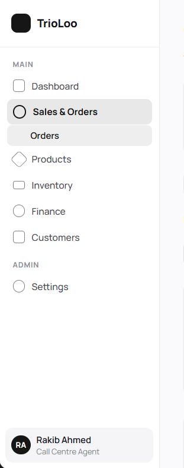
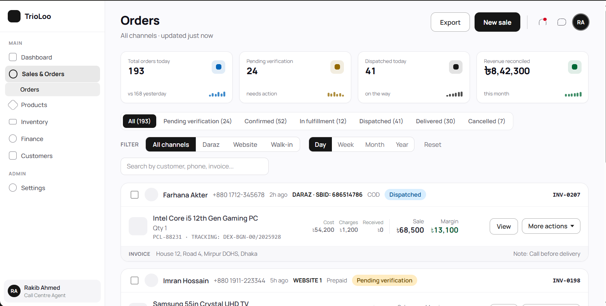
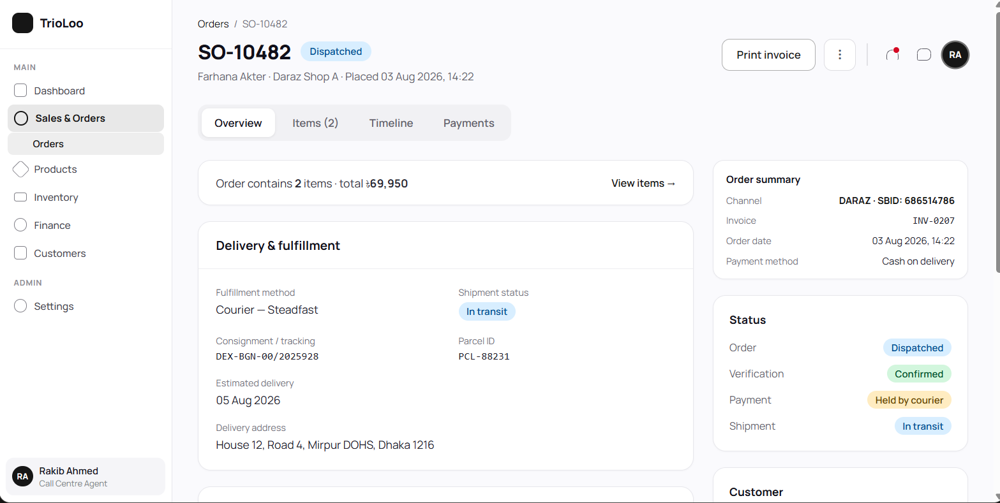
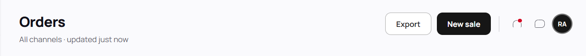
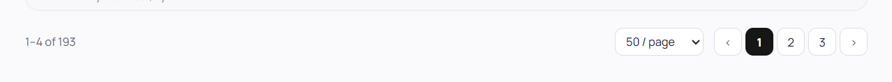

# ERP Design Reference

**Captured:** 2026-08-10 · **Source:** TrioLoo · **Status:** **Binding visual reference**
**Reconciled with:** [`../DESIGN_CONSTITUTION.md`](../DESIGN_CONSTITUTION.md) v2.7.0

---

## Primary Design Language Source

**Claude Design project:** `e56dcf10-69d0-4879-8fb8-6f8099bbdd3b`

| File | Role |
|---|---|
| **`Design Language.dc.html`** | 🔴 **PRIMARY token source.** Font stack, weights, type scale, core palette, semantic status pairs, spacing base, radius tiers, button/segment/badge geometry, shell and card rules |
| **`Order Dashboard.dc.html`** | **Screen validation** — list-page composition and real component usage |
| **`Order Details.dc.html`** | **Screen validation** — detail-page composition and real component usage |
| **`Form Design Language.dc.html`** | ✅ **APPROVED 2026-08-11. PRIMARY authority for the FORM surface class** — see below |
| **`Overlay & Destructive Design Language.dc.html`** | ✅ **APPROVED 2026-08-11. PRIMARY authority for the OVERLAY surface class and DESTRUCTIVE ACTION treatment** — see below |
| **`support.js`** | ⚠ **Contributes no canonical visual value.** See below |

> **`support.js` contains runtime/support behaviour only and contributes no canonical visual token.**
>
> **Verified by inspection:** zero `oklch` values · zero `Manrope` references · zero design tokens · zero breakpoints · no component styling. **It is generated `dc-runtime` framework code.** ⚠ **Its only `@media` rule is an unrelated print stylesheet belonging to the runtime — it must not be read as responsive design.**

## Source precedence

**1.** `Design Language.dc.html` → **2.** `Order Dashboard.dc.html` → **3.** `Order Details.dc.html` → **3b.** `Form Design Language.dc.html` *(form surface class only)* → **3c.** `Overlay & Destructive Design Language.dc.html` *(overlay surface class and destructive action only)* → **4.** the captures below → **5.** `DESIGN_CONSTITUTION.md`.

> ⚠ **Where source states an exact value, that value governs.** **A PNG is a scaled raster: it confirms composition and proportion, never dimensions.** **The sidebar is `216px` by source, whatever a capture measures.**

---

## Local Visual References

### 01-sidebar-navigation.png

**Governs:** sidebar width and surface · brand/logo region · `MAIN` / `ADMIN` section labels · navigation density · **active parent and child treatment** · nesting depth · icon treatment · bottom-anchored profile block.

**Key facts it fixes:** the active state is a **neutral tinted pill with no left rail**; **parent and child both render active** simultaneously; **nesting stops at two levels**; the user block carries **name and role**.

### 02-orders-list.png

**Governs:** operational list composition — page header → KPI row → status tabs → filter row → search → order cards → pagination · KPI card anatomy · status tab and filter chip treatment · **order card structure** · **financial hierarchy** · footer strip.

**Key facts it fixes:** the collection is a **card list, not a table**; **active tabs and filter chips are dark-filled**; **secondary figures (Cost · Charges · Received) are demoted and divided** from primary **Sale · Margin**; margin renders green; external references and invoice numbers are monospaced.

### 03-order-detail.png

**Governs:** record-detail hierarchy — breadcrumb → title with inline status → tabs → **two-column main + right rail** · card and section-header treatment · key/value grids · summary and status cards.

**Key facts it fixes:** the right rail is **fixed width and does not reflow on desktop**; **active detail tabs are white-raised on a tinted container** (unlike the list's dark-filled tabs); the Status card shows **one row per lifecycle with its own badge**, never merged into a single status.

### 04-page-header.png

**Governs:** page title and subtitle · action placement · secondary-then-primary ordering · utility cluster (notifications, chat, avatar) · separator.

**Key facts it fixes:** **exactly one dark-filled primary per header**, rightmost of the action pair; ⚠ **there is no global header search** — it was removed in the final direction; the header is a **content-region pattern, not a full-width application bar**.

### 05-pagination.png

**Governs:** results count · page-size selector · previous/next controls · numbered pages · **active-page treatment** · alignment · terminal-region spacing.

**Key facts it fixes:** count sits **left**, controls **right**; the **active page is dark-filled with no border**; the row sits **on the page background, not inside a card**; ⚠ **there is no persistent application footer** — the page ends at `64px` of terminal padding.

---

## Form Design Language — approved 2026-08-11

**Claude Design project file:** `Form Design Language.dc.html`. **Ratified into the Constitution at `§3.18`, `RULE 6.0.b`, `RULE 8.17`.**

**Governs:** the FORM surface class — labelled field composition · text input and select geometry · **rest, focus, filled, error and disabled states** · the label / entered value / placeholder / helper / error typographic hierarchy · required marking · controls demonstrated on **both** `#FFFFFF` and the canonical app background.

**Key facts it fixes:**

- 🔴 **The enabled form-control boundary is `oklch(0.65 0.006 290)`** — **`3.24` on white, `3.10` on the app background.** ⚠ **It exists because an enabled form control may be EMPTY, and it applies to NOTHING ELSE.** **Card, utility-control, secondary-button and divider boundaries are unchanged.**
- **Control geometry is `34px` / `9px` radius / `13px` text** — dense and operational, matching the approved search input. ⚠ **The `32px` list-page utility select is a different surface class and survives unchanged.**
- **Focus is the existing ink `oklch(0.2 0 0)` boundary plus a solid `oklch(0.93 0 0)` halo.** ✅ **No new accent, no alpha.**
- **Error is the canonical red `oklch(0.48 0.16 25)`,** and 🔴 **the outline marker and message are MANDATORY** — the boundary change alone measures only `2.19`.
- **Disabled is deliberately LIGHTER than enabled** — SC 1.4.11 exempts inactive components. 🔴 **It is not read-only, not permission-restricted and not workflow-unavailable.**
- ✅ **The two-column grid is this surface's REFERENCE COMPOSITION, not an ERP-wide mandatory form layout.**
- ✅ **The file uses the v2.5.0-ratified sidebar text colours rather than the superseded values still in `OD`/`ODT` markup.** 🔴 **That is correct and deliberate — screenshot fidelity never resurrects an inaccessible value.**

⚠ **No PNG capture has been taken yet.** **The `.dc.html` sits at precedence 3b and is already the higher authority; a capture is supplementary** (§"Source precedence"). **When one is added, name it `06-form-design-language.png` and keep this specification as its written record.**

⚠ **Deliberately NOT designed here:** **checkbox, radio, toggle, date/time picker, file input, autocomplete, rich text · read-only, permission-restricted and workflow-unavailable field treatments · form-level validation summary · business validation semantics.**

---

## Overlay &amp; Destructive Design Language — approved 2026-08-11

**Claude Design project file:** `Overlay & Destructive Design Language.dc.html`. **Ratified into the Constitution at `§3.19`, `RULE 3.6`, `RULE 3.3.c`, `RULE 3.11.a`, `RULE 3.11.b`.**

**Governs:** the OVERLAY surface class — dialog scrim · overlay panel and elevation · confirmation dialog · destructive confirmation · anchored action menu · destructive button and destructive menu row · focus across all three action types · overlays shown over **both** the app ground and dense white card content.

**Key facts it fixes:**

- 🔴 **A THIRD elevation now exists: `0 8px 24px oklch(0 0 0 / 0.1)`, and it is available to ratified detached overlays ONLY.** ⚠ **It exists for perceptual detachment. No shadow reaches 3:1, so a shadow is never WCAG component identification.**
- **The dialog scrim is `oklch(0.2 0 0 / 0.48)`** — the existing ink at one declared alpha, giving `3.23` panel separation over white content and `3.34` over the app ground. 🔴 **Dialogs only. Menus never carry a scrim, and no other alpha variant of ink exists.**
- **Dialog: `460px`, radius `16px`, card boundary, title `15.5px/700`** — a CARD-heading, never a page title. **The consequence is stated before the action is reachable.**
- **Menu: `216px`, radius `10px`, control boundary, `32px` rows** — anchored, compact, no scrim, no title. 🔴 **Menu and dialog are separate surface classes.**
- **Destructive red `oklch(0.48 0.16 25)` appears in exactly three places** — confirmation action fill, destructive menu row, outline marker. **Never a panel, scrim, border, body text or Cancel action.**
- **The destructive button is the primary button with the fill substituted** — same geometry, same weight. **Hover `oklch(0.54 0.16 25)` is reference-defined, not formula-derived.**
- ✅ **Focus is always ink, never red.** **The overlay family consumes the existing focus architecture and adds no new primitive.**

⚠ **No PNG capture yet.** **The `.dc.html` sits at precedence 3c and is the higher authority.** **If one is added, name it `07-overlay-destructive.png` and keep this specification as its written record.**

⚠ **Deliberately NOT designed here and NOT closed by this reference:** **drawer · toast · tooltip · command palette · mobile sheet · notification centre · popover classes other than the anchored action menu (filter panels, picker surfaces).** 🔴 **No business workflow, permission, cancellation rule or write-off rule — every label is neutral demonstration content.**

> ✅ **This reference discharged the last two V1 Design Foundation blockers.** **See Constitution `RULE 14.1`.**

---

## 🔴 Authority Boundary

**These references and the Claude Design project are authoritative for VISUAL DESIGN ONLY.**

| The design references govern | Canonical ERP architecture governs |
|---|---|
| Visual language · typography · colour · spacing · component appearance · density · composition | Modules · screen requirements · entities · fields · workflows · states · permissions · accounting meaning · business behaviour · API authority · domain ownership |

> **RULE — A visual mockup must NEVER silently override canonical business architecture.**
>
> ⚠ **Mockup sample data is not evidence of a business rule.** A navigation label, status name, field or figure in a capture that conflicts with canonical architecture is **a visual pattern to keep and a business claim to discard.**
>
> ⚠ **The sidebar taxonomy in `01-sidebar-navigation.png` is visual guidance only.** **It is not the ERP module register.** Canonical modules live in `MASTER_DOCUMENTATION_INDEX.md` and `SYSTEM_ARCHITECTURE.md`. Deriving navigation structure is **UI/UX Architecture work**, not a design-foundation decision.

---

## 🔴 Replacement record — 2026-08-10

**The 2026-08-04 capture set was replaced on business instruction.** Recorded rather than silently swapped, because references sit at the top of the visual precedence chain.

| | Previous set | This set |
|---|---|---|
| **Typography** | **Inter** | **Manrope** 400/500/600/700/800 |
| **Accent** | **Orange `#FF7A00`** | **`oklch(0.2 0 0)` near-black** |
| **Active nav** | Orange left rail + tint + orange label + orange icon | **Neutral tinted pill, no rail** |
| **Status tabs** | Underline on active | **Pill segments, dark-filled when active** |
| **Filter chips** | Orange-filled | **Dark-filled** |
| **Header search** | Present | 🔴 **Removed** |
| **Sidebar taxonomy** | Overview · Inventory · Sales & Orders · Accounting · HR Payroll · Tasks Management | Dashboard · Sales & Orders · Products · Inventory · Finance · Customers · **ADMIN → Settings** |
| **Sidebar footer** | — | **Persistent user card with role line** |

**Added by this set:** ✅ **record-detail archetype (03)** · **page-header archetype (04)** · **pagination and terminal region (05)** — none of which the previous set specified.

🔴 **Lost by this set: the modal archetype.** `03-new-sale-modal.png` was the only modal capture, and four v1.x Constitution articles cited it. **Those citations were removed, and modal, drawer and popover surfaces are now recorded as `NOT DEFINED BY SOURCE`** at Constitution Article VI and Article XIV.

✅ **One accessibility deviation retired.** The old register carried `A11Y-01` because orange measured 2.61:1 on white and ≈2.5:1 on tint. **No orange interaction colour exists, so the deviation is void.** ⚠ **A fresh evaluation against the new palette is outstanding — nine pairs are registered at Constitution §8.3, and focus indication is an outright gap.**

> ✅ **FOLLOW-UP, 2026-08-11 — appended, not rewritten** (the record above stands as written on 2026-08-10). **The outstanding evaluation was completed: 21 pairs measured at Constitution `§8.3`, the boundary findings ruled per control class at `§8.4`–`§8.6`, and `A11Y-08b` CLOSED at `§8.7` by the approved Form Design Language reference.** **Focus indication has an interim floor (`RULE 6.0.a`) and a designed treatment for form controls (`RULE 6.0.b`).** 🔴 **The lost modal archetype noted above remains lost, and modal/drawer/popover surfaces are still undefined.**

---

## Adding to this folder

Name new captures `NN-screen-name.png` and add a section here specifying what the image **fixes** — structure, spacing, states and colour roles. Amend the Constitution in the same change if the capture establishes a new pattern.

**A screenshot without a written specification is not a reference.** Record what the image *fixes*, not merely what it shows, so the next person knows which properties are binding and which are incidental to the capture.

**Replacing the whole set follows the procedure at Constitution §12.3.** ⚠ **Old captures and new rules must never coexist as competing authorities.**
